# 第八章：高级云集成和服务

在本章中，我们将深入探讨云集成和服务的先进领域，强调 Visual Studio 2022 如何作为一个强大的工具来开发和管理工作负载应用。在今天的数字生态系统中，云计算已成为基石，它使可扩展、弹性高和高度可用的应用成为可能。为了保持领先，开发者不仅要构建健壮的应用程序，还要将它们无缝集成到各种云平台中。

在本章中，我们将学习如何利用各种云服务的力量，简化我们的开发工作流程，并确保我们的应用程序针对云环境进行了优化。无论是将无服务器函数部署到 Azure，还是集成 Google Cloud 服务，或者利用 AWS 提供的丰富工具，本章都将为您提供在高级云开发中取得卓越成就所需的知识和技能。

本章涵盖的关键主题包括以下内容：

+   探索 .NET Aspire

+   探索 Visual Studio 2022 中的 Azure Functions 开发

+   探索 Google Cloud Tools for Visual Studio

+   探索 AWS 工具包

让我们开始我们的旅程，共同掌握云集成和构建前沿的云应用。

# 技术要求

在编写本章时，我使用了以下版本的 Visual Studio：

+   Visual Studio Enterprise 2022 版本 17.12.0

+   预览 1.0

为了获得最佳体验，请考虑以下内容：

+   Azure 订阅

+   Google Cloud Platform 订阅

+   AWS 订阅

本章的代码文件可以在[`github.com/PacktPublishing/Mastering-Visual-Studio-2022/tree/main/ch08`](https://github.com/PacktPublishing/Mastering-Visual-Studio-2022/tree/main/ch08)找到

# 探索 .NET Aspire

2023 年 11 月，作为 .NET 8 的一部分，微软推出了 .NET Aspire。微软的动机是将 .NET 打造成为构建云原生应用最富有生产力的平台之一。这项技术可以无缝集成到流行的容器化平台，如 Docker 和 Kubernetes，从而简化应用程序及其在云原生环境中的管理和部署。在本节中，我们将探讨 .NET Aspire 是什么，以及 Visual Studio 如何引导我们完成其开发过程。

.NET Aspire 代表一套复杂的工具集，旨在简化在云环境中构建可观察、健壮和可扩展的应用程序。该框架在设计上侧重于云特定需求，旨在通过提供一系列连贯的实用工具和方法，简化开发云原生解决方案的过程。.NET Aspire 的核心方面包括以下内容：

+   **针对云的框架**：专门针对在云应用程序开发过程中遇到的独特挑战，.NET Aspire 强调易于观察、易于部署以及能够在分布式系统中运行的重要性。

+   **基于组件的设计**：作为一系列 NuGet 包呈现，这些组件满足云计算中的不同需求，允许开发者仅包含他们项目所必需的元素。这种模块化结构不仅提高了适应性，还提高了生产力。

+   **简化的开发工作流程**：通过引入一套统一的工具和实践，.NET Aspire 简化了适用于云的 .NET 应用程序的组装。它为数据库如 Redis 和 PostgreSQL 等提供了预配置的模块，从而简化了它们与项目的集成。

+   **增强的开发工具**：通过项目模板和与 Visual Studio 以及 .NET CLI 的集成，工具包丰富了开发周期，使得应用程序的启动和管理更加直接。

.NET Aspire 允许我们管理应用程序不同部分的组织和链接，使得组装相互连接的服务和识别可用资源变得更加简便。它通过提供解决与云部署相关常见问题的 NuGet 包，提供标准化的组件，为诸如监控、诊断和数据传输等任务提供预定义的设置。

通过引入结构良好的项目模板以增强应用程序的组织并加快设置阶段，以及提供关键项目如应用程序主机和默认服务，.NET Aspire 满足那些希望在云基础设施中构建可扩展、容错和可维护的应用程序的专业人士。

它对以云为中心的开发的关注使其成为 .NET 社区中的一个重要资产，使开发者能够充分利用云技术为他们的软件解决方案。

让我们探索 Visual Studio 为我们准备的 .NET Aspire 相关内容。为此，我们将使用 **.NET Aspire 启动应用程序** 模板创建一个新的项目。在这个例子中，我们将将其命名为 **SampleAspireProject**。

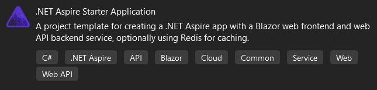

图 8.1 – .NET Aspire 启动应用程序模板

当你创建一个新的项目时，Visual Studio 将打开一个 **概览** 页面，提供有关构建和部署我们的应用程序以及服务发现的 Microsoft 文档链接：

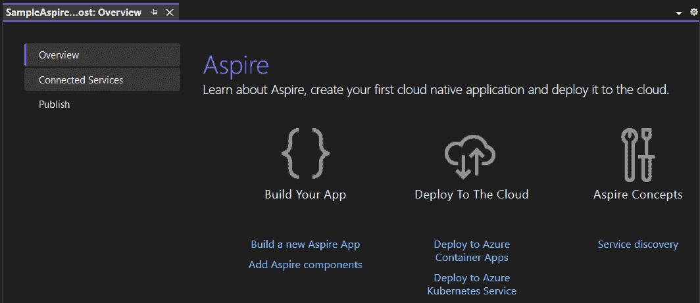

图 8.2 – Aspire 概览页面

在同一页面上，我们可以找到更多标签页；第二个是 **连接服务**。通过点击此选项，我们可以访问两个选项，允许我们添加服务依赖项和服务引用。

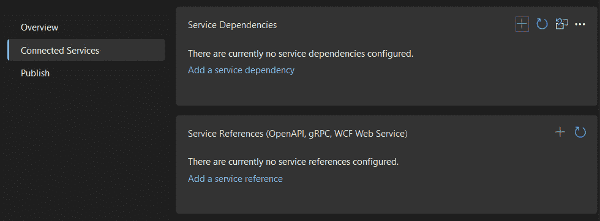

图 8.3 – 连接的服务

点击**添加服务依赖**链接后，会弹出一个窗口，允许我们选择要添加到解决方案中的 Azure 服务。

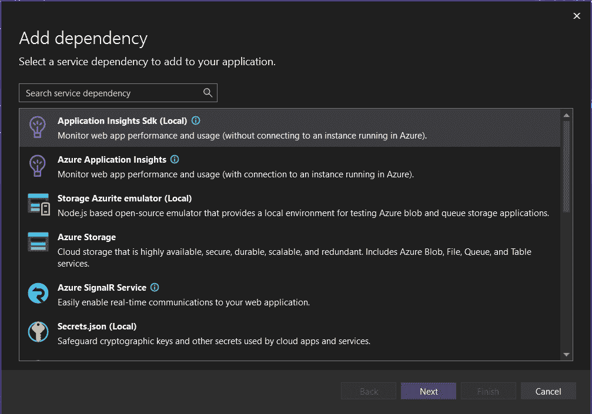

图 8.4 – 添加依赖

注意，为了能够完成添加依赖的过程，我们需要一个有效的 Azure 订阅。

返回到**连接的服务**，然后点击**添加服务引用**链接。这将为我们提供一个窗口，使我们能够选择三种 API 规范之间的选择 – **OpenAPI**、**gRPC**和**WCF Web Service**。

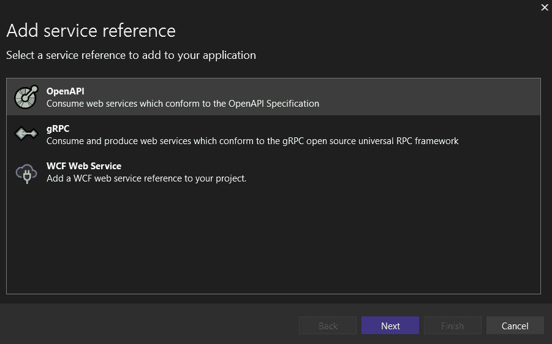

图 8.5 – 添加服务引用

我们使用的模板为我们的解决方案设置了四个项目：

+   **ApiService**：ASP.NET Core 最小 API，作为后端逻辑层

+   **AppHost**：这是我们托管解决方案配置的项目

+   **ServiceDefaults**：表示包含默认配置和跨多个服务在解决方案中使用的潜在对象的共享项目

+   **Web**：这是一个 Blazor 项目，专注于前端开发。

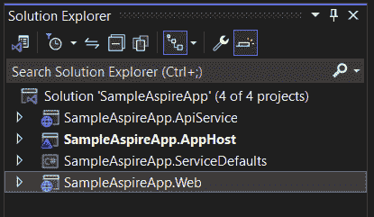

图 8.6 – 启动应用程序组件

默认情况下，**AppHost**项目被设置为启动项目。因此，当我们启动解决方案时，.NET Aspire 模板会打开**SampleAspireApp** **仪表板**窗口。

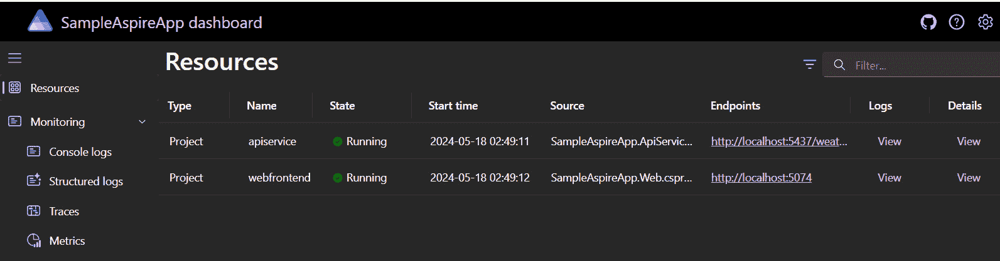

图 8.7 – .NET Aspire 仪表板

仪表板通过不同的指标，如日志、跟踪和环境配置，提供了关于我们解决方案的关键信息。在**资源**面板中，我们可以访问我们解决方案的每个端点。在这个模板项目中，我们在仪表板中检索了**apiservice**和**webfrontend**。

在我们云原生解决方案的本地开发完成后，我们可以直接将其发布到我们的 Azure 平台。请注意，我们需要安装 Azure Developer CLI。要创建发布配置文件，我们可以从顶部菜单重新打开**概览**窗口（**项目** | **概览**）。

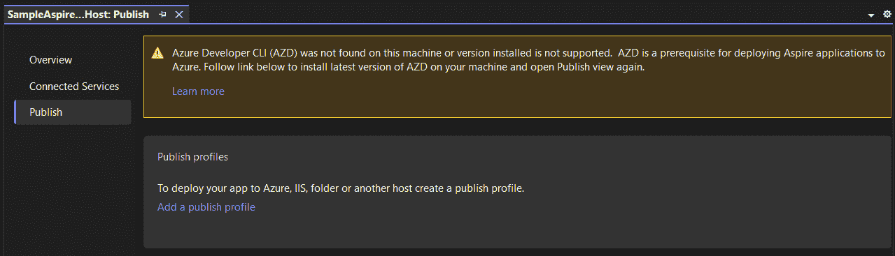

图 8.8 – 发布配置文件

通过使用.NET Aspire 中的 Visual Studio，我们已经设置了一个准备部署的云原生应用程序。在下一节中，我们将探讨在 Visual Studio 中开发 Azure Functions。

# 探索在 Visual Studio 中开发 Azure Functions

Visual Studio 为 Azure 平台提供了几个内置模板。由于 Azure Functions 是微软最受欢迎的云原生功能，我们将在本节中重点介绍它。

简而言之，Azure Functions 是微软 Azure 提供的一种无服务器计算服务，允许开发者运行小块代码，无需担心底层基础设施。

Azure Functions 设计用于响应来自各种来源的事件，包括 HTTP 请求、计时器、数据库更改以及许多其他 Azure 服务。这种事件驱动模型使我们能够构建能够对实时数据更改做出反应、自动化任务以及与其他系统无缝集成的应用程序。

首先，我们需要确保 Azure 开发工作负载已安装在我们的 Visual Studio 实例中，方法是导航到 Visual Studio 安装程序。

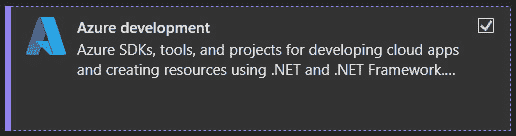

图 8.9 – Azure 开发工作负载

工作负载安装完成后，我们可以开始创建一个新的 Azure Functions 项目，在这个例子中，我们将将其命名为 **SampleAzureFunction**。

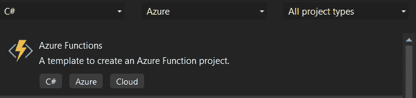

图 8.10 – Azure Function 项目

在下一步中，Visual Studio 将引导我们到一个 **附加信息** 窗口，在那里我们被要求配置工作进程、触发器和授权使用。

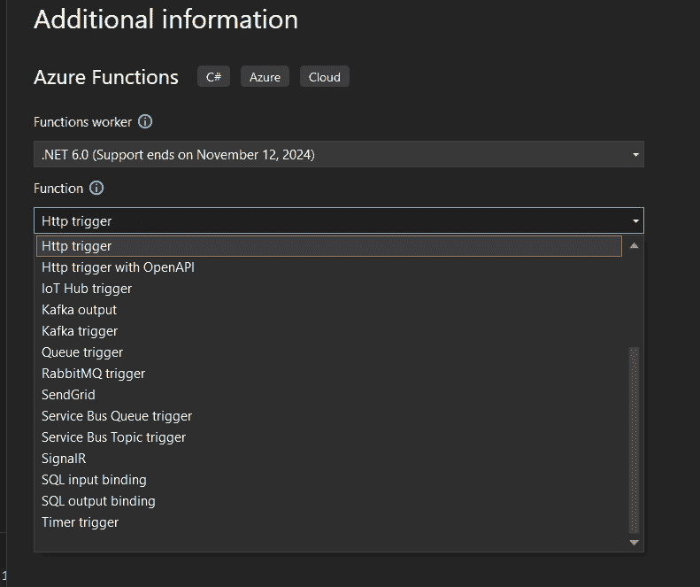

图 8.11 – 选择 Azure Functions 触发器

让我们探索和理解 Azure Functions 提供的不同触发器选项：

+   **HTTP 触发器**：允许您创建一个可以调用来执行函数的 HTTP 端点。这对于创建 RESTful API 很有用。

+   **带有 OpenAPI 的 HTTP 触发器**：类似于 HTTP 触发器，但包括对 OpenAPI（以前称为 Swagger）的内置支持，这使得设计和记录 API 更容易。

+   **IoT Hub 触发器**：使函数能够响应发送到 IoT Hub 事件流的的事件。适用于处理来自 IoT 设备的遥测数据。

+   **Kafka 输出**：将消息写入 Kafka 主题。当您想从 Azure Function 发布消息到 Kafka 主题时使用。

+   **Kafka 触发器**：从 Kafka 主题消费消息。这对于在 Azure Function 内部处理来自 Kafka 主题的传入消息很有用。

+   **队列触发器**：每当有新消息添加到 Azure Queue Storage 队列时，执行函数。适用于处理队列任务。

+   **RabbitMQ 触发器**：从 RabbitMQ 队列消费消息。这对于与基于 RabbitMQ 的应用程序集成很有用。

+   **SendGrid**：允许您使用 SendGrid 的电子邮件服务直接从 Azure Function 发送电子邮件。这对于通过电子邮件发送通知或警报特别有用。

+   **Service Bus 队列触发器**：响应来自 Service Bus 队列的消息。这对于异步处理消息来说非常理想。

+   **Service Bus 主题触发器**：响应发布到 Service Bus 主题的消息。这对于实现发布/订阅模式很有用。

+   **SignalR**：使您能够在无服务器环境中运行实时消息传递 Web 应用程序。对于需要向客户端实时更新数据的场景来说非常好。

+   **SQL 输入绑定**：从 SQL 数据库检索数据并将其传递给函数的输入参数。这对于查询数据库和处理结果很有用。

+   **SQL 输出绑定**：将数据写入 SQL 数据库。这对于根据函数的执行逻辑更新数据库很有用。

+   **定时器触发器**：按照计划运行函数，例如每分钟、每小时或每天。这对于定期任务，如备份或报告，非常合适。

一旦我们选择了函数类型，我们必须选择授权级别以控制我们的 Azure 函数。这三种类型如下：

+   **函数**：此级别限制访问权限仅限于那些已被授予调用函数的特定权限的用户。通常在我们想要比其他两个级别更细致地控制对函数的访问时使用。

+   **匿名**：此级别允许任何客户端（认证或不认证）调用函数，而无需提供凭证。这对于公共 API 或不需要认证的函数很有用。

+   **管理员**：此级别授予函数完全管理权限，允许它代表调用者执行操作，就像它们以管理员身份登录一样。由于其广泛的权限，应谨慎使用。

一旦我们设置完毕，我们就可以开发函数的逻辑，并且为了回应我们的利益相关者，下一步是将它发布到我们的 Azure 订阅中：

1.  在 **解决方案资源管理器** 中右键单击项目并选择 **发布**。

1.  然后，选择 **Azure** 作为目标并点击 **下一步**。最后，选择 **Azure 函数应用（Windows）** 作为特定目标。

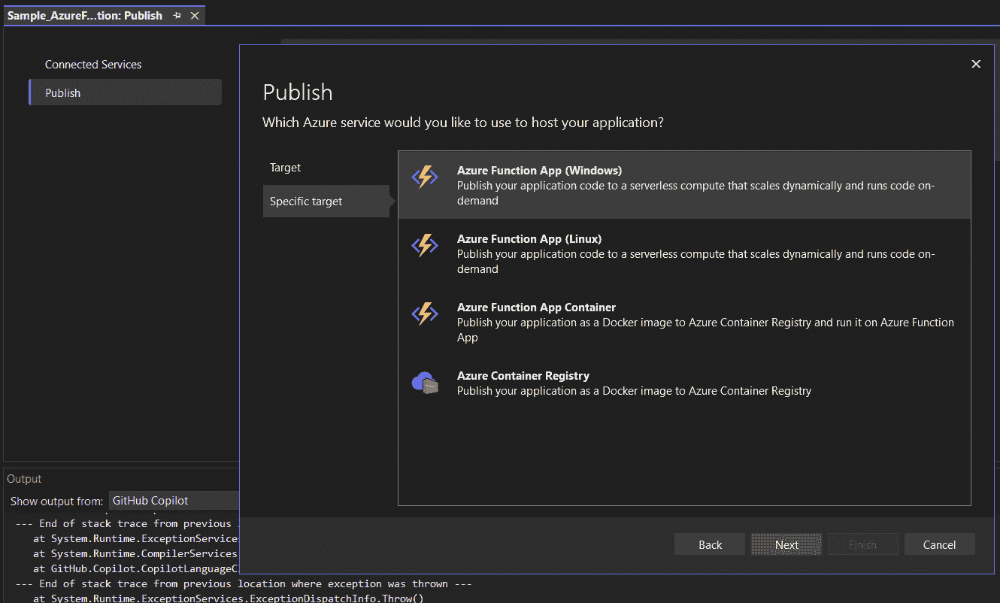

图 8.12 – 发布特定目标

1.  然后，我们需要为我们的函数应用选择一个独特的名称，以确保它不会在全球范围内重复任何现有名称。

1.  接下来，我们将从可用选项中选择我们的 Azure 订阅。我们可以选择一个现有的资源组或创建一个新的资源组。对于计划类型，我们将选择 **消费** 计划，以确保基于实际使用的成本效益执行。

1.  我们将选择一个地理位置靠近我们的用户或服务的区域，以获得更好的性能。如果需要，我们将设置一个通用存储账户。我们还将启用 **应用程序洞察** 以监控和诊断我们的函数应用。

1.  在部署期间，我们需要确保选择 **从包运行** 选项。这允许我们的函数应用直接从部署包中执行，从而提高性能并简化部署过程。在审查完所有设置后，我们将点击 **发布** 以开始部署。一旦部署成功完成，将显示一条成功消息。

1.  最后，我们将前往 Azure 门户并导航到我们的函数应用，以确保它正在正确运行。通过门户，我们可以监控日志、测试端点并管理我们的函数。

由于 Azure 是微软生态系统的一部分，我们可以在整体企业解决方案中使用其他云平台。接下来，让我们开始探索如何使用 Visual Studio 增强我们的 Google Cloud Platform 开发。

# 探索适用于 Visual Studio 2022 的 Google Cloud 工具

**Google Cloud Platform**（**GCP**）是 Google 开发的一种公共云计算服务，提供各种基于云的解决方案。就像其他云平台一样，这些包括计算、存储、网络、大数据、机器学习和**物联网**（**IoT**）等服务。GCP 允许我们和企业使用 Google 的强大基础设施创建和部署应用程序和服务，并从 Google 全球网络的扩展性、灵活性和安全性中受益。在本节中，我们将探讨 Visual Studio 2022 的 GCP 扩展。

首先，我们需要通过顶栏菜单中的**扩展管理器**（**扩展** | **管理扩展…**）安装扩展，并搜索**Google Cloud Tools**：

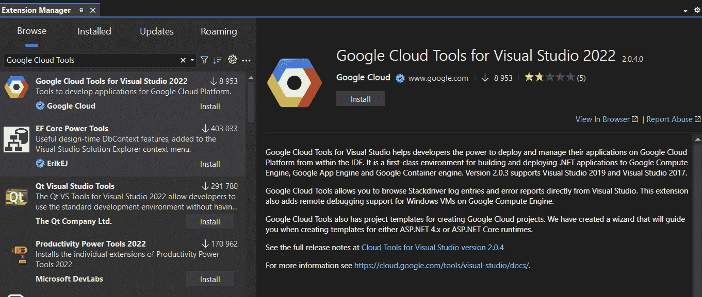

图 8.13 – 扩展管理器 | Google Cloud Tools

就像安装每个新的 Visual Studio 扩展一样，我们在点击**安装**按钮启动修改的开始后，需要关闭我们的实例。

由于我们已经安装了 Google Cloud Tools 扩展，我们可以通过连接到我们的 Google 账户来将我们的项目部署到 App Engine。我们通过在顶栏菜单中启动 Google Cloud Explorer 来实现这一点（**工具** | **Google Cloud Tools** | **显示 Google Cloud Explorer**）：

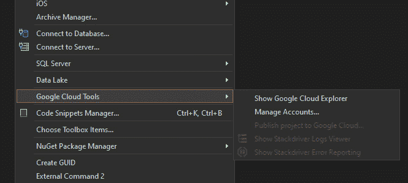

图 8.14 – 显示 Google Cloud Explorer

这将打开一个新窗口，用于输入我们有效 Google 账户的信息。

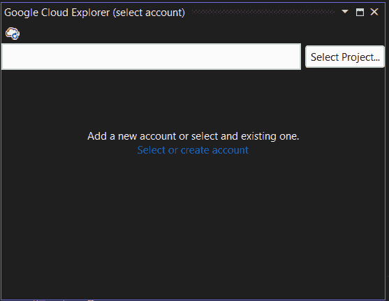

图 8.15 – 添加新账户

我们现在在扩展中拥有一个集成的部署助手，可以将您的应用程序部署到以下兼容目标：

+   用于 ASP.NET 应用程序的 Compute Engine

+   适用于 ASP.NET Core 应用程序的灵活 App Engine 和 Google Kubernetes Engine

部署助手会自动检测与我们的项目兼容的兼容目标，并引导我们完成部署过程。

可以通过选择**工具** | **Google Cloud Tools** | **将 [项目名称] 发布到 Google Cloud**，或者在**解决方案资源管理器**中的项目节点上右键单击并点击**将 [项目名称] 发布到 Google**，或者通过选择**工具** | **Google Cloud Tools** | **发布 [项目名称]** **到 Google** 来调用部署助手。

注意，如果解决方案的启动项目与 Google Cloud 兼容，则**将 [项目名称] 发布到 Google Cloud** 菜单项才会启用。

部署助手显示与所选项目兼容的 Google Cloud 部署目标。

如果我们想更改项目，可以通过点击**工具** | **Google Cloud Tools** | **打开云资源管理器**来打开云资源管理器，并选择我们想要部署的项目。

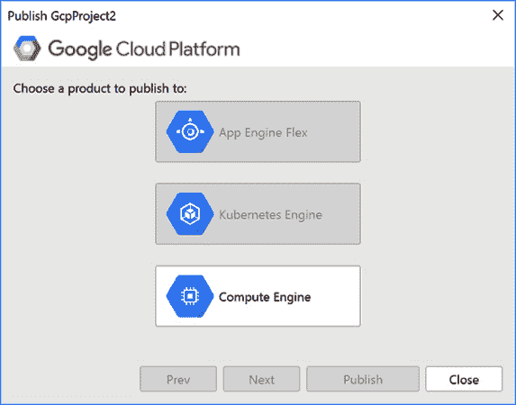

图 8.16 – 选择要发布的产品

注意，ASP.NET 4.x 应用程序仅在 Compute Engine 上的 Windows VM 上运行。要将我们的 ASP.NET 4.x 应用程序部署到 Compute Engine，请按照以下步骤操作：

1.  通过点击**工具** | **Google Cloud Tools** | **将[项目名称]发布到** **Google Cloud** 来打开部署助手。

1.  选择**计算引擎**。

1.  选择**Windows VM**实例和部署凭据。**Windows VM**必须运行**互联网信息服务**（**IIS**）并能运行 ASP.NET 4.x 应用程序，例如由部署管理器创建的 VM ASP.NET。

1.  选择部署的凭据。要创建 Windows 凭据，请点击**管理凭据**。

1.  点击**发布**以创建我们的应用程序并将其部署到所选的虚拟机。

部署进度在 Visual Studio 输出窗口中显示，并在 Visual Studio 的系统托盘状态栏中显示进度指示器。

ASP.NET Core 应用程序的部署可以在 Docker 容器中运行，这样您的应用程序就可以在灵活的 App Engine 和**Google Kubernetes Engine**（**GKE**）环境中部署。

要部署到灵活环境，请按照以下步骤操作：

1.  通过点击**工具** | **Google Cloud Tools** | **将[项目名称]发布到** **Google Cloud** 来打开部署助手。

1.  选择**App Engine Flex**以将应用程序部署到 App Engine。

1.  输入我们应用程序版本的名称和流量管理选择。

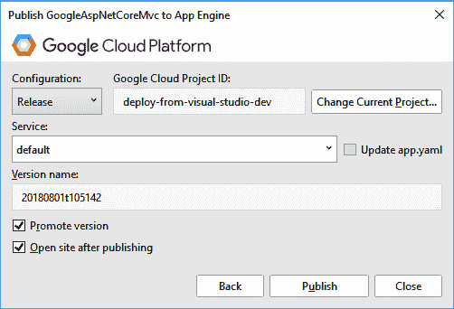

图 8.17 – 将 AspNetCore 发布到 App Engine

默认版本名称基于当前系统时间。我们可以指定另一个名称。请注意，如果我们指定了一个已存在的版本名称，之前的版本将被覆盖。**推广版本**复选框允许我们选择是否让这个应用程序版本接收 100%的流量。如果此框被勾选，新应用程序将在部署后立即接收所有流量。

1.  点击**发布**以创建您的应用程序并将其部署到灵活的 App Engine 环境。

就这样 – 我们的应用程序已部署，进度在 Visual Studio 输出窗口中显示。

要部署到**GKE**，请按照以下步骤操作：

1.  通过点击**工具** | **Google Cloud Tools** | **将[项目名称]发布到** **Google Cloud** 来打开部署助手。

1.  选择**容器引擎**以部署我们的应用程序。

1.  选择部署的集群，并输入您应用程序的部署名称、版本和副本实例数量。

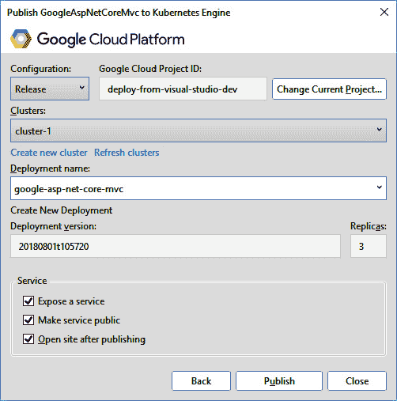

图 8.18 – 将 AspNetCore 发布到 Kubernetes 引擎

注意三个复选框，允许我们微调我们的服务：

+   **暴露服务**选项指的是使我们的应用可以从 Kubernetes 集群外部访问的能力。本质上，它创建了一个 Kubernetes 服务，将我们的应用暴露给外部流量。

+   **使服务公开**选项与**暴露服务**密切相关，具体指的是使公开的服务在互联网上公开可访问。当我们选择将应用作为服务公开并使其公开时，GKE 为我们的服务分配一个公共 IP 地址，允许外部客户端访问它。

+   选择**发布后打开站点**将自动打开一个指向我们新部署的应用程序 URL 的网页浏览器窗口。

要创建集群，请按照以下步骤操作：

1.  点击**创建新集群**。我们将被重定向到 Google Cloud 控制台中集群创建页面。

1.  要在 Visual Studio 中显示集群，请点击**刷新集群**。

部署名称用于创建 Kubernetes 部署，或者如果选中，将是运行在集群上应用的服务名称。我们可以修改名称使其更具描述性。

注意，如果我们使用一个已存在的名称，旧部署将被更新而不是创建一个新的。默认版本名称基于当前系统时间。我们可以指定另一个名称。

我们可以选择将 Kubernetes 服务暴露在互联网上。通过在互联网上公开一个服务，我们获得一个公共 IP 地址，我们可以使用它来访问集群外的服务。

1.  点击**发布**。

然后，我们的应用就被容器化在 Docker 镜像中，并在我们的容器中部署。如果我们的应用是一个公开的服务，Visual Studio 将等待服务的 IP 地址变得可用。

现在我们已经看到使用 Google Cloud Tools 将我们的应用程序优雅地部署到 Google Cloud Platform 是多么容易，我们将继续下一节，通过 AWS Toolkit 探索 Amazon 的云平台。

# 探索 AWS Toolkit

Visual Studio 的 AWS Toolkit 是一个扩展，旨在增强在 **WS** 上创建、测试和部署 .NET 应用程序的开发体验。在本节中，我们将探讨该扩展如何简化在 Visual Studio 中与 AWS 服务一起工作。

首先，我们需要通过顶部菜单中的**扩展管理器**（**扩展** | **管理扩展…**）安装扩展，并搜索**AWS Toolkit with Amazon Q**。

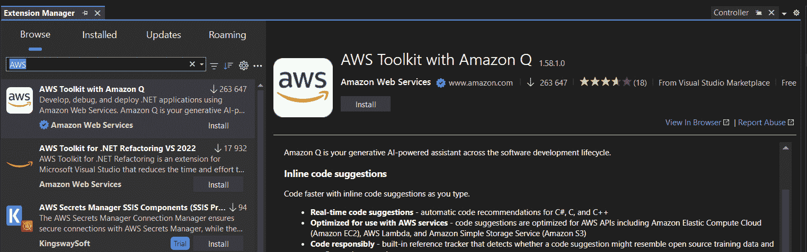

图 8.19 – AWS Toolkit with Amazon Q

就像安装每个新的 Visual Studio 扩展一样，我们在点击**安装**按钮以启动修改后需要关闭实例。

通过工具集集成的关键 AWS 服务包括 **Amazon Simple Storage Service**（**S3**）、**Amazon Elastic Compute Cloud**（**EC2**）、AWS Elastic Beanstalk 和 Amazon DynamoDB。

一旦安装了扩展，我们就可以通过顶栏菜单开始配置它 – **扩展** | **AWS Toolkit** | **入门**。

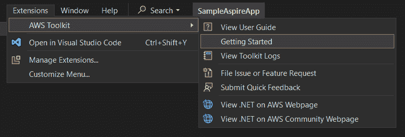

图 8.20 – AWS Toolkit | 入门

这将使我们能够连接到我们的 AWS 订阅，设置 AWS Toolkit 的两个主要功能：

+   **AWS Explorer**：一个用于导航 AWS 服务、监控存储和管理资源的中心枢纽，可以直接从 Visual Studio 进行操作。

+   **Amazon Q**：代表一套综合的 AI 工具集，旨在通过利用生成式 AI 的力量和与 AWS 服务的深度集成，在组织内部的各种领域内促进更好的决策、提高生产力和简化操作。

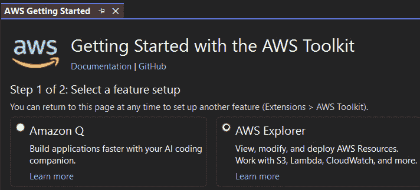

图 8.21 – AWS 入门

AWS Explorer 设计用于为我们提供一个无缝的方式，直接从我们的开发环境中与各种 AWS 服务进行交互。它充当本地开发环境和云之间的桥梁，使我们能够执行以下任务：

+   **创建和管理 AWS 资源**：它允许我们轻松地在 Amazon EC2 上创建新实例，在 Amazon S3 中管理存储桶，并配置设置而无需离开 Visual Studio。现在，通过向我们的解决方案添加一个新项目，我们可以检索有关 AWS 的四个项目模板。

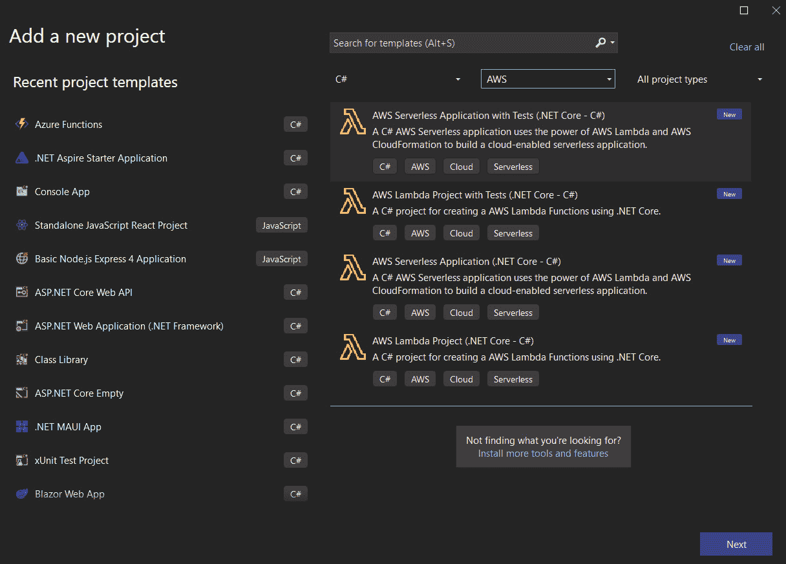

图 8.22 – AWS 项目模板

+   **部署应用程序**：通过支持 AWS Lambda，我们可以将函数和应用程序部署到我们的 AWS 订阅。

+   **监控和管理**：通过与 AWS CloudFormation 的集成，我们可以以代码的形式管理基础设施，确保 AWS 部署的一致性、可重复性和版本控制。

让我们考虑一个场景，其中我们想使用这个工具集通过 AWS Lambda 部署一个简单的无服务器函数。以下是我们可以如何操作：

1.  **本地编写函数**：首先，我们在本地编写一个.NET Core 函数，彻底测试以确保其按预期工作。

1.  **配置部署设置**：使用 AWS Explorer，我们配置部署设置，包括选择适当的运行时 (.NET Core)、设置任何必要的环境变量，并指定将执行函数的 IAM 角色。

1.  **部署函数**：只需点击几下或执行一些命令，我们就可以将函数部署到 AWS Lambda。AWS Explorer 负责打包函数代码，将其上传到 AWS，并配置必要的触发器或事件源。

1.  **监控和管理**：部署后，我们可以使用 AWS Explorer 来监控函数的性能，查看日志，并根据需要执行更新或更改，所有这些都可以在我们的开发环境中完成。

此示例说明了 AWS Explorer 如何与 AWS 服务集成，简化在 AWS 上运行的.NET Core 应用程序的开发生命周期，提供了一个统一的界面来创建、部署和管理云资源。

# 摘要

在本章中，我们探讨了使用 Visual Studio 2022 进行云集成和服务的先进方面。强调云计算在现代应用程序开发中的重要性，我们提供了详细的指南，说明如何利用 Visual Studio 的强大工具和扩展直接通过 IDE 构建和管理基于云的应用程序。

随着本章的结束，我们标志着掌握核心开发技能旅程的第二部分的结束。从高级 Web 开发到多平台、机器学习，再到现在的先进云技术，我们探讨了 Visual Studio 如何增强我们的前沿开发能力。

在即将到来的章节中，我们将继续拓展我们的视野，深入 DevOps 的世界，首先直接在 Visual Studio 中处理高级 Git 工作流程。

# 第三部分：通过 DevOps 实践简化协作开发

在本第三部分中，我们关注 Visual Studio 如何简化现代 DevOps 工作流程。您将了解 Visual Studio 如何简化高级 Git 工作流程，通过 GitHub Actions 自动化持续集成，并通过 Azure DevOps 促进无缝协作。此外，您将利用 Visual Studio 的 Docker 容器工具，使您能够在统一的 DevOps 环境中优化开发、测试和部署。

本部分包含以下章节：

+   *第九章* ，*处理高级 Git 工作流程*

+   *第十章* ，*使用 GitHub Actions 进行持续集成*

+   *第十一章* ，*使用 Azure DevOps 进行协作开发*

+   *第十二章* ，*Visual Studio Docker 容器工具*
