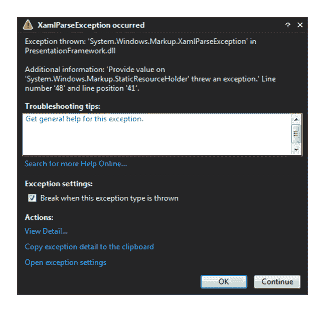
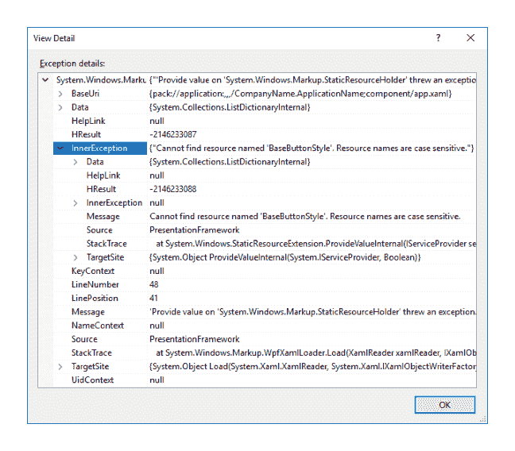

# 第二章：调试 WPF 应用程序

当我们的 WPF 程序未按预期工作，我们需要像对待任何其他语言一样对其进行调试。然而，一开始这可能看起来是一项艰巨的任务，因为 WPF 与其他语言非常不同。例如，当我们声明依赖属性时，我们通常为了方便添加一个 CLR 属性包装器。然而，当属性值改变时，WPF 框架不会调用它，所以我们会在那个设置器的断点被命中之前等待很长时间。

当我们在测试新开发的代码时，我们需要能够检查我们数据绑定属性的值，并且有几种方法可以做到这一点，尽管其中一些并不明显。在本章中，我们将调查一些重要的信息来源，以帮助我们定位代码中的错误。

我们将发现各种策略来帮助我们调试数据绑定值，并找出在遇到可怕的 `XamlParseException` 时如何追踪问题的实际原因。我们将详细讨论所有这些主题，但现在，让我们首先从绝对的基础开始。

# 利用输出窗口

当我们对 XAML 进行了更改但未在 UI 中看到我们期望看到的内容时，首先查找错误的地方是 Visual Studio 的输出窗口。如果此窗口尚未可见，则可以通过从视图菜单中选择输出选项或按 *Ctrl* + *W* 然后按 *O* 来显示它。

然而，如果您有一个绑定错误但在输出窗口中没有看到任何关于它的引用，这可能是因为您的 Visual Studio 当前未设置将调试信息输出到其中。您可以在 Visual Studio 选项对话框中启用此功能。导航到工具 | 选项 | 调试 | 输出窗口 | 通用输出设置。

在“通用输出设置”部分有几个选项，您可以打开或关闭它们。其中最重要的选项是“所有调试输出”和“异常消息”，但通常将它们全部设置为开启是一个好的实践。当设置后，绑定错误将以以下格式在输出窗口中显示：

```cs
System.Windows.Data Error: 40 : BindingExpression path error:
'ViewName' property not found on 'object' ''MainViewModel'
(HashCode=3910657)'. BindingExpression:Path=ViewName;
DataItem='MainViewModel' (HashCode=3910657); target element is 'TextBox'
(Name='NameTextBox'); target property is 'Text' (type 'String')
```

让我们更仔细地看看这个错误。这个错误的普通英语翻译如下：

+   在类型为 `MainViewModel` 且 `HashCode` 值为 `3910657` 的对象中不存在名为 `ViewName` 的公共属性。

+   错误是从 `Binding.Path` 值引发的，该值被指定为 `ViewName`，它设置在名为 `NameTextBox` 的 `TextBox` 实例的 `Text` 属性上

这可以用描述性的名称而不是具体细节来重写，如下所示：

```cs
System.Windows.Data Error: 40 : BindingExpression path error: 'PropertyOfBindingSource' property not found on 'object' ''TypeOfBindingSource' (HashCode=HashCodeOfBindingSource)'. BindingExpression:Path=UsedBindingPath; DataItem='TypeOfBindingSource' (HashCode=HashCodeOfBindingSource); target element is 'TypeOfBindingTarget' (Name='NameOfBindingTarget'); target property is
'PropertyOfBindingTarget' (type 'TypeOfBindingTargetProperty') 
```

现在我们有了解释这些值代表什么的“*关键*”，我们可以看到它们确实是描述性的。不仅我们提供了数据绑定 UI 控件的名称，如果设置了，以及使用的绑定路径，还包括数据源的类型，以及正在使用的该类型实际实例的哈希码。

这些错误突出了在 XAML 文件中犯下的错误。在此窗口中显示的错误类型将包括错误标记的绑定路径，例如使用不存在的属性名称，或无效的绑定源路径。虽然它不会捕获每个问题，但有一种方法可以使其输出可能帮助我们追踪更难以捉摸的问题的额外信息。为了做到这一点，首先显示选项对话框窗口。导航到工具 | 选项 | 调试 | 输出窗口 | WPF 跟踪设置。

在这里，你可以找到许多选项，每个选项都有不同级别的输出：动画、数据绑定、依赖属性、文档、可冻结、HWND 托管、标记、名称范围、资源字典和路由事件。各种输出级别及其含义如下：

+   关键：仅启用跟踪关键事件

+   错误：启用跟踪关键和错误事件

+   警告：启用跟踪关键、错误和警告事件

+   信息：启用跟踪关键、错误、警告和信息事件

+   详尽：启用跟踪关键、错误、警告、信息和详尽事件

+   ActivityTracing：启用跟踪停止、开始、挂起、传输和恢复事件

永久将数据绑定选项设置为警告或错误，而将其他选项设置为关闭，这种情况相当常见。使用这些选项的一般规则是使用所需的最小级别，除非在尝试查找问题时，因为它们会减慢应用程序的运行速度。然而，需要注意的是，这种额外的调试跟踪输出不会对发布构建产生任何影响。

如果你将数据绑定条目设置为详尽或全部输出，并在运行应用程序时查看输出窗口，你将理解为什么它会负面影响性能。即使不在输出窗口中显示此调试信息，当存在绑定错误时，WPF 框架仍将执行大量的检查。因此，清除显示的所有错误和警告非常重要，以最大限度地减少框架在尝试解决它们时的工作量。

# 利用演示跟踪源

尽管它很有用，但在某些情况下，使用输出窗口是不够的。也许我们现在有太多的输出需要查看，希望在工作回家的路上查看，或者也许我们需要在应用程序部署后查看这种类型的调试跟踪信息。在这些情况下以及其他情况下，是时候启用 WPF 演示跟踪源了。

我们可以采用多种不同的跟踪源来为我们输出详细的跟踪数据。选择与 WPF 跟踪设置选项中找到的选择相同，实际上，在设置这些值之后，输出窗口已经显示给我们调试跟踪输出。

默认情况下，WPF 使用`DefaultTraceListener`对象将信息发送到输出窗口，但我们可以覆盖它，并/或配置输出以发送到文本和/或 XML 文件，或者同时发送。 

为了完成这个任务，我们需要修改我们的`app.config`文件，该文件位于启动项目的根目录中。我们需要添加一个`system.diagnostics`部分，并在其中添加`sources`、`switches`和`sharedlisteners`元素。`switches`元素包含一个开关，用于确定输出级别，如前文所述。

`sharedlisteners`元素指定了我们想要利用的输出类型。这三种类型是：

+   `System.Diagnostics.ConsoleTraceListener`：将跟踪信息发送到输出窗口

+   `System.Diagnostics.TextWriterTraceListener`：输出到文本文件

+   `System.Diagnostics.XmlWriterTraceListener`：输出到 XML 文件

最后，我们需要为每个我们想要监听的跟踪源添加一个`source`元素，并指定我们想要与其一起使用的开关和监听器。因此，我们能够将不同的跟踪源输出到不同的媒体，并以不同的输出级别输出。这些跟踪源与 WPF 跟踪设置选项中找到的相同，尽管在配置文件中，我们需要指定它们的完整名称。

选项如下：

+   `System.Windows.Media.Animation`

+   `System.Windows.Data`

+   `System.Windows.DependencyProperty`

+   `System.Windows.Documents`

+   `System.Windows.Freezable`

+   `System.Windows.Interop.HwndHost`

+   `System.Windows.Markup`

+   `System.Windows.NameScope`

+   `System.Windows.ResourceDictionary`

+   `System.Windows.RoutedEvent`

+   `System.Windows.Shell`

让我们看看一个示例配置文件：

```cs
<?xml version="1.0" encoding="utf-8"?> 
<configuration> 
  <startup>  
    <supportedRuntime version="v4.0" sku=".NETFramework,Version=v4.6.1" /> 
  </startup> 
  <system.diagnostics> 
    <sources> 
      <source name="System.Windows.Data" switchName="Switch"> 
        <listeners> 
          <add name="TextListener" /> 
        </listeners> 
      </source> 
    </sources> 
    <switches> 
      <add name="Switch" value="All" /> 
    </switches> 
    <sharedListeners> 
      <add name="TextListener"  
        type="System.Diagnostics.TextWriterTraceListener"  
        initializeData="Trace.txt" /> 
    </sharedListeners> 
    <trace indentsize="4" autoflush="true"></trace> 
  </system.diagnostics> 
</configuration> 
```

从示例中的`system.diagnostics`部分来看，我们看到有一个指定了`System.Windows.Data`源（用于数据绑定信息）的源元素，一个名为`Switch`的开关，以及`TextListener`监听器。首先在`switches`部分中查找名为`Switch`的开关，并注意它被设置为`All`输出级别。

在此之下，在`sharedlisteners`元素中，我们看到名为`TextListener`的监听器。这个监听器是`System.Diagnostics.TextWriterTraceListener`类型，它输出到一个由`initializeData`属性值指定的文本文件。我们以一个`trace`元素结束，该元素设置文本文档的制表符大小为四个空格，并确保在每次写入后刷新缓冲区，以防止由于崩溃而丢失跟踪数据。

要设置更简洁的输出，我们可以简单地更改开关以使用其他输出级别之一，如下所示：

```cs
<add name="Switch" value="Error" /> 
```

如前所述，当在 Visual Studio 中设置特定选项时，WPF 可以使用`DefaultTraceListener`对象将跟踪信息发送到输出窗口。该监听器的名称为`Default`。为了停止此`DefaultTraceListener`的默认行为，我们可以使用我们的`source`元素将其移除，如下所示：

```cs
<source name="System.Windows.Data" switchName="Switch"> 
  <listeners> 
    <add name="TextListener" /> 
    <remove name="Default" /> 
  </listeners> 
</source> 
```

了解这一点是很好的，因为如果我们还配置了自己的 `ConsoleTraceListener` 对象，我们可能会遇到输出窗口重复跟踪事件的情况。然而，如果需要，也可以将多个监听器添加到每个 `source` 元素中：

```cs
<source name="System.Windows.Data" switchName="Switch"> 
  <listeners> 
    <add name="TextListener" /> 
    <add name="OutputListener" /> 
  </listeners> 
</source> 
```

我们还可以为不同的来源添加不同的监听器：

```cs
<source name="System.Windows.Data" switchName="Switch"> 
  <listeners> 
    <add name="TextListener" /> 
  </listeners> 
</source> 
<source name="System.Windows.DependencyProperty" switchName="Switch"> 
  <listeners> 
    <add name="OutputListener" /> 
  </listeners> 
</source> 
... 
<sharedListeners> 
  <add name="TextListener"  
    type="System.Diagnostics.TextWriterTraceListener"  
    initializeData="Trace.txt" /> 
  <add name="OutputListener"  
    type="System.Diagnostics.ConsoleTraceListener" /> 
</sharedListeners> 
```

可以按如下方式为不同的来源添加不同的输出级别：

```cs
<source name="System.Windows.Data" switchName="ErrorSwitch"> 
  <listeners> 
    <add name="TextListener" /> 
  </listeners> 
</source> 
<source name="System.Windows.DependencyProperty" switchName="AllSwitch"> 
  <listeners> 
    <add name="OutputListener" /> 
  </listeners> 
</source> 
... 
<switches> 
  <add name="AllSwitch" value="All" /> 
  <add name="ErrorSwitch" value="Error" /> 
</switches> 
```

WPF 展示跟踪来源提供的一个很酷的功能是能够创建我们自己的自定义跟踪来源：

```cs
<source name="CompanyName.ApplicationName" switchName="Switch"> 
  <listeners> 
    <add name="TextListener" /> 
  </listeners> 
</source> 
```

注意，`DefaultTraceListener` 已经在上一节提到的 WPF 跟踪设置选项中配置为向输出窗口发送信息，因此从这个来源发出的跟踪信息也将自动发送到输出窗口。如果您尚未设置这些选项但希望在那里查看跟踪输出，那么您需要手动将 `ConsoleTraceListener` 的引用添加到此来源，如前述代码片段所示。

在代码中，我们现在能够将自定义跟踪信息输出到这个来源：

```cs
TraceSource traceSource = new TraceSource("CompanyName.ApplicationName");
traceSource.TraceEvent(TraceEventType.Information, eventId, "Data loaded"); 
// Alternative way to output information with an event id of 0 
traceSource.TraceInformation("Data loaded"); 
```

为了指定不同的重要性级别，我们使用 `TraceEventType` 枚举：

```cs
traceSource.TraceEvent(TraceEventType.Error, eventId, "Data not loaded"); 
```

在输出调试信息后，我们可以选择刷新现有的监听器，以确保它们在继续之前接收到缓冲区中的事件：

```cs
traceSource.Flush(); 
```

最后，我们需要确保在输出必要信息后关闭 `TraceSource` 对象以释放资源：

```cs
traceSource.Close(); 
```

跟踪功能最好的部分是我们可以通过配置文件来开启和关闭它，无论是在设计时、运行时，甚至在应用程序的生产版本中。由于配置文件基本上是一个文本文件，我们可以手动编辑它，然后重新启动应用程序，使其读取新的配置。

假设我们的文件中有两个开关，并且我们的默认配置使用名为 `OffSwitch` 的开关，因此没有跟踪输出：

```cs
<source name="CompanyName.ApplicationName" switchName="OffSwitch"> 
  <listeners> 
    <add name="TextListener" /> 
  </listeners> 
</source> 
... 
<switches>
  <add name="AllSwitch" value="All" /> 
  <add name="OffSwitch" value="Off" /> 
</switches> 
```

现在想象一下，我们已经部署了我们的应用程序，并且它已安装在使用者的计算机上。此时值得注意的一点是，从 `app.config` 文件创建的实际部署配置文件将与可执行文件具有相同的名称。在我们的例子中，它将被命名为 `CompanyName.ApplicationName.exe.config` 并位于可执行文件相同的文件夹中。

如果此安装的应用程序表现不正确，我们可以定位此配置文件，并简单地将其切换到名为 `AllSwitch` 的选项：

```cs
<source name="CompanyName.ApplicationName" switchName="AllSwitch"> 
  <listeners> 
    <add name="TextListener" /> 
  </listeners> 
</source> 
```

在重新启动应用程序后，新的配置将被读取，我们的自定义跟踪信息将被写入指定的文本文件。重启应用程序的一个替代方案是调用 `Trace` 类的 `Refresh` 方法，它具有启动配置文件新读取的相同效果：

```cs
Trace.Refresh(); 
```

这个方法调用甚至可以连接到一个菜单项或其他 UI 控件，以便在不重新启动应用程序的情况下启用和关闭跟踪。使用这两种方法之一刷新配置文件，我们可以在软件处于生产状态时获取重要的调试信息。然而，应非常小心，确保在发布的软件上不会永久启用文本或 XML 文件跟踪，因为它会负面影响性能。

虽然如今 WPF 呈现跟踪源通常默认可用，但在少数情况下，我们可能需要手动通过添加以下注册表键来启用此跟踪功能：

```cs
HKEY_CURRENT_USER\Software\Microsoft\Tracing\WPF 
```

一旦添加了`WPF`注册表键，我们需要向其中添加一个新的`DWORD`值，命名为`ManagedTracing`，并将其值设置为`1`。然后我们应该能够访问 WPF 呈现跟踪源。我们已经看到了几种在运行时找到所需信息的方法，但如果应用程序根本无法运行呢？

# 发现内部异常

当我们构建视图的内容时，我们经常在这里或那里犯一些打字错误。也许我们在绑定路径中误输了某个属性的名称，或者复制粘贴了一些引用了我们未复制的其他代码的代码。

起初，找到这些类型错误的来源可能看起来相当困难，因为当我们运行我们的应用程序时，Visual Studio 抛出的实际错误通常是`XamlParseException`类型，并且与实际错误没有直接关系。提供的信息也帮助不大。以下是一个典型的例子：



让我们进一步调查。我们可以看到这里提供的信息补充如下：

'在'System.Windows.Markup.StaticResourceHolder'上提供值时抛出了异常。'行号'48'和行位置'41'。

现在，让我们尝试将这个问题分解成一些有意义的 信息。首先，很明显异常是由`System.Windows.Markup.StaticResourceHolder`类抛出的。仅凭这个信息本身并不很有用，但至少我们知道问题与一个无法解析的`StaticResource`有关。

从这条消息中我们可以获取的下一个信息是问题发生在第 48 行和位置 41。然而，如果没有告诉我们这与哪个文件相关，这些信息也不是很有用。前一个屏幕截图所示的错误对话框通常会有一条指向当前文件行和位置的线，这也可能是一个误导。在这个特定的情况下，这确实是错误信息，因为那里没有错误，但至少这告诉我们问题并非来自当前文件。

找出实际发生问题的真正原因的技巧是点击窗口中的“查看详细信息...”链接。这将打开“查看详细信息”窗口，在那里我们可以看到 `XamlParseException` 的所有属性值。查看 `StackTrace` 和 `TargetSite` 属性值并不能像通常处理正常异常那样有所帮助。然而，如果我们打开并检查 `InnerException` 属性值，我们最终可以找出实际上发生了什么。

让我们用我们的例子来做这件事：



最后，我们终于有了可以工作的东西。`InnerException.Message` 属性的值表明：“找不到名为 'BaseButtonStyle' 的资源。资源名称区分大小写”。

因此，我们的问题对象引用了 `BaseButtonStyle` 样式。在 Visual Studio 中的解决方案文件中快速搜索 '`BaseButtonStyle`' 将定位问题的来源。在这种情况下，我们的问题出在 `App.xaml` 文件的 `Application.Resources` 部分中。让我们仔细看看：

```cs
<Style x:Key="SmallButtonStyle" TargetType="{x:Type Button}" 
  BasedOn="{StaticResource BaseButtonStyle}"> 
  <Setter Property="Height" Value="24" /> 
  <Setter Property="Width" Value="24" /> 
</Style> 
```

在这里，我们可以看到一个基于另一个样式的样式，但基础样式显然缺失。正是这个缺失的基础样式，即名为 `BaseButtonStyle` 的 `StaticResource`，导致了这个错误。我们可以通过在 `App.xml` 文件中创建引用的基础样式，或者从 `SmallButtonStyle` 样式中删除 `BasedOn` 属性来轻松解决这个问题。

我们应该始终牢记，像这样的错误很可能存在于我们刚刚编辑过的代码中，这也帮助我们缩小搜索范围。因此，在实现可能包含错误的 XAML 时，经常运行应用程序是有益的，因为我们在检查进度之间写的代码越多，我们需要查找以找到问题的代码就越多。

# 调试数据绑定值

到目前为止，我们已经看到我们可以利用许多信息来源来帮助我们追踪问题的原因。然而，实际的调试呢？在其他 GUI 语言中，我们可以在代码的各个位置设置断点，并在逐步执行代码时观察值的改变。虽然我们也可以在 WPF 应用程序中这样做，但并不总是那么明显在哪里放置断点以确保程序执行会触碰到它们。

如果你还记得上一章的内容，当 `CommandManager` 检测到 UI 发生变化，可能会影响命令是否可以执行时，会触发 `CommandManager.RequerySuggested` 事件。好吧，结果是 `CommandManager` 寻找的两个条件之一是应用程序窗口被激活或停用，我们可以利用这一点来帮助我们进行调试。请注意，当用户将焦点从应用程序窗口移开时，应用程序窗口会被停用，当用户将焦点返回到它时，它会被重新激活。

因此，当我们在 Visual Studio 中与应用程序并行运行时，我们可以在用作`ActionCommand`类`canExecute`处理程序的任何方法中设置一个断点，从而将焦点从应用程序中移除。现在，当我们点击回 WPF 应用程序时，焦点将返回到它。

这将导致`CommandManager.RequerySuggested`事件被触发，结果，`canExecute`处理程序将被调用，我们的断点将被命中。这基本上意味着我们能够将程序执行控制到我们的视图模型中，以便在任何需要的时候调试参数值。让我们看看我们还能做些什么来帮助我们修复数据绑定错误。

# 将值输出到 UI 控件

了解我们的数据绑定属性具有哪些值的最简单方法之一是将它们绑定到具有文本输出的其他 UI 控件。例如，如果我们有一个项目集合，我们想要对所选项目执行某些操作，但无论是什么操作都没有正常工作，我们需要验证我们对所选项目的绑定是否正确。

为了可视化绑定结果，我们可以简单地复制并粘贴绑定路径到`TextBox`的`Text`属性，并运行应用程序。如果我们的绑定路径正确，我们将在`TextBox`中看到一些输出，如果不正确，我们将知道我们遇到的问题实际上是由于绑定路径引起的。因此，我们可以使用这种方法来验证那些通常没有文本输出的对象是否至少正确地进行了数据绑定。

这种简单的技术可以帮助在任何数据绑定错误尚未在基于文本的 UI 控件中渲染的情况下。例如，我们可能需要调试一个数据绑定值，因为使用`DataTrigger`实例创建的特定视觉效果没有正常工作，我们需要确定问题是否与 UI 控件或数据绑定路径有关。

# 捕获变化的依赖属性值

正如我们在本章开头所看到的，当属性值发生变化时，WPF 框架不会调用我们的依赖属性的 CLR 属性包装器。然而，有一种方法可以使用回调处理程序来完成这项任务。实际上，当我们查看`OnEnterKeyDown`附加属性创建时，我们已经看到了一个这样的例子。让我们回顾一下它的样子：

```cs
public static DependencyProperty OnEnterKeyDownProperty =  
  DependencyProperty.RegisterAttached("OnEnterKeyDown", 
  typeof(ICommand), typeof(TextBoxProperties), 
  new PropertyMetadata(OnOnEnterKeyDownChanged)); 

...

public static void OnOnEnterKeyDownChanged(
  DependencyObject dependencyObject, DependencyPropertyChangedEventArgs e)
{ 
  TextBox textBox = (TextBox)dependencyObject; 
  if (e.OldValue == null && e.NewValue != null)  
    textBox.PreviewKeyDown += TextBox_OnEnterKeyDown; 
  else if (e.OldValue != null && e.NewValue == null)  
    textBox.PreviewKeyDown -= TextBox_OnEnterKeyDown; 
} 
```

对于这个附加属性，我们使用了`DependencyProperty.RegisterAttached`方法的特定重载，它接受一个`PropertyMetadata`对象，这使得我们能够将`PropertyChangedCallback`处理程序分配给属性。请注意，对于声明依赖属性，`DependencyProperty.Register`方法也有一个相同重载。

每当相关的依赖属性发生变化时，程序执行将进入这些`PropertyChangedCallback`处理程序，这使得它们非常适合调试它们的值。虽然我们并不经常需要附加这些处理程序，但当我们需要时，添加一个处理程序只需要片刻时间，并且它们使我们能够了解在运行时依赖属性值的情况。

# 利用转换器

如果我们遇到了使用`IValueConverter`将数据绑定值从一种类型转换为另一种类型的数据绑定问题，那么我们可以在转换器的`Convert`方法中放置一个断点。只要我们正确设置了转换器，我们就可以确信在运行时评估绑定时将命中断点。如果没有命中，那将意味着我们没有正确设置它。

然而，即使我们已经在绑定上使用了一个没有显示我们期望的值的转换器，我们仍然可以只为这个目的添加一个。如果我们有相关类型的现有转换器，我们可以将其添加到绑定中；或者，我们可以创建一个专门用于调试的简单转换器并使用它。让我们看看我们可能如何做到这一点：

```cs
[ValueConversion(typeof(object), typeof(object))] 
public class DebugConverter : IValueConverter 
{ 
  public object Convert(object value, Type targetType, object parameter,
    CultureInfo culture) 
  { 
    if (Debugger.IsAttached) Debugger.Break(); 
    return value; 
  } 

  public object ConvertBack(object value, Type targetType, 
    object parameter, CultureInfo culture) 
  { 
    if (Debugger.IsAttached) Debugger.Break(); 
    return value; 
  } 
}
```

如您从前面的代码片段中可以看到，这是一个对`IValueConverter`接口的非常简单的实现。我们首先在`ValueConversion`属性中指定我们正在从`object`转换为`object`，从而概述了在这个转换器中实际上并没有转换任何数据绑定值。类中的其余部分代表了一个典型的转换器类，但没有包含任何转换代码。

这里真正值得关注的是对`System.Diagnostics`程序集中的`Debugger.Break`方法的两次调用。当程序执行到达这两个方法调用中的任何一个时，它将自动中断，就像在这些行上设置了断点一样。因此，当使用这个转换器时，我们甚至不需要设置断点；我们只需将其连接到绑定，运行程序，并调查`value`输入参数的值。

它可以像任何其他转换器一样附加：

```cs
xmlns:Converters="clr-namespace:CompanyName.ApplicationName.Converters; 
  assembly=CompanyName.ApplicationName.Converters" 
... 
<UserControl.Resources> 
  <Converters:DebugConverter x:Key="Debug" /> 
</UserControl.Resources> 
... 
<ListBox ItemsSource="{Binding Items, Converter={StaticResource Debug}}" />
```

然而，这种方法在生产环境中使用可能是不安全的，并且当调试完成后应该移除转换器。如果它在发布代码中保持连接，则在运行时将抛出一个异常，抱怨 Windows 遇到了用户定义的断点。虽然我不建议在用于调试数据绑定值的转换器连接到生产环境中，但我们可以对其进行轻微的修改，以完全消除这种情况发生的危险：

```cs
[ValueConversion(typeof(object), typeof(object))] 
public class DebugConverter : IValueConverter 
{ 
  public object Convert(object value, Type targetType, object parameter,
    CultureInfo culture)
  {
    Break(value); 
    return value; 
  } 

  public object ConvertBack(object value, Type targetType, 
    object parameter, CultureInfo culture) 
  { 
    Break(value); 
    return value; 
  } 

  [Conditional("DEBUG")]
  private void Break(object value)
  {
    Debugger.Break();
  }
} 
```

现在，`Debugger.Break` 方法以及数据绑定值已经被移动到一个单独的 `Break` 方法中，其中可以检查 `value` 输入参数的值。注意这个新方法上使用的 `ConditionalAttribute` 属性。它提供了一种方式，根据当前解决方案配置来包含或排除被设置的方法。如果配置设置为调试，则可以调用此方法，否则，所有对其的调用都将从编译后的代码中移除。这样，我们可以确保我们的发布代码不会遇到问题。

# 摘要

在本章中，我们研究了追踪编码问题的最佳方法。我们查看了我们可访问的各种调试跟踪输出，甚至发现了如何输出我们自己的自定义跟踪信息。我们发现 WPF 中抛出的异常通常将它们有用的信息隐藏在它们的 `InnerException` 属性中。最后，我们找到了一些技巧和窍门，当尝试查找与数据绑定值相关的错误时可以使用。

下一章深入探讨了应用程序框架的主题，并开始构建我们自己的框架。我们了解到基类的优势，并发现了实现框架功能的其他替代方法。章节将以调查确保我们的应用程序保持 MVVM 提供的基本关注点分离的各种技术结束。
