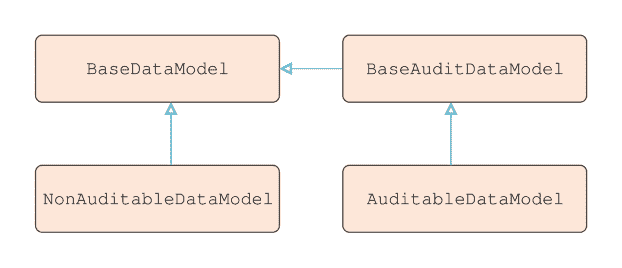
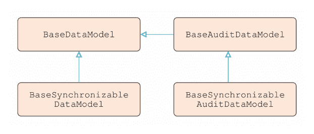
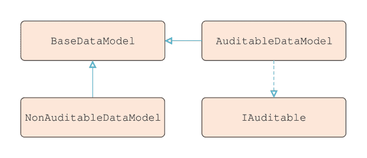
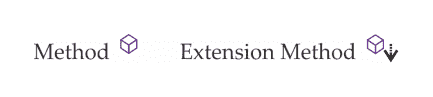
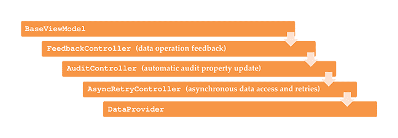

# 第三章：编写自定义应用程序框架

在本章中，我们将研究应用程序框架及其能为我们带来的好处。我们将了解通过基类和接口提供此功能之间的差异，并发现将功能构建到我们的框架中的其他方法。然后，我们将利用这些新获得的知识来开始构建我们自己的应用程序框架，以简化我们未来的应用程序开发。本章将以检查各种技术结束，以确保我们的应用程序保持 MVVM 提供的必要关注点分离。

# 什么是应用程序框架？

简而言之，应用程序框架由一个类库组成，这些类库共同提供了应用程序所需的最常见功能。通过使用应用程序框架，我们可以大大减少创建应用程序各个部分所需的工作量和时间。简而言之，它们支持应用程序的未来发展。

在典型的三层应用程序中，框架通常扩展到应用程序的所有层；即**表示层**、**业务层**和**数据访问层**。因此，在采用 MVVM 模式的 WPF 应用程序中，我们可以在模式的三个组件中看到应用程序框架的各个方面；即模型、视图模型和视图。

除了创建我们的应用程序组件所涉及的生产时间和努力减少的明显好处外，应用程序框架还提供了许多额外的优势。典型的应用程序框架促进可重用性，这是面向对象编程（**OOP**）的核心目标之一。它们通过提供通用的接口和/或基类来实现这一点，这些接口和基类可以用来定义各种应用程序组件。

通过重用这些应用程序框架接口和基类，我们还在整个应用程序中灌输了一种统一性和一致性。此外，由于这些框架通常提供额外的功能或服务，因此从事应用程序开发的开发人员在需要这种特定功能时可以节省更多时间。

通过使用应用程序框架，还可以实现诸如模块化、可维护性、可测试性和可扩展性等概念。这些框架通常具有独立运行各个组件的能力，这与 WPF 和 MVVM 模式非常契合。此外，应用程序框架还可以提供实现模式，以进一步简化构建新应用程序组件的过程。

为不同的技术创建了不同的框架，WPF 已经有一些公开可用的框架。有些相对较轻量级，如**MVVM Light Toolkit**和**WPF Application Framework**（**WAF**），而有些则更重量级，如**Caliburn.Micro**和现在开源的**Prism**。虽然你可能在工作中可能使用过这些框架之一或多个，但在这个章节中，我们将探讨如何创建我们自己的轻量级自定义框架，它将只实现我们需要的功能。

# 封装通用功能

在任何 WPF 应用程序中，最常用的接口可能是`INotifyPropertyChanged`接口，因为它需要正确实现数据绑定。通过在我们的基类中提供这个接口的实现，我们可以避免在每个单独的 ViewModel 类中重复实现它。因此，它非常适合包含在我们的基类中。根据我们的需求，有多种不同的实现方式，所以让我们先看看最基本的实现：

```cs
public virtual event PropertyChangedEventHandler PropertyChanged; 

protected virtual void NotifyPropertyChanged(string propertyName) 
{ 
  if (PropertyChanged != null)  
    PropertyChanged(this, new PropertyChangedEventArgs(propertyName)); 
} 
```

在所有形式的这个实现中，我们首先需要声明`PropertyChanged`事件。这是我们用来通知应用程序中数据绑定值更改的各种绑定源和目标的唯一事件。请注意，这是`INotifyPropertyChanged`接口的唯一要求。我们没有必须实现的`NotifyPropertyChanged`方法，因此你可能会遇到不同名称的方法，但它们执行的功能是相同的。

当然，如果没有这个方法，仅仅实现事件什么也不会发生。这个方法的基本思想是，像往常一样，我们首先检查`null`，然后引发事件，将引发事件的类实例作为`sender`参数和`PropertyChangedEventArgs`中更改的属性名称传递。我们已经看到，C# 6.0 中的空条件运算符为我们提供了这个的简写符号：

```cs
PropertyChanged?.Invoke(this, new PropertyChangedEventArgs(propertyName)); 
```

注意，这个方法的声明访问修饰符是`protected`，以确保所有从该基类派生的 ViewModel 都可以访问它，而未派生的类则不能。此外，该方法也被标记为`virtual`，以便派生类在需要时可以覆盖这个功能。在 ViewModel 中，这个方法可以通过如下属性调用：

```cs
private string name = string.Empty; 

public string Name 
{ 
  get { return name; } 
  set 
  { 
    if (name != value) 
    { 
      name = value; 
      NotifyPropertyChanged("Name"); 
    } 
  } 
} 
```

然而，在.NET 4.5 中增加了一个新的特性，它为我们提供了使用这个实现的快捷方式。`CallerMemberNameAttribute`类使我们能够自动获取方法调用者的名称，或者更具体地说，在我们的情况下，是调用方法的属性名称。我们可以使用它，并带有可选的默认值输入参数，如下所示：

```cs
protected virtual void NotifyPropertyChanged( 
  [CallerMemberName]string propertyName = "") 
{ 
  PropertyChanged?.Invoke(this, 
    new PropertyChangedEventArgs(propertyName)); 
} 
```

被调用的属性可以简化为这样：

```cs
public string Name 
{ 
  get { return name; } 
  set { if (name != value) { name = value; NotifyPropertyChanged(); } } 
} 
```

在此值得指出的是，在.NET 4.5.3 中，对调用此方法最基本实现的改进也被引入。`nameof`运算符还使我们能够避免使用字符串来传递属性名称，因为传递字符串可能会出错。此运算符基本上在编译时将属性、变量或方法的名称转换为字符串，因此最终结果与传递字符串完全相同，但在重命名定义时更不容易出错。以先前的属性为例，让我们看看这个运算符是如何使用的：

```cs
NotifyPropertyChanged(nameof(Name)); 
```

此外，我们还可以使用其他技巧。例如，我们经常需要通知框架同时更改多个属性值。设想一个场景，我们有两个名为`Price`和`Quantity`的属性，以及一个名为`Total`的第三个属性。正如你可以想象的那样，`Total`属性的值将来自`Price`值乘以`Quantity`值的计算：

```cs
public decimal Total 
{ 
  get { return Price * Quantity; } 
} 
```

然而，此属性没有设置器，*那么我们应该从哪里调用* `NotifyPropertyChanged` *方法呢？* 答案很简单。我们需要从 *两个* 组成属性设置器中调用它，因为它们都可以影响此属性的结果值。

传统上，我们必须为每个组成部分属性调用一次`NotifyPropertyChanged`方法，以及为`Total`属性调用一次。然而，我们可以重写此方法的实现，使其能够在单个调用中传递多个属性名称。为此，我们可以使用`params`关键字来启用任意数量的输入参数：

```cs
protected void NotifyPropertyChanged(params string[] propertyNames) 
{ 
  if (PropertyChanged != null) 
  { 
    foreach (string propertyName in propertyNames) 
    { 
      PropertyChanged(this, new PropertyChangedEventArgs(propertyName)); 
    } 
  } 
} 
```

当使用`params`关键字时，我们需要声明一个数组类型的输入参数。然而，这个数组仅仅持有输入参数，我们调用此方法时不需要提供数组。相反，我们可以提供任意数量的相同类型的输入参数，它们将被隐式地添加到数组中。回到我们的例子，这使我们能够像这样调用方法：

```cs
private decimal price = 0M; 

public decimal Price 
{ 
  get { return price; } 
  set  
  {  
    if (price != value)  
    { 
      price = value;  
      NotifyPropertyChanged(nameof(Price), nameof(Total));  
    } 
  } 
} 
```

因此，我们有多种不同的方法来实现此方法，具体取决于我们的需求。我们甚至可以添加多个方法重载，为我们的框架用户提供更多选择。我们将在稍后看到此方法的进一步增强，但现在，让我们看看我们的`BaseViewModel`类到目前为止可能的样子：

```cs
using System.ComponentModel; 
using System.Runtime.CompilerServices;
namespace CompanyName.ApplicationName.ViewModels 
{ 
  public class BaseViewModel : INotifyPropertyChanged 
  { 
    #region INotifyPropertyChanged Members 

    public event PropertyChangedEventHandler PropertyChanged; 

    protected virtual void NotifyPropertyChanged(
      params string[] propertyNames) 
    { 
      if (PropertyChanged != null) 
      { 
        foreach (string propertyName in propertyNames)  
        { 
          PropertyChanged(this, 
            new PropertyChangedEventArgs(propertyName)); 
        } 
      } 
    } 

    protected virtual void NotifyPropertyChanged( 
      [CallerMemberName]string propertyName = "") 
    { 
      PropertyChanged?.Invoke(this, 
        new PropertyChangedEventArgs(propertyName)); 
    } 

    #endregion 
  } 
} 
```

总结一下，我们从一个声明单个事件的接口开始。接口本身不提供任何功能，实际上，作为实现者，我们必须提供功能，以`NotifyPropertyChanged`方法的形式，并在每次属性值更改时调用该方法。但这样做的好处是 UI 控件正在监听并响应这些事件，因此，通过实现此接口，我们已经获得了这种额外的数据绑定能力。

然而，我们可以在我们的应用程序框架中以多种不同的方式提供功能。这两种主要方式是通过使用基类和接口。这两种方法之间的主要区别在于，我们的框架用户为了创建各种应用程序组件需要完成多少开发工作。

当我们使用接口时，我们基本上是在提供一个开发者必须遵守的合同，即通过自己提供实现来遵守。然而，当我们使用基类时，我们能够为他们提供这种实现。因此，通常基类提供现成的功能，而接口则依赖于开发者自己提供部分或全部这些功能。

我们刚刚看到了在视图模型基类中实现接口的一个例子。现在，让我们看看我们可以在其他框架基类中封装什么，并比较在基类和接口中提供功能或功能性的差异。现在，让我们将注意力转向我们的数据模型类。

# 在基类中

我们已经看到，在一个 WPF 应用程序中，在我们的视图模型基类中实现`INotifyPropertyChanged`接口是至关重要的。同样，我们也将需要在我们的数据模型基类中实现类似的接口。记住，当在这里提到数据模型时，我们正在讨论与视图模型属性和功能结合使用的业务模型类，这些类来自第二应用程序结构示例的第一章，《以更智能的方式使用 WPF》。

所有这些`DataModel`类都需要扩展它们的基类，因为它们都需要访问其`INotifyPropertyChanged`实现。随着我们在这本书的章节中不断前进，我们将看到越来越多的原因说明为什么我们需要为我们的数据模型和视图模型使用单独的基类。例如，让我们想象一下，我们想要为这些数据模型提供一些简单的审计属性，并调查我们的基类可能看起来像什么：

```cs
using System; 
using System.ComponentModel;
using System.Runtime.CompilerServices;

namespace CompanyName.ApplicationName.DataModels 
{ 
  public class BaseDataModel : INotifyPropertyChanged 
  { 
    private DateTime createdOn; 
    private DateTime? updatedOn; 
    private User createdBy, updatedBy; 

    public DateTime CreatedOn 
    { 
      get { return createdOn; } 
      set { createdOn = value; NotifyPropertyChanged(); } 
    } 

    public User CreatedBy 
    { 
      get { return createdBy; } 
      set { createdBy = value; NotifyPropertyChanged(); } 
    } 

    public DateTime? UpdatedOn 
    { 
      get { return updatedOn; } 
      set { updatedOn = value; NotifyPropertyChanged(); } 
    } 

    public User UpdatedBy 
    { 
      get { return updatedBy; } 
      set { updatedBy = value; NotifyPropertyChanged(); } 
    } 

    #region INotifyPropertyChanged Members 

    ...

    #endregion 
  } 
} 
```

在这里，我们看到我们的审计属性，以及我们之前看到的隐藏的`INotifyPropertyChanged`实现。现在，让我们保持实现与`BaseViewModel`类相同。请注意，使用这个特定的基类会导致所有派生类都能访问这些属性，无论它们是否需要。

我们可能然后决定声明另一个基类，这样我们就可以有一个提供对`INotifyPropertyChanged`接口实现的访问的基类，以及一个扩展该基类并添加之前显示的新可审计属性的基类。通过这种方式，所有派生类都可以使用`INotifyPropertyChanged`接口实现，并且需要可审计属性的那些类也可以从第二个基类派生：



对于这个基本示例，我们似乎已经解决了问题。如果这些可审计属性是我们想要提供给派生类的唯一属性，那么这种情况就不会那么糟糕。然而，一个平均的框架通常会提供比这更多的功能。

让我们现在想象一下，如果我们想提供一些基本的撤销能力。我们将在本章后面看到这个例子，但现在我们保持简单。在不实际指定这个新基类所需成员的情况下，让我们先考虑这个问题。

现在我们面临的情况是我们已经有了两个不同的基类，我们还想提供一些额外的功能。*我们应该在哪里声明我们的新属性？* 我们可以从任何一个派生，或者间接地从现有的两个基类中派生，如图所示，以创建这个新的*可同步*基类：



因此，现在，我们可能有四个不同的基类，开发者可以使用我们的框架扩展。他们可能会对确切需要扩展哪个基类感到困惑，但总体来说，这种情况仍然只是勉强可控。然而，想象一下，如果我们想在基类的某个或多个级别提供一些额外的属性或功能。

为了使这些基类中的每一个功能组合都能被启用，我们可能最终会有多达八个不同的基类。我们提供的每个额外功能级别要么会使我们拥有的基类总数翻倍，要么意味着开发者有时不得不从具有他们不需要的功能或属性的基类中派生。既然我们已经揭示了一个使用基类的潜在问题，让我们看看声明接口是否可以帮助解决这个问题。

# 通过接口

回到我们的审计示例，我们可以在接口中声明这些属性。让我们看看这可能会是什么样子：

```cs
using System; 

namespace CompanyName.ApplicationName.DataModels.Interfaces 
{ 
  public interface IAuditable 
  { 
    DateTime CreatedOn { get; set; } 

    User CreatedBy { get; set; } 

    DateTime? UpdatedOn { get; set; } 

    User UpdatedBy { get; set; } 
  } 
} 
```

现在，如果一个开发者需要这些属性，他们可以实施这个接口，同时扩展数据模型基类：



现在我们来看看代码中的例子：

```cs
using System; 
using CompanyName.ApplicationName.DataModels.Interfaces; 

namespace CompanyName.ApplicationName.DataModels 
{ 
  public class Invoice : BaseDataModel, IAuditable 
  { 
    private DateTime createdOn; 
    private DateTime? updatedOn; 
    private User createdBy, updatedBy; 

    public DateTime CreatedOn 
    { 
      get { return createdOn; } 
      set { createdOn = value; NotifyPropertyChanged(); } 
    } 

    public User CreatedBy 
    { 
      get { return createdBy; } 
      set { createdBy = value; NotifyPropertyChanged(); } 
    } 

    public DateTime? UpdatedOn 
    { 
      get { return updatedOn; } 
      set { updatedOn = value; NotifyPropertyChanged(); } 
    } 

    public User UpdatedBy 
    { 
      get { return updatedBy; } 
      set { updatedBy = value; NotifyPropertyChanged(); } 
    } 
  } 
} 
```

初始时，这似乎是一个更好的方法，但让我们继续调查我们之前查看的基类场景。现在让我们想象一下，我们想使用接口提供相同的基本撤销能力。我们实际上并没有调查需要哪些成员来完成这个任务，但它将需要属性和方法。

这就是接口方法开始出现问题的原因。我们可以确保实现我们`ISynchronization`接口的开发者具有特定的属性和方法，但我们无法控制他们实现这些方法的方式。为了提供撤销更改的能力，我们需要提供这些方法的实际实现，而不仅仅是所需的结构。

如果这留给开发者每次使用接口时来实现，他们可能无法正确实现它，或者可能在不同的类中以不同的方式实现它，从而破坏应用程序的一致性。因此，为了实现某些功能，似乎我们确实需要使用某种基类。

然而，我们还有一个第三种选择，它涉及两种方法的混合。我们可以在基类中实现一些功能，但不是从它派生我们的数据模型类，而是给它们添加一个这种类型的属性，这样它们仍然可以访问其公共成员。

然后，我们可以声明一个接口，它只有一个属性，这个属性是新基类的类型。这样，我们就可以自由地将不同基类的不同功能添加到只需要它们的类中。让我们看看一个这样的例子：

```cs
public interface IAuditable 
{ 
  Auditable Auditable { get; set; } 
} 
```

这个`Auditable`类将具有与前面代码中显示的`IAuditable`接口中相同的属性。新的`IAuditable`接口将通过在数据模型类中简单地声明一个类型为`Auditable`的属性来实现：

```cs
public class User : IAuditable 
{ 
  private Auditable auditable; 

  public Auditable Auditable 
  { 
    get { return auditable; } 
    set { auditable = value; } 
  } 

  ... 
} 
```

它可以被框架使用，例如，将每个用户的名称和他们创建的时间输出到报告中。在下面的示例中，我们使用 C# 6.0 中引入的**插值字符串**语法来构建我们的字符串。它就像`string.Format`方法，但将方法调用替换为`$`符号，将数字格式项替换为它们的相应值：

```cs
foreach (IAuditable user in Users) 
{ 
  Report.AddLine($"Created on {user.Auditable.CreatedOn}" by
    {user.Auditable.CreatedBy.Name});
}
```

最有趣的是，由于这个接口可以被许多不同类型的对象实现，前面的代码也可以与不同类型的对象一起使用。注意这个细微的区别：

```cs
List<IAuditable> auditableObjects = GetAuditableObjects(); 
foreach (IAuditable user in auditableObjects) 
{ 
  Report.AddLine($"Created on {user.Auditable.CreatedOn}" by
    {user.Auditable.CreatedBy.Name});
} 
```

值得指出的是，这种能够与不同类型的对象一起工作的有用能力并不仅限于接口。这也可以同样容易地通过基类实现。想象一下一个视图，它允许最终用户编辑多种不同类型的对象。

如果我们在稍后将在*构建自定义应用程序框架*部分看到的`BaseSynchronizableDataModel`类中添加一个名为`PropertyChanges`的属性，该属性返回更改属性的详细信息，我们就可以使用与此非常相似的代码来显示每个对象对用户的更改确认：

```cs
List<BaseSynchronizableDataModel> baseDataModels = GetBaseDataModels();
foreach (BaseSynchronizableDataModel baseDataModel in baseDataModels) 
{ 
  if (baseDataModel.HasChanges)  
    FeedbackManager.Add(baseDataModel.PropertyChanges); 
} 
```

在将一些预包装功能封装到我们的数据模型类中时，我们有多种选择。我们迄今为止调查的每种方法都有其优点和缺点。如果我们确定我们想在每个数据模型类中都包含一些预写的功能，比如 `INotifyPropertyChanged` 接口，那么我们只需在基类中封装它，并让所有模型类从该基类派生。

如果我们只想让我们的模型拥有某些属性或方法，这些方法可以从框架的其他部分调用，但我们不关心实现细节，那么我们可以使用接口。如果我们想结合这两种想法，那么我们可以通过结合使用这两种方法来实现解决方案。选择最适合当前需求的解决方案取决于我们。

# 使用扩展方法

在调查 第二章 *调试 WPF 应用程序* 中的应用程序结构时，提到了一种向应用程序开发者提供额外功能的方法。这是通过使用扩展方法实现的。如果你不熟悉这个令人惊叹的 .NET 功能，扩展方法使我们能够编写可以在我们未创建的对象上使用的方法。

在这个阶段，指出一点是值得的，我们通常不会为我们声明的类编写扩展方法。这有两个主要原因。第一个原因是，我们创建了这些类，因此我们可以访问它们的源代码，因此可以直接在这些类中声明新方法。

第二个原因是，我们的 `Extensions` 项目将被添加到大多数其他项目中，包括我们的 `DataModels` 项目，这样它们都可以利用额外的功能。因此，我们不能将任何其他项目的引用添加到 `Extensions` 项目中，因为这会创建循环依赖。

你可能已经知道扩展方法了，尽管可能是不经意间了解的，因为大多数 **LINQ** 方法都是扩展方法。一旦声明，它们就可以像在扩展的各种类中声明的普通方法一样使用，尽管在 Visual Studio IntelliSense 显示中它们有不同的图标：



声明它们的基本原则是有一个静态类，其中每个方法都有一个额外的输入参数，该参数以 `this` 关键字为前缀，表示被扩展的对象。请注意，这个额外的输入参数必须在参数列表中首先声明，并且在调用对象实例上的方法时在 IntelliSense 中不可见。

扩展方法被声明为静态方法，但通常使用实例方法语法来调用。一个简单的例子应该有助于澄清这种情况。让我们假设我们想要能够在集合中的每个项上调用一个方法。实际上，我们将在本章后面的`BaseSynchronizableCollection`类中看到这个例子是如何被使用的，但现在，让我们看看我们如何做到这一点：

```cs
using System; 
using System.Collections.Generic; 

namespace CompanyName.ApplicationName.Extensions 
{ 
  public static class IEnumerableExtensions 
  { 
    public static void ForEach<T>(this IEnumerable<T> collection,
      Action<T> action) 
    { 
      foreach (T item in collection) action(item); 
    } 
  } 
} 
```

在这里，我们看到`this`输入参数指定了调用此扩展方法的目标类型的实例。记住，除非它通过静态类本身调用，否则这个参数不会出现在 Visual Studio 的 IntelliSense 参数列表中，如下面的代码所示：

```cs
IEnumerableExtensions.ForEach(collection, i => i.RevertState()); 
```

在这个方法内部，我们简单地遍历集合项，调用由`action`输入参数指定的`Action`，并将每个项作为其参数传入。在将`using`指令添加到`CompanyName.ApplicationName.Extensions`命名空间之后，让我们看看这个方法通常是如何被调用的：

```cs
collection.ForEach(i => i.PerformAction()); 
```

因此，你现在可以看到扩展方法的力量以及它们能为我们带来的好处。如果我们想要的功能还没有由.NET Framework 中的某个类提供，我们就可以简单地添加它。以下是一个例子。

这里是一个从现有的 LINQ 扩展方法中非常需要的扩展方法。与其他的 LINQ 方法一样，这个方法也作用于`IEnumerable<T>`接口，因此也作用于任何扩展它的集合：

```cs
public static IEnumerable<TSource> DistinctBy<TSource, TKey>( 
  this IEnumerable<TSource> source, Func<TSource, TKey> keySelector) 
{ 
  HashSet<TKey> keys = new HashSet<TKey>(); 
  foreach (TSource element in source) 
  { 
    if (keys.Add(keySelector(element))) yield return element; 
  } 
} 
```

让我们首先看看这个方法的声明。我们可以看到我们的源集合将是类型`TSource`。注意，这与我们的其他例子中泛型类型参数被命名为`T`的情况完全相同，只是这提供了一点关于这个类型参数使用的细节。这种命名来自`Enumerable.OrderBy<TSource, TKey>`方法，其中类型`TSource`参数代表我们的源集合。

接下来，我们注意到方法名称后面跟着两个泛型类型参数；首先，是`TSource`参数，然后是`TKey`参数。这是因为我们需要两个泛型类型参数来指定类型为`Func<TSource, TKey>`的输入参数。如果你不熟悉微软称之为`Func<T, TResult>`的委托，它简单地说就是封装了任何具有单个输入参数类型`T`并返回类型为`TResult`的值的任何方法，或者在我们的情况下，返回`TKey`。

“*我们为什么要使用这个* `Func<T, TResult>` *委托*？”你可能会问。其实很简单；使用这个类，我们可以为开发者提供一个与源集合中相同的类型的对象，并能够选择该类的一个成员，特别是他们想要在它上面执行唯一查询的属性。在查看这个方法的其余部分之前，让我们看看它是如何被使用的：

```cs
IEnumerable<User> distinctUsers = Users.DistinctBy(u => u.Id);
```

让我们设想一下，我们有一个`User`对象的集合，这些对象都购买了商品。这个集合可能包含同一个`User`对象多次，如果他们购买了多个商品。现在，让我们想象一下，我们想要从原始集合中编译一个唯一的用户集合，这样就不会向订购多个商品的人发送多个账单。这个方法将为每个不同的`Id`值返回单个成员。

回到这个方法的源代码，`User`类代表`TSource`参数，这可以在示例中的 Lambda 表达式中看到，即`u`输入参数。`TKey`参数由开发者选择的类成员的类型决定，在这种情况下，是通过`Guid`的`Id`值。这个例子可以稍作修改以使其更清晰：

```cs
IEnumerable<User> distinctUsers = Users.DistinctBy((User user) => user.Id);
```

因此，我们的`Func<TSource, TKey>`可以在这里看到，有一个`User`输入参数和一个`Guid`返回值。现在，让我们关注我们方法的魔法。我们看到一个`Guid`类型的`HashSet`在我们的例子中被初始化。这种类型的集合对这个方法至关重要，因为它允许只添加唯一值。

接下来，我们遍历我们的源集合，在这个例子中是`User`类型，并尝试将集合中每个项目的相关属性值添加到`HashSet`中。在我们的例子中，我们将每个`User`对象的身份值添加到这个`HashSet`中。

如果身份值是唯一的，并且`HashSet<T>.Add`方法返回`true`，我们就产生，或从我们的源集合返回该物品。第二次以及每次读取已使用的`Id`值时，它将被拒绝。这意味着只有具有唯一身份值的第一个项目从这个方法返回。注意，在这个例子中，我们感兴趣的并不是购买，而是做出这些购买的唯一用户。

我们现在已经成功创建了我们的 LINQ 风格的扩展方法。然而，并不是所有的扩展方法都需要如此具有突破性。通常，它们可以用来简单地封装一些常用的功能。

在某种程度上，我们可以将它们用作简单的便利方法。看看以下例子，它将在本章后面的*With Converters*部分中使用：

```cs
using System;
using System.ComponentModel;
using System.Reflection;

namespace CompanyName.ApplicationName.Extensions 
{ 
  public static class EnumExtensions 
  { 
    public static string GetDescription(this Enum value) 
    { 
      FieldInfo fieldInfo = value.GetType().GetField(value.ToString()); 
      if (fieldInfo == null) return Enum.GetName(value.GetType(), value); 
      DescriptionAttribute[] attributes = (DescriptionAttribute[])
        fieldInfo.GetCustomAttributes(typeof(DescriptionAttribute), false); 
      if (attributes != null && attributes.Length > 0)  
        return attributes[0].Description; 
      return Enum.GetName(value.GetType(), value); 
    } 
  } 
} 
```

在这个方法中，我们尝试获取与由`value`输入参数提供的特定枚举实例相关的`FieldInfo`对象。如果尝试失败，我们简单地返回特定实例的名称。如果我们成功，然后我们使用该对象的`GetCustomAttributes`方法，传递`DescriptionAttribute`类的类型，来检索一个属性数组。

如果我们在特定枚举实例的`DescriptionAttribute`中声明了一个值，那么它将始终是属性数组中的第一个项。如果我们没有设置值，那么数组将为空，我们将返回实例的名称。注意，由于我们在该方法中使用了基`Enum`类，因此我们可以在任何枚举类型上调用此方法。

在创建这些方法时，应该注意的是，没有要求将它们放入由类型分开的单独类中，就像我们在这里所做的那样。也没有特定的命名约定，实际上，将所有扩展方法放入一个类中也是完全可行的。然而，如果我们有大量特定类型的扩展方法，那么这种分离可以帮助维护。 

在继续之前，让我们看看这些扩展方法的一个最终示例。扩展方法最有用的特性之一是能够向现有的.NET Framework 类添加新的或缺失的功能。例如，让我们看看我们如何复制 Linq 并为`IEnumerable`类定义一个简单的`Count`方法：

```cs
public static int Count(this IEnumerable collection) 
{ 
  int count = 0; 
  foreach (object item in collection) count++; 
  return count; 
} 
```

如我们所见，这个方法几乎不需要解释。它实际上只是计算`IEnumerable`集合中的项目数量并返回该值。虽然它很简单，但它证明是有用的，正如我们将在后面的示例中看到的那样。现在我们已经研究了扩展方法，让我们将注意力转向另一种将更多能力构建到我们的框架中的方法，这次专注于视图组件。

# 在 UI 控件中

在应用程序框架中包含功能的一种常见方式是将它封装到自定义控件中。这样做，我们可以使用依赖属性公开所需的功能，同时隐藏实现细节。这也是在应用程序中推广重用性和一致性的另一种极好方式。让我们看看一个简单的`UserControl`示例，它封装了`System.Windows.Forms.FolderBrowserDialog`控件的功能：

```cs
<UserControl   
  x:Class="CompanyName.ApplicationName.Views.Controls.FolderPathEditField" 

  > 
  <TextBox Name="FolderPathTextBox" 
    Text="{Binding FolderPath, RelativeSource={RelativeSource 
    AncestorType={x:Type Controls:FolderPathEditField}}, FallbackValue='', 
    UpdateSourceTrigger=PropertyChanged}" Cursor="Arrow" 
    PreviewMouseLeftButtonUp="TextBox_PreviewMouseLeftButtonUp" /> 
</UserControl> 
```

这个简单的`UserControl`只包含一个文本框，其`Text`属性数据绑定到我们在控制代码背后声明的`FolderPath`依赖属性。记住，在使用 MVVM 时，使用`UserControl`的代码背后进行此操作是完全可接受的。注意，我们在这里使用了`RelativeSource`绑定，因为没有设置此控制器的`DataContext`属性。我们将在第四章“精通数据绑定”中了解更多关于数据绑定的信息，但现在，让我们继续。

你可能会注意到，我们在代码后部附加了一个`PreviewMouseLeftButtonUp`事件处理器，并且由于那里没有使用业务相关的代码，所以在使用 MVVM 时这也是完全可以接受的。这里唯一值得注意的代码是我们将`Cursor`属性设置为当用户将鼠标悬停在我们的控件上时显示箭头。现在让我们看看`UserControl`的代码后部，看看功能是如何封装的：

```cs
using System; 
using System.Windows; 
using System.Windows.Controls; 
using System.Windows.Input; 
using FolderBrowserDialog = System.Windows.Forms.FolderBrowserDialog; 

namespace CompanyName.ApplicationName.Views.Controls 
{ 
  public partial class FolderPathEditField : UserControl 
  { 
    public FolderPathEditField() 
    { 
      InitializeComponent(); 
    } 

    public static readonly DependencyProperty FolderPathProperty =       
      DependencyProperty.Register(nameof(FolderPath),        
      typeof(string), typeof(FolderPathEditField), 
      new FrameworkPropertyMetadata(string.Empty, 
      FrameworkPropertyMetadataOptions.BindsTwoWayByDefault)); 

    public string FolderPath 
    { 
      get { return (string)GetValue(FolderPathProperty); } 
      set { SetValue(FolderPathProperty, value); } 
    } 

    public static readonly DependencyProperty OpenFolderTitleProperty =       
      DependencyProperty.Register(nameof(OpenFolderTitle), 
      typeof(string), typeof(FolderPathEditField), 
      new FrameworkPropertyMetadata(string.Empty, 
      FrameworkPropertyMetadataOptions.BindsTwoWayByDefault)); 

    public string OpenFolderTitle 
    { 
      get { return (string)GetValue(OpenFolderTitleProperty); } 
      set { SetValue(OpenFolderTitleProperty, value); } 
    } 

    private void TextBox_PreviewMouseLeftButtonUp(object sender,  
      MouseButtonEventArgs e) 
    { 
      if (((TextBox)sender).SelectedText.Length == 0 &&  
        e.GetPosition(this).X <= ((TextBox)sender).ActualWidth -  
        SystemParameters.VerticalScrollBarWidth)  
        ShowFolderPathEditWindow(); 
    } 

    private void ShowFolderPathEditWindow() 
    { 
      string defaultFolderPath = string.IsNullOrEmpty(FolderPath) ?         
        Environment.GetFolderPath(Environment.SpecialFolder.MyDocuments)  
        : FolderPath; 
      string folderPath = ShowFolderBrowserDialog(defaultFolderPath); 
      if (string.IsNullOrEmpty(folderPath)) return; 
      FolderPath = folderPath; 
    } 

    private string ShowFolderBrowserDialog(string defaultFolderPath) 
    { 
      using (FolderBrowserDialog folderBrowserDialog = 
        new FolderBrowserDialog())
      {
        folderBrowserDialog.Description = OpenFolderTitle;
        folderBrowserDialog.ShowNewFolderButton = true;
        folderBrowserDialog.SelectedPath = defaultFolderPath;
        folderBrowserDialog.ShowDialog();
        return folderBrowserDialog.SelectedPath;
      }
    }
  }
} 
```

我们从`using`指令开始，并看到一个使用别名指令的示例。在这种情况下，我们不想为`System.Windows.Forms`程序集添加一个正常的`using`指令，因为它包含许多与 UI 相关的类，这些类的名称与所需的`System.Windows`程序集中的名称冲突。

为了避免这些冲突，我们可以为我们要从该程序集中使用的单个类型创建一个别名。为了明确起见，微软决定不在`System.Windows`程序集中重新发明轮子，或者说在这个例子中，不重新发明`FolderBrowserDialog`控件，因此我们需要添加对`System.Windows.Forms`程序集的引用，并使用其中的控件。

观察这个类，我们看到大部分代码都是关于控件的依赖属性声明。我们有`FolderPath`属性，它将保存从`Windows.Forms`控件中选择的文件夹的文件路径，以及`OpenFolderTitle`属性，它将在显示`FolderBrowserDialog`窗口时填充标题栏。

接下来，我们看到处理我们控件中单个`TextBox`元素的`PreviewMouseLeftButtonUp`事件的`TextBox_PreviewMouseLeftButtonUp`事件处理器。在这个方法中，我们首先验证用户没有从`TextBox`控件中选择文本或滚动，然后，如果条件为`true`，我们调用`ShowFolderPathEditWindow`方法。

为了验证用户没有选择文本，我们只需检查`TextBox`控件`SelectedText`属性的长度。为了确认用户没有滚动`TextBox`控件，我们比较用户点击的相对水平位置与`TextBox`元素的长度减去其垂直滚动条的宽度，以确保鼠标没有位于（如果存在的话）滚动条上。

`ShowFolderPathEditWindow`方法首先准备显示`Windows.Forms`控件。它将`defaultFolderPath`变量设置为`FolderPath`属性的当前值，如果已设置，或者使用`Environment.GetFolderPath`方法和`Environment.SpecialFolder.MyDocuments`枚举设置当前用户的`Documents`文件夹。

然后它调用`ShowFolderBrowserDialog`方法来启动实际的`FolderBrowserDialog`控件并检索选定的文件夹路径。如果选定了有效的文件夹路径，我们直接将其值设置为数据绑定的`FolderPath`属性，但请注意，我们也可以以其他方式设置它。

要在我们的控件中添加一个 `ICommand` 属性以返回选定的文件夹路径，而不是使用这种直接赋值，将非常容易。在不需要立即设置数据绑定值的情况下，这可能很有用；例如，如果控件被用于需要点击确认按钮后才能更新数据绑定值的子窗口中。

`ShowFolderBrowserDialog` 方法将 `FolderBrowserDialog` 类的使用封装在 `using` 语句中，以确保一旦使用后就被释放。它使用 `defaultFolderPath` 变量和 `OpenFolderTitle` 属性来设置实际的 `FolderBrowserDialog` 控件。请注意，这个 `OpenFolderTitle` 属性只是用来展示我们如何从 `FolderBrowserDialog` 元素中公开所需的属性到我们的控件中。这样，我们就可以封装 `Windows.Forms` 控件和程序集的使用。

注意，我们可以添加额外的依赖属性，使用户能够进一步控制 `FolderBrowserDialog` 控件中的设置。在这个基本示例中，我们只是硬编码了 `FolderBrowserDialog.ShowNewFolderButton` 属性的正值，但我们可以将其公开为另一个属性。

我们还可以添加一个浏览按钮，甚至可能添加一个清除按钮来清除选定的文件夹值。然后我们可以添加额外的 `bool` 依赖属性来控制这些按钮是否显示。我们可以以许多其他方式改进这个控件，但它仍然展示了我们如何将功能封装到我们的视图组件中。我们将在下一节中看到另一种与视图相关的方法来捕获功能的小片段。

# 使用转换器

转换器是我们可以在框架中打包有用功能的另一种方式。我们已经在 第二章 中看到了 `IValueConverter` 接口的一个有用示例，*调试 WPF 应用程序*，但尽管这是一个非常简单的示例，转换器实际上可以非常灵活。

在微软推出他们的 `BooleanToVisibilityConverter` 类之前，开发者不得不自己创建版本。我们经常需要将 `UIElement.Visibility` 枚举转换为或从各种不同类型转换，因此从 `BaseVisibilityConverter` 类开始是一个好主意，它可以服务于多个转换器类。让我们看看这包括什么：

```cs
using System.Windows; 
using System.Windows.Data; 

namespace CompanyName.ApplicationName.Converters 
{ 
  public abstract class BaseVisibilityConverter 
  { 
    public enum FalseVisibility { Hidden, Collapsed } 

    protected Visibility FalseVisibilityValue { get; set; } = 
      Visibility.Collapsed; 

    public FalseVisibility FalseVisibilityState 
    { 
      get { return FalseVisibilityState == Visibility.Collapsed ?              
        FalseVisibility.Collapsed : FalseVisibility.Hidden; }
      set { FalseVisibilityState = value == FalseVisibility.Collapsed ?
        Visibility.Collapsed : Visibility.Hidden; } 
    } 

    public bool IsInverted { get; set; } 
  } 
} 
```

此转换器需要一个值来表示可见值，由于在 `UIElement.Visibility` 枚举中只有一个相应的值，因此这显然将是 `Visibility.Visible` 实例。它还需要一个值来表示不可见值。

因此，我们声明了`FalseVisibility`枚举，包含来自`UIElement.Visibility`枚举的两个对应值和`FalseVisibilityValue`属性，以使用户能够指定哪个值应表示假状态。请注意，最常用的`Visibility.Collapsed`值被设置为默认值。

用户可以在使用控件时设置`FalseVisibilityState`属性，这将在内部设置受保护的`FalseVisibilityValue`属性。最后，我们看到不可或缺的`IsInverted`属性，它可选地用于反转结果。现在让我们看看我们的`BoolToVisibilityConverter`类看起来像什么：

```cs
using System; 
using System.Globalization; 
using System.Windows; 
using System.Windows.Data; 

namespace CompanyName.ApplicationName.Converters 
{ 
  [ValueConversion(typeof(bool), typeof(Visibility))] 
  public class BoolToVisibilityConverter : BaseVisibilityConverter,  
    IValueConverter 
  { 
    public object Convert(object value, Type targetType,  
      object parameter, CultureInfo culture) 
    { 
      if (value == null || value.GetType() != typeof(bool))  
        return DependencyProperty.UnsetValue; 
      bool boolValue = IsInverted ? !(bool)value :(bool)value;
      return boolValue ? Visibility.Visible : FalseVisibilityValue; 
    } 

    public object ConvertBack(object value, Type targetType,  
      object parameter, CultureInfo culture) 
    { 
      if (value == null || value.GetType() != typeof(Visibility))  
        return DependencyProperty.UnsetValue; 
      if (IsInverted) return (Visibility)value != Visibility.Visible; 
      return (Visibility)value == Visibility.Visible; 
    } 
  } 
} 
```

我们首先在`ValueConversion`属性中指定转换器实现中涉及的数据类型。这有助于工具了解转换器中使用了哪些类型，同时也使我们的框架的用户清楚。接下来，我们扩展我们的`BaseVisibilityConverter`基类，并扩展所需的`IValueConverter`接口。

在`Convert`方法中，我们首先检查我们的`value`输入参数的有效性，如果有效，我们将其转换为`bool`变量，同时考虑`IsInverted`属性的设置。对于无效的输入值，我们返回`DependencyProperty.UnsetValue`值。最后，我们从这个`bool`变量解析输出值，要么是`Visibility.Visible`实例，要么是`FalseVisibilityValue`属性的值。

在`ConvertBack`方法中，我们首先检查我们的`value`输入参数的有效性。对于无效的输入值，我们再次返回`DependencyProperty.UnsetValue`值，否则我们输出一个`bool`值，该值指定输入参数的类型`Visibility`是否等于`Visibility.Visible`实例，同时再次考虑`IsInverted`属性的值。

注意，使用`IsInverted`属性允许用户指定当数据绑定的`bool`值为`false`时，元素应该变为可见。这在我们需要根据同一条件使一个对象可见而另一个对象隐藏时非常有用。我们可以像这样声明从这个类中派生的两个转换器：

```cs
xmlns:Converters="clr-namespace:CompanyName.ApplicationName.Converters; 
  assembly=CompanyName.ApplicationName.Converters" 
... 
<Converters:BoolToVisibilityConverter x:Key="BoolToVisibilityConverter" /> 
<Converters:BoolToVisibilityConverter  
  x:Key="InvertedBoolToVisibilityConverter" IsInverted="True" /> 
```

如所述，我们经常需要从各种不同类型转换为`UIElement.Visibility`枚举，或者从`UIElement.Visibility`枚举转换为其他类型。现在让我们看看一个从`Enum`类型转换到和从`Enum`类型转换的例子。原理与上一个例子相同，其中单个数据绑定值表示`Visibility.Visible`实例，而所有其他值表示隐藏或折叠状态：

```cs
using System; 
using System.Globalization; 
using System.Windows; 
using System.Windows.Data; 

namespace CompanyName.ApplicationName.Converters 
{ 
  [ValueConversion(typeof(Enum), typeof(Visibility))] 
  public class EnumToVisibilityConverter : BaseVisibilityConverter,  
    IValueConverter
  { 
    public object Convert(object value, Type targetType,  
      object parameter, CultureInfo culture) 
    { 
      if (value == null || (value.GetType() != typeof(Enum) &&     
        value.GetType().BaseType != typeof(Enum)) ||  
        parameter == null) return DependencyProperty.UnsetValue; 
      string enumValue = value.ToString(); 
      string targetValue = parameter.ToString(); 
      bool boolValue = enumValue.Equals(targetValue,  
        StringComparison.InvariantCultureIgnoreCase); 
      boolValue = IsInverted ? !boolValue : boolValue; 
      return boolValue ? Visibility.Visible : FalseVisibilityValue; 
    } 

    public object ConvertBack(object value, Type targetType,  
      object parameter, CultureInfo culture) 
    { 
      if (value == null || value.GetType() != typeof(Visibility) ||
        parameter == null) return DependencyProperty.UnsetValue; 
      Visibility usedValue = (Visibility)value; 
      string targetValue = parameter.ToString(); 
      if (IsInverted && usedValue != Visibility.Visible)  
        return Enum.Parse(targetType, targetValue); 
      else if (!IsInverted && usedValue == Visibility.Visible)  
        return Enum.Parse(targetType, targetValue); 
      return DependencyProperty.UnsetValue; 
    } 
  } 
} 
```

再次，我们在`ValueConversion`属性中指定了转换器实现中涉及的数据类型。在`Convert`方法中，我们首先检查`value`输入参数的有效性，如果有效，我们将它转换为值的`string`表示形式。这个特定的类使用`parameter`输入参数来传递将表示可见值的指定枚举实例，因此它被设置为`targetValue`变量作为一个`string`。

我们通过比较当前枚举实例与目标实例来创建一个`bool`值。一旦我们有了我们的`bool`值，最后两行代码与`BoolToVisibilityConverter`类中的代码相同。

`ConvertBack`方法的实现略有不同。从逻辑上讲，我们无法为隐藏的可见性返回正确的枚举实例，因为它可以是除了通过`parameter`输入参数传递的可见值之外的任何值。

因此，我们只能返回指定的值，如果元素是可见的并且`IsInverted`属性为`false`，或者如果元素不可见并且`IsInverted`属性为`true`。对于所有其他输入值，我们简单地返回`DependencyProperty.UnsetValue`属性，以表示没有值。

转换器可以做的另一件非常有用的事情是将单个枚举实例转换为特定的图像。让我们看看一个与我们的`FeedbackManager`相关的例子，或者更准确地说，是显示的`Feedback`对象。每个`Feedback`对象可以有一个特定的类型，该类型由`FeedbackType`枚举指定，所以让我们先看看这个：

```cs
namespace CompanyName.ApplicationName.DataModels.Enums 
{ 
  public enum FeedbackType 
  { 
    None = -1, 
    Error, 
    Information, 
    Question, 
    Success, 
    Validation, 
    Warning 
  } 
} 
```

为了使这起作用，显然我们需要为每个枚举实例提供一个合适的图像，除了`None`实例。我们的图像将位于启动项目根目录下的名为 Images 的文件夹中：

```cs
using CompanyName.ApplicationName.DataModels.Enums;
using System; 
using System.Globalization; 
using System.Windows; 
using System.Windows.Data; 
using System.Windows.Media; 

namespace CompanyName.ApplicationName.Converters 
{ 
  [ValueConversion(typeof(FeedbackType), typeof(ImageSource))] 
  public class FeedbackTypeToImageSourceConverter : IValueConverter 
  { 
    public object Convert(object value, Type targetType,  
      object parameter, CultureInfo culture) 
    { 
      if (!(value is FeedbackType feedbackType) || 
        targetType != typeof(ImageSource)) 
        return DependencyProperty.UnsetValue; 
      string imageName = string.Empty; 
      switch ((FeedbackType)value) 
      { 
        case FeedbackType.None: return null; 
        case FeedbackType.Error: imageName = "Error_16"; break;
        case FeedbackType.Success: imageName = "Success_16"; break; 
        case FeedbackType.Validation:
        case FeedbackType.Warning: imageName = "Warning_16"; break; 
        case FeedbackType.Information: imageName = "Information_16"; break; 
        case FeedbackType.Question: imageName = "Question_16"; break; 
        default: return DependencyProperty.UnsetValue; 
      } 
      return $"pack://application:,,,/CompanyName.ApplicationName; 
        component/Images/{ imageName }.png"; 
    } 

    public object ConvertBack(object value, Type targetType,  
      object parameter, CultureInfo culture) 
    { 
      return DependencyProperty.UnsetValue; 
    } 
  } 
} 
```

再次，我们在`ValueConversion`属性中指定了转换器中涉及的数据类型。在`Convert`方法中，我们使用 C# 6.0 模式匹配来检查`value`输入参数的有效性，并将其转换为`FeedbackType`实例，如果有效。然后我们使用它在`switch`语句中，为每个枚举实例生成相关的图像名称。

如果使用了未知实例，我们返回`DependencyProperty.UnsetValue`值。在所有其他情况下，我们使用字符串插值来构建相关图像的完整文件路径，然后从转换器返回它作为转换值。由于这个转换器的`ConvertBack`方法没有有效用途，它没有实现，并简单地返回`DependencyProperty.UnsetValue`值。

你可能已经注意到，我们在`ValueConversion`属性中指定了类型`ImageSource`，但我们返回了一个`string`。这是可能的，因为 XAML 使用相关的类型转换器自动将`string`转换为`ImageSource`对象。当我们用 XAML 中的`string`设置`Image.Source`属性时，发生的情况完全相同。

与我们框架的其他部分一样，当我们结合其他领域的功能时，我们可以使我们的转换器更加有用。在这个特定的例子中，我们利用了本章前面展示的扩展方法之一。为了提醒您，`GetDescription` 方法将返回设置在每个枚举实例上的 `DescriptionAttribute` 的值。

`DescriptionAttribute` 允许我们将任何 `string` 值与我们的每个枚举实例关联起来，因此这是为每个实例输出用户友好描述的绝佳方式。以下是一个例子：

```cs
using System.ComponentModel;

public enum BitRate 
{ 
  [Description("16 bits")] 
  Sixteen = 16, 
  [Description("24 bits")] 
  TwentyFour = 24, 
  [Description("32 bits")] 
  ThirtyTwo = 32, 
} 
```

以这种方式，例如，我们可以在 `RadioButton` 控件中显示实例的名称，而不是显示这些属性中更人性化的描述。现在让我们看看这个转换器类：

```cs
using System; 
using System.Globalization; 
using System.Windows; 
using System.Windows.Data; 
using CompanyName.ApplicationName.Extensions; 

namespace CompanyName.ApplicationName.Converters 
{ 
  [ValueConversion(typeof(Enum), typeof(string))] 
  public class EnumToDescriptionStringConverter : IValueConverter 
  { 
    public object Convert(object value, Type targetType,  
      object parameter, CultureInfo culture) 
    { 
      if (value == null || (value.GetType() != typeof(Enum) &&  
        value.GetType().BaseType != typeof(Enum)))  
        return DependencyProperty.UnsetValue; 
      Enum enumInstance = (Enum)value; 
      return enumInstance.GetDescription(); 
    } 

    public object ConvertBack(object value, Type targetType,  
      object parameter, CultureInfo culture) 
    { 
      return DependencyProperty.UnsetValue; 
    } 
  } 
} 
```

正如我们现在习惯做的那样，我们首先在 `ValueConversion` 属性中指定转换器中使用的数据类型。在 `Convert` 方法中，我们再次检查我们的 `value` 输入参数的有效性，如果它无效，则返回 `DependencyProperty.UnsetValue` 值。

如果它是有效的，我们将它转换为 `Enum` 实例，然后使用我们扩展方法的力量从每个实例的 `DescriptionAttribute` 返回值。通过这样做，我们能够将此功能暴露给我们的视图，并使用户能够直接从 XAML 中利用它。现在，我们已经对如何将功能封装到我们的框架中的各种方式有了基本的了解，让我们专注于开始构建我们的基类。

# 构建自定义应用程序框架

对于不同的组件，可能会有不同的要求，但通常，我们将构建到我们的数据模型基类中的属性和功能将被我们的其他基类利用并变得更有用，所以让我们首先看看各种数据模型基类。

我们需要决定的是，我们是否希望我们的数据模型基类中的任何一个都是泛型的。这种差异可能很微妙，但很重要。想象一下，我们想在基类中添加一些基本的撤销功能。我们可以实现这一目标的一种方法是在基类中添加一个表示数据模型未编辑版本的对象。在一个普通基类中，它看起来是这样的：

```cs
public abstract class BaseSynchronizableDataModel : BaseDataModel 
{ 
  private BaseSynchronizableDataModel originalState; 

  public BaseSynchronizableDataModel OriginalState
  { 
    get { return originalState; } 
    private set { originalState = value; } 
  } 
} 
```

在一个通用基类中，它看起来是这样的：

```cs
public abstract class BaseSynchronizableDataModel<T> : BaseDataModel 
{ 
  private T originalState; 

  public T OriginalState 
  { 
    get { return originalState; } 
    private set { originalState = value; } 
  } 
} 
```

为了使这个属性更有用，我们需要添加一些额外的功能。首先，我们将看到非通用版本：

```cs
public abstract void CopyValuesFrom(BaseSynchronizableDataModel dataModel); 

public virtual BaseSynchronizableDataModel Clone() 
{
  BaseSynchronizableDataModel clone = 
    Activator.CreateInstance(this.GetType()) as BaseSynchronizableDataModel;
  clone.CopyValuesFrom(this);
  return clone;
}

public abstract bool PropertiesEqual(BaseSynchronizableDataModel dataModel);
```

现在，让我们看看通用版本：

```cs
public abstract void CopyValuesFrom(T dataModel); 

public virtual T Clone() 
{ 
  T clone = new T(); 
  clone.CopyValuesFrom(this as T); 
  return clone; 
} 

public abstract bool PropertiesEqual(T dataModel); 
```

这个基类的最后几个成员在这两个版本中都是相同的：

```cs
public bool HasChanges 
{ 
  get { return originalState != null && !PropertiesEqual(originalState); } 
} 

public void Synchronize() 
{ 
  originalState = this.Clone(); 
  NotifyPropertyChanged(nameof(HasChanges)); 
} 

public void RevertState() 
{ 
  Debug.Assert(originalState != null, "Object not yet synchronized."); 
  CopyValuesFrom(originalState); 
  Synchronize(); 
  NotifyPropertyChanged(nameof(HasChanges)); 
} 
```

我们从 `OriginalState` 属性开始，它持有数据模型的未编辑版本。之后，我们看到开发人员需要实现的抽象 `CopyValuesFrom` 方法，我们很快就会看到一个实现示例。`Clone` 方法简单地调用 `CopyValuesFrom` 方法以执行数据模型的深度克隆。

接下来，我们有一个名为 `PropertiesEqual` 的抽象方法，开发人员需要实现这个方法以便将他们类中的每个属性与 `dataModel` 输入参数中的属性进行比较。同样，我们很快就会看到这个实现，但你可能想知道为什么我们不直接重写 `Equals` 方法，或者实现 `IEquatable.Equals` 方法来达到这个目的。

我们不想使用这些方法的原因是，它们以及 `GetHashCode` 方法在 WPF 框架的多个地方被使用，并且它们期望返回的值是不可变的。由于我们的对象的属性非常可变，它们不能用于返回这些方法的值。因此，我们实现了自己的版本。现在，让我们回到这段代码剩余部分的描述。

`HasChanges` 属性是我们希望将其数据绑定到 UI 控件以指示特定对象是否已被编辑的属性。`Synchronize` 方法将当前数据模型的深度克隆设置到 `originalState` 字段中，并且重要的是，它通知 WPF 框架 `HasChanges` 属性发生了变化。这样做是因为 `HasChanges` 属性没有自己的设置器，这个操作将影响其值。

我们将克隆版本设置到 `originalState` 字段中非常重要，而不是简单地将其实际对象引用赋值给它。这是因为我们需要一个完全独立的对象版本来表示数据模型的未编辑版本。如果我们只是将实际对象引用赋值给 `originalState` 字段，那么它的属性值会随着数据模型对象的变化而变化，使其对于这个功能变得无用。

`RevertState` 方法首先检查数据模型是否已同步，然后将 `originalState` 字段中的值复制回模型。最后，它调用 `Synchronize` 方法来指定这是新版本的对象，并且通知 WPF 框架 `HasChanges` 属性发生了变化。

所以，正如你所看到的，这两个版本的基类之间没有太多差异。实际上，差异在派生类的实现中可以更清楚地看到。现在，让我们专注于它们对示例抽象方法的实现，从非泛型版本开始：

```cs
public override bool PropertiesEqual(BaseClass genreObject) 
{
  Genre genre = genreObject as Genre;
  if (genre == null) return false; 
  return Name == genre.Name && Description == genre.Description; 
} 

public override void CopyValuesFrom(BaseClass genreObject) 
{ 
  Debug.Assert(genreObject.GetType() == typeof(Genre), "You are using  
    the wrong type with this method."); 
  Genre genre = (Genre)genreObject; 
  Name = genre.Name; 
  Description = genre.Description; 
} 
```

在讨论这段代码之前，让我们先看看泛型实现：

```cs
public override bool PropertiesEqual(Genre genre) 
{ 
  return Name == genre.Name && Description == genre.Description; 
} 

public override void CopyValuesFrom(Genre genre) 
{ 
  Name = genre.Name; 
  Description = genre.Description; 
} 
```

最后，我们可以看到使用泛型和非泛型基类的区别。不使用泛型时，我们必须使用基类输入参数，在访问它们的属性之前，需要在每个派生类中将这些参数转换为适当类型。尝试转换不适当的类型会导致异常，所以我们通常尽量避免这些情况。

另一方面，当使用泛型基类时，不需要进行转换，因为输入参数已经是正确的类型。简而言之，泛型使我们能够创建类型安全的 Data 模型并避免重复特定类型的代码。既然我们已经看到了使用泛型类的益处，让我们暂时放下泛型，更仔细地看看这个基类。

一些同学可能已经注意到，WPF 框架通知我们`HasChanges`属性变化的地方只有`Synchronize`和`RevertState`方法。然而，为了使这个功能正常工作，我们需要在每次任何属性的值发生变化时通知框架。

我们可以依赖开发者每次调用`NotifyPropertyChanged`方法时传递`HasChanges`属性名，针对每个发生变化的属性进行调用，但如果他们忘记这样做，可能会导致难以追踪的错误。相反，一个更好的解决方案是我们覆盖基类中`INotifyPropertyChanged`接口的默认实现，并在每次调用时为他们通知`HasChanges`属性的变化：

```cs
#region INotifyPropertyChanged Members 

protected override void NotifyPropertyChanged( 
  params string[] propertyNames) 
{ 
  if (PropertyChanged != null) 
  { 
    foreach (string propertyName in propertyNames) 
    { 
      if (propertyName != nameof(HasChanges)) PropertyChanged(this,  
        new PropertyChangedEventArgs(propertyName)); 
    } 
    PropertyChanged(this, 
      new PropertyChangedEventArgs(nameof(HasChanges))); 
  } 
} 

protected override void NotifyPropertyChanged( 
  [CallerMemberName]string propertyName = "") 
{ 
  if (PropertyChanged != null) 
  { 
    if (propertyName != nameof(HasChanges)) PropertyChanged(this, 
      new PropertyChangedEventArgs(propertyName)); 
    PropertyChanged(this, 
      new PropertyChangedEventArgs(nameof(HasChanges))); 
  } 
} 

#endregion 
```

第一种方法将引发`PropertyChanged`事件，只传递一次`HasChanges`属性的名称，无论传递给方法多少个属性名。第二种方法也执行检查以确保它不会多次引发带有`HasChanges`属性名称的事件，因此这些实现保持高效。

现在，我们的基类将按预期工作，并且当数据模型类中的其他属性发生变化时，`HasChanges`属性将正确更新。这种技术也可以在其他场景中使用；例如，在我们稍后将在第九章中看到的实现响应式数据验证时。不过，现在让我们暂停一下泛型的使用，更仔细地看看这个基类。

另一个经常使用泛型的地方与集合相关。我相信你们都知道，我们倾向于在 WPF 应用程序中使用`ObservableCollection<T>`类，因为它实现了`INotifyCollectionChanged`和`INotifyPropertyChanged`。对于每种数据模型类，扩展这个类是惯例，但不是必需的：

```cs
public class Users : ObservableCollection<User> 
```

然而，而不是这样做，我们可以声明一个 `BaseCollection<T>` 类，它扩展了 `ObservableCollection<T>` 类，并为我们添加了更多的功能到我们的框架中。我们的框架用户可以扩展这个类：

```cs
public class Users : BaseCollection<User> 
```

我们可以做的真正有用的一件事是将一个泛型属性 `T` 添加到我们的基类中，它将代表 UI 中数据绑定集合控件中当前选中的项。我们还可以声明一些委托来通知开发人员关于选择或属性值的变化。这里有很多快捷方式和辅助方法，我们可以根据需求提供，所以花些时间调查这一点是值得的。让我们看看一些可能性：

```cs
using System.Collections.Generic; 
using System.Collections.ObjectModel; 
using System.ComponentModel; 
using System.Linq; 
using System.Runtime.CompilerServices; 
using CompanyName.ApplicationName.Extensions; 

namespace CompanyName.ApplicationName.DataModels.Collections 
{ 
  public class BaseCollection<T> :  
    ObservableCollection<T>, INotifyPropertyChanged 
    where T : class, INotifyPropertyChanged, new() 
  { 
    protected T currentItem; 

    public BaseCollection(IEnumerable<T> collection) : this() 
    { 
      foreach (T item in collection) Add(item); 
    } 

    public BaseCollection(params T[] collection) :  
      this(collection as IEnumerable<T>) { } 

    public BaseCollection() : base() 
    { 
      currentItem = new T(); 
    } 

    public virtual T CurrentItem 
    { 
      get { return currentItem; } 
      set 
      { 
        T oldCurrentItem = currentItem; 
        currentItem = value; 
        CurrentItemChanged?.Invoke(oldCurrentItem, currentItem); 
        NotifyPropertyChanged(); 
      } 
    } 

    public bool IsEmpty 
    { 
      get { return !this.Any(); } 
    } 

    public delegate void ItemPropertyChanged(T item,  
      string propertyName); 

    public virtual ItemPropertyChanged CurrentItemPropertyChanged  
      { get; set; } 

    public delegate void CurrentItemChange(T oldItem, T newItem);

    public virtual CurrentItemChange CurrentItemChanged { get; set; } 

    public T GetNewItem() 
    { 
      return new T(); 
    } 

    public virtual void AddEmptyItem() 
    { 
      Add(new T()); 
    } 

    public virtual void Add(IEnumerable<T> collection) 
    { 
      collection.ForEach(i => base.Add(i)); 
    } 

    public virtual void Add(params T[] items) 
    { 
      if (items.Length == 1) base.Add(items[0]); 
      else Add(items as IEnumerable<T>); 
    } 

    protected override void InsertItem(int index, T item) 
    { 
      if (item != null) 
      { 
        item.PropertyChanged += Item_PropertyChanged; 
        base.InsertItem(index, item); 
        if (Count == 1) CurrentItem = item; 
      } 
    } 

    protected override void SetItem(int index, T item) 
    { 
      if (item != null) 
      { 
        item.PropertyChanged += Item_PropertyChanged; 
        base.SetItem(index, item); 
        if (Count == 1) CurrentItem = item; 
      } 
    } 

    protected override void ClearItems() 
    { 
      foreach (T item in this)  
        item.PropertyChanged -= Item_PropertyChanged; 
      base.ClearItems(); 
    } 

    protected override void RemoveItem(int index) 
    { 
      T item = this[index]; 
      if (item != null) item.PropertyChanged -= Item_PropertyChanged; 
      base.RemoveItem(index); 
    } 

    public void ResetCurrentItemPosition() 
    { 
      if (this.Any()) CurrentItem = this.First(); 
    } 

    private void Item_PropertyChanged(object sender,  
      PropertyChangedEventArgs e) 
    { 
      if ((sender as T) == CurrentItem) 
        CurrentItemPropertyChanged?.Invoke(currentItem, e.PropertyName); 
      NotifyPropertyChanged(e.PropertyName); 
    } 

    #region INotifyPropertyChanged Members 

    ... 

    #endregion 
  } 
} 
```

在这里有很多内容需要消化，所以让我们仔细地过一遍每一部分。我们首先从我们的私有成员 `T` 类型开始，它将支持我们的 `CurrentItem` 属性。然后我们发现了一些构造函数的重载，使我们能够从集合或相关类型的任意数量的输入参数中初始化我们的集合。

接下来，我们看到来自 第一章，《使用 WPF 的更智能的方法》，的 `CurrentItem` 属性，再次，但现在有一些进一步的上下文。如果一个类已订阅了 `CurrentItemChanged` 属性，我们将从这里调用委托，传递当前项的新旧值。`IsEmpty` 属性只是一个高效的便利属性，供开发人员在需要知道集合是否有内容时调用。

在此之后，我们看到集合委托和相关的属性包装器，使将使用我们的框架的开发人员能够利用它们。接下来，我们看到方便的 `GetNewItem` 和 `AddEmptyItem` 方法，这两个方法都生成一个 `T` 泛型类型参数的新项，在分别返回或添加到集合之前。这就是为什么我们需要在类定义中添加 `new()` 泛型类型约束的原因；这个类型约束指定使用的泛型类型必须有一个无参数的构造函数。

现在我们来到了集合的各种 `Add` 方法；请注意，必须处理向集合添加项的每一种方式，这样我们就可以将我们的 `Item_PropertyChanged` 处理程序附加到每个添加项的 `PropertyChanged` 事件上，以确保一致的行为。

因此，我们从所有其他重载和辅助方法中调用我们的 `Add` 方法，并从那里调用基类的 `Collection.Add` 方法。请注意，我们实际上是在受保护的 `InsertItem` 方法中附加我们的处理程序，因为这个重写的方法是从 `Collection` 类中的 `Add` 方法调用的。

同样，当使用索引表示法设置项目时，受保护的`SetItem`方法将由`Collection`类调用，因此我们也必须处理这一点。同样，当从集合中移除项目时，移除对每个对象的事件处理程序的引用同样重要，如果不是更重要的话。未能这样做可能会导致内存泄漏，因为对事件处理程序的引用可能会阻止垃圾回收器销毁数据模型对象。

因此，我们还需要处理从我们的集合中移除对象的每个方法。为此，我们覆盖了`Collection`基类的一些更多受保护的方 法。当用户在我们的集合上调用`Clear`方法时，`ClearItems`方法将在内部被调用。同样，当用户调用任何公共移除方法时，将调用`RemoveItem`方法，因此这是移除我们的处理程序的理想位置。

现在暂时跳过`ResetCurrentItemPosition`方法，在类的底部，我们到达了`Item_PropertyChanged`事件处理方法。如果属性已更改的项目是集合中的当前项目，那么我们将引发与`CurrentItemPropertyChanged`属性连接的`ItemPropertyChanged`委托。

对于每个属性更改通知，无论项目是否是当前项目，我们随后都会引发`INotifyPropertyChanged.PropertyChanged`事件。这使得使用我们框架的开发者能够直接在我们的集合上附加处理程序到`PropertyChanged`事件，并能够发现集合中任何项目的任何属性是否已更改。

你可能也注意到了在集合类代码中的一些地方，我们设置了`CurrentItem`属性的值。这里选择的选项是自动选择集合中的第一个项目，但也可以简单地改为选择最后一个项目，例如。像往常一样，这些细节将取决于你的具体需求。

声明这些基本集合类的另一个好处是，我们可以利用属性并扩展我们基础数据模型类中内置的功能。回顾一下我们简单的`BaseSynchronizableDataModel`类示例，让我们看看我们可以在新的基础集合类中添加什么来改进这个功能。

然而，在我们能够做到这一点之前，我们需要能够指定我们新集合中的对象已实现了`BaseSynchronizableDataModel`类的属性和方法。一个选项是像这样声明我们的新集合类：

```cs
public class BaseSynchronizableCollection<T> : BaseCollection<T>  
  where T : BaseSynchronizableDataModel<T> 
```

然而，在 C#中，我们只能扩展单个基类，而我们可以自由实现尽可能多的接口。因此，一个更可取的解决方案是从我们的基类中提取相关的同步属性到一个接口中，然后将该接口添加到我们的基类定义中：

```cs
public abstract class BaseSynchronizableDataModel<T> : 
  BaseDataModel, ISynchronizableDataModel<T> 
  where T : BaseDataModel, ISynchronizableDataModel<T>, new() 
```

然后，我们可以像这样在我们的新集合类中指定这个新的泛型约束：

```cs
public class BaseSynchronizableCollection<T> : BaseCollection<T>  
  where T : class, ISynchronizableDataModel<T>, new() 
```

注意，任何放置在 `BaseSynchronizableDataModel` 类上的其他泛型约束也需要添加到这个声明的 `where T` 部分。例如，如果我们需要在基类中实现另一个接口，并且我们没有在基集合类中对 `T` 泛型类型参数添加相同的约束，那么在尝试使用基类的实例作为 `T` 参数时，我们会得到编译错误。现在让我们看看这个新的基类：

```cs
using System.Collections.Generic; 
using System.ComponentModel; 
using System.Linq; 
using CompanyName.ApplicationName.DataModels.Interfaces; 
using CompanyName.ApplicationName.Extensions; 

namespace CompanyName.ApplicationName.DataModels.Collections 
{ 
  public class BaseSynchronizableCollection<T> : BaseCollection<T>  
    where T : class, ISynchronizableDataModel<T>,  
    INotifyPropertyChanged, new() 
  { 
    public BaseSynchronizableCollection(IEnumerable<T> collection) :  
      base(collection) { } 

    public BaseSynchronizableCollection(params T[] collection) :  
      base(collection as IEnumerable<T>) { } 

    public BaseSynchronizableCollection() : base() { } 

    public virtual bool HasChanges 
    { 
      get { return this.Any(i => i.HasChanges); } 
    } 

    public virtual bool AreSynchronized 
    { 
      get { return this.All(i => i.IsSynchronized); } 
    } 

    public virtual IEnumerable<T> ChangedCollection 
    { 
      get { return this.Where(i => i.HasChanges); } 
    } 

    public virtual void Synchronize() 
    { 
      this.ForEach(i => i.Synchronize()); 
    } 

    public virtual void RevertState() 
    { 
      this.ForEach(i => i.RevertState()); 
    } 
  } 
} 
```

虽然保持简单，但这个基集合类提供了一些强大的功能。我们从类声明开始，其中包含了从我们的目标 `T` 类型类和 `BaseCollection<T>` 类继承的泛型类型约束。然后我们实现了构造函数重载，并将初始化任务直接传递给基类。

注意，如果我们想要给我们的集合项附加一个额外的事件处理程序级别，我们应该遵循基类的模式，而不是以这种方式调用基类的构造函数。

`HasChanges` 属性可以用作标志来检测集合中的任何项是否有任何更改。这通常与保存命令的 `canExecute` 参数相关联，以便当集合中的任何项被编辑时，保存按钮会变为启用状态，如果更改被撤销，则禁用。

`AreSynchronized` 属性简单地指定集合中的项目是否都已经同步，但这个类的真正美妙之处在于 `ChangedCollection` 属性。使用简单的 LINQ 过滤器，我们只返回集合中发生变化的项。想象一下这样一个场景，我们允许用户一次性编辑多个项目。有了这个属性，我们的开发者可以轻松地从集合中提取他们需要保存的项。

最后，这个类提供了一个方法来一次性同步集合中的所有项，另一个方法可以撤销集合中所有已编辑项的更改。注意这两个最后方法中使用了自定义的 `ForEach` 扩展方法；如果你还记得前面 *With Extension Methods* 部分的内容，它使我们能够对集合中的每个项执行操作。

通过其他部分框架使用我们的数据模型基类的属性和方法，我们能够进一步扩展它们的功能。虽然以这种方式从不同的组件构建组合功能通常是可选的，但它也可能是必要的，正如我们在本书后面的内容中将会看到的。

我们可以将更常见的功能构建到我们的应用程序框架基类中，这样使用我们框架的开发人员在开发应用程序时需要做的工作就越少。然而，我们必须精心规划，不要强迫开发人员拥有他们不想要的属性和方法，以扩展具有他们想要的某些其他功能的特定基类。

通常，不同的组件会有不同的要求。数据模型类通常比视图模型类有更多的基类，因为它们比视图模型扮演着更重要的角色。视图模型只是为视图提供它们所需的数据和功能。然而，数据模型类包含了数据，以及验证、同步，以及可能的方法和属性。考虑到这一点，让我们再次看看视图模型基类。

我们已经看到，在我们的基类中需要实现`INotifyPropertyChanged`接口，*但还需要实现什么？* 如果每个视图都将提供一些特定的功能，例如保存和删除项目，那么我们也可以直接在我们的基类中添加命令和抽象方法，每个派生视图模型类都必须实现：

```cs
public virtual ICommand Refresh 
{ 
  get 
  { 
    return new ActionCommand(action => RefreshData(),  
      canExecute => CanRefreshData());  
  } 
} 

protected abstract void RefreshData(); 

protected abstract bool CanRefreshData(); 
```

再次强调，声明这个命令为虚拟的是很重要的，以防开发人员需要提供他们自己的、不同的实现。这种安排的替代方案是只为每个命令添加抽象属性，这样具体的实现就完全取决于开发人员：

```cs
public abstract ICommand Save { get; } 
```

在讨论命令的同时，你可能还记得我们在第一章中提到的`ActionCommand`的基本实现，*一种更智能的 WPF 工作方式*。在这个时候，值得短暂偏离主题，进一步研究这个问题。请注意，虽然展示的基本实现大多数时候都工作得很好，但它有时可能会让我们陷入困境，我们可能会注意到一个按钮没有在应该的时候变为可用。

让我们看看一个例子。想象一下，在我们的 UI 中有一个按钮，它为用户打开一个文件夹以查看文件，并在`ICommand.CanExecute`方法中满足某个条件时启用。假设这个条件是文件夹应该有一些内容。毕竟，为用户打开一个空文件夹是没有意义的。

现在，让我们想象当用户在 UI 中执行其他操作时，这个文件夹会被填充。用户点击启动这个文件夹填充功能的按钮，应用程序开始填充它。当填充功能完成，文件夹现在包含了一些内容时，打开文件夹按钮应该变为可用状态，因为其关联命令的`CanExecute`条件现在是`true`。

尽管如此，`CanExecute`方法在那个点不会被调用，为什么应该调用它呢？按钮以及`CommandManager`类都不知道这个后台过程正在发生，以及`CanExecute`方法的条件现在已经满足。幸运的是，我们有一些选项来解决这个问题。

一种选择是手动引发`CanExecuteChanged`事件，使数据绑定命令源重新检查`CanExecute`方法的输出并相应地更新其启用状态。为此，我们可以在`ActionCommand`类中添加另一个方法，但首先我们需要重新排列一些事情。

当前实现并未存储附加到`CanExecuteChanged`事件的任何处理程序引用。实际上，这些引用被存储在`CommandManager`类中，因为它们只是直接传递给`RequerySuggested`事件以进行处理。为了能够手动引发事件，我们需要存储我们自己的处理程序引用，为此，我们需要一个`EventHandler`对象：

```cs
private EventHandler eventHandler; 
```

接下来，我们需要添加引用到被附加的处理程序，并移除那些被断开连接的处理程序，同时仍然将它们的引用传递给`CommandManager`的`RequerySuggested`事件：

```cs
public event EventHandler CanExecuteChanged 
{ 
  add 
  { 
    eventHandler += value; 
    CommandManager.RequerySuggested += value; 
  } 
  remove 
  { 
    eventHandler -= value; 
    CommandManager.RequerySuggested -= value; 
  } 
} 
```

我们对`ActionCommand`类的最后修改是添加一个方法，当我们想要 UI 控件命令源检索新的`CanExecute`值并更新其启用状态时，可以调用此方法来引发`CanExecuteChanged`事件：

```cs
public void RaiseCanExecuteChanged() 
{ 
  eventHandler?.Invoke(this, new EventArgs()); 
} 
```

现在，我们能够在需要时随时引发`CanExecuteChanged`事件，尽管我们也需要更改对`ActionCommand`类的使用方式。以前，每次调用其 getter 时，我们只是简单地返回一个新实例，而现在我们需要保留每个我们想要具有此能力的命令的引用：

```cs
private ActionCommand saveCommand = null; 

...

public ICommand SaveCommand 
{ 
  get { return saveCommand ?? (saveCommand =  
    new ActionCommand(action => Save(), canExecute => CanSave())); } 
} 
```

如果你对前面代码中显示的`??`运算符不熟悉，它被称为**空合并运算符**，它简单地返回左操作数如果不是`null`，或者如果它是，则返回右操作数。在这种情况下，右操作数将初始化命令并将其设置为`saveCommand`变量。然后，为了引发事件，我们在完成操作后调用我们的`ActionCommand`实例上的新`RaiseCanExecuteChanged`方法：

```cs
private void ExecuteSomeCommand() 
{ 
  // Perform some operation that fulfills the canExecute condition
  // then raise the CanExecuteChanged event of the ActionCommand 
  saveCommand.RaiseCanExecuteChanged(); 
} 
```

虽然我们的方法集成在`ActionCommand`类中，但有时我们可能无法访问我们需要在其上引发事件的特定实例。因此，在此应指出，我们还有另一种更直接的方法可以使`CommandManager`类引发其`RequerySuggested`事件。

在这些情况下，我们可以简单地调用 `CommandManager.InvalidateRequerySuggested` 方法。我们还应该意识到，这些引发 `RequerySuggested` 事件的方 法只能在 UI 线程上工作，因此在使用异步代码时应小心。现在我们的与命令相关的短暂偏离已经完成，让我们回到查看我们可能想要放入我们的视图模型基类中的其他常见功能。

如果我们选择为我们的数据模型使用泛型基类，那么我们可以在我们的 `BaseViewModel` 类中利用这一点。我们可以提供利用这些泛型基类成员的泛型方法。让我们看看一些简单的例子：

```cs
public T AddNewDataTypeToCollection<S, T>(S collection)  
  where S : BaseSynchronizableCollection<T> 
  where T : BaseSynchronizableDataModel<T>, new() 
{ 
  T item = collection.GetNewItem(); 
  if (item is IAuditable)
    ((IAuditable)item).Auditable.CreatedOn = DateTime.Now; 
  item.Synchronize(); 
  collection.Add(item); 
  collection.CurrentItem = item; 
  return item; 
} 

public T InsertNewDataTypeToCollection<S, T>(int index, S collection)  
  where S : BaseSynchronizableCollection<T>  
  where T : BaseSynchronizableDataModel<T>, new() 
{ 
  T item = collection.GetNewItem(); 
  if (item is IAuditable)  
    ((IAuditable)item).Auditable.CreatedOn = DateTime.Now; 
  item.Synchronize(); 
  collection.Insert(index, item); 
  collection.CurrentItem = item; 
  return item; 
} 

public void RemoveDataTypeFromCollection<S, T>(S collection, T item)  
  where S : BaseSynchronizableCollection<T>  
  where T : BaseSynchronizableDataModel<T>, new() 
{ 
  int index = collection.IndexOf(item); 
  collection.RemoveAt(index); 
  if (index > collection.Count) index = collection.Count; 
  else if (index < 0) index++; 
  if (index > 0 && index < collection.Count && 
    collection.CurrentItem != collection[index]) 
    collection.CurrentItem = collection[index]; 
} 
```

在这里，我们看到三个简单的方法，它们封装了更常见的功能。请注意，我们必须指定与我们的基类上声明的相同泛型类型约束。未能这样做将导致编译错误，或者我们无法使用这些方法与我们的数据模型类一起使用。

`AddNewDataTypeToCollection` 和 `InsertNewDataTypeToCollection` 方法几乎相同，它们首先使用我们的泛型 `BaseSynchronizableCollection` 类的 `GetNewItem` 方法创建相关类型的新项目。接下来，我们看到我们对 `IAuditable` 接口的使用。在这种情况下，如果新项目实现了此接口，我们将设置新项目的 `CreatedOn` 日期。

由于我们在 `T`-类型参数上声明了泛型类型约束，指定它必须是或扩展 `BaseSynchronizableDataModel` 类，因此我们可以调用 `Synchronize` 方法来同步新项目。然后我们将项目添加到集合中，并将其设置为 `CurrentItem` 属性的值。最后，这两个方法都返回新项目。

最后一个方法执行相反的操作；它从集合中删除一个项目。在这样做之前，它会检查项目在集合中的位置，如果可能，将 `CurrentItem` 属性设置为下一个项目，或者如果被删除的项目是集合中的最后一个项目，则设置为下一个最近的项目。

再次，我们看到如何将常用功能封装到我们的基类中，并为我们的框架的用户节省时间和精力，避免在每个视图模型类中重新实现此功能。我们可以以这种方式打包我们需要的任何常见功能。现在我们已经看到了在基类中提供功能的一些示例，让我们现在将注意力转向在框架的组件之间提供分离。

# 分离数据访问层

现在我们已经通过我们的基类和接口提供了各种功能，让我们来探讨如何提供在使用 MVVM 模式时至关重要的关注点分离。再次，我们转向谦逊的接口来帮助我们实现这一点。让我们看看一个简化的例子：

```cs
using System; 
using CompanyName.ApplicationName.DataModels; 

namespace CompanyName.ApplicationName.Models.Interfaces 
{ 
  public interface IDataProvider 
  { 
    User GetUser(Guid id); 

    bool SaveUser(User user); 
  } 
} 
```

我们从一个非常简单的界面开始。当然，实际应用将会有比这多得多的方法，但无论界面的复杂程度如何，原理都是相同的。因此，这里我们只有一个`GetUser`和一个`SaveUser`方法，这是我们的`DataProvider`类需要实现的方法。现在，让我们看看`ApplicationDataProvider`类：

```cs
using System; 
using System.Data.Linq; 
using System.Linq; 
using CompanyName.ApplicationName.DataModels; 
using CompanyName.ApplicationName.Models.Interfaces; 

namespace CompanyName.ApplicationName.Models.DataProviders 
{ 
  public class ApplicationDataProvider : IDataProvider 
  { 
    public ApplicationDataContext DataContext 
    { 
      get { return new ApplicationDataContext(); } 
    } 

    public User GetUser(Guid id) 
    { 
      DbUser dbUser = DataContext.DbUsers.SingleOrDefault(u => u.Id == id);  
      if (dbUser == null) return null; 
      return new User(dbUser.Id, dbUser.Name, dbUser.Age); 
    } 

    public bool SaveUser(User user) 
    { 
      using (ApplicationDataContext dataContext = DataContext) 
      { 
        DbUser dbUser = 
          dataContext.DbUsers.SingleOrDefault(u => u.Id == user.Id); 
        if (dbUser == null) return false; 
        dbUser.Name = user.Name; 
        dbUser.Age = user.Age; 
        dataContext.SubmitChanges(ConflictMode.FailOnFirstConflict); 
        return true; 
      } 
    } 
  } 
} 
```

这个`ApplicationDataProvider`类使用一些简单的 LINQ to SQL 来查询和更新由`id`值指定的`User`数据库。这意味着这个接口的特定实现需要连接到一个数据库。我们希望在测试应用程序时避免这种依赖，因此我们需要为测试目的使用接口的另一个实现。现在让我们看看我们的模拟实现：

```cs
using System; 
using CompanyName.ApplicationName.DataModels; 
using CompanyName.ApplicationName.Models.Interfaces; 

namespace Test.CompanyName.ApplicationName.Models.DataProviders 
{ 
  public class MockDataProvider : IDataProvider 
  { 
    public User GetUser(Guid id) 
    { 
      return new User(id, "James Smith", 25); 
    } 

    public bool SaveUser(User user) 
    { 
      return true; 
    } 
  } 
} 
```

在这个`MockDataProvider`对`IDataProvider`接口的实现中，我们可以看到数据只是手动模拟的。实际上，它只是从`GetUser`方法返回一个单一的`User`，并且总是从`SaveUser`方法返回`true`，所以它相当无用。

在实际应用中，我们可能会利用一个模拟框架，或者手动模拟一些更实质的测试数据。尽管如此，这足以说明我们在这里关注的点。现在我们已经看到了相关的类，让我们看看它们可能的使用方式。

理念是我们有一些`DataController`类或类，它们位于`IDataProvider`接口和视图模型类之间。视图模型类从`DataController`类请求数据，然后它通过接口请求数据。

因此，它反映了接口的方法，并且通常引入一些额外的功能，例如反馈处理等。让我们看看我们的简化版`DataController`类是什么样的：

```cs
using System; 
using CompanyName.ApplicationName.DataModels; 
using CompanyName.ApplicationName.Models.Interfaces; 

namespace CompanyName.ApplicationName.Models.DataControllers 
{ 
  public class DataController 
  { 
    private IDataProvider dataProvider; 

    public DataController(IDataProvider dataProvider) 
    { 
      DataProvider = dataProvider; 
    } 

    protected IDataProvider DataProvider 
    { 
      get { return dataProvider; } 
      private set { dataProvider = value; } 
    } 

    public User GetUser(Guid id) 
    { 
      return DataProvider.GetUser(id); 
    } 

    public bool SaveUser(User user) 
    { 
      return DataProvider.SaveUser(user); 
    } 
  } 
} 
```

如我们所见，`DataController`类有一个私有的成员变量，类型为`IDataProvider`，它在构造函数中被填充。正是这个变量用于访问应用程序数据源。当应用程序运行时，我们的`ApplicationDataProvider`类的一个实例被用来实例化`DataController`类，因此我们实际的数据源被使用：

```cs
DataController dataController = 
  new DataController(new ApplicationDataProvider()); 
```

然而，当我们测试应用程序时，我们可以使用我们的`MockDataProvider`类的一个实例来实例化`DataController`类，从而消除对实际数据源的依赖：

```cs
DataController dataController = new DataController(new MockDataProvider());
```

以这种方式，我们可以在保持其余代码不变的情况下替换掉为视图模型提供数据的代码。这使得我们能够在不连接到实际数据存储设备的情况下测试视图模型中的代码。在下一节中，我们将看到更好的初始化这些类的方法，但就目前而言，让我们看看我们的`DataController`类还能为我们做什么。

当接口被应用程序框架的各个部分使用，而不仅仅是实现类时，它们就更有用了。除了定义一些审计属性和有输出它们值的可能性之外，我们早期的`IAuditable`接口示例并不特别有用。然而，我们可以通过在`DataController`类中自动更新其值来进一步扩展其功能。为此，我们需要添加一些额外的成员：

```cs
using CompanyName.ApplicationName.DataModels.Interfaces; 

... 

public User CurrentUser { get; set; } 

... 

private void SetAuditUpdateFields<T>(T dataModel) where T : IAuditable 
{ 
  dataModel.Auditable.UpdatedOn = DateTime.Now; 
  dataModel.Auditable.UpdatedBy = CurrentUser; 
  return dataModel; 
} 
```

我们首先需要添加一个类型为`User`的属性，我们将用它来设置应用程序当前用户的价值。这可以在新用户登录应用程序时设置。接下来，我们需要一个方法来更新我们的`IAuditable`接口的“更新”值。同样，我们添加一个泛型类型约束，以确保只有实现我们接口的对象才能传递到这个方法中。结果是，使用我们应用程序框架的开发者可以轻松地更新这些值：

```cs
public bool SaveUser(User user) 
{ 
  return DataProvider.SaveUser(SetAuditUpdateFields(user)); 
} 
```

我们可以为添加新对象时设置类似的“创建”审计属性的方法：

```cs
public bool AddUser(User user) 
{ 
  return DataProvider.AddUser(SetAuditCreateFields(user)); 
} 

... 

private void SetAuditCreateFields<T>(T dataModel) where T : IAuditable 
{ 
  dataModel.Auditable.CreatedOn = DateTime.Now; 
  dataModel.Auditable.CreatedBy = CurrentUser; 
  return dataModel; 
} 
```

继续这个例子，我们可以扩展我们的`DataController`类的构造函数，以接受一个`User`输入参数，我们可以使用它来设置`StateManager`类中的`CurrentUser`属性：

```cs
public DataController(IDataProvider dataProvider, User currentUser) 
{ 
  DataProvider = dataProvider; 
  CurrentUser = currentUser; 
} 
```

我们可以通过`StateManager`类中的`CurrentUser`属性和接下来的章节中我们将看到的`DependencyManager`类，将我们的数据源暴露给我们的视图模型通过它们的基类：

```cs
protected DataController Model 
{ 
  get { return new DataController( 
    DependencyManager.Instance.Resolve<IDataProvider>(), 
    StateManager.CurrentUser); } 
} 
```

实质上，我们需要对来自应用程序数据源的数据进行的任何操作都可以在单个`DataController`类中实现。然而，如果我们需要几个不同的修改，那么我们可以创建几个控制器类并将它们链接在一起，每个类依次执行它们各自的任务。

由于它们都可以实现相同的方法，它们都可以潜在地实现相同的接口：



我们将在第十章完成卓越的用户体验中看到一个例子，但现在我们已经对如何设置我们的应用程序数据源连接以提供 MVVM 模式所需的分离有了很好的理解，我们可以专注于将功能构建到我们的框架中的下一个方式。让我们继续探索如何将更复杂和/或特殊的功能插入到我们的框架中。

# 提供服务

在我们的应用程序框架中，基类和接口的职责是封装我们的视图模型和数据模型常用的功能。当所需的功能更复杂，或者当它涉及特定的资源或外部连接时，我们在单独的服务或管理类中实现它。在本书的剩余部分，我们将把这些称为管理类。在更大的应用程序中，这些通常在单独的项目中提供。

将它们封装在单独的项目中，使我们能够在我们其他应用程序中重用这些类的功能。我们在这个项目中使用的类将取决于我们正在构建的应用程序的需求，但通常包括提供发送电子邮件、访问最终用户的硬盘驱动器、以各种格式导出数据或管理全局应用程序状态等能力的类。

我们将在本书中研究这些类中的许多，以便我们有一个很好的想法，知道如何实现我们自己的自定义管理器类。这些类中最常用的通常可以通过基视图模型类中的属性直接访问。我们可以以几种不同的方式将这些类暴露给视图模型，让我们来检查它们。

当管理器类经常使用，并且每次使用时间较短时，我们可以每次都暴露一个新的实例，如下所示：

```cs
public FeedbackManager FeedbackManager 
{ 
  get { return new FeedbackManager(); }  
} 
```

然而，如果因为必须记住特定的状态或配置，在应用程序的生命周期中需要使用管理器类，那么我们通常会以某种方式使用`static`关键字。最简单的选择是声明一个普通类，但通过静态属性来暴露它：

```cs
private static StateManager stateManager = new StateManager(); 

...

public static StateManager StateManager 
{ 
  get { return stateManager; }  
} 
```

要实现一个类只有一个实例被实例化并且在整个应用程序运行期间保持活跃，我们可以使用单例模式。虽然二十年前它非常流行，但不幸的是，它最近受到了更多现代编程原则的抨击，例如 SOLID 原则，该原则指出每个类应该只有一个职责。

单例模式打破了这一原则，因为它服务于我们为其设计的任何目的，但它也负责实例化自身并保持一个单一的访问点。在进一步讨论这个模式的优点和缺点之前，让我们看看我们如何在管理器类中实现它：

```cs
namespace CompanyName.ApplicationName.Managers 
{ 
  public class StateManager 
  { 
    private static StateManager instance; 

    private StateManager() { } 

    public static StateManager Instance 
    { 
      get { return instance ?? (instance = new StateManager()); } 
    } 

    ...
  } 
} 
```

注意，它可以以多种方式实现，但这种方式使用的是延迟初始化，即实例只有在第一次通过`Instance`属性引用时才会被实例化。再次使用`??`运算符，`Instance`属性的 getter 可以读作“如果它不是`null`，则返回唯一的实例，如果是，则实例化唯一的实例然后返回它。”这个模式的关键部分是，由于没有公共构造函数，因此类不能被外部实例化，这个属性是访问内部对象的唯一方式。

然而，这正是给一些开发者带来麻烦的部分，因为这使得这些类无法进行继承。在我们的情况下，我们不需要扩展我们的`StateManager`类，所以这不是我们的问题。其他人可能会指出，像以下代码所示的那样公开这个 Singleton 类，将使其与声明的基视图模型类紧密耦合：

```cs
public StateManager StateManager 
{ 
  get { return StateManager.Instance; }  
} 
```

虽然这是真的，但这个类有什么危害呢？它的目的是维护用户设置的状态、常用或默认值以及 UI 显示和操作状态。它不包含任何资源，也没有任何真正的理由在运行单元测试时避免使用它，所以在这种情况下，紧密耦合是无足轻重的。在这方面，Singleton 模式在适当的情况下仍然是一个有用的工具，但我们确实应该意识到它的陷阱。

然而，如果一个特定的管理类确实使用了资源或与外部世界建立了某种形式的连接，例如，像`EmailManager`那样，那么我们需要为它创建一个接口来维护我们的关注点分离。记住，接口使我们能够在测试时断开实际的应用程序组件，并用模拟组件替换它们。在这些情况下，我们必须在基类中稍微不同地公开功能：

```cs
private IEmailManager emailManager; 

...

public BaseViewModel(IEmailManager emailManager) 
{ 
  this.emailManager = emailManager; }  
} 

...

public IEmailManager EmailManager 
{ 
  get { return emailManager; }  
} 
```

这里的基本思路是我们不直接与当前的手头管理类接触，而是通过接口方法和属性来访问其功能。通过这样做，我们能够将管理类与其使用的视图模型解耦，从而使得它们可以独立使用。请注意，这是一个非常简单的依赖注入示例。

# 实现依赖注入

依赖注入是一种众所周知的设计模式，有助于解耦应用程序的各个组件。如果一个类使用另一个类来执行某些内部功能，那么被内部使用的类就成为了使用它的类的依赖。没有它，它无法实现其目标。在某些情况下，这可能不是问题，但在其他情况下，它可能代表一个巨大的问题。

例如，让我们假设我们有一个`FeedbackManager`类，它负责向最终用户提供操作反馈。在这个类中，我们有一个`FeedbackCollection`实例，它持有当前显示给当前用户的`Feedback`对象。在这里，`Feedback`对象是`FeedbackCollection`实例的依赖，而反过来，它是`FeedbackManager`类的依赖。

这些对象之间都是紧密耦合的，这在软件开发中通常是不好的事情。然而，由于必要性，它们之间也是紧密相关的。没有`Feedback`对象，`FeedbackCollection`对象将毫无用处，同样，`FeedbackManager`对象也是如此。

在这个特定的情况下，这些对象需要这种耦合才能使它们共同有用。这被称为组合，其中各个部分形成一个整体，但各自单独作用很小，因此它们以这种方式连接实际上并不成问题。

另一方面，现在让我们考虑我们的视图模型和我们的数据访问层（DAL）之间的联系。我们的视图模型肯定需要访问一些数据，所以最初看起来在视图模型中封装一个提供所需数据的类的做法似乎是合理的。

虽然这当然可以工作，但不幸的是，它会导致数据访问层（DAL）类成为视图模型类的依赖项。此外，它将永久地将我们的视图模型组件与数据访问层耦合起来，破坏了 MVVM 提供的关注点分离。在这种情况下，我们需要的连接更像是聚合，其中各个部分单独就有用。

在这些情况下，我们希望能够单独使用各个组件，并避免它们之间有任何紧密耦合。依赖注入是我们可以使用的一种工具，为我们提供这种分离。在绝对最简单的术语中，依赖注入是通过使用接口实现的。我们已经在 *分离数据访问层* 部分的 `DataController` 类和一些基本示例中看到了这一点，以及上一节中的 `EmailManager` 示例。

然而，它们只是非常基础的示例，有各种方法可以改进它们。许多应用程序框架将提供开发人员使用依赖注入将依赖项注入其类的能力，我们也可以用我们的方法做到同样的事情。在其最简单的形式中，我们的 `DependencyManager` 类只需注册依赖项并提供在需要时解决它们的方法。让我们看看：

```cs
using System; 
using System.Collections.Generic; 

namespace CompanyName.ApplicationName.Managers 
{ 
  public class DependencyManager 
  { 
    private static DependencyManager instance; 
    private static Dictionary<Type, Type> registeredDependencies =  
      new Dictionary<Type, Type>(); 

    private DependencyManager() { } 

    public static DependencyManager Instance 
    { 
      get { return instance ?? (instance = new DependencyManager()); } 
    } 

    public int Count 
    { 
      get { return registeredDependencies.Count; } 
    } 

    public void ClearRegistrations() 
    { 
      registeredDependencies.Clear(); 
    } 

    public void Register<S, T>() where S : class where T : class  
    { 
      if (!typeof(S).IsInterface) throw new ArgumentException("The S 
        generic type parameter of the Register method must be an
        interface.", "S"); 
      if (!typeof(S).IsAssignableFrom(typeof(T))) throw  
        new ArgumentException("The T generic type parameter must be a 
        class that implements the interface specified by the S generic
        type parameter.", "T"); 
      if (!registeredDependencies.ContainsKey(typeof(S)))  
        registeredDependencies.Add(typeof(S), typeof(T)); 
    } 

    public T Resolve<T>() where T : class 
    { 
      Type type = registeredDependencies[typeof(T)]; 
      return Activator.CreateInstance(type) as T; 
    } 

    public T Resolve<T>(params object[] args) where T : class 
    { 
      Type type = registeredDependencies[typeof(T)]; 
      if (args == null || args.Length == 0)  
        return Activator.CreateInstance(type) as T; 
      else return Activator.CreateInstance(type, args) as T; 
    } 
  } 
} 
```

你可能已经注意到我们再次使用了 Singleton 模式来处理这个类。在这种情况下，它再次完全符合我们的要求。我们希望只有一个实例被实例化，并且我们希望它在应用程序运行期间保持活跃。在测试时，它用于将模拟依赖项注入视图模型，因此它是使我们的关注点分离成为可能的框架的一部分。

`Count` 属性和 `ClearRegistrations` 方法在测试时比在运行应用程序时更有用，因为真正的操作发生在 `Register` 和 `Resolve` 方法中。`Register` 方法注册由 `S` 泛型类型参数表示的接口类型，该接口的具体实现由 `T` 泛型类型参数表示。

由于 `S` 泛型类型参数必须是接口，如果提供的类型参数类不是接口，则在运行时会抛出 `ArgumentException`。然后执行进一步检查，以确保由 `T` 泛型类型参数指定的类型实际上实现了由 `S` 泛型类型参数指定的接口，如果检查失败，则抛出进一步的 `ArgumentException`。

然后，该方法验证提供类型参数的事实，即它尚未在 `Dictionary` 中，如果它是集合中的唯一项，则添加它。因此，在这个特定的实现中，我们只能为每个提供的接口指定一个具体实现。我们可以将其更改为在再次传递现有类型时更新存储的引用，或者甚至为每个接口存储多个具体类型。这完全取决于应用程序的需求。

注意这个方法上声明的通用类型约束，它确保类型参数至少是类。不幸的是，没有这样的约束可以让我们指定特定的通用类型参数应该是一个接口。然而，这种类型的参数验证应该在可能的情况下使用，因为它有助于我们的框架用户避免使用这些方法的不适当值。

`Resolve` 方法使用一些简单的反射来返回由用于泛型类型参数的通用类型参数表示的接口类型的具体实现。再次注意，这两个方法声明的通用类型约束，指定用于类型 `T` 参数的类型必须是类。这是为了防止 `Activator.CreateInstance` 方法在运行时抛出 `Exception`，如果使用了无法实例化的类型。

第一个重载可用于没有任何构造函数参数的类，第二个有一个额外的 `params` 输入参数，用于在实例化需要构造函数参数的类时传递参数。

`DependencyManager` 类可以在应用程序启动时设置，使用 `App.xaml.cs` 文件。为此，我们首先需要在 `App.xaml` 文件的顶部 `Application` 声明中找到以下 `StartupUri` 属性设置：

```cs
StartupUri="MainWindow.xaml" 
```

我们需要将这个 `StartupUri` 属性设置替换为以下 `Startup` 属性设置：

```cs
Startup="App_Startup" 
```

在这个例子中，`App_Startup` 是我们希望在启动时调用的初始化方法的名称。请注意，由于 WPF 框架不再启动 `MainWindow` 类，现在这是我们的责任：

```cs
using System.Windows; 
using CompanyName.ApplicationName.Managers; 
using CompanyName.ApplicationName.ViewModels; 
using CompanyName.ApplicationName.ViewModels.Interfaces; 

namespace CompanyName.ApplicationName 
{ 
  public partial class App : Application 
  { 
    public void App_Startup(object sender, StartupEventArgs e) 
    { 
      RegisterDependencies(); 
      new MainWindow().Show(); 
    } 

    private void RegisterDependencies() 
    { 
      DependencyManager.Instance.ClearRegistrations(); 
      DependencyManager.Instance.Register<IDataProvider,  
        ApplicationDataProvider>(); 
      DependencyManager.Instance.Register<IEmailManager, EmailManager>(); 
      DependencyManager.Instance.Register<IExcelManager, ExcelManager>(); 
      DependencyManager.Instance.Register<IWindowManager, WindowManager>();
    } 
  } 
}  
```

当我们希望在运行时将这些依赖项注入到应用程序的 View Model 中时，我们可以像这样使用 `DependencyManager` 类：

```cs
UsersViewModel viewModel =  
  new UsersViewModel(DependencyManager.Instance.Resolve<IEmailManager>(),
  DependencyManager.Instance.Resolve<IExcelManager>(),  
  DependencyManager.Instance.Resolve<IWindowManager>()); 
```

这个系统的真正美在于，当测试我们的 View Model 时，我们可以注册我们的模拟管理类。然后，相同的代码将解析接口到它们的模拟具体实现，从而让我们的 View Model 从它们的实际依赖中解脱出来：

```cs
private void RegisterMockDependencies() 
{ 
  DependencyManager.Instance.ClearRegistrations(); 
  DependencyManager.Instance.Register<IDataProvider, MockDataProvider>();
  DependencyManager.Instance.Register<IEmailManager, MockEmailManager>();  
  DependencyManager.Instance.Register<IExcelManager, MockExcelManager>(); 
  DependencyManager.Instance.Register<IWindowManager, MockWindowManager>(); 
} 
```

我们现在已经看到了代码，它使我们能够在测试应用程序时用模拟实现替换我们的依赖类。然而，我们也看到并非所有管理类都需要这样做。那么，究竟什么是依赖呢？让我们看看一个涉及 UI 弹出消息框的简单例子：

```cs
using CompanyName.ApplicationName.DataModels.Enums; 

namespace CompanyName.ApplicationName.Managers.Interfaces 
{ 
  public interface IWindowManager 
  { 
    MessageBoxButtonSelection ShowMessageBox(string message, 
      string title, MessageBoxButton buttons, MessageBoxIcon icon); 
  } 
} 
```

这里，我们有一个声明单个方法的接口。这是开发人员在需要从视图模型类中在 UI 中显示消息框时将调用的方法。它在运行时将使用真实的`MessageBox`对象，但该对象使用`System.Windows`命名空间中的多个枚举。

我们希望避免在视图模型中与这些枚举实例交互，因为这将需要添加对`PresentationFramework`程序集的引用，并将我们的视图模型绑定到我们视图组件的一部分。

因此，我们需要从我们的接口方法定义中抽象它们。在这种情况下，我们只是将`PresentationFramework`程序集中的枚举替换为我们域中的自定义枚举，这些枚举仅仅复制了原始值。因此，在这里展示这些自定义枚举的代码几乎没有意义。

虽然复制代码从来都不是一个好主意，但将像`PresentationFramework`这样的 UI 程序集添加到我们的`ViewModels`项目中更是糟糕。通过在`Managers`项目中封装这个程序集并转换其枚举，我们可以暴露我们需要的功能，而无需将其绑定到我们的视图模型：

```cs
using System.Windows; 
using CompanyName.ApplicationName.Managers.Interfaces; 
using MessageBoxButton =  
  CompanyName.ApplicationName.DataModels.Enums.MessageBoxButton; 
using MessageBoxButtonSelection =  
  CompanyName.ApplicationName.DataModels.Enums.MessageBoxButtonSelection; 
using MessageBoxIcon =  
  CompanyName.ApplicationName.DataModels.Enums.MessageBoxIcon; 

namespace CompanyName.ApplicationName.Managers 
{ 
  public class WindowManager : IWindowManager 
  { 
    public MessageBoxButtonSelection ShowMessageBox(string message,  
      string title, MessageBoxButton buttons, MessageBoxIcon icon) 
    { 
      System.Windows.MessageBoxButton messageBoxButtons; 
      switch (buttons) 
      { 
        case MessageBoxButton.Ok: messageBoxButtons =  
          System.Windows.MessageBoxButton.OK; break; 
        case MessageBoxButton.OkCancel: messageBoxButtons =
          System.Windows. MessageBoxButton.OkCancel; break; 
        case MessageBoxButton.YesNo: messageBoxButtons =  
          System.Windows.MessageBoxButton.YesNo; break; 
        case MessageBoxButton.YesNoCancel: messageBoxButtons =           
          System.Windows.MessageBoxButton.YesNoCancel; break; 
        default: messageBoxButtons =
          System.Windows.MessageBoxButton.OKCancel; break; 
      } 
      MessageBoxImage messageBoxImage; 
      switch (icon) 
      { 
        case MessageBoxIcon.Asterisk:  
          messageBoxImage = MessageBoxImage.Asterisk; break; 
        case MessageBoxIcon.Error:  
          messageBoxImage = MessageBoxImage.Error; break; 
        case MessageBoxIcon.Exclamation:  
          messageBoxImage = MessageBoxImage.Exclamation; break; 
        case MessageBoxIcon.Hand:  
          messageBoxImage = MessageBoxImage.Hand; break; 
        case MessageBoxIcon.Information:  
          messageBoxImage = MessageBoxImage.Information; break; 
        case MessageBoxIcon.None:  
          messageBoxImage = MessageBoxImage.None; break; 
        case MessageBoxIcon.Question:  
          messageBoxImage = MessageBoxImage.Question; break; 
        case MessageBoxIcon.Stop:           
          messageBoxImage = MessageBoxImage.Stop; break; 
        case MessageBoxIcon.Warning: 
          messageBoxImage = MessageBoxImage.Warning; break;
        default: messageBoxImage = MessageBoxImage.Stop; break; 
      } 
      MessageBoxButtonSelection messageBoxButtonSelection =  
        MessageBoxButtonSelection.None; 
      switch (MessageBox.Show(message, title, messageBoxButtons,
        messageBoxImage)) 
      { 
        case MessageBoxResult.Cancel: messageBoxButtonSelection =  
          MessageBoxButtonSelection.Cancel; break; 
        case MessageBoxResult.No: messageBoxButtonSelection =  
          MessageBoxButtonSelection.No; break; 
        case MessageBoxResult.OK: messageBoxButtonSelection =  
          MessageBoxButtonSelection.Ok; break; 
        case MessageBoxResult.Yes: messageBoxButtonSelection =  
          MessageBoxButtonSelection.Yes; break; 
      } 
      return messageBoxButtonSelection; 
    } 
  } 
} 
```

我们从`using`指令开始，并进一步查看使用别名指令的示例。在这种情况下，我们创建了一些与`System.Windows`命名空间中相同的枚举类。为了避免添加`CompanyName.ApplicationName.DataModels.Enums`命名空间的标准`using`指令可能引起的冲突，我们添加了别名，以便我们只需使用我们命名空间中所需的类型。

在此之后，我们的`WindowManager`类只是将 UI 相关的枚举值转换为我们自定义枚举，这样我们就可以使用消息框的功能，而不会绑定到其实现。想象一下我们需要用它来输出错误消息的情况：

```cs
WindowManager.ShowMessageBox(errorMessage, "Error", MessageBoxButton.Ok, 
  MessageBoxIcon.Error); 
```

当执行到达这一点时，将弹出一个消息框，显示带有错误图标和标题的错误消息。应用程序将在此处冻结，等待用户反馈。如果用户没有在弹出窗口中点击按钮，它将无限期地保持冻结状态。如果在单元测试期间执行到达这一点而没有用户点击按钮，那么我们的测试将无限期地冻结，永远不会完成。

在这个例子中，`WindowManager`类依赖于有一个用户存在来与之交互。因此，如果视图模型直接使用这个类，它们也会有同样的依赖。其他类可能依赖于电子邮件服务器、数据库或其他类型的资源，例如。这些是视图模型应该仅通过接口与之交互的类。

通过这样做，我们提供了使用我们的组件独立于彼此的能力。使用我们的`IWindowManager`接口，我们能够独立于最终用户使用我们的`ShowMessageBox`方法。这样，我们能够打破用户依赖，在没有它们的情况下运行我们的单元测试。我们的接口模拟实现可以简单地每次都返回一个肯定响应，程序执行可以继续不受干扰：

```cs
using CompanyName.ApplicationName.DataModels.Enums; 
using CompanyName.ApplicationName.Managers.Interfaces; 

namespace Test.CompanyName.ApplicationName.Mocks.Managers 
{ 
  public class MockWindowManager : IWindowManager 
  { 
    public MessageBoxButtonSelection ShowMessageBox(string message,  
      string title, MessageBoxButton buttons, MessageBoxIcon icon) 
    { 
      switch (buttons) 
      { 
        case MessageBoxButton.Ok: 
        case MessageBoxButton.OkCancel:  
          return MessageBoxButtonSelection.Ok; 
        case MessageBoxButton.YesNo: 
        case MessageBoxButton.YesNoCancel:  
          return MessageBoxButtonSelection.Yes; 
        default: return MessageBoxButtonSelection.Ok; 
      } 
    } 
  } 
} 
```

这个简单的例子展示了从源公开功能到我们的视图模型的方法，但又不使其成为依赖。通过这种方式，我们可以向视图模型提供整个系列和多样的能力，同时仍然使它们能够独立地运行。

我们现在拥有了构建功能到我们的应用程序框架中的知识和工具，但我们对应用程序框架的探索仍然并不完整。另一个重要的问题是连接我们的视图与我们的视图模型。我们需要决定我们的框架用户应该如何做这件事，所以让我们看看一些选择。

# 连接视图与视图模型

在 WPF 中，有几种方法可以将我们的视图连接到它们的数据源。我们都见过视图在其代码背后将其`DataContext`属性设置为自身的最简单方法的例子：

```cs
public partial class MainWindow : Window 
{ 
  public MainWindow() 
  { 
    InitializeComponent(); 
    DataContext = this; 
  } 
} 
```

然而，这仅应用于快速演示，绝不应在我们的实际应用中使用。如果我们需要将数据绑定到在视图代码背后声明的属性，比如说针对一个特定的自定义`UserControl`，那么我们应该使用`RelativeSource`绑定。我们将在第四章，*精通数据绑定*中了解更多关于这一点，但就目前而言，让我们继续探讨连接视图与其数据源的其他替代方法。

下一个最简单的方法利用了内置在 WPF 框架中的数据模板模型。这个主题也将在第四章，*精通数据绑定*中更详细地介绍，但简而言之，`DataTemplate`用于通知 WPF 框架我们希望它如何渲染特定类型的数据对象。简单的例子展示了我们如何定义`User`对象的视觉输出：

```cs
<DataTemplate DataType="{x:Type DataModels:User}"> 
  <TextBlock Text="{Binding Name}" /> 
</DataTemplate> 
```

在这个例子中，`DataType` 属性指定了这与哪种类型的对象相关联，因此，包含的 XAML 绑定可以访问哪些属性。为了简单起见，我们现在只输出这个 `DataTemplate` 中每个 `User` 的名称。当我们将一个或多个 `User` 对象数据绑定到位于此 `DataTemplate` 范围内的 UI 控件时，WPF 框架将它们各自渲染为指定其名称的 `TextBlock`。

当 WPF 框架的渲染引擎遇到一个自定义数据对象时，它会寻找为其类型声明的 `DataTemplate`，如果找到了，它就会根据相关模板中包含的 XAML 来渲染该对象。这意味着我们可以为我们的视图模型类创建一个 `DataTemplate`，它只需指定其相关的视图类作为渲染输出：

```cs
<DataTemplate DataType="{x:Type ViewModels:UsersViewModel}"> 
  <Views:UsersView /> 
</DataTemplate> 
```

在这个例子中，我们指定当 WPF 框架看到我们的 `UserViewModel` 类的实例时，它应该将其渲染为我们 `UserView` 类之一。此时，它将我们的视图模型实例隐式地设置为相关视图的 `DataContext` 属性。这种方法的不利之处很小，我们只需为每个视图-视图模型对添加一个新的 `DataTemplate` 到我们的 `App.xaml` 文件中。

这种连接方法首先处理视图模型，其中我们提供视图模型实例，WPF 框架负责其余部分。在这些情况下，我们通常使用一个 `ContentControl`，其 `Content` 属性数据绑定到一个 `ViewModel` 属性，该属性被设置为应用程序的视图模型。WPF 框架记录设置的视图模型类型，并按照其指定的 `DataTemplate` 进行渲染：

```cs
private BaseViewModel viewModel; 

public BaseViewModel ViewModel 
{ 
  get { return viewModel; } 
  set { viewModel = value; NotifyPropertyChanged(); } 
} 

... 

ViewModel = new UserViewModel(); 

...

<ContentControl Content="{Binding ViewModel}" /> 
```

对于许多人来说，这是视图到视图模型连接的首选版本，因为 WPF 框架被留给处理大多数细节。然而，还有另一种构建这些连接的方法，它为这个过程添加了一层抽象。

# 定位视图模型

对于这种方法，我们需要为每个视图模型创建接口。这被称为视图模型定位，它与我们已经看到的依赖注入示例相当相似。事实上，我们甚至可以使用我们现有的 `DependencyManager` 来实现类似的结果。让我们先快速看一下：

```cs
DependencyManager.Instance.Register<IUserViewModel, UserViewModel>();

...

public partial class UserView : UserControl 
{ 
  public UserView() 
  { 
    InitializeComponent(); 
    DataContext = DependencyManager.Instance.Resolve<IUserViewModel>(); 
  } 
} 

...

<Views:UsersView /> 
```

在这个例子中，我们在一些初始化代码中将 `IUserViewModel` 接口与该接口的 `UserViewModel` 具体实现相关联，然后在设置它为视图的 `DataContext` 值之前解决依赖关系。在声明我们的视图后，它们在运行时自动将自己连接到相关的视图模型。

这种将视图连接到视图模型的方法首先处理视图，其中我们声明视图，它实例化自己的视图模型并设置自己的 `DataContext`。这种方法的不利之处在于，我们必须为所有视图模型创建接口，并使用 `DependencyManager` 注册和解析每个接口。

与视图模型定位器的实现相比，主要区别在于定位器为我们从 Singleton 类提供了一层抽象，这使得我们能够间接地从 XAML 中实例化我们的视图模型，而不使用代码后端。它们还具有一些额外的特定功能，允许在设计时使用占位数据。让我们看看最简单的例子：

```cs
using CompanyName.ApplicationName.Managers; 
using CompanyName.ApplicationName.ViewModels; 
using CompanyName.ApplicationName.ViewModels.Interfaces; 

namespace CompanyName.ApplicationName.Views.ViewModelLocators 
{ 
  public class ViewModelLocator 
  { 
    public IUserViewModel UserViewModel 
    { 
      get { return DependencyManager.Instance.Resolve<IUserViewModel>(); } 
    } 
  } 
} 
```

在这里，我们有一个非常基础的视图模型定位器，它只是简单地定位一个单一的视图模型。这个视图模型类必须有一个空构造函数，以便可以从 XAML 中实例化它。让我们看看我们如何做到这一点：

```cs
<UserControl x:Class="CompanyName.ApplicationName.Views.UserView" 

  xmlns:ViewModelLocators="clr-namespace:  
    CompanyName.ApplicationName.Views.ViewModelLocators" 
  Height="30" Width="300"> 
  <UserControl.Resources> 
    <ViewModelLocators:ViewModelLocator x:Key="ViewModelLocator" /> 
  </UserControl.Resources> 
  <UserControl.DataContext> 
    <Binding Path="UserViewModel" 
      Source="{StaticResource ViewModelLocator}" /> 
  </UserControl.DataContext> 
  <TextBlock Text="{Binding User.Name}" /> 
</UserControl> 
```

作为旁注，你可能已经注意到我们的 `ViewModelLocator` 类是在 `Views` 项目中声明的。这个类的位置并不重要，但它必须引用 `ViewModels` 和 `Views` 项目，这严重限制了它可以存在的项目数量。通常，只有 `Views` 项目和启动项目会访问这两个项目中的类。

回到我们的例子，`ViewModelLocator` 类的实例是在视图的 `Resources` 部分声明的，并且这只有在我们有无参构造函数的情况下才会工作（包括如果我们没有显式声明构造函数，系统为我们声明的默认无参构造函数）。如果没有无参构造函数，我们在 Visual Studio 设计器中将会收到错误。

我们的视图这次在 XAML 中设置了它自己的 `DataContext` 属性，使用绑定路径从我们的 `ViewModelLocator` 资源到 `UserViewModel` 属性。然后，该属性利用我们的 `DependencyManager` 来解析 `IUserViewModel` 接口的具体实现，并将其返回给我们。

使用这种模式还有其他好处。WPF 开发者经常遇到的一个问题是，Visual Studio WPF 设计器无法解析用于支持其具体实现的接口，在设计时也无法访问应用程序的数据源。结果是，设计器通常不会显示无法解析的数据项。

我们可以用我们的 `ViewModelLocator` 资源做的一件事是提供具有从其属性返回的占位数据的模拟视图模型，我们可以使用这些数据来帮助我们可视化我们构建的视图。为了实现这一点，我们可以利用来自 `DesignerProperties` .NET 类的 `IsInDesignMode` 附加属性：

```cs
public bool IsDesignTime 
{ 
  get { return 
    DesignerProperties.GetIsInDesignMode(new DependencyObject()); } 
} 
```

在这里，`DependencyObject` 对象是由附加属性所必需的，实际上，它就是被检查的对象。由于所有提供在这里的对象都会返回相同的值，我们可以自由地每次使用一个新的对象。如果我们担心这个属性会被垃圾回收器调用得更频繁，我们可以选择只为此目的使用一个单一成员：

```cs
private DependencyObject dependencyObject = new DependencyObject(); 

public bool IsDesignTime 
{ 
  get { return DesignerProperties.GetIsInDesignMode(dependencyObject); } 
} 
```

然而，如果我们只是为了这个目的需要一个`DependencyObject`对象，那么我们可以通过从`DependencyObject`类扩展我们的`ViewModelLocator`类并使用它本身作为所需的参数来进一步简化事情。当然，这意味着我们的类将继承不需要的属性，所以有些人可能更喜欢避免这样做。让我们看看我们如何可以使用这个属性在设计时为 WPF 设计器提供模拟数据：

```cs
using System.ComponentModel; 
using System.Windows; 
using CompanyName.ApplicationName.Managers; 
using CompanyName.ApplicationName.ViewModels; 
using CompanyName.ApplicationName.ViewModels.Interfaces; 

namespace CompanyName.ApplicationName.Views.ViewModelLocators 
{ 
  public class ViewModelLocator : DependencyObject 
  { 
    public bool IsDesignTime 
    { 
      get { return DesignerProperties.GetIsInDesignMode(this); } 
    } 

    public IUserViewModel UserViewModel 
    { 
      get 
      { 
        return IsDesignTime ? new MockUserViewModel() :  
          DependencyManager.Instance.Resolve<IUserViewModel>();  
      } 
    } 
  } 
} 
```

如果你查看我们的`UserViewModel`属性，你会看到我们返回的值现在取决于`IsDesignTime`属性的值。例如，如果我们处于设计时，例如当视图文件在 WPF 设计器中打开时，则将返回`MockUserViewModel`类。然而，在运行时，将返回我们注册到`DependencyManager`的`IUserViewModel`接口的具体实现。

`MockUserViewModel`类通常会在其属性中硬编码一些模拟数据，并在请求时返回这些数据。以这种方式，WPF 设计器将能够在开发者或设计师构建视图时可视化数据。

然而，每个视图将需要在我们的定位器类中有一个新属性，并且我们需要为每个属性复制从前面的代码中获取的此条件运算符语句。正如在 OOP 中始终所做的那样，我们可以进一步抽象化以隐藏实现，从而让将使用我们的框架的开发者不必关心。我们可以为我们的 ViewModel 定位器创建一个泛型基类：

```cs
using System.ComponentModel; 
using System.Windows; 
using CompanyName.ApplicationName.Managers; 

namespace CompanyName.ApplicationName.Views.ViewModelLocators 
{ 
  public abstract class BaseViewModelLocator<T> : DependencyObject  
    where T : class 
  { 
    private T runtimeViewModel, designTimeViewModel; 

    protected bool IsDesignTime 
    { 
      get { return DesignerProperties.GetIsInDesignMode(this); } 
    } 

    public T ViewModel 
    { 
      get { return IsDesignTime ?  
        DesignTimeViewModel : RuntimeViewModel; } 
    } 

    protected T RuntimeViewModel 
    { 
      get { return runtimeViewModel ??  
        (runtimeViewModel = DependencyManager.Instance.Resolve<T>()); } 
    } 

    protected T DesignTimeViewModel 
    { 
      set { designTimeViewModel = value; } 
      get { return designTimeViewModel; } 
    } 
  } 
} 
```

我们首先声明一个抽象类，它接受一个泛型类型参数，该参数表示我们正在尝试定位的 ViewModel 的接口类型。再次注意，在泛型类型参数上声明的泛型类型约束，指定使用的类型必须是一个类。这是现在所必需的，因为此类调用`DependencyManager`类的`Resolve`方法，并且在该方法上声明了相同的约束。

我们有两个与 ViewModel 接口相关联的内部成员，它们支持具有相同名称的属性。有一个是为我们的运行时 ViewModel 准备的，还有一个是为我们的设计时 ViewModel 准备的。同类型的第三个 ViewModel 属性是我们将从视图绑定到的那一个，它使用我们的`IsDesignTime`属性来确定返回哪个 ViewModel。

在这个类中的一个很好的特性是它为开发者做了很多连接工作。他们不需要关心`IsDesignTime`属性的实现，并且这个基类甚至会尝试自动解决运行时 ViewModel 属性的实体 ViewModel 依赖。因此，开发者只需为每个 ViewModel 声明以下代码即可利用此功能：

```cs
using CompanyName.ApplicationName.ViewModels; 
using CompanyName.ApplicationName.ViewModels.Interfaces; 

namespace CompanyName.ApplicationName.Views.ViewModelLocators 
{ 
  public class UserViewModelLocator : BaseViewModelLocator<IUserViewModel> 
  { 
    public UserViewModelLocator() 
    { 
      DesignTimeViewModel = new MockUserViewModel(); 
    } 
  } 
} 
```

它可以以与我们原始定位器版本几乎相同的方式在 UI 中设置：

```cs
<UserControl x:Class="CompanyName.ApplicationName.Views.UserView" 
  ... 
  <UserControl.Resources> 
    <Locators:UserViewModelLocator x:Key="ViewModelLocator" /> 
  </UserControl.Resources> 
  <UserControl.DataContext> 
    <Binding Path="ViewModel" Source="{StaticResource ViewModelLocator}" /> 
  </UserControl.DataContext> 
  ... 
</UserControl> 
```

注意，尽管这应该在 Visual Studio 的新版本中自动工作，但你可能需要在旧版本中为 WPF 设计器提供帮助。`mc:Ignorable`属性指定了在标记文件中遇到的哪些 XAML 命名空间前缀可以被 XAML 处理器忽略，而`d`XAML 命名空间由设计器使用，因此我们可以在设计时直接指定`DataContext`位置：

```cs

mc:Ignorable="d" d:DataContext="{Binding ViewModel, 
  Source={StaticResource ViewModelLocator}}"
```

虽然这种安排有明显的优势，但像往常一样，我们必须权衡任何此类抽象的成本是否值得其带来的好处。对于一些人来说，提取接口、声明一个用于设计时的模拟版本，并为每个视图模型创建一个视图模型定位器的成本肯定值得设计可视化其数据的视图的好处。

对于其他人来说，这可能根本不值得。每次我们添加一个抽象层，我们就需要做更多的工作才能达到相同的目标。我们需要决定每个抽象在我们自己的情况下是否可行，并据此构建我们的应用程序框架。

# 摘要

我们现在已经调查了拥有应用程序框架的好处，并开始构建我们自己的框架。我们发现了很多种不同的方法来将所需的功能封装到我们的框架中，并且知道在什么情况下使用哪一种。在探索了多个管理类之后，我们也开始从外部来源公开功能，但不会与它们绑定。

我们设法维护和改进了应用程序所需的关注点分离，现在应该能够将各种应用程序组件分离出来，并独立于彼此运行。我们还能在设计时为我们的视图设计者提供模拟数据，同时在运行时保持松散耦合。

在下一章中，我们将彻底研究数据绑定这一基本主题，它是 MVVM 模式极少数要求之一。我们将全面覆盖各种绑定语法，包括长手和短手表示法，发现为什么在某些时候绑定无法工作，并更好地理解如何以我们想要的方式显示我们的数据。
