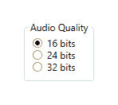
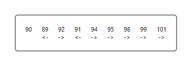
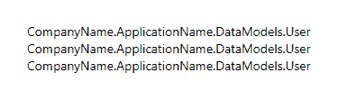
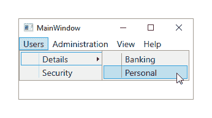
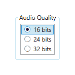

# 第四章：成为数据绑定的熟练者

在本章中，我们将研究用于将我们的数据源连接到我们的 UI 控件的数据绑定语法。我们将检查如何声明依赖属性，以及我们在做这件事时所有可用的各种选项。我们将了解声明的绑定的范围，并揭示数据模板的细节。

正是 WPF 中的数据绑定使得它能够与 MVVM 模式如此良好地工作。它提供了视图和视图模型组件之间双向通信的连接。然而，这种抽象往往会导致困惑，并使得追踪问题比使用传统的 UI 到业务逻辑通信方法更困难。

由于数据绑定是 MVVM 模式如此重要的一个部分，我们将全面介绍这个主题，从基础知识到高级概念，并确保我们能够满足我们可能收到的任何绑定要求。

# 数据绑定基础

在 WPF 中，我们使用 `Binding` 类来创建我们的绑定。一般来说，可以说每个绑定都包含四个组成部分。现在让我们来看看它们：

+   第一个是绑定源；通常，这将是我们的视图模型之一。

+   第二个是从我们想要数据绑定的源对象属性路径。

+   第三个是绑定目标；这通常是一个 UI 控件。

+   第四个是我们想要数据绑定的绑定目标的属性路径。

如果我们的某个绑定不起作用，最可能的原因是以下四个设置中有一个没有正确设置。重要的是要强调，目标属性通常来自 UI 控件，因为有一个数据绑定规则指出，绑定目标必须是依赖属性。大多数 UI 控件的属性都是依赖属性，因此，这个规则只是简单地强制数据通常从我们的视图模型数据源流向绑定目标 UI 控件。

我们将在本章后面部分检查数据绑定数据的传输方向，但首先让我们专注于用于指定 `Binding.Path` 属性值的语法。

# 绑定路径语法

绑定可以声明为长格式，即在 XAML 中定义实际的 `Binding` 元素，或者声明为短格式，使用标记语言，该语言由 XAML 为我们转换为 `Binding` 元素。我们将主要关注短格式，因为这是我们将在整本书中主要使用的格式。

`Binding.Path` 属性的类型是 `PropertyPath`。此类型支持一种独特的语法，可以使用 XAML 标记扩展在 XAML 中表示。虽然有时可能会令人困惑，但我们可以学习一些特定的规则，使其更容易理解。让我们来调查一下。

首先，让我们理解绑定路径是相对于绑定源而言的，并且绑定源通常由`DataContext`属性或路径本身设置。为了绑定到整个绑定源，我们可以这样指定我们的绑定：

```cs
{Binding Path=.} 
```

它也可以这样指定：

```cs
{Binding .} 
```

最简单的情况下，我们可以这样指定我们的绑定：

```cs
{Binding} 
```

注意，当路径值首先声明时，在这个语法中显式声明`Path`属性名是可选的。前面的三个例子都是相等的。为了简洁，本书中的绑定将省略`Path`属性声明。现在让我们看看剩余的属性路径语法迷你语言。

要绑定到大多数属性路径，我们使用与代码中相同的表示法。例如，当直接绑定到数据绑定对象的属性时，我们只需使用属性名：

```cs
{Binding PropertyName} 
```

要绑定到由绑定源的属性直接引用的对象的属性，我们再次使用与代码中相同的语法。这被称为**间接属性定位**：

```cs
{Binding PropertyName.AnotherPropertyName} 
```

类似地，当绑定到集合中的项或集合项的属性时，我们使用代码中的索引表示法。例如，这是我们如何访问数据绑定源中第一个项的属性：

```cs
{Binding [0].PropertyName} 
```

当然，如果我们想访问第二个项，我们使用键`1`，如果我们想访问第三个项，我们使用键值`2`，依此类推。同样，要间接定位集合项的属性，其中集合是绑定源的属性，我们使用以下语法：

```cs
{Binding CollectionPropertyName[0].PropertyName} 
```

如您所见，我们可以自由地组合这些不同的语法选项来生成更复杂的绑定路径。多维集合的访问方式与我们在代码中引用它们的方式相同：

```cs
{Binding CollectionPropertyName[0, 0].PropertyName} 
{Binding CollectionPropertyName[0, 0, 0].PropertyName} 
... 
```

在讨论绑定到集合时，请注意，我们可以使用特殊的斜杠（`/`）语法来在任何时候访问选中项：

```cs
{Binding CollectionPropertyName/PropertyName} 
```

这个特定的例子将绑定到由`CollectionPropertyName`属性指定的集合当前项的`PropertyName`属性。让我们快速看一下一个更实际的例子：

```cs
<StackPanel> 
  <ListBox ItemsSource="{Binding Users}" 
    IsSynchronizedWithCurrentItem="True" /> 
  <TextBlock Text="Selected User's Name:" /> 
  <TextBlock Text="{Binding Users/Name}" /> 
</StackPanel> 
```

在这个基本示例中，我们使用`UsersViewModel`将`Users`集合绑定到一个列表框中。下面，我们输出当前选中项的`Name`属性值。注意`IsSynchronizedWithCurrentItem`属性的设置，因为没有它，这个斜杠绑定将无法正确工作。

尝试从示例中移除`IsSynchronizedWithCurrentItem`属性并再次运行应用程序，您将看到当前用户的名称最初会被输出，但在选中项更改后不会更新。

将此属性设置为`True`将确保每次选择更改时，`ListBox.Items`集合的`ItemCollection.CurrentItem`属性都会更新。请注意，我们也可以使用`ListBox.SelectedItem`属性而不是这个正斜杠表示法来达到相同的效果：

```cs
<StackPanel> 
  <ListBox Name="ListBox" ItemsSource="{Binding Users}"  
    IsSynchronizedWithCurrentItem="True" /> 
  <TextBlock Text="Selected User's Name:" /> 
  <TextBlock Text="{Binding SelectedItem.Name, ElementName=ListBox}" /> 
</StackPanel> 
```

`IsSynchronizedWithCurrentItem`属性现在不再需要更新`TextBlock`中选定的用户名称，因为`SelectedItem`属性将负责这一点。然而，在这种情况下将其设置为`True`将确保`ListBox`中的第一个项目被选中，并且`TextBlock`将最初输出该项目的用户名称。让我们继续查看正斜杠表示法。

如果您正在尝试将数据绑定到集合中某个项目的属性，其中该集合本身是父集合的一个项目，我们可以在单个绑定路径中使用正斜杠表示法多次：

```cs
{Binding CollectionPropertyName/InnerCollectionPropertyName/PropertyName} 
```

为了澄清，此路径将绑定到由`InnerCollectionPropertyName`属性指定的集合中选定项目的`PropertyName`属性，该属性本身是由`CollectionPropertyName`属性指定的集合的选定项目。

让我们不再关注集合，而是转向附加属性。为了将数据绑定到附加属性，我们需要使用与代码中使用的语法略有不同的语法；我们需要将属性名放在括号中，包括类名：

```cs
{Binding (ClassName.PropertyName)} 
```

注意，当附加属性是自定义声明的属性时，我们必须在括号内包含 XAML 命名空间前缀，并用冒号分隔：

```cs
{Binding (XmlNamespacePrefix:ClassName.PropertyName)} 
```

通常，当我们绑定到附加属性时，我们还需要指定绑定目标和目标属性。绑定目标通常是设置绑定的对象，或者另一个 UI 元素，因此在这些情况下我们倾向于看到使用`RelativeSource`或`ElementName`属性：

```cs
{Binding Path=(Attached:TextBoxProperties.Label), 
  RelativeSource={RelativeSource AncestorType={x:Type TextBox}}}
```

我们将在本书的后面部分看到这个示例的扩展版本，但简而言之，它绑定到父控件的`TextBoxProperties.Label`附加属性，该控件类型为`TextBox`。它是在`ControlTemplate`内部调用的，因此父文本框是正在数据绑定的控件的模板父控件。

# 转义无效字符

当使用`PropertyPath`语法迷你语言时，偶尔我们可能需要转义语法中使用的某些字符。一般来说，反斜杠（`\`）用作转义字符，我们只需要转义以下字符。

在我们的绑定路径中可能需要转义的最常见的字符是闭合花括号（`}`），它表示标记部分的结束。此外，如果您需要在绑定路径中使用实际的反斜杠，那么您必须通过在其前面加上另一个反斜杠来转义它。

我们需要转义的唯一其他两个字符是等号（`=`）和逗号字符（`,`），这两个字符都用于定义绑定路径。我们可能在绑定路径中使用的所有其他字符都被认为是有效的。

注意，如果我们需要在索引器绑定表达式中转义一个字符，有一个特殊的字符可以使用。在这些情况下，我们不需要使用反斜杠字符，而是需要使用 caret 字符 (`^`) 作为转义字符。

还要注意，当我们显式地在 XAML 中声明绑定时，我们需要通过将它们替换为其 XML 实体形式来转义 ampersand (`&`) 和大于号 (`>`)。如果您需要使用这些字符，那么将 ampersand 替换为 `&amp;`，将大于号替换为 `&gt;`。

# 探索 `Binding` 类

`Binding` 类具有比我们在这里讨论的空间更多的属性，但我们将很快详细讨论最重要的属性，并简要地看看其他值得注意的属性。`Binding` 类是每个绑定的顶级类，但内部它使用一个更低级别的类来维护绑定源和绑定目标之间的连接。

`BindingExpression` 类是那个底层对象。当使用 MVVM 模式时，开发者通常不会访问这个内部类，因为我们倾向于将功能保持在我们的 View Models 中。然而，如果我们正在编写自定义控件，那么了解它可能是有用的。

它可以在某些情况下用于程序化地更新相关的绑定源，我们将在本章后面了解到这一点。现在，让我们专注于 `Binding` 类能为我们做什么。

在 .NET 4.5 中，`Binding` 类增加了一个非常棒的新属性。`Delay` 属性允许我们指定一个以毫秒为单位的延迟时间，在修改绑定目标属性值后，用于延迟更新绑定源。

如果我们在执行一些依赖于用户在 `TextBox` 元素中的输入的重计算验证或其他处理时，这非常有用。为了进一步阐明这个功能，这个延迟实际上在数据绑定属性值每次改变时，或者在我们例子中的每次按键时都会重新启动。它通常用于分块更新绑定源，每次用户暂停或完成输入时，有点像缓冲：

```cs
<TextBox Text="{Binding Description, 
  UpdateSourceTrigger=PropertyChanged, Delay=400}" /> 
```

`FallbackValue` 属性是性能方面另一个有用的属性。为了从每个绑定返回一个值，WPF 框架最多执行四件事。第一件事是简单地验证目标属性类型与数据绑定值。如果成功，它将尝试解析绑定路径。

大多数情况下，这将有效，但如果不行，它将尝试找到一个转换器来返回值。如果找不到转换器，或者找到的转换器返回`DependencyProperty.UnsetValue`值，它将接着查看`FallbackValue`属性是否有值可以提供。如果没有备用值，则需要查找目标依赖属性的默认值。

通过设置`FallbackValue`属性，我们可以以轻微的方式提高性能，尽管只能做两件事。第一是，它将阻止 WPF 框架查找目标依赖属性的默认值。第二是，它将防止跟踪语句被发送到 Visual Studio 的输出窗口和任何其他已设置的跟踪输出。

`TargetNullValue`属性与`FallbackValue`属性类似，因为它允许我们在没有从绑定源绑定值时提供一些输出。区别在于，当数据绑定值无法解决时，`FallbackValue`属性值被输出，而当成功解决的数据绑定值为`null`时，使用`TargetNullValue`属性值。

我们可以使用此功能显示比`null`更人性化的值，或者甚至在我们的文本框控件中提供默认消息。为此，我们可以将数据绑定的`string`属性设置为`null`，并将适当值设置到`TargetNullValue`属性：

```cs
<TextBox Text="{Binding Name, TargetNullValue='Please enter your name'}" />
```

当然，此消息将实际出现在`TextBox`控件中，因此这不是提供此功能的好方法。我们将在本书后面的部分看到更好的例子，但现在，让我们继续探索`Binding`类。

如果我们的视图模型中有任何异步访问其数据的属性，或者如果它们是通过一个计算密集型过程计算的，那么我们需要在绑定上设置`IsAsync`方法为`True`：

```cs
<Image Source="{Binding InternetSource, IsAsync=True, 
  FallbackValue='pack://application:,,,/CompanyName.ApplicationName;
  component/Images/Default.png'}" /> 
```

这将阻止用户界面在等待数据绑定属性计算或解决时被阻塞。在绑定源解决之前，如果设置了备用值，则使用备用值；否则，将使用默认值。在这个例子中，我们提供了一个默认图像，直到从互联网下载实际图像并解决绑定源为止。

`Binding`类的另一个有用属性是`StringFormat`属性。正如其名称所暗示的，它内部使用`string.Format`方法来格式化我们的数据绑定文本输出。然而，使用此功能有一些注意事项。首先，我们只能使用单个格式项，即正常绑定中的单个数据绑定值。我们将在本章后面了解如何使用多个值。

其次，我们需要仔细声明我们的格式，因为花括号被标记扩展所使用，我们不能使用双引号字符（`"`），因为绑定已经在双引号内声明。一个解决方案是使用单引号来包围我们的格式字符串：

```cs
<TextBlock Text="{Binding Price, StringFormat='{0:C2}'}" /> 
```

另一个选项是使用一对花括号来跳出格式：

```cs
<TextBlock Text="{Binding Price, StringFormat={}{0:C2}}" /> 
```

大多数有用的绑定属性现在都已在此讨论，但应注意的是，`Binding`类中有一些属性在构建使用 MVVM 的 WPF 应用程序时通常不使用。这是因为它们涉及事件处理程序，而我们通常在使用 MVVM 时不会实现事件处理程序。

例如，三个`NotifyOnSourceUpdated`、`NotifyOnTargetUpdated`和`NotifyOnValidationError`属性与`Binding.SourceUpdated`、`Binding.TargetUpdated`和`Validation.Error`附加事件的引发有关。

同样，三个`ValidatesOnDataErrors`、`ValidatesOnExceptions`、`ValidatesOnNotifyDataErrors`和`ValidationRules`属性都与`ValidationRule`类的使用有关。这是一种非常与 UI 相关的验证方式，但这将我们的业务逻辑直接放入我们的视图组件中。

当使用 MVVM 时，我们希望避免组件的这种混合。因此，我们倾向于使用数据元素而不是 UI 元素，所以我们在这我们的数据模型和/或视图模型类中执行这些类型的任务。我们将在本书的第九章中看到这一点，*实现响应式数据验证*，稍后，现在让我们更深入地看看`Binding`类最重要的属性。

# 指导数据绑定流量

每个绑定中数据遍历的方向由`Binding.Mode`属性指定。`BindingMode`枚举中声明了四个不同的方向实例，以及一个额外的值。让我们首先看看这些方向值及其代表的意义。

第一个也是最常见的数据值反映了最常见的情况，即数据从绑定源流向绑定目标，例如，我们的视图模型之一，到 UI 控件。这种绑定模式称为**单向**，由`OneWay`枚举实例指定。这种模式主要用于仅显示或只读目的，以及数据绑定值无法在 UI 中更改的情况。

下一个最常见的旅行方向由`TwoWay`枚举实例表示，表示数据可以自由地从我们的视图模型流向 UI 控件，也可以在相反方向上。这是在将数据绑定到表单控件时最常用的模式，当我们希望用户的更改反映在我们的视图模型中时。

第三个方向枚举实例是`OneWayToSource`实例，它是`OneWay`实例的反面。也就是说，它指定数据只能从绑定目标（由 UI 控件表示）流向绑定源，例如，我们的一些视图模型之一。这种模式也适用于捕获用户输入的日期，当我们不需要更改绑定值的数据时。

最后一个方向实例与`OneWay`实例类似，但它只工作一次，并由`OneTime`实例表示。虽然这种模式确实只工作一次，但在其包含控件的实例化时，它实际上还会在每次设置相关绑定的`DataContext`属性时更新其值。然而，它的目的是提供比`OneWay`成员更好的性能，并且仅适用于绑定到非更改数据，因此如果数据将被更新，这不是正确的方向实例。

最后一个实例命名为`Default`，正如其名所暗示的，是`Binding.Mode`枚举的默认值。它指示绑定使用从指定目标属性声明的绑定模式。当每个依赖属性被声明时，我们可以指定是否默认使用单向或**双向**绑定模式。如果没有特别声明，则该属性将被分配一个单向模式。我们将在本章后面更详细地解释这一点。

# 对不同源的绑定

我们通常使用`FrameworkElement.DataContext`属性来设置绑定源。所有 UI 控件都扩展了`FrameworkElement`类，因此我们可以在它们中的任何一个上设置我们的绑定源。这是绑定能够工作所必需的，尽管它可以在`Path`属性中指定，或者从祖先控件继承，因此不需要显式设置。请看这个简单的例子，它假设在父控件上已经正确设置了合适的绑定源：

```cs
<StackPanel> 
  <TextBlock DataContext="{Binding User}" Text="{Binding Name}" /> 
  <TextBlock DataContext="{Binding User}" Text="{Binding Age}" /> 
</StackPanel> 
```

在这里，我们将第一个`TextBlock`的绑定源设置为`User`对象，并将路径设置为从该源到`Name`属性。第二个也是这样设置，但绑定源路径指向`Age`属性。请注意，我们已经将每个`TextBox`控件上的`DataContext`属性设置为`User`对象。

虽然这是完全有效的 XAML，你可以想象在大型表单中为每个我们想要进行数据绑定的控件这样做是多么的麻烦。因此，我们倾向于利用`DataContext`属性可以从其任何祖先控件继承其值的事实。通过这种方式，我们可以通过在父控件上设置`DataContext`来简化代码：

```cs
<StackPanel DataContext="{Binding User}"> 
  <TextBlock Text="{Binding Name}" /> 
  <TextBlock Text="{Binding Age}" /> 
</StackPanel> 
```

实际上，在开发每个`Window`或`UserControl`时，通常会在这些顶级控件上设置`DataContext`，以便每个包含的控件都可以访问相同的绑定源。这就是为什么我们为每个`Window`或`UserControl`创建一个`ViewModel`，并指定每个`ViewModel`负责提供其相关视图所需的所有数据和功能。

除了设置`DataContext`属性之外，还有几种指定绑定源的方法。一种方法是使用绑定的`Source`属性，这使我们能够显式地覆盖从父`DataContext`继承的绑定源，如果设置了的话。使用`Source`属性，我们也能够将数据绑定到资源，就像我们在我们的`ViewModel`定位器示例中看到的那样，或者绑定到静态值，如下面的代码片段所示：

```cs
<TextBlock Text="{Binding Source={x:Static System:DateTime.Today}, 
  Mode=OneTime, StringFormat='{}© {0:yyyy} CompanyName'}" /> 
```

另一种方法涉及使用绑定的`RelativeSource`属性。使用这种极其有用的`RelativeSource`类型属性，我们可以指定我们想要使用目标控件，或者该控件的父控件作为绑定源。

它还使我们能够覆盖`DataContext`中的绑定源，并且在尝试从`DataTemplate`元素绑定到`ViewModel`属性时通常至关重要。让我们调整之前为我们的`User`数据模型创建的`DataTemplate`，以便输出由`DataTemplate`设置的普通`DataContext`中的属性，以及由父控件的`DataContext`设置的`ViewModel`中的属性，使用`RelativeSource`类的`AncestorType`属性：

```cs
<DataTemplate DataType="{x:Type DataModels:User}"> 
  <StackPanel> 
    <TextBlock Text="{Binding Name}" /> 
    <TextBlock Text="{Binding DataContext.UserCount,   
      RelativeSource={RelativeSource Mode=FindAncestor, 
      AncestorType={x:Type Views:UserView}}}" /> 
  </StackPanel> 
</DataTemplate> 
```

注意，设置指定绑定源相对于绑定目标的相对位置的`Mode`属性在这里是可选的。使用`AncestorType`属性隐式地将`Mode`属性设置为`FindAncestor`实例，因此我们可以不使用它来声明相同的绑定，如下所示：

```cs
<TextBlock Text="{Binding DataContext.UserCount,  
  RelativeSource={RelativeSource 
  AncestorType={x:Type Views:UserView}}}" /> 
```

`Mode`属性是`RelativeSourceMode`枚举类型，它有四个成员。我们已经看到了一个实例的例子，即`FindAncestor`成员，尽管这可以通过相关的`RelativeSource.AncestorLevel`属性进行扩展，该属性指定了要查找绑定源的祖先级别。这个属性只有在控件有多个相同类型的祖先时才有实际意义，如下面的简化示例所示：

```cs
<StackPanel Tag="Outer"> 
  ... 
  <StackPanel Orientation="Horizontal" Tag="Inner"> 
    <TextBlock Text="{Binding Tag, RelativeSource={RelativeSource 
      Mode=FindAncestor, AncestorType={x:Type StackPanel}, 
      AncestorLevel=2}}" /> 
    ... 
  </StackPanel> 
</StackPanel> 
```

在这个例子中，`TextBox`将在运行时输出单词`"Outer"`，因为我们已经声明绑定源应该是`StackPanel`类型的第二个祖先。如果将`AncestorLevel`属性设置为 1 或从绑定中省略，那么`TextBox`将在运行时输出单词`"Inner"`。

下一个`RelativeSourceMode`枚举实例是`Self`，它指定绑定源与绑定目标相同。请注意，当使用`RelativeSource.Self`属性时，`Mode`属性会隐式设置为`Self`实例。我们可以使用此属性将 UI 控件的一个属性绑定到另一个，如下面的例子所示，它将控件的宽度值设置为它的`Height`属性，以确保它保持正方形，无论宽度如何：

```cs
<Rectangle Height="{Binding ActualWidth, 
  RelativeSource={RelativeSource Self}}" Fill="Red" /> 
```

`RelativeSource.TemplatedParent`属性仅用于从`ControlTemplate`内部访问控件的属性。模板父级是指应用了`ControlTemplate`的对象。当使用`TemplatedParent`属性时，`Mode`属性会隐式设置为`RelativeSourceMode`枚举的`TemplatedParent`实例。让我们看一个例子：

```cs
<ControlTemplate x:Key="ProgressBar" TargetType="{x:Type ProgressBar}"> 
  ... 
  <TextBlock Text="{Binding Value, 
    RelativeSource={RelativeSource TemplatedParent}}" /> 
  ... 
</ControlTemplate> 
```

在这个例子中，模板父级是应用此模板的`ProgressBar`实例，因此，使用`TemplatedParent`属性，我们能够从`ControlTemplate`内部访问`ProgressBar`类的各种属性。此外，任何绑定到模板父级`Value`属性的绑定源也将绑定到这个内部`TextBox`元素的`Text`属性。

接下来是最后的`RelativeSource`属性，`PreviousData`在定义集合中项的`DataTemplate`时非常有用。它用于将集合中的前一个项设置为绑定源。虽然不常用，但在某些情况下，我们需要比较集合中相邻项的值，我们将在本章后面看到一个完整的例子。

尽管有一个更简单的选项，但`Binding`类的`ElementName`属性也允许我们覆盖由`DataContext`设置的绑定源。它用于将一个 UI 控件的一个属性绑定到另一个控件的属性，或者同一控件上的另一个属性。使用此属性的唯一要求是我们需要在我们当前控件中命名我们想要数据绑定的元素。让我们看一个例子：

```cs
<StackPanel Orientation="Horizontal" Margin="20"> 
  <CheckBox Name="Checkbox" Content="Service" Margin="0,0,10,0" /> 
  <TextBox Text="{Binding Service}" 
    Visibility="{Binding IsChecked, ElementName=Checkbox, 
    Converter={StaticResource BoolToVisibilityConverter}}" /> 
</StackPanel> 
```

在这个例子中，我们有一个`CheckBox`元素和一个`TextBlock`元素。`TextBlock`元素的`Visibility`属性绑定到`CheckBox`元素的`IsChecked`属性，并且我们使用了之前看到的`BoolToVisibilityConverter`类将`bool`值转换为`Visibility`实例。因此，当用户勾选`CheckBox`元素时，`TextBlock`元素将变为可见。

`ElementName`属性也可以用作访问父控件的`DataContext`的快捷方式。如果我们把我们的视图命名为`This`，例如，那么我们就可以在数据模板中使用`ElementName`属性来绑定到父视图模型的一个属性：

```cs
<DataTemplate DataType="{x:Type DataModels:User}"> 
  <StackPanel> 
    <TextBlock Text="{Binding Name}" /> 
    <TextBlock Text="{Binding DataContext.UserCount, ElementName=This}" /> 
  </StackPanel> 
</DataTemplate> 
```

当指定这些替代绑定源时，重要的是要知道我们一次只能使用这三种不同方法中的一种。如果我们设置绑定`Source`、`RelativeSource`或`ElementName`属性中的多个，那么绑定将抛出一个异常。

# 带优先级的绑定

在偶尔的情况下，我们可能需要指定多个源绑定路径，并将它们映射到单个绑定目标属性。我们可以做到这一点的一种方法是通过使用`MultiBinding`类，我们将在本章的最后部分看到一个例子。然而，还有一个我们可以使用的替代类，它为我们提供了一些额外的功能。

`PriorityBinding`类使我们能够指定多个绑定，并为每个绑定指定一个优先级，声明最早的绑定具有最高的优先级。这个类的特殊功能是，它将显示第一个返回有效值的绑定值，如果不是最高优先级的绑定，那么当它成功解析时，它将更新显示为最高优先级绑定的值。

为了进一步说明，这使我们能够指定一个绑定到正常属性，它将立即解析，而我们要数据绑定的实际值正在下载、计算或以其他方式在一段时间内被解决。这使得我们可以在实际所需的图像正在下载时提供默认图像源，或者在一个计算值准备好显示之前输出一条消息。让我们看看一个简单的 XAML 示例：

```cs
<TextBlock> 
  <TextBlock.Text> 
    <PriorityBinding> 
      <Binding Path="SlowString" IsAsync="True" /> 
      <Binding Path="FastString" Mode="OneWay" /> 
    </PriorityBinding> 
  </TextBlock.Text> 
</TextBlock> 
```

在前面的例子中，我们在`TextBlock.Text`属性上设置了`PriorityBinding`，并在其中指定了两个绑定。第一个具有更高的优先级，并具有我们想要显示的实际属性值。请注意，我们将`IsAsync`属性设置为`True`，以指定此绑定将需要一些时间来解析，并且它不应该阻塞 UI 线程。

第二个绑定使用单向绑定绑定到一个正常属性，简单地输出一条消息：

```cs
public string FastString 
{ 
  get { return "The value is being calculated..."; } 
} 
```

通过使用`PriorityBinding`元素，这条消息将立即输出，并在准备好时更新为`SlowString`属性的实际值。现在让我们继续前进，调查`Binding`类的一种更进一步的类型。

# 控制模板内的绑定

`TemplateBinding`是一种特定的绑定类型，用于在`ControlTemplate`元素内将数据绑定到正在模板化的类型的属性。它与我们在前面讨论的`RelativeSource.TemplatedParent`属性非常相似：

```cs
<ControlTemplate x:Key="ProgressBar" TargetType="{x:Type ProgressBar}"> 
  ... 
  <TextBlock Text="{TemplateBinding Value}" /> 
  ... 
</ControlTemplate> 
```

在这个例子中，我们稍作编辑，我们看到声明一个`TemplateBinding`比使用`RelativeSource.TemplatedParent`属性执行相同的绑定要简单得多。让我们回忆一下它看起来是什么样子：

```cs
<TextBlock Text="{Binding Value, 
  RelativeSource={RelativeSource TemplatedParent}}" /> 
```

如果可能的话，通常更倾向于使用`TemplateBinding`而不是`RelativeSource.TemplatedParent`属性，尽管它们在绑定中执行相同的连接，但它们之间有一些差异。例如，`TemplateBinding`是在编译时评估的，这使控制模板的实例化更快，而`TemplatedParent`绑定则是在运行时才进行评估。

此外，它是一种更简单的绑定形式，缺少了`Binding`类的一些属性，例如`StringFormat`和`Delay`。此外，它对用户施加了额外的约束，即它永久设置为具有`OneWay`绑定模式，并且绑定目标和绑定源都必须是依赖属性。它被设计用于单一位置和单一目的，在这种情况下，它比其对应物做得更好，更有效率。

# 绑定源变更

有时，我们可能需要更改我们的绑定源，并使这些更改传播到绑定目标控件。我们可能希望在新的表单上设置默认值，清除旧表单值，甚至从我们的视图模型设置表单标签。为了做到这一点，我们的视图模型*必须*实现`INotifyPropertyChanged`接口，这也是为什么我们将此实现构建到我们的基视图模型类中的原因。

当我们在 UI 中将绑定源数据绑定到控件时，会为源对象的`PropertyChanged`事件附加一个事件处理器。当接收到绑定源属性路径指定的属性变更通知时，控件会使用新值进行更新。

应该注意的是，如果未特别附加处理器并且其任何属性都没有绑定到 UI 控件，绑定源的`PropertyChanged`事件将是`null`。正因为如此，我们在引发此事件之前必须始终检查`null`。

所有的绑定模式都是绑定源到绑定目标的方向，除了`OneWayToSource`实例。然而，只有这个和`Binding.Mode`枚举的`TwoWay`实例会传播绑定目标到绑定源方向的变化。

当绑定以这两种模式中的任何一种工作的时候，它会为目标控件附加一个处理器来监听目标属性的变化。当它收到目标属性变更的通知时，其行为由绑定`UpdateSourceTrigger`属性的值决定。

此属性是枚举类型`UpdateSourceTrigger`，它有四个成员。最常见的是`PropertyChanged`实例，这表示源属性应在目标属性更改后立即更新。这是大多数控件默认的值。

`LostFocus`成员是下一个最常见的值，它指定当用户将焦点从数据绑定的控件移开时，应该更新绑定源。当用户在每个文本框中完成输入后触发验证而不是在输入时，这个选项可能很有用。

`Explicit`实例不会在没有明确指令的情况下更新绑定源。由于我们需要以编程方式调用内部`BindingExpression`对象的`UpdateSource`方法来传播更改到绑定源，因此这个选项通常在我们的正常视图中不使用。

相反，如果确实使用了它，我们会在我们的`CustomControl`类中找到它。请注意，如果绑定模式没有设置为`OneWayToSource`或`TwoWay`实例之一，调用`UpdateSource`方法将不会做任何事情。

如果我们有一个文本框的实例，并且我们想要显式更新绑定到其`Text`属性的绑定源，我们可以从`BindingOperations.GetBindingExpression`方法访问低级别的`BindingExpression`对象，并调用它的`UpdateSource`方法：

```cs
BindingExpression bindingExpression = 
  BindingOperations.GetBindingExpression(textBox, TextBox.TextProperty); 
bindingExpression.UpdateSource(); 
```

或者，如果我们的绑定目标控件类扩展了`FrameworkElement`类（大多数都是这样），那么我们可以直接调用它的`GetBindingExpression`方法，并传入我们想要更新绑定的依赖属性键：

```cs
textBox.GetBindingExpression(TextBox.TextProperty); 
```

`UpdateSourceTrigger`枚举的最后一个成员是`Default`实例。这与`Binding.Mode`枚举的`Default`实例类似，因为它使用每个目标依赖属性的指定值，并且是`UpdateSourceTrigger`属性的默认值。同样，我们将在本章后面了解到如何设置依赖属性的元数据。

# 转换数据绑定值

在开发 WPF 应用程序时，我们经常需要将数据绑定的属性值转换为不同的类型。例如，我们可能希望使用 ViewModel 中的`bool`属性来控制一些 UI 元素的可见性，这样我们就可以避免在 UI 相关的`Visibility`枚举实例中包含它。

我们可能想要将不同的枚举成员转换为不同的`Brush`对象，或将集合转换为包含集合项的字符串表示。我们已经看到了许多`IValueConverter`接口的示例，但现在让我们更彻底地看看：

```cs
public interface IValueConverter 
{ 
  object Convert(object value, Type targetType, object parameter,  
    CultureInfo culture); 
  object ConvertBack(object value, Type targetType, object parameter,  
    CultureInfo culture); 
} 
```

正如我们已经看到的，类型为`object`的`value`输入参数是绑定的数据绑定值。`object`返回类型与我们要返回的转换后的值相关。`targetType`输入参数指定绑定目标属性的类型，通常用于验证输入值以确保转换器正在使用预期的数据类型。

`parameter` 输入参数可选地用于将额外值传递给转换器。如果使用，其值可以使用 `Binding.ConverterParameter` 属性设置。最后，`culture` 输入参数为我们提供了一个 `CultureInfo` 对象，以便在文化敏感的应用程序中正确格式化文本输出。我们稍后会回到这一点，但首先让我们看看一个使用 `parameter` 输入参数的转换器示例：

```cs
using System; 
using System.Globalization; 
using System.Windows; 
using System.Windows.Data; 

namespace CompanyName.ApplicationName.Converters 
{ 
  [ValueConversion(typeof(Enum), typeof(bool))] 
  public class EnumToBoolConverter : IValueConverter 
  { 
    public bool IsInverted { get; set; } 

    public object Convert(object value, Type targetType, object parameter,
      CultureInfo culture) 
    { 
      if (value == null || parameter == null || (value.GetType() !=
        typeof(Enum) && value.GetType().BaseType != typeof(Enum)))  
        return DependencyProperty.UnsetValue; 
      string enumValue = value.ToString(); 
      string targetValue = parameter.ToString(); 
      bool boolValue = enumValue.Equals(targetValue,  
        StringComparison.InvariantCultureIgnoreCase); 
      return IsInverted ? !boolValue : boolValue; 
    } 

    public object ConvertBack(object value, Type targetType, 
      object parameter, CultureInfo culture)
    { 
      if (value == null || parameter == null) 
        return DependencyProperty.UnsetValue; 
      bool boolValue = (bool)value; 
      string targetValue = parameter.ToString(); 
      if ((boolValue && !IsInverted) || (!boolValue && IsInverted))  
        return Enum.Parse(targetType, targetValue); 
      return DependencyProperty.UnsetValue; 
    } 
  } 
} 
```

这个转换器的想法是，我们可以将枚举属性数据绑定到一个指定特定成员名称的 `RadioButton` 或 `CheckBox` 控件。如果数据绑定属性的值与指定的成员匹配，则转换器将返回 true 并选中控件。对于所有其他枚举成员，控件将不会被选中。然后我们可以在一组 `RadioButton` 控件中的每个控件中指定不同的成员，以便每个成员都可以设置。

在这个类中，我们首先在 `ValueConversion` 属性中指定了涉及转换器实现的 `ValueConversion` 数据类型。接下来，我们看到 `IsInverted` 属性，它在 `BaseVisibilityConverter` 类中出现过，使我们能够反转转换器的输出。

在 `Convert` 方法中，我们首先检查 `value` 和 `parameter` 输入参数的有效性，如果任一无效，则返回 `DependencyProperty.UnsetValue` 值。对于有效值，我们将两个参数转换为它们的 `string` 表示形式。然后我们通过比较两个 `string` 值创建一个 `bool` 值。一旦我们有了 `bool` 值，我们就用它结合 `IsInverted` 属性来返回输出值。

与我们之前的枚举转换器示例一样，`ConvertBack` 方法的实现又有所不同，因为我们无法为假值返回正确的枚举实例；它可以是除了由 `parameter` 输入参数指定的值之外的任何值。

因此，我们只能在数据绑定值为 true 且 `IsInverted` 属性为 false，或者为 false 且 `IsInverted` 属性为 true 的情况下返回指定的枚举实例。对于所有其他输入值，我们简单地返回 `DependencyProperty.UnsetValue` 属性，这是属性系统比 `null` 值更倾向于的。

让我们看看这个方法在实际应用中的例子，我们将使用之前章节中看到的 `BitRate` 枚举。让我们首先看看简单的视图模型：

```cs
using System.Collections.ObjectModel; 
using CompanyName.ApplicationName.DataModels.Enums;  
using CompanyName.ApplicationName.Extensions; 

namespace CompanyName.ApplicationName.ViewModels 
{ 
  public class BitRateViewModel : BaseViewModel 
  { 
    private ObservableCollection<BitRate> bitRates = 
      new ObservableCollection<BitRate>();
    private BitRate bitRate = BitRate.Sixteen; 

    public BitRateViewModel() 
    { 
      bitRates.FillWithMembers(); 
    } 

    public ObservableCollection<BitRate> BitRates 
    { 
      get { return bitRates; } 
      set { if (bitRates != value) { bitRates = value; 
        NotifyPropertyChanged(); } } 
    } 

    public BitRate BitRate 
    { 
      get { return bitRate; } 
      set { if (bitRate != value) { bitRate = value;  
        NotifyPropertyChanged(); } } 
    } 
  } 
}
```

这个类只包含一个类型为 `BitRate` 的集合，它将包含所有可能的成员和一个类型为 `BitRate` 的选择属性，我们将使用我们的新转换器将这个属性数据绑定到各种 `RadioButton` 元素。

注意在构造函数中使用了 `FillWithMembers` 扩展方法。让我们首先看看这个方法：

```cs
public static void FillWithMembers<T>(this ICollection<T> collection) 
{ 
  if (typeof(T).BaseType != typeof(Enum)) 
    throw new ArgumentException("The FillWithMembers<T> method can only be
    called with an enum as the generic type.");
  collection.Clear(); 
  foreach (string name in Enum.GetNames(typeof(T)))  
    collection.Add((T)Enum.Parse(typeof(T), name)); 
} 
```

在`FillWithMembers`扩展方法中，我们首先检查被该方法调用的集合是否为枚举类型，如果不是，则抛出`ArgumentException`。然后我们清除集合，以防它包含任何预存在的项。最后，我们遍历`Enum.GetNames`方法的结果，将每个`string`名称解析到相关的枚举成员，并将其转换为正确的类型，然后将其添加到集合中。

现在让我们看看视图的 XAML：

```cs
<UserControl x:Class="CompanyName.ApplicationName.Views.BitRateView"

  xmlns:Converters="clr-namespace:CompanyName.ApplicationName.Converters; 
    assembly=CompanyName.ApplicationName.Converters"> 
  <UserControl.Resources> 
    <Converters:EnumToBoolConverter x:Key="EnumToBoolConverter" /> 
  </UserControl.Resources> 
  <GroupBox Header="Audio Quality" HorizontalAlignment="Left" 
    VerticalAlignment="Top" Padding="5"> 
    <StackPanel> 
      <RadioButton Content="16 bits" IsChecked="{Binding BitRate,  
        Converter={StaticResource EnumToBoolConverter},  
        ConverterParameter=Sixteen}" VerticalContentAlignment="Center" /> 
      <RadioButton Content="24 bits" IsChecked="{Binding BitRate,  
        Converter={StaticResource EnumToBoolConverter}, ConverterParameter=
        TwentyFour}" VerticalContentAlignment="Center" /> 
      <RadioButton Content="32 bits" IsChecked="{Binding BitRate,  
        Converter={StaticResource EnumToBoolConverter},  
        ConverterParameter=ThirtyTwo}" VerticalContentAlignment="Center" /> 
    </StackPanel> 
  </GroupBox> 
</UserControl> 
```

在这个视图中，我们设置了`Converters` XAML 命名空间前缀，然后在`Resources`部分声明了`EnumToBoolConverter`类的实例。然后我们声明了一个包含三个`RadioButton`元素的`StackPanel`，这些`RadioButton`元素使用资源中的转换器绑定到视图模型中的相同`BitRate`属性。

每个按钮在其绑定的`ConverterParameter`属性中指定不同的枚举成员，并通过`parameter`输入参数传递给转换器。如果选中`RadioButton`，则其真实值传递给转换器，并转换为`ConverterParameter`值指定的值，`BitRate`属性将更新为该值。此代码的输出如下所示：



注意，如果我们有很多枚举成员，或者成员经常变动，像这个例子一样在 UI 中手动声明每一个可能不是好主意。在这些情况下，我们可以利用`DataTemplate`对象以更少的劳动生成相同的 UI。我们将在本章后面看到这个例子，但现在，让我们回到转换器的输入参数。

在`Convert`和`ConvertBack`方法的最终输入参数是`CultureInfo`类型的`culture`参数。在非国际化应用程序中，我们可以简单地忽略此参数，但是如果在您的应用程序中全球化扮演了角色，那么使用此参数是必不可少的。

这使我们能够使用`object.ToString`方法正确格式化转换器中可能有的任何文本输出，并使其与应用程序中的其他文本保持一致。我们还可以在`Convert`类的各种方法中使用它，以确保数字也以正确的格式正确输出。全球化超出了本书的范围，所以我们现在继续前进。

# 将多个源绑定到单个目标属性

在 WPF 中，还有另一种更常见的方法，可以同时将数据绑定到多个绑定源，并将各种值转换为单个输出值。为了实现这一点，我们需要使用一个`MultiBinding`对象，并结合实现`IMultiValueConverter`接口的类。

`MultiBinding`类使我们能够声明多个绑定源和一个单一的绑定目标。如果`MultiBinding`类的`Mode`或`UpdateSourceTrigger`属性被设置，那么它们的值将被包含的`binding`元素继承，除非它们明确设置了不同的值。

来自多个绑定源的价值可以通过两种方式之一组合；它们的`string`表示形式可以使用`StringFormat`属性输出，或者我们可以使用一个实现了`IMultiValueConverter`接口的类来生成输出值。这个接口与`IValueConverter`接口非常相似，但它与多个数据绑定值一起工作。

在实现`IMultiValueConverter`接口时，我们不会设置我们在创建的`IValueConverter`实现中习惯设置的`ValueConversion`属性。

在我们需要实现的`Convert`方法中，来自`IValueConverter`接口的`value`输入参数类型`object`被一个名为`values`的`object`数组所取代，该数组包含我们的输入值。

在`ConvertBack`方法中，我们有一个类型为`Type`的数组，用于绑定目标的类型，以及一个类型为`object`的数组，用于返回类型。除了这些细微的差异之外，这两个接口是相同的。让我们通过一个例子来帮助澄清这种情况。

想象一个场景，一个医疗保健应用程序需要显示患者随时间变化的体重测量值。如果我们可以输出一个指标，指示每个连续测量值是高于还是低于前一个值，以突出任何不健康趋势，那将是有帮助的。

这可以通过使用前面提到的`RelativeSource.PreviousData`属性、一个`MultiBinding`对象和一个`IMultiValueConverter`类来实现。让我们首先看看我们如何实现`IMultiValueConverter`接口：

```cs
using System; 
using System.Globalization; 
using System.Windows; 
using System.Windows.Data; 

namespace CompanyName.ApplicationName.Converters 
{ 
  public class HigherLowerConverter : IMultiValueConverter 
  { 
    public object Convert(object[] values, Type targetType, 
      object parameter, CultureInfo culture) 
    { 
      if (values == null || values.Length != 2 || 
        !(values[0] is int currentValue) || 
        !(values[1] is int previousValue)) 
        return DependencyProperty.UnsetValue;
      return currentValue > previousValue ? "->" : "<-";
    } 

    public object[] ConvertBack(object value, Type[] targetTypes, 
      object parameter, CultureInfo culture) 
    { 
      return new object[2] { DependencyProperty.UnsetValue,  
        DependencyProperty.UnsetValue }; 
    } 
  } 
} 
```

我们从对输入值的常规验证开始我们的实现。在这个特定的转换器中，我们期望两个`int`类型的值，因此我们使用 C# 6.0 模式匹配来验证这些值，然后再继续。如果有效，我们比较我们两个预转换的值，根据比较的结果返回适当的基于`string`的方向箭头。

由于我们的示例中不需要`ConvertBack`方法，我们只需返回一个包含两个`DependencyProperty.UnsetValue`值的`object`数组。接下来，让我们快速看一下我们的视图模型：

```cs
using System.Collections.Generic; 

namespace CompanyName.ApplicationName.ViewModels 
{ 
  public class WeightMeasurementsViewModel : BaseViewModel 
  { 
    private List<int> weights = 
      new List<int>() { 90, 89, 92, 91, 94, 95, 98, 99, 101 }; 

    public List<int> Weights 
    { 
      get { return weights; } 
      set { weights = value; NotifyPropertyChanged(); } 
    } 
  } 
} 
```

在这里，我们有一个非常简单的视图模型，只有一个字段和属性对。我们只是硬编码了一些测试值来演示。现在，让我们看看我们的视图：

```cs
<UserControl 
  x:Class="CompanyName.ApplicationName.Views.WeightMeasurementsView" 

  xmlns:Converters="clr-namespace:CompanyName.ApplicationName.Converters; 
    assembly=CompanyName.ApplicationName.Converters" 
  > 
  <UserControl.Resources> 
    <Converters:HigherLowerConverter x:Key="HigherLowerConverter" /> 
  </UserControl.Resources> 
  <Border BorderBrush="Black" BorderThickness="1" CornerRadius="5" 
    HorizontalAlignment="Left" VerticalAlignment="Top"> 
    <ItemsControl ItemsSource="{Binding Weights}" Margin="20,20,0,20"> 
      <ItemsControl.ItemsPanel> 
        <ItemsPanelTemplate> 
          <StackPanel Orientation="Horizontal" /> 
        </ItemsPanelTemplate> 
      </ItemsControl.ItemsPanel> 
      <ItemsControl.ItemTemplate> 
        <DataTemplate DataType="{x:Type System:Int32}"> 
          <StackPanel Margin="0,0,20,0"> 
            <TextBlock Text="{Binding}" /> 
            <TextBlock HorizontalAlignment="Center"> 
              <TextBlock.Text> 
                <MultiBinding 
                  Converter="{StaticResource HigherLowerConverter}"> 
                  <Binding /> 
                  <Binding 
                    RelativeSource="{RelativeSource PreviousData}" /> 
                </MultiBinding> 
              </TextBlock.Text> 
            </TextBlock> 
          </StackPanel> 
        </DataTemplate> 
      </ItemsControl.ItemTemplate> 
    </ItemsControl> 
  </Border> 
</UserControl> 
```

在 `Converters` XAML 命名空间前缀和 `Resources` 部分中声明的 `HigherLowerConverter` 元素之后，我们有一个带有边框的 `ItemsControl`，它绑定到作为此视图 `DataContext` 的视图模型的 `Weights` 属性。接下来，我们看到一个水平方向的 `StackPanel` 元素被用作 `ItemsControl.ItemsPanel` 属性的 `ItemsPanelTemplate`。这仅仅使得集合控件以水平方式显示项目，而不是垂直方式。

注意，在下面的 `DataTemplate` 对象中，我们需要指定数据类型，因此需要从 `mscorlib` 程序集导入 `System` 命名空间来引用 `Int32` 类型。第一个 `TextBlock` 中的 `Text` 属性的绑定指定它绑定到整个数据源对象，在这种情况下，它只是一个整数。

第二个 `TextBlock` 中的 `Text` 属性的绑定是我们使用 `MultiBinding` 和 `IMultiValueConverter` 元素的地方。我们将我们的 `HigherLowerConverter` 类设置为 `MultiBinding` 对象的 `Converter` 属性，并在其中指定两个 `Binding` 对象。第一个再次绑定到整数值，第二个使用 `RelativeSource.PreviousData` 属性来绑定到前一个整数值。现在让我们看看这个示例的输出：



第一个值之后的每个值下面都会显示一个箭头，指示它是否高于或低于前一个值。虽然这个示例的视觉输出可以改进，但它仍然突出了令人担忧的趋势，即样本数据末尾的重量测量值持续增加。这种有用的技术可以在任何需要比较当前数据值与前一个值的情况下使用，例如在显示股价或库存水平时。

# 依赖属性

我们已经在之前的章节中看到了一些依赖属性的示例，但现在让我们更深入地研究。当我们声明这些属性时，我们有大量选项可以使用，其中一些比其他更常用。让我们首先通过在名为 `DurationPicker` 的类中定义一个类型为 `int` 的 `Hours` 属性来调查标准的声明。

```cs
public static readonly DependencyProperty HoursProperty =
  DependencyProperty.Register(nameof(Hours), typeof(int), 
  typeof(DurationPicker)); 

public int Hours 
{  
  get { return (int)GetValue(HoursProperty); } 
  set { SetValue(HoursProperty, value); }  
} 
```

与所有依赖属性一样，我们首先将属性声明为静态和 `readonly`，因为我们只希望有一个单一的、不可变的实例。这也使我们能够不通过我们类的实例来访问它。

与正常的 CLR 属性不同，我们不是在支持属性的私有字段中存储我们的依赖属性值。相反，默认值直接存储在每个 `DependencyProperty` 对象的元数据中，而更改后的值存储在 `DependencyObject` 实例的单独数组中，该实例上的依赖属性值被设置。

让我们进一步澄清这一点，并记住所有内置控件都扩展了 `DependencyObject` 类。这意味着例如 `TextBox` 类中声明的 `TextProperty` 依赖属性更改后的值，存储在属性值被更改的实际 `TextBox` 实例中。这是绑定只能设置在依赖对象依赖属性上的主要原因。

每个 `DependencyObject` 实例中都有一个值数组存在，包含所有已显式设置在其上的已声明的依赖属性值。这是一个非常重要的点。这意味着默认情况下，如果没有更改的值，数组是空的，因此内存占用非常小。

这与 CLR 类相反，其中每个属性都有一个内存占用，无论它是否被设置。这种安排的结果是节省了大量的内存，因为只有显式设置的依赖属性值才会存储在值数组中，而默认值则直接从依赖属性对象中读取。

这个数组在 `DependencyObject` 类中存在的事实解释了为什么我们需要调用它的 `GetValue` 和 `SetValue` 方法来访问和设置依赖属性的值。这里的 `HoursProperty` 仅仅是标识符，被称为**依赖属性标识符**，其 `GlobalIndex` 属性值用于从该数组访问相关值。

注意，这个数组中的值是 `object` 类型，因此它可以与任何对象类型一起工作。这解释了为什么我们需要在 CLR 包装器属性的获取器中将 `GetValue` 方法的返回值从 `object` 类型转换到适当类型。现在让我们检查当我们声明依赖属性时内部会发生什么。

在 `DependencyProperty` 类中，有一个名为 `PropertyFromName` 的私有静态 `Hashtable`，它持有应用程序中每个已注册依赖属性的引用，并且被类的所有实例共享。为了声明每个属性并创建到 `Hashtable` 的键，我们使用 `DependencyProperty` 类的 `Register` 方法。

这种方法有多个重载，但它们都需要以下信息：属性的名称和类型以及声明类的类型，或者微软更愿意称之为*所有者类型*。让我们更深入地了解一下这个过程。

当我们使用 `Register` 方法之一注册依赖属性时，提供的元数据首先被验证，并在需要时替换为默认值。然后调用一个名为 `RegisterCommon` 的私有方法，并在其中使用一个名为 `FromNameKey` 的类来从依赖属性的名称和所有者类型生成唯一的键。它是通过结合调用传递给它的名称和所有者类型的 `object.GetHashCode` 方法的结果来创建一个唯一的哈希码来做到这一点的。

在创建 `FromNameKey` 对象之后，检查 `PropertyFromName` 集合中是否存在此键，如果其中已存在，则抛出 `ArgumentException`。如果它是唯一的，则从输入参数验证和设置默认元数据和默认值，如果缺失则自动生成。

在此步骤之后，实际的 `DependencyProperty` 实例使用 `new` 关键字和私有构造函数创建。然后，将此内部实例添加到 `PropertyFromName` `Hashtable` 中，使用 `FromNameKey` 对象作为唯一键，然后将其返回给 `Register` 方法的调用者，以便在公共静态 `readonly` Dependency Property Identifier 中本地存储。

注意，重载的 `Register` 方法都有一个额外的输入参数类型为 `PropertyMetadata`，我们将在下一节中探讨这一点。现在，让我们专注于最后一个重载，它还使我们能够将 `ValidateValueCallback` 处理器附加到我们的属性上。

如其名所示，这仅用于验证目的，我们无法在此方法中更改数据绑定值。相反，我们只需返回 `true` 或 `false` 以指定当前值的有效性。让我们看看我们如何将此处理器附加到我们的属性，以及其方法签名是什么：

```cs
public static readonly DependencyProperty HoursProperty =
  DependencyProperty.Register(nameof(Hours), typeof(int), 
  typeof(DurationPicker), new PropertyMetadata(12), ValidateHours));

private static bool ValidateHours(object value) 
{ 
  int intValue = (int)value; 
  return intValue > 0 && intValue < 25; 
} 
```

注意，`ValidateValueCallback` 委托不提供对我们类的任何引用，因此，我们无法从静态上下文中访问其其他属性。为了比较当前值与其他属性值，或者确保满足某些条件，我们可以使用 `DependencyProperty.Register` 方法 `PropertyMetadata` 输入参数的另一个重载，我们很快就会看到。但现在，让我们回到关注 `PropertyMetadata` 输入参数。

# 设置元数据

使用 `PropertyMetadata` 构造函数的重载，我们可以可选地为属性设置默认值，并附加在值更改或正在重新评估时被调用的处理器。现在让我们更新我们的示例，以附加一个 `PropertyChangedCallback` 处理器：

```cs
public static readonly DependencyProperty HoursProperty = 
  DependencyProperty.Register(nameof(Hours), typeof(int), 
  typeof(DurationPicker), new PropertyMetadata(OnHoursChanged)); 

private static void OnHoursChanged(DependencyObject dependencyObject,  
  DependencyPropertyChangedEventArgs e)  
{ 
  // This is the signature of PropertyChangedCallback handlers 
} 
```

注意，我们的 `PropertyChangedCallback` 处理器也必须声明为静态，以便可以从声明的 `DependencyProperty` 的静态上下文中使用，如前述代码所示。然而，我们可能遇到需要调用实例方法而不是静态方法的情况，在这些情况下，我们可以声明一个匿名方法来调用我们的实例方法，如下所示：

```cs
public static readonly DependencyProperty HoursProperty = 
  DependencyProperty.Register(nameof(Hours), 
  typeof(int), typeof(DurationPicker), 
  new PropertyMetadata((d, e) => ((DurationPicker)d).OnHoursChanged(d,e)));   

private void OnHoursChanged(DependencyObject dependencyObject,  
  DependencyPropertyChangedEventArgs e)  
{ 
  // This is the signature of non-static PropertyChangedCallback handlers 
} 
```

由 Lambda 表达式组成的匿名方法可能会令人困惑，所以让我们首先提取相关代码：

```cs
(d, e) => ((DurationPicker)d).OnHoursChanged(d, e)) 
```

这可以重写以使示例更加清晰：

```cs
(DependencyObject dependencyObject, DependencyPropertyChangedEventArgs e)
  => 
  ((DurationPicker)dependencyObject).OnHoursChanged(dependencyObject, e)) 
```

现在，我们可以清楚地看到`PropertyChangedCallback`处理程序的输入参数，然后是匿名方法体。在这个方法内部，我们只需将`dependencyObject`输入参数转换为声明类的类型，然后从类的转换实例调用非静态方法，如果需要，通过传递输入参数。

正如我们在第二章中看到的，*调试 WPF 应用程序*，当它们的值发生变化时，CLR 属性（提供对我们依赖属性的方便访问）不会被 WPF 框架调用。使用这个`PropertyChangedCallback`处理程序是我们能够在值变化时执行操作或调试变化值的方法。

`PropertyMetadata`构造函数的最后一个重载版本还允许我们设置一个`CoerceValueCallback`处理程序，这为我们提供了一个平台，以确保我们的值保持在有效范围内。与`PropertyChangedCallback`委托不同，它要求我们返回属性的输出值，因此这使我们能够在返回之前更改值。以下是一个简单示例，展示了我们如何调整属性值：

```cs
public static readonly DependencyProperty HoursProperty = 
  DependencyProperty.Register(nameof(Hours), 
  typeof(int), typeof(DurationPicker), 
  new PropertyMetadata(0, OnHoursChanged, CoerceHoursValue));

... 

private static object CoerceHoursValue(DependencyObject dependencyObject,  
  object value) 
{ 
  // Access the instance of our class from the dependencyObject parameter   
  DurationPicker durationPicker = (DurationPicker)dependencyObject; 
  int minimumValue = 1, maximumValue = durationPicker.MaximumValue; 
  int actualValue = (int)value; 
  return Math.Min(maximumValue, Math.Max(minimumValue, actualValue)); 
} 
```

在这个简单的例子中，我们首先将`dependencyObject`输入参数进行转换，以便我们可以访问其`MaximumValue`属性。假设我们的`DurationPicker`控件可以处理 12 小时或 24 小时的时间格式，因此我们需要确定当前的上限小时数。因此，我们可以将`Hours`属性值限制在 1 到这个上限之间。

当使用`CoerceValueCallback`处理程序时，有一个特殊情况可以有效地取消值更改。如果你的代码检测到不符合要求的完全无效值，那么你可以简单地从处理程序中返回`DependencyProperty.UnsetValue`值。

这个值向属性系统发出信号，表示它应该丢弃当前更改并返回之前的值。你甚至可以使用这种技术有选择地阻止属性更改，直到类中的其他地方满足某个条件，例如。

这总结了我们在`PropertyMetadata`对象上可用的有用但相当有限的选择，尽管应该注意的是，有一些从该类派生出来的类，我们可以用它们来代替，并且每个都有自己的优点。`UIPropertyMetadata`类直接扩展了`PropertyMetadata`类，并添加了通过其`IsAnimationProhibited`属性禁用属性值所有动画的能力。

此外，`FrameworkPropertyMetadata`类进一步扩展了`UIPropertyMetadata`类，并为我们提供了设置属性继承、属性的默认`Binding.Mode`和`Binding.UpdateSourceTrigger`值以及影响布局的`FrameworkPropertyMetadataOptions`标志的能力。

让我们看看一些`FrameworkPropertyMetadataOptions`成员。如果我们认为大多数用户会希望使用双向数据绑定来绑定我们的属性，那么我们可以使用`BindsTwoWayByDefault`实例来声明它。这会将所有绑定到我们的属性的`Binding.Mode`从默认的`OneWay`成员切换到`TwoWay`成员：

```cs
public static readonly DependencyProperty HoursProperty = 
  DependencyProperty.Register(nameof(Hours), typeof(int), 
  typeof(DurationPicker), new FrameworkPropertyMetadata(0, 
  FrameworkPropertyMetadataOptions.BindsTwoWayByDefault, OnHoursChanged,  
  CoerceHoursValue)); 
```

另一个常用的标志是`Inherits`实例，它指定属性值可以被子元素继承。想想看，可以在`Window`上设置的`FontSize`或`Foreground`属性，并且这些属性会被窗口内的每个控件继承。

注意，如果我们想使用这个`Inherits`成员来创建依赖属性，那么我们应该将其声明为一个附加属性，因为属性值继承与附加属性配合得更好。我们将在后续章节中了解更多关于这一点，但现在让我们继续。接下来是`SubPropertiesDoNotAffectRender`成员，它可以用来优化性能，我们将在第十二章，*部署您的杰作应用程序*中了解更多关于这个特定实例的信息。

最后常用的选项是`AffectsArrange`、`AffectsMeasure`、`AffectsParentArrange`和`AffectsParentMeasure`成员。这些通常用于在自定义面板或其他 UI 控件中声明的依赖属性，其中属性值会影响控件的外观，并且对它的更改需要引起视觉更新。

应当注意，这个`FrameworkPropertyMetadataOptions`枚举是用`FlagsAttribute`属性声明的，这意味着我们也可以为其实例值分配一个位运算组合，因此可以为每个依赖属性设置多个选项：

```cs
public static readonly DependencyProperty HoursProperty = 
  DependencyProperty.Register(nameof(Hours), typeof(int), 
  typeof(DurationPicker), new FrameworkPropertyMetadata(0, 
  FrameworkPropertyMetadataOptions.BindsTwoWayByDefault | 
  FrameworkPropertyMetadataOptions.AffectsMeasure, OnHoursChanged, 
  CoerceHoursValue));
```

为了设置`Binding.UpdateSourceTrigger`属性的默认值，我们需要使用参数最多的构造函数，传递所有六个输入参数：

```cs
public static readonly DependencyProperty HoursProperty = 
  DependencyProperty.Register(nameof(Hours), typeof(int), 
  typeof(DurationPicker), new FrameworkPropertyMetadata(0, 
  FrameworkPropertyMetadataOptions.BindsTwoWayByDefault, OnHoursChanged, 
  CoerceHoursValue, false, UpdateSourceTrigger.PropertyChanged)); 
```

注意，如果我们不需要使用回调处理程序，传递`null`值是完全正常的。`CoerceValueCallback`处理程序值后面的`false`设置了`UIPropertyMetadata`类的`IsAnimationProhibited`属性。这里设置的`UpdateSourceTrigger`值将用于所有没有在绑定上显式设置`UpdateSourceTrigger`属性，或者将`UpdateSourceTrigger.Default`成员设置为绑定属性的绑定的属性。

现在我们已经完全调查了使用`DependencyProperty`类的`Register`方法声明依赖属性时可以使用的各种选项，让我们看看这个类中的另一个注册方法。

# 声明只读依赖属性

通常，只读依赖属性最常见于自定义控件中，在这些情况下，我们需要将数据绑定到一个值，但又不希望它公开可访问。这可能是一个与屏幕上的视觉元素、中间计算点或前一个值相关联的属性，但通常，我们不希望我们的框架用户能够将其数据绑定到它。

让我们想象一个场景，我们想要创建一个按钮，它将使我们能够设置一个工具提示消息，当控件禁用时显示，除了正常的工具提示消息。在这种情况下，我们可以声明一个依赖属性来保存禁用时的工具提示消息，另一个来存储显示禁用工具提示时的原始工具提示值。这个原始工具提示属性是成为只读依赖属性的完美候选。让我们看看这个属性的样子：

```cs
private static readonly DependencyPropertyKey originalToolTipPropertyKey =
  DependencyProperty.RegisterReadOnly("OriginalToolTip", typeof(string),  
  typeof(TooltipTextBox), new PropertyMetadata()); 

public static readonly DependencyProperty OriginalToolTipProperty =  
  originalToolTipPropertyKey.DependencyProperty; 

public static string GetOriginalToolTip(DependencyObject dependencyObject) 
{ 
  return (string)dependencyObject.GetValue(OriginalToolTipProperty); 
} 
```

正如你所见，我们使用不同的语法来声明只读依赖属性。不是返回`Register`方法返回的`DependencyProperty`标识符，而是`RegisterReadOnly`方法返回一个`DependencyPropertyKey`对象。

此对象通常使用`private`访问修饰符声明，以防止它通过`DependencyObject.SetValue`方法在外部使用。然而，这个方法可以在注册只读属性的类中使用，以设置其值。

`DependencyPropertyKey`对象的`DependencyProperty`属性用于返回实际使用的`DependencyProperty`标识符，从我们之前讨论的字典中访问属性值。

`RegisterReadOnly`方法的输入参数与标准`Register`方法的选项相同，尽管有一个较少的重载。与`Register`方法不同，在调用`RegisterReadOnly`方法时，我们始终需要提供`PropertyMetadata`对象，尽管如果我们不需要它提供的内容，我们可以传递一个`null`值。

需要注意的一个非常重要的问题是，当数据绑定到一个只读依赖属性时，我们必须将绑定的`Mode`属性设置为`OneWay`枚举成员。未能这样做将在运行时导致错误。我们已经详细介绍了正常依赖属性的创建，现在让我们继续看看不同类型的依赖属性。

# 注册附加属性

`DependencyProperty`类使我们能够注册一种更进一步的、特殊的依赖属性类型。这些属性类似于 XAML 的扩展方法，因为它们使我们能够通过我们自己的功能扩展现有的类。当然，它们是附加属性。

我们已经在本书的早期部分看到了一些它们的示例，我们将在后面看到更多示例，但在这个章节中，我们将介绍它们的注册。我们可以以完全相同的方式声明附加属性，就像我们创建依赖属性一样，并且有所有相同的设置元数据和附加处理程序的各种选项。

`RegisterAttached` 和 `RegisterAttachedReadOnly` 方法有几个重载，它们在输入参数和功能上与 `Register` 和 `RegisterReadOnly` 方法相对应。然而，我们不需要为我们的附加属性声明 CLR 包装器，而是需要声明一对获取器和设置器方法来访问和设置它们的值。让我们看看 `TextBoxProperties` 类的另一个示例：

```cs
public static DependencyProperty IsFocusedProperty = 
  DependencyProperty.RegisterAttached("IsFocused", 
  typeof(bool), typeof(TextBoxProperties),
  new PropertyMetadata(false, OnIsFocusedChanged)); 

public static bool GetIsFocused(DependencyObject dependencyObject) 
{ 
  return (bool)dependencyObject.GetValue(IsFocusedProperty); 
} 

public static void SetIsFocused(DependencyObject dependencyObject,  
  bool value) 
{ 
  dependencyObject.SetValue(IsFocusedProperty, value); 
} 

public static void OnIsFocusedChanged(DependencyObject dependencyObject,  
  DependencyPropertyChangedEventArgs e) 
{ 
  TextBox textBox = dependencyObject as TextBox; 
  if ((bool)e.NewValue && !(bool)e.OldValue && !textBox.IsFocused)  
    textBox.Focus(); 
} 
```

在这里，我们声明了一个名为 `IsFocused` 的 `bool` 附加属性，它包含一个 `PropertyMetadata` 元素，用于指定默认值和 `PropertyChangedCallback` 处理程序。与依赖属性的 CLR 属性包装器一样，这些获取器和设置器方法不会被 WPF 框架调用。它们通常被声明为公共和静态。

然而，有一种情况下我们不需要将这些方法声明为公共的。如果我们想创建一个可以由其子元素继承值的依赖属性，那么我们应该使用 `RegisterAttached` 方法来声明它，即使我们不需要附加属性。在这种情况下，我们不需要公开暴露我们的属性获取器和设置器。

虽然我们可以在声明依赖属性及其值继承时指定 `FrameworkPropertyMetadataOptions.Inherits` 元数据选项，并且在某些情况下值继承可能有效，但在其他情况下并不保证。由于附加属性是属性系统中的全局属性，我们可以确信它们的属性值继承将在所有情况下都有效。

回到我们的示例，我们的 `PropertyChangedCallback` 处理程序是一个简单的事件。它将 `dependencyObject` 属性转换为属性附加到的控件类型，在本例中是一个 `TextBox`。然后它验证数据绑定的 `bool` 值是否已从 `false` 设置为 `true`，并且控件尚未聚焦。如果这些条件得到验证，控件随后将被聚焦。

此附加属性可以像这样绑定到视图模型中的 `bool` 属性：

```cs

... 
<TextBox Attached:TextBoxProperties.IsFocused="{Binding IsFocused}" 
  Text="{Binding User.Name}" /> 
```

附加的 `TextBox` 控件可以通过以下方法在任何时候从视图模型中聚焦：

```cs
private void Focus() 
{ 
  IsFocused = false; 
  IsFocused = true; 
} 
```

注意，在将其设置为 `true` 之前，我们需要确保变量是 `false`，因为实际更改值将触发控件聚焦。现在我们已经知道了如何声明我们自己的自定义依赖属性，让我们将注意力转向管理它们设置的规则。

# 优先设置值来源

正如我们已经看到的，有几种方法可以设置依赖属性值；我们可以在代码中直接设置它们，在 XAML 中本地设置，或者通过使用我们的 `CoerceValueCallback` 处理程序，例如。然而，还有许多其他方法可以设置它们。例如，它们也可以在样式、动画或通过属性继承中设置，仅举几例。

当我们将 View Model 属性数据绑定到依赖属性，并发现显示的值不是我们期望的值时，其中一个原因可能是因为另一种设置属性的方法具有更高的优先级，因此覆盖了我们的期望值。这是因为所有设置依赖属性值的方法都按照重要性顺序排列在一个称为依赖属性设置优先级列表的列表中。现在让我们看看这个列表：

1.  属性系统强制转换

1.  动画属性

1.  本地值

1.  模板属性

1.  隐式样式（仅适用于 `Style` 属性）

1.  样式触发器

1.  模板触发器

1.  样式设置器

1.  默认（主题）样式

1.  继承

1.  从依赖属性元数据中获取的默认值

在列表的末尾，优先级最低的是在依赖属性声明中指定的默认值。接下来是属性继承引起的变化。请记住，这可以在我们的依赖属性中使用 `DependencyProperty.Register` 方法的 `FrameworkPropertyMetadata` 输入参数中的 `FrameworkPropertyMetadataOptions.Inherits` 实例来定义。让我们看看一个例子来突出这个优先级顺序：

```cs
<StackPanel TextElement.FontSize="20"> 
  <TextBlock Text="Black Text" /> 
  <StackPanel Orientation="Horizontal" TextElement.Foreground="Red"> 
    <TextBlock Text="Red Text" /> 
  </StackPanel> 
</StackPanel> 
```

在这个第一个例子中，外层 `StackPanel` 中的 `TextBlock` 控件的 `Foreground` 颜色默认设置为黑色，这是在数据绑定的 `Text` 属性中设置的。然而，内层 `StackPanel` 中的 `TextBlock` 控件的默认 `Foreground` 属性值被其父控件的 `TextElement.Foreground` 附加属性值覆盖，该值设置在其父控件上。它从 `StackPanel` 继承了这个属性的值，这表明通过属性继承设置的属性优先级高于使用默认值设置的属性。

然而，在主题样式中设置的默认属性值在优先级列表中紧随其后，具有下一个最低的优先级，并覆盖了通过继承设置的属性值。由于很难给出一个简短的 XAML 示例来说明这一点，我们将跳过这一项，并继续下一项。在列表中排在第八位的是由样式设置器设置的属性值。让我们调整我们之前的例子来演示这一点：

```cs
<StackPanel TextElement.FontSize="20"> 
  <TextBlock Text="Black Text" /> 
  <StackPanel Orientation="Horizontal" TextElement.Foreground="Red"> 
    <TextBlock Text="Red Text" Margin="0,0,10,0" /> 
    <TextBlock Text="Green Text"> 
      <TextBlock.Style> 
        <Style TargetType="{x:Type TextBlock}"> 
          <Setter Property="Foreground" Value="Green" /> 
        </Style> 
      </TextBlock.Style> 
    </TextBlock> 
  </StackPanel> 
</StackPanel> 
```

在这个例子中，外层`StackPanel`中的`TextBlock`控件仍然通过数据绑定`Text`属性的默认值将其`Foreground`颜色设置为黑色。内层`StackPanel`中的顶部`TextBlock`控件仍然通过其父控件的`TextElement.Foreground`值覆盖了其默认的`Foreground`属性值。然而，现在我们还可以看到，在`Style`中设置的值将覆盖继承的属性值。这是此代码片段的输出：


接下来，在优先级列表的第七位，我们有模板触发器，它们覆盖了由样式设置器和之前提到的所有其他设置值方法设置的属性值。请注意，这专门处理在模板中声明的触发器，例如`ControlTemplate`，而不涉及在`Style.Triggers`集合内声明的触发器。让我们看一个例子：

```cs
<Button Content="Blue Text" FontSize="20"> 
  <Button.Style> 
    <Style TargetType="{x:Type Button}"> 
      <Setter Property="Foreground" Value="Green" /> 
      <Setter Property="Control.Template"> 
        <Setter.Value> 
          <ControlTemplate TargetType="{x:Type Button}"> 
            <ContentPresenter /> 
            <ControlTemplate.Triggers>                   
              <Trigger Property="IsEnabled" Value="True"> 
                <Setter Property="Foreground" Value="Blue" /> 
              </Trigger> 
            </ControlTemplate.Triggers> 
          </ControlTemplate> 
        </Setter.Value> 
      </Setter> 
    </Style> 
  </Button.Style> 
</Button> 
```

在这个例子中，我们声明了一个按钮并覆盖了它的`ControlTemplate`，为它定义了一个新的、最小化的标记。在样式设置中，我们将`Foreground`属性值设置为绿色。然而，在我们的`ControlTemplate`中有一个`Trigger`，当其条件满足时，将覆盖这个值并将其设置为蓝色。请注意，如果我们将触发条件更改为`false`或删除整个触发器，按钮文本将变为绿色，这是由样式设置的。

在列表的第六位，是声明在`Style.Triggers`集合内的触发器。这里的一个重要点是，这仅与声明为内联本地、当前控件`Resources`部分或应用程序资源文件中的样式相关，而不是与具有较低优先级值的默认样式相关。我们可以通过向`Style.Triggers`集合中添加一个新的触发器来扩展我们之前的示例，以突出这个新优先级：

```cs
<Button Content="Orange Text" FontSize="20"> 
  <Button.Style> 
    <Style TargetType="{x:Type Button}"> 
      <Setter Property="Foreground" Value="Green" /> 
      <Setter Property="Control.Template"> 
        <Setter.Value> 
          <ControlTemplate TargetType="{x:Type Button}"> 
            <ContentPresenter /> 
            <ControlTemplate.Triggers> 
              <Trigger Property="IsEnabled" Value="True"> 
                <Setter Property="Foreground" Value="Blue" /> 
              </Trigger> 
            </ControlTemplate.Triggers> 
          </ControlTemplate> 
        </Setter.Value> 
      </Setter> 
      <Style.Triggers> 
        <Trigger Property="IsEnabled" Value="True"> 
          <Setter Property="Foreground" Value="Orange" /> 
        </Trigger> 
      </Style.Triggers> 
    </Style> 
  </Button.Style> 
</Button> 
```

当运行这个示例时，我们的文本现在是橙色。由样式`Triggers`集合中的触发器设置的`Foreground`属性值覆盖了由模板触发器设置的值，而模板触发器本身又覆盖了由样式设置器设置的值。让我们继续。

在列表的第五位，我们有隐式样式。请注意，这个特殊的优先级级别仅适用于`Style`属性，不适用于其他属性。可以通过指定目标类型并在没有设置`x:Key`指令的情况下声明来隐式地将样式设置为类型的所有成员。以下是一个示例：

```cs
<Style TargetType="{x:Type Button}"> 
  <Setter Property="Foreground" Value="Green" /> 
</Style> 
```

相关样式必须在当前 XAML 页面中声明，或者位于`App.xaml`文件的`Application.Resources`部分。主题中的样式不包括在内，因为它们具有较低的值优先级。请注意，这个特殊位置在.NET 4 中才被添加，并且在.NET 3 的[docs.microsoft.com](http://docs.microsoft.com)网站上的文档中被省略。

接下来列表的第四个位置是设置在 `ControlTemplate` 或 `DataTemplate` 内部的属性。如果我们直接在模板内的任何元素上设置属性，该值将覆盖所有优先级较低的设置方法设置的所有值。例如，如果我们直接在我们的上一个示例中的 `ContentPresenter` 上设置 `Foreground` 属性，那么它的值将覆盖该示例中的所有其他设置，按钮文本将变为红色：

```cs
<ControlTemplate TargetType="{x:Type Button}"> 
  <ContentPresenter TextElement.Foreground="Red" /> 
  <ControlTemplate.Triggers> 
    <Trigger Property="IsEnabled" Value="True"> 
      <Setter Property="Foreground" Value="Blue" /> 
    </Trigger> 
  </ControlTemplate.Triggers> 
</ControlTemplate> 
```

在列表的第三个位置，我们有局部设置的值。为了演示这一点，我们可以在最后一个完整示例中的实际按钮上设置 `Foreground` 属性，但让我们强调一个很多开发者都会犯的极其常见的错误。想象一下，我们想要在大多数情况下以一种颜色输出值，但在某些情况下以另一种颜色输出。一些开发者可能会尝试这样做：

```cs
<TextBlock Text="{Binding Account.Amount, StringFormat={}{0:C}}"  
  Foreground="Green"> 
  <TextBlock.Style> 
    <Style TargetType="{x:Type TextBlock}"> 
      <Style.Triggers> 
        <DataTrigger Binding="{Binding Account.IsOverdrawn}" Value="True"> 
          <Setter Property="Foreground" Value="Red" /> 
        </DataTrigger> 
      </Style.Triggers> 
    </Style> 
  </TextBlock.Style> 
</TextBlock> 
```

在运行这个示例时，有些人可能会期望它能够正常工作，但结果却令人困惑。这个不工作的原因是因为局部属性设置具有比由样式触发器设置的属性更高的值设置优先级。纠正这个错误的解决方案是利用我们新发现的价值设置优先级列表，并将局部属性设置移动到样式设置器，其优先级低于触发器：

```cs
<TextBlock Text="{Binding Account.Amount, StringFormat={}{0:C}}"> 
  <TextBlock.Style> 
    <Style TargetType="{x:Type TextBlock}"> 
      <Setter Property="Foreground" Value="Green" /> 
      <Style.Triggers> 
        <DataTrigger Binding="{Binding Account.IsOverdrawn}" Value="True"> 
          <Setter Property="Foreground" Value="Red" /> 
        </DataTrigger> 
      </Style.Triggers> 
    </Style> 
  </TextBlock.Style> 
</TextBlock> 
```

现在，`TextBlock.Foreground` 属性将由样式设置器设置为绿色，并在条件为真时被触发器覆盖，正如预期的那样。让我们继续向上列表到第二个位置。在倒数第二个位置，我们有由动画设置的属性值。一个非常简单的例子可以很好地向我们展示这一点：

```cs
<Rectangle Width="300" Height="300" Fill="Orange"> 
  <Rectangle.Triggers> 
    <EventTrigger RoutedEvent="Loaded"> 
      <BeginStoryboard> 
        <Storyboard Storyboard.TargetProperty="Width"> 
          <DoubleAnimation Duration="0:0:1" To="50" AutoReverse="True"
            RepeatBehavior="Forever" /> 
        </Storyboard> 
      </BeginStoryboard> 
    </EventTrigger> 
  </Rectangle.Triggers> 
</Rectangle> 
```

在这个例子中，动画覆盖了局部设置的 `Width` 属性值，矩形按计划增长和缩小。如果我们逻辑上思考这个问题，那么很明显，动画系统必须在属性设置优先级列表中占据一个非常高的位置。否则，如果它在列表中位置较低，我们就无法进行任何动画。

然而，由动画设置的属性在列表中排在第二位，这意味着有一个地方可以设置属性，即使是由动画设置的值也可以覆盖。在依赖属性设置优先级列表中排在第一位，具有绝对最高优先级设置的是我们在 *依赖属性* 部分讨论过的属性强制系统。

这种情况只可能发生在我们构建了一个自定义控件，该控件动画化了一个具有特定要求的自定义依赖属性的情况下，例如指定它应该具有某个最大值或最小值。在这种情况下，我们可以在附加到依赖属性的 `CoerceValueCallback` 处理程序中强制执行这些规则。

如果我们有这些由属性强制系统强制执行的请求，但希望在 UI 中动画化它们，那么我们希望强制值覆盖动画设置的值，这又完全合理。这样，我们可以确信我们的强制属性值将始终在我们为其设置的范围内。

# 数据模板

我们已经看到了许多简单的`DataTemplate`示例，但它们是 WPF 的重要组成部分，因此我们现在将更深入地研究它们。简而言之，我们使用`DataTemplate`来定义我们希望在 UI 中渲染特定数据对象的方式*。

如果我们不提供特定类型的`DataTemplate`并将其数据绑定到 UI 控件，WPF 框架将不知道如何显示它。让我们用一个例子来强调这一点：

```cs
<ItemsControl ItemsSource="{Binding Users}" /> 
```

在这些情况下，WPF 框架能做的最好的事情就是显示每个对象的`string`表示形式。它是通过在数据对象上调用`object.ToString`方法并将该值设置为`TextBlock`的`Text`属性来实现的，它使用该属性来显示对象。如果此方法在对象的类中未被重写，这将导致在显示位置显示对象的类型名称：



知道 WPF 框架在显示数据对象之前会调用我们的`ToString`方法，使我们能够采取捷径，或者定义`DataTemplate`的简单替代方案，如果我们只需要在 UI 中输出文本。因此，我们始终覆盖`object.ToString`方法以输出一些有意义的显示是一个好主意：

```cs
public override string ToString() 
{ 
  return Name; 
} 
```

这将导致以下输出：


注意，Visual Studio IntelliSense 在显示数据对象之前也会调用我们的`ToString`方法，因此为其提供自定义实现的好处是双倍的。因此，我们通常在我们的基类中添加一个抽象方法，以确保所有派生类都将实现此方法：

```cs
namespace CompanyName.ApplicationName.DataModels 
{ 
  public abstract class BaseDataModel : INotifyPropertyChanged 
  { 
    ... 

    public abstract override string ToString(); 
  } 
}
```

现在回到数据模板的话题，让我们首先看看我们`User`对象的一个更好的示例，然后调查我们可以在哪里声明我们的数据模板：

```cs
<DataTemplate x:Key="UserTemplate" DataType="{x:Type DataModels:User}"> 
  <Border BorderBrush="Black" BorderThickness="1" CornerRadius="5"  
    Padding="5" Margin="0,0,0,5"> 
    <StackPanel Orientation="Horizontal"> 
      <TextBlock Text="{Binding Name}" Margin="0,0,3,0" /> 
      <TextBlock Text="{Binding Age, StringFormat={}({0})}" /> 
    </StackPanel> 
  </Border> 
</DataTemplate> 
```

在这个例子中，我们只是在`TextBlock`中输出用户的名字，在另一个`TextBlock`中输出他们的年龄。注意使用`StringFormat`属性将年龄括号包围在输出中。现在让我们看看这个`DataTemplate`是如何渲染我们的`User`对象的：


主要来说，我们可以在四个主要位置之一声明我们的数据模板。第一个是与将显示相关数据对象或对象的控件一致。对于这一点，我们也有两种主要的选择，具体取决于我们要显示的数据对象数量。

如果我们有一个单独的对象要显示，我们可以使用`ContentControl`元素来显示它，并使用`ContentControl.ContentTemplate`属性来定义它应该用来渲染数据对象的`DataTemplate`元素：

```cs
<ContentControl Content="{Binding Users[0]}"> 
  <ContentControl.ContentTemplate> 
    <DataTemplate DataType="{x:Type DataModels:User}"> 
      ... 
    </DataTemplate> 
  </ContentControl.ContentTemplate> 
</ContentControl>
```

类似地，在一个集合控件或`ItemsControl`，例如`ListBox`控件中，我们可以在`ItemTemplate`属性中直接声明我们的`DataTemplate`：

```cs
<ListBox ItemsSource="{Binding Users}"> 
  <ListBox.ItemTemplate> 
    <DataTemplate DataType="{x:Type DataModels:User}"> 
      ... 
    </DataTemplate> 
  </ListBox.ItemTemplate> 
</ListBox> 
```

我们可以在将要显示数据对象或对象的控件的`Resources`部分中声明我们的数据模板。现在这是我们的`ContentControl`：

```cs
<ContentControl Content="{Binding Users[0]}" 
  ContentTemplate="{StaticResource UserTemplate}"> 
  <ContentControl.Resources> 
    <DataTemplate x:Key="UserTemplate" DataType="{x:Type DataModels:User}">
      ... 
    </DataTemplate> 
  </ContentControl.Resources> 
</ContentControl> 
```

我们还可以在包含显示数据对象的控件的`Window`或`UserControl`的`Resources`部分中声明我们的数据模板。如果我们有多个数据对象，我们可以这样设置我们的数据模板：

```cs
<UserControl.Resources> 
  <DataTemplate x:Key="UserTemplate" DataType="{x:Type DataModels:User}">
    ... 
  </DataTemplate> 
</UserControl.Resources> 
<ListBox ItemsSource="{Binding Users}" 
  ItemTemplate="{StaticResource UserTemplate}" /> 
```

我们可以在`App.xaml`文件的`Application.Resources`部分定义我们的数据模板。当 WPF 框架搜索特定数据类型的数据模板时，它首先搜索应用模板的控件本地的`Resources`部分。

如果它找不到匹配的类型，它将接着搜索父控件的`Resources`集合，然后是那个控件的父级，依此类推。如果它仍然找不到匹配类型的数据模板，它将搜索`App.xaml`页面的`Application.Resources`部分。

我们可以利用这种查找顺序来达到我们的目的。我们通常在`App.xaml`页面的`Application.Resources`部分声明我们的默认数据模板，因为这些资源在应用程序范围内可用。如果我们需要覆盖我们的默认数据模板，以在特定的视图中显示特定的输出，我们可以在视图的`Resources`部分本地声明一个新的数据模板，并使用相同的`x:Key`指令。

因为在搜索应用程序资源之前会先搜索本地`Resources`部分，所以它会使用本地声明的数据模板而不是默认模板。另一种覆盖我们的默认模板的方法是不设置它们的`x:Key`指令来声明它们：

```cs
<DataTemplate DataType="{x:Type DataModels:User}"> 
  ... 
</DataTemplate> 
```

以这种方式声明的资源会隐式应用于所有适当类型的、没有显式应用数据模板的数据对象。因此，为了覆盖这些默认数据模板，我们可以简单地声明一个新的数据模板，并使用其`x:Key`指令显式将其设置为相对模板属性。现在让我们看看指定数据模板的另一种方法。

# 完全控制

有时，我们可能想要根据它们的属性值以不同的方式显示相同类型的不同对象。例如，对于代表车辆的对象集合，你可能希望对不同类型的车辆有不同的显示，因为卡车和摩托艇有不同的规格。`DataTemplateSelector`类使我们能够做到这一点。

当扩展`DataTemplateSelector`类时，我们可以重写其单个`SelectTemplate`方法。在这个方法中，我们既提供了数据对象，也提供了数据绑定对象，可以根据数据对象的属性值选择不同的数据模板来返回。

让我们看看一个非常简单的例子，根据`User`的年龄返回两个数据模板之一。我们首先需要为我们的`User`类型声明另一个`DataTemplate`：

```cs
<DataTemplate x:Key="InverseUserTemplate" 
  DataType="{x:Type DataModels:User}"> 
  <Border BorderBrush="White" BorderThickness="1" Background="Black"     
    TextElement.Foreground="White" CornerRadius="5" Padding="8,3,5,5"
    Margin="0,0,0,5"> 
    <StackPanel Orientation="Horizontal"> 
      <TextBlock Text="{Binding Name}" Margin="0,0,3,0" /> 
      <TextBlock Text="{Binding Age, StringFormat={}({0})}" /> 
    </StackPanel> 
  </Border> 
</DataTemplate> 
```

在这个模板中，我们只是将背景和前景的颜色与第一个模板中的颜色进行了反转。现在让我们看看将引用这两个`DataTemplate`元素的`DataTemplateSelector`类：

```cs
using System.Windows; 
using System.Windows.Controls; 
using CompanyName.ApplicationName.DataModels; 

namespace CompanyName.ApplicationName.Views.DataTemplateSelectors 
{ 
  public class UserAgeDataTemplateSelector : DataTemplateSelector 
  { 
    public override DataTemplate SelectTemplate(object item,  
      DependencyObject container) 
    { 
      FrameworkElement element = container as FrameworkElement; 
      if (element != null && item != null && item is User user) 
      { 
        if (user.Age < 35) return 
          (DataTemplate)element.FindResource("InverseUserTemplate"); 
        else return (DataTemplate)element.FindResource("UserTemplate"); 
      } 
      return null; 
    } 
  } 
} 
```

在这个例子中，我们首先使用`as`关键字将`container`输入参数转换为`FrameworkElement`类型的对象。然后，我们对这个新对象和其他输入参数执行标准的`null`检查，并使用`is`关键字进行模式匹配以确定正确的类型，如果`item`参数是正确的类型，则自动将其转换为`User`对象。如果是，那么我们就在我们的`FrameworkElement`对象上调用`FindResource`方法，根据`Age`属性的值返回适当的数据模板。如果不是，则返回`null`。

`FrameworkElement.FindResource`方法首先在调用对象中搜索数据模板，然后是其父元素，依此类推，向上到逻辑树。如果在应用程序窗口的任何父元素中找不到它，它将接着在`App.xaml`文件中查找。如果在那里仍然找不到，它将接着在主题和系统资源中搜索。

`container`输入参数用于访问`FindResource`方法。请注意，如果我们使用的是常规集合控件，它通常将是`ContentPresenter`类型，因此我们可以将其转换为该类型以访问数据模板。

然而，默认容器可以被覆盖以使用`ContentPresenter`类派生的一个父类。因此，为了避免异常的可能性，将其转换为实际声明`FindResource`方法的`FrameworkElement`类更安全。

让我们看看我们如何使用这个类。首先，我们需要为我们的`DataTemplateSelectors`命名空间添加 XAML 命名空间前缀：

```cs
xmlns:DataTemplateSelectors=
  "clr-namespace:CompanyName.ApplicationName.Views.DataTemplateSelectors"
```

然后我们需要将我们的`UserAgeDataTemplateSelector`类的一个实例添加到`Resources`部分：

```cs
<DataTemplateSelectors:UserAgeDataTemplateSelector 
  x:Key="UserAgeDataTemplateSelector" />
```

最后，我们将资源选择器设置为`ItemTemplateSelector`属性：

```cs
<ItemsControl ItemsSource="{Binding Users}" Padding="10"  
  ItemTemplateSelector="{StaticResource UserAgeDataTemplateSelector}" />
```

当现在运行应用程序时，我们将看到这个新的输出：


注意，`DataTemplateSelector`类通常与非常不同的模板一起使用，例如那些构成自定义控件不同编辑或查看模式的模板。在我们简单的例子中，这样的细微差别可以通过使用样式触发器更容易地实现，我们将在下一章中了解更多关于触发器和样式的内容。

# 显示分层数据

在.NET 框架中有一个类扩展了`DataTemplate`类，以便支持扩展`HeaderedItemsControl`类的 UI 控件。正如其名，`HeaderedItemsControl`类代表一种具有标题的特定类型的`ItemsControl`元素。例如包括`MenuItem`、`TreeViewItem`和`ToolBar`类。

`HierarchicalDataTemplate`类是为了显示层次化数据模型而创建的。为了进一步说明，层次化数据模型是一个包含与父对象相同类型的项的集合属性的数据模型。想象一下 Windows 资源管理器窗口中的文件夹视图；每个文件夹可以包含更多的文件夹。

`HierarchicalDataTemplate`类与`DataTemplate`类的主要区别在于，`HierarchicalDataTemplate`类有一个`ItemsSource`属性，我们可以用它来绑定每个项目的子项。

除了`ItemsSource`属性之外，还有许多其他与项相关的属性，例如`ItemContainerStyle`、`ItemStringFormat`和`ItemTemplate`属性。我们将在下一章中了解更多关于这些其他属性的功能，但现在让我们看看一个例子。

在网上可以找到许多`HierarchicalDataTemplate`示例，展示了如何使用`TreeViewItem`元素，所以在这个例子中，我们将看看如何使用数据绑定构建应用程序菜单。首先，我们需要一个视图模型来绑定到每个`MenuItem`控件。让我们看看我们的`MenuItemViewModel`类：

```cs
using System.Collections.ObjectModel; 
using System.Windows.Input; 

namespace CompanyName.ApplicationName.ViewModels 
{ 
  public class MenuItemViewModel : BaseViewModel 
  { 
    private string header = string.Empty; 
    private ICommand command = null; 
    private ObservableCollection<MenuItemViewModel> menuItems = 
      new ObservableCollection<MenuItemViewModel>(); 

    public string Header 
    { 
      get { return header; } 
      set { if (header != value) { header = value; 
        NotifyPropertyChanged(); } } 
    } 

    public ICommand Command 
    { 
      get { return command; } 
      set { if (command != value) { command = value;
        NotifyPropertyChanged(); } } 
    } 

    public ObservableCollection<MenuItemViewModel> MenuItems 
    { 
      get { return menuItems; } 
      set { if (menuItems != value) { menuItems = value;
        NotifyPropertyChanged(); } } 
    } 
  } 
} 
```

在这个简化的例子中，我们的视图模型只声明了三个属性来绑定到`MenuItem`控件属性。在实际应用程序中，我们通常会添加更多的属性，以便我们可以定义每个菜单项的图标或样式。然而，继续使用我们的视图模型作为例子，让我们看看将声明这些视图模型的类。

如果一个应用程序有一个菜单控制，它通常会位于`MainWindow.xaml`文件中。因此，数据绑定的`MenuItemViewModel`元素将声明在绑定到该视图数据上下文的视图模型中。让我们看看所需的属性：

```cs
private ObservableCollection<MenuItemViewModel> menuItems = 
  new ObservableCollection<MenuItemViewModel>();

public ObservableCollection<MenuItemViewModel> MenuItems 
{ 
  get { return menuItems; } 
  set { if (menuItems != value) { menuItems = value;
    NotifyPropertyChanged(); } } 
} 
```

除了以编程方式声明各种菜单项视图模型之外，还可以在 XML 文件中定义项，读取它并在运行时从该文件生成项。然而，为了这个简单的例子，让我们只硬编码一些值来使用，为了简洁起见省略了命令：

```cs
MenuItems.Add(new MenuItemViewModel() { Header = "Users", 
  MenuItems = new ObservableCollection<MenuItemViewModel>() { 
  new MenuItemViewModel() { Header = "Details", 
  MenuItems = new ObservableCollection<MenuItemViewModel>() { 
  new MenuItemViewModel() { Header = "Banking" }, 
  new MenuItemViewModel() { Header = "Personal" } } }, 
  new MenuItemViewModel() { Header = "Security" } } }); 
MenuItems.Add(new MenuItemViewModel() { Header = "Administration" }); 
MenuItems.Add(new MenuItemViewModel() { Header = "View" }); 
MenuItems.Add(new MenuItemViewModel() { Header = "Help", 
  MenuItems = new ObservableCollection<MenuItemViewModel>() { 
  new MenuItemViewModel() { Header = "About" } } }); 
```

虽然这段代码读起来有些困难，但它比单独声明每个子项然后构建层次结构要紧凑得多。最终结果是一样的，所以现在让我们看看所需的 XAML 是什么样的：

```cs
<Menu ItemsSource="{Binding MenuItems}" FontSize="14" Background="White"> 
  <Menu.ItemContainerStyle> 
    <Style TargetType="{x:Type MenuItem}"> 
      <Setter Property="Command" Value="{Binding Command}" /> 
    </Style> 
  </Menu.ItemContainerStyle> 
  <Menu.ItemTemplate> 
    <HierarchicalDataTemplate 
      DataType="{x:Type ViewModels:MenuItemViewModel}" 
      ItemsSource="{Binding MenuItems}"> 
      <TextBlock Text="{Binding Header}" /> 
    </HierarchicalDataTemplate> 
  </Menu.ItemTemplate> 
</Menu> 
```

在这里，我们声明了一个`Menu`控件，并将我们的`MenuItems`集合数据绑定到其`ItemsSource`属性。`ItemContainerStyle`使我们能够定义围绕我们每个数据项的 UI 容器的样式。在这种情况下，该控件是一个`MenuItem`控件。

在这种风格中，我们只需要将我们的视图模型的`Command`属性绑定到菜单项的`Command`属性。如果我们已经在我们的视图模型中声明了任何其他属性以映射到`MenuItem`类的属性，那么这种风格就是数据绑定的地方。

如前所述，`ItemTemplate`属性使我们能够提供一个数据模板，或者在这个例子中，我们的`HierarchicalDataTemplate`元素，这将定义每个项目如何被渲染。在模板声明中，我们声明了我们的数据项的类型，并指定了包含子项的集合属性。

在模板内部，我们简单地输出`Header`属性的值到一个`TextBlock`元素中。这将代表每个菜单项的名称。现在让我们看看当应用程序运行时这一切将看起来是什么样子：



# 将数据绑定到枚举集合

我们已经看到了许多将数据绑定到枚举实例的例子。我们看到了我们可以使用的转换器来转换我们的枚举值，以及我们可以用来从每个成员中提取额外信息的扩展方法。在本章的前面，我们甚至看到了一个完整但基本的例子，使用了我们的`BitRate`枚举。现在，凭借我们新获得的知识，让我们看看我们如何可以改进之前的例子。

如前所述，在前面的例子中，我们手动为我们的每个枚举声明了一个`RadioButton`控件。虽然这对我们的三个成员枚举来说是可以的，但如果枚举成员很多，使用这种方法就没有那么合理了。相反，让我们考虑一下我们如何可以使用`DataTemplate`来声明每个成员应该如何被渲染。让我们提醒自己如何在之前的例子中声明每个`RadioButton`：

```cs
<RadioButton Content="16 bits" IsChecked="{Binding BitRate, 
  Converter={StaticResource EnumToBoolConverter}, 
  ConverterParameter=Sixteen}" VerticalContentAlignment="Center" />
```

我们首先注意到硬编码的`Content`值。显然，我们无法在`DataTemplate`中这样做，否则每个成员都会被赋予相同的标签。这正是我们可以使用我们之前创建的`EnumToDescriptionStringConverter`转换器的地方，所以现在让我们更新它：

```cs
<UserControl.Resources> 
  ... 
  <Converters:EnumToDescriptionStringConverter 
    x:Key="EnumToDescriptionStringConverter" /> 
  ... 
</UserControl.Resources> 
... 
<RadioButton Content="{Binding ., 
  Converter={StaticResource EnumToDescriptionStringConverter}}" 
  IsChecked="{Binding BitRate, 
  Converter={StaticResource EnumToBoolConverter}, 
  ConverterParameter=Sixteen}" VerticalContentAlignment="Center" /> 
```

接下来，我们看到我们还将枚举成员`Sixteen`硬编码到了`ConverterParameter`属性，因此我们还需要在我们的数据模板中更改这一点。我们的第一次尝试可能是简单地从数据模板中数据绑定整个数据上下文，在我们的例子中，这是一个枚举实例：

```cs
<RadioButton Content="{Binding ., 
  Converter={StaticResource EnumToDescriptionStringConverter}}" 
  IsChecked="{Binding BitRate, 
  Converter={StaticResource EnumToBoolConverter}, 
  ConverterParameter={Binding}}" VerticalContentAlignment="Center" />
```

然而，如果我们这样做并运行应用程序，我们将收到以下异常：

```cs
A 'Binding' cannot be set on the 'ConverterParameter' property of type 'Binding'. A 'Binding' can only be set on a DependencyProperty of a DependencyObject.
```

不幸的是，我们不能绑定到`ConverterParameter`属性，因为这个属性没有被声明为依赖属性。由于我们无法在数据模板内部绑定到这个属性，并且不再使用`EnumToBoolConverter`类来指定选择的枚举实例，这将使我们的例子变得有些复杂。

我们可以使用的一个技巧是利用`ListBoxItem`类的`SelectedItem`属性来保存我们选择的枚举成员的值。我们可以通过在`DataTemplate`中使用`RelativeSource.FindAncestor`绑定将此属性绑定到每个`RadioButton`的`IsChecked`属性来实现这一点：

```cs
<RadioButton Content="{Binding ., 
  Converter={StaticResource EnumToDescriptionStringConverter}}" 
  IsChecked="{Binding IsSelected, 
  RelativeSource={RelativeSource AncestorType={x:Type ListBoxItem}},  
  FallbackValue=False}" VerticalContentAlignment="Center" /> 
```

注意，在集合控件中的每个数据项都将隐式地包装在一个 UI 容器元素中。在我们的例子中，我们将使用`ListBox`控件，因此我们的枚举实例将被包装在`ListBoxItem`元素中，但如果我们选择了一个`ComboBox`，例如，那么我们的项目容器将是`ComboBoxItem`元素。我们将在下一章中了解更多关于这个内容，但现在，让我们继续看这个例子。

因此，现在我们已经将`RadioButton`的`Content`属性绑定到枚举中`DescriptionAttribute`属性声明的每个成员的描述，以及将`IsChecked`属性绑定到`ListBoxItem`元素的`IsSelected`属性。然而，我们已经失去了与视图模型中选择的枚举属性的连接。

为了恢复这种连接，我们可以将`BitRate`属性绑定到`ListBox`控制的`SelectedItem`属性。WPF 框架隐式地将此属性与每个`ListBoxItem`元素的`IsSelected`属性连接起来，因此我们现在恢复了`BitRate`属性与每个按钮的`IsChecked`属性之间的连接。让我们看看更新的 XAML：

```cs
<UserControl x:Class="CompanyName.ApplicationName.Views.BitRateView"

  xmlns:Converters="clr-namespace:CompanyName.ApplicationName.Converters; 
    assembly=CompanyName.ApplicationName.Converters" 
  > 
  <UserControl.Resources> 
    <Converters:EnumToBoolConverter x:Key="EnumToBoolConverter" /> 
  </UserControl.Resources> 
  <GroupBox Header="Audio Quality" FontSize="14" Margin="20"  
    HorizontalAlignment="Left" VerticalAlignment="Top" Padding="5">
    <ListBox ItemsSource="{Binding BitRates}" 
      SelectedItem="{Binding BitRate}"> 
      <ListBox.ItemTemplate> 
        <DataTemplate DataType="{x:Type Enums:BitRate}"> 
          <RadioButton Content="{Binding ., Converter={StaticResource 
            EnumToDescriptionStringConverter}}" 
            IsChecked="{Binding IsSelected, 
            RelativeSource={RelativeSource 
            AncestorType={x:Type ListBoxItem}}, FallbackValue=False}" 
            VerticalContentAlignment="Center" /> 
        </DataTemplate> 
      </ListBox.ItemTemplate> 
    </ListBox> 
  </GroupBox> 
</UserControl> 
```

为了更新我们之前的例子，我们需要添加新的`Enums` XAML 命名空间前缀，这样我们就可以在数据模板中指定我们的`BitRate`枚举类型。接下来，我们需要更新我们的`GroupBox`元素的内容。现在我们使用`ListBox`控件，这样我们可以利用其项目选择功能。

我们将`BitRates`集合绑定到`ItemsSource`属性，并将选择的`BitRate`属性绑定到`ListBox`的`SelectedItem`属性。这种方法的一个问题是，由于我们现在在例子中使用`ListBox`元素，我们可以看到它及其包含的`ListBoxItem`对象。这通常不是单选按钮的显示方式：



这不是一个严重的问题，通过声明一些样式就可以轻松解决。我们将在下一章中回到这个例子，并展示如何对`ListBox`元素及其项目进行样式化，以完全隐藏它们的使用对最终用户的影响。

# 摘要

我们在本章中涵盖了大量重要信息，从检查绑定路径语法迷你语言到探索多种不同的绑定场景。我们研究了在声明自己的依赖属性时我们拥有的众多选项，并探讨了使用一些有趣的示例来创建附加属性。最后，我们考察了数据模板的细节，并探索了将数据绑定到枚举的多种方法。

在下一章中，我们将深入探讨 WPF 框架中的各种 UI 元素及其最相关的属性。我们将研究何时需要自定义它们，以及何时需要创建自己的控件。然后，我们将探索修改现有 WPF 控件的多种方法，最后，我们将详细探讨如何创建自己的自定义控件。
