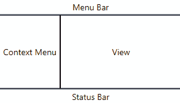
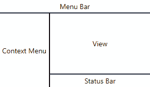
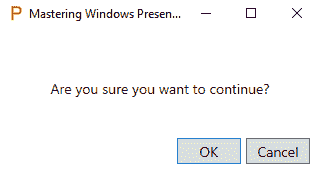
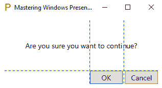
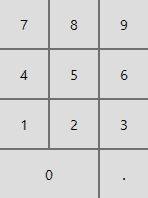
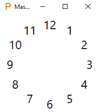
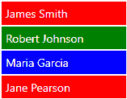
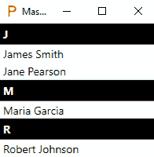
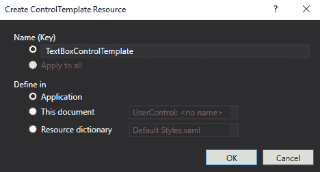

# 第五章：使用合适的控件完成任务

在本章中，我们将首先考虑 Windows Presentation Foundation（**WPF**）为我们提供的现有控件，并查看我们如何使用它们来创建所需布局。我们将调查我们可以修改这些控件的各种方式，以避免创建新控件的需求。

我们将检查现有控件中内置的各种功能级别，然后发现当需要时如何最好地声明我们自己的控件。我们将深入探讨我们拥有的各种选项，并确定何时使用每个选项最为合适。让我们直接跳入并查看各种布局控件。

# 调查内置控件

.NET Framework 中包含了许多控件。它们涵盖了大多数常见场景，在典型的基于表单的应用程序中，我们很少需要创建自己的控件。所有的 UI 控件通常都是从大量常见的基类构建其功能。

所有控件都将共享相同的核心级基类，这些基类提供核心级功能，然后是一系列派生框架级类，这些类提供与 WPF 框架关联的功能，例如数据绑定、样式化和模板化。让我们来看一个例子。

# 继承框架能力

就像我们应用程序框架中的基类一样，内置的 WPF 控件也有一个继承层次结构，每个后续的基类都提供一些额外的功能。让我们以`Button`类为例。以下是`Button`控件的继承层次结构：

```cs
System.Object 
  System.Windows.Threading.DispatcherObject 
    System.Windows.DependencyObject 
      System.Windows.Media.Visual 
        System.Windows.UIElement 
          System.Windows.FrameworkElement 
            System.Windows.Controls.Control 
              System.Windows.Controls.ContentControl 
                System.Windows.Controls.Primitives.ButtonBase 
                  System.Windows.Controls.Button 
```

就像.NET Framework 中的每个对象一样，我们首先从`Object`类开始，它为所有类提供低级服务。这些包括对象比较、终结和输出每个对象的可自定义`string`表示形式的能力。

接下来是`DispatcherObject`类，它为每个对象提供线程亲和性并将它们与一个`Dispatcher`对象关联起来。`Dispatcher`类管理为单个线程的工作项的优先级队列。只有创建相关`Dispatcher`对象的线程可以直接访问每个`DispatcherObject`，这使派生类能够强制执行线程安全。

在`DispatcherObject`类之后，我们有`DependencyObject`类，它使所有派生类都能够使用 WPF 属性系统并声明依赖属性。我们用来访问和设置它们值的`GetValue`和`SetValue`方法也是由`DependencyObject`类提供的。

接下来是`Visual`类，它的主要作用是提供渲染支持。在 UI 中显示的所有元素都将扩展`Visual`类。除了渲染每个对象外，它还计算它们的边界框并提供对击中测试、裁剪和转换的支持。

扩展`Visual`类的是`UIElement`类，它为所有派生类提供了一系列核心服务。这些服务包括事件和用户输入系统，以及确定元素布局外观和渲染行为的能力。

接下来是`FrameworkElement`类，它提供了第一级框架成员，建立在它所扩展的核心级别类的基础之上。是`FrameworkElement`类通过`DataContext`属性实现了数据绑定，通过`Style`属性实现了样式化。

它还提供了与对象生命周期相关的事件，将核心级别的布局系统升级为完整的布局系统，并改进了对动画的支持，以及其他功能。这通常是如果我们创建自己的基本元素时可能想要扩展的最低级别类，因为它使派生类能够参与 WPF UI 的大部分功能。

`Control`类扩展了`FrameworkElement`类，并且是大多数 WPF UI 元素的基类。它通过使用其`ControlTemplate`功能提供外观模板化，以及一系列与外观相关的属性。这些属性包括颜色属性，如`Background`、`Foreground`和`BorderBrush`，以及对齐和字体属性。

扩展`Control`类的是`ContentControl`类，它使得控件能够拥有任何 CLR 类型的单个对象作为其内容。这意味着我们可以将数据对象或 UI 元素设置为内容，尽管如果数据对象是自定义类型，我们可能需要提供一个`DataTemplate`。

`Button`类所扩展的父类长串中的最后一类是`ButtonBase`类。实际上，这是 WPF 中所有按钮的基类，并为按钮添加了有用的功能。这包括自动将某些键盘事件转换为鼠标事件，使用户能够在不使用鼠标的情况下与按钮交互。

`Button`类本身对其继承成员的添加很少，只有三个相关的`bool`属性；两个指定按钮是否是默认按钮，一个指定按钮是否是取消按钮。我们很快就会看到这个例子。它还有两个受保护的覆盖方法，当按钮被点击或为其创建自动化代理时会被调用。

虽然 WPF 使我们能够修改现有的控件到这种程度，以至于我们很少需要创建自己的控件，但了解这种继承层次结构非常重要，这样我们才能在我们需要时扩展满足我们要求的适当且最轻量级的基类。

例如，如果我们想创建自己的自定义按钮，通常更合理的是扩展`ButtonBase`类，而不是`Button`类；如果我们想创建一个完全独特的控件，我们可以扩展`FrameworkElement`类。现在我们已经很好地理解了可用控件的结构，让我们看看 WPF 布局系统是如何显示它们的。

# 按行排列

在 WPF 中，布局系统负责确定每个要显示的元素的大小，将它们定位在屏幕上，然后绘制它们。由于控件可以包含在其他控件中，布局系统以递归方式工作，每个子控件的总体位置由其父面板控件的位置决定。

布局系统首先在所谓的测量过程中测量每个面板中的每个子元素。在这个过程中，每个面板调用每个子元素的`Measure`方法，并指定它们理想上希望拥有的空间量；这确定了`UIElement.DesiredSize`属性值。请注意，这并不一定是它们将被分配的空间量。

在测量过程之后是排列过程，此时每个面板调用每个子元素的`Arrange`方法。在这个过程中，面板根据它们的`DesiredSize`值生成每个子元素的边界框。布局系统将调整这些大小以添加所需的边距或可能需要的任何其他调整。

它返回一个值到面板的`ArrangeOverride`方法的输入参数，每个面板在返回可能调整后的值之前执行其特定的布局行为。布局系统在将执行权返回给面板并完成布局过程之前执行任何剩余的必要调整。

在开发我们的应用程序时，我们需要小心，以确保我们不会不必要地触发布局系统的额外遍历，因为这可能导致性能下降。这可能在向集合中添加或删除项目、对元素应用转换或调用`UIElement.UpdateLayout`方法时发生，后者强制进行新的布局遍历。

# 包含控件

现有的控件大多可以分为两大类：一类为其他控件提供布局支持，另一类则构成可见的 UI，并通过第一类控件进行排列。第一类控件当然是面板，它们提供了多种方式来在 UI 中排列其子控件。

一些提供了调整大小功能，而另一些则没有，一些比其他更高效，因此使用正确的面板来完成工作非常重要。此外，不同的面板提供不同的布局行为，因此了解可用的面板以及它们在布局方面为我们提供什么是有益的。

所有面板都扩展了抽象的 `Panel` 类，该类扩展了 `FrameworkElement` 类，因此它具有该类的所有成员和功能。然而，它没有扩展 `Control` 类，因此它不能继承其属性。因此，它添加了自己的 `Background` 属性，使用户能够为面板的各种项目之间的间隙着色。

`Panel` 类还提供了一个 `Children` 属性，它表示每个面板中的项目，尽管我们通常不会与这个属性交互，除非创建一个自定义面板。相反，我们可以在 XAML 中直接在面板元素内声明我们的子元素来填充这个集合。

我们能够这样做是因为 `Panel` 类在其类定义中通过 `ContentPropertyAttribute` 属性指定了 `Children` 属性。虽然 `ContentControl` 的 `Content` 属性通常使我们能够添加单个内容项，但我们能够向面板中添加多个项，因为它们的 `Children` 属性，即设置的内容，是一个集合。

另一个我们可能需要使用的 `Panel` 类属性是 `IsItemsHost` 属性，它指定一个面板是否用作 `ItemsControl` 元素或其派生类（如 `ListBox`）的项目的容器。默认值是 `false`，因此显式将此属性设置为 `false` 没有意义。实际上，它只在非常特定的情况下才需要。

那种情况是我们正在替换 `ItemsControl` 的默认面板或其派生类（如 `ListBox`）的 `ControlTemplate`。通过在 `ControlTemplate` 中的面板元素上设置此属性为 `true`，我们告诉 WPF 将生成的集合元素放置在面板中。让我们看看一个快速示例：

```cs
<ItemsControl ItemsSource="{Binding Users}"> 
  <ItemsControl.Template> 
    <ControlTemplate TargetType="{x:Type ItemsControl}"> 
      <StackPanel Orientation="Horizontal" IsItemsHost="True" /> 
    </ControlTemplate> 
  </ItemsControl.Template> 
</ItemsControl> 
```

在这个简单的例子中，我们正在用水平 `StackPanel` 替换 `ItemsControl` 元素的默认内部项目面板。请注意，这是一个永久性的替换，没有提供新的 `ControlTemplate`，没有人可以进一步修改它。然而，有一种远更简单的方法可以达到相同的结果，我们已经在 第四章，*精通数据绑定* 中看到了这个例子：

```cs
<ItemsControl ItemsSource="{Binding Users}"> 
  <ItemsControl.ItemsPanel> 
    <ItemsPanelTemplate> 
      <StackPanel Orientation="Horizontal" /> 
    </ItemsPanelTemplate> 
  </ItemsControl.ItemsPanel> 
</ItemsControl> 
```

在这个替代示例中，我们只是通过 `ItemsPanel` 属性为 `ItemsControl` 提供一个新的 `ItemsPanelTemplate`。使用这段代码，内部面板仍然可以很容易地更改，而无需提供新的 `ControlTemplate`，因此当我们不希望其他用户能够替换内部面板时，我们使用第一种方法，否则我们使用这种方法。

`Panel`类还声明了一个`ZIndex`附加属性，子元素可以使用它来指定面板内的分层顺序。具有较高值的子元素将出现在具有较低值的元素之上或前面，尽管在未重叠其子元素的面板中，此属性将被忽略。我们将在下一节中看到这个例子，所以现在让我们专注于从`Panel`类派生的面板以及它们为我们提供了什么。

# 画布

`Canvas`类使我们能够使用`Canvas.Top`、`Canvas.Left`、`Canvas.Bottom`和`Canvas.Right`附加属性的组合来显式定位子元素。这与旧 Windows Forms 系统中控件放置的系统有些类似。

然而，在使用 WPF 时，我们通常不会在`Canvas`中布局 UI 控件。相反，我们更倾向于使用它们来显示形状、构建图表、显示动画或绘制应用程序。以下是一个例子：

```cs
<Canvas Width="256" Height="109" Background="Black"> 
  <Canvas.Resources> 
    <Style TargetType="{x:Type Ellipse}"> 
      <Setter Property="Width" Value="50" /> 
      <Setter Property="Height" Value="50" /> 
      <Setter Property="Stroke" Value="Black" /> 
      <Setter Property="StrokeThickness" Value="3" /> 
    </Style> 
  </Canvas.Resources> 
  <Canvas Canvas.Left="3" Canvas.Top="3" Background="Orange" 
    Width="123.5" Height="50"> 
    <Ellipse Canvas.Top="25" Canvas.Left="25" Fill="Cyan" /> 
  </Canvas> 
  <Canvas Canvas.Left="129.5" Canvas.Top="3" Background="Orange"  
    Width="123.5" Height="50" Panel.ZIndex="1" /> 
  <Canvas Canvas.Left="3" Canvas.Top="56" Background="Red" Width="250"  
    Height="50" ClipToBounds="True"> 
    <Ellipse Canvas.Top="-25" Canvas.Left="175" Fill="Lime" /> 
  </Canvas> 
  <Ellipse Canvas.Top="29.5" Canvas.Left="103" Fill="Yellow" /> 
</Canvas> 
```

这个例子演示了几个重要的点，所以在我们讨论它之前，让我们先看看这段代码的视觉输出：


左上角的矩形是一个画布的输出，右上角和下方的矩形来自另外两个画布实例。它们都包含在一个具有黑色背景的父画布元素中。三个内部画布被间隔开来，以产生每个画布都有边框的效果。它们按照从左上角、右上角、底部，到最后一个要声明的中间圆圈的顺序声明。

左侧的圆正在左上角的画布中绘制，我们可以看到它与画布的明显底部边界的重叠部分，这表明它没有被其父画布裁剪。然而，它被下方的画布元素裁剪，这证明了后来声明的 UI 元素将显示在较早声明的元素之上。

尽管如此，第二个声明的画布正在裁剪最后一个声明的元素，即中间的圆圈。这证明了将元素的`Panel.ZIndex`属性设置为任何正数将使该元素位于所有未明确设置此属性的其他元素之上。此属性的默认值为零，因此将此属性设置为`1`的元素将渲染在所有未明确为其设置值的元素之上。

下一个要声明的元素是底部的矩形，右边的圆被声明在其中。现在，由于这个元素是在顶部画布之后声明的，你可能预计右边的圆会与右上角的画布重叠。虽然这通常是情况，但我们的例子中不会发生这种情况，原因有两个。

第一个原因，正如我们刚刚发现的，是因为右上角面板的 `ZIndex` 属性值高于下面板，第二个原因是我们将 `UIElement.ClipToBounds` 属性设置为 `true`，这是 `Canvas` 面板用来确定是否应该裁剪可能位于面板边界之外的任何子元素的视觉内容。

这通常与动画一起使用，以便在某个事件发生时将视觉元素隐藏在面板边界之外，然后将其滑动到视图中。我们可以通过看到其明显的顶部边框，该边框在其边界之外，来判断右侧的圆圈已被其父面板裁剪。

最后声明的元素是中间的圆圈，我们可以看到，除了与具有更高 `ZIndex` 属性值的重叠画布元素外，它还与其他所有元素重叠。请注意，`Canvas` 面板不会对其子元素执行任何类型的调整大小操作，因此它通常不用于生成表单类型的 UI。

# DockPanel

`DockPanel` 类主要用于控制层次结构的顶层，用于布局顶层控件。它为我们提供了将控件停靠到屏幕各个部分的能力，例如，停靠在顶部的菜单、左侧的上下文菜单、底部的状态栏以及屏幕剩余部分的主 View 内容控件：



在前一个图中展示的布局可以通过以下 XAML 轻松实现：

```cs
<DockPanel> 
  <DockPanel.Resources> 
    <Style TargetType="{x:Type TextBlock}"> 
      <Setter Property="HorizontalAlignment" Value="Center" /> 
      <Setter Property="VerticalAlignment" Value="Center" /> 
      <Setter Property="FontSize" Value="14" /> 
    </Style> 
    <Style TargetType="{x:Type Border}"> 
      <Setter Property="BorderBrush" Value="Black" /> 
      <Setter Property="BorderThickness" Value="1" /> 
    </Style> 
  </DockPanel.Resources> 
  <Border Padding="0,3" DockPanel.Dock="Top"> 
    <TextBlock Text="Menu Bar" /> 
  </Border> 
  <Border Padding="0,3" DockPanel.Dock="Bottom"> 
    <TextBlock Text="Status Bar" /> 
  </Border> 
  <Border Width="100" DockPanel.Dock="Left"> 
    <TextBlock Text="Context Menu" TextWrapping="Wrap" /> 
  </Border> 
  <Border> 
    <TextBlock Text="View" /> 
  </Border> 
</DockPanel> 
```

我们使用 `DockPanel.Dock` 附加属性指定面板内每个元素想要停靠的位置。我们可以指定面板的左、右、上和下边。剩余的空间通常由未显式设置 `Dock` 属性的最后一个子元素填充。然而，如果我们不希望这种行为，则可以将 `LastChildFill` 属性设置为 `false`。

`DockPanel` 将会自动调整自身大小以适应其内容，除非其尺寸被指定，无论是通过显式使用 `Width` 和 `Height` 属性，还是通过父面板的隐式指定。如果它及其子元素都指定了尺寸，那么有可能某些子元素将不会获得足够的空间，并且无法正确显示，因为最后一个子元素是唯一可以被 `DockPanel` 调整大小的。还应注意的是，此面板不会与其子元素重叠。

还请注意，子元素的声明顺序将影响它们各自获得的空间和位置。例如，如果我们想让菜单栏填充屏幕顶部，上下文菜单占据剩余的左侧，而 View 和状态栏占据剩余的空间，我们只需在状态栏之前声明上下文菜单：

```cs
  ...
  <Border Padding="0,3" DockPanel.Dock="Top"> 
    <TextBlock Text="Menu Bar" /> 
  </Border> 
  <Border Width="100" DockPanel.Dock="Left"> 
    <TextBlock Text="Context Menu" TextWrapping="Wrap" /> 
  </Border> 
  <Border Padding="0,3" DockPanel.Dock="Bottom"> 
    <TextBlock Text="Status Bar" /> 
  </Border> 
  <Border> 
    <TextBlock Text="View" /> 
  </Border> 
  ...
```

这种轻微的改变将导致以下布局：



# Grid

当涉及到布局典型的 UI 控件时，`网格`面板是最常用的。它是功能最全面的，使我们能够执行一些技巧，以获得所需的布局。它提供了一个灵活的基于行和列的布局系统，我们可以用它来构建具有流动布局的 UI。流动布局能够响应用户调整应用程序窗口大小并改变大小。

`网格`是少数几个可以根据可用空间调整所有子元素大小的面板之一，这使得它成为性能最密集的面板之一。因此，如果我们不需要它提供的功能，我们应该使用性能更好的面板，例如`画布`或`堆叠面板`。

`网格`面板的子元素可以分别设置它们的`边距`属性，使用绝对坐标进行布局，这与`画布`面板类似。然而，应尽可能避免这样做，因为这会破坏我们 UI 的流畅性。相反，我们通常使用网格的`行定义`和`列定义`集合以及`Grid.Row`和`Grid.Column`附加属性来定义我们想要的布局。

虽然我们可以再次为我们的行和列硬编码确切的宽度和高度，但我们通常尽量避免这样做，原因相同。相反，我们通常利用网格的尺寸行为，并声明我们的行和列，主要使用两个值之一。

第一个是`自动`值，它从其内容获取大小；第二个是默认的`*`星号大小值，它获取所有剩余的空间。通常，我们将所有列或行设置为`自动`，除了包含最重要数据的列或行，这些列或行被设置为`*`。

注意，如果我们有多个星号大小的列，那么空间通常在它们之间平均分配。然而，如果我们需要剩余空间的非均等分配，我们可以使用星号指定一个乘数数字，这将乘以该行或列将获得的空间比例。让我们通过一个例子来澄清这一点：

```cs
<Grid TextElement.FontSize="14" Width="300" Margin="10"> 
  <Grid.ColumnDefinitions> 
    <ColumnDefinition Width="2.5*" /> 
    <ColumnDefinition /> 
    <ColumnDefinition /> 
  </Grid.ColumnDefinitions> 
  <Grid.RowDefinitions> 
    <RowDefinition /> 
    <RowDefinition Height="Auto" /> 
  </Grid.RowDefinitions> 
  <TextBlock Grid.ColumnSpan="3" HorizontalAlignment="Center" 
    VerticalAlignment="Center" Text="Are you sure you want to continue?" 
    Margin="40" /> 
  <Button Grid.Row="1" Grid.Column="1" Content="OK" IsDefault="True"
 Height="26" Margin="0,0,2.5,0" />
 <Button Grid.Row="1" Grid.Column="2" Content="Cancel" IsCancel="True"
 Height="26" Margin="2.5,0,0,0" />
</Grid> 
```

这个例子演示了几个要点，所以在我们继续之前，让我们看看渲染的输出：



在这里，我们有一个非常基本的确认对话框控件。它由一个有三个列和两个行的`网格`面板组成。请注意，单个星号大小被用作`列定义`和`行定义`元素的默认宽度和高度值；我们不需要明确设置它们，只需声明空元素即可。同时请注意，星号大小仅在`网格`面板设置了某些大小的情况下才会工作，就像我们在这里所做的那样。

因此，在我们的例子中，第二列和第三列以及第一行将使用星号大小调整，并占用所有剩余的空间。第一列也使用星号大小调整，但是它指定了一个乘数值为`2.5`。因此，它将获得其他两列各自空间的两倍半。

注意，这个第一列仅用于将其他两列中的按钮推到正确的位置。虽然`TextBlock`元素在第一列中声明，但它不仅位于该列，因为它还指定了`Grid.ColumnSpan`附加属性，这允许它扩展到多个列。`Grid.RowSpan`附加属性对行做同样的处理。

`Grid.Row`和`Grid.Column`附加属性由每个元素用来指定它们应该渲染在哪个单元格中。然而，这些属性的默认值是零，所以当我们想在面板的第一列或第一行中声明一个元素时，我们可以省略这些属性的设置，就像我们例子中的`TextBlock`所做的那样。

“确定”按钮被声明在第二行和第二列，并将`IsDefault`键设置为`true`，这使用户可以通过按键盘上的*Enter*键来调用它。它还负责按钮上的蓝色边框，我们可以使用这个属性在我们自己的模板中为默认按钮设置不同的样式。“取消”按钮位于其旁边，在第三列，并将`IsCancel`属性设置为`true`，这使用户可以通过按键盘上的*Esc*键来选择它。

注意，我们本可以将`RowDefinition.Height`的较低属性设置为`26`，而不是在每个按钮上显式设置，最终结果将是相同的，因为`Auto`值无论如何都会从它们的高度计算得出。另外，请注意，这里的`Margin`属性已经设置在一些元素上，仅用于间距目的，而不是用于绝对定位目的。

`Grid`类还声明了两个其他有用的属性。第一个是`ShowGridLines`属性，正如你可以想象的那样，当设置为`true`时，它会在面板中显示行和列的边框。虽然对于像上一个例子中的简单布局来说这不是必需的，但在开发更复杂的布局时这可能很有用。然而，由于其性能较差，这个功能永远不应该在生产 XAML 中使用：

```cs
<Grid TextElement.FontSize="14" Width="300" Margin="10" 
  ShowGridLines="True"> 
  ... 
</Grid> 
```

现在我们来看看有了可见的网格线后是什么样子：



另一个有用的属性是`IsSharedSizeScope`附加属性，它使我们能够在两个或多个`Grid`面板之间共享大小信息。我们可以通过在父面板上设置此属性为`true`，然后在内部`Grid`面板的相关`ColumnDefinition`和/或`RowDefinition`元素上指定`SharedSizeGroup`属性来实现这一点。

为了使这个功能正常工作，我们需要遵守几个条件，第一个与作用域相关。`IsSharedSizeScope`属性需要在父元素上设置，但如果该父元素在资源模板内，而指定`SharedSizeGroup`属性的元素定义在模板外，则它将不起作用。然而，在相反方向上它是有效的。

另一点需要注意是，在共享大小信息时，星号大小不被尊重。在这些情况下，任何定义元素的星号值将被读取为`Auto`，所以我们通常不会在我们的星号大小列上设置`SharedSizeGroup`属性。然而，如果我们将其设置在其他列上，那么我们将得到我们想要的布局。让我们看看这个例子：

```cs
<Grid TextElement.FontSize="14" Margin="10" IsSharedSizeScope="True"> 
  <Grid.RowDefinitions> 
    <RowDefinition Height="Auto" /> 
    <RowDefinition Height="Auto" /> 
    <RowDefinition /> 
  </Grid.RowDefinitions> 
  <Grid TextElement.FontWeight="SemiBold" Margin="0,0,0,3" 
    ShowGridLines="True"> 
    <Grid.ColumnDefinitions> 
      <ColumnDefinition Width="Auto" SharedSizeGroup="Name" /> 
      <ColumnDefinition /> 
      <ColumnDefinition Width="Auto" SharedSizeGroup="Age" /> 
    </Grid.ColumnDefinitions> 
    <TextBlock Text="Name" /> 
    <TextBlock Grid.Column="1" Text="Comments" Margin="10,0" /> 
    <TextBlock Grid.Column="2" Text="Age" /> 
  </Grid> 
  <Separator Grid.Row="1" /> 
  <ItemsControl Grid.Row="2" ItemsSource="{Binding Users}"> 
    <ItemsControl.ItemTemplate> 
      <DataTemplate DataType="{x:Type DataModels:User}"> 
        <Grid ShowGridLines="True"> 
          <Grid.ColumnDefinitions> 
            <ColumnDefinition Width="Auto" SharedSizeGroup="Name" /> 
            <ColumnDefinition /> 
            <ColumnDefinition Width="Auto" SharedSizeGroup="Age" /> 
          </Grid.ColumnDefinitions> 
          <TextBlock Text="{Binding Name}" /> 
          <TextBlock Grid.Column="1" Text="Star-sized column takes all
            remaining space" Margin="10,0" />          
          <TextBlock Grid.Column="2" Text="{Binding Age}" /> 
        </Grid> 
      </DataTemplate> 
    </ItemsControl.ItemTemplate> 
  </ItemsControl> 
</Grid> 
```

在这个例子中，我们有一个`ItemsControl`，它绑定到我们之前例子中`Users`集合的一个稍微编辑过的版本。之前，所有用户名长度相似，所以其中一个已经被编辑，以更清楚地说明这一点。出于同样的原因，`ShowGridLines`属性也已在内部面板上设置为`true`。

在这个例子中，我们首先在父`Grid`面板上设置`IsSharedSizeScope`附加属性为`true`，然后应用内部`Grid`控件的定义的`SharedSizeGroup`属性，这些控件在外部面板内声明，并在`DataTemplate`元素内。在继续之前，让我们看看这段代码的渲染输出：


注意，我们在`DataTemplate`元素内部和外部都提供了相同数量的列和组名，这对于此功能正常工作至关重要。另外，请注意，我们没有在中间列上设置`SharedSizeGroup`属性，该属性是星号大小的。

仅对其他两个列进行分组将产生与对三个列进行分组相同的视觉效果，但不会失去中间列的星号大小。然而，让我们看看如果我们也在中间列的定义上设置`SharedSizeGroup`属性会发生什么：

```cs
<ColumnDefinition SharedSizeGroup="Comments" /> 
```

如预期，我们的中间列已经失去了星号大小，现在剩余的空间已经应用到最后一列：


模板内的`Grid`面板将为集合中的每个项目进行渲染，因此这实际上将导致几个面板，每个面板都有相同的组名，因此也有相同的列间距。我们非常重要的一点是，我们需要在所有内部面板的共同父元素`Grid`面板上设置`IsSharedSizeScope`属性为`true`，这些内部面板之间需要共享大小信息。

# StackPanel

`StackPanel` 是 WPF 控件中仅对其子项提供有限调整大小能力的面板之一。只要它们没有指定明确的大小，它将自动将每个子项的 `HorizontalAlignment` 和 `VerticalAlignment` 属性设置为 `Stretch`。在这种情况下，子元素将被拉伸以适应包含面板的大小。这可以通过以下方式轻松演示：

```cs
<Border Background="Black" Padding="5"> 
  <Border.Resources> 
    <Style TargetType="{x:Type TextBlock}"> 
      <Setter Property="Padding" Value="5" /> 
      <Setter Property="Background" Value="Yellow" /> 
      <Setter Property="TextAlignment" Value="Center" /> 
    </Style> 
  </Border.Resources> 
  <StackPanel TextElement.FontSize="14"> 
    <TextBlock Text="Stretched Horizontally" /> 
    <TextBlock Text="With Margin" Margin="20" /> 
    <TextBlock Text="Centered Horizontally" 
      HorizontalAlignment="Center" /> 
    <Border BorderBrush="Cyan" BorderThickness="1" Margin="0,5,0,0"
      Padding="5" SnapsToDevicePixels="True"> 
      <StackPanel Orientation="Horizontal"> 
        <TextBlock Text="Stretched Vertically" /> 
        <TextBlock Text="With Margin" Margin="20" /> 
        <TextBlock Text="Centered Vertically" 
          VerticalAlignment="Center" /> 
      </StackPanel> 
    </Border> 
  </StackPanel> 
</Border> 
```

此面板实际上将每个子元素依次排列，默认为垂直，当其 `Orientation` 属性设置为 `Horizontal` 时则为水平。我们的示例使用了这两种方向，因此在我们继续之前，让我们快速看一下其输出：


我们整个示例被一个具有黑色背景的 `Border` 元素包裹。在其 `Resources` 部分中，我们为示例中的 `TextBlock` 元素声明了一些样式属性。在边框内部，我们声明了我们的第一个 `StackPanel` 控件，其默认垂直方向。在这个第一个面板中，我们有三个 `TextBlock` 元素和另一个包裹在边框中的 `StackPanel`。

第一个 `TextBlock` 元素会自动拉伸以适应面板的宽度。第二个添加了边距，但否则也会拉伸以适应面板的宽度。然而，第三个的 `HorizontalAlignment` 属性被显式设置为 `Center`，因此它不会被面板拉伸以适应。

内部面板在其内部声明了三个 `TextBlock` 元素，并将其 `Orientation` 属性设置为 `Horizontal`。因此，其子项是水平排列的。它的边框被着色，这样更容易看到其边界。注意它上面设置的 `SnapsToDevicePixels` 属性。

由于 WPF 使用设备无关的像素设置，细直线有时会跨越单个像素边界并呈现抗锯齿效果。将此属性设置为 `true` 将强制元素使用设备特定的像素设置精确渲染，从而形成更清晰、更锐利的线条。

下面板中的第一个 `TextBlock` 元素会自动拉伸以适应面板的高度。与上面板中的元素一样，第二个添加了边距，但否则也会拉伸以适应面板的高度。然而，第三个的 `VerticalAlignment` 属性被显式设置为 `Center`，因此它不会被面板垂直拉伸以适应。

作为旁注，我们在一些文本字符串中使用了十六进制实体来添加换行。这也可以通过使用 `TextBlock.TextWrapping` 属性并为每个元素硬编码一个 `Width` 来实现，但显然这种方法更简单。

# UniformGrid

`UniformGrid` 面板是一个轻量级面板，提供了一种简单的方式来创建一个项目网格，其中每个项目的大小相同。我们可以设置其 `Row` 和 `Column` 属性来指定我们想要网格有多少行和列。如果我们没有设置一个或两个这些属性，面板将隐式地为我们设置它们，这取决于它拥有的可用空间及其子项的大小。

它还提供了一个 `FirstColumn` 属性，这将影响第一个子项将被渲染的列。例如，如果我们设置此属性为 `2`，则第一个子项将在第三列中渲染。这对于日历控件来说非常完美，所以让我们看看我们如何使用 `UniformGrid` 创建以下输出：


正如你所见，日历控件通常需要在前面几列留出空白空间，因此 `FirstColumn` 属性简单地实现了这一需求。让我们看看定义此日历示例的 XAML：

```cs
<StackPanel TextElement.FontSize="14" Background="White"> 
  <UniformGrid Columns="7" Rows="1"> 
    <UniformGrid.Resources> 
      <Style TargetType="{x:Type TextBlock}"> 
        <Setter Property="Height" Value="35" /> 
        <Setter Property="HorizontalAlignment" Value="Center" /> 
        <Setter Property="Padding" Value="0,5,0,0" /> 
      </Style> 
    </UniformGrid.Resources> 
    <TextBlock Text="Mon" /> 
    <TextBlock Text="Tue" /> 
    <TextBlock Text="Wed" /> 
    <TextBlock Text="Thu" /> 
    <TextBlock Text="Fri" /> 
    <TextBlock Text="Sat" /> 
    <TextBlock Text="Sun" /> 
  </UniformGrid> 
  <ItemsControl ItemsSource="{Binding Days}" Background="Black"
    Padding="0,0,1,1"> 
    <ItemsControl.ItemsPanel> 
      <ItemsPanelTemplate> 
        <UniformGrid Columns="7" FirstColumn="2" /> 
      </ItemsPanelTemplate> 
    </ItemsControl.ItemsPanel> 
    <ItemsControl.ItemTemplate> 
      <DataTemplate> 
        <Border BorderBrush="Black" BorderThickness="1,1,0,0" 
          Background="White"> 
          <TextBlock Text="{Binding}" Height="35" 
            HorizontalAlignment="Center" Padding="0,7.5,0,0" /> 
        </Border> 
      </DataTemplate> 
    </ItemsControl.ItemTemplate> 
  </ItemsControl> 
</StackPanel> 
```

我们从一个 `StackPanel` 开始，它用于将一个 `UniformGrid` 面板直接堆叠在一个使用另一个 `UniformGrid` 作为其 `ItemsPanel` 的 `ItemsControl` 之上，并指定在控件内使用的字体大小。顶部的 `UniformGrid` 面板声明了一个包含七个列的单行，以及一些基本的 `TextBlock` 样式。它有七个子 `TextBlock` 项目，输出一周中每一天的名称。

`ItemsControl` 元素的 `Background` 属性被设置为 `Black` 以遮蔽当前月份之外的天，并且 `Padding` 被设置为使背景看起来像日历的右下角边框。顶部和左边的边框来自 `UniformGrid` 面板中的单个单元格。`ItemsControl.ItemsSource` 属性绑定到我们的视图模型中的 `Days` 属性，所以现在让我们看看它：

```cs
private List<int> days = Enumerable.Range(1, 31).ToList(); 

... 

public List<int> Days 
{ 
  get { return days; } 
  set { days = value; NotifyPropertyChanged(); } 
} 
```

注意使用 `Enumerable.Range` 方法来填充集合。它提供了一个简单的方法来生成从提供的起始和长度输入参数开始的连续整数序列。作为一个 LINQ 方法，它是通过延迟执行实现的，实际值只有在实际访问时才会生成。

第二个 `UniformGrid` 面板被设置为 `ItemsControl.ItemsPanel`，它只指定应该有七列，但将行数留待从数据绑定的项目数量计算得出。注意，我们已将 `FirstColumn` 属性的值硬编码为 `2`，虽然在合适的控件中，我们通常会将其相关月份的值数据绑定到它。

最后，我们使用 `DataTemplate` 来定义日历上每一天的外观。请注意，在这个例子中，我们不需要为其 `DataType` 属性指定值，因为我们正在将整个数据源对象进行数据绑定，在这个例子中它只是一个整数。现在让我们继续研究 `WrapPanel` 面板。

# WrapPanel

`WrapPanel`面板类似于`StackPanel`，但默认情况下它会在两个方向上堆叠其子项。它首先水平排列子项，当第一行空间不足时，它会自动将下一个项目换行到新行，并继续排列剩余控件。它使用所需行数重复此过程，直到所有项目都被渲染。

然而，它也提供了一个类似于`StackPanel`的`Orientation`属性，这将影响其布局行为。如果将`Orientation`属性从默认值`Horizontal`更改为`Vertical`，则面板的子项将垂直排列，从上到下直到第一列没有更多空间。项目将换行到下一列，并继续这种方式，直到所有项目都被渲染。

此面板还声明了`ItemHeight`和`ItemWidth`属性，使其能够限制项目的尺寸并产生类似于`UniformGrid`面板的布局行为。请注意，这些值实际上不会调整每个子项的大小，而只是限制它们在面板中提供的可用空间。让我们看看这个示例：

```cs
<WrapPanel ItemHeight="50" Width="150" TextElement.FontSize="14"> 
  <WrapPanel.Resources> 
    <Style TargetType="{x:Type Button}"> 
      <Setter Property="Width" Value="50" /> 
    </Style> 
  </WrapPanel.Resources> 
  <Button Content="7" /> 
  <Button Content="8" /> 
  <Button Content="9" /> 
  <Button Content="4" /> 
  <Button Content="5" /> 
  <Button Content="6" /> 
  <Button Content="1" /> 
  <Button Content="2" /> 
  <Button Content="3" /> 
  <Button Content="0" Width="100" /> 
  <Button Content="." /> 
</WrapPanel> 
```

注意，虽然与`UniformGrid`面板的输出类似，但这个示例实际上不能使用该面板实现，因为其中一个子项的大小与其他不同。让我们看看这个示例的视觉输出：



我们首先声明了`WrapPanel`并指定每个子项应仅提供`50`像素的高度，而面板本身应宽`150`像素。在`Resources`部分，我们设置每个按钮的宽度为`50`像素，因此使得每个行上的三个按钮可以并排放置，在项目换行到下一行之前。

接下来，我们简单地定义了组成面板子项的十一个按钮，指定零按钮的宽度是其他按钮的两倍。请注意，如果我们设置了`ItemWidth`属性为`50`像素，以及`ItemHeight`属性，这将不会起作用。在这种情况下，我们会看到零按钮的一半，另一半被点号按钮覆盖，并且点号按钮当前所在的位置是一个空白空间。

# 提供自定义布局行为

当内置面板的布局行为不符合我们的要求时，我们可以轻松地定义一个新的具有自定义布局行为的面板。我们只需要声明一个扩展`Panel`类的类，并重写其`MeasureOverride`和`ArrangeOverride`方法。

在`MeasureOverride`方法中，我们简单地调用`Children`集合中每个子项的`Measure`方法，传递一个设置为`double.PositiveInfinity`的`Size`元素。这相当于对每个子项说“将你的`DesriredSize`属性设置为如果你有所有可能需要的空间”。

在`ArrangeOverride`方法中，我们使用每个子项新确定的`DesiredSize`属性值来计算其所需的位置，并调用其`Arrange`方法在该位置渲染它。让我们看看一个自定义面板的例子，该面板将其项均匀地放置在圆的周长上：

```cs
using System; 
using System.Windows; 
using System.Windows.Controls; 

namespace CompanyName.ApplicationName.Views.Panels 
{ 
  public class CircumferencePanel : Panel 
  { 
    public Thickness Padding { get; set; } 

    protected override Size MeasureOverride(Size availableSize) 
    { 
      foreach (UIElement element in Children) 
      { 
        element.Measure(
          new Size(double.PositiveInfinity, double.PositiveInfinity)); 
      } 
      return availableSize; 
    } 

    protected override Size ArrangeOverride(Size finalSize) 
    { 
      if (Children.Count == 0) return finalSize; 
      double currentAngle = 90 * (Math.PI / 180); 
      double radiansPerElement = 
        (360 / Children.Count) * (Math.PI / 180.0);
      double radiusX = finalSize.Width / 2.0 - Padding.Left; 
      double radiusY = finalSize.Height / 2.0 - Padding.Top; 
      foreach (UIElement element in Children) 
      { 
        Point childPoint = new Point(Math.Cos(currentAngle) * radiusX,
          -Math.Sin(currentAngle) * radiusY); 
        Point centeredChildPoint = new Point(childPoint.X + 
          finalSize.Width / 2 - element.DesiredSize.Width / 2, childPoint.Y
          + finalSize.Height / 2 - element.DesiredSize.Height / 2);
        Rect boundingBox = 
          new Rect(centeredChildPoint, element.DesiredSize); 
        element.Arrange(boundingBox); 
        currentAngle -= radiansPerElement; 
      } 
      return finalSize; 
    } 
  } 
} 
```

在我们的`CircumferencePanel`类中，我们首先声明我们自己的`Padding`属性，其类型为`Thickness`，这将用于使用户能够延长或缩短圆的半径，从而调整面板内渲染项的位置。`MeasureOverride`方法如前所述很简单。

在`ArrangeOverride`方法中，我们根据子项的数量计算定位子项的相关角度。在计算*X*和*Y*半径时，我们考虑了我们的`Padding`属性值，这样我们的自定义面板的用户将能够更好地控制渲染项的位置。

对于面板的`Children`集合中的每个子项，我们首先计算它应该显示在圆上的点。然后，我们使用元素的`DesiredSize`属性值偏移该值，这样每个项的边界框就位于该点上。

然后，我们使用一个`Rect`元素创建元素的边界框，包含偏移点和元素的`DesiredSize`属性，并将其传递给其`Arrange`方法以渲染它。每个元素渲染后，当前角度会改变以定位下一个项。记住，我们可以通过为`Panels` CLR 命名空间添加一个 XAML 命名空间并设置`ItemsControl`或其派生类的`ItemsPanel`属性来利用这个面板：

```cs

...

<ItemsControl ItemsSource="{Binding Hours}" TextElement.FontSize="24"
  Width="200" Height="200">
  <ItemsControl.ItemsPanel>
    <ItemsPanelTemplate>
      <Panels:CircumferencePanel Padding="20" />
    </ItemsPanelTemplate>
  </ItemsControl.ItemsPanel>
</ItemsControl>
```

给定一些合适的数据，我们可以使用这个面板在时钟控件上显示数字，例如。让我们看看我们的示例`ItemsControl`的`ItemsSource`属性绑定到的`Hours`属性：

```cs
private List<int> hours = new List<int>() { 12 }; 

public List<int> Hours 
{ 
  get { return hours; } 
  set { hours = value; NotifyPropertyChanged(); } 
}

...

hours.AddRange(Enumerable.Range(1, 11)); 
```

由于小时数字必须从 12 开始然后回到 1，我们最初声明包含 12 个元素的集合。在某个后续阶段，可能在构造期间，我们然后向集合中添加剩余的数字，这就是使用我们新面板时的样子：



这就结束了我们对 WPF 中可用的主要面板的介绍。虽然我们没有足够的空间深入探讨每个其他 WPF 控件，但在这本书中，我们将找到许多控件的小技巧和技巧。相反，现在让我们集中精力在几个基本控件上，以及它们能为我们做什么。

# 内容控件

虽然这个控件不常直接使用，但其一个用途是根据特定模板渲染单个数据项。实际上，我们经常使用`ContentControl`来显示我们的视图模型，并使用一个渲染相关视图的`DataTemplate`对象。或者，我们可能使用某种形式的`ItemsControl`来显示一组项目，并使用`ContentControl`来显示所选项目。

正如我们之前在查看`Button`控件继承层次结构时发现的，`ContentControl`类扩展了`Control`类，并增加了派生类包含任何单个 CLR 对象的能力。请注意，如果我们需要指定多个内容对象，我们可以使用包含更多对象的单个面板对象：

```cs
<Button Width="80" Height="30" TextElement.FontSize="14"> 
  <StackPanel Orientation="Horizontal"> 
    <Rectangle Fill="Cyan" Stroke="Black" StrokeThickness="1" Width="16" 
      Height="16" /> 
    <TextBlock Text="Cyan" Margin="5,0,0,0" /> 
  </StackPanel> 
</Button>
```


我们可以通过使用`Content`属性来指定此内容。然而，`ContentControl`类在其类定义中通过`ContentPropertyAttribute`属性指定了`Content`属性，这使得我们能够通过在 XAML 中直接声明控件内的子元素来设置内容。此属性由 XAML 处理器在处理 XAML 子元素时使用。

如果内容是`string`类型，则我们可以使用`ContentStringFormat`属性来指定其特定格式。否则，我们可以使用`ContentTemplate`属性来指定在渲染内容时使用的`DataTemplate`。或者，`ContentTemplateSelector`属性是`DataTemplateSelector`类型，也使我们能够根据某些自定义条件选择`DataTemplate`。所有派生类都可以访问这些属性以塑造其内容的输出。

然而，这个控件也能够显示许多原始类型，而无需我们指定自定义模板。现在让我们继续到下一节，我们将了解它如何实现这一点。

# 展示内容

在 WPF 中，有一个特殊元素是基本但往往理解不深的。`ContentPresenter`类基本上展示内容，正如其名称所暗示的。它实际上在`ContentControl`对象内部使用来展示其内容。

这就是它的唯一任务，它不应该用于其他目的。我们唯一应该声明这些元素的时间是在`ContentControl`元素或其许多派生类的`ControlTemplate`中。在这些情况下，我们在实际内容出现的位置声明它们。

注意，当使用`ContentPresenter`时，在`ControlTemplate`上指定`TargetType`属性将导致其`Content`属性隐式地数据绑定到相关`ContentControl`元素的`Content`属性。然而，我们可以自由地将其显式地数据绑定到我们想要的任何内容：

```cs
<ControlTemplate x:Key="ButtonTemplate" TargetType="{x:Type Button}"> 
  <ContentPresenter Content="{TemplateBinding ToolTip}" /> 
</ControlTemplate> 
```

`ContentTemplate`和`ContentTemplateSelector`属性都与`ContentControl`类相同，并且也允许我们根据自定义条件选择`DataTemplate`。像`Content`属性一样，如果`ControlTemplate`的`TargetType`属性已设置，这两个属性也将隐式地绑定到模板父级中同名属性。

这通常可以让我们避免显式地将这些属性数据绑定，尽管有一些控件的相关属性名称并不匹配。在这些情况下，我们可以使用`ContentSource`属性作为快捷方式来数据绑定`Content`、`ContentTemplate`和`ContentTemplateSelector`属性。

如果我们将此属性设置为`Header`，例如，框架将在`ContentControl`对象上查找名为`Header`的属性，以隐式地将它绑定到表示器的`Content`属性。同样，它将查找名为`HeaderTemplate`和`HeaderTemplateSelector`的属性，以隐式地将它们绑定到`ContentTemplate`和`ContentTemplateSelector`属性。

这主要用于`HeaderedContentControl`元素或其派生类的`ControlTemplate`：

```cs
<ControlTemplate x:Key="TabItemTemplate" TargetType="{x:Type TabItem}"> 
  <StackPanel> 
    <ContentPresenter ContentSource="Header" /> 
    <ContentPresenter ContentSource="Content" /> 
  </StackPanel> 
</ControlTemplate> 
```

有一些特定的规则决定了`ContentPresenter`将显示什么。如果设置了`ContentTemplate`或`ContentTemplateSelector`属性，那么由`Content`属性指定的数据对象将应用结果数据模板。同样，如果在`ContentPresenter`元素的范围内找到了相关类型的数据模板，它将被应用。

如果内容对象是一个 UI 元素，或者从类型转换器返回了一个，那么该元素将直接显示。如果对象是一个`string`，或者从类型转换器返回了一个`string`，那么它将被设置为`TextBlock`控件的`Text`属性，并显示出来。同样，所有其他对象都将调用其`ToString`方法，然后在运行时以标准`TextBlock`渲染此输出。

# 项目控制

我们已经看到了许多`ItemsControl`类的示例，但现在我们将更仔细地研究这个控件。简单来说，`ItemsControl`类包含可变数量的`ContentPresenter`元素，并使我们能够显示一系列项目。它是大多数常见集合控件（如`ListBox`、`ComboBox`和`TreeView`控件）的基类。

每个派生类都添加了特定的外观和功能集，例如边框和选中项的概念。如果我们不需要这些额外功能，只想显示多个项目，那么我们应该只使用`ItemsControl`，因为它比其派生类更高效。

当使用**模型-视图-视图模型**（**MVVM**）模式时，我们通常将实现`IEnumerable`接口的集合从我们的视图模型数据绑定到`ItemsControl.ItemsSource`属性。然而，还有一个`Items`属性将反映数据绑定集合中的项目。

为了进一步阐明这一点，可以使用任一属性来填充要显示的项目集合。但是，一次只能使用一个，所以如果你已经将集合绑定到`ItemsSource`属性，那么你不能使用`Items`属性添加项目。在这种情况下，`Items`集合将变为只读。

如果我们需要显示一个不实现`IEnumerable`接口的项目集合，那么我们需要使用`Items`属性添加它们。请注意，当在 XAML 中将项目声明为`ItemsControl`元素的内容时，会隐式使用`Items`属性。然而，当使用 MVVM 时，我们通常使用`ItemsSource`属性。

在显示`ItemsControl`中的项目时，集合中的每个项目都将隐式地被包裹在一个`ContentPresenter`容器元素中。容器元素的类型将取决于所使用的集合控件类型。例如，`ComboBox`会将其项目包裹在`ComboBoxItem`元素中。

`ItemContainerStyle`和`ItemContainerStyleSelector`属性使我们能够为这些容器项目提供样式。我们必须确保我们提供的样式针对正确的容器控件类型。例如，如果我们使用`ListBox`，那么我们需要提供一个针对`ListBoxItem`类型的样式，如下面的示例所示。

注意，我们可以显式声明这些容器项目，尽管这样做几乎没有意义，因为否则它们会被自动完成。此外，当使用 MVVM 时，我们通常不与 UI 元素一起工作，而是更喜欢在视图模型中处理数据对象并将数据绑定到`ItemsSource`属性。

正如我们已经看到的，`ItemsControl`类有一个`ItemsPanel`属性，其类型为`ItemsPanelTemplate`，这使我们能够更改集合控件用于布局其项目的面板类型。当我们想要自定义`ItemsControl`的模板时，我们有两个选择来渲染控件子项的方式：

```cs
<ControlTemplate x:Key="Template1" TargetType="{x:Type ItemsControl}"> 
  <StackPanel Orientation="Horizontal" IsItemsHost="True" /> 
</ControlTemplate> 
```

我们在上一节中已经看到了前面方法的示例。这样，我们指定实际的项面板本身，并将`IsItemsHost`属性设置为`true`以指示它确实是要用作控件的项目面板。使用替代方法，我们需要声明一个`ItemsPresenter`元素，该元素指定实际项面板将被渲染的位置。请注意，此元素将在运行时被实际使用的项面板替换：

```cs
<ControlTemplate x:Key="Template2" TargetType="{x:Type ItemsControl}"> 
  <ItemsPresenter /> 
</ControlTemplate> 
```

与`ContentControl`类一样，`ItemsControl`类也提供了使我们能够塑造其数据项的属性。`ItemTemplate`和`ItemTemplateSelector`属性使我们能够为每个项目应用数据模板。然而，如果我们只需要简单的文本输出，还有其他方法可以避免完全定义数据模板的需求。

我们可以使用`DisplayMemberPath`属性来指定从对象中显示的属性名称。或者，我们可以设置`ItemStringFormat`属性以将输出格式化为`string`，或者如我们之前所见，只需从数据对象的类的`ToString`方法提供一些有意义的输出。

另一个有趣的属性是`AlternationCount`属性，它使我们能够以不同的方式样式化交替的容器。我们可以将其设置为任何数字，并且在渲染了这么多项目之后，交替序列将重复。作为一个简单的例子，让我们使用`ListBox`，因为将围绕我们的项目包装的`ListBoxItem`控件具有我们可以交替的外观属性：

```cs
<ListBox ItemsSource="{Binding Users}" AlternationCount="3"> 
  <ListBox.ItemContainerStyle> 
    <Style TargetType="{x:Type ListBoxItem}"> 
      <Setter Property="FontSize" Value="14" /> 
      <Setter Property="Foreground" Value="White" /> 
      <Setter Property="Padding" Value="5" /> 
      <Style.Triggers> 
        <Trigger Property="ListBox.AlternationIndex" Value="0"> 
          <Setter Property="Background" Value="Red" /> 
        </Trigger> 
        <Trigger Property="ListBox.AlternationIndex" Value="1"> 
          <Setter Property="Background" Value="Green" /> 
        </Trigger> 
        <Trigger Property="ListBox.AlternationIndex" Value="2"> 
          <Setter Property="Background" Value="Blue" /> 
        </Trigger> 
      </Style.Triggers> 
    </Style> 
  </ListBox.ItemContainerStyle> 
</ListBox> 
```

在这里，我们将`AlternationCount`属性设置为`3`，因此我们可以为我们的项目提供三种不同的样式，并且这种模式将重复应用于所有三个后续项目。我们使用`ItemContainerStyle`属性为项目容器创建一个样式。

在这种风格中，我们使用一些简单的触发器来根据`AlternationIndex`属性的值改变容器背景的颜色。请注意，`AlternationCount`属性从`0`开始，因此第一个项目将具有红色背景，第二个将具有绿色，第三个将具有蓝色，然后模式将重复，第四个将再次是红色，以此类推。

或者，我们可以为每个想要更改的属性声明一个`AlternationConverter`实例，并将它们绑定到`AlternationIndex`属性和转换器。我们可以使用以下 XAML 创建相同的视觉输出：

```cs
<ListBox ItemsSource="{Binding Users}" AlternationCount="3"> 
  <ListBox.Resources> 
    <AlternationConverter x:Key="BackgroundConverter"> 
      <SolidColorBrush>Red</SolidColorBrush> 
      <SolidColorBrush>Green</SolidColorBrush> 
      <SolidColorBrush>Blue</SolidColorBrush> 
    </AlternationConverter> 
  </ListBox.Resources> 
  <ListBox.ItemContainerStyle> 
    <Style TargetType="{x:Type ListBoxItem}"> 
      <Setter Property="FontSize" Value="14" /> 
      <Setter Property="Foreground" Value="White" /> 
      <Setter Property="Padding" Value="5" /> 
      <Setter Property="Background" 
        Value="{Binding (ItemsControl.AlternationIndex), 
        RelativeSource={RelativeSource Self}, 
        Converter={StaticResource BackgroundConverter}}" /> 
    </Style> 
  </ListBox.ItemContainerStyle> 
</ListBox> 
```

`AlternationConverter`类通过简单地返回与其指定的`AlternationIndex`值相关的集合中的项目来工作，其中索引为零时返回第一个项目。请注意，我们需要在数据绑定的类和属性名称周围包含括号，因为它是一个附加属性，并且我们需要使用`RelativeSource.Self`绑定，因为该属性是在项目容器对象本身上设置的。让我们看看这两个代码示例的输出：



`ItemsControl`类还提供了一个有用的属性，即`GroupStyle`属性，它用于在组中显示子项。要在 UI 中分组项目，我们需要完成几个简单的任务。首先，我们需要为我们的`Converters`项目和`ComponentModel` CLR 命名空间定义 XAML 命名空间：

接下来，我们需要将一个 `CollectionViewSource` 实例与一个或多个 `PropertyGroupDescription` 元素数据绑定到之前示例中的 `Users` 集合。然后，我们需要将其设置为 `ItemsControl` 的 `ItemsSource` 值，并设置其 `GroupStyle`。让我们看看在本地 `Resources` 部分需要声明的 `StringToFirstLetterConverter` 转换器和 `CollectionViewSource` 对象：

```cs
<Converters:StringToFirstLetterConverter x:Key="StringToFirstLetterConverter" />
<CollectionViewSource x:Key="GroupedUsers" Source="{Binding MoreUsers}">
  <CollectionViewSource.GroupDescriptions>
    <PropertyGroupDescription PropertyName="Name" 
      Converter="{StaticResource StringToFirstLetterConverter}" />
  </CollectionViewSource.GroupDescriptions>
  <CollectionViewSource.SortDescriptions>
    <ComponentModel:SortDescription PropertyName="Name" />
  </CollectionViewSource.SortDescriptions>
</CollectionViewSource>
```

我们使用 `PropertyGroupDescription` 元素的 `PropertyName` 属性指定我们想要用来按项目分组的属性。注意，在我们的情况下，我们只有几个 `User` 对象，如果我们仅仅按名称分组，将不会有任何组。因此，我们添加了一个转换器，从每个名称中返回第一个字母以进行分组，并使用 `Converter` 属性指定它。

然后，我们在 `CollectionViewSource.SortDescriptions` 集合中添加了一个基本的 `SortDescription` 元素，以便对 `User` 对象进行排序。我们在 `SortDescription` 元素的 `PropertyName` 属性中指定了 `Name` 属性，这样 `User` 对象就会按名称排序。现在让我们看看 `StringToFirstLetterConverter` 类：

```cs
using System; 
using System.Globalization; 
using System.Windows; 
using System.Windows.Data; 

namespace CompanyName.ApplicationName.Converters 
{ 
  [ValueConversion(typeof(string), typeof(string))] 
  public class StringToFirstLetterConverter : IValueConverter 
  { 
    public object Convert(object value, Type targetType, object parameter,
      CultureInfo culture) 
    { 
      if (value == null) return DependencyProperty.UnsetValue;
      string stringValue = value.ToString();
      if (stringValue.Length < 1) return DependencyProperty.UnsetValue;
      return stringValue[0]; 
    } 

    public object ConvertBack(object value, Type targetType, 
      object parameter, CultureInfo culture) 
    { 
      return DependencyProperty.UnsetValue; 
    } 
  } 
} 
```

在这个转换器中，我们在 `ValueConversion` 属性中指定了涉及转换器实现的数据类型，即使它们是相同类型。在 `Convert` 方法中，我们检查 `value` 输入参数的有效性，如果它是 `null`，则返回 `DependencyProperty.UnsetValue` 值。然后我们调用它的 `ToString` 方法，如果它是一个空字符串，我们返回 `DependencyProperty.UnsetValue` 值。对于所有有效的 `string` 值，我们简单地返回第一个字母。

由于我们不需要（或无法）使用此转换器转换任何内容，`ConvertBack` 方法简单地返回 `DependencyProperty.UnsetValue` 值。通过将此转换器附加到 `PropertyGroupDescription` 元素，我们现在能够按每个名称的第一个字母进行分组。现在让我们看看如何声明 `GroupStyle` 对象：

```cs
<ItemsControl ItemsSource="{Binding Source={StaticResource GroupedUsers}}"  
  Background="White" FontSize="14"> 
  <ItemsControl.GroupStyle> 
    <GroupStyle> 
      <GroupStyle.HeaderTemplate> 
        <DataTemplate> 
          <TextBlock Text="{Binding Name, 
            Converter={StaticResource StringToFirstLetterConverter}}" 
            Background="Black" Foreground="White" FontWeight="Bold" 
            Padding="5,4" />
        </DataTemplate> 
      </GroupStyle.HeaderTemplate> 
    </GroupStyle> 
  </ItemsControl.GroupStyle> 
  <ItemsControl.ItemTemplate> 
    <DataTemplate DataType="{x:Type DataModels:User}"> 
      <TextBlock Text="{Binding Name}" Foreground="Black" 
        Padding="0,2" />
    </DataTemplate> 
  </ItemsControl.ItemTemplate> 
</ItemsControl> 
```

注意，我们需要使用 `Binding.Source` 属性来访问本地 `Resources` 部分中名为 `GroupedUsers` 的 `CollectionViewSource` 对象。然后，我们在 `HeaderTemplate` 属性中声明数据模板，定义每个组标题的外观。在这里，我们使用了也在合适的资源集合中声明的 `StringToFirstLetterConverter` 实例，并设置了一些基本样式属性。

接下来，我们指定第二个数据模板，但这个模板定义了每个组中的项目应该是什么样子。我们提供了一个非常简单的模板，仅稍微间隔元素并设置了一些样式属性。让我们看看这个示例的输出：



# 修饰符

装饰器是一种特殊的类，它在所有 UI 控件之上渲染，被称为装饰器层。在这个层中的装饰器元素将始终渲染在正常 WPF 控件之上，无论它们的`Panel.ZIndex`属性设置如何。每个装饰器都绑定到类型为`UIElement`的元素，并独立地在相对于被装饰元素的位置进行渲染。

装饰器的目的是向应用程序用户提供某些视觉提示。例如，我们可以使用装饰器来显示正在拖放操作中拖动的 UI 元素的视觉表示。或者，我们可以使用装饰器向 UI 控件添加把手，使用户能够调整元素的大小。

当装饰器被添加到装饰器层时，装饰器层是装饰器的父级，而不是被装饰的元素。为了创建自定义装饰器，我们需要声明一个扩展`Adorner`类的类。

当创建自定义装饰器时，我们需要意识到我们负责编写代码以渲染其视觉元素。然而，构建我们的装饰器图形有几种不同的方法；我们可以使用`OnRender`或`OnRenderSizeChanged`方法以及绘图上下文来绘制基本的线条和形状，或者我们可以使用`ArrangeOverride`方法来排列.NET 控件。

装饰器像其他.NET 控件一样接收事件，尽管如果我们不需要处理它们，我们可以安排它们直接传递到被装饰的元素。在这些情况下，我们可以将`IsHitTestVisible`属性设置为`false`，这将启用被装饰元素的穿透式命中测试。让我们看看一个调整大小装饰器的例子，它允许我们在画布上调整形状的大小。

在我们研究装饰器类之前，让我们首先看看我们如何使用它。装饰器需要在代码中进行初始化，因此一个好的地方是在`UserControl.Loaded`方法中这样做，当我们可以确定画布及其项目已经初始化时。请注意，由于装饰器纯粹与 UI 相关，在控制器的代码后部初始化它们在使用 MVVM 时不会产生任何冲突：

```cs
public AdornerView()
{
  InitializeComponent();
  Loaded += View_Loaded;
}

... 

private void View_Loaded(object sender, RoutedEventArgs e) 
{ 
  AdornerLayer adornerLayer = AdornerLayer.GetAdornerLayer(Canvas); 
  foreach (UIElement uiElement in Canvas.Children) 
  { 
    adornerLayer.Add(new ResizeAdorner(uiElement)); 
  } 
} 
```

我们使用`AdornerLayer.GetAdornerLayer`方法访问将要添加装饰器的画布的装饰器层，将画布作为`Visual`输入参数传递。在这个例子中，我们将我们的`ResizeAdorner`实例附加到画布`Children`集合中的每个元素上，然后将其添加到装饰器层。

现在，我们只需要一个名为`Canvas`的`Canvas`面板和一些需要调整大小的形状：

```cs
<Canvas Name="Canvas"> 
  <Rectangle Canvas.Top="50" Canvas.Left="50" Fill="Lime"  
    Stroke="Black" StrokeThickness="3" Width="150" Height="50" /> 
  <Rectangle Canvas.Top="25" Canvas.Left="250" Fill="Yellow"  
    Stroke="Black" StrokeThickness="3" Width="100" Height="150" /> 
</Canvas> 
```

现在我们来看看我们的`ResizeAdorner`类中的代码：

```cs
using System; 
using System.Windows; 
using System.Windows.Controls; 
using System.Windows.Controls.Primitives; 
using System.Windows.Documents; 
using System.Windows.Input; 
using System.Windows.Media; 

namespace CompanyName.ApplicationName.Views.Adorners 
{ 
  public class ResizeAdorner : Adorner 
  { 
    private VisualCollection visualChildren; 
    private Thumb top, left, bottom, right; 

    public ResizeAdorner(UIElement adornedElement) : base(adornedElement) 
    { 
      visualChildren = new VisualCollection(this); 
      top = InitializeThumb(Cursors.SizeNS, Top_DragDelta); 
      left = InitializeThumb(Cursors.SizeWE, Left_DragDelta); 
      bottom = InitializeThumb(Cursors.SizeNS, Bottom_DragDelta); 
      right = InitializeThumb(Cursors.SizeWE, Right_DragDelta); 
    } 

    private Thumb InitializeThumb(Cursor cursor, 
      DragDeltaEventHandler eventHandler) 
    { 
      Thumb thumb = new Thumb(); 
      thumb.BorderBrush = Brushes.Black; 
      thumb.BorderThickness = new Thickness(1); 
      thumb.Cursor = cursor; 
      thumb.DragDelta += eventHandler; 
      thumb.Height = thumb.Width = 6.0; 
      visualChildren.Add(thumb); 
      return thumb; 
    } 

    private void Top_DragDelta(object sender, DragDeltaEventArgs e) 
    { 
      FrameworkElement adornedElement = (FrameworkElement)AdornedElement; 
      adornedElement.Height =  
        Math.Max(adornedElement.Height - e.VerticalChange, 6); 
      Canvas.SetTop(adornedElement, 
        Canvas.GetTop(adornedElement) + e.VerticalChange); 
    } 

    private void Left_DragDelta(object sender, DragDeltaEventArgs e) 
    { 
      FrameworkElement adornedElement = (FrameworkElement)AdornedElement; 
      adornedElement.Width =  
        Math.Max(adornedElement.Width - e.HorizontalChange, 6); 
      Canvas.SetLeft(adornedElement, 
        Canvas.GetLeft(adornedElement) + e.HorizontalChange); 
    } 

    private void Bottom_DragDelta(object sender, DragDeltaEventArgs e) 
    { 
      FrameworkElement adornedElement = (FrameworkElement)AdornedElement; 
      adornedElement.Height =  
        Math.Max(adornedElement.Height + e.VerticalChange, 6); 
    } 

    private void Right_DragDelta(object sender, DragDeltaEventArgs e) 
    { 
      FrameworkElement adornedElement = (FrameworkElement)AdornedElement; 
      adornedElement.Width =  
        Math.Max(adornedElement.Width + e.HorizontalChange, 6); 
    } 

    protected override void OnRender(DrawingContext drawingContext) 
    { 
      SolidColorBrush brush = new SolidColorBrush(Colors.Transparent); 
      Pen pen = new Pen(new SolidColorBrush(Colors.DeepSkyBlue), 1.0); 
      drawingContext.DrawRectangle(brush, pen,  
        new Rect(-2, -2, AdornedElement.DesiredSize.Width + 4, 
        AdornedElement.DesiredSize.Height + 4)); 
    } 

    protected override Size ArrangeOverride(Size finalSize) 
    { 
      top.Arrange(
        new Rect(AdornedElement.DesiredSize.Width / 2 - 3, -8, 6, 6)); 
      left.Arrange(
        new Rect(-8, AdornedElement.DesiredSize.Height / 2 - 3, 6, 6)); 
      bottom.Arrange(new Rect(AdornedElement.DesiredSize.Width / 2 - 3, 
        AdornedElement.DesiredSize.Height + 2, 6, 6)); 
      right.Arrange(new Rect(AdornedElement.DesiredSize.Width + 2,  
        AdornedElement.DesiredSize.Height / 2 - 3, 6, 6)); 
      return finalSize;
    } 

    protected override int VisualChildrenCount 
    { 
      get { return visualChildren.Count; } 
    } 

    protected override Visual GetVisualChild(int index) 
    { 
      return visualChildren[index]; 
    } 
  } 
} 
```

注意，我们在`Views`项目中声明了`Adorners`命名空间，因为这是它唯一会被使用的地方。在类内部，我们声明了将包含我们想要渲染的视觉的`VisualCollection`对象，然后是形状本身，即`Thumb`控件。

我们选择`Thumb`元素，因为它们具有我们想要利用的内置功能。它们提供了一个`DragDelta`事件，我们将用它来记录用户在拖动每个`Thumb`时的鼠标移动。这些控件通常在`Slider`和`ScrollBar`控件内部使用，以使用户能够更改值，因此它们非常适合我们的目的。

我们在构造函数中初始化这些对象，为每个`Thumb`控件指定一个自定义的光标和不同的`DragDelta`事件处理器。在这些独立的事件处理器中，我们使用`DragDeltaEventArgs`对象的`HorizontalChange`或`VerticalChange`属性来指定触发事件的鼠标移动的距离和方向。

我们使用这些值来移动和/或按适当的数量和方向调整装饰元素的大小。请注意，我们使用`Math.Max`方法和示例中的值`6`来确保装饰元素不能小于每个`Thumb`元素的大小和每个装饰元素的`Stroke`大小。

在四个`DragDelta`事件处理器之后，我们发现有两种不同的方式来渲染我们的装饰器视觉元素。在第一种方法中，我们使用基类通过`OnRender`方法传入的`DrawingContext`对象来手动绘制形状。这有点类似于我们过去在`Windows.Forms`中使用`Control.Paint`事件处理器方法绘制的方式。

在这个覆盖的方法中，我们绘制一个矩形，它包围我们的元素，并且在两个维度上比它大四像素。请注意，我们为绘图刷定义了一个透明的背景，因为我们只想看到矩形边框。记住，装饰器图形是在装饰元素之上渲染的，但我们不希望覆盖它。

在`ArrangeOverride`方法中，我们使用.NET Framework 通过它们的`Arrange`方法来渲染我们的`Visual`元素，就像在自定义面板中一样。请注意，我们同样可以在这种方法中使用`Rectangle`元素来渲染我们的矩形边框；在这个例子中，`OnRender`方法仅用作演示。

在这个方法中，我们依次排列每个`Visual`元素在相关的位置和大小。通过将每个装饰元素的宽度和高度各自除以二并减去每个拇指元素的宽度和高度的一半，可以简单地计算出适当的位置。

最后，我们来到了受保护的覆盖`VisualChildrenCount`属性和`GetVisualChild`方法。`Adorner`类扩展了`FrameworkElement`类，并且通常从`VisualChildrenCount`属性返回零或一，因为每个实例通常由没有视觉元素或单个渲染视觉元素表示。

在我们的情况和其他情况下，当派生类有多个视觉元素需要渲染时，布局系统要求指定正确的视觉元素数量。例如，如果我们总是从这个属性返回值 `2`，那么只有两个我们的缩略图会在屏幕上渲染。

同样，当我们被要求从 `GetVisualChild` 方法返回正确的项目时，我们也需要从我们的视觉集合中返回正确的项目。例如，如果我们总是从我们的集合中返回第一个视觉元素，那么只有那个视觉元素会被渲染，因为相同的视觉元素不能被渲染多次。让我们看看我们的装饰器在渲染到我们每个形状上方时的样子：


# 修改现有控件

当我们发现现有的广泛控件并不完全满足我们的需求时，我们可能会认为我们需要创建一些新的控件，就像使用其他技术一样。当使用其他 UI 语言时，这可能是情况，但使用 WPF 时，这并不一定正确，因为它提供了多种修改现有控件以适应我们需求的方法。

如我们之前所发现，所有扩展 `FrameworkElement` 类的类都可以访问框架的样式化能力，而扩展 `Control` 类的类可以通过它们的 `ControlTemplate` 属性完全改变外观。所有现有的 WPF 控件都扩展了这些基本案例，因此具有这些能力。

除了这些使我们能够改变现有 WPF 控件外观的能力之外，我们还能够利用附加属性的力量为它们添加额外的功能。在本节中，我们将探讨修改现有控件的不同方法。

# 样式化

设置控件的各个属性是改变其外观的最简单方法，使我们能够对其进行细微或更显著的变化。由于大多数 UI 元素扩展了 `Control` 类，它们大多数共享相同的属性，这些属性影响它们的外观和对齐。当为控件定义样式时，我们应该在 `TargetType` 属性中指定它们的类型，因为这有助于编译器验证我们设置的属性实际上存在于类中：

```cs
<Button Content="Go"> 
  <Button.Style> 
    <Style TargetType="{x:Type Button}"> 
      <Setter Property="Foreground" Value="Green" /> 
      <Setter Property="Background" Value="White" /> 
    </Style> 
  </Button.Style> 
</Button> 
```

如果不这样做，编译器会指出成员不被识别或不可访问。在这些情况下，我们需要指定类类型，格式为 `ClassName.PropertyName`：

```cs
<Button Content="Go"> 
  <Button.Style> 
    <Style> 
      <Setter Property="Button.Foreground" Value="Green" /> 
      <Setter Property="Button.Background" Value="White" /> 
    </Style> 
  </Button.Style> 
</Button>       
```

`Style` 类声明的一个非常有用的属性是 `BasedOn` 属性。使用这个属性，我们可以基于其他样式创建样式，这使我们能够创建多个逐步不同的版本。让我们用一个例子来强调这一点：

```cs
<Style x:Key="TextBoxStyle" TargetType="{x:Type TextBox}"> 
  <Setter Property="SnapsToDevicePixels" Value="True" /> 
  <Setter Property="Margin" Value="0,0,0,5" /> 
  <Setter Property="Padding" Value="1.5,2" /> 
  <Setter Property="TextWrapping" Value="Wrap" /> 
</Style> 
<Style x:Key="ReadOnlyTextBoxStyle" TargetType="{x:Type TextBox}"  
  BasedOn="{StaticResource TextBoxStyle}"> 
  <Setter Property="IsReadOnly" Value="True" /> 
  <Setter Property="Cursor" Value="Arrow" /> 
</Style> 
```

在这里，我们为我们的应用程序中的文本框定义了一个简单的样式。我们将其命名为 `TextBoxStyle`，然后在第二个样式的 `BasedOn` 属性中引用它。这意味着第一个样式中声明的所有属性设置器和触发器也将应用于底部样式。在第二个样式中，我们添加了一些进一步的设置器，使应用的文本框变为只读。

最后一点需要注意的是，如果我们想基于控件的默认样式创建一个样式，我们可以使用通常输入到 `TargetType` 属性中的值作为键来识别我们想要基于其创建新样式的样式：

```cs
<Style x:Key="ExtendedTextBoxStyle" TargetType="{x:Type TextBox}"  
  BasedOn="{StaticResource {x:Type TextBox}}"> 
  ... 
</Style> 
```

让我们现在深入探讨资源。

# 充分利用资源

样式通常在应用程序的各种 `Resources` 字典中声明，包括各种模板、应用程序颜色和画笔。资源属性是 `ResourceDictionary` 类型，并在 `FrameworkElement` 类中声明，因此几乎所有 UI 元素都继承它，因此可以托管我们的样式和其他资源。

虽然资源属性是 `ResourceDictionary` 类型，但我们不需要显式声明此元素：

```cs
<Application.Resources> 
  <ResourceDictionary> 
    <!-- Add resources here --> 
  </ResourceDictionary> 
</Application.Resources> 
```

虽然有些情况下我们需要显式声明 `ResourceDictionary`，但如果我们不声明，它将隐式声明：

```cs
<Application.Resources> 
  <!-- Add Resources here --> 
</Application.Resources> 
```

每个集合中的每个资源都必须有一个唯一标识它们的键。我们使用 `x:Key` 指令显式设置此键，然而，它也可以隐式设置。当我们声明任何 `Resources` 部分中的样式时，我们可以仅指定 `TargetType` 值，而不设置 `x:Key` 指令，在这种情况下，样式将隐式应用于所有正确类型的元素，这些元素在样式的范围内：

```cs
<Resources> 
  <Style TargetType="{x:Type Button}"> 
    <Setter Property="Foreground" Value="Green" /> 
    <Setter Property="Background" Value="White" /> 
  </Style> 
</Resources> 
```

在这种情况下，`x:Key` 指令的值隐式设置为 `{x:Type Button}`。或者，我们可以显式设置 `x:Key` 指令，这样样式也必须显式应用：

```cs
<Resources> 
  <Style x:Key="ButtonStyle"> 
    <Setter Property="Button.Foreground" Value="Green" /> 
    <Setter Property="Button.Background" Value="White" /> 
  </Style> 
</Resources> 
... 
<Button Style="{StaticResource ButtonStyle}" Content="Go" /> 
```

样式也可以同时设置两个值，如下面的代码所示：

```cs
<Resources> 
  <Style x:Key="ButtonStyle" TargetType="{x:Type Button}"> 
    <Setter Property="Foreground" Value="Green" /> 
    <Setter Property="Background" Value="White" /> 
  </Style> 
</Resources> 
```

如果两个值都没有设置，将会抛出编译错误：

```cs
<Resources> 
  <Style> 
    <Setter Property="Foreground" Value="Green" /> 
    <Setter Property="Background" Value="White" /> 
  </Style> 
</Resources> 
```

上述 XAML 会导致以下编译错误：

```cs
The member "Foreground" is not recognized or is not accessible. 
The member "Background" is not recognized or is not accessible.
```

当请求具有特定键的 `StaticResource` 时，查找过程首先在本地控件中查找；如果它有一个样式并且该样式有一个资源字典，它首先检查该样式；如果没有找到匹配的项，它接下来会在控件本身的资源集合中查找。

如果仍然没有匹配项，查找过程会检查每个后续父控件的资源字典，直到它达到 `MainWindow.xaml` 文件。如果它仍然找不到匹配项，那么它将在 `App.xaml` 文件中的应用程序 `Resources` 部分中查找。

`StaticResource` 查找在初始化时发生一次，并且对于大多数时间都符合我们的需求。当使用 `StaticResource` 来引用另一个资源中要使用的资源时，所使用的资源必须事先声明。也就是说，一个资源中的 `StaticResource` 查找不能引用在资源字典中之后声明的另一个资源：

```cs
<Style TargetType="{x:Type Button}"> 
  <Setter Property="Foreground" Value="{StaticResource RedBrush}" /> 
</Style> 
<SolidColorBrush x:Key="RedBrush" Color="Red" /> 
```

上述 XAML 代码会导致以下错误：

```cs
The resource "RedBrush" could not be resolved.
```

简单地将画笔声明的位置移动到样式的声明之前，可以清除此错误并使应用程序重新运行。然而，在某些情况下，使用 `StaticResource` 来引用资源并不合适。例如，我们可能需要在程序或用户交互（如更改计算机主题）响应时更新我们的样式。

在这些情况下，我们可以使用 `DynamicResource` 来引用我们的资源，并且可以确信当相关资源更改时，我们的样式将更新。请注意，资源值只有在实际请求时才会查找，因此这对于在应用程序启动后才准备好的资源来说非常完美。注意以下修改后的示例：

```cs
<Style TargetType="{x:Type Button}"> 
  <Setter Property="Foreground" Value="{DynamicResource RedBrush}" /> 
</Style> 
<SolidColorBrush x:Key="RedBrush" Color="Red" /> 
```

在这种情况下，将不会有编译错误，因为 `DynamicResource` 将在设置值时检索该值。虽然这种能力很棒，但重要的是不要滥用它，因为使用 `DynamicResource` 会负面影响性能。这是因为它们每次请求值时都会重复查找，无论值是否已更改。因此，我们只有在真正需要时才应使用 `DynamicResource`。

最后一点关于资源样式的讨论与范围有关。虽然这个主题在本书的其他地方已经提到，但在这里再次概述，因为它对于理解资源查找过程至关重要。在 `App.xaml` 文件中声明的应用程序资源是全局可用的，因此这是一个声明我们常用样式的绝佳位置。

然而，这是我们声明样式的最远离处，忽略外部资源字典和主题样式。一般来说，规则是，在资源标识符冲突的情况下，最本地资源覆盖那些声明得更远的资源。因此，我们可以在应用程序资源中定义我们的默认样式，同时保留在本地覆盖它们的能力。

相反，没有 `x:Key` 指令的本地声明样式将隐式应用于本地，但不会应用于外部声明的相关类型的元素。因此，我们可以在面板的 `Resources` 部分声明隐式样式，并且它们只会应用于面板内相对类型的元素。

# 资源合并

如果我们的应用程序很大，并且应用程序资源变得过于拥挤，我们可以选择将默认的颜色、画笔、样式、模板和其他资源拆分到不同的文件中。除了组织和管理的好处外，这还使得我们的主要资源文件可以在我们的其他应用程序之间共享，从而也促进了可重用性。

为了完成这个任务，我们首先需要添加一个或多个额外的资源文件。我们可以通过在 Visual Studio 中右键单击相关项目并选择“添加”选项，然后选择“资源字典...”选项来添加一个额外的资源文件。执行此命令后，我们将得到一个类似这样的文件：

```cs
<ResourceDictionary  

  >   
</ResourceDictionary> 
```

这是我们需要明确声明 `ResourceDictionary` 元素的情况之一。一旦我们将样式或其他资源转移到这个文件中，我们就可以像这样将其合并到我们的主要应用程序资源文件中：

```cs
<Application.Resources> 
  <ResourceDictionary> 
    <!-- Add Resources here... --> 
    <ResourceDictionary.MergedDictionaries> 
      <ResourceDictionary Source="Default Styles.xaml" /> 
      <ResourceDictionary Source="Default Templates.xaml" /> 
    </ResourceDictionary.MergedDictionaries> 
    <!-- ... or add resources here, but not in both locations --> 
  </ResourceDictionary> 
</Application.Resources> 
```

注意，我们不需要为这个资源字典指定 `x:Key` 指令。实际上，如果我们指定了这个值在字典上，我们会收到一个编译错误：

```cs
The "Key" attribute can only be used on an element that is contained in "IDictionary".
```

还要注意，我们可以将 `ResourceDictionary.MergedDictionaries` 的值设置在我们的本地声明的资源之上或之下，但不能在它们中间的任何位置。在这个属性中，我们可以为每个我们想要合并的外部资源文件声明另一个 `ResourceDictionary` 元素，并使用 `Source` 属性中的 **统一资源标识符**（**URI**）指定其位置。

如果我们的外部资源文件位于包含我们的 `App.xaml` 文件的启动项目中，我们可以使用相对路径引用它们，如前例所示。否则，我们需要使用 Pack URI 表示法。要从引用的程序集引用资源文件，我们需要使用以下格式：

```cs
pack://application:,,,/ReferencedAssembly;component/ResourceFile.xaml 
```

在我们的情况下，假设我们有一些资源文件位于一个名为 `Styles` 的文件夹中，该文件夹位于一个单独的项目中，或者在其他引用的程序集中，我们会使用以下路径合并该文件：

```cs
<ResourceDictionary 
  Source="pack://application:,,,/CompanyName.ApplicationName.Resources;
  component/Styles/Control Styles.xaml" />
```

在合并资源文件时，了解命名冲突将如何解决是很重要的。尽管我们为资源设置的 `x:Key` 指令必须在它们声明的资源字典中是唯一的，但在不同的资源文件中拥有重复的关键值是完全合法的。因此，在这些情况下将遵循一个优先级顺序。让我们看看一个例子。

想象一下，我们有一个单独的项目中提到的资源文件，在该文件中，我们有以下资源：

```cs
<SolidColorBrush x:Key="Brush" Color="Red" /> 
```

注意，我们需要在该项目中添加对 `System.Xaml` 程序集的引用，以避免错误。现在假设我们还有一个在先前的例子中引用的本地声明的 `Default Styles.xaml` 资源文件，在该文件中，我们有以下资源：

```cs
<SolidColorBrush x:Key="Brush" Color="Blue" /> 
```

让我们添加一个包含此资源的 `Default Styles 2.xaml` 资源文件：

```cs
<SolidColorBrush x:Key="Brush" Color="Orange" /> 
```

现在，假设我们将所有这些资源文件合并，并在我们的应用程序资源文件中添加以下附加资源：

```cs
<Application.Resources> 
  <ResourceDictionary> 
    <ResourceDictionary.MergedDictionaries> 
      <ResourceDictionary Source="Default Styles.xaml" /> 
      <ResourceDictionary Source="Default Styles 2.xaml" /> 
      <ResourceDictionary Source="pack://application:,,,/ 
        CompanyName.ApplicationName.Resources; 
        component/Styles/Control Styles.xaml" /> 
    </ResourceDictionary.MergedDictionaries> 
    <SolidColorBrush x:Key="Brush" Color="Green" /> 
    ... 
  </ResourceDictionary> 
</Application.Resources> 
```

最后，让我们假设我们在某个视图的 XAML 中有以下内容：

```cs
<Button Content="Go"> 
  <Button.Resources> 
    <SolidColorBrush x:Key="Brush" Color="Cyan" /> 
  </Button.Resources> 
  <Button.Style> 
    <Style TargetType="{x:Type Button}"> 
      <Setter Property="Foreground" Value="{StaticResource Brush}" /> 
    </Style> 
  </Button.Style> 
 </Button> 
```

假设我们在该文件的本地资源中有以下内容：

```cs
<UserControl.Resources> 
  <SolidColorBrush x:Key="Brush" Color="Purple" /> 
</UserControl.Resources> 
```

当运行应用程序时，我们的按钮文本将是青色，因为资源作用域的主要规则是，将使用的最高优先级资源将是声明得最本地化的资源。如果我们移除或注释掉本地画笔声明，那么在应用程序下次运行时，按钮文本将变为紫色。

如果我们从控件的控制`Resources`部分移除本地紫色画笔资源，应用程序资源将随后在尝试解决`Brush`资源键时被搜索。下一个一般规则是最晚声明的资源将被解决。这样，按钮文本将变为绿色，因为`App.xaml`文件中声明的本地资源将覆盖合并字典中的值。

然而，如果移除这个绿色画笔资源，会发生有趣的事情。根据最近宣布的规则，我们可能会预期按钮文本将由引用程序集的`Control Styles.xaml`资源文件设置为红色。相反，它将由`Default Styles 2.xaml`文件中的资源设置为橙色。

这是两个规则结合的结果。两个本地声明的资源文件比引用程序集的资源文件具有更高的优先级，因为它们比它声明得更本地化。第二个本地声明的资源文件比第一个具有优先级，因为它是在第一个之后声明的。

如果我们移除对第二个本地声明的资源文件的引用，文本将由`Default Styles.xaml`文件中的资源设置为蓝色。如果我们然后移除对该文件的引用，我们最终会看到由引用程序集的`Control Styles.xaml`文件设置的红色按钮文本。

# 触发更改

在 WPF 中，我们有多个`Trigger`类，使我们能够修改控件，尽管最常见的是临时修改。所有这些类都扩展了`TriggerBase`基类，因此继承其`EnterActions`和`ExitActions`属性。这两个属性使我们能够指定一个或多个在触发器变为活动状态和/或非活动状态时应用的`TriggerAction`对象。

虽然大多数触发类型也包含一个`Setters`属性，我们可以用它来定义当满足某个条件时应发生的属性设置器，但`EventTrigger`类没有。相反，它提供了一个`Actions`属性，使我们能够设置一个或多个在触发器变为活动状态时应用的`TriggerAction`对象。

此外，与其他触发器不同，`EventTrigger`类没有状态终止的概念。这意味着当触发条件不再为真时，`EventTrigger`应用的动作不会被撤销。如果你还没有猜到这一点，触发`EventTrigger`实例的条件是事件，或者更具体地说，是`RoutedEvent`对象。让我们首先通过一个简单的例子来研究这种类型的触发器，这个例子我们在第四章中看到过，*精通数据绑定*：

```cs
<Rectangle Width="300" Height="300" Fill="Orange"> 
  <Rectangle.Triggers> 
    <EventTrigger RoutedEvent="Loaded"> 
      <BeginStoryboard> 
        <Storyboard Storyboard.TargetProperty="Width"> 
          <DoubleAnimation Duration="0:0:1" To="50" AutoReverse="True"  
            RepeatBehavior="Forever" /> 
        </Storyboard> 
      </BeginStoryboard> 
    </EventTrigger> 
  </Rectangle.Triggers> 
</Rectangle> 
```

在本例中，当`FrameworkElement.Loaded`事件被触发时，触发条件得到满足。应用的动作是声明动画的开始。请注意，`BeginStoryboard`类实际上扩展了`TriggerAction`类，这解释了为什么我们能够在触发器中声明它。此动作将被隐式添加到`EventTrigger`对象的`TriggerActionCollection`中，尽管我们也可以显式设置如下：

```cs
<EventTrigger RoutedEvent="Loaded"> 
  <EventTrigger.Actions> 
    <BeginStoryboard> 
      <Storyboard Storyboard.TargetProperty="Width"> 
        <DoubleAnimation Duration="0:0:1" To="50" AutoReverse="True"  
          RepeatBehavior="Forever" /> 
      </Storyboard> 
    </BeginStoryboard> 
  </EventTrigger.Actions> 
</EventTrigger> 
```

除了`EventTrigger`类之外，还有`Trigger`、`DataTrigger`、`MultiTrigger`和`MultiDataTrigger`类，使我们能够在满足特定条件或多个条件（在多触发器的情况下）时设置属性或控制动画。每个都有其优点，但除了可以在任何触发器集合中使用的`EventTrigger`类之外，还有一些限制我们可以在哪里使用它们。

每个扩展`FrameworkElement`类的控件都有一个`Triggers`属性，其类型为`TriggerCollection`，使我们能够指定我们的触发器。然而，如果你曾经尝试在那里声明触发器，那么你可能已经意识到我们只能在那里定义`EventTrigger`类型的触发器。

然而，我们还可以使用其他触发器集合来声明我们的其他类型触发器。当定义`ControlTemplate`时，我们可以访问`ControlTemplate.Triggers`集合。对于所有其他需求，我们可以在`Style.Triggers`集合中声明我们的其他触发器。记住，在样式中定义的触发器优先级高于在模板中声明的触发器。

现在我们来看看剩余的触发器类型以及它们能为我们做什么。我们从最简单的`Trigger`类开始。请注意，属性触发器能做的任何事情，`DataTrigger`类也能做。然而，属性触发器的语法更简单，不涉及数据绑定，因此更高效。

然而，使用属性触发器有一些要求，如下所示。相关的属性必须是依赖属性。与`EventTrigger`类不同，其他触发器不指定在触发条件满足时应用的动作，而是属性设置器。

我们可以在每个`Trigger`对象中指定一个或多个`Setter`对象，如果未明确指定，它们也将隐式添加到触发器的`Setters`属性集合中。请注意，与`EventTrigger`类不同，所有其他触发器在触发条件不再满足时都将返回原始属性值。让我们看一个简单的例子：

```cs
<Button Content="Go"> 
  <Button.Style> 
    <Style TargetType="{x:Type Button}"> 
      <Setter Property="Foreground" Value="Black" /> 
      <Style.Triggers> 
        <Trigger Property="IsMouseOver" Value="True"> 
          <Setter Property="Foreground" Value="Red" /> 
        </Trigger> 
      </Style.Triggers> 
    </Style> 
  </Button.Style> 
</Button> 
```

在这里，我们有一个按钮，当用户鼠标悬停在其上时，其文本颜色会改变。然而，与`EventTrigger`不同，当鼠标不再悬停在按钮上时，其文本颜色将返回到之前设置的颜色。请注意，属性触发器使用它们声明的控件的属性作为它们的条件，因为它们没有其他目标可以指定。

如前所述，`DataTrigger`类也可以执行相同的绑定。让我们看看它可能的样子：

```cs
<Button Content="Go"> 
  <Button.Style> 
    <Style TargetType="{x:Type Button}"> 
      <Setter Property="Foreground" Value="Black" /> 
      <Style.Triggers> 
        <DataTrigger Binding="{Binding IsMouseOver,  
          RelativeSource={RelativeSource Self}}" Value="True"> 
          <Setter Property="Foreground" Value="Red" /> 
        </DataTrigger> 
      </Style.Triggers> 
    </Style> 
  </Button.Style> 
</Button> 
```

如您所见，当使用`DataTrigger`时，我们不需要设置`Trigger`类的`Property`属性，而是需要设置`Binding`属性。为了实现与属性触发器相同的功能，我们还需要指定`RelativeSource.Self`枚举成员，以将绑定源设置为声明触发器的控件。

一般的规则是，当我们能够使用一个简单的属性触发器，该触发器使用宿主控件的属性在其条件中时，我们应该使用`Trigger`类。当我们需要使用另一个控件的属性或触发条件中的数据对象时，我们应该使用`DataTrigger`。现在让我们来看一个有趣的实际例子：

```cs
<Style x:Key="TextBoxStyle" TargetType="{x:Type TextBox}"> 
  <Style.Triggers> 
    <DataTrigger Binding="{Binding DataContext.IsEditable,  
      RelativeSource={RelativeSource AncestorType={x:Type UserControl}},
      FallbackValue=True}" Value="False"> 
      <Setter Property="IsReadOnly" Value="True" /> 
    </DataTrigger> 
  </Style.Triggers> 
</Style> 
```

在这种风格中，我们添加了一个`DataTrigger`元素，该元素数据绑定到一个在视图模型类中声明的`IsEditable`属性，这将确定用户是否可以编辑屏幕上的控件中的数据。这假设视图模型实例已正确设置为`UserControl.DataContext`属性。

如果`IsEditable`属性的值为`false`，则`TextBox.IsReadOnly`属性将被设置为`true`，控件将变为不可编辑。使用这种技术，我们可以通过从视图模型设置此属性来使表单中的所有控件可编辑或不可编辑。

我们之前查看的触发器都使用了单个条件来触发它们的操作或属性更改。然而，偶尔我们可能需要多个条件来触发我们的属性更改。例如，在一种情况下，我们可能想要一种特定的样式，而在另一种情况下，我们可能想要不同的外观。让我们看一个例子：

```cs
<Style x:Key="ButtonStyle" TargetType="{x:Type Button}"> 
  <Setter Property="Foreground" Value="Black" /> 
  <Style.Triggers> 
    <Trigger Property="IsMouseOver" Value="True"> 
      <Setter Property="Foreground" Value="Red" /> 
    </Trigger> 
    <MultiTrigger> 
      <MultiTrigger.Conditions> 
        <Condition Property="IsFocused" Value="True" /> 
        <Condition Property="IsMouseOver" Value="True" /> 
      </MultiTrigger.Conditions> 
      <Setter Property="Foreground" Value="Green" /> 
    </MultiTrigger> 
  </Style.Triggers> 
</Style> 
```

在这个例子中，我们有两个触发器。第一个会在鼠标悬停在按钮上时将其文本颜色变为红色。第二个如果鼠标悬停在按钮上并且按钮被聚焦时，会将按钮文本颜色变为绿色。

注意，我们必须按照这个顺序声明这两个触发器，因为触发器是从上到下应用的。如果我们交换它们的顺序，那么文本永远不会变成绿色，因为单个触发器总是会覆盖第一个触发器设置的值。

我们可以在`Conditions`集合中指定所需数量的`Condition`元素，并在`MultiTrigger`元素本身中指定所需数量的设置器。然而，每个条件都必须返回 true，才能应用设置器或其他触发器操作。

对于这里将要介绍的最后一个触发器类型，即`MultiDataTrigger`，也可以说同样的话。这个触发器与上一个触发器之间的区别与属性触发器和数据触发器之间的区别相同。也就是说，数据和多数据触发器具有更广泛的目标源范围，而触发器和多触发器仅与本地控件的属性一起工作：

```cs
<StackPanel> 
  <CheckBox Name="ShowErrors" Content="Show Errors" Margin="0,0,0,10" /> 
  <TextBlock> 
    <TextBlock.Style> 
      <Style TargetType="{x:Type TextBlock}"> 
        <Setter Property="Text" Value="No Errors" /> 
        <Style.Triggers> 
          <MultiDataTrigger> 
            <MultiDataTrigger.Conditions> 
              <Condition Binding="{Binding IsValid}" Value="False" /> 
              <Condition Binding="{Binding IsChecked,
                ElementName=ShowErrors}" Value="True" /> 
            </MultiDataTrigger.Conditions> 
            <MultiDataTrigger.Setters> 
              <Setter Property="Text" Value="{Binding ErrorList}" /> 
            </MultiDataTrigger.Setters> 
          </MultiDataTrigger> 
        </Style.Triggers> 
      </Style> 
    </TextBlock.Style> 
  </TextBlock> 
  ... 
</StackPanel> 
```

这个例子展示了`MultiDataTrigger`类的更广泛的应用范围，这是由于其可以访问广泛的绑定源。我们有一个`显示错误`的复选框，一个`无错误`的文本块，以及一些其他表单字段，这里没有显示。这个触发器的其中一个条件使用`ElementName`属性将绑定源设置为复选框，并要求它被勾选。

另一个条件绑定到我们的视图模型中的`IsValid`属性，如果没有验证错误，则该属性会被设置为`true`。其思路是，当复选框被勾选且存在验证错误时，`TextBlock`元素的`Text`属性将数据绑定到另一个名为`ErrorList`的视图模型属性，该属性可以输出验证错误的描述。

还要注意，在这个例子中，我们明确声明了`Setters`集合属性并在其中定义了我们的设置器。然而，这是可选的，我们可以在不声明集合的情况下隐式地将设置器添加到同一个集合中，就像之前的`MultiTrigger`例子所示。

在进入下一个主题之前，让我们花点时间研究一下`TriggerBase`类的`EnterActions`和`ExitActions`属性，这些属性使我们能够指定一个或多个`TriggerAction`对象，在触发器变为活动状态和/或非活动状态时应用。

注意，我们无法在这些集合中指定样式设置器，因为它们不是`TriggerAction`对象；设置器可以添加到`Setters`集合中。相反，我们使用这些属性在触发器变为活动状态和/或非活动状态时启动动画。为此，我们需要添加一个`BeginStoryboard`元素，它扩展了`TriggerAction`类。让我们看一个例子：

```cs
<TextBox Width="200" Height="28"> 
  <TextBox.Style> 
    <Style TargetType="{x:Type TextBox}"> 
      <Setter Property="Opacity" Value="0.25" /> 
      <Style.Triggers> 
        <Trigger Property="IsMouseOver" Value="True"> 
          <Trigger.EnterActions> 
            <BeginStoryboard> 
              <Storyboard Storyboard.TargetProperty="Opacity"> 
                <DoubleAnimation Duration="0:0:0.25" To="1.0" /> 
              </Storyboard> 
            </BeginStoryboard> 
          </Trigger.EnterActions> 
          <Trigger.ExitActions> 
            <BeginStoryboard> 
              <Storyboard Storyboard.TargetProperty="Opacity"> 
                <DoubleAnimation Duration="0:0:0.25" To="0.25" /> 
              </Storyboard> 
            </BeginStoryboard> 
          </Trigger.ExitActions> 
        </Trigger> 
      </Style.Triggers> 
    </Style> 
  </TextBox.Style> 
</TextBox> 
```

在这个例子中，`Trigger`条件与`TextBox`控件的`IsMouseOver`属性相关。请注意，当使用`IsMouseOver`属性时，在`EnterActions`和`ExitActions`属性中声明我们的动画实际上等同于有两个`EventTrigger`元素，一个用于`MouseEnter`事件，另一个用于`MouseLeave`事件。

在这个例子中，`EnterActions`集合中的动画将在用户的鼠标光标进入控件时开始，而`ExitActions`集合中的动画将在用户的鼠标光标离开控件时开始。

我们将在第七章掌握实用动画中详细讲解动画，但简而言之，当用户的鼠标光标进入控件时开始的动画，将使控件从几乎透明渐变到不透明。

另一个动画将在用户鼠标光标离开控件时将`TextBox`控件恢复到几乎透明状态。当鼠标拖动到具有这种样式的多个控件上时，这会产生一个很好的效果。现在我们已经很好地理解了触发器，让我们继续寻找其他自定义标准.NET 控件的方法。

# 控件模板化

虽然我们可以通过样式极大地改变每个控件的外观，但有时我们需要改变它们的模板以达到我们的目标。例如，没有直接的方法仅通过样式来改变按钮的背景颜色。在这些情况下，我们需要更改控件的默认模板。

所有扩展`Control`类的 UI 元素都提供了对其`Template`属性的访问。这个属性是`ControlTemplate`类型，使我们能够完全替换原来声明的模板，该模板定义了控件的正常外观。我们在第四章中看到了一个简单的例子，即**精通数据绑定**，但现在让我们看看另一个例子：

```cs
<Button Content="Go" Width="100" HorizontalAlignment="Center"> 
  <Button.Template> 
    <ControlTemplate TargetType="{x:Type Button}"> 
      <Grid> 
        <Ellipse Fill="Orange" Stroke="Black" StrokeThickness="3"  
          Height="{Binding ActualWidth,  
          RelativeSource={RelativeSource Self}}" /> 
        <ContentPresenter HorizontalAlignment="Center"  
          VerticalAlignment="Center" TextElement.FontSize="18"  
          TextElement.FontWeight="Bold" /> 
      </Grid> 
    </ControlTemplate> 
  </Button.Template>   
</Button> 
```

在这里，我们有一个我们改变成圆形样式的按钮。它非常基础，因为我们没有费心定义任何鼠标悬停或点击效果，但它表明覆盖控件的默认模板并没有什么可怕之处，而且实现起来很简单：


注意，`ContentPresenter`元素是在`Ellipse`元素之后声明的，因为椭圆不是一个内容控件，不能将另一个元素设置为它的内容。这导致内容被绘制在椭圆的上方。这个副作用是我们因此需要在模板内部添加一个面板，以便我们能够提供不止一个内容片段。

还要注意，与样式一样，我们需要指定模板的`TargetType`属性。为了澄清这一点，如果我们想要数据绑定到控件的任何属性，或者如果模板包含一个`ContentPresenter`元素，我们需要指定它。在后者的情况下，省略此声明不会引发编译错误，但内容将不会出现在我们的模板控件中。因此，始终将此属性设置为适当的类型是一个好习惯。

然而，与样式不同，如果我们声明了一个`ControlTemplate`并在`Resources`集合中设置了其`TargetType`属性，但没有指定`x:Key`指令，则它不会隐式应用于应用程序中的所有按钮。在这种情况下，我们会收到一个编译错误：

```cs
Each dictionary entry must have an associated key.
```

相反，我们需要设置`x:Key`指令并显式地将模板应用于控件的`Template`属性。如果我们希望我们的模板应用于该类型的每个控件，那么我们需要将其设置在该类型的默认样式上。在这种情况下，我们需要*不*设置样式的`x:Key`指令，这样它就会隐式应用：

```cs
<ControlTemplate x:Key="ButtonTemplate" TargetType="{x:Type Button}"> 
  ... 
</ControlTemplate> 
<Style TargetType="{x:Type Button}"> 
  <Setter Property="Template" Value="{StaticResource ButtonTemplate}" /> 
</Style> 
```

注意，我们通常不会像在这个模板示例中那样硬编码属性值，除非我们不希望我们的框架用户能够设置我们模板控件的自己的颜色。更常见的是，我们会正确使用`TemplateBinding`类来应用从控件外部设置的值到我们模板内定义的内部控件：

```cs
<Button Content="Go" Width="100" HorizontalAlignment="Center"  
  Background="Orange" HorizontalContentAlignment="Center"  
  VerticalContentAlignment="Center" FontSize="18"> 
  <Button.Template> 
    <ControlTemplate TargetType="{x:Type Button}"> 
      <Grid> 
        <Ellipse Fill="{TemplateBinding Background}"  
          Stroke="{TemplateBinding Foreground}" StrokeThickness="3"  
          Height="{Binding ActualWidth,  
          RelativeSource={RelativeSource Self}}" /> 
        <ContentPresenter HorizontalAlignment="{TemplateBinding  
          HorizontalContentAlignment}"  
          VerticalAlignment="{TemplateBinding  
          VerticalContentAlignment}" 
          TextElement.FontWeight="{TemplateBinding FontWeight}"
          TextElement.FontSize="{TemplateBinding FontSize}" /> 
      </Grid> 
    </ControlTemplate> 
  </Button.Template>   
</Button> 
```

虽然这个例子现在更加冗长，但它也更加实用，并使用户能够设置自己的按钮属性。在默认样式中设置此模板会使模板控件更加可重用。请注意，现在，硬编码的值是在按钮控件本身上进行的，除了`StrokeThickness`属性之外。

在`Button`类上没有合适的属性，我们可以用它来公开这个内部控件属性。如果这对我们来说是个问题，我们可以在自定义附加属性中公开该属性的值，并在按钮上绑定到它，如下所示：

```cs
<Button Attached:ButtonProperties.StrokeThickness="3" ... /> 
```

我们可以在控件模板内部执行以下操作：

```cs
<Ellipse StrokeThickness=
  "{Binding (Attached:ButtonProperties.StrokeThickness)}" ... /> 
```

然而，尽管我们已经改进了我们的模板，但默认模板中定义的一些元素会影响其包含控件的看起来或工作方式。如果我们移除了这些元素，就像我们在前面的示例中所做的那样，我们将破坏默认功能。例如，我们的示例按钮不再具有聚焦或交互效果。

有时，我们可能只需要稍微调整原始模板，在这种情况下，我们通常会从默认的`ControlTemplate`开始，然后对其进行轻微调整。如果我们对我们的按钮示例做了这样的处理，仅仅替换了视觉方面，那么我们就可以保留其原始的交互性。

在过去的日子里，找到各种控件默认的控制模板可能相当困难。我们之前需要尝试在 [docs.microsoft.com](http://docs.microsoft.com) 网站上追踪它们，或者使用 Blend；然而，现在我们可以使用 Visual Studio 来为我们提供它。

在 WPF 设计器中，选择相关的控件，或者在 XAML 文件中用鼠标点击它。在选择了相关控件或聚焦后，按键盘上的 *F4* 键以打开属性窗口。接下来，打开“杂项”类别以找到模板属性，或者在属性窗口顶部的搜索字段中输入“模板”。

点击模板值字段右侧的小方块，并在模板选项工具提示中选择“转换为新资源...”项。在出现的弹出对话框窗口中，为新添加的 `ControlTemplate` 命名，并决定你希望它在何处定义：



一旦你输入了所需的详细信息，点击“确定”按钮以在所需位置创建所选控件默认模板的副本。例如，让我们看看 `TextBox` 控件的默认控件模板：

```cs
<ControlTemplate TargetType="{x:Type TextBox}"> 
  <Border Name="border" BorderBrush="{TemplateBinding BorderBrush}"  
    BorderThickness="{TemplateBinding BorderThickness}"  
    Background="{TemplateBinding Background}"  
    SnapsToDevicePixels="True"> 
    <ScrollViewer Name="PART_ContentHost" Focusable="False"  
      HorizontalScrollBarVisibility="Hidden"  
      VerticalScrollBarVisibility="Hidden" /> 
  </Border> 
  <ControlTemplate.Triggers> 
    <Trigger Property="IsEnabled" Value="False"> 
      <Setter Property="Opacity" TargetName="border" Value="0.56" /> 
    </Trigger> 
    <Trigger Property="IsMouseOver" Value="True"> 
      <Setter Property="BorderBrush" TargetName="border"  
        Value="#FF7EB4EA" /> 
    </Trigger> 
    <Trigger Property="IsKeyboardFocused" Value="True"> 
      <Setter Property="BorderBrush" TargetName="border"  
        Value="#FF569DE5" /> 
    </Trigger> 
  </ControlTemplate.Triggers> 
</ControlTemplate> 
```

如我们所见，大多数设置在内部控件上的属性都通过使用 `TemplateBinding` 类暴露给了 `TextBox` 控件。在模板的末尾是响应各种状态（如焦点、鼠标悬停和启用状态）的触发器。

然而，在 `Border` 元素内部，我们看到一个名为 `PART_ContentHost` 的 `ScrollViewer`。这个以 `PART_` 前缀命名的现实表明这个控件必须在这个模板中使用。每个 UI 元素的每个命名部分都将列在 [docs.microsoft.com](http://www.docs.microsoft.com) 的 *[ControlType] 样式和模板* 页面上。

这个命名的部分控件在文本框中是必需的，因为当文本框初始化时，它会将 `TextBoxView` 和 `CaretElement` 对象程序化地添加到 `ScrollViewer` 对象中，这些是构成文本框功能的主要元素。

这些特别命名的元素也需要在声明类中进行注册，我们将在本章后面了解更多关于这一点。因此，如果我们想保持现有功能，我们很重要地将这些命名控件包含在我们的自定义模板中。

注意，如果我们不包括这些命名的控件，我们将不会收到任何编译错误，甚至不会有跟踪警告，并且如果我们不需要它们的相关功能，我们可以自由地省略它们。以下示例虽然几乎不起作用，但仍然完全有效：

```cs
<TextBox Text="Hidden Text Box"> 
  <TextBox.Template> 
    <ControlTemplate TargetType="{x:Type TextBox}"> 
      <ContentPresenter Content="{TemplateBinding Text}" /> 
    </ControlTemplate> 
  </TextBox.Template> 
</TextBox> 
```

虽然这个`TextBox`控件确实会显示指定的文本值，但它将没有像正常`TextBox`元素那样的容器。当这个模板被渲染时，`ContentPresenter`元素将看到一个`string`并默认在`TextBlock`元素中显示它。

它的`Text`属性仍然绑定到我们的`TextBox`控件的`Text`属性，因此当它获得焦点时，它仍然会像正常的`TextBox`元素一样表现，并允许我们输入文本。当然，我们不会看到它获得焦点，因为我们没有添加任何触发器来实现这一点，并且不会出现光标，因为`CaretElement`对象将不再被添加。

相反，如果我们仅仅提供所需的命名控件，即使没有任何其他内容，我们仍然可以恢复大部分原始功能：

```cs
<TextBox Name="Text" Text="Does this work?"> 
  <TextBox.Template> 
    <ControlTemplate TargetType="{x:Type TextBox}"> 
      <ScrollViewer Margin="0" Name="PART_ContentHost" /> 
    </ControlTemplate> 
  </TextBox.Template> 
</TextBox> 
```

现在，当我们运行我们的应用程序时，当鼠标悬停在`TextBox`控件上时，我们将有光标和文本光标，因此我们恢复了更多的功能，但不是外观。然而，通常最好的选择是尽可能保留原始模板，只更改我们真正需要更改的部分。

# 附加属性

当使用 WPF 时，我们还有一个额外的工具可以用来操作内置控件并避免创建新的控件。我们当然是在讨论附加属性，所以让我们扩展一个我们在第四章，“精通数据绑定”中开始探讨的例子。

为了创建一个按钮，使我们能够设置当控件禁用时显示的第二个提示信息，我们需要声明两个附加属性。一个将保存禁用时的提示信息，另一个将是之前提到的只读属性，它暂时保存原始提示值。现在让我们看看完整的`ButtonProperties`类：

```cs
using System.Windows; 
using System.Windows.Controls; 

namespace CompanyName.ApplicationName.Views.Attached 
{ 
  public class ButtonProperties : DependencyObject 
  { 
    private static readonly DependencyPropertyKey  
      originalToolTipPropertyKey =  
      DependencyProperty.RegisterAttachedReadOnly("OriginalToolTip", 
      typeof(string), typeof(ButtonProperties),  
      new FrameworkPropertyMetadata(default(string))); 

    public static readonly DependencyProperty OriginalToolTipProperty =  
      originalToolTipPropertyKey.DependencyProperty; 

    public static string GetOriginalToolTip( 
      DependencyObject dependencyObject) 
    { 
      return  
        (string)dependencyObject.GetValue(OriginalToolTipProperty); 
    } 

    public static DependencyProperty DisabledToolTipProperty =  
      DependencyProperty.RegisterAttached("DisabledToolTip",  
      typeof(string), typeof(ButtonProperties),  
      new UIPropertyMetadata(string.Empty, OnDisabledToolTipChanged)); 

    public static string GetDisabledToolTip(
      DependencyObject dependencyObject) 
    { 
      return (string)dependencyObject.GetValue(  
        DisabledToolTipProperty); 
    } 

    public static void SetDisabledToolTip(
      DependencyObject dependencyObject, string value) 
    { 
      dependencyObject.SetValue(DisabledToolTipProperty, value); 
    } 

    private static void OnDisabledToolTipChanged(DependencyObject  
      dependencyObject, DependencyPropertyChangedEventArgs e) 
    { 
      Button button = dependencyObject as Button;  
      ToolTipService.SetShowOnDisabled(button, true); 
      if (e.OldValue == null && e.NewValue != null)  
        button.IsEnabledChanged += Button_IsEnabledChanged; 
      else if (e.OldValue != null && e.NewValue == null)  
        button.IsEnabledChanged -= Button_IsEnabledChanged; 
    } 

    private static void Button_IsEnabledChanged(object sender,  
      DependencyPropertyChangedEventArgs e) 
    { 
      Button button = sender as Button; 
      if (GetOriginalToolTip(button) == null)  
        button.SetValue(originalToolTipPropertyKey,  
        button.ToolTip.ToString()); 
      button.ToolTip = (bool)e.NewValue ?  
        GetOriginalToolTip(button) : GetDisabledToolTip(button); 
    } 
  } 
} 
```

与所有附加属性一样，我们从一个扩展了`DependencyObject`类的类开始。在这个类中，我们首先使用`RegisterAttachedReadOnly`方法和`OriginalToolTipProperty`属性及其关联的 CLR 获取器声明只读的`originalToolTipPropertyKey`字段。

接下来，我们使用`RegisterAttached`方法注册`DisabledToolTip`属性，该属性将保存当控件禁用时显示的提示信息。然后我们看到它的 CLR 获取器和设置方法以及至关重要的`PropertyChangedCallback`处理方法。

在`OnDisabledToolTipChanged`方法中，我们首先将`dependencyObject`输入参数转换为其实际类型`Button`。然后我们使用它来设置`ToolTipService.SetShowOnDisabled`附加属性为`true`，这是必需的，因为我们希望按钮的提示信息在按钮禁用时显示。默认值是`false`，所以没有这一步我们的附加属性将不会工作。

接下来，我们根据 `DependencyPropertyChangedEventArgs` 对象的 `NewValue` 和 `OldValue` 属性值确定是否需要附加或分离 `Button_IsEnabledChanged` 事件处理方法。如果旧值是 `null`，则属性之前尚未设置，我们需要附加处理程序；如果新值是 `null`，则我们需要分离处理程序。

在 `Button_IsEnabledChanged` 事件处理方法中，我们首先将 `sender` 输入参数转换为 `Button` 类型。然后我们使用它来访问 `OriginalToolTip` 属性，如果它是 `null`，我们就使用控制器的正常 `ToolTip` 属性的当前值来设置它。请注意，我们需要将 `originalToolTipPropertyKey` 字段传递给 `SetValue` 方法，因为它是一个只读属性。

最后，我们利用 `e.NewValue` 属性值来确定是否将原始提示或禁用提示设置为控制器的正常 `ToolTip` 属性。因此，如果控制器处于启用状态，`e.NewValue` 属性值将是 `true`，并返回原始提示；如果按钮被禁用，则显示禁用提示。我们可以如下使用这个附加属性：

```cs
<Button Content="Save" Attached:ButtonProperties.DisabledToolTip="You must
  correct validation errors before saving" ToolTip="Saves the user" /> 
```

如此简单的示例所示，附加属性使我们能够轻松地向现有的 UI 控件系列添加新功能。这再次突出了 WPF 的多功能性，并证明了我们通常没有必要创建全新的控件。

# 结合控制

当我们需要以特定方式排列多个现有控件时，我们通常使用 `UserControl` 对象。这就是为什么我们通常使用这种类型的控件来构建我们的视图。然而，当我们需要构建一个可重用控件，例如地址控件时，我们倾向于将它们与我们的视图分开，通过在视图项目中 `Controls` 文件夹和命名空间内声明它们来实现。

在声明这些可重用控件时，通常在代码后定义依赖属性，只要控件中没有业务相关的功能，也可以使用代码后处理事件。如果控件与业务相关，则可以使用与正常视图相同的视图模型。让我们看看地址控件的一个示例：

```cs
<UserControl x:Class=
  "CompanyName.ApplicationName.Views.Controls.AddressControl" 

  xmlns:Controls=
    "clr-namespace:CompanyName.ApplicationName.Views.Controls"> 
  <Grid> 
    <Grid.ColumnDefinitions> 
      <ColumnDefinition Width="Auto" SharedSizeGroup="Label" /> 
      <ColumnDefinition /> 
    </Grid.ColumnDefinitions> 
    <Grid.RowDefinitions> 
      <RowDefinition Height="Auto" /> 
      <RowDefinition Height="Auto" /> 
      <RowDefinition Height="Auto" /> 
      <RowDefinition Height="Auto" /> 
      <RowDefinition Height="Auto" /> 
    </Grid.RowDefinitions> 
    <TextBlock Text="House/Street" /> 
    <TextBox Grid.Column="1" Text="{Binding Address.HouseAndStreet,  
      RelativeSource={RelativeSource  
      AncestorType={x:Type Controls:AddressControl}}}" /> 
    <TextBlock Grid.Row="1" Text="Town" /> 
    <TextBox Grid.Row="1" Grid.Column="1"  
      Text="{Binding Address.Town, RelativeSource={RelativeSource  
      AncestorType={x:Type Controls:AddressControl}}}" /> 
    <TextBlock Grid.Row="2" Text="City" /> 
    <TextBox Grid.Row="2" Grid.Column="1"  
      Text="{Binding Address.City, RelativeSource={RelativeSource  
      AncestorType={x:Type Controls:AddressControl}}}" /> 
    <TextBlock Grid.Row="3" Text="Post Code" /> 
    <TextBox Grid.Row="3" Grid.Column="1"  
      Text="{Binding Address.PostCode, RelativeSource={RelativeSource  
      AncestorType={x:Type Controls:AddressControl}}}" /> 
    <TextBlock Grid.Row="4" Text="Country" /> 
    <TextBox Grid.Row="4" Grid.Column="1"  
      Text="{Binding Address.Country, RelativeSource={RelativeSource  
      AncestorType={x:Type Controls:AddressControl}}}" /> 
  </Grid> 
</UserControl> 
```

在这个示例中，我们在 `Controls` 命名空间内声明这个类，并为它设置一个 XAML 命名空间前缀。然后我们看到用于布局地址控件的 `Grid` 面板，并注意到 `SharedSizeGroup` 属性被设置在定义标签列的 `ColumnDefinition` 元素上。这将使此控件内的列大小可以与外部声明的控件共享。

我们接下来看到所有绑定到控制器地址字段的数据绑定 `TextBlock` 和 `TextBox` 控件。这里没有太多需要注意的，除了数据绑定属性都是通过一个 `RelativeSource` 绑定到一个在 `AddressControl` 代码后文件中声明的 `Address` 依赖属性来访问的。

记住，在使用 MVVM 模式时，只要我们不在这里封装任何业务规则，这样做是可以的。我们的控件仅仅允许用户输入或添加地址信息，这些信息将被各种视图和视图模型使用。现在让我们看看这个属性：

```cs
using System.Windows; 
using System.Windows.Controls; 
using CompanyName.ApplicationName.DataModels; 

namespace CompanyName.ApplicationName.Views.Controls 
{ 
  public partial class AddressControl : UserControl 
  { 
    public AddressControl() 
    { 
      InitializeComponent(); 
    } 

    public static readonly DependencyProperty AddressProperty = 
      DependencyProperty.Register(nameof(Address), 
      typeof(Address), typeof(AddressControl),  
      new PropertyMetadata(new Address())); 

    public Address Address 
    { 
      get { return (Address)GetValue(AddressProperty); } 
      set { SetValue(AddressProperty, value); } 
    } 
  } 
} 
```

这是一个非常简单的控件，只有一个依赖属性。我们可以看到 `Address` 属性是 `Address` 类型，所以让我们快速看一下这个类：

```cs
namespace CompanyName.ApplicationName.DataModels 
{ 
  public class Address : BaseDataModel 
  { 
    private string houseAndStreet, town, city, postCode, country; 

    public string HouseAndStreet 
    { 
      get { return houseAndStreet; } 
      set { if (houseAndStreet != value) { houseAndStreet = value;  
        NotifyPropertyChanged(); } } 
    } 

    public string Town 
    { 
      get { return town; } 
      set { if (town != value) { town = value; NotifyPropertyChanged(); } }        
    } 

    public string City 
    { 
      get { return city; } 
      set { if (city != value) { city = value; NotifyPropertyChanged(); } }        
    } 

    public string PostCode 
    { 
      get { return postCode; } 
      set { if (postCode != value) { postCode = value;  
        NotifyPropertyChanged(); } } 
    } 

    public string Country 
    { 
      get { return country; } 
      set { if (country != value) { country = value;  
        NotifyPropertyChanged(); } } 
    } 

    public override string ToString() 
    { 
      return $"{HouseAndStreet}, {Town}, {City}, {PostCode}, {Country}";
    } 
  } 
} 
```

同样，这是一个主要由地址相关属性组成的非常简单的类。注意在重写的 `ToString` 方法中使用字符串插值来输出有用的类内容。现在我们已经看到了控件，让我们看看我们如何在应用程序中使用它。我们可以编辑我们之前看到的视图，所以现在让我们看看更新的 `UserView` XAML：

```cs
<Grid TextElement.FontSize="14" Grid.IsSharedSizeScope="True" Margin="10"> 
  <Grid.Resources> 
    <Style TargetType="{x:Type TextBlock}"> 
      <Setter Property="HorizontalAlignment" Value="Right" /> 
      <Setter Property="VerticalAlignment" Value="Center" /> 
      <Setter Property="Margin" Value="0,0,5,5" /> 
    </Style> 
    <Style TargetType="{x:Type TextBox}"> 
      <Setter Property="VerticalAlignment" Value="Center" /> 
      <Setter Property="Margin" Value="0,0,0,5" /> 
    </Style> 
  </Grid.Resources> 
  <Grid.ColumnDefinitions> 
    <ColumnDefinition Width="Auto" SharedSizeGroup="Label" /> 
    <ColumnDefinition /> 
  </Grid.ColumnDefinitions> 
  <Grid.RowDefinitions> 
    <RowDefinition Height="Auto" /> 
    <RowDefinition Height="Auto" /> 
    <RowDefinition Height="Auto" /> 
  </Grid.RowDefinitions> 
  <TextBlock Text="Name" /> 
  <TextBox Grid.Column="1" Text="{Binding User.Name}" /> 
  <TextBlock Grid.Row="1" Text="Age" /> 
  <TextBox Grid.Row="1" Grid.Column="1" Text="{Binding User.Age}" /> 
  <Controls:AddressControl Grid.Row="2" Grid.ColumnSpan="2"  
    Address="{Binding User.Address}" /> 
</Grid> 
```

在这个例子中，我们可以看到在最外层的 `Grid` 面板上使用 `Grid.IsSharedSizeScope` 属性。记住，在 `AddressControl` XAML 中设置了 `SharedSizeGroup` 属性，尽管在没有在外部的 `Grid` 上设置此设置的情况下，它本身不会做任何事情。

看一下外部面板的列定义，我们可以看到我们还设置了 `SharedSizeGroup` 属性，使其与左侧列上的 `Label` 的相同值，以便两个面板的列对齐。

我们可以跳过在面板的 `Resources` 部分声明的两个样式，因为在正确应用中，这些样式很可能位于应用程序资源文件中。在视图的其余部分，我们只有几行用户属性，然后是 `AddressControl`。

此代码假设我们在 `User` 类中声明了一个类型为 `Address` 的 `Address` 属性，并在 `UserViewModel` 类中用合适的值填充了它。注意我们如何将 `User` 类的 `Address` 属性数据绑定到控件的 `Address` 属性，而不是设置 `DataContext` 属性。由于控件的内部控件使用 `RelativeSource` 绑定进行数据绑定，这些绑定指定了它们自己的绑定源，因此它们不需要设置任何 `DataContext`。实际上，在这个例子中这样做会阻止它工作。

# 创建自定义控件

当使用 WPF 时，我们可以使用本书中已经讨论过的许多技术来创建我们想要的 UI。然而，在需要具有自定义绘制外观和自定义功能的独特控件的情况下，我们可能需要声明一个自定义控件。

开发自定义控件与创建 `UserControl` 元素非常不同，掌握这一技能可能需要一些时间。首先，我们需要添加一个新的项目，类型为 WPF 自定义控件库，以便在其中声明它们。此外，我们只有代码文件，而没有 XAML 页面和代码后文件。在这个阶段，你可能想知道我们将在哪里定义我们的控件的外观。

实际上，在定义自定义控件时，我们在一个名为`Generic.xaml`的单独文件中声明我们的 XAML，这是 Visual Studio 在我们添加控件项目时添加的。为了澄清，我们在这个项目中声明的所有自定义控件的 XAML 都将放入这个文件中。这并不涉及扩展`UserControl`类的控件，我们不应该在这个项目中声明这些控件。

这个`Generic.xaml`文件被添加到我们的 WPF 自定义控件库项目的根目录下的`Themes`文件夹中，因为框架将在这里查找我们自定义控件的默认样式。因此，我们必须在这个文件中声明控件的 UI 设计，并将其设置为针对该文件中我们控件类型的样式的`Template`属性。

样式必须应用于我们控件的每个实例，因此样式定义时将`TargetType`设置，但不设置`x:Key`指令。如果你还记得，这将确保它隐式应用于所有没有显式应用替代模板的我们控件的实例。

另一个不同之处在于，我们无法直接在`Generic.xaml`文件中引用在样式内定义的任何控件。如果你还记得，当我们为内置控件提供新模板时，我们没有义务提供最初使用的相同控件。因此，如果我们尝试访问已被替换的原模板中的控件，将会引发错误。

相反，我们通常需要通过重写`FrameworkElement.OnApplyTemplate`方法来访问它们，该方法在我们控件的实例应用模板后会被触发。在这个方法中，我们应该预期所需的控件（们）可能缺失，并确保在这种情况下不会发生错误。

让我们看看一个简单的自定义控件示例，该控件可以创建一个仪表，用于监控 CPU 活动、RAM 使用、音频音量或任何其他定期变化的值。我们首先需要创建一个新的 WPF 自定义控件库类型项目，并将 Visual Studio 为我们添加的`CustomControl1.cs`类重命名为`Meter.cs`。

注意，我们只能将自定义控件添加到这种类型的项目中，并且当项目被添加时，Visual Studio 也会添加我们的`Themes`文件夹和`Generic.xaml`文件，其中已经声明了我们的控件样式。让我们看看`Meter.cs`文件中的代码：

```cs
using System; 
using System.Windows; 
using System.Windows.Controls; 

namespace CompanyName.ApplicationName.CustomControls 
{ 
  public class Meter : Control 
  { 
    static Meter() 
    { 
      DefaultStyleKeyProperty.OverrideMetadata(typeof(Meter),  
        new FrameworkPropertyMetadata(typeof(Meter))); 
    } 

    public static readonly DependencyProperty ValueProperty =  
      DependencyProperty.Register(nameof(Value),  
      typeof(double), typeof(Meter), 
      new PropertyMetadata(0.0, OnValueChanged, CoerceValue)); 

    private static object CoerceValue(DependencyObject dependencyObject,
      object value) 
    { 
      return Math.Min(Math.Max((double)value, 0.0), 1.0); 
    } 

    private static void OnValueChanged(DependencyObject dependencyObject,
      DependencyPropertyChangedEventArgs e) 
    { 
      Meter meter = (Meter)dependencyObject; 
      meter.SetClipRect(meter); 
    } 

    public double Value 
    { 
      get { return (double)GetValue(ValueProperty); } 
      set { SetValue(ValueProperty, value); } 
    } 

    public static readonly DependencyPropertyKey clipRectPropertyKey =       
      DependencyProperty.RegisterReadOnly(nameof(ClipRect), typeof(Rect),  
      typeof(Meter), new PropertyMetadata(new Rect())); 

    public static readonly DependencyProperty ClipRectProperty =  
      clipRectPropertyKey.DependencyProperty; 

    public Rect ClipRect 
    { 
      get { return (Rect)GetValue(ClipRectProperty); } 
      private set { SetValue(clipRectPropertyKey, value); } 
    } 

    public override void OnApplyTemplate() 
    { 
      SetClipRect(this); 
    } 

    private void SetClipRect(Meter meter) 
    { 
      double barSize = meter.Value * meter.Height; 
      meter.ClipRect =  
        new Rect(0, meter.Height - barSize, meter.Width, barSize); 
    } 
  } 
} 
```

这是一个相对较小的类，只有两个依赖属性及其关联的 CLR 属性包装器和回调处理程序。特别值得注意的是类的静态构造函数和`DefaultStyleKeyProperty.OverrideMetadata`方法的用法。

这也是 Visual Studio 在添加类时添加的，当从`FrameworkElement`类派生自定义类时，需要重写`DefaultStyleKey`依赖属性的特定类型元数据。

具体来说，这个键被框架用来找到我们控件的默认主题样式，因此，通过将我们类的类型传递给`OverrideMetadata`方法，我们告诉框架在我们的`Themes`文件夹中查找此类型的默认样式。

如果你还记得，主题样式是框架最后会查找特定类型样式的位置，而在应用程序的其他任何地方声明样式都将覆盖这里定义的默认样式。

第一个依赖属性是控件的主要`Value`属性，它用于确定可见仪表条的大小。此属性定义了一个默认值`0.0`，并附加了`CoerceValue`和`OnValueChanged`回调处理程序。

在`CoerceValue`处理方法中，我们确保输出值始终保持在`0.0`和`1.0`之间，因为这是我们将会使用的刻度。在`OnValueChanged`处理程序中，我们根据输入值更新其他依赖属性`ClipRect`的值。

要做到这一点，我们首先将`dependencyObject`输入参数转换为我们的`Meter`类型，然后将该实例传递给`SetClipRect`方法。在这个方法中，我们计算仪表条的相对大小，并根据此定义`ClipRect`依赖属性的`Rect`元素。

接下来，我们看到`Value`依赖属性的 CLR 属性包装器，然后是`ClipRect`依赖属性的声明。注意，我们使用`DependencyPropertyKey`元素来声明它，因此使其成为一个只读属性，因为它仅用于内部使用，公开它没有价值。实际的`ClipRect`依赖属性来自这个键元素。

之后，我们看到`ClipRect`依赖属性的 CLR 属性包装器，然后我们来到上述的`OnApplyTemplate`方法。在我们的情况下，重写此方法的目的通常是因为数据绑定值将在控件模板应用之前被设置，因此我们无法从这些值中正确设置仪表条的大小。

因此，当模板已经应用，控件已经排列和调整大小时，我们调用`SetClipRect`方法来设置`ClipRect`依赖属性的`Rect`元素为适当的值。在此时间点之前，`meter`实例的`Height`和`Weight`属性将是`double.NaN`（其中*NaN*代表*Not a Number*），无法正确调整`Rect`元素的大小。

当这个方法被调用时，我们可以确信`meter`实例的`Height`和`Weight`属性将具有有效的值。注意，如果我们需要从我们的模板中访问任何元素，我们可以在指定由我们的控件的`Template`属性指定的`ControlTemplate`对象上从这个方法调用`FrameworkTemplate.FindName`方法。

如果我们在 XAML 中将`Rectangle`元素命名为`PART_Rectangle`，我们就可以像这样从`OnApplyTemplate`方法中访问它：

```cs
Rectangle rectangle = Template.FindName("PART_Rectangle", this) as Rectangle; 
if (rectangle != null) 
{ 
  // Do something with rectangle 
} 
```

注意，我们始终需要检查`null`，因为应用的模板可能是一个不包含`Rectangle`元素的定制模板。同时注意，当我们需要模板中存在特定元素时，我们可以用`TemplatePartAttribute`装饰我们的定制控件类声明，以指定所需控件的详细信息：

```cs
[TemplatePart(Name = "PART_Rectangle", Type = typeof(Rectangle))] 
public class Meter : Control 
{ 
  ... 
} 
```

这将不会强制执行任何操作，也不会因为命名部分未包含在定制模板中而引发任何编译错误，但它将在文档和各种 XAML 工具中使用。它帮助我们的定制控件用户在提供定制模板时了解需要哪些元素。

现在我们已经看到了这个控件的内幕工作原理，让我们看看`Generic.xaml`文件中我们控件的默认样式的 XAML，以了解`ClipRect`属性是如何使用的：

```cs
<ResourceDictionary  

  xmlns:CustomControls=
    "clr-namespace:CompanyName.ApplicationName.CustomControls"> 
  <Style TargetType="{x:Type CustomControls:Meter}"> 
    <Setter Property="Template"> 
      <Setter.Value> 
        <ControlTemplate TargetType="{x:Type  
          CustomControls:Meter}"> 
          <ControlTemplate.Resources> 
            <LinearGradientBrush x:Key="ScaleColors"  
              StartPoint="0,1" EndPoint="0,0"> 
              <GradientStop Color="LightGreen" /> 
              <GradientStop Color="Yellow" Offset="0.5" /> 
              <GradientStop Color="Orange" Offset="0.75" />  
              <GradientStop Color="Red" Offset="1.0" /> 
            </LinearGradientBrush> 
          </ControlTemplate.Resources> 
          <Border Background="{TemplateBinding Background}" 
            BorderBrush="{TemplateBinding BorderBrush}"  
            BorderThickness="{TemplateBinding BorderThickness}"
            SnapsToDevicePixels="True"> 
            <Border.ToolTip> 
              <TextBlock Text="{Binding Value, StringFormat={}{0:P0}}" /> 
            </Border.ToolTip> 
            <Rectangle Fill="{StaticResource ScaleColors}"  
              HorizontalAlignment="Stretch" VerticalAlignment="Stretch"  
              SnapsToDevicePixels="True" Name="PART_Rectangle"> 
              <Rectangle.Clip> 
                <RectangleGeometry Rect="{Binding ClipRect, 
                  RelativeSource={RelativeSource  
                  AncestorType={x:Type CustomControls:Meter}}}" /> 
              </Rectangle.Clip> 
            </Rectangle> 
          </Border> 
        </ControlTemplate> 
      </Setter.Value> 
    </Setter> 
  </Style> 
</ResourceDictionary> 
```

当在 WPF Custom Control Library 项目中创建每个定制控件类时，Visual Studio 会在`Generic.xaml`文件中添加一个几乎为空的默认样式，该样式设置了一个基本的`ControlTemplate`并将目标类型设置为类的类型。我们只需在这个模板中定义我们的定制 XAML。

我们首先在模板内声明`ScaleColors`渐变画笔资源。注意，`GradientStop`元素的`Offset`属性的默认值是`0`，因此如果我们想将其设置为这个值，我们可以省略设置这个属性。因此，当我们看到一个声明了`GradientStop`，比如设置了`Color`属性为`LightGreen`的`GradientStop`时，我们知道它的`Offset`属性被设置为`0`。

我们的控制器主要由一个包围着`Rectangle`元素的`Border`元素组成。我们使用`TemplateBinding`元素来将`Background`、`BorderBrush`和`BorderThickness`属性数据绑定到`Border`元素，并将其`SnapsToDevicePixels`属性设置为`True`以避免混叠。

这使得控件的用户能够从控件外部指定仪表控制内部`Border`元素的边框和背景颜色。我们同样可以公开一个额外的画笔属性来替换`ScaleColors`资源，并允许用户定义他们自己的仪表刻度画笔。

注意，我们无法使用`TemplateBinding`来将`ToolTip`元素中的`Value`属性数据绑定。这并不是因为我们无法通过模板访问它，而是因为我们需要使用`Binding.StringFormat`属性和`P`格式说明符将我们的`double`属性值转换为百分比值。

如果你还记得，`TemplateBinding`是一种轻量级绑定，它不提供这种功能。虽然当我们能够使用它时，这样做是有益的，但这个例子突出了这样一个事实：我们并不能在所有情况下都使用它。

最后，我们来到了至关重要的`Rectangle`元素，它负责显示我们控件的实际仪表条。在这里使用`ScaleColors`笔刷资源来绘制矩形的背景。我们将此元素的`SnapsToDevicePixels`属性设置为`true`，以确保显示的级别准确且定义良好。

这个控件中的魔法是通过使用`UIElement.Clip`属性形成的。本质上，这使我们能够提供任何类型的`Geometry`元素来改变 UI 元素可见部分的形状和大小。我们在这里分配的几何形状将指定控制的可见部分。

在我们的案例中，我们声明了一个`RectangleGeometry`类，其大小和位置由其`Rect`属性指定。因此，我们将`ClipRect`依赖属性数据绑定到这个`Rect`属性上，这样从传入的数据值计算出的尺寸就由这个`RectangleGeometry`实例表示，因此是`Rectangle`元素的可见部分。

注意，我们这样做是为了确保绘制在仪表条上的渐变保持不变，并且不会随着条的高度变化而改变。如果我们只是用笔刷资源绘制矩形的背景并调整其高度，背景渐变会随着仪表条的大小移动，从而破坏效果。

因此，整个矩形总是用渐变笔刷来填充，我们只需使用它的`Clip`属性来显示其适当的部分。为了在我们的视图中使用它，我们首先需要指定`CustomControls` XAML 命名空间前缀：

```cs
xmlns:CustomControls="clr-namespace:CompanyName.ApplicationName.  
  CustomControls;assembly=CompanyName.ApplicationName.CustomControls"
```

我们可以声明多个这样的控件，将适当的属性数据绑定到它们的`Value`属性上，并为它们设置样式，就像任何其他控件一样：

```cs
<StackPanel Orientation="Horizontal" HorizontalAlignment="Center"> 
  <StackPanel.Resources> 
    <Style TargetType="{x:Type CustomControls:Meter}"> 
      <Setter Property="Background" Value="Black" /> 
      <Setter Property="BorderBrush" Value="Black" /> 
      <Setter Property="BorderThickness" Value="2" /> 
      <Setter Property="HorizontalAlignment" Value="Center" /> 
      <Setter Property="Width" Value="20" /> 
      <Setter Property="Height" Value="100" /> 
    </Style> 
  </StackPanel.Resources> 
  <CustomControls:Meter Value="{Binding CpuActivity}" /> 
  <CustomControls:Meter Value="{Binding DiskActivity}" Margin="10,0" /> 
  <CustomControls:Meter Value="{Binding NetworkActivity}" /> 
</StackPanel> 
```

给定一些有效的属性进行数据绑定，前面的示例将生成类似于以下内容的输出：


# 概述

在本章中，我们研究了内置 WPF 控件丰富的继承层次结构，确定了哪些能力来自哪些基类，并看到了每个控件是如何由其包含的面板布局的。我们检查了不同面板之间的差异，并理解在某些条件下，某些面板比其他面板工作得更好。

我们还揭开了`ContentControl`和`ItemsControl`元素的秘密，现在对`ContentPresenter`和`ItemsPresenter`对象有了很好的理解。我们继续探索了多种自定义内置控件的方法。最后，我们考虑了如何最好地创建我们自己的控件。

在下一章中，我们将进一步研究内置控制，特别关注派生类覆盖基类方法的多态能力。我们将介绍一些示例，每个示例都突出某些问题，并展示如何通过扩展内置控制和覆盖特定的基类方法逐一克服这些问题。
