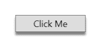
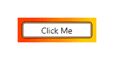
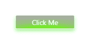
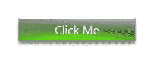
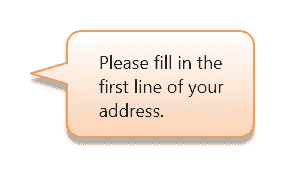
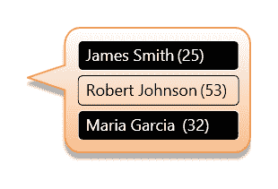
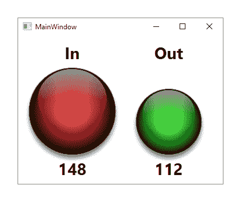
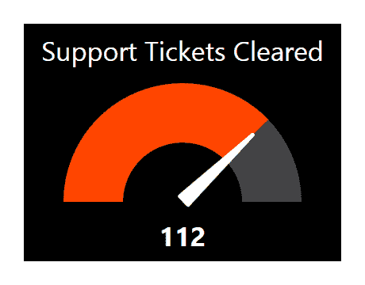
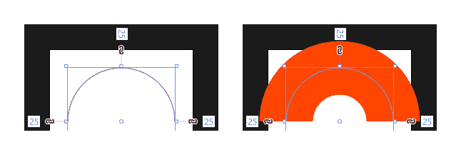
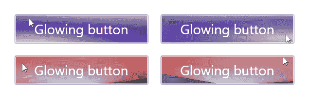

# 第八章：创建视觉上吸引人的用户界面

在一个视图中添加表单元素很简单，但要制作一个看起来视觉上吸引人的应用程序则需要更多的工作。幸运的是，**Windows Presentation Foundation**（**WPF**）为我们提供了许多可以帮助我们实现这一目标的特性，例如渐变画刷、圆角、透明度控制、分层视觉效果和动画。

在本章中，我们将探讨多种使用这些元素的方法，以极大地改善我们应用程序的视觉外观。我们将研究简单易实现的解决方案，例如使用样式属性，以及需要更多工作的解决方案，如动画和自定义控件。

# 一致地样式化应用程序

让我们的应用程序脱颖而出的一种最简单的方法是让它们看起来独特。这可以通过为我们在其中使用的控件定义自定义样式来实现。然而，如果我们决定为我们的控件添加样式，那么为所有使用的控件添加样式是至关重要的，因为半样式化的应用程序往往比仅使用默认样式的应用程序看起来更糟糕。

因此，我们设计应用程序控件样式的一致性是绝对必要的，以便为我们的应用程序提供专业的外观。在本节中，我们将讨论一些技巧和窍门，以帮助我们实现这些应用程序样式。

# 覆盖默认控件样式

在为我们的应用程序控件提供自定义样式时，这通常需要我们为每个控件定义一个新的`ControlTemplate`元素。由于这些元素往往非常大，因此通常将它们声明在一个单独的资源文件中，并在`App.xaml`文件中将它们与应用程序资源合并，如第五章中所示，“为工作选择正确的控件”。

在开始这项任务之前，我们需要规划我们的控件外观，然后将这种外观应用到每个控件上。另一个错误是使用不同的样式定制不同的控件，因为一致性是提供专业外观的关键。例如，如果我们希望我们的单行文本框具有特定的高度，那么我们也应该定义其他控件具有相同的高度。

我们为控件声明的自定义样式可以是我们的应用程序框架的一部分。如果我们通过`x:Key`指令未命名它们，它们将被隐式应用，因此利用我们的应用程序框架的开发者无需关心每个控件的外观，从而有效地使他们能够专注于将它们聚合到各种视图中。

在开始设计自定义样式之前，首先要定义我们将要在应用程序中使用的一小部分颜色。在应用程序中使用过多的颜色可能会使其看起来不够专业，因此我们应该选择少量颜色的一两种色调来使用。有许多在线工具可以帮助我们选择要使用的调色板。

一旦我们选择了应用程序颜色，我们首先应该在 `App.xaml` 文件中将它们声明为 `Color` 对象，然后声明使用它们的画笔元素，因为大多数控件使用画笔而不是颜色。这有两个好处；只使用这些颜色将促进一致性，并且如果我们需要更改颜色，我们只需要在一个地方更改它：

```cs
<Color x:Key="ReadOnlyColor">#FF585858</Color> 
...
<SolidColorBrush x:Key="ReadOnlyBrush" 
  Color="{StaticResource ReadOnlyColor}" /> 
```

定义最常见的控件类型的多个命名样式通常也是一个好主意。例如，为 `TextBlock` 元素提供一个 `Label` 样式，使其右对齐并添加合适的边距，或者提供一个 `Heading` 样式，设置更大的字体大小和更重的字体重量。为开发者提供一组预定义的样式有助于使应用程序看起来保持一致。

在定义多个命名样式时，通常会在其他样式中重用其中的一些。例如，如果我们为 `TextBox` 控件有一个默认样式，我们可以在其他样式变体上基于它。让我们看看一些 XAML 示例：

```cs
<Style x:Key="TextBoxStyle" TargetType="{x:Type TextBox}"> 
  <Setter Property="SnapsToDevicePixels" Value="True" /> 
  <Setter Property="Margin" Value="0,0,0,5" /> 
  <Setter Property="Padding" Value="1.5,2" /> 
  <Setter Property="MinHeight" Value="25" /> 
  <Setter Property="TextWrapping" Value="Wrap" /> 
  ... 
</Style> 
<Style x:Key="Max2LineTextBoxStyle" TargetType="{x:Type TextBox}"  
  BasedOn="{StaticResource TextBoxStyle}"> 
  <Setter Property="MaxHeight" Value="44" /> 
  <Setter Property="VerticalScrollBarVisibility" Value="Auto" /> 
  <Setter Property="ToolTip" 
    Value="{Binding Text, RelativeSource={RelativeSource Self}}" />
</Style> 
<Style x:Key="Max3LineTextBoxStyle" TargetType="{x:Type TextBox}"  
  BasedOn="{StaticResource Max2LineTextBoxStyle}"> 
  <Setter Property="MaxHeight" Value="64" /> 
</Style> 
<Style x:Key="ReadOnlyTextBoxStyle" TargetType="{x:Type TextBox}"  
  BasedOn="{StaticResource TextBoxStyle}"> 
  <Setter Property="Background" Value="{StaticResource ReadOnlyBrush}" /> 
  <Setter Property="IsReadOnly" Value="True" /> 
  <Setter Property="Cursor" Value="Arrow" /> 
</Style> 
```

在这里，简化的 `TextBoxStyle` 样式定义了所有 `TextBox` 控件的大部分属性。`Max2LineTextBoxStyle` 样式从该样式继承所有属性设置，并设置了一些额外的属性，以确保在需要时可以出现垂直滚动条，并强制控件的最大高度。

`Max3LineTextBoxStyle` 样式扩展了 `Max2LineTextBoxStyle` 样式，因此继承了其所有属性设置，以及 `TextBoxStyle` 样式的属性。它覆盖了之前样式中设置的 `MaxHeight` 属性。`ReadOnlyTextBoxStyle` 样式也扩展了 `TextBoxStyle` 样式，并设置了属性以确保控件为只读。以这种方式定义样式可以确保每个视图中的控件保持一致性。

除了为我们的应用程序控件定义默认样式外，通常还为应用程序中的每个数据模型提供默认数据模板资源。与控件类似，预先定义这些数据模板可以提高一致性。我们还可以定义多个命名模板来覆盖默认模板并在不同场景中使用。

如果应用程序中有大量数据模型，将它们的数据模板声明在单独的资源文件中，并在 `App.xaml` 文件中将它们与应用程序资源合并，例如合并到默认控件模板中，可能会有所帮助。因此，在应用程序资源文件中合并多个资源文件并不罕见。

# 使用专业图标

在开发应用程序时，经常会被低估的是一套一致且质量不错的图标对整体影响。使用来自多个不同地方的不匹配图标，真的会让一个原本看起来专业的应用程序显得不那么专业。

如果您或您的公司无法负担或出于任何其他原因购买一套自定义图标，这并不意味着一切都结束了。Visual Studio 早已提供了一系列不同格式的专业图标，我们可以在我们的应用程序中免费使用。这些图标实际上是 Visual Studio、Office 和其他 Microsoft 应用程序中使用的图标，因此许多用户已经熟悉它们。

在 Visual Studio 的旧版本中，例如 2010 版或甚至 2008 版，提供的图像库与应用程序一起安装，可以在以下路径之一找到：

+   `C:\Program Files\Microsoft Visual Studio 9.0\Common7\VS2008ImageLibrary\1033`

+   `C:\Program Files\Microsoft Visual Studio 10.0\Common7\VS2010ImageLibrary\1033`

注意，在 64 位机器上，此路径将更改为以下内容：

+   `C:\Program Files (x86)\Microsoft Visual Studio 10.0\Common7\VS2010ImageLibrary\1033`

然而，Microsoft 从 Visual Studio 的 2012 版本开始改变了访问图像库的方式。在这些后续版本中，图像库不再包含在 Visual Studio 的安装中。相反，我们必须搜索`Visual Studio Image Library`并从**Microsoft**网站手动下载它们。

新的图标集还包含可搜索的 Adobe Reader 文件，列出了图标集的内容，并提供到每个图标相关文件夹的链接。大多数图标还包括多个尺寸，因此新的库比之前的库大得多。

以下图像显示了 2010 年图标的一些示例：


以下图像显示了相同的图标，但采用了 2015 年引入的扁平化风格：


以下图像显示了 2017 年扁平化风格图标的变化，以供比较：


注意，Visual Studio 2019 没有提供任何图像库，这可能是未来趋势的一个迹象。然而，当前的图标集合将覆盖大多数用途。

# 层叠视觉元素

到目前为止，我们只是通过改变形状、大小、边框和其他常见属性来查看标准控件的基本重新定义。然而，我们可以用 WPF 做更多的事情。在继续本节之前，重要的是要知道，每个控件包含的视觉元素越多，渲染它们所需的时间就越长，这可能会对性能产生负面影响。

因此，如果我们的应用程序将在运行速度慢、旧的计算机上运行，那么我们就不应该过度强调控件的外观。相反，如果我们知道我们的最终用户将有足够的 RAM 和/或显卡，那么我们可以走得更远，开发出视觉上令人惊叹的控件。让我们看看我们可以使用的一些提高控件外观的技术。

# 投影阴影

让我们的 UI 元素从屏幕中跳出来的一种最简单的方法是为它们添加阴影。每个控件都有一个 `Effect` 属性，该属性是从 `UIElement` 类继承的。我们可以将 `DropShadowEffect` 类型的对象设置到这个属性上，为我们的控件添加阴影。

然而，我们必须对 `DropShadowEffect` 元素上使用的设置持保守态度，因为这个效果很容易过度使用。我们也不想将此效果应用于每个控件，因为这会破坏整体效果。当设置在包含其他控件的面板上，或设置在围绕此类面板的边框上时，它最有用。让我们看看应用此效果的一个简单示例：

```cs
<Button Content="Click Me" Width="140" Height="34" FontSize="18"> 
  <Button.Effect> 
    <DropShadowEffect Color="Black" ShadowDepth="6" BlurRadius="6"  
      Direction="270" Opacity="0.5" /> 
  </Button.Effect> 
</Button> 
```

让我们看看这段代码的输出效果：



在这个例子中，我们有一个标准的按钮，它将 `DropShadowEffect` 元素设置为 `Effect` 属性。正如我们将在本章后面看到的，`DropShadowEffect` 类有许多用途，但其主要用途是创建阴影效果。

当使用此元素创建阴影效果时，我们通常希望将其 `Color` 属性设置为黑色，并将 `Opacity` 属性设置为至少半透明的值，以获得最佳或最逼真的效果。`ShadowDepth` 属性决定了阴影应该落在元素多远的位置。与 `BlurRadius` 属性一起，此属性用于为元素添加高度感。

`BlurRadius` 属性在扩展阴影区域的同时，也使其密度降低。与 `ShadowDepth` 属性类似，此属性的默认值为五。`Direction` 属性指定阴影应该落在哪个方向，零度值使阴影落在右侧，增加的值使阴影角度逆时针移动。

注意，`270` 的值使阴影直接落在应用控件下方，这在商业应用中通常是最合适的。使用这个角度会产生一种元素略微悬停在屏幕上方或前面的效果，光源来自上方，这是光线最自然的方向。

与此相反，例如 `45` 度的角度会将阴影放置在元素的右上角，这会向大脑传达有一个光源在左下方的信息。然而，这种特殊效果看起来不自然，可能会削弱而不是增强应用程序的样式。

# 声明多个边框

我们可以使用的一种简单技术是，为每个控件声明多个`Border`元素。通过在外边框内声明一个或多个边框，我们可以使我们的控件看起来更专业。我们将在稍后看到，当用户的鼠标光标悬停在按钮上时，我们可以如何使这些边框以不同的方式动画化，但现在，让我们看看我们如何创建这种效果：

```cs
<Grid Width="160" Height="68"> 
  <Grid.Background> 
    <LinearGradientBrush StartPoint="0,0" EndPoint="1,1"> 
      <GradientStop Color="Red" /> 
      <GradientStop Color="Yellow" Offset="1" /> 
    </LinearGradientBrush> 
  </Grid.Background> 
  <Button Content="Click Me" Width="120" Height="28" FontSize="14"  
    Margin="20"> 
    <Button.Template> 
      <ControlTemplate TargetType="{x:Type Button}"> 
        <Border BorderBrush="Black" BorderThickness="1"  
          Background="#7FFFFFFF" Padding="1" CornerRadius="5"  
          SnapsToDevicePixels="True"> 
          <Border BorderBrush="#7F000000" BorderThickness="1"  
            Background="White" CornerRadius="3.5"  
            SnapsToDevicePixels="True"> 
            <ContentPresenter HorizontalAlignment="Center"  
              VerticalAlignment="Center" /> 
          </Border> 
        </Border> 
      </ControlTemplate> 
    </Button.Template> 
  </Button> 
</Grid> 
```

在这个例子中，我们为我们的`Button`控件声明了一个简单的`ControlTemplate`元素，以演示双边框技术。请注意，我们通常会在这个`App.xaml`文件的`Application.Resources`部分声明此模板，以便它可以被重用，但在这里我们将其局部声明以节省空间。

注意，我们需要调整内边框的圆角半径，以确保它能够准确适应外边框。如果我们使用相同的大小，它们将无法正确地结合在一起。此外，我们已将两个边框的`SnapsToDevicePixels`属性设置为`true`，以确保它们不会被反走样伪影模糊。

另一点需要注意的是，我们使用了`#7FFFFFFF`作为外边框和内边框边框刷的背景值。在这个值中，alpha 通道被设置为`7F`，相当于不透明度值为`0.5`。这意味着这些元素将部分透明，因此背景颜色将部分透过边框边缘显示。

我们将我们的按钮添加到一个`Grid`面板中，并将其背景设置为`LinearGradientBrush`对象以演示这种半透明效果。当渲染时，我们的背景渐变和按钮将看起来像以下图像：



# 重复使用复合视觉元素

下一个技术涉及定义将在控件背景中渲染的特定图案。这可能是一个公司标志的全部或部分、一个特定的形状，甚至只是一个简单、位置恰当的曲线。这将成为我们控件视觉的最低层，并且可以在其上方有额外的视觉层。让我们看看我们可以如何实现这种设计，首先从定义一些资源开始：

```cs
<RadialGradientBrush x:Key="LayeredButtonBackgroundBrush" RadiusX="1.85"  
  RadiusY="0.796" Center="1.018,-0.115" GradientOrigin="0.65,- 0.139"> 
  <GradientStop Color="#FFCACACD" /> 
  <GradientStop Color="#FF3B3D42" Offset="1" /> 
</RadialGradientBrush> 
<LinearGradientBrush x:Key="LayeredButtonCurveBrush" StartPoint="0,0"  
  EndPoint="1,1">
  <GradientStop Color="#FF747475" Offset="0" /> 
  <GradientStop Color="#FF3B3D42" Offset="1" /> 
</LinearGradientBrush> 
<Grid x:Key="LayeredButtonBackgroundElements"> 
  <Rectangle Fill="{StaticResource LayeredButtonBackgroundBrush}" /> 
  <Path StrokeThickness="0" 
    Fill="{StaticResource LayeredButtonCurveBrush}"> 
    <Path.Data> 
      <CombinedGeometry GeometryCombineMode="Intersect"> 
        <CombinedGeometry.Geometry1> 
          <EllipseGeometry Center="-20,50.7" RadiusX="185" RadiusY="46" />
        </CombinedGeometry.Geometry1> 
        <CombinedGeometry.Geometry2> 
          <RectangleGeometry Rect="0,0,106,24" /> 
        </CombinedGeometry.Geometry2> 
      </CombinedGeometry> 
    </Path.Data> 
  </Path> 
</Grid> 
<VisualBrush x:Key="LayeredButtonBackground"  
  Visual="{StaticResource LayeredButtonBackgroundElements}" /> 
```

这个设计有几个元素，所以让我们逐个查看。我们首先声明了一个具有键`LayeredButtonBackgroundBrush`的`RadialGradientBrush`元素和一个具有键`LayeredButtonCurveBrush`的`LinearGradientBrush`。

`RadialGradientBrush`元素的`RadiusX`和`RadiusY`属性指定了包含径向渐变的最大椭圆的`X`和`Y`半径，而`Center`和`GradientOrigin`属性决定了径向渐变的中心和焦点，并使我们能够精确地在矩形内定位它。

`LinearGradientBrush`元素具有`StartPoint`值为`0,0`和`EndPoint`值为`1,1`，这导致了一个对角渐变。在这个特定的设计中，目的是在中心处两个渐变之间有鲜明的对比，并在边缘处将它们稍微混合在一起。

接下来，我们声明一个具有键`LayeredButtonBackgroundElements`的`Grid`面板，它包含一个`Rectangle`和一个`Path`元素。默认情况下，矩形被拉伸以填充面板，并用`LayeredButtonBackgroundBrush`资源绘制。`Path`元素用`LayeredButtonCurveBrush`资源绘制。

`Path`对象的`Data`属性是我们定义路径形状的地方。我们可以用多种方式指定路径数据；然而，在这个例子中，我们使用了一个具有`GeometryCombineMode`值为`Intersect`的`CombinedGeometry`元素，它输出一个代表两个指定几何形状交集的单个形状。

在`CombinedGeometry`元素内部，我们有`Geometry1`和`Geometry2`属性，其中我们根据`GeometryCombineMode`属性指定的`Intersect`模式组合这两个几何形状。

我们的第一个形状定义了设计中的曲线，并来自一个`EllipseGeometry`元素，使用`Center`属性定位椭圆，使用`RadiusX`和`RadiusY`属性来塑造它。第二个形状是一个来自`RectangleGeometry`元素的矩形，由其`Rect`属性定义。

这两个形状的交集是此路径的结果，并大致覆盖了我们整体形状的底部部分，直到曲线。背后部分遮挡的矩形元素完成了整体形状的其余部分。

具有带有`LayeredButtonBackground`键的`VisualBrush`元素的`Visual`属性被设置为`LayeredButtonBackgroundElements`面板，因此任何用此画笔绘制的 UI 元素现在都将印有这种设计。一旦我们将这些资源添加到`App.xaml`文件中的`Application.Resources`部分，我们就可以通过`VisualBrush`元素使用它们，如下所示：

```cs
<Button Background="{StaticResource LayeredButtonBackground}" Width="200"  
  Height="40" SnapsToDevicePixels="True" />
```

这将在按钮背景中渲染渐变，如下所示：


在这个例子中，我们手动指定了视觉画笔的引用来绘制`Button`对象的背景。然而，以这种方式设置背景将要求使用我们应用程序框架的开发者在每次添加按钮时都这样做。更好的解决方案是重新设计默认按钮模板，以便视觉画笔自动应用于每个按钮。我们将在本章后面看到这个例子，当我们汇集这些技术时。

# 反射光线

另一种技术是在我们的控件顶部添加一个半透明层，该层具有渐变到透明的效果，以产生光源反射的外观。这可以通过简单的 `Border` 元素和一个 `LinearGradientBrush` 实例轻松实现。让我们看看我们如何完成这个任务：

```cs
<Button Content="Click Me" Width="140" Height="34" FontSize="18"  
  Foreground="White" Margin="20"> 
  <Button.Template> 
    <ControlTemplate TargetType="{x:Type Button}"> 
      <Border Background="#FF007767" CornerRadius="5"  
        SnapsToDevicePixels="True"> 
        <Grid> 
          <Rectangle RadiusX="4" RadiusY="4" Margin="1,1,1,7"  
            SnapsToDevicePixels="True"> 
            <Rectangle.Fill> 
              <LinearGradientBrush StartPoint="0,0" EndPoint="0,1"> 
                <GradientStop Color="#BFFFFFFF" /> 
                <GradientStop Color="#00FFFFFF" Offset="0.8" /> 
              </LinearGradientBrush> 
            </Rectangle.Fill> 
          </Rectangle> 
          <ContentPresenter HorizontalAlignment="Center"  
            VerticalAlignment="Center" /> 
        </Grid> 
      </Border> 
    </ControlTemplate> 
  </Button.Template> 
</Button> 
```

当运行此示例时，将生成一个看起来像这样的按钮：


让我们检查这个示例。我们首先声明具有一些样式属性的 `Button` 元素。与在现实世界应用中定义单独的样式或控件模板不同，我们再次在这里内联声明模板以节省空间。

在控制模板中，我们首先声明一个具有翡翠绿色背景和 `CornerRadius` 值为 `5` 的 `Border` 元素。我们再次将 `SnapsToDevicePixels` 属性设置为 `true`，以确保边缘保持锐利。

在边框内部，我们在 `Grid` 面板中定义了两个元素。第一个是产生反射效果的 `Rectangle` 元素，第二个是所需的 `ContentPresenter` 对象。矩形使用 `RadiusX` 和 `RadiusY` 属性中的 `4` 值，并适当地设置 `Margin` 属性以确保在反射边缘周围有一个微小的间隙。

它还将其 `SnapsToDevicePixels` 属性设置为 `true`，以确保这个微小的间隙不会被模糊。请注意，底部边距的值为 `7`，因为我们不希望反射效果覆盖按钮的下半部分。`Fill` 属性实际上是创建反射效果的地方。

在矩形的 `Fill` 属性中，我们通过设置 `StartPoint` 和 `EndPoint` 属性的 `X` 值以及 `StartPoint.Y` 属性为 `0` 和 `Endpoint.Y` 属性为 `1`，定义了一个垂直的 `LinearGradientBrush` 元素；将这些点绘制在图上会产生一条垂直线，因此这产生了一个垂直渐变。

在 `LinearGradientBrush` 对象的 `GradientStops` 集合中，我们定义了两个 `GradientStop` 元素。第一个元素的偏移量为零，设置为白色，并具有十六进制 alpha 通道值 `BF`，这大约相当于不透明度值 `0.7`。第二个元素的偏移量为 `0.8`，设置为白色，并具有十六进制 alpha 通道值 `00`，这导致颜色完全透明，可以用 `Transparent` 颜色替换。

因此，生成的渐变从顶部略微透明开始，并在底部完全透明，结合底部边距和偏移值，实际上位于按钮的中间。与我们的其他示例一样，`ContentPresenter` 对象随后声明，以便它被渲染在反射效果之上。

# 创建发光效果

我们可以为我们的控件创建另一种效果，即发光外观，就像光线从控件内部向外照射一样。我们需要另一个`LinearGradientBrush`实例和 UI 元素来绘制它。`Rectangle`元素非常适合这个角色，因为它非常轻量。我们应该在`App.xaml`文件中的应用程序资源中定义这些资源，以使每个视图都能使用它们：

```cs
<TransformGroup x:Key="GlowTransformGroup"> 
  <ScaleTransform CenterX="0.5" CenterY="0.85" ScaleY="1.8" /> 
  <TranslateTransform Y="0.278" /> 
</TransformGroup> 
<RadialGradientBrush x:Key="GreenGlow" Center="0.5,0.848"  
  GradientOrigin="0.5,0.818" RadiusX="-1.424" RadiusY="-0.622"  
  RelativeTransform="{StaticResource GlowTransformGroup}"> 
  <GradientStop Color="#CF65FF00" Offset="0.168" /> 
  <GradientStop Color="#4B65FF00" Offset="0.478" /> 
  <GradientStop Color="#0065FF00" Offset="1" /> 
</RadialGradientBrush> 
<Style x:Key="GlowingButtonStyle" TargetType="{x:Type Button}"> 
  <Setter Property="SnapsToDevicePixels" Value="True" /> 
  <Setter Property="Template"> 
    <Setter.Value> 
      <ControlTemplate TargetType="{x:Type Button}"> 
        <Border BorderBrush="White" BorderThickness="1"  
          Background="DarkGray" CornerRadius="3"> 
          <Grid> 
            <Rectangle IsHitTestVisible="False" RadiusX="2"
              RadiusY="2" Fill="{StaticResource GreenGlow}" /> 
            <ContentPresenter Content="{TemplateBinding Content}" 
              HorizontalAlignment="Center" VerticalAlignment="Center" /> 
          </Grid> 
          <Border.Effect> 
            <DropShadowEffect Color="#FF65FF00" ShadowDepth="4"
              Opacity="0.4" Direction="270" BlurRadius="10" /> 
          </Border.Effect> 
        </Border> 
      </ControlTemplate> 
    </Setter.Value> 
  </Setter> 
</Style> 
```

我们首先声明一个`TransformGroup`元素，它使我们能够将一个或多个变换对象组合在一起。在其内部，我们定义一个`ScaleTransform`元素，该元素将应用元素的垂直缩放因子设置为默认值`1`，水平缩放因子设置为`1.8`。我们使用其`CenterX`和`CenterY`属性指定这个变换的中心。接下来，我们声明一个`TranslateTransform`元素，该元素将应用元素向下移动一小段距离。

在此之后，我们定义一个`RadialGradientBrush`对象，它将代表我们设计中的发光效果。我们使用`RadiusX`和`RadiusY`属性来塑造画笔元素，并指定`Center`和`GradientOrigin`属性来指定径向渐变的中心和焦点。

然后我们将`TransformGroup`元素设置为画笔的`RelativeTransform`属性，以将变换应用到它上面。请注意，三个`GradientStop`元素都使用相同的`R`、`G`和`B`值，只是在透明度通道或不透明度值上有所不同。

接下来，我们声明`GlowingButtonStyle`样式，用于类型`Button`，将`SnapsToDevicePixels`属性设置为`true`，以保持其线条清晰和锐利。在`Template`属性中，我们定义一个包含白色`Border`元素的`ControlTemplate`元素，该`Border`元素具有略微圆滑的角落。

在边框内部，我们声明一个包含`Rectangle`和`ContentPresenter`元素的`Grid`面板。同样，矩形的`RadiusX`和`RadiusY`属性设置为比父边框控件`CornerRadius`属性更小的值，以确保它均匀地适合其中。我们的`RadialGradientBrush`资源被分配为矩形的`Fill`属性。

`ContentPresenter`对象被居中，以确保按钮的内容将在其中心渲染。回到`Border`元素，我们看到在其`Effect`属性中声明了一个`DropShadowEffect`。然而，这个元素不是为了创建阴影效果；这个类是多功能的，也可以渲染发光效果以及阴影效果。

技巧在于将其`Color`属性设置为非黑色，并将`BlurRadius`属性设置为比我们通常在创建阴影效果时使用的更大值。在这种情况下，我们将`Direction`属性设置为`270`，将`ShadowDepth`属性设置为`4`，以便将发光效果定位在边界的底部，即光线应该从那里发出的位置。

不幸的是，这种效果并不能很好地转换为灰度或纸张效果，因此在非彩色和屏幕上查看时，发光效果会有所损失。对于本书电子书版本的读者，以下是我们的示例中发光效果的外观：



# 将所有这些放在一起

虽然这些各种效果可以单独改善我们的控件的外观，但最大的改进往往是在将它们合并到单一设计中时实现的。在接下来的例子中，我们将这样做。我们首先需要添加一些额外的资源来使用：

```cs
<SolidColorBrush x:Key="TransparentWhite" Color="#7FFFFFFF" /> 
<SolidColorBrush x:Key="VeryTransparentWhite" Color="#3FFFFFFF" /> 
<SolidColorBrush x:Key="TransparentBlack" Color="#7F000000" /> 
<SolidColorBrush x:Key="VeryTransparentBlack" Color="#3F000000" /> 
<VisualBrush x:Key="SemiTransparentLayeredButtonBackground"  
  Visual="{StaticResource LayeredButtonBackgroundElements}" 
  Opacity="0.65" /> 
```

这里并没有什么太复杂的东西。我们只是定义了具有不同透明度级别的一系列颜色，以及一个稍微透明的视觉笔刷版本，它引用了我们的分层背景元素。现在让我们继续到包含的样式：

```cs
<Style TargetType="{x:Type Button}"> 
  <Setter Property="SnapsToDevicePixels" Value="True" /> 
  <Setter Property="Cursor" Value="Hand" /> 
  <Setter Property="Template"> 
    <Setter.Value> 
      <ControlTemplate TargetType="{x:Type Button}"> 
        <Border CornerRadius="3" 
          BorderBrush="{StaticResource TransparentBlack}" 
          BorderThickness="1"  
          Background="{StaticResource TransparentWhite}"> 
          <Border Name="InnerBorder" CornerRadius="2"  
            Background="{StaticResource LayeredButtonBackground}" 
            Margin="1"> 
            <Grid> 
              <Rectangle IsHitTestVisible="False" RadiusX="2"
                RadiusY="2" Fill="{StaticResource GreenGlow}" />
              <ContentPresenter Content="{TemplateBinding Content}"
                Margin="{TemplateBinding Padding}" 
                HorizontalAlignment="{TemplateBinding 
                HorizontalContentAlignment}" 
                VerticalAlignment="{TemplateBinding 
                VerticalContentAlignment}" /> 
            </Grid> 
          </Border> 
          <Border.Effect> 
            <DropShadowEffect Color="Black" ShadowDepth="6" 
              BlurRadius="6" Direction="270" Opacity="0.5" /> 
          </Border.Effect> 
        </Border> 
        <ControlTemplate.Triggers> 
          <Trigger Property="IsMouseOver" Value="True"> 
            <Setter TargetName="InnerBorder"  
              Property="Background" Value="{StaticResource
              SemiTransparentLayeredButtonBackground}" /> 
          </Trigger> 
          <Trigger Property="IsPressed" Value="True"> 
            <Setter TargetName="InnerBorder" Property="Background" 
              Value="{StaticResource LayeredButtonBackground}" /> 
          </Trigger> 
        </ControlTemplate.Triggers> 
      </ControlTemplate> 
    </Setter.Value> 
  </Setter> 
</Style> 
```

观察示例 XAML，我们可以看到`SnapsToDevicePixels`属性设置为`true`，以避免反走样伪影模糊按钮的边缘，并且`Cursor`属性设置为当用户的鼠标悬停在按钮上时显示指向的手指光标。

在控件模板中，我们看到两个嵌套的`Border`元素。请注意，外部边框使用`TransparentBlack`和`TransparentWhite`笔刷资源，使其半透明。此外，请注意，白色内部边框实际上来自外部边框的背景，而不是内部边框，这设置了`Margin`属性为`1`，以产生内部边框的印象。

在这个例子中，内部边框元素仅负责从视觉笔刷中显示分层按钮元素，并且它本身没有显示的边框。再次强调，我们已经调整了它的`CornerRadius`属性，使其能够整齐地嵌入外部边框中。我们可以在 WPF 设计器中放大到放大级别，以帮助我们决定在这里应该使用哪些值。

在内部边框内，我们声明了一个`Grid`面板，这样我们就可以添加所需的`ContentPresenter`和用资源中的`GreenGlow`笔刷绘制的`Rectangle`元素。再次强调，我们将它的`IsHitTestVisible`属性设置为`false`，这样用户就不能与之交互，并将`RadiusX`和`RadiusY`属性设置为与内部边框的`CornerRadius`值相匹配。

我们使用`TemplateBinding`元素将`ContentPresenter`对象的属性映射到模板对象的适当属性，以便设置按钮上的属性可以影响其定位和内容。接下来，我们将之前显示的`DropShadowEffect`元素设置为外部边框的`Effect`属性，这样就在模板中总结了包含的 UI 元素。

为了使模板更有用，我们在`ControlTemplate.Triggers`集合中设置了一些`Trigger`对象，这些对象将为我们的按钮添加鼠标悬停效果。第一个触发器针对`IsMouseOver`属性，并在属性为真时将内部边框的背景设置为分层按钮元素视觉画刷的略微透明版本。

第二个触发器针对`IsPressed`属性，并在属性为真时重新应用原始视觉画刷。请注意，这两个触发器必须按此顺序定义，以便当两个条件都为真时，针对`IsPressed`属性的触发器将覆盖另一个。当然，按钮在点击时是点亮还是熄灭，或者甚至改变颜色，这完全取决于个人喜好。

注意，我们在这个样式中省略了`x:Key`指令，因此它将隐式应用于所有没有明确应用不同样式的`Button`元素。因此，我们可以在不指定样式的情况下声明我们的`Button`元素，如下面的代码片段所示：

```cs
<Button Content="Click Me" Width="200" Height="40" FontSize="20"  
  Foreground="White" /> 
```

这导致了以下视觉输出：



我们还可以通过定义多个不同的颜色资源并在数据模板中使用数据触发器来进一步扩展这个发光的想法，以改变发光的颜色来指示数据对象的不同状态。这使我们能够向用户提供额外的视觉信息，除了通常的文本反馈方法之外。

例如，数据模型对象上的蓝色光芒可以指定未更改的对象，而绿色可以表示有有效更改的对象，红色可以突出显示错误的对象。我们将在下一章中看到如何实现这个想法，但就目前而言，让我们继续探讨不同的方法来使我们的应用脱颖而出。

# 离开常规

在一般商业应用中，大多数看起来相当普通，包含各种包含标准矩形表单字段的表单页面。另一方面，视觉吸引人的应用则脱颖而出。因此，为了创建视觉吸引人的应用，我们需要离开常规。

这意味着为我们的控件添加具有圆角的控件模板，或者更多，这取决于你。我们可以以许多不同的方式增强控件的外观，我们将在本节中探讨这些想法中的许多。让我们从一个最适合与徽标或启动和背景图像一起使用的反射效果开始。

# 投射反射

所有`FrameworkElement`派生类都有一个`RenderTransform`属性，我们可以利用它以各种方式转换它们的渲染输出。一个`ScaleTransform`元素使我们能够同时在水平和垂直方向上缩放每个对象。关于`ScaleTransform`对象的一个有用方面是，我们也可以负向缩放，从而反转视觉输出。

我们可以用这个特定的特性创建一个视觉上令人愉悦的效果，即对象的镜像或反射。为了增强这个效果，我们可以使用透明度遮罩来随着反射从对象退去而淡出反射。这可以给视觉上造成一个物体在光滑表面上反射的印象，如下面的图像所示：


让我们看看我们如何实现这个结果：

```cs
<StackPanel HorizontalAlignment="Center" VerticalAlignment="Center"  
  Width="348"> 
  <TextBlock Name="TextBlock" FontFamily="Candara" 
    Text="APPLICATION NAME" FontSize="40" FontWeight="Bold"> 
    <TextBlock.Foreground> 
      <LinearGradientBrush StartPoint="0,0" EndPoint="1,0"> 
        <GradientStop Color="Orange" /> 
        <GradientStop Color="Red" Offset="0.5" /> 
        <GradientStop Color="Orange" Offset="1" /> 
      </LinearGradientBrush> 
    </TextBlock.Foreground> 
  </TextBlock> 
  <Rectangle Height="31" Margin="0,-11.6,0,0"> 
    <Rectangle.Fill> 
      <VisualBrush Visual="{Binding ElementName=TextBlock}"> 
        <VisualBrush.RelativeTransform> 
          <ScaleTransform ScaleY="-1.0" CenterX="0.5" CenterY="0.5" /> 
        </VisualBrush.RelativeTransform> 
      </VisualBrush> 
    </Rectangle.Fill> 
    <Rectangle.OpacityMask> 
      <LinearGradientBrush StartPoint="0,0" EndPoint="0,1"> 
        <GradientStop Color="#DF000000" /> 
        <GradientStop Color="Transparent" Offset="0.8" /> 
      </LinearGradientBrush> 
    </Rectangle.OpacityMask> 
  </Rectangle> 
</StackPanel> 
```

在这个例子中，我们使用`StackPanel`对象将`TextBlock`元素放置在`Rectangle`元素之上。文本将是反射的对象，反射将在矩形中生成。面板的宽度被限制以确保反射正好适合文本元素。我们首先命名`TextBlock`元素，并设置一些字体属性，以及要输出的文本。

我们设置了一个`LinearGradientBrush`对象作为文本的颜色，使其更有趣，尽管这并不参与创建反射效果。接下来，请注意，`Rectangle`元素的大小和位置被精确设置以适应来自`TextBlock`元素的文本大小。我们当然可以使用这种技术来反射任何东西，并不限于仅反射文本元素。

矩形的背景是用`VisualBrush`对象绘制的，其中`Visual`属性绑定到`TextBlock`元素的视觉输出，使用`ElementName`属性。注意`VisualBrush`对象的`RelativeTransform`属性，它使我们能够以某种方式变换视觉，并设置为`ScaleTransform`类的实例。

这是最重要的组成部分之一，因为这个元素在垂直平面上反转了相关的视觉。将`ScaleY`属性设置为`-1`将垂直反转视觉，而将`ScaleX`属性设置为`-1`将水平反转视觉。请注意，我们在这里省略了`ScaleX`属性，因为我们希望将其设置为默认值`1`。

接下来，我们看到`OpacityMask`属性，它允许我们设置一个渐变画刷来映射到矩形的透明度。当画刷的 alpha 通道为`1`时，矩形将是完全不透明的，当它为`0`时，矩形将是透明的，当它在两者之间时，矩形将是半透明的。这是这个效果的另一个重要部分，它创建了反射图像的淡出效果。

在我们的例子中，我们有一个垂直渐变，顶部几乎是纯黑色，并且逐渐变得透明，直到达到四分之四的位置，此时它变得完全透明。当设置为矩形的`OpacityMask`时，只使用 alpha 通道值，这导致它在顶部完全可见，然后逐渐淡出到四分之四的位置，如前图所示。

# 探索无边框窗口

使用 WPF，我们可以创建没有边框、标题栏以及标准最小化、恢复和关闭按钮的窗口。我们还可以创建不规则形状的窗口和具有透明区域的窗口，这些区域可以显示其下方的任何内容。虽然使我们的主应用程序窗口无边框可能有些不寻常，但我们仍然可以利用这一功能。

例如，我们可以创建一个无边框窗口用于自定义消息框，或者可能是扩展工具提示，或者任何其他向最终用户提供信息的弹出控件。创建无边框窗口可以通过几个简单的步骤实现。让我们从基础知识开始，并假设我们正在将其添加到现有的应用程序框架中。

在这种情况下，我们已经有了一个 `MainWindow` 类，并需要添加一个额外的窗口。正如我们在第六章中看到的，*适配内置控件*，我们可以通过向项目中添加一个新的 `UserControl` 并将 `UserControl` 中的单词替换为 `Window`，*在 XAML 文件及其关联的代码后文件中*来实现这一点。如果未能同时更改这两个文件，将导致设计时错误，并抱怨类不匹配。

或者，我们可以右键点击启动项目，选择添加，然后点击 Window…，接着将其剪切并粘贴到你希望它所在的位置。不幸的是，Visual Studio 没有提供其他方法将 `Window` 控件添加到我们的其他项目中。

一旦我们有了 `Window` 对象，我们只需要将其 `WindowStyle` 属性设置为 `None` 并将其 `AllowsTransparency` 属性设置为 `true`。这将导致窗口的白色背景出现：

```cs
<Window  
  x:Class="CompanyName.ApplicationName.Views.Controls.BorderlessWindow"    

  Height="100" Width="200" WindowStyle="None" AllowsTransparency="True"> 
</Window>

...

using System.Windows; 

namespace CompanyName.ApplicationName.Views.Controls 
{ 
  public partial class BorderlessWindow : Window 
  { 
    public BorderlessWindow() 
    { 
      InitializeComponent(); 
    } 
  } 
} 
```

然而，虽然这样做移除了我们所有人都习惯的默认窗口边框，并为我们提供了一个无边框窗口，但它也移除了标准按钮，因此我们无法直接关闭、调整大小或移动窗口。幸运的是，使我们的窗口可移动是一个非常简单的事情。我们只需要在调用 `InitializeComponent` 方法之后，将以下代码行添加到窗口的构造函数中：

```cs
MouseLeftButtonDown += (o, e) => DragMove(); 
```

这个 `DragMove` 方法是在 `Window` 类中声明的，它使我们能够从其边界内的任何位置点击并拖动窗口。我们可以轻松地通过添加自己的标题栏并将此匿名事件处理程序附加到该对象的 `MouseLeftButtonDown` 事件来重新创建仅能从标题栏移动窗口的正常窗口功能。

如果我们希望我们的无边框窗口可调整大小，`Window` 类中有一个 `ResizeMode` 属性，它为我们提供了一些选项。我们可以用于我们的无边框窗口的一个值是 `CanResizeWithGrip`。此选项添加了一个所谓的调整大小手柄，由窗口右下角的三角形点图案指定，用户可以使用它来调整窗口大小。

如果我们将 `ResizeMode` 属性设置为这个值，并将背景设置为与调整大小控件形成对比的颜色，我们将得到这个视觉输出：


然而，我们仍然没有关闭窗口的方法。为此，我们可以添加自己的按钮，或者也许可以启用通过按键盘上的 escape *Esc* 键或其他键来关闭窗口。无论哪种方式，无论触发器是什么，关闭窗口只是调用窗口的 `Close` 方法这么简单。

而不是实现一个带有边框的替代窗口样式，这可以通过几个边框轻松实现，让我们专注于开发一个无边框且形状不规则的窗口，我们可以用它来弹出对用户有用的信息。通常，我们需要将窗口的背景设置为透明来隐藏它，但我们将替换其控件模板，因此我们不需要这样做。

对于这个示例，我们也不需要调整大小控件，因此让我们将 `ResizeMode` 属性设置为 `NoResize`。我们也没有必要通过鼠标移动这个调用窗口，因此不需要添加调用 `DragMove` 方法的匿名事件处理器。

由于这个窗口只为用户提供信息，我们还应该设置一些其他窗口属性。一个重要的属性是设置 `ShowInTaskbar` 属性，它指定应用程序图标是否应该出现在 Windows 任务栏中。由于这个窗口将是我们主应用程序的一个组成部分，我们将此属性设置为 `false`，以便其图标将被隐藏。

对于这种情况，另一个有用的属性是 `WindowStartupLocation` 属性，它允许使用 `Window.Top` 和 `Window.Left` 属性来定位窗口。这样，调用窗口就可以在屏幕上任何需要的位置进行程序化定位。在继续进行之前，让我们看看这个窗口的代码：

```cs
<Window x:Class="CompanyName.ApplicationName.Views.Controls.CalloutWindow" 

  xmlns:Controls=
    "clr-namespace:CompanyName.ApplicationName.Views.Controls" 
  WindowStartupLocation="Manual"> 
  <Window.Resources> 
    <Style TargetType="{x:Type Controls:CalloutWindow}"> 
      <Setter Property="ShowInTaskbar" Value="False" /> 
      <Setter Property="WindowStyle" Value="None" /> 
      <Setter Property="AllowsTransparency" Value="True" /> 
      <Setter Property="ResizeMode" Value="NoResize" /> 
      <Setter Property="Template"> 
        <Setter.Value> 
          <ControlTemplate TargetType="{x:Type Controls:CalloutWindow}"> 
            <Grid Margin="0,0,0,12"> 
              <Grid.ColumnDefinitions> 
                <ColumnDefinition Width="*" /> 
                <ColumnDefinition Width="5*" /> 
              </Grid.ColumnDefinitions> 
              <Path Grid.ColumnSpan="2"  
                Fill="{TemplateBinding Background}"  
                Stroke="{TemplateBinding BorderBrush}"  
                StrokeThickness="2" Stretch="Fill"> 
                <Path.Data> 
                  <CombinedGeometry GeometryCombineMode="Union"> 
                    <CombinedGeometry.Geometry1> 
                      <PathGeometry> 
                        <PathFigure StartPoint="0,60"> 
                          <LineSegment Point="50,45" /> 
                          <LineSegment Point="50,75" /> 
                        </PathFigure> 
                      </PathGeometry> 
                    </CombinedGeometry.Geometry1> 
                    <CombinedGeometry.Geometry2> 
                      <RectangleGeometry RadiusX="20" RadiusY="20"  
                        Rect="50,0,250,150" /> 
                    </CombinedGeometry.Geometry2> 
                  </CombinedGeometry> 
                </Path.Data> 
              </Path> 
              <ContentPresenter Grid.Column="1"  
                Content="{TemplateBinding Content}"  
                HorizontalAlignment="{TemplateBinding  
                HorizontalContentAlignment}"  
                VerticalAlignment="{TemplateBinding  
                VerticalContentAlignment}"  
                Margin="{TemplateBinding Padding}"> 
                <ContentPresenter.Resources> 
                  <Style TargetType="{x:Type TextBlock}"> 
                    <Setter Property="TextWrapping" Value="Wrap" /> 
                  </Style> 
                </ContentPresenter.Resources> 
              </ContentPresenter> 
              <Grid.Effect> 
                <DropShadowEffect Color="Black"  
                  Direction="270" ShadowDepth="7" Opacity="0.3" /> 
              </Grid.Effect> 
            </Grid> 
          </ControlTemplate> 
        </Setter.Value> 
      </Setter> 
    </Style> 
  </Window.Resources> 
</Window> 
```

虽然这个示例不是很长，但这里有很多东西要讨论。为了澄清情况，在我们检查这段代码之前，让我们也看看它的代码隐藏部分：

```cs
using System.Windows; 
using System.Windows.Media; 

namespace CompanyName.ApplicationName.Views.Controls 
{ 
  public partial class CalloutWindow : Window 
  { 
    static CalloutWindow() 
    { 
      BorderBrushProperty.OverrideMetadata(typeof(CalloutWindow),  
        new FrameworkPropertyMetadata( 
        new SolidColorBrush(Color.FromArgb(255, 238, 156, 88))));       
      HorizontalContentAlignmentProperty.OverrideMetadata(  
        typeof(CalloutWindow),  
        new FrameworkPropertyMetadata(HorizontalAlignment.Center)); 
      VerticalContentAlignmentProperty.OverrideMetadata( 
        typeof(CalloutWindow),  
        new FrameworkPropertyMetadata(VerticalAlignment.Center)); 
    } 

    public CalloutWindow() 
    { 
      InitializeComponent(); 
    } 

    public new static readonly DependencyProperty BackgroundProperty =       
      DependencyProperty.Register(nameof(Background), typeof(Brush),  
      typeof(CalloutWindow), 
      new PropertyMetadata(new LinearGradientBrush(Colors.White, 
      Color.FromArgb(255, 250, 191, 143), 90))); 

    public new Brush Background 
    { 
      get { return (Brush)GetValue(BackgroundProperty); } 
      set { SetValue(BackgroundProperty, value); } 
    } 
  } 
} 
```

这个代码隐藏文件比 XAML 文件简单，所以让我们先快速浏览一下。我们添加了一个静态构造函数，以便在几个预存在的依赖属性上调用 `OverrideMetadata` 方法。这使得我们可以覆盖这些属性的默认设置，我们这样做是在静态构造函数中，因为我们希望这个代码在每个类中只运行一次，并且因为它在类中的任何其他构造函数或方法之前被调用。

在这个构造函数中，我们覆盖了 `BorderBrush` 属性的元数据，以便为我们的调用窗口设置默认边框颜色。我们也为 `HorizontalContentAlignment` 和 `VerticalContentAlignment` 属性做了同样的事情，以确保窗口内容默认居中。通过这样做，我们正在重用这些现有属性。

然而，我们也可以完全替换现有的属性。例如，我们已将 `Background` 属性替换为绘制我们的调用背景。在这种情况下，我们声明了自己的 `Background` 属性，由 `new` 关键字指定，并设置了其默认画笔颜色。然后我们使用它来绘制调用形状的背景，尽管我们也可以在我们的样式中添加另一个设置器来重用原始的 `Background` 属性。

现在查看 XAML 代码，我们可以看到在 `Window` 声明中设置了 `WindowStartupLocation` 属性，随后是窗口 `Resources` 部分中的样式。在这个样式中，我们设置了上述属性并定义了窗口的控制模板。在 `ControlTemplate` 对象内部，我们定义了一个 `Grid` 面板。我们稍后会回到这里，但到目前为止，请注意面板底部设置了九像素的边距。

接下来，请注意该面板声明了两个星号大小的 `ColumnDefinition` 元素，一个宽度为 `*`，另一个宽度为 `5*`。如果我们把这些加起来，最终得到的总宽度是六个等分。这意味着第一列将是窗口总宽度的六分之一，而第二列将占据剩余的五分之六。我们很快就会看到为什么是这样设置的。

在 `Grid` 面板内部，我们首先声明了用于定义我们调用形状的 `Path` 元素。我们将 `Grid.ColumnSpan` 属性设置为 `2`，以确保它占据父窗口的所有空间。接下来，我们将新的 `Background` 属性设置为 `Fill` 属性，这样我们的窗口用户就可以设置 `Background` 属性，并且该画笔只绘制路径的背景。

我们还设置了 `Path` 元素的 `Stroke` 属性为重写的 `BorderBrush` 属性，尽管我们没有这样做，但我们本可以通过声明另一个依赖属性来公开 `StrokeThickness` 属性。请注意，我们使用 `TemplateBinding` 元素来访问窗口的属性，因为在这个特定情况下，它们是最有效的。

特别注意 `Path.Stretch` 属性，我们将其设置为 `Fill`，并定义了形状应该如何填充它所提供的空间。使用此 `Fill` 值指定内容应填充所有可用空间，而不是保留其最初定义的宽高比。然而，如果我们想保留宽高比，则可以将此属性更改为 `Uniform` 值。

路径最重要的部分位于 `Path.Data` 部分。这定义了渲染路径的形状，就像我们的分层背景示例一样，我们在这里使用 `CombinedGeometry` 元素来组合两个独立的几何形状。与前面的示例不同，这里我们使用 `GeometryCombineMode` 的值为 `Union`，这会将两个几何形状的输出一起渲染。

在`CombinedGeometry.Geometry1`元素中，我们声明了一个具有`PathFigure`元素的`PathGeometry`对象，该元素有一个起始点和两个`LineSegment`元素。与起始点一起，这两个元素形成了我们的注释的三角形部分，指向屏幕上与窗口信息相关联的区域。请注意，这个三角形在路径中宽度为五十像素。

在`CombinedGeometry.Geometry2`元素中，我们声明了一个`RectangleGeometry`对象，其大小由`Rect`属性指定，其圆角的大小由`RadiusX`和`RadiusY`属性指定。矩形距离左侧边缘五十像素，宽度为二百五十像素。

因此，矩形和三角形的总面积是三百像素。三百的六分之一是五十，这就是我们形状中三角形的宽度。这解释了为什么我们的第一个`Grid`列被设置为占据总空间的六分之一。

在`Path`对象之后，我们声明了`ContentPresenter`元素，这是输出窗口实际内容所必需的，并将其设置为面板的第二列。简而言之，这一列用于将`ContentPresenter`元素直接定位在我们的形状的矩形部分上方，避免三角形部分。

在`ContentPresenter`元素中，我们使用`TemplateBinding`元素将几个位置属性数据绑定到窗口的相关属性。我们还使用另一个`TemplateBinding`元素将其`Content`属性数据绑定到窗口的`Content`属性。

注意，我们本来可以直接在`Window`控件中声明我们的 UI 控件。然而，如果我们那样做了，我们就无法以这种方式将其`Content`属性数据绑定，因为外部设置会替换掉我们声明的所有 XAML 控件，包括`ContentPresenter`对象。通过提供一个新的模板，我们完全覆盖了窗口的默认行为。

还请注意，我们在`ContentPresenter`元素的`Resources`部分中声明了一个样式。这个样式没有使用`x:Key`指令声明。这样做是为了使其隐式应用于作用域内的所有`TextBlock`对象，特别是为了影响`ContentPresenter`元素将自动为`string`值生成的`TextBlock`对象，而不会影响其他对象。

样式将`TextBlock.TextWrapping`属性设置为`TextWrapping`枚举的`Wrap`成员，这会将长文本行换行到下一行。默认设置是`NoWrap`，这会导致长字符串在我们的窗口中无法完全显示。

最后，我们来到了 XAML 示例的结尾，发现一个`DropShadowEffect`对象被设置为`Grid`面板的`Effect`属性。与所有阴影效果一样，我们将`Color`属性设置为黑色，将`Opacity`属性设置为小于或等于`0.5`的值。`Direction`属性设置为`270`，产生一个直接位于我们的 callout 形状下方的阴影。

注意，我们将`ShadowDepth`属性设置为`7`。*现在，你还记得在网格上设置的底部边距吗？* 那是设置在这个值之上，以确保在窗口中留出足够的空间来显示我们的阴影在 callout 形状下方。如果没有这个设置，阴影将位于窗口的边界框之外，并且不会被显示。

如果我们为`Direction`属性设置了不同的值，那么我们需要调整`Grid`面板的边距，以确保在窗口周围留出足够的空间来显示阴影在其新位置。现在让我们看看我们如何使用我们的新窗口：

```cs
CalloutWindow calloutWindow = new CalloutWindow(); 
calloutWindow.Width = 225; 
calloutWindow.Height = 120; 
calloutWindow.FontSize = 18; 
calloutWindow.Padding = new Thickness(20); 
calloutWindow.Content = "Please fill in the first line of your address."; 
calloutWindow.Show(); 
```

从合适的位置运行此代码会产生以下渲染输出：



在我们的窗口显示代码中，我们将一个`string`设置到窗口的`Content`属性。然而，这个属性的类型是`object`，因此我们可以将其值设置为任何对象。就像我们在本书前面将我们的视图模型实例设置到`ContentControl`的`Content`属性一样，我们也可以用我们的窗口来做同样的事情。

给定一个合适的`DataTemplate`，它定义了特定自定义对象类型的 UI，我们可以将该对象的实例设置到窗口的`Content`属性，并使该模板中的控件在 callout 窗口中渲染，这样我们就不限于只使用类型`string`作为内容。让我们使用一个先前的例子：

```cs
calloutWindow.DataContext = new UsersViewModel(); 
```

通过对`calloutWindow`的维度属性进行一些轻微的调整，我们会看到以下内容：



# 数据可视化

虽然在 WPF 中存在许多现成的图形控件和第三方数据可视化控件，但我们可以相对容易地创建自己的。仅用文本术语表达数据，虽然通常是可以接受的，但并不是最佳选择。在应用程序中打破常规，总是能让该应用程序在严格遵守标准的其他应用程序中脱颖而出。

例如，想象一个简单的情况，我们有一个仪表盘，它可视化了进入的工作任务数量和已完成的工作任务数量。我们只需用大号粗体字输出这些数字，但这将是正常的输出方式。*如果我们把每个数字可视化成一个形状，其大小由数字指定会怎样呢？*

让我们重用我们之前的技术，设计一些视觉上吸引人的球体，它们的大小根据特定值增长。为此，我们可以创建另一个自定义控件，具有一个`Value`依赖属性进行数据绑定。让我们首先看看`Sphere`类的代码：

```cs
using System.Windows; 
using System.Windows.Controls; 
using System.Windows.Media; 
using System.Windows.Shapes; 
using CompanyName.ApplicationName.CustomControls.Enums;
using MediaColor = System.Windows.Media.Color; 

namespace CompanyName.ApplicationName.CustomControls 
{ 
  [TemplatePart(Name = "PART_Background", Type = typeof(Ellipse))] 
  [TemplatePart(Name = "PART_Glow", Type = typeof(Ellipse))] 
  public class Sphere : Control 
  { 
    private RadialGradientBrush greenBackground =
      new RadialGradientBrush(new GradientStopCollection() { 
      new GradientStop(MediaColor.FromRgb(0, 254, 0), 0),
      new GradientStop(MediaColor.FromRgb(1, 27, 0), 0.974) }); 
    private RadialGradientBrush greenGlow = 
      new RadialGradientBrush(new GradientStopCollection() { 
      new GradientStop(MediaColor.FromArgb(205, 67, 255, 46), 0),
      new GradientStop(MediaColor.FromArgb(102, 88, 254, 72), 0.426),
      new GradientStop(MediaColor.FromArgb(0, 44, 191, 32), 1) }); 
    private RadialGradientBrush redBackground = 
      new RadialGradientBrush(new GradientStopCollection() { 
      new GradientStop(MediaColor.FromRgb(254, 0, 0), 0),
      new GradientStop(MediaColor.FromRgb(27, 0, 0), 0.974) }); 
    private RadialGradientBrush redGlow = 
      new RadialGradientBrush(new GradientStopCollection() { 
      new GradientStop(MediaColor.FromArgb(205, 255, 46, 46), 0), 
      new GradientStop(MediaColor.FromArgb(102, 254, 72, 72), 0.426),
      new GradientStop(MediaColor.FromArgb(0, 191, 32, 32), 1) }); 

    static Sphere() 
    { 
      DefaultStyleKeyProperty.OverrideMetadata(typeof(Sphere),  
        new FrameworkPropertyMetadata(typeof(Sphere))); 
    } 

    public static readonly DependencyProperty ValueProperty =  
      DependencyProperty.Register(nameof(Value), typeof(double),  
      typeof(Sphere), new PropertyMetadata(50.0)); 

    public double Value 
    { 
      get { return (double)GetValue(ValueProperty); } 
      set { SetValue(ValueProperty, value); } 
    } 

    public static readonly DependencyProperty ColorProperty =  
      DependencyProperty.Register(nameof(Color), typeof(SphereColor),  
      typeof(Sphere), new PropertyMetadata(SphereColor.Green,  
      OnColorChanged)); 

    public SphereColor Color 
    { 
      get { return (SphereColor)GetValue(ColorProperty); } 
      set { SetValue(ColorProperty, value); } 
    } 

    private static void OnColorChanged(DependencyObject  
      dependencyObject, DependencyPropertyChangedEventArgs e) 
    { 
      ((Sphere)dependencyObject).SetEllipseColors(); 
    } 

    public override void OnApplyTemplate() 
    { 
      SetEllipseColors(); 
    } 

    private void SetEllipseColors() 
    { 
      Ellipse backgroundEllipse =  
        GetTemplateChild("PART_Background") as Ellipse; 
      Ellipse glowEllipse = GetTemplateChild("PART_Glow") as Ellipse;
      if (backgroundEllipse != null) backgroundEllipse.Fill = 
        Color == SphereColor.Green ? greenBackground : redBackground; 
      if (glowEllipse != null) glowEllipse.Fill =  
        Color == SphereColor.Green ? greenGlow : redGlow;
    } 
  } 
} 
```

由于这个类将声明自己的`Color`属性，我们首先添加一个`MediaColor`使用别名指令，我们将仅将其用作访问`System.Windows.Media.Color`类的方法的快捷方式，当在`Sphere`类中声明将要使用的画笔时。

从类声明中，我们可以看到在`TemplatePartAttribute`属性中指定了两个命名的部分。这指定了在我们的控制模板的`Generic.xaml`文件中需要两个提到的`Ellipse`元素。在类内部，我们定义了多个`RadialGradientBrush`资源来绘制我们的球体。

在静态构造函数中，我们调用`OverrideMetadata`方法让框架知道我们的控制默认样式在哪里。然后我们看到`Value`和`Color`依赖属性的声明，以及与`Color`属性相关的`PropertyChangedCallback`处理方法。

在这个`OnColorChanged`方法中，我们将`dependencyObject`输入参数转换为我们的`Sphere`类的一个实例，并调用它的`SetEllipseColors`方法。在那个方法中，我们使用`FrameworkElement.GetTemplateChild`方法从我们的`ControlTemplate`元素访问两个主要的`Ellipse`对象。

记住，我们必须始终检查这些对象是否为`null`，因为我们的`ControlTemplate`可能被替换为一个不包含这些椭圆元素的模板。如果它们不是`null`，我们使用三元运算符并根据我们的`Color`属性值将它们的`Fill`属性设置为我们的画笔资源之一。

创建此功能的一个替代方案是声明一个类型为`Brush`的依赖属性，将其数据绑定到每个椭圆的`Fill`属性，并将相关的画笔资源设置为这些属性，而不是直接访问 XAML 元素。在查看控制默认样式之前，让我们看看由`Color`属性使用的`SphereColor`枚举：

```cs
namespace CompanyName.ApplicationName.CustomControls.Enums 
{ 
  public enum SphereColor 
  { 
    Green, Red 
  } 
} 
```

如您所见，这是一件简单的事情，可以很容易地扩展。请注意，这个枚举是在`CustomControls`命名空间和项目中声明的，这样项目就是自包含的，可以在其他应用程序中重用，而无需任何外部依赖。现在让我们看看我们的控制默认样式从`Generic.xaml`：

```cs
<Style TargetType="{x:Type CustomControls:Sphere}"> 
  <Setter Property="Template"> 
    <Setter.Value> 
      <ControlTemplate TargetType="{x:Type CustomControls:Sphere}"> 
        <ControlTemplate.Resources> 
          <DropShadowEffect x:Key="Shadow" BlurRadius="10" 
            Direction="270" ShadowDepth="7" Opacity="0.5" /> 
          <LinearGradientBrush x:Key="Reflection" 
            StartPoint="0,0" EndPoint="0,1"> 
            <GradientStop Color="#90FFFFFF" Offset="0.009" />
            <GradientStop Color="#2DFFFFFF" Offset="0.506" /> 
            <GradientStop Offset="0.991" /> 
          </LinearGradientBrush> 
        </ControlTemplate.Resources> 
        <Grid Height="{Binding Value,  
          RelativeSource={RelativeSource TemplatedParent}}"
          Width="{Binding Value,
          RelativeSource={RelativeSource TemplatedParent}}">
          <Grid.RowDefinitions> 
            <RowDefinition Height="5*" /> 
            <RowDefinition Height="2*" /> 
          </Grid.RowDefinitions> 
          <Grid.ColumnDefinitions> 
            <ColumnDefinition Width="*" /> 
            <ColumnDefinition Width="8*" /> 
            <ColumnDefinition Width="*" /> 
          </Grid.ColumnDefinitions> 
          <Ellipse Name="PART_Background" Grid.RowSpan="2"  
            Grid.ColumnSpan="3" Stroke="#FF1B0000"  
            Effect="{StaticResource Shadow}" /> 
          <Ellipse Name="PART_Glow" Grid.RowSpan="2"
            Grid.ColumnSpan="3" /> 
          <Ellipse Grid.Column="1" Margin="0,2,0,0" 
            Fill="{StaticResource Reflection}" /> 
        </Grid> 
      </ControlTemplate> 
    </Setter.Value> 
  </Setter> 
</Style> 
```

当查看我们控制的默认模板时，我们可以看到在`ControlTemplate.Resources`部分定义的一些资源。我们首先声明了一个`DropShadowEffect`元素，类似于我们之前对这个类的使用。接下来，我们定义了一个垂直的`LinearGradientBrush`元素，用作光反射层，与之前的示例类似。

之前，我们看到 `GradientStop.Offset` 属性的默认值是零，因此，如果我们需要使用这个值，我们可以省略此属性的设置。在这个画笔资源中，我们看到最后一个 `GradientStop` 元素没有指定 `Color` 值。这是因为该属性的默认值是 `Transparent`，这正是我们需要在这里使用的值。

在我们控件的实际标记中，我们在 `Grid` 面板内声明了三个 `Ellipse` 对象。其中两个元素在控件的代码中被命名并引用，而第三个椭圆使用资源中的画笔来创建其他椭圆上的“光泽”。面板的大小属性绑定到 `Value` 依赖属性，使用 `TemplatedParent` 源。

注意，我们使用了 `Grid` 面板的星型尺寸功能来定位和调整我们的椭圆元素的大小，除了在反射椭圆上指定的顶部边距的两像素。这样，我们的控件可以是任何大小，而各种层的定位将保持视觉上的正确性。注意，我们无法通过为每个元素硬编码确切的边距值来实现这一点。

让我们看看我们如何在简单的视图中使用它：

```cs
<Grid TextElement.FontSize="28" TextElement.FontWeight="Bold" Margin="20"> 
  <Grid.ColumnDefinitions> 
    <ColumnDefinition /> 
    <ColumnDefinition /> 
  </Grid.ColumnDefinitions> 
  <Grid.RowDefinitions> 
    <RowDefinition /> 
    <RowDefinition Height="Auto" /> 
  </Grid.RowDefinitions> 
  <CustomControls:Sphere Color="Red" Value="{Binding InCount}"  
    VerticalAlignment="Bottom" /> 
  <CustomControls:Sphere Grid.Column="1" Value="{Binding OutCount}"  
    VerticalAlignment="Bottom" /> 
  <TextBlock Grid.Row="1" Text="{Binding InCount}"  
    HorizontalAlignment="Center" Margin="0,10,0,0" /> 
  <TextBlock Grid.Row="1" Grid.Column="1" Text="{Binding OutCount}"  
    HorizontalAlignment="Center" Margin="0,10,0,0" /> 
</Grid> 
```

这是我们示例渲染后的样子：



如您所见，WPF 非常强大，使我们能够创建外观完全独特的控件。然而，我们也可以用它来重新创建更常见的控件。作为一个例子，让我们看看我们如何创建一个替代控件来衡量我们可能接近特定目标值的程度：



这个例子展示了一个半圆形弧线，这在 XAML 中不存在可用的形式，所以我们将首先创建一个 `Arc` 控件，用于在我们的 `Gauge` 控件内部使用。让我们看看我们如何通过添加一个新的自定义控件来实现这一点：

```cs
using System; 
using System.Windows; 
using System.Windows.Media; 
using System.Windows.Shapes; 

namespace CompanyName.ApplicationName.CustomControls 
{ 
  public class Arc : Shape 
  { 
    public static readonly DependencyProperty StartAngleProperty =
      DependencyProperty.Register(nameof(StartAngle), typeof(double),  
      typeof(Arc), new FrameworkPropertyMetadata(180.0, 
      FrameworkPropertyMetadataOptions.AffectsRender)); 

    public double StartAngle 
    { 
      get { return (double)GetValue(StartAngleProperty); } 
      set { SetValue(StartAngleProperty, value); } 
    } 

    public static readonly DependencyProperty EndAngleProperty =
      DependencyProperty.Register(nameof(EndAngle), typeof(double),  
      typeof(Arc), new FrameworkPropertyMetadata(0.0, 
      FrameworkPropertyMetadataOptions.AffectsRender)); 

    public double EndAngle 
    { 
      get { return (double)GetValue(EndAngleProperty); } 
      set { SetValue(EndAngleProperty, value); } 
    } 

    protected override Geometry DefiningGeometry 
    { 
      get { return GetArcGeometry(); } 
    } 

    private Geometry GetArcGeometry() 
    { 
      Point startPoint = ConvertToPoint(Math.Min(StartAngle, EndAngle)); 
      Point endPoint = ConvertToPoint(Math.Max(StartAngle, EndAngle)); 
      Size arcSize = new Size(Math.Max(0, (RenderSize.Width -
        StrokeThickness) / 2), Math.Max(0, (RenderSize.Height -  
        StrokeThickness) / 2)); 
      bool isLargeArc = Math.Abs(EndAngle - StartAngle) > 180; 
      StreamGeometry streamGeometry = new StreamGeometry(); 
      using (StreamGeometryContext context = streamGeometry.Open()) 
      { 
        context.BeginFigure(startPoint, false, false); 
        context.ArcTo(endPoint, arcSize, 0, isLargeArc, 
          SweepDirection.Counterclockwise, true, false); 
      } 
      streamGeometry.Transform = 
        new TranslateTransform(StrokeThickness / 2, StrokeThickness / 2);
      streamGeometry.Freeze(); 
      return streamGeometry; 
    } 

    private Point ConvertToPoint(double angleInDegrees) 
    { 
      double angleInRadians = angleInDegrees * Math.PI / 180;
      double radiusX = (RenderSize.Width - StrokeThickness) / 2;
      double radiusY = (RenderSize.Height - StrokeThickness) / 2; 
      return new Point(radiusX * Math.Cos(angleInRadians) + radiusX,  
        radiusY * Math.Sin(-angleInRadians) + radiusY); 
    } 
  } 
} 
```

注意，我们在创建 `Arc` 类时扩展了 `Shape` 类。我们这样做是因为它为我们提供了广泛的笔触和填充属性，以及从 `Geometry` 对象渲染自定义形状的设备。此外，我们的 `Arc` 控件的用户也将能够通过其 `Stretch` 和 `GeometryTransform` 属性利用 `Shape` 类的变换能力。

要绘制我们的弧线，我们将使用 `StreamGeometryContext` 类的 `ArcTo` 方法，并且我们需要为其起始点和终点指定确切的 `Point` 值。然而，为了在弧线的大小中正确反映值，使用起始点和终点的角度值来定义它更容易。

因此，我们在`Arc`类中添加了`StartAngle`和`EndAngle`依赖属性。请注意，这两个属性是用`FrameworkPropertyMetadataOptions.AffectsRender`成员声明的。这通知框架，这些属性的变化需要引起新的渲染过程，因此新值将准确地在控件中表示出来。

在这些属性声明之后，我们看到重写的`DefiningGeometry`属性，它使我们能够返回一个`Geometry`对象，该对象定义了要渲染的形状。我们只需从这个属性返回`GetArcGeometry`方法的结果即可。

在`GetArcGeometry`方法中，我们从`ConvertToPoint`方法获取所需的起始和结束`Point`元素，传递`StartAngle`和`EndAngle`属性值。请注意，我们在这里使用`Math`类的`Min`和`Max`方法来确保起点是从较小的角度计算得出的，而终点是从较大的角度计算得出的。

我们弧形的填充实际上来自几何弧的描边，因此我们无法为其添加描边。在 WPF 中，厚度为一像素的形状的描边将不会超出形状的边界框。然而，在最远点，厚度更大的描边会被渲染，使得它们的中心保持在边界框的线上，因此，一半的描边会延伸到元素的外部，另一半会在边界框内渲染：



因此，我们通过将`RenderSize`值减去`StrokeThickness`值除以二来计算弧的大小。这将减小弧的大小，使其完全位于我们的控件边界内。我们使用`Math.Max`方法确保传递给`Size`类的值永远不会小于零，以避免异常。

当使用`ArcTo`方法时，我们需要指定一个值来决定我们是否希望用短弧或长弧连接我们的起点和终点。因此，我们的`isLargeArc`变量决定了这两个指定的角度是否会产生超过一百八十度的弧。

接下来，我们创建一个`StreamGeometry`对象，并从其`Open`方法中检索一个`StreamGeometryContext`对象，用其来定义我们的几何形状。请注意，我们在这里同样可以使用`PathGeometry`对象，但由于我们不需要其数据绑定、动画或其他功能，我们使用更高效的`StreamGeometry`对象。

我们在`BeginFigure`方法中输入弧的起点，并在`ArcTo`方法中输入剩余的参数。请注意，我们在这两个方法上调用我们的`StreamGeometryContext`对象，并在`using`语句内完成，以确保一旦我们完成使用，它就会被正确关闭和释放。

接下来，我们将一个`TranslateTransform`元素应用到`StreamGeometry`对象的`Transform`属性上，以便将弧线完全包含在我们的控制范围内。如果不进行这一步，我们的弧线将超出控制范围的左上角边界框，超出量等于`StrokeThickness`属性值的一半。

一旦我们完成了对`StreamGeometry`对象的操作，我们就调用它的`Freeze`方法，这使得它不可修改，并为我们带来额外的性能优势。我们将在第十一章中了解更多关于这一点，*提高应用程序性能*，但现在，让我们继续查看这个示例。

最后，我们来到了`ConvertToPoint`方法，该方法将我们的两个角度依赖属性值转换为二维`Point`对象。我们的第一个任务是先将每个角度从度转换为弧度，因为我们需要使用`Math`类的方法，而这些方法需要弧度值。

接下来，我们使用`RenderSize`值的一半减去`StrokeThickness`属性值来计算我们的弧线的两个半径，这样弧线的大小就不会超过我们的`Arc`控制边界框。最后，在计算返回`Point`元素时，我们使用`Math.Cos`和`Math.Sin`方法进行一些基本的三角运算。

这样就完成了我们的简单`Arc`控制，因此现在我们可以利用这个新类在我们的`Gauge`控制中。我们需要为它创建另一个新的自定义控制，所以让我们首先看看我们新的`Gauge`类中的属性和代码：

```cs
using System.Windows; 
using System.Windows.Controls; 

namespace CompanyName.ApplicationName.CustomControls 
{ 
  public class Gauge : Control 
  { 
    static Gauge() 
    { 
      DefaultStyleKeyProperty.OverrideMetadata (typeof(Gauge),  
        new FrameworkPropertyMetadata(typeof(Gauge))); 
    } 

    public static readonly DependencyPropertyKey valueAnglePropertyKey = 
      DependencyProperty.RegisterReadOnly(nameof(ValueAngle),  
      typeof(double), typeof(Gauge), new PropertyMetadata(180.0)); 

    public static readonly DependencyProperty ValueAngleProperty =  
      valueAnglePropertyKey.DependencyProperty; 

    public double ValueAngle 
    { 
      get { return (double)GetValue(ValueAngleProperty); } 
      private set { SetValue(valueAnglePropertyKey, value); } 
    } 

    public static readonly DependencyPropertyKey  
      rotationAnglePropertyKey = DependencyProperty.RegisterReadOnly( 
      nameof(RotationAngle), typeof(double), typeof(Gauge),
      new PropertyMetadata(180.0)); 

    public static readonly DependencyProperty RotationAngleProperty =  
      rotationAnglePropertyKey.DependencyProperty; 

    public double RotationAngle 
    { 
      get { return (double)GetValue(RotationAngleProperty); } 
      private set { SetValue(rotationAnglePropertyKey, value); } 
    } 

    public static readonly DependencyProperty ValueProperty =  
      DependencyProperty.Register(nameof(Value), typeof(double),  
      typeof(Gauge), new PropertyMetadata(0.0, OnValueChanged)); 

    private static void OnValueChanged(DependencyObject  
      dependencyObject, DependencyPropertyChangedEventArgs e) 
    { 
      Gauge gauge = (Gauge)dependencyObject; 
      if (gauge.MaximumValue == 0.0)  
        gauge.ValueAngle = gauge.RotationAngle = 180.0; 
      else if ((double)e.NewValue > gauge.MaximumValue) 
      { 
        gauge.ValueAngle = 0.0; 
        gauge.RotationAngle = 360.0; 
      } 
      else 
      { 
        double scaledPercentageValue =  
          ((double)e.NewValue / gauge.MaximumValue) * 180.0; 
        gauge.ValueAngle = 180.0 - scaledPercentageValue; 
        gauge.RotationAngle = 180.0 + scaledPercentageValue; 
      } 
    } 

    public double Value 
    { 
      get { return (double)GetValue(ValueProperty); } 
      set { SetValue(ValueProperty, value); } 
    } 

    public static readonly DependencyProperty MaximumValueProperty =  
      DependencyProperty.Register(nameof(MaximumValue), typeof(double),  
      typeof(Gauge), new PropertyMetadata(0.0)); 

    public double MaximumValue 
    { 
      get { return (double)GetValue(MaximumValueProperty); } 
      set { SetValue(MaximumValueProperty, value); } 
    } 

    public static readonly DependencyProperty TitleProperty =  
      DependencyProperty.Register(nameof(Title), typeof(string),  
      typeof(Gauge), new PropertyMetadata(string.Empty)); 

    public string Title 
    { 
      get { return (string)GetValue(TitleProperty); } 
      set { SetValue(TitleProperty, value); } 
    } 
  } 
} 
```

如同往常一样，我们在静态构造函数中重写我们控制类型的`DefaultStyleKeyProperty`的元数据，以帮助框架找到其默认样式定义的位置。然后我们声明了内部的、只读的`ValueAngle`和`RotationAngle`依赖属性以及常规的公共`Value`、`MaximumValue`和`Title`依赖属性。

我们为`Value`属性声明了一个`PropertyChangedCallback`处理程序，并在该方法中，我们首先将`dependencyObject`输入参数转换为我们的`Gauge`类的一个实例。如果`MaximumValue`属性的值为零，那么我们只需将`ValueAngle`和`RotationAngle`属性都设置为`180.0`，这样弧线和指针就会显示在其起始位置，即左侧。

如果数据绑定`Value`属性的新值大于`MaximumValue`属性的值，那么我们将弧线和指针显示在其末端或完全位置，即右侧。我们通过将`ValueAngle`属性设置为`0.0`和将`RotationAngle`属性设置为`360.0`来实现这一点。

如果`Value`属性的新值有效，那么我们计算`scaledPercentageValue`变量。我们首先将新值除以`MaximumValue`属性的值，以得到最大值的百分比。然后我们乘以`180.0`，因为我们的仪表覆盖了 180 度的范围。

我们随后从`ValueAngle`属性的`scaledPercentageValue`变量值中减去`180.0`，并将其加到`RotationAngle`属性的`180.0`上。这是因为`ValueAngle`属性被我们的弧形使用，需要介于`180.0`和`0.0`之间，而`RotationAngle`属性被我们的仪表指针使用，需要介于`180.0`和`360.0`之间。

这很快就会变得清晰，现在让我们看看我们是如何在`Generic.xaml`文件中从`Gauge`控件的默认样式中使用这些属性和`Arc`控件的：

```cs
<Style TargetType="{x:Type CustomControls:Gauge}"> 
  <Setter Property="Template"> 
    <Setter.Value> 
      <ControlTemplate TargetType="{x:Type CustomControls:Gauge}"> 
        <Grid Background="{Binding Background,  
          RelativeSource={RelativeSource TemplatedParent}}"> 
          <Grid Margin="{Binding Padding,  
            RelativeSource={RelativeSource TemplatedParent}}"> 
            <Grid.RowDefinitions> 
              <RowDefinition Height="Auto" /> 
              <RowDefinition /> 
              <RowDefinition Height="Auto" /> 
            </Grid.RowDefinitions> 
            <TextBlock Text="{Binding Title,  
              RelativeSource={RelativeSource TemplatedParent}}"  
              HorizontalAlignment="Center" /> 
            <Canvas Grid.Row="1" Width="300" Height="150"
              HorizontalAlignment="Center" Margin="0,5">
              <CustomControls:Arc Width="300" Height="300"
                StrokeThickness="75"  Stroke="#FF444444" />
              <CustomControls:Arc Width="300" Height="300"
                StrokeThickness="75" Stroke="OrangeRed" StartAngle="180"
                EndAngle="{Binding AngleValue, 
                RelativeSource={RelativeSource TemplatedParent}}" /> 
              <Path Canvas.Left="150" Canvas.Top="140"  
                Fill="White" StrokeThickness="5" Stroke="White" 
                StrokeLineJoin="Round" Data="M0,0 L125,10, 0,20Z"
                Stretch="Fill" Width="125" Height="20"> 
                <Path.RenderTransform> 
                  <RotateTransform Angle="{Binding RotationAngle,
                    RelativeSource={RelativeSource TemplatedParent}}"
                    CenterX="0" CenterY="10" /> 
                </Path.RenderTransform> 
              </Path> 
            </Canvas> 
            <TextBlock Grid.Row="2" Text="{Binding Value, StringFormat=N0,
              RelativeSource={RelativeSource TemplatedParent}}"
              HorizontalAlignment="Center" FontWeight="Bold" /> 
          </Grid> 
        </Grid> 
      </ControlTemplate> 
    </Setter.Value> 
  </Setter> 
</Style> 
```

我们像往常一样开始我们的默认样式，通过在样式和控制模板中指定我们的控件类型。在模板内部，我们有两个`Grid`面板，并将外部面板的`Background`属性和内部面板的`Margin`属性数据绑定到模板控件的属性，以便用户可以外部设置它们。

我们然后在我们的内部面板中定义了三行。控件的`Title`属性与第一行中水平居中的`TextBlock`元素的数据绑定。在第二行中，我们声明了一个水平居中的`Canvas`面板，其中包含我们两个新的`Arc`控件和一个`Path`对象。

第一个`Arc`控件是灰色，代表`Gauge`控件`Value`属性所坐的背景轨道。第二个`Arc`控件是橙红色，显示我们的`Gauge`控件`Value`属性当前值，通过将其`EndAngle`属性数据绑定到`Gauge`控件的`AngleValue`依赖属性。

注意，我们`Arc`控件中的角度遵循常见的笛卡尔坐标系，其中零度角指向右侧，值增加时逆时针移动。因此，为了从左到右绘制半圆形弧，我们以`180`度的角度开始，以`0`度结束，正如我们在`Gauge`控件中的背景弧所展示的那样。

此外，我们的`Arc`控件具有相同的宽度和高度值，但由于我们不需要它们的下半部分，我们使用画布面板的高度来裁剪它们。`Path`对象代表我们的控件中的仪表指针，并涂成白色。

我们将`StrokeLineJoin`属性设置为`Round`值，以便将针路径线条相遇处的三个角弯曲。注意，指针正好位于画布宽度的中点，并且比底部高十像素，以便其中心线沿着画布底部。

我们不是通过声明`PathFigure`和`LineSegment`对象来定义指针，而是在`Data`属性中使用了内联的简写符号。`M`指定我们应该移动到（或从）点`0,0`，`L`指定我们想要画一条线到点`125,10`然后从那里到点`0,20`，而`Z`意味着我们想要通过连接第一个和最后一个点来闭合路径。

然后，我们将路径的宽度和高度设置为在`Data`属性中声明的相同值。现在，使这个指针指向相关位置以反映绑定到`Value`属性的数据的必要部分是应用于路径的`RenderTransform`属性的`RotateTransform`对象。请注意，其中心点被设置为针的底部中心，因为这是我们想要旋转的点。

随着`RotateTransform`对象以增加的`Angle`值顺时针旋转，我们不能与它重用`AngleValue`依赖属性。因此，在这个特定的例子中，我们定义了指向右边的指针，并在`RotationAngle`只读依赖属性中使用`180.0`到`360.0`度的范围，与变换对象匹配值弧的位置。

在示例的末尾，我们看到另一个水平居中的`TextBlock`元素，它输出绑定到`Value`依赖属性的当前未修改的值。请注意，我们使用`StringFormat`的`N0`值在显示之前从值中删除小数位。

这样就完成了我们的新`Gauge`控件，因此我们现在需要做的是看看我们如何使用它：

```cs
<CustomControls:Gauge Width="400" Height="300"  
  MaximumValue="{Binding InCount}" Value="{Binding OutCount}"  
  Title="Support Tickets Cleared" Foreground="White" FontSize="34" 
  Padding="10" /> 
```

我们可以通过几种方式扩展我们的新`Gauge`控件，使其更易于使用。我们可以添加一个`MinimumValue`依赖属性，使其能够与不以零开始的值范围一起使用，或者我们可以公开更多的属性，使用户能够着色、调整大小或进一步自定义控件。或者，我们可以重写它，使其能够是任何大小，而不是像我们之前那样硬编码大小。

# 使 UI 控件生动起来

除了使我们的 UI 控件看起来视觉上吸引人之外，我们还可以通过添加鼠标悬停效果的用户交互来“使它们生动起来”。虽然大多数鼠标悬停效果是通过使用`Trigger`和`Setter`对象创建的，这些对象在满足相关触发条件时立即更新相关样式属性，但我们可以使用动画来产生这些效果。

在状态之间有细微的过渡，而不是立即切换，也可以提供更丰富的用户体验。让我们重用我们之前提到的初始双边框示例，并添加一些鼠标交互动画来演示这一点。我们需要将一些额外的资源添加到合适的资源集合中，并调整我们之前声明的几个资源：

```cs
<Color x:Key="TransparentWhiteColor">#7FFFFFFF</Color>
<Color x:Key="TransparentBlackColor">#7F000000</Color>
```

现在我们已经声明了半透明的`Color`资源，我们可以调整我们之前的画笔资源以利用它们：

```cs
<SolidColorBrush x:Key="TransparentWhite"  
  Color="{StaticResource TransparentWhiteColor}" /> 
<SolidColorBrush x:Key="TransparentBlack" 
  Color="{StaticResource TransparentBlackColor}" /> 
```

让我们现在查看我们的完整示例：

```cs
<Grid Width="160" Height="68"> 
  <Grid.Background> 
    <LinearGradientBrush StartPoint="0,0" EndPoint="1,1"> 
      <GradientStop Color="Red" /> 
      <GradientStop Color="Yellow" Offset="1" /> 
    </LinearGradientBrush> 
  </Grid.Background> 
  <Button Content="Click Me" Width="120" Height="28" FontSize="14"  
    Margin="20"> 
    <Button.Template> 
      <ControlTemplate TargetType="{x:Type Button}"> 
        <Border Name="OuterBorder" 
          BorderBrush="{StaticResource TransparentBlack}" 
          BorderThickness="1" Padding="1" 
          Background="{StaticResource TransparentWhite}"  
          CornerRadius="5" SnapsToDevicePixels="True"> 
          <Border Name="InnerBorder"  
            BorderBrush="{StaticResource TransparentBlack}" 
            BorderThickness="1" Background="White"
            CornerRadius="3.5" SnapsToDevicePixels="True"> 
            <ContentPresenter HorizontalAlignment="Center"  
              VerticalAlignment="Center" /> 
          </Border> 
        </Border> 
        <ControlTemplate.Triggers> 
          <Trigger Property="IsMouseOver" Value="True"> 
            <Trigger.EnterActions> 
              <BeginStoryboard> 
                <Storyboard Storyboard.TargetName="OuterBorder"  
                  Storyboard.TargetProperty=
                  "BorderBrush.(SolidColorBrush.Color)"> 
                  <ColorAnimation To="Black" Duration="0:0:0.25" /> 
                </Storyboard> 
              </BeginStoryboard> 
              <BeginStoryboard> 
                <Storyboard Storyboard.TargetName="InnerBorder"  
                  Storyboard.TargetProperty=
                  "BorderBrush.(SolidColorBrush.Color)"> 
                  <ColorAnimation To="Black" Duration="0:0:0.3" /> 
                </Storyboard> 
              </BeginStoryboard> 
              <BeginStoryboard Name="BackgroundFadeIn" 
                HandoffBehavior="Compose"> 
                <Storyboard Storyboard.TargetName="InnerBorder"  
                  Storyboard.TargetProperty=
                  "Background.(SolidColorBrush.Color)">
                  <ColorAnimation To="{StaticResource  
                    TransparentWhiteColor}" Duration="0:0:0.2" /> 
                </Storyboard> 
              </BeginStoryboard> 
            </Trigger.EnterActions> 
            <Trigger.ExitActions> 
              <BeginStoryboard> 
                <Storyboard Storyboard.TargetName="OuterBorder"  
                  Storyboard.TargetProperty=
                  "BorderBrush.(SolidColorBrush.Color)">
                  <ColorAnimation To="{StaticResource  
                    TransparentBlackColor}" Duration="0:0:0.5" /> 
                </Storyboard> 
              </BeginStoryboard> 
              <BeginStoryboard> 
                <Storyboard Storyboard.TargetName="InnerBorder"  
                  Storyboard.TargetProperty=
                  "BorderBrush.(SolidColorBrush.Color)">
                  <ColorAnimation To="{StaticResource  
                    TransparentBlackColor}" Duration="0:0:0.3" /> 
                </Storyboard> 
              </BeginStoryboard> 
              <BeginStoryboard Name="BackgroundFadeOut"  
                HandoffBehavior="Compose"> 
                <Storyboard Storyboard.TargetName="InnerBorder"  
                  Storyboard.TargetProperty=
                  "Background.(SolidColorBrush.Color)"> 
                  <ColorAnimation To="White" Duration="0:0:0.4" /> 
                </Storyboard> 
              </BeginStoryboard> 
            </Trigger.ExitActions> 
          </Trigger> 
          <Trigger Property="IsPressed" Value="True"> 
            <Trigger.EnterActions> 
              <BeginStoryboard Name="MouseDownBackground"  
                HandoffBehavior="Compose"> 
                <Storyboard Storyboard.TargetName="InnerBorder" 
                  Storyboard.TargetProperty=
                  "Background.(SolidColorBrush.Color)"> 
                  <ColorAnimation From="#D6FF21" Duration="0:0:1"  
                    DecelerationRatio="1.0" /> 
                </Storyboard> 
              </BeginStoryboard> 
            </Trigger.EnterActions> 
          </Trigger> 
          <EventTrigger RoutedEvent="Unloaded"> 
            <RemoveStoryboard BeginStoryboardName="BackgroundFadeIn" /> 
            <RemoveStoryboard BeginStoryboardName="BackgroundFadeOut" /> 
            <RemoveStoryboard BeginStoryboardName="MouseDownBackground" /> 
          </EventTrigger> 
        </ControlTemplate.Triggers> 
      </ControlTemplate> 
    </Button.Template> 
  </Button> 
</Grid> 
```

虽然这个例子可能看起来相当长，但实际上相当简单。我们以原始控件模板开始，尽管之前硬编码的画笔值被我们新定义的资源所取代。与原始示例的主要区别在于`ControlTemplate.Triggers`集合。

第一个触发器将在`Button`元素的`IsMouseOver`属性为真时启动其各种故事板，换句话说，当用户将鼠标光标移至按钮上时。我们的故事板在`Trigger.EnterActions`和`Trigger.ExitActions`集合之间分配。

记住，`Trigger.EnterActions`集合中的故事板将在鼠标进入按钮边界时启动，而`Trigger.ExitActions`集合中的故事板将在鼠标离开按钮边界时启动。我们在每个`TriggerActionCollection`对象内部声明了三个与相关`Storyboard`对象关联的`BeginStoryboard`对象。

第一个动画目标是`OuterBorder`元素的`BorderBrush`属性。请注意，此属性的类型为`Brush`，但在 WPF 中没有`BrushAnimation`类。因此，我们需要针对实际应用于此属性的`SolidColorBrush`的`Color`属性，并使用`ColorAnimation`对象。

为了做到这一点，我们需要使用间接目标首先引用`BorderBrush`属性，然后使用语法`BorderBrush.(SolidColorBrush.Color)`来链接到`Color`属性。请注意，这只有在实际上使用`SolidColorBrush`元素时才会起作用，正如在这个例子中一样。

然而，如果我们使用的是渐变画笔而不是`SolidColorBrush`元素，我们可以使用稍有不同的语法来针对其`GradientStop`元素的各个颜色。例如，我们可以这样针对渐变画笔中的第一个`GradientStop`元素的颜色：

```cs
BorderBrush.(GradientBrush.GradientStops)[0].(GradientStop.Color) 
```

回到这个例子，第二个动画目标是`InnerBorder`元素的`BorderBrush`属性，并遵循第一个动画的语法示例。虽然第三个动画也使用间接目标来引用`InnerBorder`元素的`Background`属性，但它与其他两个动画略有不同。

对于这个动画，我们给`BeginStoryboard`对象命名为`BackgroundFadeIn`，并将其`HandoffBehavior`属性设置为`Compose`，以实现与其他动画之间的更平滑过渡。在示例中稍后将会使用指定的名称。

注意，这三个`ColorAnimation`对象只设置了它们的`To`和`Duration`属性，并且三个持续时间值略有不同。这会产生略微加厚效果，尽管同步时间也工作得很好。

我们省略了这些动画的`From`值，以避免当前动画颜色与`From`值不匹配的情况，不得不在动画到`To`值之前立即跳转到起始值。通过省略这些值，动画将从当前颜色值开始，并导致更平滑的过渡。

`Trigger.ExitActions`集合中的三个动画与`EnterActions`集合中的动画非常相似，尽管它们是将颜色动画回原始起始颜色，所以我们在这里可以跳过它们的解释。然而，值得注意的是，第三个动画也是在具有其`HandoffBehavior`属性设置为`Compose`的命名`BeginStoryboard`中声明的。

下一个`Trigger`对象将在`Button`元素的`IsPressed`属性为真时启动其关联的故事板，并且由于它是在`EnterActions`集合中声明的，它将在用户按下鼠标按钮时启动，而不是在其释放时。

这个动画也使用间接目标来引用`InnerBorder`元素的`Background`属性，并且还有一个具有其`HandoffBehavior`属性设置为`Compose`的命名`BeginStoryboard`对象。与其它动画不同，这个动画具有更长的持续时间，并且还将`DecelerationRatio`属性设置为`1.0`，这导致快速开始和缓慢结束。

最后，我们到达最后一个触发器，它是一个`EventTrigger`对象，当`Button`对象卸载时将被触发。在这个触发器中，我们移除了三个命名的故事板，从而释放了它们在使用`Compose`传递行为时消耗的额外资源。这就是为什么给三个引用`Background`属性的`BeginStoryboard`对象命名的原因。

当对按钮上的鼠标悬停效果进行动画处理时，我们不仅限于简单地更改背景和边框颜色。我们越有想象力，我们的应用程序就越能脱颖而出。

例如，而不是简单地更改按钮的背景颜色，我们可以用鼠标移动渐变的焦点。为此，我们需要使用一些代码，因此我们需要创建另一个自定义控件来演示这一点。让我们首先看看我们新自定义控件中的代码：

```cs
using System.Windows; 
using System.Windows.Controls; 
using System.Windows.Controls.Primitives; 
using System.Windows.Input; 
using System.Windows.Media; 
using CompanyName.ApplicationName.CustomControls.Enums; 

namespace CompanyName.ApplicationName.CustomControls 
{ 
  [TemplatePart(Name = "PART_Root", Type = typeof(Grid))] 
  public class GlowButton : ButtonBase 
  { 
    private RadialGradientBrush glowBrush = null; 

    static GlowButton() 
    { 
      DefaultStyleKeyProperty.OverrideMetadata (typeof(GlowButton),
        new FrameworkPropertyMetadata(typeof(GlowButton))); 
    } 

    public GlowMode GlowMode { get; set; } = GlowMode.FullCenterMovement; 

    public static readonly DependencyProperty GlowColorProperty =
      DependencyProperty.Register(nameof(GlowColor), typeof(Color),
      typeof(GlowButton), new PropertyMetadata( 
      Color.FromArgb(121, 71, 0, 255), OnGlowColorChanged)); 

    public Color GlowColor 
    { 
      get { return (Color)GetValue(GlowColorProperty); } 
      set { SetValue(GlowColorProperty, value); } 
    } 

    private static void OnGlowColorChanged( 
      DependencyObject dependencyObject, 
      DependencyPropertyChangedEventArgs e) 
    { 
      ((GlowButton)dependencyObject).SetGlowColor((Color)e.NewValue); 
    } 

    public override void OnApplyTemplate() 
    { 
      Grid rootGrid = GetTemplateChild("PART_Root") as Grid; 
      if (rootGrid != null) 
      { 
        rootGrid.MouseMove += Grid_MouseMove; 
        glowBrush =   
          (RadialGradientBrush)rootGrid.FindResource("GlowBrush"); 
        SetGlowColor(GlowColor); 
      } 
    } 

    private void SetGlowColor(Color value) 
    { 
      GlowColor = Color.FromArgb(121, value.R, value.G, value.B); 
      if (glowBrush != null) 
      { 
        GradientStop gradientStop = glowBrush.GradientStops[2]; 
        gradientStop.Color = GlowColor; 
      } 
    } 

    private void Grid_MouseMove(object sender, MouseEventArgs e) 
    { 
      Grid grid = (Grid)sender; 
      if (grid.IsMouseOver && glowBrush != null) 
      { 
        Point mousePosition = e.GetPosition(grid); 
        double x = mousePosition.X / ActualWidth; 
        double y = GlowMode != GlowMode.HorizontalCenterMovement ?
          mousePosition.Y / ActualHeight : glowBrush.Center.Y; 
        glowBrush.Center = new Point(x, y); 
        if (GlowMode == GlowMode.HorizontalCenterMovement)  
          glowBrush.GradientOrigin = 
          new Point(x, glowBrush.GradientOrigin.Y); 
        else if (GlowMode == GlowMode.FullCenterMovement)  
          glowBrush.GradientOrigin = new Point(x, y); 
      } 
    } 
  } 
} 
```

我们像往常一样开始，通过添加相关引用并声明`PART_RootGrid`面板元素为`TemplatePartAttribute`属性中控制模板的必需部分。由于我们的自定义控件是一个按钮，我们扩展了`ButtonBase`类。

接下来，我们定义`glowBrush`字段并将其设置为`null`。在静态构造函数中，我们调用`OverrideMetadata`方法来通知框架我们的控件默认样式在哪里。然后我们声明一个类型为`GlowMode`的`GlowMode` CLR 属性并将其设置为默认的`FullCenterMovement`成员。现在让我们看看这个`GlowMode`枚举的成员：

```cs
namespace CompanyName.ApplicationName.CustomControls.Enums 
{ 
  public enum GlowMode 
  { 
    NoCenterMovement, HorizontalCenterMovement, FullCenterMovement 
  } 
} 
```

返回到我们的`GlowButton`类，我们还声明了一个`GlowColor`依赖属性，并定义了一个默认的紫色颜色，一个属性更改处理程序以及一些 CLR 属性包装器。在`OnGlowColorChanged`处理程序方法中，我们将`dependencyObject`输入参数转换为我们的`GlowButton`类，并调用`SetGlowColor`方法，传入新的`Color`输入值。

接下来，我们看到当按钮元素的控件模板被应用时调用的`OnApplyTemplate`方法。在这个方法中，我们尝试使用`GetTemplateChild`方法访问`PART_Root`面板元素并检查它是否为`null`。如果不是`null`，我们就会做很多事情。

首先，我们将`Grid_MouseMove`事件处理方法附加到网格的`MouseMove`事件上。请注意，这是将事件处理程序附加到在`Generic.xaml`文件中声明的 UI 元素的方法，因为它没有相关的后端代码文件。

接下来，我们调用网格的`FindResource`方法，以便从其`Resources`部分访问`GlowBrush`资源，并将其设置到我们的本地`glowBrush`字段中，因为我们将会经常引用它。之后，我们调用`SetGlowColor`方法并传入当前的`GlowColor`值。

我们这样做是因为`OnApplyTemplate`方法通常在属性设置之后被调用，但我们无法在模板应用之前更新画笔资源。在编写自定义控件时，我们经常需要在这个方法中更新属性，一旦模板被应用。

接下来是`SetGlowColor`方法，在其中我们首先将设置的颜色设置为半透明。如果`glowBrush`变量不是`null`，然后我们从其`GradientStops`集合中访问第三个`GradientStop`元素并将其`Color`属性设置为`GlowColor`属性的值。

注意，第三个`GradientStop`元素代表这个渐变中的主导颜色，因此在这个例子中，我们只更新这个单个元素，以节省这本书的空间。这给人一种整体颜色变化的印象，但任何仔细观察的人都会看到从另外两个未更改的`GradientStop`元素中透出的紫色。你可能希望扩展这个例子以更新整个`GradientStops`集合。

接下来，我们看到在`OnApplyTemplate`方法中附加到`rootGrid`变量的`Grid_MouseMove`事件处理方法。在其中，我们检查鼠标是否当前位于网格上，并且`glowBrush`变量不是`null`。如果这些条件成立，我们就在`MouseEventArgs`输入参数上调用`GetPosition`方法以获取鼠标的当前位置。

使用鼠标位置和当前的`GlowMode`属性值，我们确定移动模式并更新`glowBrush`字段`Center`和/或`GradientOrigin`属性的位置。

这使得当鼠标悬停在我们的发光按钮上时，渐变的中心点和/或焦点随着鼠标光标移动。现在让我们看看`Generic.xaml`文件中的 XAML：

```cs
<Style TargetType="{x:Type CustomControls:GlowButton}"> 
  <Setter Property="Template"> 
    <Setter.Value> 
      <ControlTemplate TargetType="{x:Type CustomControls:GlowButton}"> 
        <Grid Name="PART_Root"> 
          <Grid.Resources> 
            <RadialGradientBrush x:Key="GlowBrush"  
              RadiusY="0.622" Center="0.5,0.848"  
              GradientOrigin="0.5,0.818" RadiusX="1.5">
              <RadialGradientBrush.RelativeTransform>
                <ScaleTransform x:Name="ScaleTransform"  
                  CenterX="0.5" CenterY="0.5" ScaleX="1.0" ScaleY="1.8" /> 
              </RadialGradientBrush.RelativeTransform> 
              <GradientStop Color="#B9F6F2FF" /> 
              <GradientStop Color="#A9F4EFFF" Offset="0.099" /> 
              <GradientStop Color="{Binding GlowColor, 
                RelativeSource={RelativeSource AncestorType={x:Type 
                CustomControls:GlowButton}}}" Offset="0.608" /> 
              <GradientStop Offset="1" Color="#004700FF" /> 
            </RadialGradientBrush> 
            <RadialGradientBrush x:Key="LayeredButtonBackgroundBrush"  
              RadiusX="1.85" RadiusY="0.796" Center="1.018, -0.115" 
              GradientOrigin="0.65,-0.139"> 
              <GradientStop Color="#FFCACACD" /> 
              <GradientStop Color="#FF3B3D42"  Offset="1" /> 
            </RadialGradientBrush> 
            <LinearGradientBrush x:Key="LayeredButtonCurveBrush"  
              StartPoint="0,0" EndPoint="1,1"> 
              <GradientStop Color="#FF747475" Offset="0" />
              <GradientStop Color="#FF3B3D42" Offset="1" /> 
            </LinearGradientBrush> 
            <Grid x:Key="LayeredButtonBackgroundElements"> 
              <Rectangle 
                Fill="{StaticResource LayeredButtonBackgroundBrush}" /> 
              <Path StrokeThickness="0"  
                Fill="{StaticResource LayeredButtonCurveBrush}">
                <Path.Data> 
                  <CombinedGeometry GeometryCombineMode="Intersect">
                    <CombinedGeometry.Geometry1>
                      <EllipseGeometry Center="-20,50.7" RadiusX="185"  
                        RadiusY="46" /> 
                    </CombinedGeometry.Geometry1>
                    <CombinedGeometry.Geometry2> 
                      <RectangleGeometry Rect="0,0,106,24" />
                    </CombinedGeometry.Geometry2> 
                  </CombinedGeometry> 
                </Path.Data> 
              </Path> 
            </Grid> 
            <VisualBrush x:Key="LayeredButtonBackground"  
              Visual="{StaticResource LayeredButtonBackgroundElements}" /> 
          </Grid.Resources> 
          <Border CornerRadius="3" BorderBrush="#7F000000"  
            BorderThickness="1" Background="#7FFFFFFF"  
            SnapsToDevicePixels="True"> 
            <Border CornerRadius="2" Margin="1"  
              Background="{StaticResource LayeredButtonBackground}"  
              SnapsToDevicePixels="True"> 
              <Grid> 
                <Rectangle x:Name="Glow" IsHitTestVisible="False"
                  RadiusX="2" RadiusY="2" 
                  Fill="{StaticResource GlowBrush}" Opacity="0" /> 
                <ContentPresenter Content="{TemplateBinding Content}"
                  Margin="{TemplateBinding Padding}"
                  HorizontalAlignment="Center"
                  VerticalAlignment="Center" />
              </Grid> 
            </Border> 
          </Border> 
          <Grid.Triggers> 
            <EventTrigger RoutedEvent="MouseEnter"> 
              <BeginStoryboard> 
                <Storyboard> 
                  <DoubleAnimation Storyboard.TargetName="Glow"
                    Storyboard.TargetProperty="Opacity" To="1.0"
                    Duration="0:0:0.5" DecelerationRatio="1" /> 
                </Storyboard> 
              </BeginStoryboard> 
            </EventTrigger> 
            <EventTrigger RoutedEvent="MouseLeave"> 
              <BeginStoryboard> 
                <Storyboard> 
                  <DoubleAnimation Storyboard.TargetName="Glow"
                    Storyboard.TargetProperty="Opacity" To="0.0"
                    Duration="0:0:1" DecelerationRatio="1" /> 
                </Storyboard> 
              </BeginStoryboard> 
            </EventTrigger> 
            <EventTrigger RoutedEvent="MouseDown"> 
              <BeginStoryboard> 
                <Storyboard> 
                  <DoubleAnimation Storyboard.TargetName="ScaleTransform"
                    Storyboard.TargetProperty="ScaleX" From="10.0"
                    To="1.0" Duration="0:0:0.15" AccelerationRatio="0.5" /> 
                  <DoubleAnimation Storyboard.TargetName="ScaleTransform"
                    Storyboard.TargetProperty="ScaleY" From="10.0"
                    To="1.8" Duration="0:0:0.15" AccelerationRatio="0.5" /> 
                </Storyboard> 
              </BeginStoryboard> 
            </EventTrigger> 
          </Grid.Triggers> 
        </Grid> 
      </ControlTemplate> 
    </Setter.Value> 
  </Setter> 
</Style> 
```

在这个`ControlTemplate`内部，我们看到名为`PART_Root`的`Grid`，在其内部，我们看到在其`Resources`部分声明了许多资源。大部分这个 XAML 都是我们用于分层按钮背景示例中的相同资源，因此我们可以跳过它们的解释。

然而，有一个新的资源类型为`RadialGradientBrush`，命名为`GlowBrush`。这是将颜色放入我们的按钮的画笔。特别是，请注意，它的`RelativeTransform`属性被设置为名为`ScaleTransform`的`ScaleTransform`元素，并且它的第三个`GradientStop`对象与我们的控件中的`GlowColor`属性数据绑定。

在实际模板中，我们看到我们的双`Border`元素，它们的`SnapsToDevicePixels`属性被设置为 true 以确保清晰的渲染图像。同样，外边框的`CornerRadius`值比内边框大，以确保它们紧密地结合在一起，内边框的背景是用我们之前看到的`LayeredButtonBackground`视觉画笔绘制的。

在内部边框内，我们有一个包含一个`Rectangle`元素和所需的`ContentPresenter`对象的`Grid`面板。我们使用`GlowBrush`资源来绘制矩形的背景，并将其`IsHitTestVisible`属性设置为`false`，这样它就不会参与用户交互。请注意，在这个例子中，我们将它的`Opacity`属性设置为零，使其最初不可见。

我们将按钮的`Content`和`Padding`属性分别数据绑定到`ContentPresenter`元素的`Content`和`Margin`属性，并在控件内居中。这样就完成了我们的发光按钮的视觉标记，现在，我们到达了至关重要的`Grid.Triggers`集合，在这里我们声明了三个`EventTrigger`对象来触发我们的鼠标悬停效果。

第一个触发器在`MouseEnter`事件被触发时开始其相关的故事板。它相关的`DoubleAnimation`对象将“发光”矩形的`Opacity`属性在半秒内动画化到`1.0`。请注意，我们在这里省略了`From`属性，这样`Opacity`值将从一个当前值开始动画化，而不是每次动画开始时跳回到`0.0`。

第二个触发器在`MouseLeave`事件被触发时开始其故事板。它的`DoubleAnimation`对象将矩形的`Opacity`属性在整整一秒内动画化回`0.0`。请注意，我们在这里省略了`From`属性，这样`Opacity`值将从一个当前值开始动画化，而不是每次动画开始时跳转到`1.0`。这确保了更平滑的过渡。

第三个触发器在`MouseDown`事件被触发时开始其故事板，并包含两个`DoubleAnimation`对象。它们将`ScaleTransform`对象的`ScaleX`和`ScaleY`属性从`10.0`动画化到它们的正常值，在 150 毫秒内完成，当用户点击按钮时会产生有趣的效果。

使用`GlowColor`和`GlowMode`属性，我们可以产生广泛的按钮和交互效果。在我们在视图中定义了相关的 XAML 命名空间之后，我们可以以下这种方式使用这个发光按钮示例：

```cs
<CustomControls:GlowButton Content="Glowing button"  
  GlowMode="NoCenterMovement" GlowColor="Red" FontSize="28"  
  Foreground="White" Height="60" Width="275" /> 
```

当我们的示例运行时，它可以产生鼠标悬停效果，这些效果根据鼠标光标的位置而变化，如下面的示例所示：



左上角的按钮展示了`HorizontalCenterMovement`模式，右上角显示了`FullCenterMovement`模式，底部两个按钮在`NoCenterMovement`模式下突出了鼠标的位置。顶部两个使用默认颜色，底部两个使用`GlowColor`的`Red`进行渲染。这揭示了我们在示例中各种`GlowMode`值之间的差异。

# 摘要

在本章中，我们探讨了多种技术，这些技术可以帮助我们改善应用程序的外观，从简单地添加阴影到实现更复杂的分层视觉效果。我们看到了在整个应用程序中保持一致性的重要性，以及如何获得专业的外观。

我们随后探讨了使我们的应用程序脱颖而出的高级技术，并进一步展示了如何创建各种自定义控件。最后，我们探讨了如何将动画融入我们的日常控件中，以给我们的应用程序带来一种独特感。

在下一章中，我们将探讨多种验证应用程序中数据的方法。我们将检查 WPF 中可用的各种验证接口，并致力于通过使用数据注释扩展我们的应用程序框架，以实现一个完整的验证系统。
