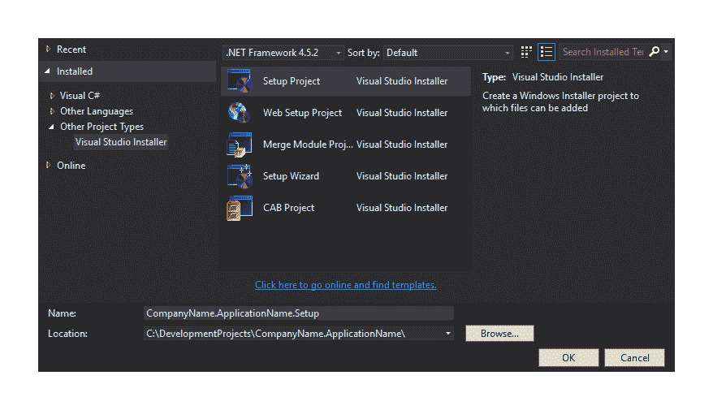
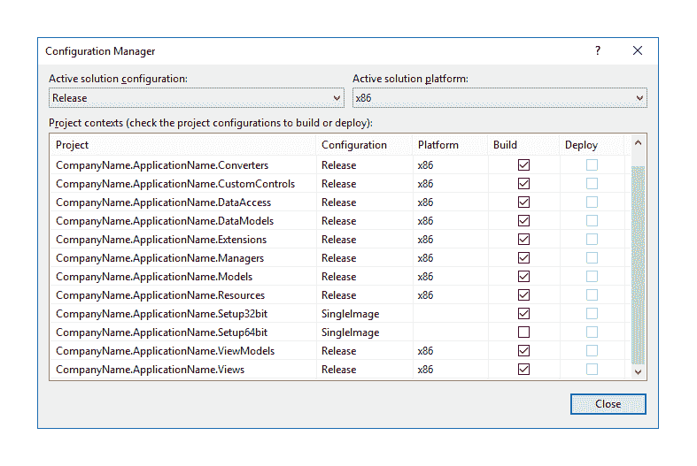
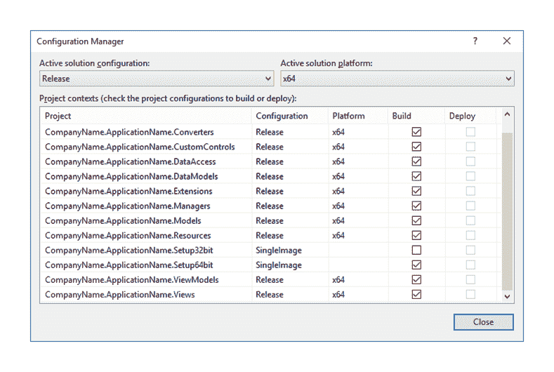
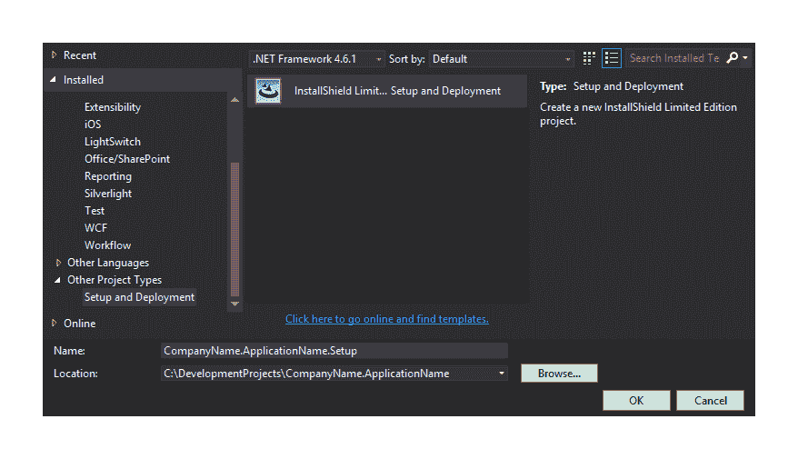
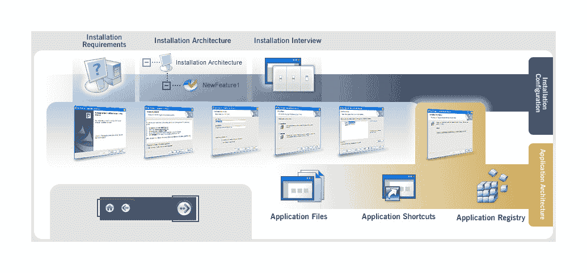
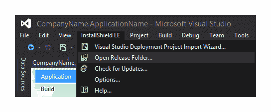
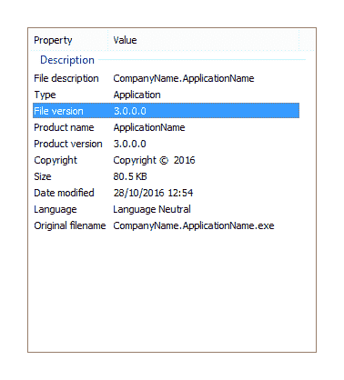

# 第十二章：部署您的杰作应用程序

因此，我们已经设计和构建了我们的应用程序框架、资源和管理者，添加了我们的模型、视图和视图模型，在完成应用程序的开发后，现在是部署的时候了。在本章中，我们将概述部署 WPF 应用程序的三个主要方法。

我们将首先研究原始的 Windows 设置项目方法，然后继续了解更新的 InstallShield Limited Edition 项目方法，最后将检查推荐的 ClickOnce 技术。

# 安装 Windows 应用程序

在过去的日子里，在 Visual Studio 中创建设置和部署项目是一个令人困惑且复杂的过程。然而，正如.NET 中的几乎所有事情一样，多年的连续更新导致了这些项目创建方法的持续改进。

# 介绍设置项目

最近的部署技术使用起来更简单，提供了一种易于理解的方法来执行与早期技术相同的步骤。然而，在 Visual Studio 的旧版本中，我们可能只能访问旧的 Visual Studio Installer 项目类型，所以让我们首先研究标准的设置项目：



在解决方案中添加一个设置项目后，会打开一个页面，显示目标计算机上的文件系统。在这个文件系统编辑器页面上，我们可以指定我们想要安装的内容以及安装位置。页面分为两部分，左侧是用户计算机上要安装的文件夹树视图，右侧是它们的文件夹内容。默认情况下，左侧面板包含`应用程序`、`桌面`和`程序文件`文件夹。

如果我们希望使用其他预定义的位置，例如`字体`、`收藏夹`或`公共文件`文件夹，例如，那么我们可以右键单击这些面板的背景，并选择添加特殊文件夹选项。通常，我们会将带有我们公司名称的标准文件夹添加到`用户程序菜单`文件夹中，并在其中添加一个以我们的应用程序命名的文件夹。

然而，如果我们想要将我们的应用程序作为 64 位应用程序安装，那么我们需要使用此选项将 64 位的`程序文件`文件夹添加到安装位置。为此，我们需要在树视图顶部的目标计算机文件系统上右键单击，选择添加特殊文件夹选项，然后选择程序文件（64 位）文件夹项。

注意，我们只有在想要进行 64 位安装的情况下才应执行此步骤。然后我们需要将启动项目的项目输出设置为左侧面板中的文件夹，该文件夹代表我们的安装文件夹，无论是 32 位还是 64 位。

我们需要右键单击该文件夹，从上下文菜单中选择添加选项，然后选择与我们的`CompanyName.ApplicationName`项目相关的项目输出选项。完成此操作后，我们将看到从其`bin`文件夹中的可执行文件和其他依赖文件被包含在我们的所选应用程序文件夹中。

接下来，我们可以通过在右侧窗格中右键单击项目输出的图标并从菜单中选择从 CompanyName.ApplicationName（活动）创建快捷方式到主要输出选项来在安装了应用程序的机器上创建应用程序的快捷方式。

我们需要给它与我们的应用程序相同的名称，并为其设置一个图标，这可以在其属性窗口中完成。然后我们可以点击并拖动，或者复制并粘贴到`用户桌面`文件夹，或者我们希望快捷方式出现的任何文件夹。

除了可执行文件和快捷方式文件外，我们还可以在左侧窗格中右键单击一个文件夹，从上下文菜单中选择添加选项，然后选择文件夹和/或文件选项，并选择我们可能需要在用户的计算机上安装的任何其他文件。一旦我们完成配置文件系统编辑器，我们可以在解决方案资源管理器中右键单击项目节点，并从视图菜单中选择另一个页面进行编辑。

注册表编辑器页面接下来，它使我们能够在宿主计算机的 Windows 注册表中进行条目。左侧窗口区域充当目标计算机的注册表视图，我们可以像使用注册表编辑器一样使用它来添加新键。此页面还允许我们在右键单击空白区域并选择导入时，从`.reg`文件导入注册表键。

文件类型编辑器页面位于视图菜单中，它使我们能够将我们可能创建的任何自定义文件类型与我们的应用程序关联起来。在这样做之后，安装完成后，每当点击此页面上指定类型之一的文件时，Windows 都会打开我们的应用程序。

安装项目使我们能够在安装过程中显示多个默认对话框，例如欢迎、确认和完成对话框。它还提供了重新排序或删除这些默认对话框的能力，或者从预定义列表中添加新的对话框。每个对话框都提供图像字段和不同的选项，例如是否应显示进度条，或在安装的不同阶段显示什么文本。这是在用户界面页面上实现的。

自定义操作编辑器页面使我们能够指定包含特定形式代码的程序集，这些代码可以在应用程序安装后运行。这些操作可以是任何事情，例如弹出一个小表单并提供用户一些配置选项，或者简单地安装完成后打开特定的网页。

设置项目视图菜单中的最后一个选项打开启动条件编辑器页面。在这里，我们可以指定必须满足的先决条件，以便应用程序可以被安装。例如，我们可能需要安装特定版本的.NET Framework，或者主机计算机具有特定的注册表键设置。

一旦所有项目页面都适当完成，我们只需构建设置和部署项目以生成设置文件。然而，我们需要确保我们正确构建它，这取决于我们在文件系统编辑器页面上的选择。

例如，如果我们想要有多个设置项目，比如说包括 32 位和 64 位安装，那么我们只需要在 32 位解决方案平台上构建设置项目的 32 位版本，并在 64 位解决方案平台上只构建 64 位版本。

我们可以在 Visual Studio 的配置管理器中完成此操作，我们可以从解决方案配置或解决方案平台下拉控件中的最后一个选项打开它。如果`x86`和`x64`解决方案平台尚未存在，我们可以通过在配置管理器对话框窗口中的解决方案平台下拉控件中选择<新建...>选项来添加它们。

要在打开的新解决方案平台对话框中添加新的解决方案平台，请在类型或选择新平台字段中键入`x86`或`x64`，从复制设置下拉控件中选择<空>选项，并确保已勾选创建新项目平台复选框。

一旦我们有了这两个解决方案平台，我们可以在配置管理器对话框窗口中的活动解决方案平台下拉控件中逐个选择它们，并勾选和取消勾选相关的设置项目。

这里是选择`x86`解决方案的截图：



这里是选择`x64`解决方案的截图：



注意，我们必须在解决方案配置下拉菜单中选择发布，然后构建我们的项目以生成设置文件。如果我们正确设置了构建配置，那么构建`x86`解决方案平台将生成 32 位设置文件，而构建`x64`解决方案平台将生成 64 位设置文件。

当活动解决方案配置设置为调试时，取消勾选所有解决方案平台上的部署项目构建复选框可能很有用。这样做将阻止在调试时每次构建解决方案时重新生成部署文件，因此可以在未来的开发中节省时间。

# 使用 InstallShield Limited Edition 项目

在 Visual Studio 的现代版本中添加设置项目时，我们需要从左侧窗格中添加新项目对话框窗口的“其他项目类型”类别中的“设置和部署”项目类型中选择 InstallShield 有限版项目：



注意，此项目类型已包含在所有付费版本的 Visual Studio 中，但使用免费版本的用户在选择项目类型后可能会被引导到网站下载此功能。

一旦安装完成并且项目已成功添加，Visual Studio 中将打开一个帮助向导，或者像 InstallShield 喜欢称呼的那样，打开项目助理窗口，以协助配置安装项目的流程。它将我们引导通过创建安装程序时可能需要执行的各种任务，一页一页地进行：



每一页都被分为两个窗口面板；右侧面板包含我们将要编辑的各种字段，以设置部署所需的规格，而左侧面板包含与每一页相关的附加选项和上下文帮助主题。

项目助理的第一页是申请信息页面，在这里我们可以提供关于申请的一般信息，例如公司名称和网站、申请名称和版本，以及与申请一起显示的图标。

安装要求页面使我们能够选择一个或多个与我们的应用程序兼容的特定操作系统。除此之外，我们还可以指定我们的应用程序依赖于一个现有的第三方软件列表，例如 Adobe Reader、各种版本的.NET Framework 以及许多 Microsoft 产品。

虽然这个列表很短，但它确实包含了最可能需要的先决软件名称。然而，还有一些额外的选项，其中之一允许我们创建自定义安装要求。点击此选项后，系统搜索向导打开，并允许我们通过文件夹路径、注册表键或通过.ini 文件值来搜索额外的安装要求，并允许我们选择在安装过程中如果新要求未满足时会发生什么。

下一个页面是应用程序文件页面，在这里我们可以将任何必需的应用程序文件添加到安装中。页面分为两部分，左侧是用户计算机上要安装的文件夹树视图，右侧是文件夹内容。左侧面板包含最常用的预定义文件夹列表，例如`App Data`、`Common`和`Program Files`文件夹。

如果我们需要使用其他预定义的位置，例如“桌面”、“收藏夹”或“我的图片”文件夹等，那么我们可以在这个面板上右键单击一个项目并选择显示预定义文件夹选项。实际上，如果我们想将我们的应用程序作为 64 位应用程序安装，那么我们需要使用这个选项来添加 64 位的“程序文件”文件夹，类似于设置项目。

为了做到这一点，我们可以在树视图的顶部右键单击“目标计算机”项，选择显示预定义文件夹选项，然后选择`ProgramFiles64Folder`项。然后我们需要将启动项目的项目输出设置为左侧面板中代表我们的安装文件夹的文件夹。请注意，它将附加`[INSTALLDIR]`后缀，在我们的情况下，将被命名为`ApplicationName`。

我们应该点击“添加项目输出”按钮并选择与我们的`CompanyName.ApplicationName`项目相关的“主要输出”选项，以便在部署中包含其`bin`文件夹中的 DLL 和其他依赖文件。如果需要，我们可以右键单击添加的输出项以选择进一步属性，或者如果我们正在使用应用程序中的 COM 对象。

接下来是应用程序快捷方式页面，在这里我们可以控制安装将在用户的计算机上包含哪些自定义快捷方式。请注意，默认快捷方式将自动添加到我们指定的可执行文件中，但这一页使我们能够删除这些快捷方式，以及添加新的快捷方式，甚至指定卸载快捷方式或替代图标。

应用程序注册表页面紧随其后，使我们能够在我们应用程序安装的计算机的 Windows 注册表中进行条目。左侧窗口面板反映了目标计算机的注册表视图，我们可以以相同的方式使用它来添加新键。此页面还允许我们从`.reg`文件导入注册表键并打开源计算机的注册表编辑器。

最后一个页面是安装访谈页面，在这里我们可以指定在安装过程中向用户显示哪些对话框屏幕。在这里，我们可以选择性地上传一个**富文本格式**（**RTF**）格式的最终用户许可协议文件，要求用户同意。

此外，我们可以提示用户输入他们的用户名和公司名称，并为他们提供选择安装位置以及安装完成后是否打开应用程序的选项。我们还可以从这一页指定在这些对话框窗口中显示的自定义图片。

一旦所有项目助手页面都适当完成，我们只需构建设置和部署项目以生成设置文件。然而，我们需要确保正确构建它，这取决于我们在项目助手中所做的选择。

当在 Visual Studio 的解决方案资源管理器中使用并聚焦于 InstallShield Limited Edition 项目时，我们会得到一个额外的 InstallShield LE 菜单项，在其中我们可以找到一个打开发布文件夹...选项。点击此选项将打开一个文件夹窗口，显示设置项目文件夹，在其中我们可以找到要分发给用户的安装文件：



# 利用 ClickOnce 功能

ClickOnce 是一种应用程序部署技术，它使我们能够部署那些可以通过最小化与最终用户的交互来安装、运行和更新的应用程序。实际上，ClickOnce 这个名字来源于一个理想场景，即每个应用程序都可以通过单次点击来安装。

每个 ClickOnce 应用程序都会部署到主机计算机上的一个独立区域，而不是使用其他部署技术所使用的标准程序文件文件夹中。此外，它们只授予应用程序所需的精确安全权限，因此通常也可以由非管理员用户安装。

使用 ClickOnce 的另一个好处是它使应用程序可以从网页、网络文件夹或物理媒体安装。我们还可以指定使用 ClickOnce 安装的应用程序应定期检查更新，并且可以由最终用户轻松更新，无需管理员在场。

ClickOnce 部署包含应用程序清单和部署清单。应用程序清单包含有关应用程序的详细信息，例如其依赖项、所需的安全权限以及更新将可用的位置。部署清单包含有关部署的详细信息，例如应用程序清单的位置和应用程序的目标版本。

ClickOnce 现在是部署应用程序的首选方法，并且已经直接集成到我们的启动项目属性中。我们可以通过在解决方案资源管理器中右键单击 `CompanyName.ApplicationName` 项目并选择属性选项，通过打开项目节点并双击属性项，或者通过选择项目节点并按键盘上的 *Alt* + *Enter* 键来打开属性窗口。

在项目属性窗口中，我们可以在发布选项卡中找到 ClickOnce 配置字段。在这个选项卡中，我们可以设置发布文件夹的位置为网络共享文件夹或 FTP 服务器。这表示文件将被发布到的位置。可选地，我们还可以指定用户将从中安装应用程序的位置，如果这将是不同的。

我们可以指定安装模式应使应用程序仅在网络上可用，就像一个 Web 应用程序，或者也可以离线使用，就像一个典型的桌面应用程序。在此部分，我们还有“应用程序文件”按钮，点击它将打开一个对话框窗口，我们可以指定要包含在部署中的哪些附加文件。

默认情况下，所有当前构建到`bin`文件夹中的文件都将被包含，但如果我们愿意，我们可以排除它们。或者，我们可以通过在属性窗口中将它们的构建操作设置为“内容”来从解决方案资源管理器添加新文件。我们还可以指定任何可执行文件是否是先决条件，或者任何其他文件类型是否是数据文件。然而，这些设置会自动进行，除非我们有具体要求，否则我们不需要在此处进行更改。

接下来，我们看到“先决条件”按钮，点击它将打开一个对话框窗口，使我们能够创建一个设置程序来安装我们可能需要的任何先决组件，例如.NET 框架和 Windows Installer 软件。如果用户的计算机尚未安装所需的先决条件，我们可以指定安装程序应从何处获取它们。此对话框也会根据应用程序的要求自动填充。

为了指定安装的应用程序应检查更新，我们可以在“发布”选项卡中点击“更新”按钮后打开的对话框中勾选“应用程序应检查更新”复选框。我们还可以指定这是在应用程序启动之前还是之后，或者是在一定时间之后发生。

在“应用程序更新”对话框窗口中，我们还可以规定应用程序必须更新到特定版本，通过勾选“为此应用程序指定最小所需版本”复选框并设置版本。此外，如果我们希望更新位置与发布位置不同，我们还可以指定一个进一步的位置来获取更新。

最后，在“安装模式和设置”部分，我们来到了“选项”按钮，点击它将打开“发布选项”对话框窗口，在这里我们可以指定诸如出版商和产品名称、部署和清单设置等详细信息，并将我们的应用程序与自定义文件类型关联起来，以便在点击这些文件类型时打开。

部署选项使我们能够指定一个网页，用户可以使用该网页下载和安装我们的 ClickOnce 应用程序，尽管如果我们输入`default.html`，我们可以使用为我们生成的默认页面。我们还可以指定网页是否应自动打开，或者是否在发布应用程序后验证上传的文件。

发布选项卡中的最后一节是发布版本节，我们可以在此指定应用程序的当前版本。而不是每次发布时都手动更新，我们可以可选地勾选“每次发布自动递增修订版”复选框以自动更新修订版。

在本节中，我们有两种发布选项。发布向导按钮打开一个多页对话框窗口，它引导我们通过之前描述的许多更重要的选项，并以发布应用程序结束。虽然这对于我们第一次发布应用程序很有用，但我们通常在之后使用另一个选项，即“立即发布”按钮，它只是简单地发布应用程序。

# 保护部署

在项目属性窗口的安全选项卡上，我们可以指定应用程序所需的权限。为此，我们可以勾选“启用 ClickOnce 安全设置”复选框并选择我们的应用程序是完全信任还是部分信任应用程序。

对于典型的桌面应用程序，通常指定它是一个完全信任的应用程序，但否则我们可以指定所需的信任级别。请注意，除非应用程序发布者被设置为最终用户计算机上的受信任发布者，否则他们可能需要在安装过程中授予任何所需的权限。

如果我们指定我们的应用程序是部分信任应用程序，那么我们可以从包含特定权限组的预配置区域中选择，或者选择自定义权限，在这种情况下，我们可以在应用程序清单文件中直接手动指定所需的权限。

注意，即使我们已经将我们的应用程序指定为部分信任应用程序，我们在开发时通常具有完全信任。为了使用与应用程序所需的相同权限进行开发并因此看到与用户相同的错误，我们可以点击“高级”按钮并勾选“使用所选权限集调试此应用程序”复选框。

在项目属性窗口的签名选项卡上，我们可以可选地通过勾选“签名 ClickOnce 清单”复选框来对 ClickOnce 清单进行数字签名。如果我们有一个保存在计算机证书存储中的有效证书，那么我们可以通过点击“从存储选择”按钮来选择它，以使用它来签名 ClickOnce 清单。

或者，如果我们有一个**个人信息交换**（**PFX**）文件，我们可以通过点击“从文件选择”按钮并在打开的文件资源管理器中选择它来使用它来签署清单。如果我们目前没有有效的证书，我们可以通过点击“创建测试证书”按钮来可选地创建一个用于测试目的的证书。

然而，请注意，测试证书不应该与生产应用程序一起部署，因为它们不包含关于发布者的可验证信息。当使用测试证书安装 ClickOnce 应用程序时，用户将被告知发布者无法验证，并要求确认他们是否真的想要安装该应用程序。为了确保最终用户安心，应使用真实证书，并将副本存储在他们的受信任发布者证书存储中。

我们还可以通过勾选“签名程序集”复选框并从关联的下拉控件中选择一个**强名称密钥**（**SNK**）文件来可选地签名程序集。如果我们之前没有选择一个，我们可以从同一个下拉控件中添加一个新的。

这就完成了用于 ClickOnce 部署的配置页面的总结。它们提供了与其他部署技术几乎相同的设置，除了与已安装文件的位置和可能需要安装的安全权限有关的设置。现在让我们看看我们如何在非完全信任应用程序中安全地存储文件在宿主计算机上。

# 隔离存储

ClickOnce 可以直接由最终用户安装而无需管理员协助的原因之一是它被安装到一个自包含的生态系统中，该生态系统与其他所有程序都分开，并且通常与用户的其余计算机隔离。

当我们需要在本地存储数据时，如果我们没有将我们的应用程序指定为完全信任的应用程序，我们可能会遇到安全问题。在这些情况下，我们可以利用隔离存储，这是一种抽象硬盘上数据实际位置的数据存储机制，对用户和开发者来说都是未知的。

当我们使用隔离存储时，实际存储数据的数据隔室是由每个应用的某些方面生成的，因此它是唯一的。数据隔室包含一个或多个称为存储的隔离存储文件，它们引用实际数据存储的位置。每个存储中可以存储的数据量可以通过应用程序中的代码进行限制。

文件的实际物理位置将根据用户计算机上运行的操作系统以及存储是否启用了漫游而有所不同。对于自 Vista 以来的所有操作系统，位置在用户的个人用户文件夹中的隐藏`AppData`文件夹中。在此文件夹中，它将位于`Local`或`Roaming`文件夹中，具体取决于存储的设置：

```cs
<SYSTEMDRIVE>\Users\<username>\AppData\Local 
<SYSTEMDRIVE>\Users\<username>\AppData\Roaming 
```

我们可以在隔离存储中存储任何类型的文件，但作为一个例子，让我们看看我们如何利用它来存储文本文件。让我们首先看看我们将使用的界面：

```cs
namespace CompanyName.ApplicationName.Managers.Interfaces
{
  public interface IHardDriveManager
  {
    void SaveTextFile(string filePath, string fileContents);

    string ReadTextFile(string filePath);
  }
}
```

现在让我们看看接口的具体实现：

```cs
using CompanyName.ApplicationName.Managers.Interfaces;
using System.IO; 
using System.IO.IsolatedStorage; 

namespace CompanyName.ApplicationName.Managers 
{ 
  public class HardDriveManager : IHardDriveManager 
  { 
    private IsolatedStorageFile GetIsolatedStorageFile() 
    { 
      return IsolatedStorageFile.GetStore(IsolatedStorageScope.User |      
        IsolatedStorageScope.Assembly | IsolatedStorageScope.Domain,
        null, null); 
    } 

    public void SaveTextFile(string filePath, string fileContents) 
    { 
      try 
      { 
        IsolatedStorageFile isolatedStorageFile = GetIsolatedStorageFile(); 
        using (IsolatedStorageFileStream isolatedStorageFileStream =
          new IsolatedStorageFileStream(filePath, FileMode.OpenOrCreate, 
          isolatedStorageFile)) 
        { 
          using (StreamWriter streamWriter =  
            new StreamWriter(isolatedStorageFileStream)) 
          { 
            streamWriter.Write(fileContents); 
          } 
        } 
      } 
      catch { /*Log error*/ } 
    } 

    public string ReadTextFile(string filePath) 
    { 
      string fileContents = string.Empty; 
      try 
      { 
        IsolatedStorageFile isolatedStorageFile = GetIsolatedStorageFile(); 
        if (isolatedStorageFile.FileExists(filePath)) 
        { 
          using (IsolatedStorageFileStream isolatedStorageFileStream =
            new IsolatedStorageFileStream(filePath, FileMode.Open, 
            isolatedStorageFile)) 
          { 
            using (StreamReader streamReader =  
              new StreamReader(isolatedStorageFileStream)) 
            { 
              fileContents = streamReader.ReadToEnd(); 
            } 
          } 
        } 
      } 
      catch { /*Log error*/ } 
      return fileContents; 
    } 
  } 
} 
```

与其他管理类一样，我们在`CompanyName.ApplicationName.Managers`命名空间中声明`HardDriveManager`类。在私有的`GetIsolatedStorageFile`方法中，我们通过调用`IsolatedStorageFile`类的`GetStore`方法来获取与我们将要保存用户数据的隔离存储存储相关的`IsolatedStorageFile`对象。

此方法有多个重载版本，使我们能够指定用于生成唯一隔离存储文件的范围、应用程序标识、证据和证据类型。在这个例子中，我们使用了一个重载，它接受`IsolatedStorageScope`枚举成员的位组合以及域和程序集证据类型，我们简单地传递`null`。

此处的范围输入参数很有趣，需要一些解释。隔离存储始终限制在创建存储时登录并使用应用程序的用户。然而，它也可以限制到程序集的身份，或者到程序集和应用域的组合。

当我们调用`GetStore`方法时，它获取与传递的输入参数相对应的存储。当我们传递`User`和`Assembly``IsolatedStorageScope`枚举成员时，这会获取一个可以在相同用户使用的情况下共享同一程序集的应用程序之间的存储。通常，这在内部网络安全区域是允许的，但在互联网区域则不允许。

当我们传递`User`、`Assembly`和`Domain``IsolatedStorageScope`枚举成员时，这会获取一个只能由创建存储的应用程序运行的用户访问的存储。这是大多数应用程序的默认和最常见的选择，因此这些枚举成员被用于我们的示例中。

注意，如果我们想启用用户使用漫游配置文件但仍能从他们的隔离存储文件中访问数据，那么我们可以另外包含`Roaming`枚举成员与其他成员一起。

现在回到`HardDriveManager`类，在`SaveTextFile`方法中，我们首先调用`GetIsolatedStorageFile`方法来获取`IsolatedStorageFile`对象。然后，我们使用由`filePath`输入参数指定的文件名、`FileMode`枚举的`OpenOrCreate`成员以及存储文件对象来初始化一个`IsolatedStorageFileStream`对象。

接下来，我们使用`IsolatedStorageFileStream`变量初始化一个`StreamWriter`对象，并使用`StreamWriter`类的`Write`方法将`fileContents`输入参数中的数据写入流中指定的文件。同样，我们将此操作放在`try...catch`块中，通常会记录可能从这个方法抛出的任何异常，但在这里为了简洁省略了这一步骤。

在`ReadTextFile`方法中，我们将`fileContents`变量初始化为空字符串，然后从`GetIsolatedStorageFile`方法中获取`IsolatedStorageFile`对象。在尝试访问之前，我们验证由`filePath`输入参数指定的文件实际上是否存在。

然后，我们使用`filePath`输入参数指定的文件名、`FileMode`枚举的`Open`成员以及隔离存储文件初始化一个`IsolatedStorageFileStream`对象。

接下来，我们使用`IsolatedStorageFileStream`变量初始化一个`StreamReader`对象，并使用`StreamReader`对象的`Read`方法将流中指定的文件数据读取到`fileContents`输入参数中。同样，这一切都包含在一个`try...catch`块中，最后，我们返回包含文件数据的`fileContents`变量。

为了使用它，我们必须首先使用我们的`DependencyManager`实例将接口和我们的运行时实现之间的连接注册：

```cs
DependencyManager.Instance.Register<IHardDriveManager, HardDriveManager>();
```

然后，我们可以从我们的`BaseViewModel`类中公开对新的`IHardDriveManager`接口的引用，并使用`DependencyManager`实例解决它：

```cs
public IHardDriveManager HardDriveManager 
{ 
  get { return DependencyManager.Instance.Resolve<IHardDriveManager>(); }
} 
```

然后，我们可以使用它将文件保存到隔离存储中，或从任何视图模型中读取文件。

```cs
HardDriveManager.SaveTextFile("UserPreferences.txt", "AutoLogIn:True");

...

string preferences = HardDriveManager.ReadTextFile("UserPreferences.txt"); 
```

实际上，如果我们以这种方式保存用户偏好，它们通常会存储在一个 XML 文件中，或者存储在一种更容易解析的格式中。然而，为了本例的目的，一个普通的字符串就足够了。

除了在隔离存储中保存和加载文件外，我们还可以删除它们，添加或删除文件夹以更好地组织数据。我们可以在`HardDriveManager`类和`IHardDriveManager`接口中添加更多方法，以便我们能够从用户的隔离存储中操作文件和文件夹。现在让我们看看我们如何做到这一点：

```cs
public void DeleteFile(string filePath) 
{ 
  try 
  { 
    IsolatedStorageFile isolatedStorageFile = GetIsolatedStorageFile(); 
    isolatedStorageFile.DeleteFile(filePath); 
  } 
  catch { /*Log error*/ } 
} 

public void CreateFolder(string folderName) 
{ 
  try 
  { 
    IsolatedStorageFile isolatedStorageFile = GetIsolatedStorageFile(); 
    isolatedStorageFile.CreateDirectory(folderName); 
  } 
  catch { /*Log error*/ } 
} 

public void DeleteFolder(string folderName) 
{ 
  try 
  { 
    IsolatedStorageFile isolatedStorageFile = GetIsolatedStorageFile(); 
    isolatedStorageFile.DeleteDirectory(folderName); 
  } 
  catch { /*Log error*/ } 
} 
```

简单来说，`DeleteFile`方法通过`GetIsolatedStorageFile`方法访问`IsolatedStorageFile`对象，然后调用其`DeleteFile`方法，传入要删除的文件名称，该名称由`filePath`输入参数指定，并在另一个`try...catch`块中执行。

同样，`CreateFolder`方法通过`GetIsolatedStorageFile`方法获取`IsolatedStorageFile`对象，然后调用其`CreateDirectory`方法，传入要创建的文件夹名称，该名称由`folderName`输入参数指定，并在一个`try...catch`块中执行。

同样，`DeleteFolder`方法通过调用`GetIsolatedStorageFile`方法获取`IsolatedStorageFile`对象，然后调用其`DeleteDirectory`方法，传入要删除的文件夹名称，该名称由`folderName`输入参数指定，并在另一个`try...catch`块中执行。

现在，让我们调整之前的示例，以展示我们如何使用这项新功能：

```cs
HardDriveManager.CreateFolder("Preferences"); 
HardDriveManager.SaveTextFile("Preferences/UserPreferences.txt", 
  "AutoLogIn:True"); 

...

string preferences = 
  HardDriveManager.ReadTextFile("Preferences/UserPreferences.txt"); 

...

HardDriveManager.DeleteFile("Preferences/UserPreferences.txt"); 
HardDriveManager.DeleteFolder("Preferences"); 
```

在这个扩展示例中，我们首先在隔离存储存储中创建一个名为`Preferences`的文件夹，然后通过在文件名前加上文件夹名称并用正斜杠分隔来保存该文件夹中的文本文件。

在稍后的阶段，我们可以通过将相同的文件路径传递给`ReadTextFile`方法来读取文件的全部内容。如果我们需要在之后清理存储，或者如果文件是临时的，我们可以通过将相同的文件路径传递给`DeleteFile`方法来删除它。注意，我们必须首先删除存储中文件夹的内容，然后才能删除该文件夹本身。

还要注意，我们可以在隔离存储存储中通过在文件路径中链接它们的名称来创建子目录。例如，我们可以在名为`Preferences`的文件夹中创建一个`Login`文件夹，只需将子目录名称追加到父文件夹名称的末尾，并用正斜杠再次分隔即可：

```cs
HardDriveManager.CreateFolder("Preferences"); 
HardDriveManager.CreateFolder("Preferences/Login"); 
HardDriveManager.SaveTextFile("Preferences/Login/UserPreferences.txt",  
  "AutoLogIn:True"); 
```

这就结束了我们对.NET 中隔离存储文件的探讨。但在结束这一章之前，让我们简要地关注一下如何访问我们的各种应用程序版本，以及它们之间到底有什么联系。

# 访问应用程序版本

在.NET 中，一个应用程序有多个不同的版本，因此我们有多种不同的方式来访问它们。我们之前讨论的版本号，可以在项目属性的发布选项卡中的发布版本部分找到，可以使用`System.Deployment` DLL 中的`ApplicationDeployment`类来找到：

```cs
using System.Deployment.Application;

...

private string GetPublishedVersion() 
{ 
  if (ApplicationDeployment.IsNetworkDeployed) 
  { 
    return 
      ApplicationDeployment.CurrentDeployment.CurrentVersion.ToString(); 
  } 
  return "Not network deployed"; 
} 
```

注意，在我们能够访问`ApplicationDeployment`类的`CurrentVersion`属性之前，我们需要验证应用程序实际上已经被部署，否则将抛出`InvalidDeploymentException`异常。这意味着我们无法在调试我们的 WPF 应用程序时获取已发布的版本，因此在这些情况下，我们应该返回其他一些值。

为了查看剩余的应用程序版本，我们首先需要访问我们想要知道版本的程序集。我们用来访问程序集的代码将取决于我们在代码中的当前位置。例如，我们通常想显示启动程序集的版本，但我们可能想从`ViewModels`项目中的视图模型访问它。

我们有多种方式访问程序集，这取决于它们与调用代码的相对位置。如果我们想从启动项目访问启动程序集，那么在添加以下命名空间的`using`语句后，我们可以使用`Assembly.GetExecutingAssembly`方法：

```cs
using System.Diagnostics; 
using System.Reflection; 
```

要从不同的项目访问相同的程序集，我们可以使用`Assembly.GetEntryAssembly`方法。或者，我们可以使用`Assembly.GetCallingAssembly`方法从不同的项目访问启动项目的程序集（如果该项目是从启动程序集调用的）。对于这里剩余的示例，我们将使用`GetEntryAssembly`方法。

除了已发布的版本外，我们可能还需要访问应用程序的组件或文件版本。我们可以在项目属性窗口的应用程序选项卡中访问的组件信息对话框中设置的组件版本，可以通过以下代码从组件中访问：

```cs
string assemblyVersion = 
  Assembly.GetEntryAssembly().GetName().Version.ToString(); 
```

组件版本由.NET Framework 用于在构建和运行时加载和链接对其他组件的引用。这是在 Visual Studio 中将引用添加到我们的项目时嵌入的版本，如果在构建过程中发现版本不正确，则会引发错误。

注意，我们还可以使用项目`AssemblyInfo.cs`文件中的组件级别`AssemblyVersionAttribute`类设置此值，该文件可以在解决方案资源管理器中的项目属性节点中找到。

与直接将返回的`Version`对象转换为`string`相比，我们可能更喜欢访问构成版本号的各个组件。它们包括主版本、次要版本、构建和修订版本值。

然后，我们可以选择只输出主版本和次要版本，以及产品名称。以下是一个示例：

```cs
Version assemblyVersion = Assembly.GetEntryAssembly().GetName().Version; 
string productName = FileVersionInfo.GetVersionInfo( Assembly.GetEntryAssembly().Location).ProductName; 
string output = $"{productName}: Version {version.Major}.{version.Minor}"; 
```

如果我们需要文件版本，该版本用于非 ClickOnce 部署，我们可以将组件的位置传递给`FileVersionInfo`类的`GetVersionInfo`方法，如产品名称示例中所示的前面代码，但访问`FileVersion`属性：

```cs
string fileVersion = FileVersionInfo.GetVersionInfo( 
  Assembly.GetEntryAssembly().Location).FileVersion; 
```

注意，我们还可以在组件信息对话框中设置此值，或者使用项目`AssemblyInfo.cs`文件中的组件级别`AssemblyFileVersionAttribute`类。此版本可以在 Windows 资源管理器的文件属性对话框的详细信息选项卡中看到：



与组件一起分发的产品版本可以通过类似的方式访问：

```cs
string productVersion = FileVersionInfo.GetVersionInfo( 
  Assembly.GetEntryAssembly().Location).ProductVersion; 
```

注意，此版本也可以在 Windows 资源管理器的文件属性对话框的详细信息选项卡中看到，包括我们之前访问的产品名称。另外，请注意，在 WPF 应用程序中，此值通常来自组件文件版本。

# 摘要

在本章中，我们探讨了多种部署我们的 WPF 应用程序的方法。我们回顾了较旧的安装项目类型和 InstallShield Limited Edition 项目类型，但主要关注较新的 ClickOnce 技术。我们研究了 ClickOnce 部署是如何进行的，以及我们如何在隔离存储中安全地存储和访问数据。最后，我们探讨了在.NET 中访问我们可用的各种应用程序版本的方法。

在本书的最后一章中，我们将回顾本书涵盖的内容的摘要，并探讨您接下来可以做什么来继续这段旅程。我们将建议一些可能的扩展我们的应用程序框架的方法，以及您如何推进您的一般应用程序开发。
