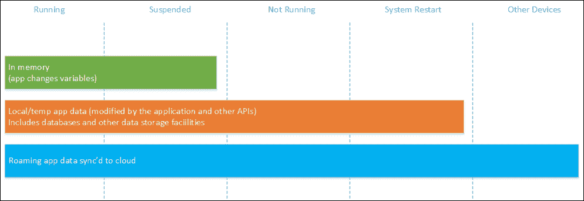
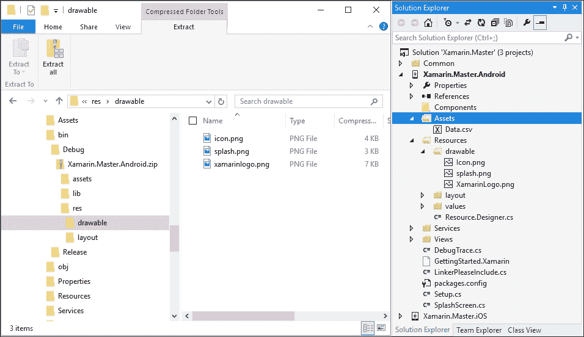
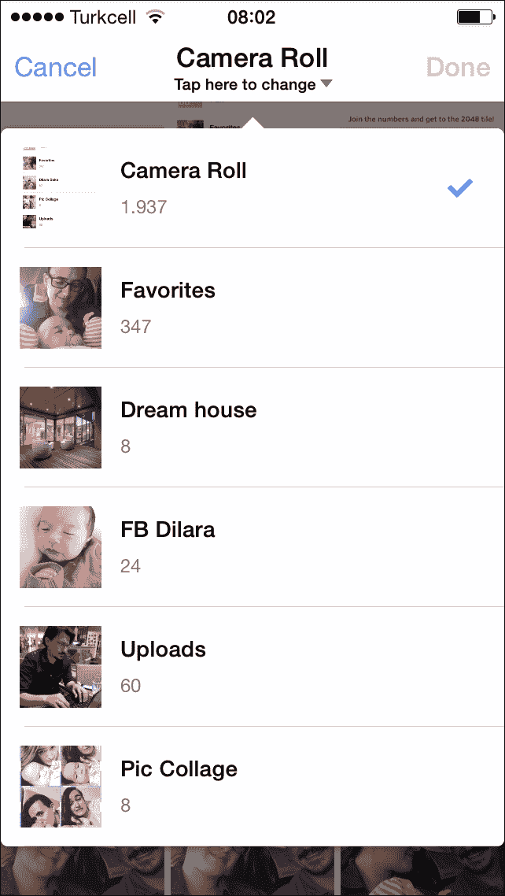
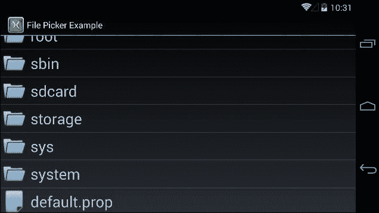
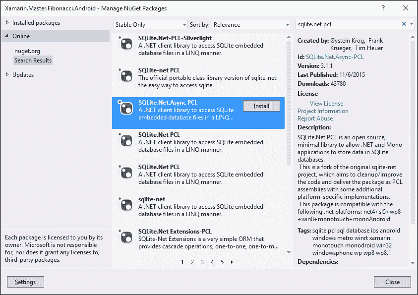
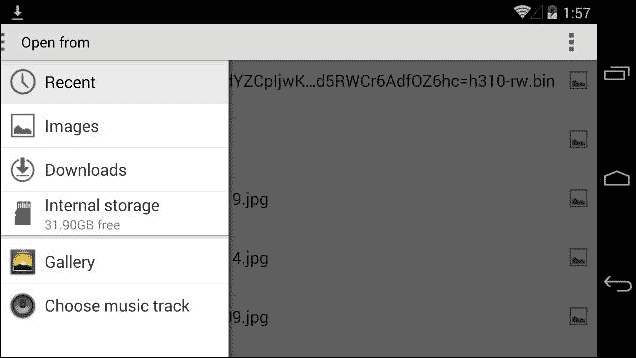
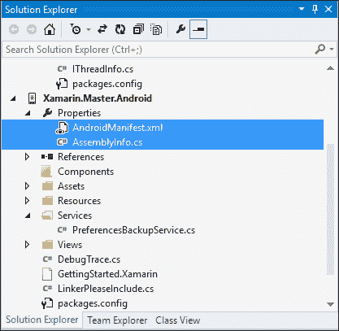
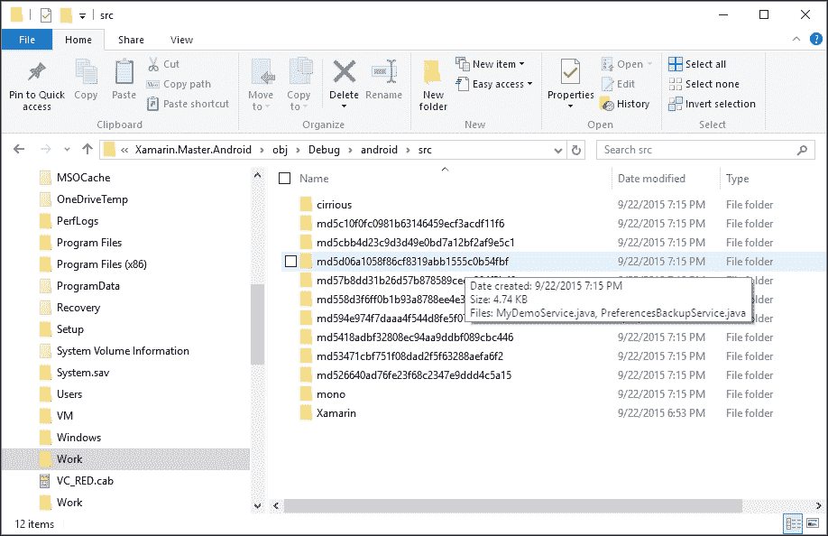

# 第四章：本地数据管理

在本章中，您将找到高效使用、管理和漫游移动设备上数据的模式和技巧。它还探讨了 SQLite 数据库的创建和使用策略。本章分为以下部分：

+   移动应用程序中的数据

+   应用程序数据

+   本地文件系统

+   数据漫游

+   SQLite

+   模式和最佳实践

+   备份/漫游

# 移动应用程序中的数据

在移动应用程序开发中，“数据”一词可以指代不同类型的信息和存储位置。它可以用来描述每次使用应用程序中的视图时创建和销毁的易失状态，或者它可能指的是运行应用程序所需的持久设置和配置信息，甚至可能是存储在本地文件系统中的数据。每种类型的数据在应用程序或应用程序中的视图的生命周期中创建、持久化或销毁。我们可以就这一点讨论四个不同的组。

每种数据类型都存储和访问于不同的位置，每个位置都有其独特的限制和访问模型。


数据类型存储位置

## 状态

移动应用程序通常是**有状态的**。用于在 UI 上可视化项目或由应用程序用户创建的数据属于这一类别。状态的目的在于在会话、设备以及/或进程生命周期中保持一致的 app 体验。应用程序设置或视图的当前状态是这一类别的良好例子。

## 应用数据

应用数据通常指的是执行应用程序所必需的数据。这些数据由应用程序本身创建、存储和管理。它可以是结构化数据存储，也可能是在线应用程序资源的缓存版本。这类数据可以是原始数据，以 SQLite 数据库的形式存在，或者由当前应用程序在当前设备上通过其他设施存储。

应用数据存储在不同的位置可以经历应用程序生命周期的不同阶段。



应用数据生命周期

## 本地文件

本地文件是存储在本地文件系统中的项目。这些文件通常在应用程序的生命周期和/或作用域之外创建，并且仅由应用程序使用。例如，用户拍摄的照片可以后来被邮件客户端应用程序用作附件项。

## 外部数据

外部数据可以描述为应用程序在运行时使用的所有其他数据源的组合。这可以包括网络或网络资源。

# 应用程序数据

应用程序数据构成了 Xamarin 平台和 Windows Runtime 上数据存储的核心。这些数据专属于您的应用程序。它们与它共存，最终消亡，在大多数情况下，它们对运行在同一设备上的其他应用程序甚至使用该应用程序的用户（至少直接）来说不相关或不可访问。

应用程序可以无限制地访问应用程序数据，或所谓的隔离存储，无需请求用户权限或添加声明，并且可以在大多数情况下根据应用程序数据位置的类型写入、读取和查询此存储中的项目。

## 安装目录

安装目录是可访问数据存储的最内层部分，是应用程序最亲密的位置。应用程序对此位置的访问不受限制，但仅限于读取。iOS、Android 和 Windows Runtime 上的访问模型差异很大。

### Android

对于 Xamarin.Android 应用程序，安装目录本质上指的是压缩的 Android 包（即`.apk`文件），而定义的子目录仅仅是打包并添加到编译时清单中的文件夹的抽象。安装目录和子目录可以通过多种方式访问。



Android 包和项目树

安装目录中对于 Android 应用程序最重要的位置是`Resources`文件夹。资源可以概括为用于渲染应用程序视图的 UI 相关项。可以包含在应用程序包中的资源类型之一是`drawable`类型。Drawable 资源是图像资源，可以根据应用程序运行的不同条件和使用设备存在不同的版本（参见第九章，*可重用 UI 模式*）。为了使编译器将资源包含到应用程序包中，此文件夹中每个项目的构建操作必须设置为`AndroidResource`。

### 注意

需要特别指出的是，Android 包不允许文件名包含大写字母，而 Xamarin 开发者可以将这类文件包含到他们的项目中。Xamarin.Android 通过在编译期间重命名资源来处理这个问题（例如，参见`drawable`文件夹中的`XamarinLogo.png`文件）。

通过编程方式，可以使用生成的`Resource`类来获取分配的资源 ID，或者使用提供访问方法的`Resources`静态类，或者使用`android.resource://`协议和资源标识符（或者包名与资源名称一起）。然而，在大多数情况下，仅使用分配的 ID 来使用与 UI 控件相关的资源就足够了。代码如下：

```cs
var myImageResourceId = Resource.Drawable.XamarinLogo;

var myImageView = (ImageView) FindViewById(Resource.Id.MyImageView);

// Set the Image resource using the id.
myImageView.SetImageResource(myImageResourceId);

// OR:

// Retrieving the resource itself and then assigning it.
Drawable myImageResource = Resources.GetDrawable(myImageResourceId);
myImageView.SetImageDrawable(myImageResource);
```

在声明式 UI（布局）中，可绘制资源文件夹可以通过别名`@drawable`访问。同样，字符串资源可以通过`@string`访问。代码如下：

```cs
<ImageView android:src="img/xamarinlogo" 
           android:layout_width="wrap_content" 
           android:layout_height="match_parent" />
```

安装目录中的另一个重要位置是`Assets`文件夹。`Assets`文件夹用于存放您希望与应用程序一起部署的任何原始资源（除了`Resources`文件夹），并且不会被编译器或运行时处理。可以使用`AssetManager`类检索资源，并且`Activity`类中的`Assets`属性可以用来访问`AssetManager`类。代码如下：

```cs
Task.Run(async () =>
{
    using (var dataPackageStream = Assets.Open("Data.csv"))
    using (var streamReader = new StreamReader(dataPackageStream))
    {
        var content = await streamReader.ReadToEndAsync();
        // TODO: Do something with the comma separated content.
    }
});
```

安装位置中的其他资源类型，如布局、原始和字符串资源，也可以使用 Android 运行时提供的抽象以这种方式访问。

### iOS

iOS 应用程序的构建单元，如可执行代码和相关资源，包含在一个所谓的**包**中。包是应用程序沙盒的一部分，包的路径在安装期间由操作系统确定。

与 Android 应用程序类似，iOS 应用程序项目也可以包含编译后的图像资源（包资源）。然后，使用运行时提供的抽象层来访问这些项。

例如，为了从包目录中访问图像资源，您需要在`UIImage`类上调用`FromFile`方法：

```cs
var image = UIImage.FromFile("XamarinLogo.png");

//
// OR making a roundtrip (get the path, read the file, create // image
// Similar to /data/Containers/Bundle/Application/<id>/XamarinMasteriOS.app/XamarinLogo.png
var imagePath = NSBundle.MainBundle.GetUrlForResource("XamarinLogo", "png").Path;
var fileContent = System.IO.File.ReadAllBytes(imagePath);

var secondImage = UIImage.LoadFromData(NSData.FromArray(fileContent));
```

### 注意

与 Android 应用程序的访问模型类似，包容器是只读的，不应修改。简单的原因是 iOS 应用程序包由发布者密钥签名，任何对包容器的更改都会使包签名无效。

## 本地存储

第二部分也有类似的情况。Android 和 iOS 运行时为应用程序数据提供不同的存储设施，无论是结构化数据还是原始内容文件。

### Android

在 Android 平台上，**Shared Preferences**和**Internal Storage**是两种本地存储选项。这两个选项有不同的访问模型，并且您的应用程序对这些位置有读写访问权限。

在 Android 平台上使用`SharedPreferences`是存储数据的最基本方式。此类提供了一个简单的持久字典实现，允许应用程序创建、修改和检索原始数据类型（即`boolean`、`float`、`int`、`long`、`string`和`string_array`）及其相关键。这些值的尺寸仅受数据类型本身限制。

### 提示

如其名所示，`SharedPreferences`通常用于存储用户选择的配置选项，并且跨用户会话持久化。还有一个基本活动实现`PreferenceActivity`，可以轻松创建和重用用于用户偏好的视图，该视图利用`SharedPreferences`来为应用程序提供服务。

`SharedPreferences` 类的使用模式很简单。为了使用活动的默认首选项或自定义偏好文件，`Activity` 类提供了专用方法：

```cs
// Retrieve an object for accessing private to this activity
ISharedPreferences myPreferences = GetPreferences(FileCreationMode.Private);

// Retrieve and hold the contents of the preference file 'MyCustomPreferences'
ISharedPreferences myCustomPreferences = GetSharedPreferences("MyCustomPreferences", FileCreationMode.Private);
```

在检索调用之后，如果偏好文件尚未存在，则会根据选择的 `FileCreationMode` 类创建该文件。要获取偏好条目的值，您可以使用该类提供的获取方法。代码如下：

```cs
var myStringValue = myCustomPreferences.GetString("MyStringValue", string.Empty);
var myIntValue = myCustomPreferences.GetInt("MyIntValue", default(int));
```

要编辑值，可以使用 `SharedPreferences` 类的 `Editor` 类。代码如下：

```cs
ISharedPreferencesEditor myEditor = myCustomPreferences.Edit();
myEditor.PutString("MyStringValue", myStringValue);
myEditor.PutInt("MyIntValue", myIntValue);

// Apply the current changes from the editor back 
// to the Singleton SharedPreferences class
myEditor.Apply();

// OR
// Commit the changes to the singleton instance 
// AND the disk immediately
myEditor.Commit();
```

**内部存储**是应用程序的专用存储。应用程序可以自由创建和检索此目录中的任何类型的文件（和文件夹）。

### 注意

`FileCreationMode` 是在 Android 运行时中使用的访问修饰符，用于定义文件的访问类型和权限级别。

+   **追加**: 如果文件已存在，则将数据写入现有文件的末尾而不是删除。这应该与 `Android.Content.Context.OpenFileOutput` 一起使用。

+   **启用预写日志记录**: 当此数据库的打开标志被设置时，数据库默认启用预写日志记录功能打开。

+   **多进程**: 在 Gingerbread（Android 2.3）及之前版本中是遗留行为，并且当针对这些版本时默认启用。对于针对更高 SDK 版本的程序，必须显式设置。当与 `SharedPreferences` 一起使用时，即使共享首选项实例已经加载到该进程中，也会检查磁盘上的文件是否有修改。当应用程序有多个进程访问同一文件时，这种行为是期望的。

+   **私有**: 这是默认的文件创建模式，其中创建的文件只能由调用应用程序（或所有共享相同用户 ID 的应用程序）访问。

+   **世界可读/世界可写**: 两者在 API 级别 17 中已弃用，因为存在安全漏洞，它们可能导致应用程序文件的可访问性。

此文件夹中的文件，如果没有任何清单声明，可以通过应用程序上下文上的指定方法或使用 Xamarin/Mono 的 IO 方法实现访问。代码如下：

```cs
// Creating a file in the application internal storage root
using(var fileStreamInRootPath = this.OpenFileOutput("FileInRootPath", FileCreationMode.Private))
using (var streamWriter = new StreamWriter(fileStreamInRootPath))
{
    streamWriter.Write("Hello World!");
}

//
// Reading the contents of the file
using(var fileStreamInRootPath = this.OpenFileInput("FileInRootPath"))
using (var streamReader = new StreamReader(fileStreamInRootPath))
{
    var stringContent = streamReader.ReadToEnd();
}

// Getting the file path.
// e.g.: /data/data/Xamarin.Master.Android/files/FileInRootPath
var filePath = FilesDir.AbsolutePath + "/" + "FileInRootPath";

// Using the Xamarin (Mono) implementation.
System.IO.File.AppendAllText(filePath, "\r\nAdditional Content");
var allText = System.IO.File.ReadAllText(filePath);
```

除了基本的 CRUD 操作外，您还可以创建额外的文件夹并枚举文件和文件夹。

### iOS

在 iOS 应用程序中最简单的数据存储选项是属性列表（`.plist` 文件）。这些文件旨在用于相对较小的数据量，这些数据可以用原始数据类型表示。它们可以定义为字典或数组，并以 XML 格式序列化和持久化。

您可以直接使用相关类（`NSArray` 和 `NSDictionary`）读取和写入属性列表。例如，一个简单的实现，创建和读取属性列表的代码可能如下所示（带有额外的诊断条目）：

```cs
myNSDictionary.WriteToFile(dictionaryPath, true);

Debug.WriteLine("File Contents:");
var fileContents = System.IO.File.ReadAllText(dictionaryPath);
Debug.WriteLine(fileContents);

var myNewNSDictionary = NSDictionary.FromFile(dictionaryPath);

Debug.WriteLine("Values read from plist:");
foreach (var key in myNewNSDictionary.Keys)
{
    var keyValue = myNewNSDictionary[key];
    Debug.WriteLine(string.Format("Value for the key '{0}' is '{1}'", key, keyValue));
}
```

上述实现的结果如下所示：

```cs
File Contents:
<?xml version="1.0" encoding="UTF-8"?>
<!DOCTYPE plist PUBLIC "-//Apple//DTD PLIST 1.0//EN" "http://www.apple.com/DTDs/PropertyList-1.0.dtd">
<plist version="1.0">
<dict>
 <key>firstKey</key>
 <string>firstValue</string>
 <key>secondKey</key>
 <string>secondValue</string>
 <key>thirdKey</key>
 <integer>8</integer>
</dict>
</plist>
Values read from plist:
Value for the key 'firstKey' is 'firstValue'
Value for the key 'secondKey' is 'secondValue'
Value for the key 'thirdKey' is '8'

```

当涉及到本地文件存储时，iOS 文件系统为应用程序预留了几个位置；从应用程序的角度来看，这些位置都有特定的用途。

+   `Documents/`：`Documents`库通常用于用户生成的内容。如果文件内容要向用户公开，则应使用此文件夹。此文件夹的内容由 iTunes 备份。

+   `Documents/Inbox`：`Inbox`文件夹是存储应用程序请求打开的文件的地方。应用程序可以读取和删除这些文件；它没有修改这些文档的权限。

+   `Library/`：`Library`文件夹是您不希望向用户公开的文件的根目录。应用程序可以在该目录中创建文件和额外的文件夹。

+   `Library/Application Support`：这个库文件夹中的子目录通常用于包含由您的应用程序管理的文件，例如配置文件、模板、保存的数据和购买内容。应将目的地为该文件夹的内容放置在具有应用程序捆绑标识符或公司 ID 的自定义子目录中。

+   `Library/Caches`：`Caches`文件夹用于存储非必需的应用程序创建的文件。

+   `Library/Preferences`：应用程序特定的首选项存储在这个文件夹中。然而，访问这个文件夹应通过首选项 API 进行。

+   `tmp/`：`tmp`文件夹是另一个非必需临时文件的位置。

可以使用`System.IO`命名空间和相关类访问这些库位置。

## 临时存储

临时存储和/或缓存目录是应用程序不需要任何特定权限的另一个位置。这是应用程序可以保存非必需文件以减少网络或处理时间的地方。这些文件夹的持久性不受操作系统的保证。

在 Android 和 iOS 系统中，指定的缓存和/或临时位置可以通过上下文属性访问，并且可以使用`System.IO`命名空间和相关类执行 CRUD 操作。

在 Android 上，可以通过上下文的`CacheDir`属性访问缓存目录：

```cs
// Path similar to /data/data/Xamarin.Master.Android/cache
var cacheFilePath = this.CacheDir.AbsolutePath + "/" + "CacheFile";

// Writing to the file
System.IO.File.AppendAllLines(cacheFilePath, new[] { "Cached Content" });

// Reading the file
var cachedContent = System.IO.File.ReadAllText(cacheFilePath);
```

在 iOS 上，有两个单独的位置用于临时文件（`/temp/`）和缓存文件（`Library/Caches/`）。缓存文件比临时数据持久化时间更长，但它们仍然可能被系统删除以释放磁盘空间。代码如下：

```cs
// getting the root application sandbox path
var documents = Environment.GetFolderPath (Environment.SpecialFolder.MyDocuments);
// paths to caches and temporary files directories.var cache = Path.Combine(documents, "..", "Library", "Caches");
var tmp = Path.Combine(documents, "..", "tmp");
```

这两个目录都没有备份或同步到 iCloud。

# 本地文件系统

在 iOS 上，应用程序无法以编程方式访问应用程序沙盒之外的外部文件（例如，iOS 应用程序无法以编程方式导航到用户的图片目录并选择文件）。本地文件系统和 iOS 应用程序沙盒之间的桥梁仅限于 iOS 8 之前的图片选择控制器。iOS 8 引入了新的文档选择控制器和文档提供者 API。在此交互模型中，实现文档提供者扩展的应用程序创建文档选择 UI，宿主应用程序使用提供的 UI 让用户选择在宿主应用程序执行中使用的文档（类似于 Windows 运行平台上的文件打开选择器和提供者功能）。



UIImagePickerController

对于 Android，除了仅适用于应用程序特定的本地文件存储之外，应用程序还可以访问两个其他位置：公共和私有外部存储（取决于硬件）。在此上下文中，外部存储指的是 SD 卡存储，这在 iOS 系统中不可用。在 Android 运行时，应用程序可以访问根路径（操作系统根路径）并遍历公共文件夹。

让我们看看 Android 文件系统中一些内部和外部路径返回的路径：

```cs
Trace.WriteLine(Environment.RootDirectory, "FileSystem");
Trace.WriteLine(Environment.DataDirectory, "FileSystem");

Trace.WriteLine(this.GetExternalFilesDir(Environment.DirectoryDownloads).AbsolutePath, "FileSystem");
Trace.WriteLine(this.GetExternalFilesDir(Environment.DirectoryDocuments).AbsolutePath, "FileSystem");

// Call with GetExternalFilesDir
Trace.WriteLine(this.GetExternalFilesDir(Environment.DirectoryMovies).AbsolutePath, "FileSystem");
Trace.WriteLine(this.GetExternalFilesDir(Environment.DirectoryMusic).AbsolutePath, "FileSystem");
Trace.WriteLine(this.GetExternalFilesDir(Environment.DirectoryPictures).AbsolutePath, "FileSystem");

Trace.WriteLine(Environment.GetExternalStoragePublicDirectory(Environment.DirectoryMovies).AbsolutePath, "FileSystem");
Trace.WriteLine(Environment.GetExternalStoragePublicDirectory(Environment.DirectoryMusic).AbsolutePath, "FileSystem");
Trace.WriteLine(Environment.GetExternalStoragePublicDirectory(Environment.DirectoryPictures).AbsolutePath, "FileSystem");

Trace.WriteLine(Environment.DownloadCacheDirectory, "FileSystem");
Trace.WriteLine(Environment.ExternalStorageDirectory, "FileSystem");
```

这些调用的输出标识了应用程序特定和公共位置：

```cs
I/mono-stdout(10079): FileSystem: /system
I/mono-stdout(10079): FileSystem: /data
I/mono-stdout(10079): FileSystem: /storage/emulated/0/Android/data/Xamarin.Master.Android/files/Download
I/mono-stdout(10079): FileSystem: /storage/emulated/0/Android/data/Xamarin.Master.Android/files/Documents
I/mono-stdout(10079): FileSystem: /storage/emulated/0/Android/data/Xamarin.Master.Android/files/Movies
I/mono-stdout(10079): FileSystem: /storage/emulated/0/Android/data/Xamarin.Master.Android/files/Music
I/mono-stdout(10079): FileSystem: /storage/emulated/0/Android/data/Xamarin.Master.Android/files/Pictures
I/mono-stdout(10079): FileSystem: /storage/emulated/0/Movies
I/mono-stdout(10079): FileSystem: /storage/emulated/0/Music
I/mono-stdout(10079): FileSystem: /storage/emulated/0/Pictures
I/mono-stdout(10079): FileSystem: /cache
I/mono-stdout(10079): FileSystem: /storage/emulated/0
```

尽管 Android 开发者可以访问大量存储访问方法选项，但他们需要实现自己的文件选择对话框或使用其他已安装应用程序提供的接口（Android 运行时还提供了应用程序之间的提供者-消费者类型的文件共享实现）。



一个示例文件浏览器实现（Xamarin 食谱）

如果有一个默认处理文件对话框的应用程序（可以处理`ActionGetContent`意图的活动），则可以通过意图调用它，并且可以通过`OnActivityResult`回调方法访问结果。

# SQLite

SQLite 数据库实现为移动应用程序项目提供关系型持久化数据结构。与关系数据库使用的通用服务器/客户端模型不同，SQLite 是一个本地数据库实现，数据存储在应用程序本地存储中。Xamarin.iOS 和 Xamarin.Android 应用程序项目都可以包含 SQLite 数据库及其相关实现。

为了使用 SQLite，开发者需要在跨平台实现 ADO.Net 之间进行选择，其中 SQL 查询应创建并作为纯文本包含，或者使用 SQLite.Net 便携式类库的 linq-2-entities 访问模型。它作为 NuGet 包和组件提供。



SQLite.Net PCL

对于以下演示，我们将使用 SQLite.Net 库的异步版本。

使用 SQLite.Net 实现 SQLite 数据访问层通常遵循代码优先的数据库编程范式。在这个模式中，开发者首先通过创建实体类并使用提供的属性定义数据结构来定义他们的数据模型。代码如下：

```cs
public class LocationInfo
{
    [PrimaryKey, AutoIncrement]
    public int LocationInfoId { get; set; }

    public string Name { get; set; }

    public double Latitude { get; set; }

    public double Longitude { get; set; }
}
```

一旦完成数据模型实现，我们就可以开始创建 SQLite 访问方法。

为了创建一个 SQLite 连接，首先需要为数据库文件定义一个应用程序存储位置。代码如下：

```cs
public TravelContext(string sqlitePath, ISQLitePlatform platform)
{
    var connectionString = new SQLiteConnectionString(sqlitePath, false);
    var connectionWithLock = new SQLiteConnectionWithLock(platform, connectionString);
    m_SqliteConnection = new SQLiteAsyncConnection(() => connectionWithLock);

    // OR with non-async connection
    //var connection = new SQLiteConnection(platform, sqlitePath);
}
```

在这个实现中，`ISQLitePlatform`提供了平台特定 API 所需的抽象。

当 SQLite 连接准备好使用时，我们可以实现数据表的访问和创建方法。代码如下：

```cs
private void InitTablesAsync()
{
    var tasks = new List<Task<CreateTablesResult>>();

    tasks.Add(m_SqliteConnection.CreateTableAsync<LocationInfo>());
    tasks.Add(m_SqliteConnection.CreateTableAsync<City>());
    tasks.Add(m_SqliteConnection.CreateTableAsync<Landmark>());
    tasks.Add(m_SqliteConnection.CreateTableAsync<Comment>());

    // OR
    //var initTask = m_SqliteConnection.CreateTablesAsync<LocationInfo, City, Landmark, Comment>();

    var initTask = Task.WhenAll(tasks);
    initTask.ConfigureAwait(false);
}
```

我们现在可以通过数据上下文中的公共属性公开表，以便上层可以对这些表执行查询。代码如下：

```cs
var dbPath = Path.Combine(this.FilesDir.Path, "myTravelDb.db3");

// TODO: Use Dependency Injection
var platform = new SQLitePlatformAndroid();

var myDbContext = new TravelContext(dbPath, platform);

var landmarksInCityTask = await myDbContext.Landmarks
    .Where(item => item.CityId == cityId).ToListAsync();
```

可以通过实体关系和级联操作扩展数据模型。还有 SQLite.Net PCL 库的扩展，用于懒加载和子相关操作。

# 模式和最佳实践

在本节中，我们将探讨两个在移动应用程序中常见的模式，以及如何以平台无关的方式实现这些使用场景。

## 应用程序偏好设置

应用程序偏好设置是移动应用程序中常见的场景。为了在 iOS 上使用之前描述的属性列表和在 Android 上使用`SharedPreferences`，通常最合适的做法是使用一个公共的字典接口。然后该接口将在平台特定项目中继承，并可以注入到公共库中。

为了简单演示，我们可以定义一个简单的接口，用于检索和保存字符串值。代码如下：

```cs
public interface ISettingsProvider
{
    string this[string key] { get; set; }
}
```

在 Android 端实现将使用一个简单的字典，通过共享偏好设置实现。代码如下：

```cs
public class SettingsProvider : ISettingsProvider
{
    private readonly ISharedPreferences m_SharedPreferences;

    public SettingsProvider(string name = "default")
    {
        // Retrieve and hold the contents of the preference file'
        m_SharedPreferences = Application.Context.GetSharedPreferences(name, FileCreationMode.Private);
    }

    public string this[string key]
    {
        get
        {
            if (m_SharedPreferences.Contains(key))
                m_SharedPreferences.GetString(key, string.Empty);
            return string.Empty;
        }
        set
        {
            var editor = m_SharedPreferences.Edit();
            editor.PutString(key, value);
            editor.Apply();
        }
    }
}
```

在 iOS 端，实现将使用`NSMutableDictionary`类来方便用户编辑偏好设置。代码如下：

```cs
public string this[string key]
{
    get
    {
        if (m_MyNSMutableDictionary.ContainsKey(new NSString(key)))
        {
            return MyNSMutableDictionary [key].ToString();
        }

        return string.Empty;
    }
    set
    {
        MyNSMutableDictionary [key] = new NSString(value);
        MyNSMutableDictionary.WriteToFile(GetPropertyListPath(), true);
    }
}
```

现在持久化字典已在两个平台上实现，我们可以将应用程序设置作为一个单例包括进来，以便与依赖注入一起使用。

这个实现可以通过 iOS 平台的设置 API 和 Android 平台的偏好设置视图（`PreferencesFragment`和`PreferencesActivity`）来扩展，以创建一个看起来更原生的方式。

## 文件选择器

在一个跨平台应用程序项目中，如果我们遵循 MVVM 模式，视图模型应该位于共享项目或 PCL 中，这样业务逻辑就可以在应用程序之间共享。然而，如果我们有选择文件进行处理的必要，方法实现应该位于视图本身，因为包含视图的平台特定项目可以访问平台功能。尽管这会将业务逻辑移动到 UI 组件中，但工作必须由视图来完成。

然而，您可以将视图模型的责任委托给视图，而不会损害 MVVM 实现。委托过程可以通过定义文件选择操作的接口的**控制反转**（**IOC**）来执行。

为了演示这种用法，我们将使用一个名为`IFilePickerService`的接口。在这个例子中，我们只想让用户选择一个文件，并将结果文件路径返回给视图模型和可能的数据模型。代码如下：

```cs
public interface IFilePickerService
{
    Task<string> PickFileAsync();
}
```

我们将在视图模型中使用此接口来调用视图执行逻辑。代码如下：

```cs
return new MvxCommand(() =>
{
    m_FilePickerService.PickFileAsync()
        .ContinueWith(task =>
        {
            Debug.WriteLine("File Picked:" + task.Result);
        });
});
```

对于 Android 实现，我们将使用支持相应意图类型的默认文件管理应用程序。我们需要将`OnActivityResult`类上的意图执行和回调调用转换为异步实现。为了做到这一点，我们将使用任务完成源。代码如下：

```cs
private TaskCompletionSource<string> m_PickFileCompletionSource;
```

每次调用意图时，私有变量将被初始化，并在回调方法中设置结果。考虑到这种模式，接口方法实现将类似于以下内容：

```cs
public Task<string> PickFileAsync()
{
    m_PickFileCompletionSource = new TaskCompletionSource<string>();

    Intent intent = new Intent();
    intent.SetType("*/*");
    intent.SetAction(Intent.ActionGetContent);
    intent.AddCategory(Intent.CategoryOpenable);

    try
    {
        StartActivityForResult(intent, 0);
    }
    catch(ActivityNotFoundException ex)
    {
        throw new InvalidOperationException("Could not find a file manager");
    }

    return m_PickFileCompletionSource.Task;
}
```

最后，回调方法实现只是将结果设置在`TaskCompletionSource`类上。代码如下：

```cs
protected override void OnActivityResult(int requestCode, Result resultCode, Intent data)
{
    base.OnActivityResult(requestCode, resultCode, data);

    if (resultCode == Result.Ok)
    {
        m_PickFileCompletionSource.TrySetResult(data.Data.Path);
    }
    else if(resultCode == Result.Canceled)
    {
        m_PickFileCompletionSource.SetCanceled();
    }
}
```

现在我们已经创建了`IFilePickerService`接口，至少在 Android 端，我们必须使用我们正在使用的依赖注入提供程序注册类型，然后我们就可以依赖它在视图模型初始化中解析类型。（在这个例子中，我们将使用 MVVMCross 框架。）

代码如下：

```cs
public MainView()
{
    Mvx.RegisterType<IFilePickerService>(()=>this);
}
```

结果应用程序将执行选择文件命令并打开文件浏览器，将文件路径返回给视图模型。如果用户取消文件选择，任务将抛出一个异常，通知操作已被取消。



默认文件浏览器

对于 iOS 部分，我们的工作要简单一些：

```cs
public Task<string> PickFileAsync()
{
    var taskCompletionSource = new TaskCompletionSource<string>();

    var documentTypes = new string[] { UTType.PNG, UTType.Image, UTType.BMP };

    var filePicker = new UIDocumentPickerViewController(documentTypes, UIDocumentPickerMode.Open);

    EventHandler<UIDocumentPickedEventArgs> documentPickedHandler = (sender, args) =>
    {
        taskCompletionSource.SetResult(args.Url.Path);
    };

    filePicker.DidPickDocument += documentPickedHandler;

    return taskCompletionSource.Task;
}
```

完成这些后，我们只需注册类型，我们最终就有一个依赖于依赖注入的平台特定方法的跨平台命令实现。

# 备份/漫游

Xamarin 目标平台都提供了云同步和备份机制。虽然 Android 备份策略更像是异步后台进程，其中备份和恢复操作必须由调用应用程序启动，但 iOS 和 iCloud 游走策略提供了对文件系统的无缝集成。

## Android 和备份 API

Android 备份 API 和 Google 提供的备份传输服务为应用程序开发者提供了一个简单易用的方式，用于将应用程序数据备份和恢复到远程云存储。使用 `BackupManager` 提供的 API，在工厂重置后或一个设备到另一个设备之间恢复数据是可能的。

备份操作由 Android 运行时的 `BackupManager` 执行，与应用程序数据相关的操作委托给在应用程序清单中注册的 `BackupAgent`。记住这一点很重要，即您的应用程序必须在 Android 备份服务中注册。在包清单中包含您从注册中获得的备份服务密钥至关重要。

为了创建 `BackupAgent`，您必须实现 `BackupAgent` 抽象类的 `OnBackup` 和 `OnRestore` 方法。在这些方法中，您的数据的老旧和新旧状态以 `ParcelFileDescriptor` 的形式提供（可以用来访问实际文件的文件元数据）。在恢复方法中，您还会收到应用程序版本，如果数据结构在应用程序更新之间发生变化，这可能很有帮助。

创建代理的另一种方式是使用现有的代理模板（`BackupAgentHelper`）并使用现有的辅助类来备份和恢复应用程序数据的一定子集。

例如，`SharedPreferencesBackupHelper` 类是用于您的应用程序的 `SharedPreferences` 文件上的备份操作的一般实现。可以将应用程序的首选项组传递给辅助器，辅助器类可以处理备份逻辑实现。

另一个辅助类是 `FileBackupHelper` 类，它可以用来备份和恢复应用程序文件。

为了演示备份 API 和一个常见的备份场景，我们可以创建一个备份代理，它会跟踪备份事件和方法执行。实现类应该从 `BackupAgentHelper` 类派生：

```cs
public class PreferencesBackupService : BackupAgentHelper
{
    // TODO: Override the methods we might need
}
```

要将此备份代理包含到我们的应用程序中，我们可以编辑应用程序清单或使用程序集信息中的 `ApplicationAttribute` 属性。`AssemblyInfo.cs` 和 `AndroidManifest.xml` 都可以在 `Properties` 项目文件夹下找到。



应用程序清单和 AssemblyInfo

使用 `ApplicationManifest.xml` 文件，让我们添加备份代理和备份服务密钥：

```cs
<application android:label="Xamarin.Master.Android" 
             android:icon="@drawable/Icon" 
             android:backupAgent="PreferencesBackupService">
  <meta-data android:name="com.google.android.backup.api-key"  
             android:value="..." />
</application>
```

如果我们处理的是 Java 类库而不是 Xamarin 和 JNI 桥接，前面的应用程序清单条目将看起来是这样。实际上，一旦收到备份请求，此注册就会抛出错误。代码如下：

```cs
09-22 18:28:33.647 E/ActivityThread(32153): Agent threw during creation: java.lang.ClassNotFoundException: Didn't find class "Xamarin.Master.Android.PreferencesBackupService" on path: DexPathList[[zip file "/data/app/Xamarin.Master.Android-1.apk"],nativeLibraryDirectories=[/data/app-lib/Xamarin.Master.Android-1, /system/lib]]

```

要将 `PreferencesBackupService` 类注册到 Android 运行时，我们需要为该类型本身添加一个标识符。由于我们不在清单声明中使用命名空间限定符，我们可以在应用程序默认命名空间中注册该类：

```cs
[Register("Xamarin.Master.Android.PreferencesBackupService")]
public class PreferencesBackupService : BackupAgentHelper 
```

如果我们不使用应用程序清单条目来注册备份代理而使用 `Application` 属性，则属性将类似于以下使用 `AssemblyInfo.cs` 文件：

```cs
[assembly: Application(AllowBackup = true, BackupAgent = typeof(PreferencesBackupService))]
[assembly: MetaData("com.google.android.backup.api_key", Value = "...")]
```

在这种情况下，**Android 可调用包装器**（**ACW**）使用我们备份代理的默认命名约定创建，并插入到应用程序清单中，因此我们不需要额外注册我们的类。应用程序清单中生成的条目包含对命名空间和包含的程序的 MD5 哈希：

```cs
md5d06a1058f86cf8319abb1555c0b54fbf.PreferencesBackupService

```

### 提示

如果你使用 Visual Studio 进行开发并在模拟器上运行应用程序，你可以在 `<projectdir>\obj\<buildconfig>\android\src` 目录中看到为 Android 暴露的类生成的 MD5 值。



Android 源目录

注册完成后，我们可以在代理类中重写几个方法以获取跟踪信息。代码如下：

```cs
public override void OnCreate()
{
    var preferencesHelper = new SharedPreferencesBackupHelper(this, "ApplicationSettings");
    AddHelper("ApplicationPreferences", preferencesHelper);

    Debug.WriteLine("PreferencesBackupService was created", "BackUp");

    base.OnCreate();
}
```

你现在可以打开 Android Adb 控制台并使用以下命令来触发备份请求：

```cs
adb shell bmgr enable true
adb shell bmgr run

```

一旦数据段发生变化，你可以使用 `BackupManager` 类的 `DataChanged` 方法并使用它来请求恢复操作。（在正常情况下，恢复操作由 Android 备份服务安排和执行，因此应用程序不需要显式调用它。）

代码如下：

```cs
BackupManager backupManager = new BackupManager(this);

// Notifying the backup manager about data changes
backupManager.DataChanged();

// Using an implementations of RestoreObserver class to request restore
backupManager.RequestRestore(new MyRestoreObserver());
```

## iOS 和通用存储

为了在 iOS 应用程序中使用 iCloud 功能，它们必须在 *Apple 配置门户* 和项目清单中进行配置。

在配置门户中，创建 App ID 时，必须将 iCloud 选择为启用服务之一。然后，使用 `<TeamID>.<BundleID>` 格式，将容器标识符插入到 `Entitlements.plist` 文件中。需要编辑的键如下：

```cs
com.apple.developer.ubiquity-kvstore-identifier
com.apple.developer.ubiquity-container-identifiers

```

在 iOS 上，提供的最简单的同步机制是以键/值对的形式对原始数据类型进行同步。这用于简单的用户首选项或需要在不同客户端之间同步的应用程序所需值。键/值对的总大小不能超过 64 千字节，最大值大小为 64 kB，键大小为 64 字节。

可以通过 `NSUbiquitousKeyValueStore` 类访问同步上下文。代码如下：

```cs
/// <summary>
/// Synchronizes local values to the cloud
/// </summary>
private void SyncUpSettings()
{
    var store = NSUbiquitousKeyValueStore.DefaultStore;
    //
    // Can use designated set functions for different value types
    // string, bool, NSData, NSDictionary, NSObject[], long, double
    store.SetString("myStringValue", "New String Value");
    store.SetLong("myLongValue", 1234);
    store.SetBool("myBoolValue", true);
    store.Synchronize();
}
```

使用相同的存储，你可以访问值：

```cs
/// <summary>
/// Gets the values from synchronized local storage
/// </summary>
/// <returns></returns>
private Dictionary<string,object> GetValues()
{
    var results = new Dictionary<string,object>();
    var store = NSUbiquitousKeyValueStore.DefaultStore;

    //
    // Getting the synchronized LOCAL values
    results.Add("myStringValue",store.GetString("myStringValue"));
    results.Add("myLongValue", store.GetLong("myLongValue"));
    results.Add("myBoolValue", store.GetBool("myBoolValue"));

    return results;
}
```

同步过程并不是在调用同步方法后立即发生。该过程根据 iCloud 自己的计划启动；上同步通常在 5 秒内发生，而确切知道下同步何时发生的方法是向`NSUbiquitousKeyValueStore`事件添加`Observer`代理。

代码如下：

```cs
NSNotificationCenter.DefaultCenter.AddObserver(
    NSUbiquitousKeyValueStore.DidChangeExternallyNotification, (notification) =>
    {
        NSDictionary userInfo = notification.UserInfo;

        // NInt: 0-ServerChange, 1-InitialSyncChange, 
        // 2-QuotaViolationChange
        NSNumber reasonNumber = (NSNumber) userInfo.ObjectForKey(NSUbiquitousKeyValueStore.ChangeReasonKey);

        // NSString[] You can used the changed items list to sync only those values
        NSArray changedKeys = (NSArray) userInfo.ObjectForKey(NSUbiquitousKeyValueStore.ChangedKeysKey);

        // OR get the latest values from synchronized local storage
        var latestValues = GetValues();
    });
```

对于同步文件，实现稍微复杂一些。虽然备份和恢复场景由 iOS 应用程序和 iTunes 自动处理，但为了保持同步文件存储，开发者需要实现`UIDocument`类以准备需要在设备之间同步的文档类型。

`UbiquityContainer`目录由所谓的守护进程管理，以协调 iCloud 上下文中文件的同步和修改。为了避免引起并发问题并干扰守护进程处理，需要访问和修改相关文件时，必须使用`NSFilePresenter`和`NSFileCoordinator`类。

使用演示者和协调器进行文件操作的最简单方法是实现`UIDocument`基类。需要实现两个虚拟方法来读取数据并将数据写入文档。

假设我们想要为我们的应用程序保持序列化实体数据的同步上下文。首先，我们需要将我们的类声明为继承并实现从`UIDocument`类所需的构造函数。代码如下：

```cs
public class EntityDocument<T> : UIDocument
{
    public EntityDocument(NSUrl url)
        : base(url)
    {
        m_Type = typeof(T);
    }
```

然后，我们需要实现两个虚拟方法。以下加载方法仅从云中反序列化数据到泛型类类型定义中定义的实体。代码如下：

```cs
/// <summary>
/// Content down-sync'd from the cloud
/// </summary>
public override bool LoadFromContents(NSObject contents, string typeName, out NSError outError)
{
    // TODO: Implement a try/catch block to return (if any) errors as well as negative result (i.e. return false).
    outError = null;

    if (contents != null)
    {
        var serializedData = NSString.FromData((NSData)contents, NSStringEncoding.UTF8);
        m_Entity = JsonConvert.DeserializeObject<T>(serializedData);
    }

    // LoadFromContents called when an update occurs
    NSNotificationCenter.DefaultCenter.PostNotificationName(string.Format("{0}DocumentModified",m_Type.Name), this);

    return true;
}
```

最后，我们可以实现保存方法，该方法将序列化对象并将流保存到无处不在的容器中。代码如下：

```cs
/// <summary>
/// Content to up-sync to the cloud
/// </summary>
public override NSObject ContentsForType(string typeName, out NSError outError)
{
    // TODO: Implement a try/catch block to return (if any) errors as well as negative result (i.e. return false).
    outError = null;

    if (m_Entity != null)
    {
        var serializedData = JsonConvert.SerializeObject(m_Entity);

        NSData docData = new NSString(serializedData).Encode(NSStringEncoding.UTF8);

        return docData;
    }

    return null;
}
```

为了能够使用名为`LocationInfo`的示例类实现此实现，我们首先可以实施一个加载文件程序（我们正在为每个加载的位置使用单个文件查询，但这可以通过使用`ENDSWITH`或`CONTAINS`之类的查询进行扩展）。代码如下：

```cs
private void GetLocationsInfo(string locationName)
{
    var locationDataQuery = new NSMetadataQuery();
    locationDataQuery.SearchScopes = new NSObject[] {NSMetadataQuery.UbiquitousDocumentsScope};

    locationDataQuery.Predicate = NSPredicate.FromFormat(string.Format("{0} == %@",
        NSMetadataQuery.ItemFSNameKey), new NSString(locationName + "Data.txt"));

    NSNotificationCenter.DefaultCenter.AddObserver(this, new Selector("locationLoaded:"),
      NSMetadataQuery.DidFinishGatheringNotification, locationDataQuery);

    locationDataQuery.StartQuery();
}
```

一旦查询返回，我们就可以将对象扩展到所需的数据。代码如下：

```cs
[Export("locationLoaded:")]
private void DidFinishGatheringHandler(NSNotification notification)
{
    var locationQuery = (NSMetadataQuery) notification.Object;
    locationQuery.DisableUpdates();
    locationQuery.StopQuery();
    NSNotificationCenter.DefaultCenter.RemoveObserver(this, NSMetadataQuery.DidFinishGatheringNotification, locationQuery);

    LoadLocationInfo(locationQuery);

    // listen for notifications that the document was modified via the // server 
    NSNotificationCenter.DefaultCenter.AddObserver(this, new Selector("itemReloaded:"),
      new NSString("LocationInfoDocumentModified"),
      null);

}
```

示例中的`LoadLocationInfo`函数将简单地尝试打开文件并处理加载的数据。代码如下：

```cs
private void LoadLocationInfo(NSMetadataQuery locationDataQuery)
{
    if (locationDataQuery.ResultCount == 1)
    {
        NSMetadataItem item = (NSMetadataItem) locationDataQuery.ResultAtIndex(0);
        var url = (NSUrl)item.ValueForAttribute(NSMetadataQuery.ItemURLKey);
        m_LocationData = new EntityDocument<LocationInfo>(url);
        m_LocationData.Open((success) =>
        {
            if (success)
            {
                var info = m_LocationData.Entity;
                // TODO: Do something with the location info loaded
            }
            else
                Console.WriteLine("failed to open iCloud           document");
        });
    }
}
```

注意，我们还在使用在`EntityDocument<T>`类中定义的通知名称（`string.Format("{0}DocumentModified", m_Type.Name`）订阅数据更改事件。重新加载的实现只是简单地从通知本身收集对象。代码如下：

```cs
[Export("itemReloaded:")]
private void DataReloadedHandler(NSNotification notification)
{
    var locationData = (EntityDocument<LocationInfo>) notification.Object;
    var entityData = locationData.Entity;
    // TODO: Do something with the location info loaded.
}
```

对于保存和同步数据，我们只需在`UIDocument`类上分配新数据并更新更改计数即可。代码如下：

```cs
private void SyncLocationDataChanges(LocationInfo info)
{
    m_LocationData.Entity = info;
    m_LocationData.UpdateChangeCount(UIDocumentChangeKind.Done); 

}
```

这个主题将在第五章*网络*中进一步讨论。

# 摘要

在本章中，我们讨论了一些本地存储容器和访问策略。在 Xamarin 的两个平台中，通过额外的将数据备份和同步到云端的选项，开发者可以创建一致的用户界面以及具有状态感的移动应用程序。

在下一章中，我们将讨论网络连接选项以及如何使用目标 Xamarin 平台提供的本地存储选项与连接数据一起使用。
