# 第五章：网络通信

在本章中，我们将详细探讨 Xamarin 应用程序的网络功能以及各种服务集成场景。本章还包括了在连接应用程序场景中如何使用本地存储进行数据缓存的实际示例。它分为以下部分：

+   已连接的应用

+   网络服务

+   推送通知

+   SignalR

+   模式和最佳实践

+   平台特定概念

+   云集成

# 已连接的应用

根据定义，移动应用程序应该尽可能轻量级和资源高效。你不能期望将媒体和其他内容打包到应用程序中，然后分发应用程序或为用户数据创建过大的存储空间，尤其是对于那些主要目的是提供用户访问相关内容或存储和操作数据的程序。

例如，在处理跨平台项目时，创建统一业务逻辑和存储的最简单方法之一是创建一个网络服务层，并将责任和逻辑委托给这一层。在这种情况下，应用程序（s）将仅负责提供由服务层提供的内容，或将用户输入传达给服务层。

这种方法不仅提高了应用程序的效率，还在逻辑实现和表示之间创建了一个抽象层。这允许开发者从存储和执行的技术选择上摆脱平台限制。

还需要提到的是，应用程序对外部资源的依赖不是一个选择问题，而已经变成了一个必要性，因为应用程序越来越依赖于第三方网络服务 API 和社交媒体网络。

# 网络服务

网络服务通常定义为通过网络（网络）进行的可互操作机器到机器通信。在跨平台应用程序的上下文中，这个定义中最重要的术语将是“可互操作”。使用不同框架或语言编写的网络服务，在运行于不同类型的运行时和硬件上，符合相同的标准，其中大部分可以被运行在各种平台上的应用程序消费，包括 Xamarin 目标平台。

Xamarin 目标平台，即 iOS 和 Android，以及 Windows Runtime，可以使用 TCP/IP（传输控制协议/互联网协议的简称）堆栈通过安全或非安全的 HTTP（超文本传输协议的简称）传输层访问无状态网络服务。尽管可以通过网络服务消费各种数据表示，但 JSON 和 XML 是最常见的基于文本的表示法。

### 注意事项

在定义或访问网络服务时，有三个基本元素需要考虑。我们可以将这些称为网络服务的 A-B-C：地址、绑定和合约。地址是远程访问服务的位置，绑定定义了传输和安全协议，合约定义了服务使用的数据类型和方法。

虽然在 Web 服务合约中定义的方法和数据类型非常特定于情况，但 Xamarin 应用程序可以通用的传输和序列化协议。

在 Web 服务场景中，如果消费者是 Xamarin 目标平台，您应该始终坚持使用异步实现进行客户端实现。如前所述，Web 服务客户端的异步实现可以减少阻塞主线程的机会，并保护应用程序免受网络短缺相关错误和崩溃的影响。

## **运输**

对于 iOS 和 Android 平台上的 Xamarin 应用程序，主要的通信协议是 HTTP。HTTP 传输可以通过证书或凭据在客户端和/或消息级别进行加密。

在 iOS 和 Xamarin.Android 应用程序的其他版本中，消息级别的安全是可选的。在 iOS 9 中，**应用传输安全**（**ATS**）功能强制执行对网络资源的加密连接。尽管可以将某些域添加到排除列表中，或者完全关闭目标应用程序的 ATS，但强烈建议您为 Xamarin.iOS 应用程序使用安全的 HTTP（或 HTTPS）传输。

尽管在 Xamarin 平台上完全或部分支持 TCP、UDP 或 HTTP 上的 WebSocket 通信协议，但根据当前的服务基础设施实现，这些通信通道不能与网络服务一起使用。

## **消息**

服务的消息规范定义了在 HTTP 传输层传输数据时应使用哪种格式。

在处理网络服务的 Xamarin 应用程序中，消息应根据服务要求构建为 SOAP（简单对象访问协议）、POX（代表纯文本 XML）或 JSON。

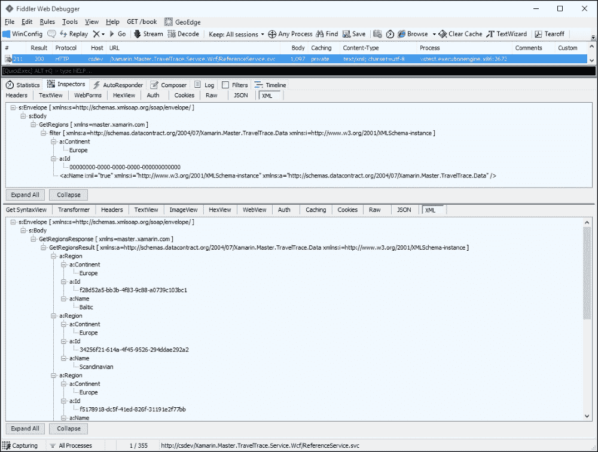

**简单 SOAP 消息示例**

消息结构对于客户端和服务器实现之间请求和响应对的序列化和反序列化非常重要。因此，可以采用其他类型的数据通信模型，这将需要客户端和服务器进行额外的自定义实现。

## **SOAP/XML 服务**

SOAP 网络服务使用 SOAP 定义的架构封装的 XML 数据对象。**Windows Communication Foundation**（**WCF**）服务和 ASP.Net 旧版服务（ASMX）都是 SOAP 服务，并符合 SOAP 协议。

SOAP Web 服务合约是在 **Web 服务描述语言**（**WSDL**）中定义的，WSDL 文档，连同其他 XML 数据模式（例如，XSD 文件），通常可以通过 Web 服务 URL 访问。使用此文档，无论底层语言如何，都可以以一致的方式定义 Web 服务，并且可以被各种客户端接口和消费。

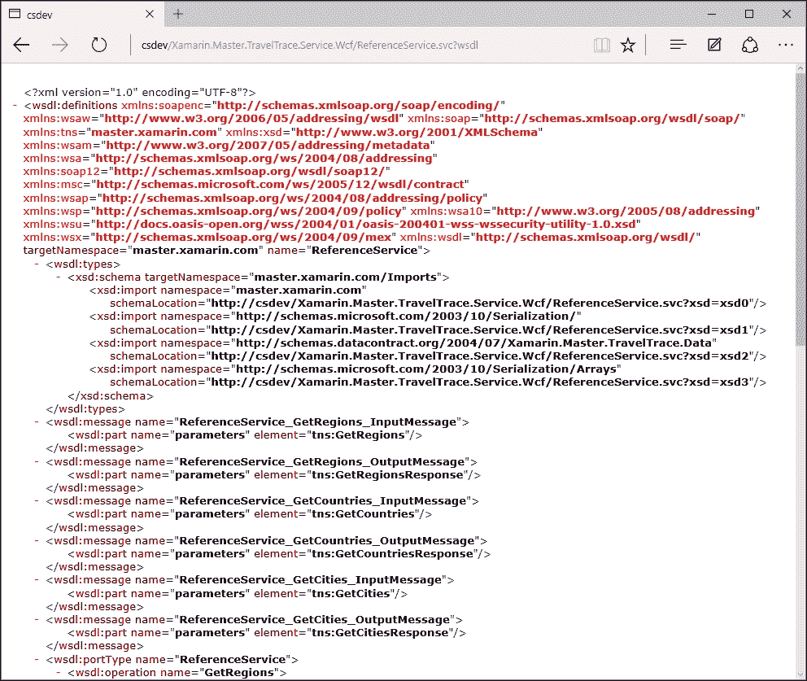

SOAP 1.1 服务的服务 WSDL

在 Xamarin 应用程序中，创建所谓的代理（服务消费者）的一种可能方式是使用 Silverlight SDK 生成访问代码。使用 Silverlight SDK 的主要原因在于 Windows Communication Foundation 客户端基础设施并未完全包含在 Xamarin 核心中，只能使用与 Silverlight 框架非常相似的客户端功能子集来访问 Web 服务。

为了生成客户端，您只需使用命令行工具执行以下命令：

```cs
slsvcutil http://localhost/ ReferenceService.svc /d:c:\bin\

```

### 提示

SLSvcUtil 可在各种 SDK 中找到，包括 Windows Phone 7、Windows Phone 8、Windows Phone 8.1（Silverlight）以及实际的 Silverlight SDK 目录：

+   `C:\Program Files (x86)\Microsoft SDKs\Windows Phone\v7.0\Tools\SlSvcUtil.exe`

+   `C:\Program Files (x86)\Microsoft SDKs\Windows Phone\v8.0\Tools\SlSvcUtil.exe`

+   `C:\Program Files (x86)\Microsoft SDKs\Windows Phone\v8.1\Tools\SlSvcUtil.exe`

+   `C:\Program Files (x86)\Microsoft SDKs\Silverlight\v5.0\Tools\SlSvcUtil.exe`

前面的命令将生成一个可以与支持 SOAP 1.1 配置的任何 Web 服务通信的 WCF 客户端。如果我们想要消费 WCF 服务，支持的绑定配置将是 `BasicHttpBinding` 和 `WebHttpBinding`（本质上是一个 REST 绑定）。`WSHttpBinding` 和类似配置使用其他 SOAP 配置来封装数据请求和响应。

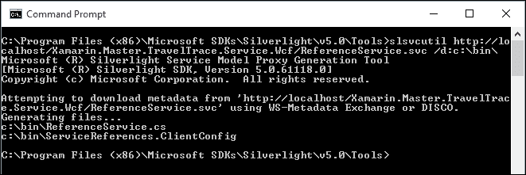

生成 Silverlight 代理

生成的客户端将具有基于事件和异步编程模型（APM）的异步方法来访问客户端。

```cs
[OperationContract (AsyncPattern=true, Action="master.xamarin.com/ReferenceService/GetRegions", ReplyAction="master.xamarin.com/ReferenceService/GetRegionsResponse")]
IAsyncResult BeginGetRegions(Xamarin.Master.TravelTrace.Data.Region filter, AsyncCallback callback, object asyncState)
List<Xamarin.Master.TravelTrace.Data.Region> EndGetRegions(IAsyncResult result)

public void GetRegionsAsync(Xamarin.Master.TravelTrace.Data.Region filter)
```

另一种方法是在 Visual Studio 或 Xamarin Studio 中创建 Web 引用。Web 引用只能用于与实现 WS-I Basic Profile 1.1（换句话说，SOAP 1.1）的服务进行通信。由 Web 引用生成的客户端使用 ASMX 通信堆栈（.NET 2.0 服务技术），而不是服务引用所使用的 WCF 客户端基础设施。

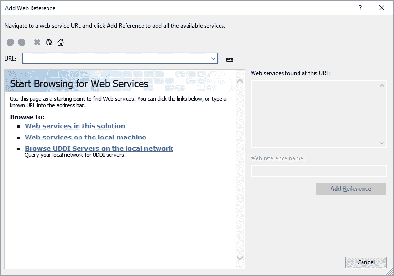

添加 Web 引用对话框（Visual Studio）

如果我们要比较由 Web 引用和 Silverlight SDK 生成的客户端，我们可以轻松地识别出底层技术。

```cs
// Web Service Generated Client.
[System.ComponentModel.DesignerCategoryAttribute("code")]
[System.Web.Services.WebServiceBindingAttribute(Name="BasicHttpBinding_ReferenceService", Namespace="master.xamarin.com")]
[GeneratedCodeAttribute("System.Web.Services", "4.6.79.0")]
public partial class AsmxReferenceServiceClient : System.Web.Services.Protocols.SoapHttpClientProtocol

// WCF Generated Client
[GeneratedCodeAttribute("System.ServiceModel", "4.0.0.0")]
public partial class ReferenceServiceClient : System.ServiceModel.ClientBase<ReferenceService>, ReferenceService
```

通过查看生成的两个代理的类图，我们可以对方法执行策略有更多的了解：

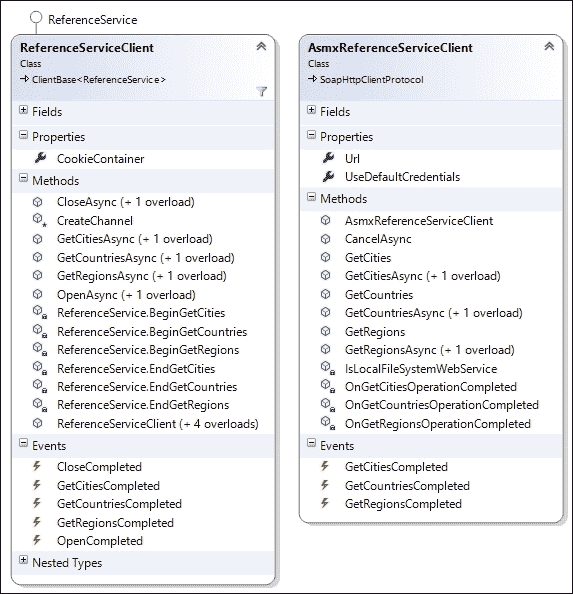

生成的代理比较

在跨平台项目中集成生成的代理的理想方式是将服务引用添加到可移植类库中，以便用于特定平台的项目。为了在 Visual Studio 中向 PCL 项目添加服务引用，您必须将 Windows Phone 8.1 作为目标之一删除，或者添加对`System.ServiceModel`命名空间的引用（Visual Studio 将自动从目标列表中删除 Windows Phone 8.1）。Windows Phone 8.1 平台不包含 Windows Communication Foundation 客户端程序集。完成此步骤后，**添加服务引用**选项将出现在项目上下文菜单中。

对于涉及 Windows Phone 8.1 的场景，更合适的解决方案是使用 RESTful 服务和客户端。

## RESTful 服务

与 SOAP 服务相比，RESTful 服务没有 SOAP 协议的额外开销或请求/响应对的封装。本质上，SOAP 方法调用引起的网络流量与 REST 调用的请求/响应对相同。**表示状态转移**（**REST**）模型的简单性提高了性能和可维护性。RESTful 服务的无状态和可缓存方法使它们成为 Xamarin 目标平台的最佳解决方案。

REST 服务本质上可以描述为静态 HTTP 端点。用于访问这些端点的 HTTP 动词（GET、PUT、POST 和 DELETE）定义了在服务层上要调用的方法类型（PUT 用于更新，POST 用于创建，DELETE 用于删除操作）。消息结构可以从 JSON 到 XML，甚至到 ATOM。

在 Xamarin 目标平台上，有各种现成的选项和附加组件可用于基于 REST 的 Web 服务。这些选项中的任何一个都可以用来执行 Web 请求，并且请求/响应对可以根据要求和选择的消息媒体类型进行序列化/反序列化。

由于我们正在对 REST 端点进行常规的 Web 请求，最简单的实现将涉及`HttpClient`，它包含在`System.Net.Http`命名空间中。

例如，如果我们想要实现一个基类来处理上一节中使用的 RESTful Web 服务的 CRUD（创建、读取、更新和删除）方法（`TravelTrace.ReferenceDataService`），我们可以在内部 HTTP 客户端层周围实现一个针对每个调用的包装器。

```cs
public BaseClient(string baseAddress, string securityToken)
{
    if (string.IsNullOrEmpty(baseAddress)) throw new ArgumentNullException("baseAddress");

    BaseAddress = new Uri(baseAddress);

  // Storing the security token in a class property of type string
    SecurityToken = securityToken.StartsWith("Bearer") ? securityToken.Substring(7) : securityToken;

    m_HttpClient = CreateHttpClient();
}
```

您会注意到我们正在使用基础地址作为服务器地址，并且如果有的话，使用安全令牌来初始化我们的客户端。在这个实现中，创建方法将简单地创建 HTTP 客户端，并使用身份验证令牌作为默认头。另一个重要要求是将“Accept”头设置为通知客户端期望从服务器接收哪种类型的内容（在这个例子中是 JSON）。

```cs
private HttpClient CreateHttpClient()
{
    var httpClient = new HttpClient();
    httpClient.DefaultRequestHeaders.Accept.Add(new MediaTypeWithQualityHeaderValue("application/json"));

    if (string.IsNullOrEmpty(SecurityToken))
    {
        httpClient.DefaultRequestHeaders.Authorization = new AuthenticationHeaderValue("Bearer", SecurityToken);
    }

    return httpClient;
}
```

在 HTTP 管道准备好执行请求后，我们可以开始实现 REST 服务的基方法。

```cs
protected async Task<string> GetStringAsync(string path)
{
    // if we are using the BaseClient multiple times
    // we can create a new transport with each method
    //HttpClient httpClient = CreateHttpClient();

    try
    {
        // Get the response from the server url and REST path for the data
        var response = await m_HttpClient.GetAsync(new Uri(BaseAddress, path));

        if (response.StatusCode == HttpStatusCode.Unauthorized)
        {
            throw new UnauthorizedAccessException("Access Denied");
        }
        if (response.IsSuccessStatusCode)
        {
            return await response.Content.ReadAsStringAsync();
        }

        throw new WebException(response.ReasonPhrase);
    }
    catch (Exception ex)
    {
        // TODO:
        throw ex;
    }
}
```

现在，`GetRegions` 方法看起来是这样的：

```cs
var regions = await GetStringAsync("regions");
```

这个请求的结果可以在调试屏幕中可视化：

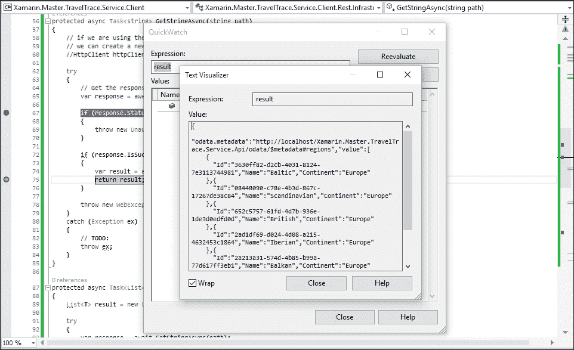

来自 Web API 的 JSON 数据

然而，这仅仅是服务数据的字符串表示，我们需要扩展我们的实现以包括一个 JSON 序列化器。有多个序列化选项可用，包括通过 *Microsoft BCL* 包提供的标准库：`System.Xml` 和 `System.Json` 命名空间。*NewtonSoft Json.NET* 仍然是最受欢迎的 JSON 库之一，并且可以通过 NuGet 获取。

```cs
public async Task<List<Region>> GetRegionsAsync(Region filter = null)
{
    var result = new List<Region>();

    var regions = await GetStringAsync("regions");
    var resultingList = JToken.Parse(regions);

    await Task.Run(() =>
    {
        result.AddRange(resultingList["value"]
            .Select(item => item.ToObject<Region>()));
    });

    return result;
}
```

使用这个实现，我们可以在基类实现中创建通用方法，并将序列化责任推到这一层。

```cs
protected async Task<List<T>> GetListAsync<T>(string path)
{
    List<T> result = new List<T>();

    try
    {
        var response = await GetStringAsync(path);
        var resultingList = JToken.Parse(response);

        await Task.Run(() =>
        {
            result.AddRange(resultingList["value"]
                .Select(item => item.ToObject<T>()));
        });
    }
    catch (Exception ex)
    {
        // TODO:
        throw ex;
    }

    return result;
}
```

我们可以扩展这个通用实现以用于其他 Web 方法，并为我们的 RESTful 客户端创建基础。认证场景将在下一节中进一步讨论。

对于 Xamarin 开发者来说，还有许多更多的 REST 消费者实现可用，这些模块可以通过组件和 NuGet 包（如 RestSharp、Hammock 等）包含到跨平台项目中。

## OData 和 OAuth

OData 和 OAuth 是两种广泛接受的用于 RESTful 通信场景的标准/协议。Xamarin 移动应用程序处理外部资源，尤其是第三方 Web 服务 API 时，通常实现这些协议。

### OData

与作为通信协议的 SOAP 不同，REST 只是一种针对 Web 服务实现的架构方法。RESTful 服务不需要符合某些规范，可能差异很大。为了识别 RESTful 服务的需求并为客户端应用程序和服务器之间交换的数据创建统一的结构，微软在 2007 年启动了 OData。OData 现在是一个国际上认可的协议，由 OASIS 维护，并被各种应用程序、平台和公司（例如，微软 Azure 移动服务、微软 Office 365 Web 访问、Salesforce、SAP Netweaver Gateway Solution、IBM WebSphere 等）支持/使用。

在 OData 协议中，每个对象集都由一个符合 REST 原则的端点定义。对于 GET 请求，这些实体集端点可以接受对象标识符，从而得到该特定实体实例的详细信息，或者可以使用 OData 过滤器和其他查询选项查询列表中的实体。

与 SOAP/XML 服务中的 WSDL 类似，可访问的端点（实体集和函数）以及服务合同中使用的类型通常通过带有 CSDL（OData 公共架构定义语言）文件的元数据端点提供服务。

要访问整个元素列表，请访问 `http://localhost/Xamarin.Master.TravelTrace.Service.Api/odata/regions`。

要访问实体集端点中的单个元素，请访问 `http://localhost/Xamarin.Master.TravelTrace.Service.Api/odata/regions(guid'90222c18-66fa-441a-b069-0115faa1e0f1')`。

要查询具有筛选条件的元素列表，请访问 `http://localhost/Xamarin.Master.TravelTrace.Service.Api/odata/regions?$filter=Continent eq 'Europe'`。

使用 OData 协议，也可以进行涉及额外属性展开、lambda 操作符和函数的高级 OData 查询；然而，这些主题超出了本书的范围。

可以下载的 NuGet 包和组件有多种，这些组件作为开源和/或免费软件，有助于为 OData 服务生成客户端。

### OAuth

OAuth 是一个开放标准，通常由服务提供商用于授权。OAuth 的一般用例可能是使用第三方身份提供者，如 Live ID（微软）、Google、Facebook 或 Twitter，在移动或网络应用程序中进行身份验证和授权。

经典的 OAuth 2.0 实现场景通常是一个两步过程。第一步涉及用户通过提供者的网络界面授予客户端应用程序访问权限。第二步是使用从提供者网络界面接收到的授权代码来获取访问令牌，以访问提供者的资源。


Facebook 作为身份验证提供者

在网络应用程序上的授权过程的第一步通常是显示提供者授权页面的 `iframe`。在 Xamarin 应用程序中，这一步是通过使用网页视图控件或更专业的实现（`WebAuthenticationBroker` 是 Windows Phone 8.1 上的现成控件）来执行的。考虑到提供者页面会向客户端应用程序页面发出带有授权令牌的回调请求，而客户端应用程序负责从回调 URL 或内容体中解析和提取此令牌，实现两步验证过程可能会变得相当繁琐。


Xamarin.Auth 组件

为了提供对 OAuth API 的访问并简化实现，开发者可以利用可用的 Xamarin OAuth 组件：Xamarin.Auth（可在 Xamarin.iOS 和 Xamarin.Android 平台上使用）。还有一个配套的组件用于社交媒体提供者 API：Xamarin.Social。

使用 Xamarin.Auth 实现，使用 Facebook API 进行身份验证可以简单到只需几行代码。

```cs
var authenticationBroker = new OAuth2Authenticator(
    clientId: "<App ID from https://developers.facebook.com/apps>",
    scope: "",
    authorizeUrl: new Uri("https://m.facebook.com/dialog/oauth/"),
    redirectUrl: new Uri("http://www.facebook.com/connect/login_success.html"));

authenticationBroker.Completed += (sender, eventArgs) =>
{
    DismissViewController(true, null);

    if (eventArgs.IsAuthenticated)
    {
        // TODO: eventArgs.Account contains the authenticated user info
    }
    else
    {
        // TODO: Possibly the user denied access to the account or
        // the user could not authenticate with the provider
    }
};

// The GetUI method returns UINavigationControllers on iOS, and Intents on Android
PresentViewController(authenticationBroker.GetUI(), true, null);
```

# SignalR

ASP.NET SignalR 是一种网络服务器端技术，允许开发者为他们的应用程序传递实时更新。SignalR 的工作方式与 WCF 双向通道类似，其中服务器端通过主要服务合同访问，服务器到客户端的通信通过回调合同进行。虽然 WCF 双向通道提供与 SignalR 相同的场景支持，但双向通道实现目前在任何 Xamarin 目标平台上都不受支持。另一方面，所有 Xamarin 目标平台都可用 SignalR 组件。

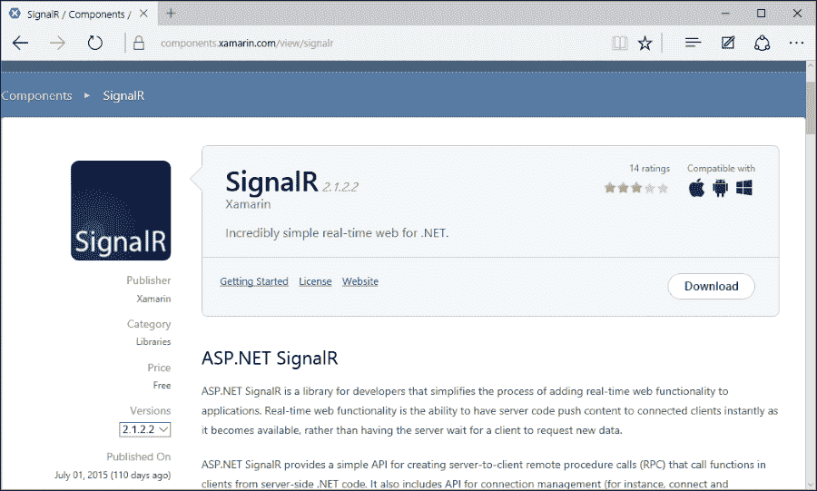

SignalR 组件

SignalR 利用 `WebSockets`，这使得在 HTTP 传输上实现双向通信。本质上，`WebSockets` 几乎以与 TCP Sockets 相同的方式工作；然而，连接是在 HTTP 传输层上建立的。

使用 SignalR，需要实时数据的应用程序可以实现，无需求助于轮询或监听通道实现，这在移动平台上既不可扩展也不高效。

SignalR 通常在服务器端实现为一个 Hub 应用程序，它创建不同的事件接收器供不同的应用程序订阅。每个订阅特定频道的客户端在这些频道上以字符串格式或已反序列化为复杂类型的方式接收事件通知和数据，在正常广播场景下。

```cs
// Connect to the server
var hubConnection = new HubConnection("http://xamarin.traveltrace.com/");

// Create a proxy to the 'MainHub' on the SignalR server
var myHubProxy = hubConnection.CreateHubProxy("MainHub");

// Subscribe to message from the server
myHubProxy.On<string>("ServerStringCall", message =>
{
    // TODO: use the message update from the channel
});

// Subscribe to message with a complex type
myHubProxy.On<Region>("ServerComplexCall", message =>
{
    // TODO: use the message update from the channel
});

// Start the connection
await hubConnection.Start();
```

一般而言，SignalR 服务器实现可以替换 RESTful 服务操作。这些双向 Hub 可以提供由消费者调用的功能，以及从服务器到监听客户端的更新调用。

虽然可以使用不同的消息格式来交换数据，但大多数实现使用 JSON 格式来序列化和反序列化数据，并且 Json.NET 是 SignalR 组件使用的默认序列化库。

```cs
await myHubProxy.Invoke("MySimpleServerMethod", "myParameter");
await myHubProxy.Invoke<Region>("MyComplexServerMethod", new Region{Continent = Continent.Europe});
```

在服务器端调用的事件之上，SignalR 频道还提供生命周期事件：

+   **接收**: 当连接上接收到任何数据时触发。提供接收到的数据。

+   **连接缓慢**: 当客户端检测到缓慢或频繁断开连接时触发。

+   **重新连接**: 当底层传输开始重新连接时触发。

+   **重新连接**: 当底层传输重新连接时触发。

+   **状态改变**: 当连接状态改变时触发。提供旧状态和新状态。

+   **关闭**: 当连接断开时触发。

SignalR 支持使用 SSL 传输安全，并且能够与网络服务器和移动应用程序已经使用的现有身份验证和授权提供者集成。

# 模式和最佳实践

在移动应用程序中，开发者在开发项目中使用网络服务和其它通信渠道时，通常会使用某些可重用的设计模式。这些模式旨在提高效率，并增加代码在不同平台以及跨平台移动应用程序的各个执行域之间的共享。

## 异步转换

为 WCF 和/或 SOAP/XML 服务生成的代理通常包括基于事件的异步实现或带有 begin 和 end 方法的异步调用模式。这两种实现都可以转换为基于任务的异步模式。

为了将基于事件的异步服务方法转换为基于任务的，我们可以使用 `TaskCompletionSource<T>` 并返回产生的任务（参考第三章，*异步编程*）。

```cs
public Task<List<Region>> GetRegionsAsync(Region filter = null)
{
    var taskAwaiter = new TaskCompletionSource<List<Region>>();

    var client = CreateServiceClient();

    EventHandler<GetRegionsCompletedEventArgs> completedDelegate = null;

    completedDelegate = (sender, args) =>
        {
            if (args.Error != null)
            {
                taskAwaiter.SetException(args.Error);
            }

            taskAwaiter.SetResult(args.Result);

            client.GetRegionsCompleted -= completedDelegate;
        };

    client.GetRegionsCompleted += completedDelegate;

    client.GetRegionsAsync(new Region { Continent = Continent.Europe });

    return taskAwaiter.Task;
}
```

对于异步调用模式，我们可以使用 `TaskFactory` 的指定方法。`TaskFactory` 的 `FromAsync` 方法使用 begin 和 end 方法以及异步状态对象（例如，可以用于取消令牌或进度回调）来创建一个可等待的任务。

```cs
public Task<List<Region>> GetRegionsAsync(Region filter = null)
{
    var client = (ReferenceService.ReferenceService)CreateServiceClient();

    var task = Task<List<Region>>.Factory
        .FromAsync(
        (callback, o) => client.BeginGetRegions(filter, callback, o),
        result => client.EndGetRegions(result),
        null);

    return task;
}
```

## 数据模型抽象

遵循之前提出的质量标识符，在服务相关场景中，创建一个可以被跨平台应用程序的不同分支使用的数据库模型抽象层非常重要。

使用前几节中的旅行者指南应用程序示例，我们可以分析共享策略。在这个例子中，作为一个开发团队或单个开发者，我们负责：

+   实现负责访问数据库和连接外部 API 的服务层，如果需要的话

+   实现将被 Xamarin 应用程序使用的共享通用逻辑

+   实现 Xamarin.iOS 和 Xamarin.Android 应用程序

+   实现 Windows Phone 8.1 应用程序

+   实现将使用 Silverlight 组件（可选）的 Web 界面

为了简单起见，我们将只实现一个数据类型和一个 GET 方法。

对于合约和数据对象，我们可以创建一个针对 Xamarin 平台以及 .NET 4.5 的可移植库。我们包括 .NET 配置文件的原因是因为我们将在服务层实现中使用数据模型。

实现开始于创建数据传输模型对象。这些对象通常是服务层上使用的数据库表的反映。然而，DTO（数据传输对象）和 DBO（数据访问对象，Entity Framework 项目）之间的一对一映射并不是绝对必要的，因为 DTO 抽象层的唯一目的是在我们将要处理的实际数据存储之上创建一个抽象层。

```cs
public class Region
{
    [JsonProperty("id")]
    public Guid Id { get; set; }

    [JsonProperty("name")]
    public string Name { get; set; }

    [JsonProperty("continent")]
    public Continent Continent { get; set; }
}
```

### 注意

注意，我们包括 Json.NET 属性来定义类属性。它们用于在序列化/反序列化期间格式化 JSON 对象属性为驼峰式（例如，camelCase），这是 JavaScript 约定，而不是属性名称的.NET 约定大驼峰式（例如，PascalCase）。这些属性定义可以与 RESTful 客户端和 Web 服务实现一起使用。这不会干扰其他服务或客户端层用例。

在我们创建模型之后，我们可以定义将被 Web 服务和相关客户端使用的接口。我们将在服务层定义两个接口用于同步实现，并在客户端侧进行异步消费。

```cs
namespace Xamarin.Master.TravelTrace.Common.Infrastructure
{
    public interface IReferenceService
    {
        List<Region> GetRegions(Region filter = null);

        List<Country> GetCountries(Country filter = null);

        List<City> GetCities(City filter = null);
    }

    public interface IReferenceServiceAsync
    {
        Task<List<Region>> GetRegionsAsync(Region filter = null);

        Task<List<Country>> GetCountriesAsync(Country filter = null);

        Task<List<City>> GetCitiesAsync(City filter = null);
    }
} 
```

服务实现策略通常是使用 RESTful 层。为了演示目的，让我们在一个单独的项目中实现 WCF 服务，重用之前定义的数据模型和接口。

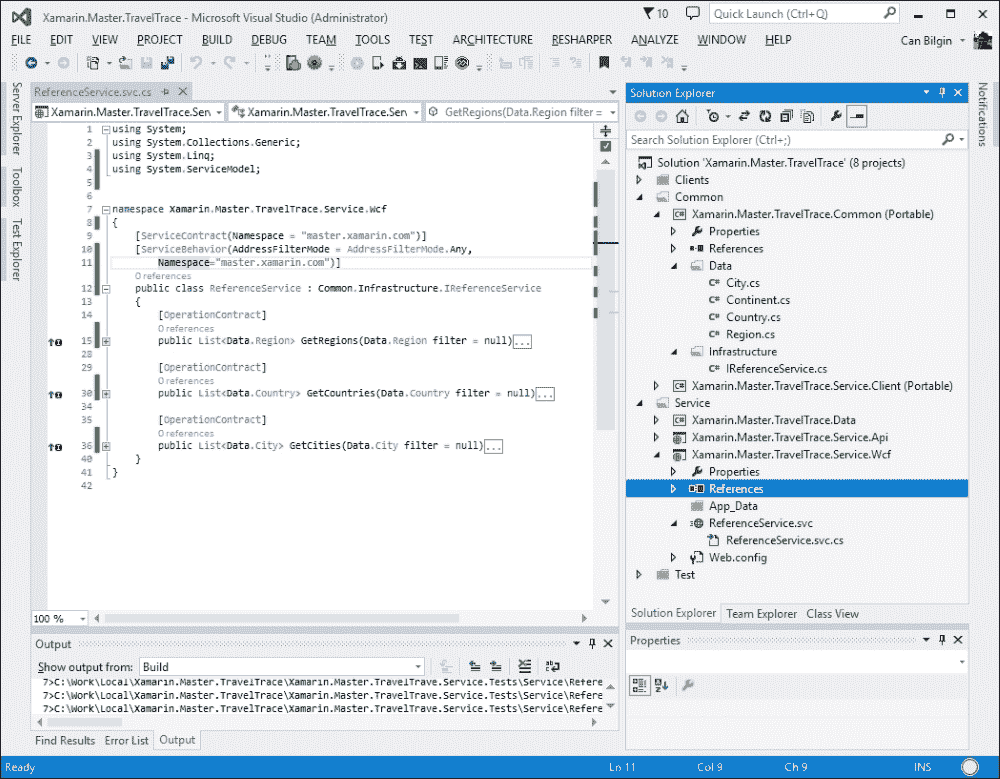

解决方案结构

在这个实现中，每个服务方法都将调用数据存储库（Entity Framework/MSSQL），并且存储库将通过转换数据库层实体来返回 DTO 对象。

我们需要实现的项目下一个部分是服务数据消费者层。我们将为此层创建一个新的可移植库，并使用生成的 WCF 客户端。在创建项目并添加对`System.ServiceModel`命名空间和包含 DTO 模型的通用可移植库的引用后，一个重要的细节是要确保生成的代理重用引用的库。

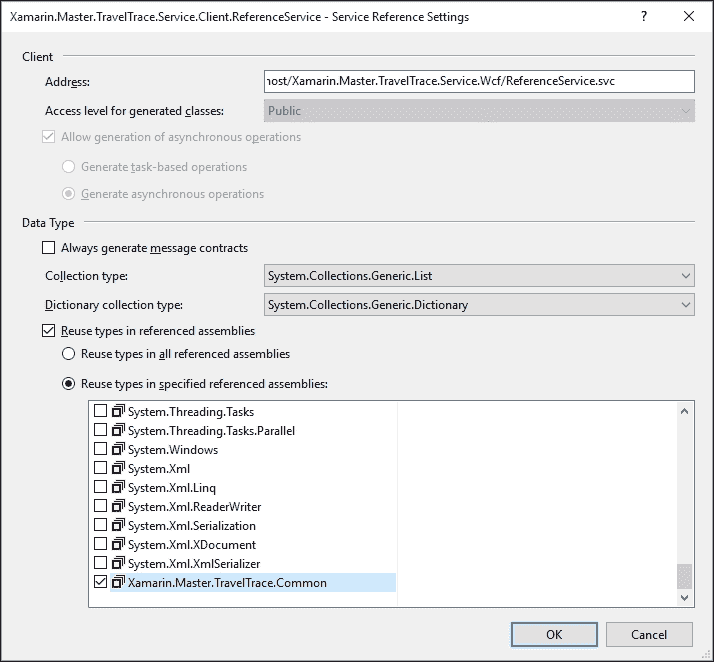

服务引用属性

### 注意

如果你使用 Silverlight SDK 生成客户端，包含现有库以重用类型会稍微复杂一些。为了做到这一点，你可以使用“引用”开关（或者简单地说，`/r`：）并将实用程序指向包含已实现类型的程序集。

```cs
slsvcutil http://localhost/ReferenceService.svc 
 /d:c:\bin\ /r:C:\Local\Xamarin.Master.TravelTrace.Common.dll

```

在创建代理之后，我们有一个结构，其中数据模型和合约被应用程序的不同层共享，包括服务、数据访问层、服务代理，最后是应用程序。

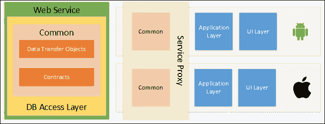

共享服务结构

然而，实现应该进一步扩展，将服务代理转换为基于任务的异步实现。另一个有用的改进是实现本地数据库缓存和离线存储。对于这个缓存层，可以重用相同的 DTO 实现。

如果我们要在这个跨平台项目中包含一个 Windows Phone 8.1 客户端，解决 WCF 基础设施不足的唯一方法就是用 RESTful 实现来替换 WCF 服务。

## 服务缓存

在处理网络场景时，重要的是要记住，移动设备并不总是拥有良好的网络连接或根本就没有网络。为了使 Xamarin 连接应用程序即使在离线场景中也可用，可以实现一个缓存层来存储和返回不经常更改的数据项。

例如，在旅行指南应用程序中，用户将想要访问指南，甚至可能需要地图，即使他们处于漫游连接中，或者更糟糕的是，没有任何连接。为了便于离线存储，我们可以实现一个 SQLite 数据库，该数据库使用现有的数据传输对象作为存储项，并在有互联网连接时在特定间隔更新数据。

实现的第一步将是修订我们的 DTO 层类，并在需要时添加 SQLite 属性。这将创建对服务层 SQLite 程序集的依赖；另一种选择是使用服务层和客户端库之间的链接代码文件，或者为 SQLite 数据存储重新创建 DTO 对象。

```cs
public class Region
{
    public Region()
    {
        Countries = new List<Country>();
    }

    [PrimaryKey]
    [JsonProperty("id")]
    public Guid Id { get; set; }

    [JsonProperty("name")]
    public string Name { get; set; }

    [JsonProperty("continent")]
    public Continent Continent { get; set; }

    [OneToMany(CascadeOperations = CascadeOperation.CascadeInsert | CascadeOperation.CascadeRead)]
    [JsonProperty("countries")]
    public List<Country> Countries { get; set; } 
}
```

在此场景中，为了创建一个数据上下文，如果可用则使用在线存储，如果互联网连接有限则使用本地数据存储，我们可以实现与之前示例中为服务代理创建的相同数据接口，并为数据同步上下文创建一个父处理程序。


应用层的数据抽象

在同步上下文中，对于 GET 方法，服务调用将仅用于更新本地存储，实际结果将从本地存储返回。对于 PATCH、POST 和 PUT 调用，根据在线连接性，我们将要么在本地保存数据，要么将增量和新对象实例推送到服务，并使用更新来更新本地数据。

```cs
public class DataSyncContext : IReferenceServiceAsync
{
    public IReferenceServiceAsync LocalDataService { get; set; }

    public IReferenceServiceAsync RemoteDataService { get; set; }

...

    public async Task<List<Region>> GetRegionsAsync(Region filter = null)
    {
        try
        {
            // Getting the online results
            var results = await RemoteDataService.GetRegionsAsync(filter);

            // If there were any online changes.
            SyncToLocal(results);
        }
        catch (Exception ex)
        {
            // TODO:
        }

        // Returning the local storage results (with or without updates)
        return await LocalDataService.GetRegionsAsync(filter);
    }
...
}
```

为了提高此实现的性能，当我们为某些可视化加载数据时，我们可以首先调用本地数据提供程序，然后继续进行 UI 更新，接着调用 Web 服务方法以及相同的延续委托。

```cs
Action<List<Region>> onRegionsLoaded = regions =>
{
    // Update the view-model data or the UI.
};

DataContext.LocalDataService.GetRegionsAsync()
    .ContinueWith((task) =>
    {
        onRegionsLoaded(task.Result);
    });

DataContext.GetRegionsAsync()
    .ContinueWith((task) =>
    {
        onRegionsLoaded(task.Result);
    });
```

# 平台特定概念

在 Xamarin 平台上，还有其他由原生运行时提供并由 Xamarin 支持的概念和网络通信方法。

## 权限

为了让 Android 或 Windows Phone 应用程序访问互联网，应用程序清单应该声明该应用程序将需要使用网络来访问资源。

在 Android 系统中，权限声明使用 XML 文件的清单节点中的 `uses-permission` 标签：

```cs
<uses-permission android:name="android.permission.INTERNET" />
```

虽然这种声明在大多数使用场景中足够使用，但为了访问当前的网络状态或 Wi-Fi 状态，还必须声明网络状态权限：

```cs
<uses-permission android:name="android.permission.ACCESS_NETWORK_STATE" />
<uses-permission android:name="android.permission.ACCESS_WIFI_STATE" />
```

对于 Windows Phone，可声明的应用程序能力为 `ID_CAP_NETWORKING`。

两个平台的应用程序清单都可以通过应用程序项目属性中的指定配置部分进行编辑。

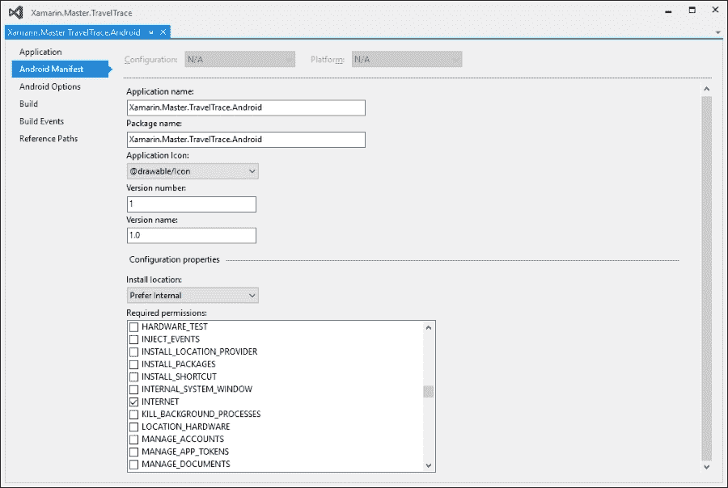

Android Manifest

除了之前提到的 App Transport Security (ATS)之外，iOS 不强制执行任何清单设置或权限，以允许应用程序使用网络连接。

## NSUrlConnection/NSUrlSession（仅限 iOS）

除了可用于 Xamarin 目标平台的不同的客户端库之外，还可以使用一些原生实现来调用和接收外部网络数据。Xamarin.iOS 平台上的一个可用选项是`NSUrlConnection`。借助`NSUrlConnection`，开发者可以发出网络请求并使用响应。

一个简单的网络请求，用于从之前在 iOS 上演示的静态数据端点检索数据，看起来可能如下所示：

```cs
public Task<List<Region>>  GetRegionsAsync(Region filter = null)
{
    var nsUrlRequest = new NSUrlRequest(new NSUrl(myServiceEndpoint));

    var taskSource = new TaskCompletionSource<List<Region>>();

    var nsUrlConnection = new NSUrlConnection(nsUrlRequest,
        new ConnectionSerializingHandler<List<Region>>(taskSource));
    nsUrlConnection.Start();

    return taskSource.Task;
}
```

连接委托的实现将涉及数据的反序列化并将结果分配给`TaskCompletionSource`，以便完成方法执行。

```cs
public class ConnectionSerializingHandler<T> : 
        NSUrlConnectionDataDelegate where T:class,new()
{
    private StringBuilder m_ResponseStore;

    private TaskCompletionSource<T> m_TaskCompletion; 
    public bool IsFinishedLoading { get; set; }
    public string ResponseContent { get; set; }

    public ConnectionSerializingHandler(TaskCompletionSource<T> taskCompletionSource)
        : base()
    {
        m_ResponseStore = new StringBuilder();
        m_TaskCompletion = taskCompletionSource;
    }
    public override void ReceivedData(NSUrlConnection connection, NSData data)
    {
        if (data != null)
        {
            m_ResponseStore.Append(data);
        }
    }

    public override void FinishedLoading(NSUrlConnection connection)
    {
        IsFinishedLoading = true;
        ResponseContent = m_ResponseStore.ToString();

        // TODO: implement deserialization and 
        m_TaskCompletion.SetResult(result);
    }
}
```

尽管此实现在 iOS 平台上是可能的，但考虑到将 Mono 传递到 iOS 桥接器（同样适用于 Android 和 JNC 桥接器）的成本，应避免此类实现，并且应仅使用原生或 Mono 运行时代码通过网络进行通信。

以类似的方式，我们可以实现 iOS 中新的`NSUrlSession`类的使用场景。然而，`NSUrlSession`也可以用于后台下载场景。因此，我们将在下一节中讨论它。

## 背景下载

当应用程序需要的网络资源比客户端 UI 可以等待的更多时，在 Xamarin 移动应用程序中，我们可以求助于后台下载。iOS 和 Android 平台都提供了后台下载的实现，这些策略可以在 Xamarin 运行时执行。

对于 Xamarin.Android 应用程序开发者来说，执行后台下载的最简单方法是从 API 级别 9 开始提供的下载管理器 API 服务/应用程序。下载管理器可以用请求初始化，并且应用程序可以订阅有关下载状态的事件通知。

首先，我们需要创建一个请求并将其传递给`DownloadManager`：

```cs
global::Android.Net.Uri downloadUri = global::Android.Net.Uri.Parse("<URL to Download>");
DownloadManager.Request request = new DownloadManager.Request(downloadUri);

// Types of networks on which this download will be executed.
request.SetAllowedNetworkTypes(DownloadNetwork.Wifi);

// Allowed on Roaming connection?
request.SetAllowedOverRoaming(false);

// Allowed on Metered Connection?
request.SetAllowedOverMetered(false);

//Set the title of this downloaded
request.SetTitle("My Background Download");

//Set the description of this downloaded
request.SetDescription("Xamarin.Android download using DownloadManager");

//Set the local destination for the downloaded file
request.SetDestinationInExternalFilesDir(this, global::Android.OS.Environment.DirectoryDownloads, "MyDownloadedData.xml");
// or use the request.SetDestinationUri()
```

一旦请求准备就绪可以执行，我们可以获取`DownloadManager`实例并将下载请求排队：

```cs
m_DownloadManager = (DownloadManager)GetSystemService(DownloadService);

// Enqueue the request
// The download reference will be used to retrieve the status
m_CurrentDownloadReference = m_DownloadManager.Enqueue(request);
```

可以使用下载引用来获取排队下载的当前状态信息或取消正在进行的后台下载。

要获取下载的当前状态或取消它，我们可以使用`DownloadManager`实例上的相应方法。

```cs
// Removing the queued request from the DownloadManager queue.
m_DownloadManager.Remove(m_CurrentDownloadReference);

//
// Retrieving the current status of the download queue
// Create a query to retrieve the download status(s)
DownloadManager.Query myDownloadQuery = new DownloadManager.Query();
myDownloadQuery.SetFilterById(m_CurrentDownloadReference);
// Request the queued download items as a data table.
var cursor = m_DownloadManager.InvokeQuery(myDownloadQuery);
var statusColumn = cursor.GetColumnIndex(DownloadManager.ColumnStatus);
var status = (DownloadStatus)cursor.GetInt(statusColumn);
```

此实现可以通过使用`BroadcastReceiver`类从`DownloadManager`应用程序接收到的通知（复数）进行扩展。

```cs
public class DownloadBroadcastReceiver : BroadcastReceiver
{
    public override void OnReceive(Context context, Intent intent)
    {
        // Get the download reference from the intent broadcast
        long referenceId = intent.GetLongExtra(DownloadManager.ExtraDownloadId, -1);

        // TODO: Implement the delegated execution
    }
}
```

我们现在可以将广播接收器注册到`DownloadManager`实例，并使用可能的委托实现来更新 UI。

```cs
//set filter to only when download is complete and register broadcast receiver
IntentFilter filter = new IntentFilter(DownloadManager.ActionDownloadComplete);
// TODO: We can extend the DownloadBroadcastReceiver with delegates
RegisterReceiver(new DownloadBroadcastReceiver(), filter);
```

在广播机制之上，下载管理器应用 UI 也可以在 Xamarin 应用程序中调用，以提供关于正在进行或已完成传输的统一 UI。

在 iOS 平台（至少是 iOS 7 之后），后台传输（包括下载和上传操作）可以通过 `NSUrlSession` 实现。`NSUrlSession` 提供了一个易于实现的接口，允许开发者创建高效且可靠的传输过程。

`NSUrlSession` 的实现策略最初涉及实现一个 `NSUrlSessionDelegate`，它将成为传输过程的负责“处理程序”。与传输的健康和状态相关的基方法通过此代理公开，可以实施以提供传输所需的信息或向应用程序用户提供实时更新。

+   当后台会话完成时，会调用 `DidFinishEventsForBackgroundSession`。

+   当服务器请求凭证时，会调用 `DidReceiveChallenge`。

+   当会话出现问题时，会调用 `DidBecomeInvalid`。

`NSUrlSessionDelegate` 为更专业的传输代理提供了基实现：`NSUrlSessionDownloadDelegate` 用于下载操作，`NSUrlSessionTaskDelegate` 用于上传操作。这些代理类公开了与传输任务相关的附加状态方法（例如，下载代理提供了检索下载进度通知的方法）。

例如，如果我们使用与 Xamarin.Android 中相同的示例，并且实现 `BroadcastReceiver`，则 `NSUrlSessionDownloadDelegate` 的实现需要三个基本方法来完成、错误和进度。

```cs
public class DownloadTaskDelegate : NSUrlSessionDownloadDelegate
{
    public override void DidFinishDownloading(NSUrlSession session, NSUrlSessionDownloadTask downloadTask, NSUrl location)
    {
        // TODO: Implement the delegate for download finished
    }
    public override void DidBecomeInvalid(NSUrlSession session, NSError error)
    {
        //base.DidBecomeInvalid(session, error);

        // TODO: Implement the delegate for error
    }
    public override void DidWriteData(NSUrlSession session, NSUrlSessionDownloadTask downloadTask, long bytesWritten, long totalBytesWritten,
        long totalBytesExpectedToWrite)
    {
        //base.DidWriteData(session, downloadTask, bytesWritten, 
        //  totalBytesWritten, totalBytesExpectedToWrite);

        // TODO: Implement the delegate for download progress
    }
} 
```

在代表实现完成后，我们可以使用 `NSUrlSession` 创建会话并开始下载操作。

```cs
NSUrlSessionConfiguration downloadSessionConfiguration = NSUrlSessionConfiguration.BackgroundSessionConfiguration ("com.TravelTravel.BackgroundTransfer");
m_DownloadSession = NSUrlSession
    .FromConfiguration(downloadSessionConfiguration, 
    new DownloadTaskDelegate(), 
    new NSOperationQueue());
NSUrl url = NSUrl.FromString("<URL to Download>");
NSUrlRequest request = NSUrlRequest.FromUrl(url);
m_DownloadTask = m_DownloadSession.CreateDownloadTask(request);
```

在处理程序实现的基础上，iOS 应用可以被唤醒以执行某些代码，例如本地移动通知，通知用户会话已完成。对于任务完成事件，需要使用 iOS 应用程序代理（参考第二章，*内存管理*），以 `DidFinishEventsForBackgroundSession`。

移动通知（也称为远程场景中的推送通知）是在操作系统级别执行的用户通知，用于通知用户有关应用程序相关的更新。它们可以通过本地触发或使用远程服务器触发。

## 推送通知

推送通知是微妙的 UI 消息，可以帮助应用程序向用户提供有关服务层正在执行的非同步任务的信息，或者有关与应用程序实例本身相关的外部事件（例如，来自社交网络的消息、旅行预订的批准等）。

在 Xamarin 平台和 Windows Phone 上都可以创建和接收推送通知。这些通知由一个二级服务器/应用程序（例如，服务层）触发，由平台相应的消息基础设施提供商进行代理，并在目标客户端的应用程序中显示。对于 Android 平台，消息提供者是 **Google Cloud Messaging** (**GCM**)，而对于 iOS，则是 **Apple Notification Push Service** (**APNS**)。这两个服务提供商都要求您的应用程序注册以接收推送通知，并且服务器应用程序需要有凭证以便能够与通知服务进行身份验证。同样，**Windows Notification Services** (**WNS**) 采用联合身份验证机制。

GCM 和 APNS 都使用订阅模型，其中特定设备上的客户端应用程序订阅/注册推送通知，并创建一个地址令牌。该地址令牌随后被服务器用于向消息代理服务（例如，GCM）发送推送通知，并将队列中的消息递送到特定的客户端。

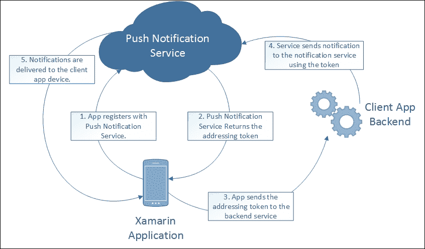

推送通知

在经典的短信模型之上，GCM 还支持基于主题和基于群组的消息，接收者不限于单一设备/应用程序对。使用 GCM 还可以创建一个双向通道，客户端能够将消息发送回服务器层。

在这些平台上，推送通知可以用来触发各种任务，其中最常见的是导航到某个视图并继续由通知初始化的业务流程。

虽然在客户端订阅推送通知相对简单，但在跨平台场景中，需要复杂的实现来引入一个单一的服务器环境，为 GCM 和 APNS 提供消息。然而，这两个平台都有平台无关的实现。Microsoft Azure 平台和通知中心就是这些解决方案之一，其中与 GCM 和 APNS 的通信都是通过使用相同的业务逻辑实现来支持的。

# 云集成

尽管有多个云服务提供商作为移动应用程序后端开发平台，但考虑到其与 .NET 平台以及随后的 Xamarin 的固有自然联系，Microsoft Azure 在竞争对手中脱颖而出。Azure 支持的大多数功能都有针对 Xamarin 目标平台的特定实现。

## Azure 移动服务

Azure 移动服务是一个可扩展的云开发平台，它帮助开发者轻松地将功能添加到他们的移动应用程序中。本章中描述的与网络服务相关的模式和功能，如 OData 服务、离线数据存储、推送通知和 OAuth 认证提供者，已经包含在移动服务 SDK 中，并且可以通过 Azure 管理控制台进行配置。

为了演示上述功能，我们可以将它们集成到我们的演示应用程序中。

首步是在 Azure 管理控制台中创建一个移动服务。为此，我们将选择一个计算服务并创建移动服务。

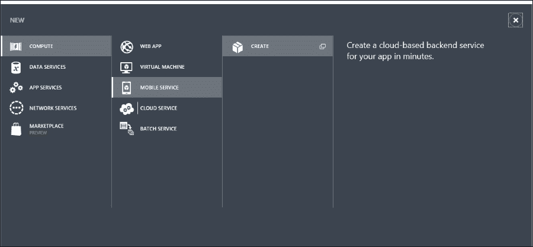

创建计算服务

然后，我们将设置移动服务端点并创建 SQL 数据库以存储在线数据。

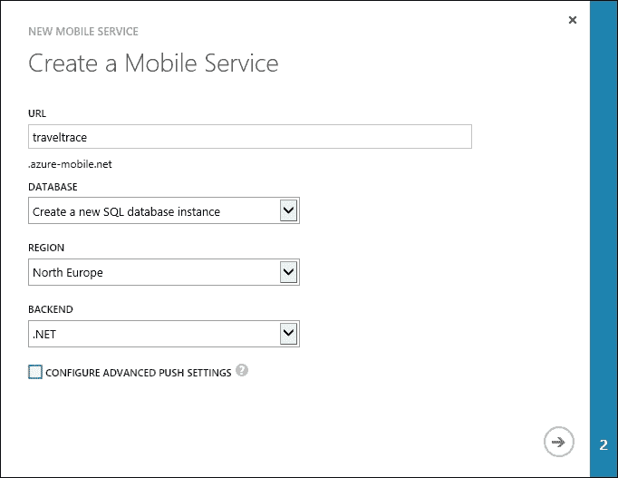

移动服务设置

一旦设置完成，就可以下载“个性化”的服务层项目，以便将移动服务集成到应用程序项目中。

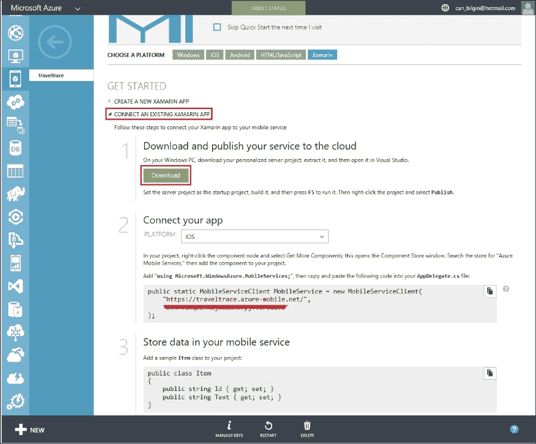

将移动服务连接到现有的 Xamarin 应用

在服务层项目中，您会注意到只创建了一个控制器以方便您使用。我们将通过添加额外的控制器并将对自定义 DTO 数据模型的引用添加到我们从 Azure 门户下载的新服务项目中来扩展项目。之所以添加引用的文件，是因为服务项目中的数据对象必须从 `EntityData` 类派生。我们需要进行的另一个更改是将类定义转换为部分并移除 SQLite 引用，例如，您可以注释掉 SQLite 属性描述符或使用条件编译。

在此示例中，我们使用 `AZURE` 作为 Azure 服务的构建常量。

```cs
public partial class Region
{
    public Region()
    {
        Countries = new List<Country>();
    }

#if !AZURE
    [PrimaryKey]
    [JsonProperty("id")]
    public Guid Id { get; set; }
#endif

#if !AZURE
    [JsonProperty("name")]
#endif
    public string Name { get; set; }

#if !AZURE
    [JsonProperty("continent")]
#endif
    public Continent Continent { get; set; }

#if !AZURE
    [OneToMany(CascadeOperations = CascadeOperation.CascadeInsert | CascadeOperation.CascadeRead)]
    [JsonProperty("countries")]
#endif

    public List<Country> Countries { get; set; } 
}
```

最后，使用 `partial` 声明为 `Region` 类创建数据对象定义：

```cs
public partial class Region : EntityData
{
}
```

在此步骤之后，您可以直接使用现有的控制器项目模板来添加专门的数据端点（Microsoft Azure 移动服务表控制器）。

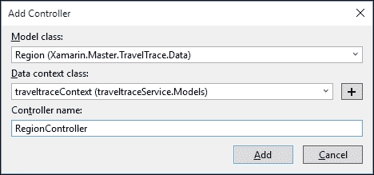

Microsoft Azure 移动服务表控制器

这将为数据对象创建一个控制器并将类型插入到数据上下文中。

一旦项目发布并且移动服务正在运行，SQL 数据库表将自动迁移。此迁移也适用于数据表列更改或 DTO 模型未来的添加。

现在，我们可以在客户端应用程序中添加 NuGet 包或组件，并添加必要的初始化代码，如 Azure 管理控制台移动服务部分起始页面所述。

在主活动中，我们创建了以下移动服务实例：

```cs
public static MobileServiceClient MobileService = new MobileServiceClient(
    "https://traveltrace.azure-mobile.net/",
    "<Removed for security reasons>"
    );
```

将以下内容添加到事件处理程序或 `OnCreate` 函数中：

```cs
// Intialization the mobile services on the mobile platform
CurrentPlatform.Init();

// Adding a region item to the database
var item = new Region {Continent = Continent.Europe, Name = "Balkan"};
MobileService.GetTable<Region>().InsertAsync(item).ContinueWith((result) =>
{
    System.Diagnostics.Debug.Write(result.Status);
});
```

代码成功执行后，可以使用 SQL Management Studio 或 Visual Studio SQL Server 工具观察 Azure 数据库中的数据。


Azure 数据示例

现在我们已经有一个可以与之通信的工作服务层和客户端，我们可以看看本地同步。

## Azure 离线数据

对于本地数据缓存和离线场景，Azure Mobile Services SDK 已经实现了一个同步框架，其中本地数据存储在 SQLite 数据库中，同步由拉取和推送命令（推送请求将本地更改上传到云存储，而拉取请求从服务器下载最新更改）处理，使用默认的冲突处理器。每个拉取请求都会自动发出一个推送请求，其中本地数据被推送到云存储。冲突根据创建和更新的字段解决，这些字段是使用 `EntityData` 基类定义的每个对象类型的成员。

### 注意

在开始实现之前，我们需要下载并安装 Azure Mobile Services SQLiteStore NuGet 包。

为了初始化默认的本地数据存储，我们将使用 `MobileServicesSQLiteStore` 实现。可以通过 `IMobileServiceLocalStore` 接口集成自定义本地存储实现。

```cs
private async Task InitLocalStoreAsync()
{
    // new code to initialize the SQLite store
    string path = Path.Combine(
        Environment.GetFolderPath(
        Environment.SpecialFolder.Personal), "traveltrace.db");

    if (!File.Exists(path))
    {
        File.Create(path).Dispose();
    }

    var store = new MobileServiceSQLiteStore(path);
    store.DefineTable<Region>();

    // Uses the default conflict handler, which fails on conflict
    await MobileService.SyncContext.InitializeAsync(store);
}
```

在本地存储初始化和同步上下文创建之后，我们可以实现每次应用程序启动时都可以调用的同步方法。

```cs
private async Task SyncAsync()
{
    // IMobileServiceSyncTable<Region> RegionsTable = MobileService.GetSyncTable<Region>();
    await MobileService.SyncContext.PushAsync();
    await RegionsTable.PullAsync("AllRegions", RegionsTable.CreateQuery());
}
```

`PushAsync` 和 `PullAsync` 方法还接受过滤表达式，因此可以限制同步到某些实体。

在此实现中，一旦同步上下文就绪，如果服务连接不可用，`IMobileServiceSyncTable<T>` 接口实现将处理离线数据，并且数据将保存在本地存储中，直到下一次推送操作。

## Azure 身份验证

Azure 平台为 Xamarin 移动应用程序提供各种身份验证机制。每种身份验证机制都可以通过 NuGet 包和/或组件集成到现有的具有服务后端的移动应用程序中。

作为多租户、基于云的目录和身份管理服务，Azure Active Directory (Azure AD) 为应用程序开发者提供了一种简单的方法，在大量云 SaaS 应用程序上创建单点登录体验。还可以将现有的 Windows Server Active Directory 集成到应用程序中，并利用现有的本地身份存储。这些功能使 Azure AD 成为 LOB 应用程序的理想候选者。

Azure 移动服务的另一种身份验证策略是配置现有的身份验证提供者，如 Facebook、Google、Twitter 或 Microsoft，并使用 Azure 移动 SDK 来保护服务请求。为了注册身份验证提供者，第一步是在目标平台上创建一个消费者应用程序。

例如，如果我们要在我们的身份验证场景中使用 Live ID，我们需要使用 Live Connect 应用程序管理网站([`account.live.com/developers/applications/index`](https://account.live.com/developers/applications/index))。同样，对于 Twitter，我们需要在 Twitter 应用程序管理控制台([`apps.twitter.com/`](https://apps.twitter.com/))上创建一个 Twitter 消费者应用程序。


Live Connect 应用程序管理网站

一旦设置好应用程序，就可以使用 Azure 管理控制台来更新移动服务配置。

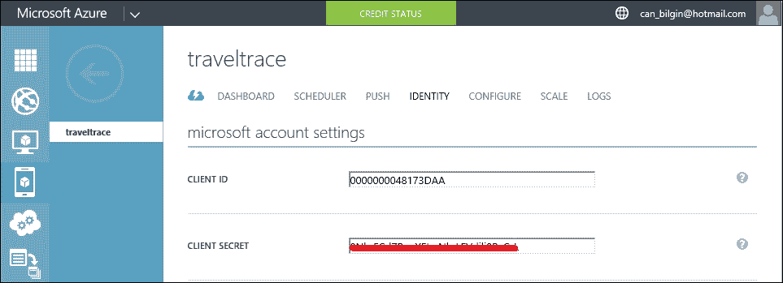

移动服务身份验证配置

在设置好移动服务的身份提供者之后，只需通过添加 Authorize 属性，就可以轻松保护 Web 服务项目。

```cs
[AuthorizeLevel(AuthorizationLevel.User)]
public class RegionController : TableController<Region>
```

在客户端应用程序中，通过在 Azure 移动服务 SDK 客户端上使用正确的身份验证提供者的`LoginAsync`方法，可以简单地处理身份验证。

```cs
MobileService.LoginAsync(this, MobileServiceAuthenticationProvider.MicrosoftAccount).ContinueWith((task) =>
{
    System.Diagnostics.Debug.WriteLine("Currently authenticated user's ID is {0}", task.Result.UserId);
});
```

结果是使用 Xamarin.Auth 组件接收到的相同的身份验证屏幕。

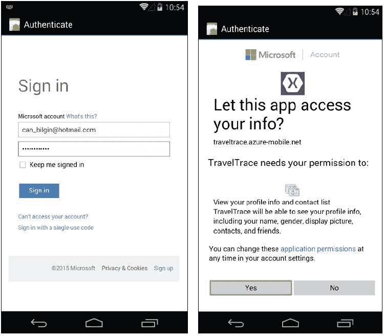

代理身份验证

Azure 云集成场景远不止这里所描述的。这个基于云的开发平台所包含的功能可以帮助开发者轻松且可扩展地增强他们的 Xamarin 应用程序。

# 摘要

本章概述了在 Xamarin 应用程序中创建连接应用程序时可以使用的各种网络通道。

由于现有 Web 服务协议的互操作性（无论是 SOAP/XML 还是 REST/JSON），Web 服务无疑是现代移动应用程序的基本列表之一。不幸的是，由于 Windows Communication Foundation 客户端基础设施不包括在 Windows Phone 运行时中，XML 服务与 Windows Phone 8.1 运行时的集成稍微困难一些（尽管它们仍然由 Windows Phone Silverlight 运行时支持）。然而，相同的 RESTful 服务代理可以在每个 Xamarin 目标平台和 Windows Phone 上使用。

讨论了如移动服务和 Azure Active Directory 之类的云集成选项，并提供了演示示例。这些技术中的每一个都为 Xamarin 移动应用程序提供了额外的连接性和集成机会。SignalR 是另一种网络技术，通过客户端应用程序和服务器之间的双向通信，为移动应用程序提供了额外的通信能力。

使用 TravelTrace 应用程序范围演示了几个常见的服务和 Web 实现模式，这些模式将在本书剩余部分的各种场景中使用。每个模式最初都针对不同的质量标识符。

最后，我们讨论了一些特定平台的网络选项。
