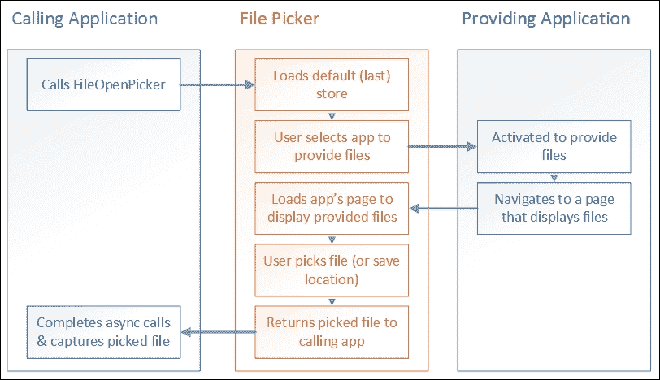
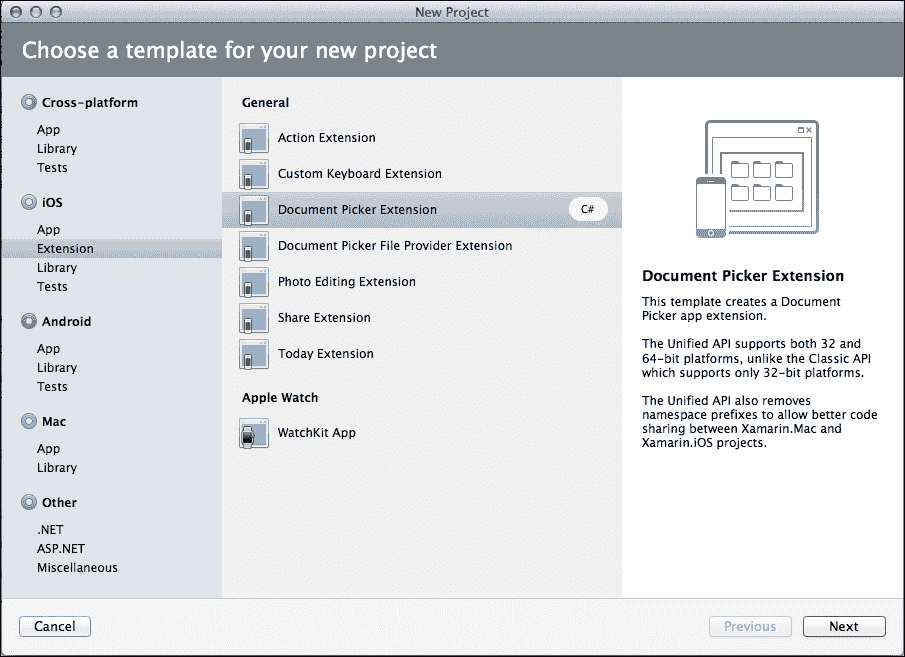
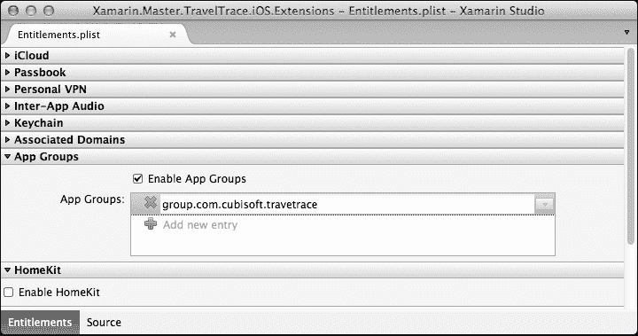
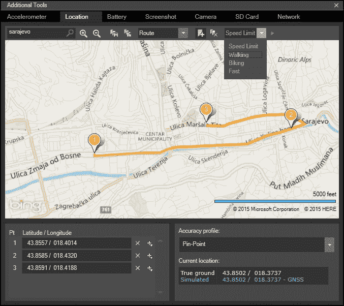
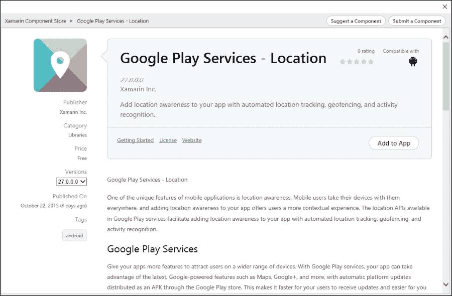
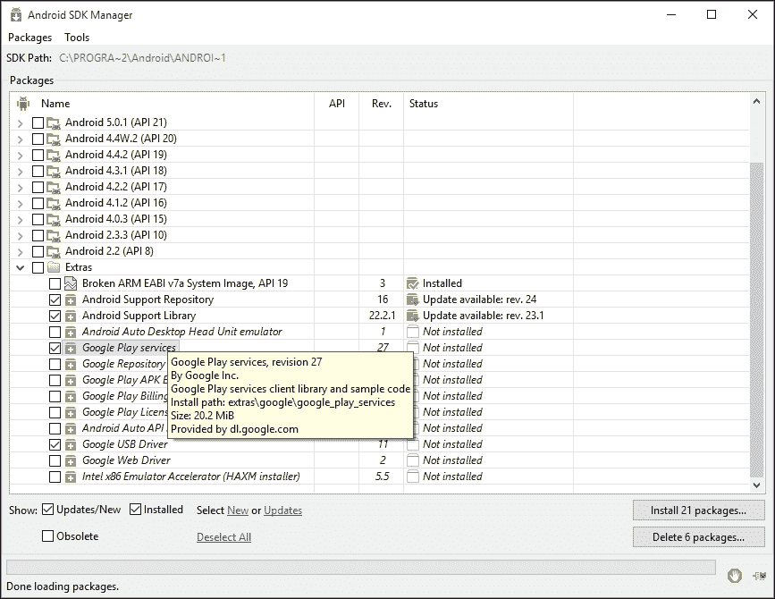
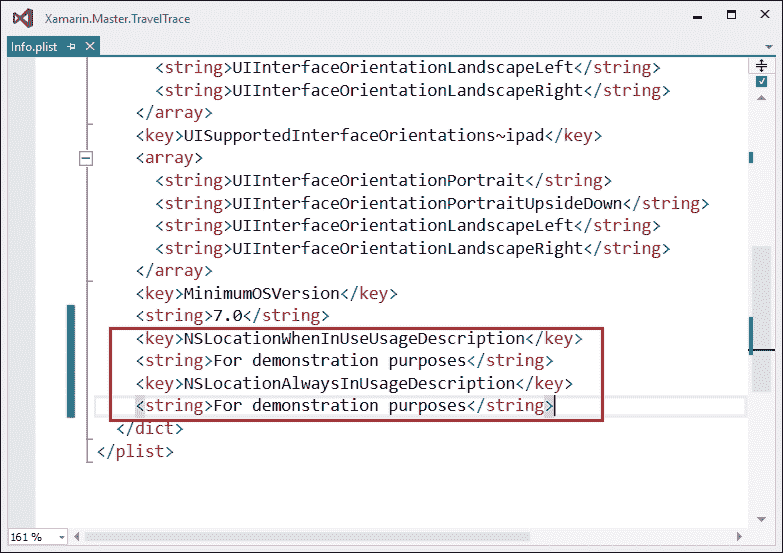
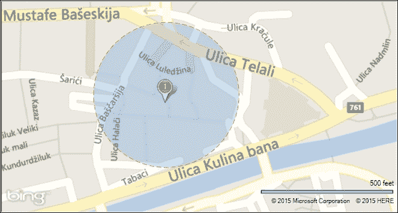
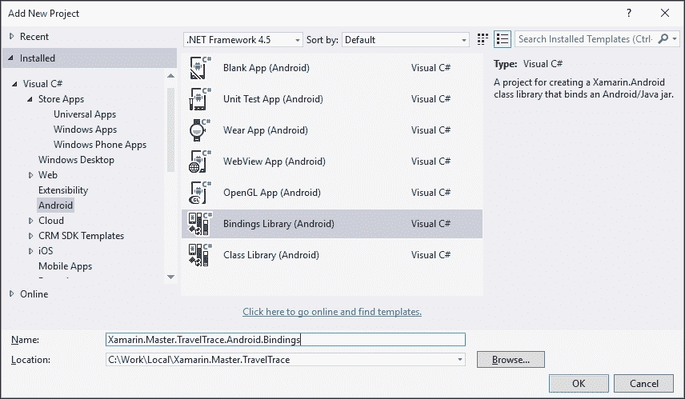
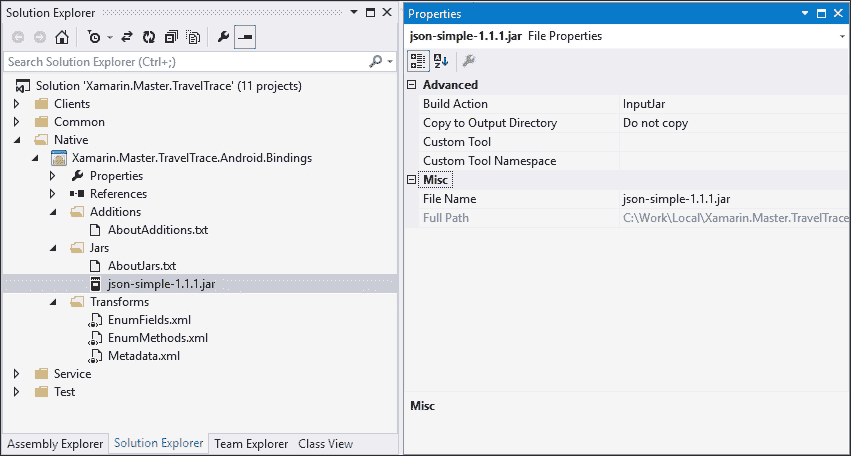

# 第六章。平台扩展

本章专注于特定平台的 API 和功能。它解释了可以在 Xamarin 应用程序中使用的某些外设。我们还将讨论原生库以及如何在跨平台 Xamarin 应用程序中包含它们。以下主题将被讨论：

+   内容共享

+   外设

+   位置数据

+   原生库

# 内容共享

每个 Xamarin 目标平台都实现了一种在应用程序之间共享格式化内容的策略。共享实现通过允许用户在任何其他应用程序中打开来自您的应用程序的文件来提高您应用程序的可见性。此外，这些类型的实现从原生角度为您的跨平台项目提供了额外的价值。

应用程序间的共享是通过底层运行时作为共享源和目标应用程序之间的经纪人来实现的。在 iOS 和 Windows Store 应用程序中，共享以抽象文件元素的形式进行。然而，Android 应用程序可以更进一步，通过共享可以被接收应用程序操作格式化数据来共享，这本质上允许源应用程序几乎充当数据存储库。

### 注意

在 Windows Store 中，应用程序可以主动共享内容，如媒体元素、URI、文本内容和其他类型的数据。然而，在这个实现策略中，即共享实现策略中，源应用程序必须启动共享过程。本书中描述的内容共享场景是关于目标应用程序通过源应用程序访问内容。

在 Windows Runtime 中，应用程序通过所谓的应用程序合约的用法相互交互或与操作系统交互。借助合约，应用程序可以沉浸到运行时中，并更接近成为运行时的一部分。

通过在 Android 上实现基本 `ContentProviders` 和在 iOS 平台上实现文档提供程序扩展，实现了相同的功能。

## 文件选择器和合约（Windows Store 应用程序）

Windows Runtime 中最常用的合约之一是文件打开选择器合约。在这个合约实现中，源应用程序必须实现当它被调用以为目标应用程序提供文件内容时的激活策略。当目标应用程序需要某种类型的文件时，运行时会列出所有可能声明这种类型在其应用程序清单中的源应用程序（例如，在 Windows Phone 上，当您想在邮件客户端中附加文档并附带一张图片时，OneDrive 应用程序会显示为可能来源之一）。

用户随后选择他们想要在当前应用程序中使用的文件，提供程序应用程序负责为目标应用程序创建或提供文件。



Windows Runtime 中的文件选择器合约

在这种方法中，文件不一定是实际的文档项，但它可以是概念性的。例如，如果我们要在 TravelTrace 应用程序中实现文件打开选择器，我们不需要在文件打开选择器中使用实际的文档来提供内容。共享的内容项可以是用户跟踪的之前的旅行，所选的旅行可以提供一个生成的剪贴簿或图像的拼贴，根据消费者应用程序请求的文档类型，可以是图像格式或 PDF 文档。

## 文档提供者扩展（iOS）

文档提供者扩展（在 iOS 8 中引入）允许应用程序（即消费应用程序）访问其应用程序沙盒之外的文档。文档提供者扩展有两方面。文档选择器视图控制器扩展为操作系统提供 UI 实现，以便在源应用程序被选为文档选择器视图中的文档源时显示。然而，文件提供者扩展负责提供文档级别的操作。

为了创建一个提供者扩展，我们可以在 Xamarin Studio 中使用现有的项目模板。



文档选择器扩展项目模板

一旦创建项目，我们就负责在故事板中创建视图并实现`DocumentPickerViewController`，以便当我们的应用程序被选中提供文件时，可用的文件在 UI 上列出。`DocumentPickerViewController`最初有两个需要我们注意的方法。`PrepareForPresentation`方法接收选择器模式（`Import`、`Open`、`ExportToService`或`MoveToService`），以便用户界面可以根据请求的操作进行准备。`OpenDocument`方法仅为了我们的方便而实现，以证明一旦用户选择了一个文档，我们应该准备相应的文件 URL，并使用`DismissGrantingAccess`方法将其传递给运行时。

需要记住的是，我们文档选择器扩展提供的 URL 应该已经指向一个实际文件，或者我们应该继续实现文档文件提供者扩展，该扩展将在消费应用程序显示文档选择器并用户选择文件，或者消费应用程序直接使用缓存的 URL 打开文件时提供文件。

在文档文件提供者扩展项目中，关键实现位于`StartProvidingItemAtUrl`方法。此方法使用提供的`FileCoordinator`类在目标 URL 处创建文件（例如，生成文件或从远程位置下载）。

```cs
public override void StartProvidingItemAtUrl (NSUrl url, Action<NSError> completionHandler)
{
  NSError error, fileError = null;
  NSData fileData;

  // TODO: get the file data for file at <url> from model
  fileData = new NSData ();

  FileCoordinator.CoordinateWrite (url, 0, out error, (newUrl) => fileData.Save (newUrl, 0, out fileError));

  if (error != null)
    completionHandler (error);
  else
    completionHandler (fileError);
}
```

扩展实现完成后，我们必须准备项目元数据条目。每个项目（包括扩展和容器应用程序）都需要使用**App Groups**功能。这个功能需要在**Entitlements**选项列表中设置。其他设置包括基本文档存储 URL、文档选择器支持的操作类型等。然而，这些配置值是在`Info.plist`选项列表中插入的。



文档提供者扩展的权限

为了将扩展添加到包含的应用程序中，我们只需要将它们作为引用添加到主项目中。如果你查看主项目文件，你会注意到引用是通过将`IsExtension`标志设置为 true 来添加的。

## ContentProvider 和 ContentResolver（Android）

安卓平台上的内容提供者充当数据存储库。这些存储库通过结构化端点描述（类似于网络服务上的 REST 端点）暴露给消费应用程序。使用提供的元数据，消费应用程序通过实现`ContentResolvers`来解析提供者的内容。使用内容提供者，应用程序可以公开已知的数据类型，如联系人列表照片或日历事件，以及自定义数据类型和格式化数据。

在此基础设施的消费端，Android 运行时已经默认实现了许多内容提供者，例如`Contacts`、`MediaStore`、`UserDictionary`等。这些提供者可以通过实现基类如`ContentResolver`和`CursorAdapter`来访问。`CursorAdapter`用于将`ContentResolver`检索到的数据馈送到 UI 列表视图控件。`ContentProvider` API 操作可能涉及列表查询和对单个记录的 CRUD 操作。

提供者应用程序负责注册一个对应用程序唯一的权限。权限条目可以描述为特定应用程序的基本内容 URI。它既可以添加到清单文件中，也可以在实现`ContentProvider`的类上使用属性条目。

```cs
[ContentProvider(new string[] { "com.xamarin.master.traveltrace.TripProvider" })]
public class TripDataProvider : ContentProvider
```

内容提供者还需要提供另一项重要的元数据，即 Mime-Type 信息。为了便于在消费应用程序中使用`CursorAdapter`，内容提供者需要为项目列表（以`vnd.android.cursor.dir`开头）以及单个项目（以`vnd.android.cursor.item`开头）提供 Mime-Type。

最后，内容提供者需要公开其他应用程序可用的数据的数据列。这是通过从基本抽象类中隐藏`InterfaceConstants`嵌套类来实现的。

```cs
public new static class InterfaceConsts
{
    public const string Id = "Id";
    public const string Name = "Name";
    public const string Description = "Description";
    public const string Date = "Date";
    public const string Location = "Location";
    public const string ContentPath = "ContentPath";
}
```

另一种可选的实现方法是创建一个`UriMatcher`类，这可以简化查询方法的实现过程。

```cs
private UriMatcher GetUriMatcher()
{
    var matcher = new UriMatcher(UriMatcher.NoMatch);

    // to get data...
    matcher.AddURI(Authority, _basePath, (int) QueryType.List);
    matcher.AddURI(Authority, _basePath + "/#", (int) QueryType.Single);

    return matcher;
}
```

最终实现与查询、更新、插入和删除方法相关。这些方法中的每一个都需要根据定义的抽象类返回`ICursor`实现。

```cs
public override global::Android.Database.ICursor Query(global::Android.Net.Uri uri, string[] projection, string selection, string[] selectionArgs, string sortOrder)
{
    switch ((QueryType) m_UriMatcher.Match(uri))
    {
        case QueryType.List:
            // TODO:
        case QueryType.Single:
            // TODO:
        default:
            throw new Java.Lang.IllegalArgumentException("Unknown Uri: " + uri);
    }
}
```

总体而言，虽然 Android 提供了更多内容共享的灵活性，但它使得其他应用程序消费源应用程序提供的数据变得稍微困难一些。在 Xamarin.Android 应用程序上，内容提供程序实现提供的数据无法在没有专门实现的情况下被其他应用程序消费。

# 外设

在本节中，我们将讨论几个通信协议，这些协议使应用程序能够与其他平台和其他设备进行通信。

## 蓝牙

蓝牙通信协议已成为移动设备上的一个宝贵功能。特别是随着与**物联网（IoT）**相关的技术的兴起，以及我们日常生活中使用的各种配件，我们对移动平台上的蓝牙堆栈的依赖性有所增加。

虽然 Xamarin.Android 应用程序和 Windows Runtime 应用程序都可以使用 GATT（蓝牙低功耗）和 RFCOMM（蓝牙串行），但 iOS 应用程序只能通过蓝牙低功耗协议进行通信。这种差异的主要原因是 Android 和 Windows Runtime 根据共享规范实现串行通信端口。然而，苹果使用一个专有的通信堆栈，并使用加密系统。这不幸地限制了串行通信仅限于苹果生产或符合标准的配件或设备之间。

对于 Xamarin.Android，蓝牙 API 位于`Android.Bluetooth`命名空间中。使用提供的类，开发者可以增强他们的应用程序，添加如下功能：

+   扫描可发现蓝牙设备（包括 LE 协议）

+   获取本地蓝牙适配器和配对设备的信息

+   使用 RFCOMM 协议创建串行通信套接字

+   同时作为 GATT 客户端或 GATT 服务器

只有在用户权限清单条目中声明蓝牙的情况下，才能访问蓝牙协议。

```cs
<manifest ... >
  <uses-permission android:name="android.permission.BLUETOOTH" />
  ...
</manifest> 
```

在 Windows Runtime 上，蓝牙相关功能在`Windows.Devices.Bluetooth`命名空间中实现。与 Android 中的功能集类似，Windows Runtime 蓝牙堆栈要求应用程序在应用程序清单中声明适配器访问要求和要使用的协议（对于某些特定设备和协议，蓝牙能力声明必须手动插入到清单中）。该平台的一个重要特性是，可以通过后台任务促进并保持蓝牙连接，使设备能够在后台或挂起状态下继续其操作。

对于 Xamarin.iOS，蓝牙低功耗（BLE）相关的实现需要使用`CoreBluetooth`框架。

目前在 Xamarin 商店中，用于跨平台外围设备集成的关键组件是 Monkey.Robotics 项目。在实现蓝牙 LE 和 Wi-Fi 的基本 API 时，可以使用此组件与一些其他供应商特定的外围设备，例如健康监测设备和智能手表。

## Wi-Fi Direct

Wi-Fi Direct 是另一种通信协议，允许 Wi-Fi 设备创建**点对点**（**P2P**）网络，并使用 Wi-Fi 适配器在不使用公共提供者网络连接的情况下交换信息。

在本书中描述的 Xamarin 目标平台中，只有 Android 平台支持此协议。Windows 10 平台将支持 Wi-Fi Direct；然而，此实现将仅针对基于 Windows 的设备。

在 Android 设备上，随着 Wi-Fi P2P 的引入，开发者可以创建能够以更高的速度和更长的距离进行通信的应用程序，这比蓝牙适配器要远得多。Wi-Fi P2P 功能是在 Android 4.0（API 级别 14）中引入的，并且符合 Wi-Fi 联盟的 Wi-Fi Direct 标准。

为了能够使用此功能，应用程序清单应包含`ACCESS_WIFI_STATE`、`CHANGE_WIFI_STATE`和`INTERNET`权限。

这些服务的访问是通过位于 Android.Net.Wifi.P2P 命名空间中的 WifiP2pManager 提供的。使用此管理器，应用程序可以广播、创建组、请求对等设备，并且开发者可以创建通过 Wi-Fi Direct 在 P2P 套接字上进行通信的应用程序。

## 近场通信

**近场通信**（**NFC**）协议为配对和广告场景（例如，NFC 标签）提供了一种易于使用的蓝牙替代方案。使用 NFC，可以在彼此靠近的移动设备之间创建套接字并传输数据。

不幸的是，NFC 协议是 iOS 设备上另一个不受支持的通信协议。（报告表明 iPhone 6 在技术上具有使用此协议的能力；然而，此 API 并未向开发者提供。）

然而，Windows Phone 和 Android 设备上的 NFC 堆栈实现了大多数相同的配置文件。本质上，在技术上可以在靠近的 Windows 和 Android 设备之间通过 NFC 进行通信（默认情况下，轻触发送功能作为一个跨平台功能工作）。尽管 Windows 设备使用专有消息方案（`Windows:`），但仍有第三方框架支持 NDEF。NDEF 是一个跨平台的消息方案，目前是 Android 的默认方案。

# 位置数据

现在，地理上下文（位置感知）对于应用程序变得越来越重要，尤其是运行在移动平台上的应用程序。例如，搜索引擎根据从客户端平台收集的位置信息优化结果，社交媒体和照片应用程序为帖子和中媒体项添加地理标签，还有许多其他关于*应用程序运行的方式或平台，而是位置*的数据用例。

在 Xamarin 平台上，位置信息是通过使用几个不同的来源提供的。其中最准确的是**GPS**（**全球定位系统**）。此选项消耗最多的电量，并且通常仅适用于前台应用程序。其他可以提供相对不太准确数据的选项是网络提供者，如 Wi-Fi 或蜂窝数据。iBeacon 是苹果公司引入的另一种技术，适用于 iOS 7+设备。iBeacon 兼容设备使用蓝牙 LE 协议传输位置信息，然后这种传输被手机和平板电脑上的蓝牙适配器使用。

在 Xamarin 目标平台上，可以通过系统事件和触发器主动访问位置信息。在每个平台上，对位置的访问都受到隐私设置的限制，并且始终由用户决定某个（或每个）应用程序是否可以访问位置服务。

## Android 位置和 Google Play 服务

在 Android 运行时的早期版本中，`android.location` API 是框架指定的模块，用于向应用程序添加位置感知。然而，在 Google Play Services SDK（兼容 Android v2.2、API 级别 8 或更高版本）发布后，Google 提供的位置 API 成为在 Android 平台上访问位置数据的首选方式。

`LocationManager`，一个`LocationServices`实现，是一个全局服务，可以在 Xamarin.Android 应用程序中通过应用程序上下文访问。为了获取位置信息，应用程序必须通过`ILocationListener`的实现订阅位置更新。

```cs
m_LocationService = GetSystemService(LocationService) as LocationManager;

if (m_LocationService != null)
{
    if (m_LocationService.IsProviderEnabled(LocationManager.GpsProvider))
    {
        // Get updates in min every 5 seconds for every minimum 2m change
        m_LocationService.RequestLocationUpdates(LocationManager.GpsProvider, 5000, 2, m_LocationListener);
    }
    else if (m_LocationService.IsProviderEnabled(LocationManager.NetworkProvider))
    {
        // Get updates in min every 10 seconds for every minimum // 10m change
        m_LocationService.RequestLocationUpdates(LocationManager.NetworkProvider, 10000, 10, m_LocationListener);
    }
}
```

在位置监听器接口中，有几个事件可以被利用。除了位置变化信息外，开发者还提供了与不同位置提供者状态变化相关的更新。

在上一个示例中使用的简单位置监听器实现将类似于以下内容：

```cs
public class LocationListener : Java.Lang.Object, ILocationListener
{
    public void OnLocationChanged(Location location)
    {
        Trace.WriteLine(string.Format("Lat:{0}, Long {1}", location.Latitude, location.Longitude), "OnLocationChanged");
    }

    public void OnProviderDisabled(string provider)
    {
        Trace.WriteLine(string.Format("Location Provider '{0}' is disabled", provider), "OnProviderDisabled");
    }

    public void OnProviderEnabled(string provider)
    {
        Trace.WriteLine(string.Format("Location Provider '{0}' is enabled", provider), "OnProviderEnabled");
    }

    public void OnStatusChanged(string provider, Availability status, Bundle extras)
    {
        Trace.WriteLine(string.Format("Location Provider '{0}' status changed to {1}", provider, status), "OnStatusChanged");
    }
}
```

监听器接口可以在当前的`Activity`本身或任何其他`JavaObject`类实现上实现。使用在第三章中定义的背景化技术，即*异步编程*，监听器接口也可以在自定义启动的服务上实现，并且应用程序可以通过服务数据直接（绑定场景）或通过服务持久化的信息接收位置变化的背景更新。

### 小贴士

在移动应用程序上测试位置信息可能很困难。为了便于 GPS 数据测试和诊断，Android SDK 和 Visual Studio Android 模拟器都配备了位置模拟功能。



模拟在路线上行驶的汽车

Visual Studio Android 模拟器还提供了模拟在路线或根据定义的标记和定义的间隔更改 GPS 位置上行驶的汽车或其他交通工具的功能。

在位置信息的基础上，使用位置提供者状态信息，可以更高效、更可靠地收集位置信息（例如，根据连接性和对精度的要求在 GPS 和网络提供的信息之间切换）。为了获取当前适用于应用程序范围的最佳提供者，可以使用`GetBestProvider`方法，并指定所需的精度标准（粗略或精确位置信息）和功耗标准（高、中、低）。

这种智能地在位置数据提供者之间切换是使用 Fused Location Provider（Google Play Services SDK）和 Google 位置服务而不是默认位置 API 的主要优势。



Google Play 服务 Xamarin 组件

可供 Xamarin.Android v4.8+开发者作为组件使用的 Xamarin 绑定库到 Google Play Services SDK，提供了一种简单的方法将各种服务，包括位置 API，集成到 Xamarin.Android 应用程序中。这些组件实现了 Java 绑定项目，并负责 Google 提供的 Android 库的繁琐实现和编译。

在安装 Google Play 服务的位置组件后，在尝试构建 Xamarin.Android 应用程序时，您可能会收到类似于以下这样的编译错误：

> *"没有找到与给定名称匹配的资源（在'value'处，值为'@integer/google_play_services_version')."*

这种错误的原因是 Xamarin 组件依赖于 Google Play Services SDK，并且 SDK 模块应该通过 Android SDK Manager 手动安装。



Android Google Play SDK

安装 SDK 模块后，Xamarin.Android 应用程序可以无错误地构建。

一旦设置和配置完成，就可以在 Xamarin 应用程序中初始化并使用`GoogleApiClient`类。`GoogleApiClient`需要实现两个接口以收集有关客户端连接状态的信息：`GoogleApiClient.IConnectionCallbacks`和`GoogleApiClient.IOnConnectionFailedListener`。

如果您正在实现的应用程序不依赖于位置数据的持续更新，而是只需要当前的位置，您可以使用`GoogleApiClient`上提供的`GetLastLocation`方法。此方法提供了一次性读取选项。

```cs
m_GoogleClient = new GoogleApiClient.Builder(this)
        .AddApi(Gms.Location.LocationServices.API)
        .AddConnectionCallbacks(this)
        .AddOnConnectionFailedListener(this)
        .Build();

m_GoogleClient.Connect();
```

为了接收融合位置提供者的实时更新，您必须为 Google 位置服务 API 实现`ILocationListener`接口。此监听器与默认的不同；它只包含一个用于位置变化的事件处理器实现。与数据提供者相关的事件不需要实现，因为融合位置提供者本身负责在位置数据提供者之间智能切换。

虽然提供者类型和提供者状态变化对我们使用融合位置提供者来说并不相关，但仍然可以通知融合提供者我们的应用程序范围需要哪种类型的准确性和优先级。为此，我们可以在订阅位置更新时使用`SetPriority`方法，并在`LocationRequest`上使用适当的标志。

+   **高精度（100）**：请求最精细的位置

+   **平衡电源/精度（102）（默认）**：请求`block`级别的精度（约 100 米精度）

+   **低电源（104）**：请求`city`级别的精度（约 10 公里精度）

+   **无电源（105）**：将位置更新设置为使用被动模式；等待发送到其他客户端应用程序的位置更新（也称为**骑乘**）

除了优先级之外，融合位置提供者还允许开发者设置其他重要的位置更新划分，例如最小间隔、最小位移和过期时间。

```cs
private async Task RequestLocationUpdates(GoogleApiClient apiClient)
{
    // Describe our location request
    var locationRequest = new Gms.Location.LocationRequest()
        .SetInterval(5000) // Setting the interval to 5 seconds
        .SetSmallestDisplacement(5) // Setting the smallest update delta to 5 meters
        .SetPriority(Gms.Location.LocationRequest.PriorityHighAccuracy)
        // Setting the priority to Fine and High Power
        .SetExpirationDuration(20000); // Stopping the location updates after 20 seconds.

    // Request updates
    await Gms.Location.LocationServices.FusedLocationApi
        .RequestLocationUpdates(apiClient, locationRequest, m_LocationListener);
}
```

不幸的是，Google Play 服务仅在 Android SDK 模拟器上预安装，而对于其他模拟器，必须在模拟器映像上下载并安装 Google 应用程序包。

## iOS 上的位置服务

在 iOS 平台上，位置数据通过`CoreLocation`库访问，类似于 Android 位置 API，位置变化通过事件代理的帮助发送给订阅的应用程序。`CLLocationManager`类使得从移动设备获取位置数据更新变得非常简单。

Xamarin.iOS 位置数据访问实现从创建所需的`Info.plist`条目开始，这将解释为什么应用程序需要访问用户的地理位置。为了做到这一点，我们必须编辑 Info.plist 文件，添加以下条目之一或两个：



位置信息的 Info.plist 条目

除了 Info.plist 条目外，还应记住，从 iOS 8 开始，应用程序必须明确请求使用位置数据的权限。为了获得用户的同意，位置管理器公开了两种方法：一种用于授权应用程序进行持续本地数据更新，另一种仅当应用程序处于前台时使用。

```cs
_LocationManager = new CLLocationManager();

_LocationManager.RequestWhenInUseAuthorization();

_LocationManager.RequestAlwaysAuthorization();
```

最后，我们可以订阅`LocationsUpdated`事件以接收最新的位置更新信息。

```cs
if (CLLocationManager.LocationServicesEnabled)
{
    _LocationManager.LocationsUpdated += (sender, eventArgs) =>
    {
        Debug.WriteLine(
            string.Format("Lat:{0}, Long {1}",
            eventArgs.Locations[0].Coordinate.Latitude,
            eventArgs.Locations[0].Coordinate.Longitude), "OnLocationChanged");
    };

    // Every ~500m an update
    _LocationManager.StartMonitoringSignificantLocationChanges();

    // Every 10m send an update event
    _LocationManager.DistanceFilter = 10;
    _LocationManager.StartUpdatingLocation();
}
```

可以使用公开的准则属性和方法进一步优化应用程序范围内的位置信息。也可以检索其他类型的信息，例如航向方向。然而，首先检查服务是否可用，并根据系统状态信息请求更新是很重要的。

```cs
if (CLLocationManager.HeadingAvailable)
{
    // update the heading
    _LocationManager.StartUpdatingHeading();
    _LocationManager.UpdatedHeading += (sender, eventArgs) =>
    {
        Debug.WriteLine("New Heading: X: {0} Y: {1} Z: {2}", 
            eventArgs.NewHeading.X, 
            eventArgs.NewHeading.Y,
            eventArgs.NewHeading.Z);
    };
}
```

## Windows Runtime 上的位置数据

在 Windows Runtime（Windows 商店应用程序）中，`Windows.Device.Geolocation`命名空间专门用于跟踪设备随时间变化的位置。`Geolocator`类替代了先前平台中的主要访问点，可以通过事件提供按需数据和信息更新。

与 iOS 访问请求类似，应用程序可以使用`RequestAccessAsync`方法请求应用程序用户的同意，并根据响应，可以通过`Geolocator`类访问方法或事件。

```cs
var accessStatus = await Geolocator.RequestAccessAsync();
if(accessStatus == GeolocationAccessStatus.Allowed)
{
    // Give update in every 5 meters
    Geolocator geolocator = new Geolocator { DesiredAccuracyInMeters = 5 };

    // Use StatusChanged event for Geolocator status change
    geolocator.StatusChanged += OnStatusChanged;

    // Use PositionChanged event for Geolocator status change
    geolocator.PositionChanged += (sender, eventArgs) =>
    {
        UpdateLocationData(eventArgs.Position);
    }

    // Get the current position
    Geoposition pos = await geolocator.GetGeopositionAsync();

    UpdateLocationData(pos);
}
```

## 地理围栏

地理围栏是一个抽象的边界，可以通过位置服务定义，以便创建地理围栏的应用程序在用户进入或离开此边界时从移动设备接收更新。这消除了轮询位置信息的需求，并为移动应用程序提供了不同的实现机会。

地理围栏的使用案例从简单的位置提醒到根据当前区域显示某些图像或信息创建的虚拟导游不等。

所有 Xamarin 目标平台都支持创建和使用地理围栏。例如，要在 iOS 平台上创建地理围栏，我们需要使用`CLCircularRegion`和`CoreLocation`库的位置监控功能。当移动设备进入和离开该区域时，会触发两个感兴趣的事件。

```cs
var region = new CLCircularRegion(
new CLLocationCoordinate2D(43.8592, 018.4315), 600, 
"Old Town");

if (CLLocationManager.IsMonitoringAvailable(typeof (CLCircularRegion)))
{
    _LocationManager.DidStartMonitoringForRegion += (sender, eventArgs) =>
    {
        Debug.WriteLine(string.Format("Starting region monitoring for {0}",
       eventArgs.Region.Identifier));
    };

    _LocationManager.RegionEntered += (sender, eventArgs) =>
    {
        CreateLocalNotification("Welcome to Old Town", 
            "Don't forget to take stroll down the Bascarsija and visit the historic national library!");
    };

    _LocationManager.RegionLeft += (sender, eventArgs) =>
    {
        Debug.WriteLine(string.Format("User left {0}",
        eventArgs.Region.Identifier));
    };

    _LocationManager.StartMonitoring(region);
}
```

此实现创建了一个围绕描述区域（由坐标定义的中心和半径为 600 米的圆）的地理围栏，并在指定的围栏被进入时发送通知，提供有关位置的信息。



老城区地理围栏

在 Android 平台上，相同的实现会结合使用`LocationServices`和`GeofenceBuilder`类来创建`IGeofence`类型的边界，并将它们添加到观察列表中。在 Android 平台上，一个重要的区别是事件通过代理处理，通常由一个意图服务实现。

实现开始于创建`GoogleApiClient`，就像之前的示例一样，一旦 API 客户端连接成功，我们就可以继续创建地理围栏（geofence(s)）和将要处理回调的意图服务（intent service）。

```cs
public void OnConnected(Bundle connectionHint)
{
    var intent = new Intent(this, typeof(GeofenceListenerService));
    var pendingIntent = PendingIntent.GetService(this, 0, intent, PendingIntentFlags.UpdateCurrent);

    var geoFence =
        new GeofenceBuilder().SetRequestId("OldTown")
            .SetTransitionTypes(Geofence.GeofenceTransitionEnter | Geofence.GeofenceTransitionExit)
            .SetCircularRegion(43.8592, 018.4315, 600)
            .SetExpirationDuration(200000) // Expiration Duration is obligatory
            .Build();

    var geofenceRequest = (new GeofencingRequest.Builder()).AddGeofence(geoFence).Build();

    //
    // The async version can be used instead
    // await LocationServices.GeofencingApi.AddGeofencesAsync(m_GoogleClient, geofenceRequest, pendingIntent);
    LocationServices.GeofencingApi.AddGeofences(m_GoogleClient, geofenceRequest, pendingIntent);
}
```

用于在位置更新时发送本地 toast 通知的意图服务实现看起来会类似于以下：

```cs
[Service(Exported = false)]
public class GeofenceListenerService : IntentService
{
    public GeofenceListenerService() : base("GeoFenceListenerService")
    {
    }

    protected override void OnHandleIntent(Intent intent)
    {
        var geofencingEvent = GeofencingEvent.FromIntent(intent);

        if (geofencingEvent.HasError)
        {
            int errorCode = geofencingEvent.ErrorCode;
            // TODO: Log Error
        }
        else
        {
            var requestId = geofencingEvent.TriggeringGeofences[0].RequestId;

            switch (geofencingEvent.GeofenceTransition)
            {
                case Geofence.GeofenceTransitionEnter:
                    if (requestId == "OldTown")
                    {
                        Toast.MakeText(Application.Context,
                            "Don't forget to take stroll down the Bascarsija and visit the historic national library!",
                            ToastLength.Short);
                    }
                    break;
                case Geofence.GeofenceTransitionExit:
                    Debug.WriteLine(string.Format("User left {0}", requestId));
                    break;
            }
        }

    }
}
```

Windows Store 应用用于地理围栏的类是`GeofenceMonitor`和`Geofence`/`GeoCircle`描述类。一个简单的`Geofence`类将包括一个`Geocircle`类和相关的 ID。

```cs
string fenceId = "OldTown";

// Define fence properties
BasicGeoposition position;
position.Latitude = 43.8592;
position.Longitude = 018.4315;
position.Altitude = 0.0;
double radius = 600; // in meters

Geocircle geocircle = new Geocircle(position, radius);

// Create the geofence
Geofence geofence = new Geofence(fenceId, geocircle);
```

一旦地理围栏初始化，我们可以使用`GeofenceMonitor`类添加地理围栏并订阅事件。

```cs
GeofenceMonitor.Current.GeofenceStateChanged += OnGeofenceStateChanged;
GeofenceMonitor.Current.StatusChanged += OnGeofenceStatusChanged;
```

还可以使用地理围栏状态更改事件作为触发后台任务的触发器，这样注册的应用程序就不需要在前台或甚至运行状态。

# 本地库

尽管 Xamarin 框架和.NET 核心在 Xamarin.Android 和 Xamarin.iOS 平台上的实现提供了大量的功能，但在某些情况下，在跨平台实现中包含本地代码是不可避免的。幸运的是，在这两个平台上都可以绑定或链接本地库。

## 管理可调用包装器（Android）

如前几章所述，管理可调用包装器是生成的管理代码库，它提供了一种通过 JNI 桥与 Java 运行时交互的方法，以执行某些 Java 库中的代码。

Java 库通常打包在 Java 归档文件（JAR 文件）中，使用编译后的 Java 库项目，可以创建一个绑定库，该库可以包含在 Xamarin.Android 应用中。

为了演示这种用法，我们将创建一个用于简单 JSON 解析库的 MCW。创建我们的绑定库的第一步是使用内置的项目模板创建我们的绑定项目。



绑定库项目

一旦创建绑定项目，我们可以将 JAR 文件复制到绑定项目中的创建的 Jars 文件夹。复制完成后，一个重要的步骤是检查 JAR 资源的**构建动作**配置。复制的 JAVA 库文件可以使用两种方式：

+   **输入 Jar**：这是一个将要用于生成管理包装器的 Java 库归档。

+   **引用 Jar**：这是一个仅用作参考而不用于生成包装器的 Java 库归档。



绑定库结构和构建动作

在将**构建动作**字段设置为`InputJar`（这个简单的库没有任何依赖项）之后，我们可以构建库项目。一旦构建成功，你可以在`<项目目录>\obj\Debug\generated\src`目录中看到生成的管理文件。

```cs
namespace Org.Json.Simple.Parser {

  // Metadata.xml XPath class reference: path="/api/package[@name='org.json.simple.parser']/class[@name='JSONParser']"
    [global::Android.Runtime.Register (
                "org/json/simple/parser/JSONParser", 
                DoNotGenerateAcw=true)]
  public partial class JSONParser : global::Java.Lang.Object {
        ...
```

查看主解析文件，你会注意到一个类的定义由一个 Android 运行时注册和一个从 Java 对象派生的类组成。关于类或类成员的元数据也有一个元数据注释，它定义了 Java 库包中项的路径。

如果我们想要更改命名空间（默认情况下，它们是从`api.xml`文件中定义的包名生成的），或者类或类的任何成员的名称，我们可以使用位于绑定项目中的`Metadata.xml`文件。`Metadata.xml`文件包含对从 jar 文件生成的 api.xml 文档的转换。这个 API 描述文档包含类定义和组件，其格式类似于 mono 编译器使用的 GAPI。通过包含在`Metadata.xml`中的转换，我们可以重新定义为生成的 C#项指定的托管名称。

例如，为了更改命名空间，我们会使用类似以下的描述：

```cs
<attr path="/api/package[@name='org.json.simple']" name="managedName">Json.Simple</attr>
```

对于更改类名，语法相当类似：

```cs
<attr path="/api/package[@name='org.json.simple']/class[@name='JSONParser']" name="managedName">JsonParser</attr>
```

最后，生成的类声明将类似于以下内容：

```cs
namespace Json.Simple.Parser {

  // Metadata.xml XPath class reference: path="/api/package[@name='org.json.simple.parser']/class[@name='JSONParser']"
  [global::Android.Runtime.Register ("org/json/simple/parser/JSONParser", DoNotGenerateAcw=true)]
  public partial class JsonParser : global::Java.Lang.Object {
```

## 链接与绑定（iOS）

在 Xamarin.iOS 平台上处理本地代码时，开发者可以使用几种选项。

如果我们处理的是简单的 C 或 Objective-C 静态实用库，则可以创建所谓的**胖二进制**，然后在编译时链接它们。在 Xamarin 运行时（记住 iOS 中没有 Xamarin 运行时，所有内容都编译成静态代码），可以使用 Xamarin 框架中的 P/Invoke 功能调用本地库中的方法。

另一个选项，它允许用户通过创建与 Objective-C 类和方法绑定的方式，与本地库建立更强的“桥梁”（以性能为代价），是创建到 Objective-C 类和方法的绑定。使用这种方法，类似于 Android 运行时的托管调用包装器，我们需要在 Objective-C 框架库上创建一个 C#包装器，并使用托管包装器来访问本地实现。尽管这种方法为原生代码提供了一个更直观和可管理的访问点，因为托管包装器本质上是一个高级实现，而 mono 编译器实际上生成 P/Invoke 和 Imports 来访问原生功能，所以它比本地链接稍微昂贵一些。

两种实现都需要从创建胖二进制文件作为起点。胖二进制是口语化的术语，用来描述包含所有可能的 CPU 架构（模拟器为 i386，设备为 ARMv7/ARM64）的本地二进制编译的二进制包。为了创建适用于所有 iOS 开发目标的通用二进制文件，需要使用 Mac OS X 中的命令行工具。

```cs
lipo -create -output libFatBinary.a libThinBinary-i386.a libThinBinary-arm64.a libThinBinary-armv7.a

```

在创建通用的二进制文件后，现在您可以将通用包复制到 Xamarin.iOS 应用程序的项目文件夹中，将构建操作设置为 **None**，并指示 mtouch 编译器在编译时链接二进制文件。对于构建说明，您需要在项目属性中的构建参数部分使用 gcc 标志。

```cs
-gcc_flags "-L${ProjectDir} -lFatBinary -force_load ${ProjectDir}/libFatBinary.a

```

根据使用的框架或二进制文件中是否包含 C++ 代码（例如，C++ 代码的 `–cxx` 标志），可能需要包含额外的参数。

另一个选项是在 Objective-C 绑定项目中创建一个 `LinkWith` 声明（在大多数情况下，这是自动创建的）。代码如下：

```cs
[assembly: LinkWith ("libFatBinary.a",     
LinkTarget.ArmV7|LinkTarget.ArmV7s|LinkTarget.Simulator|LinkTarget.Simulator64|LinkTarget.Arm64, 
ForceLoad = true, 
Frameworks = "CoreFoundation CoreData CoreLocation", 
LinkerFlags = "-lz -lsqlite3", 
IsCxx = true)]
```

在 Objective-C 绑定项目中，您必须首先熟悉原生库中的类型、方法和其他构造，以便能够开始实现绑定库中的相应托管类型。

### 小贴士

Objective Sharpie 是一个用于创建 Objective-C 库托管包装的有用工具。最初，它是 Xamarin 团队内部使用的一个工具，很快就被公开发布。尽管实现并不完整，并且它作为一个官方产品并不完全受支持，但它可以帮助加速对原生库的实现。

# 摘要

在本章中，我们讨论了一些与跨应用通信、外围设备和位置数据相关的特定平台特性。

使用特定平台的特性可以使您的应用程序更吸引平台用户，通过提供他们熟悉的场景并增强应用程序的本地外观和感觉。

与不同通信协议（如蓝牙、NFC 和 Wi-Direct）相关的特定平台特性可以用于各种场景。然而，这里描述的大多数协议和配置文件都针对 Android 和 Windows Phone。Xamarin.iOS 应用程序只能从蓝牙 LE 配置文件中受益。

位置感知是另一个所有移动应用程序都可以从中受益的特定平台实现。通过将位置上下文添加到应用程序的业务逻辑中，开发者可以为用户提供更个性化的体验。

最后，如果需要，Xamarin 为 Android 和 iOS 平台提供了绑定和链接原生库的重要功能，将复杂的移植任务简化为仅仅导入。

在下一章中，我们将讨论不同平台上的用户界面组件以及它们之间的相互关系。
