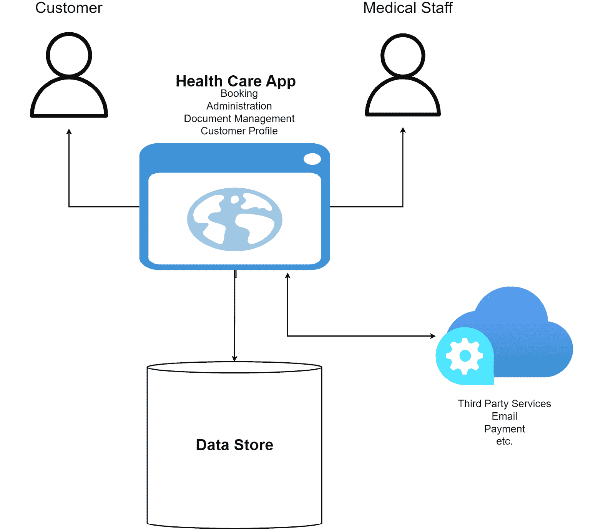
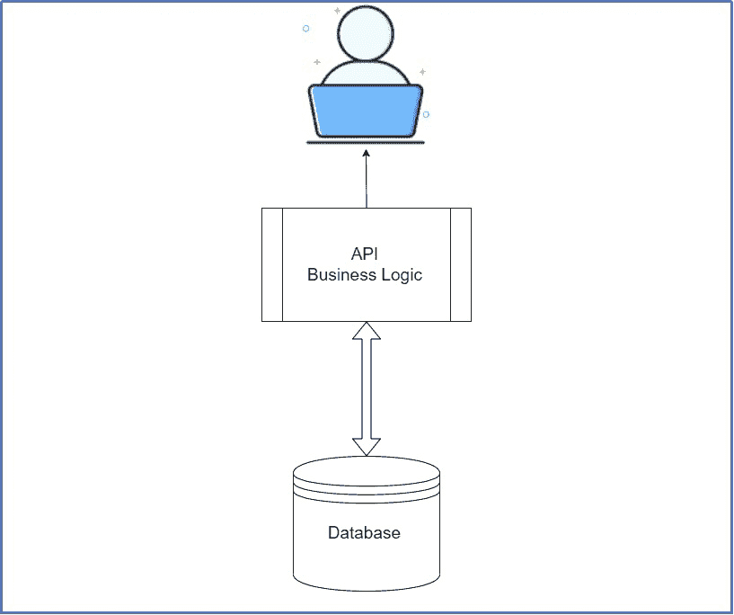
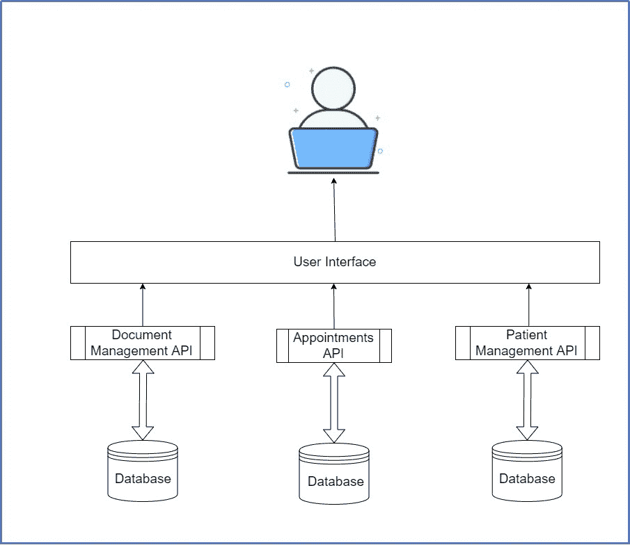

# 第一章：微服务简介——全景图

微服务正在软件开发的各个方面得到应用。微服务是一种软件开发风格，被誉为可以加快开发速度和效率，同时提高软件的可扩展性和交付。这种开发技术并非任何堆栈所独有，并在 Java、.NET 和 JavaScript（Node JS）开发中变得极为流行。虽然微服务的使用被视为一种模式，但还有几个子模式被采用，以确保代码库尽可能有效。

这本书的第一章是 15 章中的第一章，将涵盖微服务中使用的模式。我们将专注于使用.NET Core 开发堆栈实现它们，你将了解代码的编写和部署方式。你将了解设计和编码模式、第三方工具和环境，以及处理应用程序开发中某些场景的最佳实践。

在本章中，我们将涵盖以下主题：

+   深入探讨微服务和其关键元素

+   评估微服务的业务需求

+   确定实施微服务的可行性

# 深入探讨微服务和其关键元素

传统上，在软件开发中，应用作为单一单元或**单体**进行开发。所有组件都紧密耦合，对任何一个组件的更改都可能对整个代码库和功能产生连锁反应。这使得长期维护成为一个主要问题，并可能阻碍开发者快速推出更新。

微服务将帮助你评估单体应用，将其分解成更小、更易感知的应用程序。每个应用程序都将与更大项目的一个子部分相关联，这被称为**领域**。然后我们将以独立单元的形式开发和维护每个应用程序的代码库。通常，微服务作为 API 开发，可能或可能不相互交互以完成用户通过统一用户界面执行的操作。通常，微服务架构由一系列小型独立服务组成，这些服务通过**HTTP**（**REST API**）或**gRPC**（**Google 远程过程调用**）进行通信。一般概念是每个微服务都是自治的，具有有限的范围，并有助于集体松散耦合的应用程序。

## 构建单体应用

让我们想象我们需要构建一个健康设施管理网络应用程序。我们需要管理客户信息、预订预约、生成发票并向客户交付测试结果。如果我们列出构建此类应用程序所需的所有步骤，关键的开发和范围活动将包括以下内容：

1.  模拟应用，并为我们的客户入职、用户资料和基本文档确定需求范围。

1.  定义与特定医生预约流程相关的需求。医生有日程安排和专长，因此我们必须相应地展示预约时间段。

1.  当客户和医生之间找到匹配时，创建一个流程。一旦找到匹配，我们需要做以下事情：

    1.  预约医生的时间段

    1.  生成发票

    1.  可能收集访问的付款

    1.  向客户、医生和其他相关人员发送电子邮件通知

1.  模拟一个数据库（可能是关系型）来存储所有这些信息。

1.  为客户和医疗人员将使用的每个屏幕创建用户界面。

所有这些都作为一个应用程序开发，一个前端与一个后端、一个数据库和一个部署环境进行通信。此外，我们可能会添加一些第三方 API 集成，用于支付和电子邮件服务。这可以在多个服务器上进行负载均衡和托管，以减轻停机时间并提高响应速度：

图 1.1 – 应用构建

然而，这种单体架构引入了一些挑战：

+   尝试扩展功能可能会在多个模块中产生连锁反应，并引入新的数据库和安全需求。

*潜在解决方案*：执行彻底的单元和集成测试。

+   开发团队面临的风险是过度依赖特定的栈，这使得保持代码库现代化变得更加困难。

*潜在解决方案*：实施适当的版本控制策略，并在技术变化时进行增量更新。

+   随着代码库的扩展，更难对所有移动部件进行核算。

*潜在解决方案*：使用干净的架构方法保持代码库松散耦合和模块化。

事实上，我们可以通过某些架构决策克服一些这些挑战。这种一站式架构已经成为事实上的标准，坦白说，它很有效。这个项目架构简单，足够容易定义和开发，并且得到了大多数，如果不是所有，的开发栈和数据库的支持。我们已经建造了很长时间，也许我们已经忽视了我们在长期扩展和维护它们时面临的真正挑战。

*图 1.2* 展示了单体应用的典型架构：

图 1.2 – 一个用户界面由包含业务逻辑的 API 或代码库提供服务，并由一个数据库支持

现在我们已经探讨了单体方法及其潜在缺陷，让我们回顾一下使用微服务构建的类似应用程序。

## 构建微服务

现在，让我们以同样的应用为例，探讨如何使用微服务进行架构设计。在设计阶段，我们试图确定应用每个分块的特定功能。这就是我们识别我们的领域和子领域的地方；然后，我们开始为每个领域单独定义服务。例如，一个领域可能是客户管理。这个服务将仅处理用户账户和人口统计信息。此外，我们还可以定义预订和预约、文档管理，最后是支付。这又引出了另一个问题：当我们需要服务独立性时，这三个子领域之间存在依赖关系。使用*领域驱动设计*，我们确定依赖关系所在的位置，并识别可能需要重复某些实体的地方。例如，客户需要在预订和预约数据库以及支付中有所体现。如果我们为每个服务使用单独的数据库（这强烈推荐），这种重复是必要的。

微服务要求我们正确界定涉及多个服务参与的作业流程。例如，在预订时，我们需要做以下几步：

1.  获取进行预订的客户。

1.  确保首选时间段可用。

1.  如果可用，生成发票。

1.  收集付款。

1.  确认预约。

仅这个过程就在服务之间有一些来回处理。正确编排这些*服务对话*对于拥有无缝系统和充分替代单体方法至关重要。因此，我们引入了各种设计模式和实现代码及基础设施的方法。尽管我们将可能复杂的操作和工作流程分解成更小、更易感知的块，但我们最终处于同样的位置，即应用需要执行特定操作，并作为一个整体满足原始需求。

*图 1.3*展示了微服务应用的典型架构：

图 1.3 – 每个微服务都是独立的，并在单个用户界面中统一，以实现用户交互

既然你已经熟悉了单体和微服务方法之间的区别，我们可以探讨使用微服务设计模式的优缺点。

# 评估微服务的业务需求

如我们所见，微服务不易编写，并且伴随着许多横切关注点和挑战。在实施任何设计模式之前，始终问自己*为什么？*和*我真的需要它吗？*是非常重要的。

从高层次来看，这种方法的一些好处如下：

+   可伸缩性

+   可用性

+   开发速度

+   改进数据存储

+   监控

+   部署

在接下来的章节中，我们将深入探讨每个细节。

## 可扩展性

在单体方法中，要么全部扩展，要么不扩展。在微服务中，更容易扩展应用程序的各个部分，并针对出现的特定性能差距进行处理。如果疫苗变得广泛可用，并且鼓励客户在线预约，那么在最初的几周内，我们肯定会经历大量负载。我们的客户微服务可能不会受到太大影响，但我们需要扩展我们的预订和预约以及支付服务。

我们可以实现横向扩展，这意味着当负载增加时，我们可以分配更多的 CPU 和 RAM。或者，我们可以通过创建更多实例来垂直扩展服务以进行负载均衡。更好的方法取决于服务的需求。使用合适的托管平台和基础设施，我们可以自动化这一过程。

## 可用性

可用性意味着在特定时间系统处于操作状态的概率。这个指标与可扩展性能力密切相关，但也解决了底层代码库和托管平台的可靠性问题。代码库在这方面起着重要作用，所以我们希望尽可能避免单点故障。如果单点故障在任何时候失败，它将影响整个系统。例如，我们将探索*网关模式*，其中我们将所有服务聚合在一个入口点后面。为了确保我们的分布式服务保持可用，这个网关必须始终在线。

这可以通过拥有垂直实例来实现，这些实例平衡负载并分配网关的预期响应性，以及由此产生的底层服务的响应性。

## 开发速度

由于应用程序已被划分为域，开发者可以集中精力确保他们的功能集被高效地开发。这也促进了功能的快速添加、测试和部署。现在，为每个子域设立一个团队将变得实际可行。此外，确定域的需求并专注于较少的功能需求变得更加容易。每个团队现在都可以独立，并从开发到部署拥有服务。

这使得*敏捷和 DevOps*方法更容易实施，并且更容易为每个团队确定资源需求。当然，我们已经看到服务仍然需要通信，因此我们仍然需要在团队之间进行集成编排。所以，虽然每个团队都是独立的，但他们仍然需要使他们的代码和文档易于访问。版本控制也变得很重要，因为服务将随着时间的推移而更新，但这必须是一个管理过程。

## 改进数据存储

我们的单体应用程序使用一个数据库来处理整个应用程序。有时你可能会使用一个数据库来处理多个微服务，但这通常是不被推荐的，并且更倾向于*每个服务一个数据库*的方法。服务必须是自治的，并且可以独立开发、部署和扩展。如果每个服务都有自己的数据存储，这将更有意义。考虑到存储的数据类型可能会影响所使用的数据存储类型，这一点尤其正确。每个服务可能需要不同类型的数据存储，从关系型数据库存储如**Microsoft SQL Server**到基于文档的数据库存储如**Azure Cosmos DB**。我们希望确保数据存储的更改只会影响相关的微服务。

当然，这也会带来自己的挑战，因为需要在不同服务之间同步数据。在单体架构中，我们可以将所有步骤包裹在一个事务中，这可能会对可能长时间运行的过程造成性能问题。在微服务架构中，我们面临着编排分布式事务的挑战，这也引入了性能风险，并威胁到我们数据的即时一致性。在这种情况下，我们必须转向*最终一致性*的概念。这意味着当服务的数据发生变化时，它会发布一个事件，订阅服务使用该事件作为更新自身数据的信号。这种做法是通过事件溯源模式实现的。我们接受在一段时间内，数据可能在子域之间不一致的风险。通常使用**Kafka**、**RabbitMQ**和**Azure Service Bus**这样的消息队列系统来完成这项工作。

## 监控

分布式系统最重要的方面之一是监控。这使我们能够主动确保正常运行时间并减轻故障。我们需要能够查看我们的服务实例的健康状况。我们也开始考虑如何以统一的方式集中日志和性能指标，从而避免手动访问每个环境。**Kibana**、**Grafana**或**Splunk**等工具允许我们创建丰富的仪表板，并可视化有关我们服务的各种信息。

一项非常重要的信息是*健康检查*。有时，一个微服务实例可能正在运行，但无法处理请求。例如，它可能已经耗尽了数据库连接。通过健康检查，我们可以快速查看服务的健康状况，并将这些数据点返回到仪表板。

记录日志也是监控和故障排除的关键工具。通常，每个微服务都会在其环境中将日志写入自己的文件。从这些日志中，我们可以看到有关错误、警告、信息和调试消息的信息。然而，这对于分布式系统来说并不高效。在这种情况下，我们使用日志聚合器。这为我们提供了一个中央区域，可以从仪表板中搜索和分析日志。您可以从几个日志聚合器中进行选择，例如 **LogStash**、**Splunk** 或 **PaperTrail**。

## 部署

每个微服务都需要能够独立部署和扩展。这包括我们服务使用的所有安全、数据存储和附加资产。它们必须都存在于物理或虚拟服务器上，无论是在本地还是在云端。理想情况下，每个物理服务器都将拥有自己的内存、网络、处理和存储。虚拟基础设施可能具有相同的物理服务器，并为每个服务分配适当的资源。在这里，我们的想法是每个微服务实例与其他实例隔离，不会竞争资源。

现在，每个微服务将需要其自己的包和支撑库集。当在不同的机器（物理或虚拟）及其操作系统上配置时，这又成为另一个挑战。我们通过将每个微服务打包为容器镜像并作为容器部署来简化这一点。容器将封装构建服务所使用的技术的细节，并提供操作所需的全部 CPU、内存和微服务依赖项。这使得微服务易于在测试和生产环境之间迁移，并提供了环境一致性。

**Docker** 是首选的容器管理系统，与容器编排服务紧密协作。在多台机器上运行多个容器时，编排变得必要。我们需要在正确的时间启动正确的容器，处理存储考虑事项，并解决潜在的容器故障。所有这些任务都不适合手动处理，因此我们寻求 **Kubernetes**、**Docker Swarm** 和 **Marathon** 的服务来自动化这些任务。最好将所有部署步骤自动化，并尽可能降低成本。

然后，我们寻求实施一个集成的管道，以尽可能少的努力处理服务的持续交付，同时保持尽可能高的一致性水平。

在本节中，我们已经探讨了相当多。我们回顾了为什么我们可能会考虑在我们的开发工作中使用微服务方法。我们还调查了一些最常用的技术。现在，让我们将注意力转向证明我们使用微服务的合理性。

# 确定实施微服务的可行性

随着我们探索微服务方法，我们看到它确实解决了某些问题，同时也引入了一些新的关注点。微服务方法当然不是解决你的架构挑战的救世主，它引入了许多复杂性。这些关注点和复杂性通常通过设计模式来解决，使用这些模式可以节省时间和精力。

在本书中，我们将探讨我们面临的最常见问题，并查看帮助我们解决这些关注点的设计模式概念。这些模式可以按以下方式分类。

让我们探索每个模式包含的内容：

+   **集成模式**：我们已经讨论过，微服务需要相互通信。集成模式旨在统一我们完成这一目标的方式。集成模式管理我们用于实现跨服务通信的技术和技巧。

+   **数据库和存储设计模式**：我们知道，在管理分布式服务中的数据时，我们将面临挑战。为每个服务提供自己的数据库似乎很简单，直到我们需要确保数据在不同数据存储之间保持一致性。有一些模式对我们保持对每次操作后所看到内容的信心至关重要。

+   **弹性、安全和基础设施模式**：这些模式旨在为即将到来的风暴带来平静和安慰。鉴于我们已经确定的所有移动部件，确保尽可能多的自动化和部署一致性至关重要。此外，我们还想确保在系统需求和良好的用户体验之间平衡安全。这些模式帮助我们确保我们的系统始终以峰值效率运行。

接下来，让我们讨论将.NET Core 作为我们的微服务开发堆栈。

## 微服务和.NET Core

本书讨论了使用.NET Core 实现微服务和设计模式。我们已经提到，这种架构风格是平台无关的，并已使用多个框架实现。然而，相比之下，ASP.NET Core 使微服务开发变得非常简单，并提供了许多好处，包括云集成、快速开发和跨平台支持：

+   在你的电脑上运行`dotnet new webapi`。如果你更喜欢功能齐全的 Visual Studio IDE，那么你可能仅限于 Windows 和 macOS。无论操作系统如何，你都将拥有成功所需的所有工具。

+   **稳定性**：在撰写本书时，最新的稳定版本是*.NET 7*，具有标准支持期限。.NET 开发团队始终在推动边界，并确保每个主要版本发布时保持向后兼容性。这使得升级到下一个版本变得更加容易，你不必担心一次性出现太多破坏性变化。

+   **容器化和扩展**：ASP.NET Core 应用程序可以轻松地安装在*Docker*容器上，虽然这并不一定是新的，但我们都能欣赏到保证的渲染速度和质量。我们还可以利用 Kubernetes，并利用 K8s 的所有功能轻松扩展我们的微服务。

.NET 开发已经走得很远，现在是时候利用他们的工具和服务来推动我们能够构建的边界了。

# 摘要

到现在为止，我希望你对微服务有了更好的理解，为什么你可能或可能不会最终使用这种架构风格，以及使用设计模式的重要性。在这本书的每一章中，我们将探讨如何使用设计模式，结合.NET Core 和多种支持技术，开发一个**坚实**和可靠的基于微服务的系统。

我们将保持现实态度，探讨每个设计决策的优缺点，并研究各种技术如何在我们整合所有内容中发挥关键作用。

在本章中，我们探讨了设计单体和微服务的区别，评估了构建微服务的可行性，并探讨了为什么.NET Core 是构建微服务的优秀选择。

在下一章中，我们将探讨如何在我们的微服务应用程序中实现**聚合器模式**。
