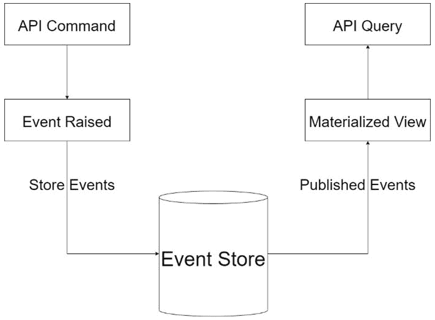

# 第六章：应用事件源模式

在上一章中，我们探讨了 CQRS 中的一个流行模式。这个模式鼓励我们创建代码和数据源之间的清晰分离，这些数据源控制读写操作。有了这种分离，我们可能会在操作之间出现数据不同步的情况，这引入了需要额外技术来确保数据一致性的需求。

即使没有 CQRS，我们也必须应对典型的微服务模式，其中每个服务都期望有自己的数据存储。回想一下，将会有需要在不同服务之间共享数据的情况。需要有一种机制能够充分地在服务之间传输数据，以便它们保持同步。

**事件源**被誉为解决这一问题的方案，其中引入了一个新的数据存储，它跟踪所有发生的命令操作。这个数据存储中的记录被认为是事件，并包含足够的信息，以便系统跟踪每个命令操作发生的情况。这些记录被称为事件，它们充当事件驱动或异步服务架构的中间存储。它们还可以作为审计日志，因为它们将存储所有必要的详细信息，以便回放对领域所做的更改。

在本章中，我们将探讨事件源模式，并证明其作为解决我们可能不同步数据库的解决方案的合理性。

在阅读本章后，你将能够做到以下事项：

+   了解事件是什么以及事件源能为你做什么

+   在你的应用程序代码中应用事件源模式

+   使用 CQRS 模式在事件之间创建事件和读取状态

+   使用关系型或非关系型数据库创建事件存储

# 技术要求

本章中使用的代码参考可以在 GitHub 上的项目仓库中找到，该仓库托管在[`github.com/PacktPublishing/Microservices-Design-Patterns-in-.NET/tree/master/Ch06`](https://github.com/PacktPublishing/Microservices-Design-Patterns-in-.NET/tree/master/Ch06)。

# 什么是事件？

在软件开发背景下，事件指的是由于某个动作完成而发生的事情。然后，事件被用来执行后台操作，如下所示：

+   为分析目的存储数据

+   完成动作的通知

+   数据库审计

## 事件的关键属性

事件可以用来构建任何应用程序核心功能的基础。虽然这个概念可能适用于许多情况，但了解事件的一些关键属性，以及正确界定引入它们的需求，并在我们的实现中保持某些标准，对我们来说非常重要：

+   **不可变性**：这个词指的是对象的不变性。在事件的上下文中，一旦某件事情发生，它就变成了事实。这意味着我们无法改变它或现实世界中的结果。我们将这个相同的特性扩展到我们的事件中，并确保它们在生成后不能被更改。

+   **单次发生**：每个事件都是唯一的。一旦生成，它就不能重复。即使后来发生相同的事情，也应该被视为一个新的事件。

+   **历史性**：事件应该始终代表一个时间点。这样，我们可以追溯过去发生了什么以及何时发生。这种纪律也体现在我们命名事件的方式上，我们使用过去时来描述事件。

事件在其最佳状态下不包含任何行为或业务逻辑。它们通常只作为时间点的数据收集单元，并帮助我们跟踪应用程序中不同时间点发生的事情。

既然我们已经对事件是什么以及为什么在高级别使用它们有了很好的了解，让我们专注于事件和事件源模式的更多实际用途。

# 事件源模式能为我做些什么？

使用微服务架构构建的应用程序被设计成有一组松散耦合且独立的微服务。采用**数据库-服务模式**，我们进一步将每个服务隔离，为它提供一个独立的数据存储。这现在给我们在服务之间保持数据同步带来了独特的挑战。考虑到我们需要在 ACID 原则上进行妥协，这变得更加困难。我们可以回忆一下，ACID 这个缩写代表**原子性、一致性、隔离性和持久性**。在这个上下文中，我们最关心的是原子性原则。我们无法保证所有的写操作都将作为一个单元完成。原子原则规定，所有数据操作应该作为一个单元完成或失败。鉴于允许使用不同的技术来处理数据存储，我们无法绝对保证这一点。

考虑到所有这些因素，我们转向一个新的模式，称为事件源，它允许我们持久化跟踪每个服务中数据发生的所有活动的消息。这个模式对于服务之间的异步通信特别有用，我们可以以**事件**的形式跟踪所有变化。这些事件可以充当以下角色：

+   **持久事件**：事件包含足够的信息来通知和重新创建领域对象

+   **审计日志**：每次更改都会生成事件，因此它们可以双重作为审计

+   **实体状态识别**：我们可以使用事件按需查看实体的即时状态

跟踪实体变化的想法被称为**重放**。我们可以分两步重放事件：

1.  获取为给定聚合存储的所有或部分事件。

1.  遍历所有事件并提取相关信息以刷新聚合实例。

事件溯源本质上是通过使用**聚合 ID**和**时间戳**以某种方式查询记录。聚合 ID 代表原始记录的唯一标识符列，或主键值，该记录引发了事件。时间戳代表事件被引发的时间点。为此所需的查询对于关系型和非关系型事件存储看起来相似。事件回放操作要求我们遍历所有事件，获取信息，然后改变目标聚合的状态。除了聚合 ID 和时间戳之外，我们还将拥有填充聚合所需数据位所需的所有信息。

现在，让我们回顾一下在我们的系统中使用事件的一些好处。

## 事件溯源的优点

我们一直在研究跟踪针对我们的数据发生的操作历史记录的想法，特别是我们的聚合。我们已经遇到了事件和回放的概念。现在让我们看看事件回放是什么，它们可能如何对我们有益，以及使用事件的其他好处。

事件回放以及我们执行更新的方式取决于聚合是否为领域类。如果聚合依赖于领域服务进行操作，我们需要明确，回放并不是关于重复或重做命令。根据我们对 CQRS 的理解，命令会改变数据库中的状态和数据。这也可能是一个可能产生事件数据的长期运行操作，我们可能不希望这样。回放是关于查看数据并执行逻辑以提取信息。另一方面，事件回放复制事件的效果并将它们应用到聚合的新实例上。总的来说，存储的事件相对于采用该技术的应用程序可能会有不同的处理方式。

事件是存储在比纯状态更低级别的数据。这意味着我们可以重复使用它们来构建我们需要的任何数据投影。在 CQRS 项目结构中的读取数据存储、数据分析、商业智能，甚至人工智能和模拟都可以使用这些数据的具体项目。从上下文来看，如果我们有一个事件流并且可以提取一个特定的子集，那么我们可以回放它们并执行即兴的计算和流程以生成定制和可能的新信息。事件是恒定的，现在和将来始终相同。这是一个额外的优点，因为我们始终可以确信我们可以依赖数据的一致性。

就像生活中一样，每一组好处都伴随着一些持续存在的弊端。让我们来探讨一下关于事件溯源的一些普遍关注点。

## 事件溯源的缺点

在探索事件溯源时，我们必须牢记，我们需要引入额外的数据存储和可能妨碍应用程序性能的额外服务。让我们回顾一些关注点。

性能在应用程序中始终很重要。因此，当我们引入新的模式或一系列流程时，我们应谨慎确保性能影响最小。当我们需要处理大量事件以重建数据时会发生什么？这可能会迅速变成一个基于已记录事件数量的密集型操作，而这个数量只会增长，因为事件存储将是一个**只读**的数据存储。

为了解决这个问题，我们会对最近修改过的聚合状态和业务实体进行快照。然后我们可以使用这些快照作为记录的存储版本，并作为数据的最新版本使用，从而避免需要迭代大量事件。这个操作最好与我们的 CQRS 模式配对的**只读**数据存储相辅相成。快照将用于未来的读取操作。

现在我们已经探讨了该模式的一些更严重的后果以及可以用来减少它对我们应用程序可能产生影响的技巧，让我们回顾一下事件溯源和领域事件是如何相互关联的，以便我们能够加强我们的基础知识。

# 什么是领域事件？

在本书的早期部分，我们讨论了将领域驱动设计（DDD）用作设计模式，帮助我们确定在开发我们的微服务应用程序时可能需要的不同服务。事件可以用于实现此模式，帮助我们在我们限定的上下文中建模预期的结果。事件的范围基于在限定的上下文中建立的通用语言，并受到领域内决策的影响。

在领域内，聚合负责创建领域事件，我们的领域事件通常基于某些用户操作或命令的结果而触发。需要注意的是，领域事件不是基于以下操作触发的：

+   按钮点击、鼠标移动、页面滚动事件或简单的应用程序异常。事件应基于限定的上下文中建立的通用语言。

+   来自其他系统或当前上下文之外的事件。正确建立每个领域上下文之间的边界是很重要的。

+   简单的用户系统请求。在这个阶段，用户请求是一个命令。事件是基于命令的结果触发的。

现在我们来更好地理解为什么领域事件对于实现事件溯源模式至关重要。

## 领域事件与事件溯源

事件溯源被实现，以提供一个单一参考点，用于在有限上下文中发生的历史。简单来说，事件溯源使用领域事件来存储聚合体经历过的状态。我们已经看到，事件溯源将使我们存储记录 ID、时间戳以及帮助我们理解数据当时外观的详细信息。在有限上下文中正确实现 **领域事件** 将为事件溯源的良好实现奠定基础，因此适当的范围和实现非常重要。

使用 **MediatR** 库在代码中实现领域事件可以相对简单，这个库在我们的 CQRS 模式实现中起着至关重要的作用。在下一节中，我们将探讨调整我们的应用程序以实现领域事件。

## 在我们的应用程序中探索领域事件

现在，让我们考虑将领域事件引入我们的预约预订系统。就我们所见，当在我们的系统中预订预约时，我们需要完成几个活动。我们可能还需要扩展我们系统的功能，以支持可能需要对原始预约进行更改的想法，并且应该跟踪这些更改。

让我们使用电子邮件派发活动。这需要在预约被系统接受并保存时发生。目前，我们的 `CreateAppointmentHandler` 将处理该情况下所需的所有内容。然后我们遇到了分离关注点的挑战，因为我们可能不希望我们的处理器负责太多动作。我们将电子邮件派发操作分离到其自己的处理器中会做得很好。

使用 MediatR，我们可以引入一种新的处理器类型，称为 `INotificationHandler<T>`。这个新的基类型允许我们定义与从继承自另一个 MediatR 基类型 `INotification` 的数据类型建模的事件相关的处理器。这些事件类型应该根据其创建的动作来命名，以方便使用，并将作为我们的 `INotificationHandler<T>` 中的泛型参数。我们的 `INotificationHandler<T>` 基类型将被继承，以执行与所需额外动作相关的任何特定动作。

在代码中，我们希望从一些基本的基类型开始，这将帮助我们定义我们的具体事件类型。第一个将是 `IDomainEvent`，它将作为所有后续领域事件的基类型。其定义看起来像这样：

```cs
public interface IDomainEvent : INotification
{}
```

我们的用户界面继承自 MediatR 内置的 `INotification` 接口，因此任何派生的数据类型也将自动成为通知类型。这个 `IDomainEvent` 接口还帮助我们强制执行任何必须存在于任何事件对象中的数据，例如动作的日期和时间。

现在我们有了基本类型，让我们定义我们的派生事件类，用于预约创建时。我们想要确保我们的事件类型名称准确地描述了引发事件的动作。因此，我们将此事件类型命名为 `AppointmentCreated`。我们简单地从我们的 `IDomainEvent` 接口继承，然后定义与事件所需数据相对应的额外字段：

```cs
public class AppointmentCreated : IDomainEvent
    {
        public Appointment { get; set; }
        public DateTime ActionDate { get; private set; }
        public AppointmentCreated(Appointment appointment,
          DateTime dateCreated)
        {
            Appointment = appointment;
            ActionDate = dateCreated;
        }
        public AppointmentCreated(Appointment appointment)
          : this(appointment, DateTime.Now)
        {
        }
    }
```

在我们的 `AppointmentCreated` 派生事件类型中，我们为我们的预约定义了一个属性和一个构造函数，确保在创建 `Appointment` 对象时存在。在这种情况下，您需要决定您需要多少或多少信息来有效地处理事件。例如，某些类型的事件可能只需要预约的 ID 值。但是，请务必正确地界定范围，发送所需的所有信息。您不希望只发送 ID，然后需要查询额外的详细信息，并冒着许多事件处理器尝试仅从 ID 值获取详细信息的风险。

现在，让我们看看如何定义我们的事件类型处理器。请注意，我说的是 *处理器*，因为根据发生的事件，定义多个事件处理器是可能且可行的。例如，当预约被创建时，我们可能有一个处理器会更新事件存储的新记录，或者有一个处理器会发送电子邮件警报，与更新 **SignalR** 集线器等分开。

为了便于更新事件存储，我们首先需要定义一个看起来像这样的处理器：

```cs
public class UpdateAppointmentEventStore :
  INotificationHandler<AppointmentCreated>
    {
        private readonly AppointmentsEventStoreService
          _appointmentsEventStore;
        public UpdateAppointmentEventStore
          (AppointmentsEventStoreService
            appointmentsEventStore)
        {
            this._appointmentsEventStore =
              appointmentsEventStore;
        }
        public async Task Handle(AppointmentCreated
         notification, CancellationToken cancellationToken)
        {
            await _appointmentsEventStore.CreateAsync
              (notification.Appointment);
        }
    }
```

我们的 `AppointmentCreated` 事件类型用作我们的 `INotificationHandler` 的目标类型。这就是添加特定逻辑序列到引发事件的全部内容。这也帮助我们分离关注点，更好地隔离与引发事件相关的代码片段。我们的通知对象包含预约记录，我们可以轻松地使用所需的数据。

当事件发生时，此代码将自动触发并相应地处理事件存储更新操作。

让我们看看我们的将发送电子邮件警报的事件处理器：

```cs
public class NotifyAppointmentCreated :
  INotificationHandler<AppointmentCreated>
    {
        private readonly IEmailSender _emailSender;
        private readonly IPatientsRepository
          _patientsRepository;
        public NotifyAppointmentCreated(IEmailSender
          emailSender, IPatientsRepository
            patientsRepository)
        {
            this._emailSender = emailSender;
            this._patientsRepository = patientsRepository;
        }
        public async Task Handle(AppointmentCreated
         notification, CancellationToken cancellationToken)
        {
            // Get patient record via Patients API call
            var patient = await _patientsRepository.Get
              (notification.Appointment.
                PatientId.ToString());
            string emailAddress = patient.EmailAddress;
            // Send Email Here
            var email = new Email
            {
                Body = $"Appointment Created for
                  {notification.Appointment.Start}",
                From = "noreply@appointments.com",
                Subject = "Appointment Created",
                To = emailAddress
            };
            await _emailSender.SendEmail(email);
        }
    }
```

注意，尽管我们没有直接访问患者的记录，但我们有他们的 ID。有了这个值，我们可以进行同步 API 调用来检索可以帮助我们制作和发送通知电子邮件的额外详细信息。

同样地，如果我们想为 SignalR 操作定义事件处理器，我们可以简单地为相同的事件类型定义第二个处理器：

```cs
public class NotifySignalRHubsAppointmentCreated :
  INotificationHandler<AppointmentCreated>
{
  public Task Handle(AppointmentCreated notification,
    CancellationToken cancellationToken)
  {
    // SignalR awesomeness here
    return Task.CompletedTask;
  }
}
```

现在我们能够引发事件，我们可以对我们的应用程序进行一些重构以反映这一点。我们可以重构我们的 `CreateAppointmentHandler` 和 `CreateAppointmentCommand` 类，使它们返回 `Appointment` 对象而不是之前定义的字符串值：

```cs
public record CreateAppointmentCommand(int
  AppointmentTypeId, Guid DoctorId, Guid PatientId, Guid
    RoomId, DateTime Start, DateTime End, string Title) :
      IRequest<Appointment>;
public class CreateAppointmentHandler :
  IRequestHandler<CreateAppointmentCommand, Appointment>
public async Task<Appointment> Handle
  (CreateAppointmentCommand request, CancellationToken
    cancellationToken){ … }
```

通过这次调整，我们现在可以检索创建的预约对象，并从原始的调用代码（控制器）中发布事件。我们预约 API 的 `POST` 方法现在看起来是这样的：

```cs
// POST api/<AppointmentsController>
        [HttpPost]
        public async Task<ActionResult> Post([FromBody]
         CreateAppointmentCommand createAppointmentCommand)
        {
            // Send appointment information to create
               handler
            var appointment = await
              _mediator.Send(createAppointmentCommand);
            //Publish AppointmentCreated event to all
              listeners
            await _mediator.Publish(new AppointmentCreated
              (appointment));
            // return success code to caller
            return StatusCode(201);
        }
```

现在我们使用 MediatR 库中的 `Publish` 方法来引发一个事件，并且所有被定义用于监视指定事件类型的处理器都将被激活。

这些代码重构将引入更多的代码和文件，但它们确实有助于帮助我们维护一个分布式和松散耦合的代码库。通过这项活动，我们已经回顾了如何干净地引入领域事件到我们的应用程序中，现在我们需要欣赏如何存储我们的事件。

# 创建事件存储

在我们进入创建事件存储的范围阶段之前，对我们来说，完全理解什么是事件存储非常重要。对这一主题的简单搜索可能会从各种来源产生许多结果，每个来源都引用了不同的定义。对于这本书，我们将得出结论，事件存储 *是一个有序的、易于查询的、持久化的长期记录源，它表示数据存储中实体发生的事件*。

在探索数据存储实现的过程中，让我们分解关键部分以及它们是如何连接起来以形成最终的事件存储。一个事件记录将包含一个聚合 ID、一个时间戳、一个 `EventType` 标志，以及表示该时间点状态的 数据。应用程序将在数据存储中持久化事件记录。此数据存储有一个 API 或某种形式的接口，允许为实体或聚合添加和检索事件。事件存储也可能像消息代理一样工作，允许其他服务订阅由源发布的事件。它提供了一个 API，使服务能够订阅事件。当服务在事件存储中保存事件时，它将被发送给所有感兴趣的订阅者。*图 6.1* 展示了一个典型的事件存储架构。



图 6.1 – 事件存储位于 API 的命令处理器和查询处理器之间，可能需要以不同的方式投影原始存储的数据

让我们回顾一下我们可以采用的存储策略。

## 如何存储事件

我们已经确定事件应该是不可变的，数据存储应该是追加的。有了这两个要求，我们可以推断出，在确定数据存储的范围时，我们的 dos 和 don'ts 至少需要是最小的。

领域中发生的每个变化都需要记录在事件存储中。由于事件需要包含与所记录事件相关的某些细节，我们需要在数据结构上保持一定的灵活性。一个事件可能包含来自领域多个来源的数据。这意味着我们需要利用表之间的可能关系来获取记录事件所需的所有细节。

这使得标准的关系数据库模型作为事件数据存储库变得不太可行，因为我们希望在检索事件记录进行审计、回放或分析时尽可能高效。如果我们使用关系型数据存储，那么最好有从我们打算存储的事件数据中建模的规范化表。处理事件存储的另一种更有效的方法是使用非关系型或 NoSQL 数据库。这将使我们能够以更动态的方式将相关事件数据作为文档存储。

让我们探讨一些关于在关系数据库中存储事件的选择。

## 使用关系数据库实现事件溯源

我们已经审查了使用关系数据库作为事件存储的一些缺点。实际上，你设计这种存储的方式以及所使用的技术的选择，将对你的实现将如何适应未来产生重大影响。

如果我们选择使用事件的非规范化表表示，那么我们最终会陷入根据多个不同事件建模多个表的兔子洞。从长远来看，这可能不可持续，因为我们需要为每个新范围的事件引入新表，并且随着事件的发展不断更改设计。

另一个选择是创建一个单独的日志表，其列与我们所概述的数据点相匹配。例如，此表及其匹配的数据类型如下所示：

| **Column Name** | **Data Type** |
| --- | --- |
| **Id** | `Int` |
| **AggregateId** | `Guid` |
| **Timestamp** | `DateTime` |
| **EventType** | `Varchar` |
| **Data** | `Varchar` |
| **VersionNumber** | `Int` |

+   **Id**: 事件记录的唯一标识符。

+   **AggregateId**: 与事件相关联的聚合记录的唯一标识符。

+   **Timestamp**: 记录此事件时的日期和时间。

+   **EventType:** 这是正在记录的事件名称的字符串表示。

+   **Data:** 这是与事件记录相关联的数据的序列化表示。这种序列化最好在易于操作的格式中完成，例如**JSON**。

+   **VersionNumber**：版本号帮助我们了解如何排序事件。它表示每个新事件在流中记录的顺序，并且应该对每个聚合是唯一的。我们可以通过在**AggregateId**和**VersionNumber**列上引入一个**UNIQUE**索引来对我们的记录添加约束。这将帮助我们加快查询速度，并确保我们不会重复这些值的任何组合。

所使用的数据库技术类型确实在我们如何灵活和高效地存储和检索数据方面起着作用。使用**PostgreSQL**和**Microsoft SQL Server**的后续版本将使我们能够更有效地操作数据的序列化表示。

现在我们来看看我们如何对 NoSQL 数据存储进行建模。

## 使用非关系型数据库实现事件溯源

**NoSQL 数据库**也被称为**文档数据库**，其特点在于能够有效地存储非结构化数据。这意味着以下内容：

+   记录不需要满足任何最小结构。在设计阶段不需要指定列，因此根据即时需求扩展和缩减数据很容易。

+   数据类型不是严格实现的，因此数据结构可以在任何时间点演变，而不会对先前存储的记录产生不利影响。

+   数据可以嵌套并且可以包含序列。这一点很重要，因为我们不需要将相关数据分散在多个文档中。一个文档可以代表来自多个来源的数据的非规范化表示。

流行的文档存储示例包括**MongoDB**、**Microsoft Azure Cosmos DB**和**Amazon DynamoDB**等。除了每个数据库选项的特定查询和集成要求之外，文档的构建和存储的概念是相同的。

我们可以用与表格类似的方式概述文档的属性。然而，在文档数据存储中，数据以 JSON 格式存储（除非特别要求或实施其他方式）。一个事件条目可能看起来像这样：

```cs
{
    "type":"AppointmentCreated",
    "aggregateId":"aggregateId-guid-value",
    "data": {
        "doctorId": "doctorId-guid-value",
        "customerId": "customerId-guid-value",
        "dateTime": "recorded-date-time",
        ...
    },
    "timestamp":"2022-01-01T21:00:46Z"
}
```

使用文档数据存储的另一个优点是，我们可以在物化视图中更容易地表示带有其事件历史的记录。这可能看起来像这样：

```cs
{
    "type":"AppointmentCreated",
    "aggregateId":"aggregateId-guid-value",
    "doctorId": "doctorId-guid-value",
    "customerId": "customerId-guid-value",
    "dateTime": "recorded-date-time",
    ...
    "history": [
        {
            "type":"AppointmentCreated",
            "data": {
                "doctorId": "doctorId-guid-value",
                "customerId": "customerId-guid-value",
                "dateTime": "recorded-date-time",
                ...
            },
            "timestamp":"2022-01-01T21:00:46Z"
        },
        {
            "type":"AppointmentUpdated",
            "data": {
                "doctorId": "different-doctorId-guid-value",
                "customerId": "customerId-guid-value",
                "comment":"Update comment here"
            },
            "timestamp":"2022-01-01T21:00:46Z",
            ...
        },
        ...
    ],
    "createdDate":"2022-01-01T21:00:46Z",
    ...
}
```

这种类型的数据表示对于检索包含所有事件的记录可能是有利的，特别是如果我们打算在用户界面上显示这些数据。我们已经生成了一个视图，它既充当了聚合数据的当前状态的快照，也充当了影响它的事件流。这种形式的数据聚合有助于我们减少一些复杂性，并保持事件检索的概念简单。

现在我们已经看到我们如何实现只读和非规范化的数据存储，让我们回顾一下我们如何使用 CQRS 模式来检索数据的最新状态。

## 使用 CQRS 读取状态

我们已经回顾了 CQRS 模式，并看到我们可以在哪里创建执行写操作的处理器。在本章早期，我们通过触发事件增强了命令处理器的功能，这些事件在命令完成后能够触发额外的操作。

在事件溯源模式的背景下，这个额外操作包括使用适当的数据更新我们的只读数据存储。在创建我们的查询处理器时，我们可以依赖这些表来获取最新版本的数据。这与 CQRS 模式的理想实现完美结合，其中应使用不同的数据存储来执行读取和写入操作。

这也为我们提供了一个极好的机会，让我们能够提供更多具体的数据表示，这些数据是我们希望从读取操作中展示的。然而，这种方法引入了风险，即我们的数据存储在操作之间可能会变得不同步，这是我们必须接受并尽可能减轻的风险。

现在我们已经探讨了事件、事件溯源模式和事件存储选项，让我们回顾这些概念。

# 摘要

事件溯源和事件驱动设计模式为我们的软件实现所需的内容带来了全新的维度。这些模式涉及额外的代码，但确实有助于我们在保持数据存储中所有变化可靠日志的同时，实现完成命令的附加业务逻辑。

在本章中，我们探讨了事件是什么，事件溯源模式的各种因素，如何在真实应用程序中实现某些方面，以及使用关系型或非关系型存储选项的优缺点。

在下一章中，我们将探讨数据库按服务模式，并查看在实现每个微服务的数据访问层时的最佳实践。

# 第二部分：数据库和存储设计模式

在设计微服务应用程序时，理解和实现数据管理模式和技巧至关重要。每个微服务可能需要其自己的数据库，我们需要了解管理每个数据库的复杂性以及我们如何在服务之间协调努力。在本部分结束时，你将开始欣赏在微服务应用程序中围绕数据库需要做出的艰难决定。

本部分包含以下章节：

+   *第七章*，*使用数据库按服务模式处理每个微服务的数据*

+   *第八章*，*使用 Saga 模式在微服务间实现事务*
