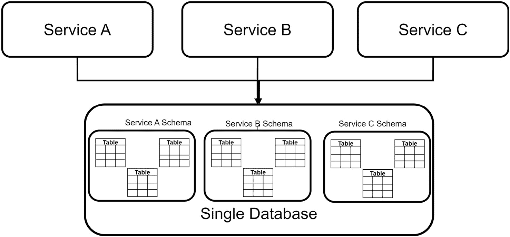
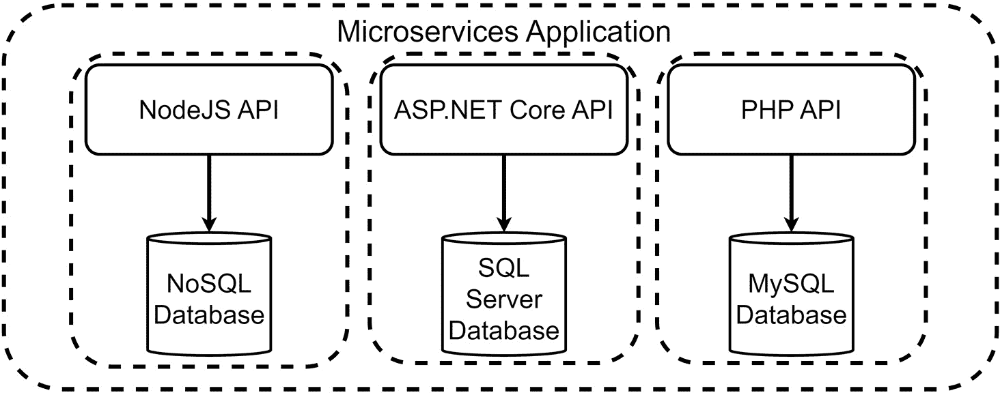
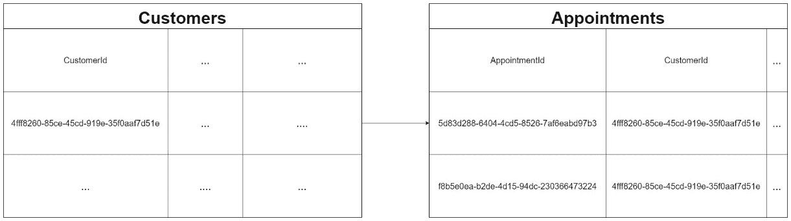
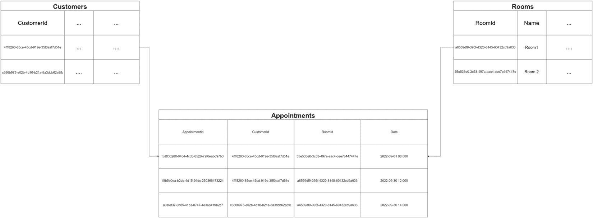

# 第七章：使用数据库-按服务模式处理每个微服务的数据

在上一章中，我们探讨了事件溯源和事件存储的概念。事件溯源模式帮助我们协调微服务之间数据存储的更改。一个微服务的操作可能需要将数据发送到其他微服务。出于效率的考虑，我们创建一个事件存储作为中介区域，微服务可以订阅更改，并能够在需要时获取数据的最新版本。

这个概念围绕着每个微服务都有自己的数据库的假设。在微服务架构中，考虑到每个微服务在操作和数据需求上的基本要求，即每个微服务需要在其操作和数据需求上保持自主性，这是一种推荐的方法。

在这个概念的基础上，我们将探讨处理每个微服务数据的最佳实践和技术。

在阅读本章后，你将了解以下内容：

+   如何利用数据库-per-Service 模式

+   如何开发数据库

+   如何实现存储库模式

# 技术要求

本章中使用的代码参考可以在项目仓库中找到，该仓库托管在 GitHub 上，网址为[`github.com/PacktPublishing/Microservices-Design-Patterns-in-.NET/tree/master/Ch07`](https://github.com/PacktPublishing/Microservices-Design-Patterns-in-.NET/tree/master/Ch07)。

# 如何利用数据库-按服务模式

微服务架构的一个核心特征是我们服务之间的松散耦合。我们需要保持每个服务的独立性和个性，并允许它们在需要时自主地与所需数据交互。我们希望确保一个服务对数据的操作不会妨碍另一个服务使用其自己的数据。

每个微服务将被留给定义自己的数据访问层和参数，除非故意实现，否则没有两个服务将直接访问相同的数据存储。数据不会在两个服务之间持久化，并且这种模式带来的整体解耦意味着一个数据库的故障不会妨碍其他服务的操作。

我们还需要记住，微服务架构允许我们选择最适合实现的服务开发技术。不同的技术往往与特定的数据库配合得更好或支持特定的数据库。因此，鉴于我们希望使用最佳数据库技术来支持服务的需求，这个模式可能更像是需求而不是建议。

如常，有得必有失。我们需要考虑这种异构架构的成本，以及我们可能需要如何调整我们的知识库和团队以支持多个数据库，以及由此扩展的各种数据库技术。现在我们必须考虑到额外的维护、备份和调优操作，这可能会导致维护成本增加。

在实施这种模式时，可以采取几种方法，其中一些方法可以减少我们的基础设施需求并帮助我们节省成本。我们将在下一节讨论这些选项。

## 每个服务一个数据库技术

最终，我们需要为每个服务的真理来源建立清晰的界限。这并不意味着你绝对需要不同的数据库，但你可以利用如下关系数据存储的功能：

+   **按服务表**：我们可以定义针对每个服务存储的数据进行优化的表。我们将在微服务代码中建模这些表，并确保我们只包括这些表。在这个模型中，常见的情况是某些表是其他表中可以找到的数据的非规范化表示，因为为该服务创建的表需要以这种格式存储数据。

+   **按服务模式**：关系数据库允许我们指定模式值来分类我们的表。模式是数据库中的一个组织单元，帮助我们分类表。我们可以使用这些来按服务组织表。类似于**按服务表**模式，每个模式中的表都是基于匹配的微服务需求进行优化的。我们还有机会根据模式调整访问权限和限制，从而减少安全管理的成本。

+   **按服务数据库**：每个微服务都有自己的数据库。可以通过将每个数据库放置在其自己的服务器上来进一步减少基础设施依赖。

*图 7.1*显示了多个服务连接到一个数据库。



图 7.1 – 多个服务共享一个数据库，但为每个服务创建模式以保持隔离和数据自治

按服务实现表和模式具有最低的资源需求，因为这相当于在单个数据库上构建一个应用程序。缺点是我们保留了一个单点故障，并且没有充分地扩展各种服务需求。

在**数据库按服务**的方法中，我们仍然可以使用一个服务器，但为每个微服务提供自己的数据库。这种方法更符合模式的名字，但在基础设施上仍然保持了一个共同的瓶颈，即所有数据库都在同一个服务器上。为了保持服务自治并减少基础设施依赖，最合适的实现是将每个数据库及其依赖的微服务放在自己的故障域中。

从另一个维度来看这个问题，我们可以看到我们有灵活性，为每个服务选择最好的数据库技术。一些服务可能更倾向于关系型数据存储，而其他服务可能更有效地使用文档数据存储。我们将在下一节进一步讨论这个问题。

## 每个服务使用不同的数据库技术

数据库是任何应用程序的基础。良好的或差的数据库设计可以决定你的应用程序效率如何，它是否容易扩展，以及你编写代码的效率如何。

使用数据库按服务模式允许我们为每个微服务可能完成的操作选择最好的数据库。对于一个更同质化的技术栈，所有开发者都能认同并轻松维护，这将是理想的。然而，试图保持同质化在过去导致了捷径和广泛的集成项目，其中使用一种技术的需求掩盖了使用最佳技术解决问题的机会。

*图 7.2* 显示了多个服务连接到各自的数据库。



图 7.2 – 可以使用不同的技术构建多个服务，同时使用最合适的发展框架技术

微服务允许我们拥有多个团队，这些团队可以选择最佳技术栈来实现解决方案，并且通过扩展，他们可以使用最佳类型的数据库技术来补充技术和问题。一些开发框架与某些数据库技术配合得最好，这使得选择用于特定微服务的整个堆栈变得更容易。

现在我们已经审查了数据库按服务选项，让我们来回顾一下使用这种开发模式为我们的微服务架构带来的缺点。

## 这种模式的缺点

我们可以整天歌颂这种模式，指出为什么它在微服务开发过程中是理想的路径。然而，尽管有所有这些优点，我们仍然可以指出潜在的陷阱，我们必须在运行时克服或学会减轻：

+   **额外成本**：当我们谈论减少服务之间的基础设施依赖时，我们谈论的是引入更健壮的网络软件和硬件、更多的服务器以及更多支持软件的软件许可证。使用云平台可能更容易抵消一些基础设施和软件成本，但即使是这种方法也会有一个适度的价格标签。

+   **异构开发堆栈**：从尽可能适当地满足微服务的业务需求的角度来看，这是一个优势。然而，当我们需要寻找维护可能被使用的技术的人才时，更大的问题出现了。团队之间的交叉培训是推荐的，但并不总是有效的，公司可能会面临由过去员工构建的微服务，而当前员工无法维护的风险。

+   **数据同步**：我们已经讨论了**最终一致性**的问题，这导致我们需要实施应急措施来处理多个数据库之间数据不一致的情况。这需要额外的代码和基础设施开销来正确实现。

+   **事务处理**：我们无法确保数据库之间的 ACID 事务，这可能导致数据存储之间出现不一致的数据。这将导致我们需要另一个名为** Saga 模式**的编码模式，我们将在下一章中进一步讨论。

+   **通信失败**：由于一个微服务无法直接访问另一个的数据库，我们可能需要引入同步微服务通信来完成操作。这会在当前操作中引入更多的潜在故障点。这些可以通过**断路器模式**来缓解，我们将在后续章节中讨论。

总是记住，每个模式都有其优缺点。我们绝不应该仅仅因为它是*推荐的做法*就进行实施。我们应该始终正确评估需要解决的问题，并选择最合适的解决方案和模式，以确保全面覆盖并以最佳价格实现。

既然我们已经讨论了数据库按服务模式的做法和禁忌，让我们继续讨论设计数据库时的最佳实践。

# 开发数据库

开发一个功能强大的数据库对于开发者的职业生涯至关重要。这个角色曾经由团队中的数据库开发者承担，其唯一目的是处理所有数据库相关的事务。应用程序开发者只需根据应用程序的需求编写代码与数据库进行交互。

最近，典型应用程序开发者的角色演变成了现在所说的 *全栈开发者* 角色。这意味着现代开发者需要具备与数据库开发知识相当的应用程序开发知识。现在，看到由两到三名开发者组成的团队在微服务团队中工作，他们可以开发和维护用户界面、应用程序代码和数据库是非常常见的。

开发数据库超出了对所使用技术的舒适度。实际上，那只是容易的部分。许多开发者在开始实施技术之前，往往忽视咨询业务和充分理解业务需求。这通常会导致设计不佳、返工以及应用程序生命周期中的额外维护。

由于我们处于微服务领域，我们有独特的机遇来构建更小的、针对整个应用程序的各个片段的数据存储。这使得我们更容易摄入和分析我们关注的服务的存储需求，并减少了构建大型数据库作为万能解决方案的整体复杂性，从而在设计阶段减少了出错的可能性。正如之前讨论的，我们可以做出更好的选择，选择最合适的数据库，这会影响我们做出的设计考虑。

一些服务需要基于他们处理的数据的性质进行关系完整性；其他服务需要快速产生结果，而不仅仅是准确性；有些只需要键值存储。在下一节中，我们将比较关系型和非关系型数据存储的优缺点，以及何时最好使用每种类型。

数据库是应用程序性能的一个重要组成部分，因此对于哪个微服务使用哪种技术做出正确的决策非常重要。在下一节中，首先评估使用关系型数据库的优缺点。

## 关系型数据库

关系型数据库多年来一直是主流。它们在数据库技术领域占据主导地位一段时间了，而且有很好的理由。它们建立在严格的原则之上，这些原则补充了干净高效的数据存储，同时确保存储内容的准确性。

一些最受欢迎的关系型数据库管理系统包括以下内容：

+   **SQL Server**: 这是微软的旗舰关系型数据库管理系统，被个人和企业广泛用于应用程序开发。

+   **MySQL / MariaDB**: MySQL 是一个传统的开源且免费使用的数据库管理系统，主要用于 PHP 开发。MariaDB 是从原始 MySQL 代码库分叉出来的，并由一群开发者维护以保持免费使用政策。

+   **PostgreSQL**: 这是一个免费且开源的数据库管理系统，足够强大，可以处理从个人项目到数据仓库的各种工作负载。

+   **Oracle 数据库**：这是 Oracle 公司旗舰数据库管理系统，旨在处理各种操作，从实时事务处理到数据仓库，甚至混合工作负载。

+   **IBM DB2**：由 IBM 在为高交易量和流量企业设置中最可靠的系统之上开发。该数据库支持关系型和对象关系型结构。

+   **SQLite**：一个免费且轻量级的数据库存储选项，用于快速便捷的数据库。与大多数需要服务器（有时是专用机器）的替代方案不同，SQLite 数据库可以与它被集成的应用程序位于同一文件系统中，使其成为移动优先应用程序的绝佳选择。

通过称为*规范化*的过程，数据可以在多个表中有效地共享，每个表之间创建引用或*索引*。良好的设计原则鼓励你在每个表中都有一个*主键*列，该列将始终具有唯一值，以唯一标识一条记录。然后，其他表通过*外键*的形式引用这个唯一值，这有助于减少数据在表间重复的次数。

这些简单的引用可以确保数据在表格之间保持准确。一旦在主键和外键之间建立了这种关联，我们就创建了我们所说的*关系*，这为外键列中可能存在的值引入了*约束*或限制。这也被称为*引用完整性*。

关系可以通过它们的*基数*进一步定义。这指的是主键值将在其他表中如何被引用的性质。最常见的基数如下：

+   **一对一**：这意味着主键值在另一个表中作为外键恰好被引用一次。例如，如果一个客户只能有一个记录在案的地址。存储地址的表不能有多个记录指向同一个客户。

+   **一对一**：这意味着主键值可以在另一个表中多次引用。例如，如果一个客户下了多个订单，那么在订单表中就会有一个客户的 ID 被引用多次。

+   **多对多**：这意味着主键可以在另一个表中多次作为外键被引用，并且那个表的主键也可以在原始表中多次被引用。这可能会令人困惑，并且按照描述实现它将直接违反我们努力维护的引用完整性。这就是引入*链接表*作为中介来关联来自任一表的不同键值组合的地方。

以我们的医疗管理系统为例，如果我们回顾一下相对于已预约客户的预约跟踪方式，我们会看到我们在客户的 ID、他们的主键和预约之间实现了一个参考点。这确保了每次预约时我们不会重复客户的信息。也不可能为尚未在系统中存在的客户创建预约。

*图 7.3* 展示了一个典型关系。



图 7.3 – 一个一对多关系的示例，其中一位客户在预约表中被引用多次

多对多关系确实经常发生，并且认识到它们很重要。基于客户及其预约的例子，我们可以扩展并看到我们还需要将客户与预约的房间关联起来。同一个房间并不总是保证，这让我们意识到许多客户会预约，预约可能发生在许多房间中。如果我们尝试直接关联，那么客户或房间的详细信息将需要重复，以反映客户、房间和预约的多种可能组合。

理想情况下，我们会有一个存储房间及其相关细节的表，一个存储客户的表，以及一个位于两者之间的预约表，该表旨在在需要时将它们按日关联起来。

*图 7.4* 展示了一个典型的多对多关系。



图 7.4 – 一个多对多关系的示例，其中我们使用一个中间链接表将两个不同表中的多个记录关联起来

我们已经讨论了 ACID 原则及其重要性。关系型数据库被设计来确保这些原则可以作为默认操作模式被观察到。这使得更改布局和表引用相对困难，尤其是如果更改涉及更改表之间的关系。

关系型数据库存储的另一个潜在缺点在于处理大量数据集时的性能。关系型数据库在数据存储、检索和整体速度方面通常效率很高。它们被设计来管理大量工作负载，因此技术本身几乎不会出错，但我们的设计要么会补充速度，要么会阻碍它。

这些是适当的关系型数据库设计和维护关系完整性之间的权衡。设计原则倾向于规范化，其中数据位分散在多个表中，这在我们需要数据并需要跨多个表（可能包含数千条记录）来获取数据时是好的。考虑到这种不足，NoSQL 或文档存储数据库变得越来越受欢迎，因为它们试图将数据存储在一个地方，使检索过程变得更快。

我们将在下一节讨论非关系型数据库的使用。

## 非关系型数据库

非关系型数据库在数据库世界中掀起了一场风暴。这可能是对它们产生影响的简单评估，但事实仍然是，它们引入了数据存储的一个维度，这个维度以前并不受欢迎或广泛使用。它们出现并提出了一种更加灵活和可扩展的数据存储技术，这种技术更倾向于敏捷的开发风格。

敏捷开发依赖于在项目进行过程中改变项目的能力。这意味着当使用关系型数据存储时，通常会推荐的大量范围和规划在初期是不必要的。相反，我们可以从一个系统的想法开始，并开始使用非关系型数据存储来适应那个小部分，随着系统的演变，数据存储也可以相应演变，从而最大限度地减少数据丢失或衰减的风险。

非关系型数据库也被称为 **NoSQL 数据库**，或 *not only SQL*，并且它们倾向于非表格式的数据存储模型。最受欢迎的 NoSQL 数据库使用文档存储方式，其中每条记录存储在一个文档中，包含该记录所需的所有详细信息。这直接违反了 *规范化* 的原则，该原则会建议我们将数据分散以减少可能的冗余。然而，这种模型的主要优势是我们可以在一个地方写入和检索数据，从而大大提高速度。

以我们的健康护理预约管理系统为例，如果我们以文档的形式存储一个预约，它可能看起来像这样：

```cs
{
    "AppointmentId":"5d83d288-6404-4cd5-8526-7af6eabd97b3",
    "Date":"2022-09-01 08:000",
    "Room":{
        "Id":"4fff8260-85ce-45cd-919e-35f0aaf7d51e",
        "Name":"Room 1"
    },
    "Customer": {
        "Id":"4fff8260-85ce-45cd-919e-35f0aaf7d51e",
        "FirstName":"John",
        "LastName":"Higgins"
    }
}
```

与关系模型不同，其中这些细节分散在多个表中并简单地引用，我们有包括所有评估预约所需细节的机会。

NoSQL 数据库的类型包括以下几种：

+   **文档数据库**：以 **JavaScript 对象表示法**（**JSON**）对象的形式存储数据。这个 JSON 文档概述了字段和值，并可以在一个文档中支持 JSON 对象和集合的层次结构。流行的例子包括 *MongoDB*、*CosmosDB* 和 *CouchDB*。

+   **键值数据库**：以简单的键值对存储数据。值通常存储为字符串值，并且它们不支持存储复杂的数据对象。它们通常用作快速查找存储区域，例如用于应用程序缓存。一个流行的例子是 *Redis*。

+   **图数据库**：在节点和边中存储数据。节点存储有关对象的信息，例如人或地点，边表示节点之间的关系。这些关系链接数据点之间的关系，而不是记录之间的关系。一个流行的例子是 *Neo4j*。

使用 NoSQL 文档数据库的明显优势来自于数据存储的方式。与关系模型不同，我们不需要遍历许多关系和表来获取一个完全可读的数据记录。正如前一个示例所示，我们可以将所有细节存储在一个文档中，并简单地从这里进行扩展。当我们可能需要快速读取操作且不想通过复杂的查询来牺牲系统性能时，这非常有用。

然而，一个明显的缺点来自于存储的处理方式。文档数据库在减少数据冗余风险方面做得很少，甚至几乎什么也不做。我们最终会重复相关数据的细节，这意味着从长远来看，这些数据的维护可能会成为一个问题。以我们的客户记录为例，如果我们需要为每个预约过的客户添加一个新的数据点，我们就需要遍历预约记录来做出一个更改。使用关系模型来做这个操作会容易得多，也有效率得多。

现在我们已经发现了一些关系型和非关系型数据库存储的优点和缺点，让我们讨论一下在这些情况下任选其一都是好的选择。

## 选择数据库技术

当选择任何最佳技术时，我们面临着几个因素：

+   **可维护性**：这项技术维护起来有多容易？它是否有过多的基础设施和软件要求？这项技术的更新和安全补丁产生得多频繁？最终，我们希望确保我们在项目开始几周后不会后悔我们的选择。

+   **可扩展性**：我可以用这项技术到什么程度来实现我的软件？当需求发生变化，项目需要适应时会发生什么？我们希望确保我们的技术不要太僵化，并且能够支持业务需求的变化。

+   **支持技术**：我使用的这个技术栈是否是最合适的？我们常常被迫走捷径，实施一些方法，有时甚至与最佳实践相悖，以方便匹配那些彼此并不最合适的技术。随着更多库的产生来支持异构技术栈的集成，这个问题正在逐渐减少，但仍是我们从第一天开始就需要考虑的事情。

+   **舒适度**：您和团队对这项技术的舒适度如何？使用新技术并扩展范围和经验总是令人愉快的，但重要的是要认识到自己的局限性和知识差距。这些问题同样可以通过培训来解决，但我们始终希望确保我们能够处理我们选择的技术，并且不会在长期运行中出现意外。

+   **成熟度**：这项技术有多成熟？在某些开发圈子中，技术可能每个月都会更新一次。我们不希望在发布当天就盲目拥抱新技术，而不进行充分的尽职调查。我们应该寻求选择那些经过实践检验、证明有效，并且拥有强大企业或社区支持及文档的成熟技术。

+   **适用性**：最后，这项技术对于应用程序的适用性如何？我们希望确保我们使用尽可能好的技术来完成手头的任务。这有时会因更大的背景而受到影响，包括预算限制、项目类型、团队经验以及企业的风险承受能力，但尽可能，我们希望确保我们选择的技术能够充分满足项目的需求。

现在让我们将重点放在数据库开发上。我们已经讨论了不同类型数据库模型和每种技术的利弊。虽然我们不受所列选项的限制，但它们作为指南，帮助我们尽可能从最无偏见的角度进行评估。

在微服务背景下，我们希望为服务的需求选择最佳的数据库。围绕应该使用哪种存储机制没有硬性规定，但有一些建议可以在系统设计过程中帮助您进行指导。

您可以考虑在以下情况下使用关系型数据库：

+   **处理复杂报告和查询**：关系型数据库可以在大型数据集上运行高效的查询，并且是生成报告的更好存储选项。

+   **处理高交易应用**：关系型数据库非常适合处理重型和复杂的交易操作。它们在确保数据完整性和稳定性方面做得很好。

+   **您需要 ACID 兼容性**：关系型数据库基于 ACID 原则，这在保护您的数据、确保准确性和完整性方面可以发挥很大作用。

+   **您的服务不会快速进化**：如果您的服务没有变化的需求，那么数据库应该容易设计并长期维护。

您可以考虑在以下情况下使用非关系型数据库：

+   您的服务不断进化，您需要一个灵活的数据存储库，能够在不造成太多干扰的情况下适应新的需求。

+   您预计数据可能不会始终干净或达到某个标准。鉴于我们在非关系型数据存储方面的灵活性，我们适应了不同准确性和完整程度的数据。

+   您需要支持快速扩展：这一点与根据业务需求演变数据存储的需求相辅相成，因此我们可以确保数据库可以在最小化代码更改和低成本的情况下进行更改。

现在我们已经探讨了选择数据库技术的一些主要考虑因素，让我们回顾一下使用代码与数据库交互的选项。

## 选择 ORM

选择**ORM**是设计过程中的重要部分。这为我们应用程序如何与数据库通信奠定了基础。**ORM**的缩写是**对象关系映射**。

每种语言都支持某种形式的 ORM。有时这是内置在语言中的，有时开发者和架构师都会使用外部包或库来支持数据库相关操作。在.NET 的上下文中，我们有几种选择，每种都有其优缺点。最受欢迎的选项如下：

+   **Entity Framework Core**：这是.NET 开发者最流行和最明显的选择。它是由微软开发和维护的 ORM，与.NET 一起打包。它实现了称为 LINQ 的 C#查询语法，这使得编写在运行时代表开发者执行查询的 C#代码变得容易，并且支持大多数关系型和非关系型数据库技术。

+   **Dapper**：Dapper 被认为是一个*微 ORM*，因为它是一个快速、轻量级的.NET ORM。它提供了一个干净且可扩展的接口来构建 SQL 查询并在安全高效的方式下执行它们。其性能始终与 Entity Framework 相媲美。

+   **NHibernate**：NHibernate 是一个开源 ORM，广泛用作 Entity Framework 的替代品。它对数据库技术的支持广泛，并提供开发者偏好的处理对象映射和查询构造的替代方法。

还有其他 ORM，但这些都是最具争议的、最受欢迎和最广泛使用的选项。

Entity Framework Core 经历了不断的改进，目前是开源的，并提供了优秀的接口和抽象，减少了根据访问的数据库编写的特定代码的需求。这是一个重要的特性，因为它允许我们在不同的数据库技术之间重用代码，并帮助我们根据使用的数据库技术保持灵活性。我们可以轻松地更改数据库技术，而不会影响主要应用程序及其操作。除了任何明显的偏见之外，我们可以在.NET 项目中使用 Entity Framework，这确实有助于我们保持技术栈的一致性。

要将 Entity Framework Core（简称 *EF Core*）集成到我们的 .NET 应用程序中，我们需要添加为我们首选的数据库技术设计的包。对于这个示例，我们可以使用 SQLite，因为它具有多功能性。添加包的命令如下所示：

```cs
dotnet add package Microsoft.EntityFrameworkCore.Sqlite
dotnet add package Microsoft.EntityFrameworkCore.Design
```

第一个命令添加了与 SQLite 数据库通信所需的全部核心和辅助 EF Core 库，而 `Microsoft.EntityFrameworkCore.Design` 包添加了对迁移和其他操作的设计时逻辑的支持。我们将在下一节中研究迁移。

我们接下来需要的是一个数据上下文类，它作为数据库及其表中代码级别的抽象。这个上下文文件将概述我们希望访问和引用的数据库对象。因此，如果我们的 SQLite 数据库应该有一个存储患者信息的表，那么我们需要一个类，该类模仿患者表应该如何看起来。

我们的数据上下文文件看起来像这样：

```cs
public class ApplicationDatabaseContext : DbContext
  {
    public DbSet<Patient> Patients { get; set; }
    protected override void OnConfiguring
        (DbContextOptionsBuilder optionsBuilder)
    {
      optionsBuilder.UseSqlite("Data Source=patients.db");
    }
  }
```

`ApplicationDatabaseContext` 类继承自 `DbContext`，这是一个由 EF Core 提供的类，它为我们提供了访问数据库操作和函数的能力。我们还有一个类型为 `DbSet` 的属性，它需要一个引用类型和一个名称。引用类型将是表示表的类，属性的名称将是表的代码级别引用点。`DbSet` 代表引用表中记录的集合。我们的 `OnConfiguring` 方法设置了到数据库的连接字符串。这个连接字符串将根据我们连接到的数据库类型而变化。

现在，我们的患者表将有一些字段，我们需要一个名为 `Patient` 的类，该类具有尽可能准确地表示列名和数据类型的 C# 属性，相对于它们在数据库中的呈现方式：

```cs
public class Patient
  {
    // EF Core will add auto increment and Primary Key
        constraints to the Id property automatically
    public int Id { get; set; }
    public string FirstName { get; set; }
    public string LastName { get; set; }
    public string TaxId { get; set; }
   // Using ? beside a data type indicates to the database
        that the field is nullable
    public DateTime? DateOfBirth { get; set; }
  }
```

我们的 `Patient` 类是一个典型的类。它简单地表示我们希望在数据库和我们的应用程序中患者记录看起来是什么样子。这样，我们抽象了大部分数据库特定的代码，并使用标准的 C# 类和标准 C# 代码来与我们的表和数据交互。

一个简单的数据库查询，用于检索并打印患者表中的所有记录，将如下所示：

```cs
// initialize a connection to the database
  using var context = new ApplicationDatabaseContext();
// Go to the database a retrieve a list of patients
  var patients = await context.Patients.ToListAsync();
// Iterate through the list and print to the screen
  foreach (var patient in patients)
{
  Console.WriteLine($"{patient.FirstName}
     {patient.LastName}");
}
```

我们可以看到我们如何干净地使用 C# 中的 LINQ 语法并执行查询。EF Core 将尝试生成最有效的 SQL 语法，执行操作，并以由表示表的类塑造的对象形式返回数据。然后我们可以以标准 C# 对象的方式与记录进行交互。

EF Core 提供了一种完整的方式来与我们的数据库交互并执行我们的操作，而无需从我们的 C# 语法中中断太多。为了超越上面共享的示例，EF Core 完全支持依赖注入，这使得连接管理和垃圾回收几乎不成问题。

上述内容未涉及的一个基本步骤是以数据库开发技术形式出现，这些技术指导我们如何在项目中创建数据库。我们还面临迁移问题。我们将在下一节中讨论这些问题。

## 选择数据库开发技术

有一些最佳实践和一般指南指导数据库的设计。在本节中，我们不会探讨或质疑这些，但我们将讨论实现数据库以支持我们的应用程序的可能方法。

有两种流行的开发技术：

+   **Schema-first**：也称为**数据库优先**，这种技术使我们能够使用常规的数据库管理工具创建数据库。然后我们将数据库**scaffold**到我们的应用程序中。使用 Entity Framework，我们将获得一个表示数据库及其所有对象的数据库上下文类，以及每个表和视图的类。

+   **Code-first**：这种技术允许我们在应用程序代码旁边更流畅地建模数据库。我们使用标准的 C#类（如前节所示）创建数据模型，并使用**migrations**管理数据模型和最终数据库的更改。

不论我们是打算构建数据库还是采用代码优先的方法，我们都可以使用通过`Microsoft.EntityFrameworkCore.Tools`包提供的`*dotnet CLI*`命令。你可以使用`dotnet add package`命令将此包添加到你的项目中。

要构建数据库，命令看起来是这样的：

```cs
dotnet ef dbcontext scaffold "DataSource=PATH_TO_FILE"
  Microsoft.EntityFrameworkCore.Sqlite -o Models
```

这个命令只是表明我们希望根据提供的连接字符串生成一个`dbcontext`。根据目标数据库的技术（SQL Server、Oracle 等），这个连接字符串将不同，但在这个例子中，我们正在构建一个 SQLite 数据库到我们的应用程序中。然后我们指定最适合目标数据库的数据库提供程序包，并将生成的文件输出到项目中的`Models`目录。这个命令对使用的 IDE 也是无差别的。

这个命令也可以这样，这种格式在 Visual Studio 中工作时更受欢迎：

```cs
Scaffold-DbContext "DataSource=PATH_TO_FILE"
  Microsoft.EntityFrameworkCore.Sqlite --output-dir Models
```

任何命令都需要在正在工作的项目目录中执行。每次对数据库进行更改时，我们都需要重新运行此命令以确保代码反映了数据库的最新版本。它将相应地覆盖现有文件。

这里的一个限制是我们并不总是能够跟踪数据库中发生的所有更改，并在每次运行此命令时充分跟踪每次更改的内容。因此，代码优先是数据库开发中一个非常受欢迎的选项，其使用迁移帮助我们解决这个问题。

迁移的概念并不仅限于 EF Core，它也存在于其他语言中的几个其他框架中。它是一个简单的流程，它跟踪我们在编写应用程序时对数据模型所做的所有更改，以及表和对象的发展。迁移将评估对数据库应用的变化，并生成命令（最终成为 SQL 脚本）以对数据库执行这些更改。

与数据库优先模型不同，在数据库优先模型中，我们需要使用带有专用数据库项目的源控制，迁移在我们的代码库中是原生的，并讲述了在迁移过程中对数据库所做的每一次调整的故事。

按照使用 EF Core 向我们的应用程序添加数据库的示例，我们已经创建了数据库上下文类以及一个病人类。因此，代码的直接翻译将是我们的数据库上下文就是数据库，而`Patient.cs`是我们的表。为了将表实体化到数据库中，我们需要创建一个迁移，该迁移将生成所需的资产。我们需要相同的`Microsoft.EntityFrameworkCore.Tools`包来运行我们的命令行命令，创建第一个迁移的命令将如下所示：

```cs
dotnet ef migrations add InitialCreate
```

或者，它看起来像这样：

```cs
Add-Migration InitialCreate
```

在这里，我们只需生成一个迁移文件，并将其命名为`InitialCreate`。命名我们的迁移有助于我们直观地跟踪该操作中可能发生了什么变化，并有助于我们的团队。每次我们对数据模型和/或数据库上下文类进行更改时，我们都需要创建一个新的迁移，这将生成概述自上次已知数据库版本以来发生变化的最佳可能解释的命令。

此命令将生成一个具有`Up`和`Down`方法的类，概述要应用哪些更改，以及如果迁移被撤销，将取消哪些更改。这使得我们能够确保我们打算做出的更改将被执行，我们可以在这些更改应用之前删除迁移并进行更正。迁移只能在应用到数据库之前被删除，该命令如下所示：

```cs
dotnet ef migrations remove
```

或者，它看起来像这样：

```cs
Remove-Migration
```

当我们确信迁移正确地概述了我们打算做出的更改时，我们可以使用简单的`数据库更新`命令来应用它：

```cs
dotnet ef database update
```

或者，我们可以使用以下命令：

```cs
Update-Database
```

如果您的项目正在使用源代码控制，那么迁移将始终包含在代码库中，以便其他团队成员查看和评估。在做出这些调整时与团队成员协作也很重要。如果不协调变更，可能会发生迁移冲突，如果使用集中式数据库，这可能导致数据库版本不匹配。最终，如果我们需要数据库的最新迁移副本，我们只需更改连接字符串以指向服务器和预期的数据库名称，运行`Update-Database`命令，EF Core 就会生成反映我们数据库最新版本的数据库。

现在我们已经了解了如何使用 EF Core 将数据库反向工程到我们的应用程序中或使用迁移创建新数据库，让我们来研究如何在 EF Core 提供的接口之上编写可扩展的数据库查询代码。

# 实现仓库模式

根据定义，仓库是一个数据或项目的中枢存储区域。在数据库开发的背景下，我们使用“仓库”这个词来指代一个广泛使用且方便的开发模式。这个模式帮助我们扩展 ORM（对象关系映射）给我们的默认接口和代码，使其可重用，并针对某些操作更加具体。

这个模式的一个副作用是我们最终会有更多的代码和文件，但总体好处是我们可以将核心操作集中化。因此，我们将业务逻辑和数据库操作从控制器中抽象出来，并在整个应用程序中消除重复的数据库访问逻辑。这有助于我们在编写干净代码的同时，维护代码库中的*单一职责原则*。

在任何应用程序中，我们需要对任何数据库表执行四个主要操作。我们需要创建、读取、更新和删除数据。在 API 的背景下，我们需要为每个数据库表创建一个控制器，我们会在每个控制器中重复我们的*CRUD*代码，这对于开始来说很好，但随着应用程序代码库的增长，这变得很危险。这意味着如果我们更改从每个表中检索记录的方式，我们就需要在那么多地方更改代码。

不使用仓库模式，我们的患者表`GET`操作的 API 控制器将看起来像这样：

```cs
    [Route("api/[controller]")]
    [ApiController]
    public class PatientsController : ControllerBase
    {
        private readonly ApplicationDatabaseContext
            _context;
        public PatientsController
            (ApplicationDatabaseContext context)
        {
            _context = context;
        }
        // GET: api/Patients
        [HttpGet]
        public async Task<ActionResult<Ienumerable
            <Patient>>> GetPatients()
        {
          if (_context.Patients == null)
          {
              return NotFound();
          }
            return await _context.Patients.ToListAsync();
        }
    }
```

我们只需将数据库上下文注入到控制器中，并使用此实例来执行我们的查询。这是简单且高效的，因为查询逻辑并不复杂。现在想象一下，您有多个具有类似`GET`操作的控制器。一切都很顺利，直到我们收到反馈，需要为所有端点的`GET`操作添加分页。现在，我们有那么多地方需要重构，查询将更加复杂，而且未来可能还会再次更改。

对于这种类型的场景，我们需要尽可能集中化代码，并减少在整个应用程序中变得必要的重工作。这就是仓库模式能帮助我们解决问题的地方。我们通常有两个包含通用模板代码的文件，然后，我们为每个表推导出更具体的仓库，以便我们可以根据需要添加自定义操作。

我们的通用仓库包括一个接口和一个派生类。它们看起来像这样：

```cs
    public interface IGenericRepository<T> where T : class
    {
        Task<T> GetAsync(int? id);
        Task<List<T>> GetAllAsync();
        Task<PagedResult<T>> GetAllAsync<T>(QueryParameters
            queryParameters);
    }
```

在这里，我们只概述了读取操作的方法，但这个接口同样可以轻松扩展以支持所有 CRUD 操作。我们使用泛型，因为我们准备接受任何表示数据模型的类类型。我们还概述了一个用于`GET`操作的方法，该方法返回分页结果，符合最近的要求。我们的派生类看起来像这样：

```cs
public class GenericRepository<T> : IGenericRepository<T>
    where T : class
    {
        protected readonly ApplicationDatabaseContext
            _context;
        public GenericRepository(ApplicationDatabaseContext
           context)
        {
            this._context = context;
       }
        public async Task<List<T>> GetAllAsync()
        {
            return await _context.Set<T>().ToListAsync();
        }
        public async Task<PagedResult<T>> GetAllAsync<T>
            (QueryParameters queryParameters)
        {
            var totalSize = await _context.Set<T>()
                .CountAsync();
            var items = await _context.Set<T>()
                .Skip(queryParameters.StartIndex)
                .Take(queryParameters.PageSize)
                .ToListAsync();
            return new PagedResult<T>
            {
                Items = items,
                PageNumber = queryParameters.PageNumber,
                RecordNumber = queryParameters.PageSize,
                TotalCount = totalSize
            };
        }
        public async Task<T> GetAsync(int? id)
        {
            if (id is null)
            {
                return null;
            }
            return await _context.Set<T>().FindAsync(id);
        }
    }
```

我们在这里看到，我们将数据库上下文注入到仓库中，然后我们可以在一个地方编写我们的预设查询。现在，这个通用仓库可以被注入到需要实现这些操作的控制器中：

```cs
    [Route("api/[controller]")]
    [ApiController]
    public class PatientsController : ControllerBase
    {
        private readonly IGenericRepository<Patient>
            _repository;
        public PatientsController(IGenericRepository<Patient> 
          repository)
        {
            _repository = repository;
        }
        // GET: api/Patients
        [HttpGet]
        public async Task<ActionResult<Ienumerable
            <Patient>>> GetPatients()
        {
            return await _repository.GetAllAsync();
        }
         // GET: api/Patients/?StartIndex=0&pagesize=25
             &PageNumber=1
        [HttpGet()]
        public async Task<ActionResult< PagedResult
            <Patient>>> GetPatients([FromQuery]
                QueryParameters queryParameters)
        {
            return await _repository.GetAllAsync
                (queryParameters);
        }
```

现在，我们可以简单地从仓库中调用适当的方法。仓库在我们的控制器中相对于其注入中使用的类被实例化，并且生成的查询将应用于相关表。这使得我们在多个表和控制器之间标准化查询变得容易得多。我们需要确保我们在`Program.cs`文件中像这样注册我们的`GenericRepository`服务：

```cs
builder.Services.AddScoped(typeof(IGenericRepository<>),
    typeof(GenericRepository<>));
```

现在，我们可能需要实现特定于我们的患者表的操作，这些操作对于其他表不是必需的。这意味着通用的方法将不再是最佳选择，因为我们最终会在其中添加针对我们表的定制逻辑。我们现在可以扩展它，并为我们的表创建一个特定的接口，并编写我们的自定义逻辑：

```cs
public interface IPatientsRepository : IGenericRepository
    <Patient>
{
    Task<Patient> GetByTaxIdAsync(string id);
}
public class PatientsRepository : GenericRepository
    <Patient>, IPatientsRepository
{
    public PatientsRepository(ApplicationDatabaseContext
        context) : base(context)
    {}
    public async Task<Patient> GetByTaxIdAsync(string id)
    {
        return await _context.Patients.FirstOrDefaultAsync
            (q => q.TaxId == id);
    }
}
```

现在，我们可以在`Program.cs`文件中像这样注册这个新服务：

```cs
builder.Services.AddScoped<IPatientsRepository,
    PatientsRepository>();
```

然后，我们可以将其注入到我们的控制器中，而不是使用`GenericRepository`，并像这样使用它：

```cs
public class PatientsController : ControllerBase
{
    private readonly IPatientsRepository _repository;
    public PatientsController(IPatientsRepository
        repository)
    {
        _repository = repository;
    }
    // GET: api/Patients
    [HttpGet]
    public async Task<ActionResult<IEnumerable<Patient>>>
        GetPatients()
    {
        return await _repository.GetAllAsync();
    }
    // GET: api/Patients/taxid/1234
    [HttpGet("taxid/{id}")]
    public async Task<ActionResult<Patient>>
        GetPatients(string id)
    {
        var patient = await _repository.GetByTaxIdAsync
            (id);
        if (patient is null) return NotFound();
        return patient;
    }
    // GET: api/Hotels/?StartIndex=0&pagesize=25
        &PageNumber=1
    [HttpGet()]
    public async Task<ActionResult<PagedResult<Patient>>>
        GetPatients([FromQuery] QueryParameters
            queryParameters)
    {
        return await _repository.GetAllAsync
            (queryParameters);
    }
}
```

在这里，我们可以在保持对我们在通用仓库中实现的基函数的访问的同时，干净地调用自定义代码。

关于这种模式是否节省我们时间和精力，或者只是使我们的代码库变得更加复杂，存在争议。这种模式有其优点和缺点，但在选择将其包含到您的项目中之前，请确保您对它的利弊进行公平的评估。

# 摘要

数据库是应用开发的关键部分，我们需要确保我们尽早做出正确的决策。技术、存储机制的类型以及支持的应用逻辑都在使我们的应用尽可能有效地实现业务需求方面发挥着重要作用。在本章中，我们探讨了开发支持微服务的数据库时涉及的不同考虑因素，最佳数据库类型及其使用时机，以及选择一种有助于我们减少冗余代码的开发模式。

在下一章中，我们将探讨使用**saga 模式**在多个服务和数据库中实现事务的方案，因为当我们选择按服务选择数据库的方法来构建微服务架构时，这是一个大问题。
