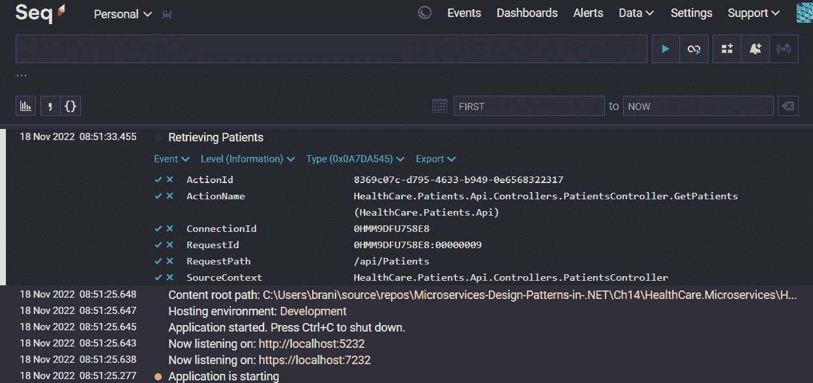

# 第十四章：实施微服务的集中式日志记录

与 API 相关的一个最大挑战是我们很少得到关于服务中实际发生情况的反馈。我们尽最大努力设计我们的服务，使 HTTP 响应指示每个操作的成败，但这并不总是足够。最令人担忧的是 5xx 范围内的响应，它们后面没有任何有用的信息。

因此，我们需要在我们的微服务应用程序中采用日志记录。日志记录提供了关于服务中发生的操作和事件的实时信息。每条日志消息都帮助我们理解应用程序的行为，并在出现问题时协助我们的调查。因此，日志是应对模糊的 5xx HTTP 响应的第一道防线。

在开发过程中，日志帮助我们理解我们面临的一些问题，并且当实施得当，可以提供被调用函数及其输出的逐点记录。这将帮助我们更容易地发现代码可能出错的地方，或者为什么函数的输出不符合预期。

在分布式应用程序的情况下，我们需要实施特殊措施，帮助我们集中管理由各个服务产生的日志。是的，我们在这种架构中推广自主性，但所有组件仍然组合在一起形成一个应用程序。这使得当需要筛选多个日志文件和来源时，故障点更难找到。

在阅读本章之后，我们将能够做到以下几点：

+   理解日志聚合的使用

+   了解如何实现性能监控

+   了解如何实现分布式跟踪

# 技术要求

本章中使用的代码示例可以在本项目的 GitHub 仓库中找到，该仓库托管在[`github.com/PacktPublishing/Microservices-Design-Patterns-in-.NET/tree/master/Ch14`](https://github.com/PacktPublishing/Microservices-Design-Patterns-in-.NET/tree/master/Ch14)。

# 日志及其重要性

日志是大多数应用程序在运行时产生的文本块。它们被设计成关于应用程序中发生情况的易于阅读的迷你报告，并且应该允许我们跟踪和追踪应用程序中发生的错误。

在单体应用程序中，我们通常将日志写入日志文件或数据库。实际上，在.NET Core 中，我们有访问强大的日志提供程序和第三方库的权限，允许我们与多个日志输出目标集成。没有真正的最佳目标，尽管有些比我们的更好，但这取决于项目偏好和整体舒适度。我们的单体日志包含有关一个应用程序中发生的一切信息。

在分布式系统中，这变得更加复杂，因为我们有多个应用中发生活动。第一个倾向是按服务创建日志，这可能会导致多个日志文件，每个文件都包含我们需要查看的整体信息的一部分。想象一下，需要访问多个日志文件来调查下午 5 点发生的一个故障。为了理解这个故障，我们需要审查多个来源来拼凑出任何有意义的线索，这可能是一项艰巨的任务。

如果我们的日志过于冗长，这项调查将变得更加困难。冗长的日志会报告应用中发生的所有事件。即使我们不报告所有内容，我们也需要明确我们记录的内容，以减少噪音并更好地突出需要捕获的关键事件。

我们需要一种干净的方式来集中管理跨服务生成的日志。集中式数据库可能看起来是个好主意，但如果多个服务频繁地写入日志，可能会导致资源和表锁定。我们将在稍后审查最佳集中化技术。现在，让我们专注于决定最佳的信息记录内容以及如何在.NET Core 中实现这一点。

## 选择记录的内容

在实施日志记录时做出的重要决定是我们想要记录什么。我们是否想要记录应用中发生的所有事情的逐字记录，还是我们只想记录错误？不同的系统有不同的要求，正确的选择取决于该服务对应用整体运行的重要性。

现在我们已经确定了需要通过日志进行更多监控的最关键服务，我们需要确定将记录哪些信息。回想一下，我们不想让日志过于冗长，但我们也不想在日志中遗漏相关信息。过多的信息可能导致大量无用的日志和高存储成本，而信息过少将使我们得到无用的文件。

有用的信息包括但不限于以下内容：

+   通过 API 请求访问的资源 ID

+   请求周期中调用的不同功能

我们想要避免记录敏感信息。我们不想记录以下内容，例如：

+   认证流程中的用户凭据

+   支付信息

+   个人可识别信息

尽管我们尽了最大的安全努力，日志仍然是关于我们系统的事实来源，对包含敏感信息的日志文件的安全漏洞可能证明是一个有害的事件。有一些法规和数据保护法规定了我们应该如何存储和保障我们的日志。因此，最好只记录可以按需查询的 ID，而不提前泄露任何信息。

我们还有 *日志级别* 的概念，它是日志消息严重性的分类。这些级别分为 *信息*、*调试*、*警告*、*错误* 和 *关键*。中间可能还有其他类别，但这些都是最常用的。它们代表以下含义：

+   **信息**：这是一个标准的日志级别，当发生预期的事情时使用。它们通常用于分享有关操作的信息，并有助于追踪可能导致错误的操作序列。

+   **调试**：这是一个非常信息的日志级别，比我们日常使用所需的要多。它主要用于开发，帮助我们跟踪代码中的更复杂操作。生产系统通常不会产生调试日志。

+   **警告**：这种日志级别表示发生了不是错误但也不正常的事情。把它想象成黄灯，表明应该关注某种情况，但它可能不是任务关键。

+   **错误**：错误就是错误。这种类型的日志条目通常在遇到异常时创建。它可以与异常和堆栈跟踪一起使用，并在调试问题时证明是一种关键的日志类型。

+   **关键**：这表示我们遇到了一个无法恢复的错误。这种日志条目可以在应用程序启动失败或无法连接到关键数据源或依赖项时使用。

日志级别是一种通用语言，我们应该确保我们使用适当的日志级别准确地表示正在记录的情况。我们还希望避免错误分类我们的事件，并记录关于我们系统中发生的事情的误导性信息。

再次强调，关于记录什么内容，最终的决定取决于应用程序、开发人员和组织的需要，我们需要确保我们足够彻底，能够捕捉到关于应用程序运行时基本信息的要点。现在，让我们回顾一下如何在 .NET Core 应用程序中实现日志记录。

## 使用 .NET 日志 API

.NET 有一个内置的日志机制，它被嵌入到我们的应用程序启动操作中。我们得到一个开箱即用的日志库，它会在应用程序启动后立即记录所有发生的事情。这个机制与多个第三方日志提供程序一起工作，使其可扩展且功能强大。通过我们的提供程序，我们可以确定日志的目标目的地。

我们将从 *ILogger* 接口开始。这个接口是 .NET 伴随的日志 API 的抽象。它通过 `Microsoft.Extensions.Logging` NuGet 包提供给我们。这个库为我们提供了应用程序日志记录所需的必要类、接口和功能，并为 *Console*、*Debug*、*Azure Log Stream*、*EventSource* 和 *Windows Event Log* 提供了日志记录提供程序：

+   **控制台**: 此提供程序将日志输出到控制台。当调试时，会出现一个控制台窗口，大多数 IDE（上下文中，Visual Studio 和 Visual Studio Code）都为运行时日志提供了一个调试控制台窗口。

+   `System.Diagnostics.Debug` 类。

+   **EventSource**: 一个跨平台提供程序，可以作为名为 *Microsoft-Extensions-Logging* 的事件源。

+   **Windows 事件日志**: 一个仅适用于 Windows 的提供程序，将日志输出发送到 Windows 事件日志。它默认仅记录 *Warning* 级别的消息，但可以根据需要进行配置。

+   **Azure 日志流**: Azure 日志流支持在应用程序运行时通过 Azure 门户查看日志。我们可以轻松地将日志写入此提供程序。

要让我们的 .NET 应用程序开始写入日志，我们可以简单地将 `ILogger<T>` 注入到日志应该起源的类中。`T` 代表我们注入服务的类的名称。这有助于后续的日志分类和过滤，因为当日志生成时，它们会自动指示类名。`ILogger<T>` 通常由应用程序代码使用，这些代码可能存在于多个位置。因为类名被用作 *类别*，这使得我们能够轻松地将日志条目链接回生成它们的类。在以下代码中，我们将 `ILogger<T>` 注入到我们的预约服务控制器中：

```cs
public class AppointmentsController : ControllerBase
    {
        /* Other fields */
        private readonly ILogger<AppointmentsController>
            logger;
        public AppointmentsController(/* Other Services */,
            ILogger<AppointmentsController> logger)
        {
            this.logger = logger;
        }
    }
```

与我们注入其他服务的方式相比，注入 `ILogger<T>` 是标准的。现在拥有这个日志记录器的优点是，我们可以写入日志来通知我们的 API 中的活动和错误。如果我们需要记录每次通过 API 调用检索预约列表时，我们可以修改我们的 `GET` 方法如下：

```cs
// GET: api/Appointments
        [HttpGet]
        public async Task<ActionResult<Ienumerable
            <Appointment>>> GetAppointments()
        {
            Logger.LogInformation("Returning
                Appointments");
            return await _context.Appointments
               .ToListAsync();
        }
```

现在，当我们向此服务的 `GET` 方法发出请求时，我们将在我们的控制台中看到如下消息。在这里，“控制台”指的是启动并显示有关正在运行的 .NET 应用程序的消息以及我们在使用的 IDE 中的调试输出的控制台窗口：

```cs
HealthCare.Appointments.Api.Controllers.AppointmentsController: Information: Retrieving appointments
```

注意，我们不仅可以看到源调用，还可以看到其命名空间，这也在帮助我们确定哪个确切的类正在生成日志方面发挥了重要作用。我们还得到一个日志级别标志，这样我们就可以一眼看出严重性。您还会注意到有许多其他我们未编排的默认日志条目。我们可以通过 `appsettings.json` 文件来控制我们希望在应用程序中拥有的全局日志级别和来源。默认情况下，它将具有以下配置：

```cs
"Logging": {
    "LogLevel": {
      "Default": "Information",
      "Microsoft.AspNetCore": "Warning"
    }
  },
```

这指定了应输出到目标的最小默认级别是默认日志源的 `Information`。与我们的应用程序内部工作相关的内容只有在它是 `Warning` 时才会暴露出来。如果我们将它们都修改并放置在 `Information`，那么我们的日志从一开始就会变得非常冗长。

我们的 `LogLevel` 方法有一个标准布局，允许我们根据需要轻松地包含额外的信息。可能的参数如下：

+   **eventId**: 一个与你的应用程序中的操作相关联的数值。对此没有预定义的标准，你可以根据自己的组织和需求分配自己的值。这是一个可选参数，但在我们需要将日志与特定操作关联时可能很有用。

+   `try`/`catch` 块。

+   `{username}` 应该在 `messageArgs` 中提供。

+   **messageArgs**: 这是一个对象数组，它将绑定到消息字符串中概述的占位符。绑定将按照参数出现的顺序进行，因此值也应该按照这个顺序提供。如果没有提供值，占位符将按原样打印在字符串中。

使用所有参数的一个示例可能如下所示：

```cs
public async Task<ActionResult<AppointmentDetailsDto>>
    GetAppointment(Guid id)
        {
            try
            {
                var appointment = await
                    _context.Appointments.FindAsync(id);
                if (appointment == null)
                {
                    return NotFound();
                }
                // Other service calls
                var patient = await _patientsApiRepository
                    .GetPatient(appointment
                        .PatientId.ToString());
                var appointmentDto = _mapper.Map
                   <AppointmentDetailsDto>(appointment);
                appointmentDto.Patient =
                    _mapper.Map<PatientDto>(patient);
                return appointmentDto;
            }
            catch (Exception ex)
            {
                logger.LogError(100, ex, "Failure
                    retrieving apointment with Id: {id}",
                        id);
                throw;
            }
        }
```

在这里，我们为我们的端点添加了异常处理，该端点通过 ID 获取预约记录。如果在执行任何操作时出现异常，我们将捕获它并记录它。我们为这次操作使用 `100` 作为 `eventId` 属性，并记录异常，包括一些自定义消息和一些更多信息，以帮助我们确定异常的性质。我们还包含了导致失败的记录的 ID；注意 `{id}` 占位符将映射到 `id` 参数。给参数相同的名称不是必需的，但它确实有助于减少任何与值绑定的混淆。

如果我们想扩展每个日志消息应使用的提供者数量，我们可以在应用程序的 `Program.cs` 文件中配置日志设置。在一个标准的样板 ASP.NET Core 项目中，我们可以添加如下代码：

```cs
builder.Logging.ClearProviders();
builder.Logging.AddConsole()
    .AddEventLog(new EventLogSettings { SourceName =
        "Appointments Service" })
    .AddDebug()
    .AddEventSourceLogger();
```

首先，我们必须清除任何预配置的提供者，然后添加我们希望支持的提供者。现在，一个日志消息将被写入多个目的地。这可以是一种方便的方式来分散我们的日志消息，并为每个目的地附加不同的监控方法。请记住，你应该始终了解你所在国家和公司的信息安全管理规则，并尽量避免在太多地方暴露太多信息。我们还可以通过修改 `appsettings.json` 文件中的日志配置来为每个提供者提供特定的配置，如下所示：

```cs
{
  "Logging": {
    "LogLevel": {
      "Default": "Error",
      "Microsoft": "Warning",
      "Microsoft.Hosting.Lifetime": "Warning"
    },
    "Debug": {
      "LogLevel": {
        "Default": "Trace"
      }
    },
    "Console": {
      "LogLevel": {
        "Default": "Information"
      }
    },
    "EventSource": {
      "LogLevel": {
        "Microsoft": "Information"
      }
    },
    "EventLog": {
      "LogLevel": {
        "Microsoft": "Information"
      }
    },
  }
}
```

我们为每个日志源保留默认的 `LogLevel`，但随后为每个提供者提供覆盖。如果日志源在提供者的配置下未定义，则它将保留默认行为，但我们保留控制每个提供者应优先考虑哪种日志类型的权利。

如果我们需要扩展对 Azure 系统的支持，我们可以利用 Azure 应用程序的文件存储和/或 Blob 存储。我们可以通过 `NuGet` 软件包管理器包含 `Microsoft.Extensions.Logging.AzureAppServices`，然后我们可以使用如下代码配置日志服务：

```cs
builder.Logging.AddAzureWebAppDiagnostics();
builder.Services.Configure<AzureFileLoggerOptions>
    (options =>
{
    options.FileName = "azure-log-filename";
    options.FileSizeLimit = 5 * 2048;
    options.RetainedFileCountLimit = 15;
});
builder.Services.Configure<AzureBlobLoggerOptions>
    (options =>
{
    options.BlobName = "appLog.log";
});
```

这将配置应用程序使用文件系统以及 Azure 中的 Blob 存储。根据 App Services 日志设置，我们可以查找一些默认的日志输出位置。同样，我们可以通过向 `appsettings.json` 文件中添加具有别名 `AzureAppServicesBlob` 和 `AzureAppServicesFile` 的部分来覆盖此提供程序正在输出的默认日志。我们还可以定义 `ApplicationInsights`，如果我们打算为我们的应用程序使用该服务。为了支持 `ApplicationInsights`，我们需要 `Microsoft.Extensions.Logging.ApplicationInsights` NuGet 软件包。Azure Application Insights 是由 Microsoft Azure 提供的强大日志聚合平台，是 Azure 托管解决方案的一个很好的选择。

几个第三方框架扩展了 .NET 内置日志 API 的功能。在下一节中，我们将探讨如何集成一个流行的框架，称为 **Serilog**。

## 添加 Serilog

存在几个第三方框架，它们扩展了我们 .NET 应用程序中可用的日志记录功能和选项。流行的选项包括 **Serilog**、**Loggr**、**Elmah.io** 和 **NLog**，仅举几例。每个都有其优缺点，但在这个部分，我们将探讨 Serilog，我们将如何将其集成到我们的应用程序中，以及它为我们引入了哪些选项。

Serilog 扩展 `Microsoft.Extensions.Logging`，并提供快速且相对简单的方法来覆盖默认设置，同时保留原始框架的全部功能和灵活性。要开始，我们需要安装 `Serilog.AspNetCore` 软件包。对于非 Web .NET Core 项目，我们需要使用 `Serilog.Extensions.Hosting`：

```cs
Install-package Serilog.AspNetCore
```

Serilog 有使用输出通道的概念。在概念上，输出通道类似于日志提供程序，代表框架写入的日志的输出通道。我们需要为每个我们希望支持的输出通道添加额外的包。常用的输出通道包括 *Console*、*File*、*Seq*、*SQL Server* 和 *Azure Application Insights*，仅举几例。您可以从他们的 GitHub wiki 页面获取完整的列表：[`github.com/serilog/serilog/wiki/Provided-Sinks`](https://github.com/serilog/serilog/wiki/Provided-Sinks)。

对于这个练习，我们将配置 Serilog 以使用文件和控制台输出。我们还将向我们的 `appsettings.json` 文件中添加参数。我们需要将 *expressions* 扩展添加到基本库中，以支持将 JSON 文本解析为所需的设置：

```cs
Install-package Serilog.Expressions
```

现在，我们可以从我们的 `appsettings.json` 文件中删除 `Logging` 部分，并用以下 JSON 文本替换它：

```cs
  "Serilog": {
    "MinimumLevel": {
      "Default": "Information",
      "Override": {
        "Microsoft": "Warning",
        "Microsoft.Hosting.Lifetime": "Information"
      }
    },
    "WriteTo": [
      {
        "Name": "File",
        "Args": { "path":  "./logs/log-.txt",
           "rollingInterval": "Day" }
      }
    ]
  },
```

现在，我们有一个类似的结构，可以定义应用程序的日志默认设置，但我们还有一个`WriteTo`部分，允许我们列出我们想要支持的不同通道。我们只包括了`File`写入的设置，并指定目标位置为一个名为`logs`的本地文件夹。文件将每天自动创建，并赋予一个由`log-`表达式和日期组合而成的名称。这将使我们能够按日轻松检索相关文件，并且每个日志都会显示一个时间戳，使得回顾事件更加容易。

现在，我们可以移除`builder.Logging(…)`配置，并用这个来替换：

```cs
  builder.Host.UseSerilog((ctx, lc) => lc
        .WriteTo.Console()
        .ReadFrom.Configuration(ctx.Configuration));
```

这将初始化我们的日志记录器以使用`Console`接收器和读取之前定义的 Serilog 部分的配置对象。这将初始化`Console`和`File`接收器。现在，我们可以期待看到为每个实现了 Serilog 文件日志配置的微服务每天创建并填充的文本文件。需要写入日志的代码保持不变。我们只需要重复为`ILogger<T>`概述的注入步骤；Serilog 会完成其余的工作。

现在，我们已经解决了一个问题，我们不再对我们的应用程序发生的事情视而不见。我们可以轻松地将日志集成到我们的服务中，并以日志文件的形式审查更持久的输出。然而，我们仍然面临着需要审查不同系统中的多个不同日志，以正确追踪可能导致某个点失败的原因的挑战。

这就是我们需要探索汇总日志并使它们从一个界面中可见和可搜索的方法。我们将在下一节中探讨如何实现这一点。

# 日志聚合及其用途

日志聚合是将来自不同来源的日志捕获并整合到一个集中平台的概念。在分布式系统中，日志由多个来源生成，我们需要对所有消息有一个全面的了解，并需要有效地关联和分析日志。

当我们需要调试应用程序性能和错误或识别瓶颈、故障点或漏洞时，日志聚合充当单一的真实来源。几个平台允许我们聚合我们的日志，它们从免费到付费再到云托管解决方案不等。一些流行的平台包括*Azure Application Insights*、*Seq*、*DataDog*和*ELK (Elasticsearch, Logstash, and Kibana)*等，仅举几例。在选择平台时，我们必须考虑以下因素：

+   **效率**：我们都喜欢并且希望系统高效。我们选择的平台需要符合这一叙述，并尽可能简化日志集成、以各种格式导出日志信息以及快速筛选和排序日志信息的过程。大多数日志聚合器允许我们编写查询，可以智能地筛选日志噪音，并给我们提供更具体的数据。

+   **处理能力**：该平台需要能够从多个来源提供舒适的吞吐量，并能够索引、压缩和高效地存储这些日志。我们可能不一定知道它们实现这一点的技术，但我们可以通过我们的查询和数据的整体展示来评估索引功能的准确性。

+   **实时功能**：实时监控非常重要，因为我们通常需要日志聚合来监控应用程序中发生的事情。信息提供得越快，我们就能越快地响应故障。

+   **可扩展性**：该平台需要能够处理不同的流量周期，并在流量突然变化时不会崩溃。我们需要确保系统在高负载下的性能不会下降。

+   **警报机制**：一些平台具有内置的功能，可以提醒我们某些类型的日志事件。即使这不是内置的，我们也应该有通过*APIs*和*WebHooks*的集成选项，这样我们就可以与我们的第三方应用程序集成，这是我们大部分时间所在的地方。

+   **安全性**：安全性对我们日志信息非常重要，正如我们之前提到的。一个理想的平台将在数据静止和传输过程中加密数据。这通常是理所当然的，但我们需要确保。我们可能还需要能够控制用户访问。

+   **成本**：我们都喜欢免费和便宜解决方案。我们不可能总是两者兼得，但我们确实可以确信，该平台提供的投资回报率是好的，相对于我们获得的功能而言。确保你进行适当的经济效益分析。

与日志聚合平台集成的最简单方法是使用针对此类集成优化的工具和包。我们需要利用那些针对与这些平台高效集成的库的服务。在下一节中，我们将看到如何利用*Serilog*与*Seq*集成。

## 与 Seq 集成

*Seq*，发音为 seek，是由*Datalust*开发和维护的一个简洁（看看我做了什么？）日志聚合工具。这个平台是为了支持*ASP.NET Core*、*Serilog*和*Nlog*输出的日志消息模板而开发的。它也可以根据需要扩展以支持其他开发框架。

它为我们提供了一个功能强大的仪表板，具有领先的数据展示和查询功能。*Seq*可以免费安装在本地机器上进行个人开发，但如果我们打算在更企业化的环境中使用它，则会产生一些成本。它还提供托管解决方案，这消除了用户本地设置的需求。

对于这个活动，我们将在本地免费使用它在我们的机器上。我们现在有两个选择；我们可以使用一个 *Docker* 镜像并为应用程序启动一个容器，或者在我们的本地机器上安装它。它适用于 *Windows* 和 *Linux* 操作系统，因此我们将使用 *Docker* 选项来满足所有场景。

我们将首先使用以下命令下载 Docker 镜像：

```cs
docker pull datalust/seq
```

现在我们有了最新的 Seq 镜像，我们将使用以下命令创建我们的容器：

```cs
docker run -–name seq -d --restart unless-stopped -e
ACCEPT_EULA=Y -p 5341:80 datalust/seq:latest
```

现在，我们有一个容器，它托管了一个 Seq 实例，可以通过端口 5431 访问，这是 Seq 的默认端口。我们现在可以导航到 `http://localhost:5341/#/events` 来查看我们的聚合器用户界面。它将是空的，因此现在我们需要将我们的 API 与这个新的日志通道集成。

现在我们已经启动并运行了 Seq，我们可以修改我们的服务，使其开始向这个平台发送日志。我们已经有 Serilog 安装了，所以我们可以通过添加这个包将 Seq 源添加到我们的项目中：

```cs
Install-Package Serilog.Sinks.Seq
```

使用这个新包，我们可以修改 `appsettings.json` 中的 Serilog 部分，并在配置的 `WriteTo` 部分添加一个新的对象块。它现在看起来像这样：

```cs
"WriteTo": [
      {
        //  File Configuration
      },
      {
        "Name": "Seq",
        "Args": { "serverUrl": "http://localhost:5341" }
      }
    ]
```

我们已经在应用程序启动时读取了配置部分，所以下次应用程序启动时，所有默认日志都将按预期写入我们的本地文件，但现在也将写入 Seq 平台。

*图 14.1* 显示了 Seq 界面：



图 14.1 – Seq 接收来自微服务的日志的界面

在这里，我们可以看到用户界面概述了应用程序启动时产生的默认日志。出现在此界面中的内容与我们添加的日志配置以及我们在进行过程中创建的日志条目相关。您还会注意到一些彩色点，这些点表示日志条目的日志级别。我们可以点击一行并展开它以查看日志消息的详细信息。

现在，这些代码修改可以应用于我们希望添加到日志聚合计划的所有服务，我们可以使用这个统一的平台按需查询日志。有了这个，我们需要了解分布式环境中的日志跟踪概念。我们将在下一节讨论这个问题。

# 分布式日志跟踪

分布式跟踪是监控微服务应用程序日志和跟踪问题的方法。开发人员和 DevOps 工程师都依赖日志来跟踪请求在穿越各种系统和检查点时的路径，然后尝试确定失败点。日志越健壮，他们就越容易定位应用程序中的弱点、错误和瓶颈。

由于微服务被设计成是自主的并且可以独立扩展，通常会有多个服务实例同时运行，这进一步复杂化了请求跟踪过程。我们现在需要回溯哪个服务实例处理了请求，导致更复杂的跟踪情况。

分布式跟踪是一种旨在解决这些问题的技术。它指的是在请求通过分布式系统时观察请求背后的诊断方法。每个跟踪显示了应用程序中单个用户的活动。在一个聚合的日志系统中，我们将得到一个突显对性能影响最大的后端服务和依赖关系的跟踪集合。在分布式跟踪中，我们有三个主要因素帮助我们找到方向：

+   **跟踪**：表示用户活动的一个端到端请求。

+   **跨度**：表示单个服务在特定时间段内完成的工作。跨度组合形成跟踪。

+   **标签**：关于日志跨度元数据的信息，帮助我们正确分类和上下文化日志。

每个跨度是请求整个旅程中的一步，并编码了与操作中执行的过程相关的重要数据。这些信息可能包括以下内容：

+   服务的名称和地址

+   可以用于查询和过滤的标签，例如 HTTP 方法、数据库主机和会话 ID 等

+   栈跟踪和详细错误消息

.NET 多年来已经发展到提供最高级的支持，通过集成 `OpenTelemetry` 来尽可能无缝地生成这些详细信息的日志。Microsoft Azure 还提供了在 *Azure Application Insights* 中的优秀分布式跟踪平台，这是我们之前提到过的平台。还有许多其他付费和开源解决方案可以支持我们的分布式跟踪需求。对于本章，我们将使用一个免费且简单的平台，称为 Jaeger。让我们探索如何将遥测增强添加到我们的服务中，并使用 Jaeger 进行可视化。

## 增强分布式跟踪的日志

`OpenTelemetry` 是一个流行的开源项目，它负责为分布式和云原生应用程序标准化日志标准。它帮助我们生成和收集包含跟踪和指标的详细日志，也称为遥测数据。鉴于它是一个开放标准，我们可以自由选择合适的可视化和分析工具。

要在我们的 ASP.NET Core 应用程序中安装 `OpenTelemetry`，我们需要在 `dotnet cli` 中执行以下命令：

```cs
dotnet add package --prerelease
    OpenTelemetry.Instrumentation.AspNetCore
dotnet add package OpenTelemetry.Exporter.Jaeger
dotnet add package --prerelease
    OpenTelemetry.Extensions.Hosting
```

在这三个包之间，我们正在安装 ASP.NET Core `OpenTelemetry` 支持，以及将我们的遥测数据导出到一个名为 Jaeger 的分布式跟踪分析平台的支持。Jaeger 是免费的，可以以 ZIP 格式下载或设置为 Docker 容器。您可以在此处了解更多信息：[`www.jaegertracing.io/download/`](https://www.jaegertracing.io/download/)。

现在我们有了这些包，我们可以对我们的 `Program.cs` 文件进行以下调整：

```cs
builder.Services.AddOpenTelemetryTracing((builder) =>
    builder
        .AddAspNetCoreInstrumentation(o =>
        {
            o.EnrichWithHttpRequest = (activity,
                httpRequest) =>
            {
                activity.SetTag("requestProtocol",
                    httpRequest.Protocol);
            };
            o.EnrichWithHttpResponse = (activity,
                httpResponse) =>
            {
                activity.SetTag("responseLength",
                    httpResponse.ContentLength);
            };
            o.EnrichWithException = (activity,
                exception) =>
            {
                activity.SetTag("exceptionType",
                    exception.GetType().ToString());
            };
        })
        .AddJaegerExporter()
    );
```

使用此配置，我们在应用程序的启动时添加了 `OpenTelemetry` 支持，并概述了我们希望包含在每个发送到 Jaeger 的消息中的各种增强功能。请注意，`OpenTelemetry` 支持几个平台，您可以根据自己的需求选择最合适的平台。使用此配置，所有流量到我们的 API 端点都将记录我们指定的尽可能多的增强数据点。

*图 14.2* 展示了 Jaeger 界面：


图 14.2 – 已生成并存储在 Jaeger 聚合平台上的遥测数据

Jaeger 足够简单，我们可以轻松开始使用，如图 *图 14.2* 所示，我们可以查看所有发送遥测数据的服务，根据我们需要查看的操作进行过滤，并按指定的时间线审查数据。这些都是分布式跟踪平台的一般功能，我们再次需要确保我们选择一个最适合我们需求的平台。

现在我们已经探讨了日志记录和分布式跟踪，让我们总结本章内容。

# 摘要

日志记录是一个简单的概念，在审查我们的应用程序时可以节省我们大量的时间和麻烦。写入日志的能力是 .NET Core 的组成部分，我们可以轻松利用原生功能来开始生成关于我们应用程序操作日志信息。

我们需要确保我们不会记录敏感信息，并且在编写日志时必须了解公司和安全政策。我们还需要确保我们的日志在传输和静止状态下都得到安全存储。我们还可以将日志记录到多个通道，但在选择这些通道时，我们应该小心，相对于我们的安全指南。

几个 .NET Core 框架增强了内置 API 的自然功能，并引入了更多的集成。一个流行的选择是 Serilog，它有许多称为“sink”的扩展，为我们提供了广泛的并发日志通道选项。有了它，我们可以轻松地创建和管理我们指定的滚动间隔上的日志文件。

理想情况下，我们将拥有多个服务来记录日志，而每个服务都将其日志记录到自己的文件中将会非常繁琐。这将迫使我们检查多个文件来追踪一个可能跨越我们分布式应用多个接触点的请求。因此，我们聘请了聚合器的服务，这将为我们提供中央区域来存放日志，并为我们和我们的团队提供一个集中区域，以便在筛选日志时进行关注。

然后，我们遇到了另一个问题，我们的日志需要包含某些细节，以便我们能够正确地将它们与一个请求关联起来。之后，我们研究了如何通过添加唯一标识符来丰富我们的日志，这些标识符有助于我们将它们与原始点和其他日志关联起来。这被称为分布式追踪。我们还审查了如何在我们的服务中包含`OpenTelemetry`以及使用可视化工具来协助查询活动。

现在我们已经完成了对分布式系统中日志记录活动和最佳实践的探索，在下一章中，我们将总结到目前为止我们所学到的内容。
