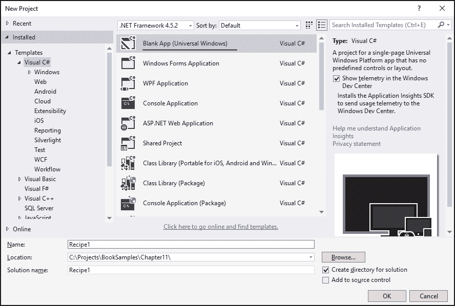
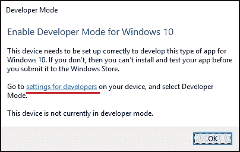
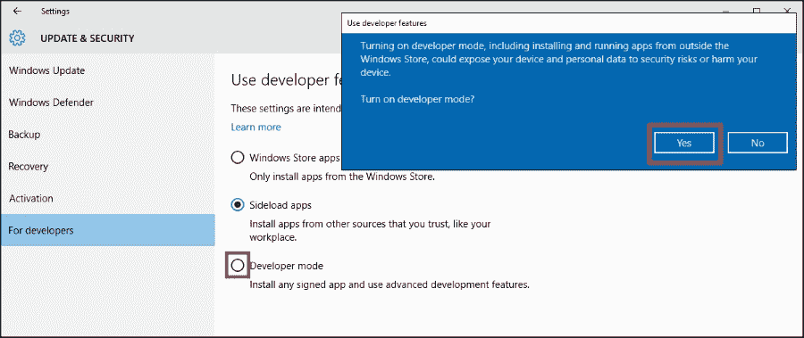
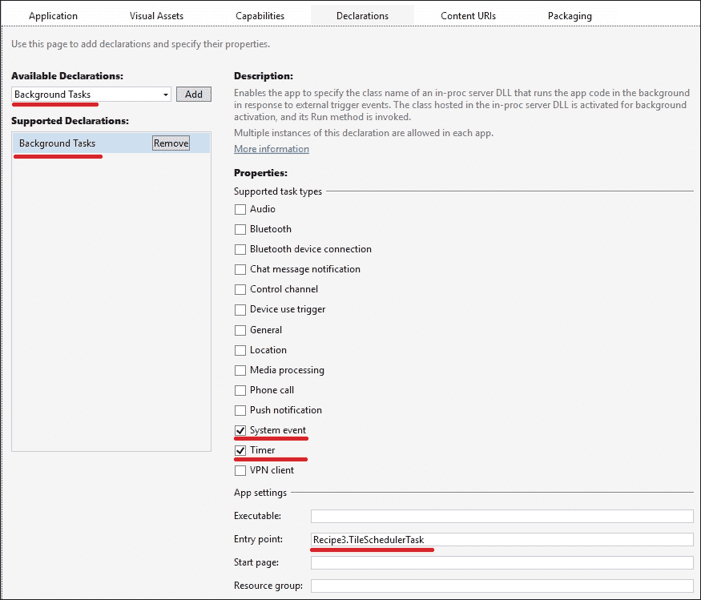

# 第十一章。还有更多

在本章中，我们将探讨 Windows 10 操作系统中的一个新的编程范式。此外，你还将学习如何在 OS X 和 Linux 上运行 .NET 程序。在本章中，你将学习以下食谱：

+   在通用 Windows 平台应用程序中使用计时器

+   在常规应用程序中使用 WinRT

+   在通用 Windows 平台应用程序中使用 `BackgroundTask`

+   在 OS X 上运行 .NET Core 应用程序

+   在 Ubuntu Linux 上运行 .NET Core 应用程序

# 简介

微软于 2011 年 9 月 13 日在 Build 大会上发布了 Windows 8 的第一个公开测试版。新的操作系统通过引入响应式 UI（适用于具有触摸功能的平板电脑设备）、降低功耗、新的应用程序模型、新的异步 API 和更严格的安全性等特性，试图解决 Windows 几乎所有的问题。

Windows API 改进的核心是一个新的多平台组件系统，**WinRT**，它是 COM 的逻辑发展。使用 WinRT，程序员可以使用原生 C++ 代码、C# 和 .NET，甚至 JavaScript 和 HTML 来开发应用程序。另一个变化是引入了一个集中的应用程序商店，这在 Windows 平台上之前是不存在的。

作为一个新的应用程序平台，Windows 8 具有向后兼容性，并允许我们运行常规的 Windows 应用程序。这导致了一种情况，即存在两个主要的应用程序类别：Windows Store 应用程序，新程序通过 Windows Store 分发，以及自 Windows 前一个版本以来没有改变的常规经典应用程序。

然而，Windows 8 只是向新的应用程序模型迈出的第一步。微软从用户那里收到了很多反馈，并且很明显，Windows Store 应用程序与人们习惯的太不同了。除此之外，还有一个独立的智能手机操作系统，Windows 8 Phone，它有一个不同的应用程序商店和略微不同的 API 集合。这使得应用程序开发者必须为桌面和智能手机平台创建两个独立的应用程序。

为了改善这种情况，新的 Windows 10 操作系统被引入作为一个统一的所有 Windows 设备的平台。有一个单一的应用程序商店支持每个设备系列，现在，创建一个可以在手机、平板电脑和桌面电脑上运行的应用程序成为可能。因此，Windows Store 应用程序现在被称为通用 Windows 平台应用程序（UWP 应用程序）。这当然意味着你的应用程序会有很多限制——它不应该使用任何平台特定的 API，作为一个程序员，你必须遵守特定的规则。程序必须在有限的时间内响应启动或完成，以保持整个操作系统和其他应用程序的响应。为了节省电池，你的应用程序默认不再在后台运行；相反，它们被挂起并实际上停止执行。

新的 Windows API 是异步的，你只能在你的应用程序中使用白名单中的 API 函数。例如，你不再被允许创建新的`Thread`类实例。你必须使用系统管理的线程池。许多常规 API 不能再使用，你必须研究新的方法来实现之前的目标。

但这还不是全部。微软开始意识到支持除 Windows 以外的操作系统也很重要。现在，你可以使用一个新的.NET 子集来编写跨平台应用程序，这个子集被称为.NET Core。它的源代码可以在 GitHub 上找到，并且它在 OS X 和 Linux 等平台上得到支持。你可以使用任何文本编辑器，但我建议你看看 Visual Studio Code——这是一个新的轻量级、跨平台代码编辑器，它在 OS X 和 Linux 上运行，并且很好地理解 C#语法。

在本章中，我们将了解通用 Windows 平台应用程序与常规 Windows 应用程序的不同之处，以及我们如何利用一些 WinRT 从常规应用程序中获得的益处。我们还将通过一个具有后台通知的简化通用 Windows 平台应用程序场景进行说明。你还将学习如何在 OS X 和 Linux 上运行.NET 程序。

# 在通用 Windows 平台应用程序中使用计时器

本教程展示了如何在通用 Windows 平台应用程序中使用简单的计时器。

## 准备工作

要完成这个教程，你需要 Visual Studio 2015 和 Windows 10 操作系统。没有其他先决条件。本教程的源代码可以在`BookSamples\Chapter11\Recipe1`找到。

## 如何操作...

要了解如何在 Windows Store 应用程序中使用计时器，请执行以下步骤：

1.  启动 Visual Studio 2015。在`Windows\Universal`文件夹中创建一个新的 C# **空白应用（通用 Windows）**项目。

1.  如果你被要求为 Windows 10 启用开发者模式，你必须在控制面板中启用它。

1.  然后，确认你确实想要开启开发者模式。

1.  在`MainPage.xaml`文件中，向`Grid`元素添加`Name`属性：

    ```cs
    <Grid Name="Grid" Background="{StaticResource  ApplicationPageBackgroundThemeBrush}">
    ```

1.  在`MainPage.xaml.cs`文件中添加以下`using`指令：

    ```cs
    using System;
    using Windows.UI.Xaml;
    using Windows.UI.Xaml.Controls;
    using Windows.UI.Xaml.Navigation;
    ```

1.  在`MainPage`构造函数定义上方添加以下代码片段：

    ```cs
    private readonly DispatcherTimer _timer;
    private int _ticks;
    ```

1.  将`MainPage()`构造函数替换为以下代码片段：

    ```cs
    public MainPage()
    {
      InitializeComponent();
      _timer = new DispatcherTimer();
      _ticks = 0;
    }
    ```

1.  在`MainPage`构造函数定义下添加`OnNavigatedTo()`方法：

    ```cs
    protected override void OnNavigatedTo(NavigationEventArgs e)
    {
    }
    ```

1.  在`OnNavigatedTo`方法内部添加以下代码片段：

    ```cs
    base.OnNavigatedTo(e);Grid.Children.Clear();
    var commonPanel = new StackPanel
    {
      Orientation = Orientation.Vertical,
      HorizontalAlignment = HorizontalAlignment.Center
    };

    var buttonPanel = new StackPanel
    {
      Orientation = Orientation.Horizontal,
      HorizontalAlignment = HorizontalAlignment.Center
    };

    var textBlock = new TextBlock
    {
      Text = "Sample timer application",
      FontSize = 32,
      HorizontalAlignment = HorizontalAlignment.Center,
      Margin = new Thickness(40)
    };

    var timerTextBlock = new TextBlock
    {
      Text = "0",
      FontSize = 32,
      HorizontalAlignment = HorizontalAlignment.Center,
      Margin = new Thickness(40)
    };

    var timerStateTextBlock = new TextBlock
    {
      Text = "Timer is enabled",
      FontSize = 32,
      HorizontalAlignment = HorizontalAlignment.Center,
      Margin = new Thickness(40)
    };

    var startButton = new Button { Content = "Start",FontSize = 32};
    var stopButton = new Button { Content = "Stop",FontSize = 32};

    buttonPanel.Children.Add(startButton);
    buttonPanel.Children.Add(stopButton);

    commonPanel.Children.Add(textBlock);
    commonPanel.Children.Add(timerTextBlock);
    commonPanel.Children.Add(timerStateTextBlock);
    commonPanel.Children.Add(buttonPanel);

    _timer.Interval = TimeSpan.FromSeconds(1);
    _timer.Tick += (sender, eventArgs) =>
    {
      timerTextBlock.Text = _ticks.ToString(); _ticks++;
    };
    _timer.Start();

    startButton.Click += (sender, eventArgs) =>
    {
      timerTextBlock.Text = "0";
      _timer.Start();
      _ticks = 1;
      timerStateTextBlock.Text = "Timer is enabled";
    };

    stopButton.Click += (sender, eventArgs) =>
    {
      _timer.Stop();
      timerStateTextBlock.Text = "Timer is disabled";
    };

    Grid.Children.Add(commonPanel);
    ```

1.  在 Visual Studio 的**解决方案资源管理器**中右键单击项目，然后选择**部署**。

1.  运行程序。

## 工作原理...

当程序运行时，它会创建一个 `MainPage` 类的实例。在这里，我们在构造函数中实例化 `DispatcherTimer` 并将 `ticks` 计数器初始化为 `0`。然后，在 `OnNavigatedTo` 事件处理程序中，我们创建我们的 UI 控件并将启动和停止按钮绑定到相应的 lambda 表达式，这些表达式包含 `start` 和 `stop` 逻辑。

如您所见，`timer` 事件处理程序直接与 UI 控件一起工作。这是可以的，因为 `DispatcherTimer` 是以这种方式实现的，即 `timer` 的 `Tick` 事件的处理程序由 UI 线程运行。然而，如果您运行程序，然后切换到其他程序，然后几分钟后切换回程序，您可能会注意到秒表计数器远远落后于实际经过的时间。这是因为通用 Windows 平台应用程序具有完全不同的生命周期。

### 注意

注意，通用 Windows 平台应用程序的行为与智能手机和平板电脑平台上的应用程序非常相似。它们不是在后台运行，而是在一段时间后挂起，这意味着它们实际上被冻结，直到用户切换回它们。在应用程序挂起之前，您有有限的时间来保存当前应用程序状态，并且当应用程序再次运行时，您能够恢复状态。

虽然这种行为可以节省电源和 CPU 资源，但它为那些需要在后台进行一些处理的应用程序程序创建了许多困难。Windows 10 为此类应用程序提供了一套特殊的 API。我们将在本章后面讨论此类场景。

# 在常规应用程序中使用 WinRT

这个配方向您展示了如何创建一个能够使用 WinRT API 的控制台应用程序。

## 准备工作

要完成这个配方，你需要 Visual Studio 2015 和 Windows 10 操作系统。没有其他先决条件。这个配方的源代码可以在 `BookSamples\Chapter11\Recipe2` 中找到。

## 如何操作...

要了解如何从常规应用程序中使用 WinRT，请执行以下步骤：

1.  启动 Visual Studio 2015。创建一个新的 C# 控制台应用程序项目。

1.  在 Visual Studio 的 **解决方案资源管理器** 中右键单击创建的项目，然后选择 **卸载项目…** 菜单选项。

1.  右键单击未加载的项目，并选择 **编辑 ProjectName.csproj** 菜单选项。

1.  在 `<TargetFrameworkVersion>` 元素下方添加以下 XML 代码：

    ```cs
    <TargetPlatformVersion>10.0</TargetPlatformVersion>
    ```

1.  保存 `.csproj` 文件，在 Visual Studio **解决方案资源管理器** 中右键单击未加载的项目，并选择 **重新加载项目** 菜单选项。

1.  右键单击项目，然后在 **Windows** 下的 **核心库** 中选择 **添加引用**。然后，单击 **浏览** 按钮。

1.  导航到 `C:\Program Files (x86)\Windows Kits\10\UnionMetadata` 并单击 `Windows.winmd` 文件。

1.  导航到 `C:\Program Files\Reference Assemblies\Microsoft\Framework\.NETCore\v4.5` 并单击 `System.Runtime.WindowsRuntime.dll` 文件。

1.  在`Program.cs`文件中，添加以下`using`指令：

    ```cs
    using System;
    using System.IO;
    using System.Threading.Tasks;
    using Windows.Storage;
    ```

1.  在`Main`方法下方添加以下代码片段：

    ```cs
    async static Task AsynchronousProcessing()
    {
      StorageFolder folder = KnownFolders.DocumentsLibrary;

      if (await folder.DoesFileExistAsync("test.txt"))
      {
        var fileToDelete = await folder.GetFileAsync("test.txt");
        await fileToDelete.DeleteAsync(StorageDeleteOption.PermanentDelete);
      }

      var file = await folder.CreateFileAsync("test.txt",CreationCollisionOption.ReplaceExisting);
      using (var stream = await file.OpenAsync(FileAccessMode.ReadWrite))
      using (var writer = new StreamWriter(stream.AsStreamForWrite()))
      {
        await writer.WriteLineAsync("Test content");
        await writer.FlushAsync();
      }

      using (var stream = await file.OpenAsync(FileAccessMode.Read))
      using (var reader = new StreamReader(stream.AsStreamForRead()))
      {
        string content = await reader.ReadToEndAsync();
        Console.WriteLine(content);
      }

      Console.WriteLine("Enumerating Folder Structure:");

      var itemsList = await folder.GetItemsAsync();
      foreach (var item in itemsList)
      {
        if (item is StorageFolder)
        {
          Console.WriteLine("{0} folder", item.Name);
        }
        else
        {
          Console.WriteLine(item.Name);
        }
      }
    }
    ```

1.  将以下代码片段添加到`Main`方法中：

    ```cs
    var t = AsynchronousProcessing();
    t.GetAwaiter().GetResult();
    Console.WriteLine();
    Console.WriteLine("Press ENTER to continue");
    Console.ReadLine();
    ```

1.  在`Program`类定义下方添加以下代码片段：

    ```cs
    static class Extensions
    {
      public static async Task<bool> DoesFileExistAsync(thisStorageFolder folder, string fileName)
      {
        try
        {
          await folder.GetFileAsync(fileName);
          return true;
        }
        catch (FileNotFoundException)
        {
          return false;
        }
      }
    }
    ```

1.  运行程序。

## 它是如何工作的...

在这里，我们使用了一种相当巧妙的方法来从常见的.NET 控制台应用程序中消费 WinRT API。不幸的是，并非所有可用的 API 都适用于此场景，但仍然，它可以用于处理运动传感器、GPS 位置服务等等。

要在 Visual Studio 中引用 WinRT，我们手动编辑`.csproj`文件，指定应用程序的目标平台为 Windows 10。然后，我们手动引用`Windows.winmd`以获取访问 Windows 10 API 的权限，并引用`System.Runtime.WindowsRuntime.dll`以利用 WinRT 异步操作的`GetAwaiter`扩展方法实现。这允许我们直接在 WinRT API 上使用`await`。也存在反向转换。当我们创建 WinRT 库时，我们必须公开 WinRT 本地的`IAsyncOperation`接口家族以进行异步操作，这样它们就可以以语言无关的方式从 JavaScript 和 C++中消费。

WinRT 中的文件操作相当直观；在这里，我们有异步的文件创建和删除操作。尽管如此，WinRT 中的文件操作包含安全限制，鼓励你为你的应用程序使用特殊的 Windows 文件夹，并且不允许你在磁盘驱动器上的任何文件路径上工作。

# 在通用 Windows 平台应用程序中使用 BackgroundTask

这个食谱指导你如何在通用 Windows 平台应用程序中创建后台任务，该任务在桌面上更新应用程序的磁贴。

## 准备工作

要完成这个食谱，你需要 Visual Studio 2015 和 Windows 10 操作系统。没有其他先决条件。这个食谱的源代码可以在`BookSamples\Chapter11\Recipe3`找到。

## 如何做...

要了解如何在通用 Windows 平台应用程序中使用`BackgroundTask`，请执行以下步骤：

1.  启动 Visual Studio 2015。在`Windows\Universal`文件夹下创建一个新的 C# **空白应用（通用 Windows）**项目。如果你需要启用 Windows 10 开发者模式，请参考*在 Windows Store 应用程序中使用计时器*食谱以获取详细说明。

1.  打开`Package.appxmanifest`文件。在**声明**选项卡下，将**后台任务**添加到**支持声明**中。在**属性**下，检查支持属性**系统事件**和**计时器**，并将**入口点**的名称设置为`YourNamespace.TileSchedulerTask`。`YourNamespace`应该是你的应用程序的命名空间。

1.  在`MainPage.xaml`文件中，将以下 XAML 代码插入到`Grid`元素中：

    ```cs
    <StackPanel Margin="50">
      <TextBlock Name="Clock"
                 Text="HH:mm"
                 HorizontalAlignment="Center"
                 VerticalAlignment="Center"
                 Style="{StaticResource HeaderTextBlockStyle}"/>
    </StackPanel>
    ```

1.  在`MainPage.xaml.cs`文件中，添加以下`using`指令：

    ```cs
    using System;
    using System.Diagnostics;
    using System.Globalization;
    using System.Linq;
    using System.Xml.Linq;
    using Windows.ApplicationModel.Background;
    using Windows.Data.Xml.Dom;
    using Windows.System.UserProfile;
    using Windows.UI.Notifications;
    using Windows.UI.Xaml;
    using Windows.UI.Xaml.Controls;
    using Windows.UI.Xaml.Navigation;
    ```

1.  在`MainPage`构造函数定义上方添加以下代码片段：

    ```cs
    private const string TASK_NAME_USERPRESENT ="TileSchedulerTask_UserPresent";
    private const string TASK_NAME_TIMER ="TileSchedulerTask_Timer";

    private readonly CultureInfo _cultureInfo;
    private readonly DispatcherTimer _timer;
    ```

1.  将`MainPage`构造函数替换为以下代码片段：

    ```cs
    public MainPage()
    {
    InitializeComponent();

    string language = GlobalizationPreferences.Languages.First();
    _cultureInfo = new CultureInfo(language);

    _timer = new DispatcherTimer();
    _timer.Interval = TimeSpan.FromSeconds(1);
    _timer.Tick += (sender, e) => UpdateClockText();
    }
    ```

1.  在`OnNavigatedTo`方法上方添加以下代码片段：

    ```cs
    private void UpdateClockText()
    {
      Clock.Text = DateTime.Now.ToString(_cultureInfo.DateTimeFormat.FullDateTimePattern);
    }

    private static async void CreateClockTask()
    {
      BackgroundAccessStatus result = awaitBackgroundExecutionManager.RequestAccessAsync();
      if (result == BackgroundAccessStatus.AllowedMayUseActiveRealTimeConnectivity ||result == BackgroundAccessStatus.AllowedWithAlwaysOnRealTimeConnectivity)
      {
        TileSchedulerTask.CreateSchedule();

        EnsureUserPresentTask();
        EnsureTimerTask();
      }
    }

    private static void EnsureUserPresentTask()
    {
      foreach (var task in BackgroundTaskRegistration.AllTasks)
        if (task.Value.Name == TASK_NAME_USERPRESENT)
          return;

      var builder = new BackgroundTaskBuilder();
      builder.Name = TASK_NAME_USERPRESENT;
      builder.TaskEntryPoint =(typeof(TileSchedulerTask)).FullName;
      builder.SetTrigger(new SystemTrigger(SystemTriggerType.UserPresent, false));
      builder.Register();
    }

    private static void EnsureTimerTask()
    {
      foreach (var task in BackgroundTaskRegistration.AllTasks)
        if (task.Value.Name == TASK_NAME_TIMER)
          return;

      var builder = new BackgroundTaskBuilder();
      builder.Name = TASK_NAME_TIMER;
      builder.TaskEntryPoint = (typeof(TileSchedulerTask)).FullName;
      builder.SetTrigger(new TimeTrigger(180, false));
      builder.Register();
    }
    ```

1.  将以下代码片段添加到`OnNavigatedTo`方法中：

    ```cs
    _timer.Start();
    UpdateClockText();
    CreateClockTask();
    ```

1.  将以下代码片段添加到`MainPage`类定义下方：

    ```cs
    public sealed class TileSchedulerTask : IBackgroundTask
    {
      public void Run(IBackgroundTaskInstance taskInstance)
      {
        var deferral = taskInstance.GetDeferral();
        CreateSchedule();
        deferral.Complete();
      }

      public static void CreateSchedule()
      {
        var tileUpdater = TileUpdateManager.CreateTileUpdaterForApplication();
        var plannedUpdated = tileUpdater.GetScheduledTileNotifications();

        DateTime now = DateTime.Now;
        DateTime planTill = now.AddHours(4);

        DateTime updateTime = new DateTime(now.Year, now.Month,now.Day, now.Hour, now.Minute, 0).AddMinutes(1);
        if (plannedUpdated.Count > 0)
          updateTime = plannedUpdated.Select(x =>x.DeliveryTime.DateTime).Union(new[] { updateTime}).Max();
        XmlDocument documentNow = GetTilenotificationXml(now);

        tileUpdater.Update(new TileNotification(documentNow) {ExpirationTime = now.AddMinutes(1) });

        for (var startPlanning = updateTime;startPlanning < planTill; startPlanning =startPlanning.AddMinutes(1))
        {
          Debug.WriteLine(startPlanning);
          Debug.WriteLine(planTill);

          try
          {
            XmlDocument document = GetTilenotificationXml(startPlanning);

            var scheduledNotification = newScheduledTileNotification(document,new DateTimeOffset(startPlanning))
            {
              ExpirationTime = startPlanning.AddMinutes(1)
            };

            tileUpdater.AddToSchedule(scheduledNotification);
          }
          catch (Exception ex)
          {
            Debug.WriteLine("Error: " + ex.Message);
          }
        }
      }

      private static XmlDocument GetTilenotificationXml(DateTime dateTime)
      {
        string language =GlobalizationPreferences.Languages.First();
        var cultureInfo = new CultureInfo(language);

        string shortDate = dateTime.ToString(cultureInfo.DateTimeFormat.ShortTimePattern);
        string longDate = dateTime.ToString(cultureInfo.DateTimeFormat.LongDatePattern);

        var document = XElement.Parse(string.Format(@"<tile>
        <visual>
          <binding template=""TileSquareText02"">
            <text id=""1"">{0}</text>
            <text id=""2"">{1}</text>
          </binding>
          <binding template=""TileWideText01"">
            <text id=""1"">{0}</text>
            <text id=""2"">{1}</text>
            <text id=""3""></text>
            <text id=""4""></text>
          </binding>  
        </visual>
      </tile>", shortDate, longDate));

        return document.ToXmlDocument();
      }
    }

    public static class DocumentExtensions
    {
      public static XmlDocument ToXmlDocument(thisXElement xDocument)
      {
        var xmlDocument = new XmlDocument();
        xmlDocument.LoadXml(xDocument.ToString());
        return xmlDocument;
      }
    }
    ```

1.  运行程序。

## 它是如何工作的...

前面的程序展示了如何创建一个基于时间的后台任务，以及如何在 Windows 10 开始菜单上的实时磁贴上显示此任务的更新。编程通用 Windows 平台应用程序本身就是一个相当具有挑战性的任务——你必须关注应用程序挂起/恢复其状态以及许多其他事情。在这里，我们将集中精力完成我们的主要任务，而将次要问题留在一旁。

我们的主要目标是当应用程序本身不在前台时运行一些代码。首先，我们创建了一个`IBackgroundTask`接口的实现。这是我们编写的代码，当接收到触发信号时，将调用`Run`方法。如果`Run`方法中包含带有`await`的异步代码，我们必须使用食谱中显示的特殊延迟对象来明确指定何时开始和结束`Run`方法的执行。在我们的情况下，方法调用是同步的，但为了说明这个要求，我们使用延迟对象。

在我们的`Run`方法中，我们为 4 个小时创建了一组每分钟一次的磁贴更新，并使用`ScheduledTaskNotification`类将其注册到`TileUpdateManager`中。磁贴使用特殊的 XML 格式来指定文本在其中的确切位置。当我们从系统中触发任务时，它为接下来的 4 个小时安排了一分钟的磁贴更新。然后，我们需要注册我们的后台任务。我们这样做两次；一次注册提供了一个`UserPresent`触发器，这意味着当用户登录时，此任务将被触发。下一个触发器是一个时间触发器，每 3 小时运行一次任务。

当程序运行时，它会创建一个计时器，该计时器在应用程序处于前台时运行。同时，它尝试注册后台任务；为了注册这些任务，程序需要用户权限，并且会显示一个对话框请求用户权限。现在，我们已经为接下来的 4 小时安排了实时磁贴更新。如果我们关闭我们的应用程序，实时磁贴将继续每分钟显示新的时间。在接下来的 3 小时内，时间触发器将再次运行我们的后台任务，并且我们将安排另一个实时磁贴更新。

# 在 OS X 上运行.NET Core 应用程序

这个食谱展示了如何在 OS X 上安装.NET Core 应用程序，以及如何构建和运行.NET 控制台应用程序。

## 准备工作

为了完成这个食谱，你需要一个 Mac OS X 操作系统。没有其他先决条件。这个食谱的源代码可以在`BookSamples\Chapter11\Recipe4`找到。

## 如何操作...

要了解如何运行.NET Core 应用程序，请执行以下步骤：

1.  在您的 OS X 机器上安装 .NET Core。您可以访问 [`dotnet.github.io/getting-started/`](http://dotnet.github.io/getting-started/) 并遵循那里的安装说明。由于 .NET Core 处于预发布阶段，在本书出版之前，安装和使用场景可能会发生变化。在这种情况下，请参考网站上的说明。

1.  在您下载了 `.pkg` 文件后，按住 *Control* 键打开它。这将解锁文件，并允许您安装它。

1.  在您安装完软件包后，您需要安装 OpenSSL。最简单的方法是首先安装 homebrew 软件包管理器。打开终端窗口并运行以下命令：

    ```cs
    /usr/bin/ruby -e "$(curl -fsSL https://raw.githubusercontent.com/Homebrew/install/master/install)"
    ```

1.  然后，您可以在其中输入以下内容来安装 OpenSSL：

    ```cs
    brew install openssl

    ```

1.  同时还有一个小的注意事项，即撰写本书时，.NET Core 需要增加打开文件限制。这可以通过输入以下内容来实现：

    ```cs
    sudo sysctl -w kern.maxfiles=20480
    sudo sysctl -w kern.maxfilesperproc=18000
    sudo ulimit -S -n 2048

    ```

1.  现在您已经安装了 .NET Core 并准备开始。要创建一个示例 Hello World 应用程序，您可以创建一个目录并创建一个空的应用程序：

    ```cs
    mkdir HelloWorld
    cd HelloWorld
    dotnet new

    ```

1.  让我们检查默认应用程序是否工作。要运行代码，我们必须恢复依赖项并构建和运行应用程序。为此，请输入以下命令：

    ```cs
    dotnet restore
    dotnet run

    ```

1.  现在，让我们尝试运行一些异步代码。在 `Program.cs` 文件中，将代码更改为以下内容：

    ```cs
    using System;
    using System.Threading.Tasks;
    using static System.Console;
    namespace OSXConsoleApplication
    {
      class Program
      {
        static void Main(string[] args)
        {
          WriteLine(".NET Core app on OS X");
          RunCodeAsync().GetAwaiter().GetResult();
        }
        static async Task RunCodeAsync()
        {
          try
          {
            string result = await GetInfoAsync("Async 1");
            WriteLine(result);
            result = await GetInfoAsync("Async 2");
            WriteLine(result);
          }
          catch (Exception ex)
          {
            WriteLine(ex);
          }
        }
        static async Task<string> GetInfoAsync(string name)
        {
          WriteLine($"Task {name} started!");
          await Task.Delay(TimeSpan.FromSeconds(2));
          if(name == "Async 2")
            throw new Exception("Boom!");
          return
              $"Task {name} completed successfully!"
    // + $"Thread id {System.Threading.Thread.CurrentThread.ManagedThreadId}."
                        ;
        }
      }
    }
    ```

1.  使用 `dotnet run` 命令运行程序。

## 它是如何工作的...

在这里，我们从网站上下载包含 .NET Core 安装包的 `.pkg` 文件并将其安装。我们还使用 homebrew 软件包管理器（它也会被安装）安装 OpenSSL 库。除此之外，我们还在 OS X 中增加打开文件限制，以便能够恢复 .NET Core 依赖项。

然后，我们为 .NET Core 应用程序创建一个单独的文件夹，创建一个空白控制台应用程序，并检查恢复依赖项和运行代码是否一切正常。

最后，我们创建一段简单的异步代码并尝试运行它。它应该运行良好，显示第一个任务成功完成的消息。第二个任务抛出了异常，但被正确处理。但是，如果您尝试取消注释一行旨在显示线程特定信息的代码，代码将无法编译，因为 .NET Core 不支持 Thread API。

# 在 Ubuntu Linux 上运行 .NET Core 应用程序

这个菜谱展示了如何在 Ubuntu 上安装 .NET Core 应用程序，以及如何构建和运行 .NET 控制台应用程序。

## 准备工作

要完成这个菜谱，您需要一个 Ubuntu Linux 14.04 操作系统。没有其他先决条件。这个菜谱的源代码可以在 `BookSamples\Chapter11\Recipe5` 找到。

## 如何操作...

要了解如何运行 .NET Core 应用程序，请执行以下步骤：

1.  在你的 Ubuntu 机器上安装.NET Core。你可以访问[`dotnet.github.io/getting-started/`](http://dotnet.github.io/getting-started/)并遵循那里的安装说明。由于.NET Core 处于预发布阶段，安装和使用场景可能会在本书出版时发生变化。在这种情况下，请参考网站上的说明。

1.  首先，打开一个终端窗口并运行以下命令：

    ```cs
    sudo sh -c 'echo "deb [arch=amd64] http://apt-mo.trafficmanager.net/repos/dotnet/ trusty main" > /etc/apt/sources.list.d/dotnetdev.list'
    sudo apt-key adv --keyserver apt-mo.trafficmanager.net --recv-keys 417A0893
    sudo apt-get update

    ```

1.  然后，你可以在终端窗口中输入以下内容来安装.NET Core：

    ```cs
    sudo apt-get install dotnet=1.0.0.001331-1

    ```

1.  现在，你已经安装了.NET Core 并准备就绪。要创建一个示例 Hello World 应用程序，你可以创建一个目录并创建一个空的应用程序：

    ```cs
    mkdir HelloWorld
    cd HelloWorld
    dotnet new

    ```

1.  让我们检查默认应用程序是否工作。要运行代码，我们必须恢复依赖项并构建和运行应用程序。为此，请输入以下命令：

    ```cs
    dotnet restore
    dotnet run

    ```

1.  现在，让我们尝试运行一些异步代码。在`Program.cs`文件中，将代码更改为以下内容：

    ```cs
    using System;
    using System.Threading.Tasks;
    using static System.Console;
    namespace OSXConsoleApplication
    {
      class Program
      {
        static void Main(string[] args)
        {
          WriteLine(".NET Core app on Ubuntu");
          RunCodeAsync().GetAwaiter().GetResult();
        }
        static async Task RunCodeAsync()
        {
          try
          {
            string result = await GetInfoAsync("Async 1");
            WriteLine(result);
            result = await GetInfoAsync("Async 2");
            WriteLine(result);
          }
          catch (Exception ex)
          {
            WriteLine(ex);
          }
        }
        static async Task<string> GetInfoAsync(string name)
        {
          WriteLine($"Task {name} started!");
          await Task.Delay(TimeSpan.FromSeconds(2));
          if(name == "Async 2")
            throw new Exception("Boom!");
          return
              $"Task {name} completed successfully!"
    // + $"Thread id {System.Threading.Thread.CurrentThread.ManagedThreadId}."
                        ;
        }
      }
    }
    ```

1.  使用`dotnet run`命令运行程序。

## 它是如何工作的...

在这里，我们首先设置 apt-get feed，它托管我们需要的.NET Core 包。这是必要的，因为在写作的时候，.NET Core for Linux 可能尚未发布。当然，当发布发生时，它将进入正常的 apt-get feed，你不需要向其中添加自定义 feed。完成此操作后，我们使用 apt-get 安装当前正在工作的.NET Core 版本。

然后，我们为.NET Core 应用程序创建一个单独的文件夹，创建一个空白控制台应用程序，并检查在恢复依赖项和运行代码时是否一切正常。

最后，我们创建一个简单的异步代码并尝试运行它。它应该运行良好，显示第一条任务成功完成的消息，第二条任务抛出了异常，并且被正确处理。但是，如果你尝试取消注释一行旨在显示线程特定信息的代码，代码将无法编译，因为.NET Core 不支持 Thread API。
