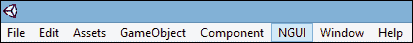
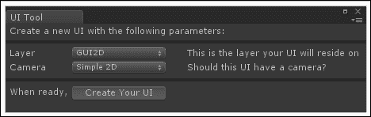
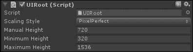
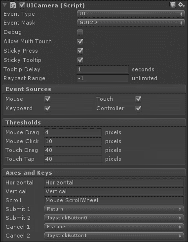
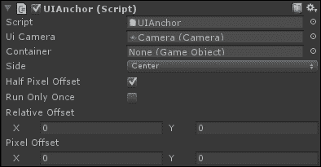
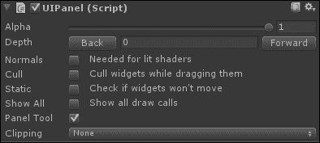

# 第一章. NGUI 入门

在我们导入插件并创建第一个 UI 之前，我们将讨论 NGUI 的整体工作流程。然后我们将查看 UI 的结构、重要参数和一般行为。

# 什么是 NGUI？

**下一代用户界面**套件是 Unity 3D 的插件。它具有易于使用、非常强大且与 Unity 内置 GUI 系统 **UnityGUI** 相比进行了优化的巨大优势。由于它是用 C# 编写的，因此易于理解，您可以根据需要对其进行调整或添加自己的功能。

**NGUI 标准许可证**的价格为 95 美元。购买此许可证，您将获得有用的示例场景。我建议您从舒适开始使用此许可证——免费评估版本是可用的，但它有限、过时，不推荐使用。

**NGUI 专业许可证**，价格为 200 美元，让您可以访问 NGUI 的 GIT 仓库，提前访问最新的测试版功能和发布。

2000 美元的 **站点许可证**适用于同一工作室内的无限数量开发者。

让我们概述一下此插件的主要功能，并看看它们是如何工作的。

## UnityGUI 与 NGUI 的比较

使用 Unity 的 GUI，您必须通过在屏幕上显示标签、纹理或任何其他 UI 元素的代码中添加行来创建整个 UI。这些行必须写在每次调用时都会被调用的特殊函数 `OnGUI()` 中。这不再是必要的；使用 NGUI，UI 元素是简单的 GameObject！

您可以创建小部件——这是 NGUI 所称的标签、精灵、输入字段等——通过手柄或检查器移动它们、旋转它们并更改它们的尺寸。复制、粘贴、创建预制体以及 Unity 的工作流程中的所有其他有用功能也都可以使用。

这些小部件由相机查看，并渲染在您可以指定的层上。大多数参数都可以通过 Unity 的检查器访问，您可以直接在游戏窗口中看到您的 UI 看起来是什么样子，而无需按播放按钮。

## 图集

精灵和字体都包含在一个称为图集的大纹理中。只需几步点击，您就可以轻松创建和编辑您的图集。如果您没有图像来创建自己的 UI 资产，插件中附带了一些简单的默认图集。

该系统意味着对于由不同纹理和字体组成的复杂 UI 窗口，在渲染时将使用相同的材质和纹理。这导致整个窗口只有一个绘制调用。这，加上其他优化，使 NGUI 成为在移动平台上工作的完美工具。

## 事件

NGUI 还附带了一个易于使用的 C# 编写的事件框架。该插件附带了许多额外的组件，您可以将它们附加到 GameObject 上。这些组件可以根据触发哪些事件执行高级任务：悬停、点击、输入等。因此，您可以在保持配置简单的同时增强您的 UI 体验。代码更少，收获更多！

## 本地化

NGUI 自带本地化系统，使您能够轻松地通过点击按钮设置和更改 UI 的语言。所有字符串都位于`.txt`文件中：每种语言一个文件。

## 着色器

NGUI 支持光照、法线贴图和折射着色器，这些可以为您带来美观的效果。裁剪也是 NGUI 控制的一个着色器功能，用于显示或隐藏 UI 的特定区域。

我们现在已经介绍了 NGUI 的主要功能以及它作为插件对我们有用的方式，现在是时候将其导入 Unity 中。

# 导入 NGUI

在 Asset Store 购买产品或获取评估版本后，您必须下载它。执行以下步骤进行下载：

1.  创建一个新的 Unity 项目。

1.  导航到**窗口** | **Asset Store**。选择您的下载库。

1.  点击**NGUI: Next-Gen UI**旁边的**下载**按钮。

1.  下载完成后，点击库中的 NGUI 图标/产品名称以访问产品页面。

1.  点击**导入**按钮，等待弹出窗口出现。

1.  选择**NGUI v.3.0.2.unitypackage**旁边的复选框，然后点击**导入**。

1.  在项目视图中，导航到**Assets** | **NGUI**，然后双击**NGUI v.3.0.2**。

1.  将出现一个新的导入弹出窗口。再次点击**导入**。

1.  点击工具栏上的任何按钮以刷新它。NGUI 托盘将出现！

NGUI 托盘将看起来如下截图所示：

您现在已成功将 NGUI 导入到项目中。让我们创建您的第一个 2D UI。

# 创建您的 UI

我们现在将使用 NGUI 的 UI 向导创建我们的第一个 2D 用户界面。此向导将为 NGUI 工作添加所有必需的元素。

在我们继续之前，请将场景保存为`Menu.unity`。

## UI 向导

通过在工具栏中导航到**NGUI** | **打开** | **UI 向导**来打开 UI 向导创建您的 UI。现在让我们看看 UI 向导窗口及其参数。

### 窗口

您现在应该有一个带有两个参数的弹出窗口：

### 参数

两个参数如下：

+   **层**：这是 UI 将显示的层

+   **相机**：这将决定 UI 是否会有相机，其下拉选项如下：

    +   **无**：不会创建相机

    +   **简单 2D**：使用正交投影相机

    +   **高级 3D**：使用透视投影相机

## 分离 UI 层

我建议您将 UI 与其他常用层分开。我们应该按照以下步骤进行：

1.  点击**层**参数旁边的下拉菜单。

1.  选择**添加层**。

1.  创建一个新的层并将其命名为`GUI2D`。

1.  返回 UI 向导窗口并选择此新的**GUI2D**层用于 UI。

您现在可以点击**创建您的 UI**按钮。您的第一个 2DUI 已经创建！

# 您的 UI 结构

向导已为我们场景创建了四个新的 GameObject：

+   UI 根（2D）

+   相机

+   锚点

+   面板

让我们现在详细审查每个参数。

## UI Root (2D)

**UIRoot**组件将小部件缩放以保持它们的大小可管理。它还负责**缩放样式**——它将根据您指定的参数将 UI 元素缩放以保持像素完美或占用屏幕的相同百分比。

在层次结构中选择**UI Root (2D)** GameObject。它附有`UIRoot.cs`脚本。此脚本调整其附加的 GameObject 的缩放，以便您可以使用像素指定小部件坐标，而不是如图所示使用 Unity 单位：

### 参数

**UIRoot**组件有四个参数：

+   **缩放样式**: 以下是可以用的缩放样式：

    +   **像素完美**: 这将确保您的 UI 始终尝试保持相同的像素大小，无论分辨率如何。在这种缩放模式下，一个 300 x 200 的窗口在 320 x 240 的屏幕上会显得非常大，而在 1920 x 1080 的屏幕上会显得非常小。这也意味着，如果您 UI 的分辨率小于屏幕分辨率，它将被裁剪。

    +   **固定大小**: 这将确保您的 UI 将根据屏幕高度成比例调整大小。结果是，您的 UI 将不会是像素完美的，但会缩放以适应当前屏幕大小。

    +   **固定大小在移动设备上**: 这将确保在移动设备上固定大小，在其他所有地方保持像素完美。

+   **手动高度**: 使用**固定大小**缩放样式，缩放将基于此高度。如果您的屏幕高度超过或低于此值，它将被调整大小以显示相同的大小，同时保持宽高比（宽度/高度成比例关系）。

+   **最小高度**: 使用**像素完美**缩放样式，此参数定义了屏幕的最小高度。如果您的屏幕高度低于此值，您的 UI 将调整大小。它将类似于将**缩放样式**参数设置为**固定大小**，并将**手动高度**设置为此值。

+   **最大高度**: 使用**像素完美**缩放样式，此参数定义了屏幕的最大高度。如果您的屏幕高度超过此值，您的 UI 将调整大小。它将类似于将**缩放样式**参数设置为**固定大小**，并将**手动高度**设置为此值。

    ### 注意

    请将**缩放样式**参数设置为**固定大小**，并将**手动高度**设置为 1080。这将允许我们在 1920 x 1080 的任何屏幕尺寸上拥有相同的 UI。

尽管 UI 在不同分辨率上看起来相同，但由于缩放仅基于屏幕高度，**宽高比**仍然是一个问题。如果您想覆盖 4:3 和 16:9 的屏幕，您的 UI 不应太大——尽量保持它为正方形。否则，您的 UI 可能在某些屏幕分辨率上被裁剪。

另一方面，如果您想要 16:9 的 UI，我建议您仅强制执行此宽高比。让我们通过以下步骤现在为此项目执行此操作：

1.  导航到**编辑** | **项目设置** | **玩家**。

1.  在**检查器**选项中，展开**分辨率和展示**组。

1.  展开**支持的纵横比**组。

1.  只勾选**16:9**框。

既然我们已经看到了 UI 根的不同参数，让我们来讨论一下相机。

## 相机

在**层次结构**视图中选择**相机**GameObject。它附带了`UICamera.cs`脚本。此脚本必须附加到任何需要与 UI 交互的相机上。

其目的是发送有关 UI 元素（如附加到按钮的碰撞器）发生的事件的不同消息。一些更常用的事件是`OnClick()`和`OnHover()`。

如果你认为有必要，你可以有多个相机；例如，你可以有一个用于 2D 游戏 UI 元素的正交相机，以及一个用于 3D 暂停菜单的独立透视相机。

为了本书的目的，我们将只使用一个相机。

### 参数

`UICamera.cs`脚本具有大量参数，如下面的截图所示：

这些参数如下：

+   **事件类型**：选择此相机将发送哪种事件类型。

    +   **世界**：这是用于与 3D 世界 GameObject 交互的

    +   **UI**：这是用于与 2D UI 交互的

+   **事件遮罩**：选择将用于接收事件的层。

    +   在我们的情况下，我们将将其设置为**GUI2D**，因为我们的 UI 将驻留在其上。

+   **调试**：这包括启用或禁用调试模式选项。此选项在出现不希望的行为时很有用。

    +   启用：当**调试**启用时，当前悬停的对象将显示在屏幕的左上角

+   **允许多点触控**：这包括启用或禁用触摸模式选项，允许同时触摸。如果你想在移动平台上使用捏合缩放或其他此类手势，这是强制性的。

+   **粘性按下**：这包括启用或禁用粘性按下模式选项。

    +   启用：如果你将手指从按下的按钮中拖出，它将保持按下状态，并且直到释放之前，其他元素都不会从该手指接收即将发生的事件

    +   禁用：如果你将手指从按下的按钮中拖出，它将不再被按下，其他元素将接收来自该手指的即将发生的事件

+   **粘性工具提示**：这包括启用或禁用粘性工具提示模式选项。

    +   启用：当鼠标移出小部件时，工具提示消失

    +   禁用：当鼠标移出按下按钮时，工具提示立即消失

+   **工具提示延迟**：它包括在显示小部件的工具提示之前所需的静止时间（以秒为单位）。

+   **射线投射范围**：射线投射是从一个点向特定方向发射的不可见射线，如果遇到另一个对象则停止。摄像机使用从鼠标或触摸位置向摄像机前方方向的射线投射来检测碰撞和处理事件。如果您需要限制交互到一定范围，您可以设置此射线投射的范围。默认的**-1**值表示射线投射的范围将延伸到摄像机能看到的距离。

+   **事件源**：这些布尔值让您可以指定此摄像机监听哪些事件。

    +   **鼠标**：这是用于鼠标移动、左右/中键点击和滚轮。

    +   **触摸**：这是用于触摸设备的。

    +   **键盘**：这是用于键盘输入。它使用`OnKey()`事件。

    +   **控制器**：这是用于基于摇杆的设备。它使用`OnKey()`事件。

+   **阈值**：当您想要指定触发特定事件前的最小值时，这些值会很有用。这可能会因游戏/应用程序而异。

    +   **鼠标拖动**：当鼠标按钮被按下（触发`OnPress()`事件）时，此值确定鼠标必须移动多少像素才被认为是拖动，并发送`OnDrag()`事件到被拖动的对象。

    +   **鼠标点击**：当鼠标按钮被按下（触发`OnPress()`事件）时，此值确定鼠标在按钮释放时没有效果（不触发`OnClick()`事件）之前可以移动的像素距离。

    +   **触摸拖动**：这与**鼠标拖动**相同，但用于基于触摸的设备。

    +   **触摸点击**：这与**鼠标点击**相同，但用于基于触摸的设备。

+   **轴和键**：这些参数让您可以将 Unity 输入轴和键分配给 NGUI 的输入系统。

    +   **水平**：这是水平移动的输入轴（左/右按键事件）。

    +   **垂直**：这是垂直移动的输入轴（上/下按键事件）。

    +   **滚动**：这是滚动的输入轴。

    +   **提交 1**：这是验证的主要键码。

    +   **提交 2**：这是验证的次要键码。

    +   **取消 1**：这是取消的主要键码。

    +   **取消 2**：这是取消的次要键码。

    ### 备注

    您可以在任何时间通过导航到**编辑** | **项目设置** | **输入**来编辑 Unity 输入。

好的，我们已经看到了`UICamera`组件的主要参数。我们必须看看摄像机的锚点子项。

## 锚点

锚点用于将 GameObject 附加到摄像机视图内的同一区域。例如，您可以将其附加到屏幕的边缘或角落，或另一个小部件。

在**层次结构**视图中选择**锚点**GameObject。它附有**UIAnchor**组件。它配置为根据父摄像机在屏幕上居中内容。

在我们创建小部件之前，我们必须了解这些**UIAnchor**参数如何修改它们的放置行为。

### 参数

**UIAnchor**组件如以下截图所示有七个参数：

这些参数如下：

+   **UI 相机**: 这是确定我们的锚定边界所使用的参考相机。默认情况下，它设置为 UI 使用的相机。

+   **容器**: 如果您将 GameObject 拖放到此字段，它将覆盖相机锚定。如果您需要根据容器 GameObject 而不是相机来锚定面板或小部件，这可能很有用。您的内容将使用分配的容器的位置进行放置。

+   **侧边**: 您希望您的子 GameObject 是居中、附着到参考相机/容器的某一边或角落吗？您可以在此处选择您的锚定点。

+   **半像素偏移**: 您应该勾选此布尔值。它使小部件在 Windows 机器上的位置像素完美。

+   **仅运行一次**: 如果您的屏幕分辨率从不更改，或者您希望在开始时将其删除，则可以勾选此布尔值。结果，您的锚定将在开始时执行，然后删除并不再更新。

+   **相对偏移**: 这个`Vector2`类接受介于-1 和 1 之间的两个值，以向最终位置添加相对偏移。对于**X**值为 0.12 和**Y**值为 0.32，它将在水平方向上偏移 12%，在垂直方向上偏移 32%——在任何分辨率下看起来都一样，因为偏移取决于屏幕大小。

+   **像素偏移**: 此参数类似于**相对偏移**，但它绝对而不是相对。您可以输入像素偏移——它将根据分辨率不同而看起来不同，因为偏移在所有屏幕大小上都将保持相同。

我们已经解释了不同的**UIAnchor**参数，但这个最后的子项，面板是什么？让我们来看看，然后我们将准备好创建我们的第一个小部件！

## 面板

在**层次结构**视图中选择**面板**GameObject。它附加了一个**UIPanel**组件。

面板的作用是仅在一个绘制调用中持有小部件并渲染几何形状。您可能需要创建多个面板来分割您的 UI，但每个新面板都会添加一个绘制调用。

### 参数

`UIPanel.cs`脚本如以下截图所示有八个参数：

这些参数如下：

+   **Alpha**: 您可以更改整个面板的**透明度级别**。所有子小部件都将受此 Alpha 值的影响，但嵌套面板不会。

+   **深度**: 这用于定义哪个面板覆盖另一个面板。深度值为 1 的面板将出现在深度值为 0 的面板之前。您可以使用**后退**或**前进**按钮更改**深度**，或者简单地在此字段中输入一个数字。面板也可以有负深度。

+   **法线**: 如果您需要它通过着色器对光照做出反应，则必须勾选此布尔值。它将为您的 UI 几何形状计算法线。

+   **裁剪**：这个布尔值允许在拖动面板时禁用子小部件的渲染，从而提高性能。

+   **静态**：如果您所有的面板小部件都是静态的并且永远不会移动，请选中此选项——这将提高性能！

+   **显示所有**：这将显示**检查器**视图中的所有绘制调用。

+   **面板工具**：这是一个面板管理工具。您可以在场景中可视化和选择每个面板。您可以通过*Alt* + *Shift* + *P*打开它，或者导航到**NGUI** | **打开** | **面板工具**。这个面板会在**面板工具**参数中显示吗？对于通过代码动态创建的临时面板，如警告消息或弹药拾取通知，应该取消选中。

+   **裁剪**：这将允许我们隐藏给定矩形之外的小部件。当开启时，您可以使用`中心`和`大小`参数选择裁剪矩形的尺寸。此矩形之外的所有内容都将被隐藏。

    +   **无**：无裁剪——整个面板将显示出来。

    +   **硬裁剪**：裁剪已启用——对框外小部件的粗糙裁剪。

    +   **软透明度**：裁剪已启用——带有淡出/淡入边框的软裁剪。

    我们现在已经查看了**UIPanel**组件的参数，它将被用来容纳我们的小部件。

# 摘要

在本章中，我们讨论了 NGUI 的基本工作流程——它与 GameObject 一起工作，使用图集将多个纹理组合到一个大纹理中，具有事件系统，可以使用着色器，并且有本地化系统。

在导入 NGUI 插件后，我们使用 UI 向导创建了我们的第一个 2D UI，审查了其参数，并为我们的 UI 创建了自己的 GUI 2D 层。

最后，我们分析了 NGUI 为我们自动创建的四个 GameObject。在审查它们的参数后，我们可以总结它们的作用如下：

+   **UI 根节点**包含 UI 并将其缩放以实现像素完美或固定大小

+   **相机**视图查看 UI 并向小部件发送交互消息

+   **锚点**可以将元素附加到屏幕边缘或对象上，并添加偏移量

+   **面板**容纳我们的小部件并对其进行渲染，是否裁剪均可。

我们现在准备好创建我们的第一个小部件了。是时候进入下一章了。
