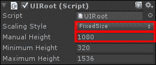
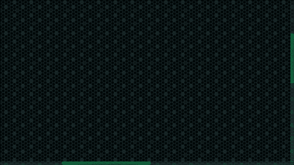
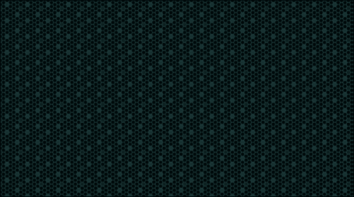
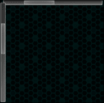
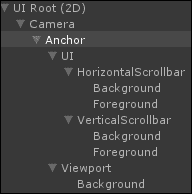
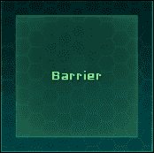
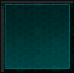
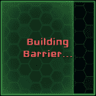
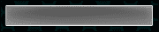
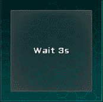

# 第五章。构建可滚动的视口

在本章中，我们将创建一个新的场景，并构建一个可滚动的视口，我们可以将其中的对象拖放到视口中。我们将添加如滚动条和箭头键盘滚动等有趣的功能。

这个可滚动的视口将是上一章游戏的基础。因此，从这里开始，用户将成为玩家。想法是玩家可以在视图中滚动和拖动障碍物，这将需要几秒钟来构建。敌人将从屏幕顶部下降。如果敌人接触到障碍物，他和障碍物都将被摧毁——但我们将在第七章*使用 NGUI 创建游戏*中处理敌人。

场景中的障碍物越多，未来障碍物的构建过程就越长——这与障碍物的冷却时间相同。

# 准备游戏场景

我们需要将**GameManager**和**Notification**游戏对象作为本章的预制体。

从我们的**菜单**场景中，通过在**项目**视图中选择文件夹并将它们分别拖动到您选择的文件夹中，创建这两个预制体。

现在，让我们使用*Ctrl* + *N*创建一个新的场景，并执行以下步骤：

1.  按*Ctrl* + *S*保存它，并将场景名称输入为`Game`。

1.  在我们的新场景中，删除**主相机**游戏对象。在这个场景中我们不需要它。

1.  将我们的**GameManager**预制体从**项目**视图拖动到**层次结构**视图中。

1.  通过导航到**NGUI** | **创建新的 UI**来打开**UI 工具**向导。

1.  添加一个名为`Game`的新**层**。

1.  在我们的**UI 工具**向导中，将**层**参数设置为这个**Game**层。

1.  点击**创建您的 UI**按钮。

1.  选择我们的新**相机**游戏对象，并将其**背景颜色**设置为**R**：`0`，**G**：`0`，**B**：`0`，和**A**：`255`。

    ### 注意

    确保您的**颜色**选择器弹出窗口处于**RGBA**值，而不是**HSVA**。这可以通过在点击**颜色**参数时使用**滑块**选项旁边的按钮来完成。

1.  选择我们的**UI 根（2D）**游戏对象，然后执行以下步骤：

    1.  将其**缩放样式**参数设置为**固定大小**。

    1.  将其**手动高度**设置为`1080`。

好的，我们的场景和 UI 已经准备好了。您的**UI 根（2D）**脚本应该如下所示：



让我们开始创建我们的可滚动的视口。

# 可滚动的视口

我们将首先创建一个剪切的可拖动背景，然后添加如以下截图所示的链接滚动条：



## 可拖动背景

我们希望玩家能够在两个轴上滚动。这意味着我们需要一个比屏幕尺寸更大和更高的背景。对于这个游戏，我们需要一个相当大的环境来强制玩家经常滚动。让我们创建一个两倍于屏幕尺寸的环境。

执行以下步骤以创建环境：

1.  选择我们的 **面板** GameObject 并执行以下步骤：

    1.  将其重命名为 `Viewport`。

    1.  将其**裁剪**参数设置为 **Alpha Clip**。

    1.  将其 **裁剪** **大小** 设置为 `1920` x `1080`。

1.  通过导航到 **组件** | **NGUI** | **交互** 来添加一个 **Draggable Panel** 组件并执行以下步骤：

    1.  将其 **拖动效果** 参数设置为 **动量**。我们不希望玩家使用弹簧效果滚动出界。

    1.  将其**动量量**值设置为 `10`。超过 10，释放时背景将继续滚动过多。

    1.  将其**缩放**参数设置为 `{`1`, `1`, `0`} 以启用 X 和 Y 滚动。

1.  通过导航到 **组件** | **NGUI** | **交互** 来将其附加一个 **Drag Panel Contents** 组件。

1.  通过导航到 **NGUI** | **附加一个碰撞器** 来将其附加一个碰撞器，并将其**大小**设置为 `{`3840`, `2160`, `1`}。

现在我们已经设置了 **Draggable Panel**，让我们添加一个如以下截图所示的平铺背景：



1.  通过导航到 **NGUI** | **创建一个 Widget** 打开 **Widget 工具** 向导。然后执行以下步骤：

    1.  如果 **Atlas** 字段设置为 **None**，则通过导航到 **资产** | **NGUI** | **示例** | **Atlases** 来将其中的 **SciFi Atlas** 预制拖动到其中。

    1.  选择 **Sprite** 模板。

    1.  选择 **Honeycomb** sprite。

    1.  选择我们的 **Viewport**，然后点击 **添加到** 按钮。

1.  选择新的 **Sprite (Honeycomb)** GameObject 然后执行以下步骤：

    1.  将其重命名为 `Background`。

    1.  将其 **Sprite 类型** 设置为 **Tiled**。

    1.  将其 **颜色色调** 值设置为 `{`0`, `40`, `40`, `255`}。

    1.  将其 **深度** 值设置为 `0`。

    1.  将其**尺寸**设置为`3840` x `2160`。

点击播放按钮。就这样，我们现在有一个可滚动的视口。您可以通过在点击的同时拖动鼠标来拖动背景。

## 链接滚动条

让我们添加滚动条以了解我们在视口中的位置。它们必须位于一个单独的面板上，该面板在视口之上渲染，这样它们就不会随着可拖动背景而移动。执行以下步骤以添加滚动条：

1.  选择我们的 **锚点** GameObject。

1.  使用 *Alt* + *Shift* + *N* 创建一个新的子项并重命名为 `UI`。

1.  通过导航到 **组件** | **NGUI** | **UI** 来添加一个 **Panel** 组件，并将其 **深度** 设置为 `1` 以确保它可以在视口上显示。

1.  通过导航到 **NGUI** | **创建一个 Widget** 打开 **Widget 工具** 向导。然后执行以下步骤：

    1.  将 **模板** 字段设置为 **Scrollbar**。

    1.  将 **背景** 设置为 **Dark** sprite。

    1.  将 **前景** 设置为 **Highlight** sprite。

    1.  将 **方向** 设置为 **水平**。

    1.  选择我们的 **UI** GameObject，然后点击 **添加到** 按钮。

1.  在我们的 **Widget 工具** 向导窗口中，将 **方向** 设置为 **垂直**。选择我们的 **UI** GameObject，然后点击 **添加到** 按钮。

    我们已在场景中心创建了水平和垂直滚动条，如以下截图所示：

    

    现在，我们需要将它们正确放置并调整大小以适应整个屏幕。

1.  选择垂直**Scroll Bar**游戏对象并将其重命名为`VerticalScrollbar`。

1.  通过导航到**NGUI** | **Attach**将其附加一个**Anchor**组件并执行以下步骤：

    1.  将我们的**Viewport**游戏对象拖动到**Container**字段中。

    1.  将其**Side**参数设置为**TopRight**。

    1.  将其**Pixel Offset**设置为{`-11`, `0`}。

1.  从**VerticalScrollbar**中选择我们的**Background**游戏对象。然后执行以下步骤：

    1.  将其**Color Tint**设置为{`130`, `255`, `245`, `110`}。

    1.  将**Box Collider**的**Center**坐标设置为{`0`, `-540`, `0`}。

    1.  将**Box Collider**的**Size**设置为{`22`, `1080`, `0`}。

1.  通过导航到**Component** | **NGUI** | **UI**将其附加一个**Stretch**组件。

    1.  将其**Style**参数设置为**Vertical**。

    1.  将其**Relative Size**值设置为{`1`, `0.983`}，以便在屏幕底部为水平滚动条留出空间。

1.  从**VerticalScrollbar**中选择**Foreground**游戏对象，并将其**Color Tint**设置为{`0`, `255`, `128`, `255`}。

    我们的垂直滚动条已配置。让我们为水平滚动条做同样的设置。

1.  选择水平**Scroll Bar**游戏对象，并将其重命名为`HorizontalScrollbar`。

1.  通过导航到**NGUI** | **Attach**将其附加一个**Anchor**组件。然后执行以下步骤：

    1.  将我们的**Viewport**游戏对象拖动到**Container**字段中。

    1.  将其**Side**参数设置为**BottomLeft**。

    1.  将其**Pixel Offset**设置为{`0`, `11`}。

1.  从**HorizontalScrollbar**中选择我们的**Background**游戏对象并执行这些步骤：

    1.  将其**Color Tint**设置为{`130`, `255`, `245`, `110`}。

    1.  将**Box Collider**的**Center**坐标设置为{`960`, `0`, `0`}。

    1.  将**Box Collider**的**Size**设置为{`1920`, `22`, `0`}。

1.  通过导航到**Component** | **NGUI** | **UI**将其附加一个**Stretch**组件，并将其**Style**参数设置为**Horizontal**。

1.  从**HorizontalScrollbar**中选择**Foreground**游戏对象，并将其**Color Tint**设置为{`0`, `255`, `128`, `255`}。

好的。我们的水平和垂直滚动条都已设置。现在，我们需要通过以下步骤将它们分配给可滚动的视口：

1.  选择我们的**Viewport**游戏对象。

1.  从**UI**拖动我们的**HorizontalScrollbar**游戏对象到**UIDraggable Panel**中的**Horizontal Scroll Bar**字段。

1.  将我们的**VerticalScrollbar**游戏对象从**UI**拖动到**UIDraggable Panel**中的**Vertical Scroll Bar**字段。

1.  将**Show Scroll Bars**参数更改为**Always**。

点击播放按钮。就这样。我们的滚动条可以用来滚动，并且在我们滚动时指示我们在视口中的位置。您的层次结构应如图所示：



现在，让我们添加键盘滚动。

## 键盘滚动

对于这款游戏，使用键盘滚动很重要。为了做到这一点，我们将创建一个自定义脚本，该脚本将根据按下的键强制我们的滚动条移动。选择我们的**Viewport**游戏对象，并将其新的`KeyboardScroll.cs`脚本附加到它上。打开这个新脚本，并声明所需的变量和`Awake()`方法：

```cs
//We need the Scrollbars for keyboard scroll
UIScrollBar hScrollbar;
UIScrollBar vScrollbar;
public float keyboardSensitivity = 1;

void Awake()
{
  //Assign both scrollbars on Awake
  hScrollbar = GetComponent<UIDraggablePanel>().horizontalScrollBar;
  vScrollbar = GetComponent<UIDraggablePanel>().verticalScrollBar;
}
```

好的，我们的两个滚动条都在`Awake()`中，并且有一个用于灵敏度的浮点值。

现在，让我们在每个帧中检查水平和垂直输入轴，并相应地更改滚动条的值：

```cs
void Update()
{
  //Get keyboard input axes values
  Vector2 keyDelta = Vector2.zero;
  keyDelta.Set(Input.GetAxis("Horizontal"), Input.GetAxis("Vertical"));
  //If no keyboard arrow is pressed, leave
  if(keyDelta == Vector2.zero) return;
  //Make it framerate independent and multiply by sensitivity
  keyDelta *= Time.deltaTime * keyboardSensitivity;
  //Scroll by adjusting scrollbars' values
  hScrollbar.value += keyDelta.x;
  vScrollbar.value -= keyDelta.y;
}
```

保存脚本并点击播放按钮。现在您可以使用键盘箭头滚动。您还可以根据需要调整**检查器**窗口中的**灵敏度**参数。

现在，是时候创建我们可以将其拖放到我们的**Viewport**游戏对象中的可拖动屏障了。

# 创建可拖动的屏障

是时候创建我们的可拖动屏障了。玩家将能够将**BarrierObject**预设拖放到**Viewport**游戏对象中。这个**BarrierObject**预设将如下面的截图所示：



## BarrierObject 预设

首先，我们需要创建我们的**BarrierObject**预设的持有者，它将包含可拖动的对象：

1.  选择我们的**UI**游戏对象。

1.  使用*Alt* + *Shift* + *N*创建一个新的子对象，并将其重命名为`Barrier`。

1.  通过导航到**NGUI** | **打开**并执行给定的步骤来打开**Widget Tool**向导：

    1.  将**模板**参数的**精灵**设置为**Sprite**。

    1.  将**Sprite**字段的**精灵**选择为**Dark**。

    1.  在我们的**Barrier**游戏对象被选中时，点击**添加到**按钮。

1.  选择我们新屏障的**Sprite (Dark)**游戏对象并执行以下步骤：

    1.  将其重命名为`Background`。

    1.  将其**精灵类型**设置为**Sliced**。

    1.  将其**颜色色调**设置为 `{`0`, `250`, `250`, `170`}`。

    1.  将其**深度**值设置为`0`。

    1.  将其**尺寸**设置为`200` x `200`。

1.  选择我们的**Barrier**游戏对象。

1.  通过导航到**NGUI** | **附加一个碰撞器**来将其附加一个碰撞器，并执行以下步骤：

    1.  将**Box Collider**中的**中心**坐标设置为 `{`0`, `0`, `0`}`。

    1.  将**Box Collider**的**大小**参数设置为 `{`200`, `200`, `1`}`。

1.  通过导航到**NGUI** | **附加**来将其**锚点**附加到它上。

    1.  将我们的**Viewport**游戏对象拖动到其**容器**字段中。

    1.  将其**侧面**参数设置为**TopLeft**。

    1.  将其**像素偏移**设置为 `{`100`, `-100`}`。

好的，我们的**BarrierObject**持有者的背景现在在左上角，如下面的截图所示：



让我们创建实际的**BarrierObject**预设，它将是一个自定义按钮：

1.  选择我们的**Barrier**游戏对象。

1.  通过导航到**NGUI** | **创建一个 Widget**打开**Widget tool**向导并执行以下步骤：

    1.  通过导航到**资产** | **NGUI** | **示例** | **图集** | **SciFi**将**SciFi Font – Normal**预设拖动到**Widget Tool**向导的**字体**字段中。

    1.  为 **Template** 字段选择 **Button**。

    1.  为 **Background** 字段选择 **Highlight** 精灵。

    1.  在选择我们的 **Barrier** 游戏对象后，点击 **Add To** 按钮。

1.  从 **Barrier** 中选择我们的新 **Button** 游戏对象。

    1.  将其重命名为 `BarrierObject`。

    1.  将其 **Center** 坐标 **Box Collider** 设置为 `{`0`, `0`, `0`}`。

    1.  将 **Box Collider** 的 **Size** 设置为 `{`160`, `160`, `0`}`。

1.  将 **BarrierObject** 中的 **Background** 游戏对象拖动到 **UIButton** 的 **Target** 字段中。然后执行以下步骤：

    1.  将其 **Normal Color** 设置为 `{`125`, `255`, `155`, `130`}`。

    1.  将其 **Hover Color** 设置为 `{`100`, `255`, `60`, `255`}`。

    1.  将其 **Pressed Color** 设置为 `{`20`, `255`, `0`, `160`}`。

    1.  将其 **Disabled Color** 设置为 `{`115`, `115`, `155`, `255`}`。

1.  从 **BarrierObject** 中选择 **Background** 游戏对象并执行以下步骤：

    1.  将其 **Depth** 值设置为 `1`。

    1.  将其 **Dimensions** 设置为 `160` x `160`。

1.  从 **BarrierObject** 中选择 **Label** 游戏对象并执行给定的步骤：

    1.  将其文本设置为 `[99FF99]Barrier`。

    1.  将其 **Depth** 设置为 `2`。

好的。我们现在有了 **BarrierObject** 在 **Barrier** 持有者中。让我们通过以下步骤使其可拖动：

1.  选择我们的 **BarrierObject** 游戏对象。

1.  通过导航到 **Component** | **NGUI** | **Interaction** 为其附加一个 **Drag Object** 组件。

    1.  将我们的 **BarrierObject** 游戏对象拖动到其 **Target** 字段中。

    1.  将其 **Scale** 参数设置为 `{`1`, `1`, `0`} 以避免 Z 轴滚动。

    1.  将其 **Drag Effect** 参数设置为 **None**。我们希望它更精确。

1.  为其创建并附加一个新的 `BarrierObjectController.cs` C# 脚本。

点击播放按钮。现在，**BarrierObject** 预制件现在是可拖动的。现在，是时候处理在 **Viewport** 游戏对象上的放置操作了。

在我们继续之前，将我们的 **BarrierObject** 拖动到 **Project** 视图中你选择的文件夹中，使其成为一个预制件。

## 在视图中放下障碍物

为了在 **Viewport** 游戏对象内部放下一个障碍物，我们需要捕获 **Viewport** 游戏对象的 `OnDrop()` 事件并检查放下的是什么：

1.  选择我们的 **Viewport** 游戏对象。

1.  为其创建并附加一个新的 `ViewportHolder.cs` C# 脚本。

1.  打开这个新的 `ViewportHolder.cs` 脚本。

在此脚本中，我们可以添加一个新的 `OnDrop()` 方法，当对象放在它上面时将被调用：

```cs
void OnDrop(GameObject droppedObj)
{
  //Get the dropped object's BarrierObjectController
  BarrierObjectController barrierObj = droppedObj.GetComponent<BarrierObjectController>();

  //If it actually has one, destroy the droppedObj
  if(barrierObj != null){
    Destroy(droppedObj);
  }
}
```

保存脚本并点击播放按钮。令人惊讶的是，当你将 **BarrierObject** 放在 **Viewport** 游戏对象上时，什么也没有发生！

这是因为，就像在 第三章 中一样，*增强你的 UI*，当 `OnPress(false)` 事件发生时，**BarrierObject** 的碰撞器被启用。这阻碍了 **UICamera** 的碰撞检测。

我们只需要在拖动时禁用碰撞器，并在放下时重新启用它。如果它没有放在 **Viewport** 游戏对象上，我们还要让它重新定位。打开我们的 `BarrierObjectController.cs` 脚本，并添加以下 `OnPress()` 方法来实现这一点：

```cs
void OnPress(bool pressed)
{
  //Invert the Collider's state
  collider.enabled = !pressed;

  //If it has just been dropped
  if(!pressed)
  {
    //Get the target's collider
    Collider col = UICamera.lastHit.collider;
    //If the target has no collider or is not the viewport
    if(col == null || col.GetComponent<ViewportHolder>() == null)
    //Reset its localPosition to {0,0,0}
    transform.localPosition = Vector3.zero;
  }
}
```

保存脚本并点击播放按钮。这次，当**BarrierObject**预制体被放置时，碰撞器被禁用。因此，它确实被放置在**视口**的碰撞器上并立即被销毁。

如果它被放置在其他地方（屏幕外或障碍物容器上），它将自动替换到障碍物容器的中心。让我们将这个**BarrierObject**作为预制体拖动到**项目**视图中您选择的文件夹中。

我们现在可以创建一个将在**视口**GameObject 上实例化的**ActiveBarrier**预制体。

# 创建一个**ActiveBarrier**预制体

当**BarrierObject**被放置在**视口**GameObject 上时，我们希望实例化一个将花费几秒钟构建的**ActiveBarrier**预制体，并使用滑块作为状态指示器，如下截图所示：



## ActiveBarrier 预制体

让我们通过以下步骤创建**ActiveBarrier**预制体：

1.  选择我们的**视口**GameObject。

1.  使用 *Alt* + *Shift* + *N* 创建一个新的子对象。

1.  选择这个新的子对象并将其重命名为 `ActiveBarrier`。

1.  通过导航到**NGUI** | **创建小部件**打开**小部件工具**向导并执行以下步骤：

    1.  选择**进度条**作为**模板**字段。

    1.  将**暗**精灵设置为**空**。

    1.  将**高亮**精灵设置为**全**。

    1.  在**ActiveBarrier** GameObject 被选中时，点击**添加到**按钮。

    如下截图所示，**进度条**已作为**ActiveBarrier** GameObject 的子对象创建：



它看起来什么都没有。让我们通过以下步骤配置它，使其看起来像**ActiveBarrier**预制体：

1.  从**进度条**中选择我们的新**背景**GameObject 并执行以下步骤：

    1.  取消选中其**填充中心**布尔值以仅保留边缘。

    1.  将其**颜色色调**设置为 `{`100`, `200`, `100`, `255`}。

    1.  将其**深度**设置为 `1` 以确保它可以在**视口**背景之上渲染。

    1.  将其**尺寸**设置为 `160` x `160`。

1.  从**进度条**中选择我们的**前景**GameObject 并执行以下步骤：

    1.  将其**颜色色调**设置为 `{`75`, `190`, `95`, `255`}。

    1.  将其**深度**值设置为 `2`。

    1.  将其**尺寸**设置为 `160` x `160`。

1.  从**ActiveBarrier**中选择我们的**进度条**并执行以下步骤：

    1.  将其重命名为 `Slider`。

    1.  将其**变换位置**设置为 `{`-80`, `0`, `0`} 以使其居中。

    1.  将**UISlider**值设置为 `0` 以确保它从开始时就是空的。

1.  选择我们的**ActiveBarrier** GameObject。

1.  通过导航到**NGUI** | **附加**将其附加到一个碰撞器上，并设置其**大小**为 `{`160`, `160`, `1`}。

**ActiveBarrier** GameObject 的滑块已准备就绪。如果您在运行时点击播放按钮并在**检查器**视图中更改**滑块**值，您将看到**ActiveBarrier**预制体正在构建。

让我们添加一个标签来显示**ActiveBarrier**的状态：要么是**Building**，要么是**Built**。

1.  在**BarrierObject**中复制我们的**Label**游戏对象并执行以下步骤：

    1.  将它拖动到我们的**ActiveBarrier**游戏对象内部。

    1.  重置其**Transform Position**为`{`0`, `0`, `0`}`。

    1.  将其**Depth**设置为`3`。

    1.  通过导航到**Component** | **NGUI** | **UI**为其添加一个本地化组件。

    1.  将**UILocalize**的键设置为`BuildingBarrier`。

1.  将你的选择文件夹中的**ActiveBarrier**拖动到**Project**视图以使其成为预制件。

1.  从场景中删除**ActiveBarrier**实例。

好的，我们的**ActiveBarrier**预制件已经准备好了。现在，在`English.txt`中添加以下本地化字符串：

```cs
//Game
Barrier = [99FF99]Barrier
BuildingBarrier = [FF6666]Building\nBarrier...
Wait = Wait
```

还需要在`French.txt`中添加以下本地化字符串：

```cs
//Game
Barrier = [99FF99]Barrière
BuildingBarrier = [FF6666]Construction\nBarrière...
Wait = Attendez
```

现在，我们的**ActiveBarrier**预制件已经设置好了。

## 实例化 ActiveBarrier 预制件

现在我们有了预制件，当**BarrierObject**预制件被拖放到**Viewport**游戏对象内部时，我们需要实例化它。

打开我们的`ViewportHolder.cs`脚本并声明必要的变量：

```cs
//We need our two barriers Prefabs
public Object barrierObjectPrefab;
public Object activeBarrierPrefab;

//We need the BarrierObject container
public GameObject barrierContainer;
```

保存脚本。让我们回到场景，并在**Inspector**视图中分配这些变量：

1.  选择**Viewport**游戏对象。

1.  将**BarrierObject**预制件从**Project**视图拖动到**Viewport Holder**中的**BarrierObject**预制件字段。

1.  将**ActiveBarrier**预制件从**Project**视图拖动到**Viewport Holder**中的**ActiveBarrier**预制件字段。

1.  将**Barrier**游戏对象从**Hierarchy**视图拖动到**Viewport Holder**中的**Barrier Container**字段。

必要的变量已经分配。回到我们的`ViewportHolder.cs`脚本，并在`Destroy(droppedObj)`之后添加以下两行来调用适当的方法：

```cs
RecreateBarrierObject();
CreateActiveBarrier(droppedObj.transform);
```

现在，我们可以添加这两个方法来重新创建我们的**BarrierObject**预制件。我们还可以将一个**ActiveBarrier**预制件添加到**Viewport**游戏对象：

```cs
void RecreateBarrierObject()
{
  //Add a BarrierObject to the container
  Transform newBarrierTrans = NGUITools.AddChild(barrierContainer, barrierObjectPrefab as GameObject).transform;
  //Reset its localPosition to {0,0,0}
  newBarrierTrans.localPosition = Vector3.zero;
}

void CreateActiveBarrier(Transform barrierObjectTrans)
{
  //Add an ActiveBarrier to the Viewport
  Transform newActiveBarrierTrans = NGUITools.AddChild(gameObject, activeBarrierPrefab as GameObject).transform;
  //Set position to the droppedObject's position
  newActiveBarrierTrans.position = barrierObjectTrans.position;
}
```

点击播放按钮。当你将**BarrierObject**预制件拖动到**Viewport**游戏对象上时，它将创建我们的**ActiveBarrier**预制件；并且重新创建一个**BarrierObject**预制件以便可以拖动另一个。

## 障碍物构建过程

目前，我们掉落的**ActiveBarrier**实例保持为空且永远不会构建。让我们让它们以场景中障碍物数量的速度填充：

1.  在**Project**视图中选择我们的**ActiveBarrier**预制件。

1.  为它创建并添加一个`ActiveBarrierController.cs`脚本。

打开这个新的`ActiveBarrierController.cs`脚本，并添加必要的变量和`Awake()`方法来初始化它们：

```cs
//We will need the Slider and the Label's UILocalize
private UISlider slider;
private UILocalize loc;

void Awake()
{
  //Get necessary components at Awake()
  slider = GetComponentInChildren<UISlider>();
  loc = GetComponentInChildren<UILocalize>();
}
```

现在我们已经初始化了必要的变量，让我们添加一个协程，它将随着时间的推移增加**UISlider**值，速率取决于给定的`buildTime`：

```cs
public IEnumerator Build(float buildTime)
{
    while(slider.value < 1) {
    slider.value += (Time.deltaTime / buildTime);
    yield return null;
  }
  //When slider value is > 1
  BuildFinished();
}
```

好的。现在让我们添加`BuildFinished()`方法，将**Slider**值设置为`1`（如果这个值更高），并更改**UILocalize**键：

```cs
private void BuildFinished()
{
  //Make sure it's at 1
  slider.value = 1;
  //Set the key to "normal" barrier and update Localization
  loc.key = "Barrier";
  loc.Localize();
}
```

好的。我们只需要编辑`ViewportHolder.cs`脚本，添加一个`barrierCount`变量，并从**ActiveBarrier**开始新的`Build()`协程。

打开`ViewportHolder.cs`脚本，并在我们的`barrierContainer`之后声明一个新的`int`：

```cs
public int barrierCount = 0;
```

现在，让我们添加这两行简单的代码来更新`barrierCount`变量，并在我们新的**ActiveBarrier**预制体上启动`Build()`协程：

```cs
//Update barrierCount
barrierCount++;
//Start the Build Coroutine with the correct buildTime
StartCoroutine(newActiveBarrierTrans.GetComponent<ActiveBarrierController>().Build(barrierCount *2));
```

点击播放按钮。现在，我们的**ActiveBarrier**预制体将根据场景中**ActiveBarriers**的数量自行构建！

## 将事件转发到视口

你可能已经注意到，如果你点击**ActiveBarrier**预制体，就无法滚动。这是因为它捕获了事件而不是我们的视口。

让我们简单地将其事件转发到视口：

1.  在**项目**视图中选择我们的**ActiveBarrier**预制体。

1.  通过导航到**组件** | **NGUI** | **交互**，将其附加一个**转发事件**组件，并执行以下步骤：

    1.  检查其**On Press**布尔值。

    1.  检查其**On Drag**布尔值。

1.  打开附加到其上的`ActiveBarrierController.cs`脚本。

我们需要在创建**UIForward Event**组件时分配目标变量。为此，添加一个新的`Start()`方法，如下所示：

```cs
void Start()
{
  //Set the UIForwardEvents' target to the viewport
  GetComponent<UIForwardEvents>().target = transform.parent.gameObject;
}
```

现在我们可以随意滚动。我们缺少一些东西：一个依赖于活动障碍物数量的冷却时间。

# 障碍物对象冷却

我们将实现一个冷却系统，该系统将根据以下截图所示禁用**BarrierObject**按钮：



然后，我们将通过缓动使障碍物的出现更加平滑。

## 冷却实现

为了实现所需的冷却，我们需要打开`BarrierObjectController.cs`脚本，并在`Awake()`中添加以下两个必要的变量及其初始化：

```cs
//We will need the Button and the Label
private UIButton button;
private UILabel label;

void Awake()
{
  //Get necessary components at Awake
  button = GetComponentInChildren<UIButton>();
  label = GetComponentInChildren<UILabel>();
}
```

现在我们有了按钮和标签，我们可以添加一个`Cooldown()`协程，该协程将禁用按钮并更新标签以显示剩余时间给玩家：

```cs
public IEnumerator Cooldown(int cooldown)
{
  //Deactivate the Barrier button and update Color to Disable
  button.isEnabled = false;
  button.UpdateColor(false, true);

  while(cooldown > 0)
  {
    //Update Label with localized text each second
    label.text = Localization.instance.Get("Wait") + " " + cooldown.ToString() + "s";
    cooldown -= 1;
    //Wait for a second, then return to start of While
    yield return new WaitForSeconds(1);
  }
  //If cooldown <= 0
  CooldownFinished();
}
```

之前的协程更新了标签并减少了冷却时间。我们现在可以添加`CooldownFinished()`方法，该方法将重新激活按钮并重置标签：

```cs
void CooldownFinished()
{
  //Reset the Label's Text to "normal" Barrier
  label.text = Localization.instance.Get("Barrier");
  //Reactivate the Barrier button and update Color to Normal
  button.isEnabled = true;
  button.UpdateColor(true, true);
}
```

太好了，一切准备就绪，我们的冷却。我们只需要在创建新的**BarrierObject**预制体时启动`Cooldown()`协程。

为了做到这一点，让我们回到我们的`ViewportHolder.cs`脚本，并在`RecreateBarrierObject()`方法的末尾添加以下行：

```cs
//Start the new BarrierObject's Cooldown Coroutine
StartCoroutine(newBarrierTrans.GetComponent<BarrierObjectController>().Cooldown((barrierCount +1) *3));
```

完美。在这里，我们需要将`barrierCount +1`作为参数传递，因为在这个阶段它还没有更新（它在`CreateActiveBarrier()`方法中增加）。

点击播放按钮。当你将**BarrierObject**预制体拖放到**视口**游戏对象上时，你只能在冷却完成时才能放下另一个。障碍物越多，冷却时间越长。

## 障碍物对象平滑出现

让我们添加一个 TweenScale 来使障碍物的可用性对玩家更加明显。回到我们的 `BarrierObjectController.cs` 脚本，并在 `CooldownFinished()` 方法的最后添加以下两行代码：

```cs
//Set its scale to {0,0,0}
transform.localScale = Vector3.zero;
//Tween it back to make it appear smoothly
TweenScale.Begin(gameObject, 0.3f, new Vector3(1,1,1));
```

这样更好。现在，**BarrierObject** 的动画出现吸引了玩家的注意。但是，嘿，我们在上一章中创建了一个通知。让我们重用它来让它更加明显！

# 障碍物可用提示

让我们使用之前的工作在游戏中设置通知：

1.  将我们的 **Notification** 预制体拖入我们的 **UI** GameObject 中。

1.  在 **Hierarchy** 视图中选择新的 **Notification** GameObject，然后执行以下步骤：

    1.  将其 **Layer** 改为 **Game**（在 **Inspector** 视图的右上角）。

    1.  将会出现一个弹出窗口。点击 **是**，并更改子项。

    1.  打开与之相连的 `NotificationManager.cs` 脚本。

首先，我们需要添加一个新的通知类型。这是通过在我们的类型 `enum` 中添加第三行来完成的：

```cs
BarrierAvailable
```

现在，将以下本地化字符串添加到 `English.txt`：

```cs
BarrierAvailableNotification = New [99FF99]Barrier[FFFFFF] Available!
```

此外，将以下本地化字符串添加到 `French.txt`：

```cs
BarrierAvailableNotification = Nouvelle [99FF99]Barrière[FFFFFF] Disponible !
```

一切设置完毕。现在，回到我们的 `BarrierObjectController.cs` 脚本，并在 `CooldownFinished()` 方法的最后添加以下代码行：

```cs
//Show Notification to inform the player
NotificationManager.instance.Show(NotificationManager.Type.BarrierAvailable, 1.5f);
```

点击播放按钮。一旦有新的障碍物可用，就会立即显示本地化的通知。这样我们就可以确保玩家不会错过它。

# 摘要

在本章中，我们学习了如何使用可滚动的背景创建可滚动的视口。我们还将其与鼠标拖动、滚动条和键盘箭头链接起来。

我们使用了 **UIDrag Object** 组件来创建我们的拖放系统，允许我们在可滚动的视图中拖动对象。

协程帮助我们创建了障碍物的建造过程和冷却系统。使用了 **UIForward Events** 组件将事件转发到视图中。最后，我们在新的 **Game** 场景中重新使用了我们的 **Notification** 预制体。

现在，我们已经有了 第七章，*使用 NGUI 创建游戏* 的基本元素。现在，是时候发现如何使用 第六章，*图集和字体自定义* 来向 NGUI 添加精灵和字体了。然后我们将使用我们自己的资产来创建一个游戏！
