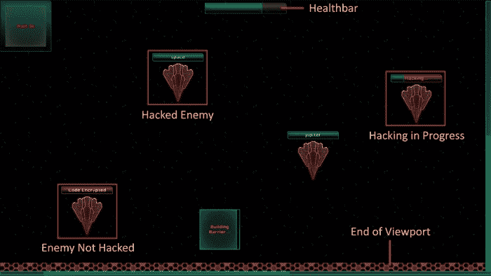
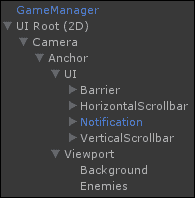
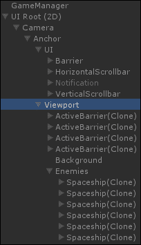
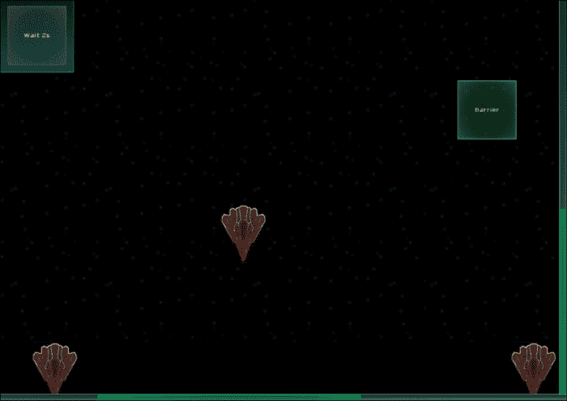
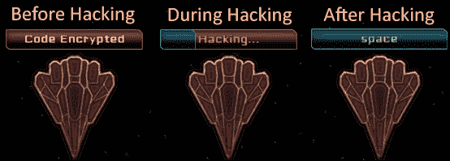
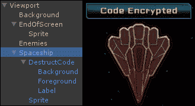
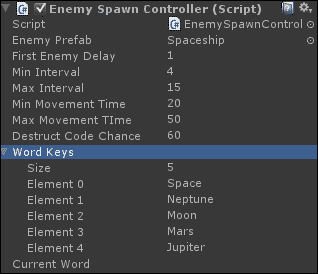

# 第七章：使用 NGUI 创建游戏

在本章的最后，我们将使用 NGUI 元素创建一个游戏，这将确保你理解它们并知道如何完美地使用它们。

一起，我们将学习如何创建以下基本游戏规则：

1.  敌人从可滚动的视图中顶部掉落。

1.  玩家在视图中放置障碍物——如果敌人与已建造的障碍物相撞，那么敌人和障碍物都会被摧毁。

1.  一些敌人有加密的自毁代码。玩家点击敌人以破解它。当破解过程完成后，其自毁代码将显示在其上方。

1.  玩家必须输入代码来摧毁敌人。

我们还将添加一个表示玩家生命值的生命条，当敌人击中屏幕底部时，它会减少。游戏将看起来如下：



# 敌人生成

我们希望我们的敌人从视图中背景的顶部生成。在生成时，每个敌人的 Y 值可以相同，但我们希望有一个随机的 X 值。

首先，让我们打开我们的**Game**场景。

## 创建敌人容器

我们将敌人嵌套在一个放置在我们背景顶部左角的容器中，以便将{0, 0}定位在视口的顶部左角。

首先，让我们通过以下步骤创建我们的敌人持有者：

1.  选择我们的**Viewport**GameObject 并执行以下步骤：

    1.  通过按*Alt* + *Shift* + *N*创建一个新的子对象。

    1.  将这个新的子对象重命名为`Enemies`。

1.  通过导航到**NGUI** | **Attach**将其附加**Anchor**。然后执行以下步骤：

    1.  将我们的**Background**从视图中拖动到**Container**字段。

    1.  将其**Side**参数设置为**TopLeft**。

好的，我们现在有了敌人容器，我们将在这个容器中实例化我们的**Enemy**预制体。

## 创建敌人预制体

让我们创建一个**Enemy**预制体，它将被实例化为**Enemies**GameObject 的子对象。在继续之前，你必须将包含在`Assets.zip`文件中的`Enemy.png`文件添加到**Game**图集中，或者你可以创建自己的 128 x 160 精灵。我们将使用**Rigidbody**来检测敌人和我们的障碍物之间的碰撞。

一旦将`Enemy.png`精灵添加到**Game**图集中，按照以下步骤操作：

1.  选择我们的**Viewport**GameObject 并执行以下步骤：

    1.  通过按*Alt* + *Shift* + *N*创建一个新的子对象。

    1.  将这个新的子对象重命名为`Spaceship`。

1.  选择我们新的**飞船**GameObject。

1.  通过导航到**NGUI** | **Attach a Collider**将其附加一个碰撞器，并执行以下步骤：

    1.  取消其**Is Trigger**布尔值以检测碰撞。

    1.  将**Size**设置为{`128`, `160`, `1`}。

1.  通过导航到**Component** | **Physics**将其附加一个**Rigidbody**组件，然后执行以下步骤：

    1.  取消其**Use Gravity**布尔值。

    1.  选择其**Is Kinematic**布尔值。

    1.  检查其所有**约束**中的**冻结位置**和**冻结旋转**布尔值，以避免任何不希望的行为。

1.  使用我们选定的**飞船**GameObject，通过导航到**NGUI** | **创建** | **精灵**创建一个新的**精灵**：

    1.  将其**精灵**更改为我们新的**敌人**精灵。

    1.  将其**尺寸**更改为`128` x `160`。

    1.  将其**深度**设置为`1`。

1.  将我们的**飞船**GameObject 拖到你的`Prefabs`文件夹中。

1.  从场景中删除我们的**飞船**实例。

好的，我们现在有了我们的**敌人**prefab。让我们向它添加一个新的脚本，该脚本将处理敌人的初始化和移动，并执行以下步骤：

1.  在**项目**视图中选择我们的**飞船**prefab。

1.  向其创建并附加一个新的 `EnemyController.cs` C# 脚本。

1.  打开这个新的 `EnemyController.cs` 脚本。

让我们创建一个新的 `Initialize()` 方法，该方法将设置敌人的位置在游戏外，具有随机的 X 坐标和根据传递给参数的浮点值确定的缓动持续时间：

```cs
public void Initialize(float _movementDuration)
{
  //Get the Viewport's Background size
  Vector2 bgSize = 
    transform.parent.parent.FindChild("Background").GetComponent<UISprite>().localSize;
  //Get this enemy's sprite size
  Vector2 spriteSize = 
    transform.FindChild("Sprite").GetComponent<UISprite>().localSize;
  //Set its position to a random X, and Y of -(enemyHeight/2)
  transform.localPosition = 
 new Vector3(Random.Range(spriteSize.x *0.5f, bgSize.x - (spriteSize.x *0.5f)), -(spriteSize.y *0.5f), 0);
  //Tween its position towards end of background
  TweenPosition.Begin(gameObject, _movementDuration,
    new Vector3(transform.localPosition.x, -bgSize.y + (spriteSize.y * 0.5f), 0));
}
```

我们在前面的代码中使用 `spriteSize.x * 0.5f` 是因为我们的敌人有一个居中的枢轴，我们想要避免在背景宽度外生成它。

`_movementDuration` 参数用于定义敌人穿越整个背景所需的时间；它用作速度。但为了平衡速度，使用了 10 的值，这意味着敌人需要 10 秒钟才能到达背景底部。

在这个阶段，你的层次结构应该如下所示：



## 创建敌人生成控制器

在我们可以启动游戏之前，我们需要添加一个 `EnemySpawnController.cs` 脚本，该脚本将处理敌人生成速率并在需要时实例化敌人。要添加脚本，请执行以下步骤：

1.  从**视口**中选择**敌人**GameObject。

1.  创建并附加一个新的 `EnemySpawnController.cs` C# 脚本。

1.  打开这个新的 `EnemySpawnController.cs` 脚本。

在这个新脚本中，我们需要添加一个 `SpawnEnemy()` 协程，该协程将在随机间隔被调用以实例化**敌人**prefab，并使用正确的位置和缓动持续时间初始化它们。首先，我们需要声明以下代码片段中所示这些变量：

```cs
//We need our Enemy Prefab for Instantiation
public Object enemyPrefab;
//Random-control variables
public int firstEnemyDelay = 1;
//Min and Max intervals between 2 spawns
public float minInterval = 4;
public float maxInterval = 15;
//Min and Max Enemy MovementTime
public float minMovementTime = 20;
public float maxMovementTIme = 50;
```

在前面的代码中声明的变量将被用来控制我们的随机值。你可以在**检查器**视图中更改它们。我们需要分配我们的 `enemyPrefab` 变量。

要这样做，请回到 Unity 并遵循以下步骤：

1.  从**视口**中选择**敌人**GameObject。

1.  将我们的**飞船**prefab 从**项目**视图拖到**敌人生成控制器**中的**敌人预制体**字段内。

好的，必要的变量已经初始化。现在，让我们回到我们的 `EnemySpawnController.cs` 脚本，并使用以下代码片段添加一个新的 `SpawnEnemy()` 协程：

```cs
//Coroutine that spawns enemies
IEnumerator SpawnEnemy()
{
  //First time, set to firstEnemyDelay
  float delay = firstEnemyDelay;
  //Loop while the game is running
  while(true){
    //Wait for the correct delay
    yield return new WaitForSeconds(delay);
    //Create a new enemy, stock its EnemyController
    EnemyController newEnemy =
      NGUITools.AddChild(gameObject, enemyPrefab as GameObject).GetComponent<EnemyController>();
    //Initialize it with random speed
    newEnemy.Initialize(Random.Range (minMovementTime, maxMovementTIme));
    //Set the new random delay
    delay = Random.Range(minInterval, maxInterval);
  }
}
```

我们的协程已经准备好了。让我们在游戏开始运行时启动它。我们可以使用`Start()`方法来做这件事。以下列方式在我们的`SpawnEnemy()`协程下方添加此方法：

```cs
void Start ()
{
  //Start the Spawn Coroutine with first delay
  StartCoroutine(SpawnEnemy());
}
```

保存脚本并点击播放按钮。在`firstEnemyDelay`之后，第一个敌人被生成。在第一个敌人之后，新的敌人将在随机的 X 位置、随机的间隔和随机的速度生成。

当生成几个敌人时，您的**层次结构**视图应如下所示：



生成的敌人会向下移动，并在视口背景的末端停止，如下面的截图所示：



## 前向传递事件到视口

好的，我们现在有了我们的移动敌人，但我们仍然有一个小问题。你可能已经注意到，如果你点击敌人，你将无法拖动视口。我们之前在**活动障碍物**预制体上也遇到了同样的问题。

我们需要通过以下步骤将**UIForwardEvents**组件添加到**Spaceship**预制体上：

1.  在**项目**视图中，选择我们的**Spaceship**预制体。

1.  通过导航到**组件** | **NGUI** | **交互**将其附加一个**Forward Events**组件。然后执行以下步骤：

    1.  检查其**OnPress**布尔值。

    1.  检查其**OnDrag**布尔值。

1.  打开其附带的`EnemyController.cs`脚本。

在`EnemyController.cs`脚本的`Initialize()`方法末尾添加以下行：

```cs
//Set the Viewport as target for UIForwardEvents
GetComponent<UIForwardEvents>().target = transform.parent.parent.gameObject;
```

即使点击敌人，你现在也可以平移视口。是时候处理与障碍物的碰撞了。

# 处理敌人碰撞

我们需要处理我们的敌人与活动障碍物之间的碰撞。由于我们的**敌人**预制体上附加了 Rigidbody，当它撞击**活动障碍物**游戏对象的碰撞器时，它将接收到`OnTriggerEnter()`事件。

一旦实现了与活动障碍物的碰撞，我们将添加与屏幕底部的碰撞，这将减少玩家的生命值。

## 与活动障碍物的碰撞

首先，我们必须默认禁用活动障碍物的碰撞器，并在以下方式中在障碍物建造时启用它：

1.  在**项目**视图中，选择我们的**活动障碍物**预制体。

1.  使用复选框禁用其**Box Collider**组件。

1.  打开附在其上的`ActiveBarrierController.cs`脚本。

1.  我们需要一个名为`built`的新布尔值，这将帮助我们了解障碍物是否完成了其建造过程。除了我们的`UISlider`和`UILocalize`变量外，声明以下内容：

    ```cs
    private bool built = false;
    ```

1.  现在，在`BuildFinished()`方法末尾添加以下两行：

    ```cs
    //Set the build value to true and activate collider
    built = true;
    collider.enabled = true;
    ```

1.  好的，现在碰撞器仅在建造障碍物时启用。我们可以添加一个`HitByEnemy()`方法，将相关的`enemy`作为参数传递，以下列方式销毁障碍物和敌人：

    ```cs
    public void HitByEnemy(EnemyController enemy)
    {
      //If the barrier isn't built, don't go further
      if(!built) return;
      //Else, kill the enemy
      StartCoroutine(enemy.Kill());
      //Kill the barrier too
      StartCoroutine(RemoveBarrier());
    }
    ```

1.  在这里，我们启动了两个协程：一个用于消灭敌人，另一个用于移除障碍。现在让我们添加`RemoveBarrier()`协程，使用以下代码片段：

    ```cs
    IEnumerator RemoveBarrier()
    {
      //Tween for smooth disappearance
      TweenScale.Begin(gameObject, 0.2f, Vector3.zero);
      //Notify the Viewport that a Barrier has been removed
      transform.parent.SendMessage("BarrierRemoved");
      //Wait for end of tween, then destroy the barrier
      yield return new WaitForSeconds(0.2f);
      Destroy(gameObject);
    }
    ```

    上一段代码中的协程在销毁障碍物之前将其缩小。我们向父级（**视口**）发送消息，因为我们需要减少`barrierCount`值。

1.  让我们在`ViewportHolder.cs`脚本中添加`BarrierRemoved()`方法。在**层次结构**视图中，选择我们的**视口**游戏对象，并打开附加到其上的`ViewportHolder.cs`脚本。

1.  在我们的`ViewportHolder.cs`脚本中，添加以下新的`BarrierRemoved()`方法：

    ```cs
    void BarrierRemoved()
    {
      //Decrease the barrierCount value
      barrierCount--;
    }
    ```

1.  一旦障碍物被销毁，`barrierCount`值将立即更新。现在，让我们打开`EnemyController.cs`脚本并添加如以下代码片段所示的`Kill()`协程：

    ```cs
    public IEnumerator Kill()
    {
      //Tween for smooth disappearance
      TweenScale.Begin(gameObject, 0.2f, Vector3.zero);
      //Deactivate the collider now
      collider.enabled = false;
      //Wait end of tween, then destroy the enemy
      yield return new WaitForSeconds(0.2f);
      Destroy(gameObject);
    }
    ```

1.  太好了！我们所有的协程和方法都准备好了。现在，我们需要在发生碰撞时调用相关**ActiveBarrier**的`HitByEnemy()`方法。

1.  我们只需在`EnemyController.cs`脚本中添加以下`OnTriggerEnter()`方法，该方法仅在碰撞对象实际上是障碍物时调用：

    ```cs
    void OnTriggerEnter(Collider other)
    {
      //Store the collided object's ActiveBarrierController
      ActiveBarrierController barrierController = other.GetComponent<ActiveBarrierController>();
      //If it has a BarrierController, call HitByEnemy
      if(barrierController != null)
      barrierController.HitByEnemy(this);
    }
    ```

1.  保存所有脚本并点击播放按钮。

如果您在敌人的轨迹上放置一个障碍物，当它们碰撞时，两者都将被摧毁！如果构建过程尚未完成，则不会发生任何事情。

在障碍物完成其构建过程而敌人仍在其中时，将发生碰撞。太棒了！

现在玩家可以摧毁他的或她的敌人了，让我们为敌人添加一种摧毁玩家的方法。

## 与屏幕底部的碰撞

我们现在可以在视口背景的底部添加一个碰撞器，这将摧毁敌人并减少玩家的生命值。在我们这样做之前，让我们创建一个带有 HealthController 脚本的 Healthbar。

### Healthbar

要创建此 Healthbar，我们需要`Assets.zip`文件中可用的`Button.png`文件。如果您还没有将其作为切片精灵添加到**游戏**图集中，请在继续之前这样做。

我们将使用进度条在 Healthbar 上创建一个，我们将添加一个`HealthController.cs`脚本来处理伤害和生命值的显示。执行以下步骤：

1.  在**层次结构**视图中，选择**UI**游戏对象从**锚点**。

1.  通过导航到**NGUI** | **创建小部件**打开**小部件工具**窗口。然后执行以下步骤：

    1.  选择我们的**游戏**图集。

    1.  选择**进度条**模板。

    1.  选择**空**字段中的我们的**按钮**精灵。

    1.  为**满**字段选择我们的**按钮**精灵。

    1.  使用我们的**UI**游戏对象选中后，点击**添加到**按钮。

1.  选择新的**进度条**游戏对象，并将其重命名为`Healthbar`。

1.  通过导航到**NGUI** | **附加**来为它附加一个**锚点**。然后执行以下步骤：

    1.  将我们的**视口**游戏对象拖到**容器**字段中。

    1.  将**侧边**参数设置为**顶部**。

    1.  将**像素偏移**设置为{`-160`, `-30`}。

1.  从**Healthbar**中选择**背景**游戏对象并执行以下步骤：

    1.  将**颜色色调**设置为{`255`, `120`, `120`, `140`}。

    1.  将**尺寸**设置为`320` x `42`。

    1.  将**精灵类型**更改为**切片**。

    1.  点击**精灵**字段旁边的**编辑**按钮。

    1.  将所有四个边框值设置为`6`作为切片参数。

1.  从**生命条**中选择**前景**游戏对象，然后执行以下步骤：

    1.  将**颜色色调**设置为 `{`25`, `245`, `255`, `255`}`。

    1.  将**尺寸**设置为`320` x `42`。

    1.  将**精灵类型**更改为**切片**。

好的，我们已经在屏幕顶部中心配置了一个健康条。我们需要向其添加一个脚本，该脚本将处理生命值并相应地修改滑块的值。以下是执行此操作的步骤：

1.  在**层次**视图中，选择我们的**生命条**游戏对象。

1.  向其添加一个新的`HealthController.cs`脚本。

1.  打开这个新的`HealthController.cs`脚本。

在这个新脚本中，我们将保存对`HealthController`类实例的静态引用，以便其他脚本可以轻松访问其方法。首先，让我们声明必要的变量并在`Awake()`中初始化它们，如下面的代码所示：

```cs
//Static variable that will store this instance
public static HealthController Instance;
//We will need the attached slider and a HP value
private UISlider slider;
private float hp = 100;

void Awake()
{
  //Store this instance in the Instance variable
  Instance = this;
  //Get the slider Component
  slider = GetComponent<UISlider>();
}
```

好的，我们的变量现在已正确初始化。让我们创建一个`Damage()`方法，该方法将减少`hp`值并按以下方式更新滑块：

```cs
public void Damage(float dmgValue)
{
  //Set new HP value with a clamp between 0 and 100
  hp = Mathf.Clamp(hp - dmgValue, 0, 100);
  //Update the slider to a value between 0 and 1
  slider.value = hp * 0.01f;
  //If hp <= 0, restart level
  if(hp <= 0)
  Application.LoadLevel(Application.loadedLevel);
}
```

太好了！`Damage()`方法已经准备好了。让我们创建一个**EndOfScreen**小部件，它将与敌人发生碰撞。

### EndOfScreen 小部件

让我们创建一个**EndOfScreen**小部件，它将帮助检测敌人碰撞，如下所示：

1.  在**层次**视图中，选择我们的**视口**游戏对象并执行以下步骤：

    1.  通过按 *Alt* + *Shift* + *N* 创建一个新的子对象。

    1.  将这个新子对象重命名为`EndOfScreen`。

1.  通过导航到**NGUI** | **附加一个碰撞器**将其附加一个碰撞器，并将**大小**设置为 `{`3840`, `43`, `1`}`。

1.  通过导航到**NGUI** | **附加**将其附加到**锚点**。

    1.  从**容器**字段中的**视口**拖动**背景**游戏对象。

    1.  将其**侧边**参数设置为**底部**。

    1.  将其**像素偏移**设置为 `{`0`, `33`}`。

1.  在**检查器**视图的顶部点击**未标记/添加标签…**按钮。

1.  创建一个新的`DamageZone`标签。

1.  选择我们的**EndOfScreen**游戏对象。

1.  将**标签**设置为**DamageZone**。

1.  确保我们的**EndOfScreen**游戏对象被选中。

1.  通过导航到**NGUI** | **创建** | **精灵**创建一个新的精灵并执行以下步骤：

    1.  将其**图集**类型设置为**科幻**图集。

    1.  将其**精灵**类型设置为**蜂窝**精灵。

    1.  将其**精灵类型**设置为**平铺**。

    1.  将其**颜色色调**值设置为**R**: `255`, **G**: `120`, **B**: `120`, 和 **A**: `255`。

    1.  将其**深度**值设置为`2`。

    1.  将其**尺寸**参数设置为`3840` x `43`。

好的。我们现在有一个带有精灵和碰撞器的**EndOfScreen**限制。现在，我们需要编辑`EnemyController.cs`脚本中的`OnTriggerEnter()`方法，以检查碰撞的对象是否具有**DamageZone**标签，并在需要时伤害玩家。执行以下步骤以完成此操作：

1.  在**项目**视图中，选择我们的**飞船**预制件并打开附加到其上的`EnemyController.cs`脚本。

1.  在`EnemyController.cs`脚本中，在`OnTriggerEnter()`方法的非常第一行，添加以下行以检查碰撞对象是否有**DamageZone**标签：

    ```cs
    //Is the collided object a DamageZone?
    if(other.CompareTag("DamageZone"))
    {
      //In that case, hurt the player
      HealthController.Instance.Damage(30f);
      //Then, kill the enemy and don't go further
      StartCoroutine(Kill());
      return;
    }
    ```

1.  保存所有脚本并点击播放按钮。现在，当敌人与 Viewport 的末端碰撞时，它们会被摧毁，玩家的生命值会减少！

现在，让我们添加另一种摧毁敌人的方法。

# 创建自毁代码

在屏幕上放置障碍物是不够的。我们将使用自毁代码来摧毁敌人。

每个敌人都有机会获得一个自毁代码。如果它有一个，将显示**Code Encrypted**的空滑动条将出现在相关敌人上方。

当玩家点击敌人时，黑客过程开始。当黑客完成后，会出现一个单词，如以下截图所示，玩家必须在键盘上输入它来摧毁它：



## 黑客滑动条

让我们从在**Spaceship**预制体内部创建黑客滑动指示器开始，按照以下步骤操作：

1.  在**项目**视图中，选择我们的**Spaceship**预制体。

1.  将它拖到**层次结构**视图中作为**Viewport**GameObject 的子对象。

1.  通过导航到**NGUI** | **创建小部件**并执行以下步骤来打开**小部件工具**窗口：

    1.  选择**游戏** Atlas.

    1.  选择**进度条**模板。

    1.  选择**按钮**精灵用于**空**字段。

    1.  选择**按钮**精灵用于**满**字段。

1.  选择我们的**Spaceship**实例，然后点击**添加到**按钮。

1.  选择新的**进度条**GameObject 并执行以下步骤：

    1.  将其重命名为`DestructCode`。

    1.  将其**变换**位置设置为 `{`-100`, `100`, `0`}`。

    1.  将**UISlider**的值设置为`0`。

1.  从**DestructCode**中选择**背景**GameObject。然后执行以下步骤：

    1.  将其**颜色色调**值更改为 `{`255`, `140`, `140`, `255`}`。

    1.  将其**深度**值设置为`2`。

1.  从**DestructCode**中选择**前景**GameObject 然后执行给定的步骤：

    1.  将**颜色色调**改为 `{`50`, `180`, `220`, `255`}`.

    1.  将其**深度**值设置为`3`。

好的，滑动条准备好了。让我们添加一个标签，它将显示**Code Encrypted**，并在黑客过程完成后变为自毁代码。

1.  在**层次结构**视图中，选择我们的**DestructCode**GameObject。

1.  通过导航到**NGUI** | **创建小部件**并执行给定的步骤来打开**小部件工具**窗口：

    1.  选择**SciFi Font – Normal**字体。

    1.  选择**标签**模板。

    1.  将**颜色**改为**R**: `255`, **G**: `215`, **B**: `190`, 和 **A**: `255`.

1.  选择**DestructCode**GameObject，然后点击**添加到**按钮。

1.  从**DestructCode**中选择新的**标签**GameObject 并执行以下步骤：

    1.  将其**变换**位置设置为 `{`100`, `0`, `0`}`。

    1.  将其文本设置为 `Code Encrypted`.

你的**层次结构**视图和**Spaceship**应该看起来如下：



太好了！让我们通过以下步骤将这些新修改应用到我们的**飞船**预制体上：

1.  在**层次**视图中，选择我们的**飞船**GameObject。

1.  点击**检查器**视图顶部的**应用**按钮以更新预制体。

1.  从我们的**层次**视图中删除**飞船**实例。

好的，我们现在有一个滑动条将指示黑客状态，还有一个标签将显示自毁代码。

## 自毁代码

让我们在本地化文件中添加一些自毁代码和黑客状态。打开`English.txt`并添加以下行：

```cs
//Hacking status
CodeEncrypted = Code Encrypted
Hacking = [FF6666]Hacking...
//Self-Destruct Codes
Space = space
Neptune = neptune
Moon = moon
Mars = mars
Jupiter = jupiter
```

现在，打开`French.txt`文件并添加以下行：

```cs
//Hacking status
CodeEncrypted = Code Crypté
Hacking = [FF6666]Piratage...
//Self-Destruct Codes
Space = espace
Neptune = neptune
Moon = lune
Mars = mars
Jupiter = jupiter
```

好的！我们现在有了必要的本地化字符串。

## 将代码分配给敌人

我们现在将在`EnemyController.cs`脚本中添加一个新的`SetDestructCode()`方法，该方法将在初始化时为我们的敌人分配自毁代码。首先，让我们向其中添加必要的全局变量。

打开我们的`EnemyController.cs`脚本，并添加以下全局变量：

```cs
//Boolean to check if enemy is hacked or not
public bool hacked = false;
//We will need the Self-Destruct Code Label
private UILabel codeLabel;
//We will also need the hacking slider
private UISlider hackSlider;
//We will need to store the destructCode
public string destructCode = "";
//We will need a hackSpeed float
float hackSpeed = 0.2f;
```

我们必须设置这些变量。在`Initialize()`方法的末尾添加以下行：

```cs
//Get the hacking slider
hackSlider = transform.FindChild("DestructCode").GetComponent<UISlider>();
//Get the hacking status label
codeLabel = hackSlider.transform.FindChild("Label").GetComponent<UILabel>();
```

好的，现在，让我们添加一个`SetDestructCode()`方法，该方法将为敌人分配自毁代码。此方法将有一个包含要分配的自毁代码键的字符串参数，如下面的代码所示：

```cs
public void SetDestructCode(string randomWordKey)
{
  //If the randomWordKey is not empty...
  if(!string.IsNullOrEmpty(randomWordKey))
  {
    //... Get the corresponding localized code
    destructCode = Localization.instance.Get(randomWordKey);
    //Set the Label to "Code Encrypted" 
    codeLabel.text = Localization.instance.Get("CodeEncrypted");
  }
  //If the randomWordKey is empty, disable hacking slider
  else
  hackSlider.gameObject.SetActive(false);
}
```

好的，我们有一个设置正确破坏代码的方法。现在，让我们创建一个将被调用来启动黑客过程的`Hack()`协程。

## 黑客过程

`Hack()`协程将逐渐填充黑客滑动条，并在黑客完成时显示敌人的自毁代码。

使用以下代码片段将`Hack()`协程添加到`EnemyController.cs`脚本中：

```cs
IEnumerator Hack()
{
  //Set the Label to "Hacking..."
  codeLabel.text = Localization.instance.Get("Hacking");
  //While hacking slider is not full
  while(hackSlider.value < 1)
  {
    //Increase slider value, framerate independant
    hackSlider.value += Time.deltaTime * hackSpeed;
    //Wait for next frame
    yield return null;
  }
  //Make sure slider is at 1
  hackSlider.value = 1;
  //Set the hacked bool to true for this enemy
  hacked = true;
  //Display the Self-Destruct code now
  codeLabel.text = "[99FF99]" + destructCode;
}
```

现在，让我们添加一个`OnClick()`方法，当玩家点击敌人时，实际上将启动黑客过程。我们这样做的方式如下：

```cs
void OnClick()
{
  //If the enemy has a destruct code, launch hacking
  if(!string.IsNullOrEmpty(destructCode))
    StartCoroutine(Hack());
}
```

好的，我们已经为我们的敌人设置了方法。现在，我们可以编辑我们的`EnemySpawnController.cs`脚本，在初始化新敌人时调用`SetDestructCode()`方法，并将随机破坏代码作为参数传递。首先，我们将添加必要的变量。

我们需要一个`List`数组来存储场景中的敌人。`List`类似于数组，但使用有用的方法（如`Add()`和`Remove()`）更容易管理。为了使用`List`，你需要包含一个特定的库。

打开`EnemySpawnController.cs`脚本，并在文件开头简单地添加以下行，以及已经存在的两个其他包含行：

```cs
//Include Lists
using System.Collections.Generic;
```

现在，在`EnemySpawnController`类中添加这些新的全局变量：

```cs
//Chance for each enemy to have a destructCode
public float destructCodeChance = 60;
//Array of strings to store destructCodes keys
public string[] wordKeys;
//We will need a list of enemies
private List<EnemyController> enemies;
//We will need a static instance of this script
public static EnemySpawnController instance;
//This will store the current word typed by the player
public string currentWord;
```

好的，现在在新的`Awake()`方法中初始化一些这些变量：

```cs
void Awake()
{
  //Store the instance of this script
  instance = this;
  //Initialize the List
  enemies = new List<EnemyController>();
}
```

在我们继续之前，让我们在**检查器**视图中分配剩余的变量。保存脚本，回到 Unity，并从**视口**中选择我们的**敌人**GameObject。

现在，按照以下方式设置**单词键**数组和生成值：



很好，我们的**单词键**数组现在已经设置好了。让我们回到`EnemySpawnController.cs`脚本，并在其`while()`循环的末尾添加以下行：

```cs
//Create a new empty string for destruct code
string randomCode = "";
//If the random is valid, get a random word
if(Random.Range(0f,100f) < destructCodeChance)
randomCode = GetRandomWord();
//Set the enemy's the DestructCode newEnemy.SetDestructCode(randomCode);
//Add the enemy to the list of enemies
enemies.Add(newEnemy);
```

当敌人初始化时，前面的代码将其添加到敌人的`List`中并设置其自毁代码。现在，使用以下代码，让我们创建一个`GetRandomWord()`方法，它将返回我们预定义的单词之一：

```cs
private string GetRandomWord()
{
  //Return a random Word Key
  return wordKeys[Random.Range(0, wordKeys.Length)];
}
```

很好。我们的一些敌人已经分配了破坏代码。让我们添加一个方法来从`List`中移除敌人，该方法将在每次摧毁敌人时被调用。方法添加如下：

```cs
public void EnemyDestroyed(EnemyController destroyedEnemy)
{
  //Remove the destroyed enemy from the List
  enemies.Remove(destroyedEnemy);
}
```

打开`EnemyController.cs`脚本。在`Kill()`协程中，在`Destroy(gameObject)`行之前，添加以下行以从`List`中移除敌人：

```cs
//Remove enemy from the List
EnemySpawnController.instance.EnemyDestroyed(this);
```

完美。保存所有脚本并点击播放按钮。如果你点击具有黑客滑块的敌人，黑客过程开始，并在完成后显示破坏代码。

最后一步是处理玩家的输入，以检查他或她是否输入了敌人的自毁单词。

## 处理玩家输入

我们将使用`EnemySpawnController.cs`脚本的`Update()`方法来检查玩家使用键盘输入的字符。这些字符将逐个存储并与我们敌人的破坏代码进行比较。

打开我们的`EnemySpawnController.cs`脚本并创建一个新的`Update()`方法：

```cs
void Update()
{
  //If the player has typed a character
  if(!string.IsNullOrEmpty(Input.inputString)) 
  {
    //Add this new character to the currentWord
    currentWord += Input.inputString;
    //We need to know if the code matches at least 1 enemy
    bool codeMatches = false;
    //Check enemies' destruct codes one by one
    for each(EnemyController enemy in enemies)
    {
      //If the enemy has a destruct code AND is hacked
      if(enemy.destructCode != "" && enemy.hacked)
      {
        //currentWord contain the destruct code?
        if(currentWord.Contains(enemy.destructCode))
        {
          //Yes - Destroy it and update our bool
          StartCoroutine(enemy.Kill());
          codeMatches = true;
        }
      }
    }
    //Did the word match at least 1 enemy?
    if(codeMatches)
    //In that case, reset the currentWord to empty
    currentWord = "";
  }
}
```

保存此脚本。现在，当你黑客一个敌人时，你可以通过输入其自毁代码来摧毁它！如果多个敌人具有相同的代码，它们将同时被摧毁。

### 注意

输入一个单词可能会滚动视口；这是因为 Q、A、S 和 D 被默认设置为水平轴和垂直轴。转到**编辑** | **项目设置** | **输入**，并分别从水平轴和垂直轴的 Alt Positive Button 和 Alt Negative Button 字段中删除(a, d)和(s, w)。

# 摘要

在本章中，我们使用了前面章节中关于创建简单游戏所学的所有内容。

我们创建了一个敌人生成系统，在场景中实例化敌人。刚体和碰撞体已添加以处理屏幕底部障碍物中敌人的碰撞。

我们还添加了一个与生命值相关的健康条小部件；如果四个敌人触摸屏幕的末端，游戏将重新开始。

使用了`Update()`方法来处理玩家输入，并将输入的单词与破坏代码进行比较，以便在需要时摧毁敌人。

目前，游戏相当简单。以下是一些增强游戏的想法：

+   添加更多自毁单词

+   在屏幕上显示玩家输入的内容（视觉反馈）

+   随着玩家摧毁敌人，逐渐增加敌人的出生率

+   随着玩家摧毁敌人，逐渐增加敌人的速度

+   添加评分系统

+   实现时间力量（提示：Time.timeScale）

+   实现炸弹力量

+   使破解时间取决于 barrierCount（更多障碍，破解速度更快）

+   包含使用右键点击移除 ActiveBarrier 的可能性

+   添加可点击的对象以恢复生命值；一些敌人会留下这些对象

+   如果玩家在 3 秒内摧毁多个敌人，则添加连击奖励

+   在困难难度中包含更难懂的单词

+   在屏幕外显示敌人的方向时插入一个视觉指示器（箭头）

+   在背景中添加更多视觉元素（如星系等）以帮助定位

+   显示带有主菜单和重启按钮的游戏结束屏幕

+   创建教程弹出窗口

如果你添加了之前的一些功能，我们的游戏将变得更加有趣。

为了提高你对 NGUI 的了解，你可以在[`www.tasharen.com/forum/index.php?topic=6754`](http://www.tasharen.com/forum/index.php?topic=6754)找到更多教程。

完整的 NGUI 脚本文档可在[`www.tasharen.com/ngui/docs/index.html`](http://www.tasharen.com/ngui/docs/index.html)找到。

就这些！我们现在已经使用这本书完成了与 Unity 和 NGUI 的工作。感谢您的关注，并祝您未来的项目一切顺利。
