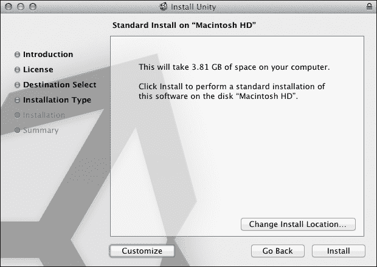
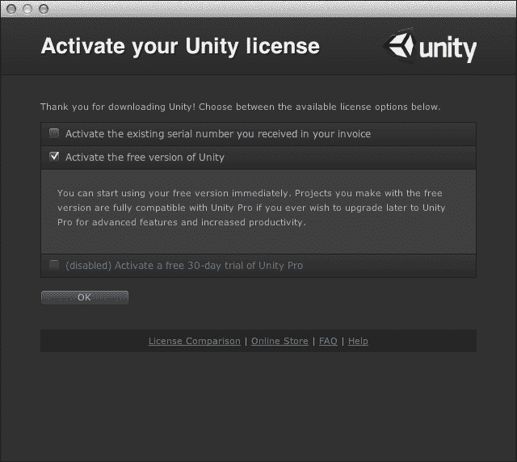
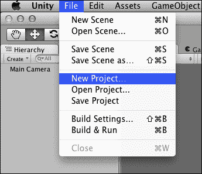
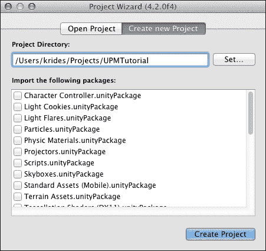
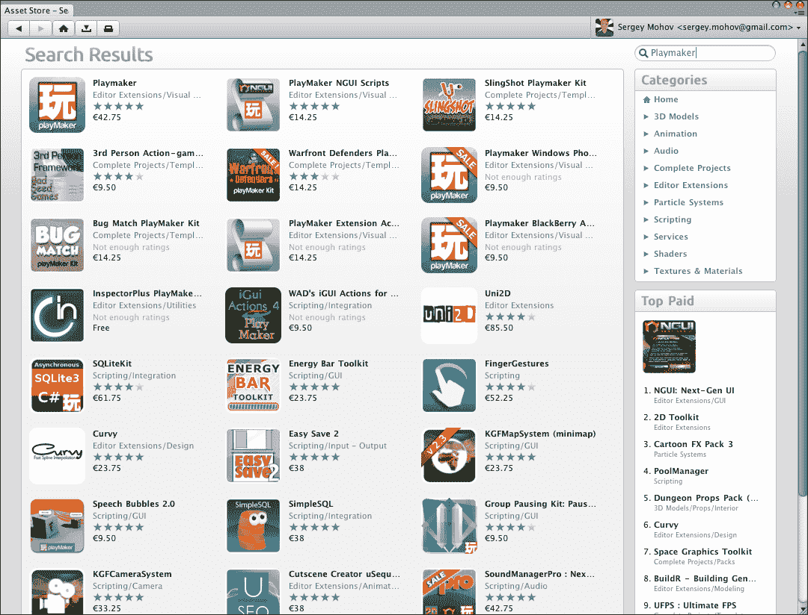
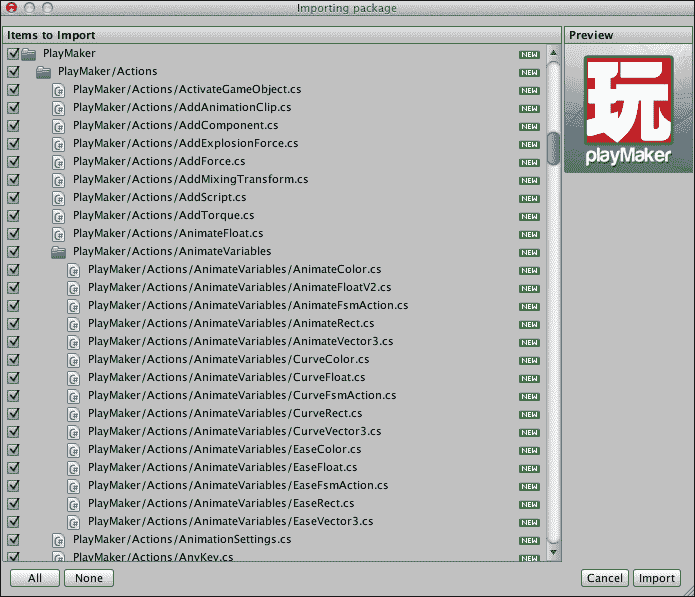
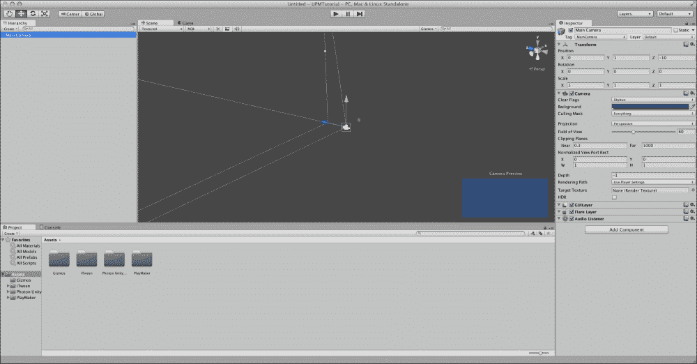
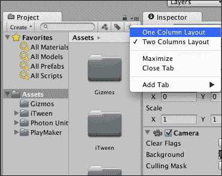
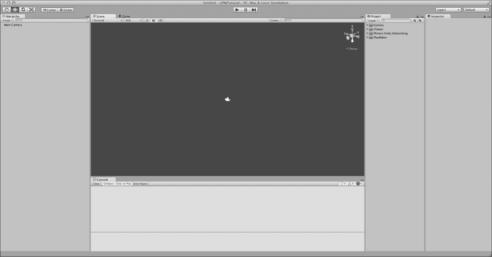
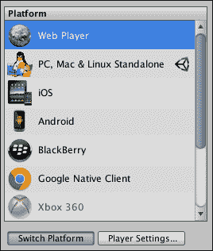

# 第一章. 使用 Unity 和 Playmaker 入门

在本章中，我们将介绍将项目准备就绪以便与本书一起使用的过程。我们将涵盖以下主题：

+   下载、安装和设置 Unity

+   使用 Asset Store 购买和安装 Playmaker

+   创建新项目并更改项目设置

如果您熟悉下载和安装 Unity 及其插件的过程，您可以跳转到本章的*设置您的项目*部分。它显示了 Unity 和本书中将要使用的项目设置布局。

# 下载和安装 Unity

Unity 适用于 Mac OS X 和 Windows PC，这两个平台的安装过程非常相似。本书将使用 Unity 的 Mac 版本，但当我提供 Windows 版本的不同方向和快捷键时，我会提供给您。幸运的是，实际上它们非常相似，如果您选择这样做，您应该不会在两个平台之间遇到任何问题。

首先，让我们前往[`unity3d.com/unity/download/`](http://unity3d.com/unity/download/)下载本书写作时可用的最新版本的 Unity（本书写作时的版本是 4.3）。只需单击蓝色**下载**按钮，文件就应该开始下载到您的硬盘上。相关的文件将是为 Mac 用户准备的 DMG 文件或为 Windows 用户准备的安装程序 EXE 文件。将其保存在您硬盘上的任何位置。

如果您使用的是 Mac，双击 DMG 文件将显示 PKG 文件，这是安装程序。双击`Unity.pkg`将产生与在 Windows 中双击`Unity.exe`基本相同的结果——它将提示安装向导。除了您想要安装引擎的位置之外，您没有其他 Unity 特定的选项。

### 小贴士

您可以在同一台计算机上安装多个 Unity 版本。为此，您只需更改 Unity 将要安装的文件夹的名称，并将新的安装放入不同的文件夹中。如果您想同时安装不同的版本，无论是由于许可证限制还是因为您想要访问某些特定版本的特性，您可能需要这样做。请记住，如果您将项目更新到 Unity 的新版本，您不能回退到旧版本。

以下截图显示了 Unity 的安装窗口。在这个向导阶段，您可以指定 Unity 将要安装的目录或更改一些安装参数。在大多数情况下，您可能希望使用默认参数安装 Unity。如果是这种情况，只需单击**安装**并跳过下一步。

如果你想更改安装位置，点击**更改安装位置...**。**自定义**按钮允许你包含或排除特定的包，例如主 Unity 安装、示例项目和 Unity Web Player。对于这次安装，请保留所有复选框选中。我们将在本书的后面讨论包。

点击**安装**将在你的硬盘上安装 Unity。安装完成后，你可以转到安装它的文件夹（默认情况下，Mac 上的`Applications/Unity`或 Windows 上的`C:\\Program Files\Unity`）并启动它。

如果你第一次启动 Unity，会弹出一个窗口，要求你选择你的许可证类型并输入你的 Unity 账户登录名和密码。如果你还没有账户，请创建一个并输入详细信息。稍后，你将需要它来访问论坛和 Unity 问答——当你寻找 Unity 相关问题的解决方案时，这两者都非常有帮助。在这本书中，我们将使用 Unity 的免费版本，因为这里的所有示例都不需要任何专业许可证功能。所以选择**激活 Unity 的免费版本**并点击**确定**。

第一次打开 Unity 时，可能会加载一个默认项目。安装时包含的这些测试项目（以及通过 Unity 网站提供的项目）在你想要了解如何做某些特定事情（例如，迷你地图或水物理）但不知道从何开始时将非常有帮助。

然而，现在我们想要一个新空项目。一旦 Unity 加载，转到屏幕左上角主菜单中的**文件**菜单并选择**新建项目…**。

这将打开**项目向导**窗口，你可以选择你的未来项目要存放的位置以及如何命名。在 Unity 中，项目是一个文件夹，所以你给项目文件夹起的名字将自动分配给项目。对于本书中的示例，你现在不需要任何包，所以保留所有复选框为空，除非你已经下载了 Playmaker，在这种情况下请选中 Playmaker。准备好后，点击**创建项目**。

### 小贴士

如果你总是想从**项目向导**开始（如果你计划拥有多个项目，这强烈推荐），转到**Unity** | **首选项**并勾选**始终显示项目向导**，然后关闭**首选项**窗口。对于 Windows 用户，它是**文件** | **首选项**。

由于我们没有加载任何重型资产包，项目将快速加载，你应该再次看到主 Unity 界面，但这次一切都将为空。

# 购买并导入 Playmaker

在我们更改项目布局之前，有一个必须导入的组件缺失，那就是 Hutong Games 的 Playmaker([`www.hutonggames.com/`](http://www.hutonggames.com/))——我们将在这本书的大部分练习中使用的（除了 Unity 本身之外的）主要工具。要获取 Playmaker，我们将使用资产商店。后者是一个对任何 Unity 开发者都很有价值的在线市场，它允许我们通过导入其他用户制作的有用插件和资产包到我们的项目中来节省大量时间。通过资产商店提供的资产中，一些是免费的，但大多数，如 Playmaker，是由用户制作的并需要付费。您也可以通过资产商店提供您的工具和资产。把它看作是针对开发者的 iTunes Store 或 Amazon 的类似物。

虽然您可以通过网页([`unity3d.com/asset-store/`](http://unity3d.com/asset-store/))访问和搜索资产商店，但它以最实用的形式直接集成到引擎中。要从 Unity 直接访问资产商店，请转到主菜单中的**窗口**子菜单，并从列表中选择**资产商店**。这将打开 Unity 中的**资产商店**窗口（您需要连接到互联网才能查看商店内容）。

在**资产商店**窗口的右上角，有一个搜索框。在框中输入`Playmaker`并按键盘上的*return* (*Enter*)键。当搜索结果显示时，点击**搜索结果**左上角的第一项，简单地称为**Playmaker**，如图所示：

**资产商店**窗口现在将显示 Playmaker 的描述、用户评论、一些截图、其价格以及**购买**按钮。点击此按钮，输入您的信用卡或 PayPal 详细信息，并像在其他任何在线商店或服务中一样完成购买。之后 Unity 将提供导入包。点击**导入**按钮，当 Playmaker 下载完成后，在导入窗口中，保留所有复选框选中，再次点击**导入**。这将把 Playmaker 文件添加到您的新 Unity 项目中。

### 小贴士

安装 Playmaker（或任何其他插件）的另一种方法是**资产** | **导入包** | **自定义包...**，前提是您已经在硬盘上有了包含`unitypackage`文件的文件。

Playmaker 还会自动导入它所依赖的一些其他流行的 Unity 插件：用于移动和动画的 iTween 以及用于网络和多人游戏的 Photon。我们将在第六章 *网络和多人游戏*中稍后讨论 Photon。

# 设置您的项目

关于 Unity，您必须知道的一个重要事情是：您可以通过多种方式自定义它，甚至可以通过您自己的自定义窗口和面板来扩展其界面。我们目前不会讨论这个问题，因为用户界面将在第二章*Unity 和 Playmaker 的用户界面*中更详细地讨论，但您应该知道，当您安装新的扩展，如 Playmaker 时，如果用户界面发生变化，这没有什么可惊讶的。您还可以拖动不同的标签，看看哪种布局最适合您的屏幕尺寸/配置和项目。现在我们将设置界面，以便简化下一章几章的解释。一旦您熟悉了界面，您就可以随意自定义它。

如果您没有拖动任何东西，您应该看到默认的 Unity 布局。如果您已经拖动过，请转到主菜单中的**窗口** | **布局**，然后点击**默认**以重置到默认窗口布局。您将看到一个位于左侧的**层次结构**标签，中间的**场景**和**游戏**，右侧的**检查器**，以及底部的**项目**和**控制台**。我们将在第二章*Unity 和 Playmaker 的用户界面*中更多地讨论这些标签及其功能。目前，为了节省屏幕空间，我们将拖动一些标签并改变它们的显示方式。

以下截图显示了 Unity 中的默认界面布局。

让我们从屏幕底部的**项目**标签开始。如果它没有被突出显示，请点击**项目**这个词。目前，**项目**和**控制台**标签都固定在屏幕底部，因此您可以在它们之间切换以选择一个或另一个。不幸的是，这种布局并不理想，因为在大多数情况下，您将需要同时直接访问**项目**和**控制台**标签。将**项目**标签拖动到**场景**和**游戏**标签的右侧，直到它紧挨着**检查器**标签对齐。它将变得又高又窄。

不幸的是，现在项目面板中由于那些大图标，空间非常有限。幸运的是，Unity 允许我们通过点击**项目**面板右上角的小选项图标 () 并从列表中选择**一列布局**来轻松解决这个问题。

现在您的**项目**面板将需要更少的空间，您将能够看到您项目的所有文件结构，而不会因为图标和子面板挡道而感到沮丧。

### 小贴士

这里需要注意的是，一些开发者确实更喜欢**两列布局**，因为它有**收藏夹**部分和类似文件管理器的子文件夹表示；然而，你很可能希望尽可能多地获得空闲工作空间，尤其是在使用像 Playmaker 这样的插件时，这些插件会添加你需要持续访问的额外标签。只有在你有一个相对较大的屏幕时，你才应该考虑**两列布局**。

现在项目面板已经设置并放置好了，让我们通过将**控制台**面板移动到**场景**和**游戏**面板下，为**层次结构**面板腾出更多空间。为此，就像移动**项目**标签一样，点击并拖动**控制台**标签，并将其移动到**场景**和**游戏**面板的底部，直到它直接位于它们下方。

以下截图显示了如果你正确地遵循了本章中的所有说明，你的编辑器窗口应该看起来是什么样子。

最后，你的工作空间已经全部设置好了！现在是我们更改项目设置的时候了。在开始工作之前这样做是个好主意，以便将其处理完毕，让我们开始吧。我们不会深入探讨为什么某些项目设置以某种方式设置，其中大多数都是相当自解释的。

首先，从主菜单中选择**编辑** | **项目设置** | **玩家**。应该在右侧的**检查器**面板中显示一个新菜单。你可以在菜单顶部附近的公司名称字段中输入你的名字或公司的名字，默认情况下，**产品名称**（在其下方）应该与你在创建项目时指定的项目文件夹名称相同。更改项目名称不会重命名你的项目文件夹。实际上，你在玩家设置中更改的每一项都只会影响输出的游戏或应用程序。我们将为本书的示例构建 Unity WebPlayer 项目，所以点击带有小地球图标的面板（）。

目前我们只关注这里的两件事：屏幕分辨率和 WebPlayer 模板。确保**默认屏幕宽度**和**高度**分别设置为`960`和`600`，并且活动模板是**无上下文菜单**。这里还有更多选项，但我们现在将保留它们的默认值。

接下来，我们将更改构建设置以匹配我们的目标平台。转到**文件** | **构建设置…**，从可用平台列表中选择**WebPlayer**（它应该是列表中最上面的项目）。然后点击**切换平台**按钮（如以下截图所示）。这将允许您直接使用输出分辨率测试游戏。一旦 Unity 完成文件重新导入，您就可以关闭**构建设置**窗口。

# 摘要

在本章中，你学习了如何下载和安装 Unity，从 Asset Store 购买和安装插件，为你的项目做好准备，优化你的工作空间，以及选择输出平台。在下一章中，我们将更详细地探讨 Unity 的界面。特别是，我们将检查你在本章中遇到的各种面板和视图（例如，**检查器**，**层次结构**，**游戏**，**场景**），并开始使用它们。
