# 第四章。创建你的第一个游戏

在 第三章，*组件和状态机* 中，你为空气曲棍球游戏制作了第一个游戏机制，我们将在此书的剩余部分继续改进它。你制作了一个冰球和一个由鼠标指针控制的球槌，球槌可以推动冰球。推动机制相当复杂，需要一些深入的分析，这是我们本章要讨论的第一件事。本章将涵盖以下主题：

+   使用矢量几何和物理

+   胜/负条件

+   创建人工智能

+   Playmaker 调试

最后，我将给你一些练习，你将能够使用你在本章结束时获得的技术和知识来完成它们，以及一些如果你有任何问题如何寻找答案的建议。

# 使用矢量几何和物理

如果你像我一样，你可能会觉得这个部分的标题令人畏惧。然而，在你决定跳过它或开始寻找关于 Unity 的新书之前，我向你保证，它不会让你接触到任何数学公式。相反，它将使用 Playmaker 动作，并解释每个动作的作用，这将反过来引导我们得出关于其背后的科学结论。

几乎没有哪种 3D 视频游戏不需要某种矢量几何和物理，而且自然地，这两者都是解释你的新空气曲棍球游戏中球槌-冰球交互工作原理的关键。

首先，让我们在 **playMaker** 面板的 FSM 视图中点击 **Push Puck** 状态，然后在右侧打开 **Variables** 选项卡。列表中有三个 **Vector3** 类型的变量和一个 **Float** 类型的变量。以下变量对我们来说很重要，因为它们用于计算推力和方向：

+   **hitPos** 是一个 **Vector3** 变量，我们用它存储球槌和冰球碰撞点的 **X**、**Y** 和 **Z** 坐标

+   **pushDir** 是一个 **Vector3** 变量，我们用它存储当冰球与球槌碰撞时将要被推的 **X**、**Y** 和 **Z** 方向

+   **pushMag** 是一个当前等于 20 的 **Float** 变量，对应于推力的幅度

要理解视频游戏中的事物是如何工作的，你必须熟悉使用 **Vector3** 变量，因为你将要做的很多事情都将发生在 3D 空间中。每个 **Transform** 组件有三个 **Vector3** 属性：**Position**、**Rotation** 和 **Scale**，每个属性都有其自己的 **X**、**Y** 和 **Z** 值。

3D 空间中的每个点都有可以写成三个 **Float** 变量形式的坐标：X 轴上的位置、Y 轴上的位置和 Z 轴上的位置。一个 **Vector3** 变量可以同时存储这三个位置值。

你可以对 **Vector3** 执行各种操作，你可以将它添加到另一个向量中，你可以将它乘以一个浮点数（或一个整数），你可以将它的 **X**、**Y** 和 **Z** 存储在单独的 **Float** 变量中，或者将单独的浮点值写入其 **X**、**Y** 和 **Z**。这些操作中的大多数都在 **Actions** 面板的 **Vector3** 类别下。

我们使用的第一个动作被称为 **Get Controller Hit Info**，它获取游戏对象发生的最后碰撞的位置。如果你查看触发 **Push** 事件的 **Move** 状态中的 **Collision Event** 动作，你会看到这只有在槌子与冰球碰撞时才会发生，所以我们不需要担心在 **Push Puck** 状态中过滤掉假碰撞。我们唯一需要做的就是将接触点保存到一个变量中，这正是所发生的事情。

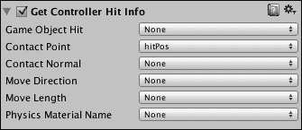

接下来，我们简单地获取槌子的当前位置并将其存储在 **pushDir** 变量中，暂时使用 **GetPosition** 动作。这个变量被称为 **pushDir**，因为它将包含槌子将被推的方向。我们通过访问槌子的 **Transform** 组件的 **Position** 属性来获取这个位置。

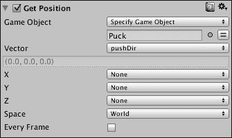

如果这些都是位置，那么如何得到一个方向？方向是什么，你如何在 **Vector3** 中写下来？答案是相当简单的。方向是空间中一点相对于另一点的相对位置，这另一种说法就是它是 **位置 A** 和 **位置 B** 之间的差异。以下图显示了两个点及其相对方向。

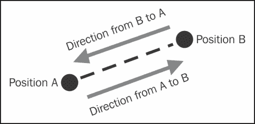

因此，为了找到点 B 相对于点 A 的方向，你必须从点 A 的位置中减去点 B 的位置。然后你需要对结果进行归一化，这意味着将其写成一个具有其 **X**、**Y** 和 **Z** 属性为介于 `0` 和 `1` 之间（即没有大小）的 **Vector3** 变量。 

例如，如果减法运算的原始结果是 (`-1`, `27`, `350`)，则方向归一化向量为 (`-0.00284867`, `0.076914`, `0.997034`)，而且最好的部分是，你不需要知道它是如何发生的，因为有一个 Playmaker 动作会自动为你完成。以下截图显示了用于从槌子中心到击中点的两个动作：

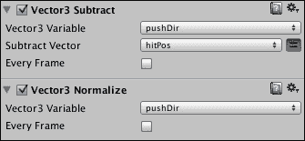

让我们回顾一下我们到目前为止所涵盖的内容：

+   我们需要槌子的位置，因为这是我们打算从那里推动冰球的。

+   我们需要球拍和球之间的撞击点，以便在球拍击打球时找到球相对于球拍在空间中的位置

+   这两个值都保存为**Vector3**变量，每个变量都包含一个**X**、**Y**和**Z**位置

+   我们可以通过从球拍的位置减去撞击位置并归一化结果向量来找出球相对于球拍的方向，即将其**X**、**Y**和**Z**属性以`0`到`1`之间的数字写下

现在我们知道了如何找到球相对于球拍的方向，我们希望将球推向这个方向，所以这正是我们要做的。然而，我们不能直接将方向向量作为球的速率，因为方向向量没有大小，这意味着球的速率将远远小于我们想要的。

为了控制推动球的力量，我们必须将方向乘以一个大小，这个大小存储在**pushMag**变量中。该变量决定了球一旦遇到球拍就会以多快的速度向相反方向移动。

### 小贴士

如果你将**pushMag**赋值为负值，每次球与球拍碰撞时，球都会被推向球拍，这反过来意味着它会粘附在球拍上。这也可以是一种有用的游戏机制，尽管在这个案例中不是。

以下截图显示了**Vector3 Multiply**动作，该动作将**pushDir**方向向量乘以**pushMag**大小，以及**Add Force**动作，该动作在撞击点对球施加力。

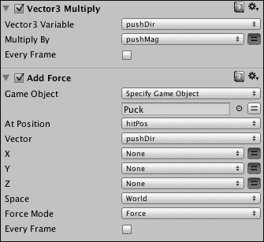

# 赢/输条件

虽然有些游戏不需要赢/输条件，但冰球台游戏绝对不是其中之一。在经典冰球台中，桌子两侧各有两个目标槽位。如果球进入玩家 1 的目标，那么玩家 2 得一分，反之亦然。游戏在一方玩家得到 7 分时结束。

有短期赢的条件（得一分）和长期赢的条件（在对手之前得七分）。我们只会实现短期赢的条件，尽管我们强烈鼓励你在完成这一章后尝试实现长期条件。

在我们开始实现赢/输条件之前，让我们确保球不能卡在角落里，因为这种行为将阻止赢/输条件被触发。制作四个新的墙壁，将它们在 Y 轴上旋转 45 度，并将它们放置在角落，以消除下一个图中显示的直角。这应该会解决问题。

现在已经处理好了这个问题，让我们制作目标槽位。将球的大小**Scale**属性更改为(`1`, `0.7`, `1`)，并将其放置在(`-3`, `0.3`, `0`)。

1.  在左侧再建一堵墙，在右侧再建一堵墙。墙的放置应如图所示：

1.  制作两个新的立方体（**GoalLeft**和**GoalRight**），并将它们放置在下一图所示的左侧和右侧的间隙中。将左侧的立方体设置为绿色（`0`，`255`，`0`），将右侧的立方体设置为红色（`255`，`0`，`0`），为它们创建新的材质。它们都应该在 Y 轴上的`2.5`处。这些是为了阻挡球槌，而不是球。

1.  再制作两个立方体。将它们命名为`GoalTriggerLeft`和`GoalTriggerRight`。将它们放置在游戏场地的两侧，正好在桌子后面。这些对象将作为触发器来检测哪个球得分。检查这些游戏对象的**Box Collider**组件的**是触发器**属性。这个碰撞组件的属性确保对象不会进行任何物理碰撞（与球或墙壁相反），而是作为触发器，检测刚体何时进入、停留在其中以及何时退出。这些对象是实际触发胜负条件的球门。

1.  在这一点上，你的**场景**视图应该看起来像以下截图：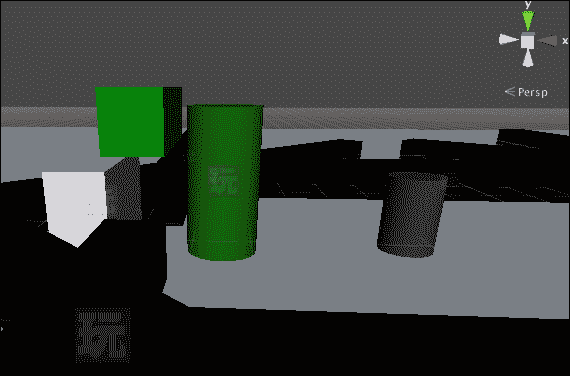

1.  选择**GoalTriggerLeft**游戏对象，并向其添加一个 FSM。创建两个状态，将**State1**重命名为`得分`，将**State2**重命名为`加载级别`。

1.  右键单击**得分**状态，从上下文菜单中选择**添加过渡** | **系统事件** | **触发进入**。

1.  从**触发进入**到**加载级别**创建一个过渡。当某个物体进入触发器时（由于场景中物体的放置方式，这应该是球），将调用此事件，并执行过渡。

1.  选择**加载级别**状态，并向其添加一个**加载级别**动作。它应该位于**级别**类别下。

1.  在**加载级别**动作的**级别名称**属性中，输入你的游戏场景名称。如果你没有做任何更改，它应该被称为`Scene1`。为了确保这一点，查看**Unity 编辑器**窗口的顶部。它总是显示为 `[SceneName].unity - [ProjectName] - [Platform]`，其中括号中的内容对我来说是**Scene1**、**UPMTutorial**和**Web Player**，但可能因人而异。

1.  对于**GoalTriggerRight**也做同样的事情。目前，保持 FSM 完全相同。

现在，我们可以通过导入 3D 模型来为我们的场景添加一些完成效果：

1.  确保你已经从 Packt Publishing 网站下载了项目存档。如果你还没有，现在就做，并解压存档。

1.  在**项目**面板下文件列表的空白区域右键单击，并从上下文菜单中选择**导入新资产...**。应该会弹出一个文件浏览器。

1.  在`UnityPlaymakerTutorial`目录中定位`WallVisual.fbx`文件，并点击**导入**。文件浏览器将关闭，并在**项目**面板中显示`WallVisual`文件。创建一个`Models`文件夹，并将其拖入其中。

1.  选择`WallVisual`文件，并查看**检查器**。在这个**检查器**中有三个选项卡：**模型**、**绑定**和**动画**。这些选项卡都负责更改模型的导入设置。

1.  由于我们导入的模型不是动画模型，因此只有**模型**选项卡对我们感兴趣。将**缩放因子**设置为`1.05`，并取消选中**导入材质**。将其他属性保留在默认值。**缩放因子**在导入时改变模型的缩放，这意味着**变换缩放**属性将等于(`1`, `1`, `1`)，而实际在 3D 空间中的大小可能会改变。这是必要的，因为 3D 建模软件（如 Maya 或 3DS Max）中的工作比例可能与 Unity 中的不同。为了使模型看起来更大，增加缩放因子。请参阅以下截图以确认您的导入设置是否正确：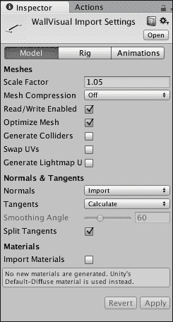

1.  将**WallVisual**拖入**层次结构**两次。将第一个实例放置在(`0`, `0.5`, `-3.5`)，第二个实例放置在(`0`, `0.5`, `3.5`)。将第一个实例的**旋转**设置为(`0`, `0`, `0`)，第二个实例的设置为(`0`, `180`, `0`)。

    ### 小贴士

    预制件和导入模型的区别在于，您不能将您对实例所做的更改应用到其中一个实例上。您也不能从模型中添加或删除任何组件。您可以从模型的实例中创建一个预制件，以便能够这样做。

1.  将两个**WallVisual**游戏对象的材质设置为之前创建的用于墙壁的**WallMaterial**。选择所有**Wall**对象，并禁用它们的**网格渲染器**组件。以下图示显示了如果您一切操作正确，您应该在**游戏**视图中看到的内容：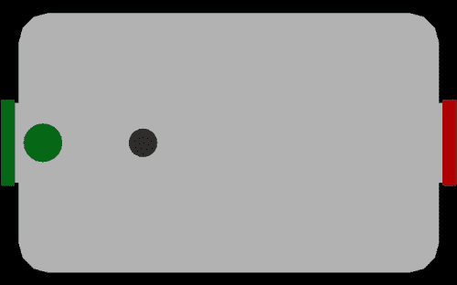

现在，当您按下播放时，您应该能够在两个球门得分。这样做将重新加载当前加载的水平。我们还确保了冰球不会卡在桌角的角落里，并导入了一个覆盖我们立方墙的模型，使游戏看起来更像真正的空气曲棍球桌。这意味着游戏最终可以玩，尽管坦白说，目前还不够有趣。

# 创建人工智能

在游戏中加入**人工智能**（**AI**），即使是一个非常简单的 AI，也肯定会使其更具挑战性和趣味性，所以让我们立即着手进行。

这就是我们的 AI 将如何工作：它将不断尝试移动到冰球右侧的点，并在碰撞时将其推向左侧。我们将保持与玩家球拍相同的碰撞逻辑，以保持游戏的公平性。为了确保 AI 在直接向左推时不会卡在墙上，我们将根据球拍当前的位置调整方向。这样，AI 看起来就像是在瞄准玩家的目标槽位。

按照以下步骤实现 AI：

1.  通过在**层次结构**中选择**Mallet**游戏对象并按*command* + *D*（在 Windows 上为*Ctrl* + *D*）来复制**Mallet**游戏对象。

1.  将副本移动到桌子的右侧，并放在红色球门旁边。

1.  将左侧的原始球拍命名为`MalletLeft`，右侧的副本命名为`MalletRight`。

1.  为**MalletRight**制作一种新的红色材料并将其分配给它。

1.  使用**检查器**中可访问的**TagManager**菜单，将两个球拍放置在名为**玩家**的新层上。

1.  在主菜单中，转到**编辑** | **项目设置** | **物理**。你将在**检查器**面板中看到带有层名称的复选框矩阵，这些名称水平垂直地写在每一行和每一列旁边。

1.  找到**玩家**水平方向和**玩家**垂直方向之间的交点，并取消选中该框。确保其余的框保持选中状态。这个矩阵决定了哪些层可以相互交互以及与自身交互，所以如果你意外取消选中了其他内容，例如**默认**/**玩家**或**默认**/**默认**，冰球可能不再与目标触发器碰撞，球拍可能停止与墙壁碰撞。

1.  选择**MalletRight**游戏对象。在**检查器**中，移除**Character Controller**组件并添加**胶囊碰撞器**。添加一个**Rigidbody**组件。在**Rigidbody**组件上设置**冻结旋转**为 X、Y 和 Z。如果不这样做，当你按下播放时，红色球拍会掉落。**Rigidbody**是负责物理交互的组件。

1.  在**playMaker**面板的 FSM 视图中，选择**移动**状态。我们将在这里设置 AI。

1.  删除所有动作，除了**碰撞事件**。你可以通过*Shift*-点击它们的标题来同时选择多个动作。打开**动作**面板，将以下动作添加到状态中，同时注意动作的顺序，并将**碰撞事件**移动到最底部：**获取属性**，**获取属性**，**获取属性**，**浮点乘法**，**浮点加法**，**浮点加法**，**设置 Vector3 XYZ**，和**向目标移动**。以下截图显示了你应该在**MalletRight**的 FSM 的**移动**状态中具有的动作的确切顺序。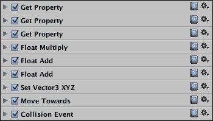

1.  在**事件**选项卡中，添加一个新事件，命名为`Return`。

1.  打开 **变量** 选项卡，添加/删除变量，直到你拥有以下截图所示的变量：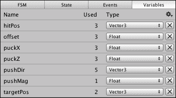

1.  这些是之前留下的用于碰撞计算的变量，以及一些用于我们之前讨论的简单 AI 行为的新变量。

1.  返回到 **状态** 选项卡，并打开第一个 **获取属性** 动作。将 **Puck** 游戏对象拖放到 **目标对象** 中，并将 **属性** 设置为 **transform** | **position** | **x**，并将 **存储浮点数** 设置为 **puckX**。检查 **每一帧**。实际上，每次你在这个状态下看到这个复选框时，都要检查 **每一帧**。

1.  对第二个 **获取属性** 选项卡执行相同的操作，但选择 **z** 而不是 **x**，并将 **puckZ** 而不是 **puckX**。这些动作用于检索对我们重要的两个轴上的冰球位置。

1.  打开第三个 **获取属性** 动作，并将 **MalletRight** 拖动到其 **目标对象** 属性中；将其 Z 位置存储在偏移变量中。

1.  在 **浮点数乘法** 动作中，将 **浮点变量** 设置为 **offset**，并将 **乘以** 设置为 `0.2`。这是我们定义 AI 应该多努力瞄准玩家球门的地方。如果它太努力，它会错过。如果它不够努力，它也会错过。

1.  在第一个 **浮点数添加** 动作中，将 **浮点变量** 设置为 **puckX**，并将 **添加** 属性设置为 **offset**。你需要点击右侧的选项按钮来完成此操作。这是实际应用偏移的地方。

1.  在第二个 **浮点数添加** 动作中，将 **浮点变量** 设置为 **puckZ**，并将 **添加** 设置为 `0.9`。这个值以后可以按需更改。它定义了实际冰球中心与 AI 将要移动到的点的距离。AI 稍微向右瞄准非常重要，否则它永远无法击中玩家的球门。

1.  在 **设置 Vector3 XYZ** 中，将 **Vector3 变量** 设置为 **targetPos**，**X** 设置为 **puckX**，并将 **Z** 设置为 **puckZ**。确保 **Y** 设置为 **None**。这是我们定义 AI 在当前帧中将要尝试移动的实际位置的地方。

1.  **Move Towards** 是将移动应用到 AI 的动作。将 **目标位置** 设置为 **targetPos**，**最大速度** 设置为 `5`，**完成距离** 设置为 `0.15`，以及 **完成事件** 设置为 **Return**。

1.  最后，打开 **碰撞事件**，并将其 **碰撞** 属性更改为 **碰撞后停留**；保留其他一切不变。

1.  现在，你可能在 **Move Towards** 动作中遇到错误。那是因为没有从 **Return** 事件过渡。在 FSM 视图中右键单击 **Move** 状态，并添加从 **Return** 事件到 **Move** 的过渡。是的，这是一个自我循环的状态。以下图显示了你现在应该在 **MalletRight** 的 FSM 视图中看到的布局。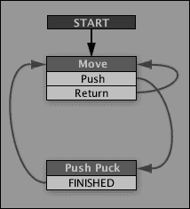

如果你现在点击播放按钮，AI 应该完全功能正常，实际上相当强大。现在，有一些改进它的方法将在本章的*练习*部分讨论，但应该足以让你在 Playmaker 中享受游戏调试的乐趣。

现在你已经有了玩家控制器、胜负条件和功能性的 AI，游戏开始变得相当庞大。如果你想要向其中添加任何内容或者出现问题，你将很难实时了解你的动作中到底发生了什么。这就是调试的作用：它是一个诊断工具，让你能够获取关于你的游戏或其特定系统的额外信息，你可以在之后使用这些信息来修复某些问题。

让我们来看一个例子。选择**MalletLeft**并在**playMaker**面板的 FSM 视图中打开其**移动**状态。如果你查看**状态**标签页的底部，你会看到那里有两个复选框：**调试**和**隐藏未使用**。第一个复选框显示你所有属性在所有时间点的值，而第二个复选框隐藏未使用的属性。检查这两个复选框，并保持**MalletLeft**被选中，然后按下播放按钮。

当你移动球槌时，观察在所有动作属性下变化的数字。当你实现一个新的游戏玩法特性时，你将想要知道数值变化在什么范围内，以及它们是否真的发生了变化。

你还可以使用**控制台**面板来调试某些事情。取消选中**调试**和**隐藏未使用**，然后打开相同 FSM 的**推球**状态。在它的顶部添加一个**调试日志**动作（在**调试**类别下）。将**日志级别**设置为**警告**并在文本框中写下`击中！`。

### 小贴士

你应该知道，存在三种类型的调试日志：*信息*、*警告*和*错误*，每种都有特定的功能。警告是为了吸引你的注意力到某个问题，信息是提供关于某物信息的简单消息，而错误则让你知道存在问题。这些只是惯例，但你将看到一些遵循它们的 Unity 内部信息、警告和错误。

现在打开**控制台**面板。我们之前简要地讨论过它，但现在让我们详细看看其中的各种按钮（从左到右）。

+   **清除**相当直观；它清除日志，移除所有消息，除了未修复的编译错误。

+   **折叠**是一个切换按钮，它使得相似的调试消息出现在同一行或分别显示。

+   **播放时清除**是一个切换按钮，当你按下播放时，它会强制**控制台**清除日志。

+   **错误暂停**会在出现错误时自动暂停游戏，以便你能更好地查看它。

最后，右侧的三个切换按钮是**控制台**的过滤器，让你能够关注不同类型的调试消息：信息、警告和错误。

如果你现在按播放并使用球槌击打冰球，**Console**中应该会显示一个带有黄色三角形的消息，例如**MalletLeft : FSM : Push Puck : DebugLog : Hit!** 你可能还会看到几个这样的消息。停止游戏，看看当你开关**Collapse**和切换警告过滤器时会发生什么。

如果你现在按播放并使用球槌击打冰球，**Console**中应该会显示一个带有黄色三角形的消息，例如**MalletLeft : FSM : Push Puck : DebugLog : Hit!** 你可能还会看到几个这样的消息。停止游戏，看看当你开关**Collapse**和切换警告过滤器时会发生什么。你可能会看到几个，如下面的截图所示：

你也可以用同样的方式调试变量值。打开**playMaker**，移除**Debug Log**动作，并在**Get Controller Hit Info**之后添加一个**Debug Vector3**动作，将**Log Level**设置为**Error**并将**Vector3 Variable**设置为**hitPos**。然后打开**Console**并再次测试游戏，用球槌击打冰球。现在你应该会在**Console**中看到红色错误消息。如果你启用了**Error Pause**，游戏将暂停，**Console**面板将展开以显示错误。

你可以通过使用称为断点的东西来实现类似的效果。从**MalletLeft**的 FSM 的**Push Puck**状态中移除**Debug Vector3**动作，然后在 FSM 视图中右键单击**Push Puck**状态，从上下文菜单中选择**Toggle Breakpoint**。在 FSM 视图中状态名称旁边将出现一条红色线。

现在，如果你按播放并用球槌触摸冰球，游戏将像使用**Error Debug**日志和**Console**中的**Error Pause**切换时一样停止，但这次暂停将由 Playmaker 触发。在 FSM 视图中将出现一个带有断点状态名称的红色圆圈。以下截图显示了它应该看起来像什么：

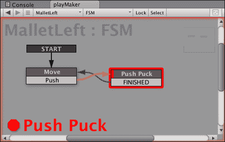

注意，从**Push**事件到**Push Puck**状态的转换箭头变成了黄色。这意味着断点是在这个特定的转换之后触发的，而不是其他原因。

当游戏因为断点而暂停时，你可以取消暂停游戏，但如果这个或另一个断点被触发，游戏将再次暂停。你可以通过右键单击带有断点的状态并从上下文菜单中选择**Toggle Breakpoint**来移除断点。

另一个有用的调试工具是逐步执行。当游戏暂停时（包括由于断点或**错误暂停**而暂停），你可以按下工具栏或**playMaker**面板底部的下一步按钮。这将执行游戏的下一帧。正如你所知，一些动作在每个帧都会执行，所以，通过在**playMaker**面板底部的**状态**选项卡中的**调试**复选框，你可以看到任何特定帧中每个动作的每个参数的确切值。你可以按需按下下一步按钮来观察变化。当你完成调试后，只需取消暂停或停止游戏。

我们将要讨论的最后一个调试工具是 Playmaker 的**FSM 日志**面板，它让你可以看到所有在 Playmaker 控制下的对象发生的事情。你可以通过按下**playMaker**面板底部靠近播放/暂停/下一步按钮的**调试**按钮来打开它，然后从下拉菜单中选择**打开日志窗口**。以下截图显示了**FSM 日志**面板的实际操作：

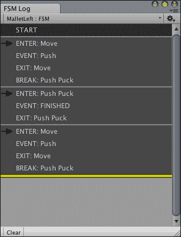

保留这个日志在手边可能是个好主意，这样你就可以将其作为第二个面板附加到屏幕的**层次结构**或**项目**区域。

# 练习

我有一些练习想建议你在进入下一章之前尝试做，这些章节将涵盖更高级的主题。你已经了解了 Unity 和 Playmaker 的基础知识——足够让你改进你的游戏或者从头开始制作一个全新的游戏。做这些练习将提高你的技能，并帮助你巩固在这本书中接触到的新的信息。练习按难度排序，从最容易到最难：

1.  记录游戏中所有重要事件（包括冰球击中、进球击中和球槌碰撞墙壁）的调试日志。

1.  击打声音：你的`Wall`预制体有一个 FSM。使用它来播放一些当球槌和/或冰球击中墙壁时的声音。[Freesound.org](http://Freesound.org)是一个免费音效的好资源。如果你更喜欢复古声音，试试[bfxr.net](http://bfxr.net)。

1.  多级设置：尝试制作多个级别，中间有障碍物/额外的墙壁。你可以在任何地方复制它们，然后，当这一轮结束后，进入下一级。

1.  到现在为止，你可能已经遇到了一个情况，即冰球从桌子上掉下来，你必须使用播放按钮重新开始游戏。这对其他玩家来说也很烦人！你可以尝试改变桌子设置，检测冰球位置，或者以其他方式解决这个问题。

    ### 小贴士

    当你在做这项工作时，想想目标触发器是如何工作的，或者发挥创意，提出你自己的解决方案。

1.  你知道如何操作**场景**视图并为对象创建新材料，你也知道如何更改摄像机的尺寸和投影。如果你能想出一个美丽的配色方案和/或摄像机投影/方向，你的游戏会变得更加漂亮。

1.  到现在为止，你可能已经开始怀疑鼠标控制是否是这款游戏的最佳解决方案。这是一个完全合理的问题，你应该自己做出这个决定。除非你尝试不同的方法，否则你永远不会确定，所以请查看**动作**面板中的**输入**类别。

1.  如果你成功实现了键盘控制，为什么不更进一步，制作一个关卡，在这个关卡中，你可以在同一台电脑上与朋友或家人一起玩，而不是与 AI 对手竞争？

1.  仔细观察控制 AI 的状态和动作。尝试修改那里的某些属性，甚至替换动作本身，以使 AI 更加智能和逼真。你可以尝试让 AI 根据冰球的位置改变其行为，通过回到自己的目标位置来保护它。你也可以尝试找出一种方法，阻止 AI 在玩家推动 AI 试图推动的冰球时被推回。

    ### 小贴士

    为了做到这一点，你需要在冰球上添加一个 Playmaker 变量，然后使用**状态机**类别下的**Get FSM**动作之一。

1.  向游戏中引入一个新的游戏机制：如何关于七局游戏的回合而不是一局？或者加力？或者限制球棒在桌子的那一侧？你可以选择，如果你喜欢，你可以做所有这些。

在你接受这些挑战之前，你应该了解一些有用的 Unity 和 Playmaker 在线资源，这些资源可以帮助你找到一些，如果不是所有问题的答案。你可以确信，当你开始自己实现某些功能时，问题不可避免地会出现。

+   **Unity 问答**：[`answers.unity3d.com/`](http://answers.unity3d.com/)

+   **Unity 维基**：[`wiki.unity3d.com/`](http://wiki.unity3d.com/)

+   **Unity 论坛**：[`forum.unity3d.com/`](http://forum.unity3d.com/)

+   **Unity 文档**：[`unity3d.com/learn/documentation`](http://unity3d.com/learn/documentation)

+   **Playmaker 手册**：[`hutonggames.fogbugz.com/`](https://hutonggames.fogbugz.com/)

+   **Playmaker 论坛**：[`hutonggames.com/playmakerforum/`](http://hutonggames.com/playmakerforum/)

在 Unity 问答和 Unity 论坛上，你不应该犹豫提问；Unity 社区非常活跃，你的问题可能在几分钟内就得到了解决。只是确保你解释得很好。但在提问之前，我强烈建议你首先使用搜索选项，因为有很大可能性，你可能遇到的大多数问题都已经得到了解决。

# 摘要

在本章中，你学习了使用 Unity 和 Playmaker 进行游戏开发的基础知识。你现在知道如何创建对象，使它们相互交互，使它们对输入做出响应，甚至根据你的算法自行移动。除此之外，你现在还了解了你将在大多数游戏中使用的矢量几何学基础知识。

下一章将介绍编程。你将学习如何编写自己的 Unity 组件，并将其转换为 Playmaker 动作。我们还将演示 Playmaker 本质上是一种使用与常规脚本非常相似的逻辑的视觉编程。
