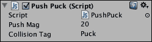
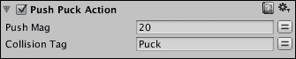

# 第五章。脚本和自定义动作

在前面的章节中，你学习了如何使用 Playmaker 的内置动作制作游戏。不幸的是，它们的性能有限，迟早你会发现自己需要 Playmaker 无法直接解决的问题。在这种情况下，你可以尝试在互联网上寻找现成的解决方案，但为了确保你的每一个问题都有答案，你肯定需要学习如何编写脚本。我们将讨论以下主题：

+   在 Unity JavaScript（有时也称为 UnityScript）和 C# 中进行编程

+   常见的 Unity 类、变量和函数

+   编写脚本并将其用作组件

+   将脚本转换为 Playmaker 动作

# 编写 Unity 脚本

解释编程的一般工作原理超出了本书的范围，因此我将假设你已经知道变量、函数、类和运算符是什么。如果你不知道这些，使用 Code Academy（[`www.codecademy.com/tracks/javascript`](http://www.codecademy.com/tracks/javascript)）或 Unity 自身的入门级教程（[`unity3d.com/learn/tutorials/modules/beginner/scripting`](http://unity3d.com/learn/tutorials/modules/beginner/scripting)）来掌握基础知识不会花费你太多时间。

在本节中，我们将从 **JavaScript**（**JS**）开始，因为它使用起来更简单，并且不需要对面向对象编程有超出我们在第三章（组件和状态机）中讨论的基于组件的开发方法的理解。此外，你最终将编写更少的代码。

JS 和 C# 都使用相同的 Unity 类和函数，语法上的差异并不很大。然而，对于更复杂的事情，通常使用 C# 是一个好主意（例如，目前无法在 JavaScript 中编写 Playmaker 动作）。我们将从一个 JS 脚本开始，然后将其翻译成 C#，并解释差异。你可以稍后选择对你来说更好的语言。

我们将创建一个脚本，用于替换两个球拍的状态机中的 **Push Puck** 状态的所有 Playmaker 动作。当你看到你需要执行五个或更多动作的链时，通常将它们组合成一个自定义动作会更简单，尤其是如果你计划在多个对象上使用这个组合动作。

让我们从创建一个新的脚本开始。首先，使用 **项目** 面板创建一个名为 `Scripts` 的新文件夹。然后，右键单击新创建的文件夹，导航到 **创建** | **Javascript**。将文件命名为 `PushPuck`。双击文件。标准的 Unity 编程环境，MonoDevelop，应该会打开。选择该脚本中的所有内容，并将其替换为以下代码：

```cs
// Automatically added, compiler =directive 
// that makes JavaScript more explicit
#pragma strict

// Global variables available from Inspector
var pushMag : float = 20f;

var collisionTag : String = String.Empty;

// Function that will detect the collision with 
// controller and apply force in point of the collision
function OnControllerColliderHit (hit : ControllerColliderHit) 
{
  if (hit.gameObject.tag == collisionTag)
  {
    // Get the position of the object we collided with
    var hitObjectPos : Vector3 = hit.transform.position;

    // Get the position of the collision
    var hitPointPos : Vector3 = hit.point;

    // Calculate the direction of the force, 
    // multiply it by magnitude
    var pushForce : Vector3 = Vector3.Normalize(hitObjectPos - hitPointPos) * pushMag;

    // Finally, apply force in position
    hit.rigidbody.AddForceAtPosition(pushForce, hitPointPos);

    // Print a message in Console saying that 
    //the collision did happen and force was indeed applied
    Debug.Log("Detected hit with " + collisionTag + ", applying force of " + pushForce + " in " + hitPointPos + ".");
  }
}
@script RequireComponent(CharacterController)
```

### 小贴士

你可以从你购买的所有 Packt Publishing 书籍的账户中下载示例代码文件。[`www.packtpub.com`](http://www.packtpub.com)。如果你在其他地方购买了这本书，你可以访问 [`www.packtpub.com/support`](http://www.packtpub.com/support) 并注册以直接将文件通过电子邮件发送给你。

在 MonoDevelop 中按 *command* + *S* (*Ctrl* + *S* 在 Windows 上) 保存脚本更改。

让我们逐行检查这段代码。第一行是 `#pragma strict`。这是一个预处理器指令。如果你有一些之前的编程经验，你可能之前见过类似的东西。它不参与脚本逻辑；它所做的就是通过在编译器中强制更严格的错误处理来使 JavaScript 更加明确。对你来说，这意味着你必须显式地定义变量的类型，这在标准 JavaScript 中通常不会这样做。

### 小贴士

对于 JS 来说，另一个常见的预处理器指令是 `#pragma downcast`，它允许你忽略不关心的不明确向下转换警告。

之后有两行变量声明：`pushMag` 和 `collisionTag` 被声明为 `float` 和 `String`。一旦你将此脚本附加到对象上，这些变量将在检查器中显示，因为它们都是公共的并且已序列化。由于在 Unity 中脚本被视为组件，一旦将脚本附加到游戏对象，变量就会作为参数出现在检查器中。

如果你想要声明一个不在检查器中显示的变量，但希望其他脚本仍然可以访问它，你应该在它前面加上 `[System.NonSerialized]`。如果你想隐藏它并关闭所有访问，只需在 `var` 关键字前面加上 `private` 即可。最后，如果你想将私有变量暴露在检查器中，你应该在其声明前加上 `[System.SerializableAttribute]`。

接下来是函数声明：`function` `OnControllerColliderHit` `(hit : ControllerColliderHit)`。`OnControllerColliderHit` 是负责检测碰撞的标准 Unity 函数之一。其他此类函数包括 `OnCollisionEnter`、`OnCollisionStay`、`OnCollisionExit`、`OnTriggerEnter`、`OnTriggerStay` 和 `OnTriggerExit`。

如果脚本附加的对象具有角色控制器组件并且该角色控制器与碰撞器发生碰撞，则会自动调用 `OnControllerColliderHit` 函数。类型为 `ControllerColliderHit` 的 `hit` 变量被分配，并可以在函数内部使用。通过键入 `hit` 和一个点，可以访问有关碰撞的所有类型的信息。

例如，在函数内部有一个 `if` 条件：`if (hit.gameObject.tag == collisionTag)`。我们使用点操作符访问我们的 Character Controller 所碰撞的 `gameObject`，然后再次使用它来访问 `gameObject` 中的该标签。然后我们将该标签与在检查器中分配的 `collisionTag` 字符串变量进行比较。如果标签与指定的字符串匹配，则执行花括号内的代码。

在这个脚本中，我们重现了 mallets' FSMs 的**推杆**状态中精确的动作序列。你可以参考它。首先，我们获取滑块的位置并将其存储在名为 `hitObjectPos` 的 `Vector3` 变量中。然后我们获取击中的点并将其存储在另一个名为 `hitPointPos` 的 `Vector3` 变量中。然后我们计算一次推力，而不是像在 Playmaker 中使用的那样分三步。最后，将力应用到滑块的刚体上。

之后，有一行包含 `Debug.Log` 的代码，它会将关于每次击中的信息打印到控制台。你可以通过在其前面输入 `//` 来注释掉这一行。现在先不要注释它，以确保脚本能够正常工作。

脚本的最后一行是 `@script RequireComponent (CharacterController)`。它在那里是为了确保附加到该脚本的游戏对象上有一个 Character Controller 组件。如果你将此脚本附加到一个没有 Character Controller 的游戏对象上，它将自动附加。如果你尝试在不先删除 `PushPuck` 的情况下删除 Character Controller，Unity 将显示警告对话框窗口，并阻止你这样做。

现在是时候看看我们新创建的脚本是否能够正常工作了。回到 Unity，打开**控制台**面板。如果没有出现红色错误，这意味着脚本已正确编译并准备好使用。如果脚本中存在某种错误，双击控制台中的错误，它将在 MonoDevelop 中打开脚本并直接跳转到错误发生的行。

如果一切正常，选择 **MalletLeft**，打开 **playMaker** 面板，并在 **Move** 状态中通过取消选中其名称旁边的框来禁用 **Collision** **Event** 动作。如果你现在开始游戏，与滑块碰撞将不会推动它。现在是我们使用全新的 `PushPuck` 脚本的时候了。在选中 **MalletLeft** 的同时，从 **项目** 面板拖放 `PushPuck` 文件到 **检查器** 面板。它将作为组件附加到上。按照以下截图设置其参数：



打开**控制台**面板并启动游戏。注意每次你用球槌击打冰球时，消息如何在控制台中显示。如果你停止游戏并双击一个`Debug.Logs`，MonoDevelop 将打开并指向`PushPuck`脚本的`Debug.Log`行。现在你知道脚本工作正常后，你可以取消注释该行以防止它向控制台发送垃圾信息。

此外，现在你也可以将其应用于 AI 对手。记得首先禁用**碰撞事件**动作。

# 标准 Unity 类概述

虽然我不会将整个 Unity 脚本参考复制到本书的这一章节，但我希望列出一些你将非常频繁使用的几个重要类和函数。

最明显且最常用的标准函数是`Awake`、`Start`、`OnEnable`、`OnDisable`、`Update`和`FixedUpdate`：

+   `Awake`是当场景加载时首先被调用的函数。`Awake`函数在每个场景加载中只能发生一次。通常将所有初始化代码放入`Awake`函数是一个好主意。

+   `Start`在`Awake`之后发生，也只运行一次。有时将一些代码放入`Awake`，其他代码放入`Start`是一个好主意，以确保一个在另一个之后执行。当你在一个脚本中有`Awake`函数，而在另一个脚本中又有另一个`Awake`函数时，你不能确定哪个会先执行。如果顺序很重要，将其中一段代码放入`Start`函数。

    ### 小贴士

    确保正确的脚本执行顺序的另一种方法是，你可以通过从主菜单导航到**编辑** | **项目设置** | **脚本执行顺序**来决定哪个脚本先执行或后执行，然后在检查器中按下加号按钮，选择你想要定义执行顺序的脚本，然后在界面中上下拖动它。你会注意到当你拖动脚本时，右边的数字会改变：这个数字是脚本的执行顺序。你可以通过从列表中移除脚本为其赋予默认执行顺序。你可以通过在列表中按其名称旁边的减号按钮来实现。

+   `OnEnable`函数与`Start`函数非常相似，除了它会在附加脚本的物体被激活以及组件本身被启用时被调用。

+   `OnDisable`是`OnEnable`的反义词。当对象或组件被禁用时被调用。

+   `Update`每帧被调用。大多数游戏逻辑通常在这里发生。

+   `FixedUpdate`在物理更新时被调用，这通常比`Update`频繁得多。所有不能依赖于帧率的代码（例如，例如，移动）都应该放在`FixedUpdate`函数中。

除了功能之外，还有许多类及其方法和变量，在 Unity 编程时你绝对应该了解。很难强调某一点，你真的应该浏览一下 Scripting Reference 中列出的所有主要类([`docs.unity3d.com/Documentation/ScriptReference/`](http://docs.unity3d.com/Documentation/ScriptReference/))。类真的很多，几乎没有人知道它们全部的功能，但我们将首先查看几个你应该关注的类：`Mathf`、`Vector3`、`Color`、`Input`、`GameObject`、`Transform`、`Renderer`、`Material`、`Collision`、`Collider`，当然还有 `Object`、`Behaviour`、`Component` 和 `MonoBehaviour`。

最后四个类尤为重要，因为它们包含了你在 Unity 中编写脚本时每次都会使用的内容，包括 `Update`、`Destroy`、`GetComponent` 和 `Start` 等函数，以及 `enabled`、`name`、`layer` 和 `tag` 等变量。仔细阅读这些类及其函数和变量的描述，并查看文档提供的与它们相关的示例。

# 创建 Playmaker 动作

是时候将我们的脚本翻译成 C# 了。以创建 JS 脚本相同的方式创建一个新的 C# 脚本。命名为 `PushPuckAction`。打开脚本，找到以 `public class` 关键字开始的行。确保类的名称与脚本名称相同，然后按 *command* + *S* (*Ctrl* + *S* 在 Windows 上) 保存你的更改（如果你做了任何更改）。

如你所见，C# 脚本的默认模板与 JS 的模板看起来不同。这是因为它向你展示了更多内容。例如，在 JS 中，默认认为脚本内部的所有内容实际上都在一个同名的类中，但你却看不到类的声明。Unity 中的组件类必须继承自 `MonoBehaviour`，这在 C# 中是可见的，而 JS 则将其隐藏起来。然后你有两条带有 `using` 关键字的行。所有 JS 脚本都使用这些命名空间，但 JS 也将其隐藏起来。下面的脚本是我们之前拥有的同一个脚本，但这次翻译成了 C#。用这个模板替换它。

```cs
using UnityEngine;
using System.Collections;
[RequireComponent (typeof (CharacterController))]

public class PushPuckAction : MonoBehaviour 
{
  // Global variables available from Inspector
  public float pushMag = 20f;

  public string collisionTag = string.Empty;

  // Function that will detect the collision with 
  // controller and apply force in point of the collision
  void OnControllerColliderHit (ControllerColliderHit hit) 
  {
    if (hit.gameObject.tag == collisionTag)
    {
      // Get the position of the object we collided with
      Vector3 hitObjectPos = hit.transform.position;

      // Get the position of the collision
      Vector3 hitPointPos = hit.point;

      // Calculate the direction of the force, 
      // multiply it by magnitude
      Vector3 pushForce = Vector3.Normalize(hitObjectPos - hitPointPos) * pushMag;

      // Finally, apply force in position
      hit.rigidbody.AddForceAtPosition(pushForce, hitPointPos);

      // Print a message in Console saying that 
      //the collision did happen and force was indeed applied
      Debug.Log("Detected hit with " + collisionTag + ", applying force of " + pushForce + " in " + hitPointPos + ".");
    }
  }
}
```

按 *command* + *S* (*Ctrl* + *S* 在 Windows 上)，让我们看看除了已经提到的内容之外还发生了什么变化。C# 中的组件要求语法与 JS 不同。除此之外，`RequireComponent` 属性必须放在类声明之前。

`#pragma strict` 指令已经不再使用。C# 本身是显式的，需要你指定所有内容的数据类型，因此它不再需要。

### 小贴士

在 C# 中，以下内容非常有用：`#region [Name]`/`#endregion`，这是一种将代码划分为可以折叠的区域的好方法。例如，编写 `#region Variables` 将创建一个名为 `Variables` 的区域。然后你将能够按下 MonoDevelop 窗口左侧的减号来折叠代码区域，其结束必须用 `#endregion` 标记。

不使用 `function` 关键字。相反，函数声明由返回类型 precedes。你同样可以在 JS 中指定返回类型，但这需要在括号后的 `:` 运算符后完成，例如，`function Update() : void`。

最后，所有变量声明都由变量类型 precedes，而不是 `var` 关键字。由于我们脚本的相对简单性，我们无法在这个示例中看到更多的语法差异，但这些是主要的。

现在，如果你在 Mallets 上将你的 JS 脚本替换为 C# 脚本，它们将表现得和之前完全一样。尝试这样做，然后从 mallets 中移除 **Push Puck Action** 组件。是时候修改脚本，将 `PushPuckAction.cs` 转换为实际的 Playmaker 动作。用以下代码替换 `PushPuckAction.cs` 的内容：

```cs
using UnityEngine;
using System.Collections;

namespace HutongGames.PlayMaker.Actions
{
  [ActionCategory(ActionCategory.Character)]
  [Tooltip("Detect collision with CharacterController, then push the other object into the opposite direction.")]
  public class PushPuckAction : FsmStateAction 
  {
    [Tooltip("Push magnitude")]
    public FsmFloat pushMag;

    [Tooltip("Object with this tag will be pushed")]
    public FsmString collisionTag;

    public override void Reset ()
    {
      pushMag = 20f;
      collisionTag = string.Empty;
    }

    public override void DoControllerColliderHit(ControllerColliderHit hit)
    {
      if (hit.gameObject.tag == collisionTag.Value)
      {
        FsmVector3 hitObjectPos = hit.transform.position;

        FsmVector3 hitPointPos = hit.point;

        FsmVector3 pushForce = (hitObjectPos.Value - hitPointPos.Value).normalized * pushMag.Value;

        hit.rigidbody.AddForceAtPosition(pushForce.Value, hitPointPos.Value);

        Debug.Log("Detected hit with " + collisionTag.Value + ", applying force of " + pushForce.Value + " in " + hitPointPos.Value + ".");
      }
    }
  }
}
```

按 *command* + *S* (*Ctrl* + *S* 在 Windows 上) 保存脚本。正如你所见，这次有更多东西发生了变化，尽管你仍然可以看到相同的结构。让我们逐行检查代码。

`using` 指令相同，但差异从它们之后开始。`namespace HutongGames.PlayMaker.Actions` 这一行对于所有 Playmaker 动作是必需的。没有它，Playmaker 将不知道你正在编写的脚本实际上是一个动作。

`[ActionCategory(ActionCategory.Character)]` 行将你的新动作放入一个类别。在这种情况下，我们将其放入 `Character` 类别，因为动作是关于与 Character Controller 发生碰撞的事物。它也可以放入 `Physics` 类别。要将它移动到那里，该行必须是 `[ActionCategory(ActionCategory.Physics)]`。

之后是 `[Tooltip("...")]`，这相当直观。当你从 **Actions** 面板中选择动作时，它会显示一个简短的描述。

`PushPuckAction` 类现在从 `FsmStateAction` 继承，而不是 `MonoBehavior`。你仍然可以访问所有标准 Unity 类，但现在还添加了 Playmaker 特定的类。

然后还有另一个 `Tooltip`，这次是为一个变量而不是整个动作。当你在 **playMaker** 面板的 **State** 选项卡或 **Actions** 面板中将鼠标指针悬停在变量上时，此提示文本将显示。

注意，`pushMag` 变量的类型已从 `float` 更改为 `FsmFloat`，同样，字符串变量 `collisionTag` 也已从 `string` 更改为 `FsmString`。这些都是 Playmaker 的变量类型。可以对它们执行与之前相同的操作，但为了访问它们的值，您现在必须使用点操作符和单词 `Value`，例如，`pushMag.Value` 将返回一个浮点数，即 Playmaker 变量的值。

### 小贴士

如果您不想能够在 **playMaker** 面板的 **State** 选项卡中直接分配值，并强制从现有变量中选择，您可以在变量声明之前的行中写入 `[UIHint(UIHint.Variable)]`，就像我们为工具提示所做的那样。

添加了一个 `Reset` 函数。当向状态添加新动作或您在动作标题上右键单击并按 **Reset** 时，就会发生这种情况。在其中，我们重新初始化变量。

然后是 `DoControllerColliderHit` 函数。它的名称已从标准的 Unity `OnControllerColliderHit` 更改。在函数内部，一切保持大致相同，唯一的区别是 `Vector3` 变量的类型已更改为 `FsmVector3`，因此要访问它们的值，使用 `.Value`。此外，我们使用了 `.nomalized` 而不是 `Vector3.Normalize`，它确实做了完全相同的事情。

### 小贴士

虽然很明显，为了找到示例和标准 Unity 类的 API，必须去 Unity 脚本参考，但对于 Playmaker 特定的事情可能就不那么明确了。找到示例的最简单方法是打开位于项目 `PlayMaker/Actions` 路径下现有 Playmaker 动作的脚本文件。例如，如果您不确定如何检测鼠标输入，并且想通过 Playmaker 自定义动作来实现，您可以打开 `PlayMaker/Actions/MousePick.cs` 并查看 Playmaker 的创建者是如何解决这个问题。

注意，`Reset` 和 `DoControllerColliderHit` 的类型前都有 `override` 关键字。这意味着我们正在用我们自己的函数替换 Playmaker 中定义的基函数。一般来说，您需要使用此关键字覆盖所有 Playmaker 标准函数。

现在我们已经编写了一个自定义的 Playmaker 动作，我们可以尝试使用它。从 **MalletLeft** 和 **MalletRight** 中移除 **Push Puck** 和/或 **Push Puck Action** 组件。在它们的 **Move** 状态中，移除 **Collision Event** 动作。然后在 **Actions** 面板中找到新创建的 **Push Puck Action** 并将其添加到状态中。设置属性如以下截图所示。最后，从 FSM 中删除 **Push Puck** 状态以及 **Push** 事件和转换。要删除转换，只需在 FSM 视图中右键单击事件并按 **Delete Transition** 即可。



# 摘要

在本章中，你学习了在 Unity 中进行脚本编写，包括 JavaScript 和 C#，以及如何创建自定义的 Playmaker 动作。你应该尝试重复本章中描述的过程，使用另一组动作进行实践。为自己设定一个游戏目标，例如，你可以选择第四章末尾提供的练习之一，*创建你的第一个游戏*，编写一个 JS 或 C# 脚本来实现目标；然后将其转换为 Playmaker 动作。完成这些后，你对脚本编写会感到更加得心应手，因为这一切都关乎实践，而阅读和理论无法替代使用文本编辑器和搜索引擎的实际操作经验。

下一章将继续讨论高级主题，例如网络和外部 API，我们将在第七章*与外部 API 一起工作*中进行更多的脚本编写。
