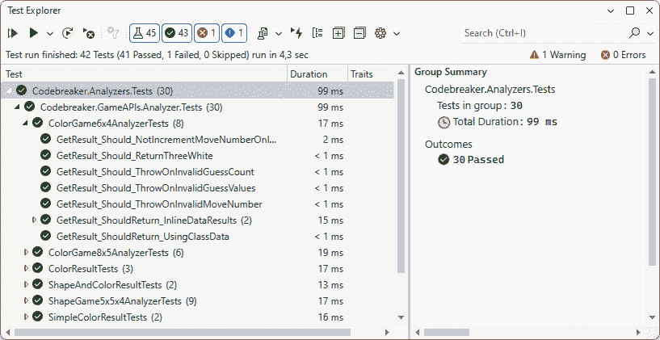
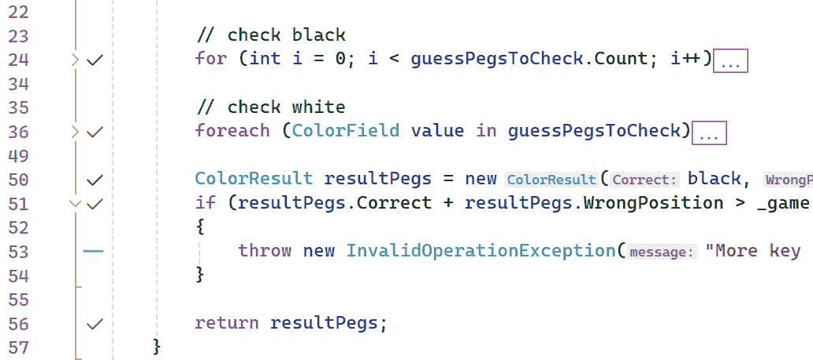

# 第十章：关于测试解决方案的所有内容

当创建微服务并使用**持续集成和持续部署**（**CI/CD**）时，尽早发现错误是一个重要的部分。在生产环境中出现错误是昂贵的，最好尽早发现它们。测试通过尽早发现错误来帮助降低成本。

本章涵盖了与微服务解决方案一起需要的不同类型的测试。我们开始创建单元测试，这些测试应该是主要使用的测试，因为问题可以快速发现，接着是集成测试，其中解决方案的多个组件在协作中测试。集成测试可以在进程内进行，其中模拟 HTTP 请求，也可以在服务在系统上运行的环境中执行，这允许您在负载下测试环境。

在本章中，您将学习以下内容：

+   创建单元测试

+   创建.NET Aspire 集成测试

+   创建端到端.NET Playwright 测试

# 技术要求

与前几章一样，您需要一个 Azure 订阅和 Docker Desktop。

本章的代码可以在以下 GitHub 仓库中找到：[`github.com/PacktPublishing/Pragmatic-Microservices-with-CSharp-and-Azure/`](https://github.com/PacktPublishing/Pragmatic-Microservices-with-CSharp-and-Azure/)。

在`ch10/final`文件夹中，您将看到本章的最终结果。

这些项目与之前章节相同，但特别关注测试：

+   `Codebreaker.AppHost` – .NET Aspire 宿主项目

+   `Codebreaker.ServiceDefaults` – 通用服务配置

+   `Codebreaker.Bot` – 运行游戏的机器人服务

这些项目与之前章节相同，但特别关注测试：

+   `Codebreaker.Analyzers` – 这是包含验证游戏移动并返回结果的分析器的项目

+   `Codebreaker.GameApis` – 游戏 API 服务项目

这些项目是新的：

+   `Codebreaker.Analyzers.Tests` – 分析器库的单元测试

+   `Codebreaker.Bot.Tests` – 机器人服务库的单元测试

+   `Codebreaker.GameAPIs.Tests` – 游戏服务项目的单元测试

+   `Codebreaker.GameAPIs.IntegrationTests` – 内存集成测试

+   `Codebreaker.GameAPIs.Playwright` – 使用 Microsoft Playwright 的测试

通过本章学习代码，您可以开始使用`start`文件夹，其中包含与测试项目相同的项目。

要轻松地将解决方案部署到 Microsoft Azure，请查看本章源代码仓库中的 README 文件。

# 创建单元测试

单元测试是测试可测试软件的小部分。这个功能是否按预期工作？这些测试应该快速，直接在开发系统上使用（并且与 CI 一起运行）。使用**Visual Studio Live Unit Testing**功能（Visual Studio Enterprise 的一部分），单元测试在代码更新时运行，甚至在保存源代码之前。

在软件开发生命周期（**SDLC**）中，错误成本会增长。当错误发现得晚（例如，在生产环境中）时，成本会呈指数增长。对于早期修复错误（例如，在编写代码时），Visual Studio 可以提供提示并显示错误；因为我们已经在编写代码，所以没有必要花时间去深入研究功能，因为我们已经在处理它了。对于使用其他测试类型（例如，集成或负载测试）查找错误，修复成本更高——但当然，比在生产环境中发现错误要便宜得多。

一个目标应该是降低成本，因此如果某些功能可以通过单元测试和其他测试类型进行验证，则优先选择单元测试。

在我们开始创建单元测试之前，需要单元测试的游戏服务的心脏是什么？它是分析库。游戏规则有一些复杂性，编写代码时容易出错。这也是可以进行一些重构以提高性能和减少内存需求的地方。重构后，应用程序应该以相同的方式运行。

注意

当我最初开发游戏分析库时，我事先创建了单元测试，并在开发算法的过程中增强了单元测试。使用**测试驱动开发**（**TDD**），单元测试是在功能之前创建的。

在修复错误之前，我也创建了新的单元测试。错误为什么会发生？为什么它没有被测试覆盖？在许多不同的项目中，我看到一些错误被修复，但在稍后的版本中又出现了。如果有单元测试来验证功能，同样的问题就不会在新版本中再次出现。

接下来，让我们深入到`Codebreaker`代码中，它需要许多单元测试。

## 探索游戏分析库

让我们探索`Codebreaker`分析库中的`GameGuessAnalyzer`类：

Codebreaker.GameAPIs.Analyzers.Tests/Analyzers/GameGuessAnalyzer.cs

```cs
public abstract class GameGuessAnalyzer<TField, TResult> :
  IGameGuessAnalyzer<TResult>
  where TResult : struct
{
  protected readonly IGame _game;
  private readonly int _moveNumber;
  protected TField[] Guesses { get; private set; }
  protected GameGuessAnalyzer(IGame game, TField[] guesses, int moveNumber)
  {
    _game = game;
    Guesses = guesses;
    _moveNumber = moveNumber;
  }
  protected abstract TResult GetCoreResult();
  private void ValidateGuess()
  {
    // code removed for brevity
  }
  protected abstract void SetGameEndInformation(TResult result);
  public TResult GetResult()
  {
    ValidateGuess();
    TResult result = GetCoreResult();
    SetGameEndInformation(result);
    return result;
  }
}
```

`GetResult`方法是这个类的核心。使用`GameGuessAnalyzer`抽象基类的构造函数，游戏和猜测通过参数传递。`GetResult`方法使用游戏的代码并使用猜测来返回结果——正确位置的颜色数量和正确但位置错误的颜色数量。`GetResult`方法的实现只是调用四个方法。`ValidateGuess`方法分析猜测的正确性，如果猜测不正确则抛出异常。`GetCoreResult`方法是抽象的，需要由派生类实现。

从`GameGuessAnalyzer`类派生的一个类是`ColorGameGuessAnalyzer`类。这个类被`Game6x4`和`Game8x5`游戏类型（六种颜色和四种代码，八种颜色和五种代码）使用：

Codebreaker.Analyzers.Tests/Analyzers/ColorGameGuessAnalyzer.cs

```cs
public class ColorGameGuessAnalyzer(
  IGame game, ColorField[] guesses, int moveNumber) :
  GameGuessAnalyzer<ColorField, ColorResult>(game, guesses, moveNumber)
{
  protected override ValidateGuessValues()
  {
    // code removed for brevity
  }
  protected override ColorResult GetCoreResult()
  {
    // code removed for brevity
  }
}
```

这个类重写了`ValidateGuessValues`和`GetCoreResult`方法。`ValidateGuessValues`方法验证输入数据，如果数据无效则抛出异常。`GetCoreResult`方法实现了`Codebreaker`游戏的算法，检查猜测是否正确放置，以及猜测正确但放置错误的情况，并相应地返回结果。

让我们为这个库创建一个单元测试项目。

## 创建单元测试项目

使用.NET CLI，我们可以创建一个新的 xUnit 测试项目：

```cs
dotnet new xunit -o Codebreaker.Analyzers.Tests
cd Codebreaker.Analyzers.Tests
dotnet add reference ..\Codebreaker.Analyzers
```

此命令创建了一个包含对 xUnit NuGet 包的引用以及分析器项目引用的`Codebreaker.Analyzers.Tests`项目。

注意

我主要使用 xUnit 进行单元测试。使用**MSTest**、**NUnit**还是**xUnit**是一个选择问题；你可以使用这些框架中的任何一个进行单元测试，并且所有这些框架都很好地集成在.NET 工具中。我自己在 xUnit 可用时，从 MSTest 切换到 xUnit，当时.NET Core 1.0 的早期测试版，而 MSTest 还没有准备好迎接新的.NET。而且，.NET 团队自己完成的多数单元测试都是使用 xUnit。

在创建第一个测试之前，需要进行一些准备工作。

## 模拟`IGame`接口

在`ColorGameGuessAnalyzer`类的构造函数中，需要一个实现`IGame`接口的对象。单元测试应该只测试一小部分功能，而不测试由它们自己的单元测试覆盖的依赖项。在测试`ColorGameGuessAnalyzer`类时，我们不想在测试分析器时添加对`Game`类的依赖。`ColorGameGuessAnalyzer`类需要的是`IGame`接口。为了允许测试运行，由一个模拟类实现了`IGame`接口：

Codebreaker.GameAPIs.Analyzers.Tests/MockColorGame.cs

```cs
public class MockColorGame : IGame
{
  public Guid Id { get; init; }
  public int NumberCodes { get; init; }
  public int MaxMoves { get; init; }
  public DateTime? EndTime { get; set; }
  public bool IsVictory { get; set; }
  // code removed for brevity
}
```

`MockColorGame`类只是一个简单的数据持有者，用于实现`IGame`接口，因此我们不需要使用任何模拟库。在稍后完成的另一个单元测试实现中，我们将使用模拟库来模拟不应由单元测试测试的功能。

## 创建测试辅助方法

为了定义多个单元测试所需的通用功能，在`ColorGame6x4AnalyzerTests`测试类中创建了辅助方法：

Codebreaker.GameAPIs.Analyzers.Tests/Analyzers/ColorGame6x4AnalyzerTests.cs

```cs
private static MockColorGame CreateGame(string[] codes) => new()
{
  GameType = GameTypes.Game6x4,
  NumberCodes = 4,
  MaxMoves = 12,
  IsVictory = false,
  FieldValues = new Dictionary<string, IEnumerable<string>>()
  {
    [FieldCategories.Colors] = [.. TestData6x4.Colors6]
  },
  Codes = codes
};
private static ColorResult AnalyzeGame(
  string[] codes,
  string[] guesses,
  int moveNumber = 1)
{
  MockColorGame game = CreateGame(codes);
  ColorGameGuessAnalyzer analyzer = new(game, [.. guesses.
    ToPegs<ColorField>()], moveNumber);
  return analyzer.GetResult();
}
```

`AnalyzeGame`方法接收一个表示有效代码的字符串数组，一个表示猜测的字符串数组以及移动次数。这些信息用于创建模拟的游戏实例并调用分析器类的`GetResult`方法。分析结果以`ColorResult`类型返回。现在可以使用这个辅助方法轻松创建单元测试。

## 创建一个简单的单元测试

第一个单元测试是通过`GetResult_Should_ReturnThreeWhite`方法实现的：

Codebreaker.GameAPIs.Analyzers.Tests/ColorGame6x4AnalyzerTests.cs

```cs
[Fact]
public void GetResult_Should_ReturnThreeWhite()
{
  ColorResult expectedKeyPegs = new(0, 3);
  ColorResult? resultKeyPegs = AnalyzeGame(
    [Green, Yellow, Green, Black],
    [Yellow, Green, Black, Blue]
  );
  Assert.Equal(expectedKeyPegs, resultKeyPegs);
}
```

使用 xUnit，`Fact`属性声明一个方法为单元测试。一个单元测试由三个部分组成：`expectedKeyPegs`变量。调用`AnalyzeGame`方法是行为。将`Green` – `Yellow` – `Green` – `Black`代码作为有效代码传递，将`Yellow` – `Green` – `Black` – `Blue`作为猜测。这个猜测中，没有颜色在正确的位置，但三种颜色在错误的位置，因此应该返回三个白色。如果这个结果是正确的，使用`Assert.Equal`方法进行验证。

## 将测试数据传递给单元测试

在这种情况下，定义一个用于不同测试数据以验证不同结果的方法是有用的：

Codebreaker.GameAPIs.Analyzers.Tests/ColorGame6x4AnalyzerTests.cs

```cs
[InlineData(1, 2, Red, Yellow, Red, Blue)]
[InlineData(2, 0, White, White, Blue, Red)]
[Theory]
public void GetResult_ShouldReturn_InlineDataResults(
  int expectedBlack, int expectedWhite,
  params string[] guessValues)
{
  string[] code = [Red, Green, Blue, Red];
  ColorResult expectedKeyPegs = new (expectedBlack, expectedWhite);
  ColorResult resultKeyPegs = AnalyzeGame(code, guessValues);
  Assert.Equal(expectedKeyPegs, resultKeyPegs);
}
```

使用 xUnit，使用`Theory`属性而不是`Fact`属性允许测试方法被多次调用，传递不同的测试数据。`GetResult_ShouldReturn_InlineResults`方法使用由`InlineData`属性指定的参数。每个`InlineData`属性都传递了定义方法的参数的参数值。在这里，一个实现覆盖了两个测试。这个特性允许通过仅添加新的`InlineData`属性来快速扩展测试用例。

与使用`InlineDataAttribute`类不同，可以创建一个实现`IEnumerable<object[]>`的类来提供测试数据：

Codebreaker.GameAPIs.Analyzers.Tests/ColorGame6x4AnalyzerTests.cs

```cs
public class TestData6x4 : IEnumerable<object[]>
{
  public static readonly string[] Colors6 = [Red, Green, Blue, Yellow,
    Black, White];
  public IEnumerator<object[]> GetEnumerator()
  {
    yield return new object[]
    {
      new string[] { Green, Blue,  Green, Yellow },
      new string[] { Green, Green, Black, White },
      new ColorResult(1, 1) // expected
    };
    yield return new object[]
    {
      new string[] { Red,   Blue,  Black, White },
      new string[] { Black, Black, Red,   Yellow },
      new ColorResult(0, 2)
    };
    // code removed for brevity – more test cases here
  }
  IEnumerator IEnumerable.GetEnumerator() => GetEnumerator();
}
```

`object[]`定义了一个方法调用所需的所有值。第一个参数定义了游戏的有效代码，第二个参数是猜测数据，第三个参数是预期结果。随着`IEnumerable`的每次迭代，都会进行一次新的测试运行。下一个代码片段展示了使用数据类实现的测试方法：

Codebreaker.GameAPIs.Analyzers.Tests/ColorGame6x4AnalyzerTests.cs

```cs
[Theory]
[ClassData(typeof(TestData6x4))]
public void GetResult_ShouldReturn_UsingClassdata(
  string[] code,
  string[] guess,
  ColorResult expectedKeyPegs)
{
  ColorResult actualKeyPegs = AnalyzeGame(code, guess);
  Assert.Equal(expectedKeyPegs, actualKeyPegs);
}
```

与使用`InlineData`属性不同，这里使用`ClassData`。使用返回测试数据的对象更灵活。`InlineData`属性需要由编译器存储的常量值。使用`ClassData`属性，数据也可以动态创建。

## 使用单元测试期望抛出异常

在下一个代码片段中，展示了另一个我们期望抛出异常的测试用例：

Codebreaker.GameAPIs.Analyzers.Tests/ColorGame6x4AnalyzerTests.cs

```cs
[Fact]
public void GetResult_Should_ThrowOnInvalidGuessValues()
{
  Assert.Throws<ArgumentException>(() =>
    AnalyzeGame(
      ["Black", "Black", "Black", "Black"],
      ["Black", "Der", "Blue", "Yellow"] // "Der" is wrong
  ));
}
```

`Assert.Throws`定义了在传递测试数据时实现应该抛出的异常类型。如果没有抛出异常，测试失败。

## 使用模拟库

对于一些需要测试的类，拥有一个模拟库是非常棒的。以下代码片段展示了注入`IGamesRepository`接口的`GamesService`类：

Codebreaker.GameAPIs/Services/GamesService.cs

```cs
public class GamesService(IGamesRepository dataRepository) : IGamesService
{
  public async Task<(Game Game, Move Move)> SetMoveAsync(
    Guid id, string gameType, string[] guesses,
    int moveNumber,
    CancellationToken cancellationToken = default)
  {
Game? game = await dataRepository.GetGameAsync(id, 
    cancellationToken);
    CodebreakerException.ThrowIfNull(game);
    CodebreakerException.ThrowIfEnded(game);
    CodebreakerException.ThrowIfUnexpectedGameType(game, gameType);
    Move move = game.ApplyMove(guesses, moveNumber);
    await dataRepository.AddMoveAsync(game, move, cancellationToken);
    return (game, move);
  }
  // code removed for brevity
}
```

使用`GamesService`类，通过构造函数注入将`IGamesRepository`接口注入。在测试`SetMoveAsync`方法时，`IGamesRepository`接口的实现不应包含在这个测试中。还有一个针对游戏存储库的测试。相反，使用这个类的模拟实现进行单元测试。`SetMoveAsync`方法调用`IGamesRepository`接口的`GetGameAsync`方法。这个方法的实际实现不应包含在测试中，但我们需要一些不同的结果，这些结果可以用后续使用的方法来使用。当这个方法返回`null`因为它没有找到游戏时，`CodebreakerException.ThrowIfNull`应该抛出异常。如果方法返回一个已经结束的游戏，下一个方法应该抛出异常，因为不能将新移动设置到已经结束的游戏中。如果传递的游戏类型与检索到的游戏类型不同，`ThrowIfUnexpectedGameType`方法应该抛出异常。这可以通过使用模拟库轻松解决。

让我们创建另一个名为`Codebreaker.GameAPIs.Tests`的 xUnit 测试项目来测试`GamesService`类。为了模拟`IGamesRepository`接口，添加`moq` NuGet 包。

下面的代码片段显示了单元测试中使用的游戏和游戏 ID 字段：

Codebreaker.GameAPIs.Tests/GamesServiceTests.cs

```cs
public class GamesServiceTests
{
  private readonly Mock<IGamesRepository> _gamesRepositoryMock = new();
  private readonly Guid _endedGameId = Guid.Parse("4786C27B-3F9A-4C47-9947-F983CF7053E6");
  private readonly Game _endedGame;
  private readonly Guid _running6x4GameId = Guid.Parse("4786C27B-3F9A-4C47-9947-F983CF7053E7");
  private readonly Game _running6x4Game;
  private readonly Guid _notFoundGameId = Guid.Parse("4786C27B-3F9A-4C47-9947-F983CF7053E8");
  private readonly Guid _running6x4MoveId1 = Guid.Parse("4786C27B-3F9A-4C47-9947-F983CF7053E9");
  private readonly string[] _guessesMove1 = ["Red", "Green", "Blue", "Yellow"];
```

通过使用泛型`Mock`类型创建一个新的实例来模拟`IGamesRepository`接口。之后，为在存储库中找不到的游戏（`_notFoundGameId`）、已经结束的游戏（`_endedGame`）和活跃的正在运行的游戏（`_running6x4Game`）预定义了游戏。

`GamesServiceTests`类的构造函数初始化游戏对象：

Codebreaker.GameAPIs.Tests/GamesServiceTests.cs

```cs
public GamesServiceTests()
{
  _endedGame = new(_endedGameId, "Game6x4", "Test", DateTime.Now, 4, 12)
  {
    Codes = ["Red", "Green", "Blue", "Yellow"],
    FieldValues = new Dictionary<string, IEnumerable<string>>()
    {
      { FieldCategories.Colors, ["Red", "Green", "Blue", "Yellow", 
"Purple", "Orange"] }
    },
    EndTime = DateTime.Now.AddMinutes(3)
  };
  // code removed for brevity
  _gamesRepositoryMock.Setup(repo => repo.GetGameAsync(_endedGameId, 
     CancellationToken.None)).ReturnsAsync(_endedGame);
  _gamesRepositoryMock.Setup(repo => repo.GetGameAsync
  (_running6x4GameId, CancellationToken.None)).ReturnsAsync
  (_running6x4Game);
  _gamesRepositoryMock.Setup(repo => repo.AddMoveAsync
  (_running6x4Game, It.IsAny<Move>(), CancellationToken.None));
}
```

使用构造函数，创建了不同游戏类型的实例。已经结束的游戏设置了`EndTime`属性。为了指定模拟实现的行怍，调用了`Setup`方法。通过这种方式，如果`GetGameAsync`方法接收到带有参数的已结束游戏 ID，它将返回已配置的已结束游戏实例。传递正在运行的游戏 ID，将返回相应的实例。在第三次调用`Setup`方法时，定义了当传递正在运行的游戏时，`AddMoveAsync`方法包含一个实现。`It.IsAny<Move>`允许我们使用任何`Move`实例调用此方法。

现在，我们可以实现单元测试。第一个单元测试是验证如果游戏已经结束，`SetMoveAsync`方法会抛出异常：

Codebreaker.GameAPIs.Tests/GamesServiceTests.cs

```cs
[Fact]
public async Task SetMoveAsync_Should_ThrowWithEndedGame()
{
  GamesService gamesService = new(_gamesRepositoryMock.Object);
  await Assert.ThrowsAsync<CodebreakerException>(async () =>
  {
await gamesService.SetMoveAsync(_endedGameId, "Game6x4", ["Red", 
    "Green", "Blue", "Yellow"], 1, CancellationToken.None);
  });
  _gamesRepositoryMock.Verify(repo => repo.GetGameAsync(_endedGameId, 
CancellationToken.None), Times.Once);
}
```

在*安排*步骤中，使用`IGamesRepository`实现的模拟对象实例化了`GamesService`类。在单元测试操作中——如之前已使用——使用`Assert.ThrowAsync`来检查在调用带有已结束游戏的指定参数的`SetMoveAsync`方法时是否抛出了异常。这里进行的另一个检查是使用`Mock`类上的`Verify`方法来检查该方法是否恰好被调用了一次。

`SetMoveAsync_Should_ThrowWithUnexpcectedGameType`和`SetMoveAsync_Should_ThorwWithNotFoundGameType`单元测试方法非常相似，因此在此未列出。请检查源代码仓库以获取详细信息。

这里展示了测试正常流程的测试方法：

```cs
[Fact]
public async Task SetMoveAsync_Should_UpdateGameAndAddMove()
{
  GamesService gamesService = new(_gamesRepositoryMock.Object);
  var result = await gamesService.SetMoveAsync(_running6x4GameId, 
"Game6x4", ["Red", "Green", "Blue", "Yellow"], 1, 
CancellationToken.None);
  Assert.Equal(_running6x4Game, result.Game);
  Assert.Single(result.Game.Moves);
  _gamesRepositoryMock.Verify(repo => repo.GetGameAsync
  (_running6x4GameId, CancellationToken.None), Times.Once);
  _gamesRepositoryMock.Verify(repo => repo.AddMoveAsync
  (_running6x4Game, It.IsAny<Move>(), CancellationToken.None), Times.
  Once);
}
```

`SetMoveAsync_Should_UpdateGameAndAddMove`方法验证了`GetGameAsync`和`AddMoveAsync`方法各被调用了一次，并且游戏中的第一个移动使得`Moves`属性恰好包含一个值。

## 运行单元测试

要启动单元测试，你可以使用`dotnet test` .NET CLI 命令运行所有测试。使用 Visual Studio，**测试**菜单可用于运行所有测试。使用**测试资源管理器**，如图*图 10.1*所示，你可以按测试、测试组或所有测试启动测试，查看每个测试的结果，调试测试，运行测试直到它们失败，定义测试播放列表等：



图 10.1 – Visual Studio 测试资源管理器

当使用 Visual Studio 2022 企业版时，你可以启动实时单元测试。使用实时单元测试，单元测试会在你更改源代码时运行。在这里，你还可以监控哪些代码行被单元测试覆盖，哪些行被遗漏。*图 10.2*显示了实时单元测试已开启的 Visual Studio 代码编辑器，以及所有单元测试中遗漏的代码行*53*：



图 10.2 – Visual Studio 实时单元测试

在完成一些单元测试后，让我们转向其他测试类型。

# 创建.NET Aspire 集成测试

虽然单元测试应该是主要的测试，但集成测试不仅测试小的功能，还包括在一个测试中测试多个组件，例如包括基础设施——例如，数据库。

.NET Aspire 包含一个库和测试模板，使用 xUnit，这可以轻松地创建集成测试以直接访问应用程序模型。

让我们使用.NET Aspire 和 xUnit 创建一个名为`Codebreaker.IntegrationTests`的.NET Aspire 测试项目：

```cs
dotnet new aspire-xunit -o Codebreaker.IntegrationTests
```

此项目包含对`Aspire.Hosting.Testing` NuGet 包的引用，以及`Microsoft.NET.Test.Sdk`、xUnit 和`xunit.runner.visualstudio`。为了允许访问应用程序模型，添加对`Codebreaker.AppHost`的项目引用。由于我们实现的集成测试需要来自游戏 API 项目中的类型，因此我们还添加了对`Codebreaker.GameAPIs`的引用。

## 创建异步初始化

在进行游戏 API 的所有集成测试时，我们需要一个`HttpClient`实例。xUnit 允许通过实现`IAsyncLifetime`接口进行异步初始化：

Codebreaker.IntegrationTests/GameAPIsTests.cs

```cs
public class GameAPIsTests : IAsyncLifetime
{
  private DistributedApplication? _app;
  private HttpClient? _client;
  public async Task InitializeAsync()
  {
    // code removed for brevity
  }
  public async Task DisposeAsync()
  {
    if (_app is null) throw new InvalidOperationException();
    await _app.DisposeAsync();
  }
  // code removed for brevity
```

将从`IAsyncLifetime`接口创建的类重命名定义了`InitializeAsync`和`DisposeAsync`方法。将在`InitializeAsync`方法中初始化的字段成员是`DistributedApplication`和`HttpClient`类。您已经从`AppHost`项目中的应用程序模型中了解了`DistributedApplication`类。您将看到如何在`InitializeAsync`方法中使用它。

虽然我们没有在`AppHost`项目中释放`DistributedApplication`实例（因为应用程序的生命周期内只有一个实例在运行，资源在应用程序结束时释放），但在单元测试中释放它很重要，因为它初始化了提供者和文件监视器。随着测试数量的增加，`INotify`实例的用户限制和打开文件描述符的进程限制可能会达到极限——因此，不要忘记在测试项目中释放这个资源。

让我们看看如何创建`DistributedApplication`和`HttpClient`类：

Codebreaker.IntegrationTests/GameAPIsTests.cs

```cs
public async Task InitializeAsync()
{
  var appHost = await DistributedApplicationTestingBuilder.
    CreateAsync<Projects.Codebreaker_AppHost>();
  _app = await appHost.BuildAsync();
  await _app.StartAsync();
_client = _app.CreateHttpClient("gameapis");
}
```

使用`DistributedApplicationTestingBuilder`（在`Aspire.Hosting.Testing`命名空间中定义），调用`CreateAsync`方法，返回一个新的`DistributedApplicationTestingBuilder`实例。泛型参数引用了`Codebreaker`的`AppHost`项目。类似于在使用`AppHost`项目中引用的项目时使用泛型参数，这里使用了相同的机制，引用了`AppHost`项目本身。调用`BuildAsync`方法返回一个`DistributedApplication`实例，我们可能会忘记释放它。使用这个实例，我们可以访问应用程序模型定义。在由`Codebreaker.AppHost`项目指定的应用程序模型中，我们定义了`gameapis`，这是`Codebreaker.GameAPIs`项目的名称。`CreateHttpClient`返回一个`HttpClient`对象来引用这个服务。返回的`HttpClient`和`DistributedApplication`对象都分配给了字段成员。现在，我们已准备好创建测试。

## 创建一个测试来验证 HTTP 错误请求状态

在第一个测试中，让我们验证当发送无效的移动编号时是否返回正确的状态码。首先，我们需要开始一个新的游戏：

Codebreaker.IntegrationTests/GameAPIsTests.cs

```cs
[Fact]
public async Task SetMove_Should_ReturnBadRequest_WithInvalidMoveNumber()
{
  if (_client is null) throw new InvalidOperationException();
  CreateGameRequest request = new(GameType.Game6x4, "test");
  var response = await _client.PostAsJsonAsync("/games", request);
  var gameResponse = await response.Content.
    ReadFromJsonAsync<CreateGameResponse>();
  Assert.NotNull(gameResponse);
  // code removed for brevity
```

开始游戏时，我们已经使用了`HttpClient`实例并调用了 HTTP `POST`请求，传递了`CreateGameRequest`对象。`CreateGameRequest`在测试项目中可用，因为我们创建测试项目时添加了对`Codebreaker.GameAPIs`项目的项目引用。

通过设置游戏移动来继续实现此方法：

Codebreaker.IntegrationTests/GameAPIsTests.cs

```cs
[Fact]
public async Task SetMove_Should_ReturnBadRequest_WithInvalidMoveNumber()
{
  // code removed for brevity
  int moveNumber = 0;
UpdateGameRequest updateGameRequest = new(gameResponse.Id, 
  gameResponse.GameType, gameResponse.PlayerName, moveNumber)
  {
    GuessPegs = ["Red", "Red", "Red", "Red"]
  };
  string uri = $"/games/{updateGameRequest.Id}";
var updateGameResponse = await _client.PatchAsJsonAsync(uri, 
    updateGameRequest);
  Assert.Equal(HttpStatusCode.BadRequest, updateGameResponse.
    StatusCode);
}
```

我们再次使用`HttpClient` - 这次是发送`PATCH`请求。传递`moveNumber`时带有`0`值指定了一个错误的移动。第一个正确的移动从`1`开始。这样，我们期望收到一个`BadRequest`结果，这通过`Assert.Equal`进行验证。

让我们再创建一个测试来玩完整游戏。

## 创建一个测试来玩完整游戏

以下代码片段显示了设置多个移动的集成测试设置：

Codebreaker.IntegrationTests/GameAPIsTests.cs

```cs
[Fact]
public async Task SetMoves_Should_WinAGame()
{
  // code removed for brevity
  int moveNumber = 1;
  UpdateGameRequest updateGameRequest = new(gameResponse.Id, 
gameResponse.GameType, gameResponse.PlayerName, moveNumber)
  {
    GuessPegs = ["Red", "Red", "Red", "Red"]
  };
  string uri = $"/games/{updateGameRequest.Id}";
  response = await _client.PatchAsJsonAsync(uri, updateGameRequest);
  var updateGameResponse = await response.Content.
ReadFromJsonAsync<UpdateGameResponse>();
  Assert.NotNull(updateGameResponse);
  // code removed for brevity
```

开始游戏与之前相同，因此这里不显示代码。发送第一步稍有不同，我们发送正确的移动编号。从那里，我们继续发送`GET`请求：

Codebreaker.IntegrationTests/GameAPIsTests.cs

```cs
  // code remove for brevity
  if (!updateGameResponse.IsVictory)
  {
    Game? game = await _client.GetFromJsonAsync<Game?>(uri);
    Assert.NotNull(game);
    moveNumber = 2;
updateGameRequest = new UpdateGameRequest(gameResponse.Id, 
      gameResponse.GameType, gameResponse.PlayerName, moveNumber)
    {
      GuessPegs = game.Codes
    };
    response = await _client.PatchAsJsonAsync(uri, updateGameRequest);
```

在发送`GET`请求之前，我们检查游戏是否在第一步中获胜。这应该在大约 1,296 次调用中发生一次；因此，在运行测试时经常会发生。我们不希望游戏在第一步中获胜时测试失败。如果游戏尚未获胜，则发送`GET`请求以找出正确的值，然后使用这些正确的值来做出第二步。

发送正确的移动，我们应该得到一个成功的结果：

Codebreaker.IntegrationTests/GameAPIsTests.cs

```cs
    // code removed for brevity
    Assert.True(response.IsSuccessStatusCode);
    updateGameResponse = await response.Content.
ReadFromJsonAsync<UpdateGameResponse>();
    Assert.NotNull(updateGameResponse);
    Assert.True(updateGameResponse.Ended);
    Assert.True(updateGameResponse.IsVictory);
  }
  // delete the game
  response = await _client.DeleteAsync(uri);
  Assert.True(response.IsSuccessStatusCode);
}
```

发送第二步后，结果得到验证。最后，游戏被删除。在这些调用之间，结果得到验证。

可以使用`dotnet test` .NET CLI 命令或与 Visual Studio Test Explorer 一起运行所有集成测试，就像之前单元测试一样。只需记住不要使用集成测试与 Live Unit Testing 一起使用。

如第八章所述，使用 CI，所有这些测试都应该运行。这可以通过使用`dotnet test`简单地完成。

使用.NET Aspire 测试进行集成测试的优点是服务器不需要启动。然而，创建负载测试、在切换到生产环境之前测试解决方案以及直接发送 HTTP 请求也应从测试环境中进行。我们将在下一节中这样做。

# 创建端到端.NET Playwright 测试

**Microsoft Playwright** ([`playwright.dev`](https://playwright.dev)) 提供了 Microsoft 的用于 Web 测试的工具和库，包括对 Web API 的测试。

Playwright 提供了一些工具（包括通过网页记录动作生成测试、检查网页、生成选择器和查看跟踪），支持跨不同平台进行测试，以及为 TypeScript、JavaScript、Python、.NET 和 Java 提供测试库。通过 UI 自动化，Playwright 可以替代手动测试人员！在这里，我们将使用 Playwright 来测试 API - 使用.NET！

## 使用 Playwright 创建测试项目

让我们使用 Playwright 开始创建一个测试项目。因为 xUnit 专注于单元测试，并且存在限制并发测试运行的问题，所以 Playwright 支持 NUnit 和 MSTest。在这里，我们使用 NUnit：

```cs
dotnet new nunit -o Codebreaker.GameAPIs.Playwright
cd Codebreaker.GameAPIs.Playwright
dotnet add package Microsoft.Playwright.NUnit
dotnet build
```

使用`dotnet new`创建一个新的.NET 项目，这次使用 NUnit 作为测试框架。`Microsoft.Playwright.NUnit`是 NUnit 的 Playwright 包。在`dotnet build`之后，在`bin/debug/net8.0`文件夹中创建了一个`playwright.ps1` PowerShell 脚本文件，用于安装所需的浏览器：

```cs
pwsh bin/debug/net8.0/playwright.ps1 install
```

## 创建上下文

Playwright 有自己的 API 用于创建 HTTP 请求。这需要初始化，以及一些维护工作：

Codebreaker.GameAPIs.Playwright/GamesAPITests.cs

```cs
[assembly: Category("SkipWhenLiveUnitTesting")]
namespace Codebreaker.APIs.PlaywrightTests;
[Parallelizable(ParallelScope.Self)]
public class GamesApiTests : PlaywrightTest
{
  private IAPIRequestContext? _requestContext;
```

因为这个测试类不应参与实时单元测试，所以使用`Category`程序集属性来标记整个程序集，并使用`SkipWhenLiveUnitTesting`。与使用`AssemblyTrait`属性的不同，NUnit 使用`Category`属性。

使用 Playwright 时，测试类需要从`PlaywrightTest`基类派生。类型为`IAPIRequestContext`的字段是 Playwright 创建 HTTP 请求的 API。这个字段使用下一个源代码片段进行初始化：

Codebreaker.GameAPIs.Playwright/GamesAPITests.cs

```cs
[SetUp]
public async Task SetupApiTesting()
{
  ConfigurationBuilder configurationBuilder = new();
  configurationBuilder.SetBasePath(
    Directory.GetCurrentDirectory());
  configurationBuilder.AddJsonFile("appsettings.json");
  var config = configurationBuilder.Build();
  if (!int.TryParse(config["ThinkTimeMS"], out _thinkTimeMS))
  {
    _thinkTimeMS = 1000;
  }
  Dictionary<string, string> headers = new()
  {
    { "Accept", "application/json" }
  };
  _requestContext = await Playwright.APIRequest.NewContextAsync(new()
  {
    BaseURL = config["BaseUrl"] ?? "http://localhost",
    ExtraHTTPHeaders = headers
  });
}
```

在每个测试之前都会调用`SetupAPITesting`方法。在 NUnit 中，这样的初始化方法需要使用`Setup`属性进行注释。为了初始化`IAPIRequestContext`，调用`Playwright.APIRequest.NewContextAsync`方法。在这里，指定了服务的基础地址和 HTTP 头。为了允许使用`appsettings.json`文件进行配置，使用`ConfigurationBuilder`类。为了模拟思考时间，从配置中检索`_thinkTimeMS`，然后在设置每个游戏移动之前使用它。

随着 API 上下文的创建，它也需要被销毁：

Codebreaker.GameAPIs.Playwright/GamesAPITests.cs

```cs
[TearDown]
public async Task TearDownAPITesting()
{
  if (_requestContext != null)
  {
    await _requestContext.DisposeAsync();
  }
}
```

在测试运行之后调用的方法被注释为`TearDown`属性。使用完毕后，需要销毁上下文。

准备完成后，让我们创建我们的测试。

## 使用 Playwright 玩游戏

使用 NUnit 创建的测试用例被`Test`属性注释：

Codebreaker.GameAPIs.Playwright/GamesAPITests.cs

```cs
[Test]
[Repeat(20)]
public async Task PlayTheGameToWinAsync()
{
  // code removed for brevity
  string playerName = "test";
  (Guid id, string[] colors) = await CreateGameAsync(playerName);
  int moveNumber = 1;
  bool gameEnded = false;
  while (moveNumber < 10 && !gameEnded)
  {
    await Task.Delay(_thinkTimeMS);
    string[] guesses = [.. Random.Shared.GetItems<string>(colors, 4)];
    gameEnded = await SetMoveAsync(id, playerName, moveNumber++, 
    guesses);
  }
  if (!gameEnded)
  {
    await Task.Delay(_thinkTimeMS);
    string[] correctCodes = await GetGameAsync(id, moveNumber – 1);
    gameEnded = await SetMoveAsync(id, playerName, moveNumber++, 
      correctCodes);
  }
  Assert.That(gameEnded, Is.True);
}
```

NUnit 使用`Test`属性来指定一个测试。可以使用`Repeat`属性来指定测试应该重复运行的次数。这个属性在生成更长的服务器负载时很有用。`PlayTheGameToWin`方法使用 API 定义流程。首先，通过调用`CreateGameAsync`方法创建一个新的游戏。之后，最多进行 10 次移动，使用`SetMoveAsync`方法放置移动。如果——使用随机选择的猜测——游戏已经结束，我们就完成了。否则，使用`GetGameAsync`检索游戏信息，然后再次调用`SetMoveAsync`——这次使用正确的移动。

下一个代码片段显示了其中的一种调用方式。对于其他调用方式，请检查源代码仓库：

Codebreaker.GameAPIs.Playwright/GamesAPITests.cs

```cs
private async Task<bool> SetMoveAsync(Guid id, string playerName, int moveNumber, string[] guesses)
{
  Dictionary<string, object> request = new()
  {
    ["id"] = id.ToString(),
    ["gameType"] = "Game6x4",
    ["playerName"] = playerName,
    ["moveNumber"] = moveNumber,
    ["guessPegs"] = guesses
  };
var response = await _requestContext.PatchAsync($"/games/{id}", new()
{
    DataObject = request
  });
  Assert.That(response.Ok, Is.True);
  var json = await response.JsonAsync();
  JsonElement results = json.Value.GetProperty("results");
  Assert.Multiple(() =>
  {
Assert.That(results.EnumerateArray().Count(), 
      Is.LessThanOrEqualTo(4));
Assert.That(results.EnumerateArray().All(x => x.ToString() is 
      "Black" or "White"));
  });
  bool hasEnded = bool.Parse(json.Value.GetProperty("ended").
ToString());
  return hasEnded;
}
```

`SetMoveAsync` 方法通过使用 `IAPIRequestContext` 接口的 `PatchAsync` 方法来设置移动。根据使用的 HTTP 动词，`GetAsync`、`PostAsync`… 方法都是可用的。发送到服务的 HTTP 主体由 `DataObject` 属性指定。`PatchAsync` 方法返回一个 `IAPIResponse` 响应。使用此响应，可以使用 `JsonAsync` 方法检索 JSON 数据。与 `Assert` 验证一起使用的 `Ok` 属性在 200 到 299 的状态码范围内返回 `true`。

在此测试到位的情况下，我们可以使用 `dotnet test` 或在 Visual Studio 中的 Test Explorer 中运行测试。但这次，服务需要正在运行！

# 创建测试负载

Playwright 测试现在可以用来模拟用户负载，以并发运行多个用户。为此，只需要计算资源来运行所需的负载。通过减少延迟时间，可以使用少量“虚拟用户”来模拟更多真实用户的负载。需要分析真实用户在移动之间的思考时间，这需要监控生产环境中的解决方案。

注意

减少移动之间的延迟，你可以使用更少的计算资源来仅用少量虚拟用户模拟大量真实用户的负载。也有很好的理由增加真实用户所用的时间的延迟时间。在 *第十二章* 中，我们将通过缓存来增强解决方案。如果用户在移动之间有长时间的延迟，缓存的游戏不可用，应用程序是否仍然表现正确？你还应该运行此类集成测试。

使用 **Microsoft Playwright 测试** 云服务，计算资源可用于测试 Web 应用程序。在撰写本文时，此服务不可用于测试 REST API。另一个运行负载测试的服务是 **Azure Load Testing**。使用此工具，你可以编写 **JMeter** 脚本来运行测试或从 Web 门户指定 Web 请求。在 *第十二章* 中，我们将使用此服务创建负载测试来增加游戏 API 的副本数量。此工具不仅运行负载，还提供了一个出色的报告，显示了与请求交互的所有资源的信息。

注意

这里涵盖的所有测试也可以与 GitHub Actions 一起使用。在构建 .NET 库和应用程序之后，应触发 `dotnet test` 以启动所有单元测试。在将服务部署到测试环境之后，在解决方案部署到下一个环境之前——例如，预发布环境——应运行集成测试。自动负载测试应确保解决方案在负载下运行。

持续地——对于基于时间触发的流程——你应该检查依赖项中是否发现新的安全漏洞，并且这些依赖项应该得到更新。为此，使用 GitHub，只需配置 *Dependabot* 即可。

# 摘要

在本章中，您学习了如何创建*单元测试*来测试简单的功能。这些测试可以与实时单元测试一起使用，在开发期间立即显示测试错误。通过单元测试，您学习了如何使用*模拟库*来替换单元测试范围之外的函数，并由不同的单元测试覆盖。

您学习了如何使用`Aspire.Hosting.Testing`使*集成测试*变得简单。无需启动服务，因为`HttpClient`的处理程序被替换为向服务进程发送请求。

使用 Microsoft Playwright，您创建了一个集成测试，该测试向 API 发送 HTTP 请求，并可用于在负载下测试解决方案。

在本章中，您监控了指标数据，下一章将在此基础上扩展，以便您可以创建自己的指标计数，并将日志记录和分布式跟踪添加到微服务解决方案中。

# 进一步阅读

要了解更多关于本章讨论的主题，您可以参考以下链接：

+   Martin Fowler 关于微服务测试的观点: [`martinfowler.com/articles/microservice-testing`](https://martinfowler.com/articles/microservice-testing)

+   实时单元测试: [`learn.microsoft.com/en-us/visualstudio/test/live-unit-testing`](https://learn.microsoft.com/en-us/visualstudio/test/live-unit-testing)

+   集成测试: [`learn.microsoft.com/en-us/aspnet/core/test/integration-tests`](https://learn.microsoft.com/en-us/aspnet/core/test/integration-tests)

+   *测试.NET Aspire 应用*: [`learn.microsoft.com/en-us/dotnet/aspire/fundamentals/testing`](https://learn.microsoft.com/en-us/dotnet/aspire/fundamentals/testing)

+   Microsoft Playwright: [`playwright.dev/`](https://playwright.dev/)

+   *使用 OWASP Top 10 安全指南进行.NET 开发*: [`learn.microsoft.com/en-us/training/modules/owasp-top-10-for-dotnet-developers/`](https://learn.microsoft.com/en-us/training/modules/owasp-top-10-for-dotnet-developers/)

+   *与 Dependabot 协作*: [`docs.github.com/en/code-security/dependabot/working-with-dependabot`](https://docs.github.com/en/code-security/dependabot/working-with-dependabot)
