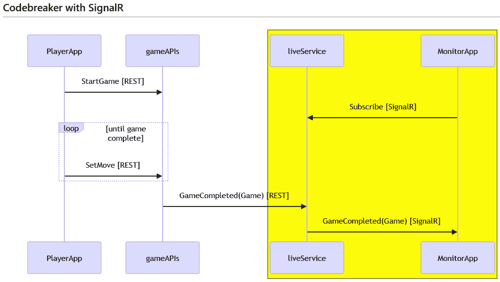
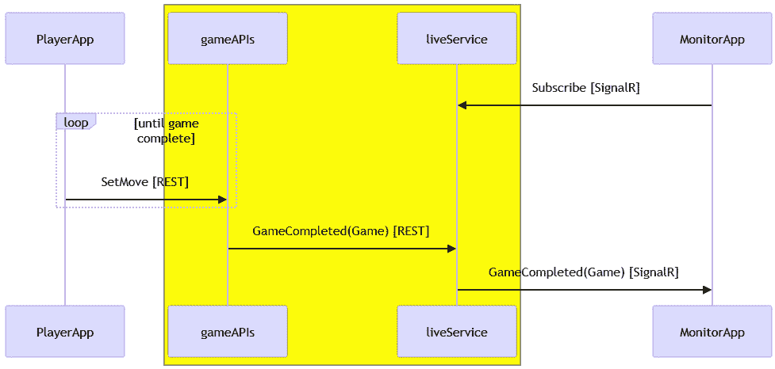
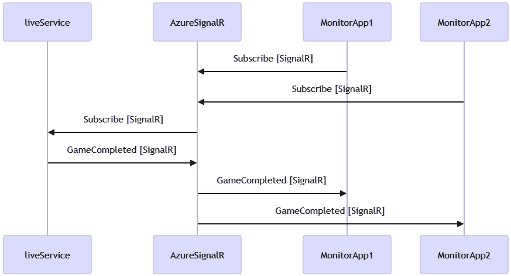
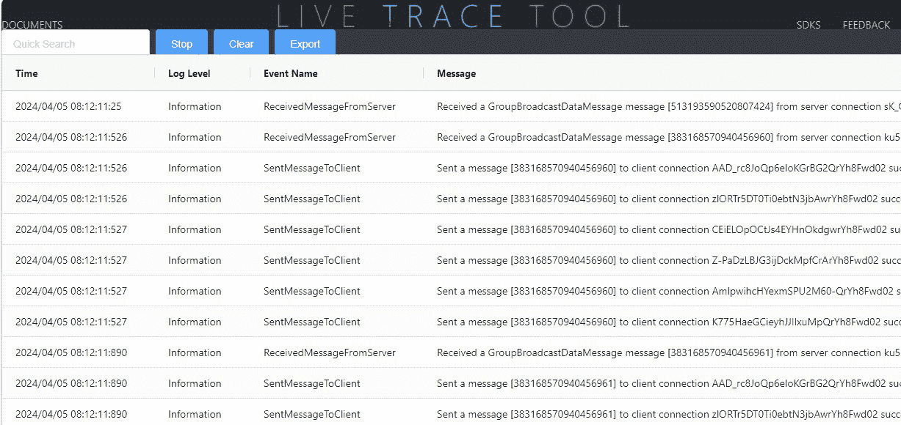
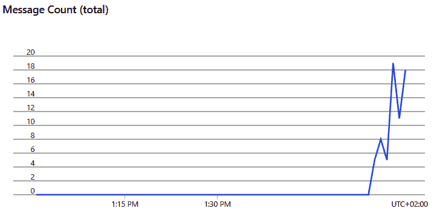

# 第十三章：使用 SignalR 进行实时消息传递

现在我们已经创建了各种测试，添加了遥测数据，监控了解决方案，并扩展了我们的服务，从本章开始，我们将继续创建服务和使用不同的通信技术。

在本章中，我们将使用 ASP.NET Core SignalR。SignalR 是一种技术，它允许我们从服务向客户端发送实时信息。客户端向服务发起连接，然后保持连接状态，以便在信息可用时向客户端发送消息。

在本章中，你将学习以下内容：

+   创建 SignalR 服务

+   向客户端发送实时信息

+   创建 SignalR 客户端

+   使用 Azure SignalR 服务

# 技术要求

在本章中，就像之前的章节一样，你需要 Azure 订阅和 Docker Desktop。

本章的代码可以在本书的 GitHub 仓库中找到：[`github.com/PacktPublishing/Pragmatic-Microservices-with-CSharp-and-Azure/`](https://github.com/PacktPublishing/Pragmatic-Microservices-with-CSharp-and-Azure/)。

`ch13` 文件夹包含本章的项目及其结果。要添加本章的功能，你可以从上一章的源代码开始。

我们将考虑的项目如下：

+   `Codebreaker.AppHost`：这是 .NET Aspire 主项目。通过运行 SignalR 中心并使用 Azure SignalR 服务，应用程序模型得到了增强。

+   `Codebreaker.Live`：这是一个新项目，它托管由 `game-apis` 服务和 SignalR 中心调用的最小 API。

+   `Codebreaker.GameAPIs`：该项目已得到增强，可以将完成的游戏转发到 `live-service`。

+   `LiveTestClient`：这是一个新的控制台应用程序，它注册到 SignalR 中心以接收完成的游戏。

# 创建 SignalR 服务

在本章中，我们将创建一个新的服务，该服务为每个连接的客户端提供正在玩的游戏的实时信息。*图 13.1* 展示了解决方案中服务的协作方式：



图 13.1 – Codebreaker 服务

`game-apis` 服务自*第二章*以来就存在了。`game-apis` 的客户端通过 REST API 启动游戏并设置移动。新的内容是 Codebreaker 的 `live-service`。该服务提供了一个简单的 REST API，每次游戏完成后，`game-apis` 服务都会调用它。该服务的主要功能是利用 ASP.NET Core SignalR 向所有连接的客户端提供实时信息。客户端需要在接收游戏完成消息之前进行订阅。

SignalR 提供了什么？由于连接永远不能从服务器开始到客户端，SignalR 也是如此，因此客户端需要连接到 SignalR 服务并订阅以接收实时信息。连接保持打开状态，这使得服务可以向客户端发送信息。

ASP.NET Core SignalR 如果这项技术可用，将使用 **WebSockets** ——但使用 SignalR 的编程模型比直接使用 WebSocket 要简单得多。与 HTTP 相反，使用 WebSocket 时，由客户端发起的连接保持打开，这允许服务在有消息可用时发送消息。

WebSocket 并非总是可用，可能被代理或防火墙禁用，并且并非在所有地方都可用。例如，**Azure Front Door** 目前不支持 WebSocket。

如果 WebSocket 不可用，SignalR 将切换到其他通信技术，例如 `text/event-stream` 数据，并要求服务器保持连接活跃（通过 `Connection: keep-alive` HTTP 头）。现在所有现代浏览器都支持 SSE。使用轮询时，客户端会反复询问服务器是否有新数据可用，一次又一次地打开新的连接。长轮询是一种技术，通过服务器不立即返回信息，声称没有新信息可用来减少客户端的请求数量。相反，服务器等待超时几乎结束时才返回。如果在等待期间有新信息可用，则返回这些新信息。

使用 SignalR，无需更改编程结构来决定使用 WebSocket、SSE 或长轮询。这是由 SignalR 自动完成的。然而，在这些场景中，与简单的 HTTP 请求相比，服务器有更多的开销：与客户端的连接需要保持活跃，因此需要保存在内存中。为了从我们的服务中移除这种开销，我们将在本章后面使用 Azure SignalR 服务。

要创建一个 SignalR 服务，我们只需创建一个空的 ASP.NET Core Web 项目。因为这个服务也提供 REST API，让我们创建一个新的 Web API 项目：

```cs
dotnet new webapi --use-minimal-apis -o Codebreaker.Live
```

这创建了一个最小化的 API 项目，类似于我们为 `game-apis` 项目所拥有的项目。这个项目需要配置为 .NET Aspire 项目。使用 Visual Studio，使用 `Codebreaker.Live` 项目。然后，将 `ServiceDefaults` 项目的项目引用添加到实时项目中。

`Codebreaker.Live` 服务项目需要配置为 .NET Aspire 应用模型：

Codebreaker.AppHost/Program.cs

```cs
// else path using Azure services
var live = builder.AddProject<Projects.Codebreaker_Live>("live")
  .WithExternalHttpEndpoints()
  WithReference(appInsights)
 .WithEnvironment("StartupMode", startupMode);
var gameAPIs = builder.AddProject<Projects.Codebreaker_GameAPIs>("gameapis")
  .WithExternalHttpEndpoints()
  .WithReference(cosmos)
  .WithReference(redis)
  .WithReference(appInsights)
  .WithReference(live)
  .WithEnvironment("DataStore", dataStore)
  .WithEnvironment("StartupMode", startupMode);
  // code removed for brevity
```

通过这样做，项目被添加到应用模型中，并从 `game-apis` 服务中引用，因为它需要从 `live-service` 获取链接来调用游戏完成的 REST API。

接下来，我们将添加一个客户端可以使用的 SignalR 集线器。

## 创建 SignalR 集线器

SignalR 已经是 ASP.NET Core 的一部分，所以我们不需要添加另一个 NuGet 包。让我们添加 SignalR 集线器类——即 `LiveHub`：

Codebreaker.Live/Endpoints/LiveHub.cs

```cs
public class LiveHub(ILogger<LiveHub> logger) : Hub
{
  public async Task SubscribeToGameCompletions(string gameType)
  {
    logger.ClientSubscribed(Context.ConnectionId, gameType);
    await Groups.AddToGroupAsync(Context.ConnectionId, gameType);
  }
  public async Task UnsubscribeFromGameCompletions(string gameType)
  {
    logger.ClientUnsubscribed(Context.ConnectionId, gameType);
    await Groups.RemoveFromGroupAsync(Context.ConnectionId, gameType);
  }
}
```

SignalR 中心类派生自 `Hub` 基类（`Microsoft.AspNetCore.SignalR` 命名空间）。这个类定义了 `OnConnectedAsync` 和 `OnDisconnectedAsync` 方法，这两个方法都可以被重写以响应客户端的连接和断开。在这里，我们定义了一个带有 `gameType` 参数的 `RegisterGameCompletions` 方法。此方法由 SignalR 客户端调用。

使用 SignalR，中心可以向所有客户端、单个客户端或一组客户端发送实时信息。在这个实现中，我们允许客户端注册到一个组。游戏类型用于区分不同的组。`Hub` 类定义了一个 `Groups` 属性来订阅和取消订阅一个组。`AddToGroupAsync` 方法将客户端添加到组中，而 `RemoveFromGroupAsync` 方法则从组中移除客户端。可以通过 `ConnectionId` 来识别已连接的客户端，这可以通过 `Context` 属性访问。

要向已连接的客户端发送信息，`Hub` 类提供了一个 `Clients` 属性，允许你向所有客户端发送（`Clients.All.SendAsync`）或一个组（`Clients.Group("group-name").SendAsync`）。然而，在这种情况下，我们需要从 `game-apis` 服务（在接收到 REST 调用之后）将信息发送到外部 `LiveHub` 类。我们将通过实现 `LiveGamesEndpoints` 类来完成这项工作。

## 将实时信息返回给客户端

`LiveGamesEndpoints` 类使用最小化的 API 来实现 REST 端点。特别之处在于它可以向已连接的客户端发送信息：

Codebreaker.Live/Endpoints/LiveGamesEndpoints.cs

```cs
public static class LiveGamesEndpoints
{
  public static void MapLiveGamesEndpoints(this IEndpointRouteBuilder routes, ILogger logger)
  {
    var group = routes.MapGroup("/live")
      .WithTags("Game Events API");
group.MapPost("/game", async (GameSummary gameSummary, 
      IHubContext<LiveHub> hubContext) =>
    {
      logger.LogInformation("Received game ended {type} {gameid}", 
        gameSummary.GameType, gameSummary.Id);
      await hubContext.Clients.Group(gameSummary.GameType).
        SendAsync("GameCompleted", gameSummary);
      return TypedResults.Ok();
    })
    .WithName("ReportGameEnded")
    .WithSummary("Report game ended to notify connected clients")
    .WithOpenApi();
  }
}
```

由 `MapPost` 方法接收的 `GameSummary` 类在 `CNinnovation.Codebreaker.BackendModels` NuGet 包中实现。这个类包含了一个完成游戏的摘要信息。除了这个 HTTP POST 请求体参数外，`MapPost` 方法还从 DI 容器接收一个 `IHubContext<LiveHub>` 实例。当 DI 容器配置为 SignalR 时，此接口被注册，以便检索到已注册中心以向客户端发送信息。使用 `Clients.Group` 方法，当传递组名时，会返回一个 `IClientProxy` 对象。然后，使用这个代理来发送带有游戏摘要的 `GameCompleted` 方法。

现在，我们只需要将 SignalR 和中心注册到 DI 容器和中间件中即可。

## 注册 SignalR 服务和中心

要使用 SignalR 并使中心作为端点可用，我们必须实现 `ApplicationServices` 类：

Codebreaker.Live/ApplicationServices.cs

```cs
public static class ApplicationServices
{
  public static void AddApplicationServices(this IHostApplicationBuilder builder)
  {
    builder.Services.AddSignalR();
    // code removed for brevity
  }
  public static WebApplication MapApplicationEndpoints(this WebApplication app, ILogger logger)
  {
    app.MapLiveGamesEndpoints(logger);
app.MapHub<LiveHub>("/livesubscribe");
    return app;
  }
}
```

`AddApplicationServices` 方法通过调用 `AddSignalR` 方法扩展 `IHostApplicationBuilder`，以注册 SignalR 所需的服务类。`MapApplicationEndpoints` 方法注册 SignalR 端点和最小 API 端点。通过传递具有 `MapHub` 方法泛型参数的 `Hub` 类来注册 SignalR 端点。`/livesubscribe` 是客户端用来连接此服务的链接。

`ApplicationServices` 类的方法是从 SignalR 项目的顶层语句中调用的：

Codebreaker.Live/Program.cs

```cs
var builder = WebApplication.CreateBuilder(args);
builder.AddServiceDefaults();
builder.AddApplicationServices();
builder.Services.AddEndpointsApiExplorer();
builder.Services.AddSwaggerGen();
var app = builder.Build();
app.MapDefaultEndpoints();
app.MapApplicationEndpoints(app.Logger);
app.Run();
```

通过调用由通用 `ServiceDefaults` 项目定义的 `AddServiceDefaults` 方法配置 DI 容器。这为解决方案中所有项目所需添加了 DI 容器注册。`AddApplicationServices` 方法添加了从 `live-service` 需要的服务，例如 SignalR。使用 `builder.Build` 通过 DI 容器得出所需的信息。应用程序实例开始配置中间件，这是 `MapDefaultEndpoints` 和 `MapApplicationEndpoints` 被调用的地方。`MapDefaultEndpoints` 注册了如常见健康检查（在第 *第十二章* 中介绍）之类的链接。`MapApplicationEndpoints` 注册了由此服务项目提供的端点。

现在 `live-service` 已准备就绪，让我们从 `game-apis` 服务调用 API。

## 从游戏-apis 服务转发请求

回想一下之前的序列图。我们已更新此图以显示 `game-apis` 和 `live-service` 之间的通信方式：



图 13.2 – 对 live-service 的 REST 调用

游戏完成后，`game-apis` 服务使用游戏完成信息调用 `live-service`。要调用 `live-service`，创建 `LiveReportClient` 类，并注入 `HttpClient`：

Codebreaker.GameAPIs/Services/LiveReportClient.cs

```cs
public class LiveReportClient(HttpClient httpClient, ILogger<LiveReportClient> logger) : ILiveReportClient
{
  private readonly static JsonSerializerOptions s_jsonOptions = new()
  {
    PropertyNameCaseInsensitive = true
  };
public async Task ReportGameEndedAsync(GameSummary gameSummary, 
    CancellationToken cancellationToken = default)
  {
    try
    {
await httpClient.PostAsJsonAsync("/live/game", gameSummary, 
        options: s_jsonOptions, cancellationToken: cancellationToken);
    }
    catch (Exception ex) when (ex is HttpRequestException or 
      TaskCanceledException or JsonException)
    {
      logger.ErrorWritingGameCompletedEvent(gameSummary.Id, ex);
    }
  }
}
```

`ReportGameEndedAsync` 方法使用 `HttpClient` 类向 `/live/game` 发送 HTTP POST 请求并发送 `GameSummary` 信息。

让我们通过更新 `ApplicationServices` 类来配置 `HttpClient` 类：

Codebreaker.GameAPIs/ApplicationServices.cs

```cs
public static void AddApplicationServices(this IHostApplicationBuilder builder)
{
  // code removed for brevity
  builder.Services.AddScoped<IGamesService, GamesService>();
builder.Services.AddHttpClient<ILiveReportClient, 
    LiveReportClient>(client =>
  {
    client.BaseAddress = new Uri("https+http://live");
  });
  builder.AddRedisDistributedCache("redis");
}
```

使用 .NET Aspire 协调，通过使用 `https+http://live` 表达式的服务发现来检索实时客户端的 URL。此表达式优先选择 `https` 协议，如果不可用，则使用 `http` 协议。名称通过应用模型中的服务发现解析，如*第一章*中所述。

这样，`game-apis` 已配置为发送游戏摘要信息。现在，我们只需要创建一个从 SignalR 服务接收实时信息的客户端。

# 创建 SignalR 客户端

作为接收实时信息的简单客户端，我们只需要一个连接到 `live-service` 的控制台应用程序。通过这样做，可以轻松地将此功能实现到任何其他客户端中。

首先创建一个控制台项目：

```cs
dotnet new console -o LiveTestClient
```

需要添加 `Microsoft.AspNetCore.SignalR.Client` NuGet 包来调用 SignalR 服务。我们还必须添加 `Microsoft.Extensions.Hosting` 用于 DI 容器，以及 `CNinnovation.Codebreaker.BackendModels` 包中的 `GameSummary` 类型。

创建 `LiveClient` 类，该类将与 SignalR 服务进行通信：

LiveTestClient/LiveClient.cs

```cs
internal class LiveClient(IOptions<LiveClientOptions> options) : IAsyncDisposable
{
  // code removed for brevity
}
public class LiveClientOptions
{
  public string? LiveUrl { get; set; }
}
```

`LiveClient` 类指定了一个带有 `IOptions<LiveClientOptions>` 的构造函数。这将通过 DI 容器进行配置，以便它可以传递来自 `live-service` 的 URL 字符串。

将 `appsettings.json` 添加到配置 URL：

LiveTestClient/appsettings.json

```cs
{
  "Codebreaker.Live": {
    "LiveUrl": "http://localhost:5130/livesubscribe"
  }
}
```

对于本地测试，端口号需要与 `launchSettings.json` 中指定的端口号相匹配。不要忘记配置，以确保 `appsettings.json` 被复制到输出目录。

通过 `StartMonitorAsync` 方法启动对服务的连接：

LiveTestClient/LiveClient.cs

```cs
internal class LiveClient(IOptions<LiveClientOptions> options) : IAsyncDisposable
{
  private HubConnection? _hubConnection;
public async Task StartMonitorAsync(CancellationToken 
    cancellationToken = default)
  {
    string liveUrl = options.Value.LiveUrl ??
      throw new InvalidOperationException("LiveUrl not configured");
    _hubConnection = new HubConnectionBuilder()
      .WithUrl(liveUrl)
      .Build();
    _hubConnection.On("GameCompleted", (GameSummary summary) =>
{
      string status = summary.IsVictory ? "won" : "lost";
      Console.WriteLine($"Game {summary.Id} {status} by {summary.
        PlayerName} after " +
        "{summary.Duration:g}  with {summary.NumberMoves} moves");
    });
    await _hubConnection.StartAsync(cancellationToken);
  }
  // code removed for brevity
  public async ValueTask DisposeAsync()
  {
    if (_hubConnection is not null)
    {
      await _hubConnection.DisposeAsync();
    }
  }
}
```

要连接到 SignalR 集线器，使用 `HubConnectionBuilder` 设置连接。使用此构建器，可以配置连接 – 例如，设置日志记录、服务器超时和重连行为。然后通过调用 `StartAsync` 方法来启动连接。

`HubConnection` 的 `On` 方法配置接收端：当接收到 `GameCompleted` 消息时，`GameSummary` 参数指定了接收到的数据，并将关于游戏的消息写入控制台。名称 `GameCompleted` 需要与通过服务的 `SendAsync` 方法传递的名称相匹配。

要订阅来自服务的消息，实现 `SubscribeToGame` 方法：

LiveTestClient/LiveClient.cs

```cs
public async Task SubscribeToGame(string gameType, CancellationToken cancellationToken = default)
{
  if (_hubConnection is null) throw new InvalidOperationException("Start a connection first");
await _hubConnection.InvokeAsync("SubscribeToGameCompletions", 
    gameType, cancellationToken);
}
```

在此实现中，使用 `HubConnection` 的 `InvokeAsync` 方法。`SubscribeToGameCompletions` 与集线器方法的名称匹配，该方法使用 `game-type` 参数。

客户端应用程序的顶级语句使用了 `LiveClient` 类：

LiveTestClient/Program.cs

```cs
Console.WriteLine("Test client - wait for service, then press return to continue");
Console.ReadLine();
var builder = Host.CreateApplicationBuilder(args);
builder.Services.AddSingleton<LiveClient>();
builder.Services.Configure<LiveClientOptions>(builder.Configuration.GetSection("Codebreaker.Live"));
using var host = builder.Build();
var client = host.Services.GetRequiredService<LiveClient>();
await client.StartMonitorAsync();
await client.SubscribeToGame("Game6x4");
await host.RunAsync();
Console.WriteLine("Bye...");
```

在 DI 容器中配置 `LiveClient` 类后，调用 `StartMonitorAsync` 和 `SubscribeToGame` 方法。

在此基础上，可以启动 AppHost，使其运行所有服务和客户端应用程序的多个实例。使用 `bot-service` 来玩多个游戏。您将看到来自机器人的成功消息，如图 *图 13**.3* 所示。


图 13.3 – 接收游戏摘要的实时客户端

使用机器人，在游戏移动之间有 0 和 1 秒的思考时间，启动了多个游戏。这些结果显示了在 0.27 到 4.79 秒之间发生的游戏胜利。

# 更改序列化协议

默认情况下，SignalR 使用 JSON 序列化消息。使用 `Microsoft.AspNetCore.SignalR.Protocols.MessagePack` NuGet 包，可以使用二进制序列化格式代替。这是一种优化，可以减少发送的数据量。

为了支持这一点，我们只需要在添加 NuGet 包后更新服务的 DI 配置：

Codebreaker.Live/ApplicationServices.cs

```cs
public static void AddApplicationServices(this IHostApplicationBuilder builder)
{
  builder.Services.AddSignalR()
    .AddMessagePackProtocol();
}
// code removed for brevity
```

`AddMessagePackProtocol` 方法将 `MessagePack` 添加为序列化的另一种选项。JSON 仍然可用。

关于客户端，需要相同的 NuGet 包，但这次需要以下配置：

LiveTestClient/LiveClient.cs

```cs
string liveUrl = options.Value.LiveUrl ?? throw new InvalidOperationException("LiveUrl not configured");
_hubConnection = new HubConnectionBuilder()
  .WithUrl(liveUrl)
  .ConfigureLogging(logging =>
  {
    logging.AddConsole();
    logging.SetMinimumLevel(LogLevel.Debug);
  })
  .AddMessagePackProtocol()
  .Build();
```

与服务器一样，客户端也需要相同的协议 NuGet 包，以及 `AddMessagePackProtocol` API。对于客户端，现在日志记录也已开启。可以使用 `ConfigureLogging` 方法配置 SignalR 的日志提供程序。在此，添加了控制台提供程序，并将最小日志级别设置为 `LogLevel.Debug`。这样，我们可以看到客户端和服务器之间的所有通信，包括使用的消息协议和发送的 ping 消息。

当使用 MessagePack 时，需要注意一个重要的限制：`DateTime.Kind` 不会被序列化。因此，在发送之前，此类型应转换为 UTC。

在此设置完成后，您可以再次启动解决方案，启动机器人来玩游戏，并启动 SignalR 客户端。当您查看日志信息时，您将看到 WebSockets 和 MessagePack 在实际操作中的使用：

客户端应用程序的日志记录

```cs
dbug: Microsoft.AspNetCore.SignalR.Client.HubConnection[40]
  Registering handler for client method 'GameCompleted'.
// some log outputs removed for clarity
dbug: Microsoft.AspNetCore.Http.Connections.Client.HttpConnection[8]
  Establishing connection with server at 'http://localhost:5130/livesubscribe'.
dbug: Microsoft.AspNetCore.Http.Connections.Client.HttpConnection[9]
  Established connection '1YXBdJ3Yi7A_86ZqoMKgiA' with the server.
info: Microsoft.AspNetCore.Http.Connections.Client.Internal.WebSocketsTransport[1]
  Starting transport. Transfer mode: Binary. Url: 'ws://localhost:5130/livesubscribe?id=CHpPUMdrJoxV0zLHsskN1Q'.
dbug: Microsoft.AspNetCore.Http.Connections.Client.HttpConnection[18]
      Transport 'WebSockets' started.
info: Microsoft.AspNetCore.SignalR.Client.HubConnection[24]
      Using HubProtocol 'messagepack v1'.
dbug: Microsoft.AspNetCore.Http.Connections.Client.Internal.WebSocketsTransport[13]
      Received message from application. Payload size: 39.
```

现在我们已经切换了序列化格式，让我们通过使用 Azure SignalR 服务来减少大量客户端连接时的服务负载。

# 使用 Azure SignalR 服务

由于服务器与所有 SignalR 客户端都保持开放连接，因此 SignalR 存在一些开销。

为了从我们的服务中移除这种开销，我们可以使用 **Azure SignalR 服务**。此服务充当客户端和 SignalR 服务之间的中介，如图 *图 11**.4* 所示：



图 13.4 – 使用 Azure SignalR 服务

上一图显示了多个监控客户端，每个客户端都向 Azure SignalR 服务开放一个连接。`live-service` 只需处理单个连接。Azure SignalR 订阅事件并将它们转发到单个客户端、一组客户端或所有客户端，具体取决于 `live-service`。

每个客户端连接的负载由 Azure SignalR 服务处理，而此服务仅作为 SignalR 服务的单个客户端。

此服务的免费版本没有 SLA，限制为每天 20 个连接和 20,000 条消息，可用于开发目的。标准和高级 SKU 可以扩展到每个单元 1,000 个连接、100 个单元和无限消息。

要在应用程序模型中激活 Azure SignalR 服务，我们需要更新 AppHost 项目中的 `app-model`：

Codebreaker.AppHost/Program.cs

```cs
var builder = DistributedApplication.CreateBuilder(args);
var signalR = builder.AddAzureSignalR("signalr");
// code removed for brevity
var live = builder.AddProject<Projects.Codebreaker_Live>("live")
  .WithExternalHttpEndpoints()
  .WithReference(appInsights)
  .WithReference(signalR);
```

使用 .NET Aspire 配置，Azure SignalR 服务在应用程序启动时创建。当使用 `WithReference` 方法时，URI 被转发到 `Codebreaker.Live` 服务。在此处，需要 `Microsoft.Azure.SignalR` NuGet 包来连接此服务：

Codebreaker.Live/ApplicationServices.cs

```cs
public static void AddApplicationServices(this IHostApplicationBuilder builder)
{
  var signalRBuilder = builder.Services.AddSignalR()
    .AddMessagePackProtocol();
  if (Environment.GetEnvironmentVariable("StartupMode") != "OnPremises")
  {
      signalRBuilder.AddNamedAzureSignalR("signalr");
  }
}
```

使用 `AddNamedAzureSignalR`，通过服务发现检索连接字符串，并将 SignalR 网关连接到此 Azure 服务。

现在，重新启动应用程序并检查 Azure 门户，以查看服务已创建。使用 Aspire 仪表板查看分配给 `Codebreaker.Live` 服务的环境变量，并检查日志以查看已连接到 Azure SignalR 服务的连接。运行机器人，让它玩几场比赛，然后启动几个 SignalR 客户端 (`LiveTestClient`) 进程。

当您打开 Azure 门户时，打开开发环境资源组（`rg-aspire-<yourhost>-codebreaker.apphost`）并选择 Azure SignalR 服务。在左侧栏的 **监控** 类别中，选择 **实时跟踪设置**。点击 **启用实时跟踪** 复选框，并选择收集 **ConnectivityLogs**、**MessagingLogs** 和 **HttpRequestLogs** 的信息。然后，点击 **打开实时跟踪工具** 按钮。您将收到以下输出：



图 13.5 – Azure SignalR 服务实时跟踪。此截图仅用于显示输出结果页面；文本可读性不是关键

使用 Azure SignalR 服务实时跟踪，您可以查看从 Codebreaker 实时服务发送的所有消息，以及发送给订阅客户端的消息。

要查看指标数据，请返回（或打开新的浏览器窗口）到 Azure SignalR 服务的 **概览** 页面。在那里，您可以查看已打开的连接数，如图 *图 13.6* 所示：


图 13.6 – Azure SignalR 服务连接指标

*图 13.7* 显示了已发送的消息数量：



图 13.7 – Azure SignalR 服务消息指标

现在一切运行正常，您已经赢得了应得的休息时间，可以玩一些游戏（您也可以进行监控）。

# 摘要

在本章中，你学习了如何使用 SignalR 提供实时数据。你创建了一个包含 SignalR 中心的实时服务，该中心提供有关完成游戏的实时信息。客户端可以注册到提供的信息的子集——一个组。你还创建了一个简单的控制台应用程序，作为客户端。同样的功能也可以在其他客户端中实现。你可以在本书 GitHub 仓库中提供的 Blazor 客户端应用程序中查看这些功能，该应用程序包含 SignalR 客户端功能。

然后，你学习了如何使用 Azure SignalR 服务，这减少了托管 SignalR 中心的服务的负载，因为客户端直接与 Azure SignalR 服务交互，而此服务作为 SignalR 的一个客户端。

在本章的实现中，我们创建了一个 REST API，该 API 由`game-apis`服务调用以发送完成的游戏。REST 非常适合与所有客户端进行简单通信，但它并不提供最佳性能。`Codebreaker.Live`服务的唯一客户端是`game-apis`服务。

关于服务间通信，在配合 gRPC 等协议使用二进制序列化时，与使用 REST API 相比，开销更小。这将在下一章中介绍。

# 进一步阅读

要了解更多关于本章讨论的主题，请参阅以下链接：

+   *ASP.NET Core* *SignalR*: [`learn.microsoft.com/en-us/aspnet/core/signalr/introduction`](https://learn.microsoft.com/en-us/aspnet/core/signalr/introduction)

+   *Message Pack* *协议*: [`learn.microsoft.com/en-us/aspnet/core/signalr/messagepackhubprotocol`](https://learn.microsoft.com/en-us/aspnet/core/signalr/messagepackhubprotocol)

+   *Azure SignalR* *服务*: [`learn.microsoft.com/en-us/azure/azure-signalr/signalr-overview`](https://learn.microsoft.com/en-us/azure/azure-signalr/signalr-overview)

+   .*NET Aspire 对 Azure SignalR* *服务*的支持：[`learn.microsoft.com/en-us/dotnet/aspire/real-time/azure-signalr-scenario`](https://learn.microsoft.com/en-us/dotnet/aspire/real-time/azure-signalr-scenario)
