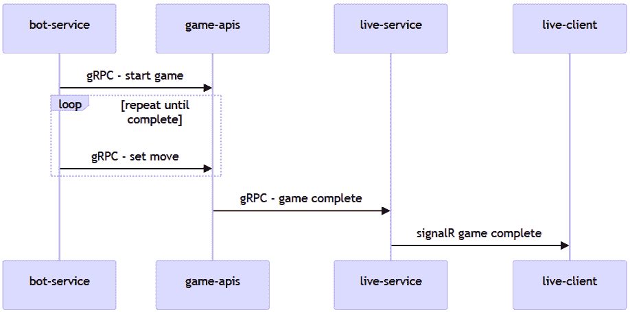
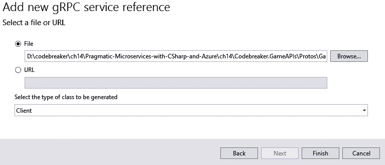

# 第十四章：gRPC 用于二进制通信

服务到服务的通信不需要通过 REST 传递 JSON 数据。当使用**gRPC**，一种二进制和平台无关的通信技术时，性能和成本是重要的考虑因素。减少传输的数据可以增加性能并降低成本。

在本章中，我们将更改 Codebreaker 解决方案中的某些服务，以便它们提供 gRPC 服务或 REST 服务。您将了解 gRPC 与 REST 的不同之处，以及如何使用这种二进制通信技术创建服务和客户端。

在本章中，您将学习以下内容：

+   配置服务项目以使用 gRPC

+   使用 Protobuf 创建平台无关的通信合约

+   创建 gRPC 服务

+   创建调用 gRPC 服务的客户端

# 技术要求

在本章中，就像前几章一样，您需要一个 Azure 订阅和 Docker Desktop。

本章的代码可以在本书的 GitHub 仓库中找到：[`github.com/PacktPublishing/Pragmatic-Microservices-with-CSharp-and-Azure/`](https://github.com/PacktPublishing/Pragmatic-Microservices-with-CSharp-and-Azure/)。

`ch14`文件夹包含本章中我们将要查看的项目及其结果。要添加本章的功能，您可以从上一章的源代码开始。

我们将要考虑的项目如下：

+   `Codebreaker.AppHost`: 这是.NET Aspire 宿主项目。应用模型已更新，使用 HTTPS 与`game-apis`服务和`live-service`一起使用，以支持 gRPC。

+   `Codebreaker.Live`: 我们在上一章中创建的项目已被修改，提供 gRPC 服务而不是 REST 服务。

+   `Codebreaker.GameAPIs`: 此项目已更新，包括一个用于调用`live-service`的 gRPC 客户端。除了许多不同客户端使用的 REST 服务外，还添加了一个作为替代方案的 gRPC 服务。这是由机器人服务调用的。

+   `Codebreaker.Bot`: 机器人服务已更新，使用 gRPC 客户端而不是 REST 来调用`game-apis`服务。

+   `LiveTestClient`: 您需要使用上一章中的实时测试客户端来验证 SignalR 服务。

在深入研究 gRPC 之前，让我们将其与**表示状态转移**（**REST**）进行比较。

# 比较 REST 与 gRPC

REST 与 gRPC 之间最重要的区别在于，REST 是一个基于 HTTP 的**指南**，而 gRPC 是一个**协议**。两者都用于客户端和服务之间的通信。让我们更深入地了解一下。

## 通信风格

REST 是一种定义服务为无状态的指南，使用 HTTP 动词（GET、POST、PUT、DELETE）来操作资源，通常使用如 JSON 或 XML 等人可读的格式，并且通常与 Web API 一起使用。

gRPC 使用一个**严格定义的合约**来指定服务中可用的操作。虽然也可以使用其他规范，但大多数服务都使用 **Protocol Buffers**（**Protobuf**）来指定合约。这样，gRPC 具有紧凑的有效负载大小和高效的序列化。

## 性能

当涉及到文本表示时，REST 有更高的开销和更高的延迟。gRPC 由于其高效的序列化，延迟较低，二进制序列化减少了有效负载的大小。gRPC 的多路复用允许在单个连接上进行并发请求。

## 灵活性

REST 通过使用 URI 作为资源来增加灵活性，并且不严格基于 HTTP 和 HTTPS。还可以使用其他满足 REST 原则的协议。

gRPC 严格指定了通信合约。gRPC 基于 HTTP/2，与 HTTP/1 相比，提供了一些优势，例如在单个连接上多路复用并发调用。gRPC-Web 是一个替代方案，允许使用 HTTP/1 使用 gRPC 的子集。

## 语言支持

REST 只需要 HTTP，并且与支持 HTTP 的任何语言一起工作。gRPC 基于 protobuf 合约创建代码，这需要使用受支持的语言。查看受支持语言的列表，请访问 [`grpc.io/docs/languages/`](https://grpc.io/docs/languages/)。它包括 C#、C++、Dart、Java、Go、Python、PHP 以及其他语言。

## 安全性

REST 依赖于传输安全（HTTPS）。身份验证和授权在应用层完成。gRPC 支持传输安全（TLS/SSL），并且内置了 OAuth 和 JWT 的身份验证。gRPC 支持按消息加密。

## 用例

REST 允许轻松互操作性。只需要进行 HTTP 调用。它与 Web API 和简单服务以及与现有服务的互操作性一起使用。

使用云服务时，我们为计算和内存资源付费。由于有很多通信进行，可以通过使用内存和 CPU 效率高的技术来减少所需的实例数量。服务之间的通信可以使用 gRPC 完成。

让我们先更新解决方案，使其能够使用 gRPC（日志收集器已经使用 gRPC）。

# 更新服务项目以使用 gRPC

当使用 .NET 模板创建新项目时，可以通过运行以下命令创建 gRPC 服务：

```cs
dotnet new grpc
```

当使用此类项目时，你可以检查项目文件以查看所需的 NuGet 包和其他配置。

由于我们已经有现有项目，我们将更新这些项目以提供 gRPC 服务。但首先，让我们看看 *图 14.1* 中所示的 Codebreaker 服务之间的通信：



图 14.1 – Codebreaker 通信技术

让我们从右侧开始。在 *第十三章* 中，我们使用 SignalR 集线器实现了 Codebreaker live 服务，该集线器通知 SignalR 客户端。对于 SignalR 客户端，我们创建了一个控制台客户端应用程序。同样，在 *第十三章* 中，我们使用了最小的 ASP.NET Core API，这使得我们可以调用 `game-apis` 服务来发送完成的游戏。这是一种服务到服务的通信方式，可以被 gRPC 替换。`game-apis` 服务本身被客户端和机器人服务调用。使用此服务，任何客户端技术都必须调用 REST API。机器人和 `game-apis` 服务之间的通信也可以使用 gRPC 完成。因此，当涉及到 `game-apis` 服务时，我们将提供一种替代的通信技术，以便替换 `game-apis` 服务和 `live-service` 之间的通信。因此，在本章中，我们将执行以下操作：

+   用 gRPC 替换 `live-service` 的最小 API 实现

+   为 `game-apis` 服务添加一个替代选项，以便我们提供 gRPC

+   使用 `game-apis` 服务实现一个 gRPC 客户端以调用 `live-service`

+   使用 `game-apis` 服务的客户端实现一个 gRPC 客户端

让我们从为 `live-service` 创建一个由 `game-apis` 服务调用的 gRPC 服务合约开始。

# 创建服务合约

首先，我们需要将 `Grpc.AspNetCore` NuGet 包添加到 `Codebreaker.Live` 项目中。然后，我们必须将一个 Protobuf 文件作为合约添加到服务中。合约文件是语言和平台无关的，因此一个 .NET 服务可以使用相同的 Protobuf 文件与 Dart 应用程序通信。

使用 Visual Studio，添加一个 `Protos` 文件夹，并使用 Visual Studio 模板创建一个 `Codebreaker.Live`，你可以在 `Protos` 文件夹内运行以下命令来创建 `LiveGame.proto` 文件：

```cs
dotnet new proto -o Protos -n LiveGame
```

现在，让我们为 `live-service` 和 `game-apis` 创建合约

## 为 `live-service` 创建一个 gRPC 服务合约

简单的合约是 `live-service` 的合约：

Codebreaker.Live/Protos/LiveGame.proto

```cs
syntax = "proto3";
option csharp_namespace = "Codebreaker.Live.Grpc";
package ReportGame;
import "google/protobuf/empty.proto";
import "google/protobuf/duration.proto";
import "google/protobuf/timestamp.proto";
service ReportGameService {
  rpc ReportGameCompleted (ReportGameCompletedRequest)
returns (google.protobuf.Empty);
}
message ReportGameCompletedRequest {
  string id = 1;
  string gameType = 2;
  string playerName = 3;
  bool isCompleted = 4;
  bool isVictory = 5;
  int32 numberMoves = 6;
  google.protobuf.Timestamp startTime = 7;
  google.protobuf.Duration duration = 8;
}
```

`syntax` 关键字指定了应该使用的 Protobuf 版本。版本 3 添加了 `maps` 和 `oneof` 字段等特性。`option` 关键字允许我们添加特定语言的功能。`option csharp_namespace` 设置了由生成的类使用的 C# 命名空间，后缀为 `package` 关键字设置的名称。`service` 关键字描述了 gRPC 服务提供的操作列表。服务中的每个操作都使用 `rpc` 关键字（远程过程调用）。在我们的代码中，操作被命名为 `ReportGameCompleted`，使用 `ReportGameCompletedRequest` 作为参数，并返回 `google.protobuf.Empty`。`google.protobuf.Empty` 是可用的已知 Protobuf 类型之一。当使用此类型时，必须使用 `import` 关键字导入。`google.protobuf.Duration` 和 `google.protobuf.Timestamp` 类型也被导入。`ReportGameCompletedRequest` 是使用 `message` 关键字指定的消息。消息中的每个字段都需要一个唯一的标识符。序列化和反序列化器使用这个数字来匹配。因此，如果你已经指定了一个合约，那么在未来的版本中不要更改这个数字，因为这会破坏现有的客户端或服务。使用的类型需要是平台无关的，因为相同的 Protobuf 文件可以被所有支持 gRPC 的平台使用。`string`、`bool` 和 `int32` 是由 Protobuf 规范定义的类型。在 .NET 中，这些类型分别映射到 `string`、`bool` 和 `int`。`Id` 是一个 GUID，但在 Protobuf 中没有 GUID 的表示。可以使用 `string` 作为标识符。在 .NET 的 `GameSummary` 类中，`StartTime` 属性是 `DateTime` 类型，而 `Duration` 属性是 `TimeSpan` 类型。要将这些类型与 Protobuf 映射，可以使用 `Timestamp` 和 `Duration`。这些类型在 `Google.Protobuf.WellKnownTypes` .NET 命名空间中定义。`Timestamp` 和 `Duration` 提供了将它们转换为 `DateTime` 和 `TimeSpan` 的转换方法。

要从 Protobuf 文件创建 .NET 类，需要在项目文件中添加一个 `Protobuf` 条目，如下所示：

Codebreaker.Live/Codebreaker.Live.csproj

```cs
<ItemGroup>
  <Protobuf Include="Protos\LiveGame.proto"
    GrpcServices="Server" />
</ItemGroup>
```

这个 `Protobuf` 条目通过 `Include` 属性引用了 Protobuf 文件，并通过将 `GrpcServices` 设置为 `Server` 来指定为服务器生成的代码。有了服务器，就会生成所有定义的消息的类以及每个服务指定的基类的类。在本章的后面部分，我们将使用 `Protobuf` 元素来生成客户端的类。

在上一章中，我们创建了 `GameSummary` 类来报告游戏完成情况。要将这个类转换为 gRPC 生成的 `ReportGameCompletedRequest` 类，我们必须定义一个转换方法：

Codebreaker.Live/Extensions/ReportGameCompletedRequestExtensions.cs

```cs
public static class ReportGameCompletedRequestExtensions
{
  public static GameSummary ToGameSummary(
    this ReportGameCompletedRequest request)
  {
    Guid id = Guid.Parse(request.Id);
    DateTime startTime = request.StartTime.ToDateTime();
    TimeSpan duration = request.Duration.ToTimeSpan();
    return new GameSummary(
      id,
      request.GameType,
      request.PlayerName,
      request.IsComleted,
      request.IsVictory,
      request.NumberMoves,
      startTime,
      duration);
  }
}
```

在这个实现中，我们创建一个新的`GameSummary`实例并使用转换方法——例如，我们将字符串解析为`Guid`值，并调用`ToDateTime`和`ToTimeSpan`方法来转换`Timestamp`和`Duration`值。

注意

要在 Visual Studio 中查看生成的代码，请单击`ReportGameCompletedRequest`类，使用上下文菜单并选择**转到实现**。这会直接打开生成的代码。

使用`ReportGameService`，我们只有一个非常简单的合同。为了允许`game-apis`被调用并且移动可以通过机器人服务进行，我们需要一个更复杂的合同。

## 为 game-apis 服务创建 gRPC 服务合同

`game-apis`服务的 gRPC 合同比`live-service`的合同更长。在这里，我们将关注合同的一些特定部分。查看本书的 GitHub 存储库以获取完整的定义。

服务合同指定了玩游戏的操作：

Codebreaker.GameAPIs/Protos/GameService.proto

```cs
syntax = "proto3";
option csharp_namespace = "Codebreaker.Grpc";
package GamesAPI;
import "google/protobuf/duration.proto";
import "google/protobuf/timestamp.proto";
service GrpcGame {
  rpc CreateGame(CreateGameRequest)
    returns (CreateGameResponse);
  rpc SetMove(SetMoveRequest) returns (SetMoveResponse);
  rpc GetGame(GetGameRequest) returns (GetGameResponse);
}
// code removed for brevity
```

作为 REST 接口的替代选项，`GrpcGameService`定义了创建游戏（`CreateGame`）、设置移动（`SetMove`）和获取游戏信息（`GetGame`）的操作。

大多数用于向服务发送请求的消息仅包含标量值。`SetMoveRequest`消息是不同的。此消息包含了一个猜测销钉的列表：

Codebreaker.GameAPIs/Protos/GameService.proto

```cs
message SetMoveRequest {
  string id = 1;
  string gameType = 2;
  int32 moveNumber = 3;
  bool end = 4;
  repeated string guessPegs = 5;
}
```

列表使用`repeated`关键字指定。

不仅预定义的类型可以重复，还可以重复内部消息类型：

Codebreaker.GameAPIs/Protos/GameService.proto

```cs
message GetGameResponse {
  string id = 1;
  string gameType = 2;
  string playerName = 3;
  // code removed for brevity
  repeated Move moves = 14;
}
message Move {
  string id = 1;
  int32 moveNumber = 2;
  repeated string guessPegs = 3;
  repeated string keyPegs = 4;
}
```

`GetGameResponse`消息类型包含了一个`Move`消息的重复列表。`Move`消息类型包含了一个字符串列表，用于猜测的销钉和键销钉。

Protobuf 还通过`map`类型定义了一个键和值的列表：

Codebreaker.GameAPIs/Protos/GameService.proto

```cs
message FieldNames {
  repeated string values = 1;
}
message CreateGameResponse {
  string id = 1;
  string gameType = 2;
  string playerName = 3;
  int32 numberCodes = 4;
  int32 maxMoves = 5;
  map<string, FieldNames> fieldValues = 6;
}
```

使用地图时，指定了键和值类型。`fieldValues`字段中，键是一个字符串。相应的 REST API 指定了一个字符串数组作为值。在 Protobuf 中，使用`repeated`关键字与值类型是不可能的。相反，定义了`FieldMessage`来包含一个`repeated string`，并且这个用于`map`值。

消息合同创建了特定于 gRPC 的.NET 类。当涉及到本地服务类时，最好它们与通信技术无关。因此，我们需要创建转换方法。

## 创建转换方法

`live-service`的 gRPC 服务接收`ReportGameCompletedRequest`。这被转发到我们在上一章中创建的 SignalR 服务作为`GameSummary`方法。因此，我们需要将`ReportGameCompletedRequest`转换为`GameSummary`方法：

Codebreaker.Live/Extensions/GrpcExtensions.cs

```cs
internal static class GrpcExtensions
{
  public static GameSummary ToGameSummary(
    this ReportGameCompletedRequest request)
  {
    Guid id = Guid.Parse(request.Id);
    DateTime startTime = request.StartTime.ToDateTime();
    TimeSpan duration = request.Duration.ToTimeSpan();
    return new GameSummary(
      id,
      request.GameType,
      request.PlayerName,
      request.IsCompleted,
      request.IsVictory,
      request.NumberMoves,
      startTime,
      duration);
  }
}
```

这是以扩展方法的形式完成的，我们扩展了`ReportGameCompletedRequest`类型。通过实现`ToGameSummary`方法，可以传递简单的标量类型，创建一个`GameSummary`对象。Google 的`Timestamp`和`Duration`类型提供了`ToDateTime`和`ToTimeSpan`方法来转换`DateTime`和`TimeSpan`。

注意

可以使用如`AutoMapper`、`Mapster`等库来自动实现此类转换。虽然这对于简单的属性来说开箱即用，无需添加自定义代码，但在转换不同类型时可能需要一些定制。需要注意的是，使用.NET 反射而不是源生成器的映射库会增加内存和 CPU 使用，并且不能与原生 AOT 一起使用。根据您需要映射的类型，您可能更喜欢自定义扩展方法。

查阅本书的 GitHub 仓库以获取可用于`game-apis`服务的其他转换方法。

在转换方法就绪后，让我们创建 gRPC 服务的实现。

# 创建 gRPC 服务

要为`Codebreaker.Live`项目实现一个 gRPC 服务，创建`GRPCLiveGameService`类：

Codebreaker.Live/Endpoints/GRPCLiveGameService.cs

```cs
using Codebreaker.Grpc;
using Google.Protobuf.WellKnownTypes;
using Grpc.Core;
namespace Codebreaker.Live.Endpoints;
public class GRPCLiveGameService(
  IHubContext<LiveHub> hubContext,
  ILogger<LiveGameService> logger) :
    ReportGame.ReportGameBase
{
  async public override Task<Empty> ReportGameCompleted(
    ReportGameCompletedRequest request,
    ServerCallContext context)
  {
    logger.LogInformation("Received game ended {type} " +
      "{gameid}", request.GameType, request.Id);
    await hubContext.Clients.Group(request.GameType)
      .SendAsync("GameCompleted", request.ToGameSummary());
    return new Empty();
  }
}
```

使用`GRPCLiveGameService`类，通过构造函数注入，将我们在上一章中创建的 hub 上下文注入到发送`GameSummary`方法到所有连接的客户端中，这些客户端参与名为`game-type`的组。`GRPCLiveGameService`类需要从基类派生——即`ReportGame.ReportGameBase`。`ReportGameBase`是基于 Protobuf 合约实现的`ReportGame`的内部类。

接下来，使用`GRPCLiveGameService`类将其映射为 gRPC 端点：

Codebreaker.Live/ApplicationServices.cs

```cs
public static WebApplication MapApplicationEndpoints(this WebApplication app)
{
  app.MapGrpcService<GRPCLiveGameService>();
  app.MapHub<LiveHub>("/livesubscribe");
  return app;
 }
```

您可以移除最小 API 端点的映射，只需使用名为`MapGrpcService`的`WebApplication`类配置 gRPC 端点，并将服务类作为泛型参数传递。

gRPC 需要 HTTP/2。因此，我们需要配置`Kestrel`服务器：

Codebreaker.Live/appsettings.json

```cs
{
  "Kestrel": {
    "EndpointDefaults": {
      "Protocols": "Http1And2"
    }
  }
}
```

将`Protocols`配置为`Http1And2`将启动`Kestrel`服务器并确保它支持 HTTP/1 和 HTTP/2。gRPC 服务需要 HTTP/2。对于`live-service`，同一服务器提供了 SignalR。为了允许 SignalR 服务通过 HTTP/1 或 HTTP/2 连接，服务器必须配置为提供这两种版本。

`game-apis`服务的实现有相似之处。在项目文件中，我们需要添加`Grpc.AspNetCore`包，向项目文件添加一个`Protobuf`元素，并指定我们希望为服务器创建类：

实现 gRPC 服务的这一方面很简单：我们可以注入`IGameService`接口。这使用了我们之前用来实现最小 API 服务的相同类：

Codebreaker.GameAPIs/GrpcGameEndpoints.cs

```cs
public class GrpcGameEndpoints(
  IGamesService gamesService,
  ILogger<GrpcGameEndpoints> logger) :
  Grpc.GrpcGame.GrpcGameBase
{
  public override async
    Task<Grpc.CreateGameResponse> CreateGame(
    Grpc.CreateGameRequest request,
    ServerCallContext context)
  {
    logger.GameStart(request.GameType);
    Game game = await gamesService.StartGameAsync(
      request.GameType, request.PlayerName);
    return game.ToGrpcCreateGameResponse();
  }
  public override async Task<SetMoveResponse> SetMove(
    SetMoveRequest request, ServerCallContext context)
  {
    Guid id = Guid.Parse(request.Id);
    string[] guesses = request.GuessPegs.ToArray();
    (Game game, Models.Move move) =
      await gamesService.SetMoveAsync(
        id, request.GameType, guesses, request.MoveNumber);
    return game.ToGrpcSetMoveResponse(move);
  }
  public override async Task<GetGameResponse> GetGame(
    GetGameRequest request, ServerCallContext context)
  {
    Guid id = Guid.Parse(request.Id);
    Game? game = await gamesService.GetGameAsync(id);
    if (game is null)
      return new GetGameResponse()
      {
        Id = Guid.Empty.ToString()
      };
    return game.ToGrpcGetGameResponse();
  }
}
```

在 gRPC 中，我们可以从生成的基类 `GrpcGame.GrpcGameBase` 继承，并覆盖由服务合同指定的基类方法，并使用转换方法将输入和输出类型转换为相应的 gRPC 表示形式。

与 `live-service` 类似，`game-apis` 服务需要将 gRPC 添加到 DI 容器并映射到端点，并且需要配置 `Kestrel` 以支持 HTTP/1 和 HTTP/2。

在实现了服务后，让我们考虑 gRPC 客户端。

# 创建 gRPC 客户端

如果你使用的是 Visual Studio 2022，可以利用其内置支持添加 gRPC 客户端。从解决方案资源管理器中选择项目，打开上下文菜单，然后选择 **添加** | **连接服务**。这会打开 *图 14.2* 所示的对话框：


图 14.2 – 添加服务引用

选择 **gRPC** 并点击 **下一步**。这会打开 *图 14.3* 所示的对话框：



图 14.3 – 添加新的 gRPC 服务引用

选择 Protobuf 文件，然后从 **选择要生成的类的类型** 下拉菜单中选择 **Client** 以创建消息类和客户端代码。

如果你没有使用 Visual Studio，可以使用名为 `dotnet` 的 .NET 命令行工具。要安装此工具，请运行以下命令：

```cs
dotnet tool install -g dotnet-grpc
```

在全局安装了此工具后，可以使用 `dotnet-grpc` 命令为 `game-apis` 客户端创建代理类：

```cs
cd Codebreaker.GameAPIs
dotnet-grpc add-file ..\Codebreaker.Live\Protos\LiveGame.proto
```

对于机器人服务客户端，你可以运行以下命令：

```cs
cd ..
cd Codebreaker.Bot
dotnet-grpc add-file ..\Codebreaker.GameAPIs\Protos\GameService.proto
```

这些命令或 Visual Studio 集成发生了什么？

+   项目中添加了 `Grpc.AspNetCore` NuGet 包

+   项目文件中添加了一个 `Protobuf` 元素

使用命令行工具，当创建 `Protobuf` 条目时，会创建客户端和服务器端的代码。如果要仅创建客户端代码，需要添加 `GrpcServices="Client"` 属性：

Codebreaker.GameAPis/Codebreaker.GameAPIs.csproj

```cs
<ItemGroup>
  <Protobuf
    Include="..\Codebreaker.Live\Protos\LiveGame.proto"
    GrpcServices="Client" />
  <Protobuf Include=".\Protos\GameService.proto" GrpcServices="Server" />
</ItemGroup>
```

关于 `game-apis` 服务，项目文件现在包括两个 `Protobuf` 条目。一个用于创建服务部分（我们在上一节中已执行），而新的条目用于客户端代码。

机器人调用 `game-apis` 服务。因此，需要在机器人项目文件中引用 `game-apis` 服务的 proto 文件：

Codebreaker.Bot/Codebreaker.Bot.csproj

```cs
<ItemGroup>
  <Protobuf Include=
    "..\Codebreaker.GameApis\Protos\GameService.proto"
    GrpcServices="Client" />
</ItemGroup>
```

再次强调，对于客户端，`GrpcServices` 设置为 `Client`。

在使用 proto 文件时，会创建客户端代理类，提供使用操作名称调用服务的方法。这些代理类可以被注入。在下面的代码片段中，正在将生成的 `ReportGameClient` 类注入到 `GrpcLiveReportClient` 类中：

Codebreaker.GameApis/GrpcLiveReportClient.cs

```cs
public class GrpcLiveReportClient(
  ReportGame.ReportGameClient client,
  ILogger<LiveReportClient> logger) : ILiveReportClient
{
  public async Task ReportGameEndedAsync(GameSummary gameSummary, 
    CancellationToken cancellationToken = default)
  {
    try
    {
      ReportGameCompletedRequest request = gameSummary.
        ToReportGameCompletedRequest();
      await client.ReportGameCompletedAsync(request);
    }
    catch (Exception ex) when (ex is RpcException or
      SocketException)
    {
      logger.ErrorWritingGameCompletedEvent(
        gameSummary.Id, ex);
    }
  }
}
```

`ReportGameClient` 实现了 `ILiveReportClient` 接口——这是我们之前章节中定义和实现的相同接口，用于在游戏完成后调用 SignalR 服务。在实现相同接口时，我们只需更改 DI 容器的配置，以便通过 gRPC 而不是使用 REST 接口调用服务。通过实现 `ReportGameEndedAsync` 方法，我们可以从代理调用生成的方法，并需要使用扩展方法帮助转换参数：

Codebreaker.GameApis/ApplicationServices.cs

```cs
builder.Services.AddSingleton<ILiveReportClient,
  GrpcLiveReportClient>()
  .AddGrpcClient<ReportGame.ReportGameClient>(
    grpcClient =>
    {
      grpcClient.Address = new Uri("https://live");
    });
// code removed for brevity
```

类似地，对于机器人服务，`GrpcGamesClient` 实现了 `IGamesClient` 接口并注入了 `GrpcGame.GrpcGameClient`：

Codebreaker.Bot/GrpcGamesClient.cs

```cs
public class GrpcGamesClient(
  GrpcGame.GrpcGameClient client,
  ILogger<GrpcGamesClient> logger) : IGamesClient
{
  // code removed for brevity
  public async Task<(string[] Results, bool Ended,
    bool IsVictory)> SetMoveAsync(
    Guid id, string playerName, GameType gameType,
    int moveNumber, string[] guessPegs,
    CancellationToken cancellationToken = default)
  {
    SetMoveRequest request = new()
    {
      Id = id.ToString(),
      GameType = gameType.ToString(),
      MoveNumber = moveNumber,
      End = false
    };
    request.GuessPegs.AddRange(guessPegs);
    var response = await client.SetMoveAsync(request,
      cancellationToken: cancellationToken);
    return (response.Results.ToArray(), response.Ended,
      response.IsVictory);
  }
```

`IGamesClient` 接口与 `GameClient` 实现的相同，它调用 REST API。此接口被注入到 `CodebreakerGameRunner` 中，因此在切换到 gRPC 时不需要进行任何更改。

`SetMoveAsync` 方法通过调用 `GrpcGame.GrpcGameClient` 的 `SetMoveAsync` 方法向 gRPC 服务发出请求。与之前类似，它的目的是将参数转换为 gRPC 所需的参数。

如需了解接口其他方法的实现，请参阅本书的 GitHub 仓库。请注意，它与之前所做的工作类似。

为了将 `IGamesClient` 连接到新的实现，并配置 gRPC 客户端，我们需要更新 DI 容器配置：

Codebreaker.Bot/ApplicationServices.cs

```cs
builder.Services.AddSingleton<IGamesClient,
GrpcGamesClient>()
  .AddGrpcClient<GrpcGame.GrpcGameClient>(client) =>
  {
    client.Address = new Uri("https://gameapis");
  });
```

`AddGrpcClient` 方法配置生成的类以使用 `game-apis` 服务的地址。

现在，运行应用程序并启动一个或多个实时测试客户端实例，以查看是否显示已完成的游戏。启动机器人服务并向机器人服务发送请求以玩几场游戏。同时，使用另一个客户端玩游戏。机器人运行多少场游戏你才完成一场？当然，这取决于你为机器人配置的思考时间。结果是否显示在实时测试客户端的控制台中？检查日志和 .NET Aspire 仪表板中不同服务的环境变量。

# 摘要

在本章中，你学习了 REST API 和 gRPC 之间的区别，以及在使用 gRPC 进行服务间通信时的优势。

你使用 Protobuf 语法创建了一个服务合同，以定义服务和消息。与 REST 相比，gRPC 在消息和服务操作方面非常严格。你使用由 proto 文件生成的类创建了服务器和客户端。

为了在云中降低成本，使用较低开销的协议进行服务间通信可能是经济有效的。然而，还有其他选项可供选择。游戏完成后，无需立即通知听众。这也涉及到一个价格方面：根据当前实现，当从游戏 API 服务访问时，实时服务正在运行。如果没有人在监听，这就不需要了。通过使用异步通信，`live-service`可以在启动时注册接收信息——这是当有听众活跃时。异步通信将在下一章中介绍。

# 进一步阅读

要了解更多关于本章讨论的主题，请参考以下链接：

+   Protobuf 语言指南：[`protobuf.dev/programming-guides/proto3/`](https://protobuf.dev/programming-guides/proto3/)

+   在 .NET 支持的平台上的 gRPC：[`learn.microsoft.com/en-us/aspnet/core/grpc/supported-platforms`](https://learn.microsoft.com/en-us/aspnet/core/grpc/supported-platforms)

+   *grpc-dotnet GitHub* 存储库：[`github.com/grpc/grpc-dotnet`](https://github.com/grpc/grpc-dotnet)

+   使用 .NET 客户端调用 gRPC 服务：[`learn.microsoft.com/en-us/aspnet/core/grpc/client`](https://learn.microsoft.com/en-us/aspnet/core/grpc/client)
