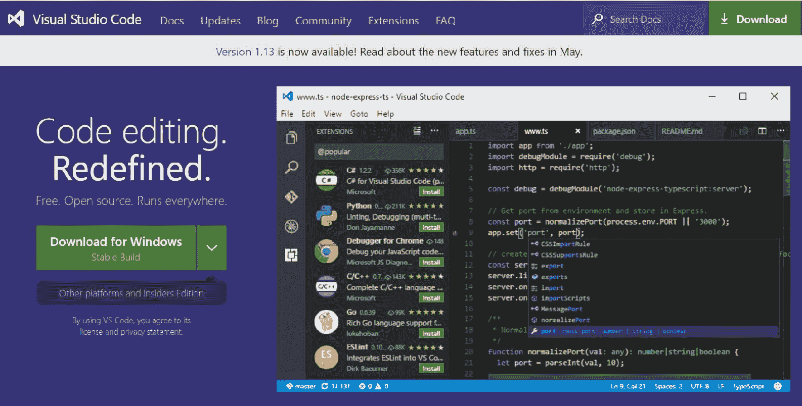
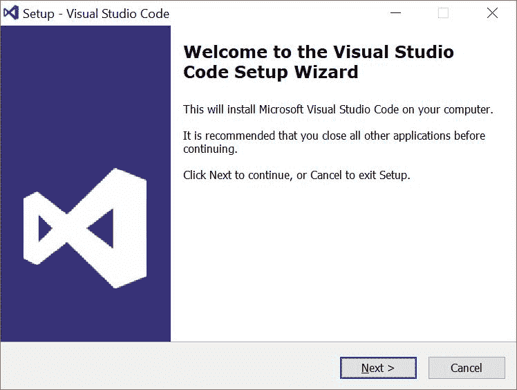
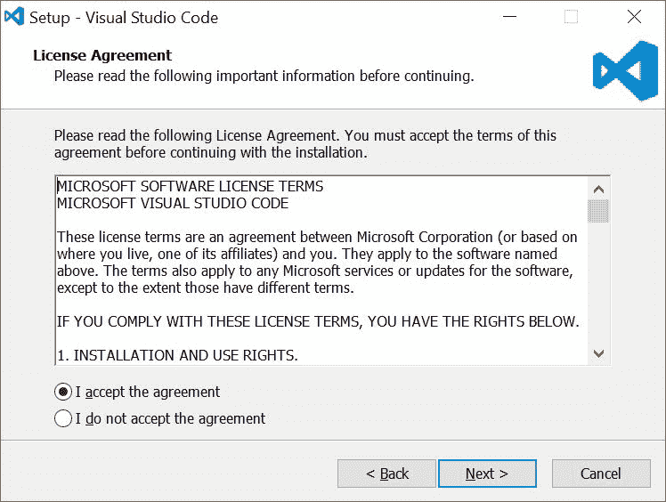
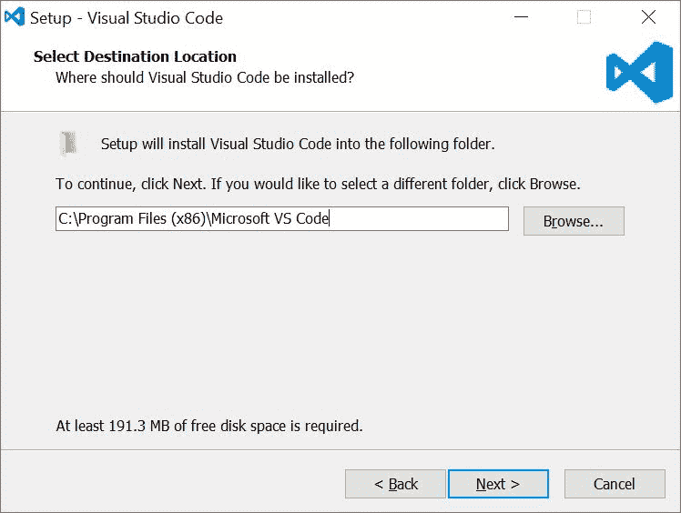
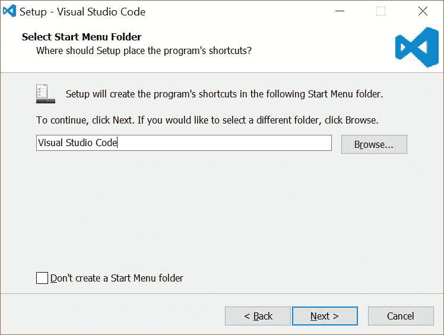
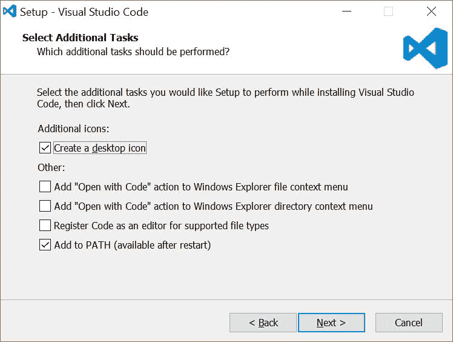
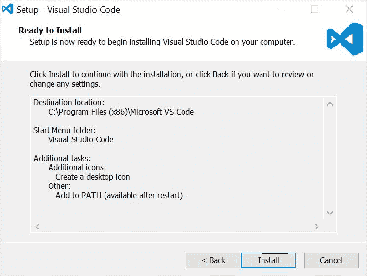
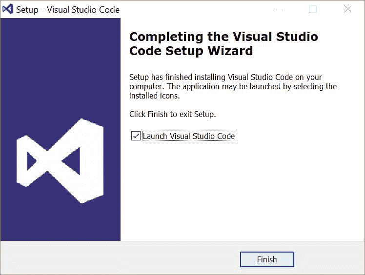
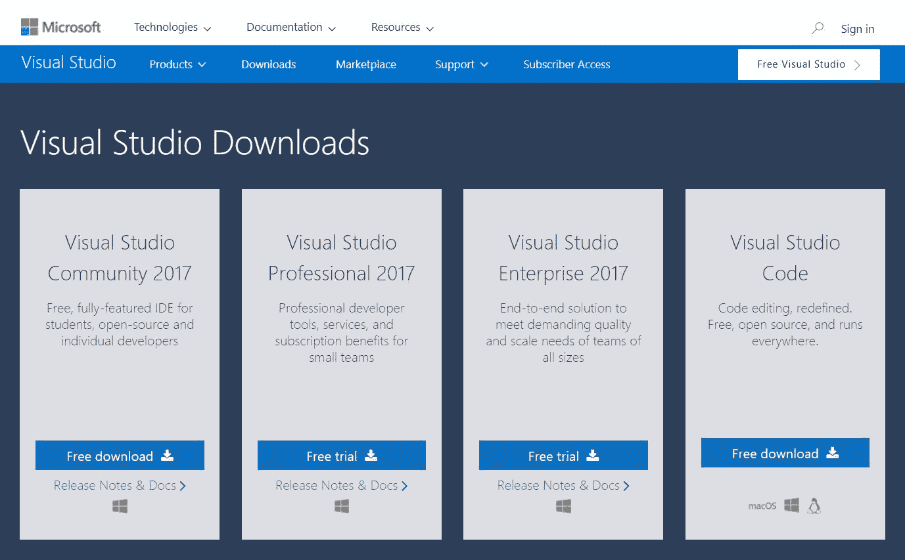

# 第二章：设置 .NET 测试环境

在本章中，我们将探讨设置你的开发环境。我们将涵盖 C# 和 .NET。在下一章中，我们将专注于设置 JavaScript 和 React 环境。我们将从经典的 *FizzBuzz* 代码练习开始，然后深入到 *Speaker Meet* 网站的实际示例。

在本章中，你将了解以下内容：

+   安装你的 IDE

+   如何设置你的测试框架

+   在 C# 中编写你的第一个测试

# 安装 .NET Core SDK

在开始开发环境之前，你需要安装 .NET Core SDK。你需要导航到微软网站上的 .NET Core 下载页面（[`www.microsoft.com/net/download/core`](https://www.microsoft.com/net/download/core)）。选择适合你系统的正确安装程序。对于 Windows 计算机，推荐下载 `.exe` 文件。

按照安装向导的屏幕说明安装 .NET Core SDK。

# 使用 VS Code 设置环境

选择 VS Code 作为你的开发工具的一个好处是，它是一个优秀的 IDE，适用于 .NET 和 JavaScript。要开始使用 VS Code，你必须首先下载这个 IDE。

# 下载 IDE

访问 VS Code 网站（[`code.visualstudio.com/`](https://code.visualstudio.com/)）并选择适合你操作系统的版本：



# 安装 VS Code

按照向导中的说明安装 VS Code：



一定要阅读并接受许可协议：



在你的硬盘上选择一个位置来安装 VS Code。默认路径通常是可接受的：



选择为应用程序创建开始菜单文件夹，选择位置，或者选择不创建开始菜单文件夹：



选择额外的任务。默认设置应该适合我们的目的，如以下截图所示：



检查你的安装设置并点击安装：



安装完成后，你可以启动应用程序：



# 添加扩展

VS Code 是一个相对轻量级且基础简单的 IDE。要开始使用，你需要安装 C#。当你第一次启动 VS Code 时，你的浏览器应该会打开 VS Code 网站上的入门页面。如果没有，现在就去那里（[`code.visualstudio.com/docs`](https://code.visualstudio.com/docs)）。

你可以从市场安装各种有用的扩展。目前，你只需要 C#。在撰写本文时，C# 列在顶级扩展列表的顶部。点击 C# 磁贴（或通过市场搜索）了解更多关于这个扩展的信息。

你应该会看到安装说明会指导你启动 VS Code 快速打开（*Ctrl*-*P*）并粘贴以下命令：

```cs
ext install csharp
```

在 VS Code 内部，将命令粘贴到快速打开部分并按*Enter*键。找到由 OmniSharp 提供的 C#版本并选择安装。一旦 C#扩展被安装，你需要重新加载 VS Code 以激活 C#扩展（选择重新加载）。

# 在 VS Code 中创建项目

现在你的 VS Code IDE 已经正确安装，并且 C#扩展已启用，你就可以创建你的第一个项目了。

在 VS Code 打开的情况下，从文件菜单中选择“打开文件夹”。选择一个易于访问的位置。许多开发者会在驱动器的根目录下创建一个`Development`文件夹。无论你习惯使用什么约定，都可以。你现在需要创建一个*MSTest*项目。

创建一个名为`Sample`的新文件夹。从视图菜单或使用快捷键（*Ctrl* + *`*）打开集成终端窗口。在终端窗口内部，输入`dotnet new mstest`并按*Enter*键。现在，你需要通过在终端窗口中输入`dotnet restore`并按*Enter*键来恢复你的包。

现在，你应该在`Sample`文件夹中看到一个名为`UnitTest1.cs`的文件。如果你打开该文件，它应该看起来像这样：

```cs
using Microsoft.VisualStudio.TestTools.UnitTesting;

namespace Sample
{
  [TestClass]
  public class UnitTest1
  {
    [TestMethod]
    public void TestMethod1()
    {
    }
  }
}
```

将第一个测试方法更改为`ItExists`测试。通过将名称更改为`ItExists`并尝试声明一个尚未存在的类的实例来完成此操作：

```cs
var sampleClass = new SampleClass();
```

你应该会看到你的示例应用程序无法编译，并且你已经收到了错误消息：“找不到类型或命名空间'SampleClass'（你是否遗漏了 using 指令或程序集引用？）”

现在你已经有一个测试失败（记住，编译失败在这个例子中也被视为失败的测试），可以安全地继续到我们的*红、绿、重构*循环中的*绿*步骤。通过为`SampleClas*s*`创建一个定义来使测试通过。你可以自由地将类创建在包含你的单元测试的同一文件中，以便开始。这始终可以在稍后提取并移动到更合适的位置：

```cs
public class SampleClass
{
}
```

现在你已经做了更改，运行`test`命令`dotnet test`并查看结果：

```cs
Total tests: 1\. Passed: 1\. Failed: 0\. Skipped: 0.
```

继续探索 VS Code 并通过测试扩展你的新类。本书其余部分的所有 C#和.NET 示例都将使用 Visual Studio Community。如果你愿意，你也可以选择继续使用 VS Code。

# 设置 Visual Studio Community

大多数 C#和.NET 开发者都会熟悉 Visual Studio。它有多种版本可供选择，从免费版到每年数千美元不等。截至本文撰写时，企业版是最全面的功能版本，提供了测试和测试的一些最佳功能。为了我们的目的，我们将使用 Visual Studio Community。这是一个免费且功能齐全的开发环境，应该非常适合我们。

社区版确实有一些非常重要的注意事项。根据许可协议的条款，软件许可和社区版的用途存在一些限制。请在决定使用 Visual Studio 社区版开发您打算出售的软件之前，务必阅读这些条款。当前条款可以在[`www.visualstudio.com/license-terms/mlt553321/`](https://www.visualstudio.com/license-terms/mlt553321/)找到。

# 下载 Visual Studio Community

要开始使用，请下载 Visual Studio Community ([`www.visualstudio.com/downloads/`](https://www.visualstudio.com/downloads/))。您可以在那里自由探索和比较不同版本的 Visual Studio：



# 安装 Visual Studio Community

安装 Visual Studio Community 的向导与 VS Code 的安装向导略有不同。当然，要开始使用，您需要阅读并同意许可协议。

至少，如果您打算按照本书的内容进行，您将想要选择 ASP.NET 和 Web 开发以及 .NET Core 跨平台开发。我们还在右侧面板或“单个组件”标签*中选择了 ASP.NET MVC 4、.NET Framework 4.6.2 开发工具和 .NET Framework 4.7 开发工具。您可能还想探索其他组件和/或语言包。

# 切换到 xUnit

MSTest 早已与 Visual Studio 一起发货。在 C# 和 .NET 的测试框架方面，还有一些其他选择。许多这些框架具有功能一致性，只是在属性、断言和异常处理的选择上略有不同。在测试框架的顶级竞争者中，xUnit 是其中之一。许多开发者实际上更喜欢它，并会争论说它功能更丰富，社区支持更强。不论争论如何，从现在开始，我们将使用 xUnit 进行我们的 C# 和 .NET 测试。

如果您更喜欢 MSTest，请随意。只需知道您需要考虑语义差异（例如 *TestMethod* 与 *Fact*）和功能上的细微差异。

# 代码 kata

什么是代码 kata？代码 kata 仅仅是可重复的练习。通常，这些练习的完成时间不超过 20 分钟。大多数代码 kata 都针对解决特定分类的问题。我们将利用经典的 FizzBuzz 示例，作为让您更熟悉使用 xUnit 进行 TDD 的方式。

# FizzBuzz

FizzBuzz 的规则相当简单。如果提供的数字能被 3 整除，那么您必须返回 `Fizz`。如果提供的数字能被 5 整除，那么您必须返回 `Buzz`。如果数字能同时被 3 和 5 整除，那么您必须返回 `FizzBuzz`。如果它既不能被 3 也不能被 5 整除，那么只需返回该数字本身。

解决这个问题的选项有很多。几乎在每种编程语言中都可以以不同的方式解决。这里重要的是练习简单有效地解决问题的技巧。

让我们开始吧。

# 创建测试项目

在 Visual Studio Community 中，通过选择文件菜单中的新建 | 项目或使用快捷键 (*Ctrl* - *Shift* - *N*) 来创建一个 xUnit 测试项目。在 .NET Core 下，选择 xUnit 测试项目。给你的项目命名为 `CodeKata` 并点击确定。你会看到一个名为 `UnitTest1.cs` 的文件名。这个文件可以让你开始。让我们创建我们的第一个测试。

# Given3ThenFizz 测试

`UnitTest1.cs` 文件中的第一个测试方法是 `Test1`。让我们将这个方法的名称更改为 `Given3ThenFizz` 并编写我们的第一个测试：

```cs
[Fact]
public void Given3ThenFizz()
{
  // Arrange
  // Act
  var result = FizzBuzz(3);

  // Assert 
  Assert.Equal("Fizz", result);
}
```

注意，`Fact` 属性和 `Assert.Equal` 断言与我们之前 MSTest 的例子只有细微的差别。我们保留 `Arrange`*、* `Act`*、* 和 `Assert` 注释，并建议你也这样做。这些注释将帮助你开始，同时也会帮助未来的开发者理解这个过程。

现在，通过选择测试菜单中的运行 | 所有测试，或使用快捷键 (*Ctrl* + *R*, *A*) 来运行测试，看看它是否通过。你应该看到一个编译错误。让我们通过在 `test` 类之前创建一个 `FizzBuzz` 方法来解决这个错误。一旦你创建了 `FizzBuzz` 方法，重新运行你的测试以查看它是否通过。记住，根据 TDD 的第三定律，你应该只编写足够多的代码来让它通过：

```cs
private object FizzBuzz(int value)
{
  return "Fizz";
}
```

# Given5ThenBuzz 测试

我们接下来的要求是，当提供 5 时必须返回 `Buzz`。让我们写这个测试：

```cs
[Fact]
public void Given5ThenBuzz()
{
  // Arrange
  // Act
  var result = FizzBuzz(5);

  // Assert
  Assert.Equal("Buzz", result);
}
```

我们如何让这个测试通过？或许是一个简单的三元运算符？让我们看看它可能的样子：

```cs
private object FizzBuzz(int value)
{
  return value == 3 ? "Fizz" : "Buzz";
}
```

你可能已经看到了我们算法的问题。没关系！我们还没有完成。我们只走到了测试引导我们的地方，到目前为止，我们通过了所有的测试。让我们继续到下一个最有趣的测试。

# Given15ThenFizzBuzz 测试

你可能想写一个名为 `GivenDivisibleBy3and5ThenFizzBuzz` 的测试方法，但在这个阶段这可能是一个太大的跳跃。我们知道第一个能被 3 和 5 整除的数是 15，所以从这一点开始可能更有意义：

```cs
[Fact]
public void Given15ThenFizzBuzz()
{
  // Arrange  
  // Act
  var result = FizzBuzz(15);

  // Assert
  Assert.Equal("FizzBuzz", result);
}
```

你会如何选择让这个测试通过？你会使用一个 *if/else* 语句吗？或许是一个 *switch* 语句？我们将把这个留作读者的练习。请随意以你舒适的方式实现这个测试通过。记住，在过程中运行你的测试以确保你没有引入破坏性的更改。如果你确实遇到了测试失败，请随意忽略一个测试（MSTest 中的 *Ignore* 属性，xUnit 中的 *Skip* 参数），但只忽略一个测试，同时你修复错误。

# Given1Then1 测试

我们已经涵盖了`Fizz`。我们已经涵盖了`Buzz`。而且，我们已经涵盖了`FizzBuzz`。现在我们必须考虑既不能被 3 也不能被 5 整除的数字。记住，如果数字既不能被 3 也不能被 5 整除，我们只需返回提供的数字。让我们看看这个测试：

```cs
[Fact]
public void Given1Then1()
{
  // Arrange
  // Act 
  var result = FizzBuzz(1);

  // Assert 
  Assert.Equal(1, result);
}
```

# 理论

这太棒了！一切都在顺利进行。希望你现在开始逐渐掌握测试驱动开发。现在，让我们看看使用`Theory`和`InlineData`属性的一个稍微高级一点的测试方法。

回顾我们的测试，我们看到我们有一个名为`Given15ThenFizzBuzz`的`test`方法。虽然这很好，但它太具体了。记住，我们的要求是，如果数字能被 3 和 5 整除，那么我们应该返回`FizzBuzz`。让我们通过编写一个新的测试来确保我们没有在逻辑上迈出太大的步子。这次，我们将提供一系列值，期望得到相同的结果：

```cs
[Theory]
[InlineData(0)]
[InlineData(15)]
[InlineData(30)]
[InlineData(45)]
public void GivenDivisibleBy3And5ThenFizzBuzz(int number)
{
  // Arrange
  // Act
  var result = FizzBuzz(number);

  // Assert
  Assert.Equal("FizzBuzz", result);
}
```

当你运行测试套件时，你现在应该会看到四个新的通过测试结果。如果你确实遇到了失败，测试资源管理器窗口中的结果面板应该会提供关于哪个测试失败的详细解释。

现在，通过创建两个使用`Theories`和`InlineData`的更多测试用例，对`Fizz`和`Buzz`做同样的事情。继续添加`GivenDivisibleBy3ThenFizz`、`GivenDivisibleBy5ThenBuzz`和`GivenNotDivisibleBy3or5ThenNumber`。确保在添加每个测试和`InlineData`值后运行你的测试套件，并在过程中修复任何失败。

# FizzBuzz 问题的解决方案

我们想出来的东西看起来像这样：

```cs
private object FizzBuzz(int value)
{
  if (value % 15 == 0)
    return "FizzBuzz";

  if (value % 5 == 0)
    return "Buzz";

  if (value % 3 == 0)
    return "Fizz";

  return value;
}
```

如果您选择用不同的方式解决这个问题，请不要担心。重要的是，您在这个练习中获得了知识和理解。此外，您现在有一套全面的测试，并且您对重构和/或添加功能感到舒适。

# 什么是演讲者见面？

我们正在使用*演讲者见面*应用程序作为测试驱动开发的案例研究。演讲者见面是一个致力于连接技术演讲者、用户组和会议的网站。任何帮助组织用户组或技术会议的人都知道，通常很难找到演讲者。而对于技术演讲者来说，在您的直接区域外协调演讲活动通常也很困难。演讲者见面帮助将技术演讲者和社区聚集在一起。

在撰写本文时，应用程序仍在开发中，但它是一个探索测试驱动开发概念和原则的绝佳平台，这些概念和原则与实际应用相关。演讲者见面会由.NET 中的 RESTful API 和一个使用 React 库的**单页应用程序**（**SPA**）组成。

# Web API 项目

在我们的第一个练习中，我们将创建一个新的 API 端点。这个新的端点将根据提供的搜索词返回一个演讲者列表。我们将在后面的章节中利用这个端点在 React 示例中。

# 列出演讲者（API）

通过访问后端 API，数据库将返回一个演讲者列表。在开始编写代码之前，必须首先确定一组要求。如果在定义功能之前没有达成一致，很难知道从哪里开始。

# 要求

下面是可能从业务分析师或产品负责人那里收到的需求，这些通常是更广泛对话的好起点。如果某些事情不清楚，最好在开始之前解决任何歧义。

```cs
As a conference organizer 
 I want to search for available speakers 
 So that I may contact them about my conference 

Given I am a conference organizer 
 And Given a speaker in mind 
 When I search for speakers by name 
 Then I receive speakers with a matching first name 

Given I am a conference organizer 
 And Given a speaker in mind 
 When I search for speakers by name 
 Then I receive speakers with a matching last name 
```

在与我们的产品负责人交谈后，我们确定，根据 *匹配* 的要求，真正期望的是一种 *以...开头* 的匹配。如果会议组织者搜索字符串 "Jos"，搜索程序应该返回 *Josh*、*Joshua*、*Joseph* 的结果。

# 一个新的测试文件

我们将首先创建一个新的测试文件。让我们把这个文件命名为 `SpeakerControllerSearchTests.cs`。现在，创建第一个测试，`ItExists`：

```cs
[Fact]
public void ItExists()
{
  var controller = new SpeakerController();
}
```

为了使这个程序编译，你需要创建一个名为 `SpeakerMeetController` 的 Web API 控制器。在你的解决方案中添加一个新的 ASP.NET Core Web 应用程序项目。给你的项目命名为 `SpeakerMeet.API` 并选择 Web API 模板以开始。从你的测试项目中添加对这个项目的引用，并添加适当的 using 语句。

现在，让我们确保有一个可用的 `Search` 端点。让我们创建另一个测试：

```cs
[Fact]
public void ItHasSearch()
{
  // Arrange
  var controller = new SpeakerController();

  // Act
  controller.Search("Jos");
}
```

通过创建一个接受字符串的 `Search` 方法来使这个测试通过。

让我们确认 `Search` 动作结果返回一个 `OkObjectResult`：

```cs
[Fact]
public void ItReturnsOkObjectResult()
{
  // Arrange
  var controller = new SpeakerController();

  // Act
  var result = controller.Search("Jos");

  // Assert
  Assert.NotNull(result);
  Assert.IsType<OkObjectResult>(result);
}
```

注意到多个 `Asserts`。虽然我们希望将测试限制在单个 `Act` 上，但有时拥有多个 `Asserts` 是可以接受的，甚至是必要的。

一旦 `ItReturnsOkObjectResult` 测试通过，你应该删除 `ItExists` 和 `ItHasSearch` 测试。记住，我们希望完成 *红、绿、重构* 循环，并保持我们的代码整洁。这包括测试套件，所以如果你有不再有效或没有价值的测试，那么你应该感到自由地移除它们。你不想维护比所需更多的代码。这将帮助你的测试套件保持相关性并运行得很好。

现在，让我们测试结果是否是一个演讲者集合：

```cs
[Fact]
public void ItReturnsCollectionOfSpeakers()
{
  // Arrange
  var controller = new SpeakerController();

  // Act
  var result = controller.Search("Jos") as OkObjectResult;

  // Assert
  Assert.NotNull(result);
  Assert.NotNull(result.Value); 
  Assert.IsType<List<Speaker>>(result.Value);
}
```

我们在这里开始有点重复了。现在是重构我们的测试以使其更干净的好时机。让我们从构造函数中提取 `SpeakerController` 的创建并初始化这个值。确保在你的测试中移除创建操作并使用这个新的实例：

```cs
private readonly SpeakerController _controller;

public SpeakerControllerSearchTests()
{
  _controller = new SpeakerController();
}
```

最后，我们准备好开始测试结果值的测试。让我们写一个名为 `GivenExactMatchThenOneSpeakerInCollection` 的测试：

```cs
[Fact]
public void GivenExactMatchThenOneSpeakerInCollection()
{
  // Arrange
  // Act
  var result = _controller.Search("Joshua") as OkObjectResult;

  // Assert
  var speakers = ((IEnumerable<Speaker>)result.Value).ToList();
  Assert.Equal(1, speakers.Count);
}
```

为了使这个测试工作，我们需要硬编码一些数据。别担心，我们正在逐步构建这个应用程序。硬编码的数据将在稍后删除：

```cs
[Fact]
public void GivenExactMatchThenOneSpeakerInCollection()
{
  // Arrange
  // Act
  var result = _controller.Search("Joshua") as OkObjectResult;

  // Assert  
  var speakers = ((IEnumerable<Speaker>)result.Value).ToList();
  Assert.Equal(1, speakers.Count);
  Assert.Equal("Joshua", speakers[0].Name);
}
```

确保我们的搜索字符串不区分大小写：

```cs
[Theory]
[InlineData("Joshua")]
[InlineData("joshua")]
[InlineData("JoShUa")]
public void GivenCaseInsensitveMatchThenSpeakerInCollection (string searchString)
{
  // Arrange
  // Act
  var result = _controller.Search(searchString) as OkObjectResult;

  // Assert
  var speakers = ((IEnumerable<Speaker>)result.Value).ToList();
  Assert.Equal(1, speakers.Count);
  Assert.Equal("Joshua", speakers[0].Name);
}
```

接下来，我们需要测试以验证，如果提供的字符串与我们的数据不匹配，则返回一个空集合：

```cs
[Fact]
public void GivenNoMatchThenEmptyCollection()
{
  // Arrange
  // Act
  var result = _controller.Search("ZZZ") as OkObjectResult;

  // Assert
  var speakers = ((IEnumerable<Speaker>)result.Value).ToList();
  Assert.Equal(0, speakers.Count);
}
```

最后，我们将测试任何以我们的搜索字符串开头的演讲者都会被返回：

```cs
[Fact]
public void Given3MatchThenCollectionWith3Speakers()
{
  // Arrange
  // Act 
  var result = _controller.Search("jos") as OkObjectResult;

  // Assert  
  var speakers = ((IEnumerable<Speaker>)result.Value).ToList();
  Assert.Equal(3, speakers.Count);
  Assert.True(speakers.Any(s => s.Name == "Josh"));
  Assert.True(speakers.Any(s => s.Name == "Joshua"));
  Assert.True(speakers.Any(s => s.Name == "Joseph"));
}
```

下面是我们编写出的代码的样子。你的实现可能会有所不同：

```cs
using System;
using System.Collections.Generic;
using System.Linq;
using Microsoft.AspNetCore.Mvc;

namespace SpeakerMeet.Api.Controllers
{
  [Route("api/[controller]")]
  public class SpeakerController : Controller
  {
    [Route("search")]
    public IActionResult Search(string searchString)
    {
      var hardCodedSpeakers = new List<Speaker>
      {
        new Speaker{Name = "Josh"},
        new Speaker{Name = "Joshua"},
        new Speaker{Name = "Joseph"},
        new Speaker{Name = "Bill"},
      };

      var speakers = hardCodedSpeakers.Where(x => x.Name.StartsWith(searchString, StringComparison.OrdinalIgnoreCase)).ToList();

      return Ok(speakers);
    }
  }

  public class Speaker
  {
    public string Name { get; set; }
  }
}
```

# 摘要

现在，你应该对你的 .NET 开发环境感到非常熟悉。.NET Core SDK 应该已经安装，并且你的 IDE 已经配置好了。你已经接触过 Visual Studio 和 VS Code 中的单元测试和持续测试运行器。

在第三章，“设置 JavaScript 环境”中，我们将专注于设置我们的 JavaScript 环境。
