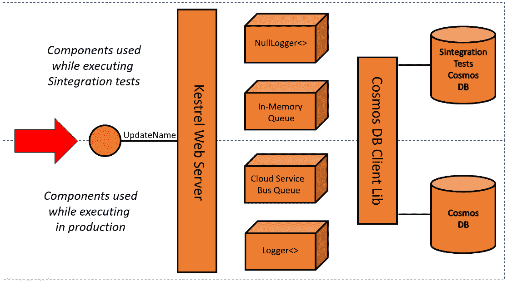

# 第四章：使用测试替身进行真实单元测试

单元测试与其他测试类别不同，因为它使用**测试替身**；实际上，你很少会看到没有测试替身的单元测试。

网上关于这究竟意味着什么的混淆很多。在本章中，我的目标是澄清这个术语，以便你可以在正确的上下文中使用它，并为你提供尽可能多的关于这个主题的解释示例，让你在选择手头的测试替身时感到自信。

在本章中，我们将：

+   解释测试替身的概念和用法

+   讨论更多测试类别

到本章结束时，你将了解单元测试的特殊之处，并将能够使用测试替身开始编写真实的单元测试。

# 技术要求

本章的代码可以在以下 GitHub 仓库中找到：

[`github.com/PacktPublishing/Pragmatic-Test-Driven-Development-in-C-Sharp-and-.NET/tree/main/ch04`](https://github.com/PacktPublishing/Pragmatic-Test-Driven-Development-in-C-Sharp-and-.NET/tree/main/ch04)

# 理解和使用测试替身

你很少会编写一个不使用**测试替身**的单元测试。将术语*替身*与好莱坞特技演员在某种情况下取代真实演员的行为视为相同。*测试替身*是一个总称，用于替换依赖项以测试 SUT 的测试等效物（替身）。它们旨在满足以下一个或多个需求：

**需求 1**：使测试代码能够编译。

**需求 2**：根据单元测试要求消除副作用。

**需求 3**：嵌入与真实行为相关联的（预定）行为。

**需求 4**：记录并验证在单元测试中对依赖项施加的活动（我们稍后将此需求命名为*间谍活动*）。

当我们讨论单个测试替身类型时，我们将参考这四个条件，因此你可能想要将这一节添加到书签中。

你想在单元测试时调用支付网关并执行交易吗？你想在单元测试时调用需要付费的第三方 API 吗？你甚至在测试时想通过 HTTP 吗？*提示*：你不想，也不应该。

让我们了解可以满足前面提到的四个条件的不同类型的测试替身。

## 测试替身的类型

有五种主要的测试替身类型——每一种都是为了满足前面提到的四个需求之一。在单元测试时，你可以使用零个或多个测试替身类型来满足你的测试。

接下来，我们将讨论模拟器、存根、模拟和伪造。这四种类型的测试替身通常与 TDD 一起使用。第五种类型是隔离，它不与 TDD 一起使用，这里仅为了完整性而提及。

### Dummies

`ConvertCToF`方法：

```cs
// Constructor
public WeatherForecastController(
    ILogger<WeatherForecastController> logger, 
    IClient client, INowWrapper nowWrapper, 
    IRandomWrapper randomWrapper)
…
public double ConvertCToF(double c)
{
    double f = c * (9d / 5d) + 32;
    _logger.LogInformation("conversion requested");
    return f;
}
```

要测试 `ConvertCToF`，我们必须实例化一个 `WeatherForecastController` 类。构造函数期望传递多个对象以实例化控制器类：`logger`、`client`、`nowWrapper` 和 `randomWrapper`。但是 `ConvertCToF` 只使用了 `_logger`。此外，我们不想测试 `_logger` 的副作用，因为我们正在测试另一种行为。因此，我们决定使用 `NullLogger<>`。我们可以像这样将所有虚拟替身传递给我们的控制器：

```cs
var logger = 
    NullLogger<WeatherForecastController>.Instance;
var sut = new WeatherForecastController(logger, null, null,
    null);
```

当使用 `logger` 时，它什么都不做，其他 `null` 值只是传递过去以使代码编译。在这种情况下，`logger` 和 `null` 值充当了虚拟测试替身。

当可以使用虚拟替身时创建 *智能* 测试替身可能会使单元测试变得复杂并模糊其意图，因此当可能时使用虚拟替身。

虚拟替身满足我们之前提到的第一个和第二个测试替身要求。它们允许代码编译，并在调用时创建不执行任何操作的对象。

### 存根

WFA 控制器的 `GetReal()` 方法：

```cs
OneCallResponse res = await _client.OneCallAsync
    (GREENWICH_LAT, GREENWICH_LON, new[] {
        Excludes.Current, Excludes.Minutely,
        Excludes.Hourly, Excludes.Alerts }, Units.Metric);
WeatherForecast[] wfs = new WeatherForecast[FORECAST_DAYS];
for (int i = 0; i < wfs.Length; i++)
{
    var wf = wfs[i] = new WeatherForecast();
    wf.Date = res.Daily[i + 1].Dt;
    double forecastedTemp = res.Daily[i + 1].Temp.Day;
    wf.TemperatureC = (int)Math.Round(forecastedTemp);
    wf.Summary = MapFeelToTemp(wf.TemperatureC);
}
return wfs;
```

我们正在使用 `_client`，一个依赖服务，并调用 `OneCallAsync` 从 *OpenWeather* 获取天气数据。我们将结果保存在 `res` 对象中。`OneCallResponse` 不是我们想要返回给 `GetReal()` API 消费者的内容。相反，我们希望向消费者提供一个简单的输出集合，其类型为 `WeatherForecast[]`。因此，我们有一个映射过程，它将来自 `_client.OneCallAsync` 的数据映射到 `WeatherForecast[]`。

在前面的代码中，将映射过程与 *OpenWeather* 连接起来的点是 `OneCallAsync` 调用：


图 4.1 – 我们需要测试的单元

我们希望用我们自己的存根实现替换 `OneCallAsync` 的实现，以避免调用真实的 RESTful API，因为我们正在测试的是映射业务逻辑。幸运的是，我们可以使用 *多态* 来替换实现。这可以通过创建一个名为 `ClientStub` 的具体类并编写我们自己的 `OneCallAsync` 方法来实现 `IClient`。我们的最终设计如下：


图 4.2 – 客户端和 ClientStub 实现 IClient

让我们构建我们的存根类：

```cs
public class ClientStub : IClient
{
    private readonly DateTime _now;
    private readonly IEnumerable<double> _sevenDaysTemps;
    public ClientStub(DateTime now, 
                      IEnumerable<double> sevenDaysTemps)
    {
        _now = now;
        _sevenDaysTemps = sevenDaysTemps;
    }
    public Task<OneCallResponse> OneCallAsync(
        decimal latitude, decimal longitude, 
        IEnumerable<Excludes> excludes, Units unit)
    {
        const int DAYS = 7;
        OneCallResponse res = new OneCallResponse();
        res.Daily = new Daily[DAYS];
        for (int i = 0; i < DAYS; i++)
        {
            res.Daily[i] = new Daily();
            res.Daily[i].Dt = _now.AddDays(i);
            res.Daily[i].Temp = new Temp();
            res.Daily[i].Temp.Day = 
              _sevenDaysTemps.ElementAt(i);
        }
        return Task.FromResult(res);
    }
}
```

注意以下代码中的内容：

+   `ClientStub` 实现 `IClient`，并且它应该为 `OneCallAsync` 提供一个实现以满足契约。

+   构造函数允许类的用户提供 `DateTime` 和七天的温度。

+   `OneCallAsync` 方法有一个虚构的、存根的实现，它生成一个 `OneCallResponse` 返回值。

现在我们已经编写了类，我们可以将其付诸实践。我们有几个测试标准想要测试。以下是第一个测试和第一个标准：

```cs
public async Task
    GetReal_NotInterestedInTodayWeather_WFStartsFromNextDay()
{
    // Arrange
    const double nextDayTemp = 3.3;
    const double day5Temp = 7.7;
    var today = new DateTime(2022, 1, 1);
    var realWeatherTemps = new double[] 
        {2, nextDayTemp, 4, 5.5, 6, day5Temp, 8};
    var clientStub = new ClientStub(today, 
        realWeatherTemps);
    var controller = new WeatherForecastController(
        null!, clientStub, null!, null!);
    // Act
    IEnumerable<WeatherForecast> wfs = await 
        controller.GetReal();
    // Assert
    Assert.Equal(3, wfs.First().TemperatureC);
}
```

注意，我们正在决定今天是哪一天。这是我们冻结日期以便测试可以在任何时间执行的方式。我们也在决定从我们虚构的那一天开始未来 7 天的天气。我们需要这样做才能实例化 `ClientStub`，以便它可以根据这些值做出响应。

从测试名称中，它应该被结构化为 `Method_Condition_Expectation`，我们可以推断出在这个测试中我们试图做什么。现实中我们得到的天气包含从今天开始的 7 天，但我们在 `WeatherForecast[]` 中返回的是从下一天开始的未来 5 天的预报。因此，我们忽略今天的天气，并且没有在任何地方使用它。

存根保护我们免于访问真实的天气服务，并提供了我们在 `Arrange` 部分中包含的预定义值。如果我们调用真实的服务，我们会得到不可预测的天气，从测试的角度来看，对于不可预测的日子（取决于我们何时运行测试），这不会使我们能够编写我们的 `Assert` 标准。

这个测试不足以覆盖所有应该测试的标准。你可以在本章的 `WeatherForecastControllerTests` 类的源代码中找到更多针对 `GetReal` 方法的测试。这些测试是：

```cs
GetReal_5DaysForecastStartingNextDay_
    WF5ThDayIsRealWeather6ThDay
GetReal_ForecastingFor5DaysOnly_WFHas5Days
GetReal_WFDoesntConsiderDecimal_
    RealWeatherTempRoundedProperly
GetReal_TodayWeatherAnd6DaysForecastReceived_
    RealDateMatchesNextDay
GetReal_TodayWeatherAnd6DaysForecastReceived_
    RealDateMatchesLastDay
```

我鼓励你查看配套代码，以便熟悉其他示例。

#### 间谍

**间谍** 是添加到存根类中的额外功能，用于揭示存根内部发生了什么。例如，考虑这个业务需求，我们需要确保我们只向 *OpenWeather* 传递公制温度（摄氏度）请求。

我们需要修改我们的存根以揭示传递给 `OneCallAsync` 的内容。存根中的新代码将看起来像这样：

```cs
public Units? LastUnitSpy { get; set; }
public Task<OneCallResponse> OneCallAsync(decimal latitude, 
    decimal longitude, IEnumerable<Excludes> excludes, 
      Units unit)
{
    LastUnitSpy = unit;
    const int DAYS = 7;
    // the rest of the code did not change
```

我们添加了一个名为 `LastUnitSpy` 的属性来存储最后请求的单位，并以 `Spy` 后缀作为惯例。我们的单元测试将看起来像这样：

```cs
public async Task 
    GetReal_RequestsToOpenWeather_MetricUnitIsUsed()
{
    // Arrange
    var realWeatherTemps = new double[] { 1,2,3,4,5,6,7 };
    var clientStub = new ClientStub(
        default(DateTime), realWeatherTemps);
    var controller = new WeatherForecastController(null!, 
        clientStub, null!, null!);

    // Act
    var _ = await controller.GetReal();
    // Assert
    Assert.NotNull(clientStub.LastUnitSpy);
    Assert.Equal(Units.Metric, 
        clientStub.LastUnitSpy!.Value);
}
```

注意，在这个测试中，我们没有用有意义的值填充预报温度，并使用了默认的 `DateTime`。这强调了对于未来的测试读者（阅读代码的其他开发者）来说，我们在这个测试中不关心这些参数的变化。我们只是想要一些虚拟对象来实例化 `clientStub` 对象。

最后的断言验证了接收到了 `Units.Metric`，这满足了我们的业务需求。

你可以根据你的测试按需添加间谍，你可以以你喜欢的任何方式组织它们，并且希望到现在为止，将它们称为 *间谍* 的想法已经变得有意义。

#### 使用存根的优缺点

使用存根简单且代码易于阅读。不需要学习任何特殊的存根框架也是一个优点。

存根的问题在于，你的场景越复杂，你需要更多的存根类（如 `ClientStub2` 和 `ClientStub3`），或者你的存根实现需要更加巧妙。你的存根应该包含最小的 *巧妙性* 和业务逻辑。在现实场景中，如果你和你的团队不仔细维护，你的存根将会变得庞大且难以维护。

#### 上一个场景的回顾

我们遵循以下步骤对 `GetReal()` 方法进行单元测试：

+   我们意识到 `_client` 是我们 SUT（系统单元）使用的依赖项。

+   我们希望将 `GetReal` 方法与调用真实的 OpenWeather 服务隔离，因此我们需要为 `_client` 提供一种替代行为。

+   `_client` 是实现 `IClient` 接口的一个类的对象。

+   在运行时，SUT（系统单元）是由启动类实例化的。由第三方库提供的 `Client` 被传递给 SUT。这个实现了 `IClient` 的 `Client` 提供了一种从 *OpenWeather* 获取真实天气数据的方式。

+   单元测试不应该扩展到第三方，而应该限制在 SUT 上。

+   为了绕过调用真实服务，我们模拟了一个类，并将其命名为 `ClientStub`，并实现了 `IClient`。`ClientStub` 包含了一个生成虚构天气数据的实现。

+   我们按照单元测试的命名规范和 AAA 结构编写了我们的单元测试。

+   我们 SUT 构造函数需要一个 `IClient` 的实例，因此我们向其中传递了 `ClientStub`。

+   现在，我们可以测试我们的 SUT（系统单元）。

存根满足了我们之前提到的那些测试替身的前三个要求。此外，借助间谍（spies）的帮助，它们还满足了第四个要求。

对于 `GetReal` 方法的其余单元测试，使用了相同的存根过程。一些团队使用存根作为主要的测试替身类型，而其他团队则更喜欢使用模拟，这自然引出了我们下一个话题。

### 模拟

**模拟**与存根有很强的相似性，但它们不是在常规编码中实现存根的实现，而是使用一种 *技巧* 来生成行为，而不需要实现一个完整的类。模拟使用第三方库来减少创建测试替身所需的编码量。

#### 模拟库

使用模拟（mocks），你必须使用第三方库或者自己构建——但愿不要这样。对于 .NET，有两个流行的库是 **Moq**（发音为 *mock you*）和 **NSubstitute**。

+   Moq 从 2010 年开始流行起来。它大量依赖于 lambda 表达式，这使得它在当时比同行更简洁。如果你喜欢 lambda 表达式，那么 Moq 就是你的选择。

+   NSubstitute 也在 Moq 附近发布。它的重点是提供可读的模拟语法。

这两个库在功能上都很成熟，并且拥有庞大的在线社区。本书将使用 *NSubstitute*，但也会在附录中快速介绍 Moq。

要安装 NSubstitute，你可以进入单元测试项目目录并执行以下代码：

```cs
dotnet add package NSubstitute
dotnet add package NSubstitute.Analyzers.CSharp
```

第二行是可选的。它添加了 C# NSubstitute 分析器，该分析器使用 Roslyn 在编译期间添加代码分析，以检测可能的错误。它还添加了 VS 为你提供改进模拟代码提示的能力。

现在，你已经安装并准备好使用 NSubstitute 库了。

#### 使用模拟的示例

模拟和存根可以互换使用，因此理解它们的一个好方法是从我们之前的存根实现开始。让我们以我们在存根中使用的相同示例为例，即测试`GetReal`。在那个例子中，我们使用存根作为测试替身。现在，我们使用模拟，所以我们取上面的相同测试，并将`Arrange`部分替换为以下内容：

```cs
// Arrange
…
//var clientStub = new ClientStub(today, realWeatherTemps);
var clientMock = Substitute.For<IClient>();
clientMock.OneCallAsync(Arg.Any<decimal>(),
  Arg.Any<decimal>(), Arg.Any<IEnumerable<Excludes>>(),
  Arg.Any<Units>())
  .Returns(x => 
  {
      const int DAYS = 7;
      OneCallResponse res = new OneCallResponse();
      res.Daily = new Daily[DAYS];
      for (int i = 0; i < DAYS; i++)
      {
          res.Daily[i] = new Daily();
          res.Daily[i].Dt = today.AddDays(i);
          res.Daily[i].Temp = new Temp();
          res.Daily[i].Temp.Day = 
            realWeatherTemps.ElementAt(i);
      }
      return Task.FromResult(res);
  });
var controller = new WeatherForecastController(null!, 
  clientMock, null!, null!);
```

在使用存根时，我们编写了一个完整的类，以便我们可以实例化它，正如你可以在注释行中看到的那样。在模拟中，NSubstitute 的神奇方法`Substitute.For`从`IClient`创建了一个具体类，并在一行中完成了实例化。

然而，创建的对象`clientMock`没有为`OneCallAsync`提供任何实现，因此我们使用了 NSubstitute 方法来说明：无论传递给`OneCallAsync`方法的参数（`Is.Any<>`）是什么，都返回在提供的 lambda 中描述的内容。lambda 的内容与之前在`ClientStub`中使用的内容相同。

我们仅用几行代码就动态地将一个方法实现附加到了我们刚刚创建的对象上。这相当令人印象深刻，并且比之前的存根对应物代码更少。模拟库有创建抽象的具体实现的能力，在高级场景中，它们可以模拟具体类并替换其部分实现。

当然，如果你正在使用模拟，那么在模拟示例中我们使用的`ClientStub`模拟类就不再需要了。你只需选择其中一个即可。

我已经创建了一个名为`WeatherForecastControllerTestsWithMocking`的测试类，以区别于使用存根的那个。在实际项目中，你通常不会这样做，因为你将典型地使用存根或模拟。本章和*第二部分*，*使用 TDD 构建应用程序*，将包含数十个使用模拟的示例。

#### 间谍

当涉及到模拟时，我们很少使用术语*间谍*，因为间谍功能始终嵌入在模拟框架中。在存根中进行间谍活动是需要你编写的，而对于模拟，间谍功能是内置的。为了说明这一点，最好的方法是拿我们之前提供的带有存根的间谍示例，并将其改为使用模拟：

```cs
public async Task 
    GetReal_RequestsToOpenWeather_MetricUnitIsUsed()
{
    // Arrange
    // Code is the same as in the previous test
    // Act
    var _ = await controller.GetReal();
    // Assert
    await clientMock.Received().OneCallAsync(
      Arg.Any<decimal>(), Arg.Any<decimal>(), 
      Arg.Any<IEnumerable<Excludes>>(), 
      Arg.Is<Units>(x => x == Units.Metric));
}
```

`Arrange`和`Act`部分没有变化；我们只是忽略了`Act`阶段的输出。变化的是我们的断言。NSubstitute 提供了一个名为`Received`的方法来监视传递的参数，并将其与`Arg.Is`结合，以验证传递了什么。

这是第一个`Assert`部分没有使用 xUnit 的`Assert`类的示例。这是完全合法的，因为`Received()`方法本身就是一个断言方法。

#### 使用模拟的优缺点

模拟对象生成的代码简洁。如果我们把它们与存根比较，它们比普通代码（没有模拟库的代码）稍微难读一些。

模拟对象的缺点是，你依赖于像 NSubstitute 这样的库，并且与这个库相关的学习曲线。此外，一些实践者不喜欢模拟库用来动态附加行为的魔法，他们更愿意通过使用普通代码（存根）来使事情更明显。

接下来，我将总结模拟对象和存根之间的区别。

#### 模拟对象与存根的比较

模拟对象和存根之间的区别很重要，因为你需要具备逻辑来选择最适合你的最佳技术。以下是一个快速的区别列表：

+   模拟对象和存根都被归类为测试替身，你可以根据项目需求或团队偏好选择使用其中之一，尽管在业界，模拟对象的使用频率比存根高。

+   模拟对象是通过像 Moq 或 NSubstitute 这样的第三方库实现的，而存根则不依赖于库。

+   模拟对象比存根更简洁，但它们的语法比普通代码稍微难读一些。

+   模拟对象被认为具有一些魔法，一些实践者认为这会破坏单元测试，而存根则是没有魔法的普通代码。

重要提示

模拟对象和存根之间的区别是一个流行的面试问题。同时，也很重要扩展答案并提到它们都是测试替身类型，主要用于单元测试。

#### 上一个场景的回顾

回顾一下，我们与存根有相同的场景，但在存根时，我们添加了一个类来包含我们的存根，并在单元测试中使用它。在模拟中，我们使用了模拟框架，它促进了在单元测试体中包含我们的实现。

模拟对象满足了我们上面所提到的所有测试替身的要求。我希望之前的例子已经让你对模拟有了初步的了解。接下来，我们将探讨另一种测试替身类型。

### 存根

**存根**是模仿现实生活等效部分或全部的库，它们的存在是为了方便测试。

重要提示

“存根”这个术语在业界有多个定义。本章使用 Martin Fowler 的定义（[`martinfowler.com/bliki/TestDouble.xhtml`](https://martinfowler.com/bliki/TestDouble.xhtml)），如下：“*存根对象实际上有工作实现，但通常采取一些捷径，使得它们不适合生产（内存测试数据库是一个很好的例子）。*”

一个令人困惑的名称是.NET 框架中的 Microsoft Fakes，它实现了隔离！

最受欢迎的示例库之一是**FakeItEasy**，它实现了模拟。此外，微软有一个名为 Microsoft Fakes 的框架，它实现了隔离！

.NET 库中最受欢迎的模拟对象示例之一是 *Entity Framework Core 内存数据库提供者*。这是来自微软文档的引用（[`docs.microsoft.com/en-us/ef/core/providers/in-memory`](https://docs.microsoft.com/en-us/ef/core/providers/in-memory)）：

*此数据库提供者允许 Entity Framework Core 使用内存数据库。内存数据库对于测试很有用，……。内存数据库仅设计用于测试*。

在内存中存储时，在执行每个单独的单元测试时很容易擦除和重新创建存储。这有助于在不担心数据状态变化的情况下重复测试。尽管如此，如果存储在磁盘上，例如使用真实的数据库（SQL Server、Cosmos、Mongo 或其他），则在每次测试之前重置数据并不是一个简单的任务。内存数据库的易失性特性非常适合单元测试。

如果 *测试 A* 将用户名从 `JohnDoe` 更改为 `JohnSmith`，而 *测试 B* 尝试将 `JohnDoe` 更改为 `JaneSmith`，如果 *测试 A* 所做的更改是永久的（持久到物理磁盘数据库），则 *测试 B* 一定会失败。使用易失性内存数据库可以在每次测试之间更容易地重置数据。这是一个重要的单元测试原则，称为 **无依赖性**。

模拟对象旨在帮助提供一个复杂系统的实现，以尝试使你的单元测试更加真实。如果你有一个使用关系型数据库并依赖于 EF Core 的系统，那么之前的提供者可能在单元测试时有所帮助：


图 4.3 – 内存存储与生产存储对比

模拟对象满足了我们之前提到的那些测试替身的前三个要求。如果模拟对象嵌入监视行为，它们将满足第四个要求。

在 *第二部分*，*使用 TDD 构建应用程序* 中，我们将使用此提供者，并展示模拟对象的使用。

### 隔离

**隔离**不是你在 TDD 中做的事情，但我为了完整性在此添加了有限的介绍。隔离完全绕过传统的依赖注入，并使用一种称为 **shim** 的不同依赖注入技术。Shim 涉及在运行时修改编译代码的行为以进行注入。

由于隔离框架的功能复杂，.NET 中这样的框架并不多。以下是可能仅有的两个可用于 .NET **Core** 的框架：

+   **Microsoft Fakes**：随 Visual Studio 企业版提供

+   **Telerik JustMock**：一个第三方商业工具。它还有一个名为 **JustMock Lite** 的开源受限实现。

我不知道有一个功能齐全的隔离库具有针对 .NET 5 及以上版本的许可，且许可为宽松的或免费的。

隔离框架主要用于单元测试遗留系统，在这些系统中，你无法更改生产代码以支持依赖注入。因此，隔离框架在运行时将依赖项注入到 SUT 中。它们不用于 TDD 的原因是，TDD 是关于在逐渐*修改*生产代码的同时添加测试，而隔离并不是为了修改生产代码。尽管你可以使用隔离框架来对绿色地带项目进行单元测试，但它们并不是这项工作的最佳工具。

虽然存在隔离框架来针对遗留代码，但我认为将单元测试应用于无法更改的代码并不是团队时间最佳的使用方式。我在*第十二章*《处理棕色地带项目》中对此进行了更详细的介绍。

## 我应该使用什么来进行 TDD？

让我们从排除法开始。隔离和隔离框架在 TDD 的上下文中可能不会被使用，因为它们是不兼容的。

占位符可以与所有类型的测试替身共存。在大多数单元测试中使用`NullLogger<>`服务（其中日志记录器未被使用）或传递 null 参数的情况将会发生。因此，当你能够使用占位符时，请使用它；实际上，如果可能的话，使用占位符应该优先于其他类型。

团队通常使用模拟或存根，但除非项目处于从一种状态过渡到另一种状态的过程中，否则不会同时使用两者。关于哪个更好的争论无法在本书中解决，它遍布整个互联网。然而，鉴于存根更难维护并且需要手动构建，模拟可以作为起点做得更好。从模拟开始，积累经验，然后你可以决定存根是否更适合你。

寻找合适的模拟对象往往是一种试错的过程。有时，你可以找到一个实现良好的模拟对象，比如 EF Core 内存数据库提供者，有时你可能会找到一个开源的模拟对象用于某些流行的系统。有时，你可能不幸，不得不自己创建一个。但是，模拟对象通常与模拟或存根一起使用；正如我们在本书的*第二部分*中将要看到的，它们不是单独使用一个或另一个。它们为你的测试增加了价值，你需要根据具体情况决定何时使用它们。

*总之，对于不应成为 SUT（系统单元测试）一部分的对象或未使用的依赖项，使用占位符。为了构建和测试依赖项，使用模拟。在合适的地方添加模拟对象*。

存根、模拟和模拟对象的意义可能会有所不同，定义也模糊不清。我尽量使用了行业中最常见的术语。重要的是理解我们可以使用的所有测试替身选项，并适当地使用它们。

测试替身是使单元测试与其他测试类别不同的因素。当我们讨论其他测试类别以更好地理解单元测试的独特性时，这一点可以进一步阐明。

# 更多测试类别

你可能已经听说过很多除了单元测试之外的测试类别。有 **集成测试**、**回归测试**、**自动化测试**、**负载测试**、**渗透测试**、**组件测试**——等等，清单还可以继续。好吧，我们不会涵盖所有这些测试类别，因为解释它们所有内容将不适合这本书。我们将要做的是讨论与单元测试有共同之处的两个类别。第一个是 **集成测试**，第二个是我称之为 **S 集成测试** 的测试。我们还将对 **验收测试** 表示敬意，因为它在构建完整的测试类别套件中非常重要。

单元测试、集成测试和 S 集成测试之间有一个主要区别，那就是它们处理依赖关系的方式。了解这些区别将有助于阐明单元测试如何在测试生态系统中定位。

## 集成测试

幸运的是，集成测试很容易理解。它就像单元测试一样，但使用的是真实依赖项，而不是测试替身。集成测试执行一个端点，例如一个方法或 API，这将触发所有真实依赖项，包括外部系统，如数据库，并针对标准测试结果。

### 示例

xUnit 框架也可以执行集成和 S 集成测试，所以为了展示一个例子，我们可以以创建单元测试项目相同的方式创建一个集成测试项目。从你的控制台，进入你的解决方案目录，并执行以下操作：

```cs
dotnet new xunit -o Uqs.Weather.Tests.Integration -f net6.0
dotnet sln add Uqs.Weather.Tests.Integration
```

我们刚刚创建了一个使用 *xUnit 框架* 的集成测试项目，并将其添加到我们的解决方案中。我们的集成测试将通过 HTTP 进行，并将反序列化 JSON 值，因此我们需要这样做：

```cs
cd Uqs.Weather.Tests.Integration
dotnet add package System.Net.Http.Json
```

这将为你的集成测试添加 .NET JSON NuGet 包。

重要提示

注意到集成测试项目没有引用 `Uqs.Weather`。这是因为集成测试项目将通过 HTTP 触发 RESTful API，不需要使用 `Uqs.Weather` 中的任何类型。

在这个例子中，我们想要测试从第二天开始获取 5 天：

```cs
private const string BASE_ADDRESS = "https://localhost:7218";
private const string API_URI = "/WeatherForecast/
    GetRealWeatherForecast";
private record WeatherForecast(DateTime Date, 
    int TemperatureC, int TemperatureF, string? Summary);
```

在类级别上，我们添加这些字段。它们指定了服务的地址，指向我的本地机器，并指定了 SUT 的 URI。通过查看 `Uqs.Weather` 中的 `WeatherForecast` 类，我知道我正在返回一个包含五个字段的 `WeatherForecast` 数组。因此，我构建了一个与从 RESTful API 调用中预期返回的数据相似的记录。

我的集成测试看起来像这样：

```cs
public async Task 
    GetRealWeatherForecast_Execute_GetNext5Days()
{
    // Arrange
    HttpClient httpClient = new HttpClient
    { BaseAddress = new Uri(BASE_ADDRESS) };
    var today = DateTime.Now.Date;
    var next5Days = new[] { today.AddDays(1),
       today.AddDays(2), today.AddDays(3),
       today.AddDays(4), today.AddDays(5) };
    // Act
    var httpRes = await httpClient.GetAsync(API_URI);
    // Assert
    var wfs = await 
    httpRes.Content.ReadFromJsonAsync<WeatherForecast[]>();
    for(int i = 0;i < 5;i++)
    {
        Assert.Equal(next5Days[i], wfs[i].Date.Date);
    }
}
```

我们不知道测试将在哪一天执行，所以我们正在获取今天的日期，然后计算出接下来 5 天的日期。我们正在创建和设置一个 `HttpClient` 来发起 HTTP 请求。

在 `Act` 中，我们正在调用 RESTful API 的端点。

在 `Assert` 中，我们将从 JSON 返回的值转换为之前创建的 `record` 类，并检查我们是否得到了接下来的 5 天。

这个测试需要与之前运行单元测试的方式不同的设置来运行。这是一个进程外测试，这意味着 API 在一个进程中运行，而测试在另一个进程中运行。这两个进程通过 HTTP 相互通信。因此，要运行这个测试，我们首先需要启动 REST API 进程。右键单击**Uqs.Weather** | **调试** | **不调试启动**。然后这将在控制台窗口中启动 Kestrel web 服务器，并使我们的 API 准备好进行 HTTP 调用。

现在，你可以像执行单元测试一样执行集成测试。

#### 由这个测试触发的活动

我们在集成测试中刚刚执行的 API 调用触发了多个依赖项以生成输出。以下是触发的一些依赖项：

+   集成测试和 ASP.NET Web API 宿主之间的网络，包括 HTTPS 连接

+   启动并显示在控制台窗口中的 ASP.NET Web API 宿主进程

+   分析请求并在控制器中触发正确操作方法的路由代码

+   决定创建和注入哪个对象的 DI 容器

+   `Uqs.Weather`和*OpenWeather* API 之间的 HTTPS 连接

我们知道每个依赖项都能独立工作。通过执行这个测试，我们确保了所有组件都已集成并且能良好地协同工作。以下图表显示了执行测试时发生的一些情况：


图 4.4 – 请求/响应通过依赖项

这些并不是所有组件，因为我遗漏了一些，但希望你能理解这个概念。

#### 注意事项

这是本书中的第一个（也是最后一个）集成测试，我想指出这个测试与其单元测试等价物的区别：

+   我们无法提前知道日期——我们必须动态确定日期，而我们的单元测试中在`Assert`部分有一个预配置的日期。

+   没有测试替身，所有东西都在执行真实对象。

+   我们运行了两个进程；一个是托管 API 的 web 服务器，另一个是我们的集成测试。单元测试是直接、进程内调用的。

+   存在一种与测试无关的失败概率。测试可能会因为以下原因而失败：

    +   防火墙问题

    +   *OpenWeather*服务已关闭

    +   超出了我们*OpenWeather*许可证允许的调用次数

    +   ASP.NET Web 服务器尚未启动

    +   路由模块配置不正确

    +   其他环境问题

+   这个测试虽然未进行测量，但因为它需要在两个进程之间进行通信，击中多个组件，然后通过 HTTPS 进行，这包括序列化/反序列化和加密/解密，所以它将花费更长的时间。尽管执行时间不明显，但 10 秒的集成测试时间也会累积。

### 单元测试与集成测试

集成测试和单元测试是优秀的工具，比较它们可能意味着使用其中一个而不是另一个。事实并非如此，因为它们是互补的。集成测试擅长测试完整周期的调用，而单元测试擅长测试业务逻辑的各种场景。它们在质量保证中扮演着不同的角色；问题出现在它们相互干扰时。

重要提示

单元测试与集成测试的区别是常见的面试问题，这允许面试官评估候选人是否理解依赖管理、测试替身、单元测试和集成测试。

#### 集成测试相对于单元测试的优势

这里有一些优势可能会让我们选择使用集成测试而不是单元测试：

+   集成测试检查的是真实的行为，这模仿了最终用户可能执行的操作，而单元测试检查的是开发者认为系统应该执行的操作。

+   集成测试更容易编写和理解，因为它们是常规代码，不使用测试替身，也不关心依赖注入（DI）。

+   集成测试可以覆盖单元测试无法高效覆盖的场景，例如整个系统组件之间的集成以及 DI 容器注册。

+   集成测试可以应用于遗留系统或绿色系统。事实上，集成测试是测试遗留系统的一种推荐方法，而单元测试需要代码重构才能引入到棕色项目中。

+   一些集成测试，如上面的例子，可以以语言无关的方式编写。因此，之前的测试可以是用 F#、Java 或 Python 编写的，或者由 Postman 等工具编写，而单元测试使用与生产代码相同的语言（在我们的例子中是 C#）。

#### 单元测试相对于集成测试的优势

这里有一些优势可能会让我们选择使用单元测试而不是集成测试：

+   单元测试执行得更快，这在运行数百个测试并寻找短反馈循环时非常重要，尤其是在集成代码或发布到环境之前。

+   单元测试的结果可预测，不受时间、第三方服务可用性或环境间歇性问题的干扰。

+   单元测试是可重复的，因为它们不会持久化任何数据，而集成测试可能会永久更改数据，这可能会使后续测试不可靠。这种情况发生在编写和编辑过程中。我们上面的例子是读取（获取），所以它没有受到这个问题的影响。

+   单元测试更容易部署到 CI/CD 管道中（我们将在*第十一章*，*使用 GitHub Actions 实现持续集成）中演示这一点）。

+   在单元测试中找到错误比在集成测试中找到相同的错误要早，并且可以更快地定位。

+   单元测试可以在功能开发期间运行，而集成测试只能在功能完全准备好时添加。

### 混淆单元测试和集成测试

在各种集成测试实现中使用了诸如 xUnit 或 NUnit 之类的框架。框架名称中的“单元”一词可能会误导一些开发者，使他们认为这些项目中写的是单元测试。再加上使用*AAA 约定*和方法名称约定，这也可能造成误导。实际上，我在之前的集成测试中使用了这些约定，但使用与单元测试相同的约定并不意味着测试就是单元测试。

根据要实施的测试类型，设置基础设施和构建 CI 管道会有所不同。尽管它们看起来相同，但区分它们对于理解所需的任务和维护级别非常重要。

由于它们看起来相同，如何区分它们？有一个明显的标志，如果它们不依赖于真实依赖项，那么它们很可能是单元测试。如果它们使用会触发真实外部依赖项的真实对象，那么它们很可能不是单元测试。

## S 集成测试

**S 集成测试**是集成测试和单元测试之间的中间阶段。集成测试依赖于真实组件，而单元测试依赖于测试替身。S 集成测试试图通过混合单元测试的元素来解决集成测试的不足：


图 4.5 – 单元、S 集成和集成测试

我发现一些开发者将这种测试称为**组件测试**。但在软件工程中，组件测试意味着不同的东西，我觉得开发者们——正确地——更关心它所做的事情，而不是正确命名。这个测试类别具有以下独特的特征，如下所述：

+   用它们的真实对应物替换一些依赖项

+   通过构建替身（测试替身的替身）来模拟一些真实依赖项

对于“s”ubstitute、“s”wap 和“s”imulate 开头的“S”，以及它对集成测试的相似性，我给它命名为**S 集成测试**。就像往常一样，让我用一个例子来澄清 S 集成测试。

### 示例

假设我们有一个使用日志记录、服务总线队列和 Cosmos DB 的 Web 项目。日志记录到云端，因此需要云连接。队列也是一个云组件，Cosmos DB 同样也是。

让我们再假设我们有一系列 API 来处理用户资料，例如`UpdateName` API 和`ChangePassword` API。S 集成测试可以执行以下操作：

+   使用 Kestrel Web 服务器，并具有与生产环境相同的功能，因为 Kestrel 足够灵活，可以在本地机器、测试和生产环境中按需运行。

+   写日志需要访问云，因此我们注入一个`NullLogger<>`服务，该服务将忽略日志记录，但允许系统运行。

+   队列仅在云上可用，所以我们用可以轻松在测试之间擦除的模拟内存队列来替换它。

+   Cosmos DB 没有内存实现，但云版本可以在测试运行之间轻松擦除。因此，我们使用相同的 .NET Cosmos DB 客户端库，但在测试时指向不同的数据库——Sintegration 测试 Cosmos DB。

下面是这个系统看起来像的项目组件图：



图 4.6 – 执行 Sintegration 测试

在这种场景中，Sintegration 测试使用模拟、替身和真实组件。它们覆盖了系统中的部分集成，另一方面，队列和数据库可以在各个测试之间轻松擦除，以确保没有 Sintegration 测试影响其他测试。

Sintegration 测试近年来开始受到关注；也许从经典的 .NET Framework 到 .NET 的转变使这种测试类型浮出水面，因为 .NET Core 库不再依赖于特定的 Windows 组件，例如 IIS 服务器。此外，ASP.NET Core 有特定的实现允许这种测试，而过去这些实现不是框架的一部分。这些实现之一是 .NET 中的 Kestrel 服务器作为一部分，并且可以轻松启动而无需依赖特殊的部署。

这是对 Sintegration 测试的简要概述。虽然 Sintegration 测试不是 TDD 的一部分，但了解它们很重要，因为它们与单元测试相关。

## 验收测试

**验收测试**是对完整功能或特性的端到端测试。用于网站的验收测试的一个流行工具是**Selenium**。您可能会在不同的名称下找到这类测试，例如**功能测试**、**系统测试**和**自动化测试**。

### 示例

这是一个模拟用户更新其姓名、然后点击**更新**按钮，接着检查姓名是否已更新的测试。此示例测试了不同动作的完整工作流程，可能按照用户触发的顺序进行。

将验收测试视为多个依次执行的集成测试。这些测试脆弱且缓慢，因此最好保持最少。另一方面，在系统中它们是必要的，因为它们覆盖了单元测试和 Sintegration 测试未覆盖的领域。

## 选择测试类别

在阅读了关于三种测试类型——即单元、Sintegration 和集成——以及额外的验收测试之后，你应该编写哪些测试？出人意料的是，答案是所有四种（如果可能的话）。然而，如果同时实现了 Sintegration 和验收测试，则可以省略集成测试。

### 测试三角形

有一个行业概念称为**测试三角形**，它说明了要实施的必要测试类别以及每个类别中的测试数量。然而，与所有软件工程概念一样，必要测试的类别在每个三角形中都是不同的。让我们看看绿色地带项目的测试三角形：


图 4.7 – 测试三角形

前面的图像中的三角形提倡比其他两个测试类别更多的单元测试。假设你已经熟悉了提到的三种测试。你会发现，与其他两种测试相比，实现单元测试所需的时间最少，并且执行数百个单元测试只需要几秒钟（编译和加载代码之后）。

关于这个三角形与棕色地带项目的讨论将在*第十二章*“处理棕色地带项目”中介绍。希望关于集成测试和 S 集成测试的讨论能帮助你更好地理解单元测试是什么。

# 摘要

在本章中，我们比较了单元测试与其兄弟姐妹：*集成*和*S 集成*测试。我们列出了测试替身，并为每个提供了示例，我们还看到了 xUnit 和 NSubstitute 的实际应用。

我们理解单元测试和测试替身之旅不会在这里停止，但我们将在这本书的其余部分涵盖更多这两个主题的例子。

到目前为止，你可以将本章的经验应用到 TDD 的 5 个级别中的第 3 个级别！现在，你应该能够编写一个使用测试替身的简单单元测试。

我们没有涵盖单元测试的优点和缺点——是的，它有缺点！我们也没有涵盖 TDD 如何与单元测试相关以及单元测试的最佳实践，因为这是下一章*测试驱动开发解释*的作用。

# 进一步阅读

要了解更多关于本章讨论的主题，你可以参考以下链接：

+   *马丁·福勒对测试替身的定义*: [`martinfowler.com/bliki/TestDouble.xhtml`](https://martinfowler.com/bliki/TestDouble.xhtml%0D)

+   *NSubstitute*: [`nsubstitute.github.io`](https://nsubstitute.github.io)
