# 第十一章：使用 GitHub Actions 实现持续集成

你编写了单元测试和其他类型的测试，并且对你的代码覆盖率和质量感到满意。到目前为止一切顺利，但是谁会确保每次代码更改时都会运行这些测试呢？是推送新代码的开发者吗？如果他们忘记了怎么办？如果源控制中存在可能导致测试失败的合并问题怎么办？谁来检查？

你已经找到了答案。这就是你应该实施的**持续集成**（**CI**）系统。CI 是单元测试的自然伴侣，你很少能在现代项目中找到没有 CI 系统的情况。

在本章中，我们将涵盖以下内容：

+   持续集成的介绍

+   使用 GitHub Actions 实现 CI 流程

到本章结束时，你将能够使用 GitHub Actions 实现一个端到端的 CI 流程。

# 技术要求

本章的代码可以在以下 GitHub 仓库中找到：

[`github.com/PacktPublishing/Pragmatic-Test-Driven-Development-in-C-Sharp-and-.NET/tree/main/.github/workflows`](https://github.com/PacktPublishing/Pragmatic-Test-Driven-Development-in-C-Sharp-and-.NET/tree/main/.github/workflows)

# 持续集成介绍

**CI**（持续集成）这个术语背后的想法是，新代码持续与现有代码集成，这导致了一个可以随时（或至少是意图上）发货到生产的系统。

从软件开发到生产的路线被称为**发布管道**，代码在此通过多个过程到达生产，例如编译代码、在开发环境中部署二进制文件、允许质量保证人员将代码拉取到特定环境，以及其他操作。CI 是发布管道的一个组成部分。

CI 系统需要一个主机，以便它可以在代码上执行各种操作。主机是服务器和操作系统的组合：

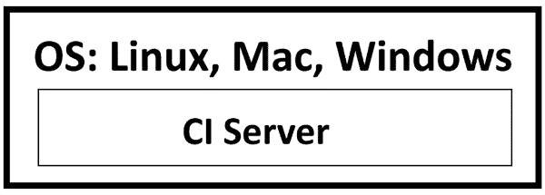


这里有一些本地 CI 服务器的例子：

+   Cruise Control

+   Team City

+   **团队基础服务器**（**TFS**）

+   Jenkins

+   Octopus Deploy

你还将能够找到之前提到的系统的 SaaS 解决方案。然而，今天，本地的云解决方案更为流行，例如以下这些：

+   GitHub Actions

+   Azure DevOps

+   AWS CodePipeline

+   Octopus Cloud

+   GitLab CI/CD

这些系统的概念是相同的，当你学习其中一个时，你可以轻松地学习另一个。现在，让我们看看 CI 系统是如何工作的。

## CI 工作流程

CI 系统通过执行一系列操作将工作流程应用于你的代码。这些操作是可配置的，并且可能因项目需求而异。这是一个 CI 系统的通用工作流程：

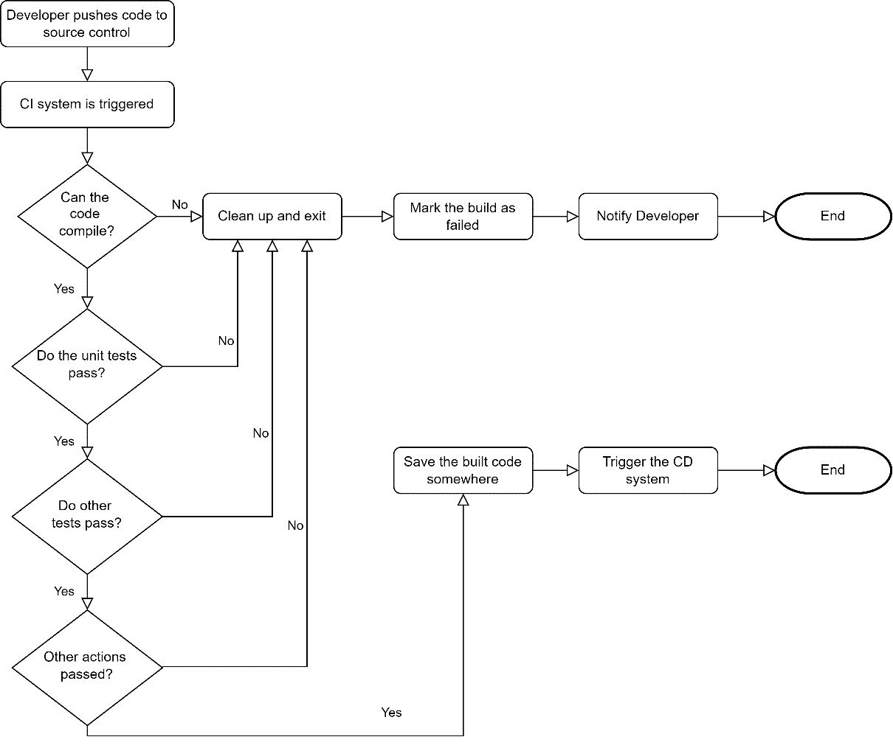

图 11.2 – CI 工作流程

当开发者将新代码推送到源代码控制时，CI 系统通常会监听这个事件。它会复制代码并尝试以类似于您在机器上编译的方式编译它。然后，它尝试发现您测试项目中的所有单元测试并执行它们。

CI 系统高度可定制，因此开发者可能会添加执行多种类型的测试和其他维护步骤。

如果任何步骤失败，CI 系统将放弃构建并将其标记为失败，并通过预配置的方式通知开发者，例如通过电子邮件。

如果所有步骤都通过，那么一个**持续部署**（**CD**）系统就可以插入到这个过程的末端。CD 系统会根据您的特定偏好将构建好的代码（二进制文件）部署到服务器上。因此，您通常会同时听到*CI/CD*这两个术语。

接下来，我们将讨论在软件工程过程中持续集成（CI）的重要性。

## CI 系统的优势

CI 系统通常从敏捷过程的冲刺零阶段开始插入。它们从第一天开始就有很好的理由。显然，构建 CI 系统管道需要时间和精力，因此应该有对额外努力的正当理由。在这里，我们将看到 CI 系统的重要性和好处。

### 代码始终处于编译状态

在团队项目中，您有多少次从源代码控制中拉取最新代码，却发现它无法编译？CI 系统确保代码始终可以编译，最佳实践是在 CI 标记之前的推送为失败时不要拉取新代码，因为除非您自己修复代码或等待同事修复，否则您无法继续工作。

当然，如果您打算修复它，您将不得不拉取损坏的构建，但 CI 系统会给出更早的指示。

通常，源代码控制中的代码损坏发生在开发者没有从源代码控制中拉取最新版本，而在推送代码之前编译和执行测试。

### 单元测试始终通过

开发者可能会忘记在推送代码之前在自己的机器上执行单元测试，但 CI 系统不会忘记！

根据本书之前的讨论，单元测试应该是高性能的，CI 系统应该不会花费太多时间运行所有单元测试，以便向团队反馈构建是安全的，并且已经准备好让他们拉取新代码。

我特别提到了单元测试，因为它们可以提供快速的反馈。您可能还有其他类型的测试，这些测试可能需要时间来执行，您可能决定是否要在每次推送时执行它们或在一天中的特定时间执行。其他测试通常较慢，需要几分钟才能执行，您可能希望并行运行它们，但不要在它们完成之前阻止反馈，这可能需要 10 分钟或一个小时。

### 为 CD 准备就绪的代码编译

如果构建成功编译并通过了测试，那么如果这是你软件工程过程的一部分，或者你有二进制文件准备通过 CD 流程部署到你的环境中，那么它就准备好进行手动测试了。

CD 流程将 CI 的输出部署到配置的位置，如你的开发环境、UAT 和生产环境。

CI 在今天的软件工程过程中不再是可选的，正如你可以从其好处中看到的那样。没有理由不实施它。它既便宜又容易实现，正如我们将在使用 GitHub Actions 时看到的那样。

# 使用 GitHub Actions 实现 CI 流程

初始时，我在为本书的章节设计指南时，计划使用 Azure DevOps 提供一个示例实现，因为它有一个流行的 CI 系统。然而，GitHub Actions 迅速崛起，并很快成为开发者配置 CI 系统的首选，所以我改变了主意，打算使用 GitHub Actions。

GitHub Actions 可以处理多个编程栈；其中之一是 .NET Core，这是我们本章关注的重点。

显然，你需要一个 GitHub 账户来使用 GitHub Actions，而且你会很高兴地知道免费层每月提供 2,000 分钟的运行时间，这对于一个小型独立项目来说应该足够了。

接下来，我们将使用 GitHub Actions 作为*第十章*中项目的 CI 系统，“使用存储库和 Document DB 构建应用程序”你不需要阅读该章节，我们只是需要一个具有项目和针对其的单元测试的解决方案，以便我们可以展示 Actions 的工作原理，而*第十章*就有这样的解决方案。

## 在 GitHub 存储库中创建一个示例项目

要跟随操作，你需要有一个拥有 GitHub 存储库的 GitHub 账户，该存储库托管着一个 .NET 项目。如果你没有，那么你可以创建一个免费的 GitHub 账户。

你需要在你的存储库中拥有*第十章*的代码，所以最快的方法是访问这本书的 GitHub 页面并点击**Fork** | **创建新的分支**：

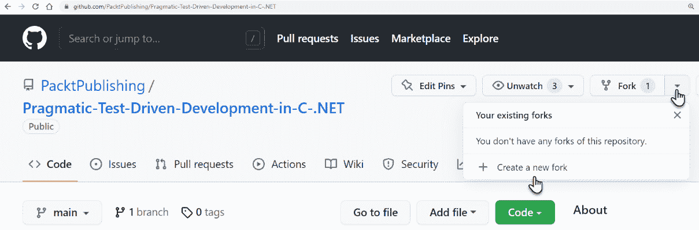

图 11.3 – 创建新的分支

或者，访问存储库 URL 并在末尾添加 `/fork`，如下所示：[`github.com/PacktPublishing/Pragmatic-Test-Driven-Development-in-C-Sharp-and-.NET/fork`](https://github.com/PacktPublishing/Pragmatic-Test-Driven-Development-in-C-Sharp-and-.NET/fork)。然后点击**创建分支**：

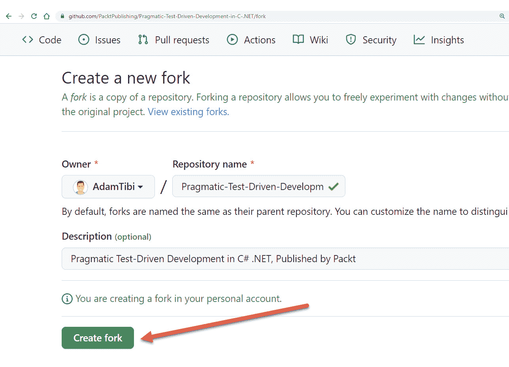

图 11.4 – 填写表单并点击创建分支

分支会将存储库的内容复制到一个新创建的属于你的存储库中，这样你就可以在不影响原始存储库的情况下玩弄代码。

虽然我们已经复制了所有代码，但我们只对解决方案中较早的章节 (*第十章*) 感兴趣，位于以下位置：

```cs
/ch10/UqsAppointmentBooking/UqsAppointmentBooking.sln
```

现在我们有了相同的代码，我们可以为这个项目创建 GitHub Actions CI。

## 创建工作流程

首先，要为 GitHub Actions 编写任何配置，您必须熟悉 YAML。YAML 是一种文件格式，是 JSON 的替代品，旨在提高人类可读性。随着我们的进行，您将看到 YAML 的示例。

让我们使用 GitHub Actions 向导为 *第十章* 项目创建工作流程。从您的 GitHub 仓库中选择 **操作** | **新建工作流程**：

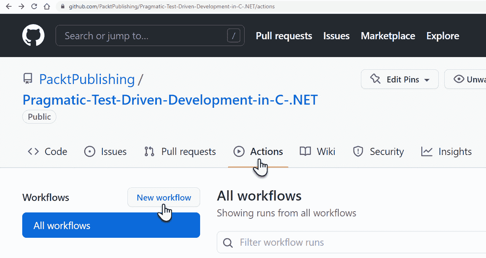

图 11.5 – 创建新的工作流程

GitHub Actions 根据您的仓库内容返回一个建议列表：

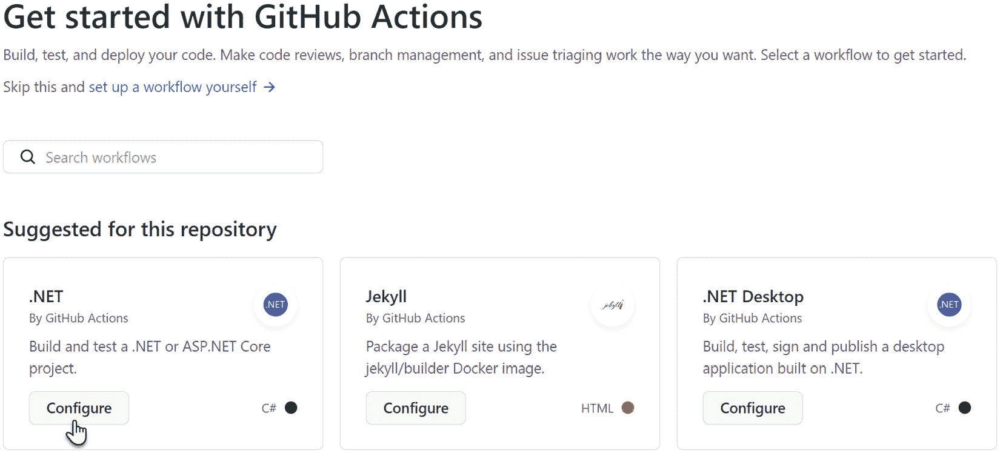

图 11.6 – GitHub Actions 工作流程模板的建议列表

我们的代码是 .NET Core，因此第一个建议是合适的；让我们点击 **配置**。我们将获得以下页面：

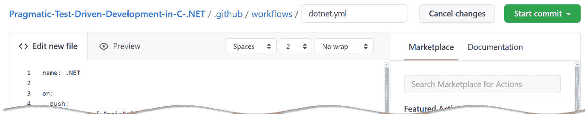

图 11.7 – 创建工作流程

注意，GitHub 已经为您的工作流程配置建议了一个文件位置：

```cs
/.github/workflows/dotnet.yml
```

GitHub Actions 位于 `workflows` 目录中。它还建议以下 YAML 代码作为开始：

```cs
name: .NET
on:
  push:
    branches: [ "main" ]
  pull_request:
    branches: [ "main" ]
jobs:
  build:
    runs-on: ubuntu-latest
    steps:
    - uses: actions/checkout@v3
    - name: Setup .NET
      uses: actions/setup-dotnet@v2
      with:
        dotnet-version: 6.0.x
    - name: Restore dependencies
      run: dotnet restore
    - name: Build
      run: dotnet build --no-restore
    - name: Test
      run: dotnet test --no-build --verbosity normal
```

此工作流程称为 `.NET`，当有人向主分支推送代码或向主分支提出 `pull` 请求时将触发。

CI 系统使用 GitHub Actions 可用的最新版本的 Ubuntu Linux，撰写本文时是 Ubuntu 20.04。操作系统将在应用各种操作时托管构建。Linux 通常默认选择，因为它比 Windows 更高效且成本更低，并且显然支持 .NET Core。

然后步骤的执行从以下内容开始：

1.  `actions/checkout@v3`：此操作检出您的仓库，以便您的流程可以访问它。这是请求此操作的版本 3。

1.  `actions/setup-dotnet@v2`：使用此库的版本 2 获取 .NET SDK，并指定 .NET Core 6 作为 .NET 版本。这允许我们在之后使用 .NET CLI。

1.  `dotnet restore`：这是一个标准的 .NET **命令行界面**（**CLI**）命令，用于还原 NuGet 包。

1.  `dotnet build`：编译解决方案。

1.  `dotnet test`：执行解决方案中的所有测试项目。

*步骤 1* 和 *步骤 2* 准备主机操作系统上的工作空间，以便能够以与在本地机器上执行相同的方式执行 `.NET CLI` 命令。如您所发现的，整个文本都使用了 YAML 语法。

您可以继续并点击 **开始提交** 按钮：

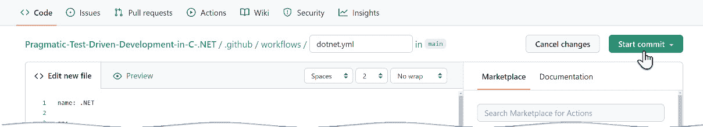

图 11.8 – 开始提交

此后，点击 **操作** 选项卡以查看 GitHub Actions 将如何执行这些命令：

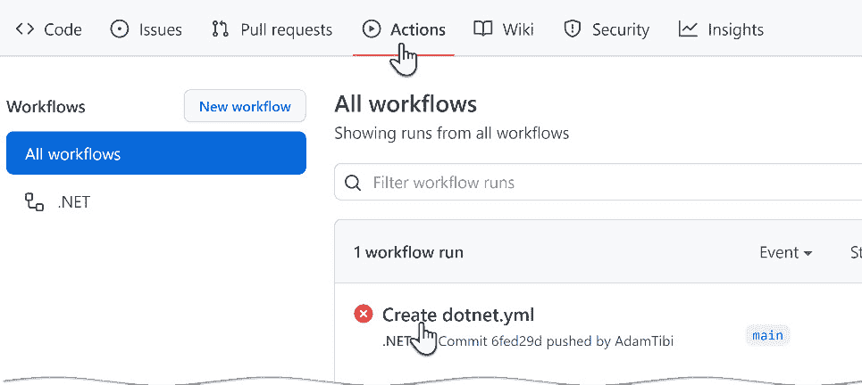

图 11.9 – 失败的构建

正如您所注意到的，红色标志表明构建已失败。您可以点击失败的构建以获取更多信息：

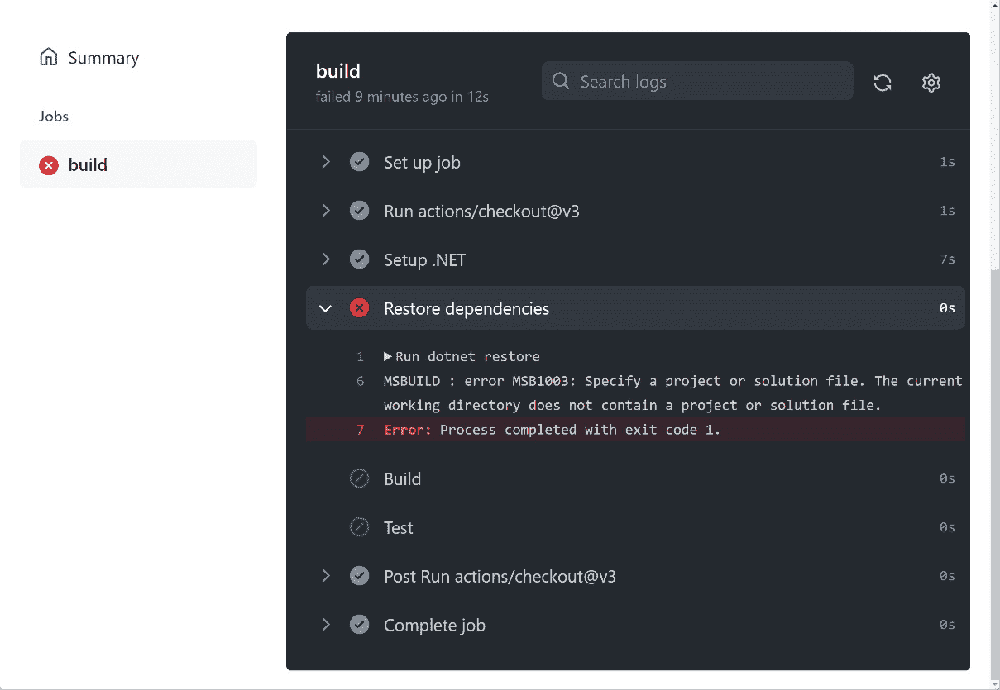

图 11.10 – 构建失败描述

您可以看到为什么这失败了：它无法找到解决方案文件以恢复依赖项。这是一个预期的错误，因为我们的*第十章*解决方案文件位于`/ch10/UqsAppointmentBooking`目录中，而不是在`/`（根目录），因此我们需要修改 YAML 文件以反映这一点。

从源代码控制中拉取最新版本，您将注意到出现了一个名为`workflows`的新目录（`/.github/workflows`），在这个目录中，您可以找到我们刚刚创建的文件：`dotnet.yml`。

您可以使用任何纯文本编辑器编辑此 YAML 文件。我使用**Visual Studio Code**进行编辑。我们需要编辑此文件以指示 Actions 在哪里找到解决方案文件：

```cs
    …
    runs-on: ubuntu-latest
    defaults:
      run:
        working-directory: ./ch10/UqsAppointmentBooking
    steps:
    …
```

我已经修改了前面的 YAML 文件以包含解决方案文件的位置。如果您将此文件推送到 GitHub，这将触发构建。您可以在**操作**选项卡中查看结果：

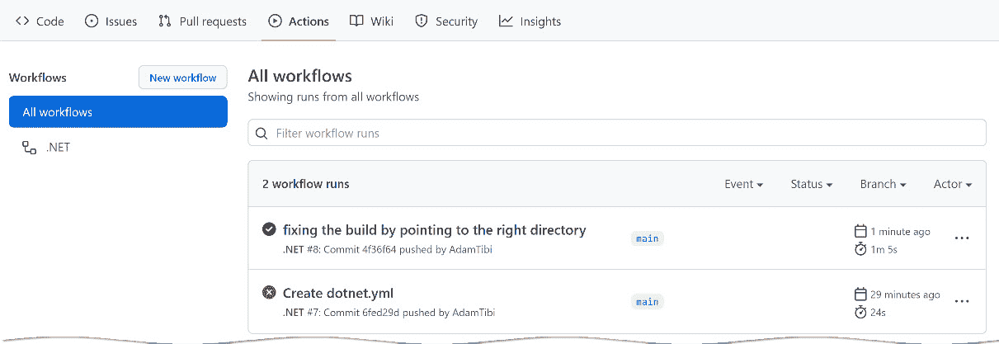

图 11.11 – 构建通过

通过的构建意味着我们在 YAML 文件中指定的所有步骤都已通过。您可以点击通过的构建来查看每个步骤的执行情况，并确保您的步骤准确通过，而不是偶然通过。

我们已经在 GitHub Actions 上为我们的项目创建了一个 CI 系统。现在，每当团队成员修改代码时，CI 工作流程就会启动。

让我们更关注一下测试部分。

## CI 和测试

YAML 步骤中的最后一行是为了触发解决方案中所有可用的测试：

```cs
    - name: Test
      run: dotnet test --no-build --verbosity normal
```

这将针对您解决方案中的所有测试，这可能是一系列单元测试、集成测试、集成测试和系统测试的组合。根据您的项目内容，执行所有测试可能并不理想。这将延迟最近提交的反馈，并阻止其他团队成员验证构建是否安全使用。

因此，您可能希望将工作流程限制为仅单元测试。您可以修改运行命令如下：

```cs
dotnet test --filter FullyQualifiedName~Tests.Unit 
    --no-build --verbosity normal
```

这将针对所有在其命名空间中包含`Tests.Unit`的测试。因此，您不必执行所有测试，并且可以快速获得反馈。

对于其他测试，您可以编写另一个包含新工作流程的 YAML 文件，并将其安排在不同的事件上运行，例如每天多次。

让我们看看当测试失败时会发生什么。

## 模拟失败的测试

假设一位同事在推送到源代码控制之前忘记运行单元测试，天哪。我们可以通过将*第十章**的* `SlotService` 从 `||` 改为 `&&` 并将代码推送到源代码控制来模拟这种情况：

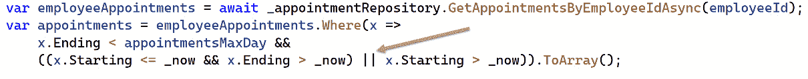

图 11.12 – 在代码中打破逻辑以触发失败的测试

此更改将使解决方案中的现有单元测试失败，并且通常在推送到源控制之前被捕获，但如果推送，CI 系统将报告以下内容：

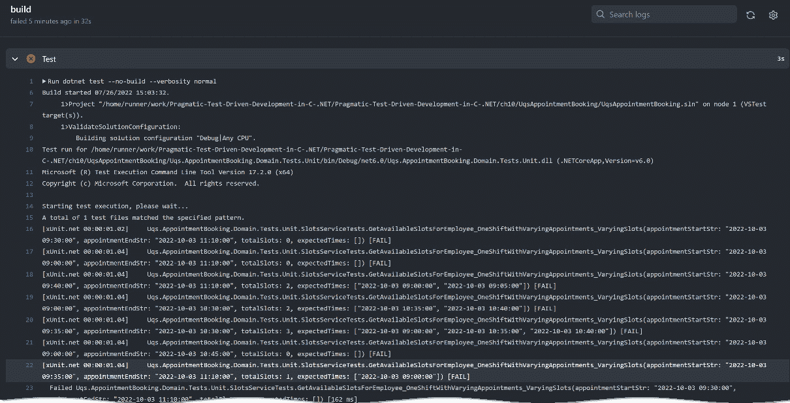

图 11.13 – 源控制中的失败测试

上一屏将显示多个失败点，如果您向下滚动，它将显示更多关于失败的测试的描述，包括预期的结果和实际产生的结果：

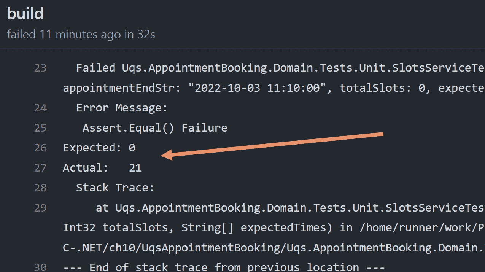

图 11.14 – 失败测试描述

您可以通过阅读描述来得出什么出了问题。显然，我们知道这里出了什么问题，因为我们故意破坏了代码。在其他情况下，我们可以从 GitHub Actions 上的错误描述中了解出了什么问题，或者我们应该能够在本地机器上再次运行单元测试，并试图找出情况。

您已经看到了一个使用工作流程的实现。接下来，让我们了解其背后的概念。

## 理解工作流程

GitHub Actions 中的模块是一个工作流程，而工作流程看起来是这样的：

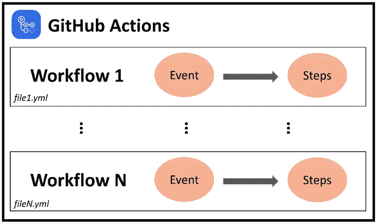

图 11.15 – 工作流程

工作流程位于您存储库的 `/.github/workflows` 目录中的 YAML 文件中。每个工作流程将在您的存储库中由事件（s）触发时运行，或者它们可以被手动触发或按定义的时间表触发。在先前的例子中，将触发工作流程的事件是向主分支推送和向 `main` 提交拉取请求。

我希望这一节很好地介绍了您对 GitHub Actions 的了解。当然，还有更多高级选项，如 `matrix` 和其他功能，但*罗马不是一天建成的*。您可以从基础知识开始，快速进步到专家，以便在您的发布管道中获得精细的控制。

# 摘要

CI 系统是当今软件工程流程中必不可少的部分，也是对 TDD 所做努力的延续。

本章介绍了 GitHub Actions 作为 CI 系统的一个好例子，并使用了 *第十章* 的代码作为现实世界的例子。通过完成本章，我相信您应该能够将 CI 配置添加到您的工具箱中。

在下一章中，我们将看到如何考虑将测试添加到现有项目中，因为我们并不总是有从头开始绿色项目的奢侈。

# 进一步阅读

要了解更多关于本章讨论的主题，您可以参考以下链接：

+   *YAML 文件*：[`yaml.org/`](https://yaml.org/)

+   *GitHub Actions 工作流程*：[`docs.github.com/en/actions/using-workflows/about-workflows`](https://docs.github.com/en/actions/using-workflows/about-workflows%0D)

+   *持续集成* by Martin Fowler: [`martinfowler.com/articles/continuousIntegration.xhtml`](https://martinfowler.com/articles/continuousIntegration.xhtml)
