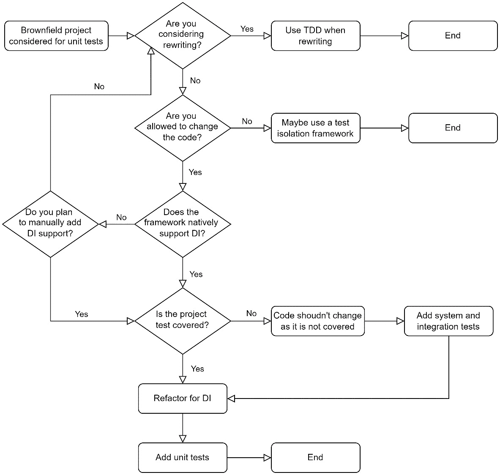
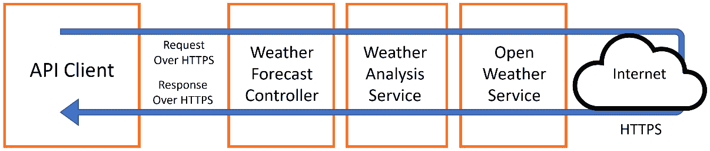

# 第十二章：处理棕色地带项目

每当我听到**棕色地带项目**这个词时，我都会感到不舒服，可能你也是。设计决策已经做出，代码已经被前开发人员编写，代码质量在一类和另一类之间有所不同；棕色地带不是胆小鬼的领域。

由于“棕色地带”这个术语可能有多个定义，我想先在这里定义它，以便我们都在同一页上。从本书的角度来看，棕色地带项目是一个没有单元测试覆盖且可能已经编写了一段时间的项目。它可能被其他类型的测试而不是单元测试所覆盖，但我们将仍然称其为棕色地带。一些技术人员也将其称为**遗留项目**。

如您所已发现的，我们专门用了一整章来讨论棕色地带，因为将 TDD 或单元测试引入这样的项目存在挑战。我们将讨论这些挑战以及如何克服它们。

在本章中，我们将涵盖以下主题：

+   分析挑战

+   启用 TDD 的策略

+   为单元测试进行重构

到本章结束时，你将更好地了解在为你的项目启用单元测试时需要寻找什么。你还将对所需的代码更改有所了解。

# 技术要求

本章的代码可以在以下 GitHub 仓库中找到：

[`github.com/PacktPublishing/Pragmatic-Test-Driven-Development-in-C-Sharp-and-.NET/tree/main/ch12`](https://github.com/PacktPublishing/Pragmatic-Test-Driven-Development-in-C-Sharp-and-.NET/tree/main/ch12)

# 分析挑战

在前面的章节中，我们一直在谈论从单元测试端开始添加新功能（先测试后开发）。我们依赖于有一个新的功能或修改一个已经由现有单元测试覆盖的功能。对于棕色地带（brownfields）来说，情况并非如此，因为当你尝试应用 TDD 时，你将面临以下挑战：

+   **依赖注入支持**：一些遗留框架没有原生支持依赖注入（DI），这对于单元测试是必要的。

+   **代码修改挑战**：未覆盖的测试（任何类型的测试）的代码更改可能会引入新的错误。

+   **时间和精力挑战**：引入代码的单元测试能力需要时间和精力。

让我们详细地逐一分析每个挑战，以便你在需要时考虑它们。

## 依赖注入支持

在本书中，在学习单元测试或 TDD 之前，我们不得不介绍依赖注入（DI）。依赖注入（DI）是允许你将代码分割成单元/组件的工具；它是单元测试的自然要求。在启用依赖注入（DI）时有两个挑战——框架支持和重构工作。让我们深入了解。

### 依赖注入的框架支持

这是一本.NET 书籍，所以我们只对不支持原生依赖注入的遗留.NET 框架感兴趣。在 2000 年代初，当单元测试成为一种趋势时，微软更感兴趣的是将开发者从**Visual Basic 6**（**VB6**）和**Active Server Pages**（**ASP**）迁移过来，因此，在.NET 的早期阶段实现原生依赖注入并不是优先事项。

因此，Win Forms 和 ASP.NET Web Forms 在没有原生依赖注入支持的情况下诞生。当然，你可以通过修改框架来添加一些依赖注入的支持。然而，当你开始偏离框架的规范时，你会使其他在代码库上工作的开发者感到疏远，并给设计引入微妙的错误和复杂性。

更现代的框架，如 WPF 和来自经典.NET Framework 的 ASP.NET MVC，允许通过第三方依赖注入容器进行依赖注入。如今，随着 ASP.NET Core 的推出，依赖注入通过微软构建的依赖注入容器原生支持。

如果你有一个基于没有原生支持依赖注入的遗留框架（如 Win Forms 和 ASP.NET Web Forms）的项目，我会说，将这些框架弯曲以实现单元测试的努力需要权衡拥有单元测试的好处。也许你可以将这项努力投入到应用其他类型的测试到项目中。显然，将项目迁移到现代框架可以解决这个问题，但这也有其自身的挑战。

如果框架原生支持依赖注入或可以轻松支持依赖注入，那么你很幸运，但这就是全部吗？显然，现在你必须重构所有内容以启用依赖注入。

### 支持依赖注入的重构

我们在**第二章**理解依赖注入的示例中专门讨论了依赖注入，因此在这里我们不会深入探讨。当我们计划引入单元测试或 TDD 时，我们需要确保我们正在使用依赖注入来注入组件。

理想情况下，所有组件都需要通过构造函数注入进行注入，变量实例化不应在方法或属性代码中完成。话虽如此，考虑以下不受欢迎的代码：

```cs
MyComponent component = new MyComponent();
```

当你拥有未进行单元测试的代码时，你可能会发现所有组件都在代码中直接实例化，并且没有使用依赖注入容器。在这种情况下，你必须遍历直接实例化的案例，并将它们修改以支持依赖注入。我们将在本章末尾看到一个这样的例子。

并非所有直接实例化的案例都需要你为依赖注入进行重构。有些案例是标准库的一部分，你可以对其进行单元测试，但你不应该这样做。以下是一个例子：

```cs
var uriBuilder = new UriBuilder(url);
```

在这个例子中，我们没有打算注入`UriBuilder`类，所以你可能不需要更改代码，因为该类不依赖于外部依赖。因此，注入该类并不有益，反而增加了不必要的努力。

简而言之，为了使代码可进行单元测试，所有组件都需要准备好依赖注入。根据你的项目大小以及你想要实现的方式（例如迭代），这将需要时间和努力。

引入依赖注入不是唯一的挑战；修改代码也将带来新的挑战。

## 代码修改挑战

当你在项目中添加非单元测试时，你是在代码外部工作，以下是一些可能的活动：

+   使用 Selenium 或 Cypress 等自动化工具测试 UI。测试将像外部用户一样处理应用程序。

+   通过执行端到端调用进行集成测试，例如在 API 端点上。

+   通过创建应用程序的多个实例来对项目进行负载测试。

+   通过尝试从外部黑客攻击应用程序进行渗透测试。

所有这些活动都不需要更改代码，但单元测试要求生产代码处于某种形状。

当更改代码以启用单元测试时，我们冒着破坏它的风险。想象一下，一个错误找到了进入生产环境的方法，而业务方听到“它坏了，因为我们增加了测试”，这真是讽刺。

重要提示

如果我说你为了单元测试而必须更改代码，那我就撒谎了，因为你可以使用隔离测试框架，这会让你能够在不更改代码的情况下进行单元测试。然而，如果你真的想进行单元测试而无法更改代码，这将是一个最后的手段。我们将在本章后面进一步讨论这个问题。

有一些解决方案可以更改代码，从而降低出错的可能性，所以请继续阅读。

## 时间和努力挑战

启用依赖注入并将代码重构为作为单元操作的组件的过程在心理上具有挑战性且耗时。

考虑通过将过程迭代地划分为你的 sprint（或迭代，或你称之为什么）或通过阻塞一些迭代并实施你的更改来接近这个过程。

这里的挑战在于向业务方证明引入单元测试和启用 TDD 所花费的时间是合理的，因为从他们的角度来看，你们的产品还是一样的，同样的数量的问题，而且什么都没有修复，只是增加了测试。显然，我和你都知道单元测试可以保护代码免受未来错误的侵害并增加文档，但挑战在于将这一点传达给业务方。下一章将讨论在引入 TDD 和单元测试时如何处理业务问题，所以我在这里就先停下了。

所有这些挑战都有解决方案；毕竟，我们在软件行业工作！接下来的几节将使用不同的策略来处理这些问题。

# 启用 TDD 的策略

现在是讨论上一节中描述的挑战解决方案的时候了。由于“一张图片胜过千言万语”，我将展示一个工作流程图，以阐明如何将单元测试引入到一个棕色地带项目中：



图 12.1 – 在项目中启用 TDD 的工作流程

让我们来看看图表和我们的选项。

## 考虑重写

你可能会考虑重写，因为现有项目可能基于一个较旧的框架，开发者较少，支持也较少。然而，重写想法是有争议的。如果你告诉业务该项目需要重写，你将成为他们最不喜欢的个人。相信我；没有人想听到这个。然而，好的重写不需要是一次性的大爆炸；它可以分成更小的升级块，并可以附加到冲刺中。显然，选择一个原生支持 DI 或通过第三方支持的现代框架是不可能的。

重写软件有许多方法，这超出了本书的范围。但如果你正在重写，你可以从 TDD 开始新的部分，问题就会得到解决！

## 修改代码

在某些设置中，代码过于复杂，难以修改，或者有时业务出于任何原因不喜欢修改代码。如果你面临这些情况之一，那么请自问是否值得添加单元测试，或者是否应该将这项工作投入到其他类型的测试中。显然，其他类型的测试也会有益，尽管单元测试会更有益。

单元测试可以在没有 DI 的情况下进行；因此，你不需要更改代码。看这里，我已经泄露了这个秘密！但为了使其工作，你将不得不使用一个 **测试隔离框架**。测试隔离框架会对组件外部加载的方式做一些更改，而不触及代码。

例如，考虑这个类：

```cs
public class Warehouse 
{ 
    public Dictionary<string, int> Products { get; } 
    …
}
```

注意，该类没有实现接口，`Products` 属性也不是虚拟的。让我们看看 Telerik 的 **JustMock** **测试隔离框架**如何对这个类相关的代码进行单元测试：

```cs
[Fact]
public void Complete_SampleInventory_IsCompleted() 
{
    // Arrange
    var order = new Order("trouser", 1); 
    var warehouse = new Warehouse(); 
    Mock.Arrange(() => warehouse.Products)
.Returns(new Dictionary<string, int>() { 
{ "shirt", 12}, 
        { "trouser", 5}
    }); 

    // Act
    order.Complete(warehouse); 

    // Assert
    Assert.True(order.IsCompleted); 
}
```

在这个代码块中，我们只关心两条被突出显示的行。`Warehouse` 类上的 `Products` 属性，尽管这个属性不是虚拟的，并且 `warehouse` 对象没有通过模拟库实例化。

JustMock 在这里施展了一些魔法，它使 `Warehouse` 类可模拟，尽管 `Warehouse` 没有接口，`Products` 也不是虚拟的。不需要 DI！

然而，隔离框架的魔法并不受大多数 TDD 实践者欢迎，因为它会导致不良的编程实践。此外，这些框架并非免费。当你想要避免代码更改时，它们确实解决了问题，但它们提出了一个问题：这是否值得付出努力和成本？

通过依赖非标准测试方式所带来的麻烦，将需要培训、维护和许可费用，这些成本应该与使用任何框架进行权衡。

## 原生支持 DI

.NET 框架中的一些框架没有 DI 的概念——Win Forms 和 Web Forms 是完美的例子。你可以强迫它们支持 DI，但这意味着扭曲框架并独自承担。有时，你可以尝试隔离 UI 层并对下面的内容进行单元测试。在这种情况下，这已经足够好了。

我想说的是，拥有一个不原生支持插入 DI 容器或内置了 DI 容器（如 ASP.NET Core）的框架将让你付出更多努力，并将你从规范中移开。

我会避免对这样的框架进行单元测试，并通过采用其他测试类别来提高质量。

## 单元测试之前的测试覆盖率

代码更改会导致错误，但仔细的代码更改呢？嗯，是的，它仍然会导致错误！无论你多么小心，更改代码时都会出现错误。那么，你的错误查找计划是什么？

如果你计划为了单元测试而更改代码，你的代码应该首先通过其他类型的测试达到高覆盖率，主要是自动化和集成测试。这些测试将帮助你指出在代码进入生产之前你破坏了哪些地方。

随着问题的出现，一个逻辑问题是，如果我已经有了其他类型测试的高覆盖率，为什么我还需要单元测试？以下是一些答案：

+   如果你的项目仍在开发中，那么你需要单元测试。此外，最好以 TDD 风格添加新功能。

+   当你的项目能够支持它们时，你可以将所有可用测试的平衡改变为单元测试，因为单元测试在我们这本书的第四章“使用测试替身进行真实单元测试”中讨论的具有其他测试的优势。

如果你的代码处于维护模式且覆盖率已经很高，那么我会说添加单元测试并不是非常有用。在这种情况下，TDD 不适用，因为 TDD 是新功能或功能变更的伴侣。

我的建议是，如果代码没有被测试覆盖，不要更改它，因为你在推进项目中的宝贵努力可能会被生产中的错误所抵消。也许应该将努力投入到其他测试或重写中。

每个项目都是不同的，我们在这里提到的策略只是需要考虑的点。当你计划将单元测试引入棕色地带时，你应该考虑将这些点加入你的思考过程中。

接下来，我们将看到将遗留代码更改为允许单元测试的示例。

# 为单元测试进行重构

当你在 TDD（测试驱动开发）中编写代码时，你的代码从第一刻起就是可单元测试的。这是因为你考虑了依赖注入（DI）的场景。棕色地带代码几乎从未考虑过 DI，它将不得不改变以适应它。

在本节中，我们将涵盖你必须更改的场景，然后在本节的末尾通过一个示例重构来展示。

## 代码中实例化的变量

当你在代码中看到用于实例化库或服务的 `new` 关键字时，那么很可能，这需要重构。以下是一个方法中的代码示例：

```cs
var obj = new Foo();
obj.DoBar();
```

上一行意味着我们无法注入 `Foo` 的测试替身，因此代码需要更改以注入它。

下一步是检查 `Foo` 是否实现了你从该类使用的方法的接口。让我在这里告诉你一个坏消息——保持你的期望低；除非你正在使用一个设计良好且复杂的框架，否则你很可能找不到该类实现了你使用的方法的接口。

在接下来的几节中，我们将通过使代码可测试的过程。

### 为你自己的类创建接口

如果你拥有 `Foo` 中的代码并且可以更改它，那太好了！你的代码可以从：

```cs
class Foo
{
    public void DoBar();
}
```

为这个类和额外的接口 `IFoo`：

```cs
interface IFoo
{
    void DoBar();
}
class Foo : IFoo
{
    public void DoBar();
}
```

这很简单。但如果这个类的源代码不可用，或者你不允许更改源代码怎么办？

### 为第三方类创建接口

为你并不拥有的类添加接口是不可能的。你必须通过另一个模式，通常被称为包装类。你需要创建一个新的类和接口，如下所示：

```cs
interface IFooWrapper
{
    void DoBar();
}
class FooWrapper : IFooWrapper
{
    private Foo _foo = new();
    public void DoBar() => _foo.DoBar();
}
```

你可以看到，我们已经用另一个类包装了 `Foo` 类，以拦截对 `DoBar` 方法的调用。这将允许我们以与我们添加到我们拥有的类中的接口相同的方式添加接口。

这里有一些额外的工作，但你会习惯的，经过几次类更改后，它将变得简单易懂。

现在我们为我们的类有了接口，我们可以进行第二步，即依赖注入。

### 注入你的组件

你如何进行依赖注入取决于你使用的库（ASP.NET Core、Win Forms 等）以及你如何配置你的 DI 容器。让我们以一个 ASP.NET Core WebAPI 项目为例。为了配置你新创建或更新的类，在 `Program.cs` 中编写类似于以下代码：

```cs
builder.Services.AddScoped<IFoo, Foo>();
```

或者以下代码：

```cs
builder.Services.AddScoped<IFooWrapper, FooWrapper>();
```

显然，生命周期范围（瞬态、作用域或单例）将根据 `Foo` 类而变化。

一旦完成修改，你可以重构你的控制器以注入 `FooWrapper`：

```cs
public class MyService
{
    private readonly IFooWrapper _foo;
    public MyService(IFooWrapper foo)
    {
        _foo = foo;
    }
    public void BarIt()
    {
        _foo.DoBar();
    }
}
```

我们引入了一个 `wrapper` 类和一个接口，这样我们就可以遵循一个熟悉的依赖注入（DI）模式，因此之前的代码成为可能。

现在，你可以继续实施你想要的任何单元测试，因为你在测试时可以注入 `FooWrapper` 的测试替身。

实例化场景已经整理好了。让我们探索另一个重构模式。

## 替换静态成员

静态方法，包括扩展方法，简单、占用更少的代码行，并产生优美的代码。然而，当涉及到依赖注入时，它们是邪恶的；根据 *第二章* 的解释，*通过示例理解依赖注入*，静态方法不适合单元测试。

`Date.Now`看起来很无辜，`Now`是一个只读的静态属性。如果你想让你的单元测试冻结时间，例如，比如说你想测试 2 月 29 日（闰年）会发生什么，你做不到。这个问题的解决方案是一个包装器，如之前讨论的那样。这是你可以做的，将`Now`作为一个实例方法而不是静态方法：

```cs
public interface IDateTimeWrapper
{
    DateTime Now { get; }
}
public class DateTimeWrapper : IDateTimeWrapper
{
    public DateTime Now => DateTime.Now;
}
```

我们做了和之前一样的事情，当时我们没有控制这个类（几节之前）。我们通过向`DateTime`类引入包装模式来启用 DI 支持。现在，你可以在运行时注入`DateTimeWrapper`并使用测试替身进行单元测试。

如果你控制这个类，你可能想将静态成员更改为实例成员（非静态）或者引入一个额外的实例成员并保留静态成员：

```cs
Interface IFoo
{
    string PropWrapper { get; }
}
class Foo : IFoo
{
    public static string Prop => …
    public string PropWrapper => Foo.Prop;
}
```

这是将你的静态属性公开为实例属性的一种方法。你还需要在其余代码中使用`PropWrapper`包装属性，而不是未包装的`Prop`。在之前的示例中，我们添加了一个额外的属性，但你也可以重构代码以替换静态属性，如果这样做有意义的话。

### 将消费者改为依赖于实例成员

消耗先前`Foo`类的代码可能看起来像这样：

```cs
public class Consumer 
{
    public void Bar()
    {
        …
        var baz = Foo.Prop;
        …
    }
}
```

在根据上一节重构`Foo`之后，这里的实现可以改变为可测试的格式，如下所示：

```cs
public class Consumer 
{
    private readonly IFoo _foo;
    public Consumer(IFoo foo)
    {
        _foo = foo;
    }
    public void Bar()
    {
        …
        var baz = _foo.PropWrapper;
        …
    }
}
```

你可以看到，我们已经将`IFoo`注入到`Consumer`类中，并且我们使用了另一个属性，`PropWrapper`。

实例化的类和静态成员调用很容易被发现。然而，关于遗留代码最显著的一点是它没有结构，一个组件不能轻易被发现和测试。因此，为了这个，我们不得不做更多的改变。

## 改变代码结构

在棕色地带项目中，代码可能处于无法进行单元测试的格式。一个流行的结构是控制器动作方法，所有代码都写在其内部：

```cs
public void Post()
{
    // plenty of code lines
}
```

在这里，我们需要将代码放入可测试的结构中。我会选择一个架构，如本书的*第二部分*中所述，在那里我们使用了服务和领域对象。

之前的示例代码运行良好，但它不可进行单元测试。你可以在本章的`WeatherForecasterBefore`目录下的`WeatherForecastController.cs` GitHub 文件中找到完整的列表：

```cs
public class WeatherForecastController : ControllerBase
{
    public async Task<IEnumerable<WeatherForecast>>
    GetReal([FromQuery]decimal lat, [FromQuery]decimal lon)
    {
        var res = (await OneCallAsync(lat, lon)).ToArray();
        …
        for (int i = 0; i < wfs.Length; i++)
        {
            …
            wf.Summary = MapFeelToTemp(wf.TemperatureC);
        }
        return wfs;
    }
    private static async
        Task<IEnumerable<(DateTime,decimal)>> OneCallAsync(
        decimal latitude, decimal longitude)
    {
        var uriBuilder = new UriBuilder(
        "https://api.openweathermap.org/data/2.5/onecall");
        …
        var httpClient = new HttpClient();
    }
    private static string MapFeelToTemp(int temperatureC)
    {
        …
    }
}
```

显然，为了简洁起见，大部分代码被省略了。代码将调用一个名为 Open Weather 的第三方服务，并为某个地理坐标获取未来 5 天的天气预报。然后，它将分析温度并产生一个描述温度感觉的词，例如*Freezing*或*Balmy*。

之前的代码还实例化了一个`HttpClient`实例，这意味着在尝试对这段代码进行单元测试时，我们无法避免调用第三方服务。

接下来，我们将思考如何将此代码改为可测试组件。

### 分析代码更改以实现可测试格式

我们刚才看到的代码可以通过几种方式制作成组件，并且没有一种方法可以做到。这段代码做了两件事，因此我们可以考虑两个将包含所有代码功能的组件：

+   调用 Open Weather 并获取预报

+   获取预报并分析

这里的想法是拥有没有业务逻辑的控制器，如果没有业务逻辑，那么我们就不需要单元测试控制器。一般来说，控制器应该没有业务逻辑，它应该做单一的工作——将 **数据传输对象** (**DTOs**) 传递给视图（如模型-视图-控制器视图）。

我们将给我们的组件以下命名：

+   `OpenWeatherService`

+   `WeatherAnalysisService`

获取预报和温度感觉分析的整体调用将看起来像这样：



图 12.2 – 组件工作流程

客户端将调用 API 以感觉获取预报。天气预报控制器将接收调用并将其传递给天气分析服务，该服务加载 Open Weather 服务并调用外部依赖以获取天气。

接下来，我们将看到重构后的代码看起来是什么样子。

### 最终可测试的代码

当您想启用单元测试时，存在重构侵入性的级别。我选择了积极级别，但您可能选择重构更少的代码。

您可以在 **WeatherForecasterAfter** 目录中看到整个重构后的代码。

现在控制器看起来是这样的：

```cs
public class WeatherForecastController : ControllerBase
{
    private readonly IWeatherAnalysisService 
        _weatherAnalysisService;
    public WeatherForecastController(
        IWeatherAnalysisService weatherAnalysisService)
    {
        _weatherAnalysisService = weatherAnalysisService;
    }
    [HttpGet]
    public async Task<IEnumerable<WeatherForecast>> 
        GetReal(
       [FromQuery]decimal? lat, [FromQuery]decimal? lon)
    {
        if (lat is null || lon is null)
        {
            return await _weatherAnalysisService
               .GetForecastWeatherAnalysis();
        }
        return await _weatherAnalysisService
         .GetForecastWeatherAnalysis(lat.Value, lon.Value);
    }
}
```

与之前相比，控制器几乎是空的。控制器中的操作方法将 API 调用映射到正确的服务。

这是 `OpenWeatherService` 类：

```cs
public class WeatherAnalysisService : 
    IWeatherAnalysisService
{
    …
    private readonly IopenWeatherService
        _openWeatherService;
    public WeatherAnalysisService(
        IOpenWeatherService openWeatherService)
    {
        _openWeatherService = openWeatherService;
    }
    public async Task<IEnumerable<WeatherForecast>> 
       GetForecastWeatherAnalysis(decimal lat, decimal lon)
    {
        OneCallResponse res = await 
            _openWeatherService.OneCallAsync(…)
        …
    }
    private static string MapFeelToTemp(int temperatureC)
    {
        …
    }
}
```

该类包含将感觉映射到温度并调用 `OpenWeatherService` 的逻辑。服务不知道如何调用 Open Weather API。

最后，让我们看看 `OpenWeatherService`：

```cs
public class OpenWeatherService : IOpenWeatherService
{
    …
    public OpenWeatherService(string apiKey, 
        HttpClient httpClient)
    {
        _apiKey = apiKey;
        _httpClient = httpClient;
    }
    public async Task<OneCallResponse> OneCallAsync(
        decimal latitude, decimal longitude, 
        IEnumerable<Excludes> excludes, Units unit)
    {
        …
    }
}
```

这个服务的任务是使用代码封装对互联网 Open Weather API 的 HTTP 调用。

新增服务完全单元测试可以在与其余服务相同的源代码目录中找到。

记住，我们在假设代码已经经历过其他类型的测试的情况下进行重构。积极重构代码是耗时的，尤其是对于第一组重构，但请记住，重构也是偿还项目部分技术债务。现在代码由单元测试进行文档化，所以这是一个进步。

# 摘要

在本章中，我们讨论了为现有项目启用单元测试的后果。我们已经讨论了考虑因素，以便您决定这是否值得，以及在推进过程中需要注意的所有事情。

作为一名开发者，您将遇到价值上升的棕色地带项目，这些项目将从单元测试和 TDD 中受益。希望这一章能为您提供应对这些项目的所需知识。

决定将 TDD 引入您的组织并非一个简单的过程。下一章将详细介绍这一过程，并为您准备您可能会遇到的一些场景。

# 进一步阅读

要了解更多关于本章讨论的主题，您可以参考以下链接：

+   *JustMock（来自 Telerik 的隔离框架）*：[`docs.telerik.com/devtools/justmock`](https://docs.telerik.com/devtools/justmock%0D)

+   *Microsoft Fakes（随 VS Enterprise 提供的隔离框架）*：[`docs.microsoft.com/en-us/visualstudio/test/isolating-code-under-test-with-microsoft-fakes`](https://docs.microsoft.com/en-us/visualstudio/test/isolating-code-under-test-with-microsoft-fakes%0D)

+   *TypeMock（适用于经典.NET Framework 的隔离框架）*：[`www.typemock.com`](https://www.typemock.com)
