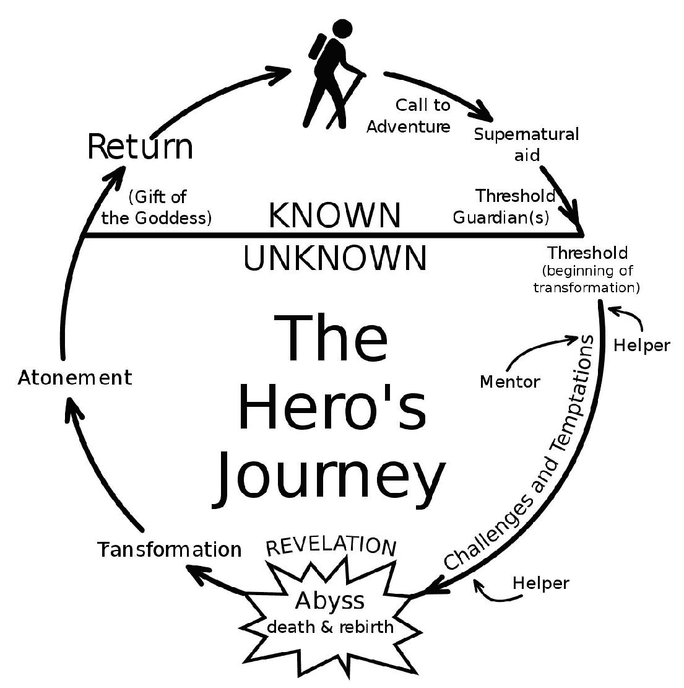
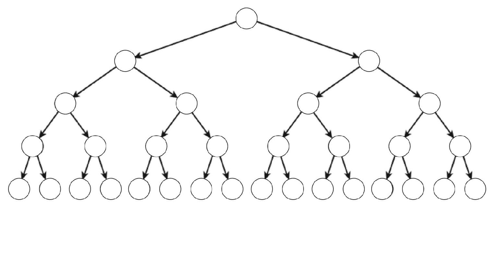
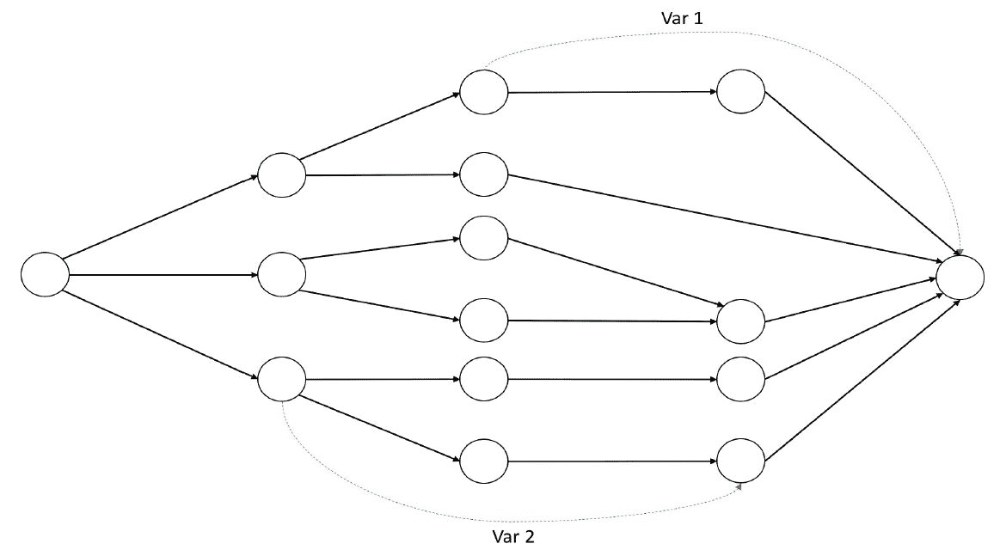

# 第九章

游戏 & 故事

我们一直在讨论如何创造愿景并将其传达给团队，以及如何在开发过程中尽早设计游戏机制并对其进行原型设计以回答基本问题。我们已经学会了如何将我们所说的“乐趣”提炼成一种互动体验。现在是时候看看如何将这些元素结合起来，形成一个叙事，将我们的玩家带入一个虚拟世界，唤醒他们的想象力，让他们沉浸在只有电子游戏才能提供的体验中。

电子游戏（就像书籍、电影或戏剧一样）可以讲述故事。故事是人类可以用来沟通的最强大事物之一。然而，电子游戏媒介的力量在于它拥有其他媒介很少具备的一个额外特点：巨大的互动潜力。不仅如此，这种潜力远未得到充分的认识、理解和广泛接受。

考虑到文学和书面故事已经存在了数千年（我们所知的最早书面故事之一是《吉尔伽美什史诗》，起源于公元前 2100 年的古美索不达米亚）。戏剧大约在公元前 600 年的古希腊诞生。即使我们考虑印刷书籍（这是一个较晚的发明），我们也谈论的是几个世纪以前的事情（约翰内斯·古腾堡在 1440 年发明了印刷机）。时间快进到上个世纪的头几十年，电影出现了，我们今天所知道的电影也诞生了。电视和电影是我们曾祖父辈所习惯的事物。

另一方面，电子游戏在 1970 年之前并未普及于大众，即使在那时，它们也没有被用作叙事形式。复杂的故事、深入的角色、深刻的主题在 80 年代末开始出现，并在 90 年代蓬勃发展。这还不到 40 年前，想想看！许多人仍然认为电子游戏只是儿童和青少年的娱乐。一些玩家甚至不认为自己是游戏玩家，尤其是那些花费数小时玩糖果传奇或双倍下赌场老虎机等游戏的休闲玩家。70 年代之前出生的一代人并没有在电子游戏中成长。但我的那一代人，即 70 年代末至 80 年代中期出生的今天年轻人的那一代，完全沉浸在其中。我们见证了游戏机的兴起和几乎所有电子游戏系列的诞生。游戏是我们生活和文化的一部分。

可以肯定的是，在未来的几十年里，几乎每个人都会熟悉电子游戏作为一种现代叙事形式。

叙事

牛津词典将叙事定义为以下内容：

“一系列相关事件的口头或书面描述；故事”

你是否记得我在本章引言中提到的？它已经过时了！叙事不一定是口头或书面讲述的……它可以通过图像来讲述，无论是静态的（摄影、艺术）还是动态的（电影和是的，电子游戏！）！然而，有一个常见的错误：认为交互性可能会改变人类历史几千年以来设定的基本叙事规则。它不会。

故事是目标，无论它如何讲述。所以好故事的规则永远不会改变。

事实上，在本章中，我们只是简要地讨论了如何写一个好故事。这是一个巨大的话题，需要几本书来阐述。像往常一样，我总是强烈建议你选择这个话题，并深入研究，如果你对此最感兴趣的话。并不是所有设计师都是故事作家。如果你想在这个特定领域专业化……阅读、游戏、观看和学习！你可以从阅读一些关于剧本创作、创意写作或关于电子游戏写作的特定书籍开始。

作为游戏设计师，真正重要的是要知道如何将叙事的各个部分组合起来，并以与你的游戏相匹配的方式重新讲述。最终，游戏设计师的工作是让故事可玩。

所有游戏都有叙事吗？

一个永恒的问题。而且没有确切的答案。但值得一提的是，有些游戏相当抽象。俄罗斯方块立刻浮现在脑海中，但任何益智游戏或脑力游戏都不太可能讲述任何故事。在像 Threes 这样的游戏中，玩家只需要在四乘四的网格上滑动带数字的瓷砖，将加数和三的倍数组合起来。当然，将这些游戏与叙事丰富的游戏（甚至与上述太空侵略者这样极其简单的叙事游戏）相比较，可能会给人一种它们没有任何叙事的印象。

但难道玩家在玩这些游戏时本身不是在创造一个故事吗？

玩家能在俄罗斯方块或 Threes 中获得如此惊人的分数，以至于他会一遍又一遍地告诉所有朋友吗？“啊！我有没有告诉你，我在俄罗斯方块中得到了 999,999 分？”

这正是一个故事，一个玩家是主角的故事！

无论这个问题的最终答案是什么，有一个真理每个设计师都应该牢记：

一款好游戏在人们玩它时会产生故事。这就是 Jesse Schell 所说的故事机器。

《故事机器》这一概念已经在许多游戏中得到了应用。它包括为玩家提供一个工具箱，其中包含他们可以与之互动的元素，以创建我们在《第六章》中定义的“涌现式游戏玩法”，即《机械发明》。像《模拟人生》或《孤岛惊魂》这样的游戏是这一概念的绝佳例子。在《孤岛惊魂 4》中，玩家可以选择以不同的方式应对各种挑战，包括通过引诱一只捕食性动物进入敌营而不是战斗，或者烧毁一棵树并让火势在一定区域内蔓延。

确保你设计的游戏能够让玩家通过不同的选择来创造不同的故事。

为什么故事对游戏有益？

“游戏中的故事就像色情电影中的故事：它在那里是预期的，但并不是那么重要。”

这段来自约翰·卡马克（Doom 的创造者和 ID 软件的创始人）的引言应该能让你对围绕游戏和故事辩论的规模有所了解。一方面，卡马克所说的可以理解，因为他想强调游戏之所以是游戏，首先是因为它们必须被玩。另一方面，游戏故事可以唤起与观看电影或阅读书籍时感受到的深度情感。这是一个意见问题，但有一点是客观的：故事和游戏非常搭配。这也是为什么许多游戏都包含某种故事，而且过去十年中最成功和最受好评的游戏中，一些游戏包含有意义的丰富故事和出色的角色。

为什么会这样？为什么故事对游戏如此有益？有多个答案。

首先，故事与听众（在我们的情况下是玩家）建立了情感联系。这已经非常巨大。此外，故事提供了一个结构（通常包括开始、中间和结束），通过这个结构可以组织游戏时刻。它提供了一个超越游戏玩法的动机。玩家自然会想要了解更多关于情节、角色和游戏世界的信息。

最后，正如拉夫·科斯特在他的书《乐趣理论》中解释的那样，游戏是人类自然用来学习（而且不仅仅是人类；动物也通过玩耍来学习！）的工具。故事服务于相同的目的。游戏和故事在非常深层次上相连。围绕另一个构建结构将帮助你塑造设计，并且很可能会制作出更好的游戏。

传统叙事模型

我们可以识别出两种主要的视频游戏叙事结构模型，即三幕故事和单一神话（或英雄之旅）。当然，这些不是唯一存在的两种，但它们是最常用的，也是其他结构发展出来的基础。单一神话，正如我们将要看到的，是三幕故事的更具体和更详尽版本，它不仅涵盖了故事结构，还包括了生活在其中的角色。

这两种模型是理解叙事与游戏之间深层关系的绝佳起点。不要因为大多数故事都拥有相同的核心结构而感到害怕。这种情况已经持续了数百年，尽管如此，仍然有如此多的不同故事被讲述。当然，还有其他讲述故事的方式，还有更多有待发现和创造。但我们的建议始终是，在尝试改变或颠覆它们之前，先掌握基本规则！

三幕故事

三幕故事背后的概念非常简单：每个故事都有一个开始、一个中间和一个结尾。这个概念极其直观，因为我们所知道的大多数故事都遵循它。只需想想那些以“从前有个故事”开始，以“经过一系列事件之后，他们幸福地生活在一起”结束的经典童话。电影、书籍和许多游戏都遵循相同的模式。

通过观察每个部分或行为中发生的事情，给出了更好的开始、中间和结尾的定义：

+   引言（开始）：这是故事设定的地方。描述了角色和场景。本节中的所有内容都回答了诸如谁和为什么等问题。谁是故事的主角，他们为什么参与即将发生的事件？他们的动机是什么？通常，引言以一个事件结束，这个事件促使主角解决某种冲突。一个坚实的引言使读者/观众/玩家能够与主角产生共鸣，并理解他们的行动动机。

+   对抗（中间部分）：这是故事中最大的一部分；在这个行为中可以发生许多事件。基本想法是主角面对冲突及其来源（传统上是大反派）被呈现出来。在这个弧线中，紧张感急剧增加，并在主角即将解决冲突的时刻达到高潮。

+   解决（结局）：大结局。冲突得到解决（无论是快乐的还是糟糕的结局）。一旦冲突得到解决，故事就会迅速结束（因为情感高潮已经达到，现在正在消退）。

单一流派

在叙事学中，单一流派是一个模板，用于讲述主角（英雄）进行冒险、面对某种危机或冲突并战胜它的故事。当他回到家时，他已经因为这次旅程而发生了转变。单一流派的研究可以追溯到古希腊，单一流派已经贯穿了人类数千年的经历。

1949 年，约瑟夫·坎贝尔在他的里程碑式著作《千面英雄》中普及了单一流派。

坎贝尔如下描述了叙事的结构：

“一个英雄从平凡的世界出发，进入一个超自然的神奇领域：在那里遇到了神奇的力量，并取得了决定性的胜利：英雄带着神秘冒险的力量回到这个世界，能够给予他的同胞恩惠。”

坎贝尔确定了英雄旅程的 17 个阶段。并非每个故事都包含所有 17 个阶段；有些可能只关注几个阶段，而有些可能以不同的顺序包含它们：

英雄的旅程。来源：维基百科（匿名）

英雄的旅程现在被许多创意专业人士广泛使用，不仅限于游戏，还包括电影、电视、小说和漫画。它不是唯一的叙事模式，但它是那些对视频游戏故事非常有效的一种，因为它们往往涉及英雄的存在并涉及他们进行某种冒险。

英雄旅程的 17 个阶段

17 个阶段通常分为三个部分：

+   离别

+   启蒙

+   返回

让我们更仔细地看看每一个。

离别

在这个行为中，英雄或主角的普通世界被介绍，当英雄接到冒险的召唤时，正常的日常生活被打乱。英雄通常会拒绝召唤，但一位导师角色出现，鼓励并指导他：

1.  冒险的召唤：英雄被描绘在他的普通世界中，过着普通的生活。突然，他收到了一些信息，召唤他进入未知的旅程。

1.  拒绝召唤：英雄拒绝放弃他的普通生活。这可能是因为恐惧、责任、不安全感……任何让英雄停留在当前普通世界的借口。

1.  超自然援助：一旦英雄承诺他的新使命（有意识地或无意识地），一位导师就会出现并提供帮助。这可能以许多形式出现：建议、训练或援助，通常是魔法般的，比如赠予一个将帮助英雄在追求中取得成功的神器。

1.  跨越第一个门槛：英雄终于离开了普通世界，进入了未知的冒险世界。

启蒙

启蒙行为始于英雄踏入未知，在那里他面临考验，要么独自一人，要么在助手的帮助下。英雄继续他的冒险，直到某种危机考验他。他必须经历考验，并最终克服主要障碍或敌人。这是英雄的顶峰，最终使命完成，英雄可以领取他的奖励。

但旅程还没有结束。英雄现在必须回到普通世界。他可能被新世界的守护者追赶，或者他可能根本不愿意回去：

1.  考验之路：英雄经历一系列考验并开始他的转变。通常英雄会经历失败。

1.  与女神的相遇：英雄获得了他需要的帮助。这里的女神象征着爱与对抗逆境的终极力量。

1.  妇女作为诱惑者：在这一步中，英雄面临可能导致他或她放弃或偏离使命的诱惑。这个女人是生活中身体或物质诱惑的隐喻，但当然，这不必是一个女人（记住，坎贝尔是在 1949 年写下这一切的！）。

1.  苦难：英雄为其生活中代表终极权力持有者的任何事物赎罪：可能是人、文化、信仰或恐惧。英雄内心的怪物代表生死危机。所有之前的步骤都在向这个方向移动，所有随后的步骤都将从这个地方出发。

1.  神圣化：英雄达到了更高理解的点。现在他准备好真正面对他旅程中更困难的部分。

1.  最终的恩赐：装备了他迄今为止所学的一切，英雄面对他/她的最终挑战并取得胜利。

回归

在回归部分，英雄带着他在冒险中获得的宝藏或奖励回到普通世界，他现在可以使用这些奖励来造福他的原始世界。英雄通过冒险而改变，并在新旧世界中获得了智慧或精神力量。他将永远不再相同：

1.  拒绝回归：返回普通世界的想法让英雄感到不安。经历过那里所有的奇迹和幸福之后，他面临着带回他所取得的启迪的挑战。

1.  魔法之旅：回归之旅可能仍然充满危险，英雄可以用他新的自我来面对这些危险。

1.  从外部营救：与英雄在追求过程中需要帮助的方式相同，他可能需要向导和助手回到他所属的地方。英雄有时需要有人把他们带回日常生活，尤其是如果他们因为经历而受伤或削弱了的话。

1.  回归阈限的跨越：英雄需要保留他在追求中获得的智慧，将这种智慧融入普通生活中，然后也许找出如何与世界上其他人分享智慧的方法。

1.  两个世界的统治者：英雄在内在和外在世界、物质和精神世界中都生活得舒适，超越了自我。

1.  生活的自由：知识使英雄摆脱了对死亡的恐惧，这反过来又是生活的自由。英雄理解活在当下的重要性，既不期待未来，也不后悔过去。他终于平静下来，旅程就此结束。

> `练习`
> 
> `拿一款你最喜欢的具有丰富叙事的电子游戏，并识别出英雄旅程的 17 个阶段。用同样的方法来分析电影或书籍，比如《星球大战：新希望》或《指环王》，并比较结果。`
> 
> `你有没有注意到任何区别？有没有哪些阶段似乎更适合与电子游戏结合？`
> 
> `练习`
> 
> `你能想到一个完全不遵循单一神话结构的电子游戏故事吗？`
> 
> `列出它们，并尝试识别与经典剧情游戏之间的差异。`

为电子游戏设计叙事

我们简要地看到了故事的结构，但如何为电子游戏设计叙事？又是如何实现的？

首先要注意的是，游戏不能像电影一样简单地被编写出来，然后由系统播放。游戏叙事是在有人实际玩游戏时展开的，因此机制和动态与故事一样重要，甚至更重要。互动叙事意味着玩家应该通过自己的行动来参与和体验故事。阅读或听笔记以及观看场景应该能让人对游戏世界的深入沉浸有所了解，但绝不应该在实际游戏操作之前。想法是，即使在最注重叙事的游戏中，玩家也应该能够跳过任何阅读、聆听或场景，仅通过玩游戏就能理解游戏故事。

对于我们这些设计师来说，这可不是一件容易的任务！

我们已经在第三章《界定游戏项目》中看到，游戏的结构可以是线性的、非线性的、开放的或无限的。叙事设计与游戏结构有很多共同之处。原因非常简单；有叙事的游戏很可能围绕那个叙事来构建。

线性叙事

可以说，线性叙事是互动叙事最简单的形式。一系列关键事件推动故事发展，玩家通过游戏操作从一个事件过渡到另一个事件。这种互动性实际上相当有限。看看下面的图片：箭头代表故事，以场景、动画序列、图片或纯文本的形式呈现。圆圈代表玩家的行动。这种视觉表示通常被称为珍珠串或河流与湖泊：

珍珠串叙事方法。

重要的是要注意，在线性叙事中，故事实际上是不可交互的。无论玩家的行动结果如何，故事都会按照玩家的进度展开。玩家对故事唯一的控制就是实际上不取得任何进展。

> > > 不要犯一个简单的错误，认为线性叙事在视频游戏中是糟糕的。并不是所有的视频游戏都需要复杂的故事情节和多个结局和分支。使用线性叙事的视频游戏仍然可以非常精彩，讲述伟大的故事！
> > > 
> > > 只想想像《毁灭战士》或《使命召唤》这样的 FPS 游戏，或者像《最后一人》或《古墓丽影》这样的具有丰富故事情节的游戏。

线性叙事将所有重点都放在两个因素上：

+   故事有多好？

+   游戏玩法有多好？

我们已经讨论过这一点，以及线性游戏的制作是多么精细。始终牢记这一点！

线性且扩展了行动空间

一些游戏可能仍然遵循线性叙事，但玩家可以探索周围的环境。然而，从叙事的角度来看，线性是由这种探索自由不会影响故事情节的事实所决定的。故事不会因为探索而前进；玩家可能会获得更多故事细节，但这对故事没有整体影响。

一个很好的例子是书籍、文档或音频文件，它们在各个级别中散布着一些信息，这种探索可以增强故事情节而不影响其进程。这种做法在具有线性故事情节的 FPS 游戏中尤为常见。

想象一个游戏，在其中找到手提箱中的秘密文件实际上开启了一个不同的故事线，其中角色发现他一直追求的目标实际上是一个骗局，现在他能够追求正确的方向。具有这种可能性的游戏正在离开线性空间，进入模块化叙事。只有当玩家没有找到秘密文件时，才会移除角色被诱骗走上错误道路的那部分故事。

模块化叙事

定义复杂叙事的方法有很多；我最喜欢的术语是模块化叙事。

当叙事变得更加复杂时，设计工作应侧重于将叙事与游戏玩法和谐地整合，使玩家能够像体验实际故事的一部分那样体验叙事的每个部分。

要构建模块化叙事，故事必须以可以切割成不同形式的方式精心制作，每种形式都代表根据玩家的行动产生不同结果。一个重要的 NPC 可能在游戏的某个时刻死亡（或未死亡），这对游戏的其余部分产生戏剧性的影响。构建故事模块意味着设计故事，使其在两种情况下都能继续进行：NPC 活着或死亡。

电子游戏对作家提出的真正挑战是为非线性游戏，尤其是开放世界游戏编写清晰的故事情节。

《巫师 III》是非线性叙事的绝佳例子，同时有数百个不同的故事在进行。玩家可以自由地跳进跳出这些故事，其中一些甚至可以在玩家没有关注它们的情况下继续进行。在这所有的一切中，仍然有一个贯穿始终的主故事线，它跟随玩家的旅程从开始到结束。

让我们来看看不同类型的模块化叙事。

图

图结构意味着选择会创造一个分支叙事。分支可以导致完全不同的路径和结局（在这种情况下，图实际上被称为树）或可以在某些点上重新连接并再次分支：

在图结构中，每个节点代表一个故事点，玩家可以在那里做出选择并继续到下一个节点。

甚至可能有多个图，只在某些特定点连接。在这种情况下，我们谈论的是平行情节结构，其中两个情节或观点同时讲述，观点在不同的平行版本之间切换。一旦观点切换，叙述可以采取线性或模块化的形式。最终，所有故事线都会在时间线里程碑处汇聚，此时观点可能会再次改变。

开放结构

在开放结构中，故事元素与不同的物理地点相关联，因此玩家可以四处游荡，发现并触发故事的不同元素。有时，具有开放结构的故事甚至可能没有故事弧线，玩家完全控制英雄的旅程。何时面对各种挑战以及如何面对，都取决于玩家。旅程甚至可能永远不会有一个合适的结局。这种形式是典型的基于模拟的游戏、策略游戏以及一些基于开放世界的游戏，例如大型多人在线角色扮演游戏（MMORPG）。

值得注意的是，虽然开放结构似乎不遵循经典的三幕故事或单一神话模型，但游戏体验中始终存在一些较小的部分实际上确实遵循这些模型。

如果你考虑 MMORPG 中的任务，那些是故事中的小故事，通常非常完美地遵循三幕模型。即使没有任务而依赖即时游戏生成的游戏，如 Minecraft，也会产生遵循经典模型的故事。玩家在玩游戏的过程中创造的故事正是这样。只需尝试听听任何玩家谈论他在任何游戏中经历的游戏体验。他的故事是否遵循你熟悉的一个模型？

世界状态

世界状态的概念直接来源于状态机的概念。

状态机是一种计算数学模型。它是一种抽象机器，在任何给定时间都可以处于有限数量的确切状态之一。

想象一下状态机是你的世界（或故事），每个状态都是叙事的移动部分。

在传统的分支叙事中，例如以树状结构组织，一个决定会打开三个分支中的一个新的分支，现在需要从其他分支的不同方向前进。在具有状态的叙事中，会生成一个变量来跟踪决定，并且这个变量只会影响它被引用的节点。

想象一个故事，其中角色可能在某个时刻死亡或生存。如果记录了没有这种角色的故事状态在一个变量中，故事分支可能保持不变，但每次角色出现在一个节点时，系统都可以判断角色是否真的在那里。

你可以这样想象：

在先前的例子中，节点中可能发生某些事件，影响变量 Var 1 和 Var 2。这些事件将影响引用该变量的后续节点，因此叙事可能会根据世界的状态而改变。

一个早期的决定可能会影响后来的决定，而无需分支。

依赖于世界状态的叙事具有巨大的优势，即提供有意义的可重玩性。事实上，即使简单的状态变化，如果存在足够的排列组合来创造更复杂的状态间交互，也可能导致非常不同的故事发展。

环境叙事

"环境叙事通过至少以下四种方式为沉浸式叙事体验创造先决条件：空间故事可以唤起先存的叙事联想；它们可以提供一个舞台，在那里叙事事件得以展开；它们可能在场景中嵌入叙事信息，或者提供生成叙事的资源。”

–Jenkins，2004

环境叙事在视觉媒体中的实践已经非常成熟。“展示，而不是讲述”是许多作家所追求的目标。这一原则不仅适用于物理演员的动作，也适用于世界本身，它本身可以是一个非常重要（尽管有时被低估）的演员。

我们将在下一章关于关卡设计的章节中再次深入讨论这一点，但就目前而言，理解“通过环境讲述故事”背后的概念非常重要。

当然，环境叙事是通过游戏中的级别和环境传达给玩家的。

我们如何实现这一点？

让我们看看一些实际例子：

+   级别几何、艺术主题和建筑：这些不仅仅是为你游戏增添装饰，它们影响玩家的情绪状态，也可以讲述（或暗示）它们自己的故事。与艺术团队（尤其是概念艺术家）紧密合作，建立一套每个环境都可以讲述的背景故事是至关重要的。即使有些玩家在浏览内容时对细节不太关注，一个具有连贯背景故事、艺术主题和建筑的环境将有助于使你的观众沉浸其中：

在《地铁：最后的曙光》这款后核景观中，有一架飞机因原子弹的电磁脉冲效应而坠毁。

环境本身的细节：

+   装置（装饰）：瓶子、板条箱、汽车和骷髅不应该是仅仅的填充物。你可以仔细安排日常物品，让玩家更多地了解空间中的居民或其历史。在《辐射 3》中，一对拥抱在床上的骷髅描绘了一对恋人选择在即将到来的核末日中尽情生活的故事。不要害怕将物品放置在不适当的位置或比例，以增加角色塑造。你的 NPC 是不是一个疯子？为什么不让他的卧室里只放满茶壶... 这样的认知失调。

+   墙上的文字、标志、绘画和图片：这些可以是一个非常有效的工具；只是确保你准备好将艺术作品本地化到不同的语言或通过用户界面显示翻译：

在《死亡空间》中，非常重要的游戏玩法信息以一种不寻常的方式呈现。

+   野生动植物：游戏世界的动物和植物可以使游戏世界更加生动，同时也有助于传达背景故事。在《耻辱》中，街道上充满了成群的老鼠，这是城市被瘟疫吞噬的明显迹象。

+   物品：存在于环境中。数据盘、日记页、书籍和音频记录现在是许多游戏中的必备元素。它们可以用于从揭示主线故事到覆盖配角、支线任务和世界构建的任何事情。

+   角色：他们居住在环境中。偷听到普通市民谈论邪恶的统治者可能和看到他们在街上乞讨一样有力。将 NPC 及其服装、对话和行为视为你游戏世界的延伸。投入时间进行定制动画和音频肯定会增加预算，所以请确保首先关注可重复使用的动作和动画。

+   音频：我们不会在这本书中涵盖音频；正如你所知，那是一门独立的学科！不过，永远不要忘记，音频（对话、音效和音乐）与视觉效果和游戏玩法一样，是游戏的一部分。你会惊讶于正确的音效或甚至只是音乐可以传达多少内容。

叙事审查过程

我们已经讨论了制作电子游戏是如何关于创造、评估和迭代以找到最佳解决方案的。用户研究专家乔纳森·丹科夫（Jonathan Dankoff）和游戏作家科里·梅（Corey May）在 2015 年 GDC（游戏开发者大会）上进行了非常有趣的讨论（[GDC 2015](https://www.gdcvault.com/play/1022166)）。他们指出，在电子游戏叙事中实施审查过程的重要性，以评估和解决在前期制作过程中出现的叙事问题，并开发出具有更清晰故事线的游戏。

该框架是在育碧开发的，因此它旨在用于大规模的 AAA 级制作，但从中得到的经验对任何规模的游戏都非常有用。低估故事的影响是一个常见的错误，通常代价是支付质量较差的故事或需要扩大预算（时间和金钱）来解决本可以在早期以几乎零成本解决的问题。

在 2018 年 GDC 游戏叙事峰会上，前 Bioware 创意总监 Mike Laidlaw 提出了一个非常类似的想法，针对像质量效应和龙腾世纪这样的系列。他强调了在制作过程中尽早对游戏脚本进行同行评审的重要性。

叙事审查过程包括三个步骤，团队应该迭代一到两次：

+   阅读：不同的人阅读故事的概述

+   审查：读者对故事进行评分，做笔记或填写问卷

+   分析：讨论审查，并重复这个过程（不超过一次或两次），直到所有最大的担忧和问题都得到解决

让我们详细看看这些步骤。

第一步 – 阅读

第一步是创建游戏故事的提纲。每个场景或模块一页就足够了。这里的想法是保持敏捷。提纲详细说明了所有故事元素以及故事在整个游戏中的发展。

这个提纲随后被交给两组读者：

+   同行作家：了解游戏写作，能够提供技术反馈。

+   团队成员：游戏导演、游戏设计师、关卡设计师、负责人。所有可能参与项目决策过程的人，除了作家。

第二步 – 审查

阅读小组对脚本提出意见。他们可能会指出他们喜欢的地方，什么激发了他们想要了解更多兴趣，以及他们特别不理解或不喜欢的部分。他们可以向作家提问。

可以在脚本中添加问卷，以更实证地衡量享受程度、兴趣和理解的水平。

第三步 – 分析

所有由审查小组提供的笔记都被分析和综合成一份报告，然后在一个圆桌会议上进行讨论。

报告只包含建设性的反馈和相关问题。目的是讨论要改进的地方，而不是与审查小组共同设计叙事。

作家和审查员都参与圆桌会议，简要讨论主要问题和可能的解决方案。最后进行评估，作家对脚本进行后续迭代。

叙事审查的好处

这个过程有多个好处：

+   早期行动：这个过程应该在生产的早期进行，这意味着故事脚本很容易更改，并且在这个阶段对游戏生产的冲击非常小或没有。

+   有意义的反馈：反馈是实用的、可操作的，并由专家提供。

+   清晰的方向：对故事的有序反馈意味着作家可以用它来做出未来的决定。没有对为什么做出某些决定的猜测。

+   投资于叙事：团队将尽早了解并投入叙事。对叙事试图实现的目标有更好的理解将有利于游戏和关卡设计，甚至艺术指导。

正如所说，这个框架是为 AAA 级制作（如刺客信条）开发和使用的，但任何规模的游戏都将从尽早的开发过程中进行叙事审查中受益。

您不必严格按照描述的步骤进行，或者您可能想尝试这种方法，然后根据您的经验开发自己的框架。无论您选择做什么，都不要忘记，如果您正在开发一个具有深刻和丰富叙事的游戏，写作过程将需要与游戏玩法相同的关注。

> > > 本章中使用的截图仅用于说明目的。我们不推荐您以任何方式误用这些截图。如需更多信息，请参阅本书免责声明部分提到的出版商的条款和条件。

摘要

我们已经窥视了叙事是如何为视频游戏设计的，以及故事如何非常适合视频游戏媒介。当然，这实际上只是冰山一角。交互式叙事是一个庞大的学科，游戏设计师应该了解，但除非他们想专门从事写作或叙事设计，否则不一定需要掌握。对于想要深入了解的读者，我们已经建立了一些起点。

我们探讨了两种常见的叙事类型：三幕故事，它有一个开始、一个中间和一个结束，通过这些部分，紧张感不断升级并达到最终的高潮，以及单一天赋，它用来代表原型英雄通过一次冒险，将他带出舒适区进入一个充满发现和体验的新世界，然后再返回。

我们探讨了游戏中不同叙事结构，包括线性和模块化结构，并强调了叙事与我们在前几章讨论的游戏结构之间的相似性。最后，我们审视了审查叙事设计的技术，这是一个游戏设计师应该始终参与的过程，尤其是在他们不是编写故事的人时。
