# 第十一章

角色

是时候看看在游戏世界中角色是如何被创造和管理的了。当谈到角色时，游戏设计师的责任是将角色的身份、行为以及他们的技能、能力和行为转化为游戏玩法。我们之所以在《游戏与故事》的《第八章》中首先讨论叙事和如何编写角色，并非巧合。即使是对于最简单的角色，也需要几行文字来回答一些基本问题。无论这些答案多么简单或基本，都将对玩家对游戏世界的认知产生深远的影响。

以《太空入侵者》为例：

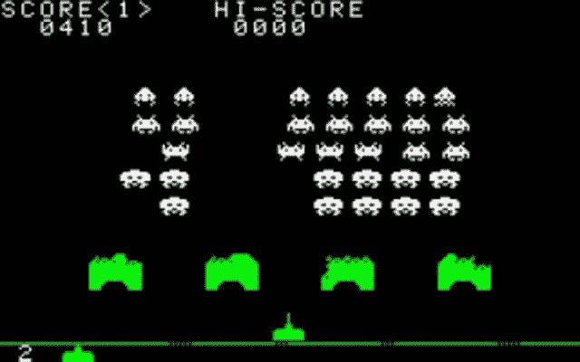

《太空入侵者》中的主要角色：入侵的外星人和你的飞船！

它只包含四种类型的敌人：小型、中型和大型入侵者以及 UFO 飞船。尽管如此，描述这些角色的身份、来源以及他们为什么在那里对于确定他们的设计和实现至关重要。所有入侵者都具有相同的速度和相同的攻击方式，并且只需一击即可摧毁。但它们的大小不同，这使得它们被击中的难度有所不同。UFO 偶尔出现，快速从左到右穿过屏幕，向玩家射击。仅用四行文字描述四个敌人。虽然很简单，但对于实现来说却非常详细和具有信息性。

让我们跳过几十年。

Ubisoft 的《孤岛惊魂》系列因其反派角色而闻名。到目前为止发布的五款游戏中，孤岛惊魂的反派角色变得越来越复杂。

在最新的作品中，《孤岛惊魂 5》中的主要反派角色是一个非常复杂且具有争议性的角色，引发了众多争论：

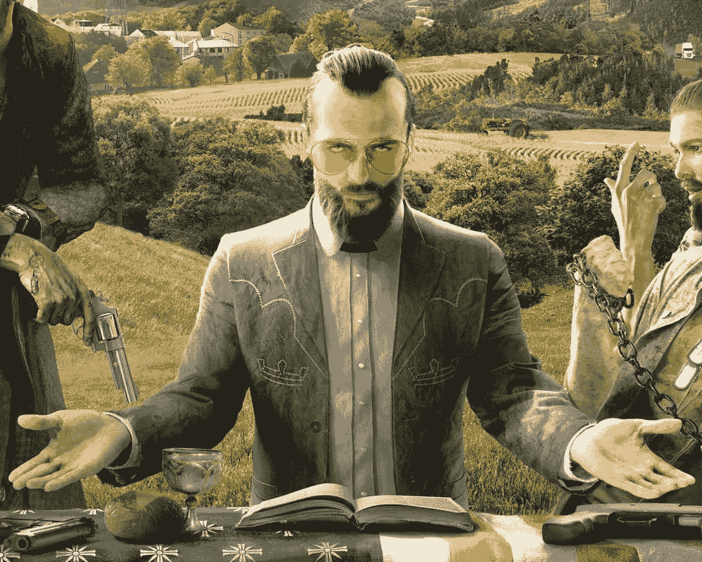

约瑟夫·西德在著名的《孤岛惊魂 5》宣传图片中

让我们看看游戏维基上的简要描述：

“约瑟夫·西德是一个无情的独裁者，他是位于希望郡的宗教团体‘伊甸之门计划’的创始人兼领导者，他与他的兄弟姐妹们（他称他们为‘先知’；雅各、约翰和费恩·西德）一起。伊甸之门计划通过胁迫和暴力将希望郡的现有居民纳入其教派，这是根据西德的命令进行的，并且，根据游戏中的事件，与抵抗组织和其成员直接冲突。”

你能想象他在《孤岛惊魂》这样的 FPS 游戏中是什么样子吗？你认为他在游戏中会是什么样子？他会拥有哪些能力？他会给玩家带来什么样的挑战？

让我们再举一个例子。关于耶西的例子呢？：

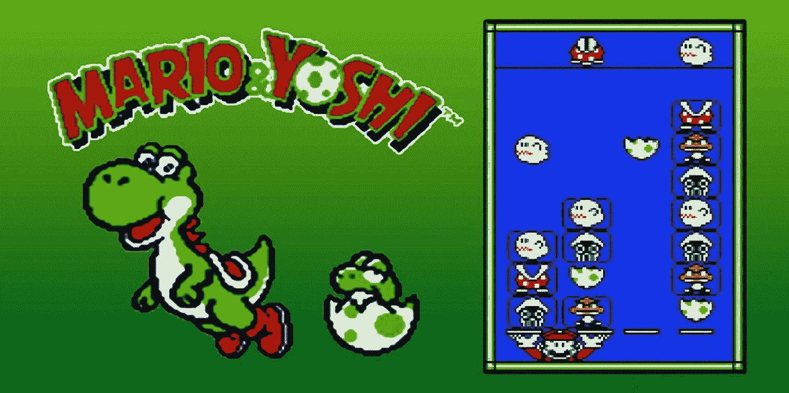

耶西是超级马里奥宇宙中一个拟人化的恐龙。

耶西可以跳跃，用它的舌头抓住远处的物体并将它们吞下，甚至可以产下可以扔向敌人的蛋。

你可能已经注意到，在前面的例子中，我没有提到任何可玩角色。实际上，大多数时候，游戏中真正的明星不是你扮演的角色，而是你遇到和互动的角色，包括敌人和盟友。敌人和盟友（通常称为不可玩角色）使世界生动起来；他们与玩家对抗或协助玩家，是任何游戏的基本组成部分。

可玩角色、NPC 和敌人

在电子游戏中，有三种不同类型的角色：

+   可玩角色：这些是玩家直接控制的角色。在一些游戏中，可能只有一个（主要主角），而在其他一些游戏中，可能有多个主角。有时玩家可以暂时控制一个 NPC。在其他游戏中，可能根本就没有主角。例如，在《星际争霸》这样的策略游戏中，玩家控制的是单位。其中一些单位可能是独特的英雄或指挥官，一些可能是车辆：坦克甚至宇宙飞船。像《最后一人》中的乔尔或《星际争霸》中的战列舰单位这样的主角的创造规则可能非常不同，但最终，你用来概念化和设计他们的原则并不那么不同。

+   不可玩角色（NPC）：NPC 是居住在游戏世界中的角色，但玩家无法控制。它们由游戏设计师设计的预定行为控制。它们要么被编写成遵循精确的动作和反应顺序，要么由某种人工智能（大多数情况下是两者的结合）驱动。

+   敌人：敌人是干扰玩家目标并构成某种挑战的实体。他们不一定是试图杀死玩家的邪恶实体。一些敌人可能只是阻止玩家实现目标，例如纪念碑谷中的乌鸦，需要通过寻找替代路线来避开。他们不会对主要角色的生命构成威胁……他们只是不让她通过！

在接下来的段落中，我们将探讨如何对这类角色进行分类、概念化和设计。

角色的功能

游戏中的每个角色都应该有一个特定的功能，无论是盟友还是敌人。你不想让你的世界中充满没有目的、只是填补空白空间的角色。

对于敌人来说，也是如此。每次在游戏中引入敌人，它都必须在整体游戏体验中发挥作用。敌人不仅仅是屏幕上试图以某种方式阻止或杀死玩家的抽象实体。他们为什么要阻止玩家？他们是谁？他们的动机是什么？

并不重要所有这些信息实际上都传达给了玩家。她可能永远不会知道为什么《太空侵略者》中的外星飞船试图入侵我们的星球。也许他们只是因为感到受到威胁而射击玩家的宇宙飞船。也许这是一次和平的迁移？好吧，可能他们真的想入侵地球并摧毁上面的每一个人类，但重要的是，这确实在设计者的脑海中非常清晰。

每个 NPC 或敌人都是加深玩家对游戏世界沉浸感的机会，提供一些帮助，一些新鲜挑战，一些困境，或者仅仅是提供一些洞见。角色也会在玩家中唤起情感。我们已经看到人类情感对于玩家来说是多么重要和强大。制作角色，就像制作游戏机制和叙事一样，是构建和传达游戏情感的一种极好方式。

让我们来看看一些你可以使用的经典角色，他们的角色，以及他们在玩家中激发的情感。请记住，这些类别并不是一成不变的；它们可以相互混合，一个角色可以很好地同时扮演多个角色，或者在不同的游戏时刻扮演不同的角色。让我们逐一了解他们——找到适合你游戏的正确组合将取决于你！

朋友/助手

在众多游戏中，朋友或助手是一个非常常见的 NPC。他可能是需要玩家帮助的人，也可能是提供帮助的人。他可以是剧情的主要部分，甚至是一个可玩角色。友谊是一种强烈的东西，它可以创造一种归属感和归属感。信任、同理心、快乐，以及嫉妒和竞争，都是与朋友相关的情感。一些最好的例子是《最后的守护者》中的男孩和 Trico，以及《最后生还者》中的乔尔和艾莉，还有《天际》中的莉亚德（以及玩家）。

恋人

在游戏中，恋人类似于朋友在功能和玩家情感上的作用。一些游戏中的浪漫是由故事本身决定的，但有些游戏，尤其是 RPG，如《巫师》，或生活模拟器，如《模拟人生》，允许玩家追求和体验自己的浪漫。

在视频游戏中，用爱情这样的情感来玩游戏长期以来一直被低估。随着媒体及其受众的演变和成熟，爱情正成为一个非常受欢迎的主题，并且越来越不受刻板印象的束缚。你可以在《Catherine》、《Life is Strange》、《The Last Day of June》、《最终幻想》、《博德之门》、《龙腾世纪》等许多游戏中找到一些非刻板化的、伟大的爱情故事！

导师

你好，朋友。请稍作停留，倾听！这句来自《暗黑破坏神》中的德卡德·凯恩的经典台词，将在任何《暗黑破坏神》粉丝心中唤起深刻的游戏回忆。德卡德·凯恩代表了所有导师应该具备的品质：一个智慧、知识渊博的角色，总是乐于帮助并指导英雄。

导师是非常受欢迎的角色。他们总是很方便地教玩家一些东西，无论是关于游戏还是游戏世界。他们在介绍和解释游戏世界的背景故事和游戏机制方面非常出色。你经常可以看到导师在教程中教授游戏。在免费游玩游戏中，导师的使用变得极为流行，因为需要快速向玩家介绍游戏的核心机制和世界背景故事，这使得这种类型角色的使用变得非常合适。

随从（敌人）

我们将在后面深入讨论这些坏家伙。敌人、怪物、外星人、凶猛的动物；它们都希望阻止玩家实现她的目标。在游戏中，它们的功能是为玩家提供一个需要克服的挑战，阻止她，甚至杀死她的角色。

但事情并不那么简单。创造有趣且独特的敌人是一门需要掌握的艺术。他们的最终目标无疑是阻止玩家，但真正的问题是他们会如何做到这一点。我们将在本章后面更详细地探讨这个问题！

同盟

同盟与朋友或助手不同，因为他们与玩家以不同的方式建立联系。他们可能是 FPS 游戏中你的小队战友，例如《战地 1》。他们既不是朋友也不是完全成熟的角色，但可以创造一个真实的战争场景，其中战斗不是围绕玩家的角色和众多敌人展开，而是可以在不同的前线发展，并最终进入不同的场景。与同盟相关的情感很大程度上取决于玩家类型，但它们通常唤起某种战友之情。玩家可能会无意识地调整她的策略来保护她的同盟，甚至在同盟的行为被高度脚本化且完全不受玩家行动影响的游戏中，也会尝试拉起团队合作。

一些游戏，如《战争机器》，将同盟作为核心游戏玩法的重要组成部分。在《战争机器》中，同盟的支持对你的成功至关重要，你甚至可以向团队下达命令，选择正确的策略。

在像《博德之门》、《暗黑破坏神》或《龙腾世纪》这样的游戏中，玩家控制主要角色，同时也控制与他或她一起的整个冒险者团队。在这些游戏中，同盟和主角之间的区别变得模糊，但玩家对主要角色的情感依恋仍然非常强烈。

老大

老大，和其他敌人一样，向玩家提出了挑战，阻止她进一步前进。但关于老大，还有更多的事情。他们是玩家旅程的里程碑。它们通常位于关卡或区域的末尾，代表着物理上的转折点。

它们在提供的挑战方面也与普通小兵不同。通常来说，它们更难击败，因为它们围绕新的和独特的机制设计，需要玩家掌握游戏机制才能击败它们。与 Boss 相关的情感包括恐惧、期待、愤怒、惊讶和自豪。

在电子游戏中，一些最难忘的怪物是 Boss。有些游戏，如《黑暗之魂》，甚至将 Boss 作为其核心设计的支柱之一。有些游戏，如《最终幻想 15》，甚至将 Boss 概念提升到一个更高的水平，在那里你遇到的每个敌人确实都是一个 Boss。

你将在本章的专门部分中了解更多关于 Boss 的信息！

对手或反派

大多数时候，对手都是一个 Boss；最终 Boss。玩家在其旅程中必须面对的最终障碍。与 Boss 不同，对手在整个游戏中都会悬在玩家的旅程之上，为最终战斗营造巨大的期待感，并在玩家心中产生真正的仇恨和挑衅感。

一个对手拥有一个坚实、可信的背景故事非常重要，你需要确保玩家能够一瞥其内容。比以往任何时候，创造一个引人入胜的反派是提升游戏至伟大之境的关键。在设计反派时，有一些事情需要考虑；我们将在本章的“坏蛋”部分中稍后讨论。

人质

人质（如果是一个朋友或恋人就更好了）是一个很好的叙事工具，可以扭转局势。营救人质可以改变故事节奏，甚至扭曲游戏玩法。想想看，当目标从消灭所有敌人转变为拯救人质时，射击游戏会有多么不同。玩家可能需要改变策略，更加小心地玩游戏，因为一枪走火或手榴弹放置不当可能导致严重失败。营救人质是一个如此有趣的玩法场景，以至于一些游戏专门围绕它设计，例如彩虹六号和《人质》。

商贩

提供购买或出售商品机会的游戏...通常需要某种形式的商贩（除非买卖商品仅使用界面）。商贩角色在 RPG 和动作游戏中非常受欢迎，但它们被用于所有类型。在 MMO 中，商贩的概念进一步发展，玩家可以“雇佣”一个商贩，即使玩家不在线，也能将她的物品卖给其他玩家。

一些其他游戏，如《死亡空间》，已经使用机器人形式的商贩角色，为商贩角色在人类卖家不合理或不真实的情况下出现提供了理由。通常，商贩也用于创造一种家的感觉或安全的地方，玩家可以在那里远离危险地完成她的交易。如果你正在创建一个城市、营地或定居点，使用商贩角色为它们增添一些生机！

任务发布者

任务提供者类似于商人。他们不是交易商品，而是交易任务和奖励。他们还可以提供一些关于世界背景的见解，或者给玩家提供提示。提供支线任务、请求玩家帮助或启用新的叙事分支的角色是许多游戏中的绝佳补充。他们让世界栩栩如生，给人一种主角不是独自在一个充满只有需要击败的敌对生物的静态世界中的感觉。他们有需求、动机、故事。

显然，这些角色在 RPG 中得到了广泛的应用。尝试玩一些 RPG 或 MMO，关注那些给你提供任务的角色。记下他们提供的任务类型以及他们如何促进故事情节的发展。

竞争对手

竞争对手与敌人、Boss 或反派截然不同。竞争对手的动机可能远非希望玩家死亡或停止。通常，竞争对手与玩家的目标相同，他所提出的挑战是在通往这个目标的比赛中击败他。

例子可能是赛车游戏中的其他飞行员、体育游戏中的对手团队，但也可以是 RPG 或动作游戏中的 NPC。竞争对手激发了竞争的刺激、失败的挫败感以及成功的自豪和兴奋。

> `练习`
> 
> `玩一些我们提到的游戏，并关注每个可玩角色的特征、NPC 和敌人。你能识别他们的功能吗？他们属于我们提到的任何类别吗？也许属于一个新的类别？`

角色统计数据

我们如何表示使一个角色与众不同的属性呢？如何在游戏中表示我们用文字描述定义的角色特质？

一个经典的回答是：“用统计数据！”（简称 Stats）。统计数据是对虚构角色（或单位、建筑，甚至整个星系）方面的数值表示。Stat 的概念起源于笔和纸 RPG，实际上在 RPG 视频游戏中非常受欢迎，但它的多功能性和普遍可理解的概念使得统计数据在许多其他类型中也非常有用。

统计数据可以用来表示角色的身体或心理属性，例如健康点数（HP）、力量、抵抗力、速度和智力：

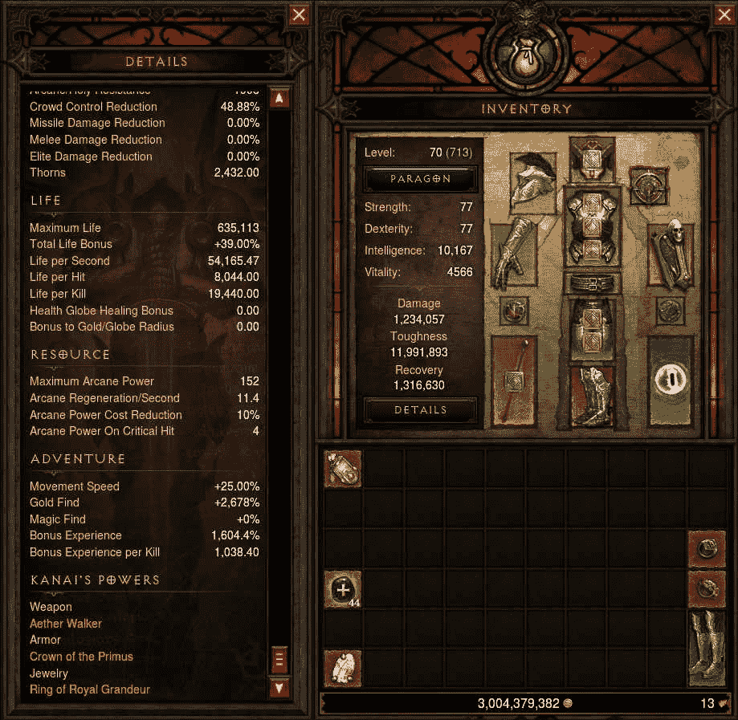

《暗黑破坏神》因其大量的统计数据而闻名，其中一部分体验就是优化并最大化这些数据

统计数据不一定是数字。例如，在《模拟人生 4》中，你可以通过选择抱负来定义角色属性，这将影响游戏中的某些机制。值得注意的是，在底层，所有这些特征在游戏代码中仍然是数字。这些数字如何呈现给玩家很重要。并不是所有玩家都希望查看我们在《暗黑破坏神》中看到的统计数据量。而且，并不是所有玩家都愿意花时间进行计算和优化他们角色的数字。不同的受众期望并享受不同复杂程度的内容，更重要的是，并不是所有游戏都需要用数字来表示它们世界的属性：

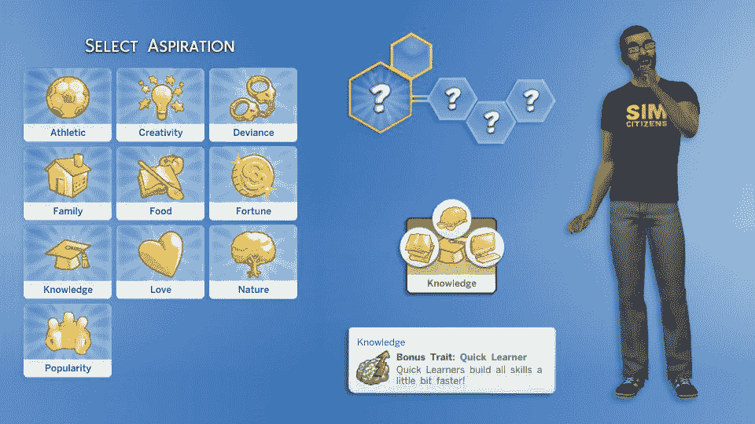

《模拟人生 4》的角色创建过程包括选择多个抱负来定制角色并为他们提供一些独特的游戏内奖励

使用数字来表示角色的属性不仅简单直接；它提供了一个游戏平衡的框架。它允许我们比较两个角色并确定哪个角色比另一个角色更好。

它允许设计师通过数学公式来表达机制。如果一个角色的生命值（HP）和武器造成的伤害量都用数字表示……总会有一个函数可以将武器的伤害量转换为玩家被击中时失去的生命值。（通常，伤害量正好等于被扣除的生命值数量）。

即使统计数据不是用数字表示，而是用形容词（例如，一个角色可以是强壮或弱小），也总有一种方法可以将单词或概念转换为数字，并且作为游戏设计师，你的工作是在此方面感到非常舒适，并尽可能多地使用数学。我们将在后面的第十三章《平衡》中看到如何使用这些数字，但这不仅仅是平衡的问题。视频游戏是软件的一部分，最终一切都可以用数字表示。当你设计一个系统时，你应该始终考虑这一点。

> > > 我总是强烈建议新手游戏设计师通过玩《龙与地下城》（Dungeon & Dragons）来学习基础知识，例如角色创建。你只需要规则手册、几个骰子、一支笔和一些纸张。
> > > 
> > > 从仅仅创建一个 D&D 角色中你可以学到多少东西真是令人难以置信！
> > > 
> > > 如果你还没有尝试过，那就去做吧！

好了，现在就到这里吧。我们将进行一个小设计练习，为你在希望已经玩过的游戏中创建一个新的角色：守望先锋。

逐步的角色设计

拥有多个英雄的游戏非常适合进行实验和测试你的设计技能。你已经有一个坚实的基础：一个具有核心机制且运作良好的现有游戏。此外，你可能对任何你喜欢的游戏有什么不足或什么可以成为任何你喜欢并玩得多的游戏的绝佳补充有一些想法……所以一半的工作已经完成了！

> > > 仔细阅读这部分内容，读完之后，尝试为你最喜欢的游戏进行一些角色设计。记住，这类练习在求职面试中是一个非常常见的问题。
> > > 
> > > 总是预期会被问到一些问题，比如“为游戏创建一个新英雄”或者“你最喜欢这个角色的哪些机制？”甚至“你会如何改进这个角色？”
> > > 
> > > 在学习游戏设计的过程中，你做得越多，你的回答就会越好，也会更有趣！

设计新角色的步骤大致如下：

+   获取对游戏的深入了解

+   记录游戏的设计支柱，并将它们放在你可以随时看到的地方

+   找出在现有角色之间当前的力量平衡（或失衡）中可以添加什么有趣的内容；你的角色在游戏世界中处于什么位置？

+   写一个高概念

+   设计角色的能力和机制

+   定义并平衡角色的统计数据

+   原型

+   迭代

+   最终实现

请记住，所有这些都是在并行或与艺术团队合作中完成的。作为游戏设计师，你的工作是创造一个能够工作的新角色，无论最终它看起来会是什么样子。高概念和初始概念艺术总是有助于定义能力、武器和装备……但你的设计应该首先由第三步来指导。

一旦你找到了一个新角色的新吸引力和机制的最佳位置，任何艺术作品或新概念都不应该让这个角色偏离轨道。你不想在你设计一个治疗者角色时，最终得到一个狙击手（尤其是因为已经有这样一个角色了！）。

让我们分析每一步。

获取对游戏的深入了解

第一步很简单，但仍然非常重要。如果你不是某个游戏的真正专家，你就无法为游戏设计一些新内容。我们之前已经说过，现在是一个很好的时机来重申这一点：成为你正在工作的游戏的专家。理解问题、系统、关卡设计、每个角色的优势和劣势……等等！

许多初级游戏设计师抱怨他们被要求有工作经验才能获得游戏设计工作。有一种方法可以在没有工作的情况下获得这种经验！解构你玩的游戏，积累 50+小时的游玩时间，并深入了解这些游戏。然后把它都写下来。

你能记得任何比这次更有趣的学习课程吗！我们选择了多么好的工作啊！

然而，不要被“乐趣”和“玩耍”这些词所迷惑。与普通视频游戏玩家不同，专业游戏设计师需要发展她的观察技能，并且比仅仅为了乐趣而玩游戏更加专注于游戏分析。我的建议显然是尽可能多地玩游戏，但确保你花费在游戏上的至少 50%的时间是专注于这种解构体验，而不仅仅是玩游戏。

记录设计支柱

为了为游戏设计新内容，你必须知道其设计支柱是什么（我们不会讨论艺术支柱，因为它们与这个话题无关）。我们无法确切知道守望先锋的设计支柱是什么，但我们可以假设游戏体验的核心是像团队合作、流畅的三维移动、角色多样性和独特性以及观看的乐趣这样的东西。

你设计的每一件事都必须与支柱相关。在我们的案例中，这意味着显然，新角色应该是独特且多样化的，但以一种使她在游戏中有趣的方式，考虑到她的：

+   移动风格

+   在团队中的具体角色和功能

+   加上一个与守望先锋宇宙相匹配的有趣背景

写一个高概念

到目前为止，你应该有足够的信息来写一个高概念。这与我们在第三章中讨论的为整个游戏做规划类似。只需几句话，就能给出你心中所想的整体概念。

一些现有角色的例子也可能适用。记住，这是一份内部文档，目的是向艺术家和开发者解释一个想法。所以真正重要的是它能做到这一点。

让我们尝试为我们的角色写些东西。

公主是一位秘密特工，据传言她曾与守望先锋和黑守望都合作过。她是一位神秘的女士，一位精通间谍和渗透的高手，她更倾向于欺骗和破坏而不是暴力和蛮力。她可以访问一套超高科技的装备和装置，包括一种术语光学服，使她能够与环境融为一体，几乎隐形，以及红外线窃听器。她是詹姆斯·邦德和《攻壳机动队》中的大佐宫水三叶的混合体。

正如你所见，我已经使用了我们为角色定义的基础，然后通过一个简单的叙事来扩展，这将给我在下一步中的一些方向。这里的要点是，你需要从一些非常实际的东西开始；游戏需要什么样的角色，从机械角度来说。然后你可以开始想象她的样子和她有什么背景，利用这些新信息来继续她的能力、设计和属性平衡。

当然，有时你可能会从概念开始。对此没有严格的规则。有时你可能会想出一个非常强大的概念，其他所有东西都会由此产生。

或者也许你知道你需要多个角色，你开始完善他们的背景和外观，在为每个角色分配具体角色或功能之前。

定义并平衡属性

为现有游戏创建新内容的好处在于，我们有一个稳固的起点。

在守望先锋中，每个角色都由一组基本属性（HP 等）、一件武器和一组能力来定义。

由于我们知道我们的角色的武器将是一把手枪，定义其统计数据的第一步就是查看游戏中所有可用的类似武器。一旦我们有了基准，我们就可以开始平衡这种特定武器与它。我们将在本书的后面讨论如何平衡游戏（以及因此其较小的部分，如武器或角色）。

武器

我们将使用游戏中所有现有的手枪武器作为基准（网上的维基是快速查找此类信息的绝佳工具）。正如我们所知（因为概念），手枪将是某种刺客的武器，我们可以很容易地推断出它应该有一个消音器。游戏中消音器效果会改变什么，比如说麦克里的大口径左轮手枪？

让我们看看我想到的：

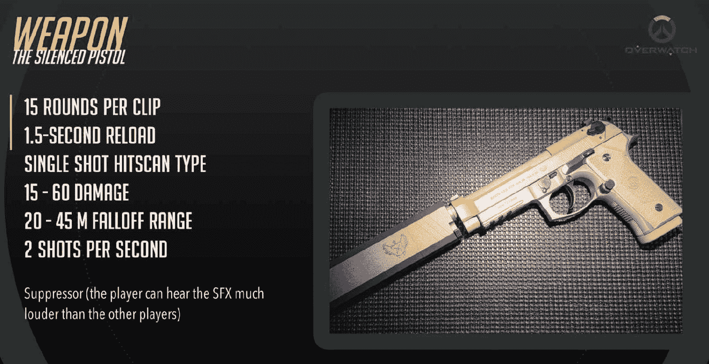

就像游戏中的其他武器一样，我们的新武器有以下统计数据：每弹夹的子弹数、装填时间、射击类型、伤害、衰减范围、每秒射击数

能力

是时候设计能力了。我们知道每个《守望先锋》角色至少有一个主要射击，一到三个能力，和一个终极技能。有时他们可能还有一个次要射击和被动能力。

从概念中我们知道她必须拥有一个隐形能力。

《守望先锋》中是否有类似的能力？有几个，最相似的是 Sombra 的术语伪装。那么我们如何确保我们的角色依赖于这种机制但感觉不同？我们可以显然地通过变量来玩，比如持续时间与冷却时间（如果持续时间更长，冷却时间可能更长，反之亦然），但我认为通过平衡更长的持续时间与另一个机制会感觉相当不同：她移动得越多，隐形效果越差，使她在移动时越容易被看到。

这里的想法是提出一个使用角色的策略，包括她的能力、优势和劣势：

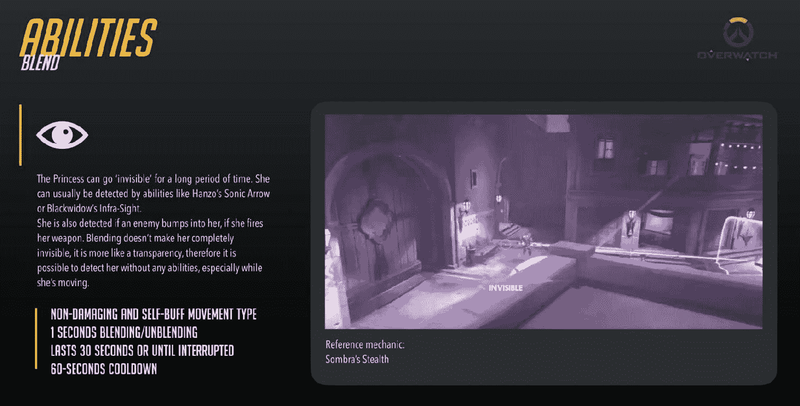

公主的“混合”能力是结合了一个现有能力：Sombra 的“潜行”，这也是概念文档的参考图像。

我想让她用手枪变得致命，但又不至于过度强大（OP），所以她的被动能力需要玩家有很高的技能（以获得头部伤害的加成），但她也有一个自动瞄准一次头部射击的能力：

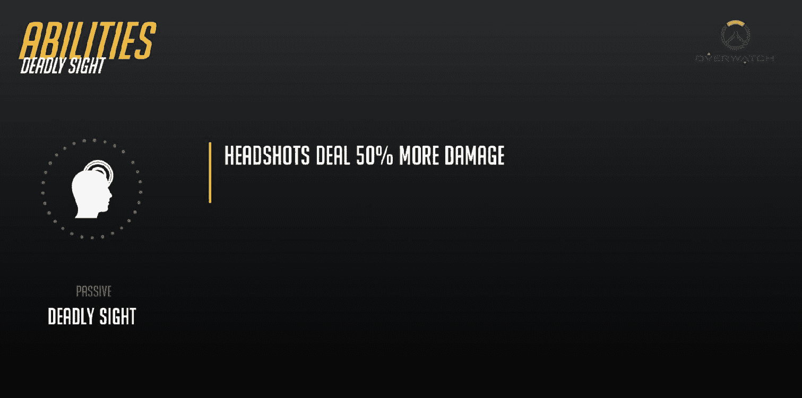

《守望先锋》的角色可能有一个被动技能，一个无需玩家任何输入即可自动使用的技能。

这里的想法是允许不太熟练的玩家偶尔充分利用角色的被动能力。同时，更熟练的玩家可以在关键时刻使用自动瞄准来击中关键目标：

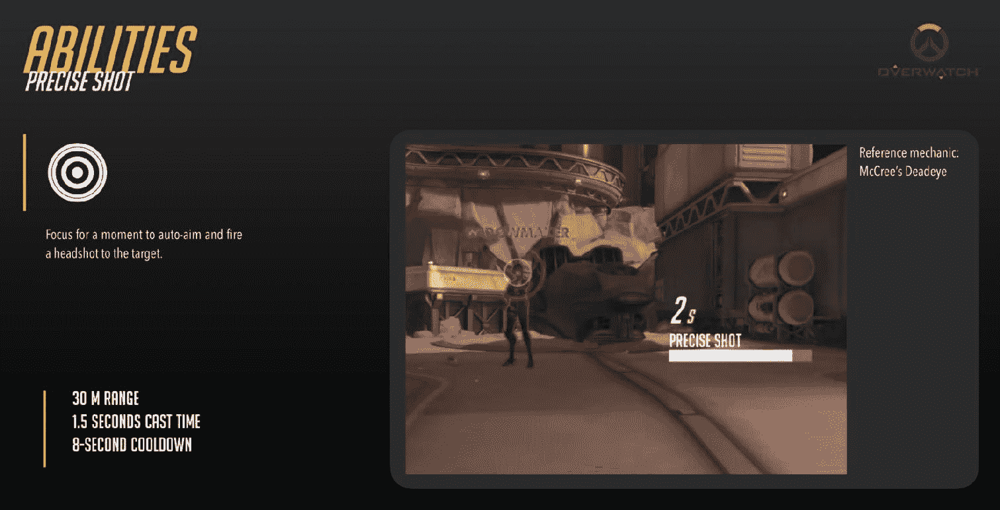

自动瞄准是一个让角色更容易使用的强大能力。由于它每 8 秒才能使用一次，玩家手动瞄准头部射击的技能仍然会起到作用，但不太熟练的玩家总可以在必要时依赖一些帮助！

另一个有趣的能力，“标记”，将允许一些出色的团队协作。如果玩家采取防守性策略，并交替使用她的隐形能力和在地图上侦察，这个角色可以扮演一个非常不同的角色：

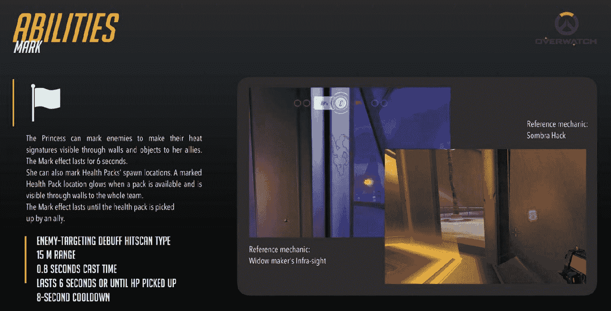

我们已经讨论过，在视频游戏中，有意义的抉择总是基本的，这就是为什么引入允许超过一种游戏风格的能力总是一个好主意！

那关于她的终极技能呢？守望先锋的终极技能旨在创造史诗般的时刻，可以完全逆转战斗的局势，一个充满戏剧张力的“哇”时刻，对于释放它们的玩家来说绝对很有趣。

由于游戏已经充满了强大的攻击，这些攻击会对不幸的敌方团队造成大量伤害，我想让公主的终极技能有所不同，将她的正常能力所能做到的一切提升到下一个阶段。如果她能够使用她的终极技能来压制她的融合能力，即使在攻击和使用其他能力时也能保持隐形...持续很长时间呢？

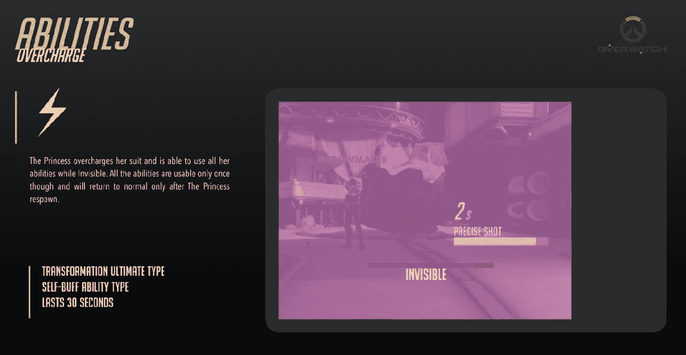

这种能力很容易打破游戏，所以让我们明确这一点：这只是为了这本书的目的...不要在家设计这样的东西！

是的，这种能力听起来确实非常强大，那么我们该如何平衡它呢？通过让她在释放终极技能后只能使用一次她的能力。因此，她必须充分利用它，不要浪费任何一次机会！

与大多数其他英雄的终极技能不同，这个技能将允许一种更慢的游戏类型，需要一些战术定位和良好的长期策略。尽管如此，许多英雄可以轻松地对抗它。任何敌人都能在公主拉出她的邪恶计划之前轻易地发现她，让她完全暴露在视野中...但同时也带来了她正常能力的不利影响。

> > > 你可能已经注意到，我在之前的图片中投入了相当大的努力来重现守望先锋的外观和感觉。不管机制是否画得完美，或者它是否使用了来自其他机制的图像（或者与守望先锋无关的真实手枪的图像）...只要它能让我们知道我们在谈论什么！记住，游戏设计师不是概念艺术家，所以并不期望他们提供高质量的草图或艺术品...尽管如此，他们应该尽一切可能来传达他们的愿景。演示层是一个强大的工具。你掌握得越多，你的工作就会做得越好。

原型和迭代

我们已经知道了这一点。一旦设计完成，我们需要尽快在游戏中尝试。在设计师脑海中可行的方案在实施后可能会变得非常糟糕。机制需要测试，平衡也需要测试。问题发现得越早，回到设计板重新修复它们就越容易。

如我们在本书中多次讨论的那样，迭代是成功游戏的关键。现代游戏引擎和原型设计工具让我们没有借口过于懒惰或过于自信，直接跳到最终实施阶段。

不幸的是，我们实际上无法进行这一步和下一步，因为这需要访问守望先锋的源代码...但在专业场景中你会这样做。

最终实施

到目前为止，有人可能会认为设计师的工作已经完成。当然不是。在原型设计或测试中验证的内容足以批准最终实施，但这并不意味着新角色在发布后的几个月内不需要未来的平衡调整和一些特别的关注。

它可能在设计师没有预见到的场景中证明过于薄弱或过于强大，玩家可能会找到漏洞或者只是不喜欢它。当你设计某样东西并且它达到了“发布”阶段时...你必须亲自体验！关于你的创作以及它如何与游戏中的其他系统互动，你还有很多不了解的地方。

坏人

我们已经讨论过，每个好的故事都会让角色面对某种形式的冲突。没有什么比冲突本身的具象化更好了：坏人！反派、怪物和敌人。

尽管所有这些家伙都意图杀死玩家，但他们服务于更高的目的，让玩家在避免被杀的同时享受乐趣。

但问题是，坏人是如何设计的？

答案，就像在游戏设计中经常发生的那样，并不是简单的，它取决于我们谈论的游戏类型。简单的敌人，就像其他角色一样，存在是为了发挥功能。反派和 Boss 也是如此，但他们还需要像主要角色一样令人难忘和有趣。具有更深层叙事的游戏依赖于精心构建的反派来对抗主角，而更具街机风格且叙事较轻的游戏则需要提供具有挑战性的游戏玩法焦点。

反派类型

玩家可能会遇到两种类型的反派：

+   故事反派：故事反派是我们通常在书籍或电影中找到的那种反派。他的功能是推动故事发展，为主角提供继续前进和阻止他的动机，创造既物理又心理的戏剧性冲突。一些令人难忘的故事反派例子包括《暴雨》中的折纸杀手，金属 Gear 中的 Big Boss，以及《博德之门 2》中的 Jon Irenicus。

+   Boss 反派：Boss 反派更专注于对玩家提出的游戏挑战。它是《黑暗灵魂》中的 Boss、超级马里奥中的 Bowser，或者是《迪亚ブロ》中的迪亚ブロ。它们的存在是为了挑战玩家使用并掌握游戏机制，以便击败它们。

显然，一些故事反派可能也会提供类似于 Boss 反派的挑战，但真正使他们不同的地方是他们在游戏中的类型以及他们作为角色的深度。就像一个主角一样，故事反派有自己的动机、背景故事和目标。他们越少刻板，就越好。他们不是纯粹邪恶的存在，为了邪恶而行动。从他们的角度来看，他们是真正的英雄。他们认为主角是一个不理解自己在做正确事情的人。这就是他们有趣的地方。玩家甚至可能会与他们产生共鸣！

另一方面，Boss 反派可能更刻板或由更直观的动机驱动。即使有有趣的背景故事，他们作为游戏中的角色也不会发展，这完全没问题！只需确保你为你要创建的游戏找到了合适的反派！

敌人类型

当然，反派是主菜。但如果没有玩家必须英勇击败的常见敌人，那会是一款怎样的游戏呢？玩家一个接一个地击败敌人，枪战或挥舞着剑前进？

实际上，《最终幻想 XIII》是一个没有常见敌人，只有 Boss 的游戏的绝佳例子。但这只是一个例外，也是它成为一款非凡游戏的部分原因。

通常来说，有敌人的游戏需要常见敌人。创造敌人是我最喜欢的游戏设计活动之一。灵感可以来自任何地方，取决于你正在制作的游戏类型。敌人可以是敌对势力的士兵、怪物、外星人、机器人、食人植物……唯一的限制是你的想象力！

在敌人设计方面，我最喜欢的资源之一，再次是《龙与地下城》的手册。它被称为《怪物手册》，包含数百种奇幻怪物，每个怪物都有令人惊叹的插图、规则、能力和传说（基于 D&D 设定）。如果你的游戏是关于现实主义的现代战争或设定在科幻世界中，这并不重要。这本书中的教训超越了它所描述的怪物的本质：

《龙与地下城》怪物手册：为敌人和怪物设计提供的信息宝库。

我们要做的是尝试根据敌人的行为、功能和特征对一些敌人原型进行分类。

让我们来看看一些经典例子。

追击者/攻击者

这是最常见的敌人类型。一旦玩家进入视线，它的唯一目标就会激活：杀死他。它将不惜一切代价追逐和攻击玩家，直到一方死亡。这种类型的敌人可以在非常复杂的游戏中找到，例如 MMO（它们根据攻击的侵略性和附近玩家的威胁程度来决定攻击谁），或者它可以更加静态，就像《太空侵略者》中的外星飞船。

巡逻兵

巡逻兵是一种在预定区域内移动的敌人。一旦玩家进入该区域，巡逻兵可以继续移动，不管玩家是否存在（例如《超级马里奥》中的 Goombas），或者改变其行为，对玩家的存在做出反应（例如，射击或追逐玩家，就像《合金装备固体》中的守卫一样）。

需要注意的是，巡逻兵的整个目的就是遵循玩家可以记住的运动模式，以便规划其行动。

守卫

守卫与巡逻兵类似，但其功能是守护特定的物体或空间。虽然巡逻兵可能只是在空间内来回移动，或者一发现玩家就变成追逐者，但守卫的目标并非仅仅是杀死玩家。因此，如果追逐使他远离原本守护的地方/物体，它可能会选择让玩家独自一人。

射手

射手是一种与玩家保持距离并使用某种远程武器对其瞄准的敌人。射手可以在玩家存在的情况下射击（如在一些老式平台游戏中），或者对玩家的存在做出反应。射手的行为可以是守卫或巡逻兵的后续状态。射手可能位于特定的位置，可能藏在掩护物后面——在这种情况下，我们谈论的是狙击手。狙击手很有趣，因为它们迫使玩家思考。通常，回击它们是非常困难和危险的，因此玩家需要从他的舒适位置移动，并找到绕过狙击手的方法。

群体

群体敌人通常是极其脆弱的敌人，如果单独面对，不会对玩家构成任何威胁。通常，它们数量众多，行为像追逐者。

炮灰

与群体敌人相反，“炮灰”即使在大群中也并不危险。它们的存在是为了吸引玩家的注意力，让他能够轻松地击败敌人，而无需承担失去或真正陷入危险的风险。

坦克

坦克型敌人能够吸收并持续承受玩家的攻击更长的时间。如果坦克正在支援其他类型的敌人，它能够显著提高威胁等级，因为玩家在坦克提供掩护时无法迅速摆脱较小的敌人。

敌人行为和统计数据

我们根据敌人的行为定义了敌人的类型。那么他们的统计数据呢？

我们将在本书的后面章节深入探讨这个问题，在第十三章“平衡”中，我们将看到敌人的统计数据、能力和机制如何受到它们功能的影响。一个坦克类型的敌人比普通敌人有更高的 HP 或装甲值是很直观的。一个追击者可能移动得比其他敌人（甚至玩家）快得多，但它可能缺乏远程攻击，或者它可能对某些攻击极端脆弱。

这里整个要点是确定敌人的功能和为什么它在特定的游戏关卡或区域中是必需的。这应该是设计有效敌人的第一步。

敌人存在是为了娱乐玩家

如果一款游戏基于战斗敌人，确保战斗本身是令人兴奋的！动画、视觉效果和音效、奖励……所有这些都应与战斗和击败敌人相关联。战斗必须有一个目的。敌人必须具有挑战性，但要以一种有趣的方式进行。如果他们总是比玩家聪明，从不失手，或者总是执行最佳策略……那怎么会有趣呢？

再次强调，我们将在后面讨论如何平衡游戏时再详细讨论这个问题，但在本章中，重要的是你要明白，电子游戏中的敌人只是为了让游戏有趣的一个工具。即使在像《黑暗之魂》这样的基于极具挑战性敌人的游戏中，承诺是“玩家将死亡”，敌人也被精心设计，以提供一次美妙的体验……一旦玩家学会了如何击败他们！

例如《死亡空间》这样的游戏，不仅在敌人设计上投入了大量精力，还考虑了玩家如何实际击败敌人。不同的武器对不同的身体部位造成不同的效果，而瞄准不同的身体部位可以切断一条腿或武器，从而允许对战斗策略进行微观管理。

总是设计敌人和它们的系统，要有一个清晰的愿景，了解它们与玩家的互动。并且给予它们最后的时刻特别的关注，那就是玩家克服它们提出的挑战的时刻。这必须很棒，即使是对于最简单的小生物。

多样性

我认为有必要花点时间谈谈电子游戏中的多样性。从历史上看，电子游戏和整个游戏行业普遍存在缺乏多样性的问题。除了少数例外，大多数主角角色都是白人男性。当他们是女性时，她们往往过于性感（劳拉·克劳馥是一个伟大的角色……但我们所有人都记得她在《古墓丽影》第一系列游戏中的身材）。当他们是同性恋时，他们被刻板化，好像他们的性取向与定义他们做什么和如何行动有任何关系。当他们是不同种族时，他们似乎只是象征性的存在，只是说“嘿，这款游戏有一个非白人高加索人角色！”：

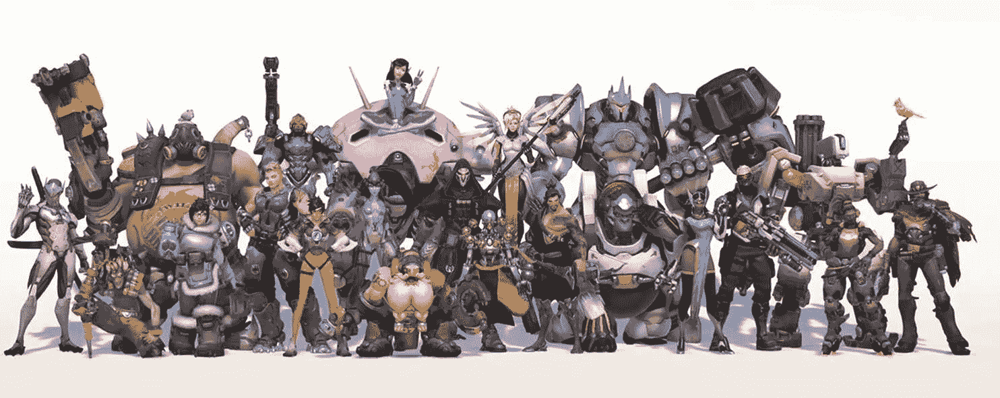

守望先锋英雄：每个角色都来自世界上的不同地方，代表着不同的文化背景。

对于这一点，没有指南或设计实践。这只是一个敏感性和愿意探索不同文化、角色和场景的问题，在视频游戏中。创作者的责任是摆脱这样一个概念，即一个白人男性肌肉男或炸弹女孩会卖得更多，吸引更多玩家。

同样，仅仅因为我们需要多样性而将多样化的角色放入游戏中，只会起到凸显这种荒谬尝试的效果。这里的想法是根本不需要谈论多样性，因为所有这些不同的角色都应该反映出我们现代社会中实际上只是正常的东西。

多样性不是一个现状或问题，比如这个游戏中是否每个人都得到了代表？所有角色都应该在故事和游戏中合理，没有任何关于他们的性别、身体或精神残疾、性取向或种族的先入之见。所有刻板印象都应该从你的游戏中排除。

拿出时间来玩一些像《地狱之刃：塞努亚的牺牲》、《人格 4》、《生命中的奇异》、《守望先锋》（是的，仔细看看守望先锋的角色！）、《记住我》或《行尸走肉》的 Telltale 游戏。仔细思考这一点。作为创作者的你，有机会为娱乐行业这个重大问题做出真正的贡献。

> > > 本章中使用的截图仅用于说明目的。我们不推荐你以任何方式误用这些截图。有关更多信息，请参阅本书免责声明部分中提到的出版商的条款和条件。

摘要

我们已经看到了如何创建有趣的角色，并在游戏世界中赋予它们特定的功能，无论是可玩角色、NPC 还是敌人。你学习了如何通过数值统计、能力或控制系统来定义一个角色。我们走过了可玩角色设计的过程，并组装了一个相当酷的新守望先锋英雄！我们还更深入地研究了使敌人有趣和反派令人难忘的因素。他们的动机、背景故事以及对游戏世界的观点。

最后，我们对多样性的概念以及在我们现代社会中，将其作为我们创作过程的一部分的重要性进行了重要的考虑。我们接近这本书第二部分的结尾，即内容创作。

接下来，也是最后一站：用户界面和用户体验！
