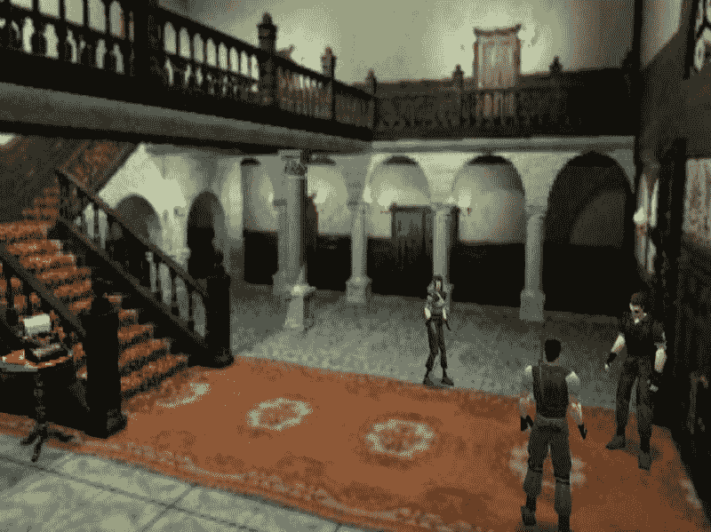
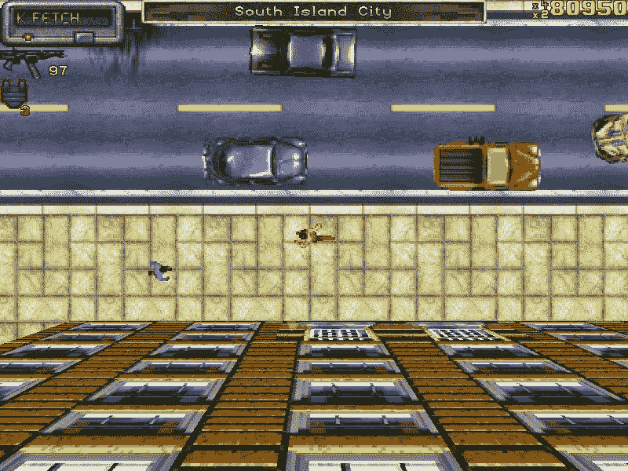
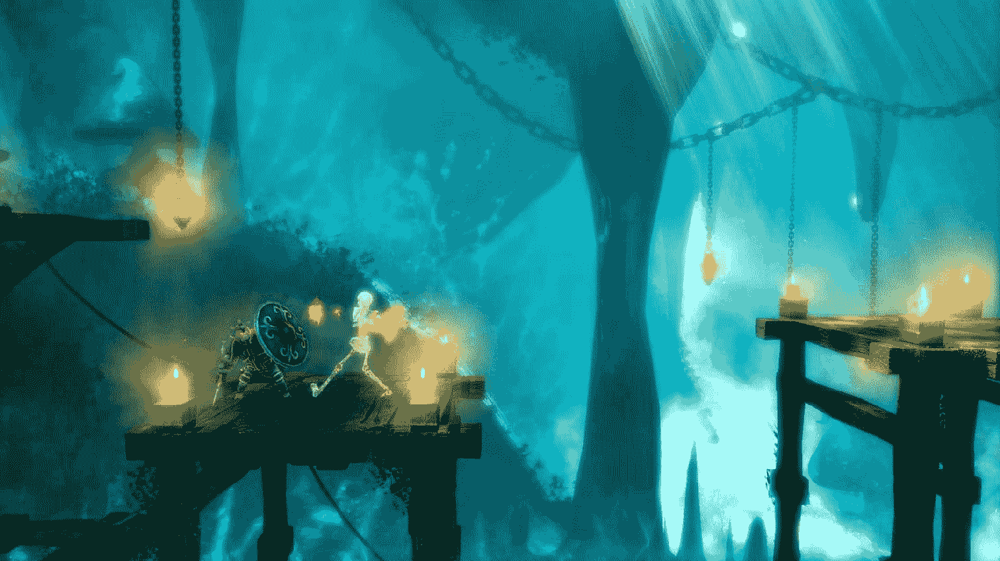
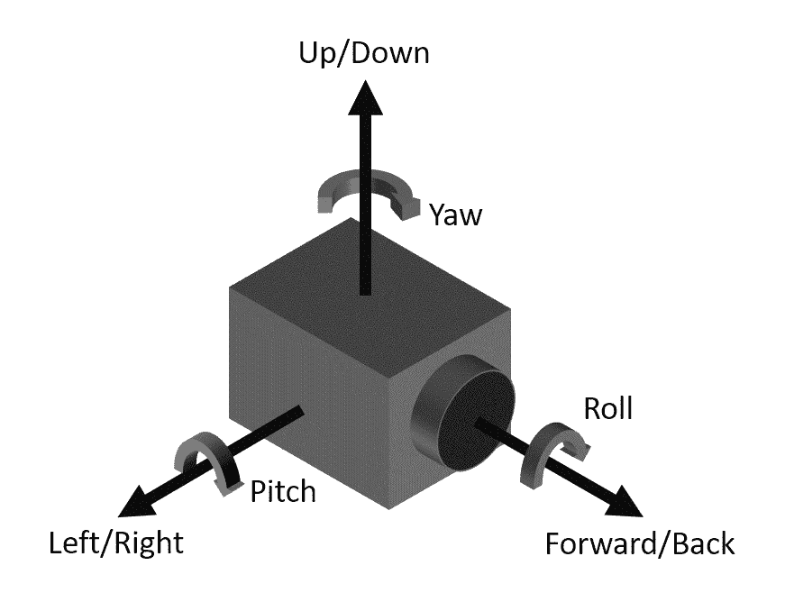
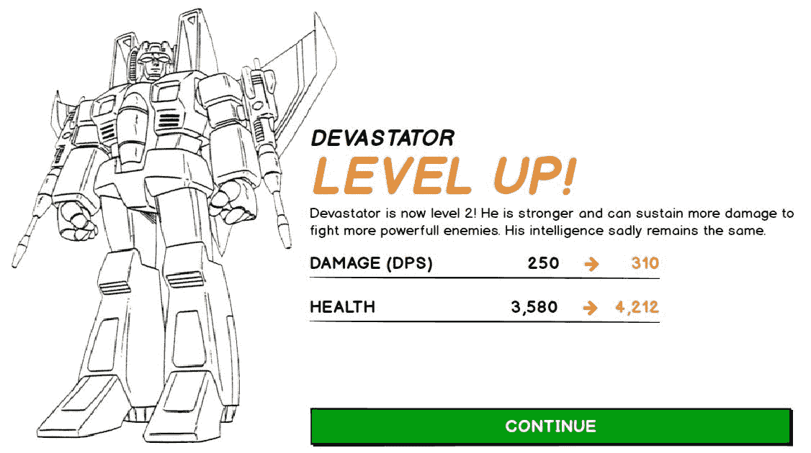
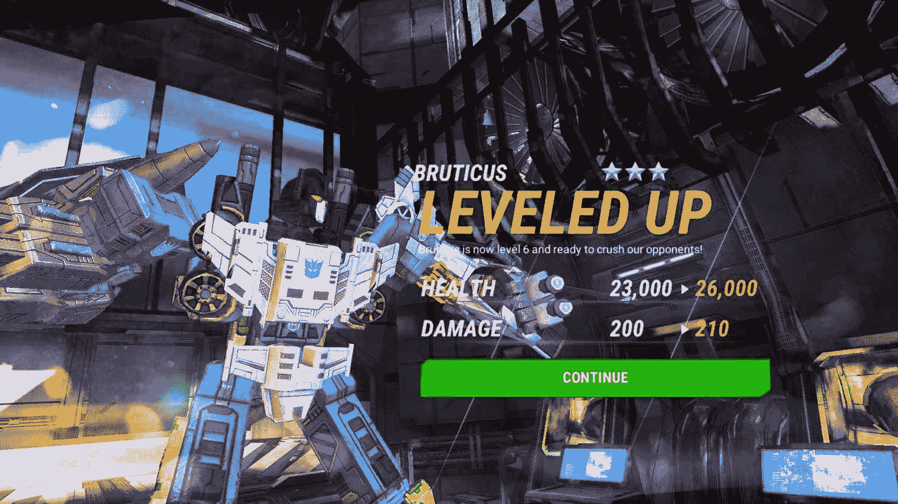
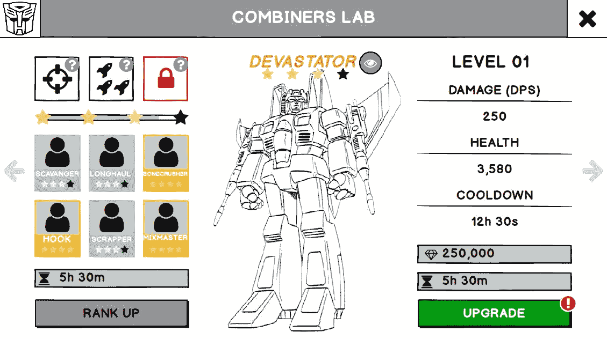
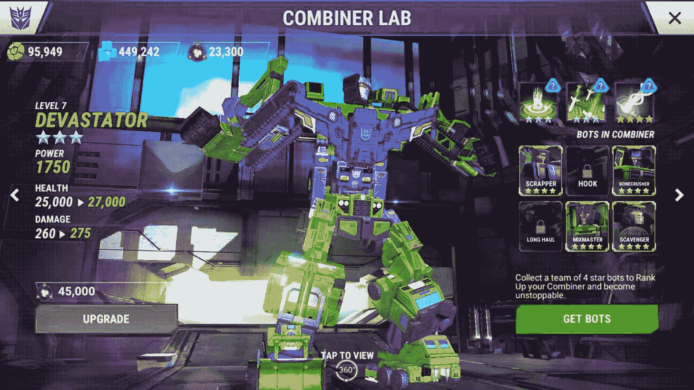
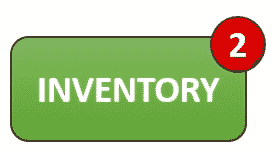

# 第十二章

用户界面和用户体验

在本章中，我们将向您介绍用户界面（UI）和用户体验（UX）设计的基础——这是一门复杂的技艺，通常将艺术、动画、图形设计和视觉效果与游戏设计本身相结合。

虽然大多数专业团队都有专门的艺术家负责产品的 UI/UX 方面，但对于任何游戏设计师来说，了解界面设计和优化最终用户体验的原则是至关重要的。

即使在一个大型、人员配备齐全的开发团队中，游戏设计师也必须与 UI/UX 专家并肩工作，规划和创建既信息丰富、赋权又令人愉悦的交互界面和体验。所以，无需多言，让我们开始吧！

用户体验

用户体验指的是一个人对特定产品或系统使用的整体感知、情感反应和态度。在游戏开发背景下，UX 可以包括除规则集和游戏内容之外影响游戏整体感觉的任何事物。在实践中，UX 转化为输入机制（控制方式）、菜单和交互流程、界面动画和音效、摄像机系统和游戏反馈。

玩家输入

输入方法（即控制方式）的设计和执行可以成就或毁掉你的游戏。在这个时代，玩家期望开发者遵守一套在输入方面的黄金标准。正因为如此，像索尼、任天堂和微软这样的平台持有者已经制定了自己的指导方针，以确保遵守特定平台输入方法和控制功能（即如何暂停游戏）。

现在，家用机动作游戏几乎肯定会使用左侧模拟摇杆来移动，右侧摇杆来环顾四周，而 PC 游戏则肯定会使用 WSAD 键来移动，鼠标来环顾四周，空格键来跳跃或越过障碍物。无论游戏类型如何，在 PC 上使用除了 Esc 以外的任何键进入暂停菜单都可以被视为一种严重的罪行。

虽然你的大多数控制方式不受平台持有者的影响，但违背既定范式是非常冒险的举动。尽量给你的玩家提供修改和个人化控制方式的方法，但请记住，大多数玩家不太可能更改默认设置。如果你的默认控制方式难以使用且不直观，你真的有风险让玩家感到沮丧，以至于离开游戏——无论你的控制选项多么丰富。

你将要开发的游戏很可能在控制方面有一个强烈的参考（你所在类型的类似游戏），以及一套玩家期望（已经确立的范式）。创新在这里变得更加困难。新颖的控制方法应该由创新的机制来充分证明，这些机制不能用熟悉且确立的控制映射来有效表达。除非你打算将整个游戏的重点放在让玩家尝试掌握控制上，就像在像老式闪存游戏 QWOP 和搞笑的 Surgeon Simulator 这样的游戏中看到的那样。

人体工程学设计原则（无论是针对物体、流程还是空间）都围绕着最大化用户的效率和最小化他们的疲劳与不适。当应用于视频游戏控制时，这些规则可以用以下陈述来概括：

人体工程学控制在最常见的情境中很容易执行。

单个键或按钮的按下本身很容易。然而，在用 WSAD 键和鼠标控制角色时按 P 键，则需要你停下来并抬起手，因此，这不是一个人体工程学的解决方案。

需要多个输入（双击）或一个以上手指来执行的动作更难完成和记忆。这包括特定的修饰符，如按住 Alt、Shift、Ctrl 或游戏手柄上的扳机。

执行良好的控制与预期的范式相匹配（例如，在射击游戏中按 R 键重新装弹），并且易于执行（不需要复合控制）。它们也不应该与我们本能作斗争（一种称为自然映射的实践），例如，在游戏中按住按钮释放某物总感觉有点不对劲。

在考虑控制和输入机制时，按优先级和使用的频率列出你的游戏机制是有帮助的。之后，遍历列表，将最人体工程学和最合适的动作分配给最重要的和最频繁使用的机制。然后，任何不需要快速和高效执行的动作（例如打开手电筒、打开库存或地图屏幕）可以放在不太容易访问的输入上。

> > > 如果你有空间，可以使用控制提示！例如，按[E]键打开门的控制提示不需要在教程结束时结束。不干扰但持久的屏幕控制提示在整个玩家生命周期中可能非常有用。对你（或经验丰富的玩家）来说明显的事情可能对一年后才开始玩游戏的玩家来说并不明显，尤其是如果你将一系列晦涩的键映射到一系列行动清单上。

控制类型

在设计你的控制时，了解你的目标平台提供的不同输入类型之间的差异和影响是很重要的。

数字输入

这是最基本的输入类型，能够返回两种状态之一，活动（1）或非活动（0）。数字输入的一个简单例子是标准计算机键盘的键。单个键要么被按下，要么完全未按下，中间没有其他状态。

模拟输入

模拟输入可以返回一个或多个连续值。最流行的例子是任何现代游戏控制台上的模拟摇杆。当摇杆倾斜时，控制器会跟踪上/下和左/右位置以及倾斜程度的不同值。格式可能看起来像这样：（0，-1）表示完全向左转动的摇杆，（-0.5，0.3）表示倾斜到一半并向右 30%。这允许对诸如运动或光标速度等事物进行更微妙和自然的控制。

> > > 虽然控制器让你能够访问连续状态，但这并不意味着你应该总是使用它们。你可以编写游戏程序来检测基于单个值的简单上/下状态，Y 轴上的倾斜 75%到 100%用于上，-75%到-100%用于下。-75%到 75%之间的区域被称为死区，其中输入被认为是不重要的并被忽略。在这种情况下，你实际上是将模拟输入转换成了数字输入。

复杂的模拟输入

一些控制器提供诸如运动和位置跟踪等功能，让你能够访问非常复杂的信息。轻轻摇晃控制器就会生成一组向量，这些向量跟踪所有三个轴上的运动速度、方向和加速度，以及（对于更高级的、带有摄像头的系统）3D 空间中的起始和结束位置。

> > > 设计运动控制可能是一个非常复杂的过程，需要与一名技能高超的程序员密切合作。复合运动控制（如做 8 字形）很难以可靠的方式实现，以便大多数玩家和设备都能使用。除非你正在制作运动控制或虚拟现实游戏，并且有一支经验丰富的程序员团队，否则建议避免在核心游戏机制中使用运动控制（尤其是复杂的运动控制）。然而，你可以尝试使用加速度计来实现视觉效果。例如，通过使你的移动设备倾斜时用户界面的背景移动（从而产生深度错觉）。

触摸屏控制

一些现代触摸屏能够跟踪多达 10 个单独的接触点。然而，一套简单的单指点击和滑动通常就能让你走得很远。建议不要依赖超过 4 个指尖，因为超过这个数量会增加误解释输入的机会，并减少兼容设备的数量。触摸界面可以为你提供：

+   每个接触点的唯一 ID。

+   接触（起始位置）的起源。

+   当前位置。

+   自上次更新以来位置和时间的变化（用于跟踪运动）。

+   自上一帧以来的状态（触摸开始、移动、静止、释放和取消）：

    +   如果同时检测到超过 5 个输入，或者设备检测到被放置在用户的耳朵旁边（光传感器和位置跟踪），则可能会发生取消。

+   触摸的强度，这仅在支持 3D Touch 或等效技术的少数设备上有效。此功能允许你区分常规触摸输入和力度触摸，其中屏幕被更用力地按下。

> > > 与运动控制类似，在整合复杂的触摸行为时，你需要非常小心。使用简单的点击、滑动、拖动和捏合，或者在屏幕上遵循一个模式，这些都很容易且自然，但要求用户在没有明确提示的情况下使用多个手指和 3D Touch，这无疑是一个灾难的配方。没有简单的四指捏合。你可能还想丢弃任何过于接近当前活动触摸输入的触摸输入，因为有时一个手指可能会被读取为两个。操纵交互区域（击中框）的常见做法是使它们比游戏中的艺术品所暗示的更大/更小，从而使它们更容易/更难点击。

相机系统

游戏中的相机是玩家与游戏世界之间最重要的界面之一。一个设计良好的相机不仅有助于向玩家提供信息，还能突出重点，并提高玩家与游戏互动的能力。

存在多种相机类型和视角。一个游戏可以使用一个具有固定设置的相机，或者根据上下文在多个相机和设置之间切换。

要创建一个完美的相机系统，你通常需要与团队的其他成员紧密合作，将游戏设计目标与技术解决方案（智能相机焦点和路径查找）以及难以捉摸的艺术敏感性（围绕构图、角度和过渡）结合起来。

让我们通过分析不同的相机类型和视角来深入了解相机设计的复杂性。

相机类型

相机类型的选取通常发生在潜意识层面；你只是简单地想象游戏以某种方式或另一种方式进行。话虽如此，承认特定相机类型背后的原因并保持对替代方案开放是很重要的。通过从手动切换到静态或跟踪相机，可能会发现一种全新的游戏展示方式，重塑体验，并可能催生一个全新的游戏子类型。不要害怕实验！

静态

简单的、静止的摄像机在许多游戏中被使用，其中游戏板完全包含在屏幕上，例如《俄罗斯方块》。还有一些游戏使用一系列静态摄像机，并在需要时切换它们。这种系统的例子也可以在早期的半 3D 游戏中找到，如第一代《生化危机》，它们通常依赖于预渲染的背景。使用固定摄像机在 3D 空间中控制化身，并且经常切换角度尤其具有挑战性，应该避免：

在《生化危机 1》中，模糊的角度和摄像机与角色之间的脱节使得操作变得困难

有趣的是，静态摄像机对二维空间的影响完全相反，像《超级肉男孩》这样的游戏就是证明，从移除二维环境中的摄像机移动中可以获得更高的精度。

静态摄像机也是解谜游戏和移动游戏非常受欢迎的选择，在这些游戏中，自由形式的鼠标、触摸和拖拽输入被保留用于与游戏世界的交互，而不是摄像机操作。静态摄像机还可以提供与虚构的工作空间或计算机界面的自然平行，如在《她的故事》中，玩家通过操作旧电脑来解决谋杀案。

将静态摄像机推向极限并限制自己在一个屏幕上，可以作为一种限制，激发关卡设计的创造力，并使游戏对普通观众更容易理解（不需要移动摄像机可以降低认知负荷）。

手动摄像机

不附着在任何演员上，玩家在控制摄像机工作时具有不同程度的控制权，包括：

1.  两个或三维移动，同时可以平移摄像机以及放大和缩小

1.  旋转（水平旋转）

1.  倾斜（对地面或主题的角度，垂直旋转）

手动摄像机在许多策略游戏中都可以找到。有些，例如《黑与白》，允许玩家自由旋转和倾斜摄像机，几乎没有限制。其他，例如《星际争霸 2》，将控制限制为简单的二维移动（西、东、北、南），放大和缩小。

限制摄像机的倾斜和旋转控制可以防止玩家在选择限制游戏性的角度时迷失方向和困惑。如果没有限制，玩家不仅可以直视天空，还可以将游戏世界的视角颠倒过来（通过倾斜超过 180 度）。

可以设计一个受限的摄像机来自动调整某些设置，例如倾斜。例如，放大可以降低倾斜以创建更电影化的角度，而缩小可以将摄像机倾斜到更战术的、俯视的视角：

在《星际争霸 2》中，随着放大，摄像机的倾斜角度转向更侧面的角度

跟踪摄像机

追踪摄像机允许玩家享受大型的可玩空间，而不必手动调整构图。根据游戏玩法和展示的演员，摄像机将跟随单个角色、多个角色之间的一个点，或者简单地聚焦于动作本身并将玩家拖拽其中：

1.  跟随演员：这是展示以角色驱动游戏玩法时的默认选项，从平台游戏到第三人称射击游戏和赛车游戏。移动角色移动摄像机——简单、优雅且有效。

1.  跟随动作：在老式街机射击游戏，如《警察学校》和《鬼屋魔影》中，经常使用完全自主的第一人称摄像机。这种在轨道上的摄像机设定了节奏，留给玩家的操控空间很小，他们只是被动地体验游戏。另一方面，我们还有像《战神》和《贝奥武夫》这样的第三人称动作游戏，它们具有半自主摄像机，这些摄像机跟随角色在环境中的旅程，但并不直接附着在角色上。这种设计选择适合快速、突然的动作以及与众多敌人从各个方向进行的复杂遭遇。半自主摄像机也允许出现一些非常电影化的时刻。还有一些游戏只在某些多人模式中使用半自主摄像机，以便在同一屏幕上展示所有玩家。从《超级 Smash Bros》和《迷你赛车》到《超级马里奥 3D 世界》，摄像机要么跟随比赛的领导者，由其决定节奏，要么尝试缩放以同时显示所有演员。

> > > 决定追踪什么是一个重要的决定，因为它决定了动作的节奏和构图。一定程度的自主行为可以让玩家专注于游戏机制的纯执行，但也打开了耗时实现和逐案调整的可能性。如果玩家无法自行调整摄像机，你需要确保他们始终能够获得最佳的动作视角。

复合摄像机

有时，一个单一的解决方案并不能涵盖所有可用的游戏玩法场景。复合摄像机是一种默认采用上述解决方案之一，但允许玩家调整或改变其行为的摄像机。这为我们提供了两个不同的选项：

1.  可手动调整或控制的追踪摄像机：

    在许多不依赖远程战斗或平台游戏（如《超级马里奥银河》）的 3D 动作冒险游戏中可以发现这种摄像机。这种摄像机在玩家需要瞄准或识别当前视野之外的感兴趣区域之前，不需要任何操控。

1.  带锁定或聚焦选项的手动摄像机：

    在 3D 空间内的快速近战可能会让瞄准变得非常困难。摄像机锁定系统允许你追踪一个选定的敌人目标，并将你的攻击指向他们的方向。锁定摄像机是《黑暗之魂》和《塞尔达传说：时之笛》等游戏战斗机制中的基本元素。顺便说一句，我遇到过将锁定系统称为糟糕的摄像机设计和控制结果的设计师，但大多数玩家接受这种解决方案而不加质疑（尤其是如果你的战斗关乎时机和位置，而不是分析屏幕上角色之间的角度）。

    至于摄像机焦点，它可以在《战争机器》和《最后一人》等游戏中找到，玩家有时会被提示按下一个按钮来移动他们的摄像机到一个感兴趣的点（与故事或玩家的当前目标相关）。玩家可以自由地聚焦他们的视野几秒钟，快速瞥一眼，或者完全忽略感兴趣的点。你永远无法确定他们是否遵循了提示，但至少你不会剥夺他们的控制权，粗鲁地用一段场景打断他们。

观看视角

与摄像机类型相似，观看视角通常从你第一次想到正在玩的游戏的那一刻起，就在你的大脑中无意识地设定了。

了解你选择视角的潜在影响是明智的，并质疑它是否是最佳选择，或者是否有你应该原型化的替代方案。新的视角可以带来完全不同的感觉，并为之前不可用的游戏机制创造空间。

如塔防游戏类型所示，改变摄像机视角可以带来截然不同的游戏体验。从左至右：Fieldrunners、Dungeon Defenders、Sanctum

第一人称

我们以第一人称视角生活，多亏了一对向前看的眼睛提供的深度感知，我们能够准确地判断距离，轻松地导航三维世界。然而，最自然的观看视角并不一定是控制起来最容易的…

第一人称游戏最初很简单，有缓慢节奏的地下城探险和仅使用键盘的射击游戏，如 Wolfenstein 3D。但不久之后，鼠标控制、滑行、跳跃和蹲下的普及让玩家面临更多的复杂性：

Wolfenstein 3D（1992）的稳定移动与 Titanfall 2（2017）中充满滑动、攀爬和抓钩的高度垂直动作形成鲜明对比

对于许多休闲玩家来说，学会分别移动角色和摄像机是一项巨大的挑战。与我们这些玩家倾向于相信的不同，这既不简单也不自然。此外，快速的第一人称游戏被证明会导致一部分人群感到头晕。如果你为的受众不太熟悉第一人称游戏，请考虑这些因素。

优点在于，第一人称视角将玩家直接置于行动的中心，创造出一些最沉浸式的体验（非常适合虚拟现实）。第一人称摄像机也易于实现和调整。如果你正在制作单人游戏，通过减少或消除对角色建模和动画的需求，你可以节省大量时间。

第三人称视角

现在，我们将探索广泛的第三人称摄像机，其中玩家成为外部观察者，通过屏幕的通道观察游戏及其世界。

你可能是一位神祇、一位军队指挥官或一位动物园管理员，俯瞰着自己的创造物。你可能控制着纳森·德雷克或马里奥，但你并不通过他们的眼睛体验这个世界。你体现的是一个在空中漂浮的摄像机，始终很近，但 somehow 与屏幕上的化身保持一定的距离。

第三人称视角在叙事方面表现卓越。一个单一的构图可以有效地传达任何数量的人物与他们所居住的世界之间的复杂互动。难怪它可以说是艺术和视觉媒体中最受欢迎的视角，从漫画小说到戏剧、电影，当然还有游戏。

在视频游戏中，有无数种第三人称摄像机可供选择。我们倾向于将第三人称视角（TPP）的分类缩小到经典的肩上游戏，如《古墓丽影》，但实际上，我们必须考虑任何不是第一人称的视角。让我们深入了解最受欢迎的变体！

在化身背后

有许多原因使得摄像机位于游戏角色背后或肩上非常受欢迎。通过摆脱第一人称视角，我们打开了通过化身视觉设计、定制和动画进行广泛角色塑造的可能性。尽管我们不在行动的中心，但我们很快就能与角色之间建立强大的联系。屏幕上的史诗冒险可能不会发生在我身上，但它们确实发生在劳拉·克劳馥身上，在这个世界里，我就是劳拉·克劳馥。

在游戏玩法上，由于我们能看到演员，我们可以轻松地在多个角色之间切换控制，这在第一人称游戏中更难实现。此外，摄像机与角色分离使我们能够窥视角落和掩护，并发现角色周围/背后的危险和障碍。这增加了我们的情境意识，并将它拉近了现实生活中的标准。随着摄像机移动得更加有序，不会随着每一步上下跳动，第一人称视角的令人作呕的效果也减少了。当整个角色在屏幕上可见时，与环境互动和全身运动也变得更加清晰，从跳过障碍物到拉动箱子施法。

就像所有事物一样，也有一些缺点需要考虑。首先，你可能需要添加复杂的角色动画，如果是在制作第一人称单人游戏或者摄像机拉得更远的情况下，这些动画是可以省略的。此外，你可能需要非常小心地设计关卡，或者投入相当多的编程努力来确保摄像机在拥挤的环境中表现正确。低矮的天花板、狭窄的房间以及如树枝等障碍层的存在都会让你的摄像机感到吃力。在战斗中，让主要角色占据屏幕中央可能会妨碍瞄准，迫使你将视角偏移到一侧（如在《未知的命运》和现代《古墓丽影》游戏中所见）。

俯视

俯视视角非常适合任何依赖于二维规划和 360 度水平可视性的游戏，使其成为快节奏街机动作游戏、地下城探险者、策略和管理类游戏的流行选择。虽然它可能在准确反映高度方面有所欠缺，但俯视摄像机可以提供对无数演员和障碍物的清晰视图，几乎没有阻碍。即使是复杂的建筑和迷宫也突然变得容易导航。

现在，真正的俯视视角已经很少见了。大多数 3D 游戏选择倾斜摄像机，而 2D 游戏则通过透视作弊，展示出侧斜的演员和/或世界的视角。这意味着角色很少被简化为无趣的头和肩部组合。

第一款《侠盗猎车手》通过倾斜的建筑面提供了深度错觉，增强了其俯视摄像机。

等距

在视频游戏的背景下，等距摄像机指的是一种二维、轴测投影（一种具有斜角但没有透视的正射投影）。它是一种视角，允许在二维空间中更有效地展示深度并创建三维效果，这在纯粹的俯视视角或侧视中很难做到。

等距投影可以轻易地与 20 世纪 90 年代最令人难忘的 PC 游戏联系起来。这种视角被大量应用于像《辐射》或《博德之门》这样的角色扮演游戏中，并在从《帝国时代》到《模拟城市 2》的庞大策略和模拟类型中占据主导地位。

当我们撰写这本书时，一套易于访问的 3D 引擎正在市场上占据主导地位，而等距视角仍然充满活力。事实上，等距游戏可能是地球上最受欢迎的游戏之一……毕竟，像《农场小镇》和《部落冲突》这样的休闲游戏能够轻松吸引数百万玩家进入他们的等距世界。

> > > 创建高质量的等距艺术作品可能非常耗时，对经验不足的艺术家来说是一个重大的挑战。为了帮助这个过程，艺术家可以使用高级的透视设置，甚至使用 3D 工具来建模、旋转和导出资产。

侧视

通过限制移动到二维，侧面视角相机可以呈现一个易于阅读的环境，这与我们用肉眼看到的情况相似——我们的世界可能不是平的，但肯定比从上方阅读更容易阅读。平台游戏和格斗游戏可以从更可预测的角色移动、距离和跳跃曲线中受益。易于阅读的轮廓、角度和环境也可以融入简单易懂的 2D 物理，从而催生出一个从愤怒的小鸟到蚯蚓的物理游戏类别。

一些游戏选择放弃一些这些优点，以便将深度元素融入它们的侧面投影。这可以在老式的 2D 冒险游戏如《猴岛的秘密》以及许多侧滚动打斗游戏中看到：

Trine 有效地将 2D 游戏玩法和物理与 3D 资产结合，创造出一个 2.5D 平台游戏

> > > 根据你制作的游戏的机制和结构，使用侧面视角相机的优点可能会变成缺点。受限的移动等于受限的探索。表面层次可能会变得不成比例地微不足道，这意味着大部分导航将导致攀爬或挖掘。一些游戏如泰拉瑞亚和 Spelunky 已经找到了通过多种导航工具（梯子、绳索、钩爪、喷气背包等）绕过这个问题的方法，但重力往往会阻碍玩家探索环境。

选择相机设置

俯角、视野和距离是任何相机的三个关键组成部分。它们必须在游戏过程中设置并可能进行调整，以适应游戏情境和节奏。

默认的水平视野应根据屏幕的预测距离和大小来设置。玩家离屏幕越近，屏幕越大，游戏中的视野（FOV）就可以越高。这是因为屏幕占据了你实际视野中一个比例更宽的角度。如果我们想要创建一个完美的游戏世界的窗口，我们需要将视野与玩家眼睛和屏幕边缘之间的角度相匹配，在大多数情况下，我们最终会得到一个非常狭窄的视野空间。幸运的是，大多数玩家已经习惯了稍微高一点的视野，但我们仍然需要针对设备和平台进行特定的考虑。例如，在游戏机上玩的第一人称射击游戏，玩家的水平视野大约为 60-65 度，因为玩家通常坐在电视较远的位置。另一方面，在 PC 上，玩家坐得更近，因此视野应默认为 80-90 度（并允许将该设置提高到更高）。因此，PC 玩家将看到更多左右两侧的动作，但屏幕内容看起来会稍微远一些（甚至可能看起来扭曲）。此外，如果你在靠近屏幕的位置玩游戏机射击游戏，你可能会体验到隧道视野和头晕的感觉，因为你的自然视野的 90 度在游戏中只相当于 60 度。

另一方面，视野越大，每帧渲染几何形状所需的处理能力就越多——这始终是值得注意的事情！

理解 3D 空间中摄像机移动的语言是有帮助的。

大多数现代动作游戏会根据玩家的操作调整摄像机。宽阔、缩放出的摄像机有助于快速导航和分割决策，展示玩家周围更大的一部分几何形状、威胁和机会。对于需要精确度的动作，例如瞄准，将采用另一种摄像机设置，视野更小，状态更近（放大），并且可能降低摄像机控制灵敏度。

水平和垂直平面可以轻松地转移到我们屏幕的平坦平面上，但没有 VR 或立体 3D 技术，深度感知就成为一个真正的挑战。我们的两只眼睛必须接收相同的信息，这使得第三人称游戏中的平台跳跃成为一个巨大的挑战。玩家很容易判断失误跳跃距离，并难以与小型物体对齐（想想马里奥试图击中空中悬挂的[?]方块）。为了帮助缓解这种情况，你可以提高摄像机并将它向下倾斜对准地面。这将有助于评估物体之间的距离。只是要注意，虽然更顶部的视角有助于水平导航，但它降低了整体视野半径并阻碍了垂直感知（高度）。

深度感知在近距离（尤其是在近战）比在远距离时更为重要，因为远距离时其重要性会降低。在第一人称射击游戏中，瞄准远处的随机移动敌人更像是一项 2D 练习，即对准目标与瞄准线对齐，而不是涉及空间感知的活动。将敌人拉近，你会意识到战斗场景可以变得多么困难，因为玩家被迫在所有三个维度上考虑距离和移动速度。

> > > 你需要根据游戏机制和动作距离选择相机视角。如果你需要玩家了解周围发生的事情，不要强迫他们使用近距离的相机角度。另一方面，如果你想让他们更舒适地与远距离的目标交战，近距离的相机可以帮助瞄准。

一旦确定了距离和视野，调整构图就很重要。默认的相机设置应该聚焦于对玩家即时决策最相关的内容。如果玩家跟随一个头像，你不需要将其作为中心点，遮挡屏幕上最重要的部分。有更好的地方可以展示你的角色艺术，无论是菜单屏幕、电影场景，甚至是车库（如果你的头像是一辆车）。专注于变化最大的部分，即环境和它带来的挑战。

将相机指向目标，你将帮助引导玩家，无需一个字或路径标记。正是出于这个原因，在《超级马里奥兄弟》中，相机始终从偏移位置开始——角色站在屏幕左侧，面朝右。从第一刻起，动作的流畅性就是自然的。

最后，你可能发现没有单一的相机设置适合游戏中每一个动作和场景。幸运的是，有几种解决方案，其中一些可以组合使用：

+   让玩家掌控：允许玩家调整相机角度、缩放和自由操控相机。

+   根据上下文切换相机：例如，进入掩体或立即取出枪会改变视角以适应场景。例如，通过将我们的主要角色放在一边，以免妨碍瞄准。

+   开发环境感知相机：这可能很复杂，但最终可以让相机根据玩家的周围环境来决定角度和距离。如果玩家进入一个狭窄的空间，相机会被拉近并置于角色背后（甚至过渡到第一人称视角）。如果场景在一个开阔空间中有许多边缘和跳跃，相机会被拉远以展示更多地形。

+   让关卡设计师调整设置：这是一种技术上更简单，但可能更费力的处理环境驱动摄像机的方法。可以提供一套摄像机工具给关卡设计师。有了这些工具，设计师可以定义独特的摄像机预设，放置特殊区域或游戏触发器，这些对玩家来说是不可见的，并激活不同的摄像机设置。

> > > 一些更高级的环境和上下文感知的摄像机功能现在正被现代游戏引擎所支持。例如，Unity 3D 的免费 Cinemachine 插件。

无论你决定做什么，有时你需要收回控制权，展示一些简单不能错过的东西。即使是简单的无对话场景，只需将摄像机滑向感兴趣的对象，也可能非常有价值。在屏幕的顶部和底部添加黑色电影式横幅可能看起来有些俗气，但如今，玩家一看到这些横幅就会倾向于坐下来享受场景。

> > > 不可跳过的场景是严重的错误，尤其是在没有立即进行检查点/自动保存的情况下。然而，意外跳过故事的相关部分是另一种完全不同的威胁。有几种方法可以防止这种情况。首先，尝试设置两步确认来跳过任何场景，其中第一步显示“按[键]跳过场景”提示并要求特定操作。其次，特别是如果你没有两步流程，确保在场景的前几秒内不能跳过；这样，游戏阶段的输入就不会意外跳过某人渴望看到的场景。

反馈

游戏是充满相互关联的规则和元素的交互式系统。清晰传达交互的结果和游戏状态的改变正是反馈的核心所在。一般来说，如果玩家没有意识到事情正在发生，那么这些事情似乎就没有发生过。

有效的反馈会使你的游戏更容易理解，并带来更满意的体验。记住，我们是在制作游戏，而不是企业银行应用；你创建的反馈系统可以是纯粹、直观的乐趣来源。

有许多工具可以用来挖掘：

+   UI 反馈：一个设计良好的界面会迅速而清晰地响应每一个输入（按键、按钮按下、轻触、点击等）以及更微妙的状态，如输入确认前的对象高亮（例如，光标悬停状态、按下不放）。如果某个动作在当前上下文中无效，它仍然值得一个响应——无论是通过抽象的负面反馈（例如，使用红色着色和停止标志图标）或通过屏幕文本提示来传达失败（例如，您不能在城门内使用武器）。解释为什么某些事情不起作用，与提供对成功交互的反馈一样有用。UI 反馈的另一个作用是反映和突出游戏状态中的任何重大变化。不要简单地从一个数字更新到另一个数字——许多玩家可能会完全错过这一变化。确保整个指示器闪烁，数字上下跳动时闪烁。

+   角色和对象动画：这包括明显的现实世界动作，如奔跑、跳跃和开门，以及现实生活中不会发生的抽象动画。生长、缩小、脉动、移动、旋转甚至重新着色对象都可以通过代码（无需单个动画帧）相当容易地完成。如果你能，请充分利用这些便宜且高效的技巧。对于其他任何事情，将取决于使用定制、艺术家驱动的动画和...

+   物理：使物体和角色可见地反应和移动的另一种方法是，将它们作为物理引擎中的对象引入。一棵倒下的树不需要动画，只需要从地面分离并允许其落下。

+   视觉效果：烟雾、火焰、火花、光——篝火实际上是由粒子效果构成的，这些效果可以是预先渲染并导出为平面 2D 动画，或者由游戏引擎动态创建。游戏世界中使用的特效为游戏动作提供了额外的反馈和强度。它们在描绘无法用物理和动画实际表达得更抽象或不具象的事物时也非常宝贵。你还可以在 UI 层上使用 VFX 来风格化它，并与更经典的 UI 反馈相得益彰。粒子效果编辑器操作起来并不困难，学习其基础知识对于几乎任何游戏设计师来说都是一项有用的技能！

+   屏幕效果：颜色色调、光闪、屏幕震动以及其他全屏效果是反映重要信息（红色叠加？！我受伤了！）或增加冲击力（BOOM！*屏幕震动*）的绝佳方式。

+   触觉反馈：通过允许玩家物理连接到游戏世界，触觉反馈可以使你的游戏更加沉浸。一些开发者甚至将震动功能直接集成到他们的过场动画中。然而，震动并非适合所有人，而应仅作为可选的额外反馈源。一些玩家认为它分散注意力，而另一些玩家，尤其是在移动设备上，希望限制持续震动产生的噪音。在集成触觉功能时，尽量限制常见动作的强度和持续时间，并将更强、更长的响应保留在合适的、有意义的场合。

+   音频：音效的主要作用是加强游戏动作的视觉反馈，并传达游戏世界中无法用视觉提示表达的信息（例如，接近敌人的脚步声）。另一方面，音乐可以有多种作用。它可以帮助设定和加强正在发生的事情的情感基调，构建游戏世界的听觉场景，甚至可以作为额外的反馈源。为了通过音乐提供反馈，实现一个能够根据游戏的整体状态（我听到 Boss 战音乐，大家准备！）或玩家的个人视角（哦……战斗音乐？我肯定被发现了！）动态调整的系统。尽管音效和音乐很有用，但并非所有人都能听到它们... 当涉及到移动和便携式平台时，除非你正在制作音乐游戏，否则你永远不应该依赖音频反馈作为传达重要信息的唯一方式。

+   文本反馈：虽然老式的生命值条和战斗日志（即游戏动作和计算的列表）确实可以归类为用户界面反馈的一部分，但伤害和状态指示器通常直接显示在游戏世界中，通常位于角色上方。如果你的游戏包含依赖于操作数字的系统，使用文本来反映这些系统几乎成为强制性的。这可以适用于从伤害和恢复到连击得分和资源生产等任何事物。

设计用户界面

任何用户界面的主要目标都是促进交互并向玩家传达游戏状态。

一些产品可以仅通过游戏菜单和偶尔的控制提示来获得很少的用户界面，而另一些则试图避免在界面中使用任何文本，并完全依靠图标。努力尽量减少用户界面数量，仅通过游戏反馈和用户体验来传达游戏状态是值得赞扬的，并且可以产生非常优雅的设计。

然而，你的游戏系统越复杂，它们产生的状态就越复杂。深入和广泛的用户界面往往是不可避免的，了解如何设计它们（或者至少如何支持和理解为你做这件事的专业人士）是一项非常重要的技能。

列出和优先排序信息

作为游戏设计师，我们经常努力为我们的大众提供深入、复杂的决策。我们有时认为，如果玩家感到困惑，也许展示更多幕后发生的事情可以帮助解释我们系统的复杂性。不幸的是，尽管我们的意图是好的，但展示一切的倾向实际上可能会阻碍决策。这导致玩家感到不知所措，难以专注于相关和不相关的信息。简而言之：

完全披露可能导致信息过载。

这样想。在赛车游戏中，通常没有必要不断向玩家强调他们正在走正确的路线。相反，我们只是选择在他们实际上走错路时显示错误方向指示器。我们可以通过例如，在健康值满时隐藏健康指示器来进一步扩展这一原则。通过不向玩家提供健康信息，我们传达了健康没有意义的信息，这意味着没有可以采取的行动或需要担心的事情（要么健康值必须满，要么现在什么都不能伤害我）。

你的游戏界面越复杂，你就越能从基于上下文的信息优先级系统化方法中受益。这适用于你独自工作或与 UI 专家合作。一套可能复杂或新颖的屏幕和功能可以通过遵循以下三步过程轻松分解、分析和组合：

1.  为你正在设计的界面设定主要、次要和挑战目标。

1.  定义预期的玩家行为、可能的交互和意图。

1.  列出每个屏幕可能包含的元素和内容列表，这些元素和内容符合目标并能够实现你预期受众的行为。

目标、意图和内容都设定好之后，你应该能够根据它们在 UI 中的角色来绘制和分类每个元素：

+   关键：高度相关的对象，它们直接支持界面的主要功能，并且在大多数情况下都具有重要意义。例如，指向任务目标位置的抬头显示（HUD）标记。

+   辅助：UI 中的任何部分（在大多数情况下）都不是玩家与系统交互的关键，但应该随时可用以支持他们的决策并指导交互。例如，可以轻松查看和评估的缩略图或武器和弹药指示器。

+   上下文相关：仅在特定上下文中相关的信息是最不重要的，并且可以隐藏在额外的交互之后。例如，当我们需要规划下一步行动或难以使用缩略图和目标标记导航时，详细的满屏地图才相关。

遵循这样的过程可以帮助你设计支持玩家行为的屏幕，并在合适的位置放置可管理的数量信息和选项。

UI 原型

在用户界面设计的背景下，原型是界面的一个原型版本，其目的是确立设计方向，展示或记录功能，并验证可用性。

一个 UI 原型可能除了基本的几何形状、占位符图标和文本标签外，不包含任何实际的艺术元素。得益于它们的简洁性和快速迭代，原型允许快速地对不同的布局和信息呈现方式对玩家进行迭代。

看一看 SpaceApe 内部 UI 和 UX 专家之一创建的一个简单而有效的线框图原型：

之后，我们有的是同一屏幕的游戏内版本，如《变形金刚：地球之战》中所示：

> > > 尝试将 UI 原型视为游戏机制的等价物。尽管大多数设计一旦实施都可能发生变化和演变，但这个过程本身大大降低了投入大量代码和艺术工作，最终发现需要彻底重做的风险。

对于更复杂的屏幕，线框图版本可以快速展示可用性问题及改进区域。让我们看看同一款游戏中的另一个例子：

这里发生了很多事情，尤其是如果你考虑到我们是为 5 英寸屏幕进行设计。幸运的是，线框图很容易更改，并且可以相互比较多个版本。这是最终版本：

游戏中的实现改变了布局，简化并优先考虑了主要角色的统计数据和状态。拥有的和缺失的机器人网格退居次要位置。重复或不相关信息已被删除。禁用的升级部分被替换为积极的行动号召。添加了相关的资源计数器。那个小蓝色眼睛图标被替换为一个轻文本说明，使整个组合器成为一个可以按下以进入查看模式的大无形按钮。

纸上草图

纸是可视化简单设计和绘制粗略想法的好媒介。游戏和 UI 设计师常用白板或便利贴来向同事解释他们的想法，同事们通常会把这个设计推向一个更健壮的原型。

然而，如果设计复杂、高度交互、依赖于动画，或者如果你想要创建一组在细节上有所不同（如图标大小、按钮位置等）的多个想法，最好迁移到数字媒介。

数字线框图

数字原型通常以线框图的形式出现——使用几何形状、平面颜色和简单图标而不是游戏艺术的设计。

然而，一些设计师选择在这个阶段验证界面的艺术方向。为此，可以在数字线框图中加入互联网上找到的效果、字体和艺术元素，使设计师能够迅速组装出外观和感觉的良好近似。

动画和交互式原型

在现代设计工具的帮助下，人们可以轻松地创建出光鲜、动画和交互式的原型，这些原型可以精确地近似最终的用户体验和界面流程。

当需要为使用复杂、嵌套屏幕流程的功能进行设计验证，或者试图建立动画的外观和感觉时，这个过程尤其建议。交互式设计胜过千言万语。在沟通的质量和效率方面，即使是最基本的原型也比五页长的描述界面应该包含什么以及应该如何工作要好。

基于云的原型工具允许你上传或创建你的线框，并将屏幕的各个部分链接在一起，创建一个交互式流程，这可以在任何设备上发送和查看。当设计移动界面并寻求对对象和按钮大小进行验证时，这尤其有用。我也成功地使用这些工具来模拟和展示游戏想法，甚至近似游戏玩法。

很难确定一个单一解决方案，因为这些工具的市场正在快速发展，每个工具都有其优缺点。尽管如此，为了让你开始，我可以推荐你查看 Flinto、Framer、InVision、Balsamiq Mockups、Fluid UI、Axure RP 和 JustInMind。话虽如此，快速搜索 UI 原型工具通常就足以让你获得一个既好又更及时的阵容。

最后，你甚至不需要特定的 UI 设计工具来创建有效和交互式的原型。我发现使用简单的演示工具，如 Microsoft Powerpoint，取得了巨大的成功。借助这个谦逊的形状工具、超链接和互联网上的艺术品，你可以快速地将你的 UI 和 UX 想法转化为可理解的设计。

UI 技巧和窍门

在 UI 和 UX 设计中，你通过不断重新评估最终用户体验、观察玩家、收集反馈和反复迭代来学习最多。话虽如此，多年来，一系列的技巧、窍门和良好实践一直伴随着我。

选择合适的状态和进度指示器

信息可以通过多种方式显示。评估你 UI 指示器的有效性，并选择最适合上下文的指示器：

+   进度条：对进度很有用，但更擅长显示容量，如弹药或健康。我们习惯于条形在两个方向上改变状态。一个合理大小的条形允许人们轻松地识别大约 10 种不同的填充状态。这意味着我们的周边视觉可以承认填充状态 10%的变化是一个显著不同的情况。

+   循环指示器：擅长高效地表示时间！以径向方式填充的圆形指示器可以产生多达 36 个独特的位置，这些位置可以很容易地被人的眼睛识别。径向填充的圆形指示器最适合具有明确最大值的参数，例如时间、速度、燃料、温度、压力等。

+   色彩分级：色彩分级依赖于在多种颜色和色调之间切换以反映变化的状态。想想水温从蓝色（冷）变为红色（热）。色彩分级本身并不非常有效，应作为辅助解决方案（与计数器或进度条一起使用，以提供更精确的反馈）。微妙的色彩分级也使得色盲人士难以阅读。一个普通人类可以在两个非常不同的颜色（红-绿）或色调（黑-白）之间舒适地识别出大约 5-6 种不同的状态。

考虑使用通知徽章

俗称为公鸡的通知徽章显示在按钮、分类标签、物品等旁边，以便引起你的注意。公鸡可以帮助你引导玩家通过多个菜单深度，要求他们采取特定行动或至少承认新信息的存在。如果新对象的数量可能非常大且难以跟踪（如标准电子邮件收件箱），请考虑在公鸡中使用数字，以帮助玩家跟踪他们已知但尚未完全跟上变化区域的变化：

带有可执行项目数量的通知徽章

将弹出窗口与上下文匹配

自动出现在屏幕顶部的窗口既可能有用也可能令人烦恼。这里有三种不同的类型：

1.  模态对话框会阻止玩家并要求采取行动以继续进行 - 它最适合用于确认任何可能具有破坏性或耗时行为的确认。例如，加载存档游戏（但仅当在玩游戏时），出售高价值物品，或前往不同的地图。这样的对话框应该出现在中心或出现在提示交互的起点旁边。

1.  非模态（或无模式）对话框可以根据我们的方便保持打开状态并采取行动。这些对话框通常较小，隐藏在屏幕的一侧。它们处理非基本操作，如接受 MMO 游戏中的突袭团队邀请，并且不应干扰核心游戏玩法。

1.  吐司通知，一种非模态的信息对话框，不需要采取任何行动——吐司用于显示简短、自动过期的通知，如“游戏已保存”或“你的朋友现在在线”。

了解工具提示的限制

工具提示是包含在突出显示的 UI 元素上相关信息的迷你框。它们在 PC 界面中广泛使用（很可能是通过鼠标悬停）以及任何可以支持突出显示但未激活状态的控制，一个灵活的光标，某种可以按键或按钮移动的选择器。

在移动设备上使用工具提示可能会很棘手！触摸界面在直接按下对象时操作最佳（在对象上轻触并保持是一种笨拙且不自然的行为）。因此，在触摸界面上，不应将工具提示放在按钮或其他分配了释放动作的元素上。然而，你可以将它们放在没有这种交互的元素上，例如，可以轻触金属矿石资源指示器以显示解释资源用途和当前生产率的工具提示。

考虑为你的 UI 添加标签

文本标签出现在其他 UI 元素旁边或上方，如开关、条形图、按钮等。虽然带有复选框的音乐符号图标不需要标签（它显然是一个声音开/关切换），但玩家可能会在充满新功能的拥挤界面中迷失方向。文本标签通常是必需的，因为即使是描述性最强的图标也可能让玩家猜测。重要的是要确保你使用的任何标签（无论是在 UI 元素上还是下方）都准备好进行本地化（翻译），并且可以根据可用空间调整字体大小——在英语中占用 5 个字符的内容，在另一种语言中可能需要 15 个字符。说到语言，我们将在下一章关于可访问性的章节中更深入地探讨本地化问题。

不要重新发明轮子！

直觉控制设计的规则适用于用户界面。除非你有充分的理由这样做，否则不要打破既定的范式。与玩家期望相悖的变更可能只会通过更简单或远超预期的想法来抵消。

使用运动、对比和饱和度来吸引用户的注意力

我们的眼睛天生倾向于优先考虑运动；毕竟，它可以表示潜在的威胁或猎物。一个闪烁的按钮即使在我们的视野边缘也能吸引注意力（如果它持续闪烁，也可能变得非常烦人）。你可以使用的另一个工具是色彩对比。一些色彩搭配比其他搭配更强；红色和绿色的效果比蓝色和黄色更强，尽管这两种颜色都被认为是强烈对比色，并且放置在色轮的对面。这可能源于我们天生的区分成熟和未成熟水果的能力。如果使用得少且意识性强，色彩饱和度和亮度的差异会更有效。对比是一种微妙的艺术；如果一切都很鲜艳，就没有任何东西能够脱颖而出。将对比处理保留给 UI 的关键元素（回到之前描述的优先级处理过程）。

请求或创建一个样式指南并强制执行

负责界面视觉风格的个人必须开发和维护一个 UI 风格指南。一份为整个游戏设定标准的文档，从色彩方案（包括确认、拒绝和中立背后的颜色）开始，以及文本和标题字体、按钮、标签、文本框和其他常见 UI 构建块的形状和阴影样式。风格指南简化了日常挑战，确保游戏传达出一致的信息，并减少玩家困惑。一旦风格确定，就要坚持下去。不惜一切代价避免特殊情况或例外。如果你要改变某些东西，确保这种变化在各个方面都有所体现。

注意主题和节奏

UI 的风格和执行应该加强游戏节奏和主题。在《死亡空间》中，UI 的微妙之处——指示器和菜单以全息投影的方式投射到或从角色身上——符合沉浸式恐怖游戏的较慢节奏。这也使得菜单管理成为一个潜在的风险动作，因为在导航各种屏幕时游戏并未暂停。由于所有信息都直接嵌入到游戏世界中，玩家被进一步吸引进去。甚至健康指示器也是角色服装的一部分，与服装无缝融合，直到玩家受伤，这时它作为一个持续、明亮闪烁的提醒，提醒他们面临的威胁。将 UI 嵌入到游戏世界中称为对位界面。这可能并不适合你，但它提醒我们在设计过程中如何正确考虑主题和节奏！

确认有风险的操作

这可能听起来像是一种纯粹的形式，但你会惊讶地发现，许多游戏允许你在无意中点击破坏有价值的项目，并因此浪费数小时的游戏进度。确认任何对玩家有不可逆（且可能具有负面）后果的操作。你可能会对不断出现的确认信息阻碍游戏进程感到谨慎，但你很容易从严格积极的操作中移除它们。你还可以设置一种方式，让玩家完全退出某些确认。

计算游戏所需的时间和步骤

游戏会话时间越短，让玩家直接进入游戏动作就越重要。冗长的标题序列、嵌套的菜单选项和确认信息都可能阻碍游戏进程。玩家可能只有几分钟的时间，尽你所能确保他们的时间不是都花在菜单和加载屏幕上。

屏幕不同——通常差异很大

游戏界面通常需要支持各种不同的设备、纵横比、分辨率和像素密度。遵循网页开发中响应式设计的发展趋势是很好的。对象不应无限放大，而应限制在一定的最小和最大尺寸内。在布局方面，不要使用绝对位置，而应尝试使用相对（百分比）距离。将所有大的 UI 块锚定到屏幕的各个部分（边缘、角落、中心），然后将所有较小的元素（如弹出窗口中的按钮）附着到其父对象上。一个经过深思熟虑的界面只需要实现一次，然后验证其最小和最大设置。

不要在电脑屏幕上分析移动界面。使用纸张草图或将数字原型放在小屏幕设备上，看看它们如何与手指相对较大的人相比。

UI 布局是一门科学

西方文化中的人们习惯于从左到右、从上到下以 Z 形模式阅读内容，这被称为古腾堡原理：

上图所示的古腾堡图将阅读空间分为四个象限，并说明了 Z 形阅读模式和阅读重力的方向。这意味着当我们的眼睛以水平线从上到下扫视时，它们往往会从屏幕的左侧边缘被拉向右侧。

虽然古腾堡原理在网页设计中应用最为广泛，但其效用可以扩展到视频游戏界面。这不是巧合，几年前《魔兽世界》的默认界面就遵循了这些规则。玩家健康值位于左上角，因为这是我们最需要监控的相关信息。小地图占据了右上角。游戏内的聊天位于左下角，最后，战斗日志安静地坐落在右下角。这是因为战斗日志只有在有意识地寻求其中包含的信息时才是相关的，否则，即使它不断滚动，也几乎不会被注意到。

随着屏幕尺寸的减小，屏幕的一部分会进入我们的余光视野，从而降低了 Z 形图案的重要性，并将更多的注意力放在屏幕的中心区域。然而，小屏幕触摸界面有一系列不同的问题。最重要的是，手指可能会挡住视线！这就是为什么状态更新和破坏性操作（如删除某物）应该包含在顶部，而屏幕的下半部分则专门用于非常受欢迎的区域和按钮。

根据 UX Matters（[`http://www.uxmatters.com/mt/archives/2013/02/how-do-users-really-hold-mobile-devices.php`](http://www.uxmatters.com/mt/archives/2013/02/how-do-users-really-hold-mobile-devices.php)）发布的研究，49%的用户用一只手操作手机，36%用第二只手托住手机，15%用两只手操作设备。让我们看看一组热图，这些热图有助于理解主要使用案例的人体工程学，即仅用右手握持和操作手机，在纵向方向上：

信用：UX Matters

如我们所见，屏幕越大，跨越屏幕就越困难！然而，在大多数情况下，左下角是最容易访问的部分，而左上角是最难的部分。

想要了解更多关于移动用户体验的详细信息和研究，请访问[`https://www.uxmatters.com`](https://www.uxmatters.com)，并深入阅读史蒂文·胡伯（Steven Hoober）的一些优秀文章，从三篇系列文章《为手指、触摸和人类设计》开始。

> > > 本章中使用的截图仅用于说明目的。我们不推荐你以任何方式误用这些截图。有关更多信息，请参阅本书免责声明部分提到的出版商的条款和条件。

摘要

"一种复杂的技艺，它经常将艺术、动画、图形设计和视觉效果与游戏设计本身相结合。"

这就是我们在这章引言中描述 UI 和 UX 设计的方式。在接下来的几十页中，我们希望为你提供对输入方法、摄像头、视角以及利用反馈的概念的强大介绍，所有这些都是在加强你的游戏体验和制作一个沉浸式、响应迅速、易于理解和互动的游戏的尝试。

我们强烈鼓励你分解现有的游戏，分析它们的反馈机制，甚至以数字原型的方式重新创建它们的 UI。正如任何艺术和工艺的结合一样，实践出真知！

接下来，我们将自然地扩展本章的概念，并将以用户为中心的思维方式应用于使你的游戏更加易于访问。
