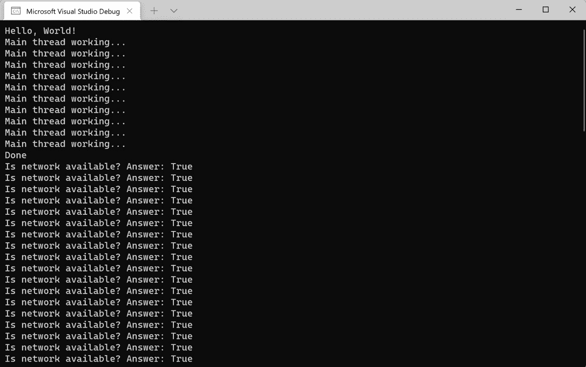
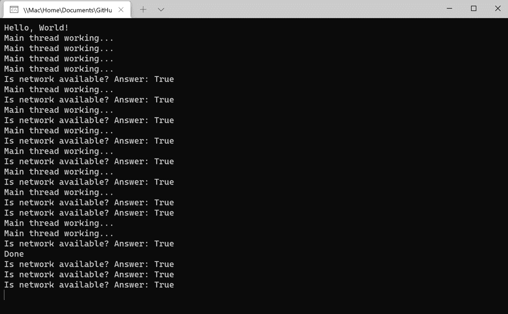
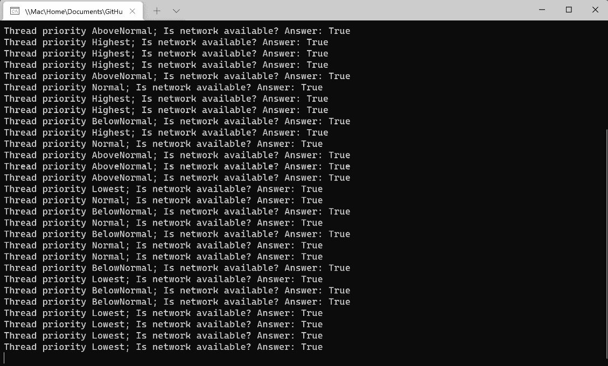
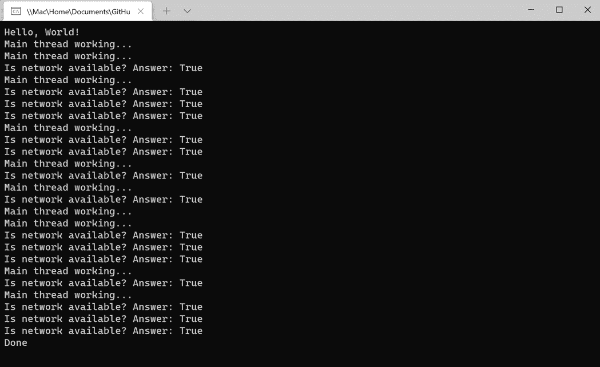

# 第一章：*第一章*: 管理线程概念

C#中的`async`和`await`关键字。本书将涵盖接下来的章节中所有这些概念。

在本章中，我们将从.NET 中如何使用**托管线程**的基本知识开始。您将学习如何创建和销毁线程，处理异常，同步数据，并利用.NET 提供的对象来处理后台操作。此外，您还将获得.NET 应用程序中线程管理的基本理解。本章中的实际示例将说明如何在 C#项目中利用托管线程。

在本章中，我们将涵盖以下主题：

+   .NET 线程基础知识

+   创建和销毁线程

+   处理线程异常

+   在线程间同步数据

+   调度和取消工作

通过从.NET 线程的核心概念开始，您将在学习本书的过程中获得坚实的基础。理解基础知识对于在.NET 应用程序中引入线程和异步操作时防止犯下常见错误非常重要。耗尽资源或将应用程序的数据置于无效状态是非常容易的。让我们从使用 C#进行托管线程开始吧。

# 技术要求

为了在您的应用程序中负责任地使用线程，您应该确切了解**线程**是什么以及您的应用程序的**进程**如何使用线程。

+   Visual Studio 2022 版本 17.0 或更高版本

+   .NET 6

虽然以下推荐是好的，但只要您安装了.NET 6，您就可以使用您喜欢的编辑器。例如，Visual Studio 2022 for Mac，JetBrains Rider 或 Visual Studio Code 都将同样有效。

本章的所有代码示例都可以在 GitHub 上找到，网址为 https://github.com/PacktPublishing/Parallel-Programming-and-Concurrency-with-C-sharp-10-and-.NET-6/tree/main/chapter01。

# .NET 线程基础知识

是时候学习 C#和.NET 中线程的基本知识，开始我们的旅程了。我们将介绍.NET 6 中可用的托管线程概念，但许多这些功能自.NET 之初就已经存在。《System.Threading》命名空间自.NET Framework 1.0 以来就可用。在随后的 20 年里，为开发者添加了许多有用的功能。

为了在您的应用程序中负责任地使用线程，您应该确切了解**线程**是什么以及您的应用程序的**进程**如何使用线程。

## 线程和进程

我们将从应用程序处理的基本单元，线程和进程开始我们的旅程。一个进程封装了一个应用程序的所有执行。这在所有平台和框架中都是正确的。在.NET 中，您可以将进程视为您的`.exe`或托管服务。

注意

在.NET Framework 中，引入了**应用程序域**（或 app domains）的概念，它在一个进程内创建隔离单元。这些应用程序域通过隔离加载到新应用程序域中的代码的执行来提供安全和可靠性。应用程序域仍然存在，但在.NET Core 和.NET 的现代版本中，开发人员无法创建或卸载它们。要了解更多关于应用程序域的信息，请查看 Microsoft Docs 上的这篇文章：https://docs.microsoft.com/dotnet/framework/app-domains/application-domains。

**线程**代表进程中的一个单一执行单元。默认情况下，.NET 应用程序将在单个线程上执行所有其逻辑（即主要或主线程）。开发人员可以利用托管线程和其他.NET 结构从单线程世界迁移到多线程世界，但您如何知道何时采取这一步？

## 我们应该在.NET 中使用多线程的什么时候？

在决定是否将线程引入应用程序时，需要考虑多个因素。这些因素既包括应用程序内部的，也包括外部的。外部因素包括硬件方面，例如应用程序将部署的位置、应用程序运行处的处理器有多强大，以及在这些系统上还将运行哪些其他类型的进程？

如果您的应用程序将竞争有限的资源，最好在多线程的使用上保持谨慎。如果用户觉得您的应用程序正在影响他们系统的性能，您将需要减少您的过程所消耗的线程数量。另一个需要考虑的因素是您的应用程序相对于系统上其他应用程序的重要性。关键任务应用程序将分配更多资源，以便在需要时保持响应。

引入线程的其他常见原因与应用程序本身有关。桌面和移动应用程序需要保持**用户界面**（**UI**）对用户输入的响应。如果应用程序需要处理大量数据或从数据库、文件或网络资源中加载数据，则在主线程上执行可能会导致 UI 冻结或延迟。此外，在多个线程上并行执行长时间运行的任务可以减少任务的整体执行时间。

如果任务的执行对应用程序状态不是至关重要的，这些操作可以卸载到**后台线程**。让我们看看.NET 中前台线程和后台线程之间的区别。

## 背景线程

前台线程和后台线程之间的区别可能并非如您所想。作为前台线程创建的管理线程不是 UI 线程或主线程。前台线程是那些如果正在运行，将阻止托管进程终止的线程。如果一个应用程序被终止，任何正在运行的背景线程都将被停止，以便进程可以关闭。

默认情况下，新创建的线程是前台线程。要创建一个新的后台线程，在启动线程之前将`Thread.IsBackground`属性设置为`true`。此外，您还可以使用`IsBackground`属性来确定现有线程的后台状态。让我们看看一个你可能想在应用程序中使用后台线程的例子。

在这个例子中，我们将使用 Visual Studio 创建一个控制台应用程序，该应用程序将在后台线程上持续检查网络连接的状态。创建一个新的.NET 6 控制台应用程序项目，命名为`BackgroundPingConsoleApp`，并在`Program.cs`中输入以下代码：

```cs
Console.WriteLine("Hello, World!");
```

```cs
var bgThread = new Thread(() =>
```

```cs
{
```

```cs
    while (true)
```

```cs
    {
```

```cs
        bool isNetworkUp = System.Net.NetworkInformation
```

```cs
            .NetworkInterface.GetIsNetworkAvailable();
```

```cs
        Console.WriteLine($"Is network available? Answer: 
```

```cs
            {isNetworkUp}");
```

```cs
        Thread.Sleep(100);
```

```cs
    }
```

```cs
});
```

```cs
bgThread.IsBackground = true;
```

```cs
bgThread.Start();
```

```cs
for (int i = 0; i < 10; i++)
```

```cs
{
```

```cs
    Console.WriteLine("Main thread working...");
```

```cs
    Task.Delay(500);
```

```cs
}
```

```cs
Console.WriteLine("Done");
```

```cs
Console.ReadKey();
```

在运行并检查输出之前，让我们讨论前面代码的每个部分：

1.  第一个`Console.WriteLine`语句是由项目模板创建的。我们将保留它以帮助说明控制台输出的顺序。

1.  接下来，我们创建一个新的名为`bgThread`的`Thread`类型。在线程的主体内部，有一个将连续执行直到线程被终止的`while`循环。在循环内部，我们调用`GetIsNetworkAvailable`方法并将该调用的结果输出到控制台。在重新开始之前，我们使用`Thread.Sleep`注入 100 毫秒的延迟。

1.  在创建线程之后的下一行是本节课的关键部分：

    ```cs
    bgThread.IsBackground = true;
    ```

将`IsBackground`属性设置为`true`使得我们的新线程成为后台线程。这告诉我们的应用程序，线程内部执行的代码对应用程序不是关键的，进程可以在不需要等待线程完成其工作的情况下终止。在这里这是一个好事，因为我们所创建的`while`循环永远不会完成。

1.  在下一行，我们使用`Start`方法启动线程。

1.  接下来，应用程序在其主线程内部启动一些工作。一个`for`循环将执行 10 次，并将`"Main thread working..."`输出到控制台。在循环的每次迭代结束时，使用`Task.Delay`等待 500 毫秒，希望为后台线程执行一些工作提供一些时间。

1.  在`for`循环之后，应用程序将输出`"Done"`到控制台，并等待用户输入以使用`Console.ReadKey`方法终止应用程序。

现在，运行应用程序并检查控制台输出。当你觉得运行时间足够长时，可以按任意键停止应用程序：



图 1.1 – 查看线程化控制台应用程序的输出

结果可能不是你所期望的。你可以看到程序在开始任何后台线程的工作之前，已经在主线程上执行了所有逻辑。稍后，我们将看到如何更改线程的优先级以操纵哪些工作将首先被处理。

在这个例子中，重要的是要理解，我们能够通过按下一个键来执行 `Console.ReadKey` 命令来停止控制台应用程序。即使后台线程仍在运行，进程也不认为线程是应用程序的关键。如果你注释掉以下行，应用程序将不再通过按键来终止：

```cs
bgThread.IsBackground = true;
```

应用程序必须通过关闭命令窗口或使用 Visual Studio 中的 **调试** | **停止调试** 菜单项来停止。稍后，在 *调度和取消工作* 部分中，我们将学习如何在一个受管理的线程中取消工作。

在我们查看更多使用受管理线程的示例之前，我们将花一些时间来了解它们究竟是什么。

## 什么是受管理的线程？

在 .NET 中，我们在上一个示例中使用的 `System.Threading.Thread` 类。当前进程的受管理执行环境监视了作为进程一部分运行的所有的线程。`.NET` 代码中的 `PInvoke` 调用。如果这个线程是第一次进入受管理的环境，.NET 将创建一个新的 `Thread` 对象，由执行环境进行管理。

可以使用 `Thread` 对象的 `ManagedThreadId` 属性唯一地标识一个受管理的线程。这个属性是一个整数，保证在整个线程中是唯一的，并且随着时间的推移不会改变。

`ThreadState` 属性是一个只读属性，它提供了 `Thread` 对象当前的执行状态。在 *.NET 线程基础* 部分的示例中，如果我们调用 `bgThread.Start()` 之前检查了 `ThreadState` 属性，它将是 `未启动`。调用 `Start` 后，状态将变为 `后台`。如果不是后台线程，调用 `Start` 将将 `ThreadState` 属性更改为 `正在运行`。

这里是 `ThreadState` 枚举值的完整列表：

+   `已中止`：线程已被中止。

+   `请求中止`：已请求中止但尚未完成。

+   `后台`：线程在后台运行（`IsBackground` 已设置为 `true`）。

+   `正在运行`：线程目前正在运行。

+   `已停止`：线程已被停止。

+   `请求停止`：已请求停止但尚未完成。

+   `已挂起`：线程已被挂起。

+   `请求挂起`：已请求挂起线程但尚未完成。

+   `未启动`：线程已经被创建但尚未启动。

+   `等待/睡眠/加入`：线程目前被阻塞。

`Thread.IsAlive` 属性是一个较为通用的属性，可以告诉你一个线程是否正在运行。它是一个 `boolean` 类型的属性，如果线程已经开始并且没有被以某种方式停止或取消，它将返回 `true`。

线程还有一个`Name`属性，如果它们从未被设置，则默认为`null`。一旦在线程上设置了`Name`属性，它就不能再更改。如果你尝试设置非`null`线程的`Name`属性，它将抛出`InvalidOperationException`。

我们将在本章的剩余部分介绍托管线程的更多方面。在下一节中，我们将深入了解.NET 中创建和销毁线程的可用方法和选项。

# 创建和销毁线程

首先讨论的应该是`Thread`类。此外，我们还将查看一些暂停或中断线程执行的方法。最后，我们将介绍一些销毁或终止线程执行的方法。

让我们更详细地讨论创建和启动线程。

## 创建托管线程

创建`Thread`对象。`Thread`类有四个构造函数重载：

+   `Thread(ParameterizedThreadStart)`: 这创建一个新的`Thread`对象。它是通过传递一个构造函数带有参数的对象的委托来实现的，该参数可以在调用`Thread.Start()`时传递。

+   `Thread(ThreadStart)`: 这将创建一个新的`Thread`对象，该对象将执行要调用的方法，该方法作为`ThreadStart`属性提供。

+   `Thread(ParameterizedThreadStart, Int32):` 这添加了一个`maxStackSize`参数。避免使用这个重载，因为它最好让.NET 管理堆栈大小。

+   `Thread(ThreadStart, Int32):` 这添加了一个`maxStackSize`参数。避免使用这个重载，因为它最好让.NET 管理堆栈大小。

我们的第一个示例使用了`Thread(ThreadStart)`构造函数。让我们看看使用`ParameterizedThreadStart`通过限制`while`循环的迭代次数来传递值的那个代码版本：

```cs
Console.WriteLine("Hello, World!");
```

```cs
var bgThread = new Thread((object? data) =>
```

```cs
{
```

```cs
    if (data is null) return;
```

```cs
    int counter = 0;
```

```cs
var result = int.TryParse(data.ToString(), 
```

```cs
        out int maxCount);
```

```cs
    if (!result) return;
```

```cs
    while (counter < maxCount)
```

```cs
    {
```

```cs
        bool isNetworkUp = System.Net.NetworkInformation
```

```cs
            .NetworkInterface.GetIsNetworkAvailable();
```

```cs
        Console.WriteLine($"Is network available? Answer: 
```

```cs
            {isNetworkUp}");
```

```cs
        Thread.Sleep(100);
```

```cs
        counter++;
```

```cs
    }
```

```cs
});
```

```cs
bgThread.IsBackground = true;
```

```cs
bgThread.Start(12);
```

```cs
for (int i = 0; i < 10; i++)
```

```cs
{
```

```cs
    Console.WriteLine("Main thread working...");
```

```cs
    Task.Delay(500);
```

```cs
}
```

```cs
Console.WriteLine("Done");
```

```cs
Console.ReadKey();
```

如果你运行应用程序，它将像最后一个示例一样运行，但后台线程应该只输出 12 行到控制台。你可以尝试将不同的整数值传递给`Start`方法，以查看这对控制台输出的影响。

如果你想获取当前正在执行代码的线程的引用，你可以使用`Thread.CurrentThread`静态属性：

```cs
var currentThread = System.Threading.Thread.CurrentThread;
```

如果你的代码需要检查当前线程的`ManagedThreadId`、`Priority`或它是否在后台运行，这可能很有用。

接下来，让我们看看我们如何暂停或中断线程的执行。

## 暂停线程执行

有时，暂停线程的执行是必要的。一个常见的现实生活中的例子是在后台线程上的重试机制。如果你有一个将日志数据发送到网络资源的方法，但网络不可用，你可以调用`Thread.Sleep`来等待特定的时间间隔然后再尝试。`Thread.Sleep`是一个静态方法，它将阻塞当前线程指定的时间（毫秒数）。不可能在除了当前线程之外的线程上调用`Thread.Sleep`。

我们已经在本章的示例中使用了 `Thread.Sleep`，但让我们稍微修改一下代码，看看它如何影响事件顺序。将线程中的 `Thread.Sleep` 间隔更改为 `10`，删除将其变为后台线程的代码，并将 `Task.Delay()` 调用更改为 `Thread.Sleep(100)`：

```cs
Console.WriteLine("Hello, World!");
```

```cs
var bgThread = new Thread((object? data) =>
```

```cs
{
```

```cs
    if (data is null) return;
```

```cs
    int counter = 0;
```

```cs
    var result = int.TryParse(data.ToString(), out int 
```

```cs
        maxCount);
```

```cs
    if (!result) return;
```

```cs
    while (counter < maxCount)
```

```cs
    {
```

```cs
        bool isNetworkUp = System.Net.NetworkInformation.
```

```cs
            NetworkInterface.GetIsNetworkAvailable();
```

```cs
        Console.WriteLine($"Is network available? Answer: 
```

```cs
             {isNetworkUp}");
```

```cs
        Thread.Sleep(10);
```

```cs
        counter++;
```

```cs
    }
```

```cs
});
```

```cs
bgThread.Start(12);
```

```cs
for (int i = 0; i < 12; i++)
```

```cs
{
```

```cs
    Console.WriteLine("Main thread working...");
```

```cs
    Thread.Sleep(100);
```

```cs
}
```

```cs
Console.WriteLine("Done");
```

```cs
Console.ReadKey();
```

再次运行应用程序时，您可以看到，在主线程上放置更大的延迟可以让 `bgThread` 中的进程在主线程完成其工作之前开始执行：



图 1.2 – 使用 Thread.Sleep 改变事件顺序

可以调整两个 `Thread.Sleep` 间隔以查看它们如何影响控制台输出。试一试！

此外，还可以将 `Timeout.Infinite` 传递给 `Thread.Sleep`。这将导致线程暂停，直到它被另一个线程或托管环境中断或终止。通过调用 `Thread.Interrupt` 来中断阻塞或暂停的线程。当线程被中断时，它将接收到 `ThreadInterruptedException` 异常。

异常处理程序应允许线程继续工作或清理任何剩余的工作。如果未处理异常，运行时会捕获异常并停止线程。在运行中的线程上调用 `Thread.Interrupt` 不会有任何效果，直到该线程被阻塞。

现在您已经了解了如何创建中断线程，让我们通过学习如何销毁线程来结束本节。

## 销毁托管线程

通常，`Thread.Abort` 方法。在 .NET Framework 中，对线程调用 `Thread.Abort` 会引发 `ThreadAbortedException` 异常并停止线程运行。在 .NET Core 或任何 .NET 的新版本中都没有提供终止线程的功能。如果某些代码需要被强制停止，建议您将其运行在与其他代码分开的进程中，并使用 `Process.Kill` 来终止其他进程。

任何其他线程终止都应通过取消合作来处理。我们将在 *调度和取消工作* 部分中看到如何做到这一点。接下来，让我们讨论一些在处理托管线程时需要处理的异常。

# 处理线程异常

有几种异常类型是针对托管线程的特定类型，包括我们在上一节中提到的 `ThreadInterruptedException` 异常。另一种特定于线程的异常类型是 `ThreadAbortException`。然而，正如我们在上一节中讨论的，.NET 6 中不支持 `Thread.Abort`，因此，尽管这种异常类型存在于 .NET 6 中，但处理它并不是必要的，因为这种类型的异常仅在 .NET Framework 应用程序中是可能的。

另外两个异常是`ThreadStartException`异常和`ThreadStateException`异常。如果在使用线程的用户代码执行之前启动托管线程存在问题，则会抛出`ThreadStartException`异常。当在当前`ThreadState`属性不可用的情况下调用线程上的方法时，会抛出`ThreadStateException`异常。例如，在一个已经启动的线程上调用`Thread.Start`是无效的，并会导致`ThreadStateException`异常。通常可以通过在操作线程之前检查`ThreadState`属性来避免这些类型的异常。

在多线程应用程序中实现全面的异常处理非常重要。如果托管线程中的代码开始无声地失败，没有任何日志记录或导致进程终止，应用程序可能会进入无效状态。这也可能导致性能下降和响应迟钝。虽然许多应用程序的性能下降可能会很快被发现，但某些服务和基于非 GUI 的其他应用程序可能会在一段时间内没有任何问题被发现。在异常处理程序中添加日志记录，并有一个在日志报告失败时提醒用户的过程，将有助于防止未检测到的失败线程的问题。

在下一节中，我们将讨论多线程代码的另一个挑战：在多个线程间保持数据同步。

# 在线程间同步数据

在本节中，我们将探讨.NET 中用于在多个线程间同步数据的一些方法。如果处理不当，线程间的共享数据可能是多线程开发的主要痛点之一。在.NET 中，具有线程保护机制的类被称为**线程安全**。

多线程应用程序中的数据可以通过几种不同的方式进行同步：

+   `Monitor`类或借助.NET 编译器的帮助。

+   **手动同步**：.NET 中有几个可用于手动同步数据的**同步原语**。

+   **同步上下文**：这仅在.NET Framework 和 Xamarin 应用程序中可用。

+   **System.Collections.Concurrent 类**：有一些专门的.NET 集合用于处理并发。我们将在*第九章*中探讨这些内容。

在本节中，我们将探讨前两种方法。让我们首先讨论如何在您的应用程序中同步代码区域。

## 同步代码区域

您可以使用几种技术来同步代码区域。我们将首先讨论的是`Monitor`类。您可以使用`Monitor.Enter`和`Monitor.Exit`调用将多个线程可以访问的代码块包围起来：

```cs
...
```

```cs
Monitor.Enter(order);
```

```cs
order.AddDetails(orderDetail);
```

```cs
Monitor.Exit(order);
```

```cs
...
```

在这个例子中，假设你有一个 `order` 对象，它正由多个线程并行更新。`Monitor` 类将在当前线程向 `order` 对象添加 `orderDetail` 项目时锁定其他线程的访问。最小化向其他线程引入等待时间的关键是只锁定需要同步的代码行。

注意

如本节所述，`Interlocked` 类在用户模式下执行原子操作，而不是在内核模式下。如果你想了解更多关于这种区别的信息，我建议查看 Nguyen Thai Duong 的这篇博客文章：https://duongnt.com/interlocked-synchronization/。

`Interlocked` 类提供了在多个线程间共享的对象上执行原子操作的方法。以下方法列表是 `Interlocked` 类的一部分：

+   `Add`：这个方法将两个整数相加，用它们的和替换第一个

+   `And`：这是两个整数的位与操作

+   `CompareExchange`：这个方法比较两个对象是否相等，如果相等则替换第一个

+   `Decrement`：这个方法会递减一个整数

+   `Exchange`：这个方法将变量设置为新的值

+   `Increment`：这个方法会递增一个整数

+   `Or`：这是两个整数的位或操作

这些 `Interlocked` 操作将仅在操作期间锁定对目标对象的访问。

此外，C# 中的 `lock` 语句可以用来锁定对代码块的访问，使其只能由单个线程访问。`lock` 语句是一个使用 .NET 的 `Monitor.Enter` 和 `Monitor.Exit` 操作实现的编程语言构造。

对于 `lock` 和 `Monitor` 块，有一些内置的编译器支持。如果在这些块中抛出异常，锁会自动释放。C# 编译器在同步代码周围生成一个 `try/finally` 块，并在 `finally` 块中调用 `Monitor.Exit`。

让我们通过查看一些其他提供手动数据同步支持的 .NET 类来结束本节关于同步的讨论。

## 手动同步

在跨多个线程同步数据时，使用**手动同步**是很常见的。某些类型的数据无法用其他方式保护，例如这些：

+   **全局字段**：这些是可以跨应用程序全局访问的变量。

+   **静态字段**：这些是类中的静态变量。

+   **实例字段**：这些是类中的实例变量。

这些字段没有方法体，因此无法在它们周围放置同步代码区域。使用手动同步，你可以保护所有使用这些对象的地方。这些区域可以用 C# 中的 `lock` 语句进行保护，但某些其他同步原语提供了对共享数据的访问，并且可以在更细粒度级别上协调线程间的交互。我们将首先检查的构造是 `System.Threading.Mutex` 类。

`Mutex` 类与 `Monitor` 类类似，它阻止对代码区域的访问，但它还可以提供授予其他进程访问的能力。当使用 `Mutex` 类时，使用 `WaitOne()` 和 `ReleaseMutex()` 方法来获取和释放锁。让我们看看相同的顺序/顺序详情示例。这次，我们将使用在类级别声明的 `Mutex` 类：

```cs
private static Mutex orderMutex = new Mutex();
```

```cs
...
```

```cs
orderMutex.WaitOne();
```

```cs
order.AddDetails(orderDetail);
```

```cs
orderMutex.ReleaseMutex();
```

```cs
...
```

如果你想在 `Mutex` 类上强制执行超时周期，你可以调用带有超时值的 `WaitOne` 重载：

```cs
orderMutex.WaitOne(500);
```

重要的是要注意，当你完成对对象的操作时，`Mutex` 是通过调用对象的 `Dispose()` 方法来释放的。此外，你还可以在 `using` 块中封装可释放的类型，以便间接地将其释放。

在本节中，我们将要检查的最后一个 .NET 手动锁定结构是 `ReaderWriterLockSlim` 类。如果你有一个在多个线程间使用的对象，你可以使用这种类型；但大多数代码都是从该对象中读取数据。你不想在读取数据的代码块中锁定对对象的访问，但你确实想防止在对象被更新或同时写入时进行读取。这被称为“多个读取者，单个写入者”。

这个 `ContactListManager` 类包含一个可以按电话号码添加或检索的联系人类表。该类假设这些操作可以从多个线程调用，并在 `GetContactByPhoneNumber` 方法中使用 `ReaderWriterLockSlim` 类应用读锁，在 `AddContact` 方法中使用写锁。锁在 `finally` 块中释放，以确保它们总是被释放，即使遇到异常也是如此：

```cs
public class ContactListManager
```

```cs
{
```

```cs
    private readonly List<Contact> contacts;
```

```cs
    private readonly ReaderWriterLockSlim contactLock = 
```

```cs
        new ReaderWriterLockSlim();
```

```cs
    public ContactListManager(
```

```cs
        List<Contact> initialContacts)
```

```cs
    {
```

```cs
        contacts = initialContacts;
```

```cs
    }
```

```cs
    public void AddContact(Contact newContact)
```

```cs
    {
```

```cs
        try
```

```cs
        {
```

```cs
            contactLock.EnterWriteLock();
```

```cs
            contacts.Add(newContact);
```

```cs
        }
```

```cs
        finally
```

```cs
        {
```

```cs
            contactLock.ExitWriteLock();
```

```cs
        }
```

```cs
    }
```

```cs
    public Contact GetContactByPhoneNumber(string 
```

```cs
        phoneNumber)
```

```cs
    {
```

```cs
        try
```

```cs
        {
```

```cs
            contactLock.EnterReadLock();
```

```cs
            return contacts.FirstOrDefault(x => 
```

```cs
                x.PhoneNumber == phoneNumber);
```

```cs
        }
```

```cs
        finally
```

```cs
        {
```

```cs
            contactLock.ExitReadLock();
```

```cs
        }
```

```cs
    }
```

```cs
}
```

如果你向 `ContactListManager` 类添加一个 `DeleteContact` 方法，你会利用相同的 `EnterWriteLock` 方法来防止与类中其他操作的冲突。如果在 `contacts` 的某个使用中忘记加锁，它可能导致其他任何操作失败。此外，还可以将超时应用于 `ReaderWriterLockSlim` 锁：

```cs
contacts.EnterWriteLock(1000);
```

在本节中，我们还没有涵盖几个其他同步原语，但我们讨论了一些你将最常用的最常见类型。要了解更多关于手动同步可用类型的信息，你可以访问 Microsoft Docs，网址为 https://docs.microsoft.com/dotnet/standard/threading/overview-of-synchronization-primitives。

现在我们已经探讨了在处理托管线程时同步数据的不同方法，在结束第一章之前，让我们再讨论两个重要的话题。我们将讨论在线程上调度工作以及如何协作地取消托管线程的技术。

# 调度和取消工作

在应用程序中编排多线程处理时，了解如何调度和取消托管线程上的工作非常重要。

让我们从查看在 .NET 中如何使用托管线程进行调度开始。

## 调度托管线程

当涉及到托管线程时，调度并不像听起来那么明确。没有机制可以告诉操作系统在特定时间启动工作或在特定间隔内执行。虽然你可以编写这种逻辑，但这可能不是必要的。调度托管线程的过程只是通过设置线程的优先级来管理的。为此，将`Thread.Priority`属性设置为可用的`ThreadPriority`值之一：`Highest`、`AboveNormal`、`Normal`（默认）、`BelowNormal`或`Lowest`。

通常情况下，优先级较高的线程会先于优先级较低的线程执行。通常，优先级为`Lowest`的线程将不会执行，直到所有优先级更高的线程都已完成。如果`Lowest`优先级的线程已经开始执行，而一个`Normal`优先级的线程启动，则`Lowest`优先级的线程将被挂起，以便运行`Normal`优先级的线程。这些规则并非绝对，但你可以将它们作为参考。大多数情况下，你会为你的线程保留默认的`Normal`优先级。

当存在多个相同优先级的线程时，操作系统将循环遍历它们，在挂起工作并移动到下一个相同优先级的线程之前，为每个线程分配一个最大时间配额。这种逻辑会因操作系统而异，并且进程的优先级可以根据应用程序是否在 UI 的前台而改变。

让我们使用我们的网络检查代码来测试线程优先级：

1.  首先在 Visual Studio 中创建一个新的控制台应用程序

1.  向项目中添加一个名为`NetworkingWork`的新类，并添加一个名为`CheckNetworkStatus`的方法，其实现如下：

    ```cs
    public void CheckNetworkStatus(object data)
    {
        for (int i = 0; i < 12; i++)
        {
            bool isNetworkUp = System.Net.
                NetworkInformation.NetworkInterface
                    .GetIsNetworkAvailable();
            Console.WriteLine($"Thread priority 
                {(string)data}; Is network available? 
                    Answer: {isNetworkUp}");
            i++;
        }
    }
    ```

调用代码将传递一个参数，该参数包含当前正在执行消息的线程的优先级。这将作为`for`循环内部控制台输出的一个部分被添加，这样用户可以看到哪些优先级的线程首先运行。

1.  接下来，将`Program.cs`的内容替换为以下代码：

    ```cs
    using BackgroundPingConsoleApp_sched;
    Console.WriteLine("Hello, World!");
    var networkingWork = new NetworkingWork();
    var bgThread1 = new 
        Thread(networkingWork.CheckNetworkStatus);
    var bgThread2 = new 
        Thread(networkingWork.CheckNetworkStatus);
    var bgThread3 = new 
        Thread(networkingWork.CheckNetworkStatus);
    var bgThread4 = new 
        Thread(networkingWork.CheckNetworkStatus);
    var bgThread5 = new 
        Thread(networkingWork.CheckNetworkStatus);
    bgThread1.Priority = ThreadPriority.Lowest;
    bgThread2.Priority = ThreadPriority.BelowNormal;
    bgThread3.Priority = ThreadPriority.Normal;
    bgThread4.Priority = ThreadPriority.AboveNormal;
    bgThread5.Priority = ThreadPriority.Highest;
    bgThread1.Start("Lowest");
    bgThread2.Start("BelowNormal");
    bgThread3.Start("Normal");
    bgThread4.Start("AboveNormal");
    bgThread5.Start("Highest");
    for (int i = 0; i < 10; i++)
    {
        Console.WriteLine("Main thread working...");
    }
    Console.WriteLine("Done");
    Console.ReadKey();
    ```

代码创建了五个`Thread`对象，每个对象都有一个不同的`Thread.Priority`值。为了使事情更有趣，线程是按照它们的优先级顺序相反的方式启动的。你可以自己尝试改变这个顺序，看看执行顺序是如何受到影响的。

1.  现在运行应用程序并检查输出：



图 1.3 – 来自五个不同线程的控制台输出

你可以看到，在我的案例中，操作系统是 Windows 11，有时会在所有优先级较高的线程完成工作之前执行优先级较低的线程。选择下一个要运行的线程的算法有点神秘。你还应该记住，这是多线程。多个线程同时运行。可以同时运行的线程的确切数量将因处理器或虚拟机配置而异。

让我们通过学习如何取消一个正在运行的线程来结束本次内容。

## 取消托管线程

**取消托管线程**是理解托管线程时需要了解的更重要概念之一。如果你在前台线程上运行长时间运行的操作，它们应该支持取消。有时你可能想通过你的应用程序的 UI 允许用户取消进程，或者取消可能是应用程序关闭时的清理过程的一部分。

要在托管线程中取消操作，你将使用`CancellationToken`参数。`Thread`对象本身并不像.NET 中的一些现代线程构造函数那样内置对取消令牌的支持。因此，我们必须将令牌传递给在新创建的线程中运行的方法。在下一个练习中，我们将修改前面的示例以支持取消：

1.  首先，更新`NetworkingWork.cs`，使得传递给`CheckNetworkStatus`的参数是一个`CancellationToken`参数：

    ```cs
    public void CheckNetworkStatus(object data)
    {
        var cancelToken = (CancellationToken)data;
        while (!cancelToken.IsCancellationRequested)
        {
            bool isNetworkUp = System.Net
                .NetworkInformation.NetworkInterface
                    .GetIsNetworkAvailable();
            Console.WriteLine($"Is network available? 
                Answer: {isNetworkUp}");
        }
    }
    ```

代码将在`IsCancellationRequested`变为`true`之前，在`while`循环中持续检查网络状态。

1.  在`Program.cs`中，我们将回到只使用一个`Thread`对象的工作方式。删除或注释掉所有之前的后台线程。为了将`CancellationToken`参数传递给`Thread.Start`方法，创建一个新的`CancellationTokenSource`对象，并将其命名为`ctSource`。取消令牌在`Token`属性中可用：

    ```cs
    var pingThread = new 
        Thread(networkingWork.CheckNetworkStatus);
    var ctSource = new CancellationTokenSource();
    pingThread.Start(ctSource.Token);
    ...
    ```

1.  接下来，在`for`循环内部，添加一个`Thread.Sleep(100)`语句，以便在主线程挂起时允许`pingThread`执行：

    ```cs
    for (int i = 0; i < 10; i++)
    {
        Console.WriteLine("Main thread working...");
        Thread.Sleep(100);
    }
    ```

1.  在`for`循环完成后，调用`Cancel()`方法，将线程重新连接到主线程，并销毁`ctSource`对象。`Join`方法将阻塞当前线程，等待`pingThread`使用此线程完成：

    ```cs
    ...
    ctSource.Cancel();
    pingThread.Join();
    ctSource.Dispose();
    ```

1.  现在，当你运行应用程序时，你将看到在主线程上的最后一个`Thread.Sleep`语句执行后不久，网络检查停止：



图 1.4 – 控制台应用程序中取消线程

现在，网络检查应用程序在监听按键以关闭应用程序之前，优雅地取消了线程工作。

当你在托管线程上有一个长时间运行的过程时，你应该在代码遍历循环、开始过程的下一个步骤以及在过程中的其他逻辑检查点时检查取消。如果操作使用计时器定期执行工作，则应在计时器每次执行时检查令牌。

另一种监听取消的方式是在托管线程内部注册一个`Token.Register`方法以接收取消回调。下面的`CheckNetworkStatus2`方法将像前面的示例一样工作：

```cs
public void CheckNetworkStatus2(object data)
```

```cs
{
```

```cs
    bool finish = false;
```

```cs
    var cancelToken = (CancellationToken)data;
```

```cs
    cancelToken.Register(() => {
```

```cs
        // Clean up and end pending work
```

```cs
        finish = true;
```

```cs
    });
```

```cs
    while (!finish)
```

```cs
    {
```

```cs
        bool isNetworkUp = System.Net.NetworkInformation
```

```cs
            .NetworkInterface.GetIsNetworkAvailable();
```

```cs
        Console.WriteLine($"Is network available? Answer: 
```

```cs
            {isNetworkUp}");
```

```cs
    }
```

```cs
}
```

如果你的代码中有多个部分需要监听取消请求，使用这样的委托会更有用。一个**回调**方法可以调用几个清理方法或设置另一个在整个线程中被监控的标志。它很好地封装了清理操作。

我们将在*第十一章*中重新讨论取消操作，因为我们将介绍新的并行和并发概念。然而，本节应该为理解接下来要讨论的内容提供一个坚实的基础。

这就结束了关于托管线程的最后一节。让我们总结一下，回顾一下我们已经学到的内容。

# 摘要

在本章中，我们介绍了托管线程的基础和`System.Threading.Thread`类。你现在应该对如何在.NET 中创建和调度线程有一个很好的理解。你学习了将数据传递给线程的一些技术以及如何使用后台线程进行非关键操作，这样它们就不会阻止你的应用程序终止。最后，我们使用了.NET 中取消线程的两种不同技术。

在下一章*第二章*中，我们将学习.NET 在过去 20 年中如何简化并改进了开发者的并行编程和并发。在.NET 4.5 中，通过添加`async`和`await`关键字，实现了重大改进，而.NET Core 移除了一些.NET Framework 的遗留线程结构。

# 问题

1.  什么是托管线程？

1.  你如何创建一个后台线程？

1.  如果你尝试设置正在运行的线程的`IsBackground`属性会发生什么？

1.  .NET 是如何处理托管线程的调度的？

1.  最大的线程优先级是什么？

1.  在.NET 6 中调用`Thread.Abort()`时，线程会发生什么？

1.  你如何将数据传递给新线程中的方法？

1.  你如何注册一个回调，以便在请求取消线程时被调用？
