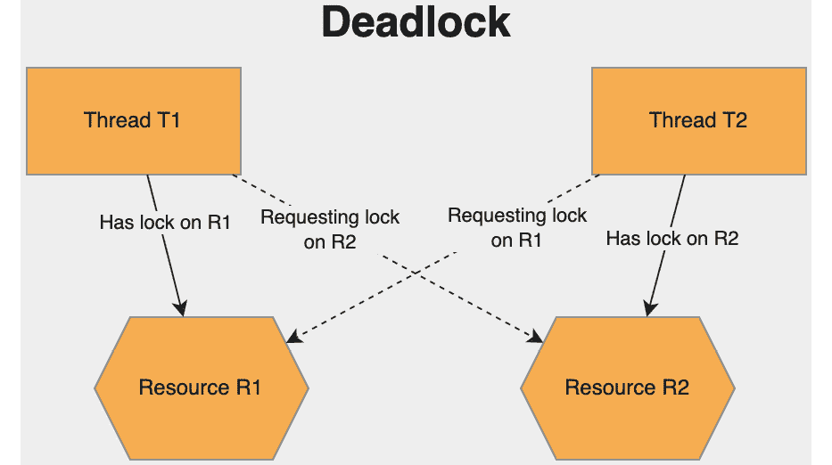

# 第三章：*第三章*: 管理线程的最佳实践

当构建利用并行性和并发性的应用程序时，开发者需要了解一些关于集成管理线程概念的最佳实践。本章将在这方面提供帮助。我们将涵盖重要概念，如处理静态数据、避免死锁以及耗尽管理资源。这些都是可能导致应用程序不稳定和意外行为的问题领域。

在本章中，您将学习以下概念：

+   处理静态对象

+   处理死锁和竞态条件

+   线程限制和其他建议

到本章结束时，您将具备避免最常见的管理线程陷阱的知识。

# 技术要求

要跟随本章中的示例，以下软件是推荐给 Windows 开发者的：

+   Visual Studio 2022 版本 17.0 或更高

+   .NET 6

虽然这些是推荐的，但如果您已安装.NET 6，您可以使用您喜欢的编辑器。例如，macOS 10.13 或更高版本的 Visual Studio 2022 for Mac、JetBrains Rider 或 Visual Studio Code 都将同样有效。

本章的所有代码示例都可以在 GitHub 上找到，链接为[`github.com/PacktPublishing/Parallel-Programming-and-Concurrency-with-C-sharp-10-and-.NET-6/tree/main/chapter03`](https://github.com/PacktPublishing/Parallel-Programming-and-Concurrency-with-C-sharp-10-and-.NET-6/tree/main/chapter03)。

我们将开始讨论处理.NET 中静态数据的一些最佳实践。

# 处理静态对象

当在.NET 中处理静态数据时，关于管理线程有一些重要的事情需要理解。

## 静态数据和构造函数

关于从管理线程访问静态数据的一个重要事项与构造函数有关。在任何类的静态成员可以访问之前，其**静态构造函数**必须首先完成运行。运行时会阻塞线程执行，直到静态构造函数运行，以确保所有必需的初始化都已完成。

如果您在自己的代码库中使用静态对象，您将知道哪些类有静态构造函数，并可以控制其内部的逻辑复杂性。当静态数据不在您的控制范围内，在第三方库或.NET 本身内部时，事情可能并不那么清晰。

让我们通过一个快速示例来展示在这种场景中可能遇到的潜在延迟。

1.  首先在 Visual Studio 中创建一个新的.NET 控制台应用程序，命名为`ThreadingStaticDataExample`。

1.  向项目中添加一个名为 `WorkstationState` 的新类，并包含以下静态成员：

    ```cs
    internal static string Name { get; set; }
    internal static string IpAddress { get; set;}
    internal static bool IsNetworkAvailable { get; set; }
    internal static DateTime? NetworkConnectivity
        LastUpdated { get; set; }
    static WorkstationState()
    {
        Name = Dns.GetHostName();
        IpAddress = GetLocalIPAddress(Name);
        IsNetworkAvailable = NetworkInterface
            .GetIsNetworkAvailable();
        NetworkConnectivityLastUpdated = DateTime.UtcNow;
        Thread.Sleep(2000);
    }
    private static string GetLocalIPAddress
        (string hostName)
    {
        var hostEntry = Dns.GetHostEntry(hostName);
        foreach (var address in hostEntry.AddressList
                            .Where(a => a.AddressFamily == 
                             AddressFamily.InterNetwork))
        {
            return address.ToString();
        }
        return string.Empty;
    }
    ```

这个类将包含有关当前工作站的一些信息，包括主机名、本地 IP 地址以及网络是否当前可用。私有`GetLocalIpAddress`方法根据提供的主机名获取本地 IP。

`WorkstationState`有一个静态构造函数，用于设置初始属性数据和通过`Thread.Sleep`调用注入两秒的延迟。这将帮助我们模拟应用程序获取一些其他需要时间从慢速网络连接检索的网络信息。

1.  接下来，添加一个名为`WorkstationHelper`的类。这个类将包含一个异步方法，用于更新`WorkstationState`中的静态`IsNetworkAvailable`和`NetworkConnectivityLastUpdated`属性，并将`IsNetworkAvailable`的值返回给调用者：

    ```cs
    internal async Task<bool> GetNetworkAvailability()
    {
        await Task.Delay(100);
        WorkstationState.IsNetworkAvailable = 
            NetworkInterface.GetIsNetworkAvailable();
        WorkstationState.NetworkConnectivityLastUpdated = 
            DateTime.UtcNow;
        return WorkstationState.IsNetworkAvailable;
    }
    ```

如果你想要在循环中调用此方法并通过改变注入的延迟进行实验，也可以等待`Task.Delay`调用。

1.  最后，更新`Program.cs`以调用`GetNetworkAvailability`并更新控制台输出，包括连接性、主机名和 IP 地址：

    ```cs
    using ThreadingStaticDataExample;
    Console.WriteLine("Hello, World!");
    Console.WriteLine($"Current datetime: 
        {DateTime.UtcNow}");
    var helper = new WorkstationHelper();
    await helper.GetNetworkAvailability();
    Console.WriteLine($"Network availability last updated 
      {WorkstationState.NetworkConnectivityLastUpdated} 
        for computer {WorkstationState.Name} at IP 
          {WorkstationState.IpAddress}");
    ```

1.  运行程序并检查输出。你可以看到，在静态构造函数注入的两个`Console.WriteLine`调用之间有 2 秒的延迟：

```cs
Hello, World!
Current datetime: 2/12/2022 4:07:13 PM
Network availability last updated 2/12/2022 4:07:15 PM for computer ALVINASHCRABC3A at IP 10.211.55.3
```

当处理托管线程时，静态构造函数是需要注意的静态数据的一个方面。一个更常见的问题是控制线程之间的静态对象的并发读写访问。

## 控制对静态对象的共享访问

当涉及到静态数据时，最佳实践是尽可能避免使用它。一般来说，这会使你的代码更难以测试、更难以扩展，并且在并发工作时更容易出现意外行为。然而，有时静态数据是不可避免的。你可能正在处理一个遗留代码库，其中重构代码以删除静态变量可能是有风险的，或者是一个过于庞大的任务。当数据很少变化，或者类是无状态的时，静态类也可能很有用。

对于不可避免使用静态对象的情况，可以采取一些预防措施。让我们回顾一些这些措施，并讨论每个措施的优点，从锁定机制开始。

### 锁

在*第一章**中，我们讨论了一些用于锁定对象以供共享使用的策略。**锁**在处理静态变量时尤为重要，因为随着对象作用域的增加，并发访问的可能性也会增加。

防止多个线程同时访问一个对象的最简单方法是将访问它的任何代码用锁包围起来。让我们修改`WorkstationHelper`中的代码，以防止多个调用`GetNetworkActivity`同时写入`WorkstationState`属性：

```cs
internal class WorkstationHelper
```

```cs
{
```

```cs
    private static object _workstationLock = new object();
```

```cs
    internal async Task<bool> GetNetworkAvailability()
```

```cs
    {
```

```cs
        await Task.Delay(100);
```

```cs
lock( _workstationLock)
```

```cs
        {
```

```cs
            WorkstationState.IsNetworkAvailable = 
```

```cs
                NetworkInterface.GetIsNetworkAvailable();
```

```cs
            WorkstationState.NetworkConnectivityLastUpdated 
```

```cs
                = DateTime.UtcNow;
```

```cs
        }
```

```cs
        return WorkstationState.IsNetworkAvailable;
```

```cs
    }
```

```cs
}
```

我们添加了一个私有的静态`_workstationLock`对象，并且我们正在将其用作包围`WorkstationState`属性写入的锁块的一部分。如果现在在`Parallel.ForEach`或其他并发操作中使用`GetNetworkAvailability`，则一次只能有一个线程进入该锁块。

你可以使用在*第一章*中讨论过的任何锁定机制。选择最适合你场景的功能。你还可以利用.NET 的另一个功能，即`ThreadStatic`属性。

### ThreadStatic 属性

可以将`ThreadStatic`属性添加到静态字段中，以指示为每个线程创建对象的一个单独的静态实例。只有在需要此行为时才应使用`ThreadStatic`属性，并且应在代码中良好地记录。如果使用不当，它可能会产生意外的结果。

标记为`ThreadStatic`的字段不应在构造函数中初始化其数据，因为初始化只会应用于当前线程。其他线程上的值将是`null`或该类型的默认值。

如果你将`ThreadStatic`属性应用于`WorkstationState`的`NetworkConnectivityLastUpdated`属性，并在`Parallel.For`循环中调用`WorkstationHelper.GetNetworkAvailability`三十次，那么在`Program.cs`中读取的值可能是也可能不是写入静态实例中的最后一个值。`Program.cs`中的变量将包含在`Parallel.For`循环内部主线程中写入的最后一个值。

1.  要亲自尝试，请将`ThreadStatic`属性添加到`NetworkConnectivityLastUpdated`，并将其作为内部字段而不是属性。该属性不能应用于属性：

    ```cs
    [ThreadStatic]
    internal static DateTime? 
        NetworkConnectivityLastUpdated;
    ```

1.  然后更新`Program.cs`以使用`Parallel.For`循环：

    ```cs
    using ThreadingStaticDataExample;
    Console.WriteLine("Hello, World!");
    Console.WriteLine($"Current datetime: 
        {DateTime.UtcNow}");
    var helper = new WorkstationHelper();
    Parallel.For(1, 30, async (x) =>
    {
        await helper.GetNetworkAvailability();
    });
    Console.WriteLine($"Network availability last updated 
        {WorkstationState.NetworkConnectivityLastUpdated} 
            for computer {WorkstationState.Name} at IP 
               {WorkstationState.IpAddress}");
    ```

输出中的日期/时间值之间的时间间隔现在每次运行程序时都会变化，因为写入控制台的最后值可能不是所有线程中的最终值。

虽然`ThreadStatic`应仅应用于需要每个线程的实例的场景，但另一种与静态类似的应用模式是**单例**。让我们讨论在多线程应用程序中使用单例。

### 与单例一起工作

单例模式是一种对象**设计模式**，它只允许创建该对象的一个实例。这种设计模式是最常见的之一，并且大多数.NET 开发者都了解它。每个主流**依赖注入（DI）**框架都允许将注册的类型注册为单例。容器将为这些类型中的每一个创建一个实例，每次请求该类型时都提供相同的实例。

我们可以使用`lock`和一点额外的代码手动创建一个`WorkstationState`的单例。这是`WorkstationStateSingleton`：

```cs
public class WorkstationStateSingleton
{
    private static WorkstationStateSingleton? 
        _singleton = null;
    private static readonly object _lock = new();
    WorkstationStateSingleton()
    {
        Name = Dns.GetHostName();
        IpAddress = GetLocalIPAddress(Name);
        IsNetworkAvailable = 
            NetworkInterface.GetIsNetworkAvailable();
        NetworkConnectivityLastUpdated = 
            DateTime.UtcNow;
    }
    public static WorkstationStateSingleton Instance
    {
        get
        {
            lock (_lock)
            {
                if (_singleton == null)
                {
                    _singleton = new 
                       WorkstationStateSingleton();
                }
                return _singleton;
            }
        }
    }
...
}
```

类的完整实现可以在本章*技术要求*部分引用的 GitHub 存储库中找到。查看`chapter3`文件夹中的`ThreadingStaticDataExample`。

使其成为单例需要采取两个步骤。首先，构造函数是私有的，这样只有`WorkstationStateSingleton`可以创建自己的实例。其次，创建一个静态的`Instance`方法。如果它不是`null`，它将返回自己的`_singleton`实例。否则，它将创建实例以返回。使用`_lock`包围这段代码确保在并发线程上不会创建两次实例。

单例与静态类面临相同的挑战。如果共享数据可以被管理线程并发访问，则应该由锁来保护。对于注册在 DI 容器中的单例，增加的挑战是必须在容器相同的范围内声明一个`lock`对象、`Mutex`或另一种机制。这将确保所有可能使用单例的数据也能强制执行相同的锁。

注意

请注意，单例的使用通常不被认为是良好的实践。因此，许多开发者认为它们是一种反模式。然而，了解它们以及你的代码中现有的单例可能如何受到多线程代码的影响是很重要的。

**死锁**是积极锁定的一种陷阱。积极锁定是指你在代码的许多部分使用对象锁定，而这些部分可能并行执行。在下一节中，我们将讨论管理线程中的死锁和**竞态条件**。

# 管理死锁和竞态条件

就像开发者可用的许多工具一样，滥用管理线程的功能可能会在运行时对你的应用程序产生不利影响。死锁和竞态条件是多线程编程可能产生的两种情况：

+   **死锁**发生在多个线程试图锁定相同的资源，结果无法继续执行。

+   **竞态条件**发生在多个线程正在尝试更新特定例程时，并且正确的结果取决于它们执行的顺序。



图 3.2 – 两个线程争夺相同资源，导致死锁

首先，让我们讨论死锁以及避免它们的一些技术。

## 缓解死锁

在你的应用程序中避免死锁至关重要。如果一个死锁涉及的线程是应用程序的 UI 线程，它将导致应用程序冻结。当只有非 UI 线程发生死锁时，诊断问题可能更困难。死锁的线程池线程将阻止应用程序关闭，但死锁的后台线程则不会。

在生产环境中出现问题时，良好的代码调试工具对于调试问题至关重要。如果问题可以在您的开发环境中重现，使用 Visual Studio 调试器逐步执行代码是找到死锁来源的最快方式。我们将在 *第十章* 中详细讨论调试技术。

通过递归或尝试在相同资源上获取锁的嵌套方法，是创建死锁的最简单方法之一。看看以下代码：

```cs
private object _lock = new object();
```

```cs
private List<string> _data;
```

```cs
public DeadlockSample()
```

```cs
{
```

```cs
    _data = new List<string> { "First", "Second",
```

```cs
        "Third" };
```

```cs
}
```

```cs
public async Task ProcessData()
```

```cs
{
```

```cs
    lock (_lock)
```

```cs
    {
```

```cs
        foreach(var item in _data)
```

```cs
        {
```

```cs
            Console.WriteLine(item);
```

```cs
        }
```

```cs
        await AddData();
```

```cs
    }
```

```cs
}
```

```cs
private async Task AddData()
```

```cs
{
```

```cs
    lock (_lock)
```

```cs
    {
```

```cs
        _data.AddRange(GetMoreData());
```

```cs
        await Task.Delay(100);
```

```cs
    }
```

```cs
}
```

`ProcessData` 方法正在锁定 `_lock` 对象并使用 `_data` 进行处理。然而，它调用了 `AddData`，这也试图获取相同的锁。这个锁永远不会变得可用，进程将会死锁。在这种情况下，问题很明显。如果 `AddData` 从多个地方调用或者父代码中涉及任何 `Parallel.ForEach` 循环，会怎样？一些父代码使用 `_data` 并获取锁，但有些则没有。这就是 `ReaderWriterLockSlim` 中的非阻塞读锁可以帮助防止死锁的情况。

防止死锁的另一种方法是使用 `Monitor.TryEnter` 给锁尝试添加超时。在这个例子中，如果在一秒内无法获取锁，代码将超时：

```cs
private void AddDataWithMonitor()
```

```cs
{
```

```cs
    if (Monitor.TryEnter(_lock, 1000))
```

```cs
    {  
```

```cs
        try
```

```cs
        {  
```

```cs
            _data.AddRange(GetMoreData());
```

```cs
        }  
```

```cs
        finally
```

```cs
        {  
```

```cs
            Monitor.Exit(_lock);  
```

```cs
        }  
```

```cs
    }  
```

```cs
    else
```

```cs
    {  
```

```cs
        Console.WriteLine($"AddData: Unable to acquire 
```

```cs
            lock. Stack trace: {Environment.StackTrace}");
```

```cs
    }
```

```cs
}
```

记录获取锁失败的情况可以帮助您确定代码中可能的死锁来源，以便您可以重新编写代码以避免它们。

接下来，让我们看看在多线程应用程序中竞态条件是如何发生的。

## 避免竞态条件

当多个线程同时读取和写入相同的变量时，就会发生竞态条件。如果没有任何锁，结果可能是完全不可预测的。某些操作可以被其他并行线程的结果覆盖。即使有锁，两个线程操作顺序的改变也可能改变结果。以下是一个没有锁的简单示例，它并行执行了一些加法和乘法：

```cs
private int _runningTotal;
```

```cs
public void PerformCalculationsRace()
```

```cs
{
```

```cs
    _runningTotal = 3;
```

```cs
    Parallel.Invoke(() => {
```

```cs
        AddValue().Wait();
```

```cs
    }, () => {
```

```cs
        MultiplyValue().Wait();
```

```cs
    });
```

```cs
    Console.WriteLine($"Running total is {_runningTotal}");
```

```cs
}
```

```cs
private async Task AddValue()
```

```cs
{
```

```cs
    await Task.Delay(100);
```

```cs
    _runningTotal += 15;
```

```cs
}
```

```cs
private async Task MultiplyValue()
```

```cs
{
```

```cs
    await Task.Delay(100);
```

```cs
    _runningTotal = _runningTotal * 10;
```

```cs
}
```

我们都知道，当结合加法和乘法时，操作顺序很重要。如果这两个操作按顺序处理，两个结果可以是 `180` 或 `45`，但如果 `AddValue` 和 `MultiplyValue` 在执行各自的操作之前都读取了初始值 `3`，则最后一个完成的方法将写入 `18` 或 `30` 作为 `_runningTotal` 的最终值。

如果您想确保乘法发生在加法之前，可以将 `PerformCalculations` 方法重写为使用 `MultiplyValue` 返回的 `Task` 上的 `ContinueWith` 方法：

```cs
public async Task PerformCalculations()
```

```cs
{
```

```cs
    _runningTotal = 3;
```

```cs
    await MultiplyValue().ContinueWith(async (Task) => {
```

```cs
        await AddValue();
```

```cs
        });
```

```cs
    Console.WriteLine($"Running total is {_runningTotal}");
```

```cs
}
```

这段代码在加法之前总是先进行乘法，并且总是以 `_runningTotal` 等于 `45` 结束。在整个代码中使用 `async` 和 `await` 确保在需要时使用线程池中的线程时，UI 或服务进程保持响应。

在上一章中讨论的**Interlocked**类也可以用于对共享资源执行数学操作。`Interlocked.Add`和`Interlocked.Exchange`可以在并行中对`_runningTotal`变量执行线程安全操作。以下是修改后的原始`Parallel.Invoke`示例，使用`Interlocked`方法与`_runningTotal`：

```cs
public class InterlockedSample
```

```cs
{
```

```cs
    private long _runningTotal;
```

```cs
    public void PerformCalculations()
```

```cs
    {
```

```cs
        _runningTotal = 3;
```

```cs
        Parallel.Invoke(() => {
```

```cs
            AddValue().Wait();
```

```cs
        }, () => {
```

```cs
            MultiplyValue().Wait();
```

```cs
        });
```

```cs
        Console.WriteLine($"Running total is 
```

```cs
            {_runningTotal}");
```

```cs
    }
```

```cs
    private async Task AddValue()
```

```cs
    {
```

```cs
        await Task.Delay(100);
```

```cs
        Interlocked.Add(ref _runningTotal, 15);
```

```cs
    }
```

```cs
    private async Task MultiplyValue()
```

```cs
    {
```

```cs
        await Task.Delay(100);
```

```cs
        var currentTotal = Interlocked.Read(ref 
```

```cs
            _runningTotal);
```

```cs
        Interlocked.Exchange(ref _runningTotal, 
```

```cs
            currentTotal * 10);
```

```cs
    }
```

```cs
}
```

这两个操作仍然可能以不同的顺序执行，但现在`_runningTotal`的使用已被锁定且线程安全。**Interlocked**类比使用锁定语句更高效，对于这种简单的更改，它将提供更好的性能。

在代码中执行并发操作时，保护所有共享资源非常重要。通过创建一个精心设计的锁定策略，你将在保持应用程序线程安全的同时实现最佳性能。让我们以关于线程限制的指导来结束这一章。

# 线程限制和其他建议

因此，使用多个线程确实可以加快应用程序的性能。你可能应该开始用`Parallel.ForEach`循环替换所有的`foreach`循环，并在线程池线程上调用所有你的服务和辅助方法，对吧？有没有限制，它们是什么？好吧，当涉及到线程时，绝对存在限制。

可以同时执行的线程数受系统上的处理器和处理器核心数限制。硬件限制无法规避，因为 CPU（或在虚拟机上运行时为虚拟 CPU）只能运行这么多线程。此外，你的应用程序必须与其他系统上运行的其他进程共享这些 CPU。如果你的 CPU 有四个核心，它正在积极运行五个其他应用程序，而你的程序正在尝试执行一个具有多个线程的过程，系统不太可能一次接受你的多个线程。

.NET 线程池已针对基于可用线程数的不同场景进行了优化，但你也可以做一些事情来防止过度使用系统。一些并行操作，如`Parallel.ForEach`，可以限制循环尝试使用的线程数。你可以向操作提供一个`ParallelOptions`对象并设置`MaxDegreeOfParallelism`选项。默认情况下，循环将使用调度器提供的所有线程。

你可以通过以下实现确保最大值不超过系统可用核心数的一半：

```cs
public void ProcessParallelForEachWithLimits
```

```cs
    (List<string> items)
```

```cs
{
```

```cs
    int max = Environment.ProcessorCount > 1 ? 
```

```cs
                Environment.ProcessorCount / 2 : 1;
```

```cs
    var options = new ParallelOptions
```

```cs
    {
```

```cs
        MaxDegreeOfParallelism = max
```

```cs
    };
```

```cs
    Parallel.ForEach(items, options, y => {
```

```cs
        // Process items
```

```cs
    });
```

```cs
}
```

PLINQ 操作也可以使用`WithDegreeOfParallelism`扩展方法来限制最大并行度：

```cs
public bool ProcessPlinqWithLimits(List<string> items)
```

```cs
{
```

```cs
    int max = Environment.ProcessorCount > 1 ? 
```

```cs
        Environment.ProcessorCount / 2 : 1;
```

```cs
    return items.AsParallel()
```

```cs
        .WithDegreeOfParallelism(max)
```

```cs
        .Any(i => CheckString(i));
```

```cs
}
```

```cs
private bool CheckString(string item)
```

```cs
{
```

```cs
    return !string.IsNullOrWhiteSpace(item);
```

```cs
}
```

如果需要，应用程序也可以调整线程池的最大值。通过调用`ThreadPool.SetMaxThreads`，你可以更改`workerThreads`和`completionPortThreads`的最大值。`completionPortThreads`是线程池上的异步 I/O 线程的数量。通常不需要更改这些值，并且你可以设置一些限制。最大值不能设置为小于系统核心数或小于线程池当前的最小值。你可以使用`ThreadPool.GetMinThreads`查询当前的最小值。以下是如何安全地将最大线程值设置为大于当前最小值的示例：

```cs
private void UpdateThreadPoolMax()
```

```cs
{
```

```cs
    ThreadPool.GetMinThreads(out int workerMin, out int 
```

```cs
        completionMin);
```

```cs
    int workerMax = GetProcessingMax(workerMin);
```

```cs
    int completionMax = GetProcessingMax(completionMin);
```

```cs
    ThreadPool.SetMaxThreads(workerMax, completionMax);
```

```cs
}
```

```cs
private int GetProcessingMax(int min)
```

```cs
{
```

```cs
    return min < Environment.ProcessorCount ?
```

```cs
                    Environment.ProcessorCount * 2 :
```

```cs
                    min * 2;
```

```cs
}
```

在你的应用程序中为操作分配线程的数量有一些其他的一般性指南需要遵循。尽量避免为共享资源的操作分配多个线程。例如，如果你有一个将活动记录到文件的服务，你不应该分配超过一个后台工作线程来进行记录。阻塞的文件 I/O 操作将阻止第二个线程写入，直到第一个线程完成。在这种情况下，你并没有获得任何效率的提升。

如果你发现自己正在应用程序中的对象上添加大量的锁定，那么你可能是在使用过多的线程，或者任务分配需要改变以减少对资源的竞争。尝试通过消耗的数据类型来划分线程任务的责任。你可能有很多并行任务调用服务来获取数据，但一旦数据返回，只需要一个或两个线程来处理数据。

你可能听说过**线程饥饿**这个术语。这通常发生在有太多的线程正在阻塞或等待资源变得可用时。有一些常见的场景会发生这种情况：

+   **锁**：有太多的线程在竞争相同的锁定资源。分析你的代码以确定如何减少竞争。

+   `async`。这允许 web 服务器在你等待操作完成的同时服务其他请求。

+   **过多的线程**：创建过多的线程池线程会导致更多的空闲线程等待处理。这也增加了线程竞争和饥饿的可能性。

避免这些做法，.NET 将尽力管理线程池以服务于你的应用程序和其他系统上的应用程序。

最后，不要使用`Thread.Suspend`和`Thread.Resume`来尝试控制多个线程间操作的顺序。相反，利用本章讨论的其他技术，包括锁定机制和`Task.ContinueWith`。

在本章中，我们已经介绍了许多关于托管线程的最佳实践。让我们通过回顾我们所学的内容来结束本章。

# 摘要

在本章中，我们讨论了在 C# 和 .NET 中处理托管线程时应遵循的一些最佳实践。我们首先创建了一些示例，说明了如何在多线程应用程序中管理和处理静态数据。这些示例说明了如何利用锁、与单例一起工作，以及静态构造函数在处理静态数据时如何影响性能。接下来，我们探索了一些避免死锁和竞态条件的技巧。如果你设计算法以最小化锁定需求，这两个陷阱都可以避免。最后，我们查看了一些可以调整多个并行和线程池操作限制的 .NET 功能。

到目前为止，你已经准备好在 .NET 项目中负责任地使用托管线程了。有关托管线程的最佳实践，你可以查看 Microsoft Docs 上的建议：https://docs.microsoft.com/en-us/dotnet/standard/threading/managed-threading-best-practices。

在下一章（*第四章*）中，你将学习如何利用并行性和并发性来保持应用程序的响应性，并了解一些从非 UI 线程更新 UI 的最佳实践。

# 问题

1.  哪个设计模式模型描述了如何创建只有一个实例的对象？

1.  哪个 .NET 属性会导致静态字段在每个线程中只有一个实例？

1.  线程死锁是什么？

1.  在尝试访问已锁定资源时，`Monitor` 类上的哪个方法可以指定超时？

1.  哪个轻量级类可以用于锁定值类型以进行原子操作？

1.  哪个线程安全操作可以用来添加两个整数？

1.  在 `Parallel.For` 或 `Parallel.ForEach` 循环中可以设置哪个选项来限制使用的线程数？

1.  你如何限制 PLINQ 查询中使用的线程数？

1.  在线程池中找到当前最小线程值的方法的名称是什么？
