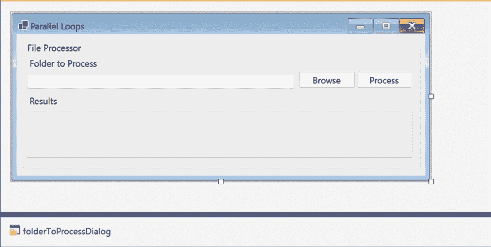
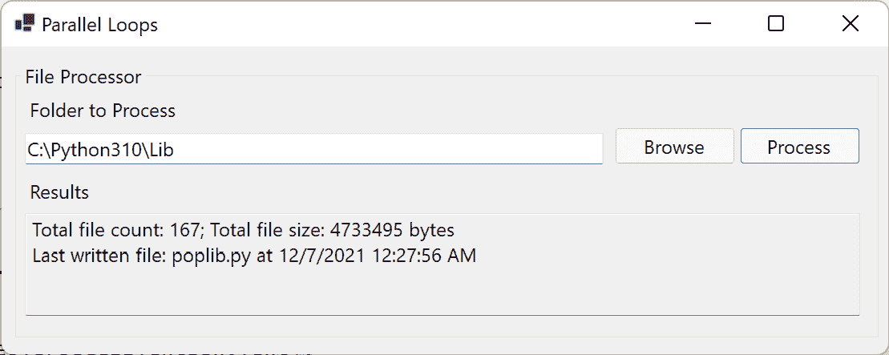
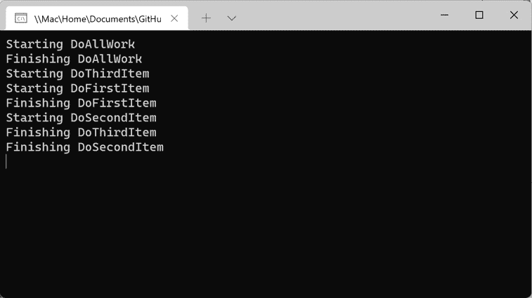
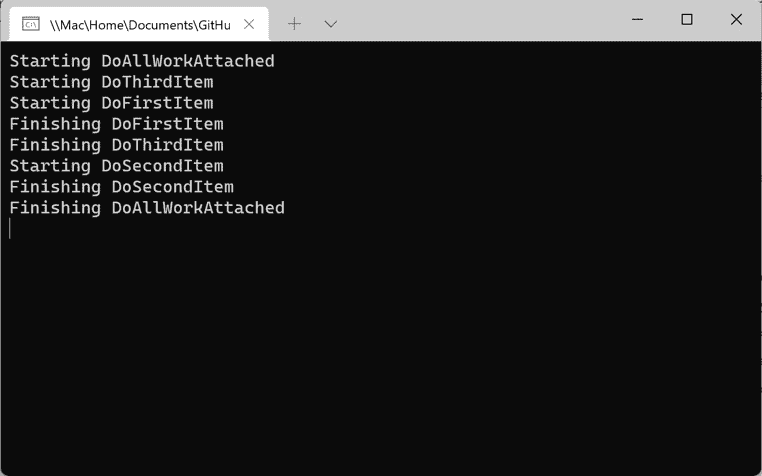
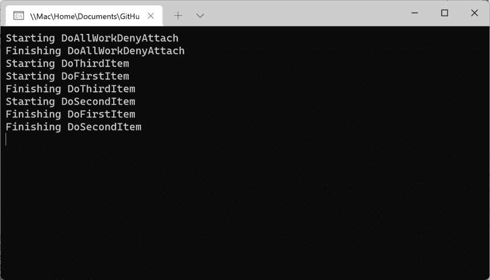

# 第六章：*第六章*：并行编程概念

`Task` 对象。本章将进一步探讨 TPL 中的 `System.Threading.Tasks.Parallel` 成员以及一些额外的任务概念，用于处理相关任务。

并行编程、并发编程和异步编程之间的界限并不总是清晰的，随着我们继续阅读，您将发现这三个概念相交的地方。

在本章中，您将学习以下内容：

+   开始使用 TPL

+   .NET 中的并行循环

+   并行任务之间的关系

+   并行编程的常见陷阱

在本章结束时，您将了解如何在自己的项目中使用并行编程，为什么您会选择并行循环而不是标准循环，以及何时使用 `async` 和 `await` 而不是并行循环。

# 技术要求

要跟随本章中的示例，建议 Windows 开发者使用以下软件：

+   Visual Studio 2022 版本 17.0 或更高版本

+   .NET 6

虽然这些是推荐使用的，但如果您已安装 .NET 6，您可以使用您喜欢的编辑器。例如，macOS 10.13 或更高版本的 Visual Studio 2022 for Mac、JetBrains Rider 或 Visual Studio Code 都可以正常工作。

本章的所有代码示例都可以在 GitHub 上找到，链接为 [`github.com/PacktPublishing/Parallel-Programming-and-Concurrency-with-C-sharp-10-and-.NET-6/tree/main/chapter06`](https://github.com/PacktPublishing/Parallel-Programming-and-Concurrency-with-C-sharp-10-and-.NET-6/tree/main/chapter06)。

让我们从讨论 TPL 以及它在 .NET 并行编程世界中的位置开始。

# 开始使用 TPL

在 *.NET Framework 4.0* 中的 `System.Threading` 和 `System.Threading.Tasks` 命名空间。TPL 提供了使并行性和并发性对 .NET 开发者来说更简单的功能。您不需要在代码中管理 `ThreadPool` 任务。TPL 处理线程管理，并自动根据处理器能力和可用性调整活动线程的数量。

开发者应在需要将并行性或并发性引入代码以提高性能时使用 TPL。然而，TPL 并不是每个场景的正确选择。您如何知道何时选择 TPL 以及每个场景的最佳 TPL 构造？

让我们探索一些常见的场景。

## I/O 密集型操作

当处理 I/O 密集型操作，如文件操作、数据库调用或 Web 服务调用时，使用 `Task` 对象和 C# 的 `async`/`await` 操作进行异步编程是您的最佳选择。如果您的服务需要您循环遍历一个大型集合，并为循环中的每个对象进行服务调用，您应考虑重构服务以返回单个服务调用中的数据。这将最小化与每个网络操作相关的开销。它还将允许您的客户端代码对服务进行单个 `async` 调用，同时保持主线程可以执行其他工作。

I/O 密集型操作通常不适合并行操作，但每条规则都有例外。如果你需要遍历文件系统中的一组文件夹和子文件夹，并行循环可能非常适合这个任务。然而，重要的是，你的循环的任何迭代都不要尝试访问相同的文件，以避免锁定问题。

现在，让我们探索一些 CPU 密集型场景。

## CPU 密集型操作

CPU 密集型操作不依赖于外部资源，如文件系统、网络或互联网。它们涉及在应用程序进程内处理内存中的数据。有许多类型的数据转换属于这一类别。你的应用程序可能正在序列化或反序列化数据，在文件类型之间转换，或处理图像或其他二进制数据。

这类操作对于数据并行性和特定的并行循环来说是有意义的，但有几点例外。首先，如果每个迭代不是非常 CPU 密集型，使用 TPL 带来的开销不值得。如果过程非常密集，但迭代对象很少，考虑使用`Parallel.Invoke`而不是`Parallel.For`或`Parallel.ForEach`中的一个并行循环。对于 CPU 密集度较低的操作使用并行结构可能会因为使用 TPL 的开销而减慢你的代码。在第*第十章*中，我们将学习如何使用 Visual Studio 来确定并行和并发代码的性能。

现在你已经了解在应用程序中何时使用并行性，让我们探索一些使用`Parallel.For`和`Parallel.ForEach`的实际示例。

# .NET 中的并行循环

在本节中，我们将探讨一些在.NET 项目中利用数据并行性的示例。C#的`for`和`foreach`循环的并行版本，`Parallel.For`和`Parallel.ForEach`，是`System.Threading.Tasks.Parallel`命名空间的一部分。使用这些并行循环的方式与使用它们的 C#标准对应物相似。

一个关键的区别是，并行循环的主体被声明为`continue`以停止循环的当前迭代，而不中断整个循环，你会使用`return`语句。使用`break`跳出并行循环的等效操作是使用`Stop()`或`Break()`语句。

让我们看看在.NET WinForms 应用程序中使用`Parallel.For`循环的一个示例。

## 基本并行`Parallel.For`循环

我们将创建一个新的`FileProcessor`类，它将遍历文件以聚合文件大小并找到最近写入的文件：

1.  首先在 Visual Studio 中创建一个新的.NET 6 WinForms 项目

1.  添加一个名为`FileData`的新类。这个类将包含`FileProcessor`中的数据：

    ```cs
    public class FileData
    {
        public List<FileInfo> FileInfoList { get; set; } = 
            new();
        public long TotalSize { get; set; } = 0;
        public string LastWrittenFileName 
            { get; set; } = "";
        public DateTime LastFileWriteTime { get; set; }
    }
    ```

我们将返回一个包含所选文件夹中文件的`FileInfo`对象列表，所有文件的总大小，最后写入的文件名以及文件被写入的日期和时间。

1.  接下来，创建一个名为 `FileProcessor` 的新类

1.  向 `FileProcessor` 添加一个名为 `GetInfoForFiles` 的静态方法：

    ```cs
    public static FileData GetInfoForFiles(string[] files)
    {
        var results = new FileData();
        var fileInfos = new List<FileInfo>();
        long totalFileSize = 0;
        DateTime lastWriteTime = DateTime.MinValue;
        string lastFileWritten = "";
        object dateLock = new();
        Parallel.For(0, files.Length,
                index => {
    FileInfo fi = new(files[index]);
                    long size = fi.Length;
    DateTime lastWrite = 
                        fi.LastWriteTimeUtc;
                    lock (dateLock)
                    {
                        if (lastWriteTime < lastWrite)
                        {
                            lastWriteTime = lastWrite;
                            lastFileWritten = fi.Name;
    }
                    }
    Interlocked.Add(ref totalFileSize, 
                        size);
                    fileInfos.Add(fi);
                });
        results.FileInfoList = fileInfos;
        results.TotalSize = totalFileSize;
        results.LastFileWriteTime = lastWriteTime;
        results.LastWrittenFileName = lastFileWritten;
        return results;
    }
    ```

在前面的代码中，`Parallel.For` 循环及其体中的 **lambda 表达式** 被突出显示。关于循环内的代码有一些需要注意的事项：

1.  首先，`index` 作为参数提供给 lambda 表达式，以便表达式体可以使用它来访问 `files` 数组的当前成员。

1.  `totalFileSize` 在调用 `Interlocked.Add` 时更新。这是在并行代码中安全地添加值的最高效方式。

1.  没有一种简单的方法可以利用 `Interlocked` 来更新 `lastWriteTime` DateTime 值。因此，我们使用一个带有 `dateLock` 对象的 `lock` 块来安全地读取和设置方法级别的 `lastWriteTime` 变量。

1.  接下来，打开 `Form1.cs` 的设计器，并将以下控件添加到窗体中：

    ```cs
    private GroupBox FileProcessorGroup;
    private Button FolderProcessButton;
    private Button FolderBrowseButton;
    private TextBox FolderToProcessTextBox;
    private Label label1;
    private TextBox FolderResultsTextBox;
    private Label label2;
    private FolderBrowserDialog folderToProcessDialog;
    ```

在本章 GitHub 仓库中查看 `Form1.designer.cs` 文件 ([`github.com/PacktPublishing/Parallel-Programming-and-Concurrency-with-C-sharp-10-and-.NET-6/tree/main/chapter06/WinFormsParallelLoopApp`](https://github.com/PacktPublishing/Parallel-Programming-and-Concurrency-with-C-sharp-10-and-.NET-6/tree/main/chapter06/WinFormsParallelLoopApp)) 以审查和设置这些控件的所有属性。

当你完成时，窗体的设计器应该看起来像这样：



图 6.1 – Visual Studio 中完成的 Form1.cs 设计视图

1.  接下来，双击 `Form1` 设计器，代码背后将生成一个 `FolderBrowserButton_Click` 事件处理程序。将以下代码添加到使用 `folderToProcessDialog` 对象向用户显示文件夹选择对话框的代码中：

    ```cs
    private void FolderBrowseButton_Click(object sender, 
        EventArgs e)
    {
        var result = folderToProcessDialog.ShowDialog();
        if (result == DialogResult.OK)
        {
            FolderToProcessTextBox.Text = 
                folderToProcessDialog.SelectedPath;
        }
    }
    ```

选定的文件夹路径将设置在 `FolderToProcessTextBox` 中，用于下一步。用户可以手动输入或粘贴文件夹路径到字段中。如果您想防止手动输入，可以将 `FolderToProcessTextBox.ReadOnly` 设置为 `true`。

1.  接下来，双击代码背后的 `FolderProcessButton_Click` 事件处理程序将生成。将以下代码添加到调用 `FileProcessor` 并在 `FolderResultsTextBox` 中显示结果的代码中：

    ```cs
    private void FolderProcessButton_Click(object sender, 
        EventArgs e)
    {
        if (!string.IsNullOrWhiteSpace
            (FolderToProcessTextBox.Text) &&
            Directory.Exists(FolderToProcessTextBox.Text))
        {
            string[] filesToProcess = Directory.GetFiles
                (FolderToProcessTextBox.Text);
            FileData? results = FileProcessor
                .GetInfoForFiles(filesToProcess);
            if (results == null)
            {
                FolderResultsTextBox.Text = "";
                return;
            }
            StringBuilder resultText = new();
            resultText.Append($"Total file count: 
                {results.FileInfoList.Count}; ");
            resultText.AppendLine($"Total file size: 
                {results.TotalSize} bytes");
            resultText.Append($"Last written file: 
                {results.LastWrittenFileName} ");
            resultText.Append($"at 
                {results.LastFileWriteTime}");
            FolderResultsTextBox.Text = 
                resultText.ToString();
        }
    }
    ```

这里的代码足够简单。静态 `GetInfoForFiles` 方法返回一个包含文件信息的 `FileData` 实例。我们使用 `StringBuilder` 创建要设置在 `FolderResultsTextBox` 中的输出。

1.  我们已经准备好运行应用程序。在 Visual Studio 中开始调试项目并尝试一下。你的结果应该看起来像这样：



图 6.2 – 运行并行循环应用程序

就这些了。如果你想尝试更高级的功能，你可以尝试修改项目以处理所选文件夹的所有子文件夹中的文件。让我们对项目进行不同的修改，以便减少对 `Interlocked.Add` 的锁定调用。

## 带有线程局部变量的并行循环

`Parallel.For` 构造函数有一个重载版本，将允许我们的代码为每个参与循环的线程保持总文件大小的运行小计。这意味着我们只有在从每个线程聚合小计到 `totalFileSize` 时才需要使用 `Interlocked.Add`。这是通过提供 `Interlocked.Add` 只会调用 5 次而不是 200 次来实现的，而不会丢失任何线程安全性：

```cs
public static FileData GetInfoForFilesThreadLocal(string[] 
```

```cs
    files)
```

```cs
{
```

```cs
    var results = new FileData();
```

```cs
    var fileInfos = new List<FileInfo>();
```

```cs
    long totalFileSize = 0;
```

```cs
    DateTime lastWriteTime = DateTime.MinValue;
```

```cs
    string lastFileWritten = "";
```

```cs
    object dateLock = new();
```

```cs
    Parallel.For<long>(0, files.Length, () => 0,
```

```cs
        (index, loop, subtotal) => {
```

```cs
            FileInfo fi = new(files[index]);
```

```cs
            long size = fi.Length;
```

```cs
            DateTime lastWrite = fi.LastWriteTimeUtc;
```

```cs
            lock (dateLock)
```

```cs
            {
```

```cs
                if (lastWriteTime < lastWrite)
```

```cs
                {
```

```cs
                    lastWriteTime = lastWrite;
```

```cs
                    lastFileWritten = fi.Name;
```

```cs
                }
```

```cs
            }
```

```cs
            subtotal += size;
```

```cs
            fileInfos.Add(fi);
```

```cs
            return subtotal;
```

```cs
            },
```

```cs
(runningTotal) => Interlocked.Add(ref 
```

```cs
            totalFileSize, runningTotal)
```

```cs
    );
```

```cs
    results.FileInfoList = fileInfos;
```

```cs
    results.TotalSize = totalFileSize;
```

```cs
    results.LastFileWriteTime = lastWriteTime;
```

```cs
    results.LastWrittenFileName = lastFileWritten;
```

```cs
    return results;
```

```cs
}
```

总结前面的更改，你会注意到我们正在使用 `Parallel.For<long>` 泛型方法来指示 `subtotal` 线程局部变量应该是 `long` 而不是默认的 `int` 类型。大小在第一个 lambda 表达式中添加到 `subtotal`，而不需要任何锁定表达式。我们现在必须返回 `subtotal`，以便其他迭代可以访问数据。最后，我们向 `For` 添加了一个最终参数，该参数包含一个 lambda 表达式，该表达式使用 `Interlocked.Add` 将每个线程的 `runningTotal` 添加到 `totalFileSize`。

如果你将 `FolderProcessButton_Click` 更改为调用 `GetInfoForFilesThreadLocal`，输出将相同，但性能将得到提升，可能不是很明显。性能提升取决于你选择的文件夹中的文件数量。

现在我们已经尝试了几个 `Parallel.For` 循环的练习，让我们创建一个使用 `Parallel.ForEach` 方法的示例。

## 简单的 Parallel.ForEach 循环

`Parallel.ForEach` 方法，如 `Parallel.For`，在用法上与它们的非并行对应方法类似。当你有一个要处理的 `IEnumerable` 集合时，你会使用 `Parallel.ForEach` 而不是 `Parallel.For`。在这个示例中，我们将创建一个新的方法，该方法接受一个包含图像文件的 `List<string>` 列表以迭代并转换为 `Bitmap` 对象：

1.  首先，在 `FileProcessor` 类中创建一个新的私有静态方法，命名为 `ConvertJpgToBitmap`。此方法将打开每个 JPG 文件并返回一个包含图像数据的新 `Bitmap`：

    ```cs
    private static Bitmap ConvertJpgToBitmap(string 
        fileName)
    {
        Bitmap bmp;
        using (Stream bmpStream = File.Open(fileName, 
            FileMode.Open))
        {
            Image image = Image.FromStream(bmpStream);
            bmp = new Bitmap(image);
        }
        return bmp;
    }
    ```

1.  接下来，在同一个类中创建一个公共静态方法，命名为 `ConvertFilesToBitmaps`：

    ```cs
    public static List<Bitmap> ConvertFilesToBitmaps
        (List<string> files)
    {
        var result = new List<Bitmap>();
        Parallel.ForEach(files, file =>
        {
            FileInfo fi = new(file);
            string ext = fi.Extension.ToLower();
            if (ext == ".jpg" || ext == ".jpeg")
            {
                result.Add(ConvertJpgToBitmap(file));
            }
        });
        return result;
    }
    ```

此方法接受包含所选文件夹中文件的 `List<string>`。在 `Parallel.ForEach` 循环内部，它检查文件是否有 `.jpg` 或 `.jpeg` 文件扩展名。如果有，它将转换为位图并添加到 `result` 集合中。

1.  在 `Form1.cs` 中添加一个新按钮。将 `Name` 属性设置为 `ProcessJpgsButton`，将 `Text` 属性设置为 `Process JPGs`。

1.  双击新按钮以在代码隐藏文件中创建事件处理器。将以下代码添加到新的事件处理器中：

    ```cs
    private void ProcessJpgsButton_Click(object sender, 
        EventArgs e)
    {
        if (!string.IsNullOrWhiteSpace
            (FolderToProcessTextBox.Text) &&
            Directory.Exists(FolderToProcessTextBox.Text))
        {
            List<string> filesToProcess = Directory
                .GetFiles(FolderToProcessTextBox.Text)
                    .ToList();
            List<Bitmap> results = FileProcessor
                .ConvertFilesToBitmaps(filesToProcess);
            StringBuilder resultText = new();
            foreach (var bmp in results)
            {
                resultText.AppendLine($"Bitmap height: 
                    {bmp.Height}");
            }
            FolderResultsTextBox.Text = 
                resultText.ToString();
        }
    }
    ```

1.  现在，运行项目，选择包含一些 JPG 文件的文件夹，并点击新的 **处理 JPGs** 按钮。你应该会在输出中看到每个转换后的 JPG 的高度。

这就是简单的 `Parallel.ForEach` 循环所需的所有内容。如果你需要取消一个长时间运行的并行循环，你能做什么？让我们更新我们的示例，使用 `Parallel.ForEachAsync` 来实现这一点。

## 取消 Parallel.ForEachAsync 循环

`Parallel.ForEachAsync` 是 .NET 6 中的新特性。它是 `Parallel.ForEach` 的可等待版本，其主体是一个 `async` lambda 表达式。让我们更新之前的示例，使用这个新的并行方法，并添加取消操作的能力：

1.  我们将首先创建一个 `async` 版本的 `ConvertFilesToBitmaps`，命名为 `ConvertFilesToBitmapsAsync`。以下是其差异：

    ```cs
    public static async Task<List<Bitmap>> 
        ConvertFilesToBitmapsAsync(List<string> files, 
            CancellationTokenSource cts)
    {
        ParallelOptions po = new()
        {
            CancellationToken = cts.Token,
    MaxDegreeOfParallelism = 
                Environment.ProcessorCount == 1 ? 1
                          : Environment.ProcessorCount - 1
        };
        var result = new List<Bitmap>();
        try
        {
    await Parallel.ForEachAsync(files, po, async 
    (file, _cts) => 
            {
                FileInfo fi = new(file);
                string ext = fi.Extension.ToLower();
                if (ext == ".jpg" || ext == "jpeg")
                {
                    result.Add(ConvertJpgToBitmap(file));
                    await Task.Delay(2000, _cts);
                }
            });
        }
        catch (OperationCanceledException e)
        {
            MessageBox.Show(e.Message);
        }
        finally
        {
            cts.Dispose();
        }
        return result;
    }
    ```

新方法是 `async`，返回 `Task<List<Bitmap>>`，接受 `CancellationTokenSource`，并在创建 `ParallelOptions` 时使用它传递给 `Parallel.ForEachAsync` 方法。`Parallel.ForEachAsync` 被等待，其 lambda 表达式被声明为 `async`，这样我们就可以等待新添加的 `Task.Delay`，给我们足够的时间在循环完成前点击 **取消** 按钮。

将 `Parallel.ForEachAsync` 包裹在处理 `OperationCanceledException` 的 `try`/`catch` 块中，使得方法能够捕获取消操作。在取消操作被处理后，我们将向用户显示一条消息。

代码还设置了 `ProcessorCount` 选项。如果只有一个 CPU 核心可用，我们将设置该值为 `1`；否则，我们希望使用的核心数不超过可用核心数减一。.NET 运行时通常管理这个值非常好，所以你应该只有在发现它提高了应用程序的性能时才更改此选项。

1.  在 `Form1.cs` 文件中，添加一个新的 `CancellationTokenSource` 私有变量：

    ```cs
    private CancellationTokenSource _cts;
    ```

1.  更新事件处理程序为 `async`，将 `_cts` 设置为 `CancellationTokenSource` 的新实例，并将其传递给 `ConvertFilesToBitmapsAsync`。同样，在该调用中添加 `await`。

所需的所有更改都在以下代码片段中突出显示：

```cs
private async void ProcessJpgsButton_Click(object 
    sender, EventArgs e)
{
    if (!string.IsNullOrWhiteSpace
        (FolderToProcessTextBox.Text) &&
        Directory.Exists(FolderToProcessTextBox.Text))
    {
        _cts = new CancellationTokenSource();
        List<string> filesToProcess = Directory
           .GetFiles(FolderToProcessTextBox.Text)
               .ToList();
        List<Bitmap> results = await FileProcessor
            .ConvertFilesToBitmapsAsync
(filesToProcess, _cts);
        StringBuilder resultText = new();
        foreach (var bmp in results)
        {
            resultText.AppendLine($"Bitmap height: 
                {bmp.Height}");
        }
        FolderResultsTextBox.Text = resultText
            .ToString();
    }
}
```

1.  在表单中添加一个名为 `CancelButton` 的新按钮，其标题为 `取消`

1.  双击 **取消** 按钮并添加以下事件处理程序代码：

    ```cs
    private void CancelButton_Click(object sender, 
        EventArgs e)
    {
        if (_cts != null)
        {
            _cts.Cancel();
        }
    }
    ```

1.  运行应用程序，浏览并选择包含 JPG 文件的文件夹，点击 **处理 JPGs** 按钮，然后立即点击 **取消** 按钮。你应该会收到一条消息，表明处理已被取消。不会进一步处理记录。

我们将在 *第十一章* 中了解更多关于取消异步和并行工作的内容。现在，让我们讨论 `Parallel.Invoke` 构造以及 TPL 中任务之间的关系。

# 并行任务之间的关系

在上一章中，*第五章*，我们学习了如何使用 `async` 和 `await` 来并行执行工作，并通过使用 `ContinueWith` 来管理任务的流程。在本节中，我们将检查一些可以用来管理并行运行的任务之间关系的 TPL 功能。

让我们先深入探讨 TPL 提供的 `Parallel.Invoke` 方法。

## 在 `Parallel.Invoke` 的底层

在 *第二章*，我们学习了如何使用 `Parallel.Invoke` 方法并行执行多个任务。现在我们将重新审视 `Parallel.Invoke`，并发现其底层发生了什么。考虑使用它来调用两个方法：

```cs
Parallel.Invoke(DoFirstAction, DoSectionAction);
```

这就是幕后发生的事情：

```cs
List<Task> taskList = new();
```

```cs
taskList.Add(Task.Run(DoFirstAction));
```

```cs
taskList.Add(Task.Run(DoSectionAction));
```

```cs
Task.WaitAll(taskList.ToArray());
```

将创建两个任务并将它们排队在线程池中。假设系统有可用资源，这两个任务应该被选中并并行运行。调用方法将阻塞当前线程，等待并行任务完成。动作将阻塞调用线程，直到最长运行的任务完成。

如果这对您的应用程序来说是可接受的，使用 `Parallel.Invoke` 可以使代码更简洁、更容易理解。然而，如果您不想阻塞调用线程，有几个选项。首先，让我们对第二个示例进行修改，使用 `await`：

```cs
List<Task> taskList = new();
```

```cs
taskList.Add(Task.Run(DoFirstAction));
```

```cs
taskList.Add(Task.Run(DoSectionAction));
```

```cs
await Task.WhenAll(taskList.ToArray());
```

通过等待 `Task.WhenAll` 而不是使用 `Task.WaitAll`，我们允许当前线程在等待两个子任务并行完成处理的同时执行其他工作。要使用 `Parallel.Invoke` 实现相同的结果，我们可以将其包装在 `Task` 中：

```cs
await Task.Run(() => Parallel.Invoke(DoFirstTask, 
```

```cs
    DoSecondTask));
```

同样的技术可以用 `Parallel.For` 来使用，以避免在等待循环完成时阻塞调用线程。对于 `Parallel.ForEach` 来说，这并不是必需的。我们不需要将 `Parallel.ForEach` 包装在 `Task` 中，而是可以用 `Parallel.ForEachAsync` 来替换它。我们在本章前面了解到，.NET 6 添加了 `Parallel.ForEachAsync`，它返回 `Task` 并可以等待。

接下来，让我们讨论如何管理父任务与其子任务之间的关系。

## 理解并行子任务

当执行嵌套任务时，默认情况下，父任务不会等待其子任务，除非我们使用 `Wait()` 方法或 `await` 语句。然而，在使用 `Task.Factory.StartNew()` 时，我们可以通过一些选项来控制这种默认行为。为了说明可用的选项，我们将创建一个新的示例项目：

1.  首先，创建一个新的 C# 控制台应用程序，命名为 `ParallelTaskRelationshipsSample`。

1.  向项目中添加一个名为 `ParallelWork` 的类。这是我们创建父方法和它们的子方法的地方。

1.  将以下三个方法添加到 `ParallelWork` 类中。这些将是我们的子方法。每个方法在启动和完成时都会写入一些控制台输出。使用 `Thread.SpinWait` 注入延迟。如果你不熟悉 `Thread.SpinWait`，它将当前线程放入一个循环中，循环次数由指定的迭代数决定，注入等待而不将线程从调度程序中移除：

    ```cs
    public void DoFirstItem()
    {
        Console.WriteLine("Starting DoFirstItem");
        Thread.SpinWait(1000000);
        Console.WriteLine("Finishing DoFirstItem");
    }
    public void DoSecondItem()
    {
        Console.WriteLine("Starting DoSecondItem");
        Thread.SpinWait(1000000);
        Console.WriteLine("Finishing DoSecondItem");
    }
    public void DoThirdItem()
    {
        Console.WriteLine("Starting DoThirdItem");
        Thread.SpinWait(1000000);
        Console.WriteLine("Finishing DoThirdItem");
    }
    ```

1.  接下来，添加一个名为 `DoAllWork` 的方法。此方法将创建一个父任务，该任务调用前面的三个方法并带有子任务。没有添加代码来等待子任务：

    ```cs
    public void DoAllWork()
    {
        Console.WriteLine("Starting DoAllWork");
        Task parentTask = Task.Factory.StartNew(() =>
        {
            var child1 = Task.Factory.StartNew
                 (DoFirstItem);
            var child2 = Task.Factory.StartNew
                  (DoSecondItem);
            var child3 = Task.Factory.StartNew
                  (DoThirdItem);
        });
        parentTask.Wait();
        Console.WriteLine("Finishing DoAllWork");
    }
    ```

1.  现在，在 `Program.cs` 中添加一些代码来运行 `DoAllWork`：

    ```cs
    using ParallelTaskRelationshipsSample;
    var parallelWork = new ParallelWork();
    parallelWork.DoAllWork();
    Console.ReadKey();
    ```

1.  运行程序并检查输出。正如你所预期的，父任务在它的子任务之前完成：



图 6.3 – 控制台应用程序运行 DoAllWork

1.  接下来，让我们创建一个名为 `DoAllWorkAttached` 的方法。此方法将运行相同的三个子任务，但子任务将包含 `TaskCreationOptions.AttachedToParent` 选项：

    ```cs
    public void DoAllWorkAttached()
    {
        Console.WriteLine("Starting DoAllWorkAttached");
        Task parentTask = Task.Factory.StartNew(() =>
        {
            var child1 = Task.Factory.StartNew
                (DoFirstItem, TaskCreationOptions
                    .AttachedToParent);
            var child2 = Task.Factory.StartNew
                (DoSecondItem, TaskCreationOptions
                    .AttachedToParent);
            var child3 = Task.Factory.StartNew
                (DoThirdItem, TaskCreationOptions
                    .AttachedToParent);
        });
        parentTask.Wait();
        Console.WriteLine("Finishing DoAllWorkAttached");
    }
    ```

1.  将 `Program.cs` 更新为调用 `DoAllWorkAttached` 而不是 `DoAllWork` 并重新运行应用程序：



图 6.4 – 运行我们的应用程序并调用 DoAllWorkAttached

你可以看到，即使我们没有明确等待子任务，父任务也不会在它的子任务完成之前完成。

现在，假设你还有一个父任务，它不应该等待其子任务，无论是否使用 `TaskCreationOptions.AttachedToParent` 选项启动。让我们创建一个新的方法来处理这种情况：

1.  创建一个名为 `DoAllWorkDenyAttach` 的方法，以下是其代码：

    ```cs
    public void DoAllWorkDenyAttach()
    {
        Console.WriteLine("Starting DoAllWorkDenyAttach");
        Task parentTask = Task.Factory.StartNew(() =>
        {
            var child1 = Task.Factory.StartNew
                (DoFirstItem, TaskCreationOptions
                    .AttachedToParent);
            var child2 = Task.Factory.StartNew
                 (DoSecondItem, TaskCreationOptions
                     .AttachedToParent);
            var child3 = Task.Factory.StartNew
                (DoThirdItem, TaskCreationOptions
                    .AttachedToParent);
        }, TaskCreationOptions.DenyChildAttach);
        parentTask.Wait();
        Console.WriteLine("Finishing DoAllWork
            DenyAttach");
    }
    ```

子任务仍然使用 `AttachedToParent` 选项创建，但父任务现在设置了 `DenyChildAttach` 选项。这将覆盖子任务附加到父任务的要求。

1.  将 `Program.cs` 更新为调用 `DoAllWorkDenyAttach` 并再次运行应用程序：



图 6.5 – 控制台应用程序调用 DoAllWorkDenyAttach

你可以看到，`DenyChildAttach` 确实覆盖了每个子任务上设置的 `AttachToParent` 选项。父任务在没有等待子任务的情况下完成，就像调用 `DoAllWork` 时那样。

关于这个示例的最后一点。你可能已经注意到，我们使用了 `Task.Factory.StartNew` 而不是 `Task.Run`，即使我们不需要设置 `TaskCreationOption`。这是因为 `Task.Run` 将禁止任何子任务附加到父任务。如果你在 `DoAllWorkAttached` 方法中使用 `Task.Run` 作为父任务，父任务将首先完成，就像在其他方法中那样。

让我们通过介绍一些在使用 .NET 进行并行编程时可能遇到的潜在陷阱来结束本章。

# 并行编程的常见陷阱

当使用 TPL 时，有一些做法要避免，以确保在您的应用程序中获得最佳结果。在某些情况下，错误使用并行性可能会导致性能下降。在其他情况下，它可能导致错误或数据损坏。

## 并行性不能保证

当使用并行循环之一或 `Parallel.Invoke` 时，迭代可以并行运行，但并不保证一定会这样做。这些并行委托中的代码应该能够在任何场景下成功运行。

## 并行循环并不总是更快

我们在本章 earlier 讨论过这一点，但重要的是要记住，`for` 和 `foreach` 循环的并行版本并不总是更快。如果每个循环迭代运行得很快，添加并行的开销可能会减慢您的应用程序。

在向应用程序引入任何线程时，这一点非常重要。在引入并发或并行之前和之后始终测试您的代码，以确保性能提升值得线程开销。

## 谨防阻塞 UI 线程

记住，`Parallel.For` 和 `Parallel.ForEach` 是 *阻塞调用*。如果您在 UI 线程上使用它们，它们将阻塞 UI 直到调用结束。这个阻塞时间至少是运行时间最长的循环迭代的时间。

正如我们在上一节中讨论的，您可以通过调用 `Task.Run` 来包装并行代码，将执行从 UI 线程移动到线程池上的后台线程。

## 线程安全

不要在并行循环中调用非线程安全的 .NET 方法。每个 .NET 类型的线程安全性在 Microsoft Docs 上有记录。使用 .NET API 浏览器快速查找有关特定 .NET API 的信息：[`docs.microsoft.com/dotnet/api/`](https://docs.microsoft.com/dotnet/api/)。

限制在并行循环中使用静态 .NET 方法，即使它们被标记为线程安全。它们不会引起错误或数据一致性问题，但可能会对循环性能产生负面影响。即使是调用 `Console.WriteLine` 也应仅用于测试或演示目的。不要在生产代码中使用这些方法。

## UI 控件

在 Windows 客户端应用程序中，不要尝试在并行循环中访问 UI 控件。WinForms 和 WPF 控件只能从创建它们的线程访问。您可以使用 `Dispatcher.Invoke` 在其他线程上调用操作，但这将产生性能影响。最好在并行循环完成后更新 UI。

## ThreadLocal 数据

记住要在您的并行循环中利用 `ThreadLocal` 变量。我们在本章 earlier 的 *带有线程局部变量的并行循环* 部分展示了如何做到这一点。

这就涵盖了您对 C# 和 .NET 并行编程的介绍。让我们通过回顾本章学到的所有内容来结束。

# 摘要

在本章中，我们学习了如何在.NET 应用程序中利用并行编程概念。我们亲自动手使用了`Parallel.For`、`Parallel.ForEach`和`Parallel.ForEachAsync`循环。在这些部分，我们学习了如何在保持线程安全的同时安全地聚合数据。接下来，我们学习了如何管理父任务与其并行子任务之间的关系。这将有助于确保你的应用程序保持预期的操作顺序。

最后，我们讨论了在实现应用程序中的并行性时需要避免的一些重要陷阱。开发者应该注意避免在自己的应用程序中遇到这些陷阱。

要了解更多关于.NET 中数据并行的信息，Microsoft Docs 上的*数据并行*文档是一个很好的起点：[`docs.microsoft.com/dotnet/standard/parallel-programming/data-parallelism-task-parallel-library`](https://docs.microsoft.com/dotnet/standard/parallel-programming/data-parallelism-task-parallel-library).

在下一章中，我们将继续探索 TPL，通过学习如何利用 TPL 数据流库中包含的各种构建块。

# 问题

1.  哪个并行循环在给定次数的迭代中并行执行一个委托？

1.  哪个并行循环是`Parallel.ForEach`的可等待版本？

1.  哪个并行方法可以并行执行两个或更多提供的行为？

1.  哪个`Task.Factory.StartNew`选项可以将子任务的完成附加到其父任务上？

1.  哪个`Task.Factory.StartNew`选项可以提供给父任务以防止任何子任务附加？

1.  为什么在使用`TaskCreationOptions`建立父子关系时永远不应该使用`Task.Run`？

1.  并行循环是否总是比它们的传统对应物更快？
