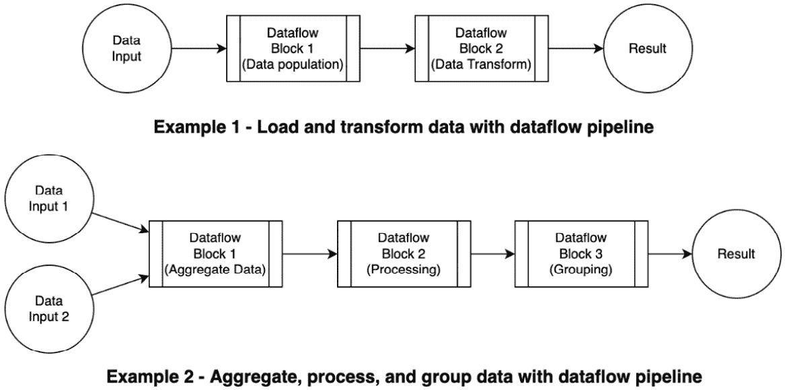
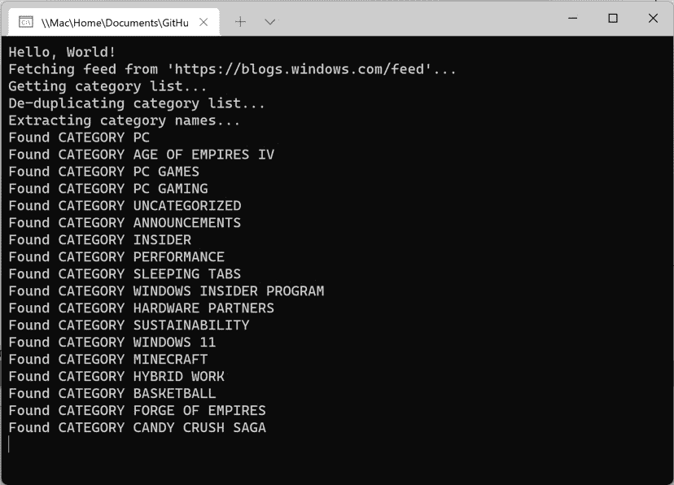
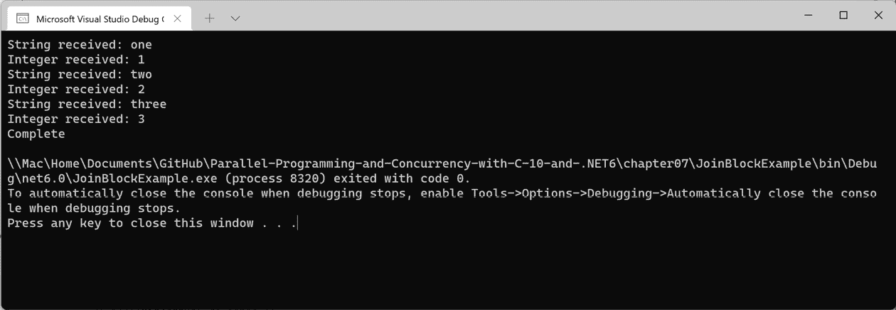

# 第七章：*第七章*：任务并行库（TPL）和数据流

**任务并行库**（**TPL**）数据流库包含构建块，用于在.NET 中编排异步工作流。本章将介绍 TPL 数据流库，描述库中**数据流块**的类型，并通过实际示例说明使用数据流块的一些常见模式。

当处理大量数据并在多个阶段进行处理，或者您的应用程序以连续流接收数据时，数据流库非常有用。数据流块提供了一种实现**生产者/消费者设计模式**的绝佳方式。

为了理解这一点，我们将创建一个实现此模式的示例项目，并检查数据流库的其他实际应用。

注意

重要的是要知道 TPL 数据流库不是作为.NET 运行时或 SDK 的一部分进行分发的。它可以从 Microsoft 的 NuGet 包中获取。我们将使用 Visual Studio 中的**NuGet 包资源管理器**（**NPE**）将其添加到我们的示例项目中。

在本章中，我们将涵盖以下主题：

+   介绍 TPL 数据流库

+   实现生产者/消费者模式

+   使用多个块创建数据管道

+   处理来自多个数据源的数据

到本章结束时，您将了解每种类型的数据流块的目的，并能够在适当的项目中添加数据流库。

您还将了解在哪些情况下，数据流块不比简单的并行编程替代方案（如`Parallel.ForEach`）提供优势。

# 技术要求

为了跟随本章中的示例，以下软件是推荐给 Windows 开发者的：

+   Visual Studio 2022 版本 17.0 或更高版本

+   .NET 6

+   要完成 WPF 示例，您需要安装 Visual Studio 的.NET 桌面开发工作负载

虽然这些是推荐的，但如果您已安装.NET 6，您可以使用您喜欢的编辑器。例如，macOS 10.13 或更高版本的 Visual Studio 2022 for Mac、JetBrains Rider 或 Visual Studio Code 都将同样有效。

本章的代码示例可以在 GitHub 上找到：[`github.com/PacktPublishing/Parallel-Programming-and-Concurrency-with-C-sharp-10-and-.NET-6/tree/main/chapter07`](https://github.com/PacktPublishing/Parallel-Programming-and-Concurrency-with-C-sharp-10-and-.NET-6/tree/main/chapter07)。

让我们从讨论 TPL 数据流库及其为什么可以成为在.NET 中实现并行编程的绝佳方式开始。

# 介绍 TPL 数据流库

TPL 数据流库与 TPL 本身一样可用。它在 2010 年随`System.Threading.Tasks.Dataflow`命名空间发布。数据流库旨在建立在 TPL 提供的并行编程基础知识之上，扩展以解决数据流场景（因此库的名称）。数据流库由称为**块**的基础类组成。每个数据流块负责整体流程中的特定操作或步骤。

数据流库由三种基本类型的块组成：

+   `ISourceBlock<TOutput>`接口。源块可以从你定义的工作流程中读取其数据。

+   `ITargetBlock<TInput>`接口，是一个数据接收器。

+   `IPropagatorBlock<TInput, TOutput>`接口。应用程序可以从中读取数据并将数据写入它们。

当你将多个数据流块连接起来创建一个工作流程时，所得到的系统被称为`ISourceBlock<TOutput>.LinkTo`方法。这就是传播器块可以在管道中间发挥作用的地方。它们可以作为工作流程中链接的源和目标。如果一个源块的消息可以被多个目标处理，你可以添加过滤功能来检查源提供的对象属性，以确定哪个目标或传播器块应该接收该对象。

在数据流块之间传递的对象通常被称为**消息**。你可以将数据流管道视为**网络**或消息系统。通过网络流动的数据单元是消息。每个块都负责以某种方式读取、写入或转换每个消息。

要向目标块发送消息，你可以使用`Post`方法同步发送或使用`SendAsync`方法异步发送。在源块中，可以使用`Receive`、`TryReceive`和`ReceiveAsync`方法接收消息。`Receive`和`TryReceive`方法都是同步的。`Choose`方法将监视多个源块以获取数据，并从第一个提供数据的源返回一个消息。

要将源块的消息提供给目标块，源可以调用目标的`OfferData`方法。`OfferData`方法返回一个`DataflowMessageStatus`枚举，它有几个可能的值：

+   `Accepted`：消息已被接受，并将由目标处理。

+   `Declined`：消息被目标拒绝。源块仍然拥有该消息，并且无法处理其下一个消息，直到当前消息被另一个目标接受。

+   `DecliningPermanently`：消息已被拒绝，目标不再可用于处理。所有后续的消息都将被当前目标拒绝。源块将解除与返回此状态的目标的链接。

+   `Postponed`：接受消息已被推迟。它可能在稍后由目标接受。在这种情况下，源可以等待或尝试将消息传递给另一个替代目标块。

+   `NotAvailable`：当目标尝试接受消息时，消息不再可用。这可能在目标在消息被推迟后尝试接受消息时发生，但源块已经将消息传递给另一个目标块。

数据流块支持`Complete`方法和`Completion`属性的概念。`Complete`方法用于在块上请求完成，而`Completion`属性返回一个`Task`，称为块的`IDataflowBlock`接口，该接口由`ISourceBlock`和`ITargetBlock`共同继承。

完成任务可以用来确定一个块是否遇到了错误或已被取消。让我们看看如何：

1.  处理数据流块遇到错误的最简单方法是调用块的`Completion`属性的`Wait`，并在`try`/`catch`块中处理`AggregateException`异常类型：

    ```cs
    try
    {
       inputBlock.Completion.Wait();
    }
    catch (AggregateException ae)
    {
       ae.Handle(e =>
       {
          Console.WriteLine($"Error processing input - 
              {e.GetType().Name}: {e.Message}");
       });
    }
    ```

1.  如果你想在不需要使用阻塞的`Wait`调用的情况下做同样的事情，你可以`await`完成任务并处理`Exception`类型：

    ```cs
    try
    {
        await inputBlock.Completion;
    }
    catch (Exception e)
    {
        Console.WriteLine($"Error processing input - 
            {e.GetType().Name}: {e.Message}");
    }
    ```

1.  另一种选择是在完成任务上使用`ContinueWith`方法。在延续块内部，你可以检查任务的状态以确定它是否为`Faulted`或`Canceled`：

    ```cs
    try
    {
        inputBlock.ContinueWith(task =>
        {
    Console.WriteLink($"Task completed with a 
                status of {task.Status}");
        });
        await inputBlock.Completion;
    }
    catch (Exception e)
    {
        Console.WriteLine($"Error processing input - 
            {e.GetType().Name}: {e.Message}");
    }
    ```

当我们在下一节创建一个使用生产者/消费者模式的示例项目时，我们将看到更多关于数据流块使用的综合示例。在我们检查数据流块类型之前，让我们讨论一下为什么微软创建了该库。

## 为什么使用 TPL 数据流库？

TPL 数据流库是由微软创建的，作为一种编排异步数据处理工作流的方法。数据从数据源流入管道中的第一个数据流块。源可以是数据库、本地或网络文件夹、摄像头或.NET 可以访问的几乎所有其他类型的输入设备。一个或多个块可以是管道的一部分，每个块负责单个操作。以下图表说明了数据流管道的两个抽象：



图 7.1 – 数据流管道示例

你可以考虑的一个现实世界示例是使用网络摄像头来捕获图像帧。在两步流程中，如*示例 1*所示，将网络摄像头视为**数据输入**。**数据流块 1**可以对图像进行一些图像处理以优化图像外观，而**数据流块 2**将调用**Azure 认知服务**API 以识别每张图像中的对象。**结果**将包含一个.NET 类，每个输入图像都包含图像二进制数据和包含每个图像中识别对象的属性。

接下来，让我们了解数据流库中可用的块类型。

## 数据流块类型

数据流库中有九个预定义的块。这些可以分成三个不同的类别。第一个类别是**缓冲区块**。

### 缓冲区块

`BufferBlock<T>`、`BroadcastBlock<T>` 和 `WriteOnceBlock<T>` 的用途。

#### 缓冲区块

`BufferBlock<T>` 是一个异步队列机制，实现 `BufferBlock` 可以有多个数据源和多个目标配置。然而，`BufferBlock` 中的每条消息只能被发送到一个目标块。消息在成功发送后从队列中移除。

以下片段将客户姓名推送到 `BufferBlock`，然后读取前五个姓名并在控制台输出：

```cs
BufferBlock<string> customerBlock = new();
```

```cs
foreach (var customer in customers)
```

```cs
{
```

```cs
    await customerBlock.SendAsync(customer.Name);
```

```cs
}
```

```cs
for (int i = 0; i < 5; i++)
```

```cs
{
```

```cs
    Console.WriteLine(await customerBlock.ReceiveAsync());
```

```cs
}
```

```cs
// The code could display the following output:
```

```cs
//    Robert Jones
```

```cs
//    Jita Smith
```

```cs
//    Patty Xu
```

```cs
//    Sam Alford
```

```cs
//    Melissa Allen
```

#### 广播块

`BroadcastBlock<T>` 与 `BufferBlock` 的使用方式相似，但其目的是只为消费者提供最近发布的消息。它也可以用来向多个消费者发送相同的值。发送到 `BroadcastBlock` 的消息在消费者接收后不会被移除。

以下片段每次调用 `Receive` 方法时都会读取相同的警报消息：

```cs
var alertBlock = new BroadcastBlock<string>(null);
```

```cs
alertBlock.Post("Network is unavailable!");
```

```cs
for (int i = 0; i < 5; i++)
```

```cs
{
```

```cs
    Console.WriteLine(alertBlock.Receive());
```

```cs
}
```

#### 单次写入块

如其名所示，`WriteOnceBlock<T>` 只能写入一次。在接收到第一条消息后，所有对 `Post` 或 `SendAsync` 的调用都将被块忽略。不会抛出异常。数据将被简单地丢弃。

以下示例与我们的 `BufferBlock` 片段类似。然而，因为我们现在使用的是 `WriteOnceBlock`，所以只有第一个客户的姓名将被块接受：

```cs
WriteOnceBlock<string> customerBlock = new();
```

```cs
foreach (var customer in customers)
```

```cs
{
```

```cs
    await customerBlock.SendAsync(customer.Name);
```

```cs
}
```

```cs
Console.WriteLine(await customerBlock.ReceiveAsync());
```

### 执行块

`ActionBlock<TInput>` 是一个 `TransformBlock<TInput, TOuput>`，而 `TransformManyBlock<TInput, TOutput>` 都是**传播**块。

#### 操作块

`ActionBlock` 是一个接受 `Action<T>` 或 `Func<TInput, Task>` 作为其构造函数参数的块。当操作返回或 `Func` 的任务完成时，对输入消息的操作被认为是完成的。你可以使用操作同步委托或 `Func` 进行异步操作。

在此片段中，我们将使用 `Console.WriteLine` 将客户姓名输出到控制台，这是在 `Action` 中提供的，并将其发送到块：

```cs
var customerBlock = new ActionBlock<string>(name => 
```

```cs
    Console.WriteLine(name));
```

```cs
foreach (var customer in customers)
```

```cs
{
```

```cs
   await customerBlock.SendAsync(customer.Name);
```

```cs
}
```

```cs
customerBlock.Complete();
```

```cs
await customerBlock.Completion;
```

#### 传播块

`TransformBlock<TInput, TOutput>` 与 `ActionBlock` 类似。然而，作为一个传播块，它为接收到的每条消息返回一个输出值。可以提供给 `TransformBlock` 构造函数的两个可能的委托签名是 `Func<TInput, TOutput>` 用于同步操作和 `Func<TInput, Task<TOutput>>` 用于异步操作。

以下示例使用一个 `TransformBlock`，它将在检索到前五个输出值并在控制台显示之前将客户姓名转换为大写：

```cs
var toUpperBlock = new TransformBlock<string, string>(name 
```

```cs
      => name.ToUpper());
```

```cs
foreach (var customer in customers)
```

```cs
{
```

```cs
   toUpperBlock.Push(customer.Name);
```

```cs
}
```

```cs
for (int i = 0; i < 5; i++)
```

```cs
{
```

```cs
   Console.WriteLine(toUpperBlock.Receive());
```

```cs
}
```

#### TransformManyBlock

`TransformManyBlock<TInput, TOutput>` 与 `TransformBlock` 类似，但该块可以为接收到的每个输入值返回一个或多个值。`TransformManyBlock` 的可能委托签名分别为 `Func<TInput, IEnumerable<TOutput>>` 和 `Func<TInput, Task<IEnumerable<TOutput>>>`，分别用于同步和异步操作。

在此代码片段中，我们将向 `TransformManyBlock` 传递一个客户名称，该块将返回一个包含客户名字中各个字符的可枚举：

```cs
var nameCharactersBlock = new TransformManyBlock<string, 
```

```cs
    char>(name => name.ToCharArray());
```

```cs
nameCharactersBlock.Post(customerName);
```

```cs
for (int i = 0; i < (customerName.Length; i++)
```

```cs
{
```

```cs
   Console.WriteLine(nameCharactersBlock.Receive());
```

```cs
}
```

### 分组块

`BatchBlock<T>` 是一个传播块，而 `JoinBlock<T1, T2>` 和 `BatchedJoinBlock<T1, T2>` 都是源块。

#### BatchBlock

`BatchBlock` 接受数据批次并生成输出数据数组。在创建 `BatchBlock` 时，你指定输入批次大小。`BatchBlock` 在 `dataflowBlockOptions` 可选构造函数参数中有一个 `Greedy` 属性，用于指定**贪婪模式**：

+   当 `Greedy` 为 `true`，这是其默认值时，该块会继续处理每个接收到的输入值，并在达到批大小后输出一个数组。

+   当 `Greedy` 为 `false` 时，在创建批大小为数的数组时，可以暂停接收到的消息。

贪婪模式通常性能更好，但如果你需要协调来自多个源的输入，你可能需要使用**非贪婪模式**。

在本例中，`BatchBlock` 将学生名字按班级分开，最大容量为 12：

```cs
var studentBlock = new BatchBlock<string>(12);
```

```cs
// Assume studentList contains 20 students.
```

```cs
foreach (var student in studentList)
```

```cs
{
```

```cs
   studentBlock.Post(student.Name);
```

```cs
}
```

```cs
// Signal that we are done adding items.
```

```cs
studentBlock.Complete();
```

```cs
// Print the size of each class.
```

```cs
Console.WriteLine($"The number of students in class 1 is { 
```

```cs
    studentBlock.Receive().Count()}.");  // 12 students
```

```cs
Console.WriteLine($"The number of students in class 2 is { 
```

```cs
    studentBlock.Receive().Count()}.");  // 8 students
```

#### JoinBlock

`JoinBlock` 有两个签名：`JoinBlock<T1, T2>` 和 `JoinBlock<T1, T2, T3>`。`JoinBlock<T1, T2>` 有 `Target1` 和 `Target2` 属性，用于接受输入并返回一个 `Tuple<T1, T2>`，当每个目标对被填充时。`JoinBlock<T1, T2, T3>` 有 `Target1`、`Target2` 和 `Target3` 属性，并在每个目标集完成时返回一个 `Tuple<T1, T2, T3>`。

`JoinBlock` 也具有贪婪和非贪婪模式，贪婪模式是默认行为。当切换到非贪婪模式时，所有输入都会推迟到已经接收输入的目标，直到填充完整的输出集并发送为输出。

在本例中，我们将创建一个 `JoinBlock` 来将一个人的名字、姓氏和年龄组合到输出元组中：

```cs
var joinBlock = new JoinBlock<string, string, int>();
```

```cs
joinBlock.Target1.Post("Sally");
```

```cs
joinBlock.Target1.Post("Raj");
```

```cs
joinBlock.Target2.Post("Jones");
```

```cs
joinBlock.Target2.Post("Gupta");
```

```cs
joinBlock.Target3.Post(7);
```

```cs
joinBlock.Target3.Post(23);
```

```cs
for (int i = 0; i < 2; i++)
```

```cs
{
```

```cs
   var data = joinBlock.Receive();
```

```cs
   if (data.Item3 < 18)
```

```cs
   {
```

```cs
         Console.WriteLine($"{data.Item1} {data.Item2} is a 
```

```cs
             child.");
```

```cs
   }
```

```cs
   else
```

```cs
   {
```

```cs
         Console.WriteLine($"{data.Item1} {data.Item2} is 
```

```cs
             an adult.");
```

```cs
   }
```

```cs
}
```

#### BatchedJoinBlock

`BatchedJoinBlock` 类似于 `JoinBlock`，但输出中的元组包含构造函数中指定的批量大小的 `IList` 项目：`Tuple(IList(T1), IList(T2))` 或 `Tuple(IList(T1), IList(T2), IList(T3))`。批处理的概念与 `BatchBlock` 相同。

作为练习，尝试在 `JoinBlock` 示例的基础上添加更多人员到列表中，将他们分成每组四人的批次，并输出每个批次中最年长的人的名字。

现在我们已经探讨了所有可用数据流块的一些示例，让我们进入一些真实世界的数据流示例。在下一节中，我们将使用一些数据流块来创建生产者/消费者实现。

# 实现生产者/消费者模式

TPL 数据流库中的块为实施**生产者/消费者模式**提供了一个出色的平台。如果你不熟悉这个设计模式，它涉及两个操作和一个工作队列。**生产者**是第一个操作。它负责用数据或工作单元填充队列。**消费者**负责从队列中取出项目并以某种方式对其采取行动。系统中可以有一个或多个生产者和一个或多个消费者。你可以根据流程的哪个部分是瓶颈来改变生产者或消费者的数量。

现实世界场景示例

将生产者/消费者模式与一个*现实世界场景*联系起来，想想为节日聚会准备礼物的情况。你和一位伙伴一起合作准备礼物。你负责取来并摆放待包装的礼物。你是*生产者*。你的伙伴从你的队列中取走物品，并为每个礼物包装。他们是*消费者*。如果队列开始拥堵，你可以找到另一个朋友（或消费者）来帮忙包装，从而提高整体吞吐量。另一方面，如果你花费太多时间寻找待包装的每个礼物，你可以添加另一个生产者来帮助他们找到并填充队列。这将使消费者保持忙碌，并提高流程的效率。

在我们的.NET 生产者/消费者示例中，我们将构建一个简单的 WPF 应用程序，从多个 RSS 源获取博客文章，并在单个`ListView`控件中显示它们。列表中的每一行将包括博客文章的日期、类别以及文章内容的 HTML 摘要。应用程序中的生产者将从 RSS 源获取文章，并为每篇博客文章添加一个`SyndicationItem`到队列中。我们将从三个博客获取文章，并为每个博客创建一个生产者。

消费者将从队列中取出`SyndicationItem`，并使用`ActionBlock`委托为每个`SyndicationItem`创建一个`BlogPost`对象。我们将创建三个消费者，以跟上我们三个生产者排队的项目。当过程完成后，`BlogPost`对象的列表将被设置为`ListView`的`ItemSource`。让我们开始吧：

1.  首先，创建一个新的 WPF 项目，使用.NET 6。将项目命名为`ProducerConsumerRssFeeds`。

1.  打开**NuGet 包管理器**，在**安装**选项卡中搜索**Syndication**，并将**System.ServiceModel.Syndication**包添加到项目中。这个包将使从任何 RSS 源获取数据变得简单。

1.  向项目中添加一个名为`BlogPost`的新类。这将是我们在`ListView`中显示的每篇博客文章的模型对象。向新类添加以下属性：

    ```cs
    public class BlogPost
    {
        public string PostDate { get; set; } = "";
        public string? Categories { get; set; }
        public string? PostContent { get; set; }
    }
    ```

1.  现在，是时候创建一个服务类来获取给定 RSS 源 URL 的博客文章了。向项目中添加一个名为`RssFeedService`的新类，并向该类添加一个名为`GetFeedItems`的方法：

    ```cs
    using System.Collections.Generic;
    using System.ServiceModel.Syndication;
    using System.Xml;
    ...
    public static IEnumerable<SyndicationItem> 
        GetFeedItems(string feedUrl)
    {
        using var xmlReader = XmlReader.Create(feedUrl);
        SyndicationFeed rssFeed = SyndicationFeed.Load
            (xmlReader);
        return rssFeed.Items;
    }
    ```

静态 `SyndicationFeed.Load` 方法使用 `XmlReader` 从提供的 `feedUrl` 获取 XML 并将其转换为 `IEnumerable<SyndicationItem>` 以从方法返回。

1.  接下来，创建一个名为 `FeedAggregator` 的新类。这个类将包含调用每个博客的 `GetFeedItems` 并将每个博客帖子的数据转换以便在 UI 中显示的生产者/消费者逻辑。我们正在聚合的三个博客如下：

    +   .NET 博客

    +   Windows 博客

    +   微软 365 博客

使用 `FeedAggregator` 的第一步是创建一个名为 `ProduceFeedItems` 的生产者方法和一个名为 `QuseueAllFeeds` 的父方法，这将启动三个生产者方法的实例：

```cs
private async Task QueueAllFeeds(BufferBlock
    <SyndicationItem> itemQueue)
{
    Task feedTask1 = ProduceFeedItems(itemQueue, 
       "https://devblogs.microsoft.com/dotnet/feed/");
    Task feedTask2 = ProduceFeedItems(itemQueue, 
        "https://blogs.windows.com/feed");
    Task feedTask3 = ProduceFeedItems(itemQueue, 
        "https://www.microsoft.com/microsoft-
            365/blog/feed/");
    await Task.WhenAll(feedTask1, feedTask2, 
         feedTask3);
    itemQueue.Complete();
}
private async Task ProduceFeedItems
    (BufferBlock<SyndicationItem> itemQueue, string 
        feedUrl)
{
    IEnumerable<SyndicationItem> items = 
        RssFeedService.GetFeedItems(feedUrl);
    foreach (SyndicationItem item in items)
    {
        await itemQueue.SendAsync(item);
    }
}
```

我们使用 `BufferBlock<SyndicationItem>` 作为我们的队列。每个生产者都调用 `GetFeedItems` 并将返回的每个 `SyndicationItem` 添加到 `BufferBlock`。`QueueAllFeeds` 方法使用 `Task.WhenAll` 等待所有生产者完成向队列添加项目。然后，它通过调用 `itemQueue.Complete()` 通知 `BufferBlock` 所有生产者已完成。

1.  接下来，我们将创建我们的消费者方法。这个方法，命名为 `ConsumeFeedItem`，将负责将 `BufferBlock` 提供的 `SyndicationItem` 转换成一个 `BlogPost` 对象。每个 `BlogPost` 都将被添加到 `ConcurrentBag<BlogPost>` 中。我们在这里使用线程安全的集合，因为将有多个消费者向列表中添加输出：

    ```cs
    private void ConsumeFeedItem(SyndicationItem nextItem, 
        ConcurrentBag<BlogPost> posts)
    {
        if (nextItem != null && nextItem.Summary != null)
        {
            BlogPost newPost = new();
            newPost.PostContent = nextItem.Summary.Text
                .ToString();
            newPost.PostDate = nextItem.PublishDate
                .ToLocalTime().ToString("g");
            if (nextItem.Categories != null)
            {
                newPost.Categories = string.Join(",", 
                    nextItem.Categories.Select(c => 
                        c.Name));
            }
            posts.Add(newPost);
        }
    }
    ```

1.  现在，是时候将生产者/消费者逻辑结合起来。创建一个名为 `GetAllMicrosoftBlogPosts` 的方法：

    ```cs
    public async Task<IEnumerable<BlogPost>> 
        GetAllMicrosoftBlogPosts()
    {
        var posts = new ConcurrentBag<BlogPost>();
        // Create queue of source posts
        BufferBlock<SyndicationItem> itemQueue = new(new 
            DataflowBlockOptions { BoundedCapacity = 
                10 });
        // Create and link consumers
        var consumerOptions = new Execution
            DataflowBlockOptions { BoundedCapacity = 1 };
        var consumerA = new ActionBlock<SyndicationItem>
            ((i) => ConsumeFeedItem(i, posts), 
                consumerOptions);
        var consumerB = new ActionBlock<SyndicationItem>
            ((i) => ConsumeFeedItem(i, posts), 
                consumerOptions);
        var consumerC = new ActionBlock<SyndicationItem>
            ((i) => ConsumeFeedItem(i, posts), 
                consumerOptions);
        var linkOptions = new DataflowLinkOptions { 
            PropagateCompletion = true, };
        itemQueue.LinkTo(consumerA, linkOptions);
        itemQueue.LinkTo(consumerB, linkOptions);
        itemQueue.LinkTo(consumerC, linkOptions);
        // Start producers
        Task producers = QueueAllFeeds(itemQueue);
        // Wait for producers and consumers to complete
        await Task.WhenAll(producers, consumerA.Completion,
            consumerB.Completion, consumerC.Completion);
        return posts;
    }
    ```

    1.  方法首先创建一个 `ConcurrentBag<BlogPost>` 来聚合最终用于 UI 的帖子列表。然后，它创建一个具有 `BoundedCapacity` 为 `10` 的 `itemQueue` 对象。这个有界容量意味着在任何时候不能入队超过 10 个项目。一旦队列达到 10，所有生产者都必须等待消费者退队一些项目。这可能会降低处理过程的性能，但可以防止生产代码中潜在的内存溢出问题。我们的示例在处理来自三个博客的帖子时不会出现内存不足的危险，但你可以在需要时看到如何使用 `BoundedCapacity`。你可以像这样创建没有 `BoundedCapacity` 的队列：

    ```cs
    BufferBlock<SyndicationItem> itemQueue = new();
    ```

    1.  方法的下一部分创建了三个使用 `ActionBlock<SyndicationItem>` 并以 `ConsumeFeedItem` 作为提供的代理的消费者。每个消费者都通过 `LinkTo` 方法链接到队列。将消费者的 `BoundedCapacity` 设置为 `1` 告诉生产者在当前消费者正在忙于处理一个项目时，可以继续到下一个消费者。

    1.  一旦建立了链接，我们可以通过调用 `QueueAllFeeds` 来启动生产者。然后，我们必须 `await` 生产者和每个消费者 `ActionBlock` 的 `Completion` 对象。通过将生产者和消费者的完成状态链接起来，我们不需要显式地 `await` 消费者的 `Completion` 对象：

    ```cs
    var linkOptions = new DataflowLinkOptions { 
        PropagateCompletion = true, };
    ```

1.  下一步是创建一些 UI 控件来向用户显示信息。打开`MainWindow.xaml`文件，并用以下标记替换现有的`Grid`：

    ```cs
    <Grid>
        <ListView x:Name="mainListView">
            <ListView.ItemTemplate>
                <DataTemplate>
                    <Grid>
                        <Grid.ColumnDefinitions>
                            <ColumnDefinition 
                                Width="150"/>
                            <ColumnDefinition 
                                Width="300"/>
                            <ColumnDefinition 
                                Width="500"/>
                        </Grid.ColumnDefinitions>
                        <TextBlock Grid.Column="0"  
                            Text="{Binding PostDate}"
                                Margin="3"/>
                        <TextBox IsReadOnly="True" 
                            Grid.Column="1"
                               Text="{Binding Categories}"
                                   Margin="3"
                                     TextWrapping="Wrap"/>
                        <TextBox IsReadOnly="True" 
                            Grid.Column="2" 
                              Text="{Binding PostContent}"
                                 Margin="3"/>
                    </Grid>
                </DataTemplate>
            </ListView.ItemTemplate>
        </ListView>
    </Grid>
    ```

解释 WPF、XAML 和数据绑定的细节超出了本书的范围。如果您想了解更多关于 WPF 的信息，请查看 Sheridan Yeun 的《Mastering Windows Presentation Foundation》：[`www.packtpub.com/product/mastering-windows-presentation-foundation-second-edition/9781838643416`](https://www.packtpub.com/product/mastering-windows-presentation-foundation-second-edition/9781838643416)。这个标记的作用是创建一个新的`ListView`控件，并使用`DataTemplate`来定义控件中每个列表项的结构。对于每个项，我们定义一个`TextBlock`或`TextBox`来保存列表中每个`BlogPost`对象的价值。

1.  我们必须做的最后一件事是调用`GetAllMicrosoftBlogPosts`方法并填充 UI。打开`MainWindow.xaml.cs`并添加以下代码：

    ```cs
    public MainWindow()
    {
        InitializeComponent();
        Loaded += MainWindow_Loaded;
    }
    private async void MainWindow_Loaded(object sender, 
        RoutedEventArgs e)
    {
        FeedAggregator aggregator = new();
        var items = await aggregator
            .GetAllMicrosoftBlogPosts();
        mainListView.ItemsSource = items;
    }
    ```

在`MainWindow`加载后，从`GetAllMicrosoftBlogPosts`返回的项目被设置为`mainListView.ItemsSource`。这将允许数据绑定到我们在 XAML 中定义的`DataTemplate`元素。

1.  现在，运行项目并查看效果：


图 7.2 – 首次运行 ProducerConsumerRssFeeds WPF 应用程序

如您所见，列表显示了来自每个微软博客的 10 篇博客摘要。这是微软博客默认可以返回的最大项目数。

您可以通过增加或减少项目中的生产者和消费者数量来尝试实验。增加更多的消费者是否会加快处理速度？尝试将您最喜欢的博客源添加到生产者列表中，看看会发生什么。

注意

您可能已经注意到，由 RSS 源返回的内容摘要包含 HTML，我们只是在`TextBox`控件中以纯文本形式渲染它。如果您想使用正确渲染 HTML 的`RichTextBox`，请查看 CodeProject 上的这个示例项目，它使用 WPF `RichTextBox`：[`www.codeproject.com/articles/1097390/displaying-html-in-a-wpf-richtextbox`](https://www.codeproject.com/articles/1097390/displaying-html-in-a-wpf-richtextbox)。

在下一节中，我们将创建另一个示例，使用不同类型的数据流块来创建数据管道。

# 使用多个块创建数据管道

使用数据流块的最大优点之一是能够将它们连接起来，创建一个完整的工作流程或数据管道。在上一节中，我们看到了生产者和消费者块之间是如何进行连接的。在本节中，我们将创建一个包含五个数据流块的控制台应用程序，这些块全部连接在一起以完成一系列任务。我们将利用 `TransformBlock`、`TransformManyBlock` 和 `ActionBlock` 从 RSS 源中提取并输出一个列表，其中包含所有博客文章中独特的分类。按照以下步骤操作：

1.  首先，在 Visual Studio 中创建一个新的 .NET 6 控制台应用程序，命名为 `OutputBlogCategories`。

1.  添加我们在上一个示例中使用的 **System.ComponentModel.Syndication** NuGet 包。

1.  添加与上一个示例中相同的 `RssFeedService` 类。您可以在 `RssFeedService` 项目的上下文中右键单击，然后复制/粘贴我们在上一个示例中使用的相同代码。

1.  在项目中添加一个名为 `FeedCategoryTransformer` 的新类，并创建一个名为 `GetCategoriesForFeed` 的方法：

    ```cs
    public static async Task GetCategoriesForFeed(string 
        url)
    {
    }
    ```

1.  在接下来的几个步骤中，我们将为 `GetCategoriesForFeed` 方法创建实现。首先，创建一个名为 `downloadFeed` 的 `TransformBlock`，它接受字符串 `url` 并从 `GetFeedItems` 方法返回 `IEnumerable<SyndicationItem>`：

    ```cs
    // Downloads the requested blog posts.
    var downloadFeed = new TransformBlock<string, 
        IEnumerable<SyndicationItem>>(url =>
    {
        Console.WriteLine("Fetching feed from '{0}'...", 
            url);
        return RssFeedService.GetFeedItems(url);
    });
    ```

1.  接下来，创建一个接受 `IEnumerable<SyndicationItem>` 并返回 `List<SyndicationCategory>` 的 `TransformBlock`。这个块将从每篇博客文章中获取完整的分类列表，并将它们作为一个单独的列表返回：

    ```cs
    // Aggregates the categories from all the posts.
    var createCategoryList = new TransformBlock
        <IEnumerable<SyndicationItem>, List
            <SyndicationCategory>>(items =>
    {
        Console.WriteLine("Getting category list...");
        var result = new List<SyndicationCategory>();
        foreach (var item in items)
        {
            result.AddRange(item.Categories);
        }
        return result;
    });
    ```

1.  现在，创建另一个 `TransformBlock`。这个块将接受来自上一个块的 `List<SyndicationCategory>`，移除所有重复项，并返回过滤后的 `List<SyndicationCategory>`：

    ```cs
    // Removes duplicates.
    var deDupList = new TransformBlock<List
        <SyndicationCategory>, List<SyndicationCategory>>
            (categories =>
    {
        Console.WriteLine("De-duplicating category 
            list...");
        var categoryComparer = new CategoryComparer();
        return categories.Distinct(categoryComparer)
            .ToList();
    });
    ```

要在复杂对象如 `SyndicationCategory` 上使用 LINQ Distinct 扩展方法，需要一个实现 `IEqualityComparer<T>` 的自定义比较器。你可以从本章的 GitHub 仓库中获取 `CategoryComparer` 的完整源代码：[`github.com/PacktPublishing/Parallel-Programming-and-Concurrency-with-C-sharp-10-and-.NET-6/tree/main/chapter07`](https://github.com/PacktPublishing/Parallel-Programming-and-Concurrency-with-C-sharp-10-and-.NET-6/tree/main/chapter07)。

1.  接下来，创建一个名为 `createCategoryString` 的 `TransformManyBlock`。这个块将接受去重的 `List<SyndicationCategory>` 并为每个分类的 `Name` 属性返回一个字符串。因此，该块对整个列表调用一次，但将依次为列表中的每个项目调用流程中的下一个块：

    ```cs
    // Gets the category names from the list of category 
        objects.
    var createCategoryString = new TransformManyBlock
        <List<SyndicationCategory>, string>(categories =>
    {
        Console.WriteLine("Extracting category names...");
        return categories.Select(c => c.Name);
    });
    ```

1.  最后一个块是一个名为 `printCategoryInCaps` 的 `ActionBlock`。这个块将使用 `ToUpper` 将每个分类名称输出到控制台，全部转换为大写：

    ```cs
    // Prints the upper-cased unique categories to the 
        console.
    var printCategoryInCaps = new ActionBlock<string>
        (categoryName =>
    {
        Console.WriteLine($"Found CATEGORY 
            {categoryName.ToUpper()}");
    });
    ```

1.  现在数据流块已经配置好了，是时候将它们连接起来。创建一个 `DataflowLinkOptions`，它将传播每个块的完成状态。然后，使用 `LinkTo` 方法将链中的每个块连接到下一个块：

    ```cs
    var linkOptions = new DataflowLinkOptions { 
        PropagateCompletion = true };
    downloadFeed.LinkTo(createCategoryList, linkOptions);
    createCategoryList.LinkTo(deDupList, linkOptions);
    deDupList.LinkTo(createCategoryString, linkOptions);
    createCategoryString.LinkTo(printCategoryInCaps, 
        linkOptions);
    ```

1.  创建 `GetCategoriesForFeed` 方法的最后几个步骤包括将 `url` 发送到第一个块，将其标记为 `Complete`，并等待链中的最后一个块：

    ```cs
    await downloadFeed.SendAsync(url);
    downloadFeed.Complete();
    await printCategoryInCaps.Completion;
    ```

1.  现在，打开 `Program.cs` 并更新代码，使其调用 `GetCategoriesForFeed` 方法，提供 Windows 博客 RSS feed 的 URL：

    ```cs
    using OutputBlogCategories;
    Console.WriteLine("Hello, World!");
    await FeedCategoryTransformer.GetCategoriesForFeed
        ("https://blogs.windows.com/feed");
    Console.ReadLine();
    ```

1.  运行程序并检查输出中的分类列表：



图 7.3 – 显示来自 Windows 博客 feed 的去重分类列表

现在你已经了解了如何使用一系列数据流块创建数据管道，我们将查看一个使用 `JoinBlock` 将多个来源的数据组合的示例。

# 操作来自多个数据源的数据

`JoinBlock` 可以配置为从两个或三个数据源接收不同的数据类型。当每一组数据类型完成时，该块将使用包含要操作的所有三个对象类型的 `Tuple` 完成。在这个例子中，我们将创建一个接受 `string` 和 `int` 对的 `JoinBlock`，并将 `Tuple(string, int)` 传递给一个 `ActionBlock`，该 `ActionBlock` 将它们的值输出到控制台。按照以下步骤操作：

1.  首先，在 Visual Studio 中创建一个新的控制台应用程序

1.  向项目中添加一个名为 `DataJoiner` 的新类，并在该类中添加一个名为 `JoinData` 的静态方法：

    ```cs
    public static void JoinData()
    {
    }
    ```

1.  添加以下代码以创建两个 `BufferBlock` 对象、一个 `JoinBlock<string, int>` 和一个 `ActionBlock<Tuple<string, int>>`：

    ```cs
    var stringQueue = new BufferBlock<string>();
    var integerQueue = new BufferBlock<int>();
    var joinStringsAndIntegers = new JoinBlock<string, 
        int>(
        new GroupingDataflowBlockOptions
        {
            Greedy = false
        });
    var stringIntegerAction = new ActionBlock
        <Tuple<string, int>>(data =>
    {
        Console.WriteLine($"String received: 
            {data.Item1}");
        Console.WriteLine($"Integer received: 
            {data.Item2}");
    });
    ```

将块设置为非贪婪模式意味着它将在执行块之前等待每种类型的一个项目。

1.  现在，创建块之间的链接：

    ```cs
    stringQueue.LinkTo(joinStringsAndIntegers.Target1);
    integerQueue.LinkTo(joinStringsAndIntegers.Target2);
    joinStringsAndIntegers.LinkTo(stringIntegerAction);
    ```

1.  接下来，向两个 `BufferBlock` 对象推送一些数据，等待一秒钟，然后将它们都标记为完成：

    ```cs
    stringQueue.Post("one");
    stringQueue.Post("two");
    stringQueue.Post("three");
    integerQueue.Post(1);
    integerQueue.Post(2);
    integerQueue.Post(3);
    stringQueue.Complete();
    integerQueue.Complete();
    Thread.Sleep(1000);
    Console.WriteLine("Complete");
    ```

1.  将以下代码添加到 `Program.cs` 中以运行示例代码：

    ```cs
    using JoinBlockExample;
    DataJoiner.JoinData();
    Console.ReadLine();
    ```

1.  最后，运行应用程序并检查输出。你会看到 `ActionBlock` 为每一组提供的值输出一个 `string` 和 `integer` 对：



图 7.4 – 运行 JoinBlockExample 控制台应用程序

这就是使用 `JoinBlock` 数据流块的全部内容。尝试自己做一些更改，比如更改 `Greedy` 选项或向每个 `BufferBlock` 添加数据的顺序。这会如何影响输出？

在我们完成本章之前，让我们回顾一下我们所学到的所有内容。

# 摘要

在本章中，我们学习了 TPL Dataflow 库中的各种块。我们首先简要了解了每种块类型，并为每个块提供了一个简短的代码片段。接下来，我们创建了一个实际示例，实现了生产者/消费者模式，从三个不同的微软博客中获取博客数据。我们还更详细地考察了 `.NET 控制台应用程序中的 `TransformBlock`、`TransformManyBlock` 和 `JoinBlock`。现在，你应该对自己的能力有信心，能够在你的应用程序中使用一些数据流块来自动化一些复杂的数据工作流。

如果你想了解更多关于 TPL Dataflow 库的阅读材料，你可以从微软下载中心下载 *TPL Dataflow 简介*：[`www.microsoft.com/en-us/download/details.aspx?id=14782`](https://www.microsoft.com/en-us/download/details.aspx?id=14782)。

在下一章（*第八章*）中，我们将更深入地研究 `System.Collections.Concurrent` 命名空间中的集合。我们还将发现 PLINQ 在现代 .NET 应用程序中的实际用途。

# 问题

回答以下问题以测试你对本章知识的掌握：

1.  哪种类型的数据流块可以聚合来自两个或三个数据源的数据？

1.  `BufferBlock` 是哪种类型的块？

1.  在生产者/消费者模式中，哪种类型的块由生产者填充？

1.  哪种方法将两个块的完成状态连接起来？

1.  调用哪种方法来表示我们的代码已经完成向源块添加数据？

1.  调用 `Post()` 的异步等价方法是什么？

1.  调用 `Receive()` 的异步等价方法是什么？
