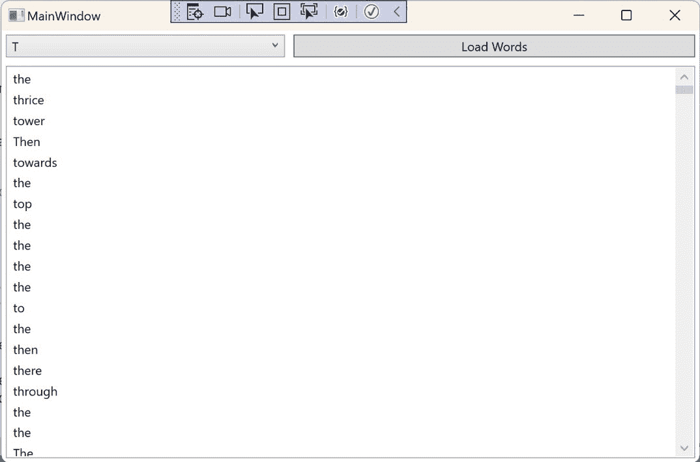
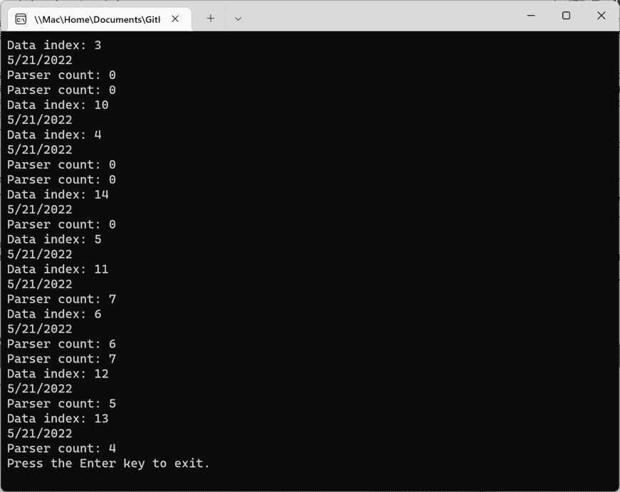
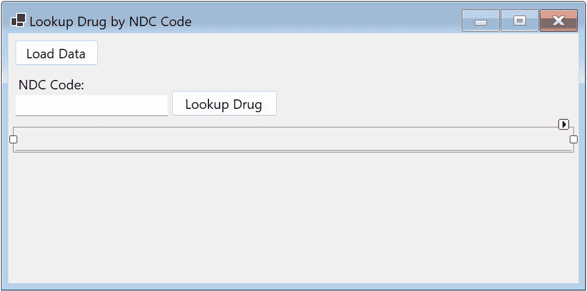
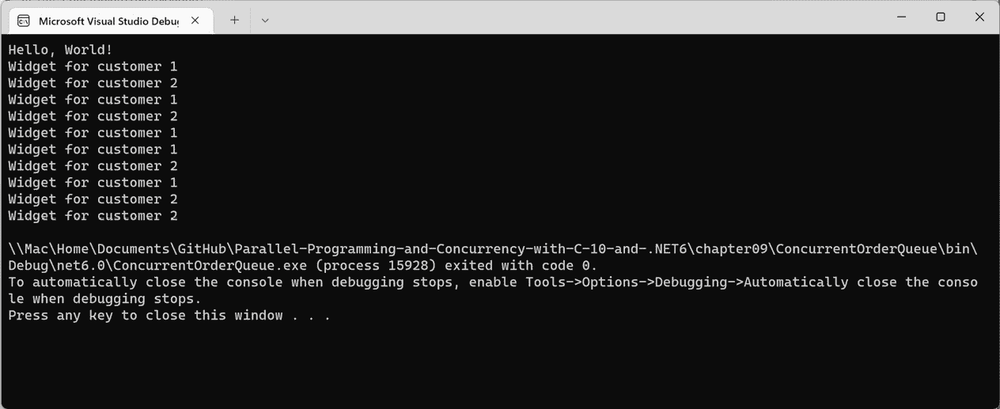
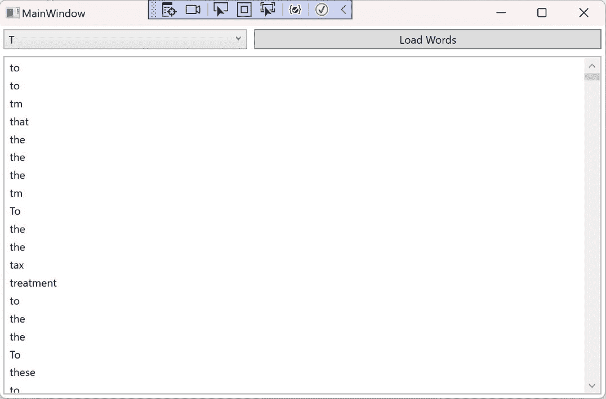

# 第九章：*第九章*：在 .NET 中使用并发集合

本章将深入探讨 `System.Collections.Concurrent` 命名空间中的一些内容。这些专用集合有助于在使用并发和并行性时保持数据完整性。本章的每一节都将提供使用 .NET 提供的特定并发集合的实用示例。

我们已经看到了 .NET 中并行数据结构的一些基本用法。我们已经在 *第二章* 的 *并发简介* 部分介绍了每个并发集合的基础。因此，我们将快速进入本章中它们用法的示例，并进一步了解它们的应用和内部工作原理。

在本章中，我们将进行以下操作：

+   使用 `BlockingCollection`

+   使用 `ConcurrentBag`

+   使用 `ConcurrentDictionary`

+   使用 `ConcurrentQueue`

+   使用 `ConcurrentStack`

到本章结束时，您将更深入地了解这些集合如何保护您的共享数据在多线程中不被错误处理。

# 技术要求

要跟随本章中的示例，以下软件是推荐给 Windows 开发者的：

+   Visual Studio 2022 版本 17.0 或更高版本。

+   .NET 6。

+   要完成任何 WinForms 或 WPF 示例，您需要安装 Visual Studio 的 .NET 桌面开发工作负载。这些项目只能在 Windows 上运行。

虽然这些是推荐的，但如果您已安装 .NET 6，您可以使用您喜欢的编辑器。例如，macOS 10.13 或更高版本的 Visual Studio 2022 for Mac、JetBrains Rider 或 Visual Studio Code 都可以同样工作。

本章的所有代码示例都可以在 GitHub 上找到：[`github.com/PacktPublishing/Parallel-Programming-and-Concurrency-with-C-sharp-10-and-.NET-6/tree/main/chapter09`](https://github.com/PacktPublishing/Parallel-Programming-and-Concurrency-with-C-sharp-10-and-.NET-6/tree/main/chapter09)。

让我们从学习更多关于 `BlockingCollection<T>` 的知识开始，并浏览一个利用该集合的示例项目。

# 使用 BlockingCollection

`BlockingCollection<T>` 是最实用的并发集合之一。正如我们在 *第七章* 中所看到的，`BlockingCollection<T>` 是为了实现 .NET 的 **生产者/消费者模式** 而创建的。在创建不同类型的示例项目之前，让我们回顾一下这个集合的一些具体细节。

## BlockingCollection 详细信息

对于使用并行代码实现的开发者来说，`BlockingCollection<T>` 的一个主要吸引力是它可以替换 `List<T>` 而不需要太多额外的修改。您可以使用 `Add()` 方法为两者。与 `BlockingCollection<T>` 的区别在于，如果另一个读取或写入操作正在进行中，调用 `Add()` 添加项目将阻塞当前线程。如果您想指定操作的超时时间，可以使用 `TryAdd()`。`TryAdd()` 方法可选地支持超时和取消令牌。

从 `BlockingCollection<T>` 中使用 `Take()` 方法移除项目有一个等效的 `TryTake()` 方法，它允许定时操作和取消。`Take()` 和 `TryTake()` 方法将获取并移除添加到集合中的第一个剩余项目。这是因为 `BlockingCollection<T>` 内部的默认底层集合类型是 `ConcurrentQueue<T>`。或者，您可以指定集合使用 `ConcurrentStack<T>`、`ConcurrentBag<T>` 或任何实现 `IProducerConsumerCollection<T>` 接口的集合。以下是一个将 `BlockingCollection<T>` 初始化为使用 `ConcurrentStack<T>` 的示例，其容量限制为 `100` 项：

```cs
var itemCollection = new BlockingCollection<string>(new 
```

```cs
    ConcurrentStack<string>(), 100);
```

如果您的应用程序需要遍历 `BlockingCollection<T>` 中的项目，可以在 `for` 或 `foreach` 循环中使用 `GetConsumingEnumerable()` 方法。然而，请注意，对集合的这种迭代也会移除项目，并且如果枚举继续到集合为空，它将完成集合。这是 `GetConsumingEnumerable()` 方法名称中的 *消费* 部分。

如果您需要使用多个相同类型的 `BlockingCollection<T>` 类，您可以通过将它们添加到一个数组中来将它们作为一个整体添加或移除。`BlockingCollection<T>` 的数组使 `TryAddToAny()` 和 `TryTakeFromAny()` 方法可用。如果数组中的任何集合都处于适当的状态以接受或提供对象给调用代码，则这些方法将成功。Microsoft Docs 有一个如何在一个管道中使用 `BlockingCollection<T>` 数组的示例：https://docs.microsoft.com/dotnet/standard/collections/thread-safe/how-to-use-arrays-of-blockingcollections。

现在我们已经涵盖了理解 `BlockingCollection<T>` 所需的详细信息，让我们深入一个示例项目。

## 使用 BlockingCollection 与 Parallel.ForEach 和 PLINQ

我们已经在 *第七章* 中介绍了一个实现生产者/消费者模式的示例，所以在这个部分让我们尝试一些不同的内容。我们将创建一个 WPF 应用程序，从 1.5 MB 的文本文件中加载书籍内容，并搜索以特定字母开头的单词：

注意

此示例使用从最初基于 .NET Framework 4.0 构建的 Microsoft 扩展示例创建的 .NET Standard NuGet 包。该扩展名为 `ParallelExtensionsExtras`，原始源代码可在 GitHub 上找到：https://github.com/dotnet/samples/tree/main/csharp/parallel/ParallelExtensionsExtras。我们将从包中使用的扩展方法可以使 `Parallel.ForEach` 操作和 PLINQ 查询在并发集合上运行得更高效。要了解更多关于扩展的信息，你可以查看 *.NET 并行编程* 博客上的这篇文章：https://devblogs.microsoft.com/pfxteam/parallelextensionsextras-tour-4-blockingcollectionextensions/。

1.  首先，在 Visual Studio 中创建一个新的 WPF 应用程序。将项目命名为 `ParallelExtras.BlockingCollection`。

1.  在 NuGet 包管理器页面，搜索并添加 **ParallelExtensionsExtras.NetFxStandard** 包的最新稳定版本到你的项目中：


图 9.1 – ParallelExtensionsExtras.NetFxStandard NuGet 包

1.  我们将读取詹姆斯·乔伊斯所著的书籍《尤利西斯》中的文本。这本书在美国以及世界上的大多数国家都是公共领域的。你可以以 UTF-8 纯文本格式从 `ulysses.txt` 下载它，并将其放置在与你的其他项目文件相同的文件夹中。

1.  在 Visual Studio 中，右键单击 `ulysses.txt` 并选择 **属性**。在 **属性** 窗口中，将 **复制到输出目录** 属性更新为 **如果较新则复制**。

1.  打开 `Grid.RowDefinitions` 和 `Grid.Columndefinitions` 到 `Grid` 控制器，如下所示：

    ```cs
    <Grid.RowDefinitions>
        <RowDefinition Height="Auto"/>
        <RowDefinition Height="*"/>
    </Grid.RowDefinitions>
    <Grid.ColumnDefinitions>
        <ColumnDefinition/>
        <ColumnDefinition/>
    </Grid.ColumnDefinitions>
    ```

1.  在 `Grid.ColumnDefinitions` 元素之后的 `Grid` 定义内添加 `ComboBox` 和 `Button`。这些控件将位于 `Grid` 的第一行：

    ```cs
    <ComboBox x:Name="LettersComboBox"
                Grid.Row="0" Grid.Column="0"
                Margin="4">
        <ComboBoxItem Content="A"/>
        <ComboBoxItem Content="D"/>
        <ComboBoxItem Content="F"/>
        <ComboBoxItem Content="G"/>
        <ComboBoxItem Content="M"/>
        <ComboBoxItem Content="O"/>
        <ComboBoxItem Content="A"/>
        <ComboBoxItem Content="T"/>
        <ComboBoxItem Content="W"/>
    </ComboBox>
    <Button Grid.Row="0" Grid.Column="1"
            Margin="4" Content="Load Words"
            Click="Button_Click"/>
    ```

`ComboBox` 将包含九个不同的字母，你可以从中选择。你可以添加你喜欢的这些字母中的任意多个。`Button` 包含一个 `Click` 事件处理程序，我们将在稍后的 `MainWindow.xaml.cs` 中添加它。

1.  最后，将名为 `WordsListView` 的 `ListView` 添加到 `Grid` 的第二行。它将跨越两个列：

    ```cs
    <ListView x:Name="WordsListView" Margin="4"
                Grid.Row="1" Grid.ColumnSpan="2"/>
    ```

1.  现在，打开 `MainWIndow.xaml.cs`。在这里，我们首先将创建一个名为 `LoadBookLinesFromFile()` 的方法，该方法将从 `ulysses.txt` 读取每一行文本到 `BlockingCollection<string>` 中。由于只有一个线程从文件中读取，因此使用 `Add()` 方法而不是 `TryAdd()` 是最好的选择：

    ```cs
    private async Task<BlockingCollection<string>> 
        LoadBookLinesFromFile()
    {
        var lines = new BlockingCollection<string>();
        using var reader = File.OpenText(Path.Combine(
            Path.GetDirectoryName(Assembly
                .GetExecutingAssembly().Location), 
                    "ulysses.txt"));
        string line;
        while ((line = await reader.ReadLineAsync()) != 
            null)
        {
            lines.Add(line);
        }
        lines.CompleteAdding();
        return lines;
    }
    ```

注意

记住，在方法结束前调用 `lines.CompleteAdding()` 非常重要。否则，后续对这个集合的查询将会挂起，并继续等待更多项目被添加到流中。

1.  现在，创建一个名为 `GetWords()` 的方法，该方法接受文本文件的行并使用 `BlockingCollection<string>`。在此方法中，我们使用 `Parallel.ForEach` 循环同时解析多行。`GetConsumingPartitioner()` 扩展方法告诉 `Parallel.ForEach` 循环 `BlockingCollection` 将执行自己的阻塞，因此循环不需要执行任何操作。这使得整个过程更加高效：

    ```cs
    private BlockingCollection<string> 
        GetWords(BlockingCollection<string> lines)
    {
        var words = new BlockingCollection<string>();
        Parallel.ForEach(lines.GetConsumingPartitioner(), 
            (line) =>
        {
            var matches = Regex.Matches(line, 
                @"\b[\w']*\b");
            foreach (var m in matches.Cast<Match>())
            {
                if (!string.IsNullOrEmpty(m.Value))
                {
                    words.TryAdd(TrimSuffix(m.Value, 
                        '\''));
                }
            }
        });
        words.CompleteAdding();
        return words;
    }
    private string TrimSuffix(string word, char 
        charToTrim)
    {
        int charLocation = word.IndexOf(charToTrim);
        if (charLocation != -1)
        {
            word = word[..charLocation];
        }
        return word;
    }
    ```

`TrimSuffix()` 方法将从单词的末尾删除特定字符；在这种情况下，我们传递要删除的撇号字符。

注意

如果你对正则表达式不熟悉，可以在 Microsoft Docs 上阅读有关如何在 .NET 中使用它们的说明：[`docs.microsoft.com/dotnet/standard/base-types/regular-expressions`](https://docs.microsoft.com/dotnet/standard/base-types/regular-expressions)。它们是解析文本的极其高效的方法。

1.  接下来，创建一个名为 `GetWordsByLetter()` 的方法来调用我们刚刚创建的其他方法。一旦获取到包含书中所有单词的 `BlockingCollection<string>`，此方法将使用 PLINQ 和 `GetConsumingPartitioner()` 来查找所有以所选字母的大写或小写版本开头的单词：

    ```cs
    private async Task<List<string>> GetWordsByLetter(char 
        letter)
    {
        BlockingCollection<string> lines = await 
            LoadBookLinesFromFile();
        BlockingCollection<string> words = 
            GetWords(lines);
        // 275,506 words in total
        return words.GetConsumingPartitioner()
            .AsParallel()
            .Where(w => w.StartsWith(letter) || 
                w.StartsWith(char.ToLower(letter)))
            .ToList();
    }
    ```

1.  最后，我们将添加 `Button_Click` 事件来启动加载、解析和查询书籍文本。不要忘记将事件处理程序标记为 `async`：

    ```cs
    private async void Button_Click(object sender, 
        RoutedEventArgs e)
    {
        if (LettersComboBox.SelectedIndex < 0)
        {
            MessageBox.Show("Please select a letter.");
            return;
        }
        WordsListView.ItemsSource = await 
            GetWordsByLetter(
            char.Parse(GetComboBoxValue(LettersComboBox
                .SelectedValue)));
    }
    private string GetComboBoxValue(object item)
    {
        var comboxItem = item as ComboBoxItem;
        return comboxItem.Content.ToString();
    }
    ```

`GetComboBoxValue()` 辅助方法将获取 `LettersComboBox.SelectedValue` 中的对象，并找到包含所选字母的 `string`。

1.  在 `MainWindow.xaml.cs` 中需要以下 `using` 声明才能编译和运行项目：

    ```cs
    using System.Collections.Concurrent;
    using System.Collections.Generic;
    using System.IO;
    using System.Linq;
    using System.Reflection;
    using System.Text.RegularExpressions;
    using System.Threading.Tasks;
    using System.Windows;
    using System.Windows.Controls;
    ```

1.  现在，运行项目，选择一个字母，然后点击 **加载单词**：



图 9.2 – 从 ulysses.txt 显示以 T 开头的单词

考虑到书中包含超过 275,000 个总单词，整个过程运行得非常快。尝试向 PLINQ 查询添加一些排序，看看性能如何受到影响。

让我们继续学习 `ConcurrentBag<T>`。

# 使用 ConcurrentBag

`ConcurrentBag<T>` 是一个无序的对象集合，可以安全地并发添加、查看或删除。请注意，与所有并发集合一样，`ConcurrentBag<T>` 提供的方法是线程安全的，但任何扩展方法都不保证是安全的。始终在利用它们时实现自己的同步。要查看安全方法的列表，您可以查看此 Microsoft Docs 页面：https://docs.microsoft.com/dotnet/api/system.collections.concurrent.concurrentbag-1#methods。

我们将创建一个示例应用程序，模拟与对象池一起工作。如果你有一些利用内存密集型状态对象的处理，这种场景可能很有用。你希望最小化创建的对象数量，但不能在之前的迭代完成并返回到池中之前重用它们。

在我们的例子中，我们将使用一个假设为内存密集型的模拟 PDF 处理类。实际上，文档处理库可能相当庞大，并且它们通常依赖于每个实例中的文档状态。控制台应用程序将并行迭代 15 次来创建这些假 PDF 对象，并将一些文本附加到每个对象上。每次通过循环时，我们将输出文本内容和池中 PDF 处理器的当前计数。如果当前计数保持较低，则应用程序按预期工作：

1.  首先在 Visual Studio 中创建一个新的.NET 控制台应用程序，命名为`ConcurrentBag.PdfProcessor`。

1.  添加一个新的类来表示模拟的 PDF 数据。将这个类命名为`ImposterPdfData`：

    ```cs
    public class ImposterPdfData
    {
        private string _plainText;
        private byte[] _data;
        public ImposterPdfData(string plainText)
        {
            _plainText = plainText;
            _data = System.Text.Encoding.ASCII.GetBytes
                (plainText);
        }
        public string PlainText => _plainText;
        public byte[] PdfData => _data;
    }
    ```

我们正在存储纯文本及其 ASCII 编码版本，我们假装它是 PDF 格式。这避免了在我们的示例应用程序中实现任何第三方库。如果你熟悉任何 PDF 库，你欢迎将此示例修改为使用它们。

1.  接下来，添加一个名为`PdfParser`的新类。这个类将是从`ConcurrentBag<PdfParser>`中取出并返回的类。我们将在接下来的步骤中创建该集合的宿主：

    ```cs
    public class PdfParser
    {
        private ImposterPdfData? _pdf;
        public void SetPdf(ImposterPdfData pdf) => 
            _pdf = pdf;
        public ImposterPdfData? GetPdf() => _pdf;
        public string GetPdfAsString()
        {
            if (_pdf != null)
                return _pdf.PlainText;
            else
                return "";
        }
        public byte[] GetPdfBytes()
        {
            if (_pdf != null)
                return _pdf.PdfData;
            else
                return new byte[0];
        }
    }
    ```

此状态类持有`ImposterPdfData`对象的一个实例，并且可以返回数据作为一个字符串或 ASCII 编码的字节数组。

1.  向`PdfParser`添加一个名为`AppendString`的方法。此方法将在`ImposterPdfData`的新行上添加一些附加文本：

    ```cs
    public void AppendString(string data)
    {
        string newData;
        if (_pdf == null)
        {
            newData = data;
        }
        else
        {
            newData = _pdf.PlainText + Environment.NewLine 
                + data;
        }
        _pdf = new ImposterPdfData(newData);
    }
    ```

1.  现在，添加一个名为`PdfWorkerPool`的类：

    ```cs
    public class PdfWorkerPool
    {
        private ConcurrentBag<PdfParser> _workerPool = 
            new();
        public PdfWorkerPool()
        {
            // Add initial worker
            _workerPool.Add(new PdfParser());
        }
        public PdfParser Get() => _workerPool.TryTake(out 
            var parser) ? parser : new PdfParser();
        public void Return(PdfParser parser) => 
            _workerPool.Add(parser);
        public int WorkerCount => _workerPool.Count();
    }
    ```

确保还将`using System.Collections.Concurrent;`语句添加到`PdfWorkerPool.cs`中。池存储名为`_workerPool`的`ConcurrentBag<PdfParser>`。当`PdfWorkerPool`初始化时，它将向`_workerPool`添加一个新的实例。`Get`方法将返回池中的一个现有实例，如果存在的话，使用`TryTake`。如果池为空，则创建一个新的实例并返回给调用者。`Return`方法在消费者完成时将`PdfParser`添加回池中。我们将使用`WorkerCount`属性来跟踪任何时间点池中的对象数量。

1.  最后，用以下代码替换`Program.cs`的内容：

    ```cs
    using ConcurrentBag.PdfProcessor;
    Console.WriteLine("Hello, ConcurrentBag!");
    var pool = new PdfWorkerPool();
    Parallel.For(0, 15, async (i) =>
    {
        var parser = pool.Get();
        var data = new ImposterPdfData($"Data index: {i}");
        try
        {
            parser.SetPdf(data);
            parser.AppendString(DateTime.UtcNow
                .ToShortDateString());
            Console.WriteLine($"
               {parser.GetPdfAsString()}");
            Console.WriteLine($"Parser count: 
                {pool.WorkerCount}");
            await Task.Delay(100);
        }
        finally
        {
            pool.Return(parser);
            await Task.Delay(250);
        }
    });
    Console.WriteLine("Press the Enter key to exit.");
    Console.ReadLine();
    ```

创建一个新的`PdfWorkerPool`后，我们使用`Parallel.For`循环迭代 15 次。每次通过循环时，我们获取`PdfParser`，设置文本，附加`DateTime.UtcNow`，并将内容写入控制台，同时附带池中解析器的当前计数。

1.  运行应用程序并检查输出：



图 9.3 – 运行 PdfProcessor 控制台应用程序

在我的情况下，解析计数达到了七个的最大值。如果你调整 `Task.Delay` 间隔或完全删除它们，你可能会看到计数永远不会超过一个。这种池可以配置得非常高效。

在这个应用程序中，我们不在乎集合的哪个实例被返回，所以 `ConcurrentBag<T>` 是一个完美的选择。在下一节中，我们将创建一个使用 `ConcurrentDictionary<TKey, TValue>` 的药物查找示例。

# 使用 ConcurrentDictionary

在本节中，我们将创建一个 WinForms 应用程序来加载美国的 `ConcurrentDictionary`，我们可以使用 `product.txt` 文件进行快速查找，并将大约一半的记录移动到 `product2.txt` 文件中，在第二个文件中重复标题行。您可以在 GitHub 仓库中找到这些文件，网址为 [`github.com/PacktPublishing/Parallel-Programming-and-Concurrency-with-C-sharp-10-and-.NET-6/tree/main/chapter09/FdaNdcDrugLookup`](https://github.com/PacktPublishing/Parallel-Programming-and-Concurrency-with-C-sharp-10-and-.NET-6/tree/main/chapter09/FdaNdcDrugLookup)：

1.  首先，在 Visual Studio 中创建一个新的 WinForms 项目，目标为 .NET 6。将项目命名为 `FdaNdcDrugLookup`。

1.  打开 `Form1.cs` 的 WinForm 设计器。布局两个 `TextBox` 控件、两个 `Button` 控件和 `Label`：



图 9.4 – Form1.cs 的布局

`btnLoad` 和 `txtNdc`。`btnLookup`、`txtDrugName` 和 **只读** – **True**。

1.  接下来，通过在 **解决方案资源管理器** 中右键单击项目并选择 **添加** | **现有项**，将 `product.txt` 和 `product2.txt` 文件添加到您的项目中。

1.  在 **属性** 面板中，将两个我们刚刚添加的文本文件的 **复制到输出目录** 更改为 **如果较新则复制**。

1.  向项目中添加一个名为 `Drug` 的新类，并添加以下实现：

    ```cs
    public class Drug
    {
        public string? Id { get; set; }
        public string? Ndc { get; set; }
        public string? TypeName { get; set; }
        public string? ProprietaryName { get; set; }
        public string? NonProprietaryName { get; set; }
        public string? DosageForm { get; set; }
        public string? Route { get; set; }
        public string? SubstanceName { get; set; }
    }
    ```

这将包含从 NDC 药物文件加载的每个记录的数据。

1.  接下来，向项目中添加一个名为 `DrugService` 的类，并从以下实现开始。首先，我们只有 `private` `ConcurrentDictionary<string, Drug>`。我们将在下一步添加一个方法来加载数据：

    ```cs
    using System.Collections.Concurrent;
    using System.Data;
    using System.Reflection;
    namespace FdaNdcDrugLookup
    {
        public class DrugService
        {
            private ConcurrentDictionary<string, Drug> 
                _drugData = new();
        }
    }
    ```

1.  接下来，向 `DrugService` 添加一个名为 `LoadData` 的公共方法：

    ```cs
    public void LoadData(string fileName)
    {
        using DataTable dt = new();
        using StreamReader sr = new(Path.Combine(
            Path.GetDirectoryName(Assembly
                .GetExecutingAssembly().Location), 
                   fileName));
        var del = new char[] { '\t' };
        string[] colheaders = sr.ReadLine().Split(del);
        foreach (string header in colheaders)
        {
            dt.Columns.Add(header); // add headers
        }
        while (sr.Peek() > 0)
        {
            DataRow dr = dt.NewRow(); // add rows
            dr.ItemArray = sr.ReadLine().Split(del);
            dt.Rows.Add(dr);
        }
        foreach (DataRow row in dt.Rows)
        {
            Drug drug = new(); // map to Drug object
            foreach (DataColumn column in dt.Columns)
            {
                switch (column.ColumnName)
                {
                    case "PRODUCTID":
                        drug.Id = row[column].ToString();
                        break;
                    case "PRODUCTNDC":
                        drug.Ndc = row[column].ToString();
                        break;
    ...
    // REMAINING CASE STATEMENTS IN GITHUB
                }
            }
            _drugData.TryAdd(drug.Ndc, drug);
        }
    }
    ```

注意

```cs
https://github.com/PacktPublishing/Parallel-Programming-and-Concurrency-with-C-sharp-10-and-.NET-6/tree/main/chapter09/FdaNdcDrugLookup.
```

在此方法中，我们从提供的 `fileName` 加载数据到 `StreamReader`，将列标题添加到 `DataTable`，从文件中填充其行，然后遍历 `DataTable` 的行和列来创建 `Drug` 对象。每个 `Drug` 对象都通过调用 `TryAdd` 添加到 `ConcurrentDictionary` 中，使用 `Ndc` 属性作为键。

1.  现在，向 `DrugService` 添加一个 `GetDrugByNdc` 方法以完成类。此方法将返回提供的 `ndcCode` 对应的 `Drug`，如果找到的话：

    ```cs
    public Drug GetDrugByNdc(string ndcCode)
    {
        bool result = _drugData.TryGetValue(ndcCode, out 
            var drug);
        if (result && drug != null)
            return drug;
        else
            return new Drug();
    }
    ```

1.  打开 `Form1.cs` 的代码，为 `DrugService` 添加一个私有变量：

    ```cs
    private DrugService _drugService = new();
    ```

1.  打开 `Form1.cs` 的设计器，双击 `btnLoad_Click` 事件处理程序。添加以下实现。请注意，我们创建了一个 `async` 事件处理程序，以便我们可以使用 `await` 关键字：

    ```cs
    private async void btnLoad_Click(object sender, 
        EventArgs e)
    {
        var t1 = Task.Run(() => _drugService.LoadData
            ("product.txt"));
        var t2 = Task.Run(() => _drugService.LoadData
            ("product2.txt"));
        await Task.WhenAll(t1, t2);
        btnLookup.Enabled = true;
        btnLoad.Enabled = false;
    }
    ```

为了加载两个文本文件，我们在使用 `Task.WhenAll` 等待它们之前创建了两个并行运行的任务。然后，我们可以安全地启用 `btnLookup` 按钮并禁用 `btnLoad` 按钮以防止第二次加载。

1.  接下来，切换回 `Form1.cs` 的设计视图，双击 `btnLookup_Click` 事件处理程序。向该处理程序添加以下实现以根据在 UI 中输入的 NDC 代码查找药物名称：

    ```cs
    private void btnLookup_Click(object sender, 
        EventArgs e)
    {
        if (!string.IsNullOrWhiteSpace(txtNdc.Text))
        {
            var drug = _drugService.GetDrugByNdc
               (txtNdc.Text);
            txtDrugName.Text = drug.ProprietaryName;
        }
    }
    ```

1.  现在，运行应用程序并点击 `70518-1120` NDC 代码。点击 **查找药物**：


图 9.5 – 通过 NDC 代码查找药物 Prednisone

1.  尝试一些其他的 NDC 代码，看看每条记录加载得有多快。这里有一些从每个文件中随机选取的 NDC 代码。如果它们都成功，你就知道两个文件已经并行成功加载：**0002-0800**，**0002-4112**，**43063-825**，和 **51662-1544**。

就这些！你现在有了自己的快速且简单的药物查找应用程序。尝试将药物名称 `TextBox` 替换为 `DataGrid` 来显示整个 `Drug` 记录。

在下一节中，我们将处理 `ConcurrentQueue<T>` 中的客户订单。

# 使用 ConcurrentQueue

在本节中，我们将创建一个示例项目，这是一个现实场景的简化版本。我们将使用 `ConcurrentQueue<T>` 创建一个订单排队系统。这个应用程序将是一个控制台应用程序，并行为两位客户排队订单。我们将为每位客户创建五个订单，并且为了混合队列的顺序，每位客户的排队过程将在调用 `Enqueue` 之间使用不同的 `Task.Delay`。最终的输出应显示为第一位客户和第二位客户退出的订单混合。请记住，`ConcurrentQueue<T>` 采用 **先进先出** (**FIFO**) 逻辑：

1.  让我们从打开 Visual Studio 并创建一个名为 `ConcurrentOrderQueue` 的 .NET 控制台应用程序开始。

1.  向项目中添加一个名为 `Order` 的新类：

    ```cs
    public class Order
    {
        public int Id { get; set; }
        public string? ItemName { get; set; }
        public int ItemQty { get; set; }
        public int CustomerId { get; set; }
        public decimal OrderTotal { get; set; }
    }
    ```

1.  现在，创建一个名为 `OrderService` 的新类，其中包含一个名为 `_orderQueue` 的私有 `ConcurrentQueue<Order>`。这个类是我们将在此处为两位客户排队和退队订单的地方：

    ```cs
    using System.Collections.Concurrent;
    namespace ConcurrentOrderQueue
    {
        public class OrderService
        {
            private ConcurrentQueue<Order> _orderQueue = 
                new();
        }
    }
    ```

1.  让我们从实现 `DequeueOrders` 方法开始。在这个方法中，我们将使用一个 `while` 循环来调用 `TryDequeue`，直到集合为空，将每个订单添加到 `List<Order>` 中以返回给调用者：

    ```cs
    public List<Order> DequeueOrders()
    {
        List<Order> orders = new();
        while (_orderQueue.TryDequeue(out var order))
        {
            orders.Add(order);
        }
        return orders;
    }
    ```

1.  现在，我们将创建公共和私有 `EnqueueOrders` 方法。公共的无参数方法将调用私有方法两次，一次为每个 `customerId`。这两个调用将并行进行，然后通过 `Task.WhenAll` 调用来等待它们：

    ```cs
    public async Task EnqueueOrders()
    {
        var t1 = EnqueueOrders(1);
        var t2 = EnqueueOrders(2);
        await Task.WhenAll(t1, t2);
    }
    private async Task EnqueueOrders(int customerId)
    {
        for (int i = 1; i < 6; i++)
        {
            var order = new Order
            {
                Id = i * customerId,
                CustomerId = customerId,
                ItemName = "Widget for customer " + 
                    customerId,
                ItemQty = 20 - (i * customerId)
            };
            order.OrderTotal = order.ItemQty * 5;
            _orderQueue.Enqueue(order);
            await Task.Delay(100 * customerId);
        }
    }
    ```

私有方法`EnqueueOrders`迭代五次，为给定的`customerId`创建和`Enqueue`订单。这也用于改变`ItemName`、`ItemQty`和`Task.Delay`的持续时间。

1.  最后，打开`Program.cs`并添加以下代码以入队和出队订单，并将结果列表输出到控制台：

    ```cs
    using ConcurrentOrderQueue;
    Console.WriteLine("Hello, World!");
    var service = new OrderService();
    await service.EnqueueOrders();
    var orders = service.DequeueOrders();
    foreach(var order in orders)
    {
        Console.WriteLine(order.ItemName);
    }
    ```

1.  运行程序并查看输出中的订单列表。你的结果是如何的？



图 9.6 – 查看订单队列的输出

尝试改变延迟因子或更改`EnqueueOrders`方法中的`customerId`，以查看输出顺序如何变化。

接下来，在本章的最后部分，我们将对`ConcurrentStack<T>`集合进行快速实验。

# 使用 ConcurrentStack

在本节中，我们将对`BlockingCollection<T>`和`ConcurrentStack<T>`进行实验。在本章的第一个例子中，我们使用了`BlockingCollection<T>`来读取从书《尤利西斯》中开始的特定字母的单词。我们将复制该项目并更改读取文本行代码，使其在`BlockingCollection<T>`内部使用`ConcurrentStack<T>`。这将使行以相反的顺序输出，因为栈使用**后进先出**（**LIFO**）逻辑。让我们开始吧！

1.  从本章复制**ParallelExtras.BlockingCollection**项目，或者如果你更喜欢，修改现有的项目。

1.  打开`MainWindow.xaml.cs`并修改`LoadBookLinesFromFile`方法，将其传递给`BlockingCollection<string>`构造函数的新`ConcurrentStack<string>`：

    ```cs
    private async Task<BlockingCollection<string>> 
        LoadBookLinesFromFile()
    {
        var lines = new BlockingCollection<string>(new 
            ConcurrentStack<string>());
        ...
        return lines;
    }
    ```

注意，前面的方法被截断以强调修改后的代码。在 GitHub 上查看完整方法：[`github.com/PacktPublishing/Parallel-Programming-and-Concurrency-with-C-sharp-10-and-.NET-6/tree/main/chapter09/ParallelExtras.ConcurrentStack`](https://github.com/PacktPublishing/Parallel-Programming-and-Concurrency-with-C-sharp-10-and-.NET-6/tree/main/chapter09/ParallelExtras.ConcurrentStack)。

1.  现在，当你运行应用程序并搜索与之前相同的字母（在我们的例子中是`T`）时，你将在列表的开头看到一组不同的单词：



图 9.7 – 在《尤利西斯》中搜索以 T 开头的单词

如果你滚动到列表的底部，你应该能看到从本书开头开始的单词。注意，列表并没有完全反转，因为我们没有在解析每一行的单词时使用`ConcurrentStack<string>`。你可以自己尝试这个实验作为另一个实验。

这就结束了我们对.NET 并发集合的探索。让我们总结一下本章学到的内容。

# 摘要

在本章中，我们深入探讨了 `System.Collections.Concurrent` 命名空间中的五个集合。我们在本章创建了五个示例应用程序，以获得对 .NET 6 中可用的每个并发集合类型的实际操作经验。通过 WPF、WinForms 和 .NET 控制台应用程序项目的混合，我们研究了在您自己的应用程序中利用这些集合的一些实际方法。

在下一章中，我们将探讨 Visual Studio 为多线程开发和调试提供的丰富工具集。我们还将讨论一些分析和改进并行 .NET 代码性能的技术。

# 问题

1.  哪个并发集合可以在底层实现不同类型的集合？

1.  问题 1 中的集合默认实现了哪种内部集合类型？

1.  哪种集合类型经常被用作生产者/消费者模式的实现？

1.  哪个并发集合包含键/值对？

1.  用于向 `ConcurrentQueue<T>` 添加值的哪种方法？

1.  用于在 `ConcurrentDictionary` 中添加和获取项的哪种方法？

1.  扩展方法与并发集合一起使用时是否线程安全？
