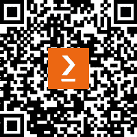

# 前言

构建一个优秀的**应用程序程序接口**（**API**）对于创建显示来自数据源（通常是数据库）数据的实际应用至关重要。正如你在本书中看到的，API 的工作是在大规模上分离关注点；具体来说，是将前端和后端的关注点分离。这允许你更改一个（例如，更换新的数据库）而不会破坏另一个（例如，网站）或反之亦然。

一个典型的企业可能有多个团队在同一个整体产品上工作。例如，你可能有一个团队在数据的前端展示上工作，另一个在 iOS 版本上工作，第三个在 Android 上工作。

在后端，你可能会有多个数据源。在本书中我们使用的简单示例中，我们考察了一个汽车经销商。它可能来自销售，也可能来自库存，来自提供平均价格信息的服务，等等。其中一些是静态数据，可以轻松存储在数据库中，一些必须存储在频繁更新的缓存中，一些必须按需获取。

协调前端与后端是困难的，如果后端的格式或计算发生变化，可能会出现灾难性的故障。此外，展示层的需求几乎肯定会随着时间的推移而变化。最后，前端通常不是放置业务逻辑的理想位置。

APIs 解决了这些问题。前端与定义良好的端点进行通信，后端以定义良好的数据响应。后端如何获取和处理这些数据对前端来说是不可见的。就这一点而言，前端对数据的用途对后端来说也是不可见的。最重要的是，API 本身不需要了解任何一方；它只知道需要什么以及如何获取。

# 本书面向对象

本书面向至少具备 C#基本知识的程序员，旨在帮助他们创建世界级的 API，通常用于企业级应用。虽然本书不假设读者有 API 方面的经验，但具备 SQL 的基本了解将有所帮助。

# 本书涵盖内容

*第一章* ，*入门指南*，提供了快速入门指南，以在本地设置开发环境。

*第二章* ，*我们将构建什么*，概述了 API 的一般概念，以及如何使用它来解耦前端和后端系统。

*第三章* ，*使用 REST 实现*，概述了行业通用的 API 开发最佳实践和有见地的设计。

*第四章* ，*使用 Swagger 进行文档化*，展示了如何启用并展示基于 Swagger 的文档。

*第五章* ，*数据验证* ，概述了如何验证 API 调用，包括使用广泛使用的库进行自定义验证。

*第六章* ，*Azure Functions* ，提供了一个以云为先的托管框架，不仅可以用作 API，还可以作为更多应用的起点。它还介绍了最佳实践，并在此基础上构建，以允许在无需重新部署的情况下进行运行时配置。

*第七章* ，*Azure Durable Functions* ，概述了在遵循几个小设计规则的情况下，在具有状态和可扩展性的系统中实现简化的结果。

*第八章* ，*高级主题* ，提供了一个简单、经济高效的云日志实现。此外，它还介绍了高级场景，如复杂对象映射、有观点的云为先设计工具以及存储表的创建和使用。

*第九章* ，*身份验证和授权* ，为云为先的身份验证场景提供了一个即插即用的解决方案，包括授权 Azure 和非 Azure 客户端。

*第十章* ，*部署到 Azure* ，让您快速设置以迭代**持续交付和持续集成**（**CI/CD**）管道。

*第十一章* ，*接下来是什么？* ，为您提供了关于经典问题的实用建议：现在怎么办？

# 要充分利用本书

您至少需要了解 C#的基础知识。了解 SQL 有帮助，但不是必需的。使用 Git 和通用仓库将使您的生活更加轻松。我们假设没有其他技术专长。

| **本书涵盖的软件/硬件（除上述内容外无需额外知识）** | **操作系统/其他要求** |
| --- | --- |
| PC | Windows |
| 中级 C# | Windows |
| Swagger | Windows |
| 基础 DevOps | Azure |
| AutoMapper | Windows |
| SQL Server 或等效产品 | Windows |
| Git | GitHub |

*所有必要的设置都会在我们进行时进行解释。*

**如果您正在使用这本书的数字版，我们建议您亲自输入代码或从书的 GitHub 仓库（下一节中有一个链接）获取代码。这样做可以帮助您避免与代码的复制和粘贴相关的任何潜在错误。**

**亲自编写代码已被证明是学习新材料的更有效方法。**

# 下载示例代码文件

您可以从 GitHub 下载本书的示例代码文件：[`github.com/PacktPublishing/Programming-APIs-with-C-Sharp-and-.NET`](https://github.com/PacktPublishing/Programming-APIs-with-C-Sharp-and-.NET) 。如果代码有更新，它将在 GitHub 仓库中更新。

我们还有来自我们丰富的书籍和视频目录的其他代码包，可在[`github.com/PacktPublishing/`](https://github.com/PacktPublishing/)找到。查看它们吧！

# 使用的约定

本书使用了多种文本约定。

**代码** **在** **文本** **中**：表示文本中的代码单词、数据库表名、文件夹名、文件名、文件扩展名、路径名、虚拟 URL 和用户输入。以下是一个示例：“可以在**host.json**文件下的**extensions** **>** **http** **>** **routePrefix**设置中进行更改：”

代码块如下设置：

```cs
{
  "version": "2.0",
  "logging": {
    "applicationInsights": {
      "samplingSettings":{
        "isEnabled": true,
        "excludedTypes": "Request"
      },
      "enableLiveMetricsFilters": true
    }
  },
  "extensions": {
    "http": {
      "routePrefix": "myapi"
    }
  }
}
```

当我们希望将您的注意力引到代码块中的特定部分时，相关的行或项目将以粗体显示：

```cs
CarDtoValidator validator = new CarDtoValidator(); 
var result = validator.Validate(carAsDto); 
if (!result.IsValid) 
{ 
return BadRequest(result.Errors); 
} 
```

任何命令行输入或输出都应如下编写：

```cs
git clone https://github.com/MicrosoftDocs/mslearn-dotnet-cloudnative-devops.git eShopLite
```

**粗体**：表示新术语、重要单词或您在屏幕上看到的单词。例如，菜单或对话框中的单词以**粗体**显示。以下是一个示例：“选择**Azure Function App (Linux**)并点击**下一步**。”

小贴士或重要注意事项

看起来是这样的。

# 联系我们

我们始终欢迎读者的反馈。

**一般反馈**：如果您对本书的任何方面有任何疑问，请通过电子邮件发送至 customercare@packtpub.com，并在邮件主题中提及书名。

**勘误**：尽管我们已经尽一切努力确保内容的准确性，但错误仍然可能发生。如果您在这本书中发现了错误，我们将不胜感激，如果您能向我们报告这一点。请访问[www.packtpub.com/support/errata](http://www.packtpub.com/support/errata)并填写表格。

**盗版**：如果您在互联网上以任何形式发现我们作品的非法副本，如果您能提供位置地址或网站名称，我们将不胜感激。请通过 copyright@packt.com 与我们联系，并提供材料的链接。

**如果您有兴趣成为作者**：如果您在某个主题上具有专业知识，并且您有兴趣撰写或为本书做出贡献，请访问[authors.packtpub.com](http://authors.packtpub.com)。

# 分享您的想法

读完*使用 C#和.NET 编程 API*后，我们很乐意听到您的想法！请[点击此处直接进入此书的亚马逊评论页面](https://packt.link/r/1835468853)并分享您的反馈。

您的评论对我们和科技社区都很重要，并将帮助我们确保我们提供高质量的内容。

# 下载本书的免费 PDF 副本

感谢您购买本书！

您喜欢在路上阅读，但无法携带您的印刷书籍到任何地方？

您的电子书购买是否与您选择的设备不兼容？

别担心，现在，随着每本 Packt 书籍的购买，您都可以免费获得该书的 DRM 免费 PDF 版本。

在任何地方、任何地方、任何设备上阅读。直接从您最喜欢的技术书籍中搜索、复制和粘贴代码到您的应用程序中。

优惠远不止这些，您还可以获得独家折扣、时事通讯和每日免费内容的访问权限

按照以下简单步骤获取优惠：

1.  扫描二维码或访问以下链接



[`packt.link/free-ebook/978-1-83546-885-2`](https://packt.link/free-ebook/978-1-83546-885-2)

1.  提交您的购买证明

1.  就这样！我们将直接将您的免费 PDF 和其他优惠发送到您的电子邮件
