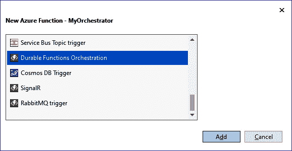
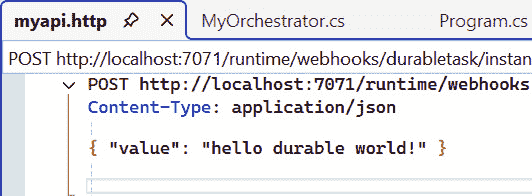
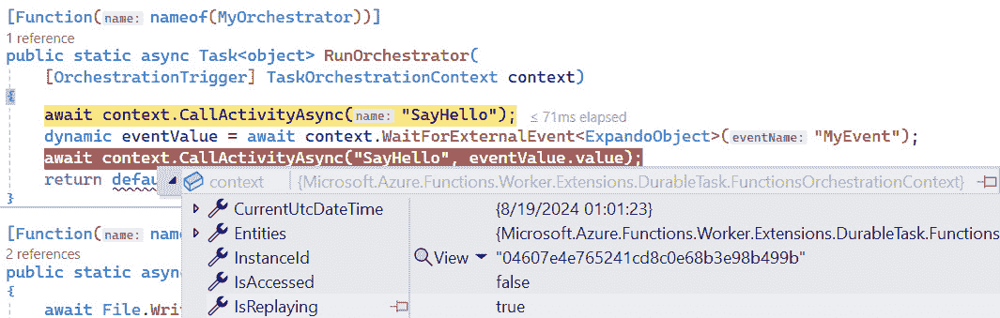
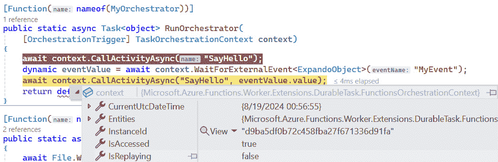
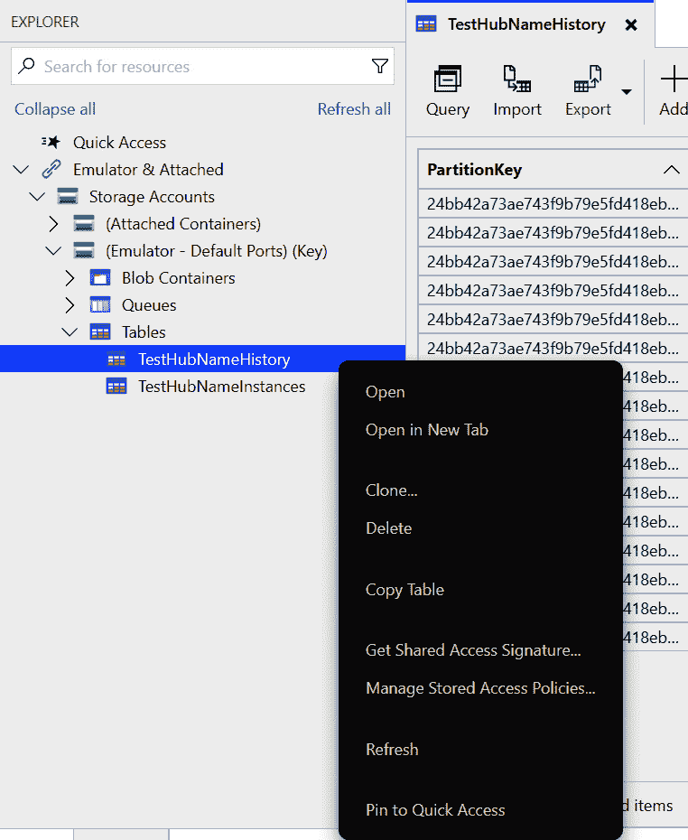

# 第七章：Azure 可持久化函数

在上一章中，我们讨论了 Azure Functions 中的 HTTP API 如何提供一种替代托管模型，以及解决许多与手动托管相关的传统问题。

您是否需要在任意数量的物理进程或节点（扇出）上大规模并行化数亿个任务，然后等待它们全部完成（扇入）？然后您是否需要应用程序等待人类或其他进程审查并采取行动以继续下一步？如果那个人不可用，您需要将审查过程**超时**怎么办？这种情况在代码中很容易表达，我们将在本章中探讨这个场景的一个子集。

在本章中，我们将探讨以下内容：

+   在标准 API 的基础上扩展以创建具有弹性和状态的流程

+   与前几章相比，调试这些工作流的不同之处

+   使用标准 HTTP API 与实时系统交互并注入数据

+   简要讨论如何设置其他常见使用模式

# 技术要求

在 Visual Studio 中构建 Azure 可持久化函数的要求与*第六章*相同。本章的源代码可在[`github.com/PacktPublishing/Programming-APIs-with-C-Sharp-and-.NET/tree/main/Chapter07`](https://github.com/PacktPublishing/Programming-APIs-with-C-Sharp-and-.NET/tree/main/Chapter07)找到。

# 可持久化函数概述

可持久化函数的名称非常贴切，因为它在底层所做的工作：在发生崩溃、断电、依赖问题等情况时将其状态保存到持久存储中。这不仅允许轻松恢复问题，还允许任务的可扩展性和协调。默认情况下，Azure 函数中的持久性是通过标准存储账户提供的。底层使用表、块和队列：

+   表用于管理函数执行历史，包括参数和返回值

+   块存储用于自动存储传递给活动的较大参数

+   队列用于触发活动和编排实例

SQL Server 和 Netherite 是另外两种支持的可持久化存储选项，本书未涉及，但在高级场景中可以使用。

尽管在分布式系统中没有“一键扩展”按钮，但以下两条具体规则简化了大量平台和依赖相关的开销，使您能够专注于代码本身的逻辑：

+   编排函数必须是确定的

+   活动函数必须是幂等的

编排器函数正是其名称所暗示的：它们编排或控制活动的执行顺序，这些活动通常包含应用程序的大部分工作或逻辑。必须遵循编排器的一个主要限制是它们必须是确定性的，这也意味着它们不能直接进行任何形式的 I/O。所有活动、子编排器或其他等待调用必须保持相同的顺序，以便将执行代码返回到下一个 **await** 调用之前的精确状态。你必须注意的其他非确定性 API 分为日期时间、GUID、I/O 和其他异步 API 等类别。一般来说，如果你需要从耐久上下文外部获取数据，请使用活动来检索它。

活动函数始终由编排器调用，不能从其他任何地方直接调用。这些地方通常是应用程序逻辑的大部分发生的地方，与编排器相比，活动函数有一个限制：它们必须是幂等的。没有保证活动实例将恰好运行一次，所以请确保连续多次运行具有相同的结果。

将耐久支持添加到现有函数就像添加一个 NuGet 包一样简单。所有函数、触发器等都可以根据你的应用程序要求在单个项目中互操作和共存。

在耐久函数之前，在仅具有基本操作系统平台支持的手动编写情况下，你必须自己管理状态。这包括处理崩溃、标记任务为完成、出错、进行中等。重启也需要管理，以及像并行扇出这样的高级处理。使用耐久函数简化了所有这些要求。

现在，让我们看看如何启动一个耐久实例，以及这些对象如何在有状态系统中协调任务。

## 编排器

进入耐久系统的“主要入口”是通过一个编排器。这些编排器是在运行函数内部使用 **DurableTaskClient** 启动的，或者通过稍后将在 *编程和调试演练* 部分讨论的 HTTP 管理 API 在函数进程外部启动。我之所以说“入口”，是因为我认为从这种角度思考概念上更容易理解。尽管操作系统进程本身仍然使用经典的 **Task** 或 void **Main(...)** ，但在耐久系统中，数据处理或消息处理通常从带有 **Function** 属性的方法开始，以及带有 **OrchestrationTrigger** 属性的 **DurableTaskClient**。

可序列化的数据对象，通常以 JSON 形式，可以在创建实例时传递给编排器。这些可以是更大的描述性对象、SAS 令牌到 blob 存储、必须反序列化的二进制数据，或者所有这些的组合。虽然你可以使用标准字符串或**JsonNodes**（有时你必须这样做），但我首选的方式是使用通用方法重载并创建序列化类来反映系统传递的数据结构。这确保了随着时间的推移修改对象变得容易，将类型检查委托给编译器。这也避免了开发过程中有时出现的问题：缺少或序列化类不匹配，因为这些不会立即显现，因为没有标准的编译错误或运行时异常。同样适用于活动。

由于编排实例是持久的，并且其状态被写入持久存储，这意味着正在运行的编排实例在等待活动完成时不需要保持在 RAM 中。更进一步，它也不需要在相同的操作系统进程、虚拟机或物理机上恢复运行。这可以导致计算和内存资源的非常高效和高效的分配。在极端情况下，你可以有数百或数千个编排实例等待未来任务的完成，而无需使用计算或内存，只需最小的存储空间。

继续深入，你甚至可以有一个无限循环，在等待任务时也不使用任何计算或内存。这个概念，称为永恒编排器，可以响应外部事件，采取行动，并持久地等待下一个事件。但是有一个小的警告：由于编排实例将它们的历史保存到重建它们的状态，永恒编排器可能会有一个不断增长的历史，这最终会导致性能问题。一个名为**ContinueAsNew**的方法截断了这一历史，从而防止其增长。

对于任何 API 或有状态的流程，你几乎肯定需要处理某些内容，进行网络调用等等。由于我们无法在编排器中这样做，这就是活动出现的地方。

## 活动

实际包含大部分逻辑的代码片段是活动。它们有一个非常具体的要求：它们必须是幂等的。这意味着如果代码执行多次，它必须没有副作用，因为没有保证特定实例将恰好执行一次。由于各种原因，一些你无法控制的原因，活动可能在执行过程中被终止。这必须在你的活动代码中处理，以便当持久化系统检测到不完整的实例时，从头开始不是问题。

一些你通常不会考虑的内置编程结构，现在对整个系统有深远的影响。例如，**Guid.NewGuid()**很可能不应该在活动中使用。创建文件、保存数据库记录或使用这个随机 GUID 调用其他 API，如果活动需要从头开始重新启动，现在可能会导致孤立记录。相反，你可以在编排器内部创建新的 GUID，并将其与其对象参数一起传递给活动。传递给编排器的**TaskOrchestrationContext**实例有一个名为**NewGuid**的特定方法，以方便这种确切的需求。

## 编程和调试指南

使用现有的*第六章*函数代码，让我们为它添加对 Durable 的支持。右键单击项目，选择**添加** | **新建 Azure 函数**，就像你为第一个 HTTP 端点所做的那样。给它起个名字，然后选择**Durable** **函数编排**。



图 7.1 – 添加新的 Durable 函数编排

你可以从提供的模板中看到，针对我们之前讨论的每个概念都创建了三个静态方法：一个带有**HttpTrigger**的常规函数，它安排一个新的编排实例运行，然后调用一个或多个活动。Visual Studio 应该已经自动添加了对**Microsoft.Azure.Functions.Worker.Extensions.DurableTask**的引用，但如果没有，请通过 NuGet 添加。

注意

注意，这些方法都是静态的。虽然这确实可行，但它留下了很多遗憾，因为它阻止了上一章讨论的具有影响力的概念，如选项、依赖注入和更容易的测试。Durable Functions 还支持将代码迁移到上一章中提到的非静态样式。这项练习留给你自己完成。当我们提到正在工作的编排器和活动时，我们使用“the”这个词。这可能会显得有些不合适，因为我们正在引用单个静态方法，而不是一个你可以直观看到的对象或事物。相同的静态方法也可能在不同的线程、进程和虚拟机上同时执行，并使用不同的数据。如果你决定进行代码迁移，具有常规构造函数和非静态方法的单个文件可能有助于你从概念上可视化它们。

我们将专注于将一些数据保存到文件中，并等待一个事件，然后该事件将再次更新文件。让我们首先删除**SayHello**方法的内容，该方法包含一个带有**ActivityTrigger**的字符串参数**name**。这是您从 orchestrator 传递给活动的唯一参数。虽然这可以是一个字符串，但通常它是一种数据传输或**普通的 C#类**（**POCO**）对象，它必须是 JSON 可序列化的。**FunctionContext executionContext**参数可以用来发现有关正在运行的活动等信息。将返回类型改为**Task<string>**，并添加一行，等待对**File.WriteAllTextAsync**的调用，提供一个您选择的文件名，然后内容将是带有**ActivityTrigger**标记的**name**字符串参数。通过按*F2*重命名此参数及其引用为**contents**。这个活动简单直接，当我们多次使用它时，将为 orchestrator 增加额外的价值。

**SayHello**方法应该类似于以下内容：

```cs
[Function(nameof(SayHello))]
public static async Task<string> SayHello([ActivityTrigger] string contents, FunctionContext executionContext)
{
    await File.WriteAllTextAsync(“myfile.txt”, contents);
    return default;
}
```

在**RunOrchestrator**方法中，删除内容并添加一个对**context.CallActivityAsync**的 awaited 调用，传递活动的名称，在我们的例子中是**SayHello**。将返回类型改为**Task<object>**，然后使用`return default`来使编译器满意。之后，添加一个对**context.WaitForExternalEvent<ExpandoObject>("MyEvent")**的 awaited 调用，并将其保存到一个**dynamic**变量中。最后，让我们添加另一个对第一个活动的调用，但这次传递从外部事件调用中接收到的 dynamic awaited 事件的**value**属性。

提示

虽然在通过**CallActivityAsync**调用活动时可以使用普通的双引号字符串，但在这里使用**nameof**表达式特别强大，因为它不仅在编译时评估为字符串，而且对符号重命名做出响应。我们将在示例中使用这个方法。同样的想法可以通过使用 POCO 类名来实现，例如，用于**WaitForExternalEvent**。

**RunOrchestrator**方法应该类似于以下内容：

```cs
[Function(nameof(MyOrchestrator))]
public static async Task<object> RunOrchestrator(
    [OrchestrationTrigger] TaskOrchestrationContext context)
{
    await context.CallActivityAsync(nameof(SayHello)
);
    dynamic eventValue = await context.
    WaitForExternalEvent<ExpandoObject>(“MyEvent”);
    await context.CallActivityAsync(nameof(SayHello)
    , eventValue.value);
    return default;
}
```

提示

**函数**运行时要求我们将 JSON 数据传递到这个端点，然后它将被自动反序列化并从我们的`awaited WaitForExternalEvent`调用中返回。这确保了在将来需要更改时有一个基本的向后兼容性级别。为了我们的测试目的，我们使用**动态**来减少在本章中需要创建的样板文件的数量。

让我们在 Visual Studio 中开始调试，并使用 *Ctrl* / *CMD* 点击 **MyOrchestrator_HttpStart** HTTP 触发器来运行我们的编排器入口点。导航到函数的输出文件夹，可能在 **bin/debug/net8.0** 中，你会注意到有一个空文件。这是对 **SayHello** 活动第一次调用的结果。现在函数在做什么呢？它目前正等待对 **WaitForExternalEvent** 的调用。复制或保存由 **sendEventPostUri** 元素指定的 URI，因为我们很快就会需要它。现在让我们停止调试，以便物理应用程序进程终止。立即再次开始调试，但不要再次点击链接以启动新实例。在我们的前一个实例中，在 Durable Functions 的意义上它仍然“正在运行”，只是它没有占用内存、CPU 或任何其他操作系统资源，除了存储空间。

打开你喜欢的 REST 客户端界面，例如 Visual Studio 的新内置界面、Postman 等。你需要之前复制的 URI 来向我们的运行编排器实例发送事件。我们将使用 Visual Studio。通过在项目上右键单击，选择 **添加** | **新建项...** ，然后选择 **文本文件** 来创建一个新的文本文件。这个文件的名称应该以 **.http** 结尾，这样 Visual Studio 就能识别它。全部大写输入 **POST**，然后粘贴你之前复制的 URI。将 **{eventName}** 替换为你代码中选择的名称；我们使用了 **MyEvent**。添加一个带有 **Content-Type: application/json** 值的标题，这样 **Function** 运行时才能接受它。确保在 URI 后面有一个空行，然后输入一些包含 **value** 属性和值的有效 JSON。为了结束请求体，确保之后也有一个空行。



图 7.2 – Visual Studio 中的 REST 客户端设置

切换到编排器文件，并在我们的活动调用的两个地方放置断点。使用 **.http** 文件中的 **发送** 请求链接发送 **POST** 请求。现在应该触发了第一个断点。但是等等，为什么第一个断点被触发了，当我们已经运行了这一行并且正在等待下一行时？将鼠标悬停在 **context** 变量上，并展开它来查看只读的 **IsReplaying** 属性。注意它为 **true**。



图 7.3 – IsReplaying 为真

这正是属性的名称所表达的意思；它实际上是一行一行地重建其内部状态。它会在每次单独的**await**之后这样做。这就是为什么协调器必须是确定性的，以便无论需要多少次重复执行相同的逻辑，内部状态始终完全相同。对每个这些**await**方法的调用都会保存在持久存储中。在未来的某个时刻，它们会被查询、反序列化，并返回给调用协调器。按*F10*键跳过第一个活动调用，并检查**IsReplaying**属性是否仍然是**true**。再次跳过**WaitForExternalEvent**，它应该立即返回。现在，再次查看**IsReplaying**属性；它应该是**false**。这意味着这是第一次为这个编排实例运行此代码。



图 7.4 – IsReplaying 是 false

按*F5*键继续；它应该立即调用活动。再次导航到输出文件夹并打开文件。你应该能看到你在**.http**文件的**POST**请求中设置的值属性的值。编排实例现在已完成。如果你查询持久存储，你会找到这个编排实例的完整历史记录，包括所有输入和输出参数，如果有错误，还包括时间戳。这将允许你在需要时分析编排实例，或者用于跟踪、记录等。我们稍后会看看如何查看这些信息。

等待活动、外部事件和子编排器本身就非常强大。然而，我们可以更进一步。使用现有的语言功能，如**List<Task>**、**Task.WhenAny**或**Task.WhenAll**，我们可以拥有任意长度的有状态执行系统。这可以扩展，等待可能成百上千个活动实例运行，然后继续执行下一行代码。

小贴士

使用**Task.WhenAny**，我们可以等待外部人类事件或超时。这允许我们在外部事件未及时收到时默认执行某个操作。

为了更容易地进行调试，你可能希望熟悉清除持久存储。这允许你从一个干净的状态开始。如果你有多个未完成的编排实例、计时器等，那么在同一个项目中调试任何事情都可能很困难。使用 Azure Storage Explorer，导航到**模拟器 & 连接** | **(模拟器 – 默认端口) (密钥)** | **表**，并打开以**History**和**Instances**结尾的两个表。如果你对数据的物理存储方式感兴趣，可以四处看看。完成后，右键单击**History**表并选择**删除**。对**Instances**也做同样操作。



图 7.5 – 清除本地历史表

这里没有涵盖一些额外的先进主题。其中一些是持久化实体，以及一个对应的概念，临界区（仅限.NET）。这些一起让您能够在编排器内部协调分布式锁。

## 其他选项

有时，您希望编排器持续等待外部事件，而不会退出。对于少量事件，在调用**WaitForExternalEvent**周围使用标准的**for**或**while**循环是合理的。但请记住，我之前提到过的每个**await**都是对持久化存储的一种网络调用。在循环内部使用**await**可能会极大地增加构建内部状态的延迟。支持这种特定场景的另一种方法是使用带有**ContinueAsNew**调用的永恒编排。尽管这些特别适合描述的情况，但值得注意的是，它们有一些需要您注意的考虑因素。虽然它们确实防止了该实例持久化存储的持续增长，但它们是通过截断历史记录来实现的。这可能适合您的情况，但也可能不适合。请注意，尽管您在持久化存储中失去了底层执行历史，但没有任何东西阻止您手动记录您需要或想要保留的事情。您可以在代码的各个部分放置日志记录活动，将各种重要事件记录到，例如，表存储。还有将日志记录到应用程序洞察力的选项。然而，洞察力不是一个永久的日志存储解决方案。

有时，您希望在您的整个应用程序中有一个全局编排器的单个实例。这些在后台任务中可能很有用。这是通过所谓的单例编排器来实现的。它本身没有特定的方法调用，但要启用此功能，您只需使用指定的实例 ID 正常启动编排实例，该 ID 将不会更改。

## 异常

尽管大多数编程结构都可用，但在处理异常时需要特别注意。使用 C#，我们确实有第一级处理它们的能力。然而，由于这可能在进程边界之外，当捕获派生异常类型时会出现显著的兼容性问题。通常情况下，你应该捕获正常的基类异常，然后适当地处理它。

# 摘要

在本章中，我们讨论了由活动和编排器组成的持久化编排系统如何帮助解决各种用例。然后，我们回顾了如何将上一章中的现有函数代码添加到我们的持久化函数中。通过调试，我们展示了编排器如何重建其内部状态，以及如何将信息输入到正在运行的编排实例中。然后，我们讨论了一些在开发期间清除本地持久化存储的有用提示，并简要介绍了其他一些功能和陷阱。

在下一章，我们将探讨相关概念，包括表存储、Aspire 以及一些额外的高级 API 主题。

# 你试试看

创建或修改现有的 HTTP 触发器以启动一个新的编排实例。让新的编排器至少等待两个活动（它们可以是同一个）以便你可以进行调试并逐步执行以观察它重建其内部状态。对于这个例子，活动可以是极简的，比如对任何地方的单一 API 调用，或者其它什么。完成后，在 Azure 或 Azure 存储资源管理器中查看表存储持久日志。检查历史表中的日志与你的编排器是否一致。
