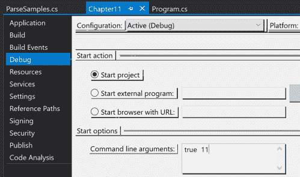
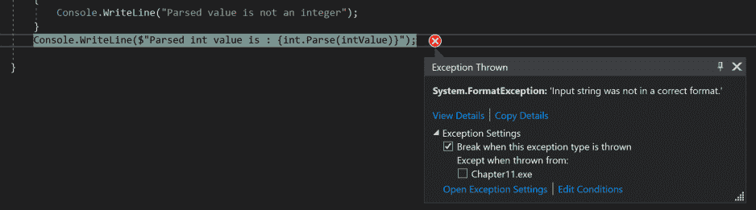
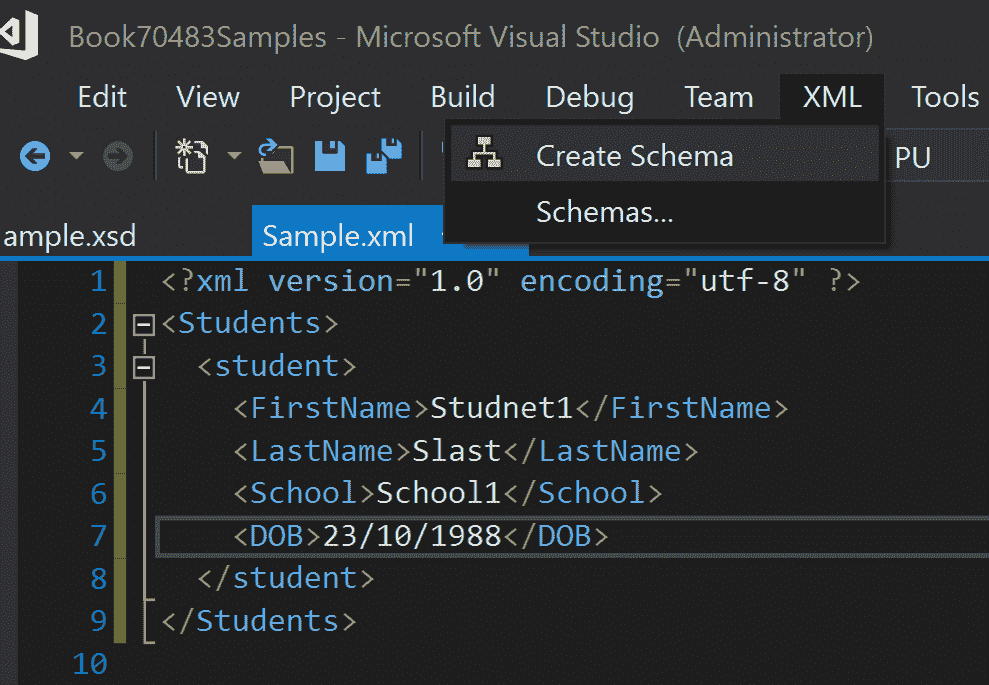
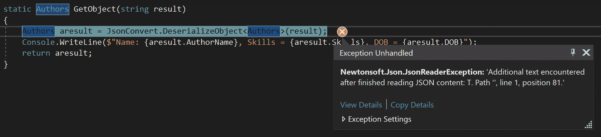

# 第十一章：验证应用程序输入

当在实际项目中工作时，可能会出现不同类型的用户访问您的应用程序并向其中输入信息的情况。如果场景中的任何方面处理不当，或者任何输入数据没有被正确解析，这可能会导致您的应用程序崩溃或导致您的应用程序数据损坏。尽管您在生产环境中验证了应用程序中使用的和访问的所有输入数据，但输入数据可能会与其他外部应用程序交互，这可能会使您的应用程序处于危险之中。

本章的目的是理解在您的应用程序中验证输入数据的重要性。.NET Framework 中提供了不同的验证技术来验证 JSON 数据和 XML 数据。

在接下来的章节中，我们将关注验证输入数据的重要性，如何管理数据完整性，如何使用框架提供的解析语句和正则表达式，以及如何验证 JSON 和 XML 数据。阅读本章后，您将能够创建用于验证传入数据的应用程序逻辑，并处理可能发生的异常场景。

在本章中，我们将涵盖以下主题：

+   验证输入数据的重要性

+   数据完整性

+   解析和转换

+   正则表达式

+   JSON 和 XML

# 技术要求

本章的练习可以使用 Visual Studio 2012 或更高版本以及 .NET Framework 2.0 或更高版本来实现。然而，任何从 C# 7.0 及以上版本的新特性都需要您拥有 Visual Studio 2017。

如果您没有任何产品的许可证，您可以从 [`visualstudio.microsoft.com/downloads/`](https://visualstudio.microsoft.com/downloads/) 下载 Visual Studio 2017 的社区版。

本章的示例代码可以在 GitHub 上找到，链接为 [`github.com/PacktPublishing/Programming-in-C-Exam-70-483-MCSD-Guide/tree/master/Book70483Samples/Chapter%2011`](https://github.com/PacktPublishing/Programming-in-C-Exam-70-483-MCSD-Guide/tree/master/Book70483Samples/Chapter%2011)。

# 验证输入数据的重要性

在独立模式下创建和运行应用程序可以使您的应用程序无任何问题地运行。然而，当在实际项目中工作时，您的应用程序将在一个可能存在许多外部接口交互的环境中执行。在这种情况下，您的应用程序能否处理这种通信？它能否处理来自这些外部应用程序的所有类型的数据？将会有许多用户尝试使用您的系统；有些人可能会正确使用它，而其他人可能会试图破坏您的系统。您的应用程序能否容忍这种交互？

这两种类型的用户都可能存在问题。那些正确使用您的系统的人可能会因为输入错误数据或忘记提供必要的数据而犯错误。如果您的应用程序的逻辑基于用户的出生日期，而用户输入了一些文本数据，那么您的应用程序可能会抛出异常并崩溃。

在用户尝试通过提供与应用程序期望的类型不匹配的数据来破坏您的应用程序的情况下，这可能会导致您的应用程序崩溃，并且可能会花费大量时间来恢复它。

上述任何操作都可能导致您的应用程序暂时受损或构成重大问题。当它破坏您的数据库时，恢复您的应用程序可能需要更多的时间和精力。

使用.NET Framework 创建应用程序涉及提供一些内置功能，这些功能可以用来验证一些输入数据，无论是来自内部用户还是外部用户或外部应用程序。框架允许您为每个属性添加属性，以便为您验证数据。这些在您使用 ASP.NET 或 Entity Framework 等时可用。正如您在前几章中学到的，您可以定义自定义属性并对用户输入的数据进行验证。

在下一节中，我们将看到各种数据完整性场景，这些场景在您在应用程序中进行数据验证时非常重要。

# 数据完整性

在开发任何应用程序时，非常重要的一点是设计它以便它可以处理所有场景，或者至少向用户提供友好的错误信息。我们已经在前一章中学习了异常处理，即第七章，*实现异常处理*，这在这些场景中非常有用。

在处理数据库或分布式应用程序时，数据完整性起着至关重要的作用。

数据完整性在不同场景中的应用方式不同：

+   例如，如果您正在创建一个应用程序并将用户信息存储在表中，您可能采用的一个原则是不要在表中维护重复的用户，以便它们可以唯一识别。这被称为**实体完整性**。

+   在收集人口统计信息的情况下，您可能允许在特定字段中输入某些值或值范围。这被称为**域完整性**。换句话说，您正在确保每个记录/实体中输入的数据是有效的。

+   可能会有这样的情况，您必须将数据输入到具有父子关系的多个表中。在这种情况下，您的应用程序应在将信息保存到数据库时维护这些关系。这被称为**引用完整性**。

+   最后但同样重要的是，在业务场景中，为了根据业务流程实现预期的结果，您的应用程序可能需要强制实施某些约束。这被称为**用户定义**的完整性或**业务定义**的完整性。

有许多现实世界的例子。这包括任何电子商务应用程序或任何银行应用程序。验证和控制输入以及程序流的重要性有多大？在银行应用程序中，如果发生停电，会发生什么？在电子商务应用程序中，当用户关闭浏览器或在清理作业启动时，购物车将如何维护？

许多这些数据完整性选项在最新的数据库和框架中可用，这使得我们能够利用这些选项来验证和控制我们程序的流程。

验证数据的一种方法是通过使用数据注释程序集，该程序集在.NET Framework 3.5 及以上版本中可用。数据注释涉及在类中添加有关属性或属性的信息。你可以通过引用`System.ComponentModel.DataAnnotations`命名空间来使用数据注释。这些数据注释分为三类：

+   验证属性

+   显示属性

+   建模属性

每个这些属性都用于特定的目的：验证属性强制执行数据的验证；显示属性用于用户界面上的显示标签，而建模属性表示相关属性的推荐使用方式。

在以下类中，我们将引用`System.ComponentModel.DataAnnotations`并使用验证属性、显示属性和建模属性在三个可用的属性上：

```cs
using System;
using System.ComponentModel.DataAnnotations;

namespace Chapter11
{
    public class Student
    {
        [Required(ErrorMessage = "Fullname of the student is 
         mandatory")]
        [StringLength(100,MinimumLength =5,ErrorMessage ="Name should 
         have minimum of 5 characters")]
        [DataType(DataType.Text)]
        public string FullName { get; set; }

        [DataType(DataType.EmailAddress)]
        [EmailAddress]
        public string EmailAddress { get; set; }

        [DataType(DataType.Date)]
       [Display(Name ="Date of Birth")]
        public DateTime DOB { get; set; }
    }
}
```

在名称属性上，我们有一个必填字段属性和字符串长度限制作为验证属性。设置为文本的数据类型是一个数据建模属性，它告诉系统名称属性只接受文本值。在`DOB`属性上，我们有一个显示属性。然而，显示属性可以在 ASP.NET 应用程序或 WPF 应用程序中使用。

现在，我们创建一个`Student`类的实例并尝试验证其数据。数据注释帮助我们定义`ValidationContext`；当一个对象被验证时，将返回`ValidationResult`，它包含所有属性及其相应的错误消息。在定义`Student`类中的属性时，我们添加了带有消息的属性。当`ValidationContext`返回结果时，它返回每个这些属性及其相应的属性和消息：

```cs
Student st = new Student();
st.FullName = "st1";
st.EmailAddress = "st@st";
st.DOB = DateTime.Now;

ValidationContext context = new ValidationContext(st, null, null);
List<ValidationResult> results = new List<ValidationResult>();
bool valid = Validator.TryValidateObject(st, context, results, true);
if (!valid)
{
    foreach (ValidationResult vr in results)
    {
        Console.Write("Student class Property Name :{0}", 
         vr.MemberNames.First());
        Console.Write(" :: {0}{1}", vr.ErrorMessage, 
         Environment.NewLine);
    }
}
```

当你创建一个`ValidationContext`实例时，我们使用接受三个参数的构造函数。这些参数如下：

+   我们想要验证的对象的实例

+   实现了`IServiceProvider`接口的对象，这意味着你需要使用`GetService`方法创建一个实例

+   一个键/值对的字典以供消费

此外，在尝试验证一个对象时，我们将`true`作为最后一个参数传递，这代表验证对象的所有属性。

当您执行程序时，您应该看到以下输出。学生的姓名应至少有五个字符，电子邮件地址应格式正确：

```cs
Student class Property Name :FullName :: Name should have minimum of 5 characters
Student class Property Name :EmailAddress :: The EmailAddress field is not a valid e-mail address.
Press any key to exit.
```

在下一节中，我们将探讨 C#中可用于验证我们数据的各种功能。

# 解析和转换

实体完整性和域完整性涉及允许有效值进入我们的应用程序以进行进一步处理。有效值包括操纵或管理用户提供的输入，将其呈现为应用程序可接受的数据。这个过程可能包括将特定类型的数据解析为应用程序接受的数据类型，转换数据类型等。

`Parse`和`TryParse`是.NET 框架中多个数据类型中可用的两个语句，例如如果您正在编写控制台应用程序，并且希望将参数作为命令行参数接受。在控制台应用程序中，命令行参数始终是字符串类型。那么，您如何将这些参数从字符串类型解析为所需的另一种类型？

在下面的例子中，我们知道我们的第一个参数是一个布尔值，但它被传递为一个字符串。当我们确定传递的值时，我们可以使用解析方法将字符串转换为布尔值。`Parse`将字符串与静态字符串值进行比较，并返回`true`或`false`。当传递无效数据时，会抛出异常——`输入字符串格式无效`。

让我们从例子开始。定义两个方法，每个方法都接受一个字符串类型的参数。我们希望将其解析为布尔值和整数值。解析布尔值就像使用布尔类型的解析方法一样简单。然而，对于整型，有两种方法。一种方法是使用解析，就像我们在解析布尔值时做的那样，另一种方法是`TryParse`。当我们不确定提供的字符串参数是否为整数时，我们可以使用`TryParse`方法，这样它就会给我们一个`bool`结果，我们可以根据这个结果设置我们的逻辑。在下面的例子中，我们展示了两种方法。这将使我们能够处理异常，并向用户提供有意义的消息：

```cs
internal class ParseSamples
    {
        internal void ProcessBool(string boolValue)
        {
            if (bool.Parse(boolValue))
            {
                Console.WriteLine($"Parsed bool value is : 
                 {bool.Parse(boolValue)}");
            }
        }

        internal void ProcessInteger(string intValue)
        {

            int processedValue =int.MinValue;
            if (int.TryParse(intValue, out processedValue))
            {
                Console.WriteLine($"Parsed int value is : 
                 {processedValue}");
            }
            else
            {
                Console.WriteLine("Parsed value is not an integer");
            }
            Console.WriteLine($"Parsed int value is : 
             {int.Parse(intValue)}");

```

现在我们已经准备好了示例类，让我们使用我们的`main`方法来调用它。在这里，我们有一个`switch`语句来检查传递给`main`方法的参数长度。如果是`1`，则调用`processbool`方法；如果是`2`，则调用两个方法，否则将显示一条消息：

```cs
 static void Main(string[] args)
        {
            ParseSamples ps = new ParseSamples();
            switch (args.Length)
            {
                case 1:
                    ps.ProcessBools(args[0]);
                    break;
                case 2:
                    ps.ProcessBools(args[0]);
                    ps.ProcessIntegers(args[1]);
                    break;
                default:
                    Console.WriteLine("Please provide one or two 
                     command line arguments");
                    break;
            }

            // Keep the console window open in debug mode.
            System.Console.WriteLine("Press any key to exit.");
            System.Console.ReadKey();
        }
```

要调用此方法，因为我们正在尝试在我们的程序中读取命令行参数，这些参数需要在运行时或从属性窗口传递，然后将在运行时读取。参数的传递方式如下。右键单击项目，选择属性，然后导航到调试选项卡，在那里您可以设置这些参数：



当您运行程序时，如果您传递`1`或`2`个参数，相应的 case 语句将被执行，输出将显示在屏幕上：

```cs
//Command line argument true
Parsed bool value is : True
Press any key to exit.

//Command line argument true 11
Parsed bool value is : True
Parsed int value is : 11
Parsed int value is : 11
Press any key to exit.

//Command line arguments true Madhav
Parsed bool value is : True
Parsed value is not an integer 
```

在这里，在最后一个输出中，处理了`TryParse`语句，但`Parse`会抛出以下错误。因为`Parse`期望传递一个合适的字符串，当传递非字符串值或当您的语句与传递的值不对应时，它会抛出错误。然而，如果我们使用`try..catch`处理这个语句，我们不会看到任何问题。否则，您的程序将崩溃，并出现以下异常对话框：



验证输入的另一种方法是使用转换方法。`Convert`是在.NET Framework 中定义的一个方法，它将基本类型转换为另一个基本类型。与`Parse`不同，`Convert`接受一个对象类型并将其转换为另一个类型。`Parse`只接受字符串输入。此外，当传递`null`值时，`Convert`返回目标类型的最小值。`Convert`类有几个静态方法，支持.NET Framework 中不同类型之间的转换。`Convert`方法支持的类型有`Boolean`、`Char`、`SByte`、`Byte`、`Int16`、`Int32`、`Int64`、`UInt16`、`UInt32`、`UInt64`、`Single`、`Double`、`Decimal`、`DateTime`和`String`。

当您应用`Convert`方法时，可以预期以下任何一种输出。系统要么成功地将源类型转换为目标类型，要么抛出以下异常之一：`FormatException`、`InvalidCastException`或`ArgumentNull`。让我们看一个例子：

```cs
internal void ConvertSample()
{
    try
    {
        string svalue =string.Empty; 
        Console.WriteLine(Convert.ToInt32(svalue));
    }
    catch (FormatException fx)
    {
        Console.WriteLine("Format Exception : "+fx.Message);
    }
    try
    {
        double dvalue = 1212121212121212.12;
        Console.WriteLine(Convert.ToInt32(dvalue));
    }
    catch (OverflowException ox)
    {
        Console.WriteLine("OverFlow Exception : " + ox.Message);
    }
    try
    {
        DateTime date= DateTime.Now;
        Console.WriteLine(Convert.ToDouble(date));
    }
    catch (InvalidCastException ix)
    {
        Console.WriteLine("Invalid cast Exception : " + ix.Message);
    }
    double dvalue1 = 12.22;
    Console.WriteLine("Converted Value : " + Convert.ToInt32(dvalue1));
}
```

在前面的示例中，我们尝试了不同类型的转换。需要注意的是，在转换过程中可能会得到任何输出，因此您必须在应用程序代码中相应地处理它。此外，在将十进制或浮点值转换为整数时，会丢失精确信息。然而，不会抛出异常。

在相同类型的转换中，不会抛出任何异常或进行转换。当尝试将字符串转换为任何其他类型时，会抛出`FormatException`。`String`到`Boolean`、`String`到`Char`或`String`到`DateTime`可能会抛出此异常。

当特定类型之间的转换无效时，会发生`InvalidCastException`，如下面的示例所示：

+   从`Char`转换为`Boolean`、`Single`、`Double`、`Decimal`或`DateTime`

+   从`Boolean`、`Single`、`Double`、`Decimal`或`DateTime`转换为`Char`

+   从`DateTime`转换为除`String`以外的任何类型

+   从除`String`以外的任何类型转换为`DateTime`

在数据丢失的情况下会抛出`OverflowException`，例如，当将一个巨大的十进制数转换为整数时，如我们的示例所示。在我们的示例中，我们将一个双精度值转换为`int`值。C#中的`int`类型变量有一个最小值和最大值。如果传递的数字超出了这个范围，则会引发溢出异常：

```cs
Format Exception : Input string was not in a correct format.
OverFlow Exception : Value was either too large or too small for an Int32.
Invalid cast Exception : Invalid cast from 'DateTime' to 'Double'.
Converted Value : 12
Press any key to exit.
```

# 正则表达式

当谈论验证输入数据时，了解正则表达式非常重要，这是一种强大的文本处理方式。它采用模式匹配技术来识别输入文本中的文本模式，并将其验证到所需格式。例如，如果我们的应用程序想要验证电子邮件，可以使用正则表达式来识别提供的电子邮件地址是否为有效格式。它检查 `.com`、`@` 和其他模式，并在匹配所需模式时返回。

`System.Text.RegularExpressions.Regex` 在 .NET Framework 中充当正则表达式引擎。要使用此引擎，我们需要传递两个参数，第一个是要匹配的模式，第二个是模式匹配发生的文本。

Regex 类提供了四种不同的方法——`IsMatch`、`Match`、`Matches` 和 `Replace`。`IsMatch` 方法用于在输入文本中识别模式。`Match` 或 `Matches` 方法用于获取与模式匹配的所有文本的实例。`Replace` 方法用于替换与正则表达式模式匹配的文本。

现在，让我们通过一些示例来了解正则表达式：

```cs
public void ReplacePatternText()
{
    string pattern = "(FIRSTNAME\\.? |LASTNAME\\.?)";

    string[] names = { "FIRSTNAME. MOHAN", "LASTNAME. KARTHIK" };
    foreach(string str in names)
    {
        Console.WriteLine(Regex.Replace(str, pattern, String.Empty));
    }

}

public void MatchPatternText()
{
    string pattern = "(Madhav\\.?)";

    string names = "Srinivas Madhav. and Madhav. Gorthi are same";
    MatchCollection matColl = Regex.Matches(names, pattern);
    foreach (Match m in matColl)
    {
        Console.WriteLine(m);
    }
}

public void IsMatchPattern()
{
    string pattern = @"^c\w+";

    string str = "this sample is done as part of chapter 11";
    string[] items = str.Split(' ');
    foreach (string s in items)
    {
        if (Regex.IsMatch(s, pattern))
        {
            Console.WriteLine("chapter exists in string str");
        }
    }
}
```

`ReplacePatternTest` 方法从一个字符串数组中识别 `FirstName` 和 `LastName` 并将它们替换为空字符串。在 `MatchPatternText` 方法中，我们识别字符串中 `Madhav` 出现的次数；在第三个方法中，我们使用模式来识别章节词。`^c\w+` 模式表示单词的开始，`c` 表示以 *c* 开头的单词，`\w` 表示任何字符，`+` 表示与前面的标记匹配。

以下输出显示了 `ReplacePatternTest` 方法的输出前两行，其中我们将 `Madhav` 替换为空字符串。第二个输出集识别一个模式并显示它。第三个集是识别字符串中的章节词：

```cs
//ReplacePatternText method
MOHAN
 KARTHIK

//MatchPatternText method
Madhav.
Madhav.

//IsMatchPattern method
chapter exists in string str
Press any key to exit.
```

# JSON 和 XML

随着互联网和云应用的广泛使用，JSON 和 XML 在应用程序之间的数据传输方面变得越来越重要。使用 JSON 和 XML 也增加了与数据相关的问题数量，除非数据得到验证。

模式验证可以用来验证 XML 文件，这将帮助我们确定 XML 是否与定义的数据类型一致。然而，为了验证实际数据，你可能仍然会使用本章中讨论的方法。Visual Studio 帮助你创建模式文件。`Xsd.exe <XML file>` 命令将创建一个模式文件。以下是一个示例 XML 文件。

此 XML 文件有一个 `Students` 根元素，其中包含与多个学生相关的信息。每个 `student` 元素都有子元素，包含 `FirstName`、`LastName`、`School` 和 `DOB` 等值：

```cs
<?xml version="1.0" encoding="utf-8" ?>
<Students>
  <student>
    <FirstName>Student1</FirstName>
    <LastName>Slast</LastName>
    <School>School1</School>
    <DOB>23/10/1988</DOB>
  </student>
</Students>
```

Visual Studio 允许我们为这个 XML 创建一个模式。在 Visual Studio 中打开 XML 文件并选择 XML 菜单项。将出现创建模式选项。选择此选项将创建一个 `.xsd` 模式：



`Sample.xsd`文件的内容如下：

```cs
<?xml version="1.0" encoding="utf-8"?>
<xs:schema attributeFormDefault="unqualified" elementFormDefault="qualified" >
  <xs:element name="Students">
    <xs:complexType>
      <xs:sequence>
        <xs:element name="student">
          <xs:complexType>
            <xs:sequence>
              <xs:element name="FirstName" type="xs:string" />
              <xs:element name="LastName" type="xs:string" />
              <xs:element name="School" type="xs:string" />
              <xs:element name="DOB" type="xs:string" />
            </xs:sequence>
          </xs:complexType>
        </xs:element>
      </xs:sequence>
    </xs:complexType>
  </xs:element>
</xs:schema>
```

如您所见，名称被定义为字符串，日期也是如此。因此，当您访问这个日期元素时，我们可能需要将其转换以便在应用程序中使用。

现在，我们将跳转到一些示例代码，观察如何使用模式验证 XML 文件：

```cs
static void LoadXML()
{
    var path = new Uri(Path.GetDirectoryName(System.
     Reflection.Assembly.
     GetExecutingAssembly().CodeBase)).LocalPath;
    XmlSchemaSet schema = new XmlSchemaSet();
    schema.Add("", path + "\\sample.xsd");
    XmlReader rd = XmlReader.Create(path + "\\sample.xml");
    XDocument doc = XDocument.Load(rd);
    Console.WriteLine("Validating XML");
    doc.Validate(schema, ValidationEventHandler);
    Console.WriteLine("Validating XML Completed");
}
static void ValidationEventHandler(object sender, 
 ValidationEventArgs e)
{
    XmlSeverityType type;
    if (Enum.TryParse<XmlSeverityType>(e.Severity.ToString(), out 
     type))
    {
        if (type == XmlSeverityType.Error) throw new 
         Exception(e.Message);
    }
}
```

由于我们传递了一个有效的 XML 文件，所以在验证它时我们没有遇到任何问题。然而，当您尝试从其中删除任何元素时，例如从 XML 文件中删除学校，那么您会遇到错误消息。当您练习这个实验时，请自己尝试，以便更详细地了解验证：

```cs
Validating XML
Validating XML Completed
Press any key to exit.
```

当执行时，此方法要么在控制台上写入一条消息，表明验证已完成，要么在 XML 出现错误时抛出异常。

我们讨论的另一种格式是 JSON。.NET Framework 为我们提供了 JSON 序列化器，可以用来验证 JSON。这就像创建一个 C#类，使用 JSON 序列化器将 C#对象转换为 JSON，然后再将其反序列化回 C#对象。它与.NET Framework 序列化概念类似。然而，并非所有的 JSON 都有用于序列化或反序列化的模式。在这种情况下，我们将验证 JSON 格式。在下面的示例中，我们创建了一个类序列化器来转换 JSON 对象，然后将其反序列化回对象。

在这里，我们创建了一个名为`Authors`的类，具有三个属性：`AuthorName`、`Skills`和`DOB`。我们将使用此对象来序列化和反序列化此对象：

```cs
public class Authors
{
   public string AuthorName { get; set; }
    public string Skills { get; set; }
    public DateTime DOB { get; set; }
}
```

在下一节中，我们创建了一种新方法，其中我们使用了`Newtonsoft.Json`命名空间将`Authors`对象转换为 JSON。您可以使用 NuGet 包来获取`NewtonSoft.Json`：

```cs
static string GetJson()
{
    string result = string.Empty;
    Authors aclass = new Authors() { AuthorName = "Author1", Skills = 
     "C#,Java,SQL", DOB = DateTime.Now.Date };
    result = JsonConvert.SerializeObject(aclass);
    Console.WriteLine($"JSON object : {result}");
    return result;
}
```

接下来，我们将使用`JSON.Deserialize`方法将 JSON 转换为`Authors`对象：

```cs
static Authors GetObject(string result)
{
    Authors aresult = JsonConvert.DeserializeObject<Authors>(result);
    Console.WriteLine($"Name: {aresult.AuthorName}, Skills = 
     {aresult.Skills}, 
    DOB = {aresult.DOB}");
    return aresult;
}
```

下面是调用这两个方法的程序。最初，我们调用`GetJSON`方法来获取`Json`字符串，然后使用这个字符串通过`GetObject`方法将其转换为`Authors`对象。在第二行，我们修改了第一行中得到的字符串结果，并尝试对其进行反序列化。这个操作将抛出异常。

在以下内容中，我们尝试通过连接名为`Test`的文本来修改`.json`结果。这是您修改`.json`对象并尝试将其反序列化为`Authors`对象时发生的情况：

```cs
string result = GetJson();
Authors a = GetObject(result);
string result1 = string.Concat(result, "Test");
Console.ReadLine();
Authors a1 = GetObject(result1);
```

下面的输出显示了我们将`Authors`对象转换为的`JSON`对象，随后是我们在`JSON`对象中反序列化的`Author`对象：

```cs
JSON object : {"AuthorName":"Author1","Skills":"C#,Java,SQL","DOB":"2019-03-31T00:00:00+11:00"}
Name: Author1, Skills = C#,Java,SQL, DOB = 3/31/2019 12:00:00 AM
Press any key to exit.
```

这是当我们在修改`JSON`并尝试将其反序列化为`Authors`对象时程序抛出的异常：



这是一个尝试验证`JSON`对象的示例。如果在传输过程中被修改，这个修改可以在反序列化过程中被识别出来。

# 摘要

在本章中，我们了解了验证输入数据的重要性；在我们的应用程序中验证输入数据的不同方法，包括 `Parse` 和 `Convert` 方法；以及我们如何使用正则表达式和数据注释命名空间。我们还简要地探讨了如何验证 XML 和 JSON 输入。

在下一章中，我们将探讨使用 .NET Framework 中可用的加密技术来保护我们的数据，例如电子邮件、密码和 API 密钥的方法。

# 问题

1.  `Parse` 方法始终接受 __ 类型作为输入

    1.  任何有效的 .NET 类型

    1.  对象

    1.  字符串

    1.  无

1.  当将 `DateTime` 转换为 `Double` 时，会抛出哪种异常？

    1.  不会抛出异常；相反，它会被成功转换。

    1.  抛出格式异常。

    1.  抛出溢出异常。

    1.  抛出无效转换异常。

1.  可以使用 ___________ 命名空间提供关于对象成员的信息。

    1.  `DataContract`

    1.  `数据注释`

    1.  `System.Reflection`

    1.  `System.XML`

# 答案

1.  **字符串**

1.  **抛出** **无效转换异常**。

1.  `数据注释`
