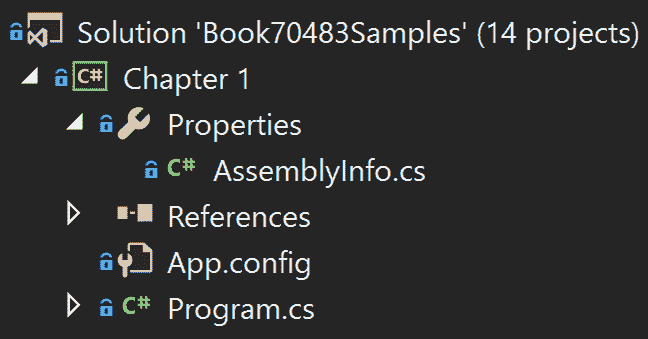
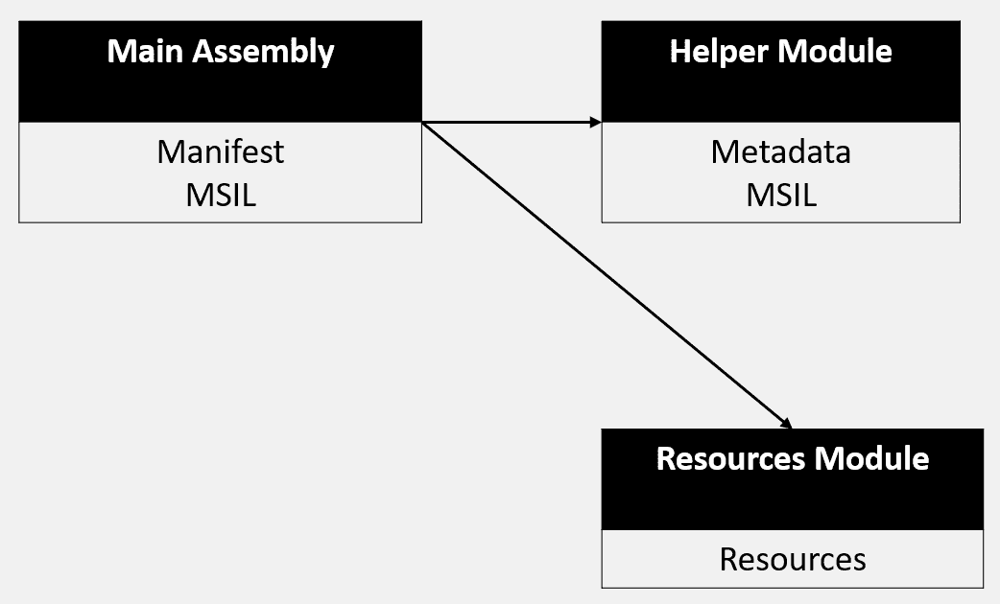
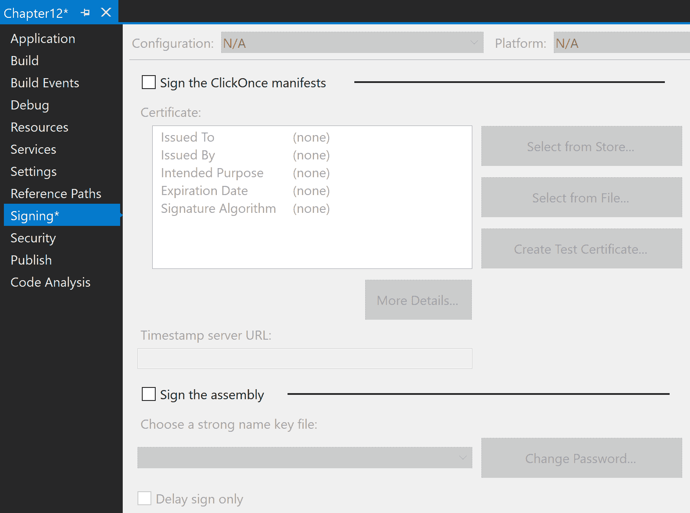
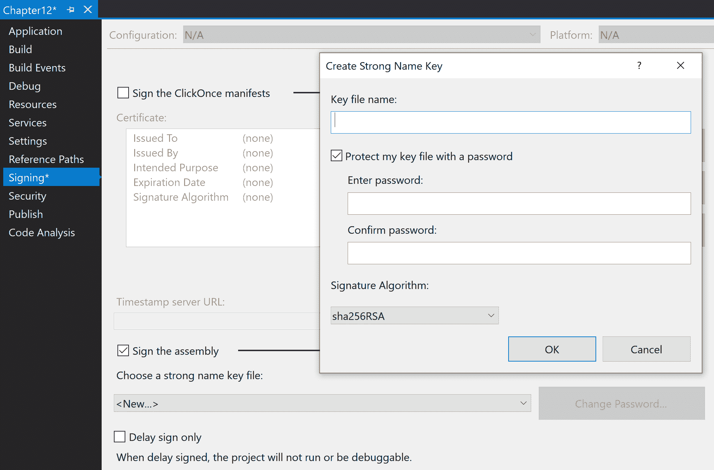
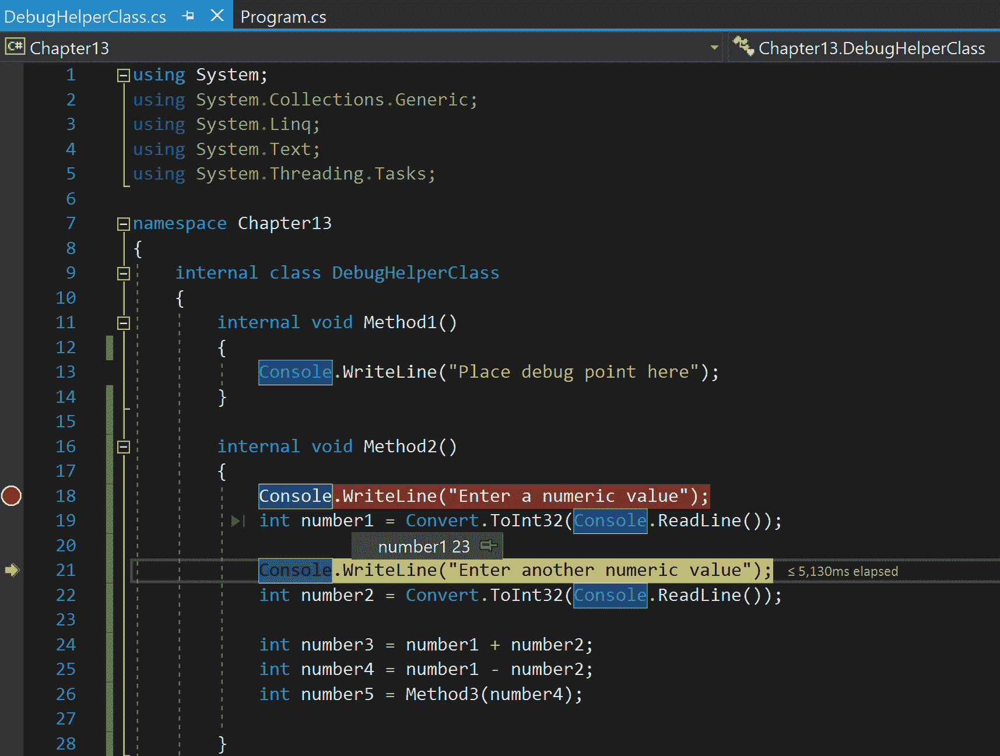
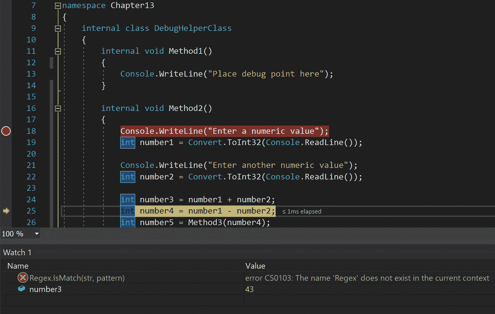
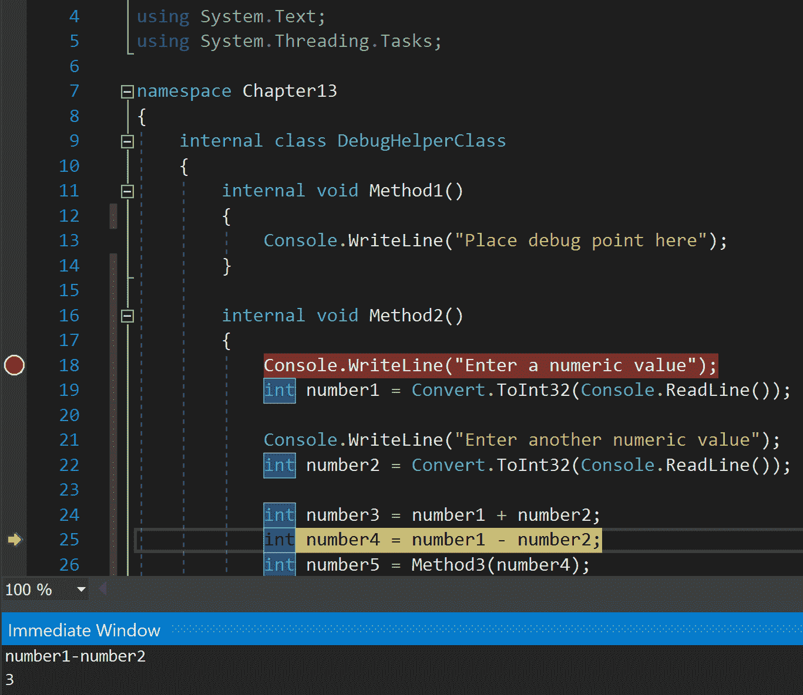
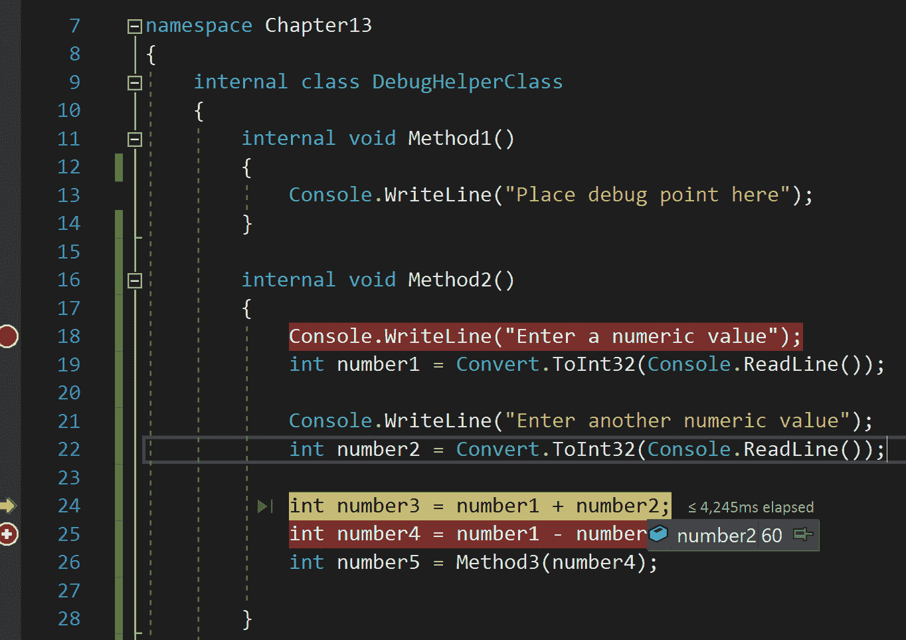
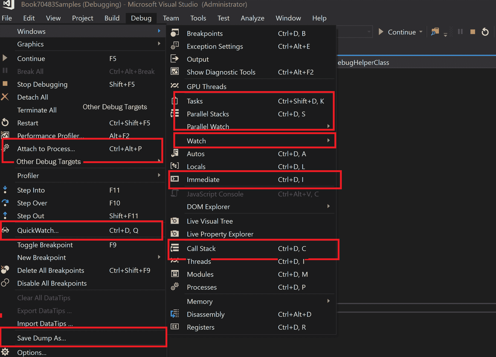
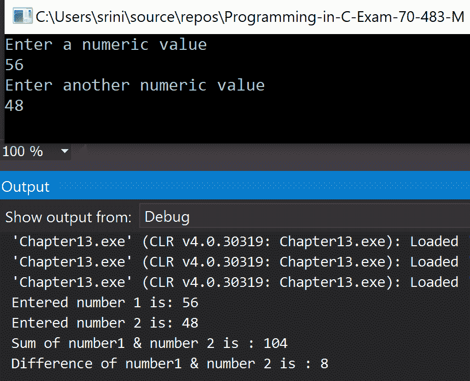

# 第十三章：管理组件和调试应用程序

在上一章中，我们学习了加密学以及如何使用 C#中可用的不同技术进行加密和解密。在本章中，我们将关注如何管理.NET 组件、调试应用程序以及如何进行跟踪。编写.NET 应用程序看起来相对简单；然而，确保您的程序能够实现其目的、维持质量标准、在异常情况下不会崩溃，并且在所有情况下都能正常工作是非常重要的。为了实现这样的质量输出，重要的是测试您的应用程序并检查在运行时生成的输入源和值，这些值用于应用程序逻辑的进一步处理等。

组件是.NET 应用程序部署的基本单元。它们维护版本、类型、所需资源、范围和安全细节。我们将在接下来的章节中更详细地讨论这一点。

调试是通过逐行检查似乎有问题或您认为会引发错误的代码的过程。在这个过程中，我们可以观察变量和参数的值以及程序是否按预期运行。

理解我们是在创建一个库还是一个独立的应用程序以分发给客户也很重要。基于这一点，我们可以决定需要创建哪种类型（`.exe`或`.dll`）的应用程序。

跟踪允许您在代码执行时跟踪每一行代码。

在阅读本章后，您将能够理解.NET 中的组件以及如何管理它们，以及版本控制和签名。我们还将探讨调试应用程序的多种方法以及当发生异常时如何编写跟踪消息。在本章中，我们将涵盖以下主题：

+   +   组装

    +   调试 C#应用程序

    +   跟踪

# 技术要求

您可以使用 Visual Studio 2012 或更高版本以及.NET Framework 2.0 或更高版本来练习本章的练习。然而，任何从 C# 7.0 及以后版本的新特性都需要您拥有 Visual Studio 2017。

如果您没有这些产品的任何一项许可证，您可以从[`visualstudio.microsoft.com/downloads/`](https://visualstudio.microsoft.com/downloads/)下载 Visual Studio 2017 的社区版。

本章的示例代码可以在 GitHub 上找到，地址为[`github.com/PacktPublishing/Programming-in-C-sharp-Exam-70-483-MCSD-Guide/tree/master/Chapter13.`](https://github.com/PacktPublishing/Programming-in-C-sharp-Exam-70-483-MCSD-Guide/tree/master/Book70483Samples/Chapter13)

# 组装

.NET Framework 中的组件可以是两种类型之一，`.exe`或`.dll`，被称为.NET 应用程序的构建块。

这些组件构成了应用程序的基本单元，并允许程序员维护版本、安全性、使用范围和重用性。由于组件包含执行应用程序所需的所有信息，因此它为运行时提供了有关使用哪些 .NET 类型以及执行应用程序所需的运行时功能的信息。

当你在 .NET 中使用 Visual Studio 创建应用程序时，它会创建源代码文件（`.cs` 文件）、组件属性（`AssemblyInfo.cs`）：



这些项目允许程序员关联其他组件，从而允许他们创建和维护供多个用户共同工作的更大项目。当完成对单个项目的开发工作后，这些项目可以作为一个组件单元创建，以便向客户发布。

当创建组件时，每个组件都会创建一个清单文件，详细说明以下信息：

+   在创建此组件时使用过的每个文件

+   如果有任何已使用的引用

+   具有唯一名称的组件版本

# 组件内容和清单

.NET 框架中的组件包含以下四个元素：

+   组件清单

+   元数据

+   MSIL 代码

+   资源

这些元素可以组合成一个组件，如下面的截图所示。在这里，运行时需要清单信息以获取类型信息、依赖组件信息、版本和组件的唯一名称，以便执行：


.NET 框架还允许我们将组件的四个元素组合成多个模块，并在执行程序块时创建一个组件来引用它们。当在组件中引用这些模块时，是清单文件维护了所有引用这些资源所需的链接：



组件清单包含以下信息：组件的名称、版本、用于构建组件的文化、强名称信息（即公钥）、类型信息、文件列表以及它们如何与组件相关联，以及最后，引用的组件及其版本列表。我们可以通过更新 `AssemblyInfo.cs` 文件来添加更多信息。

清单文件可以是包含 MSIL 的可移植可执行文件（PE）文件的一部分，也可以是独立的 PE 文件。每个组件文件包含构成组件所需的所有文件；它控制这些文件、资源和组件之间的映射关系，并包含引用的组件。

# 目标 .NET 框架

当你创建一个 C# 应用程序时，你可以指定你的应用程序要针对哪个 .NET Framework。在实际场景中，当框架发布新版本时，并非每个客户都会更新他们的服务器以使用最新版本。此外，当发布新版本时，一些旧功能可能会被弃用，而现有功能的新版本会被添加。在这些情况下，你的应用程序不应失败。因此，.NET Framework 允许你将应用程序针对 .NET Framework 的特定版本。

在使用 Visual Studio 创建新项目时，你可以指定要针对的 .NET Framework 版本，或者使用项目的属性页更改目标框架：


或者，要使用属性页更改目标框架版本，请选择一个现有项目，右键单击它，然后导航到属性：


在“目标框架”下拉菜单中，选择你需要的版本：


# 签署程序集

为程序集创建一个唯一的标识符被称为对程序集进行签名或强命名。为程序集提供唯一标识符可以避免程序集冲突。每个程序集在其清单中维护模块、资源和文件信息的哈希值。当你对程序集进行签名时，以下信息将被捕获：

+   程序集的名称

+   程序集的版本号

+   如果可用，程序集的文化（也称为代码开发的*区域设置*）

+   用于对程序集进行签名的公钥被添加到程序集清单中

签署程序集提供了以下好处：

1.  这允许我们给朋友访问其他已签名的程序集。

1.  这允许我们在同一时间运行同一程序集的不同版本。

1.  这允许我们将我们的程序集部署到全局程序集缓存（GAC）。这允许其他应用程序使用我们的程序集。

你可以通过两种方式对程序集进行签名：第一种是使用 Visual Studio，第二种是使用命令行工具。Visual Studio 使签名程序集变得简单。

在这里，我们将演示如何使用 Visual Studio 签署一个程序集：

1.  导航到项目属性。

1.  导航到左侧的“签名*”选项卡：



1.  选择“签名程序集”复选框。

1.  在下拉菜单中选择 <新建...>，然后选择一个强密钥文件名：



1.  在弹出的窗口中输入一个密钥文件名。

1.  Visual Studio 允许你选择一个算法并为密钥文件提供密码。

1.  密码是可选的；你可以根据需要从可用列表中更改算法。

或者，我们可以使用命令提示符和包含以下安装步骤的 Visual Studio 工具对程序集进行签名：

1.  点击系统上的 Windows 按钮。

1.  在已安装程序中导航。

1.  找到 Visual Studio 20xx 安装文件夹。

1.  选择 Visual Studio 20xx 的开发者命令提示符。

1.  使用 `sn.exe` 将强名称对生成到 `.snk` 文件中：

```cs
sn -k keyPair.snk
```

1.  一旦创建了密钥文件，你现在可以使用 Visual Studio 对程序集进行签名或使用 `al.exe` 工具。

1.  使用 `al.exe` 将前面步骤中生成的程序集和密钥对链接起来：

```cs
al /out:chapter12.dll MyModule.netmodule /keyfile:keyPair.snk
```

关于这些命令的更多信息可以在 MSDN 上找到（[`docs.microsoft.com/en-us/dotnet/framework/tools/sn-exe-strong-name-tool`](https://docs.microsoft.com/en-us/dotnet/framework/tools/sn-exe-strong-name-tool)）。

# 程序集版本控制

当你准备好一个程序集并对其进行了签名后，你可以对其进行版本控制。当你对程序集进行版本控制时，当前程序集以及所有依赖的程序集版本都保存在程序集清单中。当版本化的程序集部署到环境中时，它将成为你应用程序的默认版本，如果当前程序集或依赖的程序集与默认版本不匹配，系统将抛出程序集清单不匹配错误。有一种方法可以通过配置文件来覆盖这一点，该配置文件告诉运行时使用特定版本而不是默认版本。

当程序集在运行时执行时，它执行多个步骤以解析程序集绑定：

1.  它检查当前程序集的版本信息和唯一名称。

1.  它检查配置文件以查看是否定义了任何版本覆盖策略。

1.  在任何策略更改的情况下，运行时会根据策略识别和加载重定向的程序集。

1.  它检查全局程序集缓存（GAC）或配置文件中指定的路径，然后是应用程序目录、子目录，并服务程序集绑定请求。

# 版本号

每个程序集以两种形式维护版本信息，即标识符和信息。程序集的版本号、名称和区域设置形成程序集的标识符，信息版本以程序集信息文件中指定的字符串格式提供，仅用于信息目的。

程序集的版本号表示为一个四部分字符串：

```cs
<Major version>.<Minor Version>.<Build number>.<revision>
```

例如，如果程序集版本设置为 2.1.1234.2，这表示程序集的主版本是 2，次要版本是 1，构建号是 1234，修订号是 2。当创建或更新此版本时，它将连同所有资源和依赖程序集文件及其版本快照一起保存在清单文件中。此外，版本控制检查仅适用于已签名的程序集。

从现实世界的场景中理解的一个重要事情是，当你构建一个产品并发布你的程序集给客户，后来升级你的程序集，那么你必须维护之前的版本。因此，当发布程序集的新版本时，只要它得到支持，客户端仍然可以使用旧版本。

# 调试 C# 应用程序

当你构建一个 C# 应用程序时，你将有两个选项，调试模式和发布模式。调试模式帮助你逐行检查代码以查找错误并在需要时进行修复。发布模式不允许我们进入代码。Visual Studio 通过提供更多工具使开发者更容易使用，这些工具允许我们在运行时遇到调试点时执行 `Step-in`、`Step-Over` 和 `Step-Out`。以下截图中的蓝色框中突出显示了这些工具：


除了这些工具，Visual Studio 还允许我们查看堆栈跟踪、检查变量以及更多功能。让我们进一步探索，以便更好地了解调试过程。

让我们从基础开始。要设置断点，只需单击要调试的代码行左侧的空白处，或将光标放在该行上并按键盘上的 *F9* 键。另一种设置断点的方法是选择调试菜单选项并选择新的断点。

当你设置断点时，整行代码会被高亮显示为棕色。当程序带有断点开始执行时，控制会在断点处停止并高亮显示该行，这表示高亮显示的行将被执行：


观察前面的截图；我们在第 13 行设置了断点。当你启动程序时，控制会在设置断点的第 13 行停止。当我们单步执行时，屏幕上会打印输出，但控制会停留在第 14 行，如下面的截图所示：


当遇到断点时，尽管应用程序执行被停止，但所有变量、函数和对象仍然保留在内存中，这允许我们验证它们的值。当你想要调试一个应用程序时，你需要在调试模式下构建它，这会生成一个 `.pdb` 文件；这个文件是调试的关键。`.pdb` 文件包含符号（或源代码），这些符号被加载到内存中以允许我们进行调试。如果没有加载这些符号，你可能会看到一个错误消息，表明符号未找到。维护这些 `pdb` 文件的版本也很重要，因为你的程序集和 `.pdb` 文件之间的任何版本不匹配都将导致程序集版本不匹配错误。

让我们跳入一个示例代码，并检查在调试过程中我们可以执行的不同操作，以及 Visual Studio 提供给我们的功能。

以下是一个示例程序，它接受两个数字并计算这些数字的和与差，然后调用另一个方法将 10 添加到结果中。让我们通过在代码块中设置几个断点来调试这个应用程序：

```cs
internal void Method2()
{
    Console.WriteLine("Enter a numeric value");
    int number1 = Convert.ToInt32(Console.ReadLine());

    Console.WriteLine("Enter another numeric value");
    int number2 = Convert.ToInt32(Console.ReadLine());

    int number3 = number1 + number2;
    int number4 = number1 - number2;
    int number5 = Method3(number4);

}

internal int Method3(int number4)
{
    return number4+10;
}
```

在这里，我们在第 18 行和第 21 行设置了两个断点。当程序开始执行时，它会在第 18 行停止以等待用户输入，当您选择继续程序执行时，控制会停止在第 21 行。在下面的屏幕截图中，需要注意的一个重要事项是，当控制停止在第 21 行时，您只需将光标悬停在`number1`变量上即可查看其值。您可以看到`number1`变量的值为 23：



Visual Studio 调试工具允许我们在调试模式下执行程序时监视变量。您可以在变量上右键单击并选择“添加监视”将变量添加到监视窗口。正如您在屏幕底部所看到的那样，有一个监视窗口，其中已添加了变量`number3`，我们可以看到值为 43，这是`number1`和`number2`之和的输出。监视窗口允许您查看代码行执行后的值。当您的应用程序逻辑执行复杂计算时，这非常有用：



另一个在调试过程中非常有用的窗口是即时窗口（*Ctrl* + *Alt* + *I*），可以通过键盘快捷键或调试菜单打开。与监视窗口不同，此窗口可以帮助你在执行代码行之前执行操作。正如您可以在下面的屏幕截图中所见，控制位于第 25 行，即断点被触发的位置；然而，如果您向下看，即时窗口是打开的，我们在其中执行了`number1 - number2`操作来检查执行该行之前的值：



当您放置一个断点并将光标悬停在左侧边缘的断点上时，系统会显示一个齿轮，这允许您为断点添加条件；例如，您的程序有一个`for`循环，但您希望断点在循环变量为 5 时触发：


当您点击齿轮时，您将看到一个条件向导，您可以在其中配置断点何时触发的条件。默认情况下，条件设置为 true，这可以通过开发人员更改。在下面的屏幕截图中，我们选择了`number4=3`，这意味着当数字 4 的值等于 3 时，此断点将被触发：


在调试过程中，另一个需要理解的重要功能是，Visual Studio 中的某些类型的项目允许您在调试应用程序时更改变量值。当以下程序执行时，我们将`60`作为数值输入到变量`number2`中。您可以通过以下方式查看变量 2 的值：



现在，当你选择显示的值时，系统允许你更改它（我们将其更改为 40），然后使用修改后的值继续执行代码块。请记住，并非所有项目类型都允许你在运行时更改值：


如前所述，在 Visual Studio 中调试 C#应用程序时，有许多可用的工具，其中一些在下面的屏幕截图中被突出显示。继续和停止调试按钮允许开发者在一处断点被触发后继续执行，或者停止执行。

有进入、退出和跳过按钮。这些按钮允许你在断点触发后进入每一行代码，或者跳过方法的执行并继续在同一上下文中执行，或者进入外部方法。

一旦你调试了程序块并修复了所有发现的问题，你可以通过使用调试菜单中的删除所有断点或禁用所有断点选项一次性禁用或删除所有断点：


在下面的屏幕截图中，突出显示了几个更多选项，例如附加到进程、快速监视...、另存为内存转储...、并行堆栈、立即和监视窗口、调用堆栈等：



我们以这种方式构建项目，即创建多个程序集，无论是辅助程序集还是依赖程序集。在调试时，通过使用附加到进程...命令将运行这些程序集的进程附加到当前调试进程，加载符号非常重要。否则，系统会提示源代码不可用，因此无法进入代码块。

在实际项目场景中，有时你的应用程序会突然崩溃；在这种情况下，你可以保存内存转储并分析内存寄存器以了解发生了什么。这可能需要你具备阅读和理解此类转储的特殊技能。

我们在前面章节中了解了并行任务和多线程；当你的代码块运行多线程应用程序的并行任务时，调试菜单可以帮助你理解并行堆栈和任务。

# 跟踪

跟踪使我们能够在应用程序执行时对其进行监控。当程序执行时，运行时允许我们写入消息以监控程序的流程控制。这将使我们能够识别应用程序逻辑的任何错误行为。在异常的情况下，我们可以确定代码失败的确切位置以及哪些变量值导致了平稳执行的故障。这些消息可以通过`System.Diagnostics.Debug`类创建。当创建此类消息时，默认情况下，这些消息将在 Visual Studio 的输出窗口中显示。

除了创建这些消息外，您还可以使用 `System.Diagnostics.Trace` 类将这些消息重定向到文件或数据库。您可以使用跟踪类注册监听器，这允许您重定向您的消息。在这里，您的调试类或跟踪类充当发布者，而监听器类充当订阅者。我们希望您还记得第五章，*创建和实现事件和回调*，在那里我们学习了发布者和订阅者模型。

让我们通过一个例子来了解我们如何使用调试消息。在下面的程序中，我们试图接受两个输入参数，并对这些数字执行加法和减法等操作。然而，我们添加了一些额外的行来监控记录发生情况的日志消息：

```cs
internal void Method4()
{
    Console.WriteLine("Enter a numeric value");
    int number1 = Convert.ToInt32(Console.ReadLine());
    Debug.WriteLine($"Entered number 1 is: {number1}");

    Console.WriteLine("Enter another numeric value");
    int number2 = Convert.ToInt32(Console.ReadLine());
    Debug.WriteLine($"Entered number 2 is: {number2}");

    int number3 = number1 + number2;
    Debug.WriteLineIf(number3>10, $"Sum of number1 & number 2 is : {number3}");
    int number4 = number1 - number2;
    Debug.WriteLineIf(number4 < 10, $"Difference of number1 & number 2 is : {number4}");
}
```

因为我们使用了 `Debug.WriteLine` 来记录消息，所以这些值会写入输出窗口。观察以下输出窗口，其中所有 `Debug.WriteLine` 消息都被写入：



在前面的代码块中，您可以看到程序块中的最后两个 `Debug.WriteLine` 语句，其中使用了 `Debug.WriteLineIf`。系统会检查我们提供的条件，如果返回 true，则系统会将消息写入输出窗口。

现在，让我们更进一步，看看我们如何可以使用跟踪监听器将消息重定向到不同的通道。

我们将使用相同的程序，并添加五条额外的行，其中添加 `Console.Out` 和 `logfile.txt` 文件作为两个不同的跟踪监听器，然后将这两个监听器附加到调试对象上。最后一行是 `Debug.Flush`，它将对象中的所有消息推送到日志文件：

```cs
internal void Method5()
{
    TextWriterTraceListener listener1 = new TextWriterTraceListener(Console.Out);
    Debug.Listeners.Add(listener1);

    TextWriterTraceListener listener2 = new TextWriterTraceListener(File.CreateText("logfile.txt"));
    Debug.Listeners.Add(listener2);

    Console.WriteLine("Enter a numeric value");
    int number1 = Convert.ToInt32(Console.ReadLine());
    Debug.WriteLine($"Entered number 1 is: {number1}");

    Console.WriteLine("Enter another numeric value");
    int number2 = Convert.ToInt32(Console.ReadLine());
    Debug.WriteLine($"Entered number 2 is: {number2}");

    int number3 = number1 + number2;
    Debug.WriteLineIf(number3 > 10, $"Sum of number1 & number 2 is : {number3}");
    int number4 = number1 - number2;
    Debug.WriteLineIf(number4 < 10, $"Difference of number1 & number 2 is : {number4}");
    Debug.Flush();
}
```

因为我们将 `Console.Out` 添加为其中一个监听器，所以当我们执行程序时，`Debug.WriteLine` 消息现在会显示在屏幕上：


此外，因为我们添加了 `logfile.txt` 作为其中一个监听器，所以程序执行文件夹中会创建一个新的文本文件，其中包含 `Debug.WriteLine` 消息：


这些监听器不仅限于文本文件和控制台。根据项目需求，您可以添加 XML、数据库监听器，这可能需要一些额外的编码。

# 摘要

在本章中，我们学习了如何管理 C# 程序集，如何调试程序集或程序块，Visual Studio 在执行这些操作时提供了哪些功能，以及如何使用跟踪。

在下一章中，我们将探讨 C# 提供的不同功能，用于访问和利用文件对象和外部 Web 服务中存在的数据，重点关注在文件对象上执行 I/O 操作，以及 `System.Net` 命名空间中可用的不同辅助类，这些类帮助我们进行 I/O 操作。

# 问题

1.  程序集的版本号代表什么？

    1.  主版本号、次版本号、构建号和修订号。

    1.  主要版本，次要版本，程序集版本和日期。

    1.  主要版本，次要版本，程序集版本和修订号。

    1.  以上所有选项。

1.  强类型命名程序集的重要好处是什么？

    1.  它允许您共享您的程序集。

    1.  它允许您同时运行超过两个程序集。

    1.  它允许您将其安装到全局程序集缓存（GAC）中。

    1.  以上所有选项。

1.  在文本文件中记录调试消息的最简单方法是什么？

    1.  创建一个文件并使用文本流对象写入消息。

    1.  创建一个跟踪监听器并将其附加到调试对象。

    1.  使用第三方日志程序集。

    1.  以上所有选项。

# 答案

1.  **主要版本，次要版本，构建号和修订号**

1.  **以上所有选项**

1.  **创建一个跟踪监听器并将其附加到调试对象**
