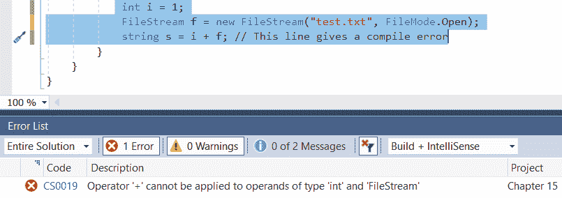
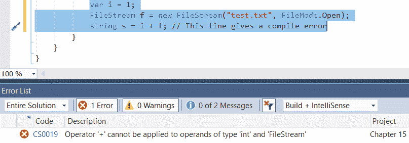
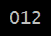
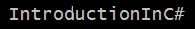
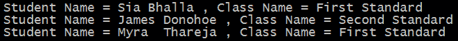
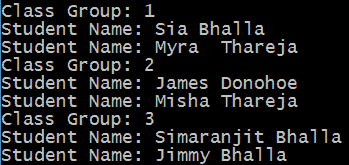

# 第十五章：使用 LINQ 查询

在 .NET 中，我们经常需要从不同的数据源查询数据，例如 XML、SQL 和 Web 服务。在 .NET 的早期版本中，我们使用简单的字符串执行这些操作。这种方法的主要问题是它缺乏任何智能感知，并且在实现上相当繁琐。这些查询也因查询数据的数据源不同而彼此不同，从而增加了代码的复杂性。

为了克服这些问题，LINQ 首次在 .NET 3.5 版本中引入。与传统的数据访问方法相比，LINQ 引入了一种简单且一致的方法，用于查询和修改不同类型的数据源中的数据，例如 XML，甚至内存中的数据结构，如数组。在 LINQ 中，我们使用查询表达式来查询数据。查询表达式使我们能够使用最少的代码对数据进行过滤、排序和分组操作。

本章我们将探讨以下主题：

+   介绍 LINQ

+   理解使 LINQ 成为可能的语言特性

+   理解 LINQ 查询运算符

+   理解 LINQ 的幕后原理

+   使用 LINQ 查询 XML

到本章结束时，我们将学习如何在操作 XML 文件时使用 LINQ 查询。我们将探讨 LINQ 查询如何帮助我们编写、查询和修改 XML 文件。

# 技术要求

与本书中前面章节介绍的内容一样，本书中的程序将在 Visual Studio 2017 中开发。

本章的示例代码可以在 GitHub 的 `Chapter 15` 目录中找到（[`github.com/PacktPublishing/Programming-in-C-Sharp-Exam-70-483-MCSD-Guide/tree/master/Book70483Samples`](https://github.com/PacktPublishing/Programming-in-C-Sharp-Exam-70-483-MCSD-Guide/tree/master/Book70483Samples))。

# 介绍 LINQ

在本节中，我们将学习 LINQ 的基础知识。我们可以使用 LINQ 查询针对任何对象集合，唯一条件是对象必须支持 `IEnumerable` 或泛型 `IEnumerable<T>` 接口。

此外，我们计划在其中使用 LINQ 的项目的目标框架版本必须是 3.5 或更高版本。

在下一节中，我们将探讨查询，它是 LINQ 操作的基础。我们将研究查询的不同组成部分，并了解它们在 .NET 中的构建方式。

# 查询

查询是一个字符串表达式，用于从数据源检索数据。该表达式通常与特定的数据源相关，例如 SQL 或 XML，并且通常用该数据源的语言表达。然而，使用 LINQ，我们可以开发一个适用于不同数据源的通用编码模式。该模式分为三个部分：

+   获取数据源

+   创建查询

+   执行查询

以下代码展示了三种操作在最简单形式下的示例：

```cs
// 1\. Obtaining the data source.
 int[] numbers = new int[3] { 0, 1, 2};
// 2\. Query creation.
var numQuery =
from num in numbers
where (num % 2) == 0
select num;
// 3\. Query execution.
foreach (int num in numQuery)
{
     Console.Write("{0,1} ", num);
}
```

在前面的代码示例中，我们创建了一个大小为 `3` 的整数数组。由于它实现了 `IEnumerable<int>` 接口，我们将能够在数组上实现 LINQ。在下一步中，我们创建了一个查询，用于过滤数组中存在的偶数。最后，在第三步中，我们正在遍历查询执行的结果并打印它。

在前面的示例中，我们使用数组作为数据源。数组已经支持 `IEnumerable` 或 `IEnumerable <T>` 接口。然而，在某些情况下，情况可能并非总是如此。例如，当我们从 XML 文件等源读取数据源时，我们需要使用 LINQ 将数据加载到内存中作为可查询的类型。在这种情况下，我们可以使用 `XElement` 类型。以下是这个语法的示例：

```cs
// Create a data source from an XML document. // 
using System.Xml.Linq; 
XElement students = XElement.Load(@"c:\students.xml"); 
```

在前面的代码示例中，我们已经将数据从 XML 文件加载到实现了 `IQuerable` 接口的 `XElement` 对象中。现在，基于此，我们可以轻松编写 LINQ 查询以执行任何操作。

在我们继续前进并了解更多关于 LINQ 的内容之前，我们必须了解 C# 的内置特性，这些特性有助于我们实现 LINQ 查询。在下一节中，我们将讨论这些特性之一。

# 理解使 LINQ 成为可能的语言特性

C# 中有几个特性对于实现 LINQ 是必要的，或者有助于我们有效地使用 LINQ 查询。这些是我们将在本章中讨论的一些主题：

+   隐式类型变量

+   对象初始化语法

+   Lambda 表达式

+   扩展方法

+   匿名类型

# 隐式类型变量

在 C# 中，我们通常使用静态类型变量。这意味着编译器在编译时知道变量的类型。因此，如果它发现任何可能产生错误的操作，它将在编译时将其突出显示。例如，参考以下代码：

```cs
 int i = 1;
 FileStream f = new FileStream("test.txt", FileMode.Open);
 string s = i + f; // This line gives a compile error
```

我们将观察到编译器会给我们一个编译时错误。以下是这个截图：



如错误描述所示，编译器确定这两个变量的类型不支持该操作，因此抛出此错误。这被称为显式类型。

隐式类型在 C# 3.0 版本中添加。在隐式类型中，编译器在编译时自动识别变量的类型。编译器根据在声明时分配给变量的值来完成此操作。然后，编译器将变量严格类型化为该特定类型。

在 C# 中，我们使用 `var` 关键字进行隐式类型。以下显示了之前编写的相同代码，但使用了隐式类型：

```cs
var i = 1;
FileStream f = new FileStream("test.txt", FileMode.Open);
string s = i + f; // This line gives a compile error
```

请注意，尽管我们没有显式指定变量的类型为 `int`，但基于分配给它的值 `1`，编译器会推断出该变量的类型必须是 `int`。在这种情况下，它将给出相同的编译时错误。以下是该截图：



隐式 `Type` 在返回类型在编译时确定的 LINQ 查询情况下有所帮助。除了是强制声明之外，隐式类型还可以提高代码可读性。为了说明这个例子，请参考代码中的以下声明。

注意，在声明中，我们没有声明实际类型，而是使用了 `Type` 变量，从而提高了代码的可读性：

```cs
Dictionary<string, IEnumerable<Tuple<Type, int>>> implicitData = new Dictionary<string, IEnumerable<Tuple<Type, int>>>();
var implicitData = new Dictionary<string, IEnumerable<Tuple<Type, int>>>();
```

在下一节中，我们将探讨初始化器以及它们如何提高代码可读性。

# 对象初始化语法

C# 中的初始化器帮助我们结合对象的创建和设置其属性。让我们参考以下代码示例。假设我们有一个 `Student` 类，其声明如下：

```cs
public class Student
{
     public int rollNum { get; set; }
     public string Name { get; set; }
}
```

现在，假设我们需要为这个类声明一个对象。以传统方式，不使用对象初始化器，我们可以这样做：

```cs
Student p = new Student();
p.rollNum = 1;
p.Name = "James";
Student p2 = new Student();
p2.rollNum = 2;
p2.Name = "Donohoe";
```

注意，在前面的代码中，我们必须分别指定 `p` 和 `p2` 对象的创建和设置它们各自的属性。

使用对象初始化语法，我们可以在一个语句中结合对象的创建和属性的设置。例如，如果我们使用对象初始化来执行之前所做的相同功能，我们可以使用以下语法：

```cs
// Creating and initializing a new object in a single step
Person p = new Person
{
    FirstName ="James",
    LastName = "Doe"
};
```

请注意，尽管对象初始化的使用不是必需的，并且不会为我们提供任何额外的功能或特性，但它可以提高我们代码的可读性。如果需要创建相同对象的集合，代码也可以得到增强。以下是该语法的示例：

```cs
var students = new List<Student>
{
    new Student
    {
        rollNum = 1,
        Name = "James"
    },
    new Student
    {
        rollNum = 2,
        Name = "Donohoe"
    }
};
```

注意，对象初始化语法使代码的可读性大大提高，并且在处理匿名类型的情况下，实际上它是必需的。在下一节中，我们将探讨 lambda 表达式。

# Lambda 表达式

Lambda 表达式是在 C# 3.0 版本中引入的。Lambda 表达式基于匿名函数，并且 lambda 表达式是表示匿名方法的更简短方式。

在第五章的“使用匿名函数初始化委托”部分，我们探讨了如何在 C# 中使用 `delegate` 关键字创建匿名函数。简而言之，为了回顾，使用匿名方法，我们可以在某些代码中创建内联方法，将其分配给变量，并传递它。

在 第五章 的 *创建和实现事件和回调* 部分，在 *Lambda 表达式* 节中，我们探讨了如何将匿名函数转换为等效的 lambda 表达式。但是，为了回顾，让我们看一下以下代码示例，其中我们将首先创建一个匿名函数，然后为相同的函数创建一个 lambda 表达式：

```cs
Func<int, int> anonymousFunc = delegate (int y)
{
    return y * 5;
};
Console.WriteLine(anonymousFunc(1));'. 
```

在前面的代码中，我们声明了一个 `Func<T,T>` 格式的委托函数。这意味着这个函数接受 `int` 类型的输入并返回一个整数输出。因此，前面操作的结果将是 *1 * 5*，即 *5*。

现在，如果我们需要使用 lambda 表达式编写相同的代码，我们可以使用以下代码语法：

```cs
Func<int, int> anonymousFuncLambda = y => y * 5; 
Console.WriteLine(anonymousFuncLambda(1));
```

请注意在 lambda 表达式中 `=>` 符号的用法。这个符号翻译成“变为”或“对于”。

如果我们执行这两个代码块，我们会注意到操作的结果是相同的。然而，使用 lambda 表达式，我们最终得到更干净的代码，并避免了大量的代码输入。在下一节中，我们将探讨扩展方法。

# 扩展方法

C# 中的扩展方法允许我们在不修改它们或使用继承的情况下向现有类型添加方法。扩展方法定义在 `System.Linq.Enumerables` 命名空间中。

扩展方法始终定义在静态类中，并且作为静态方法。除此之外，它还使用 `this` 关键字来表明它是一个扩展方法。以下是一个代码示例，其中我们在 `int` 类型上声明了多个扩展方法。为了将调用对象识别为传递给函数的第一个参数，我们使用了 `this` 关键字：

```cs
public static class IntExtensions
{
    public static int MultiplyExtension(this int x, int y)
    {
        return x * y;
    }
}
int z = 6;
Console.WriteLine(z.MultiplyExtension(5));
Console.ReadLine();     
```

一旦执行前面的代码，我们得到 `30` 的输出，这是当调用对象 `6` 乘以在扩展方法中声明的 `5` 时的输出。在下一节中，我们将探讨匿名类型。

# 匿名类型

匿名类型是对象初始化器和隐式类型化的组合。匿名类型是一种没有名称的类型。使用匿名类型，通过使用 `var` 和 `new` 关键字，我们可以创建一个对象，而不必定义其类型或类。匿名类型变量的类型是根据其初始化时的值推断出来的。此外，匿名变量的属性是只读的，这意味着在变量初始化后，我们无法更改它们的值。

以下是一些示例代码语法，其中我们声明了一个匿名类型的对象。在这个对象中，我们指定了三个属性，`PropertyNum1`、`PropertyNum2` 和 `PropertyNum3`：

```cs
var anonymousType = new
{
    PropertyNum1 = "One",
    PropertyNum2 = 2,
    PropertyNum3 = true
};
Console.WriteLine(anonymousType.GetType().ToString());             
```

一旦代码执行，我们得到以下输出：


注意，由于我们正在显示匿名类型的数据类型，对于其各自的属性，执行将根据分配给属性的值显示类型。因此，我们看到的输出是`String`、`Int32`和`Boolean`。

在下一节中，我们将探讨一些我们在编写 LINQ 查询时经常使用的标准 LINQ 运算符。

# 理解 LINQ 查询运算符

如*查询*部分所述，每个 LINQ 操作分为三个部分。在第一部分，我们从数据源获取数据。在第二部分，我们对数据进行操作，最后在最后一部分，我们提取数据。

在进行第二部分，即对数据进行操作时，有一些标准运算符我们可以使用。这些运算符帮助我们实现一致的经验和易于适应不同数据源的代码库。

一些标准查询运算符包括`Select`、`SelectMany`、`Join`、`OrderBy`、`Average`、`GroupBy`、`Max`、`Min`和`Where`。在以下章节中，我们将查看一些代码并学习这些运算符中的一些是如何工作的。

# 选择和 SelectMany

当我们在 LINQ 中需要从集合中选择一些值时，我们使用`Select`。例如，在以下代码语法中，我们声明了一个整数数组，并选择了数组中所有的数字：

```cs
int[] numbers = new int[3] { 0, 1, 2 };
var numQuery =
from num in numbers
select num;

foreach(var n in numQuery)
{
     Console.Write(n);
}
```

因此，如果执行前面的代码，它将打印出数组中所有的数字。以下是在前面的代码片段中的输出：



当我们需要从一个集合中选择一个值时，我们使用`Select`。然而，在需要从嵌套集合中选择值的情况下，即集合的集合，我们使用`SelectMany`运算符。参考以下代码示例，其中我们使用`SelectMany`运算符从字符串数组中检索字符串对象中的单个字符：

```cs
string[] array =
{
     "Introduction",
     "In",
     "C#"
};
var result = array.SelectMany(element => element.ToCharArray());
foreach (char letter in result)
{
     Console.Write(letter);
}
```

程序的输出如下：



在前面的程序中，数据源是一个字符串数组。现在，字符串又是一个字符数组。使用`SelectMany`，我们直接遍历了`Introduction`、`In`和`C#`字符串中的字符。因此，使用`SelectMany`，我们可以用比其他情况下更少的语句执行操作。

在下一节中，我们将查看`Join`运算符，它帮助我们连接两个集合。

# 连接运算符

LINQ 中的`join`运算符帮助我们连接两个可能通过一个共同属性相互关联的集合。参考以下代码示例，它将更好地解释这一点。假设我们有两个类对象，一个代表`ClassDetail`，另一个代表在班级中学习的`Students`：

```cs
public class Student
{
     public int rollNum { get; set; }
     public string Name { get; set; }
     public string classID { get; set; }
}
public class ClassDetail
{
     public string classID { get; set; }
     public string className { get; set; }
}
```

请注意，在`ClassDetail`类中，我们有关于班级本身的详细信息，例如`ClassID`和`ClassName`。在`Student`类中，我们有关于学生的详细信息，例如`rollNum`、`Name`和`ClassID`。在`Student`类中，`ClassID`属性指的是学生目前正在学习的班级。我们将使用这个属性来链接`ClassDetail`和`Student`的集合。

以下代码表明我们如何将`Student`和`Class`的两个集合项进行连接：

```cs
 List<ClassDetail> classNames = new List<ClassDetail>();
 classNames.Add(new ClassDetail { classID = "1", className = "First Standard" });
 classNames.Add(new ClassDetail { classID = "2", className = "Second Standard" });
 classNames.Add(new ClassDetail { classID = "3", className = "Third Standard" });
 List<Student> students = new List<Student>();
 students.Add(new Student { rollNum = 1, classID = "1", Name = "Sia Bhalla" });
 students.Add(new Student { rollNum = 2, classID = "2", Name = "James Donohoe" });
 students.Add(new Student { rollNum = 3, classID = "1", Name = "Myra Thareja" });
 var list = (from s in students
 join d in classNames on s.classID equals d.classID
 select new
 {
     StudentName = s.Name,
     ClassName = d.className
 });
 foreach (var e in list)
 {
     Console.WriteLine("Student Name = {0} , Class Name = {1}", e.StudentName, e.ClassName);
 }
```

在前面的代码中，我们创建了两个集合列表，一个是`Student`，另一个是`ClassDetail`。然后，使用`join`操作符，我们根据一个公共属性`ClassID`将两个列表结合起来。在结果项中，我们保存了学生的名字和班级的名字。如果执行此代码，我们将得到以下输出：



在下一节中，我们将查看`orderby`操作符。

# `orderby`操作符

`orderby`操作符用于按升序或降序排序你的数据。以下代码展示了如何按降序排序数据：

```cs
int[] dataElements = { 8, 11, 6, 3, 9 };
var resultOrder = from dataElement in dataElements
                  where dataElement > 5
                  orderby dataElement descending
                  select dataElement;
Console.WriteLine(string.Join(", ", resultOrder));
```

在前面的代码中，我们声明了一个整数数组。现在，从这个数组中，我们选择所有大于`5`的数字。选择后，我们使用`orderby`子句按降序排序它们。最后，我们打印它们。以下是在程序执行时的输出：


注意，在前面的输出中，数字是降序排列的，并且所有数字都大于`5`。在下一节中，我们将查看 LINQ 中的`Average`操作符。

# 平均值

在 LINQ 中，我们有时需要计算集合中任何数值项的`Average`值。为了执行此操作，我们可以使用`Average`操作符。让我们通过以下代码示例来了解它是如何工作的。假设我们有一个以下类：

```cs
 public class Student
 {
     public int rollNum { get; set; }
     public string Name { get; set; }
     public string classID { get; set; }
     public int age { get; set; }
 }
```

现在，我们已经为`student`类创建了以下对象：

```cs
List<Student> students = new List<Student>();
students.Add(new Student { rollNum = 1, classID = "1", Name = "Sia Bhalla", age = 1 });
students.Add(new Student { rollNum = 2, classID = "2", Name = "James Donohoe", age = 35 });
students.Add(new Student { rollNum = 3, classID = "1", Name = "Myra Thareja", age = 8 }); 
```

为了计算学生的平均年龄，我们可以使用以下代码语句：

```cs
var avg = students.Average(s => s.age); 
```

如果我们执行此代码，我们将得到以下输出：


在下一节中，我们将查看`GroupBy`操作符。

# GroupBy

当我们需要根据某个键值对元素进行分组时，我们在 LINQ 中使用`GroupBy`子句。每个组由一个相应的键和一个分组元素的集合表示。

为了解释这个操作符，我们将考虑本章中一直在讨论的相同的`Class`和`Student`示例。让我们考虑一个场景，其中我们需要根据学生目前注册的班级对学生进行分组。

为了回顾，以下是`Student`类的结构：

```cs
public class Student
{
     public int rollNum { get; set; }
     public string Name { get; set; }
     public string classID { get; set; }
     public int age { get; set; }
}
```

假设我们在`Student`类中有以下对象：

```cs
List<Student> students = new List<Student>();
students.Add(new Student { rollNum = 1, classID = "1", Name = "Sia Bhalla", age = 1 });
students.Add(new Student { rollNum = 2, classID = "2", Name = "James Donohoe", age = 35 });
students.Add(new Student { rollNum = 3, classID = "1", Name = "Myra Thareja", age = 8 });
students.Add(new Student { rollNum = 4, classID = "3", Name = "Simaranjit Bhalla", age = 33 });
students.Add(new Student { rollNum = 5, classID = "3", Name = "Jimmy Bhalla", age = 33 });
students.Add(new Student { rollNum = 6, classID = "2", Name = "Misha Thareja", age = 35 });
```

为了按班级 ID 对学生进行分组，我们使用以下代码：

```cs
 List<Student> students = new List<Student>();
 students.Add(new Student { rollNum = 1, classID = "1", Name = "Sia Bhalla", age = 1 });
 students.Add(new Student { rollNum = 2, classID = "2", Name = "James Donohoe", age = 35 });
 students.Add(new Student { rollNum = 3, classID = "1", Name = "Myra Thareja", age = 8 });
 students.Add(new Student { rollNum = 4, classID = "3", Name = "Simaranjit Bhalla", age = 33 });
 students.Add(new Student { rollNum = 5, classID = "3", Name = "Jimmy Bhalla", age = 33 });
 students.Add(new Student { rollNum = 6, classID = "2", Name = "Misha Thareja", age = 35 });
 var groupedResult = from s in students
 group s by s.classID;
 //iterate each group 
 foreach (var classGroup in groupedResult)
 {
     Console.WriteLine("Class Group: {0}", classGroup.Key); 
     foreach (Student s in classGroup) 
     Console.WriteLine("Student Name: {0}", s.Name);
 }
```

在前面的代码中，我们创建了六个学生类的对象，然后尝试按`ClassID`对他们进行分组。分组完成后，我们正在遍历创建的组。我们正在打印`Key`，在这种情况下，是班级 ID 和学生的名字。

如果我们执行代码，我们会得到以下输出：



在前面的代码中，学生被按不同的班级分组。它显示了每个班级中存在的不同学生。

通过这种方式，我们已经看到了 LINQ 中操作符的工作方式。在下一节中，我们将探讨使 LINQ 查询成为可能的幕后接口。

# 理解 LINQ 背后的原理

现在我们对 LINQ 查询有了相当的了解，让我们考虑一个需要改变 LINQ 工作方式的场景。为了解释，让我们考虑一个需要更改查询中`Where`子句内置实现的场景。

为了做到这一点，我们首先需要了解`Where`子句在 LINQ 查询中是如何工作的。我们可以通过查看 Visual Studio 中`Where`子句的定义来实现这一点。以下是如何显示`Where`子句定义的示例：

```cs
public static IEnumerable<TSource> Where(
    this IEnumerable<TSource> source,
    Func<TSource, bool> predicate)
```

现在，为了创建我们自己的`Where`子句实现，我们需要创建一个具有相同签名的扩展方法。

一旦完成，我们就可以从相应的类中移除`using`语句`System.Linq`，而是使用我们自己的方法。以下是我们没有自己的自定义实现就改变了`Where`子句内置实现的完整代码：

```cs
public static class LinqExtensions
{
    public static IEnumerable<TSource> Where<TSource>(
        this IEnumerable<TSource> source,
        Func<TSource, bool> predicate)
    {
        foreach (TSource item in source)
        {
            if (predicate(item))
            {
                yield return item;
            }
        }
    }
}
```

请注意，在先前的示例中，我们使用了`Yield`关键字。`Yield`关键字是在 C# 2.0 中引入的。使用此关键字，执行将基本上记住从先前的`Where`函数返回的项目，并在迭代中返回下一个项目。

这在我们使用 LINQ 查询数据提供程序，如 SQL 时尤为重要。由于使用了`Yield`，查询只有在结果被迭代时才会发送到数据库。然而，这也意味着如果我们多次执行查询，每次都会击中数据库，从而对系统的性能产生负面影响。

在下一节中，我们将探讨如何在 XML 数据源上使用 LINQ 查询。

# 使用 LINQ to XML

在处理 XML 文件时，我们通常使用`XmlWriter`、`XmlReader`和`XmlDocument`类。除了这些类之外，我们还可以使用 LINQ 来对 XML 文件执行操作。使用 LINQ 执行 XML 操作的主要优势之一是我们可以使用 LINQ 与其他数据提供程序提供的相同查询体验。

使用 LINQ，我们可以创建、编辑和解析 XML 文件。除了提供一致的查询体验外，LINQ 还帮助我们编写更强大、更紧凑的查询，这些查询比其他 XML 类更强大。让我们看看我们可以对 XML 执行的操作，并了解我们如何通过 LINQ 执行它们。

# 查询 XML

在使用 LINQ 对 XML 文件进行操作时，我们使用 `XDocument` 类将 XML 作为字符串加载到内存中。

在 LINQ 引入 .NET 之前，开发者通常使用 `XmlDocument` 辅助类来对 XML 文件进行操作。`XDocument` 是我们在 LINQ 中用于对 XML 文件进行操作的类似辅助类。使用 LINQ 进行此类 `xml` 操作不仅有助于提供一致的查询体验，而且还能提高应用程序的整体性能。`XDocument` 类包含以下元素：

+   `XDeclaration`：此组件表示有关 `XmlDeclaration` 的信息，并包含有关 XML 版本和使用的编码等信息。

+   `XElement`：此组件表示 XML 类中的根节点或对象。

+   `XProcessingInstruction`：此组件包含应用程序最终将消耗的 XML 文件的相关信息。

+   `XComments`：此组件包含除 `XElement` 组件外我们想要添加到 XML 类中的任何附加信息。

所有的前述组件都源自一个共同的抽象类 `XNode`，并且使用 `XDocument` 执行的任何操作都基于此 `XNode` 类。在处理 `XDocument` 时，我们可以以多种方式使用 `XNode`。例如，使用 `XDocument.Nodes` 语法，我们可以遍历 XML 文件中存在的所有节点。

同样，如果我们有一个搜索特定元素或节点的场景，我们也可以使用 `XDocument.Descendants` 或 `XDocument.Elements` 语法。使用 `XNode`，我们还可以直接访问 XML 文件中存在的特定元素或节点。这可以大大提高应用程序的性能，因为我们不再需要遍历整个 XML 文件，而是直接跳转到所需的节点。

请注意，在 XML 文件中，属性不被视为节点；相反，它们是属于节点的键值对。

以下代码示例显示了一个包含一组具有 `Name`、`rollNum` 和联系信息的学生的示例 XML：

```cs
String xml = @"<?xml version=""1.0"" encoding=""utf-8"" ?>
                <Students>
                    <Student Name=""Simaranjit"" rollNum=""1"">
                        <contactdetails>
                            <emailaddress>sbhalla@gmail.com</emailaddress>
                            <phoneNumber>0416274824</phoneNumber>
                        </contactdetails>
                    </Student>
                    <Student Name=""James"" rollNum=""2"">
                        <contactdetails>
                            <emailaddress>jamesdonohoe@gmail.com</emailaddress>
                        </contactdetails>
                     </Student>
                 </Students>";
```

假设我们需要遍历此 XML 文件中所有存在的学生记录。使用 LINQ，我们可以执行查询，将 XML 文件中所有学生的名字作为字符串加载。要在 XML 文件上使用 LINQ，我们首先需要添加对 `System.Xml.Linq` 命名空间的引用。以下代码语法展示了我们如何使用 `Descendants` 方法和 `Attribute` 方法来加载数据：

```cs
XDocument doc = XDocument.Parse(xml);
IEnumerable<string> studentNames = from p in doc.Descendants("Student")
                                  select (string)p.Attribute("Name")
                                  + " " + (string)p.Attribute("rollNum");
foreach (string s in studentNames)
{
         Console.WriteLine(s);
}
```

以下为前述代码的输出：


在前面的程序中，我们使用 LINQ 查询检索 XML 文件中`Student`后代的全部子节点。一旦检索到所有节点，我们便选择属性节点中的`Name`和`rollNum`的值。为了选择节点中相应的元素，我们使用`.Attribute`语法。该方法返回一个`XAttribute`对象的实例。尽管`XAttribute`有一个字符串类型的`Value`属性，但我们始终可以使用显式运算符将值转换为 C#中的其他数据类型。

在使用 LINQ 对 XML 文件进行操作时，我们还可以在查询中使用`Where`和`OrderBy`等运算符。以下代码语法显示了我们可以如何过滤所有有电话号码的学生：

```cs
XDocument docFil = XDocument.Parse(xml);
IEnumerable<string> studentNamesFilter = from p in docFil.Descendants("Student")
                                         where p.Descendants("phoneNumber").Any()
                                         select (string)p.Attribute("Name")
                                         + " " + (string)p.Attribute("rollNum");
foreach (string s in studentNamesFilter)
{
         Console.WriteLine(s);
}
```

在前面的代码中，我们添加了一个`where`子句，其中我们在电话号码上添加了一个条件。请注意，在 XML 字符串中，只有一个子节点有电话号码。当前面的代码执行时，我们得到以下输出：


在前面的 XML 文件中，只有一个学生记录有电话号码，因此它过滤出了那个特定的记录。在下一节中，我们将探讨如何使用 LINQ 创建 XML 文件。

# 创建 XML

除了查询 XML 之外，我们还可以使用 LINQ 创建 XML 文件。为此，我们可以使用`XElement`类。该类中有一个`ADD`方法，我们可以用它来构建 XML 文件。以下代码语法显示了我们可以如何创建一些 XML：

```cs
XElement root = new XElement("Student",
new List<XElement>
{
     new XElement("Marks"),
     new XElement("Attendance")
},
new XAttribute("Roll Number", 1));
root.Save("StudentTestResults.xml");
```

在前面的代码中，我们通过名称`Student`定义了一个元素。在根元素中，我们添加了一个`Marks`子节点来表示学生获得的分数。我们还添加了一个`Attendance`子节点来表示学生的出勤情况。最后，我们添加了一个`"Roll Number"`属性来表示学生的唯一标识符。

一旦代码执行完毕，我们将观察到它创建了一个具有以下结构的 XML 文件：

```cs
<?xml version="1.0" encoding="utf-8"?>
    <Student RollNumber="1">
         <Marks />
         <Attendance />
    </Student> 
```

在下一节中，我们将探讨如何使用 LINQ 更新 XML。

# 更新 XML

在本节中，我们将探讨如何使用 LINQ 修改 XML 文件。使用 LINQ，我们可以通过以下方式修改 XML 文件：

+   在 XML 文件中删除现有节点

+   在 XML 文件中插入新节点

+   修改现有节点的内容

+   操作完成后保存 XML 文件

为了解释方便，我们将使用上一节中创建的相同 XML 文件。我们将编写一个代码，为所有学生添加一个手机号码元素。我们将在这个节点的`ContactDetails`元素中添加这个元素：

```cs
XElement rootUpd = XElement.Parse(xml);
foreach (XElement p in rootUpd.Descendants("Student"))
{
     XElement contactDetails = p.Element("contactdetails");
     contactDetails.Add(new XElement("MobileNumber", "12345678")); 
}
rootUpd.Save("testupd.xml"); 
```

在前面的代码中，我们正在遍历 XML 中所有的`Students`，然后遍历`ChildDetails`的子元素。在那个节点中，我们添加了`MobileNumber`元素。一旦代码执行完毕，我们将在 XML 文件中得到以下输出：

```cs
<?xml version="1.0" encoding="utf-8"?>
<Students>
     <Student Name="Simaranjit" rollNum="1">
         <contactdetails>
             <emailaddress>sbhalla@gmail.com</emailaddress>
             <phoneNumber>0416274824</phoneNumber>
             <MobileNumber>12345678</MobileNumber>
         </contactdetails>
     </Student>
     <Student Name="James" rollNum="2">
         <contactdetails>
             <emailaddress>jamesdonohoe@gmail.com</emailaddress>
             <MobileNumber>12345678</MobileNumber>
             </contactdetails>
     </Student>
</Students>
```

在前面的 XML 中，我们在 `Student` 的 `ContactDetails` 节点中添加了一个 `MobileNumber` 元素。

# 摘要

在本章中，我们学习了如何使用 LINQ 对多个数据源编写一致的查询。我们了解了 LINQ 查询的不同组件，并理解了如何在查询中构建它们。然后，我们探讨了 C# 语言中的功能，这些功能使我们能够使用 LINQ，例如隐式类型、对象初始化语法、lambda 表达式、扩展方法和匿名类型。

我们接着探讨了 LINQ 中可用的不同操作符，例如 `Select`、`SelectMany`、`Where`、`join` 和 `Average`。通过代码场景，我们探讨了在不同情况下我们应该使用它们的各种情况。

我们接着探讨了 LINQ 查询基于的不同接口。最后，我们探讨了如何使用 LINQ 查询对 XML 文件执行操作。通过代码示例，我们探讨了如何执行、创建、更新和查询 LINQ 操作。

在下一章中，我们将探讨数据的序列化和反序列化。我们将探讨 C# 中可用的不同集合项，例如数组、列表和字典。

# 问题

1.  哪段 LINQ 代码可以用来提取销售金额超过 5,000 美元且姓名以 A 开头的客户？

    1.  `FROM p IN db.Purchases` `WHERE p.Customer.Name.StartsWith("A")` `WHERE p.PurchaseItems.Sum (pi => pi.SaleAmount) = 5000` `SELECT p`

    1.  `FROM p IN db.Purchases` `WHERE p.Customer.Name.StartsWith("A")` `WHERE p.PurchaseItems.Sum (pi => pi.SaleAmount) > 5000` `SELECT p`

    1.  `FROM p IN db.Purchases` `WHERE p.Customer.Name.EndsWith("A")` `WHERE p.PurchaseItems.Sum (pi => pi.SaleAmount) < 1000` `SELECT p`

    1.  `FROM p IN db.Purchases` `WHERE p.Customer.Name.StartsWith("A")` `WHERE p.PurchaseItems.Sum (pi => pi.SaleAmount) >= 1000` `SELECT p`

1.  以下关于 LINQ 的陈述中哪一项是不正确的？

    1.  与 SQL 等语言相比，LINQ 的编码更复杂。

    1.  LINQ 支持 `Join`。

    1.  LINQ 可以用于对 XML 文件进行操作。

    1.  所有上述选项。

1.  以下哪一项支持 LINQ 查询？

    1.  对象集合

    1.  实体框架

    1.  XML 文档

    1.  所有上述选项

# 答案

1.  **b**

1.  **a**

1.  **d**
