# 第四章：方法级别的重构

在上一章中，我们介绍了改进单个代码行的内容。我们将在此基础上扩展这些课程，涵盖重构整个方法和解决代码如何组合形成更大方法的问题，这些方法随后相互交互。

我们在 *第二章* 中介绍提取方法重构时已经看到了一些这方面的内容。然而，在本章中，我们将扩展我们的工具集，涵盖重构方法的基础知识，然后在我们介绍以下主要主题时进入更高级的领域：

+   重构航班跟踪器

+   重构方法

+   重构构造函数

+   重构参数

+   重构为函数

+   引入静态方法和扩展方法

# 技术要求

本章的起始代码可在 GitHub 的 [`github.com/PacktPublishing/Refactoring-with-CSharp`](https://github.com/PacktPublishing/Refactoring-with-CSharp) 中的 `Chapter04/Ch4BeginningCode` 文件夹中找到。

# 重构航班跟踪器

本章的代码主要关注一个 `FlightTracker` 类，旨在跟踪和显示商业机场为候机楼乘客提供的出发航班，如图 *图 4.1* 所示：

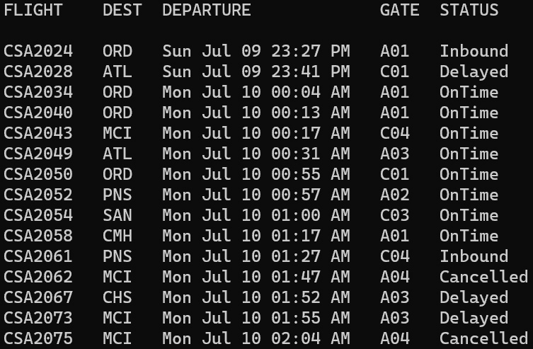

图 4.1 – FlightTracker 显示出发航班状态

`FlightTracker` 类包含许多与管理和显示航班相关的方法。它由表示系统中单个航班的 `Flight` 类和支持表示航班所有相关状态的 `FlightStatus` 枚举类支持，如图 *图 4.2* 所示：

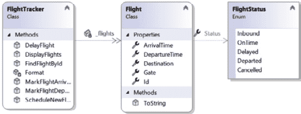

图 4.2 – 展示 FlightTracker 和支持类的类图

我们将在本章中探讨这些代码片段，但就目前而言，我们需要了解 `FlightTracker` 的关键职责包括以下内容：

+   跟踪航班列表

+   安排新的航班（将其添加到列表中）

+   标记航班为到达、出发或延误

+   显示所有航班

+   通过航班 ID 查找航班

这是一个相当简单的航班跟踪器类，但我们在下一章中将会看到一个稍微复杂一点的版本，届时我们将探讨面向对象的重构。

现在，让我们看看我们可以采取的一些简单步骤来改进这些方法。

# 重构方法

在本节中，我们将探讨与方法和它们交互相关的一系列重构。我们将从讨论方法访问修饰符开始。

## 更改方法访问修饰符

在我担任专业 C# 教练的时间里，我注意到我的学生往往不太考虑他们在代码中使用的 **访问修饰符**。具体来说，我的学生通常会做以下两件事之一：

+   他们默认将所有方法标记为 **public**，除非有人（通常是本人）建议他们使用不同的访问修饰符

+   他们默认将所有方法标记为 **private**（或者完全省略访问修饰符，默认为 **private**），直到编译器给出问题，要求他们使方法更易于访问

这两种方法都不足以简单的原因：我们希望明确声明我们方法的可见级别。这样，每次阅读代码时，你都会通过访问修饰符明确地提醒你其他代码可以访问你正在处理的代码。这在处理可以在类外引用的非私有方法时尤其有用。

访问修饰符

截至 C# 12，C# 有几个访问修饰符来控制其他区域可以引用你的代码。当前的访问修饰符有 `public`、`private`、`protected`、`internal`、`protected internal`、`private internal` 以及新的 `file` 访问修饰符，该修饰符限制了对单个源文件内某物的访问。虽然这些访问修饰符都有其用途，但为了简单起见，我将主要关注本节中的 `public` 和 `private`。

如果我们将方法标记为 **public**、**protected** 或 **internal**，那么应该有很好的理由——通常与该方法是我们打算让他人使用我们代码的主要方式有关。

我们的 `FlightTracker` 类有一个名为 `FindFlightById` 的 `public` 方法，该方法被类中的大多数其他方法使用，但类外部的任何地方都没有使用。此方法通过 `ID` 查找航班，如果找到则返回：

```cs
public Flight? FindFlightById(string id) {
  return _flights.Find(f => f.Id == id);
}
```

在这种情况下，你可能会明确决定将方法标记为 `private`，限制其在类内的使用，如下面的代码所示：

```cs
private Flight? FindFlightById(string id) {
  return _flights.Find(f => f.Id == id);
}
```

通过将此方法标记为 `private`，你将来在重命名它、更改其工作方式、修改其参数或完全删除它时拥有更大的自由度。

如果类外没有使用该方法，更改访问修饰符通常是安全的。否则，此决定将导致编译器错误。

## 重命名方法和参数

让我们来看看 `FlightTracker` 中用于管理航班的三个非常相似的方法：

```cs
public Flight? DelayFlight(string fId, DateTime newTime) {
  // Details omitted
}
public Flight? MarkFlightArrived(DateTime time, string id){
  // Details omitted
}
public Flight? MarkFlightDeparted(string id, DateTime t) {
  // Details omitted
}
```

这些方法都接受一个 `DateTime` 和一个航班标识符字符串。然而，这些参数的命名以及这些方法本身并不非常一致。

`DelayFlight` 调用其航班 ID 变量为 `fId`，以及新的出发时间为 `newTime`。`MarkFlightArrived` 使用 `time` 表示到达时间，而使用 `id` 表示航班标识符。`MarkFlightDeparted` 使用 `id`，但选择了 `t` 来表示出发时间。

虽然这些命名选择中的一些比其他的好，但同一类方法中命名的不一致性可能会损害其他人有效使用你的代码的能力。这可能会让他们对你的能力感到不那么自信，甚至可能因为对参数或方法代表的内容理解错误而引入错误 – 所有这些都归因于缺乏一致性。

为了解决这个问题，我们可以使用*重命名参数*重构来重命名单个参数以确保一致性。这可以通过右键单击一个参数并从上下文菜单中选择**重命名…**来完成，或者在选择参数时按*Ctrl* + *R*两次。参见*图 4.3*：


图 4.3 – 通过上下文菜单激活重命名参数重构

接下来，输入你想要使用的参数的新名称，然后按*Enter*键完成更改。参见*图 4.4*：


图 4.4 – 重命名参数

在选择名称时，你希望选择一些清晰且与你在类中已经使用的术语和名称一致的东西。尽可能避免使用非常短的单字母参数（排除一些情况，例如坐标的`x`和`y`或其他短参数名的既定用法）。

在这个代码的例子中，我选择将所有航班标识符重命名为`id`，并选择更明确地命名`DateTime`参数，以表明参数代表的内容。

我还选择使用相同的重命名工具来重命名整个`DelayFlight`方法为`MarkFlightDelayed`，以便与其他类中的方法保持一致性：

```cs
public Flight? MarkFlightDelayed(
  string id, DateTime newDepartureTime) {
  // Details omitted
}
public Flight? MarkFlightArrived(DateTime arrivalTime,
  string id) {
  // Details omitted
}
public Flight? MarkFlightDeparted(string id,
  DateTime departureTime) {
  // Details omitted
}
```

这些名称中的一些可能比我想要的要长一些（尤其是在尝试将代码放入一本书的页面时！），但清晰的参数和方法名称可以节省很多困惑，甚至可以防止以后发生某些错误。

注意

如果参数顺序的不一致让你感到烦恼，不用担心。我们将在本章后面修复参数顺序。

## 重载方法

让我们转换一下话题，谈谈方法如何协同工作。首先，我们将看看一个**重载**的例子，然后是一个**链式调用**的例子。

让我们先看看`ScheduleNewFlight`方法：

```cs
public Flight ScheduleNewFlight(string id, string dest,
  DateTime depart, string gate) {
  Flight flight = new() {
      Id = id,
      Destination = dest,
      DepartureTime = depart,
      Gate = gate,
      Status = FlightStatus.Inbound
  };
  _flights.Add(flight);
  return flight;
}
```

此方法接受四个代表航班信息的参数。它使用它们来实例化一个`Flight`对象，将航班添加到私有航班列表中，然后返回新创建的`Flight`对象。

随着系统的增长，合理地预期有人可能想要提供自己的`Flight`对象。为了适应这一点，你可以重载`ScheduleNewFlight`方法。

重载

重载是在提供与另一个方法相同名称的方法，但具有不同参数类型集的方法。例如，你可以有一个接受 `int` 类型的参数的方法，另一个接受两个 `string` 类型的参数的方法，但你不能有两个都只接受单个 `int` 参数的方法，即使参数名称不同。从编译器的角度来看，重载方法是完全独立的方法，只是恰好具有相同的名称。

接受 `Flight` 对象的重载 `ScheduleNewFlight` 方法可能看起来像以下这样：

```cs
public Flight ScheduleNewFlight(Flight flight) {
  _flights.Add(flight);
  return flight;
}
```

重载 `ScheduleNewFlight` 方法是有帮助的，因为它有助于人们发现基于 Visual Studio 的建议进行航班安排的不同选项，如图 *图 4.5* 所示：

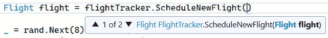

图 4.5 – Visual Studio 建议显示 ScheduleNewFlight 可用的重载

通过提供重载、遵循标准约定、保持方法和参数的一致性和可预测性，你帮助他人发现如何安全有效地使用你的类。

## 方法链式调用

你可能已经注意到了我们两个 `ScheduleNewFlight` 重载之间的一些重复行。让我们并排查看它们以供参考：

```cs
public Flight ScheduleNewFlight(string id, string dest,
  DateTime depart, string gate) {
  Flight flight = new() {
      Id = id,
      Destination = dest,
      DepartureTime = depart,
      Gate = gate,
      Status = FlightStatus.Inbound
  };
  _flights.Add(flight);
  return flight;
}
public Flight ScheduleNewFlight(Flight flight) {
  _flights.Add(flight);
  return flight;
}
```

虽然这种重复非常微小，但我可以预见会有新的需求出现，这需要改变这两个地方。例如，业务可能要求每次安排新的航班时，都应该写入日志条目，或者可能需要将新的 `LastScheduleChange` 属性设置为当前时间。

当这些类型的更改发生时，如果开发者没有更改所有受影响的区域，他们就有引入错误的风险。这意味着代码重复，即使是像这个例子中这样的微小代码重复，如果没有更新所有具有类似逻辑的地方，会导致额外的工作和额外的错误来源。

有助于这一点的是 **方法链式调用**。方法链式调用是指一个方法调用另一个相关方法，并让它为自己完成工作。

在这种情况下，我们可以修改我们的第一个 `ScheduleNewFlight` 方法，使其负责创建一个 `Flight` 对象，然后将该对象传递给其他 `ScheduleNewFlight` 重载，如下所示：

```cs
public Flight ScheduleNewFlight(string id, string dest,
  DateTime depart, string gate) {
  Flight flight = new() {
      Id = id,
      Destination = dest,
      DepartureTime = depart,
      Gate = gate,
      Status = FlightStatus.Inbound
  };
  return ScheduleNewFlight(flight);
}
public Flight ScheduleNewFlight(Flight flight) {
  _flights.Add(flight);
  return flight;
}
```

不仅代码更少，而且如果我们需要更改安排新航班时发生的事情，我们现在只需要修改一个地方。

现在我们已经介绍了一些方法重构的基础知识，让我们简要地看看与 **构造函数** 的相似之处。毕竟，构造函数本质上是一种特殊的方法，当对象被实例化时会被调用。

# 重构构造函数

当你考虑构造函数的工作时，其存在的全部原因就是将对象置于正确的初始位置。一旦构造函数完成，对象通常被认为可以供其他代码使用。

这意味着构造函数可以非常方便地确保某些信息已就绪。

目前，我们的 `Flight` 类定义得相当简单，并且只有 .NET 在没有显式构造函数的情况下提供的默认构造函数：

Flight.cs

```cs
public class Flight {
    public string Id { get; set; }
    public string Destination { get; set; }
    public DateTime DepartureTime { get; set; }
    public DateTime ArrivalTime { get; set; }
    public string Gate { get; set; }
    public FlightStatus Status { get; set; }
    public override string ToString() {
        return $"{Id} to {Destination} at {DepartureTime}";
    }
}
```

我们 `Flight` 类缺少任何显式构造函数的问题在于，没有这些信息之一，航班就没有意义。

虽然较新的 C# 版本已经为我们提供了诸如 `required` 关键字之类的功能，我们将在 *第十章* 中探讨，但要求在对象创建时提供某些信息的经典方法是将构造函数作为参数接收。为了演示这一点，让我们添加一个参数化构造函数。

## 生成构造函数

虽然我们可以手动编写构造函数，但 Visual Studio 提供了一些优秀的代码生成工具，包括一个 *生成* *构造函数* 重构功能。

要使用此重构功能，请选择类并打开 **快速操作** 菜单。然后，选择 **生成构造函数…**，如图 *图 4**.6* 所示：

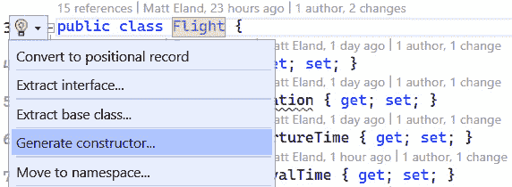

图 4.6 – 生成构造函数

这将打开一个对话框，允许你选择在创建 `Flight` 时从构造函数初始化哪些成员，如图 *图 4**.7* 所示：

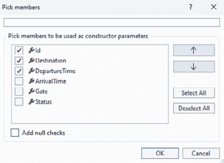

图 4.7 – 为构造函数选择所需的成员

在这种情况下，我选择将 `Id`、`Destination` 和 `DepartureTime` 作为构造函数的一部分，并留出其他选项未选中。我还取消选中了 **添加空检查** 复选框，以防止生成的代码对于这个示例来说过于复杂。

这生成了以下构造函数：

```cs
public Flight(string id, string destination,
  DateTime departureTime) {
  Id = id;
  Destination = destination;
  DepartureTime = departureTime;
}
```

生成的代码根据其参数正确地设置了所需的属性。

如果你愿意，你可以返回并生成一个具有不同参数集的新构造函数，因为类可以有任意数量的重载构造函数。

事实上，我们将在下一节中添加另一个构造函数来演示这一点。然而，目前我们遇到了一个需要解决的问题，表现为构建错误：

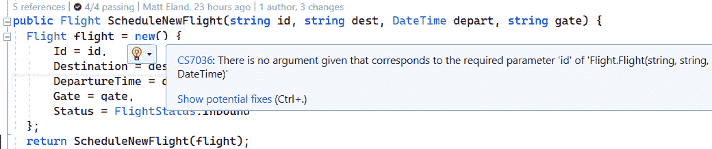

图 4.8 – 尝试实例化一个 Flight 实例时的构建错误

如果你在添加 `Flight` 构造函数后尝试构建你的项目，你会看到一个类似于 *图 4**.8* 中显示的错误。这个“没有给出与所需参数对应的参数”错误存在是因为 `ScheduleNewFlight` 中的 `Flight flight = new()` 代码试图调用 `Flight` 的默认构造函数，但该构造函数已不再存在。

当我们刚才添加构造函数时，这并没有将 `Flight` 类从没有构造函数的状态转变为只有一个构造函数。相反，我们是从拥有没有任何参数的 .NET 默认构造函数转变为拥有我们生成的新参数的一个构造函数，完全移除了默认构造函数。

我们可以通过显式定义来手动添加默认构造函数：

```cs
public Flight() {
}
```

这个构造函数除了允许通过不向构造函数提供任何参数来实例化类之外，不做任何事情。一旦你声明了自己的构造函数，.NET 就不再为你提供默认构造函数。

为了修复这个编译器错误，我们可以添加一个不带参数的新构造函数，或者我们可以调整 `ScheduleNewFlight` 代码以使用我们新的构造函数而不是不再存在的默认构造函数。

由于添加新构造函数的部分意图是在对象创建时要求某些信息，因此将 `ScheduleNewFlight` 改为使用新构造函数更有意义，如下所示：

FlightTracker.cs

```cs
public Flight ScheduleNewFlight(string id, string dest,
  DateTime depart, string gate) {
  Flight flight = new(id, dest, depart) {
      Gate = gate,
      Status = FlightStatus.Inbound
  };
  return ScheduleNewFlight(flight);
}
```

这样做的副作用之一是，我们不再需要在对象初始化器中设置那些属性，因为构造函数会为我们完成这个工作。

## 链式连接构造函数

之前，我们看到了如何通过链式调用重载的方法来共同工作，以减少代码重复。我还暗示构造函数实际上只是特殊的方法。当你有多个构造函数时，它们的行为就像重载方法一样。

我们可以通过将所有这些概念结合起来，通过**链式连接构造函数**，所以一个构造函数调用另一个构造函数。

首先，让我们看看一个**不**这样做的情况的例子：

Flight.cs

```cs
public Flight(string id, string destination,
  DateTime departureTime) {
  Id = id;
  Destination = destination;
DepartureTime = departureTime;
}
public Flight(string id, string destination,
  DateTime departureTime, FlightStatus status) {
  Id = id;
  Destination = destination;
  DepartureTime = departureTime;
  Status = status;
}
```

这里，我们有 `Flight` 的两个构造函数，它们几乎完全相同，除了第二个构造函数还接受一个 `status` 参数。

虽然这并不是大量的重复，但可以通过使用 `: this()` 语法链式连接构造函数来避免，如下所示：

```cs
public Flight(string id, string destination,
  DateTime departureTime) {
  Id = id;
  Destination = destination;
  DepartureTime = departureTime;
}
public Flight(string id, string destination,
  DateTime departureTime, FlightStatus status)
  : this(id, destination, departureTime) {
  Status = status;
}
```

在这种情况下，第二个 `Flight` 构造函数首先通过使用 `: this` 调用第一个构造函数。一旦这个调用完成，控制权将返回到第二个构造函数，并执行 `Status = status;` 这一行。

链式连接构造函数会给你的代码增加一点复杂性，但同时也减少了重复代码，使得你可以在一个地方添加新的初始化逻辑，而多个构造函数都可以利用这个添加。

# 重构参数

现在我们已经探讨了方法和构造函数的基础知识，让我们谈谈管理参数。这很重要，因为思考不周的参数可能会迅速降低你代码的可维护性。

让我们看看你会在方法的生命周期中想要执行的一些常见重构。

## 重新排序参数

有时，你会意识到方法中参数的顺序可能不如另一种排列合理。在其他时候，你可能会注意到一些方法接受相同类型的参数，但顺序不一致。在任何情况下，你都会发现自己想要重新排列方法参数。

让我们看看之前看到的 `MarkX` 方法中的一个实际例子：

FlightTracker.cs

```cs
public Flight? MarkFlightDelayed(string id,
  DateTime newDepartureTime) {
  // Details omitted...
}
public Flight? MarkFlightArrived(DateTime arrivalTime,
  string id) {
  // Details omitted...
}
public Flight? MarkFlightDeparted(string id,
  DateTime departureTime) {
  // Details omitted...
}
```

在这里，我们有三个方法，它们都接受 `string` 和 `DateTime` 参数，但它们的顺序不一致。

在这种情况下，查看这三个方法，你决定最直观的顺序是将航班 ID 放在第一位，然后是时间组件作为第二个参数。这意味着 `MarkFlightDelayed` 和 `MarkFlightDeparted` 是正确的，但 `MarkFlightArrived` 需要调整。

你可以通过选择要重构的方法，然后从**快速操作**菜单中选择**更改签名…**，在 Visual Studio 的相同重构对话框中添加、删除和重新排列参数，如图 *图 4.9* 所示：

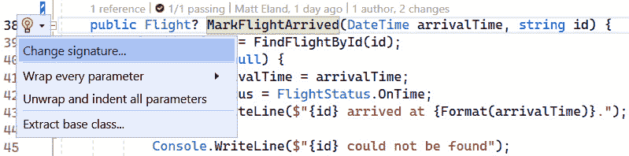

图 4.9 – 触发更改签名…重构

这将弹出**更改签名**对话框（见 *图 4.10*），并允许你使用右上角的上下按钮重新排列参数，直到预览中的顺序符合你的预期：

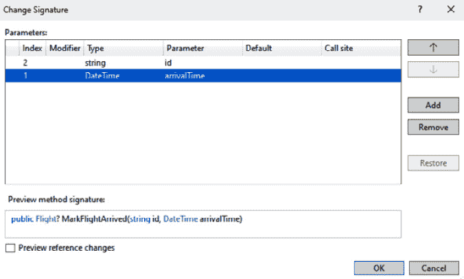

图 4.10 – 在更改签名对话框中重新排列参数

完成后，点击**确定**，Visual Studio 将更新你的方法以及所有调用该方法的内容，以使用修订后的参数顺序。

小贴士

使用 C# 有其他方法可以使方法所需的参数更加明确，其中一种方法就是使用 C# 的**命名参数**功能，允许你通过冒号后跟参数名来指定方法参数，从而使参数使用更加明确。

使用此方法调用我们的 `MarkFlightArrived` 方法的例子将是 `MarkFlightArrived(arrivalTime:DateTime.Now, id:"MyId")`。注意，当使用命名参数时，你可以按你喜欢的任何顺序指定参数。有关更多详细信息，请参阅 *进一步阅读* 部分。

## 添加参数

有时，你可能想给你的方法添加一个新参数。最自然的事情通常是将其添加到参数列表的末尾。然而，这有两个缺点：

+   新参数如果添加到列表的末尾而不是参数序列的早期，可能不太合理

+   手动添加参数意味着你现在必须手动调整所有调用你的方法的内容，并为参数提供一个新值

让我们看看一个实际例子，看看**更改签名**对话框如何有所帮助。

`MarkFlightArrived` 方法目前通过 `Id` 查找航班，然后更新其到达时间和状态以匹配参数：

```cs
public Flight? MarkFlightArrived(string id,
  DateTime arrivalTime) {
  Flight? flight = FindFlightById(id);
  if (flight != null) {
    flight.ArrivalTime = arrivalTime;
    flight.Status = FlightStatus.OnTime;
    Console.WriteLine($"{id} arrived at {Format(arrivalTime)}.");
    } else {
      Console.WriteLine($"{id} could not be found");
    }
    return flight;
}
```

假设我们需要更新这个方法，以便它能够接收飞机应该滑行到的航站楼。虽然我们可以手动将其添加到参数列表的末尾，但这会破坏所有调用此方法的函数。

目前，这并不是很多地方，因为只有测试在调用这个方法。

FlightTrackerTests.cs

```cs
Flight? actual =
  _target.MarkFlightArrived(flightId, arrivalTime);
```

然而，Visual Studio 中的**更改签名**重构工具在点击**添加**按钮时提供了一个更安全的选项：

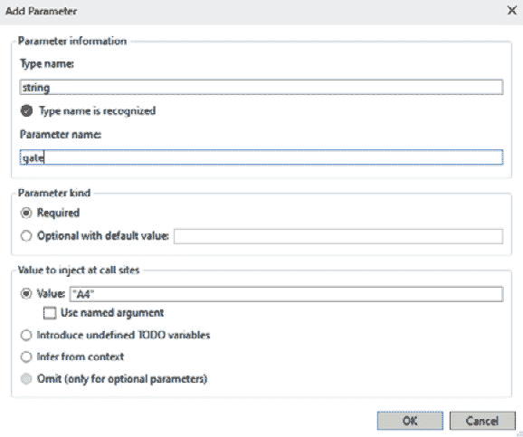

图 4.11 – 向 MarkFlightArrived 添加新的航站楼参数

**添加参数**对话框是 Visual Studio 中较为复杂的对话框之一，但它实际上只需要以下几件事情：

+   正在被添加的参数名称和类型

+   是否需要此参数（稍后将有更多介绍）

+   在已经调用该方法的地方使用该值

在这种情况下，我们的新参数将是一个名为 `gate` 的 `string` 类型。调用者必须提供值，而现有的调用者现在应使用 `"A4"` 字符串。

这种使用 `"A4"` 的方法可能看起来像是一个随机的字符串，因为它确实是。目前唯一使用这种方法的地方是一个单元测试，在那个测试中航站楼实际上并不重要。如果更多的地方使用这种方法，我可能会选择**从上下文推断**或**引入未定义**的**TODO**变量。

点击**确定**将再次显示**更改签名**对话框，其中列出了你的新参数，允许你按需重新排序。在此对话框中点击**确定**将添加参数到你的方法并更新你的代码。

这将更新 `MarkFlightArrived` 方法的签名以及调用你的代码的测试：

```cs
Flight? actual =
  _target.MarkFlightArrived(flightId, arrivalTime, "A4");
```

在新参数就位后，你可以更新 `MarkFlightArrived` 方法以使用它来设置航班的 `Gate` 属性：

```cs
public Flight? MarkFlightArrived(string id,
  DateTime arrivalTime, string gate) {
  Flight? flight = FindFlightById(id);
  if (flight != null) {
    flight.ArrivalTime = arrivalTime;
    flight.Gate = gate;
    flight.Status = FlightStatus.OnTime;
    Console.WriteLine($"{id} arrived at {Format(arrivalTime)}.");
  } else {
    Console.WriteLine($"{id} could not be found");
  }
  return flight;
}
```

当你发现自己需要扩展方法以接受新参数时，这个工作流程是一个常见的流程。

接下来，让我们看看一些使用可选参数简化方法调用的方法。

## 引入可选参数

如果你不喜欢**更改签名**对话框，而更愿意自己编写代码，你可以利用可选参数来安全地在参数列表末尾添加新的参数。

使用可选参数时，你指定一个默认值。调用你的方法的地方可以指定此参数的值，也可以不传递任何值。在没有传递值的情况下，将使用默认值。

注意

由于 C# 中可选参数的工作方式，这仅适用于参数列表末尾的参数。此外，编译器不允许某些类型的默认值，例如新对象和某些字面量。

如果你希望将`gate`参数声明为可选并默认为`"TBD"`（代表“待定”），你的方法看起来会像下面这样：

```cs
public Flight? MarkFlightArrived(string id,
  DateTime arrivalTime, string gate = "TBD") {
  // Details omitted...
}
```

调用你的方法的代码可以保持其先前的状态：

```cs
Flight? actual =
  _target.MarkFlightArrived(flightId, arrivalTime);
```

在这里，代码可以编译，但“TBD”将用于`gate`。

或者，你可以通过为该参数提供一个值来手动指定`gate`的值：

```cs
Flight? actual =
  _target.MarkFlightArrived(flightId, arrivalTime, "A4");
```

可选参数不仅可以用于扩展方法，还可以提供常见的默认值，调用者可以根据需要自定义。

## 移除参数

目前，代码要求你在安排新航班时指定航站楼：

```cs
public Flight ScheduleNewFlight(string id, string dest, DateTime depart, string gate) {
    Flight flight = new(id, dest, depart) {
        Gate = gate,
        Status = FlightStatus.Inbound
    };
    return ScheduleNewFlight(flight);
}
```

假设你决定，由于航站楼现在在到达时分配，你不需要在安排新航班时指定`gate`。

虽然你可以直接从代码中移除`gate`参数，但这不会更新调用该方法的任何方法，并会导致你必须解决的编译错误。

相反，你可以使用**更改签名**对话框，选择要删除的参数，然后点击**删除**，如图*图 4.12*所示：

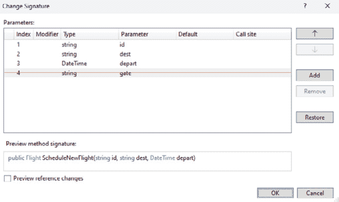

图 4.12 – 从 ScheduleNewFlight 中移除 gate 参数

当你点击`gate`参数时。

当然，这并不是魔法，它将留下依赖于该`gate`参数的代码或放置在准备传递给`ScheduleNewFlight`的值的代码。尽管如此，重构在清理方法定义和该方法的直接调用方面做得非常出色。

将重构应用于移除`gate`参数，结果是一个更简单的方法：

```cs
public Flight ScheduleNewFlight(string id, string dest,
  DateTime depart) {
    Flight flight = new(id, dest, depart) {
        Status = FlightStatus.Inbound
    };
    return ScheduleNewFlight(flight);
}
```

现在我们已经介绍了方法、构造函数和参数的基础知识，让我们深入了解重构方法的更具冒险性的方面：与函数一起工作。

# 重构为函数

在本节中，我们将探讨与**函数式编程**相关的重构方面。函数式编程是一种编程方法，它关注函数及其交互，而不是仅仅关注对象和类。

函数式编程在过去十年中变得更加流行，这种流行趋势影响了 C#语言，并添加了新的语法形式。

我们将探讨与函数式编程相关的几个语法改进，并看看它们如何帮助编写简洁灵活的程序。虽然这不是一本关于函数式编程的书，但在这个章节和*第十章*“防御性编程技术”中，我们仍将探索这些概念中的一些。

## 使用表达式主体成员

要开始尝试更函数式的语法，让我们看看`FlightTracker`中的`FindFlightById`方法：

```cs
private Flight? FindFlightById(string id) {
    return _flights.FirstOrDefault(f => f.Id == id);
}
```

显然，这是一个非常简短的方法，只有一条语句。同时，此方法占据了屏幕的三行。由于开发者通常在每个方法上方和下方留出空白行，因此这个简单的方法占据了屏幕的五行。这五行可能是屏幕可见区域的一个重要部分，如图 *图 4*.13* 所示：

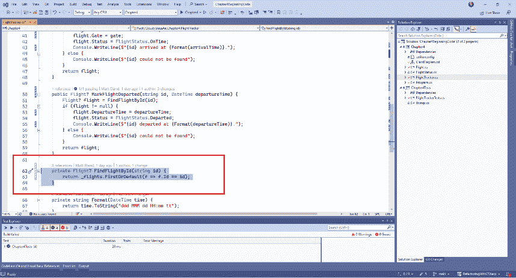

图 4.13 – 单语句方法的视觉影响

相反，我们可以利用表达式体成员，通过在**快速操作**菜单上激活**使用表达式体进行方法重构**来将我们的方法转换为单行声明，如图 *图 4*.14* 所示：

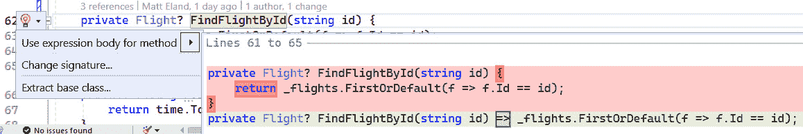

图 4.14 – 触发方法重构的 Use 表达式体

这将我们的代码转换为以下更简洁的格式：

```cs
FindFlightById(string id) =>
  _flights.FirstOrDefault(f => f.Id == id);
```

这种风格仅适用于单行实现，并不适合所有人。然而，如果你用它来编写简单代码，它可以帮助减少在大型文件中许多小方法带来的“滚动惩罚”。

## 将带有动作的函数作为参数传递

虽然表达式体成员在功能上更接近函数语法而非函数式编程，但让我们转换一下思路，通过将方法视为可以存储在变量中并在其他方法之间传递的**动作**来体验一下可能实现的内容。

在讨论**如何**做之前，让我们通过查看 `FlightTracker` 中的 `MarkFlightX` 方法来探讨**为什么**我们要这样做。我们将从 `MarkFlightDelayed` 方法开始：

```cs
public Flight? MarkFlightDelayed(string id,
  DateTime newDepartureTime) {
  Flight? flight = FindFlightById(id);
  if (flight != null) {
    flight.DepartureTime = newDepartureTime;
    flight.Status = FlightStatus.Delayed;
    Console.WriteLine($"{id} delayed until        {Format(newDepartureTime)}");
  } else {
    Console.WriteLine($"{id} could not be found");
  }
  return flight;
}
```

此方法执行以下几项离散操作：

+   它通过航班 ID 搜索航班

+   如果找到航班，它将更新航班上的属性并输出延误

+   如果找不到航班，将在控制台写入警告

单独来看，这种方法是可行的。现在让我们看看 `MarkFlightDeparted` 方法：

```cs
public Flight? MarkFlightDeparted(string id,
  DateTime departureTime) {
  Flight? flight = FindFlightById(id);
  if (flight != null) {
    flight.DepartureTime = departureTime;
flight.Status = FlightStatus.Departed;
    Console.WriteLine($"{id} departed at {Format(departureTime)}.");
  } else {
    Console.WriteLine($"{id} could not be found");
  }
  return flight;
}
```

将此方法与上一个方法进行比较，你会发现它们之间几乎没有差异。该方法仍然必须通过其 ID 查找航班，检查是否找到了航班，并更新航班。此方法中唯一的区别是更新航班的内容以及写入控制台的消息。

让我们通过查看 `FlightTracker` 中的 `MarkFlightArrived` 方法来完善对这些方法的探讨：

```cs
public Flight? MarkFlightArrived(string id,
  DateTime arrivalTime, string gate = "TBD") {
  Flight? flight = FindFlightById(id);
  if (flight != null) {
    flight.ArrivalTime = arrivalTime;
    flight.Gate = gate;
    flight.Status = FlightStatus.OnTime;
    Console.WriteLine($"{id} arrived at {Format(arrivalTime)}.");
  } else {
    Console.WriteLine($"{id} could not be found");
  }
  return flight;
}
```

在这里，模式重复出现。这三个方法之间唯一的重大区别是如果找到航班会发生什么。

以这种方式思考，考虑以下伪代码：

```cs
Flight? flight = FindFlightById(id);
if (flight != null) {
  ApplyUpdateToFlight(flight);
} else {
  Console.WriteLine($"{id} could not be found");
}
return flight;
```

在这里，`ApplyUpdateToFlight` 是一个占位符，代表我们可以应用于航班对象的某个方法或函数。这是因为我们采取的 *动作* 是这里唯一变化的东西。

事实上，.NET 有一个名为 `Action` 的类可以用来完成这个目的：

```cs
private Flight? UpdateFlight(string id,
  Action<Flight> updateAction) {
  Flight? flight = FindFlightById(id);
  if (flight != null) {
    updateAction(flight);
  } else {
    Console.WriteLine($"{id} could not be found");
  }
  return flight;
}
```

在这里，`updateAction` 参数代表一个可以调用的特定函数。它是哪个函数？我们不知道。确切的函数将由调用 `UpdateFlight` 方法的任何人提供——就像任何其他参数一样。

然而，因为 `updateAction` 被定义为 `Action<Flight>`，我们知道该函数接受一个 `Flight` 类型的单个参数，这就是为什么我们可以在调用此方法时向该函数提供该参数。

为了让 `Action` 语法更易于理解，让我们看看几个其他的签名：

+   `Action<int>` – 一个接受单个整数参数的函数

+   `Action<string, bool>` – 一个接受字符串然后是布尔值的函数

+   `Action` – 一个不接受任何参数的函数

现在声明 `Action` 参数在语法上更有意义，让我们看看我们的一个旧方法如何更新以使用这个新方法：

```cs
public Flight? MarkFlightDelayed(string id,
  DateTime newDepartureTime) {
  return UpdateFlight(id, (flight) => {
    flight.DepartureTime = newDepartureTime;
    flight.Status = FlightStatus.Delayed;
    Console.WriteLine($"{id} delayed to {Format(newDepartureTime)}");
  });
}
```

在这里，`MarkFlightDelayed` 方法直接调用 `UpdateFlight` 方法，并提供了 `(flight) => { }` 语法形式的 `Action<Flight>`。

当 `UpdateFlight` 方法运行时，它会检查航班是否存在，如果存在，该方法会调用我们提供的箭头函数来实际更新航班。

如果这个语法很难理解，这里有一个用本地变量来持有 `Action<Flight>` 的不同方式来表示相同的事情：

```cs
Action<Flight> updateAction = (flight) => {
  flight.DepartureTime = newDepartureTime;
  flight.Status = FlightStatus.Delayed;
  Console.WriteLine($"{id} delayed to {Format(newDepartureTime)}");
};
return UpdateFlight(id, updateAction);
```

毫无疑问，作为开发者，即使不声明 `Action` 变量，也能有一个快乐且富有成效的职业生涯。然而，我发现当我能够以离散的 `Action` 为术语进行思考时，它可以打开一些非常有趣和灵活的解决方案来解决问题。

## 使用 Funcs 从 Actions 返回数据

在我们继续讨论静态和扩展方法之前，让我们简要地看看 `Funcs`。

`Action` 代表一个可以调用并可能传递参数的 *函数*。然而，尽管 `Actions` 不返回任何结果，`Funcs` 会返回。

让我们考察一个简单的 C# 方法，它将两个数字相加，并将结果显示在方程字符串中：

```cs
public void AddAction(int x, int y) {
    int sum = x + y;
    Console.WriteLine($"{x} + {y} is {sum}");
}
```

此方法具有 `void` 返回类型，这意味着它不返回任何值。因此，它可以存储在 `Action` 中并以这种方式调用：

```cs
Action<int, int> myAction = AddAction;
myAction(2, 2);
```

现在，让我们看看 `Add` 方法的略微不同的版本：

```cs
public string AddFunc(int x, int y) {
    int sum = x + y;
    return $"{x} + {y} is {sum}";
}
```

在这里，`AddFunc` 的返回类型为 `string`。因为方法不再返回空值，所以它不再被视为 `Action`，现在被视为 `Func`，因为它返回了一些值。

因此，如果我们想存储对这个方法的引用，我们需要在 `Func` 中这样做，如下所示：

```cs
Func<int, int, string> myFunc = AddFunc;
string equation = myFunc(2, 2);
Console.WriteLine(equation);
```

注意，除了使用 `Func` 而不是 `Action` 之外，我们现在还有一个代表 `Func` 返回类型的第三个 `Func`。在 `myFunc` 的情况下，第三个泛型类型参数表示 `AddFunc` 返回一个 `string`。

`Action` 和 `Func` 非常相似，唯一的显著区别是 `Func` 返回一个值。在实践中，我倾向于在想要完成某事时使用 `Action`，例如在更新航班的早期示例中。另一方面，我倾向于使用 `Func` 来确定何时做某事或如何获取所需的特定值。

例如，我可能声明一个接受 `Func<Flight, bool>` 的方法，它使用它来确定从航班列表中显示的航班：

```cs
public void DisplayMatchingFlights(List<Flight> flights,
  Func<Flight, bool> shouldDisplay) {
  foreach (Flight flight in flights) {
    if (shouldDisplay(flight)) {
      Console.WriteLine(flight);
    }
  }
}
```

此方法为列表中的每个航班调用 `shouldDisplay` Func，以确定它是否应该显示。只有当 `shouldDisplay` Func 为该航班返回 `true` 时，航班才会显示。

这种结构允许同一方法用于不同的场景，包括以下内容：

+   列出即将到来的航班

+   列出延误的航班

+   列出前往特定机场的航班

这些之间的唯一区别是 `shouldDisplay` 参数的内容。

# 介绍静态方法和扩展方法

现在我们已经探索了一些方法重构的更多功能方面，让我们看看一些帮助革命化 .NET 的功能：**静态方法**和**扩展方法**。

## 使方法静态

有时，您的类将会有不直接与该类实例成员（字段、属性或非静态方法）工作的方法。例如，`FlightTracker` 有一个 `Format` 方法，它将 `DateTime` 转换为类似于“Wed Jul 12 23:14 PM”的字符串：

```cs
private string Format(DateTime time) {
    return time.ToString("ddd MMM dd HH:mm tt");
}
```

在这里，`Format` 不依赖于除了它提供的参数以外的任何东西来计算结果。正因为如此，我们可以将 `Format` 作为一个静态方法。

静态方法是与类本身相关联的方法，而不是与类的实例相关联的方法。因此，您不需要实例化类的实例来调用它们。C# 编译器还能够对静态代码进行偶尔的优化，这可能导致代码运行更快。

通常，静态方法也可以被认为是**纯方法**——也就是说，没有直接副作用的方法，当给定相同的输入时总是产生相同的结果。

如**图 4**.14 所示，您可以通过在访问修饰符后添加 `static` 关键字或通过在**快速操作**菜单中选择**使静态**选项来将方法标记为静态：

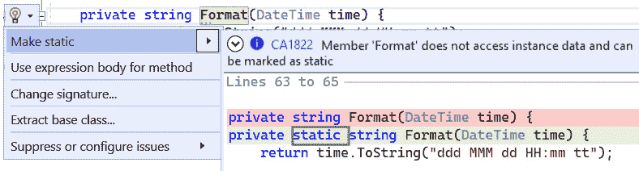

图 4.15 – 将方法移动到静态方法

**Format** 的静态版本看起来非常相似，并且几乎以相同的方式工作：

```cs
private static string Format(DateTime time) {
    return time.ToString("ddd MMM dd HH:mm tt");
}
```

`Format` 方法仍然可以通过 `Format(DateTime.Now)` 简单地调用，就像之前一样，但添加静态也允许您从类本身调用它，例如 `FlightTracker.Format(DateTime.Now)`。

将方法标记为静态有几个优点：

+   编译器可以做出优化，从而实现更快的运行时性能

+   代码可以在不实例化类的情况下调用静态方法

+   静态方法可以转换为扩展方法，我们将在后面看到。

由于这些附加功能，`static`关键字似乎可以在任何地方使用都是一件好事。不幸的是，`static`也有一些缺点。将方法标记为`static`也意味着它不能再调用非`static`方法或访问实例级数据。

当然，`static`有很多用途，但仍然有很多开发者认为它令人反感，或者认为过度使用是反模式。

个人而言，我认为`static`适用于“辅助方法”，在某些情况下，为了简化在测试场景中难以实例化的复杂类的单元测试，也是合适的。然而，我总是尽量避免将字段设置为`static`，因为`static`数据可能导致开发和测试应用程序时出现许多问题。

## 将静态成员移动到另一个类型

有时，静态方法保留在它开始的类中是没有意义的。

例如，我们的`Format`方法接受任何`DateTime`并返回适合 Cloudy Skies Airlines 业务需求的定制字符串。这种逻辑目前位于`FlightTracker`类中，而且与跟踪航班完全无关，可以在应用程序的任何地方都很有用。

在这种情况下，将`Format`拉入另一个类是有意义的，这样其他开发者可以更容易地发现这些格式化功能。

Visual Studio 为此提供了内置的重构功能。要使用它，请选择一个静态方法并打开**快速操作**菜单，然后点击**将静态成员移动到另一个类型...**，如图**4.16**所示。16：

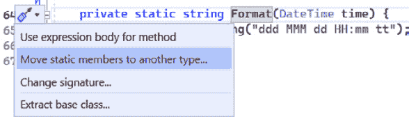

图**4.16** – 将静态成员移动到另一个类型

接下来，您将被提示选择要将静态方法移动到的类型。如果您目前没有适合此目的的类，这可以是新类的名称。对于 Cloudy Skies，没有现有的类型应该拥有这个，因此创建一个名为`DateHelpers`的类是有意义的。

此外，您将需要检查或取消检查您想要移动的静态方法，并有一个选项来**选择依赖项**（见图**4.17**）并选择任何您的选择静态方法调用的方法：


图**4.17** – 选择目标类型和要移动的成员

点击**确定**以移动您选择的方法并创建一个新类。

重要提示

Visual Studio 当前行为是保持您方法当前的可访问修饰符，并将新静态类创建为`internal`。如果您的该方法为`private`，这可能会引入编译错误，因为旧位置中的代码将无法访问您的代码。我建议将您的静态类及其方法更改为`public`以避免问题。

调整修饰符后的结果**静态类**如下：

```cs
public static class DateHelpers {
    public static string Format(DateTime time) {
        return time.ToString("ddd MMM dd HH:mm tt");
    }
}
```

现在我们有一个专门用于与日期和时间相关的“辅助方法”的专用类。

静态类

如果你不太熟悉静态类，静态类只能包含静态方法，不能被实例化或继承。静态类对于扩展方法是必需的。

我们刚才进行的重构还更新了任何使用旧`Format`方法的代码，使其指向`DateTimeHelpers.Format`。例如，在`FlightTracker`中，`MarkFlightArrived`方法的航班记录现在显示`Console.WriteLine($"{id} arrived at {DateHelpers.Format(arrivalTime)});`。

通过将静态成员拉入它们自己的专用类型，我们创建了一个可以存放与日期相关的逻辑并帮助各种类的地方，并且我们使`FlightTracker`类更加专注于其核心任务，而不是同时关注日期格式化和航班跟踪。

不幸的是，这个改动多少伤害了我们代码的可读性，因为调用者现在必须指定`DateHelpers.Format`而不是仅仅`Format`。一个扩展方法可以帮助解决这个问题，就像我们接下来要看到的那样。

## 创建扩展方法

扩展方法允许你通过添加自己的静态方法来“扩展”现有的类型，这些方法看起来就像该类型的一部分。

这可能听起来有些吓人，但如果你使用过 LINQ，你已经在实际中看到了扩展方法。让我们以`FlightTracker`中的`FindFlightById`方法为例：

```cs
private Flight? FindFlightById(string id) =>
    _flights.FirstOrDefault(f => f.Id == id);
```

在这里，`_flights`被定义为`List<Flight>`。鉴于查找航班 ID 的代码，人们可能会怀疑`List`必须有一个名为`FirstOrDefault`的方法；然而，它并没有。

相反，`System.Collections.Generic`命名空间中的`List<T>`类型并没有定义`FirstOrDefault`方法，而是在`System.Linq`命名空间中一个名为`Enumerable`的静态类中定义为一个扩展方法。

换句话说，将我们之前的代码重写为显式使用`Enumerable`类是完全可行的，如下所示：

```cs
private Flight? FindFlightById(string id) =>
    Enumerable.FirstOrDefault(_flights, f => f.Id == id);
```

虽然这段代码完全有效，但我从未见过与我共事的人以这种方式编写代码，因为将`FirstOrDefault`用作扩展方法要直观得多，可读性也更强。

这突出了扩展方法的关键点：*扩展方法允许你以似乎那些方法从一开始就存在于对象上的方式向现有类添加新功能*，从而产生更直观的代码。

要将方法声明为扩展方法，以下条件必须成立：

+   方法必须是静态的

+   方法必须在静态类内部

+   方法的第一个参数必须以`this`关键字开头

我们的`DateHelpers`类及其`Format`方法都是静态的，这意味着我们可以通过在方法签名中添加`this`关键字将方法转换为扩展方法：

```cs
public static class DateHelpers {
    public static string Format(this DateTime time) {
        return time.ToString("ddd MMM dd HH:mm tt");
    }
}
```

将静态方法移动到扩展方法并不意味着你必须将其用作扩展方法，因此我们之前的代码仍然可以编译。然而，为了最大限度地利用我们的扩展方法，我们应该更新之前的代码以利用其新的语法。

让我们再次看看`FlightTracker`中的`MarkFlightArrived`方法。这次，如果你删除`DateFormatHelpers.Format(arrivalTime)`，而是写`arrivalTime.For`，并允许 Visual Studio 的**IntelliSense**建议值，它将列出你的新扩展方法：

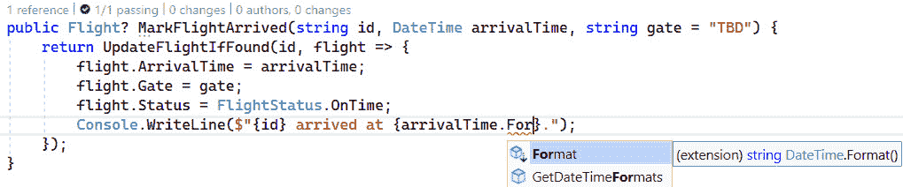

图 4.18 – IntelliSense 建议的新扩展方法

因为`arrivalTime`是`DateTime`类型，我们的扩展方法是为了在任意`DateTime`上工作而构建的，所以我们在.NET 中通过扩展方法的力量编写的新`Format`方法出现在这里。

重新编写对`arrivalTime.Format()`的调用会产生正确调用扩展方法的效果，从而带来更易读的体验。

如果你愿意，你仍然可以通过`DateHelpers.Format(arrivalTime)`调用`Format`方法。引入扩展方法只是为你提供了另一种语法结构的选择。

扩展方法的主要缺点如下：

+   扩展方法需要使用静态，这有些团队会避免，因为它往往会散布到你的代码中

+   使用扩展方法可能会让人感到困惑

+   新的扩展方法定义在哪里可能会让人感到困惑

幸运的是，Visual Studio 允许你通过简单地按住*Ctrl*并单击你想要导航到的任何方法、成员或类型来跳转到其定义。或者，你可以选择标识符并按键盘上的*F12*，或者右键单击它并选择**转到定义**来导航到扩展方法声明的位置。

# 审查和测试我们的重构代码

在本章的整个过程中，我们将重复的`FlightTracker`类重构，以确保其方法签名更加一致，并且尽可能重用常见逻辑。

重构后的代码

本章最终重构的代码可在[`github.com/PacktPublishing/Refactoring-with-CSharp`](https://github.com/PacktPublishing/Refactoring-with-CSharp)仓库中的`Chapter04/Ch4RefactoredCode`文件夹内找到。

在我们继续之前，我们应该确保所有测试仍然通过，通过从**测试**菜单运行单元测试，然后选择**运行所有测试**菜单项。

# 摘要

在本章中，我们看到了如何将各种方法、构造函数和参数重构应用于保持代码的整洁。我们看到了如何通过重载和链式调用方法和构造函数来提供更多选项，同时重命名、添加、删除和重新排序参数有助于确保一致性。

在本章接近尾声时，我们介绍了`Actions`、`Funcs`、静态方法和扩展方法，并展示了如何通过将代码视为小型、可重用的函数来更有效地解决某些类型的问题。

在下一章中，我们将介绍面向对象的重构技术，并通过探索如何通过提取类来控制大量参数来回顾本章中的参数重构。

# 问题

1.  你的代码中是否有任何区域，你似乎经常因为参数的顺序或命名而感到困惑？

1.  你能否想到你的代码中任何根据相同或类似条件执行稍微不同操作的地方？如果是这样，那么转向使用`Action`或`Func`是否有意义？

1.  你的代码中是否有一组“辅助方法”，这些方法可能适合将其设置为静态并放入静态类中？如果是这样，转向使用扩展方法是否会改善你代码的其他部分？

# 进一步阅读

你可以在以下 URL 中找到有关本章讨论的材料更多信息：

+   *重构为纯* *函数*：[`learn.microsoft.com/en-us/dotnet/standard/linq/refactor-pure-functions`](https://learn.microsoft.com/en-us/dotnet/standard/linq/refactor-pure-functions)

+   *面向操作* *C#*：[`killalldefects.com/2019/09/15/action-oriented-c/`](https://killalldefects.com/2019/09/15/action-oriented-c/)

+   *使用扩展方法重构* *方法*：[`learn.microsoft.com/en-us/dotnet/standard/linq/refactor-extension-method`](https://learn.microsoft.com/en-us/dotnet/standard/linq/refactor-extension-method)

+   *命名和可选* *参数*：[`learn.microsoft.com/en-us/dotnet/csharp/programming-guide/classes-and-structs/named-and-optional-arguments`](https://learn.microsoft.com/en-us/dotnet/csharp/programming-guide/classes-and-structs/named-and-optional-arguments)
