# 第二章：在 .NET 项目中消费诊断分析器

在上一章中，我们向您展示了如何编写诊断分析器来分析并报告有关 .NET 源代码的问题，并将它们贡献给 .NET 开发者社区。在本章中，我们将向您展示如何搜索、安装、查看和配置已在 NuGet 和 VS 扩展库上发布的分析器。我们将涵盖以下食谱：

+   通过 NuGet 包管理器搜索和安装分析器

+   通过 VS 扩展库搜索和安装 VSIX 分析器

+   在 Visual Studio 的解决方案资源管理器中查看和配置分析器

+   使用规则集文件和规则集编辑器配置分析器

# 简介

诊断分析器是 Roslyn C# 编译器和 Visual Studio IDE 的扩展，用于分析用户代码并报告诊断信息。用户在从 Visual Studio 构建项目后，甚至在命令行构建项目时，都会在错误列表中看到这些诊断信息。当在 Visual Studio IDE 中编辑源代码时，他们也会实时看到诊断信息。分析器可以报告诊断信息，以强制执行特定的代码风格，提高代码质量和维护性，推荐设计指南，甚至报告非常特定于特定领域的问题，这些问题无法由核心编译器覆盖。

分析器可以以 NuGet 包或 VSIX 的形式安装到 .NET 项目中。为了更好地理解这些打包方案，并了解将分析器作为 NuGet 包或 VSIX 安装时的分析器体验差异，建议您阅读第一章中关于如何发布分析器项目的食谱的介绍部分 *Publishing NuGet package and VSIX for an analyzer project*。

分析器支持各种不同版本的 .NET Standard、.NET Core 和 .NET Framework 项目，例如类库、控制台应用程序等。

# 通过 NuGet 包管理器搜索和安装分析器

在本食谱中，我们将向您展示如何在 Visual Studio 的 NuGet 包管理器中搜索和安装分析器 NuGet 包，并查看在项目构建中以及 Visual Studio 代码编辑期间的实时分析器诊断信息。

# 准备工作

您需要在您的机器上安装 Visual Studio 2017 才能完成此食谱。您可以从 [`www.visualstudio.com/thank-you-downloading-visual-studio/?sku=Community&rel=15`](https://www.visualstudio.com/thank-you-downloading-visual-studio/?sku=Community&rel=15) 安装 Visual Studio 2017 的免费社区版本。

# 如何操作...

1.  在 Visual Studio 2017 中创建一个 C# 类库项目，例如 `ClassLibrary`*。

1.  在解决方案资源管理器中，右键单击解决方案或项目节点，并执行“管理 NuGet 包”命令：

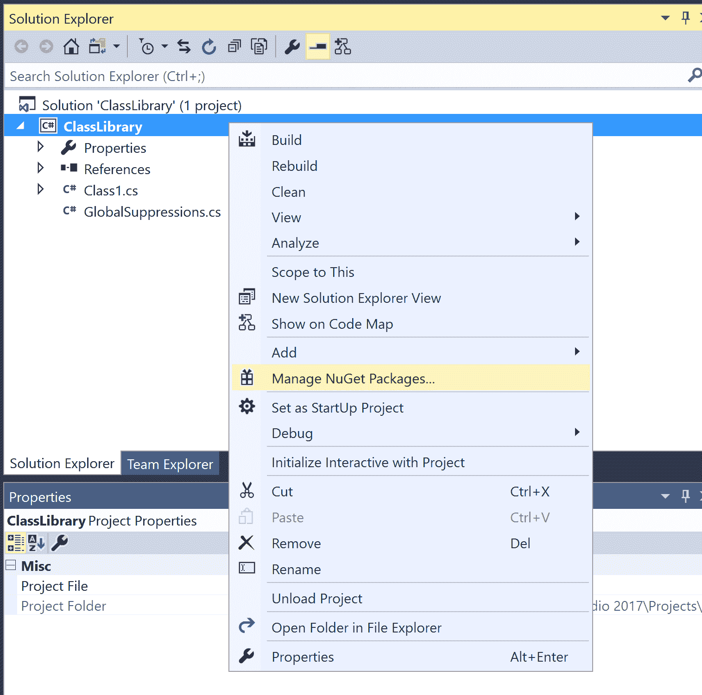

1.  这将打开 NuGet 包管理器，您可以使用它来搜索和安装 NuGet 包到解决方案或项目：


1.  在搜索栏中输入以下文本以查找标记为分析器的 NuGet 包：`Tags:"analyzers"`。

注意，一些知名包被标记为 `analyzer`，因此您可能还想搜索带有 `Tags:"analyzer"`**的标签**。

1.  通过搜索栏右侧的 Include prerelease 复选框选择或取消选择以搜索或隐藏预发布分析器包。包根据下载次数列出，下载次数最高的包位于顶部：


1.  选择要安装的包，例如 `System.Runtime.Analyzers`，并选择一个特定版本，例如 *1.1.0*，然后点击安装：

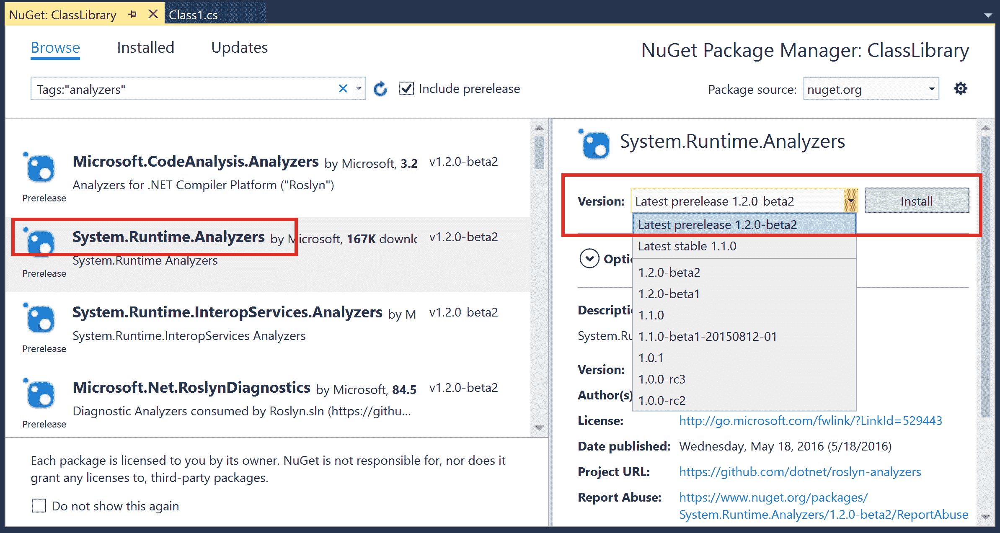

1.  在许可接受对话框中点击 I Accept 按钮，以安装 NuGet 包。

1.  验证在解决方案资源管理器中的分析器节点下显示的已安装分析器：

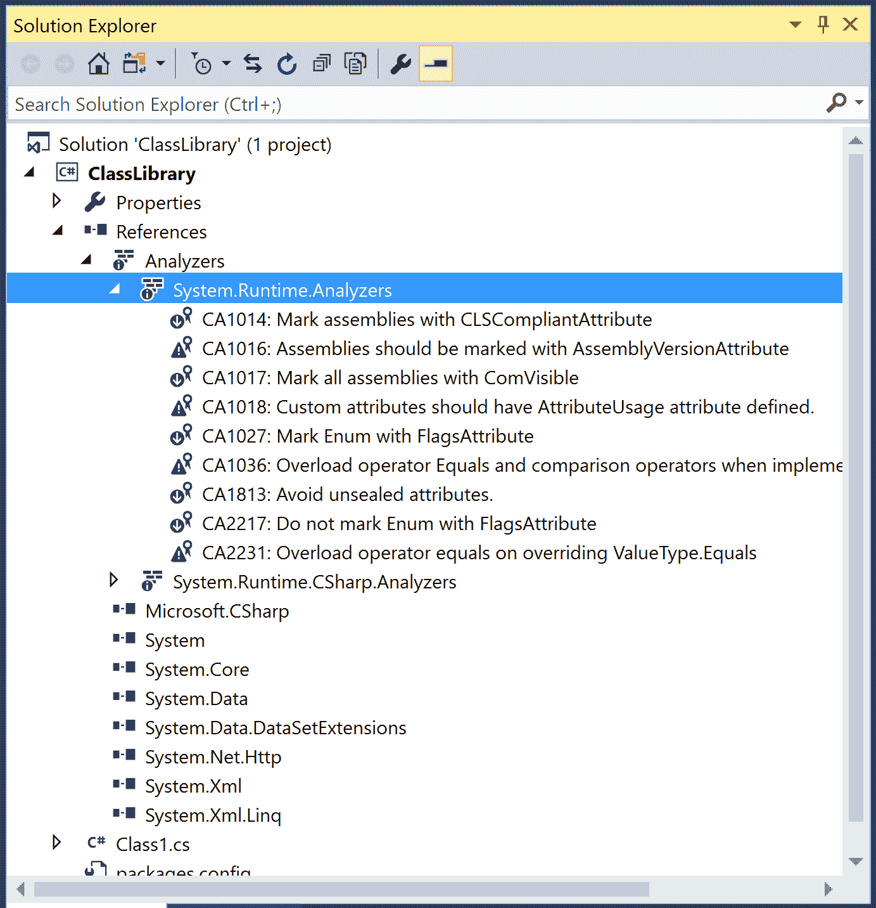

1.  验证项目文件是否包含一个包含以下分析器引用的新 `ItemGroup`，这些引用来自已安装的分析器包：

```cs
*<ItemGroup>
 <Analyzer Include="..\packages\System.Runtime.Analyzers.1.1.0\analyzers\dotnet\cs\System.Runtime.Analyzers.dll" />
 <Analyzer Include="..\packages\System.Runtime.Analyzers.1.1.0\analyzers\dotnet\cs\System.Runtime.CSharp.Analyzers.dll" />
 </ItemGroup>*

```

1.  将以下代码添加到您的 C# 项目中：

```cs
namespace ClassLibrary
{
  public class MyAttribute : System.Attribute
  {
  }
}

```

1.  验证错误列表中显示的已安装分析器的分析器诊断：

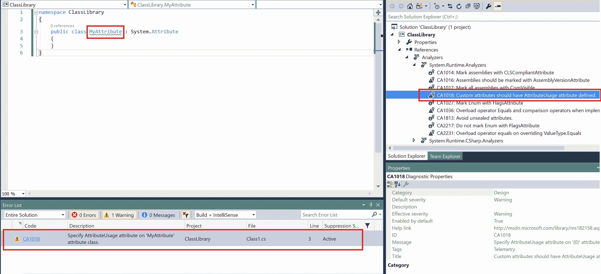

1.  打开 VS 2017 的开发者命令提示符并构建项目，以验证分析器是否在命令行构建上执行，并且分析器诊断是否被报告：


1.  在 VS 2017 中创建一个新的 C# 项目，并将与步骤 10 相同的代码添加到其中。验证错误列表或命令行中没有出现分析器诊断，以确认分析器包仅在步骤 1-6 中安装到所选项目。

注意，**CA1018**（自定义属性应该有 AttributeUsage 定义）在 `FxCop/System.Runtime.Analyzers` 包的未来版本中已被移动到单独的分析器程序集中。建议您从（[`www.nuget.org/packages/Microsoft.CodeAnalysis.FxCopAnalyzers`](https://www.nuget.org/packages/Microsoft.CodeAnalysis.FxCopAnalyzers)）安装 `Microsoft.CodeAnalysis.FxCopAnalyzers` NuGet 包以获取最新的 Microsoft 推荐的分析器组。

# 通过 VS 扩展库搜索和安装 VSIX 分析器

在本教程中，我们将向您展示如何在 Visual Studio 扩展管理器中搜索和安装分析器 VSIX 包，并查看安装的 VSIX 分析器诊断如何在 Visual Studio 代码编辑期间作为实时诊断亮起。

# 准备工作

您需要在您的机器上安装 Visual Studio 2017 以遵循此教程。您可以从 [`www.visualstudio.com/thank-you-downloading-visual-studio/?sku=Community&rel=15`](https://www.visualstudio.com/thank-you-downloading-visual-studio/?sku=Community&rel=15) 安装 Visual Studio 2017 的免费社区版本。

# 如何操作...

1.  在 Visual Studio 2017 中创建一个 C# 类库项目，例如 `ClassLibrary`。

1.  从顶级菜单中，导航到“工具”|“扩展和更新”。

1.  导航到对话框左侧选项卡上的“在线”|“Visual Studio 市场 place”，以查看 Visual Studio 扩展库/市场中的可用 VSIX：

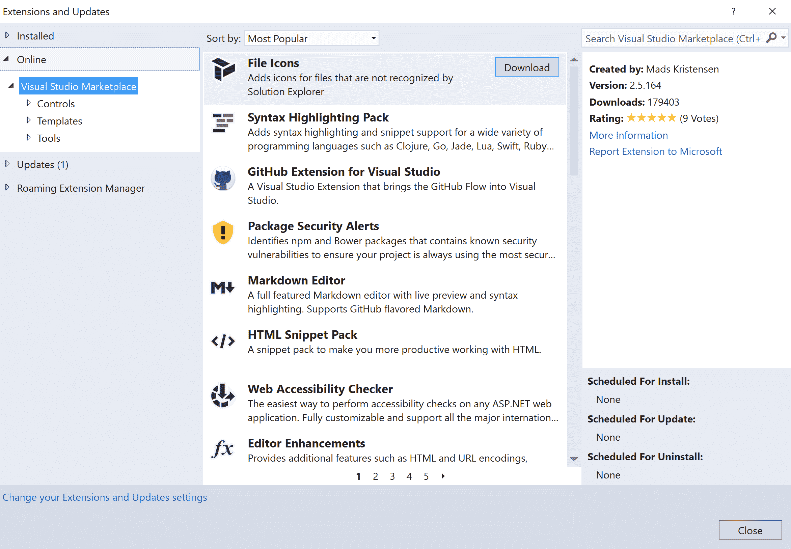

1.  在对话框右上角的搜索框中搜索 `analyzers`，下载一个分析器 VSIX，例如 `Refactoring Essentials for Visual Studio`：

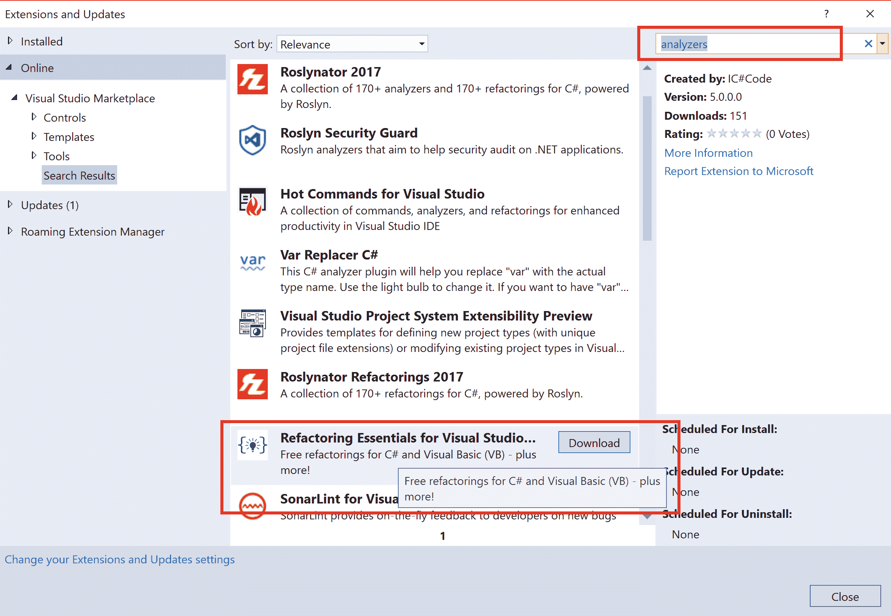

1.  下载完成后，你将在对话框底部收到一条消息，说明安装将在 Visual Studio 和相关窗口关闭后执行：

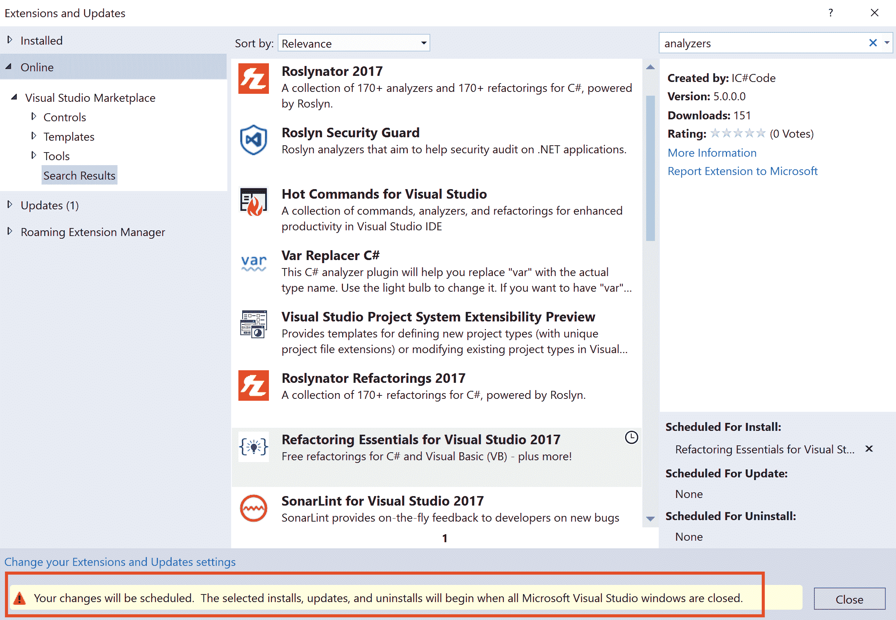

1.  关闭对话框，然后关闭 Visual Studio 实例以开始安装。

1.  在 VSIX 安装程序对话框中，单击“修改”以开始安装：

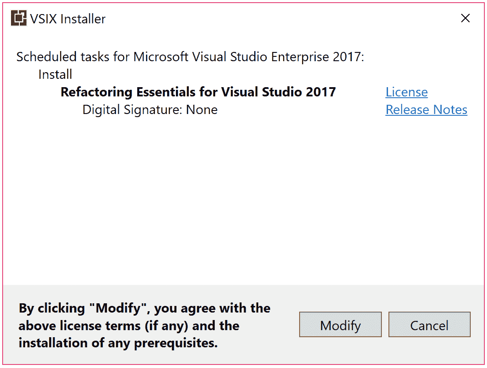

1.  随后的消息提示您终止所有活动的 Visual Studio 和辅助进程。保存所有相关工作，并在所有打开的 Visual Studio 实例中单击“结束任务**s**”以终止这些进程并安装 VSIX：

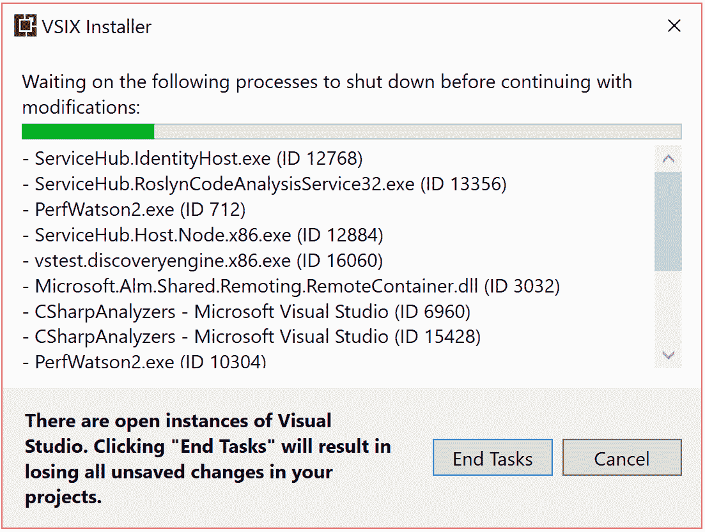

1.  安装完成后，重新启动 VS，点击“工具”|“扩展和更新”，并验证 `Refactoring Essentials VSIX` 是否已安装：

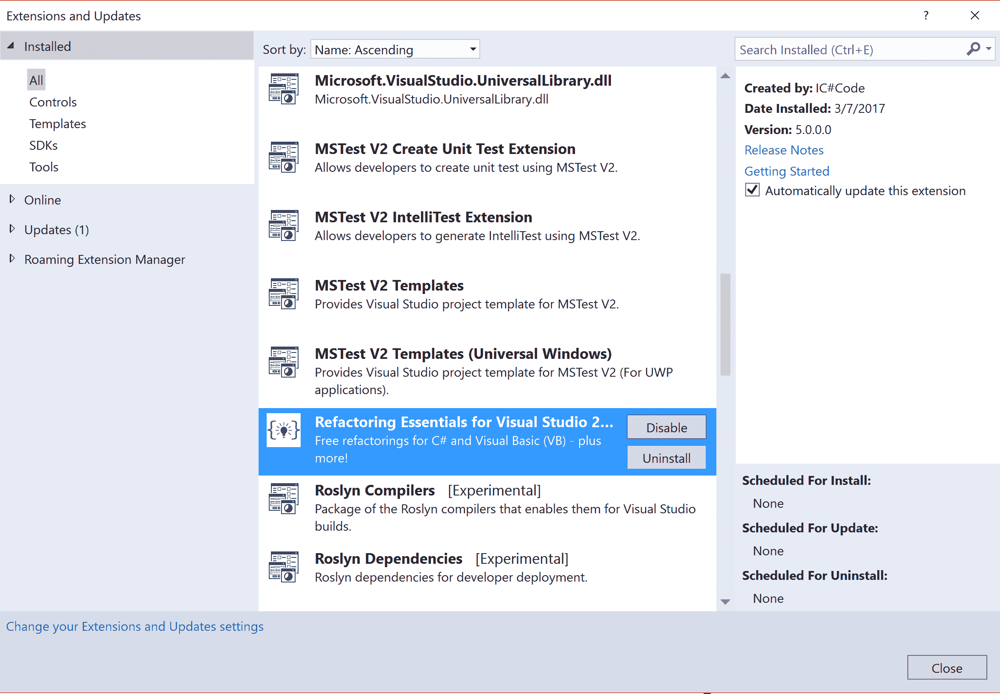

1.  创建一个具有以下源代码的新 C# 项目，并在错误列表中验证分析器诊断 *RECS0085* (*冗余数组创建表达式*)：

```cs
namespace ClassLibrary
{
  public class Class1
  {
    void Method()
    {
      int[] values = new int[] { 1, 2, 3 };
    }
  }
}

```

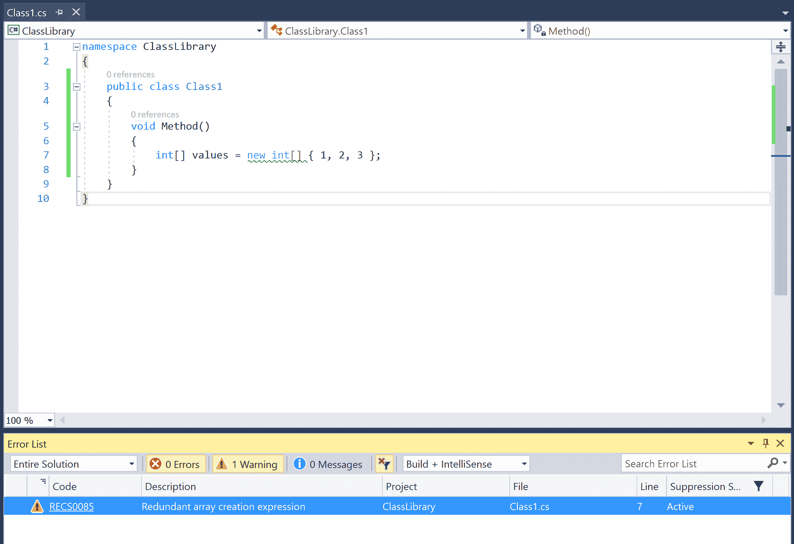

1.  从 Visual Studio 2017 或命令行构建项目，并确认输出窗口或命令行中均未显示分析器诊断，从而确认 VSIX 分析器没有作为构建的一部分执行。

# 在 Visual Studio 的解决方案资源管理器中查看和配置分析器

在本教程中，我们将向您展示如何使用 Visual Studio 2017 中的解决方案资源管理器查看项目中安装的不同分析器，查看这些程序集实现的分析器规则，以及规则属性（或描述符元数据），并配置规则严重性和持久化新的严重性设置。

# 准备工作

您需要在 Visual Studio 2017 中创建并打开一个 .NET 项目，并在项目中安装基于 NuGet 的分析器。有关在 .NET 项目中安装分析器的信息，请参阅本章的第一个教程。

# 如何操作...

1.  打开一个 C#项目，例如 `ClassLibrary`，其中预发布版本 *1.2.0-beta2* 的分析器 NuGet 包 `System.Runtime.Analyzers.nupkg` 已安装。

1.  在解决方案资源管理器中，展开引用 | 分析器节点以查看通过分析器 NuGet 包安装的分析器程序集。我们应该看到两个分析器程序集，`System.Runtime.Analyzers` 和 `System.Runtime.CSharp.Analyzers`：

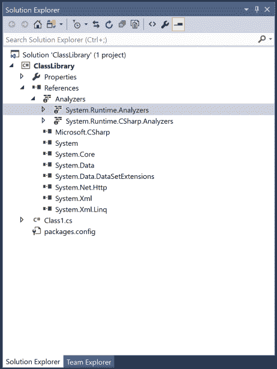

1.  展开 System.Runtime.Analyzers 节点以查看在程序集中实现的全部 *CAXXXX* 规则，并单击一个特定规则，例如 CA1813：避免未密封的属性*，* 以查看规则属性，如 *ID、消息、标题、描述、类别、有效严重性*、默认启用，等等，在属性窗口中：

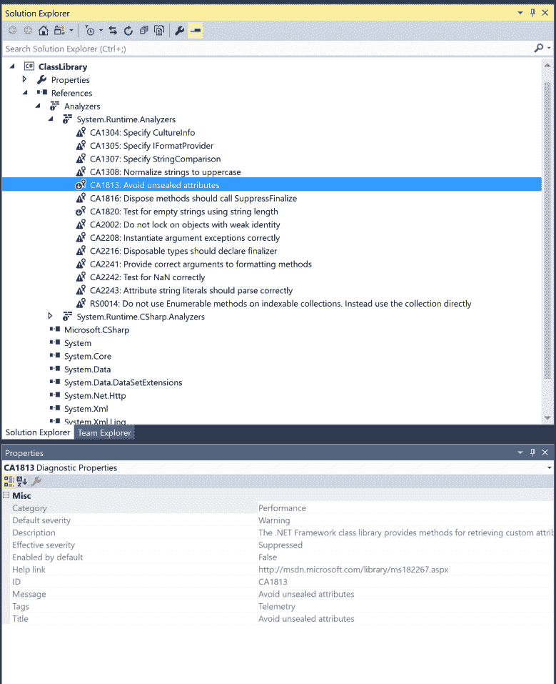

1.  注意，*CA1813* 规则的默认启用为 False，这意味着规则默认是关闭的。我们可以通过添加以下违反此规则的源代码来确认这一点，因为我们声明了一个公共未密封的属性，但 *CA1813* 没有报告违反：

```cs
using System;

namespace ClassLibrary
{
  [AttributeUsage(AttributeTargets.All)]
  public class MyAttribute: Attribute
  {
  }
}

```

1.  右键单击规则节点，点击设置规则集严重性，并将严重性从默认更改为警告：


1.  确认 *CA1813* 现在报告了前面的代码：


1.  保存当前项目，然后关闭并重新打开解决方案。

1.  验证警告 CA1813 仍然出现在前面的源代码中，确认规则集严重性更改已持久化到项目中。

# 它是如何工作的...

解决方案资源管理器中的分析器节点以可视方式表示在项目文件中定义的分析器项，这些项对应于手动添加到项目中的分析器程序集或通过分析器 NuGet 包添加的程序集。程序集中的规则来自实现 `DiagnosticAnalyzer` 类型并对其应用了 `DiagnosticAnalyzerAttribute` 的程序集中的每个类型。属性窗口中显示的规则属性来自实例化分析器类型并请求其 `SupportedDiagnostics`。

在解决方案资源管理器中更改规则严重性并将其持久化到项目是通过一个自动生成的规则集文件实现的，该文件被添加到项目中。请参阅下一道菜谱以获取有关基于规则集的分析器配置的更多详细信息。

# 使用规则集文件和规则集编辑器配置分析器

在本菜谱中，我们将向您展示如何使用 Visual Studio 中的 `ruleset` 文件和规则集编辑器来配置分析器规则的每个项目严重性，并说明严重性更改如何在 Visual Studio 的实时诊断以及命令行构建中反映出来。

# 准备工作

您需要在 Visual Studio 2017 中创建并打开一个 .NET 项目，并在项目中安装基于 NuGet 的分析器。请参阅本章的第一个配方，了解如何在 .NET 项目中安装分析器。

# 如何做到这一点...

1.  打开一个安装了分析器 NuGet 包 `System.Runtime.Analyzers.nupkg` 预发布版本 *1.2.0-beta2* 的 C# 项目，例如 `ClassLibrary`。

1.  将以下源代码添加到项目中并验证是否未触发 CA1813: 避免未密封的属性：

```cs
using System;

namespace ClassLibrary
{
  [AttributeUsage(AttributeTargets.All)]
  public class MyAttribute: Attribute
  {
  }
}

```

1.  在解决方案资源管理器中，导航到 ClassLibary | 引用 | 分析器，右键单击分析器节点并执行上下文菜单命令“打开活动规则集”：


1.  在规则集编辑器中，在右上角的文本框中搜索 *CA1813*。

1.  对于 *CA1813*，在 System.Runtime.Analyzers 下搜索列出的结果，将操作从 None 更改为警告，并保存：

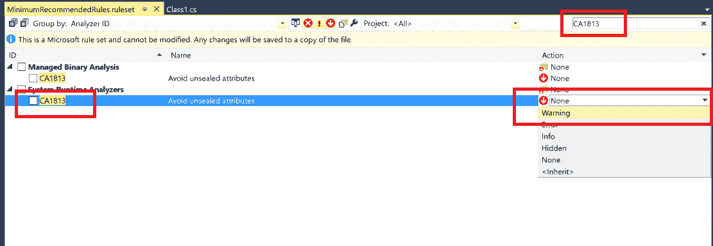

1.  我们现在应该在源代码中的属性定义上看到 *CA1813* 警告。

1.  在解决方案资源管理器中验证，项目现在包含新的 `ClassLibrary.ruleset` 项，并在项目文件中添加了新的 `CodeAnalysisRuleset` 属性：

```cs
*<CodeAnalysisRuleSet>**ClassLibrary.ruleset**</CodeAnalysisRuleSet>*

```

1.  在 Visual Studio 外部的文本编辑器中打开 `ClassLibrary.ruleset` 并验证它是否具有以下针对 *CA1813* 的规则操作规范：

```cs
 *<Rules AnalyzerId="System.Runtime.Analyzers" RuleNamespace="System.Runtime.Analyzers">*
 *<Rule Id="**CA1813**" Action="**Warning**" />*
 *</Rules>*

```

1.  编辑规则集文件，将 *CA1813* 的 `ruleset` 操作从警告更改为错误并保存文件。

1.  切换回 Visual Studio 并确认源代码编辑器现在显示红色波浪线，并且错误列表也报告了 *CA1813* 错误：


1.  在解决方案资源管理器中双击 *ClassLibrary.ruleset* 以使用规则集编辑器打开它，并验证 *CA1813* 的规则严重性条目现在显示为错误。

1.  构建项目并验证是否报告了错误 *CA1813*，确认 `ruleset` 设置在命令行构建中也得到保留。

# 它是如何工作的...

`ruleset` 文件本质上是一组代码分析规则的集合，您可以将这些规则应用于项目以配置其分析。它以 XML 格式指定，并基于 Visual Studio 一起提供的 XML 架构。它也是开源的，可以在 [`github.com/dotnet/roslyn/blob/version-2.0.0/src/Compilers/Core/Portable/RuleSet/RuleSetSchema.xsd`](https://github.com/dotnet/roslyn/blob/version-2.0.0/src/Compilers/Core/Portable/RuleSet/RuleSetSchema.xsd) 找到。可以使用项目文件中的 `CodeAnalysisRuleset` 属性为项目指定 `ruleset`。每个 Rules 节点包含一组具有公共分析器 ID 和命名空间的规则规范。每个规则规范都有规则 ID 和有效的操作或严重性。规则操作可以取以下五个值之一：None（抑制）、Hidden（在 IDE 中不可见，主要是代码修复触发器）、Info（信息性消息）、Warning 和 **Error**。这些规则操作被转换为编译器的编译选项，并覆盖了诊断 ID 的默认严重性。

规则集编辑器是一个强大的图形用户界面，用于搜索、过滤和批量编辑规则配置。

请参阅 [`msdn.microsoft.com/en-us/library/dd264996.aspx`](https://msdn.microsoft.com/en-us/library/dd264996.aspx) 以获取更详细的说明，以及 Visual Studio 中 `ruleset` 文件架构和规则集编辑器的文档。

# 还有更多...

在 Visual Studio 2017 中，可以通过新的 *.editorconfig* 格式配置内置的编码风格规则分析器，该格式在文件夹级别应用规则配置。有关更多详细信息，请参阅文档 ([`docs.microsoft.com/en-us/visualstudio/ide/editorconfig-code-style-settings-reference`](https://docs.microsoft.com/en-us/visualstudio/ide/editorconfig-code-style-settings-reference) )。
