# 第三章：编写 IDE 代码修复、重构和智能感知完成提供者

在本章中，我们将涵盖以下食谱：

+   创建、调试和执行 `CodeFixProvider` 以修复编译器警告

+   在不同的作用域（文档、项目、解决方案）中应用批量代码修复（FixAll）

+   创建一个自定义的 `FixAllProvider` 来修复作用域内所有问题的所有出现

+   创建一个 `CodeRefactoringProvider` 来重构源代码，推荐使用 C# 7.0 的元组

+   创建一个 `CompletionProvider` 以在编辑代码时提供额外的智能感知项

+   为 `` `CodeFixProvider` `` 编写单元测试

# 简介

代码修复提供者和代码重构提供者是 Visual Studio IDE 的扩展，用于编辑用户源代码以修复问题并重构它，同时不引入功能更改。用户在代码编辑器中看到灯泡图标，可以调用代码操作（修复/重构）以自动编辑他们的代码。此外，代码修复还可以提供 FixAll 支持，允许通过单个代码操作修复文档、项目或解决方案中多个类似的问题。

完成提供者是 Visual Studio IDE 的扩展，用于在用户编辑源代码时在智能感知完成列表中显示额外的完成项，并在用户提交特定完成项时自动生成代码。

本章使 C# 开发者能够编写、调试、执行和测试这些 IDE 扩展。

# 创建、调试和执行 `CodeFixProvider` 以修复编译器警告

代码修复提供者是 IDE 扩展，用于修复源代码中的诊断，这些诊断由编译器和分析器报告。这些是在 Roslyn 的 Workspaces 层之上构建的，并操作于正在编辑的当前文档。当用户在 Visual Studio 编辑器中调用如 *Ctrl* + 点的命令时，IDE 代码修复引擎计算当前行跨度中的所有诊断，并识别所有已注册修复一个或多个报告的诊断的代码修复提供者。然后，每个代码修复提供者都会使用包含当前文档、诊断和跨度的代码修复上下文被调用。修复器通过在树中添加、删除或编辑语法节点来操作与文档关联的底层语法树，并返回带有修复代码的新文档。它们还可能更改包含的项目或解决方案的内容以修复诊断。当用户通过按 *Enter* 键提交修复时，代码修复引擎将此代码修复应用于用户代码。

在本节中，我们将编写一个`CodeFixProvider`来修复编译器警告*CS0219* ([`docs.microsoft.com/en-us/dotnet/csharp/misc/cs0219`](https://docs.microsoft.com/en-us/dotnet/csharp/misc/cs0219))（变量`variable`被赋值但从未使用过）。例如，以下代码示例包含两个未使用的变量`a`和`b`，代码修复将删除带有未使用变量`a`的局部声明语句，并在下一个声明语句中删除声明`b = 1`:

```cs
    public class MyClass
    {
       public static void Main()
       {
          int a = 0;   // CS0219 for '*a'*
          int b = 1, c = 2; // CS0219 for '*b'*
          System.Console.WriteLine(c);
       }
    }

```

# 准备工作

你需要在你的机器上安装 Visual Studio 2017 才能执行本章中的食谱。你可以从[`www.visualstudio.com/thank-you-downloading-visual-studio/?sku=Community&rel=15`](https://www.visualstudio.com/thank-you-downloading-visual-studio/?sku=Community&rel=15)安装免费的 Visual Studio 2017 社区版。

此外，你可以参考第一章中的食谱，*在 Visual Studio 中创建、调试和执行分析器项目*，来安装分析器+代码修复项目模板，并从模板创建一个默认项目，例如`CSharpAnalyzers`。

# 如何操作...

1.  在 Visual Studio 中打开`CSharpAnalyzers.sln`解决方案，并打开项目`CSharpAnalyzers`中的源文件`CodeFixProvider.cs`。

1.  将代码修复提供者的`title`从`"Make Uppercase"`更改为`"Remove unused local"`，并将`FixableDiagnosticIds`属性更改为返回`"CS0219"`而不是`CSharpAnalyzersAnalyzer.DiagnosticId`:

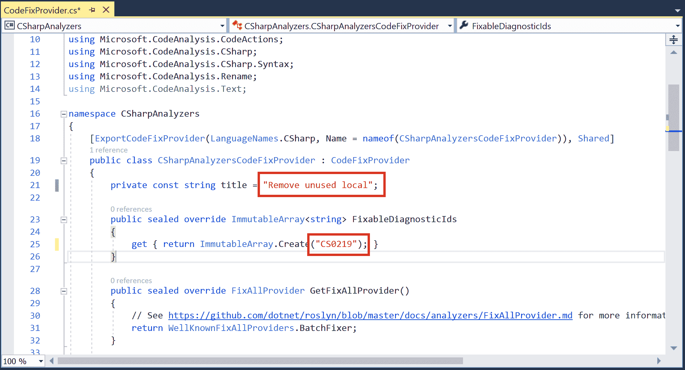

1.  将`RegisterCodeFixesAsync`方法的实现替换为来自`CSharpAnalyzers/CSharpAnalyzers/CSharpAnalyzers/CodeFixProvider.cs/`中名为`RegisterCodeFixesAsync`***.***的代码。

1.  将辅助方法`GetSyntaxNodeToRemoveAsync`和`RemoveDeclarationAsync`添加到源文件中，文件内容来自`CSharpAnalyzers/CSharpAnalyzers/CSharpAnalyzers/CodeFixProvider.cs`。

1.  在新添加的方法`RegisterCodeFixesAsync`和`RemoveDeclarationAsync`的第一行设置断点。

1.  将`CSharpAnalyzers.Vsix`设置为启动项目，并按*F5*启动一个新的带有代码修复提供者启用的 VS 实例。

1.  在新的 VS 实例中，创建一个新的 C#类库项目，例如`ClassLibrary`，并用以下代码替换现有代码：

```cs
public class Class1
{
  public void Method1()
  {
    // Local declaration statement with unused local ('a')
    int a = 0;

    // Local declaration statement with a used ('c') and ununused local ('b').
    int b = 1, c = 2;
    System.Console.WriteLine(c);

    // Local declaration statement where unused local ('d') initializer is non-constant.
    int d = c;

    // Local declaration statement with errors ('e').
    if (true)
      var e = 1;
  }
}

```

1.  将光标放在`int a = 0;`这一行上，并验证`RegisterCodeFixesAsync`中的断点是否被触发。移除此断点后，你可以使用*F10*单步执行方法，或者按*F5*继续执行。

1.  验证在源行下方是否出现灯泡图标，并带有指向`显示潜在修复`的超链接：

    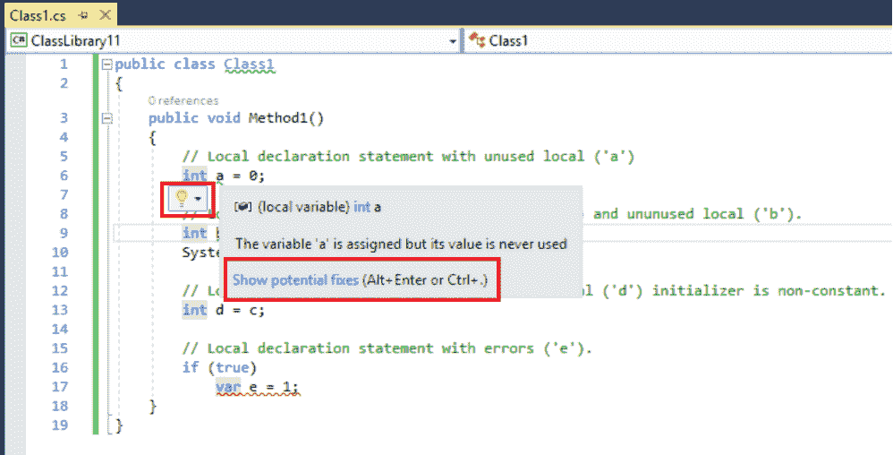

1.  点击灯泡图标，并验证`RemoveDeclarationAsync`中的断点是否被触发。移除此断点后，你可以使用*F10*单步执行方法，或者按*F5*继续执行。

1.  再次单击灯泡并验证是否提供了移除未使用局部代码的修复，并提供修复的代码更改预览：

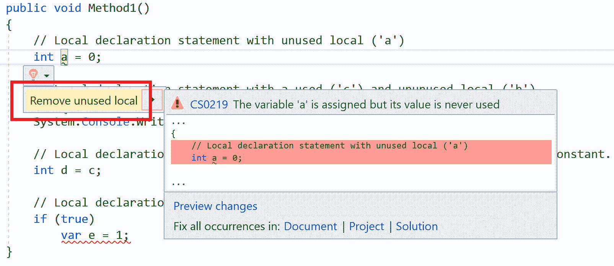

1.  按下回车键应用代码修复并验证未使用的局部声明语句已被删除。

1.  将光标移至未使用的局部变量 `b` 并按 *Ctrl* + 点键，验证是否提供了相同的代码修复，并应用修复删除声明 `b = 1`，但保留 `c` 的局部声明：

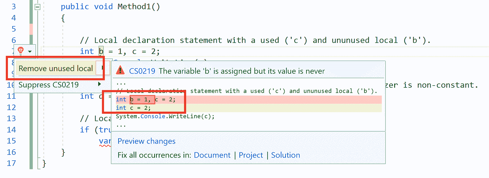

1.  验证对于具有非常量初始化器的局部 `d` 和具有不同编译器错误的局部 `e`，没有提供代码修复。

# 它是如何工作的...

代码修复提供者是 VS IDE 扩展，可以注册用于修复指定诊断 ID 的编译器或分析器诊断的代码操作。`CodeFixProvider` 上的主要 API 是：

+   `FixableDiagnosticIds` 属性（抽象）：一个不可变的诊断 ID 数组，代码修复提供者可以修复。任何报告了指定诊断 ID 之一的编译器或分析器诊断都是提供者的代码修复的候选者，并且对于每个此类诊断都会调用 `RegisterCodeFixesAsync`。

+   `RegisterCodeFixesAsync` 方法（抽象）：这是用于注册可修复诊断的代码操作的函数。每当代码修复引擎需要计算 VS IDE 中当前源行报告的诊断的代码操作时，都会调用此方法。此方法接受一个 `CodeFixContext` 参数，它包含一组要修复给定诊断范围和文档的诊断。上下文中的所有诊断都有一个可修复的诊断 ID。`CodeFixProvider` 可以将诊断范围映射到文档中的语法节点，并分析它以注册一个或多个代码操作来修复上下文中的一个或多个诊断。`CodeAction` 包含以下主要成员：

    +   `Title` 属性：这是当提供代码修复时显示在灯泡旁边的字符串。

    +   `Callback` 方法：这是当用户应用已注册的代码操作时将被调用的委托。此方法返回更改后的文档或解决方案，代码修复引擎将更改应用到工作区。

    +   `EquivalenceKey` 属性：这是表示此代码操作所属的代码操作等价类的字符串。如果代码修复提供者支持 `FixAllProvider`，则 FixAll 代码修复将批处理调用代码操作的等价类中的所有代码操作，并同时修复它们。

    +   `GetFixAllProviderAsync` 方法（虚拟）：代码修复提供者可以选择覆盖此方法，并在需要为他们的代码操作提供 FixAll 支持时返回一个非空的 `FixAllProvider`。我们将在下一道菜中更详细地讨论这个问题。

本食谱中实现的 `CodeFixProvider` 有一个可修复的诊断 ID：`CS0219`，这是一个编译器诊断，标记未使用的局部变量声明。让我们详细说明 `RegisterCodeFixesAsync` 覆盖及其辅助函数的实现细节。

`RegisterCodeFixesAsync` 的第一部分计算要删除的语法节点，该节点是通过调用 `GetNodeToRemoveAsync`*标记*的变量，如果得到一个空节点，则退出：

```cs
 public sealed override async Task RegisterCodeFixesAsync(CodeFixContext context)
 {
   var diagnostic = context.Diagnostics.First();

   // Get syntax node to remove for the unused local.
   var nodeToRemove = await GetNodeToRemoveAsync(context.Document, diagnostic, context.CancellationToken).ConfigureAwait(false);
   if (nodeToRemove == null)
   {
     return;
   }

```

`GetNodeToRemoveAsync` 的初始部分计算由诊断标记的语法节点：

```cs
private async Task<SyntaxNode> GetNodeToRemoveAsync(Document document, Diagnostic diagnostic, CancellationToken cancellationToken)
{
  var root = await document.GetSyntaxRootAsync(cancellationToken).ConfigureAwait(false);
  var diagnosticSpan = diagnostic.Location.SourceSpan;

  // Find the variable declarator identified by the diagnostic.
  var variableDeclarator = root.FindToken(diagnosticSpan.Start).Parent.AncestorsAndSelf().OfType<VariableDeclaratorSyntax>().First();

```

我们首先获取正在修复的文档的语法根。然后我们在根中找到诊断范围开始的语法标记，并找到第一个 `VariableDeclaratorSyntax` 类型的祖先节点。例如，考虑以下局部声明语句：

```cs
int b = 1, c = 2;

```

整个语句是一个 `LocalDeclarationStatementSyntax` 节点。它有一个子语法节点 `VariableDeclarationSyntax`，表示 `int b = 1, c = 2`，以及分号语法标记。变量声明语法节点包含两个变量声明符节点，每个节点都是 `VariableDeclaratorSyntax` 类型，分别具有文本 `b = 1` 和 `c = 2`。`VariableDeclaratorSyntax` 节点包含一个 `IdentifierName` 标记和一个类型为 `EqualsValueClauseSyntax` 的初始化器语法节点。`CS0219` 是在未使用的变量声明符的 `IdentifierName` 标记上报告的。

使用 Roslyn [SyntaxVisualizer](https://blogs.msdn.microsoft.com/csharpfaq/2014/04/17/visualizing-roslyn-syntax-trees/) 来理解给定 C# 或 VB 源代码的解析语法节点/标记：

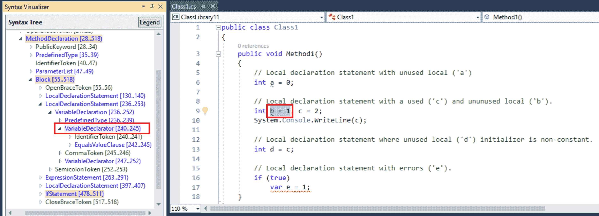

`GetNodeToRemoveAsync` 的下一部分实现了一些防御性检查，以便在不注册任何代码操作的情况下提前退出，如下面的代码片段所示：

```cs
  if (variableDeclarator == null)
  {
   return null;
  }

  // Bail out if the initializer is non-constant (could have side effects if removed).
  if (variableDeclarator.Initializer != null)
  {
   var semanticModel = await document.GetSemanticModelAsync(cancellationToken).ConfigureAwait(false);
   if (!semanticModel.GetConstantValue(variableDeclarator.Initializer.Value).HasValue)
   {
    return null;
   }
  }

  // Bail out for code with syntax errors - parent of a declaration is not a local declaration statement.
  var variableDeclaration = variableDeclarator.Parent as VariableDeclarationSyntax;
  var localDeclaration = variableDeclaration?.Parent as LocalDeclarationStatementSyntax;
  if (localDeclaration == null)
  {
   return null;
  }

```

如果诊断是在没有 `VariableDeclaratorSyntax` 祖先的标记上报告的，我们首先退出。如果变量初始化器是一个非常量，因为使用代码修复删除它可能会导致功能变化，不执行初始化器代码。最后，我们检查变量声明符是否有 `VariableDeclarationSyntax` 父节点，该父节点有一个 `LocalDeclarationStatementSyntax` 父节点。

代码修复提供程序中的防御性检查非常重要，可以保护我们免受意外第三方分析器报告具有相同诊断 ID 但语法节点类型与我们的修复器期望不同的诊断的影响。我们应该确保我们优雅地退出，而不是意外崩溃或注册错误的代码修复。

最后，该方法通过代码修复计算并返回要删除的语法节点：

```cs
  // If the statement declares a single variable, the code fix should remove the whole statement.
  // Otherwise, the code fix should remove only this variable declaration.
  SyntaxNode nodeToRemove;
  if (variableDeclaration.Variables.Count == 1)
  {
   if (!(localDeclaration.Parent is BlockSyntax))
   {
    // Bail out for error case where local declaration is not embedded in a block.
    // Compiler generates errors CS1023 (Embedded statement cannot be a declaration or labeled statement)
    return null;
   }

   nodeToRemove = localDeclaration;
  }
  else
  {
   nodeToRemove = variableDeclarator;
  }

  return nodeToRemove;
 }

```

我们有两个情况要处理：

+   如果局部声明语句只声明了一个变量，那么我们可以删除整个语句。我们还涵盖了一个额外的退出情况，即局部声明不是由块语句父化的，在这种情况下，删除局部声明语句将导致语法错误。鉴于编译器已经为这种情况报告了诊断 *CS1023*（嵌入语句不能是声明或标记语句），我们只需退出。

+   否则，如果局部声明语句声明了多个变量，我们可以只删除变量声明符。

一旦我们有一个要删除的非空语法节点，我们注册一个代码修复来删除声明节点：

```cs
  // Register a code action that will invoke the fix.
  var root = await context.Document.GetSyntaxRootAsync(context.CancellationToken).ConfigureAwait(false);
  context.RegisterCodeFix(
   CodeAction.Create(
    title: title,
    createChangedDocument: c => RemoveDeclarationAsync(context.Document, root, nodeToRemove, c),
    equivalenceKey: title),
   diagnostic);
 }

```

我们使用 `CodeAction.Create` API 创建一个标准的 CodeAction，标题为 `Remove unused local`，并使用相同的等效键。我们将 `RemoveDeclarationAsync` 注册为当用户应用代码修复时要调用的回调方法：

```cs
 private Task<Document> RemoveDeclarationAsync(Document document, SyntaxNode root, SyntaxNode declaration, CancellationToken cancellationToken)
 {
  var syntaxGenerator = SyntaxGenerator.GetGenerator(document);
  var newRoot = syntaxGenerator.RemoveNode(root, declaration);
  return Task.FromResult(document.WithSyntaxRoot(newRoot));
 }

```

此方法使用 `SyntaxGenerator` 辅助实用工具从原始语法根中删除声明节点，并返回使用新语法根创建的新文档。

`SyntaxGenerator` 是一个强大的语法工厂，具有在语言无关的方式中添加、删除或编辑语法节点的 API。它适用于 VB 和 C# 语法节点，并允许编写修复跨两种语言的代码修复提供程序，而无需特定的语言实现。有关 `SyntaxGenerator` 的参考源，请参阅 [`source.roslyn.io/#q=SyntaxGenerator`](http://source.roslyn.io/#q=SyntaxGenerator)。

# 在不同作用域（文档、项目、解决方案）中应用批量代码修复（FixAll）

在本节中，您将学习如何应用批量代码修复来修复不同作用域中相似诊断的多个实例。我们将应用默认分析器 + 代码修复模板项目中的 FixAll 代码修复，修复文档、项目和解决方案作用域中的多个类型名称，使它们都只包含大写字母。我们将向您展示如何从编辑器灯泡中调用 FixAll 代码修复，然后使用 FixAll 预览更改对话框来选择性地选择要应用到解决方案中的修复。

# 准备工作

您需要在您的机器上安装 Visual Studio 2017 以执行本章中的配方。您可以从 [`www.visualstudio.com/thank-you-downloading-visual-studio/?sku=Community&rel=15`](https://www.visualstudio.com/thank-you-downloading-visual-studio/?sku=Community&rel=15) 安装 Visual Studio 2017 的免费社区版本***。

此外，您应执行第一个 第一章，*编写诊断分析器*中的配方 *Creating, debugging, and executing an analyzer project in Visual Studio*，以安装分析器 + 代码修复项目模板并从模板创建默认项目，例如 `CSharpAnalyzers`。

# 如何操作...

1.  在 Visual Studio 中打开 `CSharpAnalyzers.sln`。将 `CSharpAnalyzers.Vsix` 设置为启动项目，并按 *F5* 启动一个新的 VS 实例，其中启用了代码修复提供程序。

1.  在新的 VS 实例中，创建一个新的 C# 类库项目，例如 `ClassLibrary`，并用以下代码替换现有的代码：

```cs
public class Class1
{
 public class Class2
 {
 }
}

public class Class3
{
}

```

1.  向项目添加一个新的源文件，例如 `Class4.cs`，并使用以下代码：

```cs
public class Class4
{
}

```

1.  将新 C# 类库项目 `ClassLibrary2.csproj` 添加到解决方案中，将源文件重命名为 `Class5.cs`**，**并用以下代码替换其源代码：

```cs
public class Class5
{
}

```

1.  在错误列表中验证五个诊断，每个类一个：类型名称 'XXX' 包含小写字母*.*。

1.  将光标放在 `Class1` 上，按 *Ctrl* + 点号以显示代码修复的灯泡“Make uppercase**”。**

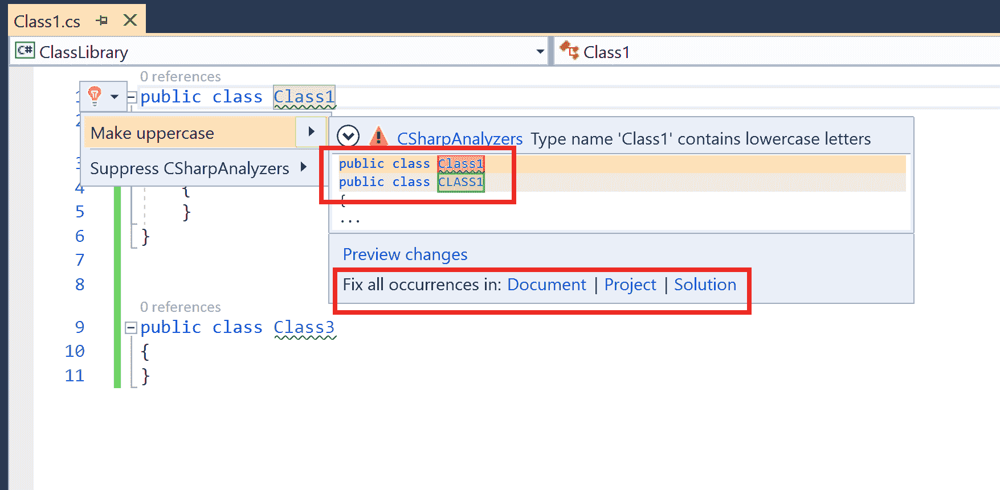

1.  点击超链接“在文档中修复所有实例”以打开预览更改 - 修复所有实例对话框。点击应用按钮将“转换为大写”修复应用到 `Class1.cs` 中的所有类型：

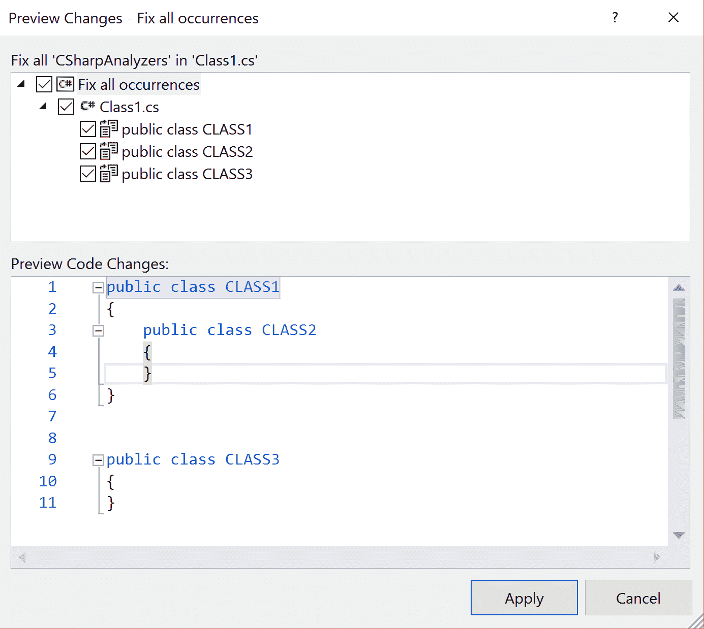

1.  验证 `Class1`、`Class2`**、**和 `Class3` 分别更改为 `CLASS1`、`CLASS2` 和 `CLASS3`**、**，但 `Class4` 和 `Class5` 保持不变。

1.  按 *Ctrl* + *Z* 撤销批量代码修复，并验证解决方案返回到应用修复之前的状态。

1.  再次按 *Ctrl* + 点号，但这次点击项目中的“修复所有实例”。

1.  取消选中 `public class CLASS2` 旁边的复选框，并验证在预览更改对话框中 `CLASS2` 是否已切换回 `Class2`：

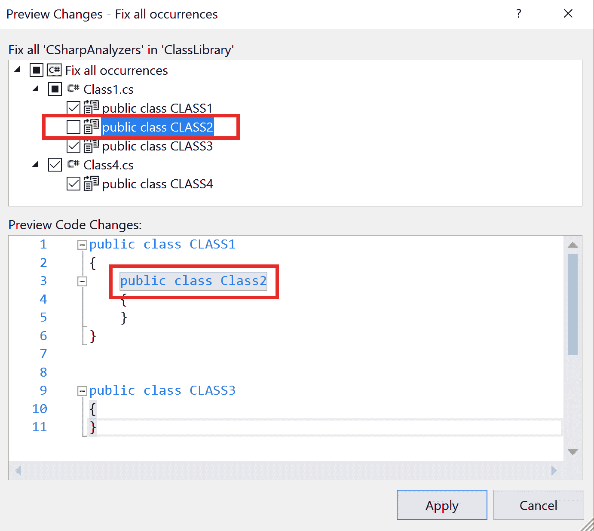

1.  应用修复并验证 `Class1`、`Class3` 和 `Class4` 分别更改为 `CLASS1`、`CLASS3` 和 `CLASS4`，但 `Class2` 和 `Class5` 保持不变。

1.  按 *Ctrl* + *Z* 撤销项目级别的代码修复，并验证源文件 `Class1.cs` 和 `Class4.cs` 的更改已回滚。

1.  再次按 *Ctrl* + 点号，这次点击解决方案中的“修复所有实例”。

1.  应用代码修复并验证所有五个类都已更改为大写，然后按 *Ctrl* + *Z* 回滚解决方案中所有类型的更改。

# 创建一个自定义 FixAllProvider 来修复跨作用域内所有问题的所有实例

在本节中，我们将向您展示如何编写一个自定义的 FixAll 代码修复提供者以批量修复诊断项。我们将使用本章第一个菜谱中实现的代码修复来`Remove unused local`*.* 如该菜谱所示，未使用局部变量的移除可能基于封装局部声明语句是否声明了一个或多个变量而具有不同的代码修复。此外，我们可能在单个语句中声明了多个未使用的局部变量，如果语句中声明的所有局部变量都是未使用的，则批量修复应删除整个语句。因此，我们不能使用知名的批量修复器。例如，对于以下代码，批量修复应删除前两个局部声明语句，但仅删除第三个声明语句中的`d`的声明符：

```cs
public class MyClass
{
   public static void M()
   {
      int a = 0;   // CS0219 for 'a'
      int b = 1, c = 2; // CS0219 for 'b' and 'c'
      int d = 3, e = 4; // CS0219 for 'd'
      System.Console.WriteLine(e);
   }
}

```

默认的知名`BatchFixer`仅适用于简单的代码修复。对于其他场景，我们需要编写一个自定义的修复所有提供者。有关 FixAll 提供者和知名 BatchFixer 的限制的文档，请参阅([`github.com/dotnet/roslyn/blob/master/docs/analyzers/FixAllProvider.md`](https://github.com/dotnet/roslyn/blob/master/docs/analyzers/FixAllProvider.md))。

# 准备工作

您应该执行本章的第一个菜谱，*创建、调试和执行一个代码修复提供者以修复编译器警告*来实现一个用于`Remove unused local`的代码修复提供者。

# 如何做到这一点...

1.  在 Visual Studio 中打开`CSharpAnalyzers.sln`项目，并将两个新的源文件添加到`CSharpAnalyzers`项目中：

    +   `CustomFixAllProvider.cs`

    +   `CustomFixAllCodeAction.cs`

1.  在`CustomFixAllProvider.cs`中添加代码以实现一个自定义的修复所有提供者，来自`CSharpAnalyzers/CSharpAnalyzers/CSharpAnalyzers/CustomFixAllProvider.cs`。

1.  从`CSharpAnalyzers/CSharpAnalyzers/CSharpAnalyzers/CustomFixAllCodeAction.cs`将代码添加到`CustomFixAllCodeAction.cs`中，以实现一个自定义的`CodeAction`，该`CodeAction`由`CustomFixAllProvider.GetFixAsync`返回。

1.  对`CodeFixProvider.cs`进行以下修改：

    +   将`GetNodeToRemoveAsync`修改为一个内部静态方法

    +   将`GetFixAllProviderAsync`修改为返回一个`new CustomFixAllProvider()`

1.  将`CSharpAnalyzers.Vsix`设置为启动项目，并按*F5*启动一个新的带有代码修复提供者的 VS 实例。

1.  在新的 VS 实例中，创建一个新的 C#类库项目，例如`ClassLibrary`，并用以下代码替换现有代码：

```cs
public class Class1
{
 public static void M()
 {
  int a = 0; // CS0219 for 'a'
  int b = 1, c = 2; // CS0219 for 'b' and 'c'
  int d = 3, e = 4; // CS0219 for 'd'
  System.Console.WriteLine(e);
 }
}

```

1.  向项目中添加一个新的源文件，例如`Class2.cs`，并添加以下代码：

```cs
public class Class2
{
 public static void M()
 {
  int a = 0; // CS0219 for 'a'
  int b = 1, c = 2; // CS0219 for 'b' and 'c'
  int d = 3, e = 4; // CS0219 for 'd'
  System.Console.WriteLine(e);
 }
}

```

1.  将一个新的 C#类库项目添加到解决方案中，例如`ClassLibrary2.csproj`，将源文件重命名为`Class3.cs`**,**并用以下代码替换其内容：

```cs
public class Class3
{
 public static void M()
 {
  int a = 0; // CS0219 for 'a'
  int b = 1, c = 2; // CS0219 for 'b' and 'c'
  int d = 3, e = 4; // CS0219 for 'd'
  System.Console.WriteLine(e);
 }
}

```

1.  在错误列表中验证 12 个诊断项，每个类中有一个未使用的变量*.*

1.  将光标放在`Class1.cs`中的局部变量`'a'`上，然后按*Ctrl* + 点来弹出代码修复`Remove unused local`****的代码提示。**

1.  点击文档中的超链接“修复所有出现”以打开“预览更改 - 修复所有出现”对话框。点击“应用”按钮以应用“删除未使用局部变量”以删除`Class1.cs`中的所有四个未使用局部变量（`'*a*'`、`'*b*'`、`'*c*'`和`'*d*'`）：

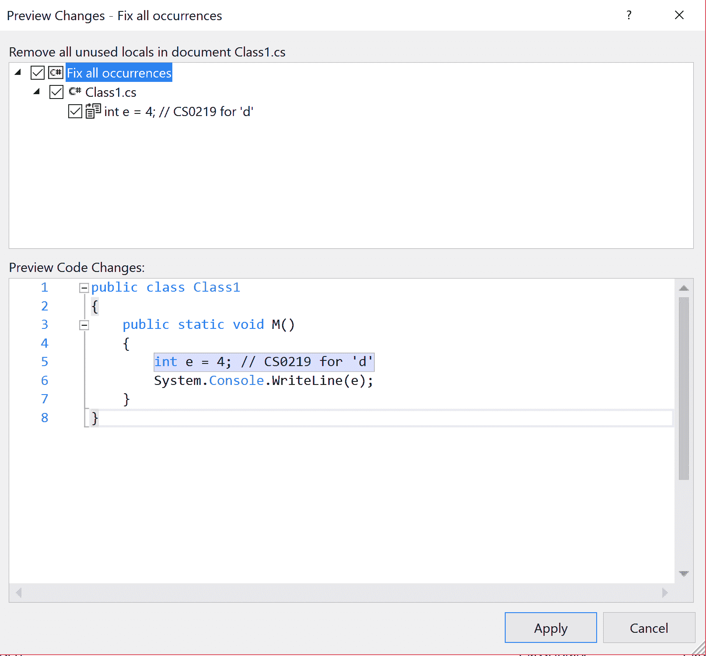

1.  切换到`Class2.cs`中的未使用局部声明，并在解决方案/项目范围内尝试修复所有出现，并验证所选范围内所有未使用的局部变量是否已删除。

# 它是如何工作的...

FixAll 提供程序是 VS IDE 扩展，它们注册与特定代码修复提供程序注册的代码操作对应的批量修复的代码操作。`FixAllProvider`上的主要 API 是：

+   `GetSupportedFixAllScopes`属性（虚拟）：此方法获取修复诊断所有出现的支持的范围。默认情况下，它返回文档、项目和解决方案范围。

+   `GetSupportedFixAllDiagnosticIds`方法（虚拟）：此方法获取支持修复所有出现的诊断 ID。默认情况下，它返回相应代码修复提供程序的`FixableDiagnosticIds`。

+   `GetFixAsync`方法（抽象）：这是主要方法，它接受一个`FixAllContext`参数，并返回与`FixAllContext`参数对应的批量修复的代码操作：`CodeFixProvider`、要修复的诊断 ID、`FixAllScope`和原始代码操作的`EquivalenceKey`。

代码修复引擎调用`CodeFixProvider.GetFixAllProviderAsync`方法以获取代码修复器支持的可选 FixAll 提供程序。在我们的实现中，我们确保为此方法返回`CustomFixAllProvider`。让我们详细说明`CustomFixAllProvider`的实现细节。

`CustomFixAllProvider`仅覆盖`GetFixAsync`方法。`GetFixAsync`方法的第一部分计算修复标题和当前`FixAllScope`要修复的文档：

```cs
 public override async Task<CodeAction> GetFixAsync(FixAllContext fixAllContext)
 {
  var diagnosticsToFix = new List<KeyValuePair<Document, ImmutableArray<Diagnostic>>>();
  string titleFormat = "Remove all unused locals in {0} {1}";
  string title = null;
  var documentsToFix = ImmutableArray<Document>.Empty;

  switch (fixAllContext.Scope)
  {
   case FixAllScope.Document:
   {
    documentsToFix = ImmutableArray.Create(fixAllContext.Document);
    title = string.Format(titleFormat, "document", fixAllContext.Document.Name);
    break;
   }

   case FixAllScope.Project:
   {
    documentsToFix = fixAllContext.Project.Documents.ToImmutableArray();
    title = string.Format(titleFormat, "project", fixAllContext.Project.Name);
    break;
   }

   case FixAllScope.Solution:
   {
    foreach (Project project in fixAllContext.Solution.Projects)
    {
     documentsToFix = documentsToFix.AddRange(project.Documents);
    }

    title = "Add all items in the solution to the public API";
    break;
   }

   case FixAllScope.Custom:
    return null;
   default:
    break;
  }

```

然后，我们遍历所有计算出的文档，并为每个文档计算要修复的诊断，并将它们存储在一个映射中。我们返回带有计算标题和诊断的`CustomFixAllCodeAction`：

```cs
 foreach (Document document in documentsToFix)
 {
  ImmutableArray<Diagnostic> diagnostics = await fixAllContext.GetDocumentDiagnosticsAsync(document).ConfigureAwait(false);
  diagnosticsToFix.Add(new KeyValuePair<Document, ImmutableArray<Diagnostic>>(document, diagnostics));
 }

 return new CustomFixAllCodeAction(title, fixAllContext.Solution, diagnosticsToFix);

```

让我们来看一下`CustomFixAllCodeAction`*.*的实现细节。自定义代码操作覆盖的主要方法是`GetChangedSolutionAsync`。此方法获取带有批量修复编辑的新解决方案。当用户尝试应用批量修复时，代码修复引擎会调用此方法。

`GetChangedSolutionAsync`方法的初始部分计算每个文档中要删除的所有本地声明和变量声明符语法节点，在一个名为`nodesToRemove`的映射中，执行非常基本的语法节点批量修复：

```cs
  protected override async Task<Solution> GetChangedSolutionAsync(CancellationToken cancellationToken)
  {
   var nodesToRemoveMap = new Dictionary<Document, HashSet<SyntaxNode>>();
   foreach (KeyValuePair<Document, ImmutableArray<Diagnostic>> pair in _diagnosticsToFix)
   {
    Document document = pair.Key;
    ImmutableArray<Diagnostic> diagnostics = pair.Value;
    var nodesToRemove = new HashSet<SyntaxNode>();
    foreach (var diagnostic in diagnostics)
    {
     var nodeToRemove = await CSharpAnalyzersCodeFixProvider.GetNodeToRemoveAsync(document, diagnostic, cancellationToken).ConfigureAwait(false);
     if (nodeToRemove != null)
     {
      nodesToRemove.Add(nodeToRemove);
     }
    }

```

第二部分试图识别具有多个变量声明的局部声明语句，其中所有声明的局部变量都没有使用，因此整个语句可以被删除。对于这种情况，我们将局部声明语句添加到`nodesToRemove`中，并从`nodeToRemove`映射中移除局部声明语句中的所有单个未使用变量声明符：

```cs
    var candidateLocalDeclarationsToRemove = new HashSet<LocalDeclarationStatementSyntax>();
    foreach (var variableDeclarator in nodesToRemove.OfType<VariableDeclaratorSyntax>())
    {
     var localDeclaration = (LocalDeclarationStatementSyntax)variableDeclarator.Parent.Parent;
     candidateLocalDeclarationsToRemove.Add(localDeclaration);
    }

    foreach (var candidate in candidateLocalDeclarationsToRemove)
    {
     var hasUsedLocal = false;
     foreach (var variable in candidate.Declaration.Variables)
     {
      if (!nodesToRemove.Contains(variable))
      {
       hasUsedLocal = true;
       break;
      }
     }

     if (!hasUsedLocal)
     {
      nodesToRemove.Add(candidate);
      foreach (var variable in candidate.Declaration.Variables)
      {
       nodesToRemove.Remove(variable);
      }
     }
    }

```

最后，我们遍历所有的`{Document, HashSet<SyntaxNode>}`对，并为每个文档计算一个新的根，其中从整个树中移除了所有未使用的局部变量。我们创建一个新的文档，并使用新的根应用文档更改到最新的解决方案，该解决方案被跟踪为`newSolution`。循环结束时，`newSolution`代表应用了所有文档更改的当前解决方案，并由方法返回：

```cs
   Solution newSolution = _solution;

   foreach (KeyValuePair<Document, HashSet<SyntaxNode>> pair in nodesToRemoveMap)
   {
    var document = pair.Key;
    var root = await document.GetSyntaxRootAsync(cancellationToken).ConfigureAwait(false);
    var syntaxGenerator = SyntaxGenerator.GetGenerator(document);
    var newRoot = syntaxGenerator.RemoveNodes(root, pair.Value);
    newSolution = newSolution.WithDocumentSyntaxRoot(document.Id, newRoot);
   }

   return newSolution;

```

# 创建一个`CodeRefactoringProvider`来重构源代码，推荐使用 C# 7.0 的元组

代码重构提供者是 IDE 扩展，用于重构源代码以优化代码结构，而不影响代码的功能或语义行为。这些是基于 Roslyn 的 Workspaces 层构建的，并操作于正在编辑的当前文档。当用户在 Visual Studio 编辑器中调用如*Ctrl* + 点的命令时，IDE 代码重构引擎计算所有可以重构编辑器中当前所选文本跨度内代码的重构。然后，每个提供者都会使用包含当前文档和跨度的代码重构上下文被调用。重构通过在树中添加、删除或编辑语法节点来操作与文档关联的底层语法树，并返回带有重构代码的新文档。它们还可能更改包含的项目或解决方案的内容。当用户通过按*Enter*键提交重构时，代码重构引擎将此重构应用于用户代码。

在本节中，我们将编写一个`CodeRefactoringProvider`，以建议在返回多个值的函数中使用元组表达式*，*这是一个 C# 7.0 的特性。在 C# 7.0 之前，想要返回多个值的函数有以下可能的实现方式：

1.  声明一个非无返回类型的其中一个返回值，并为剩余的返回值声明`out`参数。

1.  为每个返回值声明无返回类型和*输出*参数。

1.  声明一个新的类型，将这些值作为字段封装，并返回该类型的实例。

在 C# 7.0 中，推荐的实现方式是声明一个元组返回类型，并为每个返回值的类型定义元素，并且没有输出参数。我们将编写一个重构来识别之前提到的模式 1 的现有代码，并推荐使用元组的重构。例如，考虑以下返回多个返回值的函数：

```cs
private int MethodReturningTwoValues(out int x)
{
 x = 0;
 return 0;
}

private int MethodReturningThreeValues(out int x, int y, out int z)
{
 x = 0;
 z = 1;
 return y;
}

```

我们的代码重构将提供将这些方法转换为：

```cs
private (int, int) MethodReturningTwoValues()
{
 int x;
 x = 0;
 return (0, x);
}

private (int, int, int) MethodReturningThreeValues(int y)
{
 int x;
 int z;
 x = 0;
 z = 1;
 return (y, x, z);
}

```

# 准备工作

你需要在你的机器上安装 Visual Studio 2017 来执行本章中的配方。你可以从 [`www.visualstudio.com/thank-you-downloading-visual-studio/?sku=Community&rel=15`](https://www.visualstudio.com/thank-you-downloading-visual-studio/?sku=Community&rel=15) 安装免费的 Visual Studio 2017 社区版本***。***

此外，你应该已经安装了 .NET 编译器平台 SDK 来获取 `CodeRefactoring` 项目模板。有关参考，请参阅第一章 *编写诊断分析器* 中的配方，*在 Visual Studio 中创建、调试和执行分析器项目*，在 Chapter 1。

默认情况下，`CodeRefactoring` 项目模板针对 *.NET Portable v4.5* 并引用 `Microsoft.CodeAnalysis` 包的 *1.0.1* 版本。由于我们打算使用 C# 7.0 语法，我们需要将 `CodeAnalysis` 包升级到 2.0.0 或更高版本，这些版本基于 .NET Standard，因此需要引用的项目基于 .NET 标准模板或针对 .NET Framework v4.6 或更高版本。为此配方，我们将项目更改为针对 .NET Framework v4.6。

# 如何操作...

1.  启动 Visual Studio 并点击 文件 | 新建 | 项目...

1.  将项目目标框架组合框更改为 .NET Framework 4.6（或更高）。在 Visual C# | 扩展性 下，选择代码重构（VSIX），将你的项目命名为 `CodeRefactoring`**,** 并点击确定：

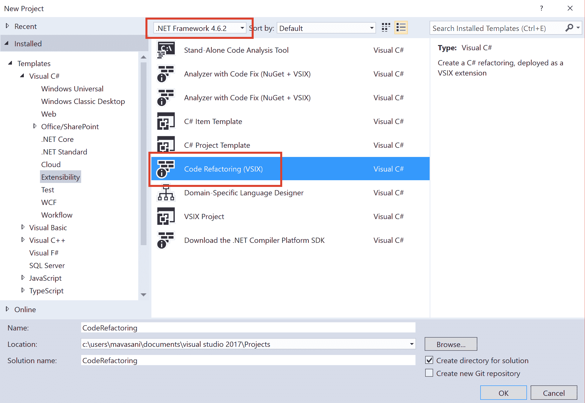

1.  现在你应该有一个包含两个项目：`CodeRefactoring` 和 `CodeRefactoring.Vsix` 的解决方案。

1.  使用以下步骤将 `CodeRefactoring` 项目更改为针对 *.NET Framework v4.6*：

    +   +   在 Visual Studio 中卸载项目并编辑 `csproj` 文件

        +   删除属性 `ProjectTypeGuids` 和 `TargetFrameworkProfile`

    +   将属性 `TargetFrameworkVersion` 从 *v4.5* 更改为 *v4.6.*。

    +   将文件中的最后一个 `Imports` 元素从可移植目标更改为非可移植目标，即，将以下行 `<Import Project="$(MSBuildExtensionsPath32)\Microsoft\Portable\$(TargetFrameworkVersion)\Microsoft.Portable.CSharp.targets" />` 替换为 `<Import Project="$(MSBuildToolsPath)\Microsoft.CSharp.targets" />`

    +   保存更改并重新加载项目

1.  在解决方案资源管理器中右键单击项目，点击 管理 NuGet 包，并将 `Microsoft.CodeAnalysis.CSharp.Workspaces` 更新到 *2.0.0*：

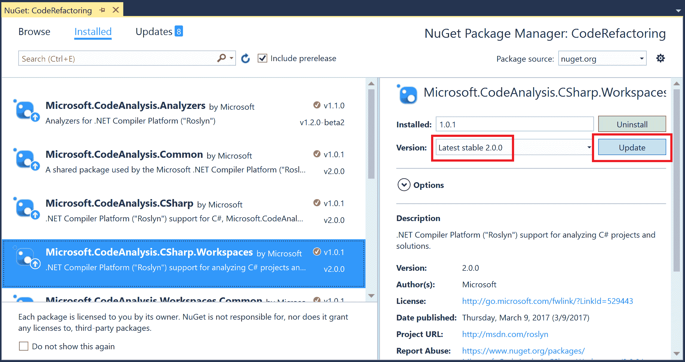

1.  在 `CodeRefactoringProvider` 项目中打开 `CodeRefactoringProvider.cs` 并将现有的 `ComputeRefactoringAsync` 方法实现替换为 `CodeRefactoring/CodeRefactoring/CodeRefactoringProvider.cs/` 中名为 `ComputeRefactoringAsync`*****.***** 的代码。

1.  添加以下辅助程序来从参数列表计算 *out* 参数：

```cs
private static IEnumerable<ParameterSyntax> GetOutParameters(MethodDeclarationSyntax methodDecl)
 => methodDecl.ParameterList.Parameters.Where(parameter => parameter.Modifiers.Any(m => m.Kind() == SyntaxKind.OutKeyword));

```

1.  删除现有的方法`ReverseTypeNameAsync`，并用来自`CodeRefactoring/CodeRefactoring/CodeRefactoringProvider.cs`的`UseValueTupleAsync`以及几个辅助方法`GenerateTupleType`和`GenerateTupleExpression`替换。此外，在文件顶部添加一个新的 using 语句：`using Microsoft.CodeAnalysis.Formatting;`

1.  将`CodeRefactoring.Vsix`设置为启动项目，然后单击*F5*来构建重构并启动一个带有启用重构的新实例的 Visual Studio 进行调试。

1.  在新的 Visual Studio 实例中，创建一个新的 C#类库项目，例如`ClassLibrary`，并将以下两个方法添加到`Class1`中：

```cs
private int MethodReturningTwoValues(out int x)
{
 x = 0;
 return 0;
}

private int MethodReturningThreeValues(out int x, int y, out int z)
{
 x = 0;
 z = 1;
 return y;
}

```

1.  右键单击项目节点 | 管理 NuGet 包，并将 NuGet 包引用添加到`System.ValueTuple`。

1.  将光标放在`MethodReturningTwoValues`上，然后按*Ctrl* + 点并验证是否提供了将返回类型更改为`ValueTuple`的重构操作：

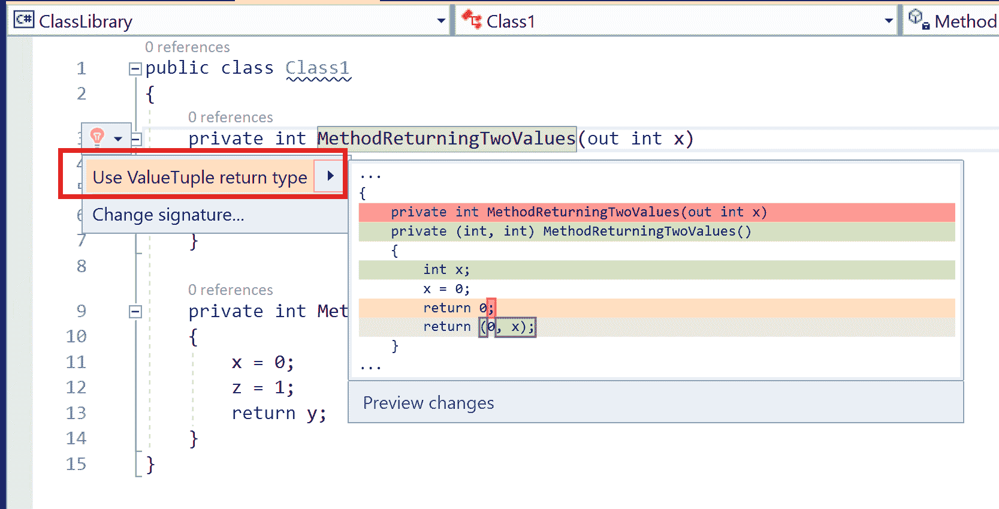

1.  应用重构并验证方法签名是否更改为返回值元组。

1.  类似地，将光标放在`MethodReturningThreeValues`上，然后按*Ctrl* + 点并验证是否提供了将返回类型更改为`ValueTuple`的重构操作：

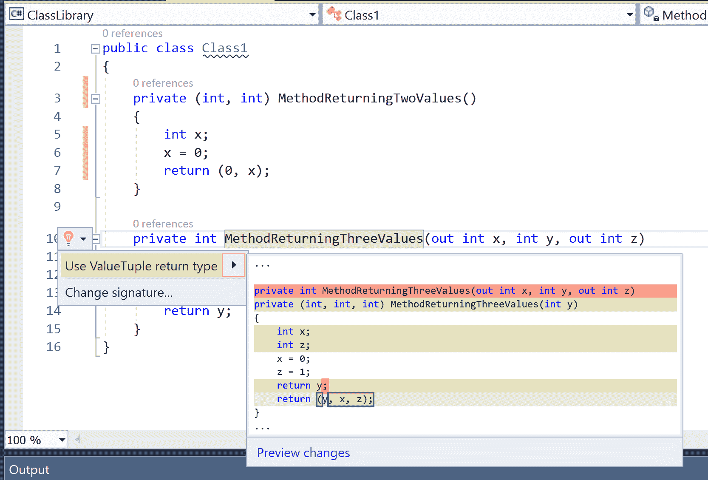

# 它是如何工作的...

代码重构提供者是 VS IDE 扩展，可以在不引入任何功能更改的情况下注册代码操作以将代码重构为推荐模式。`CodeRefactoringProvider`的主要 API 是：

+   `ComputeRefactoringsAsync`方法（抽象）：这是一个用于注册代码操作以进行重构的方法。代码重构引擎在需要计算在 VS IDE 当前源行上提供的重构时调用此方法。此方法接受一个`CodeRefactoringContext`参数，它包含当前的范围和文档。`CodeRefactoringProvider`可以将范围映射到文档中的语法节点，并分析它以在上下文中注册一个额外的代码操作。**CodeAction**包含以下主要成员：

    +   **`Title`**属性：当提供代码重构时，显示在灯泡旁边的字符串。

    +   `回调`方法：当用户应用已注册的代码操作时，委托将被调用。此方法返回更改后的文档或解决方案，代码重构引擎将应用这些更改到工作区。

让我们进一步探讨`ComputeRefactoringsAsync`及其辅助方法的实现细节。

`ComputeRefactoringsAsync`的第一个部分计算当前范围对应的语法节点：

```cs
public sealed override async Task ComputeRefactoringsAsync(CodeRefactoringContext context)
{
 var root = await context.Document.GetSyntaxRootAsync(context.CancellationToken).ConfigureAwait(false);

 // Find the node at the selection.
 var node = root.FindNode(context.Span);

```

方法的下一部分实现了某些防御性检查，以便在没有注册任何代码操作的情况下提前退出：

```cs
// Only offer a refactoring if the selected node is a method declaration node with non-void return type and at least one 'out' var.
 var methodDecl = node as MethodDeclarationSyntax;
 if (methodDecl == null ||
  methodDecl.ReturnType.Kind() == SyntaxKind.VoidKeyword ||
  !GetOutParameters(methodDecl).Any())
 {
  return;
 }

 // Check if the compilation references System.ValueTuple
 var hasValueTuple = false;
 if (context.Document.Project.SupportsCompilation)
 {
  var compilation = await context.Document.Project.GetCompilationAsync(context.CancellationToken).ConfigureAwait(false);
  var systemValueTuple = compilation?.GetTypeByMetadataName(@"System.ValueTuple");
  if (systemValueTuple != null && systemValueTuple.ContainingAssembly.Name.Equals(@"System.ValueTuple"))
  {
   hasValueTuple = true;
  }
 }

```

我们首先检查我们是否正在操作一个具有非空返回类型和至少一个输出参数的 `MethodDeclarationSyntax` 节点。如果分析的编译未在 `System.ValueTuple` 集合引用中定义名为 `System.ValueTuple` 的类型，我们也会退出。

最后，该方法注册了一个带有要在灯泡中显示的标题的代码操作，以及一个回调*，* `UseValueTupleAsync`*，*来计算重构：

```cs
 if (hasValueTuple)
 {
  // Create a code action to transform the method signature to use tuples.
 var action = CodeAction.Create("Use ValueTuple return type", c => UseValueTupleAsync(context.Document, methodDecl, c));

  // Register this code action.
  context.RegisterRefactoring(action);
 }

```

`UseValueTupleAsync` 使用 C# 的 `SyntaxFactory` 辅助工具来编辑方法声明的签名和主体，并返回使用新语法根创建的新文档。

方法的第一部分计算重构代码的新参数列表。我们从参数列表中删除所有 *out* 参数，并将返回类型更改为元组类型。例如，对于一个返回类型为 T 的方法，具有参数 A a，out B b，out C c，我们返回一个 `TupleTypeSyntax` (T, B, C) 并将方法参数列表更改为仅包含 `<q>A a</q>**:**

```cs
 // Compute the new parameter list with all the out parameters removed.
 var outParameters = GetOutParameters(methodDecl);
 var newParameters = methodDecl.ParameterList.Parameters.Where(p => !outParameters.Contains(p));
 var newParameterList = methodDecl.ParameterList.Update(
  methodDecl.ParameterList.OpenParenToken,
  new SeparatedSyntaxList<ParameterSyntax>().AddRange(newParameters),
  methodDecl.ParameterList.CloseParenToken);
 methodDecl = methodDecl.WithParameterList(newParameterList);

 // Compute the new return type: Tuple type with the original return type as first element and
 // types for all original out parameters as subsequent elements.1
 var newReturnType = GenerateTupleType(methodDecl.ReturnType, outParameters);
 methodDecl = methodDecl.WithReturnType(newReturnType);

```

方法的下一部分在方法体块顶部为原始参数列表中的每个 *out* 参数添加局部声明语句。对于前面的示例，我们将添加局部声明语句 `B b;` 和 `C c;`：

```cs
 // Add local declaration statements as the start of the method body to declare locals for original out parameters.
 var newStatements = new List<StatementSyntax>(outParameters.Count());
 foreach (var outParam in outParameters)
 {
  var variableDeclarator = SyntaxFactory.VariableDeclarator(outParam.Identifier);
  var variableDeclarationSyntax = SyntaxFactory.VariableDeclaration(outParam.Type, SyntaxFactory.SingletonSeparatedList(variableDeclarator));
  var localDeclarationStatement = SyntaxFactory.LocalDeclarationStatement(variableDeclarationSyntax);
  newStatements.Add(localDeclarationStatement);
 }

 var statements = methodDecl.Body.Statements;
 var newBody = methodDecl.Body.WithStatements(methodDecl.Body.Statements.InsertRange(0, newStatements));
 methodDecl = methodDecl.WithBody(newBody);

```

然后，我们收集原始方法实现中的所有 `ReturnStatementSyntax` 节点，并将它们的表达式替换为通过连接原始返回表达式和新生成局部变量的标识符名称创建的元组表达式。对于我们的示例，这将替换形式为 `return x;` 的语句为 `return (x, b, c);`：

```cs
 // Replace all return statement expressions with tuple expressions: original return expression
 // as the first argument and identifier name for original out parameters as subsequent arguments.
 var returnStatements = methodDecl.Body.DescendantNodes().OfType<ReturnStatementSyntax>();
 var replacementNodeMap = new Dictionary<ReturnStatementSyntax, ReturnStatementSyntax>(returnStatements.Count());
 foreach (var returnStatement in returnStatements)
 {
  var tupleExpression = GenerateTupleExpression(returnStatement.Expression, outParameters);
  var newReturnStatement = SyntaxFactory.ReturnStatement(tupleExpression);
  replacementNodeMap.Add(returnStatement, newReturnStatement);
 }

 methodDecl = methodDecl.ReplaceNodes(returnStatements, computeReplacementNode: (o, n) => replacementNodeMap[o]);

```

最后，我们在方法 `decl` 上应用格式化器注解，以确保格式化由格式化器引擎完成。然后我们替换原始根中的更新后的 `methodDecl` 节点，并返回更新后的文档：

```cs
 // Add formatter annotation to format the edited method declaration and body.
 methodDecl = methodDecl.WithAdditionalAnnotations(Formatter.Annotation);

 // Return new document with replaced method declaration.
 var newRoot = root.ReplaceNode(originalMethodDecl, methodDecl);
 return document.WithSyntaxRoot(newRoot);
}

```

# 还有更多...

我们当前的重构实现是不完整的——我们更改了方法签名以返回元组类型，但没有更新调用位置以消费它们。例如，这里高亮的调用位置将被我们的重构破坏：

```cs
private void M()
{
 int x;
 int y = MethodReturningTwoValues(out x);
}

private int MethodReturningTwoValues(out int x)
{
 x = 0;
 return 0;
}

```

我们将如何增强这个重构以使用 `FindReferences` API ([`source.roslyn.io/#q=FindReferencesSearchEngine.FindReferencesAsyn`](http://source.roslyn.io/#q=FindReferencesSearchEngine.FindReferencesAsyn)) 来查找方法的调用位置并编辑代码以修复调用位置，留作读者的练习。对于前面的示例，我们需要将 `MethodReturningTwoValues` 调用替换为高亮代码。

```cs
private void M()
{
 int x;
 (int, int) t1 = MethodReturningTwoValues();
 x = t1.Item2;
 int y = t1.Item1;
}

```

# 创建一个 CompletionProvider，在编辑代码时提供额外的智能感知项。

`CompletionProviders` 是 IDE 扩展，当用户在 Visual Studio IDE 中编辑代码时，在智能感知列表中提供完成项：

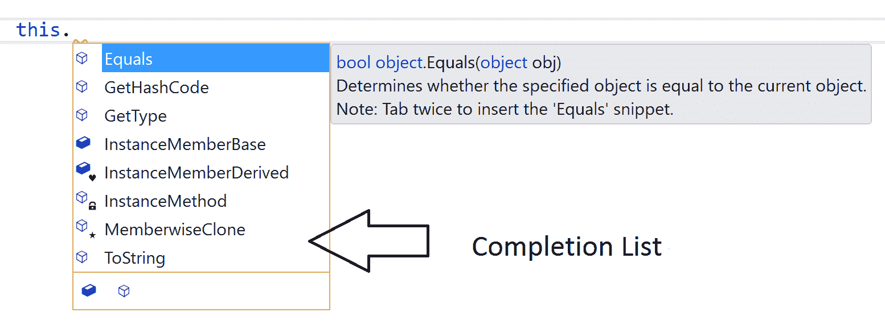

上述截图显示了一个包含当前类型及其基类型中所有可访问实例成员的完成列表，通常在用户在可执行代码中键入 `this.` 时显示。用户可以按提交字符，例如 *Enter* 键，以调用所选成员的自动完成。

在本节中，我们将编写一个 `CompletionProvider` 来提供相同的 *可访问成员* 完成项，但不需要用户在 `.` 字符之前输入 `this`（像我这样的懒惰人欢呼！）。此外，当在静态方法中调用时，完成提供程序将只提供完成列表中的 *静态* 可访问成员。

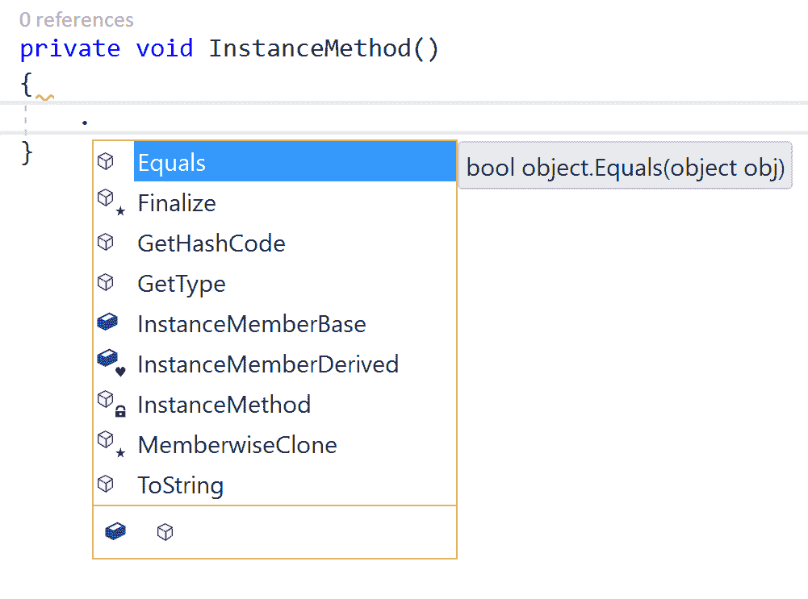

# 准备工作

您需要在您的机器上安装 Visual Studio 2017 才能执行本章中的配方。您可以从 [`www.visualstudio.com/thank-you-downloading-visual-studio/?sku=Community&rel=15`](https://www.visualstudio.com/thank-you-downloading-visual-studio/?sku=Community&rel=15) 安装免费的 Visual Studio 2017 社区版***。***

# 如何操作...

1.  打开 Visual Studio，单击文件 | 新建项目 | Visual C# | 类库，确保 .NET 框架组合框设置为 *v4.6.2*，并创建一个名为 `CompletionProvider` 的项目。

1.  在解决方案资源管理器中，右键单击项目节点并执行 `管理 NuGet 包` 命令以打开 NuGet 包管理器。将 NuGet 包引用添加到 `Microsoft.CodeAnalysis` 和 `Microsoft.CodeAnalysis.Features`，版本均为 *2.0.0.*。

1.  将源文件 `Class1.cs` 重命名为 `CustomCompletionProvider.cs`，并从 `CompletionProvider/CompletionProvider/CustomCompletionProvider.cs/Type` 中的代码示例添加 `CustomCompletionProvider` 的源代码。

1.  将名为 `CompletionProvider.Vsix` 的 C# VSIX 项目添加到解决方案中。

1.  将 VSIX 项目中的 `source.extension.vsixmanifest` 的内容替换为以下内容：

```cs
<?xml version="1.0" encoding="utf-8"?>
<PackageManifest Version="2.0.0"  >
 <Metadata>
 <Identity Id="CompletionProvider.Vsix.ccf1c2f5-d03f-42a2-a1b9-c05d10efda2c" Version="1.0" Language="en-US" Publisher="Packt publishing" />
 <DisplayName>CompletionProvider.Vsix</DisplayName>
 <Description>Roslyn completion provider.</Description>
 </Metadata>
 <Installation>
 <InstallationTarget Id="Microsoft.VisualStudio.Pro" Version="[15.0]" />
 </Installation>
 <Dependencies>
 <Dependency Id="Microsoft.Framework.NDP" DisplayName="Microsoft .NET Framework" d:Source="Manual" Version="[4.5,)" />
 </Dependencies>
 <Assets>
 <Asset Type="Microsoft.VisualStudio.MefComponent" d:Source="Project" d:ProjectName="CompletionProvider" Path="|CompletionProvider|"/>
 </Assets>
 <Prerequisites>
 <Prerequisite Id="Microsoft.VisualStudio.Component.CoreEditor" Version="[15.0,16.0)" DisplayName="Visual Studio core editor" />
 <Prerequisite Id="Microsoft.VisualStudio.Component.Roslyn.LanguageServices" Version="[15.0,16.0)" DisplayName="Roslyn Language Services" />
 </Prerequisites>
</PackageManifest>

```

1.  从 `CompletionProvider.Vsix` 添加项目到项目引用到 `CompletionProvider`。

1.  将 `CompletionProvider.Vsix` 设置为启动项目，并单击 *F5* 以构建完成提供程序并启动一个启用提供程序的新实例的 Visual Studio 进行调试。

1.  在新的 Visual Studio 实例中，创建一个新的 C# 类库项目，例如 `ClassLibrary`，并将以下代码添加到源文件中：

```cs
public class Base
{
 protected static int StaticMemberBase;
 public int InstanceMemberBase;
}

public class Derived : Base
{
 private static int staticMemberDerived;
 internal int InstanceMemberDerived;

 private void InstanceMethod()
 {
  .
 }

 private static void StaticMethod()
 {
  .
 }
}

```

1.  在 `InstanceMethod` 中的 `.` 后面放置光标，然后按 *Ctrl* + *SpaceBar* 以显示我们的自定义完成列表。验证类型为 `Derived` 的所有实例成员以及基类型 `Base` 和 `System.Object` 的可访问实例成员是否显示在完成列表中。

1.  选择一个成员，例如 `InstanceMemberDerived`，然后按 *Enter* 键，并验证 `.` 是否被替换为 `this.InstanceMemberDerived`。

1.  在 `StaticMethod` 中的 `.` 后放置光标，然后按 *Ctrl* + *Spacebar* 来弹出完成列表。验证类型为 *Derived* 的所有静态成员以及基类型 `Base` 和 `System.Object` 的可访问静态成员是否显示在完成列表中。

1.  选择一个成员，例如 `StaticMemberBase`，然后按 *Enter* 键，并验证 `.` 是否被替换为 `Base.StaticMemberBase`。

# 它是如何工作的……

完成提供者是 VS IDE 扩展，可以在用户编辑源代码时向 Visual Studio IDE 注册要显示的完成项。`CompletionProvider` 上的主要 API 包括：

+   `ShouldTriggerCompletion` 方法（虚拟）：这是决定是否为给定的编辑上下文调用完成的方法。此方法接受以下参数：正在编辑的文档的 `SourceText`、完成调用时的 `caretPosition`、包含触发类型（插入、删除等）和触发字符的 `CompletionTrigger`，以及完成项的 `OptionSet`。

+   `ProvideCompletionsAsync` 方法（抽象）：这是注册完成项的方法。当完成引擎需要计算在 VS IDE 中当前完成触发器上提供的完成时，会调用此方法。此方法接受一个 `CompletionContext` 参数，它包含当前光标位置、文档、完成触发器和选项。`CompletionContext` 提供了添加一个或多个完成项的方法。`CompletionItem` 包含以下主要组件：要在完成列表中显示的 `DisplayText`、可选的 `FilterText` 和 `SortText` 以修改默认的过滤和排序，与完成关联的语法元素的文本 `Span`、一个 `<string, string>` 属性字典、一个 `Tags` 数组以及完成项的处理规则集。

+   `GetDescriptionAsync` 方法（虚拟）：此方法获取要显示在每个完成项快速信息中的描述。

+   `GetChangeAsync` 方法（虚拟）：此方法获取当用户提交特定完成项时要应用的 `CompletionChange`。`CompletionChange` 包含要应用到文档中的一组文本更改以及提交完成项后的新光标位置。

让我们详细说明我们 `CustomCompletionProvider` 中前面重写的每个覆盖方法的实现细节。

我们对 `ShouldTriggerCompletion` 的实现首先检查是否为插入触发器调用了完成：

```cs
public override bool ShouldTriggerCompletion(SourceText text, int caretPosition, CompletionTrigger trigger, OptionSet options)
{
 switch (trigger.Kind)
 {
  case CompletionTriggerKind.Insertion:
   return ShouldTriggerCompletion(text, caretPosition);

  default:
   return false;
 }
}

```

辅助方法 `ShouldTriggerCompletion` 检查当前字符是否为 `.`，以及前一个字符是否为空格、制表符或换行符。如果是这样，我们返回 true；否则返回 false。

```cs
private static bool ShouldTriggerCompletion(SourceText text, int position)
{
 // Provide completion if user typed "." after a whitespace/tab/newline char.
 var insertedCharacterPosition = position - 1;
 if (insertedCharacterPosition <= 0)
 {
  return false;
 }

 var ch = text[insertedCharacterPosition];
 var previousCh = text[insertedCharacterPosition - 1];
 return ch == '.' &&
  (char.IsWhiteSpace(previousCh) || previousCh == 't' || previousCh == 'r' || previousCh == 'n');
}

```

`ProvideCompletionsAsync` 方法的实现首先检查我们是否应该注册任何完成项，如果不是在支持完成的环境中，则退出。我们也会在不在方法体内编辑时退出。

```cs
public async override Task ProvideCompletionsAsync(CompletionContext context)
{
 var model = await context.Document.GetSemanticModelAsync(context.CancellationToken).ConfigureAwait(false);
 var text = await model.SyntaxTree.GetTextAsync(context.CancellationToken).ConfigureAwait(false);
 if (!ShouldTriggerCompletion(text, context.Position))
 {
  return;
 }

 // Only provide completion in method body.
 var enclosingMethod = model.GetEnclosingSymbol(context.Position, context.CancellationToken) as IMethodSymbol;
 if (enclosingMethod == null)
 {
  return;
 }

```

然后，我们使用辅助方法`GetAccessibleMembersInThisAndBaseTypes`和`GetBaseTypesAndThis`计算当前上下文中的所有可访问成员：

```cs
private static ImmutableArray<ISymbol> GetAccessibleMembersInThisAndBaseTypes(ITypeSymbol containingType, bool isStatic, int position, SemanticModel model)
{
 var types = GetBaseTypesAndThis(containingType);
 return types.SelectMany(x => x.GetMembers().Where(m => m.IsStatic == isStatic && model.IsAccessible(position, m)))
 .ToImmutableArray();
}

private static IEnumerable<ITypeSymbol> GetBaseTypesAndThis(ITypeSymbol type)
{
 var current = type;
 while (current != null)
 {
  yield return current;
  current = current.BaseType;
 }
}

```

然后，我们遍历所有成员以建议，忽略构造函数，并为每个成员创建和注册一个完成项：

```cs
var membersToSuggest = GetAccessibleMembersInThisAndBaseTypes(
 enclosingMethod.ContainingType,
 isStatic: enclosingMethod.IsStatic,
 position: context.Position - 1,
 model: model);

// Add completion for each member.
foreach (var member in membersToSuggest)
{
 // Ignore constructors
 if ((member as IMethodSymbol)?.MethodKind == MethodKind.Constructor)
 {
  continue;
 }

 // Add receiver and description properties.
 var receiver = enclosingMethod.IsStatic ? member.ContainingType.ToDisplayString(SymbolDisplayFormat.MinimallyQualifiedFormat) : "this";
 var description = member.ToMinimalDisplayString(model, context.Position - 1);

 var properties = ImmutableDictionary<string, string>.Empty
  .Add(Receiver, receiver)
  .Add(Description, description);

 // Compute completion tags to display.
 var tags = GetCompletionTags(member).ToImmutableArray();

 // Add completion item.
 var item = CompletionItem.Create(member.Name, properties: properties, tags: tags);
 context.AddItem(item);
}

```

我们使用成员的`Name`属性作为完成项的`DisplayText`值。

我们计算了几个字符串，即`Receiver`和`Description`，并将它们作为字符串属性存储在完成项上。这些属性分别用于`GetChangeAsync`和`GetDescriptionAsync`方法的重写。`Receiver`基本上是用户提交完成项时添加到`.`字符左侧的字符串：例如实例成员的`this`，静态成员的包含类型的`name`。`Description`是显示在每个完成项快速信息中的文本。我们使用符号的最小显示字符串作为描述，但可以增强以显示带颜色的标记并使用符号上的 XML 文档注释中的内容。

我们还计算并附加一组字符串`Tags`到完成项。这些标签决定了完成项要显示的符号。例如，符号符号：字段、方法、属性等，以及可访问性符号：私有、受保护、内部、公共等。

`GetDescriptionAsync`重写直接使用存储在完成项上的`Description`属性来计算`CompletionDescription`：

```cs
public override Task<CompletionDescription> GetDescriptionAsync(Document document, CompletionItem item, CancellationToken cancellationToken)
{
 return Task.FromResult(CompletionDescription.FromText(item.Properties[Description]));
}

```

`GetChangeAsync`重写使用计算出的*Receiver*属性和项的`DisplayText`来形成用于文本更改的`newText "{receiver}.{item.DisplayText}"`。文本更改的`TextSpan`使用`item.Span.Start - 1`作为起始值，`1`作为长度，以考虑到要删除的现有`.`字符：

```cs
public override Task<CompletionChange> GetChangeAsync(Document document, CompletionItem item, char? commitKey, CancellationToken cancellationToken)
{
 // Get new text replacement and span.
 var receiver = item.Properties[Receiver];
 var newText = $"{receiver}.{item.DisplayText}";
 var newSpan = new TextSpan(item.Span.Start - 1, 1);

 // Return the completion change with the new text change.
 var textChange = new TextChange(newSpan, newText);
 return Task.FromResult(CompletionChange.Create(textChange));
}

```

# 为 CodeFixProvider 编写单元测试

在本节中，我们将向您展示如何编写和执行`CodeFixProvider`的单元测试。

# 准备工作

您需要创建并打开一个分析器+代码修复器项目，例如 Visual Studio 2017 中的`CSharpAnalyzers`。请参考第一章中的配方，“在 Visual Studio 中创建、调试和执行分析器项目”，以获取指导。

注意，模板单元测试项目包含了对`DiagnosticAnalyzer`和`CodeFixProvider`的单元测试。本章仅处理`CodeFixProvider`测试。请参考第一章中的配方，“为分析器项目编写单元测试”，以及“编写诊断分析器”部分，以了解诊断分析器单元测试。

# 如何操作...

1.  在解决方案资源管理器中打开`UnitTests.cs`文件，该文件位于`CSharpAnalyzers.Test`项目中，以查看为项目中的默认符号分析器和代码修复提供者创建的默认单元测试（类型名称不应包含小写字母）：

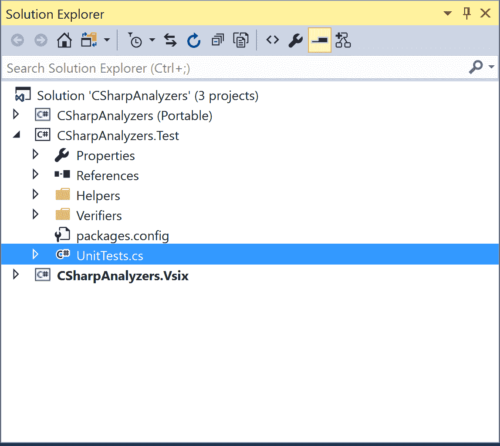

1.  点击测试 | 窗口 | 测试窗口以打开测试资源管理器窗口，查看项目中的单元测试。默认项目有两个单元测试：

    +   `TestMethod1`: 这个测试检查分析器诊断在测试代码上没有触发的情况。

    +   `TestMethod2`: 这个测试检查分析器诊断在测试代码上触发，并且代码修复提供者修复了诊断。

删除`TestMethod1`，因为我们只关心`CodeFixProvider`测试。

1.  通过在测试资源管理器中右键单击未运行测试节点并执行运行选定测试上下文菜单命令来运行项目的单元测试，并验证`TestMethod2`通过：

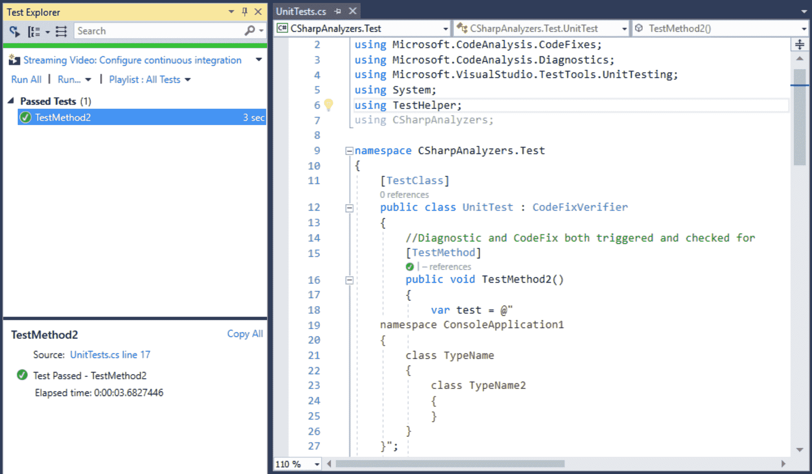

1.  编辑测试源代码，移除所有使用语句，并在测试字符串和`fixTest`字符串中`TypeName`内部添加一个新的嵌套类型`TypeName2`：

```cs
public void TestMethod2()
{
 var test = @"
  namespace ConsoleApplication1
  {
   class TypeName
   {
    class TypeName2
 {
 }
   }
  }";

 ...

 var fixtest = @"
  namespace ConsoleApplication1
  {
   class TYPENAME
   { 
    class TypeName2
 {
 } 
   }
  }";

```

1.  编辑`TestMethod1`以修复原始预期诊断的预期行号，并为新的测试代码添加一个新的预期诊断：

1.  在编辑器中右键单击`TestMethod2`并执行运行测试上下文菜单命令，并验证测试现在失败，诊断不匹配断言 - 预期 1，实际 2。

```cs
var expected = new[] {
 new DiagnosticResult {
  Id = "CSharpAnalyzers",
  Message = String.Format("Type name '{0}' contains lowercase letters", "TypeName"),
  Severity = DiagnosticSeverity.Warning,
  Locations =
   new[] { new DiagnosticResultLocation("Test0.cs", 4, 15) }
 },
 new DiagnosticResult {
 Id = "CSharpAnalyzers",
 Message = String.Format("Type name '{0}' contains lowercase letters", "TypeName2"),
 Severity = DiagnosticSeverity.Warning,
 Locations =
 new[] { new DiagnosticResultLocation("Test0.cs", 6, 19) }
 }
};

```

1.  修复预期的`fixTest`代码以包含`TYPENAME2`，并验证测试现在通过。

1.  再次运行单元测试，并注意测试仍然失败，但现在失败的原因是固定测试代码中的差异 - `fixTest`中的类`TypeName2`使用小写字母，但实际测试代码中有`TYPENAME2`。

# 如何工作...

分析器 + 代码修复单元测试项目允许我们为我们的分析器/代码修复提供者在不同的代码样本上的执行编写单元测试。每个单元测试都带有`TestMethod`属性，并定义样本测试代码，分析器在代码上报告的预期诊断（如果有），执行代码修复提供者后的预期修复测试代码，以及调用测试辅助方法，这里`VerifyCSharpFix`*，*以验证代码修复。

要了解单元测试的基础知识和我们的单元测试框架的测试框架，请参阅食谱中的*如何工作...部分*，第一章中的*为诊断分析器编写单元测试*。

在本节中，我们将简要解释我们的单元测试容器从其中派生的抽象类型：`CodeFixVerifier`。此类型包含用于运行 C#和 VB `CodeFixProvider`单元测试的辅助方法`VerifyCSharpFix`和`VerifyBasicFix`。这些方法调用一个公共辅助方法`VerifyFix`，其工作方式如下：

1.  此方法接受原始和预期样本测试代码作为输入 - 应用代码修复的原始代码，以及应用代码修复后的预期代码。

1.  它还获取语言名称、分析器、代码修复提供者，以及要应用的代码操作的索引，以防修复器注册了多个代码操作。

1.  它在原始测试代码上运行分析器以获取分析器诊断。它还在测试代码上计算编译器诊断。

1.  它使用第一个分析器诊断来创建一个 `CodeFixContext`，并使用此上下文调用代码修复提供者的 `RegisterCodeFixesAsync` 方法。

1.  然后，它将在给定的代码修复索引处应用已注册的代码操作来计算新文档。

1.  它在新文档上重新执行分析器以获取新的分析器诊断。

1.  直到至少有一个新的分析器诊断出现，它将重复步骤 4-6 以在新文档上应用代码修复。

1.  最后，它将新文档的内容与预期的修复代码进行验证。
