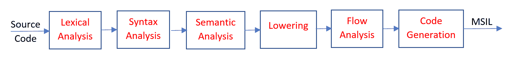
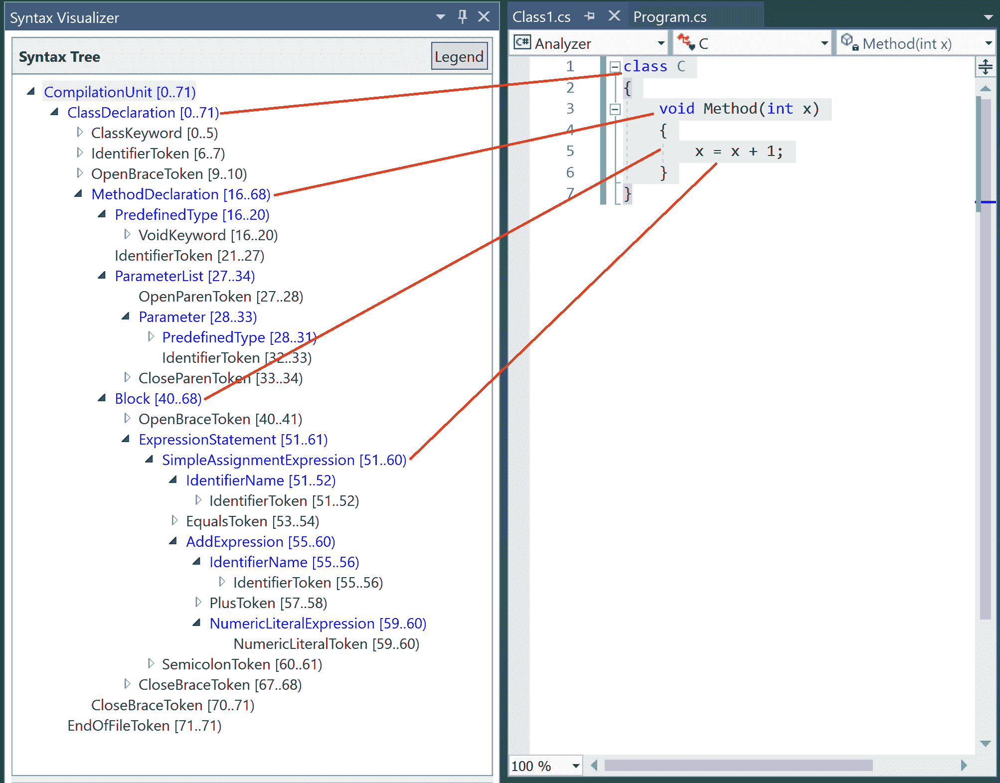
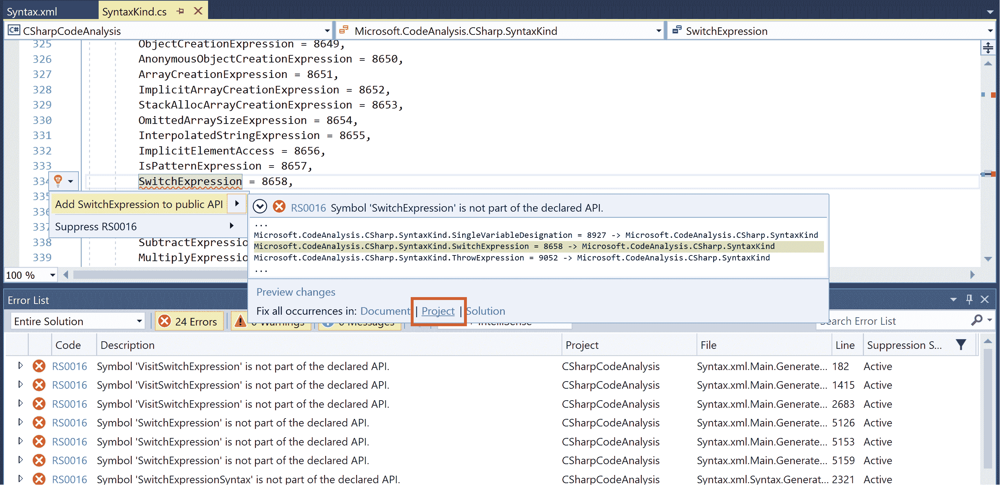
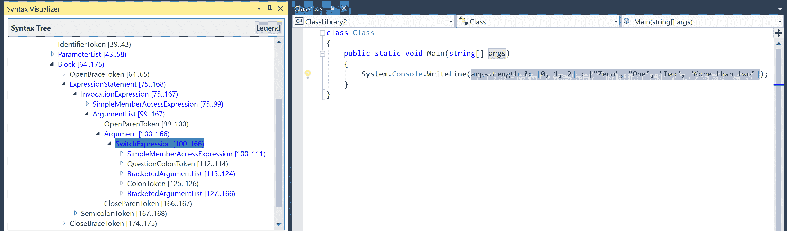
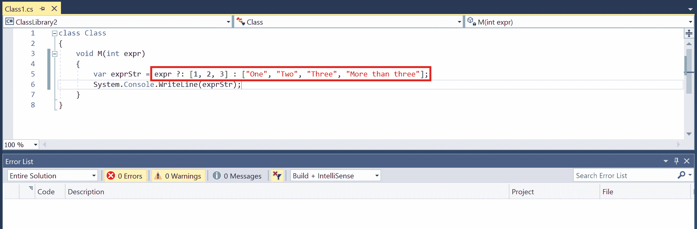
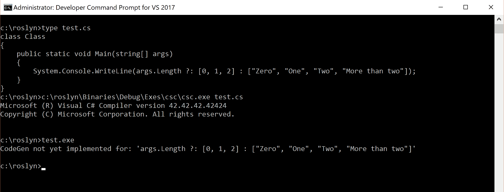
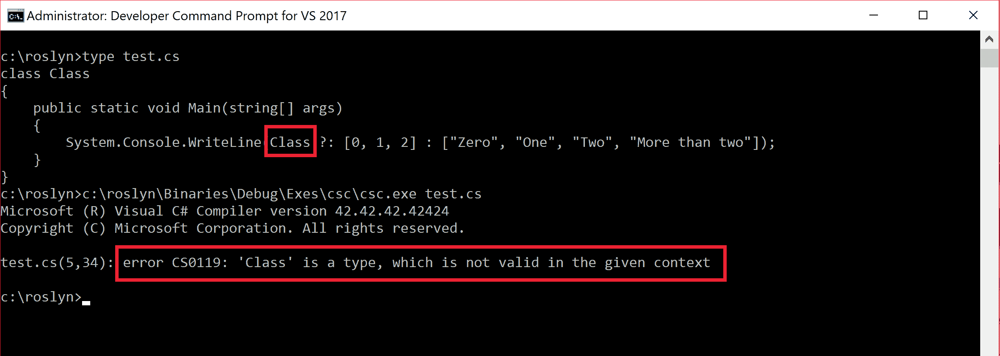
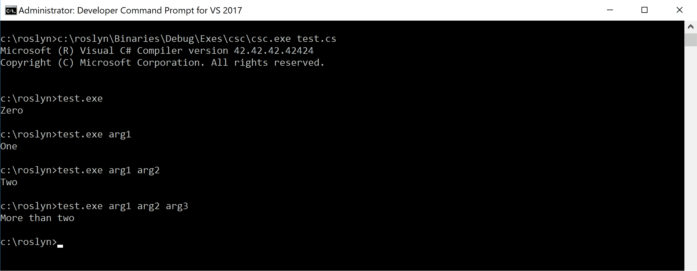
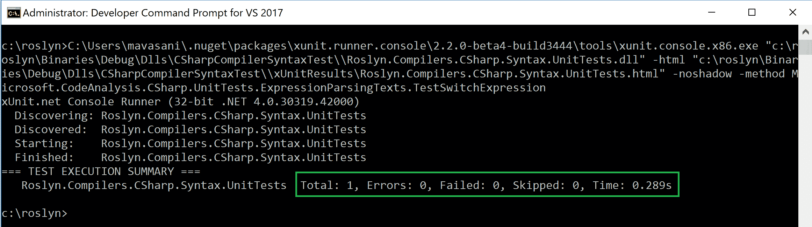

# 第九章：设计和实现一个新的 C#语言特性

在本章中，我们将介绍以下内容：

+   设计一个新 C#语言特性的语法和语法规则

+   实现对新 C#语言特性的解析器支持

+   实现对新 C#语言特性的绑定/语义分析支持

+   实现对新 C#语言特性的降低/代码生成支持

+   编写 C#解析、绑定和代码生成阶段的单元测试

# 简介

本章使开发者能够设计一个新的 C#语言特性，并实现该语言特性的各种编译器阶段。从高层次来看，C#编译器有以下重要阶段：



+   **词法分析** ([`en.wikipedia.org/wiki/Lexical_analysis`](https://en.wikipedia.org/wiki/Lexical_analysis)): 这将源文件中的字符序列转换成诸如关键字、标识符、运算符等标记。`Lexer.Lex` ([`source.roslyn.io/#Microsoft.CodeAnalysis.CSharp/Parser/Lexer.cs,5ad0cc36317d33e7`](http://source.roslyn.io/#Microsoft.CodeAnalysis.CSharp/Parser/Lexer.cs,5ad0cc36317d33e7)) 是进入 C#词法分析器的主要入口点，它获取下一个标记并增加源文本中的当前位置。例如，考虑以下源代码：

```cs
class C
{
 void Method(int x)
 {
 x = x + 1;
 }
}

```

在词法分析过程中，这被转换成以下标记序列（为了简洁，省略了空白和换行杂项）：

```cs
class (Keyword) C (IdToken)
{ (OpenBraceToken)
 void (Keyword) Method (IdToken) ( (OpenParenToken) int (Keyword) x (IdToken) ) (CloseParenToken)
 { (OpenBraceToken)
  x (IdToken) = (EqualsToken) x (IdToken) + (PlusToken) 1 (NumericalLiteralToken) ; (SemiColonToken)
 } (CloseBraceToken)
} (CloseBraceToken)

```

+   **语法分析** ([`en.wikipedia.org/wiki/Parsing`](https://en.wikipedia.org/wiki/Parsing)): 这将词法分析阶段生成的标记序列转换成一个具有节点、标记和杂项的语法树。它还验证语法是否符合 C#语言规范，并生成语法诊断。`SyntaxFactory.ParseCompilationUnit` ([`source.roslyn.io/#q=SyntaxFactory.ParseCompilationUnit`](http://source.roslyn.io/#q=SyntaxFactory.ParseCompilationUnit)) 是进入 C#语言解析器的主要入口点，该解析器生成一个 `CompilationUnitSyntax` 节点，然后使用该节点创建一个以该节点为根的 `SyntaxTree`（参见 `CSharpSyntaxTree.Create` ([`source.roslyn.io/#Microsoft.CodeAnalysis.CSharp/Syntax/CSharpSyntaxTree.cs,d40da3b7b4e39486`](http://source.roslyn.io/#Microsoft.CodeAnalysis.CSharp/Syntax/CSharpSyntaxTree.cs,d40da3b7b4e39486))))。对于前面的示例源代码和词法标记，我们得到以下语法树：



+   **语义分析或绑定** ([`en.wikipedia.org/wiki/Semantic_analysis_(compilers)`](https://en.wikipedia.org/wiki/Semantic_analysis_(compilers))): 将解析阶段生成的语法树转换为带有 `BoundNodes` 的绑定树。绑定树本质上是一个具有与树中每个节点相关联的丰富语义信息的抽象语法树。在 CodeAnalysis 层提供的所有语义信息都来自与语法相关的绑定节点。此阶段分析源代码的语义，例如类型检查、方法重载解析、转换等，并生成语义诊断。绑定语句和表达式的入口点分别是 `Binder.BindStatement` ([`source.roslyn.io/#q=Binder.BindStatement`](http://source.roslyn.io/#q=Binder.BindStatement)) 和 `Binder.BindExpression` ([`source.roslyn.io/#q=Binder.BindExpression`](http://source.roslyn.io/#q=Binder.BindExpression))。对于前面的示例，为 `Method` 的方法体生成了以下绑定树：

```cs
BoundBlockStatement (1 statements) (Syntax: '{ ... }')
  BoundExpressionStatement (Syntax: 'x = x + 1;')
    BoundSimpleAssignmentExpression (Type: System.Int32) (Syntax: 'x = x + 1')
      Left: BoundParameterReferenceExpression (Type: System.Int32) (Syntax: 'x')
      Right: BoundBinaryOperatorExpression (IntegerAdd) (Type: System.Int32) (Syntax: 'x + 1')
          Left: BoundParameterReferenceExpression (Type: System.Int32) (Syntax: 'x')
          Right: BoundLiteralExpression (Type: System.Int32, Constant: 1) (Syntax: '1')

```

+   **降低复杂度**: 这将绑定阶段生成的绑定树转换为简化后的绑定树。例如，一个绑定 *for* 循环节点会被重写为一个带有标签和条件跳转的绑定块（参见 `LocalRewriter.RewriteForStatement` ([`source.roslyn.io/#q=RewriteForStatement`](http://source.roslyn.io/#q=RewriteForStatement))). `LocalRewriter.Rewrite` ([`source.roslyn.io/#Microsoft.CodeAnalysis.CSharp/Lowering/LocalRewriter/LocalRewriter.cs,c30511823bc3c19f`](http://source.roslyn.io/#Microsoft.CodeAnalysis.CSharp/Lowering/LocalRewriter/LocalRewriter.cs,c30511823bc3c19f)) 是编译中每个方法块降低的主要入口点。

+   **流分析** ([`en.wikipedia.org/wiki/Data-flow_analysis`](https://en.wikipedia.org/wiki/Data-flow_analysis)): 此阶段对降低后的绑定树进行基本的数据流和控制流分析，以生成不可达代码和未初始化变量诊断。`FlowAnalysisPass.Rewrite` ([`source.roslyn.io/#q=FlowAnalysisPass.Rewrite`](http://source.roslyn.io/#q=FlowAnalysisPass.Rewrite)) 是流分析阶段的主要入口点。

+   **代码生成** ([`en.wikipedia.org/wiki/Code_generation_(compiler)`](https://en.wikipedia.org/wiki/Code_generation_(compiler))): 这将降低后的绑定树转换为以字节序列表示的 MSIL，并将其输出到 .NET 程序集。`CodeGenerator.Generate` ([`source.roslyn.io/#Microsoft.CodeAnalysis.CSharp/CodeGen/CodeGenerator.cs,c28190700f8e314c`](http://source.roslyn.io/#Microsoft.CodeAnalysis.CSharp/CodeGen/CodeGenerator.cs,c28190700f8e314c)) 是代码生成的主要入口点。对于前面的代码示例，C# 编译器为 `Method` 生成了以下 MSIL：

```cs
.method private hidebysig instance void Method(int32 x) cil managed
{
  // Code size 7 (0x7)
  .maxstack 8
  IL_0000: nop
  IL_0001: ldarg.1
  IL_0002: ldc.i4.1
  IL_0003: add
  IL_0004: starg.s x
  IL_0006: ret
} // end of method C::Method

```

您可以在[`github.com/dotnet/roslyn/wiki/Roslyn%20Overview`](https://github.com/dotnet/roslyn/wiki/Roslyn%20Overview)上阅读关于 Roslyn 的更详细概述。

# 新语言特性：Switch 运算符(?::)

在本章中，我们将设计一个新的 C#语言特性，我们称之为*Switch 运算符(?::)*。这个特性来源于两个现有的 C#语言结构：switch 语句([`docs.microsoft.com/en-us/dotnet/csharp/language-reference/keywords/switch`](https://docs.microsoft.com/en-us/dotnet/csharp/language-reference/keywords/switch))和条件运算符`(?:)`([`docs.microsoft.com/en-us/cpp/cpp/conditional-operator-q`](https://docs.microsoft.com/en-us/cpp/cpp/conditional-operator-q))。它允许编写可以在多个表达式的值上切换的条件表达式，并返回相应的值或默认值。例如，考虑以下计算整型表达式字符串表示的 switch 语句：

```cs
public string GetString(int expression)
{
 string expressionStr;
 switch (expression)
 {
  case 1:
   expressionStr = "One";
   break;

  case 2:
   expressionStr = "Two";
   break;

  case 3:
   expressionStr = "Three";
   break;

  default:
   expressionStr = "More than three";
   break;
 }

 return expressionStr;
}

```

这段代码基本上是在不同的可能值上切换*表达式*，并返回其运行时值的描述性字符串。用户的潜在意图只是为*表达式*的不同可能值返回一个映射的表达式，并带有一些默认值。本章设计的 switch 运算符将允许您使用单个表达式重写前面的代码：

```cs
string expressionStr = expression ?: [1, 2, 3] : ["One", "Two", "Three", "More than three"];

```

# 设计新 C#语言特性的语法和语法

**语法**和**语法**是实现新语言特性的核心元素。本节将使您能够定义新 C#语言特性的语法（节点和标记）和语法：Switch 运算符`(?::)`。有关此运算符预期功能的详细信息，请参阅本章开头关于*新语言特性:* *Switch 运算符(?::)*的部分。

# 入门

您需要确保您已在您的机器上注册并构建了带有*VS2017*标签的 Roslyn 源。有关进一步指导，请参阅食谱，*设置 Roslyn 注册*。

第八章，*向 Roslyn C#编译器开源代码贡献简单功能*。

对于提到*在 C#语言规范中定义...*的食谱步骤，读者应在([`github.com/dotnet/roslyn/issues/new`](https://github.com/dotnet/roslyn/issues/new))上创建一个新的 GitHub 问题，并添加标签 Language-C#和 Area-Language Design，让语言团队审查规范。如果获得批准，审阅者将确保将其添加到 C#语言规范中。

# 如何做到这一点...

1.  在 C#语言规范中定义新三元运算符`?::`的语法：

```cs
switch-expression:
 null-coalescing-expression
 null-coalescing-expression ?: bracketed-argument-list : bracketed-argument-list

 bracketed-argument-list:
 [ argument-list ]

```

1.  在 C#语言规范中定义与新运算符和 switch 表达式相关的编译时语义：

形式为`expr ?: [label1, label2, ..., labeln] : [val1, val2, ..., valn, valn+1]`的 switch 表达式具有以下编译时语义：

+   switch 表达式的控制类型由与 switch 语句控制类型相同的规则集确定。

+   第一个括号参数列表 `[label1, label2, ..., labeln]` 必须包含具有隐式可转换为 switch 控制类型的常量值的表达式 labeli。如果同一个 switch 表达式中的两个或多个 `labeli` 指定相同的常量值，则编译时将发生错误。

+   第二个括号参数列表 `[val1, val2, ..., valn, valn+1]` 控制 switch 表达式的结果值类型。对列表中的每个 vali 和 valj 对执行以下检查必须得到类型 Z 的相同值；否则，将发生编译时错误：

    +   如果 `vali` 的类型为 X，而 `valj` 的类型为 Y，则：

        +   如果存在从 X 到 Y 的隐式转换，但不存在从 Y 到 X 的转换，则 Y 是表达式的类型（Z = Y）。

        +   如果存在从 Y 到 X 的隐式转换，但不存在从 X 到 Y 的转换，则 X 是表达式的类型（Z = X）。

        +   否则，无法确定表达式类型，编译时将发生错误。

    +   如果只有 `vali` 或 `valj` 中的一个有类型，并且 `vali` 和 `valj` 都可以隐式转换为类型 Z，则该类型是表达式的类型。

    +   否则，无法确定表达式类型，编译时将发生错误。

1.  在 C# 语言规范中定义新操作符的关联性和优先级：

switch 操作符是右结合的，这意味着操作是从右到左分组的。

switch 操作符与其他三元操作符（如条件操作符 `?:`）具有相同的优先级。

1.  在 C# 语言规范中定义 switch 表达式的运行时执行语义：

switch 表达式的评估如下：

+   评估表达式 `expr` 并将其转换为控制类型。

+   如果在同一个 switch 表达式中第一个括号列表指定的 n 个常量之一，例如 `labeli`，等于表达式 `expr` 的值，则评估第二个括号列表中的表达式 `vali` 并将其转换为类型 Z，并成为表达式的结果值。

+   如果在同一个 switch 表达式中第一个括号列表指定的 n 个常量中没有与表达式 `expr` 的值相等的，则评估第二个括号列表中的最后一个表达式 `valn+1` 并将其转换为类型 Z，并成为表达式的结果值。

1.  在 Visual Studio 2017 中打开 `Roslyn.sln` 并打开源文件 `%REPO_ROOT%\src\Compilers\CSharp\Portable\Syntax\SyntaxKind.cs`。在 77 行和 334 行分别添加新的 `SyntaxKinds` 以支持 `QuestionColonToken` 和 `SwitchExpression`：

```cs
QuestionColonToken = 8284,
...
SwitchExpression = 8658,

```

1.  在源文件 `%REPO_ROOT%\src\Compilers\CSharp\Portable\Syntax\Syntax.xml` 中添加新的语法节点 `SwitchExpressionSyntax` 的 XML 定义，包含字段 `Expression`、`QuestionColonToken`、`Labels`、`ColonToken` 和 `Values`，在 686 行：

```cs
  <Node Name="SwitchExpressionSyntax" Base="ExpressionSyntax">
    <Kind Name="SwitchExpression"/>
    <Field Name="Expression" Type="ExpressionSyntax">
      <PropertyComment>
        <summary>ExpressionSyntax node representing the expression of the switch expression.</summary>
      </PropertyComment>
    </Field>
    <Field Name="QuestionColonToken" Type="SyntaxToken">
      <Kind Name="QuestionColonToken"/>
      <PropertyComment>
        <summary>SyntaxToken representing the question mark.</summary>
      </PropertyComment>
    </Field>
    <Field Name="Labels" Type="BracketedArgumentListSyntax">
      <PropertyComment>
        <summary>BracketedArgumentListSyntax node representing comma separated labels to switch on.</summary>
      </PropertyComment>
    </Field>
    <Field Name="ColonToken" Type="SyntaxToken">
      <Kind Name="ColonToken"/>
      <PropertyComment>
        <summary>SyntaxToken representing the colon.</summary>
      </PropertyComment>
    </Field>
    <Field Name="Values" Type="BracketedArgumentListSyntax">
      <PropertyComment>
        <summary>BracketedArgumentListSyntax node representing the comma separated expression results.</summary>
      </PropertyComment>
    </Field>
    <TypeComment>
      <summary>Class which represents the syntax node for switch expression.</summary>
    </TypeComment>
    <FactoryComment>
      <summary>Creates a SwitchExpressionSyntax node.</summary>
    </FactoryComment>
  </Node>

```

1.  构建项目`CSharpCodeAnalysis`以自动生成之前添加的新`SwitchExpressionSyntax`节点生成的源代码。请注意，由于我们尚未将新的公共类型添加到公共 API 表面，构建将因一系列*RS0016*错误而失败。

1.  切换回源文件`%REPO_ROOT%\src\Compilers\CSharp\Portable\Syntax\SyntaxKind.cs`，并在第 334 行使用*Ctrl* + *.*调用代码修复，以定义`SwitchExpression`，并应用项目中的所有出现以修复所有*RS0016*诊断：



1.  再次构建项目并验证这次是否成功。

您可以在[`github.com/mavasani/roslyn/commit/4b50f662c53e1b9fc83f81a819f29d11b85505d5`](https://github.com/mavasani/roslyn/commit/4b50f662c53e1b9fc83f81a819f29d11b85505d5)查看此配方中做出的所有源代码更改。

# 它是如何工作的...

在本配方的前半部分，我们介绍了定义新 switch 表达式/运算符的语法、编译时和运行时语义、结合性和优先级的步骤。在下半部分，我们在编译器中定义了新的语法类型和语法节点。

新的 switch 表达式/运算符的语法、结合性和优先级与现有条件三元表达式的语法相同。

由于三元运算符在优先级顺序中紧接在空合并运算符（??）之后，语法指定：

```cs
switch-expression:
 null-coalescing-expression
 null-coalescing-expression ?: bracketed-argument-list : bracketed-argument-list

```

语法指定 switch 表达式的标签和值为一个逗号分隔的参数列表，位于方括号内，例如，`[ arg1[,] arg[2], ..., arg[n] ]`。以下是一些表达式的示例：

```cs
// Valid syntax cases
expression ?: [1, 2, 3] : ["One", "Two", "Three", "More than three"];
expression ?: [MethodCall1()] : ["One", "Two", "Three", "More than three"]; // invalid semantics

// Invalid syntax cases
expression ?: [MethodCall1(), 2] : "One"; // argument lists must be bracketed
expression ?: [MethodCall1(), MethodCall2()]; // missing colon and argument list

```

编译时语义强制要求被切换的表达式的类型与 switch 语句的 switch 控制类型具有相同的语义要求：

switch 语句的控制类型由 switch 表达式确定。如果 switch 表达式的类型是 sbyte、byte、short、ushort、int、uint、long、ulong、char、string 或枚举类型，那么这就是 switch 语句的控制类型。否则，必须存在从 switch 表达式类型到以下可能控制类型之一的确切用户定义的隐式转换（第 6.4 节）：sbyte、byte、short、ushort、int、uint、long、ulong、char、string。如果不存在此类隐式转换，或者存在多个此类隐式转换，则编译时将发生错误。

编译时语义还强制要求：

+   第一个括号内的参数列表必须是所有常量标签，这样就有隐式转换为 switch 控制类型的转换

+   第二个参数列表的长度必须比第一个列表长一个，并且所有参数都必须是表达式，这样它们可以转换为具有隐式转换的公共类型`Z`

以下是一些语义有效和无效的 switch 表达式的示例：

```cs
string expression = ...

// Valid syntax and semantics
expression ?: [1, 2, 3] : ["One", "Two", "Three", "More than three"];

// Invalid semantics, valid syntax
expression ?: [MethodCall1(), 2] : ["One", "Two", "Three"]; // non constant label
expression ?: [1.0] : ["One", "Two"]; // No implicit conversion from label to switch governing type
expression ?: [1] : ["One", 1.0]; // No implicit conversions to a common type between "One" and 1.0

```

Switch 表达式的运行时语义与 switch 语句相同。首先评估我们切换的表达式，并将其值与第一个参数列表中的每个标签进行比较。对于匹配项，我们评估第二个列表中的相应表达式并将其转换为类型 `Z`，这成为表达式的结果。如果没有匹配项，则评估第二个参数列表中的最后一个表达式并将其转换为类型 `Z`，这成为表达式的默认结果：

```cs
Console.WriteLine(expression ?: [1, 2, 3] : ["One", "Two", "Three", "More than three"]);

// expression == 1, prints "One"
// expression == 2, prints "Two"
// expression == 3, prints "Three"
// otherwise, prints "More than three"

```

# 实现对新的 C# 语言功能的解析器支持

**词法分析** 和 **语法分析**（**解析**）是 C# 编译器的初始阶段，将输入源文本转换为具有节点和标记的语法树，并报告语法诊断。本节将使您能够为新的 C# 语言功能添加词法分析和解析器支持：*Switch 操作符 (?::)*。有关此操作符预期功能的信息，请参阅本章开头的 *新语言功能：Switch 操作符 (?::)* 部分。有关此操作符的语法和语法定义的详细信息，请参阅前面的配方。

# 入门

您需要确保在您的机器上已 enlist 并使用 *VS2017* 标签构建了 Roslyn 源代码。有关进一步指导，请参阅配方，*设置 Roslyn*，*enlistment* 在 第八章，*向 Roslyn C# 编译器开源代码贡献简单功能*。

此外，在您的 enlistment 上 git commit [`github.com/mavasani/roslyn/commit/4b50f662c53e1b9fc83f81a819f29d11b85505d5`](https://github.com/mavasani/roslyn/commit/4b50f662c53e1b9fc83f81a819f29d11b85505d5) 以获取语法定义并构建 `CSharpCodeAnalysis` 项目。

# 如何操作...

1.  在 Visual Studio 2017 中打开 `Roslyn.sln`

1.  打开源文件 `%REPO_ROOT%\src\Compilers\CSharp\Portable\Parser\Lexer.cs` 并在方法 `ScanSyntaxToken` 的第 565 行添加高亮的 `else if` 语句：*

```cs
case '?': 
 if (TextWindow.PeekChar() == '?')
 { ...
 }
 else if (TextWindow.PeekChar() == ':')
 {
 TextWindow.AdvanceChar();
 info.Kind = SyntaxKind.QuestionColonToken;
 }
 else
 { ...
 }

```

1.  打开源文件 `%REPO_ROOT%\src\Compilers\CSharp\Portable\Parser\LanguageParser.cs` 并在方法 `ParseSubExpressionCore` 的第 9426 行添加高亮显示的 `else if` 语句：

```cs
if (tk == SyntaxKind.QuestionToken && precedence <= Precedence.Ternary)
{ ...
}
else if (tk == SyntaxKind.QuestionColonToken && precedence <= Precedence.Ternary)
{
 var questionColonToken = this.EatToken();
 var labels = this.ParseBracketedArgumentList();
 var colon = this.EatToken(SyntaxKind.ColonToken);
 var values = this.ParseBracketedArgumentList();
 leftOperand = _syntaxFactory.SwitchExpression(leftOperand, questionColonToken, labels, colon, values);
}

return leftOperand;

```

1.  在同一文件（方法 `CanFollowCast`*）的第 10552 行添加高亮显示的 case 子句：

```cs
 case SyntaxKind.EndOfFileToken:
 case SyntaxKind.QuestionColonToken:
  return false;

```

1.  打开源文件 `%REPO_ROOT%\src\Compilers\CSharp\Portable\Syntax\SyntaxKindFacts.cs` 并在方法 `GetText` 的第 1278 行添加高亮显示的 case 子句：*

```cs
 case SyntaxKind.XmlProcessingInstructionEndToken:
  return "?>";
 case SyntaxKind.QuestionColonToken:
 return "?:";
 ...

```

1.  将 `Roslyn.csproj` 设置为启动项目。

1.  将解决方案配置从调试更改为发布（以避免绑定器中的断言）并重新构建解决方案。

1.  按 *Ctrl* + *F5* 以从 `RoslynDev` hive 启动 VS 的新实例并应用我们的本地更改。

1.  在新的 VS 实例中，创建一个新的 C# 类库项目并添加以下代码，该代码使用新的 switch 操作符：

```cs
class Class
{
 void M(int expr)
 {
  var exprStr = expr ?: [1, 2, 3] : ["One", "Two", "Three", "More than three"];
  System.Console.WriteLine(exprStr);
 }
}

```

1.  从“查看”菜单中选择“其他窗口”中的“Roslyn 语法可视化器”，然后在编辑器中选择 switch 表达式，以查看表达式的解析语法节点和标记。有关语法可视化器的指导，请参考食谱，“使用 Roslyn 语法可视化器查看源文件的 Roslyn 语法标记和节点”在第八章，“向 Roslyn C# 编译器开源代码贡献简单功能”。



1.  验证错误列表中没有波浪线或智能感知错误：



1.  删除冒号标记和第二个括号内的参数列表，即 `: ["One", "Two", "Three", "More than three"]`，并验证你会在 switch 表达式中因为缺少标记而得到语法错误：

```cs
Error CS1003 Syntax error, ':' expected ClassLibrary <%PROJECT_DIR%>\ClassLibrary\Class1.cs 5
Error CS1003 Syntax error, '[' expected ClassLibrary <%PROJECT_DIR%>\ClassLibrary\Class1.cs 5
Error CS1003 Syntax error, ']' expected ClassLibrary <%PROJECT_DIR%>\ClassLibrary\Class1.cs 5

```

1.  撤销步骤 11，然后尝试构建项目并验证它因为 `CSC : error CS7038: Failed to emit module 'ClassLibrary'` 而失败，因为我们尚未为新的结构实现任何绑定或代码生成。

你可以在[`github.com/mavasani/roslyn/commit/24144442e4faa9c54fe2a4b519455a1a45c29569`](https://github.com/mavasani/roslyn/commit/24144442e4faa9c54fe2a4b519455a1a45c29569)查看在这个食谱中做出的所有源代码更改。

# 如何工作...

在这个食谱中，我们为 switch 运算符（?:）添加了基本的词法分析和解析器支持。词法分析器主要负责扫描文本并生成标记。LanguageParser 负责解析词法标记并生成带有节点和标记的语法树。

让我们遍历这个食谱中的代码更改。我们向词法分析器中添加了以下高亮代码：

```cs
case '?': 
 if (TextWindow.PeekChar() == '?')
 { ...
 }
 else if (TextWindow.PeekChar() == ':')
 {
 TextWindow.AdvanceChar();
 info.Kind = SyntaxKind.QuestionColonToken;
 }
 else
 { ...
 }

```

在原始代码中，当我们扫描文本并识别到 `'?'` 字符时，我们会查看下一个字符以识别它是否是另一个 `'?'` 字符（?? 空合并运算符）或空白（条件运算符的 `?` 标记）。我们新的代码添加了一个额外的检查，以确定下一个字符是否是 `':'`（switch 运算符的 `?:` 标记）。如果是这样，它将文本窗口中的当前字符向前移动，并将当前标记的语法类型设置为 `SyntaxKind.QuestionColonToken`。

我们向解析器中添加了以下高亮代码：

```cs
if (tk == SyntaxKind.QuestionToken && precedence <= Precedence.Ternary)
{ ...
}
else if (tk == SyntaxKind.QuestionColonToken && precedence <= Precedence.Ternary)
{
 var questionColonToken = this.EatToken();
 var labels = this.ParseBracketedArgumentList();
 var colon = this.EatToken(SyntaxKind.ColonToken);
 var values = this.ParseBracketedArgumentList();
 leftOperand = _syntaxFactory.SwitchExpression(leftOperand, questionColonToken, labels, colon, values);
}

```

我们扩展了原始代码，该代码在解析器中解析 `QuestionToken` 时，也检查了 `QuestionColonToken` 和三元运算符的优先级。如果是这样，我们将下一个标记作为 `questionColonToken` 消费。然后，我们通过调用 `EatToken` 并传递冒号标记的预期语法类型来解析冒号标记。此方法处理有效和无效标记的情况：

```cs
protected SyntaxToken EatToken(SyntaxKind kind)
{
 Debug.Assert(SyntaxFacts.IsAnyToken(kind));

 var ct = this.CurrentToken;
 if (ct.Kind == kind)
 {
  MoveToNextToken();
  return ct;
 }

 //slow part of EatToken(SyntaxKind kind)
 return CreateMissingToken(kind, this.CurrentToken.Kind, reportError: true);
}

```

对于期望类型的有效标记，它移动到下一个标记并返回当前冒号标记。如果下一个标记不是期望的类型，它将生成一个缺失的标记，并报告缺失标记的语法诊断：

```cs
*Error CS1003 Syntax error, **':' expected** ClassLibrary <%PROJECT_DIR%>\ClassLibrary\Class1.cs 5*

```

最后，我们将 *值* 作为另一个括号参数列表进行解析。我们调用新自动生成的语法工厂辅助程序 `SwitchExpression` 来生成带有解析标记的 `SwitchExpressionSyntax` 节点。

# 实现对新的 C# 语言特性的绑定/语义分析支持

**语义分析**（**绑定**）是 C# 编译器的中间阶段，将语法树转换为 C# 绑定树并报告语义诊断。本节将使你能够为新的 C# 语言特性添加绑定支持：`Switch 操作符 (?::)`。有关此操作符预期功能的信息，请参阅本章开头部分，*新语言特性：Switch 操作符 (?::)*。有关此操作符的语法和语法定义的详细信息，请参阅本章第一道菜谱，*为新的 C# 语言特性设计语法和语法*。

# 入门

你需要确保你在机器上已经使用带有 *VS2017* 标签的 enlistment 并构建了 Roslyn 源代码。有关进一步指导，请参阅菜谱，*设置 Roslyn enlistment* 在 第八章，*向 Roslyn C# 编译器开源代码贡献简单功能*。

此外，在你的 enlistment 上进行以下两个 git 提交以获取语法定义和解析器支持，分别构建 `CSharpCodeAnalysis` 项目：

+   [`github.com/mavasani/roslyn/commit/4b50f662c53e1b9fc83f81a819f29d11b85505d5`](https://github.com/mavasani/roslyn/commit/4b50f662c53e1b9fc83f81a819f29d11b85505d5)

+   [`github.com/mavasani/roslyn/commit/24144442e4faa9c54fe2a4b519455a1a45c29569`](https://github.com/mavasani/roslyn/commit/24144442e4faa9c54fe2a4b519455a1a45c29569)

# 如何做到这一点...

1.  在 Visual Studio 2017 中打开 `Roslyn.sln`

1.  打开源文件 `%REPO_ROOT%\src\Compilers\CSharp\Portable\BoundTree\BoundNodes.xml` 并在第 437 行添加以下 `BoundSwitchOperator` 定义：*

```cs
<Node Name="BoundSwitchOperator" Base="BoundExpression">
 <!-- Non-null type is required for this node kind -->
 <Field Name="Type" Type="TypeSymbol" Override="true" Null="disallow"/>

 <Field Name="Expression" Type="BoundExpression"/>
 <Field Name="Labels" Type="ImmutableArray&lt;BoundExpression&gt;"/>
 <Field Name="Values" Type="ImmutableArray&lt;BoundExpression&gt;"/>
</Node>

```

1.  打开源文件 `%REPO_ROOT%\src\Compilers\CSharp\Portable\Binder\Binder_Expression.cs` 并在 `BindExpressionInternal` 方法中的第 535 行添加 `switch` 部分：

```cs
case SyntaxKind.SwitchExpression:
 return BindSwitchOperator((SwitchExpressionSyntax)node, diagnostics);

```

1.  从附加的代码示例源文件 `CSharpCodeAnalysis\Binder_Operators.cs` 复制 `BindSwitchOperator` 和 `BindSwitchOperatorArguments` 方法的实现，并将其粘贴到源文件 `%REPO_ROOT%\src\Compilers\CSharp\Portable\Binder\Binder_Operators.cs` 的第 3521 行。

1.  从附加的代码示例源文件 `CSharpCodeAnalysis\Expression.cs` 复制 `BoundSwitchOperator` 的部分类型定义，并将其粘贴到源文件 `%REPO_ROOT%\src\Compilers\CSharp\Portable\BoundTree\Expression.cs` 的第 1221 行。

1.  将新的源文件 `%REPO_ROOT%\src\Compilers\CSharp\Portable\Lowering\LocalRewriter\LocalRewriter_SwitchOperator.cs` 添加到项目 `CSharpCodeAnalysis` 中，并使用从 `CSharpCodeAnalysis\LocalRewriter_SwitchOperator.cs` 复制的 switch 运算符降级实现作为占位符：

```cs
public override BoundNode VisitSwitchOperator(BoundSwitchOperator node)
{
 // TODO: Implement lowering for switch operator.
 return MakeLiteral(node.Syntax,
  ConstantValue.Create($"CodeGen not yet implemented for: '{node.Syntax.ToString()}'"),
  _compilation.GetSpecialType(SpecialType.System_String));
}

```

1.  在 `%REPO_ROOT%\src\Compilers\CSharp\Portable\FlowAnalysis\PreciseAbstractFlowPass_Switch.cs` 文件的第 260 行添加 switch 运算符的占位符流分析实现：

```cs
public override BoundNode VisitSwitchOperator(BoundSwitchOperator node)
{
 // TODO: Implement flow analysis for switch operator.
 return null;}

```

1.  使用我们的本地更改构建项目 `csc.csproj` 以生成 `%REPO_ROOT%\Binaries\Debug\Exes\csc\csc.exe`。

1.  创建一个新的源文件，例如 `test.cs`，并包含以下源代码：

```cs
class Class
{
 public static void Main(string[] args)
 {
  System.Console.WriteLine(args.Length ?: [0, 1, 2] : ["Zero", "One", "Two", "More than two"]);
 }}

```

1.  使用本地构建的 `csc.exe` 编译此源文件，并验证构建是否成功。

1.  运行生成的可执行文件 `test.exe` 并验证其运行良好，但由于 switch 运算符的占位符代码生成实现，输出仍然不是预期的结果：



您可以在[`github.com/mavasani/roslyn/commit/7a666595c8bf8d5e8c897540ec85ae3fa9fc5236`](https://github.com/mavasani/roslyn/commit/7a666595c8bf8d5e8c897540ec85ae3fa9fc5236) 查看在此配方中做出的所有源代码更改。

# 它是如何工作的...

在此配方中，我们为 switch 运算符 `(?:)` 添加了基本的绑定/语义分析支持，这使得我们能够使用此新运算符编译和执行源代码。请注意，这并不是此运算符绑定阶段的全面实现，需要进一步的工作，例如增强错误报告。请参阅本配方中的下一节，*还有更多...*，以获取更多详细信息。

C# 绑定器负责对解析器生成的语法树进行语义分析。它将语法树转换为带有 `BoundNodes` 的绑定树，这本质上是一个与树中每个节点相关联的丰富语义信息的抽象语法树。

我们首先在模板文件 `BoundNodes.xml` 中添加了一个新的 BoundNode 定义，`BoundSwitchOperator`**，**：

```cs
<Node Name="BoundSwitchOperator" Base="BoundExpression">
 <!-- Non-null type is required for this node kind -->
 <Field Name="Type" Type="TypeSymbol" Override="true" Null="disallow"/>

 <Field Name="Expression" Type="BoundExpression"/>
 <Field Name="Labels" Type="ImmutableArray&lt;BoundExpression&gt;"/>
 <Field Name="Values" Type="ImmutableArray&lt;BoundExpression&gt;"/>
</Node>

```

注意 switch 运算符的语法节点和绑定节点之间的区别。我们不再存储任何纯语法信息，例如问题冒号标记或参数列表周围的括号。switch 运算符所操作的表达式预期绑定到 `BoundExpression`，标签和值也预期是一个绑定表达式的列表。

构建 `CSharpCodeAnalysis` 项目作为预构建步骤运行生成器工具对 BoundNodes.xml 文件进行处理，以自动生成包含绑定节点源定义的 `BoundNodes.generated.cs` 文件。

在最新的 Roslyn 主分支中，`CSharpCodeAnalysis` 项目的构建过程中不再自动生成 `BoundNodes.generated.cs`，这是一个在 *VS2017* 之后的变化。在最新的源代码中，您必须显式运行以下脚本来自动生成此代码：[`github.com/dotnet/roslyn/blob/master/build/scripts/generate-compiler-code.cmd`](https://github.com/dotnet/roslyn/blob/master/build/scripts/generate-compiler-code.cmd)。

核心绑定支持涉及在 `BindExpressionInternal` 中追加切换情况，以处理 `SyntaxKind.SwitchExpression` 的语法节点并调用 `BindSwitchOperator` 方法。

我们向绑定器添加了新的方法 `BindSwitchOperator` 来处理 `SwitchExpressionSyntax` 节点的顶级绑定：

```cs
private BoundSwitchOperator ***BindSwitchOperator***(SwitchExpressionSyntax node, DiagnosticBag diagnostics)
{
 BoundExpression switchExpr = BindValue(node.Expression, diagnostics, BindValueKind.RValue);
 ImmutableArray<BoundExpression> labelsExpr = BindSwitchOperatorArguments(node.Labels, diagnostics);
 ImmutableArray<BoundExpression> valuesExpr = BindSwitchOperatorArguments(node.Values, diagnostics);

 // TODO: Add semantic validation for arguments and diagnostics.
 TypeSymbol type = valuesExpr.Length > 1 ? valuesExpr[0].Type : CreateErrorType();
 bool hasErrors = type.IsErrorType();

 return new BoundSwitchOperator(node, switchExpr, labelsExpr, valuesExpr, type, hasErrors);
}

```

我们使用 `BindValue` ([`source.roslyn.io/#Microsoft.CodeAnalysis.CSharp/Binder/Binder_Expressions.cs,608d49de0066ede1,references`](http://source.roslyn.io/#Microsoft.CodeAnalysis.CSharp/Binder/Binder_Expressions.cs,608d49de0066ede1,references)) 调用来绑定切换操作符的表达式作为值。这保证了节点表达式是一个实际的具有值的表达式，而不是类型。例如，当违反此规则时，我们会得到以下语义错误：



我们添加了新的方法 `BindSwitchOperatorArguments` 来绑定切换操作符的 `Labels` 和 `Values`：

```cs
private ImmutableArray<BoundExpression> BindSwitchOperatorArguments(BracketedArgumentListSyntax node, DiagnosticBag diagnostics)
{
 AnalyzedArguments analyzedArguments = AnalyzedArguments.GetInstance();
 ImmutableArray<BoundExpression> arguments;
 try
 {
  BindArgumentsAndNames(node, diagnostics, analyzedArguments);
  arguments = BuildArgumentsForErrorRecovery(analyzedArguments);
 }
 finally
 {
  analyzedArguments.Free();
 }

 return arguments;
}

```

此方法调用现有的绑定器方法 `BindArgumentsAndNames` ([`source.roslyn.io/#q=BindArgumentsAndNames`](http://source.roslyn.io/#q=BindArgumentsAndNames)) 来绑定参数列表，然后构建错误恢复的参数。

我们还添加了 `BoundSwitchOperator` 的存根部分类型实现，以实现 `IOperation` ([`source.roslyn.io/#Microsoft.CodeAnalysis/Operations/IOperation.cs,7743f66521e66763`](http://source.roslyn.io/#Microsoft.CodeAnalysis/Operations/IOperation.cs,7743f66521e66763)) API：

```cs
// TODO: Implement IOperation support for switch operator.
internal partial class BoundSwitchOperator
{
 protected override OperationKind ExpressionKind => OperationKind.None;

 public override void Accept(OperationVisitor visitor)
 {
  visitor.VisitNoneOperation(this);
 }

 public override TResult Accept<TArgument, TResult>(OperationVisitor<TArgument, TResult> visitor, TArgument argument)
 {
  return visitor.VisitNoneOperation(this, argument);
 }
}

```

`IOperation` 是一个正在编译器层中实现的新实验性功能，旨在将与编译器绑定节点相关的语义作为公开支持的 API 公开。截至 VS2017，该 API 未经发布或公开支持，未来版本可能会有所变化。

此外，我们还添加了流程分析和降级的存根实现，以便我们能够构建带有切换操作符的源代码，尽管生成的 MSIL 或编译可执行文件的结果与预期的最终结果不同。更具体地说，降级实现只是将整个 `BoundSwitchOperator` 节点替换为一个绑定的字符串字面量，表明尚未为新的切换操作符实现代码生成：

```cs
 return MakeLiteral(node.Syntax,
  ConstantValue.Create($"CodeGen not yet implemented for: '{node.Syntax.ToString()}'"),
  _compilation.GetSpecialType(SpecialType.System_String));

```

参考本章下一节了解如何实现操作符降级支持。

# 还有更多...

当前 switch 操作符的绑定实现有一系列待办工作项，主要与更全面的语义验证和错误生成相关。要实现验证的项目包括：

1.  添加对 switch 操作符表达式的类型进行语义验证，以确保其类型符合 switch 控制类型的需要；否则，生成编译时错误。

1.  为参数列表验证添加新的编译器诊断。例如：

    +   确保 values 中的表达式数量比 labels 中的表达式数量多一个；否则，生成编译时错误。

    +   确保所有标签都是编译时常量，并且可以隐式转换为控制 switch 的类型。如果不是这样，将生成所需的编译时错误。

1.  验证 Values 中的表达式类型是否可以隐式转换为表达式类型的公共类型 Z。

这些内容留作读者练习。关于在编译器代码库中实现新的语义错误的进一步指导，请参阅第八章中的食谱，“在 C#编译器代码库中实现新的语义错误”，在“向 Roslyn C#编译器开源代码贡献简单功能”一书中。

我们还添加了以下部分的基本存根实现，需要进一步改进：

1.  `IOperation`支持 switch 操作符：这涉及到为 switch 表达式创建一个新的`OperationKind`（[`source.roslyn.io/#Microsoft.CodeAnalysis/Operations/IOperationKind.cs,bf7324631c03b2e7`](http://source.roslyn.io/#Microsoft.CodeAnalysis/Operations/IOperationKind.cs,bf7324631c03b2e7)），添加一个新的接口，例如`ISwitchChoiceExpression`，具有以下 API 形状，然后在`BoundSwitchOperator`上实现此接口。

```cs
 /// <summary>
 /// Represents a C# switch operator.
 /// </summary>
 /// <remarks>
 /// This interface is reserved for implementation by its associated APIs. We reserve the right to
 /// change it in the future.
 /// </remarks>
 public interface ISwitchChoiceExpression : IOperation
 {
  /// <summary>
  /// Switch expression to be tested.
  /// </summary>
  IOperation SwitchExpression { get; }

  /// <summary>
  /// List of labels to compare the switch expression against.
  /// </summary>
  ImmutableArray<IOperation> SwitchLabels { get; }

  /// <summary>
  /// List of values corresponding to the labels.
  /// </summary>
  ImmutableArray<IOperation> SwitchValues { get; }
 }

```

1.  添加对 switch 操作符的 lowering 支持：这将在下一道食谱中介绍。

1.  添加对 switch 操作符的流分析支持：这在本书中没有介绍，但应该实现以确保在涉及 switch 操作符的代码中报告正确的流分析诊断。

# 实现对新 C#语言特性的 lowering/代码生成支持

**Lowering**是一个中间阶段，在绑定之后执行，将高级绑定树转换为简化绑定树。这些简化绑定树被提供给**代码生成**阶段，并转换为 MSIL 并输出到.NET 程序集。本节将使您能够添加对新 C#语言特性的 lowering 支持：Switch 操作符`(?::)`。这将使您能够编写、编译并正确执行使用新操作符的 C#程序。关于此操作符预期功能的具体信息，请参阅本章开头的部分，“新语言特性：Switch 操作符(?::)”。关于此操作符的语法和语法定义的详细信息，请参阅本章的第一道食谱，“为新的 C#语言特性设计语法和语法”。

# 入门

您需要确保在您的机器上已注册并构建了带有 *VS2017* 标签的 Roslyn 源代码。有关进一步指导，请参阅第八章中的配方 *设置 Roslyn 注册*，*向 Roslyn C# 编译器开源代码贡献简单功能*。

此外，在您的注册中执行以下三个 git 提交以获取语法定义、解析器支持和绑定支持，分别，并构建 `CSharpCodeAnalysis` 项目：

+   [`github.com/mavasani/roslyn/commit/4b50f662c53e1b9fc83f81a819f29d11b85505d5`](https://github.com/mavasani/roslyn/commit/4b50f662c53e1b9fc83f81a819f29d11b85505d5)

+   [`github.com/mavasani/roslyn/commit/24144442e4faa9c54fe2a4b519455a1a45c29569`](https://github.com/mavasani/roslyn/commit/24144442e4faa9c54fe2a4b519455a1a45c29569)

+   [`github.com/mavasani/roslyn/commit/7a666595c8bf8d5e8c897540ec85ae3fa9fc5236`](https://github.com/mavasani/roslyn/commit/7a666595c8bf8d5e8c897540ec85ae3fa9fc5236)

# 如何做到这一点...

1.  在 Visual Studio 2017 中打开 `Roslyn.sln`。

1.  从附件中的代码示例源文件 `CSharpCodeAnalysis\LocalRewriter_SwitchOperator.cs` 复制 `VisitSwitchOperator` 和 `RewriteSwitchOperator` 的方法实现，并将它们粘贴到源文件 `%REPO_ROOT%\src\Compilers\CSharp\Portable\Lowering\LocalRewriter\LocalRewriter_SwitchOperator.cs` 中。

1.  使用本地更改构建项目 `csc.csproj` 以生成 `%REPO_ROOT%\Binaries\Debug\Exes\csc\csc.exe`。

1.  创建一个新的源代码文件，例如 `test.cs`，包含以下源代码：

```cs
class Class
{
 public static void Main(string[] args)
 {
  System.Console.WriteLine(args.Length ?: [0, 1, 2] : ["Zero", "One", "Two", "More than two"]);
 }
}

```

1.  使用本地构建的 `csc.exe` 编译此源代码文件并验证构建是否成功。

1.  使用不同数量的参数运行生成的可执行文件 `test.exe` 并验证相应的输出是否符合预期的开关操作符。



1.  执行 `ildasm.exe test.exe` 命令并验证生成的可执行文件的 MSIL 包含对开关表达式与标签列表的顺序检查以及对相应值的条件分支。

```cs
.method public hidebysig static void Main(string[] args) cil managed
{
 .entrypoint
 // Code size 51 (0x33)
 .maxstack 8
 IL_0000: nop
 IL_0001: ldarg.0
 IL_0002: ldlen
 IL_0003: conv.i4
 IL_0004: brfalse.s IL_0027
 IL_0006: ldarg.0
 IL_0007: ldlen
 IL_0008: conv.i4
 IL_0009: ldc.i4.1
 IL_000a: beq.s IL_0020
 IL_000c: ldarg.0
 IL_000d: ldlen
 IL_000e: conv.i4
 IL_000f: ldc.i4.2
 IL_0010: beq.s IL_0019
 IL_0012: ldstr "More than two"
 IL_0017: br.s IL_001e
 IL_0019: ldstr "Two"
 IL_001e: br.s IL_0025
 IL_0020: ldstr "One"
 IL_0025: br.s IL_002c
 IL_0027: ldstr "Zero"
 IL_002c: call void [mscorlib]System.Console::WriteLine(string)
 IL_0031: nop
 IL_0032: ret
} // end of method Class::Main

```

您可以在[`github.com/mavasani/roslyn/commit/2c1ec4dc60ab0a64b7e9c01d1ec9a1fbcaa611da`](https://github.com/mavasani/roslyn/commit/2c1ec4dc60ab0a64b7e9c01d1ec9a1fbcaa611da)查看此配方中进行的所有源代码更改。

# 它是如何工作的...

在此配方中，我们为开关操作符 `(?:)` 添加了基本降级支持，这使得我们能够编译和执行带有此新操作符的源代码，并给出预期的运行时结果。请注意，这不是此操作符降级/代码生成阶段的最佳实现，需要进一步工作以生成优化的 MSIL。这留给读者作为练习。

C#降低阶段负责将绑定器中的初始绑定树转换为更简单的绑定树，以便代码生成阶段可以操作。代码生成阶段在降低的绑定树上操作，并将其转换为 MSIL。在本配方中，我们添加了对开关操作符的降低支持，将开关操作符重写为嵌套条件分支。

让我们通过一个例子来澄清降低算法。考虑我们配方中使用的开关表达式：

```cs
args.Length ?: [0, 1, 2] : ["Zero", "One", "Two", "More than two"]

```

此操作符被重写为以下降低（伪）代码：

```cs
args.Length == 0
  jump to label Val0
args.Length == 1
  jump to label Val1
args.Length == 2
  jump to label Val2
result = "More than two"
  jump to label Exit
Val2:
 result = "Two"
   jump to label Exit
Val1:
 result = "One"
   jump to label Exit
Val0:
 result = "Zero"
   jump to label Exit
Exit:

```

我们遍历每个常量，并将表达式的值与该常量进行比较。如果成功，则跳转到标签并评估相应的开关操作符值，将其加载到结果中，并跳转到退出标签。如果检查失败，则递归地对剩余的标签和值进行操作，直到表达式不匹配任何常量，然后评估最后一个（默认）值。

现在我们来详细说明在降低阶段添加的代码，该代码实现了前面的算法。`LocalRewriter`类型实现了绑定树降低/重写。此类型本质上是对`BoundTreeRewriter`（[`source.roslyn.io/#q=BoundTreeRewriter`](http://source.roslyn.io/#q=BoundTreeRewriter)）的实现，它使用访问者模式遍历整个绑定树。它为每个绑定节点提供了一个可重写的`*VisitXXX*`方法，将其转换为更简单的重写绑定节点并返回该节点。我们按照以下方式重写`VisitSwitchOperator`方法：

```cs
/// <summary>
/// Rewrite switch operator into nested conditional operators.
/// </summary>
public override BoundNode VisitSwitchOperator(BoundSwitchOperator node)
{
 // just a fact, not a requirement (VisitExpression would have rewritten otherwise)
 Debug.Assert(node.ConstantValue == null);

 var rewrittenExpression = VisitExpression(node.Expression);
 var rewrittenLabels = node.Labels.SelectAsArray(l => VisitExpression(l));
 var rewrittenValues = node.Values.SelectAsArray(l => VisitExpression(l));
 var rewrittenType = VisitType(node.Type);
 var booleanType = _compilation.GetSpecialType(SpecialType.System_Boolean);

 return RewriteSwitchOperator(
  node.Syntax,
  rewrittenExpression,
  rewrittenLabels,
  rewrittenValues,
  rewrittenType,
  booleanType);
}

```

绑定树重写器的一般要求和模式是首先访问绑定节点的每个子节点，并使用重写的子节点进行核心重写功能。我们首先重写开关表达式，然后是标签、值和表达式类型。我们还获取众所周知的 System.Boolean 类型，用于重写辅助器。我们将所有这些值传递到核心重写方法`RewriteSwitchOperator`：

```cs
private static BoundExpression RewriteSwitchOperator(
 SyntaxNode syntax,
 BoundExpression rewrittenExpression,
 ImmutableArray<BoundExpression> rewrittenLabels,
 ImmutableArray<BoundExpression> rewrittenValues,
 TypeSymbol rewrittenType,
 TypeSymbol booleanType)
{
 Debug.Assert(rewrittenLabels.Length >= 1);
 Debug.Assert(rewrittenLabels.Length + 1 == rewrittenValues.Length);

 var label = rewrittenLabels[0];
 var consequence = rewrittenValues[0];
 var condition = new BoundBinaryOperator(label.Syntax, BinaryOperatorKind.Equal, rewrittenExpression, label, null, null, LookupResultKind.Viable, booleanType);
 BoundExpression alternative = rewrittenLabels.Length > 1 ?
  RewriteSwitchOperator(syntax, rewrittenExpression, rewrittenLabels.RemoveAt(0), rewrittenValues.RemoveAt(0), rewrittenType, booleanType) :
  rewrittenValues[1];
 return new BoundConditionalOperator(label.Syntax, condition, consequence, alternative, null, rewrittenType);
}

```

重写方法首先验证我们正在操作一个具有一个或多个标签的开关操作符，并且值的数量比值的数量多一个（否则我们会生成一个绑定错误，降低阶段就不会执行）。

此方法使用递归方法重写开关操作符。我们首先生成一个具有`==`操作符的`BoundBinaryOperator`。`rewrittenExpression`是操作符的左侧，`rewrittenLabels`中的第一个标签是右侧。这形成了我们的`condition`绑定节点。`rewrittenValues`列表中的第一个值是`consequence`。

如果我们有多个`rewrittenLabels`，则递归地使用除了每个列表中的第一个之外的所有剩余`rewrittenLabels`和`rewrittenValues`调用`RewriteSwitchOperator`，这成为`alternative`。否则，当前`rewrittenValues`列表中的第二个标签成为替代品。

最后，我们使用前面的 `condition` (`BoundBinaryOperator`)、`consequence`（首先重写的值）和 `alternative`（表达式其余部分的递归重写）来创建 `BoundConditionalOperator` `condition ? consequence : alternative` 并将其作为最终重写的节点返回*。

由于降低的边界树没有新的边界节点类型，我们不需要添加任何新的代码生成支持（它已经处理了条件分支）。有关代码生成器的实现细节，请参阅 `CodeGenerator` ([`source.roslyn.io/#Microsoft.CodeAnalysis.CSharp/CodeGen/CodeGenerator.cs,8838d807a9a1d615`](http://source.roslyn.io/#Microsoft.CodeAnalysis.CSharp/CodeGen/CodeGenerator.cs,8838d807a9a1d615)) 类型。

# 为 C# 解析、绑定和代码生成阶段编写单元测试

本节将指导你为新的 C# 语言特性添加单元测试：Switch 操作符 `(?::)`。有关此操作符预期功能的信息，请参阅本章开头的部分，*新语言特性：Switch 操作符 (?::)*。

C# 编译器在 Roslyn.sln 中有以下一系列单元测试项目：

+   `CSharpCompilerSyntaxTest`: 这项单元测试用于解析和语法错误。

+   `CSharpCompilerSemanticTest`: 这项单元测试用于语义错误和语义模型 API。

+   `CSharpCompilerSymbolTest`: 这项单元测试用于编译器层定义的符号。

+   `CSharpCommandLineTest`: 这项单元测试用于检查编译器的命令行选项。

+   `CSharpCompilerEmitTest`: 这项单元测试用于代码生成阶段，该阶段验证生成的 MSIL。

在本节中，我们将为 `CSharpCompilerSyntaxTest`、`CSharpCompilerSemanticTest` 和 `CSharpCompilerEmitTest` 分别添加单元测试，用于解析、绑定和代码生成支持。

# 入门指南

你需要确保在你的机器上已经列出了带有 *VS2017* 标签的 Roslyn 源代码，并已构建。有关进一步指导，请参阅第八章，*设置 Roslyn 列表*，中的配方。

此外，在你的列表中还需要以下四个 git 提交以获取新操作符的语法定义、解析器支持、绑定器支持和降低支持，并构建 `CSharpCodeAnalysis` 项目：

+   [`github.com/mavasani/roslyn/commit/4b50f662c53e1b9fc83f81a819f29d11b85505d5`](https://github.com/mavasani/roslyn/commit/4b50f662c53e1b9fc83f81a819f29d11b85505d5)

+   [`github.com/mavasani/roslyn/commit/24144442e4faa9c54fe2a4b519455a1a45c29569`](https://github.com/mavasani/roslyn/commit/24144442e4faa9c54fe2a4b519455a1a45c29569)

+   [`github.com/mavasani/roslyn/commit/7a666595c8bf8d5e8c897540ec85ae3fa9fc5236`](https://github.com/mavasani/roslyn/commit/7a666595c8bf8d5e8c897540ec85ae3fa9fc5236)

+   [`github.com/mavasani/roslyn/commit/2c1ec4dc60ab0a64b7e9c01d1ec9a1fbcaa611da`](https://github.com/mavasani/roslyn/commit/2c1ec4dc60ab0a64b7e9c01d1ec9a1fbcaa611da)

# 如何做到这一点...

1.  在 Visual Studio 2017 中打开`Roslyn.sln`。

1.  打开源文件`<%REPO_ROOT%>\src\Compilers\CSharp\Test\Syntax\Parsing\ExpressionParsingTests.cs`。

1.  [解析测试] 在源文件末尾添加以下新的单元测试：

```cs
[Fact]
public void TestSwitchExpression()
{
 var text = @"expr ?: [0, 1, 2] : [""Zero"", ""One"", ""Two"", ""More than two""]";
 var expr = SyntaxFactory.ParseExpression(text);

 Assert.NotNull(expr);
 Assert.Equal(SyntaxKind.SwitchExpression, expr.Kind());
 Assert.Equal(text, expr. ToString());
 Assert.Equal(0, expr.Errors().Length);

 var switchExpr = (SwitchExpressionSyntax)expr;
 Assert.NotNull(switchExpr.Expression);
 Assert.Equal("expr", switchExpr.Expression.ToString());

 Assert.NotNull(switchExpr.QuestionColonToken);
 Assert.False(switchExpr.QuestionColonToken.IsMissing);

 Assert.NotNull(switchExpr.Labels.OpenBracketToken);
 Assert.False(switchExpr.Labels.OpenBracketToken.IsMissing);
 Assert.Equal(3, switchExpr.Labels.Arguments.Count);
 Assert.Equal("0", switchExpr.Labels.Arguments[0].ToString());
 Assert.Equal("1", switchExpr.Labels.Arguments[1].ToString());
 Assert.Equal("2", switchExpr.Labels.Arguments[2].ToString());
 Assert.NotNull(switchExpr.Labels.CloseBracketToken);
 Assert.False(switchExpr.Labels.CloseBracketToken.IsMissing);

 Assert.NotNull(switchExpr.ColonToken);
 Assert.False(switchExpr.ColonToken.IsMissing);

 Assert.NotNull(switchExpr.Values.OpenBracketToken);
 Assert.False(switchExpr.Values.OpenBracketToken.IsMissing);
 Assert.Equal(4, switchExpr.Values.Arguments.Count);
 Assert.Equal(@"""Zero""", switchExpr.Values.Arguments[0].ToString());
 Assert.Equal(@"""One""", switchExpr.Values.Arguments[1].ToString());
 Assert.Equal(@"""Two""", switchExpr.Values.Arguments[2].ToString());
 Assert.Equal(@"""More than two""", switchExpr.Values.Arguments[3].ToString());
 Assert.NotNull(switchExpr.Values.CloseBracketToken);
 Assert.False(switchExpr.Values.CloseBracketToken.IsMissing);
}

 CreateCompilationWithMscorlib(source).VerifyDiagnostics();
}

```

1.  构建测试项目`CSharpCompilerSyntaxTest`，并在命令行控制台使用从项目的`Debug`属性页复制的命令行执行单元测试，并为新添加的单元测试添加`-method`开关：

```cs
<%USERS_FOLDER%>\.nuget\packages\xunit.runner.console\2.2.0-beta4-build3444\tools\xunit.console.x86.exe "<%REPO_ROOT%>\Binaries\Debug\UnitTests\CSharpCompilerSyntaxTest\Roslyn.Compilers.CSharp.Syntax.UnitTests.dll" -html "<%REPO_ROOT%>\Binaries\Debug\UnitTests\CSharpCompilerSyntaxTest\xUnitResults\Roslyn.Compilers.CSharp.Syntax.UnitTests.html" -noshadow -method Microsoft.CodeAnalysis.CSharp.UnitTests.ExpressionParsingTexts.TestSwitchExpression

```

1.  验证单元测试成功通过：



如果您收到`DirectoryNotFoundException`，请确保测试结果目录存在于机器上：`<%REPO_ROOT%>\Binaries\Debug\UnitTests\CSharpCompilerSyntaxTest\xUnitResults`。

1.  [绑定测试] 打开源文件`<%REPO_ROOT%>\src\Compilers\CSharp\Test\Semantic\Semantics\BindingTests.cs`

1.  将以下新的单元测试添加到源文件中：

```cs
[Fact]
public void TestSwitchExpressionBinding()
{
 var source =
@"
class Class
{
 public static void Main(string[] args)
 {
 System.Console.WriteLine(args.Length ?: [0, 1, 2] : [""Zero"", ""One"", ""Two"", ""More than two""]);
 }
}
";
 var compilation = CreateCompilationWithMscorlib(source);
 compilation.VerifyDiagnostics();

 var tree = compilation.SyntaxTrees[0];
 var model = compilation.GetSemanticModel(tree);

 var switchExp = (SwitchExpressionSyntax)tree.GetRoot().DescendantNodes().Where(n => n.IsKind(SyntaxKind.SwitchExpression)).Single();
 Assert.Equal(@"args.Length ?: [0, 1, 2] : [""Zero"", ""One"", ""Two"", ""More than two""]", switchExp.ToString());
 var symbolInfo = model.GetSymbolInfo(switchExp);
 Assert.Null(symbolInfo.Symbol);
 var typeInfo = model.GetTypeInfo(switchExp);
 Assert.NotNull(typeInfo.Type);
 Assert.Equal("string", typeInfo.Type.ToString());

 symbolInfo = model.GetSymbolInfo(switchExp.Expression);
 Assert.NotNull(symbolInfo.Symbol);
 Assert.Equal("System.Array.Length", symbolInfo.Symbol.ToString());

 typeInfo = model.GetTypeInfo(switchExp.Expression);
 Assert.NotNull(typeInfo.Type);
 Assert.Equal("int", typeInfo.Type.ToString());

 Assert.Equal(3, switchExp.Labels.Arguments.Count);
 var constantValue = model.GetConstantValue(switchExp.Labels.Arguments[0].Expression);
 Assert.True(constantValue.HasValue);
 Assert.Equal(0, constantValue.Value);
 typeInfo = model.GetTypeInfo(switchExp.Labels.Arguments[0].Expression);
 Assert.NotNull(typeInfo.Type);
 Assert.Equal("int", typeInfo.Type.ToString());

 Assert.Equal(4, switchExp.Values.Arguments.Count);
 constantValue = model.GetConstantValue(switchExp.Values.Arguments[0].Expression);
 Assert.True(constantValue.HasValue);
 Assert.Equal("Zero", constantValue.Value);
 typeInfo = model.GetTypeInfo(switchExp.Values.Arguments[0].Expression);
 Assert.NotNull(typeInfo.Type);
 Assert.Equal("string", typeInfo.Type.ToString());
}

```

1.  构建测试项目`CSharpCompilerSemanticTest`，并在命令行控制台使用从项目的`Debug`属性页复制的命令行执行单元测试，并为新添加的单元测试添加`-method`开关：

```cs
<%USERS_FOLDER%>\.nuget\packages\xunit.runner.console\2.2.0-beta4-build3444\tools\xunit.console.x86.exe "<%REPO_ROOT%>\Binaries\Debug\UnitTests\CSharpCompilerSemanticTest\Roslyn.Compilers.CSharp.Semantic.UnitTests.dll" -html "<%REPO_ROOT%>\Binaries\Debug\UnitTests\CSharpCompilerSemanticTest\xUnitResults\Roslyn.Compilers.CSharp.Semantic.UnitTests.html" -noshadow -method Microsoft.CodeAnalysis.CSharp.UnitTests.Semantics.BindingTests.TestSwitchExpressionBinding

```

1.  验证单元测试成功通过。

1.  [代码生成测试] 打开源文件`<%REPO_ROOT%>\src\Compilers\CSharp\Test\Emit\CodeGen\CodeGenTests.cs`。

1.  将以下新的单元测试添加到源文件中：

```cs
[Fact]
public void TestSwitchExpressionCodeGen()
{
 string source = @"
class Class
{
 public static void Main(string[] args)
 {
 System.Console.WriteLine(args.Length ?: [0, 1, 2] : [""Zero"", ""One"", ""Two"", ""More than two""]);
 }
}";

 var compilation = CompileAndVerify(source, options: TestOptions.DebugExe);
 compilation.VerifyIL("Class.Main", @"
{
 // Code size 51 (0x33)
 .maxstack 2
 IL_0000: nop
 IL_0001: ldarg.0
 IL_0002: ldlen
 IL_0003: conv.i4
 IL_0004: brfalse.s IL_0027
 IL_0006: ldarg.0
 IL_0007: ldlen
 IL_0008: conv.i4
 IL_0009: ldc.i4.1
 IL_000a: beq.s IL_0020
 IL_000c: ldarg.0
 IL_000d: ldlen
 IL_000e: conv.i4
 IL_000f: ldc.i4.2
 IL_0010: beq.s IL_0019
 IL_0012: ldstr ""More than two""
 IL_0017: br.s IL_001e
 IL_0019: ldstr ""Two""
 IL_001e: br.s IL_0025
 IL_0020: ldstr ""One""
 IL_0025: br.s IL_002c
 IL_0027: ldstr ""Zero""
 IL_002c: call ""void System.Console.WriteLine(string)""
 IL_0031: nop
 IL_0032: ret
}
");
}

```

1.  构建测试项目`CSharpCompilerEmitTest`，并在命令行控制台使用从项目的`Debug`属性页复制的命令行执行单元测试，并为新添加的单元测试添加`-method`开关：

```cs
<%USERS_FOLDER%>\.nuget\packages\xunit.runner.console\2.2.0-beta4-build3444\tools\xunit.console.x86.exe "<%REPO_ROOT%>\Binaries\Debug\UnitTests\CSharpCompilerEmitTest\xUnitResults\Roslyn.Compilers.CSharp.Emit.UnitTests.html" -noshadow -method Microsoft.CodeAnalysis.CSharp.UnitTests.CodeGen.CodeGenTests.TestSwitchExpressionCodeGen

```

1.  验证单元测试成功通过。

您也可以使用 Visual Studio 中的测试资源管理器窗口执行单元测试，但由于解决方案中包含数千个单元测试，因此对`*Roslyn.sln*`的测试发现相当慢。因此，您可能需要等待几分钟才能执行第一个单元测试。

您可以在[`github.com/mavasani/roslyn/commit/ca1b555aef3d3f5dbe4efecda3580822d382a56f`](https://github.com/mavasani/roslyn/commit/ca1b555aef3d3f5dbe4efecda3580822d382a56f)查看此配方中做出的所有源代码更改。
