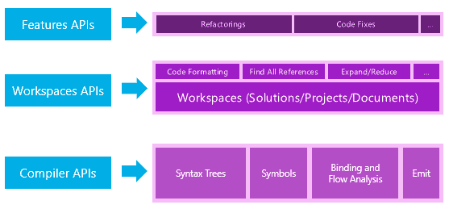
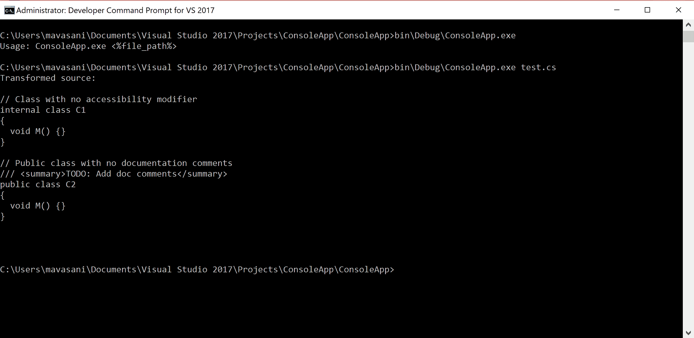
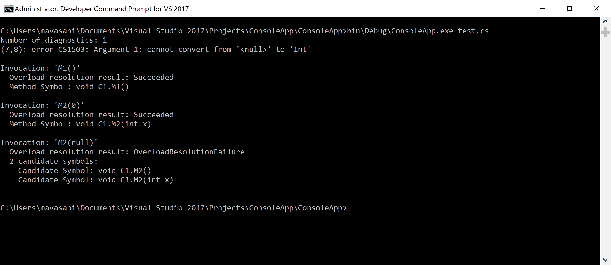
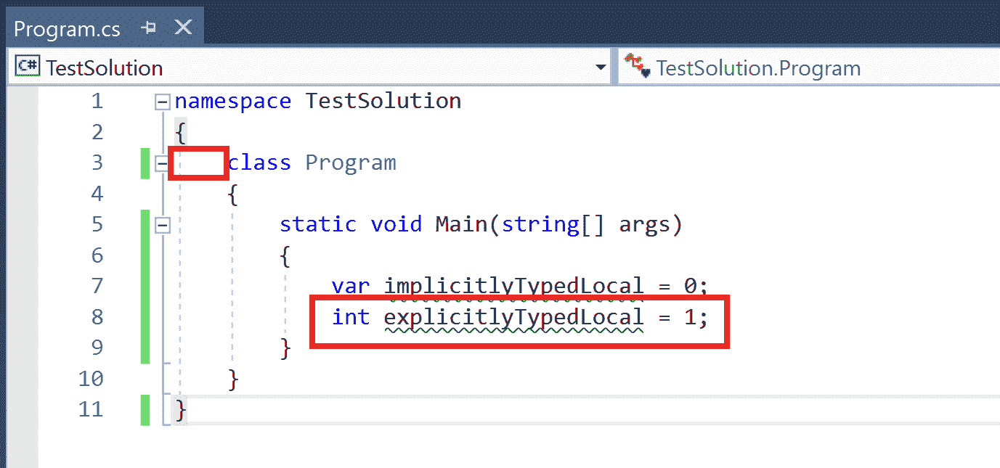
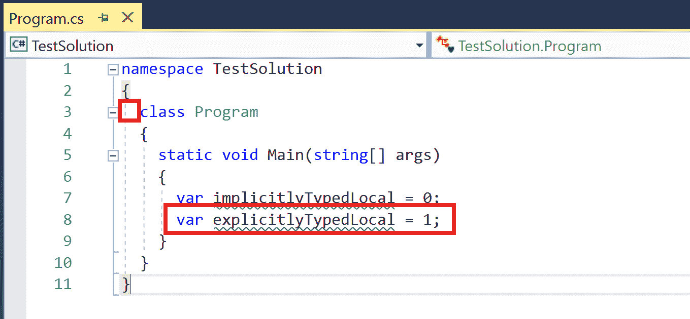
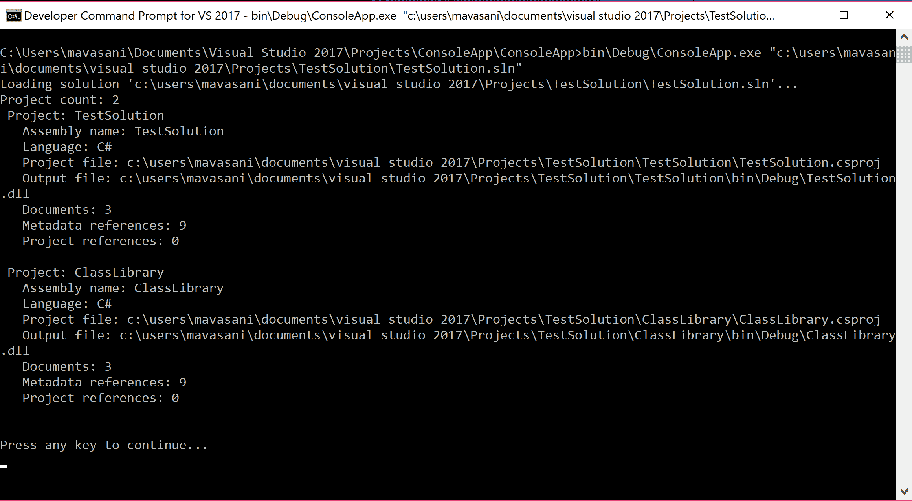
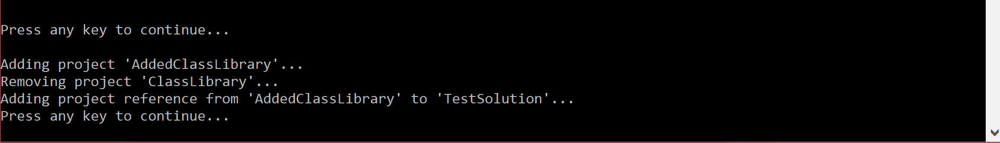
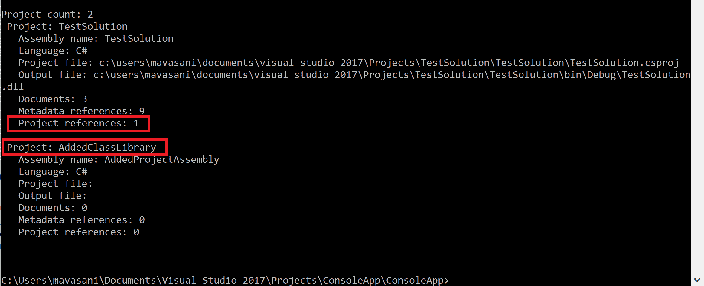

# 第十章：基于 Roslyn API 的命令行工具

在本章中，我们将介绍以下食谱：

+   基于编译器语法 API 编写应用程序以解析和转换源文件

+   基于编译器语义 API 编写应用程序以显示诊断和重载解析结果

+   基于编译器分析 API 编写应用程序以执行诊断分析器和显示分析器诊断

+   基于工作空间 API 编写应用程序以格式化和简化解决方案中的所有源文件

+   基于工作空间 API 编写应用程序以编辑解决方案中的项目并显示项目属性

# 简介

本章使开发者能够使用 Roslyn 编译器和工作空间 API 编写命令行工具，用于分析和/或编辑 C#代码。([`github.com/dotnet/roslyn/wiki/Roslyn%20Overview`](https://github.com/dotnet/roslyn/wiki/Roslyn%20Overview))中的文章为这些层的 Roslyn API 提供了非常好的介绍。

我们将为您提供文章中的代码片段：



+   **编译器 API**：编译器层包含与编译器管道每个阶段公开的信息相对应的对象模型，包括语法和语义。编译器层还包含编译器单次调用的不可变快照，包括程序集引用、编译器选项和源代码文件。有两个不同的 API 代表 C#语言和 Visual Basic 语言。这两个 API 在形状上相似，但针对每个语言进行了定制，以实现高保真度。这一层不依赖于 Visual Studio 组件。

+   **工作空间 API**：工作空间层包含工作空间 API，这是在整个解决方案上进行代码分析和重构的起点。它帮助您将解决方案中所有关于项目的信息组织到一个单一的对象模型中，提供直接访问编译层对象模型的能力，无需解析文件、配置选项或管理项目间的依赖关系。这一层不依赖于 Visual Studio 组件。

# 基于编译器语法 API 编写应用程序以解析和转换源文件

在本节中，我们将编写一个基于 Roslyn 编译器 API 的 C#控制台应用程序，将给定的源文件解析为语法树，然后执行以下语法转换：

+   编辑所有没有显式可访问性修饰符的类声明，添加内部修饰符。

+   将所有没有文档注释的公共类声明添加文档注释语法技巧。

+   删除没有成员的空类声明。

# 入门

您需要在您的机器上安装 Visual Studio 2017 社区版才能执行此菜谱。您可以从[`www.visualstudio.com/thank-you-downloading-visual-studio/?sku=Community&rel=15`](https://www.visualstudio.com/thank-you-downloading-visual-studio/?sku=Community&rel=15)安装免费的社区版。

# 如何做到这一点...

1.  打开 Visual Studio 并创建一个新的针对.NET Framework 4.6 或更高版本的 C#控制台应用程序，例如`ConsoleApp`*.*。

1.  安装`Microsoft.CodeAnalysis.CSharp` NuGet 包（截至本文写作，最新稳定版本是*2.1.0*）。有关如何在项目中搜索和安装 NuGet 包的指导，请参阅第二章中*通过 NuGet 包管理器搜索和安装分析器*的菜谱，*在.NET 项目中使用诊断分析器*。

1.  将`Program.cs`中的源代码替换为附带的代码示例`\ConsoleApp\Program.cs`中的源代码。

1.  构建项目。

1.  打开 Visual Studio 开发者命令提示符，将目录更改为项目根目录，然后不带参数执行`bin\Debug\ConsoleApp.exe`。

1.  验证输出显示不正确的用法：`Usage: ConsoleApp.exe <%file_path%>`

1.  在项目根目录下创建一个文本文件，例如`test.cs`，包含以下代码：

```cs
// Class with no accessibility modifier
class C1
{
  void M() {}
}

// Public class with no documentation comments
public class C2
{
  void M() {}
}

// Empty class with no members
public class C3
{
}

```

1.  现在，使用`test.cs`作为参数执行应用程序：`bin\Debug\ConsoleApp.exe test.cs`。

1.  验证预期的转换后的源代码在输出中显示：



# 它是如何工作的...

在这个菜谱中，我们基于 Roslyn 编译器 API 编写了一个 C#控制台应用程序来解析和转换源文本。如前所述，我们的应用程序演示了对解析树的三个核心语法操作：编辑、添加和删除。让我们逐行代码来了解我们如何实现这些操作：

```cs
public static void Main(string[] args)
{
  // Parse arguments to get source file.
  var filePath = ParseArguments(args);
  if (filePath == null)
  {
    return;
  }

  // Parse text into SyntaxTree.
  var tree = Parse(filePath);
  var root = (CompilationUnitSyntax)tree.GetRoot();

  // Transform syntax tree to edit/add/remove syntax.
  root = EditClassDeclarations(root);
  root = AddDocCommentsToClassDeclarations(root);
  root = RemoveEmptyClassDeclarations(root);

  Console.WriteLine("Transformed source:" + Environment.NewLine);
  Console.WriteLine(root.ToFullString());
}

```

`Main`方法调用单个方法执行以下操作：

+   `ParseArguments`用于扫描要解析和转换的输入文件。

+   从此源文件中读取文本并将其`Parse`成语法树。

+   获取解析树的编译单元根并对其执行以下转换：

    +   `EditClassDeclarations`：向没有可访问性修饰符的类添加内部修饰符。

    +   `AddDocCommentsToClassDeclarations`：向没有文档注释的公共类添加占位符文档注释。

    +   `RemoveEmptyClassDeclarations`：删除没有成员的类声明。

+   在控制台上显示转换后的文本。

`ParseArguments`方法期望一个参数，该参数必须是磁盘上现有文件的完整路径。否则，它将显示错误并退出，返回 null。

```cs
private static string ParseArguments(string[] args)
{
  if (args.Length != 1)
  {
    Console.WriteLine(@"Usage: ConsoleApp.exe <%file_path%>");
    return null;
  }

  if (!File.Exists(args[0]))
  {
    Console.WriteLine($"File '{args[0]}' does not exist");
    return null;
  }

  return args[0];
}

```

`Parse`方法从输入文件读取文件内容，并使用解析 API `CSharpSyntaxTree.ParseText`进行解析。

```cs
private static SyntaxTree Parse(string filePath)
{
 var text = File.ReadAllText(filePath);
 return CSharpSyntaxTree.ParseText(text);
}

```

`EditClassDeclarations` 方法遍历根节点的后代节点以找到所有修饰符列表没有可访问修饰符（公共、私有、内部或受保护）的类声明节点。

```cs
private static CompilationUnitSyntax EditClassDeclarations(CompilationUnitSyntax root)
{
  // Get class declarations with no accessibility modifier.
  var classDeclarations = root.DescendantNodes()
    .OfType<ClassDeclarationSyntax>()
    .Where(c => !c.Modifiers.Any(m => SyntaxFacts.IsAccessibilityModifier(m.Kind())));

  // Add modifier to these class declarations and replace in the original tree.
  return root.ReplaceNodes(classDeclarations,
  computeReplacementNode: (o, n) => AddModifier(n));
}

```

然后，它对根语法节点调用 `ReplaceNodes` API，用 `AddModifier` 辅助函数返回的更新节点替换每个此类声明。此辅助函数在类声明的当前修饰符列表开头添加一个新的内部修饰符。它还负责将类声明的任何现有前导杂注移动到新修饰符，并在新修饰符后添加一个空白杂注：

```cs
private static ClassDeclarationSyntax AddModifier(ClassDeclarationSyntax classDeclaration)
{
  var internalModifier = SyntaxFactory.Token(SyntaxKind.InternalKeyword)
    .WithTrailingTrivia(SyntaxFactory.Whitespace(" "));
  if (classDeclaration.HasLeadingTrivia)
  {
    // Move leading trivia for the class declaration to the new modifier.
    internalModifier = internalModifier.WithLeadingTrivia(classDeclaration.GetLeadingTrivia());
    classDeclaration = classDeclaration.WithLeadingTrivia();
  }

  var newModifiers = classDeclaration.Modifiers.Insert(0, internalModifier);
  return classDeclaration.WithModifiers(newModifiers);
}

```

`AddDocCommentsToClassDeclarations` 方法遍历根节点的后代节点以找到所有修饰符列表具有公共可访问修饰符且其第一个标记没有前导文档注释杂注的类声明节点。

```cs
private static CompilationUnitSyntax AddDocCommentsToClassDeclarations(CompilationUnitSyntax root)
{
  // Get public class declarations with no documentation comments.
  var classDeclarations = root.DescendantNodes()
    .OfType<ClassDeclarationSyntax>()
    .Where(c => c.Modifiers.Any(m => m.Kind() == SyntaxKind.PublicKeyword) &&
   !c.GetFirstToken().LeadingTrivia.Any(IsDocumentationComment));

  // Add stub documentation comment to these class declarations and replace in the original tree.
  return root.ReplaceNodes(classDeclarations,
  computeReplacementNode: (o, n) => AddDocumentationComment(n));
}

```

然后，它对根语法节点调用 `ReplaceNode`*s* API，用 `AddDocumentationComment` 辅助函数返回的更新节点替换每个此类声明。此辅助函数创建一个带有 `TODO` 注释的 XML 摘要元素，并创建一个单行文档注释，包含此存根摘要元素，并将其添加到类声明的当前前导杂注的末尾。

```cs
private static ClassDeclarationSyntax *AddDocumentationComment*(ClassDeclarationSyntax classDeclaration)
{
 var summaryElement = SyntaxFactory.XmlSummaryElement(SyntaxFactory.XmlText("TODO: Add doc comments"));
 var documentationComment = SyntaxFactory.DocumentationComment(summaryElement);
 var newLeadingTrivia = classDeclaration.GetLeadingTrivia()
  .Add(SyntaxFactory.Trivia(documentationComment))
  .Add(SyntaxFactory.EndOfLine(Environment.NewLine));
  return classDeclaration.WithLeadingTrivia(newLeadingTrivia);
}

```

`RemoveEmptyClassDeclarations` 方法遍历根节点的后代节点以找到所有没有成员声明（方法、字段、嵌套类型等）的类声明节点，然后对根语法节点调用 `ReplaceNodes` API 来删除所有此类声明。

```cs
private static CompilationUnitSyntax RemoveEmptyClassDeclarations(CompilationUnitSyntax root)
{
 // Get class declarations with no members.
 var classDeclarations = root.DescendantNodes()
  .OfType<ClassDeclarationSyntax>()
  .Where(c => c.Members.Count == 0);

 // Remove these class declarations from the original tree.
 return root.RemoveNodes(classDeclarations, SyntaxRemoveOptions.KeepNoTrivia);
}

```

# 基于编译器语义 API 编写应用程序以显示诊断和重载解析结果

在本节中，我们将编写一个基于 Roslyn 编译器 API 的 C# 控制台应用程序，从给定的源文件创建编译，然后执行以下语义分析：

1.  计算并显示如果文件被编译，C# 编译器将生成的编译诊断信息。

1.  计算源文件中每个调用（方法调用）的符号信息，并显示每个调用以下语义信息：

    1.  重载解析结果 ([`msdn.microsoft.com/en-us/library/aa691336(v=vs.71).aspx`](https://msdn.microsoft.com/en-us/library/aa691336(v=vs.71).aspx))：成功或失败的原因。

    1.  如果重载解析成功，则将方法符号绑定到调用。

    1.  否则，如果重载解析失败并且我们有多个候选符号，则显示每个候选符号。

# 入门

您需要在您的机器上安装 Visual Studio 2017 社区版才能执行此配方。您可以从 [`www.visualstudio.com/thank-you-downloading-visual-studio/?sku=Community&rel=15`](https://www.visualstudio.com/thank-you-downloading-visual-studio/?sku=Community&rel=15) 安装免费的社区版。

# 如何操作...

1.  打开 Visual Studio 并创建一个新的 C# 控制台应用程序，目标为 .NET Framework 4.6 或更高版本，例如 `ConsoleApp`*.*。

1.  安装 `Microsoft.CodeAnalysis.CSharp` NuGet 包（截至本文写作，最新稳定版本为 *2.1.0*）。有关如何在项目中搜索和安装 NuGet 包的指导，请参阅第二章 *通过 NuGet 包管理器搜索和安装分析器* 中的菜谱 *在 .NET 项目中消费诊断分析器*。

1.  将 `Program.cs` 中的源代码替换为附带的代码示例中的源代码 `\ConsoleApp\Program.cs`。

1.  构建项目。

1.  打开 Visual Studio 开发者命令提示符，将目录更改为项目根目录，然后不带参数执行 `bin\Debug\ConsoleApp.exe`。

1.  验证输出显示不正确的用法：`Usage: ConsoleApp.exe <%file_path%>`。

1.  在项目根目录中创建一个文本文件，例如 `test.cs`，包含以下代码：

```cs
class C1
{
 void F()
 {
  M1();
  M2(0);
  M2(null);
 }

 void M1()
 {
 }

 void M2()
 {
 }

 void M2(int x)
 {
 }
}

```

1.  现在，使用 `test.cs` 作为参数执行应用程序：`bin\Debug\ConsoleApp.exe test.cs`。

1.  验证预期的诊断和重载解析结果显示在输出中：



# 如何工作...

在这个菜谱中，我们基于 Roslyn 编译器 API 编写了一个 C# 控制台应用程序，用于创建编译、分析和显示调用表达式的诊断和重载解析语义。这些操作与 C# 编译器在编译源代码时所做的操作非常相似。让我们逐行分析代码，了解我们是如何实现这些操作的：

```cs
public static void Main(string[] args)
{
 // Parse arguments to get source file.
 var filePath = ParseArguments(args);
 if (filePath == null)
 {
  return;
 }

 // Parse text and create a compilation.
 var compilation = CreateCompilation(filePath);

 // Display diagnostics in the compilation.
 DisplayDiagnostics(compilation);

 // Display semantic information about invocations in the file.
 DisplayInvocations(compilation);
}

```

Main 方法调用单个方法执行以下操作：

+   `ParseArguments` 用于扫描要解析和转换的输入文件。

+   使用 `CreateCompilation` 从此源文件中的文本创建的解析语法树创建 C# 编译。

+   使用 `DisplayDiagnostics` 计算编译器诊断，然后显示它们。

+   使用 `DisplayInvocations` 分析语法树中的每个调用（方法调用）并显示重载解析结果和绑定符号。

`ParseArguments` 的实现与之前的菜谱 *基于编译器语法 API 编写解析和转换源文件的程序* 中的实现相同。有关此方法的进一步解释，请参阅该菜谱的 *如何工作...* 部分。

`CreateCompilation` 方法首先从输入文件中读取文件内容，并使用解析 API `CSharpSyntaxTree.ParseText` 进行解析。然后，它使用包含对象类型的程序集的位置为系统程序集（corlib）创建元数据引用。它创建输出类型为 `DynamicallyLinkedLibrary`（`.dll`）的编译选项，并使用这些输入创建 C# 编译：

```cs
private static Compilation CreateCompilation(string filePath)
{
 var text = File.ReadAllText(filePath);
 var tree = CSharpSyntaxTree.ParseText(text);
 var systemAssembly = MetadataReference.CreateFromFile(typeof(object).Assembly.Location);
 var options = new CSharpCompilationOptions(outputKind: OutputKind.DynamicallyLinkedLibrary);
 return CSharpCompilation.Create("TestAssembly",
  syntaxTrees: new[] { tree },
  references: new[] { systemAssembly },
  options: options);
}

```

`DisplayDiagnostics` 方法使用 `Compilation.GetDiagnostics` API 计算编译器诊断，然后显示每个诊断的数量和字符串表示形式。

```cs
private static void DisplayDiagnostics(Compilation compilation)
{
 var diagnostics = compilation.GetDiagnostics();
 Console.WriteLine($"Number of diagnostics: {diagnostics.Length}");
 foreach (var diagnostic in diagnostics)
 {
  Console.WriteLine(diagnostic.ToString());
 }

 Console.WriteLine();
}

```

`DisplayInvocations` 方法首先获取编译中的语法树的语义模型。然后，它遍历根的子节点以获取所有 `InvocationExpressionSyntax` 节点。对于每个这样的调用，它从语义模型中查询表达式的符号信息。符号信息包含有关调用语义的信息。我们根据候选原因是否为 `CandidateReason.None` 来显示重载解析成功/失败结果。然后，我们分别显示成功和失败情况下的绑定符号或候选符号：

```cs
private static void DisplayInvocations(Compilation compilation)
{
 var tree = compilation.SyntaxTrees.Single();
 var semanticModel = compilation.GetSemanticModel(tree);
 var invocations = tree.GetRoot().DescendantNodes().OfType<InvocationExpressionSyntax>();
 foreach (var invocation in invocations)
 {
  Console.WriteLine($"Invocation: '{invocation.ToString()}'");
  var symbolInfo = semanticModel.GetSymbolInfo(invocation);

  var overloadResolutionResult = symbolInfo.CandidateReason == CandidateReason.None ? "Succeeded" : symbolInfo.CandidateReason.ToString();
  Console.WriteLine($" Overload resolution result: {overloadResolutionResult}");

  if (symbolInfo.Symbol != null)
  {
   Console.WriteLine($" Method Symbol: {symbolInfo.Symbol.ToDisplayString(SymbolDisplayFormat.MinimallyQualifiedFormat)}");
  }
  else if (!symbolInfo.CandidateSymbols.IsDefaultOrEmpty)
  {
   Console.WriteLine($" {symbolInfo.CandidateSymbols.Length} candidate symbols:");
   foreach (var candidate in symbolInfo.CandidateSymbols)
   {
    Console.WriteLine($" Candidate Symbol: {candidate.ToDisplayString(SymbolDisplayFormat.MinimallyQualifiedFormat)}");
   }
  }

  Console.WriteLine();
 }
}

```

# 基于编译器分析器 API 编写应用程序以执行诊断分析器和显示分析器诊断

在本节中，我们将编写一个基于 Roslyn 编译器 API 的 C# 控制台应用程序，该程序加载给定的分析器程序集，在给定的源文件上执行该程序集中定义的所有诊断分析器，并输出所有报告的分析器诊断。

# 入门

您需要在您的机器上安装 Visual Studio 2017 社区版才能执行此配方。您可以从 [`www.visualstudio.com/thank-you-downloading-visual-studio/?sku=Community&rel=15`](https://www.visualstudio.com/thank-you-downloading-visual-studio/?sku=Community&rel=15) 安装免费的社区版。

# 如何操作...

1.  打开 Visual Studio 并创建一个新的针对 .NET Framework 4.6 或更高版本的 C# 控制台应用程序，例如 `ConsoleApp`。

1.  安装 `Microsoft.CodeAnalysis.CSharp` NuGet 包（截至本文撰写时，最新稳定版本为 *2.1.0*）。有关如何在项目中搜索和安装 NuGet 包的指导，请参阅第二章 *在 .NET 项目中消费诊断分析器* 中的配方 *通过 NuGet 包管理器搜索和安装分析器*。

1.  将 `Program.cs` 中的源代码替换为附带的代码示例中的源代码 `\ConsoleApp\Program.cs`。

1.  将一个针对 .NET Framework 4.6 或更高版本的 C# 类库项目添加到解决方案中，例如 *Analyzer*。

1.  将 `Microsoft.CodeAnalysis` NuGet 包安装到该项目中（截至本文撰写时，最新稳定版本为 *2.1.0*）。

1.  将 `Class1.cs` 中的源代码替换为附带的代码示例 `\Analyzer\Class1.cs` 中的诊断分析器源代码。此文件包含用于报告包含任何小写字母的类型名称的诊断的默认符号分析器的代码。

1.  构建解决方案。

1.  打开 Visual Studio 开发者命令提示符，将目录更改为 `ConsoleApp` 的项目根目录，并使用无参数执行 `bin\Debug\ConsoleApp.exe`。

1.  验证输出显示不正确的用法：`用法：ConsoleApp.exe <%analyzer_file_path%> <%source_file_path%>`。

1.  在 `ConsoleApp` 的项目根目录中创建一个文本文件，例如 `test.cs`，并包含以下代码：

```cs
class ClassWithLowerCase
{
}

class OuterClassWithLowerCase
{
 class NestedClassWithLowerCase
 {
 }
}

class CLASS_WITH_UPPER_CASE
{
}

```

1.  现在，使用分析器程序集的相对路径和 `test.cs` 作为参数执行应用程序：`bin\Debug\ConsoleApp.exe ..\..\..\Analyzer\bin\Debug\Analyzer.dll test.cs`。

1.  验证预期的分析器诊断是否显示在输出中：

```cs
Number of diagnostics: 3
(1,7): warning CSharpAnalyzers: Type name 'ClassWithLowerCase' contains lowercase letters
(5,7): warning CSharpAnalyzers: Type name 'OuterClassWithLowerCase' contains lowercase letters
(7,9): warning CSharpAnalyzers: Type name 'NestedClassWithLowerCase' contains lowercase letters

```

# 如何工作...

在这道菜谱中，我们编写了一个基于 Roslyn 编译器 API 的 C# 控制台应用程序，用于从分析器程序集加载和执行诊断分析器，并报告分析器报告的诊断。这些操作与你在使用 `/analyzer:<%analyzer_file_path%>` 命令行开关编译源文件时 C# 编译器所执行的操作非常相似。让我们通过代码了解我们如何实现这些操作：

```cs
public static void Main(string[] args)
{
 // Parse arguments to get analyzer assembly file and source file.
 var files = ParseArguments(args);
 if (files.analyzerFile == null || files.sourceFile == null)
 {
  return;
 }

 // Parse source file and create a compilation.
 var compilation = CreateCompilation(files.sourceFile);

 // Create compilation with analyzers.
 var compilationWithAnalyzers = CreateCompilationWithAnalyzers(files.analyzerFile, compilation);

 // Display analyzer diagnostics in the compilation.
 DisplayAnalyzerDiagnostics(compilationWithAnalyzers);
}

```

主方法调用单个方法执行以下操作：

+   `ParseArguments` 用于扫描：

    +   分析器程序集文件。

    +   要执行分析器的输入源文件。

+   `CreateCompilation` 用于从输入源文件的文本创建的解析语法树中创建 C# 编译。

+   `CreateCompilationWithAnalyzers` 用于创建一个包含附加了给定分析器程序集文件的分析器诊断分析器的编译实例。

+   使用 `DisplayAnalyzerDiagnostics` 执行分析器以计算分析器诊断并显示它们。

`ParseArguments` 和 `CreateCompilation` 的实现与上一道菜谱中的相同，即 *基于编译器语法 API 编写解析和转换源文件的程序*。有关这些方法的进一步解释，请参阅该菜谱的 *如何工作...* 部分。

`CreateCompilationWithAnalyzers` 方法接受编译和分析器程序集作为参数：

```cs
private static CompilationWithAnalyzers CreateCompilationWithAnalyzers(string analyzerFilePath, Compilation compilation)
{
 var analyzerFileReference = new AnalyzerFileReference(analyzerFilePath, new AnalyzerAssemblyLoader());
 var analyzers = analyzerFileReference.GetAnalyzers(LanguageNames.CSharp);
 var options = new CompilationWithAnalyzersOptions(
  new AnalyzerOptions(ImmutableArray<AdditionalText>.Empty),
  onAnalyzerException: (exception, analyzer, diagnostic) => throw exception,
  concurrentAnalysis: false,
  logAnalyzerExecutionTime: false);
 return new CompilationWithAnalyzers(compilation, analyzers, options);
 }

```

首先，它创建 `AnalyzerFileReference` ([`source.roslyn.io/#q=AnalyzerFileReference`](http://source.roslyn.io/#q=AnalyzerFileReference))，包含分析器文件路径和分析器程序集加载器（`IAnalyzerAssemblyLoader` - 详细内容见本节后续部分 ([`source.roslyn.io/#q=IAnalyzerAssemblyLoader`](http://source.roslyn.io/#q=IAnalyzerAssemblyLoader))) 的一个实例。它在这个分析器文件引用上调用 `AnalyzerReference.GetAnalyzers` API ([`source.roslyn.io/#q=AnalyzerReference.GetAnalyzers`](http://source.roslyn.io/#q=AnalyzerReference.GetAnalyzers))，使用给定的分析器程序集加载器加载分析器程序集，然后创建在此程序集中定义的诊断分析器的实例。

它创建一个默认的 `CompilationWithAnalyzersOptions` ([`source.roslyn.io/#q=CompilationWithAnalyzersOptions`](http://source.roslyn.io/#q=CompilationWithAnalyzersOptions)) 集合，用于配置分析器执行。可能的选项包括：

+   `AnalyzerOptions`：分析器选项包含传递给分析器的额外非源文本文件集。在这个配方中，我们使用一个空集。您可以在[`github.com/dotnet/roslyn/blob/master/docs/analyzers/Using%20Additional%20Files.md`](https://github.com/dotnet/roslyn/blob/master/docs/analyzers/Using%20Additional%20Files.md)中了解更多关于额外文件的信息。

+   `onAnalyzerException`委托：当分析器抛出异常时将被调用的委托。在这个配方中，我们只是重新抛出这个异常。

+   `concurrentAnalysis`：控制分析器是否应该并发运行的标志。在这个配方中，我们默认设置为 false。

+   `logAnalyzerExecutionTime`：控制是否应该跟踪每个分析器的相对执行时间。如果设置为 true，则可以通过公共 API `CompilationWithAnalyzers.GetAnalyzerTelemetryInfoAsync` ([`source.roslyn.io/#q=CompilationWithAnalyzers.GetAnalyzerTelemetryInfoAsync`](http://source.roslyn.io/#q=CompilationWithAnalyzers.GetAnalyzerTelemetryInfoAsync)) 获取每个分析器的这些数据。这返回一个`AnalyzerTelemetryInfo`，它有一个名为`ExecutionTime`（`http://source.roslyn.io/#q=AnalyzerTelemetryInfo.ExecutionTime`）的属性。在这个配方中，我们默认设置为 false。

最后，该方法创建并返回一个具有给定编译、分析器文件引用和选项的`CompilationWithAnalyzers` ([`source.roslyn.io/#Microsoft.CodeAnalysis/DiagnosticAnalyzer/CompilationWithAnalyzers.cs,7efdf3edc21e904a`](http://source.roslyn.io/#Microsoft.CodeAnalysis/DiagnosticAnalyzer/CompilationWithAnalyzers.cs,7efdf3edc21e904a)) 实例。

我们简要提到了上面传递给`AnalyzerFileReference`构造函数的我们的自定义`AnalyzerAssemblyLoader`。它在我们的代码中实现如下：

```cs
private class AnalyzerAssemblyLoader : IAnalyzerAssemblyLoader
{
  void IAnalyzerAssemblyLoader.AddDependencyLocation(string fullPath)
  {
  }

  Assembly IAnalyzerAssemblyLoader.LoadFromPath(string fullPath)
  {
    return Assembly.LoadFrom(fullPath);
  }
}

```

这个分析器程序集加载器处理使用执行平台上的.NET API 进行程序集加载来加载分析器程序集。在这个配方中，我们使用.NET Framework API `Assembly.LoadFrom` ([`msdn.microsoft.com/en-us/library/system.reflection.assembly.loadfrom(v=vs.110).aspx`](https://msdn.microsoft.com/en-us/library/system.reflection.assembly.loadfrom(v=vs.110).aspx)) 从给定路径加载程序集。

在我们的自定义`AnalyzerAssemblyLoader`中，我们忽略了添加分析器依赖位置的反调，因为我们的测试分析器程序集没有依赖项。我们可以增强这个程序集加载器以跟踪这些位置并处理依赖项的加载。

`DisplayAnalyzerDiagnostics`接受之前创建的`CompilationWithAnalyzers`实例，并使用`GetAnalyzerDiagnosticsAsync` API 在底层编译上执行分析器。然后它遍历所有分析器诊断，并为每个诊断输出消息，包括行和列信息：

```cs
private static void DisplayAnalyzerDiagnostics(CompilationWithAnalyzers compilationWithAnalyzers)
{
 var diagnostics = compilationWithAnalyzers.GetAnalyzerDiagnosticsAsync(CancellationToken.None).Result;
 Console.WriteLine($"Number of diagnostics: {diagnostics.Length}");
 foreach (var diagnostic in diagnostics)
 {
  Console.WriteLine(diagnostic.ToString());
 }

 Console.WriteLine();
 }

 return newSolution;
}

```

您可以通过调用`CompilationWithAnalyzers.GetAnalysisResultAsync`([`source.roslyn.io/#q=CompilationWithAnalyzers.GetAnalysisResultAsync`](http://source.roslyn.io/#q=CompilationWithAnalyzers.GetAnalysisResultAsync))公共 API 来获取分析结果的更精细视图。返回的`AnalysisResult`([`source.roslyn.io/#Microsoft.CodeAnalysis/DiagnosticAnalyzer/AnalysisResult.cs,86a401660972cfb8`](http://source.roslyn.io/#Microsoft.CodeAnalysis/DiagnosticAnalyzer/AnalysisResult.cs,86a401660972cfb8))允许您获取每个诊断分析器报告的单独语法、语义和编译诊断，并且还允许您获取每个分析器的分析器遥测信息。

# 基于 Workspaces API 编写应用程序以格式化和简化解决方案中的所有源文件

在本节中，我们将编写一个基于 Roslyn Workspaces API 的 C#控制台应用程序，将 C#解决方案加载到工作区中，然后执行以下操作：

1.  使用自定义缩进大小将解决方案中的制表符更改为空格。这是一个语法代码重构。

1.  简化解决方案，将局部声明更改为具有显式类型指定而不是 var。这是一个语义代码重构。

您可以在以下链接中阅读 Formatter 和 Simplifier 的 XML 文档注释和实现细节，以获取有关这些操作的更多信息：[`source.roslyn.io/#Microsoft.CodeAnalysis.Workspaces/Formatting/Formatter.cs,f445ffe3c814c002`](http://source.roslyn.io/#Microsoft.CodeAnalysis.Workspaces/Formatting/Formatter.cs,f445ffe3c814c002) 和 [`source.roslyn.io/#Microsoft.CodeAnalysis.Workspaces/Simplification/Simplifier.cs,1d256ae3815b1cac`](http://source.roslyn.io/#Microsoft.CodeAnalysis.Workspaces/Simplification/Simplifier.cs,1d256ae3815b1cac)，分别。

# 入门

您需要在您的机器上安装 Visual Studio 2017 Community Edition 才能执行此配方。您可以从[`www.visualstudio.com/thank-you-downloading-visual-studio/?sku=Community&rel=15`](https://www.visualstudio.com/thank-you-downloading-visual-studio/?sku=Community&rel=15)安装免费的 Community Edition。

# 如何做到这一点...

1.  打开 Visual Studio 并创建一个新的针对.NET Framework 4.6 或更高版本的 C#控制台应用程序，例如`ConsoleApp`*.*。

1.  安装`Microsoft.CodeAnalysis.CSharp.Workspaces` NuGet 包（截至本文写作，最新稳定版本为*2.1.0*）。有关如何在项目中搜索和安装 NuGet 包的指导，请参阅第二章中的配方*通过 NuGet 包管理器搜索和安装分析器*。

1.  将`Program.cs`中的源代码替换为附带的代码示例`\ConsoleApp\Program.cs`中的源代码。

1.  构建项目。

1.  打开 Visual Studio 开发者命令提示符，切换到项目根目录，并使用无参数执行 `bin\Debug\ConsoleApp.exe`。

1.  验证输出显示使用错误：`Usage: ConsoleApp.exe <%solution_file_path%>`。

1.  创建一个新的 C# 控制台应用程序，例如 `TestSolution`，并在 `Main` 方法中添加一个隐式声明的局部变量和一个显式声明的局部变量（注意缩进大小为 4）：



1.  现在，使用完整路径 `TestSolution.sln` 作为参数执行应用程序：`bin\Debug\ConsoleApp.exe <%test_solution_path%>`。

1.  验证控制台输出：

```cs
Loading solution '<%test_sln_path%>'...
Formatting solution...
Simplifying solution...
Solution updated.

```

1.  现在验证 *TestSolution* 中的源文件新内容缩进大小为 2，并且没有显式声明的局部变量：



# 它是如何工作的...

在这个菜谱中，我们基于 Roslyn 工作区 API 编写了一个 C# 控制台应用程序，用于格式化和简化解决方案中的所有源文件。这些操作与在设置相应的工具选项后应用格式化和简化快速修复时 Visual Studio IDE 会执行的操作非常相似。让我们通过代码来了解我们是如何实现这些操作的：

```cs
public static void Main(string[] args)
{
 // Parse arguments to get solution.
 var slnPath = ParseArguments(args);
 if (slnPath == null)
 {
  return;
 }

 // Create workspace.
 MSBuildWorkspace workspace = MSBuildWorkspace.Create();

 // Open solution within the workspace.
 Console.WriteLine($"Loading solution '{slnPath}'...");
 Solution solution = workspace.OpenSolutionAsync(slnPath).Result;

 // Format the solution.
 solution = FormatSolution(solution, workspace.Options);

 // Simplify the solution.
 solution = SimplifySolution(solution, workspace.Options);

 // Apply changes.
 ApplyChanges(workspace, solution);
}

```

`Main` 方法调用单个方法执行以下操作：

+   `ParseArguments`：扫描要解析和转换的输入文件。

+   `MSBuildWorkspace.Create`：创建工作区，`Workspace.OpenSolutionAsync`：将给定的解决方案加载到工作区中。

+   `FormatSolution`：格式化解决方案中的所有文档。

+   `SimplifySolution`：简化解决方案中的所有文档。

+   `ApplyChanges`：将格式化和简化更改应用到工作区，并将这些更改持久化到磁盘。

`ParseArguments` 的实现与菜谱中的实现相同，*基于编译器语法 API 编写解析和转换源文件的程序.* 请参阅该菜谱的 *如何工作...* 部分，以获取关于此方法的进一步说明。

`MSBuildWorkspace` ([`source.roslyn.io/#q=MSBuildWorkspace`](http://source.roslyn.io/#q=MSBuildWorkspace)) 是 Roslyn 工作区核心的定制实现，它使用 MSBuild ([`docs.microsoft.com/en-us/visualstudio/msbuild/msbuild`](https://docs.microsoft.com/en-us/visualstudio/msbuild/msbuild)) 项目模型来加载解决方案/项目文件，并允许在项目中读取和写入单个文档。

`FormatSolution` 方法格式化解决方案中的所有文档。首先，它修改选项以优先使用空格而不是制表符，缩进大小为 2（默认为 4）：

+   `FormattingOptions.UseTabs`：值设置为 `false`。

+   `FormattingOptions.IndentationSize`：值设置为 `2`。

```cs
private static Solution FormatSolution(Solution originalSolution, OptionSet options)
{
 Console.WriteLine("Formatting solution...");

 // Prefer whitespaces over tabs, with an indentation size of 2.
 options = options
  .WithChangedOption(FormattingOptions.UseTabs, LanguageNames.CSharp, false)
  .WithChangedOption(FormattingOptions.IndentationSize, LanguageNames.CSharp, 2);

 Solution newSolution = originalSolution;
 foreach (var documentId in originalSolution.Projects.SelectMany(p => p.DocumentIds))
 {
  Document document = newSolution.GetDocument(documentId);

  // Format the document.
  Document newDocument = Formatter.FormatAsync(document, options).Result;

  // Update the current solution.
  newSolution = newDocument.Project.Solution;
 }

 return newSolution;
}

```

它跟踪当前解决方案快照在 `newSolution`*，*，该快照初始化为 `originalSolution`。然后它遍历解决方案中的所有文档，并执行以下操作：

+   通过调用 `Formatter.FormatAsync` 公共 API（[`source.roslyn.io/#q=Formatter.FormatAsync`](http://source.roslyn.io/#q=Formatter.FormatAsync)）并使用当前文档和选项来格式化文档。

+   将 `newSolution` 更新为指向格式化后的 `newDocument` 的解决方案。

注意我们为什么不能简单地遍历 `originalSolution.Projects` 或 `project.Documents`，因为这将返回来自未修改的 `originalSolution` 的对象，而不是来自 `newSolution`。我们需要使用 `ProjectId`/`DocumentIds`（不会改变）来查找 `newSolution` 中的相应快照。

最后，在所有文档格式化完成后，它返回 `newSolution`。

`SimplifySolution` 方法简化了解决方案中的所有文档。首先，它修改选项以优先使用隐式类型局部声明，即用户 `var` 而不是显式类型指定，通过将 `SimplificationOptions.PreferImplicitTypeInLocalDeclaration` 设置为 `true`：

```cs
private static Solution SimplifySolution(Solution originalSolution, OptionSet options)
{
 Console.WriteLine("Simplifying solution...");

 // Prefer 'var' over explicit type specification.
 options = options.WithChangedOption(SimplificationOptions.PreferImplicitTypeInLocalDeclaration, true);

 Solution newSolution = originalSolution;
 foreach (var documentId in originalSolution.Projects.SelectMany(p => p.DocumentIds))
 {
  Document document = newSolution.GetDocument(documentId);

  // Add simplification annotation to the root.
  var newRoot = document.GetSyntaxRootAsync().Result.WithAdditionalAnnotations(Simplifier.Annotation);

  // Simplify the document.
  Document newDocument = Simplifier.ReduceAsync(document.WithSyntaxRoot(newRoot), options).Result;

  // Update the current solution.
  newSolution = newDocument.Project.Solution;
 }

 return newSolution;
}

```

`SimplifySolution` 方法与 `FormatSolution` 方法在迭代文档、通过调用 `Simplifier.ReduceAsync` 公共 API（[`source.roslyn.io/#q=Simplifier.ReduceAsync`](http://source.roslyn.io/#q=Simplifier.ReduceAsync)）简化它们方面有非常相似的实现，在处理每个文档后，将最新的快照存储在 `newSolution` 中，并在最后返回新的解决方案快照。尽管如此，它有一个重要的区别。`Simplifier.ReduceAsync` 只处理具有特殊语法注解的节点：`Simplifier.Annotation`（[`source.roslyn.io/#q=Simplifier.Annotation`](http://source.roslyn.io/#q=Simplifier.Annotation)）。因此，在调用此 API 之前，我们需要将此语法注解添加到文档的根节点。

`ApplyChanges` 方法通过将新的解决方案快照传递给 `Workspace.TryApplyChanges` 公共 API（[`source.roslyn.io/#q=Workspace.TryApplyChanges`](http://source.roslyn.io/#q=Workspace.TryApplyChanges)）来应用解决方案快照中的更改到工作区。这也导致 `MSBuildWorkspace` 将这些更改持久化到磁盘：

```cs
private static void ApplyChanges(Workspace workspace, Solution solution)
{
 // Apply solution changes to the workspace.
 // This persists the in-memory changes into the disk.
 if (workspace.TryApplyChanges(solution))
 {
  Console.WriteLine("Solution updated.");
 }
 else
 {
  Console.WriteLine("Update failed!");
 }
}

```

# 基于 Workspaces API 编写应用程序以编辑解决方案中的项目并显示项目属性

在本节中，我们将基于 Roslyn Workspaces API 编写一个 C# 控制台应用程序，将 C# 解决方案加载到工作区中，然后执行以下操作：

+   显示项目属性，例如项目文件路径、输出文件路径、项目语言、程序集名称、引用计数、文档计数等。

+   向解决方案中添加一个新的项目。

+   从解决方案中移除现有的项目。

+   编辑项目以添加项目引用。

# 入门指南

您需要在您的机器上安装 Visual Studio 2017 Community Edition 才能执行此配方。您可以从 [`www.visualstudio.com/thank-you-downloading-visual-studio/?sku=Community&rel=15`](https://www.visualstudio.com/thank-you-downloading-visual-studio/?sku=Community&rel=15) 安装免费的 Community Edition。

# 如何做到这一点...

1.  打开 Visual Studio 并创建一个新的以 .NET Framework 4.6 或更高版本为目标平台的 C# 控制台应用程序，例如 `ConsoleApp`*.*

1.  安装 `Microsoft.CodeAnalysis.CSharp.Workspaces` NuGet 包（截至本文写作，最新稳定版本是 *2.1.0*）。有关如何在项目中搜索和安装 NuGet 包的指导，请参阅第二章 *通过 NuGet 包管理器搜索和安装分析器* 中的菜谱 *在 .NET 项目中消费诊断分析器*。

1.  将 `Program.cs` 中的源代码替换为附带的代码示例 `\ConsoleApp\Program.cs` 中的源代码。

1.  构建项目。

1.  打开 Visual Studio 开发者命令提示符，将目录更改为项目根目录，并执行 `bin\Debug\ConsoleApp.exe`，不带任何参数。

1.  验证输出显示使用不正确：`Usage: ConsoleApp.exe <%solution_file_path%>`.

1.  创建一个新的 C# 类库解决方案，例如 `TestSolution`，并将另一个类库项目，例如 `ClassLibrary`*，* 添加到解决方案中。现在，使用 `TestSolution.sln` 的完整路径作为参数执行应用程序：`bin\Debug\ConsoleApp.exe <%test_solution_path%>`。

1.  验证控制台输出显示初始解决方案的两个项目 `TestSolution` 和 `ClassLibrary` 的项目属性：



1.  按任意键继续并注意以下操作已执行：将项目添加到解决方案中，从解决方案中移除项目，以及编辑现有项目（添加项目引用）。



1.  按任意键继续并验证解决方案现在包含两个项目 `TestSolution` 和 `AddedClassLibrary`，并且从 `AddedClassLibrary` 到 `TestSolution` 存在一个项目引用：



# 它是如何工作的...

在这个菜谱中，我们编写了一个基于 Roslyn Workspaces API 的 C# 控制台应用程序，以在解决方案中的项目上执行各种操作：添加、移除、编辑和显示项目属性。丰富的 Workspaces API 为您提供了一个强大的对象模型，用于分析和编辑解决方案中的项目和文档。让我们通过代码了解我们如何实现这些操作：

```cs
public static void Main(string[] args)
{
 // Parse arguments to get solution.
 string slnPath = ParseArguments(args);
 if (slnPath == null)
 {
  return;
 }

 // Create workspace.
 MSBuildWorkspace workspace = MSBuildWorkspace.Create();

 // Open solution within the workspace.
 Console.WriteLine($"Loading solution '{slnPath}'...");
 Solution solution = workspace.OpenSolutionAsync(slnPath).Result;

 // Display project properties.
 DisplayProjectProperties(solution);

 // Add project AddedClassLibrary.
 WaitForKeyPress();
 solution = AddProject(solution, "AddedClassLibrary");

 // Remove project ClassLibrary.
 solution = RemoveProject(solution, "ClassLibrary");

 // Add project reference from AddedClassLibrary to TestSolution.
 solution = AddProjectReference(solution, referenceFrom: "AddedClassLibrary", referenceTo: "TestSolution");

 // Display project properties.
 WaitForKeyPress();
 DisplayProjectProperties(solution);
}

```

`Main` 方法调用单个方法以执行以下操作：

+   `ParseArguments`：用于扫描要解析和转换的输入文件

+   `MSBuildWorkspace.Create`：用于创建工作区，`Workspace.OpenSolutionAsync` 用于在工作区中加载给定的解决方案

+   `DisplayProjectProperties`：用于显示解决方案中所有项目的常见属性。

+   `AddProject`：用于将新项目添加到解决方案中

+   `RemoveProject`：用于从解决方案中移除现有项目

+   `AddProjectReference`：用于向解决方案中的现有项目添加项目引用

`ParseArguments` 的实现与配方中的实现相同，即 *基于 Compiler Syntax API 编写解析和转换源文件的程序*。请参阅该配方中的 *如何工作...* 部分，以获取关于此方法的进一步解释。

`MSBuildWorkspace` ([`source.roslyn.io/#q=MSBuildWorkspace`](http://source.roslyn.io/#q=MSBuildWorkspace)) 是 Roslyn 工作区核心的定制实现，它使用 MSBuild 项目模型来加载解决方案/项目文件，并允许在项目中读取和写入单个文档。

`DisplayProjectProperties` 显示常见的项目属性，如项目名称、语言、程序集名称、引用、文档等：

```cs
private static void DisplayProjectProperties(Solution solution)
{
 Console.WriteLine($"Project count: {solution.Projects.Count()}");

 foreach (var project in solution.Projects)
 {
  Console.WriteLine($" Project: {project.Name}");
  Console.WriteLine($" Assembly name: {project.AssemblyName}");
  Console.WriteLine($" Language: {project.Language}");
  Console.WriteLine($" Project file: {project.FilePath}");
  Console.WriteLine($" Output file: {project.OutputFilePath}");
  Console.WriteLine($" Documents: {project.Documents.Count()}");
  Console.WriteLine($" Metadata references: {project.MetadataReferences.Count()}");
  Console.WriteLine($" Project references: {project.ProjectReferences.Count()}");
  Console.WriteLine();
 }

 Console.WriteLine();
}

```

`AddProject` 方法创建一个具有给定 `projectName`、唯一项目 ID、版本戳、程序集名称和 C# 语言名称的裸骨 `ProjectInfo` ([`source.roslyn.io/#q=ProjectInfo`](http://source.roslyn.io/#q=ProjectInfo))：

```cs
private static Solution AddProject(Solution originalSolution, string projectName)
{
 Console.WriteLine($"Adding project '{projectName}'...");
 var projectInfo = ProjectInfo.Create(
  id: ProjectId.CreateNewId(),
  version: new VersionStamp(),
  name: projectName,
  assemblyName: "AddedProjectAssembly",
  language: LanguageNames.CSharp);
 return originalSolution.AddProject(projectInfo);
}

```

然后，它调用 `Solution.AddProject` API ([`source.roslyn.io/#q=Solution.AddProject`](http://source.roslyn.io/#q=Solution.AddProject)) 将创建的项目信息添加到解决方案中。

`RemoveProject` 方法从解决方案中移除具有给定 `projectName` 的现有项目。它使用 `Solution.RemoveProject` API ([`source.roslyn.io/#q=Solution.RemoveProject`](http://source.roslyn.io/#q=Solution.RemoveProject)) 来移除项目：

```cs
private static Solution RemoveProject(Solution originalSolution, string projectName)
{
 Console.WriteLine($"Removing project '{projectName}'...");
 var project = originalSolution.Projects.SingleOrDefault(p => p.Name == projectName);
 return originalSolution.RemoveProject(project.Id);
}

```

`AddProjectReference` 方法从给定的 `referenceFrom` 项目向给定的 `referenceTo` 项目添加项目引用。它搜索解决方案中具有给定名称的现有项目，为 `referenceFrom` 项目创建一个具有项目 ID 的 `ProjectReference` ([`source.roslyn.io/#Microsoft.CodeAnalysis.Workspaces/Workspace/Solution/ProjectReference.cs,944b5173649705e4`](http://source.roslyn.io/#Microsoft.CodeAnalysis.Workspaces/Workspace/Solution/ProjectReference.cs,944b5173649705e4))，并使用 `Solution.AddProjectReference` ([`source.roslyn.io/#q=Solution.AddProjectReference`](http://source.roslyn.io/#q=Solution.AddProjectReference)) 来添加所需的引用。

```cs
private static Solution AddProjectReference(Solution originalSolution, string referenceFrom, string referenceTo)
{
 Console.WriteLine($"Adding project reference from '{referenceFrom}' to '{referenceTo}'...");
 var projectReferenceFrom = originalSolution.Projects.SingleOrDefault(p => p.Name == referenceFrom);
 var projectReference = new ProjectReference(projectReferenceFrom.Id);
 var projectReferenceTo = originalSolution.Projects.SingleOrDefault(p => p.Name == referenceTo);
 return originalSolution.AddProjectReference(projectReferenceTo.Id, projectReference);
}

```
