# 第三章。选择数据

报告是数据的格式化展示。报告用于展示存储在数据库（s）中的信息。因此，第一步是连接到数据库以从中读取数据。在本章中，我们将看到如何使用 Microsoft Visual Studio 连接到数据库并运行 SQL 查询。我们还将讨论 DataSet 和 TableAdapter，并了解如何使用它们来填充我们应用程序中的 ComboBoxes。

在本章中，我们将涵盖：

+   Visual Studio 中的 SQL 查询

+   使用数据填充 ComboBoxes

# Microsoft Visual Studio 中的 SQL 查询

通常 SQL 查询分为数据定义语言和数据操作语言。

有许多类型的 SQL 查询，如选择查询、更新查询、删除查询和插入查询。在本书中，我们将只讨论选择查询，因为报告使用选择查询。在我们的示例查询中，我们将使用 Northwind 数据库，并使用 Microsoft Visual Studio 来运行所有 SQL 查询。因此，首先，我们需要连接到我们的数据库。

## 连接到我们的数据库

1.  在 Microsoft Visual Studio 中打开我们的应用程序，Monitor。

1.  点击**视图**并点击**服务器资源管理器**。

1.  在**服务器资源管理器**中，右键单击**数据连接**并选择**添加连接...**。将出现一个类似于下一张截图的对话框：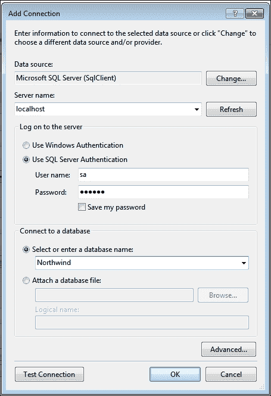

1.  确保在**数据源**中**Microsoft SQL Server(SqlClient)**。

1.  因为我们已经在我们的机器上安装了 Microsoft SQL Server，所以我们可以输入`localhost`作为服务器名称或写入机器名称。

1.  选择**使用 SQL Server 身份验证**，并以`sa`作为**用户名**输入，并输入您在安装 Microsoft SQL Server 时使用的密码。

1.  在数据库字段中输入`Northwind`并点击**测试连接**按钮。

1.  如果弹出一个消息框说测试成功，这意味着我们可以继续进行。如果没有，重新输入数据或者如果与 SQL Server 有任何连接问题，进行故障排除。

1.  点击**确定**按钮以连接到数据库，我们将在**服务器资源管理器**中看到我们的数据库，如图所示：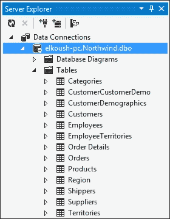

# 添加数据库图表

为了理解 Northwind 数据库及其表之间的关系，我们将创建一个新的数据库图表：

1.  右键单击**数据库图表**并选择**添加新图表**。在确认消息框中点击**是**。

1.  在**添加表**对话框中，选择所有表并点击**添加**按钮。我们可以在下一张图表中看到所有表以及这些表之间的关系。

1.  使用默认名称`Diagram1`保存图表。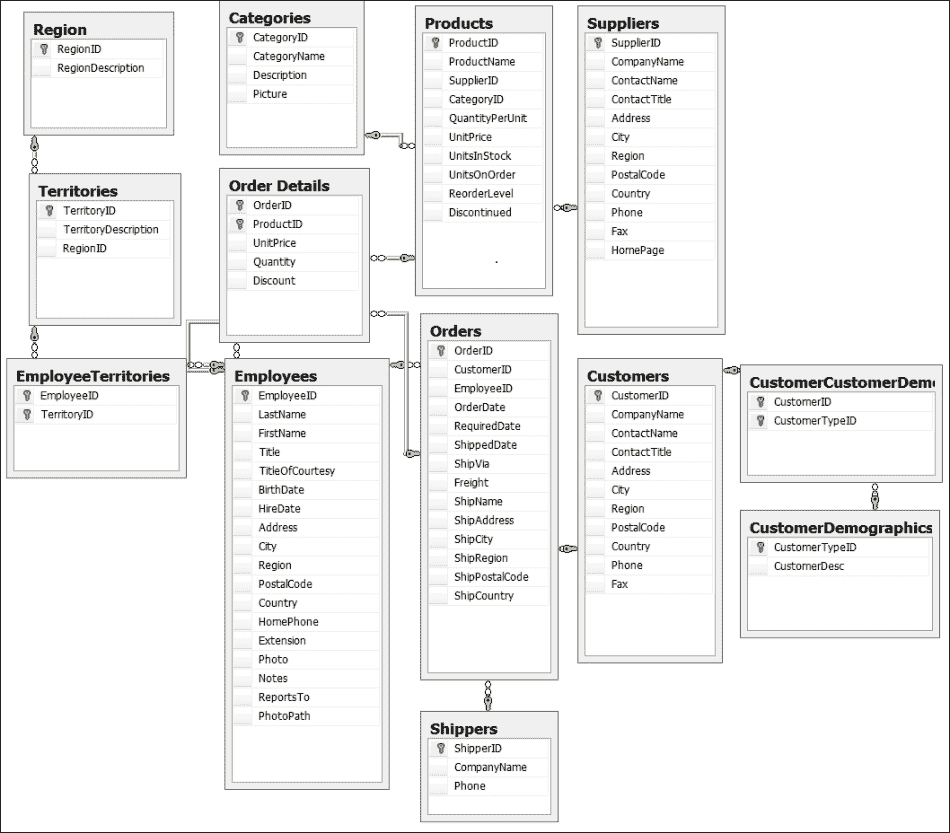

## 测试查询

我们需要一个工具来运行查询并测试结果。Microsoft Visual Studio 有一个很好的 IDE 来运行 SQL 查询。我们可以在 **服务器资源管理器** 中通过右键单击数据库中的任何表名并选择 **新建查询** 来查看此 IDE。然后，我们将从 **添加表** 对话框中选择我们将用于查询的表，并点击 **确定** 按钮。参见图表：

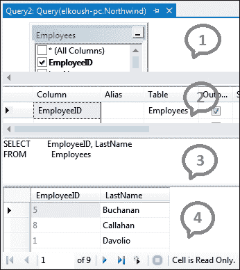

如前一个截图所示，我们的查询 IDE 中有四个部分。第一部分显示我们在查询中使用的所有表，第二部分显示简单的查询构建器，第三部分显示 SQL 查询代码，第四部分显示查询结果。在我们的讨论中，我们将讨论第三和第四部分。

# 用数据填充组合框

在我们的应用程序中，我们有许多组合框。我们如何用数据填充它们？在本节中，我们将用数据填充组合框，并讨论选择 SQL 查询的基础知识。我们填充应用程序中任何组合框的主要步骤有四个：SQL 查询、`TableAdapter`、`DataSource` 和加载事件。在我们开始填充第一个组合框之前，我们需要将数据集添加到我们的应用程序中，以便通过 TableAdapter 保存检索到的数据。

## 将数据集添加到应用程序

1.  在解决方案资源管理器中右键单击 Monitor 应用程序，并导航到 **添加** | **新建项**。

1.  从对话框中选择 **数据集**，我们将使用默认名称 `DataSet1`。

## 填充 cbEmpTitle 组合框

1.  **选择数据**：我们需要用所有员工的职称填充此组合框，且不包含任何重复。

    如以下截图所示，我们可以使用 `Select` 查询从 `Employees` 表中选择 `Title`，并使用 `DISTINCT` 关键字避免重复。

    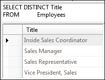

1.  **创建 TableAdapter**：打开 `DataSet1`，右键单击它并导航到 **添加** | **TableAdapter**，如图所示：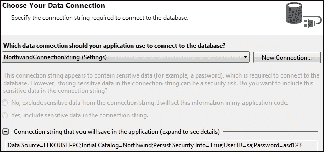

    在此步骤中，我们可以创建一个新的连接字符串到我们的数据库或使用我们在 **服务器资源管理器** 中创建的连接字符串来连接到我们的数据库。这里我们将使用之前创建的连接字符串，然后点击 **下一步** 按钮；我们将看到以下截图：

    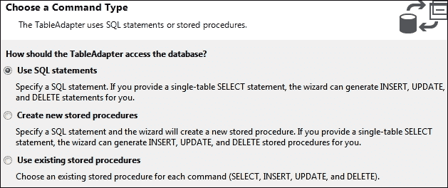

    在我们的应用程序中，我们将使用 SQL 语句来访问数据库，因此选择 **使用 SQL 语句** 并点击 **下一步** 按钮以查看以下截图：

    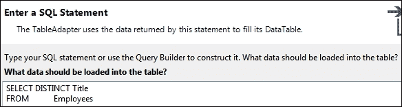

    在此对话框中，我们将编写之前步骤中准备的 SQL 查询，然后点击 **下一步** 按钮以查看以下截图：

    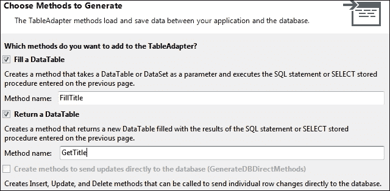

    在这个对话框中，我们将方法名称更改为 `FillTitle` 和 `GetTitle`，然后点击 **下一步** 按钮以查看以下截图：

    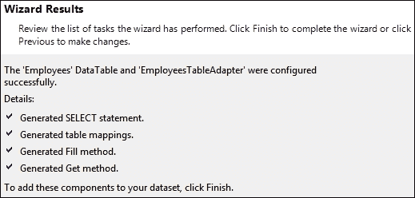

    我们需要看到这个对话框来确保所有过程都配置成功，然后点击**完成**按钮以查看以下截图所示的 TableAdapter：

    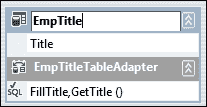

    在上一张截图中，我们将 DataTable 名称更改为`EmpTitle`，并将 TableAdapter 名称更改为`EmpTitleTableAdapter`。

1.  **设置组合框数据源**：打开主表单；右键单击它并选择**查看代码**。我们将创建一个新的方法来发布我们的组合框数据。参考以下截图：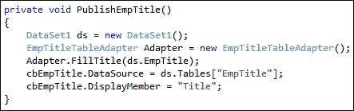

    在`PublishEmpTitle`方法中，我们从`DataSet1`创建名为`ds`的对象，并从`EmpTitleTableAdapter`创建另一个名为`Adapter`的对象。然后我们通过`TableAdapterAdapter`使用`FillTitle`方法填充我们的数据集`ds`。最后，我们将`cbEmpTitleDataSource`分配给`ds`和`DisplayMember`到标题。

1.  **更新加载事件**：在主表单的加载事件`MainForm_Load`中，我们将调用我们的方法`PublishEmpTitle`，如下截图所示：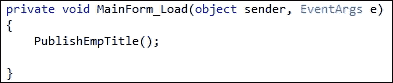

1.  **测试结果**：运行我们的应用程序以测试结果。我们可以看到我们的组合框标题现在已填充了数据；如下截图所示：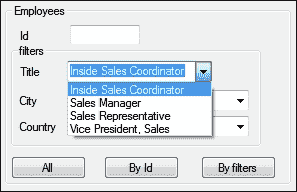

## 填充 cbEmpCity 组合框

1.  **选择数据**：我们需要将所有城市填充到这个组合框中，且不能有重复。参考以下截图：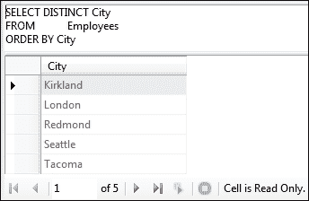

1.  **创建 TableAdapter**：请按照上一节中的相同步骤创建 TableAdapter，并将其命名为`EmpCity`。TableAdapter 将类似于以下截图：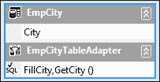

1.  **设置组合框数据源**：参考以下截图中的代码：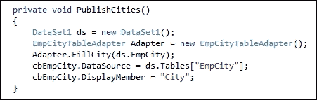

1.  **更新加载事件**：参考以下截图中的代码：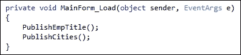

1.  **测试结果**：结果将类似于以下截图：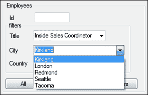

## 填充 cbEmpCountry 组合框

1.  **选择数据**：我们需要将所有员工国家填充到这个组合框中，且不能有重复，如下截图所示：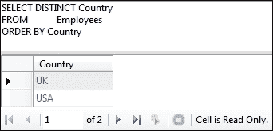

1.  **创建 TableAdapter**：请按照之前的步骤创建 TableAdapter。TableAdapter 将类似于以下截图：

1.  **设置组合框数据源**：参考以下截图中的代码：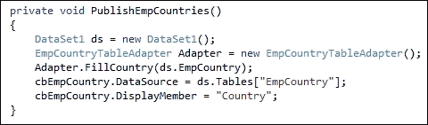

1.  **更新加载事件**：参考以下截图中的代码：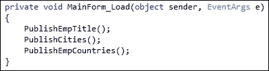

1.  **测试结果**：结果将类似于以下截图：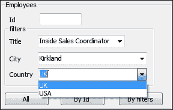

## 填充 cbProductsCategory 组合框

1.  **选择数据**：我们需要填充这个组合框，包含所有产品类别，且不重复。请参考以下截图：

1.  **创建 TableAdapter**：再次，请按照之前的步骤创建 TableAdapter。TableAdapter 将类似于以下截图：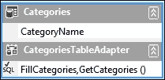

1.  **设置组合框数据源**：请参考以下截图中的代码：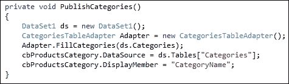

1.  **更新加载事件**：请参考以下截图中的代码：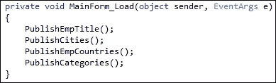

1.  **测试结果**：结果将类似于以下截图：

## 填充 cbOrdersCountry 组合框

1.  **选择数据**：我们需要填充这个组合框，包含`Customers`表中的所有国家，且不重复。请参考以下截图：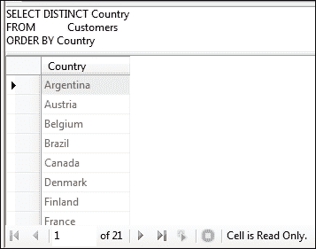

1.  **创建 TableAdapter**：请按照之前的步骤创建 TableAdapter。TableAdapter 将类似于以下截图：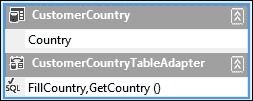

1.  **设置组合框数据源**：请参考以下截图中的代码：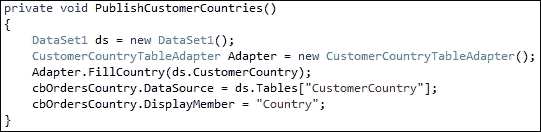

1.  **更新加载事件**：为此，请参考以下截图中的代码：

1.  **测试结果**：结果将类似于以下截图：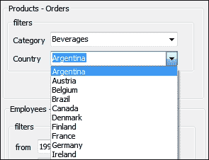

# 摘要

有效数据比报表设计更为关键，因此我们在报表中显示这些数据之前需要选择正确的数据。在我们开始任何报表应用程序之前，我们需要非常了解数据库/数据，以确保我们的报表包含正确的数据。在本章中，我们学习了如何在 Visual Studio 中编写我们的选择查询以及如何运行此查询。我们学习了如何使用 DataAdapter 填充 ComboBox。在下一章中，我们将开始使用 Crystal Reports，我们将看到如何在我们的应用程序中显示这个报表。
