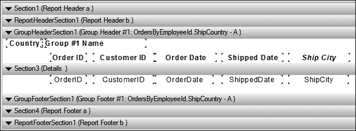
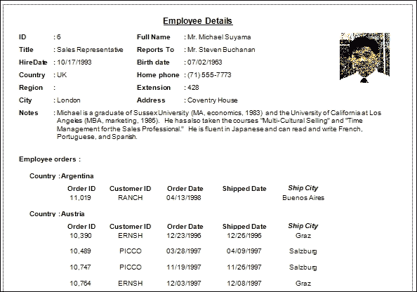

# 第五章。增强报告

在上一章中，我们看到了如何创建一个简单的报告并在我们的应用程序中显示这个报告。在本章中，我们将创建一个新的报告，但这个报告将比上一个更复杂。我们将看到如何使用一个或多个字段来分组数据，如何通过参数筛选数据，以及如何添加子报告。

我们将涵盖以下主题：

+   使用参数字段

+   使用公式字段

+   使用子报告

+   分组和排序数据

+   将报告添加到表单中

在本章中，我们将有两个部分。在第一部分，我们将创建一个新的报告来显示员工，就像我们在上一章中创建的那样，但我们将为此新报告添加一些筛选器。这将允许用户选择具有相同数据的员工。在下面的截图中，我们可以看到报告中的所有员工都具有相同的数据（**国家**、**城市**和**职位**）。这可以通过使用参数字段来实现。在第一部分，我们将看到如何使用这些字段。


在第二部分，我们将创建一个新的报告来显示所有**员工详细信息**和他们的**员工订单**，如下面的截图所示。我们还将看到如何使用子报告、分组、排序和公式字段。


# 使用参数字段

我们将以与上一章中创建报告相同的方式创建一个新的报告，步骤如下：

1.  我们将使用我们在上一章中创建的相同的 TableAdapter（**EmployeesTableAdapter**），如下面的截图所示：

1.  向我们的应用程序添加一个新的 Crystal Reports，并将其重命名为`crFilteredEmployees`。

1.  如以下截图所示，我们将选择**作为一个空白报告**单选按钮，以了解在创建报告后如何使用报告连接到数据库。点击**确定**按钮。

1.  从**字段资源管理器**，右键单击**数据库字段**并选择**数据库专家**。选择`Employees`表，如下面的截图所示。点击**确定**按钮。

1.  现在当您导航到**字段资源管理器** | **数据库字段** | **Employees**时，您将看到**字段**表，如下面的截图所示：

1.  将**员工**字段拖到我们的报告中的**详细信息**部分，并格式化报告，如下面的截图所示：

    到目前为止，我们的报告会显示所有员工，因此现在我们需要更新这个报告以通过他们的数据（**国家**、**城市**和**职位**）来筛选员工。在接下来的步骤中，我们将看到如何向我们的报告添加筛选器。

1.  在**字段资源管理器**中，右键单击**参数字段**并选择**新建**。

    如以下截图所示，我们将此参数命名为`pmCountry`，并选择其**类型**为**String**。我们将保留表单中其他字段的默认值，并点击**OK**按钮：

    

1.  创建两个更多类型的**String**参数，分别命名为`pmCity`和`pmTitle`。现在我们共有三个参数，如下截图所示：

    到目前为止，我们还没有使用这些参数，它们在我们的报告中没有任何效果。

1.  右键单击报告，导航到**报告** | **选择公式** | **记录**。以下截图显示了这一操作：

1.  我们将编写一些代码将参数应用到我们的报告中，如下截图所示：

    +   在代码的第一行（`{Employees.Title}={?pmTitle}`）中，我们通过`pmTitle`参数过滤了员工标题。

    +   在第二行代码（`{Employees.Country}={?pmCountry}`）中，我们通过`pmCountry`参数过滤了员工国家。

    +   在第三行代码（`{Employees.City}={?pmCity}`）中，我们通过`pmCity`参数过滤了员工城市。

    +   最后，我们使用`and`关键字将三条语句绑定在一起，以确保三个过滤器必须一起应用；如果其中一个过滤器失败，其他过滤器也会失败。

        ### 提示

        您可以从上方的报告字段（字段树）中将**表**和**参数**字段拖放到代码框中。

1.  从顶部保存并关闭表单。

    到目前为止，我们已经完成了报告设计，现在我们需要在应用程序中显示我们的报告；当用户点击`btnEmpByFilters`按钮（**按过滤器**）时，**标题**、**城市**和**国家**组合框的值将动态传递到我们的报告参数`pmTitle`、`pmCity`和`pmCountry`。

1.  从**解决方案资源管理器**中打开**MainForm**。双击`btnEmpByFilters`按钮，进入点击事件代码，并编写以下截图所示的代码：

    我们在上一章中看到了大多数之前提到的代码行，但在这里我们只添加了三条额外的代码行，以动态地将三个参数传递到我们的报告中。这三条代码行如下：

    ```cs
    report.SetParameterValue("pmTitle",cbEmpTitle.Text);
    report.SetParameterValue("pmCountry", cbEmpCountry.Text);
    report.SetParameterValue("pmCity", cbEmpCity.Text);
    ```

1.  当我们运行应用程序并测试结果时，我们将看到报告结果，具体取决于过滤器中提供的数据。

    我们需要改进我们的报告，使用户可以使用一个或两个过滤器，而不是三个过滤器，或者他可以停止所有过滤器。我们将允许用户通过在用于过滤报告数据的组合框中输入`"ALL"`字符串来停止任何过滤器。我们只需要更改报告中参数的代码以满足这一改进。

1.  在**字段资源管理器**中右键单击任何**参数字段**，并选择**在公式中查找**。

1.  将我们之前编写的代码更新为新版本，如以下截图所示，然后保存并关闭。

1.  运行应用程序以测试新的更改。在用于过滤报告数据的三个组合框中输入 `"ALL"`，然后单击 **按筛选器** 按钮。现在您将看到报告中的所有员工数据。您可以更改一个或两个筛选器，保留其他筛选器以测试报告结果。

在下一节中，我们将创建一个报告来显示所有员工的订单数据。此报告包含一个主报告，其中包含员工数据，以及另一个包含员工订单的子报告。我们将通过在主报告字段中过滤数据来了解如何使用子报告。

1.  首先，我们将创建一个包含 `Employees` 表中所有数据的 TableAdapter，选择查询将类似于以下屏幕截图：

    在前面的查询中，我们使用了 `LEFT OUTER JOIN` 来选择包含所有员工数据的左表中的所有数据，并在第二个表中存在的情况下选择了主管（`ReportsTo`）数据。我们没有使用 `INNER JOIN`，因为 ID 为 2 的员工（`Fuller`）没有主管（`ReportsTo`）。我们还在使用与之前章节中学习相同的表进行 `SELF JOIN`。TableAdapter 将类似于以下屏幕截图：

    

1.  我们将创建一个新的水晶报告，命名为 `crEmployeeDetails`，并将 `Employee1` 作为报告数据源。将数据字段拖放到报告中的 **员工详细信息** 部分，并格式化字段以类似于以下屏幕截图：

请注意，在之前的报告中，我们使用了 SQL 查询来显示报告中的员工和主管的全名。在本节中，我们将使用公式字段来显示他们的全名。正如我们在之前的屏幕截图中看到的，**全名**和**汇报对象**是公式字段 `(@fmu_FullName`, `@fmu_ReportTo`)。现在我们将了解如何使用公式字段。

# 与公式字段一起工作

在本节中，我们将了解如何使用公式字段以及它们如何有助于提高我们的报告的实用性和强大功能。

1.  从 **字段资源管理器**，右键单击 **公式字段** 并选择新建。输入公式名称 `fmu_FullName` 并单击 **确定** 按钮。您将在以下屏幕截图中看到：

    此公式字段将以我们之前使用 SQL 查询创建的相同格式显示员工的姓名。在这里，我们使用连接运算符（`+`）将头衔与员工的姓氏和名字连接起来。

1.  创建另一个公式字段并将其命名为 `fmu_ReportsTo`。您将在以下屏幕截图中看到公式代码：

1.  将两个公式字段拖放到报告中，就像我们之前做的那样。

1.  将参数字段添加到报告中，并将其命名为`EmpId`。我们将使用此参数按 ID 过滤员工，如下截图所示：

1.  从**解决方案资源管理器**中打开**MainForm**。双击**btnEmpById**按钮进入点击事件代码，并编写以下截图所示的代码：

1.  运行应用程序以测试我们的报告，在`txtEmpId`文本框中输入一个 ID 号码，然后点击**按 ID**按钮以测试结果。

通过这一步，我们完成了包含员工数据的主体报告；在接下来的几个步骤中，我们将向主报告添加一个子报告，该子报告将包含员工订单。

# 处理子报告

现在，我们将看到 Crystal Reports 中的另一个强大工具；那就是子报告。子报告用于在另一个报告中创建报告，并通过关系或过滤器将两个报告链接起来。

1.  创建包含员工订单和`Orders`表中所有数据的 TableAdapter。我们将根据以下截图将适配器重命名为`OrdersByEmployeeIdTableAdapter`：

1.  在主报告中，在**细节**部分，右键单击并导航到**插入** | **子报告**。将此子报告拖放到主报告的末尾（在**员工细节**部分的`Notes`字段之后）。然后我们将看到以下截图：

    如我们所见，我们可以从应用程序报告中选择子报告，从硬盘上导出它，或使用报表向导创建一个新的报告。我们将选择最后一个选项，因此点击**报表向导...**按钮并完成向导，就像我们之前学过的那样。确保您使用`OrdersByEmployeeId`表作为子报告的数据源。我们将子报告命名为`crOrdersByEmployeeId`并点击**确定**按钮。

1.  右键单击子报告并选择**编辑子报告**。在子报告中，我们将按国家分组员工订单，因此接下来我们将看到如何在 Crystal Reports 中使用分组。

# 分组和排序数据

在本节中，我们将看到如何使用一个或多个字段对报告数据进行分组和排序。

1.  在**字段浏览器**中，右键单击**分组名称字段**并选择**插入分组**。以下截图将展示这一过程：

    选择分组字段（**ShipCountry**）和排序类型（**升序**）。我们可以通过**选项**选项卡更改字段标题。点击**确定**按钮。

1.  按以下截图格式化子报告。您可以看到在创建分组后添加到报告中的两个新部分。

    现在我们需要使用主报告中的参数字段在子报告中过滤数据。

1.  返回到主报告，右键单击子报告，并选择**更改子报告** **链接…**。我们将看到以下截图：

    在此对话框中，我们将主报告中的**EmpId**参数字段映射到子报告中的**EmployeeID**。从**可用字段**列表中，我们将选择**EmpId**参数并将其移动到**要链接的字段（s）**列表中。在对话框的最后部分，我们将从右侧下拉列表中选择**EmployeeID**，将其与左侧下拉列表中的**EmpId**参数链接。点击**确定**按钮。

    现在两个报告通过一个参数：**EmpId**连接在一起。最后一步是在向用户显示报告之前填充子报告中的数据。

1.  返回到按钮点击事件，更新你的代码，如下截图所示：

    我们只向旧代码中添加了三行代码，这三行代码用于使用**OrdersByEmployeeIdTableAdapter** TableAdapter 填充子报告中的数据。

1.  运行我们的应用程序以测试最后更改。最终的报告将看起来如下截图所示：

1.  如前一个截图所示，日期格式包含时间；我们希望更改此格式以仅显示日期。返回到我们的报告，在报告中的任何日期字段上右键单击，选择**格式对象**，并选择如下截图所示的日期格式：

    在所有日期字段（**BirthDate**、**HireDate**、**OrderDate**和**ShippedDate**）更改日期格式后，报告将看起来如下截图所示：

    

# 摘要

在本章中，我们创建了两个报告，并从第一个报告中学习了如何使用参数字段以及如何使用这些字段来过滤报告数据。在第二个报告中，我们学习了如何使用子报告以及如何使用分组和排序。在下一章中，我们将创建特殊类型的报告，并了解如何创建交叉表报告。
