# 第七章。与图表一起工作

在本章中，我们将看到如何在 Crystal Reports 中使用图表。Crystal Reports 支持许多类型的图表，但我们将创建包含不同图表样本的四个报告。

我们将涵盖：

+   图表类型

+   创建图表

+   使用图表专家

我们将在我们的报告中使用相同的数据表，并查看如何以不同的图表显示这些数据。第一份报告将以柱形图的形式显示数据，正如以下截图所示：

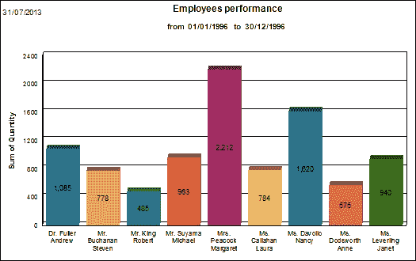

第二份报告将以饼图的形式显示数据，正如我们在以下截图中所见：

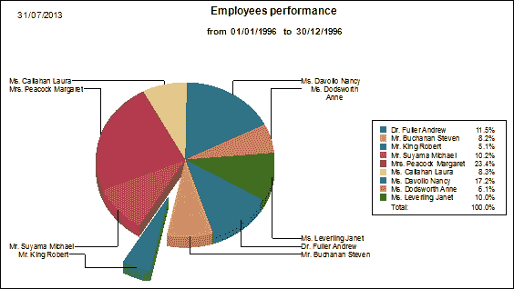

第三份报告将以仪表图的形式显示数据，正如我们在以下截图中所见：

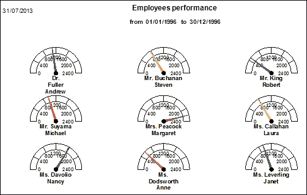

在最终报告中，我们将看到如何在一份报告中显示不同的图表。请参考以下截图：

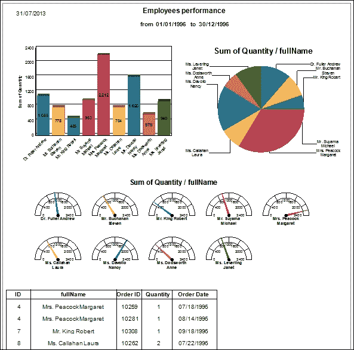

# 创建报告数据源

在本节中，我们将创建我们将用于本章所有报告的数据源。本章的所有报告都显示了员工与订单之间的关系。这些报告显示了每个员工的订单数量。

1.  我们在报告中使用的 SQL 查询如下截图所示：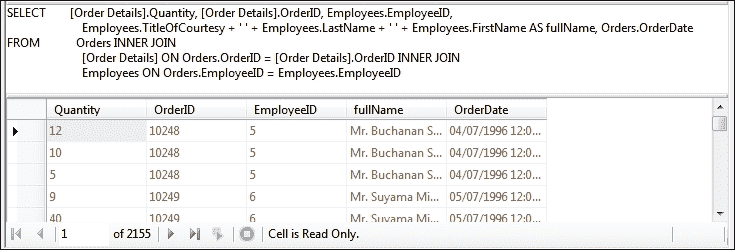

1.  我们将使用之前的 SQL 查询创建一个新的 TableAdapter，并将其命名为`EmployeeOrdersTableAdapter`，如下截图所示：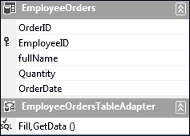

# 创建第一个报告 – 柱形图

让我们开始创建第一个图表报告。我们将从柱形图开始。

1.  向我们的应用程序添加一个新的 Crystal Reports，并将其命名为`crEmpPerBar`。我们将选择**作为一个空白报告**选项，以了解我们如何在报告创建后随时添加或修改我们的图表。

1.  右键点击**字段资源管理器**中的**数据库字段**，并选择**数据库专家**选项。正如以下截图所示，我们将选择我们的 TableAdapter **EmployeeOrders**作为数据源：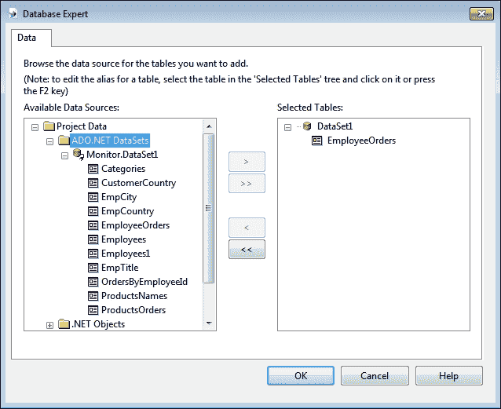

1.  右键点击报告，导航到**插入** | **图表**，并将其拖入**Section1（报告页眉）**。正如以下截图所示，在**类型**选项卡中，我们将选择**柱形图**作为图表类型，并从右窗口出现的下拉菜单中选择**并列柱形图**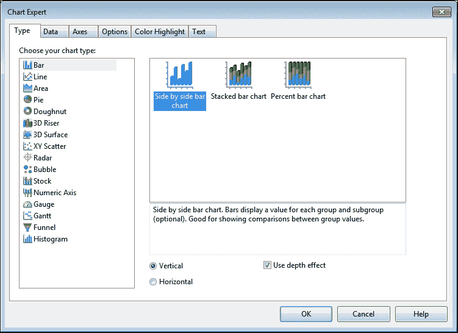

1.  导航到**数据**选项卡，正如以下截图所示：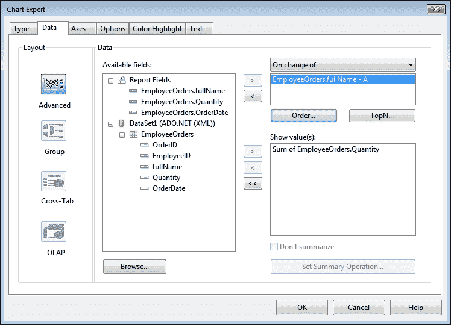

1.  在此步骤中，我们将看到如何以柱状图的形式显示数据。我们需要在 X 轴上显示员工姓名，在 Y 轴上显示订单数量。我们将把**EmployeeOrders.fullName**字段添加到右上角的列表中，以便在 X 轴上显示，并将**EmployeeOrders.Quantity**字段添加到下方的列表中，以便在 Y 轴上显示。我们可以使用**TopN**按钮仅显示特定数量的员工，就像我们在**交叉表**中看到的那样。我们将保持其他选项在其他选项卡中，并点击**确定**按钮。

1.  我们想按日期段过滤订单，因此我们将向报告中添加两个类型为**日期**的过滤器参数。我们将第一个参数命名为`pmFrom`，第二个参数命名为`pmTo`。查看以下截图以了解过滤器代码：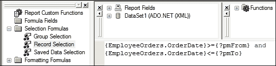

1.  转到主表单，双击**btnBarChart**按钮（**柱状图**）以导航到其背后的代码窗口。为`click`事件编写如图下截图所示的代码：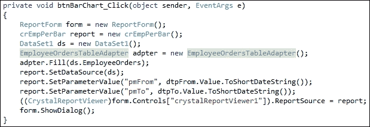

1.  运行应用程序以测试结果。输入如图下截图所示的**从**和**到**日期：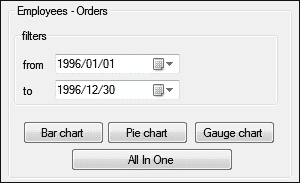

1.  点击**柱状图**按钮，查看如图下截图所示的报告结果：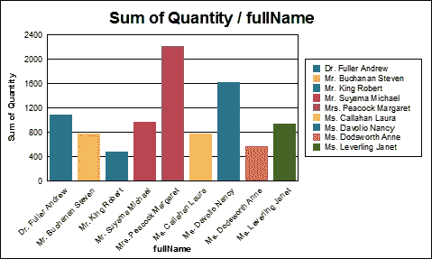

现在，我们将看到如何更新我们的报告以获取我们在本章开头设计的所需报告。

## 移除图例

图例是如图下截图所示出现在右侧的框；默认情况下，它显示在图表旁边。在以下步骤中，我们将看到如何移除它：

1.  右键点击图表，导航到**图表选项** | **常规**。导航到**图例**选项卡，如图下截图所示：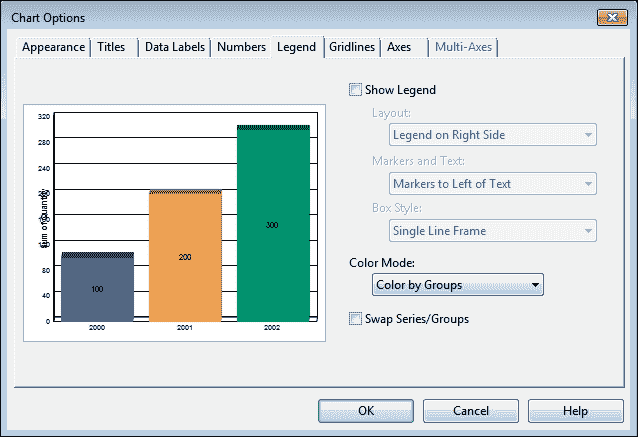

1.  取消选择**显示图例**复选框。对话框有许多可用的选项。尝试更改这些选项并测试结果。点击**确定**按钮。

## 移除图表的标题

在接下来的几个步骤中，我们将看到如何移除或更改默认的图表标题：

1.  右键点击我们的图表，导航到**图表选项** | **标题**，如图下截图所示：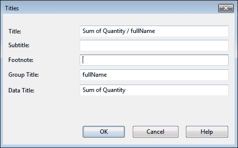

1.  清除**标题**文本框和**分组标题**文本框。点击**确定**按钮。

## 更改图表的外观

Crystal Reports 允许我们修改图表的外观以满足用户需求。在以下步骤中，我们将看到如何实现这一点：

1.  右键点击我们的图表，导航到**图表选项** | **常规**。

1.  导航到**外观**选项卡；更新外观属性，如图下截图所示：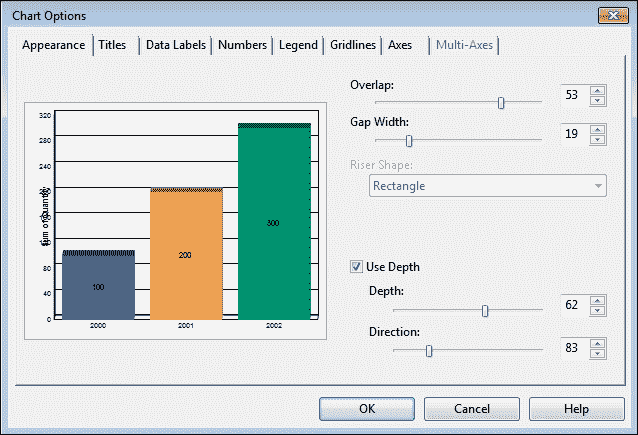

1.  选择**使用深度**复选框。更改**深度**值，如图所示。

1.  调整报告中的图表大小以适应报告宽度。

1.  运行应用程序以测试结果；我们将看到报告与之前设计的相同。

# 创建第二个报告 – 饼图

我们接下来要创建的第二个图表报告是一个饼图。让我们开始工作：

1.  将一个新的 Crystal Reports 添加到我们的应用程序中，命名为`crEmpPerPie`。我们将选择**作为一个空白报告**选项。

1.  右键点击**字段资源管理器**中的**数据库字段**并选择**数据库专家**。我们将选择我们的 TableAdapter **EmployeeOrders**作为数据源。

1.  右键点击报告并导航到**插入** | **图表**，将其拖入**Section1（报告页眉）**。如图所示，在**类型**选项卡中，我们将选择**饼图**作为图表类型：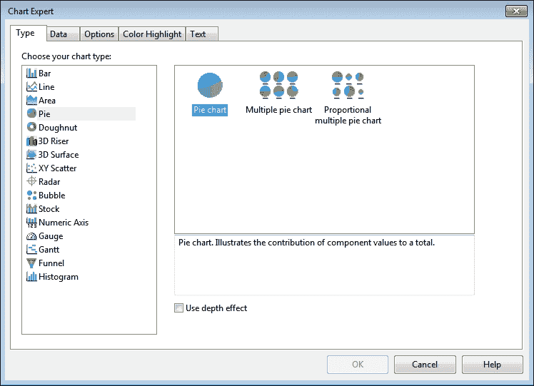

1.  移动到**数据**选项卡并选择数据字段，就像我们在之前的报告中做的那样。点击**确定**按钮。

1.  添加两个**日期**过滤器，就像我们在之前的报告中做的那样。

1.  转到主窗体，双击**btnPieChart**按钮（**饼图**）以导航到其背后的代码窗口。为`click`事件编写如图所示的代码：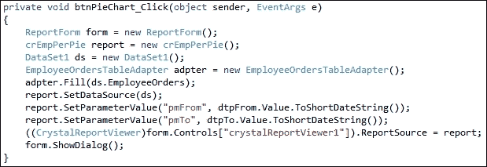

1.  运行应用程序以测试结果。我们将看到如图所示的报告结果：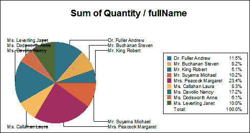

现在我们将看到如何更新我们的报告以满足我们在本章开头设计的所需报告。

## 删除图例

在接下来的几个步骤中，我们将像之前处理条形图那样删除图例：

1.  右键点击我们的图表并导航到**图表选项** | **常规**。

1.  导航到**图例**选项卡。

1.  取消选择**显示图例**复选框。

1.  点击**确定**按钮。

## 删除图表的标题

在接下来的几个步骤中，我们将再次删除图表的标题，就像我们之前处理条形图时做的那样。

1.  右键点击我们的图表并导航到**图表选项** | **标题**。

1.  清除**标题**文本框。

1.  点击**确定**按钮。

## 更改图表的外观

我们将按照之前处理条形图的方式更改图表的外观，执行以下步骤：

1.  右键点击我们的图表并导航到**图表选项** | **常规**。

1.  导航到**外观**选项卡；更新外观属性，如图所示：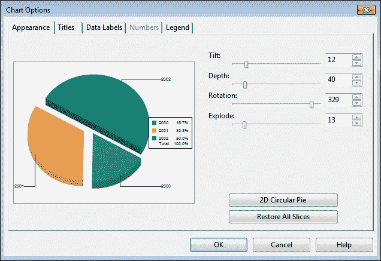

1.  调整报告中的图表大小以适应报告宽度。

# 创建第三个报告 – 仪表图

我们接下来要创建的下一个图表报告是一个仪表图报告。让我们开始：

1.  将一个新的 Crystal Reports 添加到我们的应用程序中，命名为`crEmpPerGauge`。我们将选择**作为一个空白报告**选项。

1.  在**字段资源管理器**中右键单击**数据库字段**，然后导航到**数据库专家**。我们将选择我们的 TableAdapter **EmployeeOrders**作为数据源。

1.  右键单击报告，然后导航到**插入** | **图表**，并将其拖动到**Section1（报告页眉）**。如图所示，在**类型**选项卡中，我们将选择**仪表图**作为图表类型：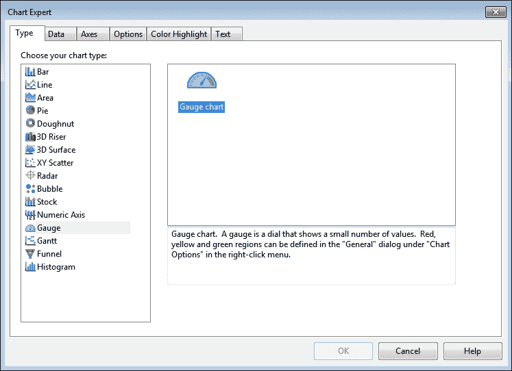

1.  导航到**数据**选项卡，并选择数据字段，就像我们在第一个报告中做的那样。点击**确定**按钮。

1.  添加两个**日期**过滤器，就像我们在第一个报告中做的那样。

1.  前往主表单，双击**btnGaugeChart**按钮（**仪表图**）以导航到其背后的代码窗口。为`click`事件编写如下截图所示的代码：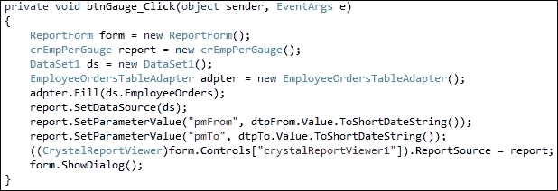

1.  运行应用程序以测试结果。我们将看到如下截图所示的报告结果：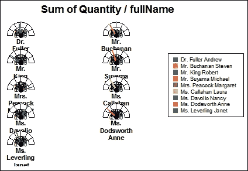

现在，我们将了解如何更新我们的报告以满足我们在本章开头设计的报告。

## 移除图例

在接下来的几个步骤中，我们将像之前处理柱状图那样移除图例：

1.  右键单击我们的图表，然后导航到**图表选项 | 一般**。

1.  导航到**图例**选项卡。

1.  取消选择**显示图例**复选框。

1.  点击**确定**按钮。

## 移除图表的标题

在接下来的几个步骤中，我们将像之前处理柱状图那样移除图表的标题：

1.  右键单击我们的图表，然后导航到**图表选项** | **标题**。

1.  清除**标题**文本框。

1.  点击**确定**按钮。

## 更改图表的外观

我们将通过以下步骤更改图表的外观，就像之前处理柱状图那样：

1.  右键单击我们的图表，然后导航到**图表选项 | 一般**。

1.  导航到**外观**选项卡；更新外观属性，如下截图所示：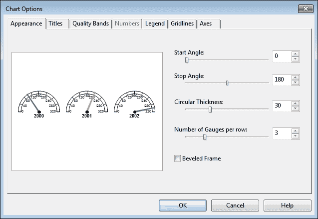

1.  在报告中调整图表大小以适应报告宽度。

# 创建第四个报告 – 一体化

在本报告中，我们在一个报告中使用不同的图表，并使用图表显示数据。

1.  向我们的应用程序添加新的 Crystal Reports，并将其命名为`crEmpAllInOne`。我们将选择**作为一个空白报告**选项。

1.  在**字段资源管理器**中右键单击**数据库字段**并选择**数据库专家**。我们将选择我们的 TableAdapter **EmployeeOrders**作为数据源。

1.  右键单击报告，然后导航到**插入** | **图表**，并将其拖动到**Section1（报告页眉）**。在**类型**选项卡中，我们将选择**柱状图**并调整图表大小以适应报告宽度。

1.  右键单击报告，然后导航到**插入** | **图表**，并将其拖动到**Section1（报告页眉）**。在**类型**选项卡中，我们将选择**饼图**作为图表类型，并将其定位在**柱状图**下方，调整图表大小以适应报告宽度。

1.  右键点击报告，导航到**插入 | 图表**并将它拖入**Section1（报告页眉）**。在**类型**选项卡中，我们将选择**仪表**作为图表类型。在**饼图**下找到它，并调整图表大小以适应报告的宽度。

1.  更新所有三个图表的外观，就像我们之前做的那样。

1.  添加两个**日期**过滤器，就像我们在上一个报告中做的那样。

1.  将报告字段拖放到**详细信息**部分，并按照以下截图所示进行格式化。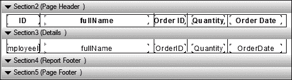

1.  前往主窗体，双击**btnAllInOne**按钮（**全部在一个中**）以进入其背后的代码窗口。为`click`事件编写以下截图所示的代码：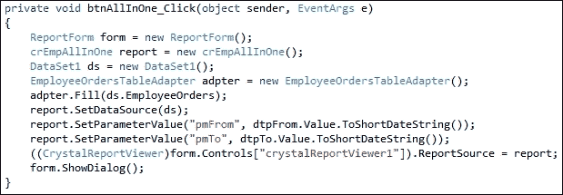

1.  运行应用程序以测试结果。它将与我们之前设计的报告相同。

# 摘要

在本章中，我们学习了如何使用图表构建出色且强大的报告。我们看到了 Crystal Reports 支持许多类型的图表，以及使用这些图表是多么容易。 

这本书的最后一章。我们学习了如何从头到尾创建一个报告应用程序。我试图向读者提供关于 Crystal Reports 等工具的知识，同时也尝试教授他们可能帮助他们快速轻松使用这些工具的技能和技术。我们学习了如何设计应用程序，以及我们可以使用哪些工具来创建我们的应用程序。我们学习了如何安装我们的工具，如何使用每个工具，以及这些工具之间是如何相互通信的。我们学习了 Crystal Reports 工具，如数据库专家、参数、分组、排序、线条和框。我们学习了如何创建不同类型的报告，如表格、交叉表和图表，以及如何在一份报告中混合这些类型。我们学习了如何在 Visual Studio 中显示我们的报告，并使用 C#代码动态传递参数值。
