# 第八章：*第八章*：解决方案架构中的测试

在上一章中，我们学习了如何确保 **ASP.NET** 网络解决方案的安全。我们还强调了保护我们的网络 **应用程序编程接口**（**API**）的一些关键安全建议，以及当在 **Azure** 上托管时的安全最佳实践。

在本章中，我们将熟悉你需要了解的最常见的测试类型及其使用时机。

在本章中，我们将涵盖以下主题：

+   突出关键测试原则

+   了解主要的软件测试类型

+   探索 Azure 中的测试

到本章结束时，你将了解我们可以应用于测试我们的软件解决方案的各种软件测试类型，目的是找到错误并修复它们。我们还将学习如何检查软件是否正常工作以及它是否满足项目早期阶段定义的要求。我们还将探索 **Azure DevOps** 提供的测试机制。

在下一节中，让我们来看看软件测试的关键原则。

# 突出关键测试原则

进行软件测试的主要目标是消除可能的错误，并在许多方面提高软件的整体质量，例如性能、**用户体验**（**UX**）和安全。

但在开始任何测试活动之前，必须有一些指南或原则来确保这些活动的结果与测试的主要目标一致。在本节中，我们将强调我们在软件解决方案中需要考虑的一些关键软件测试原则，如下所述：

+   所有测试用例都应根据客户需求准备；否则，我们将针对错误的要求进行测试。系统中的每个功能或功能都应该使用一个或多个测试用例进行测试。

+   一些类型的软件测试，如 **性能测试** 和 **验收测试**，应由 **领域专家**（**SMEs**）如 **质量保证**（**QA**）工程师或高级开发者执行。

+   计划首先测试基本功能，然后扩展到测试高级功能。

+   建议在项目的早期阶段开始测试，因为在这种情况下，修复缺陷的成本远低于在项目后期阶段进行测试。

+   **缺陷聚类**基于 **帕累托** 原则，该原则指出，80% 的缺陷是由 20% 的系统功能引起的。这意味着在测试过程中，检测到的大量缺陷都与少数功能相关。

+   不建议反复执行相同的测试用例，因为经过一段时间后，我们不会找到任何新的缺陷。最佳实践是调整测试用例，目的是找到新的缺陷。

+   测试是上下文相关的，这意味着我们需要根据我们测试的系统上下文应用特定的方法和技术。例如，测试内容管理系统（**CMS**）与测试 iOS 电子商务应用不同。

让我们开始探索各种测试类型。

# 探索软件测试的主要类型

软件项目失败的主要原因之一是产品质量不足。软件测试是项目生命周期的一个组成部分，有助于确保产品无错误/缺陷，并且同样验证实现的功能以确保它们与客户定义的要求相匹配。软件测试主要有两大类，如下所述：

+   **功能测试**：这是用来验证系统的每个功能和特性，以验证所有功能。

+   **非功能测试**：这是用来验证系统的非功能性方面，如性能、可用性和合规性。

下面是一个展示我们将在本章中讨论的不同类型测试的图表：

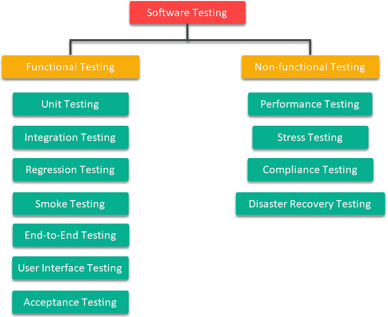

图 8.1：测试类型

我们将在接下来的章节中查看前面图中显示的所有不同类型的测试。

## 单元测试

**单元测试**是一种测试类型，用于测试系统的每个单独的功能或模块。通常，它是由正在开发产品的.NET 开发者执行的，因为它需要一些编码技能。这就是为什么它被认为是一种低级测试类型，因为它只针对代码的行为。

下面是一个展示单元测试级别作为整个测试生命周期组成部分的图表：

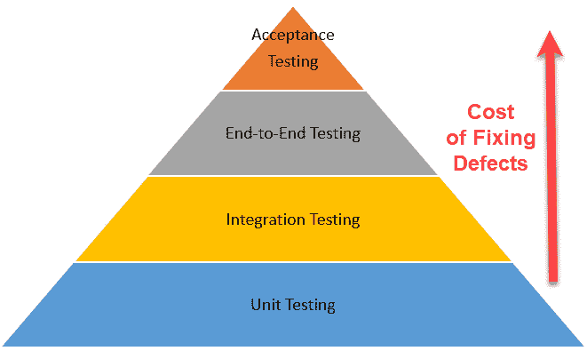

图 8.2：测试生命周期中的单元测试级别

在前面的图中，单元测试代表在开始任何其他测试活动之前应该进行的第一个测试类型，因为随着测试级别的提高，修复缺陷的成本也会增加。

下面是单元测试的一些好处：

+   单元测试使我们能够在开发周期的早期阶段修复缺陷。这将节省在验收测试阶段修复相同缺陷的时间和成本。

+   它有助于记录源代码。

+   它允许开发者重构代码并重用现有函数来消除 API 中的任何重复。

+   如果我们对 API 进行更改，单元测试对于测试依赖项至关重要。

+   它有助于降低代码复杂性。

有关自动化单元测试的更多详细信息，请参阅微软推荐的测试工具列表：[`docs.microsoft.com/en-us/dotnet/core/testing/#testing-tools.`](https://docs.microsoft.com/en-us/dotnet/core/testing/#testing-tools)

)

## 集成测试

**集成测试**旨在测试解决方案中的两个或多个模块，以验证它们是否能够良好地协同工作。例如，它可以涉及测试我们正在构建的系统与**Azure Active Directory**之间的集成行为，以验证认证机制。

这种类型测试的另一个例子是我们需要验证我们的系统与数据库层之间的交互。集成测试应在完成我们正在进行的测试的两个模块的开发后进行。

在以下图中，我们展示了集成测试应仅针对**模块 A**和**模块 B**之间的集成部分：

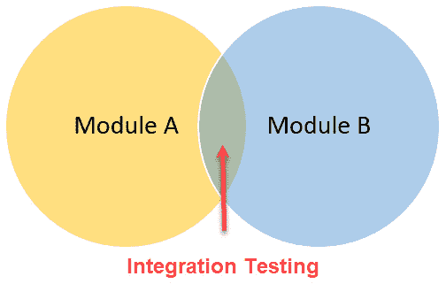

图 8.3：两个模块的集成测试

这里有一些集成测试的好处：

+   集成测试有助于确保集成模块按预期正常工作。

+   它允许模拟系统内各个模块之间的转换。

+   它还有助于检测模块交互中可能出现的错误。

## 回归测试

测试我们对系统进行的任何新更改是很正常的，例如修改现有功能或添加新功能。然而，这还不够，因为在大多数情况下，我们更改或添加的代码将对其他功能产生直接或间接的影响，也许还会影响系统中的其他功能。这就是为什么我们需要进行**回归测试**，以确保新代码没有引起任何新的缺陷。

在以下图中，我们展示了回归测试的三个主要步骤：

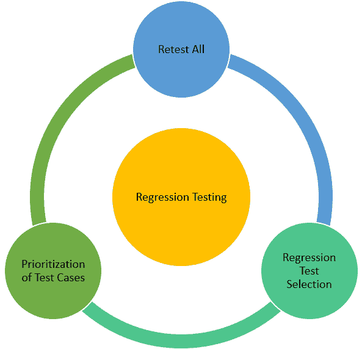

图 8.4：回归测试的主要步骤

这里有一些回归测试的好处：

+   回归测试确保在模块或代码发生更改的情况下，现有功能保持不变。

+   自动回归测试有助于实现**持续集成**（**CI**），这可以节省时间和成本。

+   它允许检测由系统环境变化引起的缺陷。

+   它增加了客户信任和满意度，这可能导致业务扩张。

## 烟雾测试

**烟雾测试**是一种在管道行业中采用的技术，他们通常使用白烟来识别管道中的任何泄漏。

今天，烟雾测试的概念在软件开发中被用来验证构建的基本功能。如果测试失败，构建被认为是不稳定的，系统尚未准备好执行任何其他类型的测试活动。

以下图展示了烟雾测试的主要阶段：

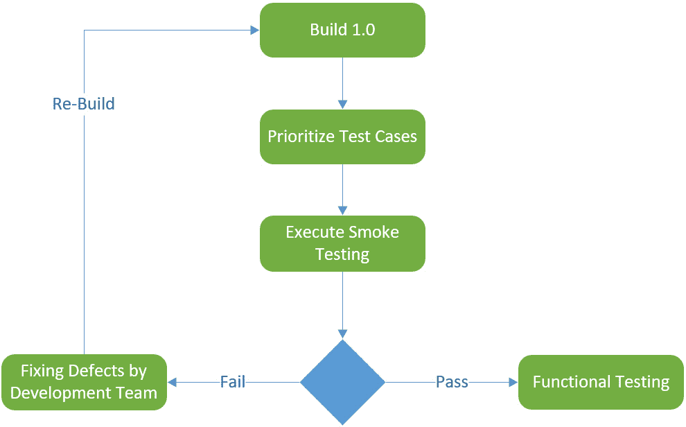

图 8.5：烟雾测试的生命周期

在前面的图中，我们可以看到测试过程是从创建一个带有版本号的新构建开始的。之后，我们需要优先考虑测试用例，并决定要确切测试什么，以便在功能测试之前认证新的构建。如果烟雾测试失败，那么我们需要修复缺陷，并通过创建一个新的构建重新开始。

这里是烟雾测试的一些好处：

+   它有助于在开始任何其他类型的测试之前，在早期阶段检测到阻止问题。

+   它通过检测如果他们想要运行功能测试可能需要更长时间才能检测到的缺陷，从而提高了 QA 团队的效率。

## 端到端测试

**端到端**（**E2E**）**测试**被认为是应用程序的全面测试。通常，测试整个系统的功能很方便；进行此类测试时，重要的是要复制生产环境，并且测试场景应该模仿用户行为。此类测试的主要目标是确保不同的用户流程在没有错误且符合要求的情况下正常工作。

在下面的图中，我们展示了端到端测试过程的三个主要步骤：

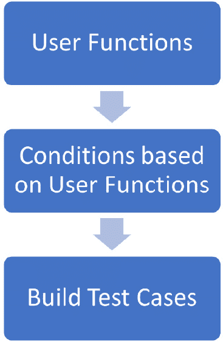

图 8.6：端到端测试的三个主要步骤

在前面的图中，用户功能代表在系统特定功能中执行的操作，条件代表可以应用于每个用户功能的各种输入数据和序列。至于测试用例，这些是基于前两个动作创建的——即用户功能以及条件。

这里是端到端测试的一些主要好处：

+   它有助于确保系统的完全就绪和健康。

+   它允许我们从用户的角度全面测试整个系统。

+   它有助于测试最终用户可以应用的现实场景。

## 用户界面测试

术语**用户界面**（**UI**）本身就说明了问题。**UI 测试**是为了测试应用程序的**图形用户界面**（**GUI**），目的是确保应用程序的 UI 按照要求开发，并且用户友好。

在下面的图中，我们可以看到业务层和数据层可以通过单元测试进行测试。至于 UI，唯一的测试方式是通过 UI 测试：

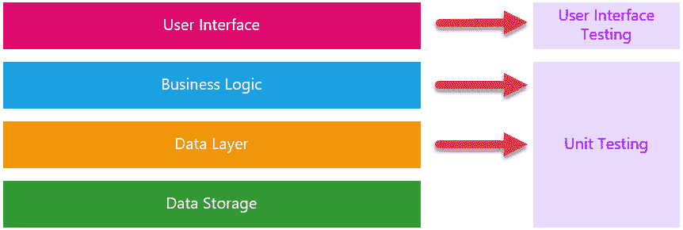

图 8.7：UI 测试

这里是 UI 测试的一些主要好处：

+   它有助于检查 UI 元素的排列，以及检查字体样式、颜色和显示文本的清晰度。

+   它允许我们检查产品是否在所有应支持的所有设备和屏幕上正确渲染。

+   它有助于检查错误信息和警告信息。

## 接受测试

**验收测试**（也称为**用户验收测试**，或**UAT**）被认为是测试的最后阶段，通常由客户的关键用户执行，以验证所有业务需求都已开发，并且系统按预期正常高效地运行。通常，验收测试是基于在项目分析阶段准备的用户案例生成的测试用例进行的。

在下面的图中，我们展示了 UAT 是迁移到生产环境前的最后一个测试阶段：

图 8.8：项目生命周期中的 UAT

下面是 UAT 的一些好处：

+   它有助于验证在项目开始时定义的所有业务需求都正确实施且运行正常，没有任何错误。

+   它允许在开发过程中而不是在生产环境中修复检测到的缺陷，这成本较低，尤其是在在线支付解决方案的情况下。

+   它有助于在上线阶段之前增加用户对新系统的信任。

## 性能测试

**性能测试**是一种非功能性测试，通常用于检查系统是否按照客户定义的性能要求和标准正常工作。

在执行性能测试时，考虑以下四个主要元素：

+   **瓶颈**是导致系统崩溃的主要问题。

+   加载页面或表单所需的**加载时间**。

+   触发动作或完成流程所需的**响应时间**。

+   **可扩展性**是指系统在不崩溃的情况下处理大量请求的能力。

以下图显示了执行性能测试的四个主要元素：

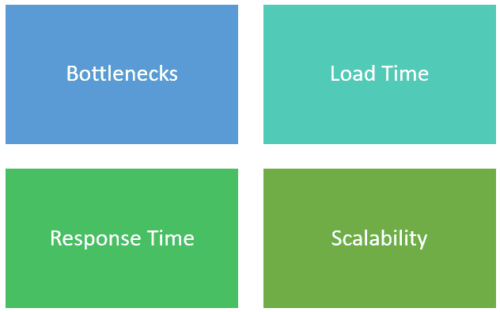

图 8.9：性能测试元素

下面是性能测试的一些好处：

+   它有助于衡量系统的响应时间、准确性和稳定性。

+   它允许检测到减少应用程序响应时间或整体硬件使用率的问题。

+   它有助于提高页面加载时间，并增加用户满意度。

## 压力测试

**压力测试**是一种非功能性测试，用于验证系统的稳定性和可靠性。压力测试的主要目标是测量系统在超出正常操作情况下的极端高负载请求下的强度和错误处理能力。其目的是了解系统在这种高负载下的行为。

以下图描述了压力测试的步骤：

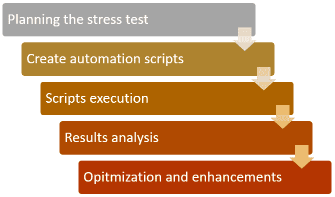

图 8.10：压力测试主要步骤

初始阶段，压力测试过程从规划和决定测试用例开始。之后，我们应该创建脚本并在自动化过程中执行它们。应仔细分析压力测试的结果，以确定任何问题的根本原因。最后，我们需要通过优化代码来修复问题，然后重新运行整个压力测试过程，直到我们得到一个稳定的构建。

这里有一些压力测试的好处：

+   这允许我们检查和处理可能出现的错误消息。

+   在任何由大量请求引起的故障发生之前，这有助于检查数据是否正确保存。

## 合规性测试

**合规性测试**（也称为**一致性测试**）是一种审计测试技术，通常在决定系统是否准备好发布之前执行，以验证产品是否满足一系列外部和内部标准。

内部标准通常由组织设定。例如，一个网站应该为各种设备和屏幕设计，因此它应该提供响应式用户界面。

至于外部标准，这些是由全球联盟或专注于此类测试的第三方组织设定的规定。外部标准的一个例子是**通用数据保护条例**（**GDPR**）或**网络内容可访问性指南**（**WCAG**）。

下图显示了合规性测试通常评估的主要系统属性：

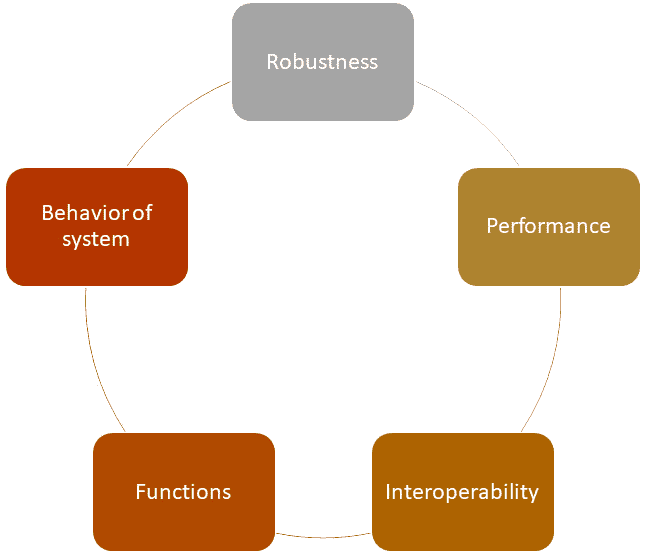

图 8.11：合规性测试评估的系统属性

如前图所示，每个属性都对系统的整体合规性做出了贡献。因此，让我们了解以下每个属性：

+   **鲁棒性**：这显示了系统在受到干扰时正常工作的能力。

+   **性能**：这代表系统完成单个任务所需的时间。合规性测试应衡量系统主要功能的表现，并基于预定义的测试标准证明它们表现良好。

+   **互操作性**：这显示了系统与其他第三方系统交换信息的能力。此外，它还显示了系统中的不同功能如何相互作用以完成一个过程。

+   **功能**：这评估了系统提供的接口和功能，并确认项目早期阶段定义的要求是否得到满足。

+   **系统行为**：这评估了系统与其托管环境的行为。它还评估了系统在执行之前定义的每个用户故事之后的行为。

## 灾难恢复测试

对于企业解决方案和关键任务系统，应考虑**灾难恢复计划**（DRP）。它包括一系列详细的指南和策略，应实施以处理可能干扰系统正常运行的意外事件。一个好的 DRP 应使我们能够快速从网络攻击、停电、硬件故障或其他任何事件中恢复过来。它应确保业务流程的连续性，并尽可能减少损害。

DR 测试是通过评估过程中的每个步骤来验证 DRP 的过程，以确保在发生事件时能够按预期工作。

到目前为止，我们已经探讨了主要的测试类型和技术，例如单元测试、冒烟测试、性能测试和验收测试。了解每种测试类型及其何时使用对于交付高质量的软件产品至关重要。我们应该确保产品符合标准和要求，从编码到产品整体的企业功能。在功能测试和非功能测试之间应用不同的测试类型将提高质量，以实现卓越的结果。

在下一节中，我们将探讨 Azure 中测试计划的功能。

# 探索 Azure 中的测试

手动测试可以是提供出色 UX 和在生产前验证产品的一个关键测试技术。**Azure 测试计划**与**Visual Studio 2019**一起提供了我们管理测试工作所需的功能，从手动和探索性测试到负载和压力测试。

起始点是创建一个由配置、测试套件和测试用例组成的测试计划，这些测试用例可以分解为共享的测试步骤，并使用允许我们重复测试但使用不同输入数据的参数。

使用以下链接登录 Azure DevOps：[`azure.microsoft.com/en-us/services/devops/`](https://azure.microsoft.com/en-us/services/devops/)。

登录成功后，你可以在左侧菜单中看到**测试计划**，如下面的截图所示：

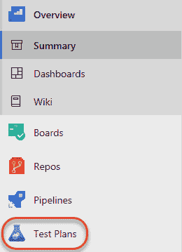

图 8.12：Azure DevOps 中的测试计划

创建测试计划后，我们需要设置测试的配置，例如，如果我们正在测试 Web 应用程序，我们可以指定操作系统和浏览器配置。测试配置可以分配给整个测试计划或单个测试套件，甚至测试用例。如果我们将配置分配给测试计划，这将确保所有创建的测试用例都自动分配到这些配置。

当你点击**测试计划**时，将打开一个滑动子菜单，显示更多功能，例如我们可以创建新的测试计划、设置参数和修改配置，如下面的截图所示：

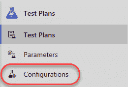

图 8.13：测试计划下的配置

在设置测试配置后，我们现在可以开始创建测试套件，即测试用例的集合。

有三种不同类型的测试套件，如下所述：

+   **静态测试套件**：这是一个逻辑容器，我们可以添加任何我们喜欢的测试用例。

+   **基于需求的测试套件**：这是我们将测试用例关联到工作项以定义其验收标准的地方。

+   **基于查询的测试套件**：这是我们创建工作项查询以选择要包含哪些测试用例的地方。任何符合查询标准的测试用例都将自动添加到测试套件中。

在我们定义测试套件后，我们需要开始创建测试用例并将其分配给测试团队。创建测试用例是一个非常直接的过程。主要元素是在任何预期结果中执行的步骤。经常重复的步骤可以提取为共享步骤以简化测试维护。在准备测试用例后，我们就可以开始手动进行测试运行了。请注意，从**运行**页面，我们可以查看所有之前的测试运行及其结果。

到目前为止，我们已经学习了在 Azure 中进行手动测试的相关知识，它有其优势。但是，当我们开发更多功能并且源代码的规模增长时，手动测试所有功能可能会变得重复且耗时。因此，Azure 为我们提供了一个机制来自动化我们的测试，以消除手动测试的负担，并允许质量保证工程师专注于提供更好的质量和改进的**用户体验**（**UX**）。

使用 Azure DevOps，我们可以通过 Azure 管道来自动化从 Azure 测试计划中的测试。我们可以使用 Azure 管道自动化许多类型的测试，例如单元测试、安全测试和代码覆盖率测试，该测试计算单元测试覆盖的代码百分比。

在使用 Azure 测试计划进行测试时，以下是一些关键建议：

+   确保测试是有目的的，并对产品有积极的影响，并尽量不为了测试而测试。

+   保持测试简单、专注且简短。测试应该快速运行，尤其是如果它们是在产品的构建或发布上触发的。

# 摘要

在本章中，我们探讨了概述进行适当测试所需的基本指南的一些关键原则。我们还了解了作为解决方案架构师我们必须知道的必要测试类型。了解每种测试类型将帮助我们决定应该应用哪些功能和非功能测试，以确保高质量的软件产品并交付满足要求的产品。在本章的最后部分，我们探讨了 Azure DevOps 中测试计划的功能以及关键优势。

在下一章中，我们将深入探讨使用 **ASP.NET Core** 和 **Microsoft Azure** 架构现代网络应用程序。
